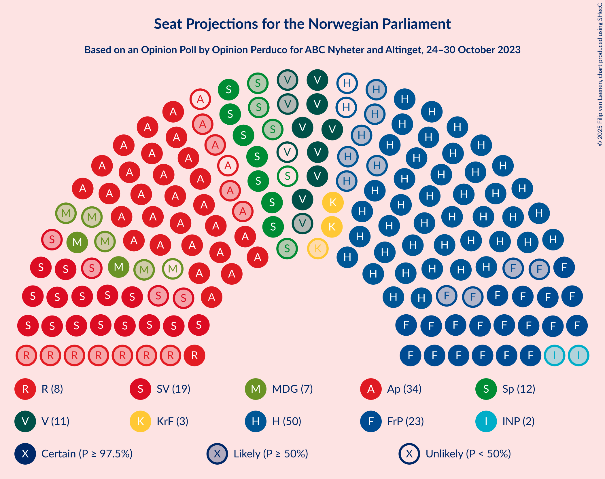
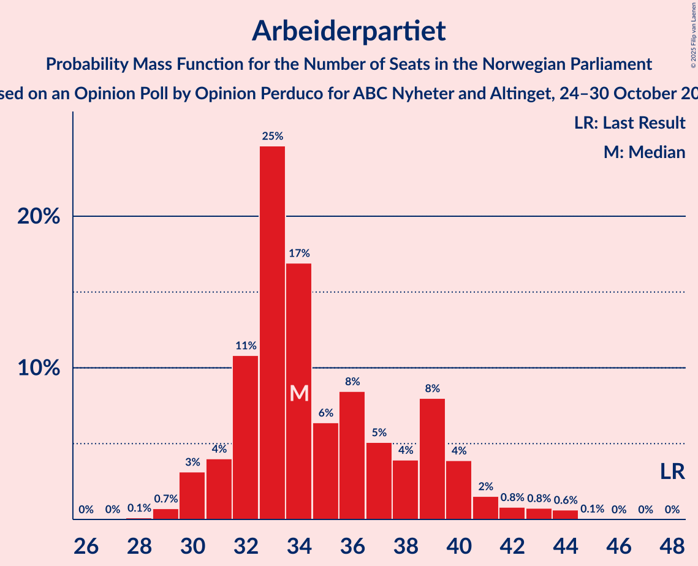

# Opinion Poll by Opinion Perduco for ABC Nyheter and Altinget, 24–30 October 2023

<a href="#voting-intentions">Voting Intentions</a> | <a href="#seats">Seats</a> | <a href="#coalitions">Coalitions</a> | <a href="#technical-information">Technical Information</a>

## Voting Intentions

### Confidence Intervals

| Party | Last Result | Poll Result | 80% Confidence Interval | 90% Confidence Interval | 95% Confidence Interval | 99% Confidence Interval |
|:-----:|:-----------:|:-----------:|:-----------------------:|:-----------------------:|:-----------------------:|:-----------------------:|
| Høyre | 20.4% | 26.3% | 24.3–28.5% |23.7–29.1% |23.2–29.6% |22.3–30.7% |
| Arbeiderpartiet | 26.2% | 17.9% | 16.2–19.9% |15.7–20.4% |15.3–20.9% |14.5–21.9% |
| Fremskrittspartiet | 11.6% | 13.3% | 11.8–15.0% |11.4–15.5% |11.0–16.0% |10.3–16.8% |
| Sosialistisk Venstreparti | 7.6% | 11.0% | 9.6–12.6% |9.2–13.0% |8.9–13.4% |8.3–14.3% |
| Senterpartiet | 13.5% | 5.9% | 4.9–7.2% |4.6–7.5% |4.4–7.8% |4.0–8.5% |
| Venstre | 4.6% | 5.8% | 4.8–7.0% |4.5–7.4% |4.3–7.7% |3.9–8.3% |
| Rødt | 4.7% | 4.9% | 4.0–6.1% |3.8–6.5% |3.6–6.8% |3.2–7.4% |
| Miljøpartiet De Grønne | 3.9% | 4.4% | 3.6–5.5% |3.3–5.8% |3.1–6.1% |2.8–6.7% |
| Kristelig Folkeparti | 3.8% | 3.8% | 3.1–4.9% |2.9–5.2% |2.7–5.5% |2.3–6.1% |
| Industri- og Næringspartiet | 0.3% | 3.7% | 2.9–4.8% |2.7–5.1% |2.5–5.3% |2.2–5.9% |

*Note:* The poll result column reflects the actual value used in the calculations. Published results may vary slightly, and in addition be rounded to fewer digits.

## Seats

### Confidence Intervals

| Party | Last Result | Median | 80% Confidence Interval | 90% Confidence Interval | 95% Confidence Interval | 99% Confidence Interval |
|:-----:|:-----------:|:------:|:-----------------------:|:-----------------------:|:-----------------------:|:-----------------------:|
| <a href="#høyre">Høyre</a> | 36 | 48 | 42–51 |41–54 |40–54 |39–55 |
| <a href="#arbeiderpartiet">Arbeiderpartiet</a> | 48 | 34 | 32–39 |31–40 |30–41 |29–44 |
| <a href="#fremskrittspartiet">Fremskrittspartiet</a> | 21 | 23 | 21–27 |20–29 |19–31 |18–34 |
| <a href="#sosialistisk-venstreparti">Sosialistisk Venstreparti</a> | 13 | 19 | 16–22 |15–23 |15–23 |13–27 |
| <a href="#senterpartiet">Senterpartiet</a> | 28 | 11 | 8–13 |7–14 |7–14 |2–16 |
| <a href="#venstre">Venstre</a> | 8 | 10 | 8–12 |7–13 |7–14 |3–15 |
| <a href="#rødt">Rødt</a> | 8 | 8 | 1–10 |1–11 |1–11 |1–13 |
| <a href="#miljøpartiet-de-grønne">Miljøpartiet De Grønne</a> | 3 | 7 | 2–9 |2–10 |2–10 |1–11 |
| <a href="#kristelig-folkeparti">Kristelig Folkeparti</a> | 3 | 3 | 2–8 |2–8 |2–9 |1–10 |
| <a href="#industri--og-næringspartiet">Industri- og Næringspartiet</a> | 0 | 2 | 2–8 |1–9 |0–9 |0–10 |

### Høyre

*For a full overview of the results for this party, see the [Høyre](party-høyre.html) page.*

| Number of Seats | Probability | Accumulated | Special Marks |
|:---------------:|:-----------:|:-----------:|:-------------:|
| 36 | 0% | 100% | Last Result |
| 37 | 0% | 100% |  |
| 38 | 0.2% | 100% |  |
| 39 | 1.1% | 99.8% |  |
| 40 | 2% | 98.7% |  |
| 41 | 3% | 96% |  |
| 42 | 8% | 94% |  |
| 43 | 4% | 85% |  |
| 44 | 7% | 81% |  |
| 45 | 8% | 74% |  |
| 46 | 8% | 66% |  |
| 47 | 7% | 57% |  |
| 48 | 9% | 51% | Median |
| 49 | 11% | 41% |  |
| 50 | 17% | 30% |  |
| 51 | 4% | 13% |  |
| 52 | 3% | 10% |  |
| 53 | 2% | 7% |  |
| 54 | 4% | 5% |  |
| 55 | 0.5% | 0.9% |  |
| 56 | 0.1% | 0.4% |  |
| 57 | 0.2% | 0.4% |  |
| 58 | 0% | 0.2% |  |
| 59 | 0.1% | 0.1% |  |
| 60 | 0% | 0% |  |

### Arbeiderpartiet

*For a full overview of the results for this party, see the [Arbeiderpartiet](party-arbeiderpartiet.html) page.*

| Number of Seats | Probability | Accumulated | Special Marks |
|:---------------:|:-----------:|:-----------:|:-------------:|
| 28 | 0.1% | 100% |  |
| 29 | 0.7% | 99.8% |  |
| 30 | 3% | 99.1% |  |
| 31 | 4% | 96% |  |
| 32 | 11% | 92% |  |
| 33 | 25% | 81% |  |
| 34 | 17% | 56% | Median |
| 35 | 6% | 40% |  |
| 36 | 8% | 33% |  |
| 37 | 5% | 25% |  |
| 38 | 4% | 20% |  |
| 39 | 8% | 16% |  |
| 40 | 4% | 8% |  |
| 41 | 2% | 4% |  |
| 42 | 0.8% | 2% |  |
| 43 | 0.8% | 1.5% |  |
| 44 | 0.6% | 0.7% |  |
| 45 | 0.1% | 0.1% |  |
| 46 | 0% | 0% |  |
| 47 | 0% | 0% |  |
| 48 | 0% | 0% | Last Result |

### Fremskrittspartiet

*For a full overview of the results for this party, see the [Fremskrittspartiet](party-fremskrittspartiet.html) page.*

| Number of Seats | Probability | Accumulated | Special Marks |
|:---------------:|:-----------:|:-----------:|:-------------:|
| 17 | 0.1% | 100% |  |
| 18 | 1.4% | 99.9% |  |
| 19 | 2% | 98.5% |  |
| 20 | 6% | 97% |  |
| 21 | 15% | 91% | Last Result |
| 22 | 24% | 76% |  |
| 23 | 14% | 52% | Median |
| 24 | 12% | 38% |  |
| 25 | 8% | 26% |  |
| 26 | 5% | 18% |  |
| 27 | 4% | 13% |  |
| 28 | 3% | 9% |  |
| 29 | 2% | 6% |  |
| 30 | 2% | 4% |  |
| 31 | 1.4% | 3% |  |
| 32 | 0.5% | 1.4% |  |
| 33 | 0.3% | 0.8% |  |
| 34 | 0.4% | 0.6% |  |
| 35 | 0.1% | 0.2% |  |
| 36 | 0.1% | 0.1% |  |
| 37 | 0% | 0% |  |

### Sosialistisk Venstreparti

*For a full overview of the results for this party, see the [Sosialistisk Venstreparti](party-sosialistiskvenstreparti.html) page.*

| Number of Seats | Probability | Accumulated | Special Marks |
|:---------------:|:-----------:|:-----------:|:-------------:|
| 11 | 0.1% | 100% |  |
| 12 | 0.2% | 99.9% |  |
| 13 | 0.8% | 99.7% | Last Result |
| 14 | 0.8% | 98.9% |  |
| 15 | 6% | 98% |  |
| 16 | 12% | 92% |  |
| 17 | 7% | 80% |  |
| 18 | 13% | 73% |  |
| 19 | 24% | 60% | Median |
| 20 | 15% | 36% |  |
| 21 | 9% | 21% |  |
| 22 | 7% | 12% |  |
| 23 | 3% | 5% |  |
| 24 | 0.8% | 2% |  |
| 25 | 0.6% | 1.3% |  |
| 26 | 0.1% | 0.7% |  |
| 27 | 0.4% | 0.5% |  |
| 28 | 0.1% | 0.1% |  |
| 29 | 0% | 0% |  |

### Senterpartiet

*For a full overview of the results for this party, see the [Senterpartiet](party-senterpartiet.html) page.*

| Number of Seats | Probability | Accumulated | Special Marks |
|:---------------:|:-----------:|:-----------:|:-------------:|
| 1 | 0.3% | 100% |  |
| 2 | 0.2% | 99.7% |  |
| 3 | 0% | 99.5% |  |
| 4 | 0% | 99.5% |  |
| 5 | 0% | 99.5% |  |
| 6 | 0.7% | 99.5% |  |
| 7 | 7% | 98.7% |  |
| 8 | 7% | 92% |  |
| 9 | 14% | 85% |  |
| 10 | 13% | 72% |  |
| 11 | 12% | 58% | Median |
| 12 | 24% | 46% |  |
| 13 | 15% | 22% |  |
| 14 | 5% | 7% |  |
| 15 | 1.3% | 2% |  |
| 16 | 0.6% | 0.7% |  |
| 17 | 0.1% | 0.1% |  |
| 18 | 0% | 0% |  |
| 19 | 0% | 0% |  |
| 20 | 0% | 0% |  |
| 21 | 0% | 0% |  |
| 22 | 0% | 0% |  |
| 23 | 0% | 0% |  |
| 24 | 0% | 0% |  |
| 25 | 0% | 0% |  |
| 26 | 0% | 0% |  |
| 27 | 0% | 0% |  |
| 28 | 0% | 0% | Last Result |

### Venstre

*For a full overview of the results for this party, see the [Venstre](party-venstre.html) page.*

| Number of Seats | Probability | Accumulated | Special Marks |
|:---------------:|:-----------:|:-----------:|:-------------:|
| 2 | 0.2% | 100% |  |
| 3 | 0.9% | 99.8% |  |
| 4 | 0% | 98.9% |  |
| 5 | 0% | 98.9% |  |
| 6 | 0.6% | 98.9% |  |
| 7 | 5% | 98% |  |
| 8 | 15% | 94% | Last Result |
| 9 | 20% | 79% |  |
| 10 | 16% | 59% | Median |
| 11 | 25% | 43% |  |
| 12 | 10% | 18% |  |
| 13 | 4% | 8% |  |
| 14 | 3% | 4% |  |
| 15 | 0.7% | 0.8% |  |
| 16 | 0.1% | 0.1% |  |
| 17 | 0% | 0% |  |

### Rødt

*For a full overview of the results for this party, see the [Rødt](party-rødt.html) page.*

| Number of Seats | Probability | Accumulated | Special Marks |
|:---------------:|:-----------:|:-----------:|:-------------:|
| 1 | 14% | 100% |  |
| 2 | 0.1% | 86% |  |
| 3 | 0% | 86% |  |
| 4 | 0% | 86% |  |
| 5 | 0% | 86% |  |
| 6 | 2% | 86% |  |
| 7 | 14% | 84% |  |
| 8 | 25% | 71% | Last Result, Median |
| 9 | 31% | 46% |  |
| 10 | 10% | 15% |  |
| 11 | 4% | 5% |  |
| 12 | 1.0% | 2% |  |
| 13 | 0.6% | 0.6% |  |
| 14 | 0% | 0.1% |  |
| 15 | 0% | 0% |  |

### Miljøpartiet De Grønne

*For a full overview of the results for this party, see the [Miljøpartiet De Grønne](party-miljøpartietdegrønne.html) page.*

| Number of Seats | Probability | Accumulated | Special Marks |
|:---------------:|:-----------:|:-----------:|:-------------:|
| 1 | 0.9% | 100% |  |
| 2 | 11% | 99.1% |  |
| 3 | 11% | 88% | Last Result |
| 4 | 0% | 77% |  |
| 5 | 0% | 77% |  |
| 6 | 8% | 77% |  |
| 7 | 26% | 68% | Median |
| 8 | 26% | 43% |  |
| 9 | 10% | 17% |  |
| 10 | 5% | 7% |  |
| 11 | 2% | 2% |  |
| 12 | 0.2% | 0.2% |  |
| 13 | 0% | 0% |  |

### Kristelig Folkeparti

*For a full overview of the results for this party, see the [Kristelig Folkeparti](party-kristeligfolkeparti.html) page.*

| Number of Seats | Probability | Accumulated | Special Marks |
|:---------------:|:-----------:|:-----------:|:-------------:|
| 0 | 0.2% | 100% |  |
| 1 | 0.5% | 99.8% |  |
| 2 | 33% | 99.3% |  |
| 3 | 26% | 66% | Last Result, Median |
| 4 | 0% | 40% |  |
| 5 | 0% | 40% |  |
| 6 | 5% | 40% |  |
| 7 | 14% | 36% |  |
| 8 | 17% | 21% |  |
| 9 | 4% | 4% |  |
| 10 | 0.7% | 0.9% |  |
| 11 | 0.1% | 0.2% |  |
| 12 | 0% | 0% |  |

### Industri- og Næringspartiet

*For a full overview of the results for this party, see the [Industri- og Næringspartiet](party-industri-ognæringspartiet.html) page.*

| Number of Seats | Probability | Accumulated | Special Marks |
|:---------------:|:-----------:|:-----------:|:-------------:|
| 0 | 3% | 100% | Last Result |
| 1 | 3% | 97% |  |
| 2 | 45% | 95% | Median |
| 3 | 15% | 50% |  |
| 4 | 0% | 34% |  |
| 5 | 0% | 34% |  |
| 6 | 6% | 34% |  |
| 7 | 15% | 28% |  |
| 8 | 7% | 13% |  |
| 9 | 5% | 6% |  |
| 10 | 1.3% | 2% |  |
| 11 | 0.3% | 0.3% |  |
| 12 | 0% | 0% |  |

## Coalitions

### Confidence Intervals

| Coalition | Last Result | Median | Majority? | 80% Confidence Interval | 90% Confidence Interval | 95% Confidence Interval | 99% Confidence Interval |
|:---------:|:-----------:|:------:|:---------:|:-----------------------:|:-----------------------:|:-----------------------:|:-----------------------:|
| Høyre – Fremskrittspartiet – Senterpartiet – Venstre – Kristelig Folkeparti | 96 | 96 | 99.6% | 89–101 | 88–104 | 87–106 | 85–110 |
| Høyre – Fremskrittspartiet – Venstre – Miljøpartiet De Grønne – Kristelig Folkeparti | 71 | 91 | 94% | 86–98 | 84–100 | 81–102 | 81–103 |
| Høyre – Fremskrittspartiet – Venstre – Kristelig Folkeparti | 68 | 85 | 57% | 79–91 | 77–93 | 76–95 | 74–97 |
| Høyre – Fremskrittspartiet – Venstre | 65 | 80 | 15% | 74–87 | 74–88 | 72–89 | 70–93 |
| Arbeiderpartiet – Sosialistisk Venstreparti – Senterpartiet – Rødt – Miljøpartiet De Grønne | 100 | 79 | 11% | 72–85 | 71–87 | 69–88 | 67–89 |
| Arbeiderpartiet – Sosialistisk Venstreparti – Senterpartiet – Miljøpartiet De Grønne – Kristelig Folkeparti | 95 | 75 | 2% | 70–81 | 68–82 | 67–84 | 64–87 |
| Arbeiderpartiet – Sosialistisk Venstreparti – Senterpartiet – Rødt | 97 | 73 | 0.1% | 66–77 | 64–79 | 64–80 | 61–82 |
| Arbeiderpartiet – Sosialistisk Venstreparti – Senterpartiet – Miljøpartiet De Grønne | 92 | 71 | 0.1% | 65–77 | 65–78 | 63–79 | 59–82 |
| Høyre – Fremskrittspartiet | 57 | 71 | 0.1% | 66–76 | 64–77 | 63–79 | 61–82 |
| Arbeiderpartiet – Sosialistisk Venstreparti – Rødt – Miljøpartiet De Grønne | 72 | 68 | 0% | 62–73 | 60–75 | 59–77 | 56–79 |
| Arbeiderpartiet – Sosialistisk Venstreparti – Senterpartiet | 89 | 64 | 0% | 60–69 | 59–70 | 57–72 | 54–76 |
| Høyre – Venstre – Kristelig Folkeparti | 47 | 62 | 0% | 55–67 | 53–68 | 53–69 | 50–72 |
| Arbeiderpartiet – Senterpartiet – Miljøpartiet De Grønne – Kristelig Folkeparti | 82 | 56 | 0% | 51–63 | 49–64 | 47–65 | 45–67 |
| Arbeiderpartiet – Sosialistisk Venstreparti | 61 | 53 | 0% | 50–58 | 49–60 | 48–62 | 46–63 |
| Arbeiderpartiet – Senterpartiet – Kristelig Folkeparti | 79 | 50 | 0% | 45–56 | 44–56 | 43–58 | 41–61 |
| Arbeiderpartiet – Senterpartiet | 76 | 45 | 0% | 41–50 | 39–51 | 39–53 | 37–55 |
| Senterpartiet – Venstre – Kristelig Folkeparti | 39 | 26 | 0% | 20–30 | 20–32 | 19–32 | 16–35 |

### Høyre – Fremskrittspartiet – Senterpartiet – Venstre – Kristelig Folkeparti

| Number of Seats | Probability | Accumulated | Special Marks |
|:---------------:|:-----------:|:-----------:|:-------------:|
| 81 | 0% | 100% |  |
| 82 | 0% | 99.9% |  |
| 83 | 0.2% | 99.9% |  |
| 84 | 0.1% | 99.7% |  |
| 85 | 0.3% | 99.6% | Majority |
| 86 | 0.7% | 99.3% |  |
| 87 | 2% | 98.7% |  |
| 88 | 4% | 97% |  |
| 89 | 4% | 93% |  |
| 90 | 5% | 89% |  |
| 91 | 6% | 84% |  |
| 92 | 7% | 78% |  |
| 93 | 6% | 71% |  |
| 94 | 5% | 65% |  |
| 95 | 6% | 59% | Median |
| 96 | 7% | 53% | Last Result |
| 97 | 4% | 46% |  |
| 98 | 15% | 42% |  |
| 99 | 5% | 27% |  |
| 100 | 7% | 22% |  |
| 101 | 5% | 15% |  |
| 102 | 2% | 10% |  |
| 103 | 2% | 7% |  |
| 104 | 0.3% | 5% |  |
| 105 | 0.7% | 5% |  |
| 106 | 2% | 4% |  |
| 107 | 1.0% | 2% |  |
| 108 | 0.5% | 1.3% |  |
| 109 | 0.1% | 0.8% |  |
| 110 | 0.7% | 0.7% |  |
| 111 | 0% | 0% |  |

### Høyre – Fremskrittspartiet – Venstre – Miljøpartiet De Grønne – Kristelig Folkeparti

| Number of Seats | Probability | Accumulated | Special Marks |
|:---------------:|:-----------:|:-----------:|:-------------:|
| 71 | 0% | 100% | Last Result |
| 72 | 0% | 100% |  |
| 73 | 0% | 100% |  |
| 74 | 0% | 100% |  |
| 75 | 0% | 100% |  |
| 76 | 0% | 100% |  |
| 77 | 0% | 100% |  |
| 78 | 0% | 99.9% |  |
| 79 | 0.1% | 99.9% |  |
| 80 | 0.1% | 99.8% |  |
| 81 | 3% | 99.7% |  |
| 82 | 0.5% | 97% |  |
| 83 | 1.2% | 97% |  |
| 84 | 2% | 95% |  |
| 85 | 4% | 94% | Majority |
| 86 | 3% | 90% |  |
| 87 | 6% | 87% |  |
| 88 | 7% | 81% |  |
| 89 | 7% | 74% |  |
| 90 | 10% | 67% |  |
| 91 | 8% | 58% | Median |
| 92 | 4% | 49% |  |
| 93 | 18% | 45% |  |
| 94 | 5% | 27% |  |
| 95 | 4% | 21% |  |
| 96 | 4% | 17% |  |
| 97 | 3% | 14% |  |
| 98 | 3% | 11% |  |
| 99 | 2% | 8% |  |
| 100 | 2% | 6% |  |
| 101 | 2% | 5% |  |
| 102 | 2% | 3% |  |
| 103 | 0.7% | 0.9% |  |
| 104 | 0% | 0.2% |  |
| 105 | 0.1% | 0.1% |  |
| 106 | 0% | 0.1% |  |
| 107 | 0% | 0% |  |

### Høyre – Fremskrittspartiet – Venstre – Kristelig Folkeparti

| Number of Seats | Probability | Accumulated | Special Marks |
|:---------------:|:-----------:|:-----------:|:-------------:|
| 68 | 0% | 100% | Last Result |
| 69 | 0% | 100% |  |
| 70 | 0% | 100% |  |
| 71 | 0% | 100% |  |
| 72 | 0% | 99.9% |  |
| 73 | 0.2% | 99.9% |  |
| 74 | 1.0% | 99.7% |  |
| 75 | 0.5% | 98.7% |  |
| 76 | 0.8% | 98% |  |
| 77 | 2% | 97% |  |
| 78 | 4% | 95% |  |
| 79 | 5% | 91% |  |
| 80 | 4% | 86% |  |
| 81 | 5% | 82% |  |
| 82 | 10% | 77% |  |
| 83 | 4% | 67% |  |
| 84 | 7% | 64% | Median |
| 85 | 7% | 57% | Majority |
| 86 | 17% | 50% |  |
| 87 | 7% | 33% |  |
| 88 | 7% | 26% |  |
| 89 | 4% | 19% |  |
| 90 | 4% | 15% |  |
| 91 | 4% | 12% |  |
| 92 | 2% | 8% |  |
| 93 | 0.8% | 6% |  |
| 94 | 1.0% | 5% |  |
| 95 | 2% | 4% |  |
| 96 | 0.5% | 2% |  |
| 97 | 0.7% | 1.1% |  |
| 98 | 0.3% | 0.4% |  |
| 99 | 0% | 0.1% |  |
| 100 | 0% | 0% |  |

### Høyre – Fremskrittspartiet – Venstre

| Number of Seats | Probability | Accumulated | Special Marks |
|:---------------:|:-----------:|:-----------:|:-------------:|
| 65 | 0% | 100% | Last Result |
| 66 | 0% | 100% |  |
| 67 | 0% | 100% |  |
| 68 | 0.1% | 100% |  |
| 69 | 0.2% | 99.8% |  |
| 70 | 0.5% | 99.7% |  |
| 71 | 1.2% | 99.1% |  |
| 72 | 2% | 98% |  |
| 73 | 0.9% | 96% |  |
| 74 | 5% | 95% |  |
| 75 | 4% | 90% |  |
| 76 | 5% | 86% |  |
| 77 | 6% | 81% |  |
| 78 | 7% | 75% |  |
| 79 | 11% | 67% |  |
| 80 | 7% | 56% |  |
| 81 | 6% | 49% | Median |
| 82 | 5% | 43% |  |
| 83 | 20% | 38% |  |
| 84 | 3% | 18% |  |
| 85 | 2% | 15% | Majority |
| 86 | 3% | 13% |  |
| 87 | 2% | 10% |  |
| 88 | 4% | 8% |  |
| 89 | 2% | 4% |  |
| 90 | 0.6% | 2% |  |
| 91 | 0.6% | 1.3% |  |
| 92 | 0.1% | 0.6% |  |
| 93 | 0.4% | 0.5% |  |
| 94 | 0% | 0.2% |  |
| 95 | 0% | 0.2% |  |
| 96 | 0.1% | 0.1% |  |
| 97 | 0% | 0% |  |

### Arbeiderpartiet – Sosialistisk Venstreparti – Senterpartiet – Rødt – Miljøpartiet De Grønne

| Number of Seats | Probability | Accumulated | Special Marks |
|:---------------:|:-----------:|:-----------:|:-------------:|
| 64 | 0.1% | 100% |  |
| 65 | 0.1% | 99.9% |  |
| 66 | 0.1% | 99.8% |  |
| 67 | 0.3% | 99.6% |  |
| 68 | 0.9% | 99.3% |  |
| 69 | 1.4% | 98% |  |
| 70 | 0.6% | 97% |  |
| 71 | 3% | 96% |  |
| 72 | 5% | 93% |  |
| 73 | 2% | 88% |  |
| 74 | 5% | 86% |  |
| 75 | 6% | 80% |  |
| 76 | 9% | 74% |  |
| 77 | 5% | 65% |  |
| 78 | 5% | 60% |  |
| 79 | 11% | 55% | Median |
| 80 | 17% | 44% |  |
| 81 | 7% | 27% |  |
| 82 | 2% | 20% |  |
| 83 | 3% | 18% |  |
| 84 | 4% | 15% |  |
| 85 | 5% | 11% | Majority |
| 86 | 1.3% | 6% |  |
| 87 | 2% | 5% |  |
| 88 | 1.2% | 3% |  |
| 89 | 1.0% | 1.4% |  |
| 90 | 0.1% | 0.4% |  |
| 91 | 0.1% | 0.2% |  |
| 92 | 0.1% | 0.1% |  |
| 93 | 0% | 0% |  |
| 94 | 0% | 0% |  |
| 95 | 0% | 0% |  |
| 96 | 0% | 0% |  |
| 97 | 0% | 0% |  |
| 98 | 0% | 0% |  |
| 99 | 0% | 0% |  |
| 100 | 0% | 0% | Last Result |

### Arbeiderpartiet – Sosialistisk Venstreparti – Senterpartiet – Miljøpartiet De Grønne – Kristelig Folkeparti

| Number of Seats | Probability | Accumulated | Special Marks |
|:---------------:|:-----------:|:-----------:|:-------------:|
| 61 | 0.2% | 100% |  |
| 62 | 0.1% | 99.8% |  |
| 63 | 0.1% | 99.7% |  |
| 64 | 0.3% | 99.6% |  |
| 65 | 0.4% | 99.3% |  |
| 66 | 1.2% | 98.9% |  |
| 67 | 2% | 98% |  |
| 68 | 2% | 96% |  |
| 69 | 4% | 94% |  |
| 70 | 2% | 90% |  |
| 71 | 7% | 88% |  |
| 72 | 3% | 81% |  |
| 73 | 5% | 78% |  |
| 74 | 18% | 73% | Median |
| 75 | 8% | 55% |  |
| 76 | 5% | 47% |  |
| 77 | 9% | 42% |  |
| 78 | 7% | 33% |  |
| 79 | 13% | 26% |  |
| 80 | 2% | 13% |  |
| 81 | 3% | 10% |  |
| 82 | 3% | 7% |  |
| 83 | 0.8% | 4% |  |
| 84 | 0.9% | 3% |  |
| 85 | 0.4% | 2% | Majority |
| 86 | 1.3% | 2% |  |
| 87 | 0.5% | 0.7% |  |
| 88 | 0.1% | 0.2% |  |
| 89 | 0.1% | 0.1% |  |
| 90 | 0% | 0% |  |
| 91 | 0% | 0% |  |
| 92 | 0% | 0% |  |
| 93 | 0% | 0% |  |
| 94 | 0% | 0% |  |
| 95 | 0% | 0% | Last Result |

### Arbeiderpartiet – Sosialistisk Venstreparti – Senterpartiet – Rødt

| Number of Seats | Probability | Accumulated | Special Marks |
|:---------------:|:-----------:|:-----------:|:-------------:|
| 58 | 0.1% | 100% |  |
| 59 | 0.1% | 99.9% |  |
| 60 | 0.2% | 99.8% |  |
| 61 | 0.3% | 99.6% |  |
| 62 | 0.3% | 99.3% |  |
| 63 | 1.2% | 99.0% |  |
| 64 | 3% | 98% |  |
| 65 | 2% | 94% |  |
| 66 | 6% | 92% |  |
| 67 | 2% | 86% |  |
| 68 | 6% | 84% |  |
| 69 | 4% | 78% |  |
| 70 | 8% | 73% |  |
| 71 | 8% | 66% |  |
| 72 | 7% | 58% | Median |
| 73 | 23% | 51% |  |
| 74 | 5% | 29% |  |
| 75 | 5% | 24% |  |
| 76 | 4% | 19% |  |
| 77 | 7% | 15% |  |
| 78 | 2% | 9% |  |
| 79 | 3% | 7% |  |
| 80 | 2% | 4% |  |
| 81 | 1.5% | 2% |  |
| 82 | 0.3% | 0.7% |  |
| 83 | 0.2% | 0.4% |  |
| 84 | 0.1% | 0.2% |  |
| 85 | 0.1% | 0.1% | Majority |
| 86 | 0% | 0% |  |
| 87 | 0% | 0% |  |
| 88 | 0% | 0% |  |
| 89 | 0% | 0% |  |
| 90 | 0% | 0% |  |
| 91 | 0% | 0% |  |
| 92 | 0% | 0% |  |
| 93 | 0% | 0% |  |
| 94 | 0% | 0% |  |
| 95 | 0% | 0% |  |
| 96 | 0% | 0% |  |
| 97 | 0% | 0% | Last Result |

### Arbeiderpartiet – Sosialistisk Venstreparti – Senterpartiet – Miljøpartiet De Grønne

| Number of Seats | Probability | Accumulated | Special Marks |
|:---------------:|:-----------:|:-----------:|:-------------:|
| 57 | 0% | 100% |  |
| 58 | 0.1% | 99.9% |  |
| 59 | 0.4% | 99.8% |  |
| 60 | 0.4% | 99.5% |  |
| 61 | 0.5% | 99.1% |  |
| 62 | 0.8% | 98.6% |  |
| 63 | 1.1% | 98% |  |
| 64 | 2% | 97% |  |
| 65 | 6% | 95% |  |
| 66 | 2% | 89% |  |
| 67 | 9% | 87% |  |
| 68 | 6% | 78% |  |
| 69 | 5% | 73% |  |
| 70 | 9% | 68% |  |
| 71 | 24% | 60% | Median |
| 72 | 6% | 36% |  |
| 73 | 6% | 30% |  |
| 74 | 4% | 24% |  |
| 75 | 5% | 20% |  |
| 76 | 4% | 15% |  |
| 77 | 5% | 11% |  |
| 78 | 2% | 6% |  |
| 79 | 2% | 4% |  |
| 80 | 1.0% | 2% |  |
| 81 | 0.2% | 0.7% |  |
| 82 | 0.3% | 0.5% |  |
| 83 | 0.1% | 0.2% |  |
| 84 | 0% | 0.1% |  |
| 85 | 0% | 0.1% | Majority |
| 86 | 0.1% | 0.1% |  |
| 87 | 0% | 0% |  |
| 88 | 0% | 0% |  |
| 89 | 0% | 0% |  |
| 90 | 0% | 0% |  |
| 91 | 0% | 0% |  |
| 92 | 0% | 0% | Last Result |

### Høyre – Fremskrittspartiet

| Number of Seats | Probability | Accumulated | Special Marks |
|:---------------:|:-----------:|:-----------:|:-------------:|
| 57 | 0% | 100% | Last Result |
| 58 | 0% | 100% |  |
| 59 | 0.1% | 100% |  |
| 60 | 0.2% | 99.9% |  |
| 61 | 0.8% | 99.7% |  |
| 62 | 0.8% | 98.9% |  |
| 63 | 3% | 98% |  |
| 64 | 1.3% | 95% |  |
| 65 | 4% | 94% |  |
| 66 | 8% | 90% |  |
| 67 | 6% | 83% |  |
| 68 | 9% | 77% |  |
| 69 | 9% | 67% |  |
| 70 | 8% | 58% |  |
| 71 | 10% | 51% | Median |
| 72 | 16% | 41% |  |
| 73 | 5% | 26% |  |
| 74 | 6% | 21% |  |
| 75 | 4% | 15% |  |
| 76 | 2% | 11% |  |
| 77 | 5% | 9% |  |
| 78 | 2% | 4% |  |
| 79 | 0.7% | 3% |  |
| 80 | 1.2% | 2% |  |
| 81 | 0.2% | 0.7% |  |
| 82 | 0.2% | 0.5% |  |
| 83 | 0.1% | 0.3% |  |
| 84 | 0.1% | 0.2% |  |
| 85 | 0.1% | 0.1% | Majority |
| 86 | 0% | 0% |  |

### Arbeiderpartiet – Sosialistisk Venstreparti – Rødt – Miljøpartiet De Grønne

| Number of Seats | Probability | Accumulated | Special Marks |
|:---------------:|:-----------:|:-----------:|:-------------:|
| 53 | 0% | 100% |  |
| 54 | 0% | 99.9% |  |
| 55 | 0.1% | 99.9% |  |
| 56 | 0.8% | 99.8% |  |
| 57 | 0.3% | 99.0% |  |
| 58 | 0.8% | 98.7% |  |
| 59 | 1.1% | 98% |  |
| 60 | 2% | 97% |  |
| 61 | 2% | 94% |  |
| 62 | 3% | 92% |  |
| 63 | 7% | 89% |  |
| 64 | 4% | 82% |  |
| 65 | 11% | 78% |  |
| 66 | 6% | 67% |  |
| 67 | 7% | 61% |  |
| 68 | 15% | 54% | Median |
| 69 | 9% | 39% |  |
| 70 | 6% | 30% |  |
| 71 | 5% | 24% |  |
| 72 | 5% | 19% | Last Result |
| 73 | 5% | 15% |  |
| 74 | 3% | 9% |  |
| 75 | 2% | 6% |  |
| 76 | 1.4% | 4% |  |
| 77 | 0.9% | 3% |  |
| 78 | 0.5% | 2% |  |
| 79 | 1.0% | 1.3% |  |
| 80 | 0.1% | 0.3% |  |
| 81 | 0% | 0.2% |  |
| 82 | 0.1% | 0.1% |  |
| 83 | 0% | 0% |  |

### Arbeiderpartiet – Sosialistisk Venstreparti – Senterpartiet

| Number of Seats | Probability | Accumulated | Special Marks |
|:---------------:|:-----------:|:-----------:|:-------------:|
| 51 | 0.1% | 100% |  |
| 52 | 0.1% | 99.9% |  |
| 53 | 0.1% | 99.8% |  |
| 54 | 0.3% | 99.8% |  |
| 55 | 0.5% | 99.4% |  |
| 56 | 0.6% | 98.9% |  |
| 57 | 1.1% | 98% |  |
| 58 | 2% | 97% |  |
| 59 | 4% | 95% |  |
| 60 | 4% | 91% |  |
| 61 | 5% | 87% |  |
| 62 | 6% | 81% |  |
| 63 | 13% | 75% |  |
| 64 | 24% | 62% | Median |
| 65 | 7% | 38% |  |
| 66 | 5% | 31% |  |
| 67 | 8% | 26% |  |
| 68 | 4% | 18% |  |
| 69 | 6% | 14% |  |
| 70 | 4% | 9% |  |
| 71 | 2% | 5% |  |
| 72 | 0.8% | 3% |  |
| 73 | 0.6% | 2% |  |
| 74 | 0.3% | 2% |  |
| 75 | 0.1% | 1.3% |  |
| 76 | 1.1% | 1.2% |  |
| 77 | 0% | 0.1% |  |
| 78 | 0% | 0% |  |
| 79 | 0% | 0% |  |
| 80 | 0% | 0% |  |
| 81 | 0% | 0% |  |
| 82 | 0% | 0% |  |
| 83 | 0% | 0% |  |
| 84 | 0% | 0% |  |
| 85 | 0% | 0% | Majority |
| 86 | 0% | 0% |  |
| 87 | 0% | 0% |  |
| 88 | 0% | 0% |  |
| 89 | 0% | 0% | Last Result |

### Høyre – Venstre – Kristelig Folkeparti

| Number of Seats | Probability | Accumulated | Special Marks |
|:---------------:|:-----------:|:-----------:|:-------------:|
| 47 | 0% | 100% | Last Result |
| 48 | 0% | 100% |  |
| 49 | 0.1% | 99.9% |  |
| 50 | 1.0% | 99.9% |  |
| 51 | 0.4% | 98.9% |  |
| 52 | 0.3% | 98% |  |
| 53 | 4% | 98% |  |
| 54 | 1.5% | 95% |  |
| 55 | 4% | 93% |  |
| 56 | 2% | 89% |  |
| 57 | 5% | 87% |  |
| 58 | 5% | 82% |  |
| 59 | 6% | 77% |  |
| 60 | 8% | 71% |  |
| 61 | 8% | 63% | Median |
| 62 | 8% | 55% |  |
| 63 | 5% | 47% |  |
| 64 | 20% | 42% |  |
| 65 | 5% | 22% |  |
| 66 | 4% | 17% |  |
| 67 | 5% | 12% |  |
| 68 | 4% | 7% |  |
| 69 | 0.9% | 3% |  |
| 70 | 0.5% | 2% |  |
| 71 | 0.5% | 1.3% |  |
| 72 | 0.6% | 0.8% |  |
| 73 | 0.2% | 0.2% |  |
| 74 | 0% | 0% |  |

### Arbeiderpartiet – Senterpartiet – Miljøpartiet De Grønne – Kristelig Folkeparti

| Number of Seats | Probability | Accumulated | Special Marks |
|:---------------:|:-----------:|:-----------:|:-------------:|
| 43 | 0.1% | 100% |  |
| 44 | 0.1% | 99.9% |  |
| 45 | 0.7% | 99.8% |  |
| 46 | 0.8% | 99.2% |  |
| 47 | 2% | 98% |  |
| 48 | 1.2% | 96% |  |
| 49 | 1.0% | 95% |  |
| 50 | 2% | 94% |  |
| 51 | 6% | 93% |  |
| 52 | 2% | 86% |  |
| 53 | 5% | 84% |  |
| 54 | 5% | 79% |  |
| 55 | 20% | 75% | Median |
| 56 | 6% | 54% |  |
| 57 | 6% | 48% |  |
| 58 | 5% | 41% |  |
| 59 | 12% | 36% |  |
| 60 | 4% | 24% |  |
| 61 | 7% | 20% |  |
| 62 | 3% | 13% |  |
| 63 | 5% | 10% |  |
| 64 | 2% | 5% |  |
| 65 | 2% | 3% |  |
| 66 | 0.4% | 1.5% |  |
| 67 | 0.7% | 1.0% |  |
| 68 | 0.1% | 0.3% |  |
| 69 | 0.1% | 0.2% |  |
| 70 | 0% | 0.1% |  |
| 71 | 0% | 0.1% |  |
| 72 | 0% | 0% |  |
| 73 | 0% | 0% |  |
| 74 | 0% | 0% |  |
| 75 | 0% | 0% |  |
| 76 | 0% | 0% |  |
| 77 | 0% | 0% |  |
| 78 | 0% | 0% |  |
| 79 | 0% | 0% |  |
| 80 | 0% | 0% |  |
| 81 | 0% | 0% |  |
| 82 | 0% | 0% | Last Result |

### Arbeiderpartiet – Sosialistisk Venstreparti

| Number of Seats | Probability | Accumulated | Special Marks |
|:---------------:|:-----------:|:-----------:|:-------------:|
| 44 | 0% | 100% |  |
| 45 | 0.2% | 99.9% |  |
| 46 | 0.3% | 99.7% |  |
| 47 | 0.9% | 99.4% |  |
| 48 | 2% | 98% |  |
| 49 | 5% | 97% |  |
| 50 | 7% | 92% |  |
| 51 | 8% | 85% |  |
| 52 | 23% | 77% |  |
| 53 | 12% | 54% | Median |
| 54 | 9% | 42% |  |
| 55 | 9% | 33% |  |
| 56 | 5% | 24% |  |
| 57 | 8% | 19% |  |
| 58 | 3% | 11% |  |
| 59 | 2% | 8% |  |
| 60 | 2% | 6% |  |
| 61 | 2% | 4% | Last Result |
| 62 | 1.4% | 3% |  |
| 63 | 0.7% | 1.2% |  |
| 64 | 0.3% | 0.5% |  |
| 65 | 0.1% | 0.2% |  |
| 66 | 0% | 0.1% |  |
| 67 | 0% | 0% |  |

### Arbeiderpartiet – Senterpartiet – Kristelig Folkeparti

| Number of Seats | Probability | Accumulated | Special Marks |
|:---------------:|:-----------:|:-----------:|:-------------:|
| 37 | 0.1% | 100% |  |
| 38 | 0% | 99.9% |  |
| 39 | 0.1% | 99.9% |  |
| 40 | 0.1% | 99.8% |  |
| 41 | 0.5% | 99.7% |  |
| 42 | 1.3% | 99.2% |  |
| 43 | 2% | 98% |  |
| 44 | 1.3% | 96% |  |
| 45 | 7% | 95% |  |
| 46 | 5% | 88% |  |
| 47 | 6% | 83% |  |
| 48 | 21% | 76% | Median |
| 49 | 5% | 55% |  |
| 50 | 8% | 50% |  |
| 51 | 8% | 42% |  |
| 52 | 6% | 34% |  |
| 53 | 6% | 28% |  |
| 54 | 7% | 22% |  |
| 55 | 4% | 15% |  |
| 56 | 6% | 11% |  |
| 57 | 0.9% | 4% |  |
| 58 | 2% | 3% |  |
| 59 | 0.4% | 1.2% |  |
| 60 | 0.2% | 0.8% |  |
| 61 | 0.2% | 0.6% |  |
| 62 | 0.1% | 0.4% |  |
| 63 | 0% | 0.3% |  |
| 64 | 0.3% | 0.3% |  |
| 65 | 0% | 0% |  |
| 66 | 0% | 0% |  |
| 67 | 0% | 0% |  |
| 68 | 0% | 0% |  |
| 69 | 0% | 0% |  |
| 70 | 0% | 0% |  |
| 71 | 0% | 0% |  |
| 72 | 0% | 0% |  |
| 73 | 0% | 0% |  |
| 74 | 0% | 0% |  |
| 75 | 0% | 0% |  |
| 76 | 0% | 0% |  |
| 77 | 0% | 0% |  |
| 78 | 0% | 0% |  |
| 79 | 0% | 0% | Last Result |

### Arbeiderpartiet – Senterpartiet

| Number of Seats | Probability | Accumulated | Special Marks |
|:---------------:|:-----------:|:-----------:|:-------------:|
| 34 | 0.1% | 100% |  |
| 35 | 0.2% | 99.9% |  |
| 36 | 0.1% | 99.7% |  |
| 37 | 0.2% | 99.6% |  |
| 38 | 0.4% | 99.4% |  |
| 39 | 5% | 99.1% |  |
| 40 | 3% | 94% |  |
| 41 | 4% | 91% |  |
| 42 | 3% | 88% |  |
| 43 | 11% | 85% |  |
| 44 | 7% | 74% |  |
| 45 | 20% | 67% | Median |
| 46 | 11% | 47% |  |
| 47 | 10% | 37% |  |
| 48 | 10% | 27% |  |
| 49 | 5% | 17% |  |
| 50 | 2% | 12% |  |
| 51 | 6% | 9% |  |
| 52 | 1.0% | 3% |  |
| 53 | 1.1% | 3% |  |
| 54 | 0.8% | 1.4% |  |
| 55 | 0.2% | 0.6% |  |
| 56 | 0.3% | 0.3% |  |
| 57 | 0% | 0% |  |
| 58 | 0% | 0% |  |
| 59 | 0% | 0% |  |
| 60 | 0% | 0% |  |
| 61 | 0% | 0% |  |
| 62 | 0% | 0% |  |
| 63 | 0% | 0% |  |
| 64 | 0% | 0% |  |
| 65 | 0% | 0% |  |
| 66 | 0% | 0% |  |
| 67 | 0% | 0% |  |
| 68 | 0% | 0% |  |
| 69 | 0% | 0% |  |
| 70 | 0% | 0% |  |
| 71 | 0% | 0% |  |
| 72 | 0% | 0% |  |
| 73 | 0% | 0% |  |
| 74 | 0% | 0% |  |
| 75 | 0% | 0% |  |
| 76 | 0% | 0% | Last Result |

### Senterpartiet – Venstre – Kristelig Folkeparti

| Number of Seats | Probability | Accumulated | Special Marks |
|:---------------:|:-----------:|:-----------:|:-------------:|
| 13 | 0% | 100% |  |
| 14 | 0.1% | 99.9% |  |
| 15 | 0.2% | 99.8% |  |
| 16 | 0.2% | 99.7% |  |
| 17 | 0.4% | 99.4% |  |
| 18 | 0.9% | 99.1% |  |
| 19 | 2% | 98% |  |
| 20 | 7% | 96% |  |
| 21 | 4% | 89% |  |
| 22 | 7% | 85% |  |
| 23 | 9% | 78% |  |
| 24 | 10% | 69% | Median |
| 25 | 7% | 59% |  |
| 26 | 21% | 52% |  |
| 27 | 7% | 31% |  |
| 28 | 4% | 24% |  |
| 29 | 8% | 20% |  |
| 30 | 4% | 11% |  |
| 31 | 1.1% | 8% |  |
| 32 | 4% | 7% |  |
| 33 | 1.0% | 2% |  |
| 34 | 0.5% | 1.4% |  |
| 35 | 0.7% | 0.9% |  |
| 36 | 0.2% | 0.2% |  |
| 37 | 0% | 0% |  |
| 38 | 0% | 0% |  |
| 39 | 0% | 0% | Last Result |

## Technical Information

### Opinion Poll

+ **Polling firm:** Opinion Perduco
+ **Commissioner(s):** ABC Nyheter and Altinget
+ **Fieldwork period:** 24–30 October 2023

### Calculations

+ **Sample size:** 730
+ **Simulations done:** 1,048,576
+ **Error estimate:** 2.97%

