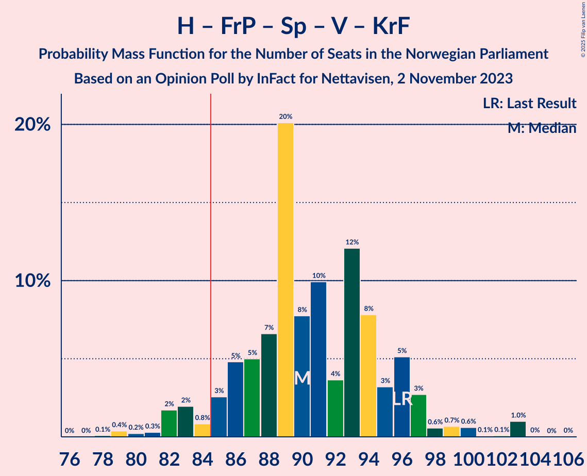

# Opinion Poll by InFact for Nettavisen, 2 November 2023

<a href="#voting-intentions">Voting Intentions</a> | <a href="#seats">Seats</a> | <a href="#coalitions">Coalitions</a> | <a href="#technical-information">Technical Information</a>

## Voting Intentions

### Confidence Intervals

| Party | Last Result | Poll Result | 80% Confidence Interval | 90% Confidence Interval | 95% Confidence Interval | 99% Confidence Interval |
|:-----:|:-----------:|:-----------:|:-----------------------:|:-----------------------:|:-----------------------:|:-----------------------:|
| Høyre | 20.4% | 24.1% | 22.4–25.8% |22.0–26.4% |21.6–26.8% |20.8–27.6% |
| Arbeiderpartiet | 26.2% | 19.7% | 18.2–21.4% |17.8–21.9% |17.4–22.3% |16.7–23.1% |
| Fremskrittspartiet | 11.6% | 14.7% | 13.4–16.2% |13.0–16.7% |12.7–17.0% |12.1–17.8% |
| Sosialistisk Venstreparti | 7.6% | 9.2% | 8.2–10.5% |7.9–10.9% |7.6–11.2% |7.1–11.8% |
| Rødt | 4.7% | 5.9% | 5.0–6.9% |4.8–7.2% |4.6–7.5% |4.2–8.0% |
| Industri- og Næringspartiet | 0.3% | 5.3% | 4.5–6.3% |4.3–6.6% |4.1–6.8% |3.7–7.3% |
| Venstre | 4.6% | 5.0% | 4.2–6.0% |4.0–6.3% |3.8–6.5% |3.5–7.0% |
| Senterpartiet | 13.5% | 5.0% | 4.2–6.0% |4.0–6.3% |3.8–6.5% |3.5–7.0% |
| Miljøpartiet De Grønne | 3.9% | 4.4% | 3.7–5.4% |3.5–5.6% |3.3–5.9% |3.0–6.3% |
| Kristelig Folkeparti | 3.8% | 3.9% | 3.2–4.7% |3.0–5.0% |2.8–5.2% |2.5–5.7% |

*Note:* The poll result column reflects the actual value used in the calculations. Published results may vary slightly, and in addition be rounded to fewer digits.

## Seats

### Confidence Intervals

| Party | Last Result | Median | 80% Confidence Interval | 90% Confidence Interval | 95% Confidence Interval | 99% Confidence Interval |
|:-----:|:-----------:|:------:|:-----------------------:|:-----------------------:|:-----------------------:|:-----------------------:|
| <a href="#høyre">Høyre</a> | 36 | 43 | 40–47 |40–48 |39–48 |37–50 |
| <a href="#arbeiderpartiet">Arbeiderpartiet</a> | 48 | 39 | 36–42 |34–43 |33–44 |32–46 |
| <a href="#fremskrittspartiet">Fremskrittspartiet</a> | 21 | 27 | 24–31 |23–32 |23–33 |21–35 |
| <a href="#sosialistisk-venstreparti">Sosialistisk Venstreparti</a> | 13 | 14 | 12–17 |12–18 |11–19 |10–20 |
| <a href="#rødt">Rødt</a> | 8 | 9 | 7–11 |7–11 |7–12 |6–13 |
| <a href="#industri--og-næringspartiet">Industri- og Næringspartiet</a> | 0 | 8 | 7–10 |6–11 |6–11 |3–12 |
| <a href="#venstre">Venstre</a> | 8 | 8 | 6–9 |3–10 |3–10 |2–11 |
| <a href="#senterpartiet">Senterpartiet</a> | 28 | 8 | 6–9 |1–10 |1–11 |0–13 |
| <a href="#miljøpartiet-de-grønne">Miljøpartiet De Grønne</a> | 3 | 7 | 3–9 |2–9 |2–9 |1–10 |
| <a href="#kristelig-folkeparti">Kristelig Folkeparti</a> | 3 | 3 | 2–7 |2–8 |2–8 |2–9 |

### Høyre

*For a full overview of the results for this party, see the [Høyre](party-høyre.html) page.*

| Number of Seats | Probability | Accumulated | Special Marks |
|:---------------:|:-----------:|:-----------:|:-------------:|
| 34 | 0.1% | 100% |  |
| 35 | 0.1% | 99.9% |  |
| 36 | 0.1% | 99.8% | Last Result |
| 37 | 0.8% | 99.7% |  |
| 38 | 0.7% | 98.9% |  |
| 39 | 2% | 98% |  |
| 40 | 12% | 96% |  |
| 41 | 8% | 85% |  |
| 42 | 15% | 77% |  |
| 43 | 18% | 62% | Median |
| 44 | 8% | 44% |  |
| 45 | 7% | 35% |  |
| 46 | 12% | 28% |  |
| 47 | 7% | 16% |  |
| 48 | 7% | 9% |  |
| 49 | 1.5% | 2% |  |
| 50 | 0.8% | 0.9% |  |
| 51 | 0.1% | 0.1% |  |
| 52 | 0% | 0% |  |

### Arbeiderpartiet

*For a full overview of the results for this party, see the [Arbeiderpartiet](party-arbeiderpartiet.html) page.*

| Number of Seats | Probability | Accumulated | Special Marks |
|:---------------:|:-----------:|:-----------:|:-------------:|
| 31 | 0.2% | 100% |  |
| 32 | 0.6% | 99.8% |  |
| 33 | 2% | 99.3% |  |
| 34 | 3% | 97% |  |
| 35 | 3% | 95% |  |
| 36 | 11% | 91% |  |
| 37 | 11% | 81% |  |
| 38 | 9% | 69% |  |
| 39 | 21% | 60% | Median |
| 40 | 19% | 39% |  |
| 41 | 7% | 20% |  |
| 42 | 7% | 13% |  |
| 43 | 2% | 6% |  |
| 44 | 2% | 4% |  |
| 45 | 2% | 2% |  |
| 46 | 0.2% | 0.6% |  |
| 47 | 0.3% | 0.5% |  |
| 48 | 0.1% | 0.2% | Last Result |
| 49 | 0.1% | 0.1% |  |
| 50 | 0% | 0% |  |

### Fremskrittspartiet

*For a full overview of the results for this party, see the [Fremskrittspartiet](party-fremskrittspartiet.html) page.*

| Number of Seats | Probability | Accumulated | Special Marks |
|:---------------:|:-----------:|:-----------:|:-------------:|
| 20 | 0.4% | 100% |  |
| 21 | 0.8% | 99.6% | Last Result |
| 22 | 1.3% | 98.8% |  |
| 23 | 6% | 98% |  |
| 24 | 7% | 92% |  |
| 25 | 5% | 85% |  |
| 26 | 9% | 80% |  |
| 27 | 20% | 70% | Median |
| 28 | 8% | 50% |  |
| 29 | 14% | 42% |  |
| 30 | 5% | 28% |  |
| 31 | 14% | 24% |  |
| 32 | 5% | 9% |  |
| 33 | 2% | 4% |  |
| 34 | 0.8% | 2% |  |
| 35 | 1.3% | 1.5% |  |
| 36 | 0.1% | 0.1% |  |
| 37 | 0% | 0% |  |

### Sosialistisk Venstreparti

*For a full overview of the results for this party, see the [Sosialistisk Venstreparti](party-sosialistiskvenstreparti.html) page.*

| Number of Seats | Probability | Accumulated | Special Marks |
|:---------------:|:-----------:|:-----------:|:-------------:|
| 9 | 0.3% | 100% |  |
| 10 | 0.9% | 99.7% |  |
| 11 | 3% | 98.9% |  |
| 12 | 9% | 96% |  |
| 13 | 17% | 87% | Last Result |
| 14 | 28% | 70% | Median |
| 15 | 20% | 42% |  |
| 16 | 8% | 22% |  |
| 17 | 6% | 14% |  |
| 18 | 5% | 8% |  |
| 19 | 2% | 3% |  |
| 20 | 0.7% | 0.9% |  |
| 21 | 0.2% | 0.3% |  |
| 22 | 0% | 0% |  |

### Rødt

*For a full overview of the results for this party, see the [Rødt](party-rødt.html) page.*

| Number of Seats | Probability | Accumulated | Special Marks |
|:---------------:|:-----------:|:-----------:|:-------------:|
| 1 | 0.2% | 100% |  |
| 2 | 0% | 99.8% |  |
| 3 | 0% | 99.8% |  |
| 4 | 0% | 99.8% |  |
| 5 | 0% | 99.8% |  |
| 6 | 0.5% | 99.8% |  |
| 7 | 12% | 99.3% |  |
| 8 | 24% | 88% | Last Result |
| 9 | 24% | 63% | Median |
| 10 | 27% | 39% |  |
| 11 | 7% | 12% |  |
| 12 | 3% | 5% |  |
| 13 | 1.3% | 2% |  |
| 14 | 0.2% | 0.3% |  |
| 15 | 0% | 0% |  |

### Industri- og Næringspartiet

*For a full overview of the results for this party, see the [Industri- og Næringspartiet](party-industri-ognæringspartiet.html) page.*

| Number of Seats | Probability | Accumulated | Special Marks |
|:---------------:|:-----------:|:-----------:|:-------------:|
| 0 | 0% | 100% | Last Result |
| 1 | 0% | 100% |  |
| 2 | 0.2% | 100% |  |
| 3 | 2% | 99.8% |  |
| 4 | 0% | 98% |  |
| 5 | 0% | 98% |  |
| 6 | 4% | 98% |  |
| 7 | 26% | 94% |  |
| 8 | 18% | 68% | Median |
| 9 | 24% | 50% |  |
| 10 | 20% | 26% |  |
| 11 | 5% | 6% |  |
| 12 | 0.8% | 0.9% |  |
| 13 | 0.1% | 0.1% |  |
| 14 | 0% | 0% |  |

### Venstre

*For a full overview of the results for this party, see the [Venstre](party-venstre.html) page.*

| Number of Seats | Probability | Accumulated | Special Marks |
|:---------------:|:-----------:|:-----------:|:-------------:|
| 2 | 1.3% | 100% |  |
| 3 | 4% | 98.7% |  |
| 4 | 0% | 94% |  |
| 5 | 0% | 94% |  |
| 6 | 9% | 94% |  |
| 7 | 24% | 85% |  |
| 8 | 24% | 61% | Last Result, Median |
| 9 | 28% | 37% |  |
| 10 | 6% | 9% |  |
| 11 | 2% | 2% |  |
| 12 | 0.3% | 0.3% |  |
| 13 | 0% | 0% |  |

### Senterpartiet

*For a full overview of the results for this party, see the [Senterpartiet](party-senterpartiet.html) page.*

| Number of Seats | Probability | Accumulated | Special Marks |
|:---------------:|:-----------:|:-----------:|:-------------:|
| 0 | 1.2% | 100% |  |
| 1 | 4% | 98.8% |  |
| 2 | 1.3% | 95% |  |
| 3 | 0.1% | 94% |  |
| 4 | 0% | 94% |  |
| 5 | 0% | 94% |  |
| 6 | 10% | 93% |  |
| 7 | 24% | 83% |  |
| 8 | 30% | 59% | Median |
| 9 | 19% | 29% |  |
| 10 | 6% | 10% |  |
| 11 | 2% | 4% |  |
| 12 | 1.1% | 2% |  |
| 13 | 0.9% | 1.1% |  |
| 14 | 0.2% | 0.2% |  |
| 15 | 0% | 0% |  |
| 16 | 0% | 0% |  |
| 17 | 0% | 0% |  |
| 18 | 0% | 0% |  |
| 19 | 0% | 0% |  |
| 20 | 0% | 0% |  |
| 21 | 0% | 0% |  |
| 22 | 0% | 0% |  |
| 23 | 0% | 0% |  |
| 24 | 0% | 0% |  |
| 25 | 0% | 0% |  |
| 26 | 0% | 0% |  |
| 27 | 0% | 0% |  |
| 28 | 0% | 0% | Last Result |

### Miljøpartiet De Grønne

*For a full overview of the results for this party, see the [Miljøpartiet De Grønne](party-miljøpartietdegrønne.html) page.*

| Number of Seats | Probability | Accumulated | Special Marks |
|:---------------:|:-----------:|:-----------:|:-------------:|
| 1 | 0.5% | 100% |  |
| 2 | 7% | 99.5% |  |
| 3 | 11% | 92% | Last Result |
| 4 | 0% | 81% |  |
| 5 | 0% | 81% |  |
| 6 | 12% | 81% |  |
| 7 | 22% | 69% | Median |
| 8 | 36% | 47% |  |
| 9 | 9% | 11% |  |
| 10 | 2% | 2% |  |
| 11 | 0.1% | 0.1% |  |
| 12 | 0% | 0% |  |

### Kristelig Folkeparti

*For a full overview of the results for this party, see the [Kristelig Folkeparti](party-kristeligfolkeparti.html) page.*

| Number of Seats | Probability | Accumulated | Special Marks |
|:---------------:|:-----------:|:-----------:|:-------------:|
| 1 | 0% | 100% |  |
| 2 | 43% | 99.9% |  |
| 3 | 22% | 56% | Last Result, Median |
| 4 | 0% | 34% |  |
| 5 | 0.2% | 34% |  |
| 6 | 11% | 34% |  |
| 7 | 13% | 23% |  |
| 8 | 8% | 10% |  |
| 9 | 1.2% | 1.3% |  |
| 10 | 0.1% | 0.1% |  |
| 11 | 0% | 0% |  |

## Coalitions

### Confidence Intervals

| Coalition | Last Result | Median | Majority? | 80% Confidence Interval | 90% Confidence Interval | 95% Confidence Interval | 99% Confidence Interval |
|:---------:|:-----------:|:------:|:---------:|:-----------------------:|:-----------------------:|:-----------------------:|:-----------------------:|
| Høyre – Fremskrittspartiet – Senterpartiet – Venstre – Kristelig Folkeparti | 96 | 90 | 94% | 86–96 | 84–97 | 82–99 | 79–103 |
| Høyre – Fremskrittspartiet – Venstre – Miljøpartiet De Grønne – Kristelig Folkeparti | 71 | 90 | 92% | 85–94 | 83–96 | 82–98 | 80–99 |
| Høyre – Fremskrittspartiet – Venstre – Kristelig Folkeparti | 68 | 83 | 36% | 78–88 | 77–89 | 75–91 | 73–96 |
| Høyre – Fremskrittspartiet – Venstre | 65 | 79 | 5% | 74–84 | 73–84 | 72–86 | 70–89 |
| Arbeiderpartiet – Sosialistisk Venstreparti – Rødt – Senterpartiet – Miljøpartiet De Grønne | 100 | 76 | 2% | 72–81 | 71–83 | 69–84 | 65–86 |
| Arbeiderpartiet – Sosialistisk Venstreparti – Senterpartiet – Miljøpartiet De Grønne – Kristelig Folkeparti | 95 | 71 | 0% | 68–76 | 65–77 | 64–79 | 63–80 |
| Høyre – Fremskrittspartiet | 57 | 71 | 0% | 67–76 | 65–77 | 64–79 | 63–80 |
| Arbeiderpartiet – Sosialistisk Venstreparti – Rødt – Senterpartiet | 97 | 69 | 0% | 66–75 | 64–76 | 63–77 | 61–79 |
| Arbeiderpartiet – Sosialistisk Venstreparti – Rødt – Miljøpartiet De Grønne | 72 | 69 | 0% | 65–74 | 63–75 | 62–76 | 58–79 |
| Arbeiderpartiet – Sosialistisk Venstreparti – Senterpartiet – Miljøpartiet De Grønne | 92 | 67 | 0% | 63–72 | 62–73 | 60–74 | 57–77 |
| Arbeiderpartiet – Sosialistisk Venstreparti – Senterpartiet | 89 | 61 | 0% | 57–65 | 55–66 | 54–67 | 52–69 |
| Arbeiderpartiet – Senterpartiet – Miljøpartiet De Grønne – Kristelig Folkeparti | 82 | 57 | 0% | 53–61 | 51–62 | 49–64 | 47–66 |
| Høyre – Venstre – Kristelig Folkeparti | 47 | 55 | 0% | 51–60 | 50–62 | 49–63 | 46–65 |
| Arbeiderpartiet – Sosialistisk Venstreparti | 61 | 53 | 0% | 50–57 | 49–58 | 48–59 | 46–61 |
| Arbeiderpartiet – Senterpartiet – Kristelig Folkeparti | 79 | 50 | 0% | 46–55 | 45–56 | 44–57 | 41–59 |
| Arbeiderpartiet – Senterpartiet | 76 | 47 | 0% | 42–50 | 41–51 | 40–52 | 38–54 |
| Senterpartiet – Venstre – Kristelig Folkeparti | 39 | 19 | 0% | 16–23 | 14–25 | 12–26 | 7–28 |

### Høyre – Fremskrittspartiet – Senterpartiet – Venstre – Kristelig Folkeparti

| Number of Seats | Probability | Accumulated | Special Marks |
|:---------------:|:-----------:|:-----------:|:-------------:|
| 78 | 0.1% | 100% |  |
| 79 | 0.4% | 99.9% |  |
| 80 | 0.2% | 99.5% |  |
| 81 | 0.3% | 99.3% |  |
| 82 | 2% | 99.0% |  |
| 83 | 2% | 97% |  |
| 84 | 0.8% | 95% |  |
| 85 | 3% | 94% | Majority |
| 86 | 5% | 92% |  |
| 87 | 5% | 87% |  |
| 88 | 7% | 82% |  |
| 89 | 20% | 75% | Median |
| 90 | 8% | 55% |  |
| 91 | 10% | 48% |  |
| 92 | 4% | 38% |  |
| 93 | 12% | 34% |  |
| 94 | 8% | 22% |  |
| 95 | 3% | 14% |  |
| 96 | 5% | 11% | Last Result |
| 97 | 3% | 6% |  |
| 98 | 0.6% | 3% |  |
| 99 | 0.7% | 3% |  |
| 100 | 0.6% | 2% |  |
| 101 | 0.1% | 1.2% |  |
| 102 | 0.1% | 1.2% |  |
| 103 | 1.0% | 1.1% |  |
| 104 | 0% | 0.1% |  |
| 105 | 0% | 0% |  |

### Høyre – Fremskrittspartiet – Venstre – Miljøpartiet De Grønne – Kristelig Folkeparti

| Number of Seats | Probability | Accumulated | Special Marks |
|:---------------:|:-----------:|:-----------:|:-------------:|
| 71 | 0% | 100% | Last Result |
| 72 | 0% | 100% |  |
| 73 | 0% | 100% |  |
| 74 | 0% | 100% |  |
| 75 | 0% | 100% |  |
| 76 | 0% | 100% |  |
| 77 | 0% | 100% |  |
| 78 | 0.1% | 99.9% |  |
| 79 | 0.1% | 99.8% |  |
| 80 | 0.5% | 99.7% |  |
| 81 | 0.7% | 99.2% |  |
| 82 | 2% | 98% |  |
| 83 | 3% | 97% |  |
| 84 | 2% | 94% |  |
| 85 | 5% | 92% | Majority |
| 86 | 7% | 87% |  |
| 87 | 6% | 80% |  |
| 88 | 7% | 74% | Median |
| 89 | 17% | 67% |  |
| 90 | 14% | 51% |  |
| 91 | 6% | 36% |  |
| 92 | 9% | 31% |  |
| 93 | 4% | 22% |  |
| 94 | 9% | 19% |  |
| 95 | 4% | 9% |  |
| 96 | 1.3% | 6% |  |
| 97 | 2% | 4% |  |
| 98 | 2% | 3% |  |
| 99 | 0.4% | 0.7% |  |
| 100 | 0.1% | 0.4% |  |
| 101 | 0.2% | 0.2% |  |
| 102 | 0% | 0% |  |

### Høyre – Fremskrittspartiet – Venstre – Kristelig Folkeparti

| Number of Seats | Probability | Accumulated | Special Marks |
|:---------------:|:-----------:|:-----------:|:-------------:|
| 68 | 0% | 100% | Last Result |
| 69 | 0% | 100% |  |
| 70 | 0.1% | 100% |  |
| 71 | 0% | 99.9% |  |
| 72 | 0.1% | 99.9% |  |
| 73 | 0.4% | 99.8% |  |
| 74 | 1.3% | 99.3% |  |
| 75 | 1.4% | 98% |  |
| 76 | 1.2% | 97% |  |
| 77 | 3% | 95% |  |
| 78 | 3% | 92% |  |
| 79 | 7% | 90% |  |
| 80 | 6% | 82% |  |
| 81 | 15% | 76% | Median |
| 82 | 8% | 62% |  |
| 83 | 12% | 54% |  |
| 84 | 6% | 42% |  |
| 85 | 4% | 36% | Majority |
| 86 | 16% | 32% |  |
| 87 | 6% | 16% |  |
| 88 | 3% | 10% |  |
| 89 | 2% | 7% |  |
| 90 | 2% | 5% |  |
| 91 | 1.0% | 3% |  |
| 92 | 0.7% | 2% |  |
| 93 | 0.2% | 1.4% |  |
| 94 | 0.1% | 1.2% |  |
| 95 | 0.1% | 1.2% |  |
| 96 | 1.0% | 1.1% |  |
| 97 | 0% | 0% |  |

### Høyre – Fremskrittspartiet – Venstre

| Number of Seats | Probability | Accumulated | Special Marks |
|:---------------:|:-----------:|:-----------:|:-------------:|
| 65 | 0% | 100% | Last Result |
| 66 | 0% | 100% |  |
| 67 | 0.1% | 100% |  |
| 68 | 0.1% | 99.8% |  |
| 69 | 0.1% | 99.8% |  |
| 70 | 0.6% | 99.6% |  |
| 71 | 1.3% | 99.1% |  |
| 72 | 3% | 98% |  |
| 73 | 3% | 95% |  |
| 74 | 4% | 92% |  |
| 75 | 3% | 88% |  |
| 76 | 6% | 85% |  |
| 77 | 7% | 79% |  |
| 78 | 10% | 71% | Median |
| 79 | 15% | 61% |  |
| 80 | 16% | 46% |  |
| 81 | 9% | 30% |  |
| 82 | 3% | 21% |  |
| 83 | 3% | 18% |  |
| 84 | 10% | 15% |  |
| 85 | 1.3% | 5% | Majority |
| 86 | 1.4% | 4% |  |
| 87 | 0.7% | 2% |  |
| 88 | 0.2% | 1.5% |  |
| 89 | 1.2% | 1.3% |  |
| 90 | 0.1% | 0.1% |  |
| 91 | 0% | 0.1% |  |
| 92 | 0% | 0% |  |

### Arbeiderpartiet – Sosialistisk Venstreparti – Rødt – Senterpartiet – Miljøpartiet De Grønne

| Number of Seats | Probability | Accumulated | Special Marks |
|:---------------:|:-----------:|:-----------:|:-------------:|
| 64 | 0.1% | 100% |  |
| 65 | 1.1% | 99.9% |  |
| 66 | 0.1% | 98.8% |  |
| 67 | 0.3% | 98.7% |  |
| 68 | 0.5% | 98% |  |
| 69 | 1.1% | 98% |  |
| 70 | 2% | 97% |  |
| 71 | 1.3% | 95% |  |
| 72 | 4% | 94% |  |
| 73 | 6% | 89% |  |
| 74 | 5% | 83% |  |
| 75 | 17% | 78% |  |
| 76 | 12% | 62% |  |
| 77 | 15% | 50% | Median |
| 78 | 11% | 34% |  |
| 79 | 7% | 23% |  |
| 80 | 3% | 16% |  |
| 81 | 4% | 13% |  |
| 82 | 2% | 9% |  |
| 83 | 3% | 7% |  |
| 84 | 2% | 4% |  |
| 85 | 0.9% | 2% | Majority |
| 86 | 0.8% | 1.2% |  |
| 87 | 0.3% | 0.4% |  |
| 88 | 0.1% | 0.2% |  |
| 89 | 0% | 0.1% |  |
| 90 | 0% | 0% |  |
| 91 | 0% | 0% |  |
| 92 | 0% | 0% |  |
| 93 | 0% | 0% |  |
| 94 | 0% | 0% |  |
| 95 | 0% | 0% |  |
| 96 | 0% | 0% |  |
| 97 | 0% | 0% |  |
| 98 | 0% | 0% |  |
| 99 | 0% | 0% |  |
| 100 | 0% | 0% | Last Result |

### Arbeiderpartiet – Sosialistisk Venstreparti – Senterpartiet – Miljøpartiet De Grønne – Kristelig Folkeparti

| Number of Seats | Probability | Accumulated | Special Marks |
|:---------------:|:-----------:|:-----------:|:-------------:|
| 60 | 0.1% | 100% |  |
| 61 | 0.1% | 99.8% |  |
| 62 | 0.2% | 99.7% |  |
| 63 | 0.5% | 99.6% |  |
| 64 | 2% | 99.1% |  |
| 65 | 2% | 97% |  |
| 66 | 2% | 95% |  |
| 67 | 2% | 93% |  |
| 68 | 4% | 91% |  |
| 69 | 19% | 87% |  |
| 70 | 11% | 68% |  |
| 71 | 15% | 58% | Median |
| 72 | 9% | 43% |  |
| 73 | 8% | 34% |  |
| 74 | 10% | 26% |  |
| 75 | 3% | 16% |  |
| 76 | 5% | 13% |  |
| 77 | 3% | 8% |  |
| 78 | 2% | 5% |  |
| 79 | 2% | 3% |  |
| 80 | 0.6% | 1.1% |  |
| 81 | 0.2% | 0.5% |  |
| 82 | 0.1% | 0.2% |  |
| 83 | 0.1% | 0.1% |  |
| 84 | 0% | 0% |  |
| 85 | 0% | 0% | Majority |
| 86 | 0% | 0% |  |
| 87 | 0% | 0% |  |
| 88 | 0% | 0% |  |
| 89 | 0% | 0% |  |
| 90 | 0% | 0% |  |
| 91 | 0% | 0% |  |
| 92 | 0% | 0% |  |
| 93 | 0% | 0% |  |
| 94 | 0% | 0% |  |
| 95 | 0% | 0% | Last Result |

### Høyre – Fremskrittspartiet

| Number of Seats | Probability | Accumulated | Special Marks |
|:---------------:|:-----------:|:-----------:|:-------------:|
| 57 | 0% | 100% | Last Result |
| 58 | 0% | 100% |  |
| 59 | 0% | 100% |  |
| 60 | 0% | 100% |  |
| 61 | 0.1% | 99.9% |  |
| 62 | 0.2% | 99.8% |  |
| 63 | 1.0% | 99.6% |  |
| 64 | 2% | 98.5% |  |
| 65 | 2% | 96% |  |
| 66 | 3% | 95% |  |
| 67 | 5% | 92% |  |
| 68 | 6% | 87% |  |
| 69 | 7% | 80% |  |
| 70 | 16% | 73% | Median |
| 71 | 14% | 57% |  |
| 72 | 8% | 43% |  |
| 73 | 9% | 36% |  |
| 74 | 7% | 27% |  |
| 75 | 7% | 20% |  |
| 76 | 3% | 13% |  |
| 77 | 5% | 9% |  |
| 78 | 1.3% | 4% |  |
| 79 | 1.1% | 3% |  |
| 80 | 1.1% | 1.5% |  |
| 81 | 0.2% | 0.3% |  |
| 82 | 0.1% | 0.2% |  |
| 83 | 0% | 0% |  |

### Arbeiderpartiet – Sosialistisk Venstreparti – Rødt – Senterpartiet

| Number of Seats | Probability | Accumulated | Special Marks |
|:---------------:|:-----------:|:-----------:|:-------------:|
| 58 | 0.1% | 100% |  |
| 59 | 0.1% | 99.9% |  |
| 60 | 0.2% | 99.8% |  |
| 61 | 0.2% | 99.6% |  |
| 62 | 0.9% | 99.4% |  |
| 63 | 2% | 98% |  |
| 64 | 2% | 97% |  |
| 65 | 2% | 95% |  |
| 66 | 4% | 92% |  |
| 67 | 11% | 89% |  |
| 68 | 8% | 78% |  |
| 69 | 25% | 70% |  |
| 70 | 9% | 45% | Median |
| 71 | 10% | 37% |  |
| 72 | 6% | 27% |  |
| 73 | 6% | 21% |  |
| 74 | 5% | 15% |  |
| 75 | 5% | 11% |  |
| 76 | 3% | 6% |  |
| 77 | 1.0% | 3% |  |
| 78 | 1.0% | 2% |  |
| 79 | 0.3% | 0.7% |  |
| 80 | 0.3% | 0.4% |  |
| 81 | 0.1% | 0.1% |  |
| 82 | 0% | 0.1% |  |
| 83 | 0% | 0% |  |
| 84 | 0% | 0% |  |
| 85 | 0% | 0% | Majority |
| 86 | 0% | 0% |  |
| 87 | 0% | 0% |  |
| 88 | 0% | 0% |  |
| 89 | 0% | 0% |  |
| 90 | 0% | 0% |  |
| 91 | 0% | 0% |  |
| 92 | 0% | 0% |  |
| 93 | 0% | 0% |  |
| 94 | 0% | 0% |  |
| 95 | 0% | 0% |  |
| 96 | 0% | 0% |  |
| 97 | 0% | 0% | Last Result |

### Arbeiderpartiet – Sosialistisk Venstreparti – Rødt – Miljøpartiet De Grønne

| Number of Seats | Probability | Accumulated | Special Marks |
|:---------------:|:-----------:|:-----------:|:-------------:|
| 57 | 0.1% | 100% |  |
| 58 | 1.1% | 99.9% |  |
| 59 | 0.3% | 98.8% |  |
| 60 | 0.1% | 98.5% |  |
| 61 | 0.8% | 98% |  |
| 62 | 1.2% | 98% |  |
| 63 | 2% | 96% |  |
| 64 | 4% | 94% |  |
| 65 | 5% | 91% |  |
| 66 | 7% | 85% |  |
| 67 | 5% | 79% |  |
| 68 | 18% | 74% |  |
| 69 | 14% | 56% | Median |
| 70 | 17% | 42% |  |
| 71 | 8% | 26% |  |
| 72 | 3% | 18% | Last Result |
| 73 | 4% | 15% |  |
| 74 | 2% | 10% |  |
| 75 | 4% | 8% |  |
| 76 | 2% | 4% |  |
| 77 | 1.0% | 2% |  |
| 78 | 0.5% | 1.1% |  |
| 79 | 0.5% | 0.6% |  |
| 80 | 0.1% | 0.2% |  |
| 81 | 0% | 0.1% |  |
| 82 | 0% | 0% |  |

### Arbeiderpartiet – Sosialistisk Venstreparti – Senterpartiet – Miljøpartiet De Grønne

| Number of Seats | Probability | Accumulated | Special Marks |
|:---------------:|:-----------:|:-----------:|:-------------:|
| 55 | 0.1% | 100% |  |
| 56 | 0% | 99.9% |  |
| 57 | 1.2% | 99.9% |  |
| 58 | 0.3% | 98.7% |  |
| 59 | 0.3% | 98% |  |
| 60 | 0.8% | 98% |  |
| 61 | 2% | 97% |  |
| 62 | 4% | 96% |  |
| 63 | 2% | 91% |  |
| 64 | 6% | 89% |  |
| 65 | 6% | 83% |  |
| 66 | 9% | 77% |  |
| 67 | 18% | 67% |  |
| 68 | 15% | 50% | Median |
| 69 | 14% | 35% |  |
| 70 | 6% | 21% |  |
| 71 | 3% | 15% |  |
| 72 | 4% | 12% |  |
| 73 | 3% | 7% |  |
| 74 | 2% | 5% |  |
| 75 | 0.3% | 2% |  |
| 76 | 1.2% | 2% |  |
| 77 | 0.6% | 0.7% |  |
| 78 | 0.1% | 0.1% |  |
| 79 | 0% | 0% |  |
| 80 | 0% | 0% |  |
| 81 | 0% | 0% |  |
| 82 | 0% | 0% |  |
| 83 | 0% | 0% |  |
| 84 | 0% | 0% |  |
| 85 | 0% | 0% | Majority |
| 86 | 0% | 0% |  |
| 87 | 0% | 0% |  |
| 88 | 0% | 0% |  |
| 89 | 0% | 0% |  |
| 90 | 0% | 0% |  |
| 91 | 0% | 0% |  |
| 92 | 0% | 0% | Last Result |

### Arbeiderpartiet – Sosialistisk Venstreparti – Senterpartiet

| Number of Seats | Probability | Accumulated | Special Marks |
|:---------------:|:-----------:|:-----------:|:-------------:|
| 49 | 0% | 100% |  |
| 50 | 0% | 99.9% |  |
| 51 | 0.2% | 99.9% |  |
| 52 | 0.3% | 99.7% |  |
| 53 | 0.3% | 99.4% |  |
| 54 | 2% | 99.1% |  |
| 55 | 2% | 97% |  |
| 56 | 2% | 95% |  |
| 57 | 3% | 92% |  |
| 58 | 7% | 90% |  |
| 59 | 13% | 83% |  |
| 60 | 19% | 70% |  |
| 61 | 17% | 50% | Median |
| 62 | 7% | 34% |  |
| 63 | 10% | 27% |  |
| 64 | 4% | 17% |  |
| 65 | 5% | 12% |  |
| 66 | 4% | 8% |  |
| 67 | 2% | 4% |  |
| 68 | 1.3% | 2% |  |
| 69 | 0.3% | 0.7% |  |
| 70 | 0.3% | 0.4% |  |
| 71 | 0.1% | 0.1% |  |
| 72 | 0% | 0% |  |
| 73 | 0% | 0% |  |
| 74 | 0% | 0% |  |
| 75 | 0% | 0% |  |
| 76 | 0% | 0% |  |
| 77 | 0% | 0% |  |
| 78 | 0% | 0% |  |
| 79 | 0% | 0% |  |
| 80 | 0% | 0% |  |
| 81 | 0% | 0% |  |
| 82 | 0% | 0% |  |
| 83 | 0% | 0% |  |
| 84 | 0% | 0% |  |
| 85 | 0% | 0% | Majority |
| 86 | 0% | 0% |  |
| 87 | 0% | 0% |  |
| 88 | 0% | 0% |  |
| 89 | 0% | 0% | Last Result |

### Arbeiderpartiet – Senterpartiet – Miljøpartiet De Grønne – Kristelig Folkeparti

| Number of Seats | Probability | Accumulated | Special Marks |
|:---------------:|:-----------:|:-----------:|:-------------:|
| 44 | 0.1% | 100% |  |
| 45 | 0% | 99.9% |  |
| 46 | 0.1% | 99.9% |  |
| 47 | 0.8% | 99.8% |  |
| 48 | 0.5% | 98.9% |  |
| 49 | 1.0% | 98% |  |
| 50 | 2% | 97% |  |
| 51 | 3% | 96% |  |
| 52 | 2% | 93% |  |
| 53 | 4% | 91% |  |
| 54 | 7% | 87% |  |
| 55 | 13% | 79% |  |
| 56 | 11% | 67% |  |
| 57 | 14% | 56% | Median |
| 58 | 11% | 42% |  |
| 59 | 10% | 31% |  |
| 60 | 5% | 21% |  |
| 61 | 8% | 17% |  |
| 62 | 4% | 9% |  |
| 63 | 2% | 5% |  |
| 64 | 1.0% | 3% |  |
| 65 | 0.2% | 2% |  |
| 66 | 1.2% | 2% |  |
| 67 | 0.3% | 0.5% |  |
| 68 | 0.1% | 0.2% |  |
| 69 | 0% | 0.1% |  |
| 70 | 0% | 0% |  |
| 71 | 0% | 0% |  |
| 72 | 0% | 0% |  |
| 73 | 0% | 0% |  |
| 74 | 0% | 0% |  |
| 75 | 0% | 0% |  |
| 76 | 0% | 0% |  |
| 77 | 0% | 0% |  |
| 78 | 0% | 0% |  |
| 79 | 0% | 0% |  |
| 80 | 0% | 0% |  |
| 81 | 0% | 0% |  |
| 82 | 0% | 0% | Last Result |

### Høyre – Venstre – Kristelig Folkeparti

| Number of Seats | Probability | Accumulated | Special Marks |
|:---------------:|:-----------:|:-----------:|:-------------:|
| 44 | 0.1% | 100% |  |
| 45 | 0.3% | 99.9% |  |
| 46 | 0.4% | 99.6% |  |
| 47 | 0.7% | 99.2% | Last Result |
| 48 | 0.5% | 98.5% |  |
| 49 | 2% | 98% |  |
| 50 | 2% | 96% |  |
| 51 | 10% | 94% |  |
| 52 | 4% | 84% |  |
| 53 | 7% | 80% |  |
| 54 | 16% | 73% | Median |
| 55 | 19% | 56% |  |
| 56 | 6% | 37% |  |
| 57 | 7% | 31% |  |
| 58 | 4% | 23% |  |
| 59 | 7% | 19% |  |
| 60 | 3% | 12% |  |
| 61 | 3% | 9% |  |
| 62 | 3% | 6% |  |
| 63 | 1.1% | 3% |  |
| 64 | 0.3% | 2% |  |
| 65 | 1.1% | 1.3% |  |
| 66 | 0.1% | 0.1% |  |
| 67 | 0% | 0% |  |

### Arbeiderpartiet – Sosialistisk Venstreparti

| Number of Seats | Probability | Accumulated | Special Marks |
|:---------------:|:-----------:|:-----------:|:-------------:|
| 44 | 0.1% | 100% |  |
| 45 | 0.1% | 99.9% |  |
| 46 | 0.4% | 99.7% |  |
| 47 | 1.1% | 99.3% |  |
| 48 | 3% | 98% |  |
| 49 | 4% | 95% |  |
| 50 | 5% | 91% |  |
| 51 | 9% | 86% |  |
| 52 | 10% | 77% |  |
| 53 | 28% | 67% | Median |
| 54 | 16% | 39% |  |
| 55 | 4% | 23% |  |
| 56 | 5% | 18% |  |
| 57 | 7% | 13% |  |
| 58 | 2% | 7% |  |
| 59 | 2% | 5% |  |
| 60 | 2% | 2% |  |
| 61 | 0.6% | 0.9% | Last Result |
| 62 | 0.1% | 0.3% |  |
| 63 | 0.1% | 0.2% |  |
| 64 | 0.1% | 0.1% |  |
| 65 | 0% | 0% |  |

### Arbeiderpartiet – Senterpartiet – Kristelig Folkeparti

| Number of Seats | Probability | Accumulated | Special Marks |
|:---------------:|:-----------:|:-----------:|:-------------:|
| 38 | 0.1% | 100% |  |
| 39 | 0.1% | 99.9% |  |
| 40 | 0.1% | 99.9% |  |
| 41 | 0.5% | 99.7% |  |
| 42 | 0.6% | 99.2% |  |
| 43 | 0.9% | 98.6% |  |
| 44 | 2% | 98% |  |
| 45 | 4% | 96% |  |
| 46 | 5% | 93% |  |
| 47 | 9% | 87% |  |
| 48 | 6% | 79% |  |
| 49 | 22% | 72% |  |
| 50 | 5% | 50% | Median |
| 51 | 9% | 46% |  |
| 52 | 9% | 37% |  |
| 53 | 9% | 27% |  |
| 54 | 7% | 18% |  |
| 55 | 4% | 11% |  |
| 56 | 3% | 8% |  |
| 57 | 2% | 4% |  |
| 58 | 2% | 2% |  |
| 59 | 0.5% | 0.8% |  |
| 60 | 0.1% | 0.3% |  |
| 61 | 0.2% | 0.2% |  |
| 62 | 0% | 0% |  |
| 63 | 0% | 0% |  |
| 64 | 0% | 0% |  |
| 65 | 0% | 0% |  |
| 66 | 0% | 0% |  |
| 67 | 0% | 0% |  |
| 68 | 0% | 0% |  |
| 69 | 0% | 0% |  |
| 70 | 0% | 0% |  |
| 71 | 0% | 0% |  |
| 72 | 0% | 0% |  |
| 73 | 0% | 0% |  |
| 74 | 0% | 0% |  |
| 75 | 0% | 0% |  |
| 76 | 0% | 0% |  |
| 77 | 0% | 0% |  |
| 78 | 0% | 0% |  |
| 79 | 0% | 0% | Last Result |

### Arbeiderpartiet – Senterpartiet

| Number of Seats | Probability | Accumulated | Special Marks |
|:---------------:|:-----------:|:-----------:|:-------------:|
| 36 | 0.1% | 100% |  |
| 37 | 0.2% | 99.8% |  |
| 38 | 0.2% | 99.7% |  |
| 39 | 1.0% | 99.4% |  |
| 40 | 1.5% | 98% |  |
| 41 | 2% | 97% |  |
| 42 | 6% | 94% |  |
| 43 | 4% | 89% |  |
| 44 | 8% | 85% |  |
| 45 | 14% | 77% |  |
| 46 | 9% | 63% |  |
| 47 | 24% | 54% | Median |
| 48 | 10% | 30% |  |
| 49 | 8% | 20% |  |
| 50 | 3% | 12% |  |
| 51 | 5% | 9% |  |
| 52 | 2% | 4% |  |
| 53 | 1.1% | 2% |  |
| 54 | 0.3% | 0.6% |  |
| 55 | 0.2% | 0.3% |  |
| 56 | 0% | 0.1% |  |
| 57 | 0% | 0% |  |
| 58 | 0% | 0% |  |
| 59 | 0% | 0% |  |
| 60 | 0% | 0% |  |
| 61 | 0% | 0% |  |
| 62 | 0% | 0% |  |
| 63 | 0% | 0% |  |
| 64 | 0% | 0% |  |
| 65 | 0% | 0% |  |
| 66 | 0% | 0% |  |
| 67 | 0% | 0% |  |
| 68 | 0% | 0% |  |
| 69 | 0% | 0% |  |
| 70 | 0% | 0% |  |
| 71 | 0% | 0% |  |
| 72 | 0% | 0% |  |
| 73 | 0% | 0% |  |
| 74 | 0% | 0% |  |
| 75 | 0% | 0% |  |
| 76 | 0% | 0% | Last Result |

### Senterpartiet – Venstre – Kristelig Folkeparti

| Number of Seats | Probability | Accumulated | Special Marks |
|:---------------:|:-----------:|:-----------:|:-------------:|
| 5 | 0.1% | 100% |  |
| 6 | 0.3% | 99.9% |  |
| 7 | 0.7% | 99.6% |  |
| 8 | 0% | 99.0% |  |
| 9 | 0% | 99.0% |  |
| 10 | 0.1% | 98.9% |  |
| 11 | 0.3% | 98.8% |  |
| 12 | 1.4% | 98.5% |  |
| 13 | 1.2% | 97% |  |
| 14 | 2% | 96% |  |
| 15 | 3% | 94% |  |
| 16 | 7% | 91% |  |
| 17 | 7% | 84% |  |
| 18 | 13% | 76% |  |
| 19 | 24% | 64% | Median |
| 20 | 12% | 40% |  |
| 21 | 7% | 28% |  |
| 22 | 5% | 21% |  |
| 23 | 6% | 16% |  |
| 24 | 3% | 10% |  |
| 25 | 3% | 7% |  |
| 26 | 2% | 4% |  |
| 27 | 1.2% | 2% |  |
| 28 | 0.2% | 0.6% |  |
| 29 | 0.2% | 0.4% |  |
| 30 | 0.1% | 0.2% |  |
| 31 | 0% | 0% |  |
| 32 | 0% | 0% |  |
| 33 | 0% | 0% |  |
| 34 | 0% | 0% |  |
| 35 | 0% | 0% |  |
| 36 | 0% | 0% |  |
| 37 | 0% | 0% |  |
| 38 | 0% | 0% |  |
| 39 | 0% | 0% | Last Result |

## Technical Information

### Opinion Poll

+ **Polling firm:** InFact
+ **Commissioner(s):** Nettavisen
+ **Fieldwork period:** 2 November 2023

### Calculations

+ **Sample size:** 1038
+ **Simulations done:** 1,048,576
+ **Error estimate:** 0.99%

