# Opinion Poll by Verian for TV2, 3 November 2023

<a href="#voting-intentions">Voting Intentions</a> | <a href="#seats">Seats</a> | <a href="#coalitions">Coalitions</a> | <a href="#technical-information">Technical Information</a>

## Voting Intentions

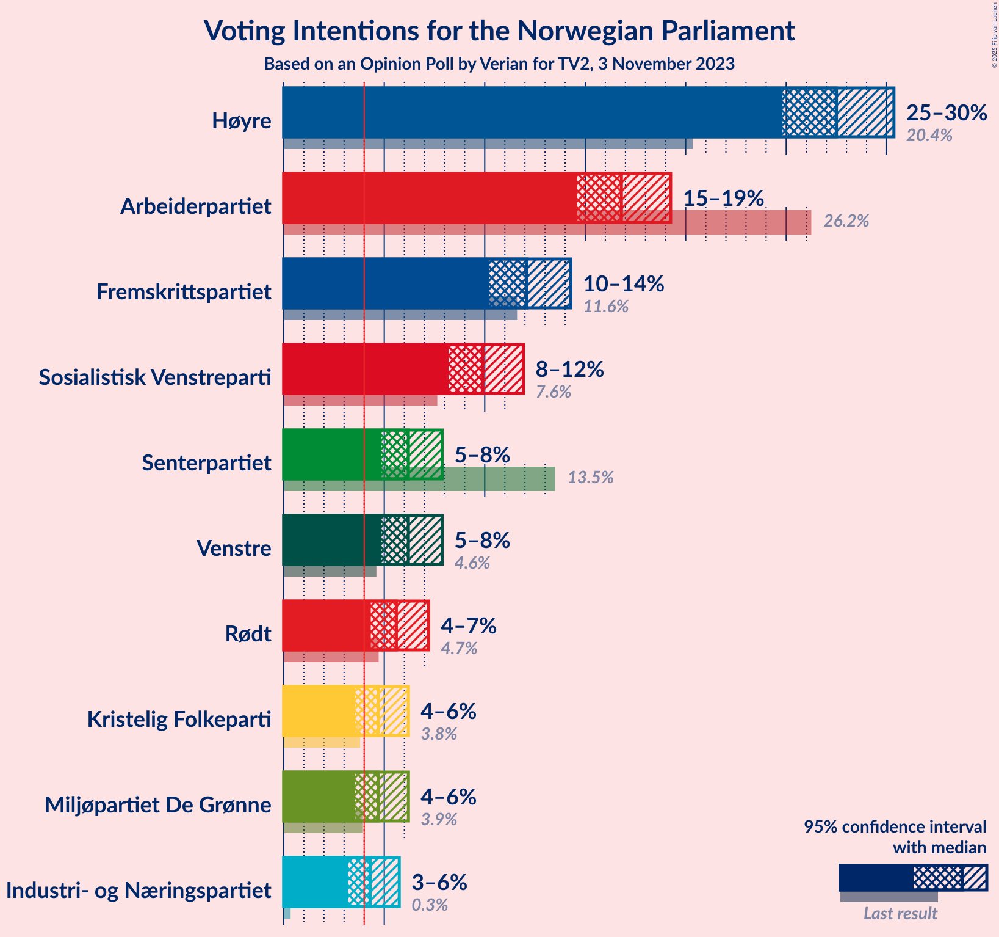

### Confidence Intervals

| Party | Last Result | Poll Result | 80% Confidence Interval | 90% Confidence Interval | 95% Confidence Interval | 99% Confidence Interval |
|:-----:|:-----------:|:-----------:|:-----------------------:|:-----------------------:|:-----------------------:|:-----------------------:|
| Høyre | 20.4% | 27.5% | 25.7–29.4% |25.2–29.9% |24.8–30.4% |24.0–31.3% |
| Arbeiderpartiet | 26.2% | 16.8% | 15.4–18.4% |15.0–18.9% |14.6–19.3% |13.9–20.0% |
| Fremskrittspartiet | 11.6% | 12.1% | 10.9–13.5% |10.5–13.9% |10.2–14.3% |9.6–15.0% |
| Sosialistisk Venstreparti | 7.6% | 9.9% | 8.8–11.2% |8.5–11.6% |8.2–11.9% |7.7–12.6% |
| Venstre | 4.6% | 6.2% | 5.3–7.3% |5.1–7.6% |4.9–7.9% |4.5–8.4% |
| Senterpartiet | 13.5% | 6.2% | 5.3–7.3% |5.1–7.6% |4.9–7.9% |4.5–8.4% |
| Rødt | 4.7% | 5.6% | 4.8–6.6% |4.5–7.0% |4.3–7.2% |4.0–7.7% |
| Kristelig Folkeparti | 3.8% | 4.7% | 3.9–5.7% |3.7–6.0% |3.6–6.2% |3.2–6.7% |
| Miljøpartiet De Grønne | 3.9% | 4.7% | 3.9–5.7% |3.7–6.0% |3.6–6.2% |3.2–6.7% |
| Industri- og Næringspartiet | 0.3% | 4.3% | 3.6–5.2% |3.4–5.5% |3.2–5.7% |2.9–6.2% |

*Note:* The poll result column reflects the actual value used in the calculations. Published results may vary slightly, and in addition be rounded to fewer digits.

## Seats

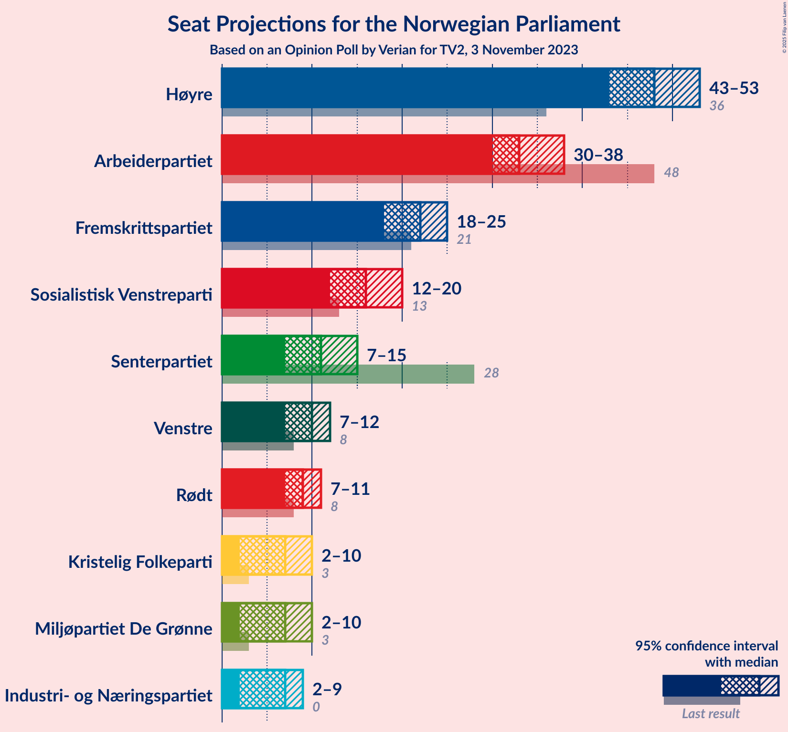

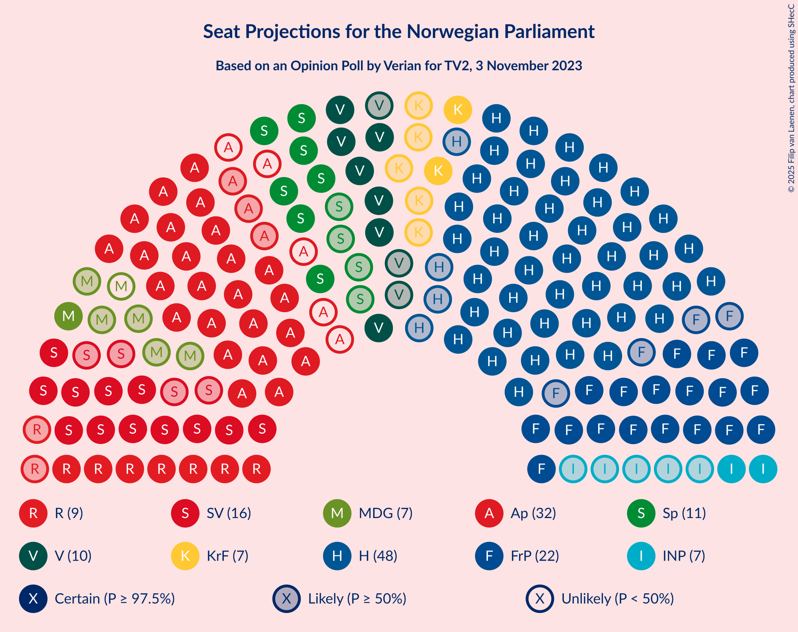

### Confidence Intervals

| Party | Last Result | Median | 80% Confidence Interval | 90% Confidence Interval | 95% Confidence Interval | 99% Confidence Interval |
|:-----:|:-----------:|:------:|:-----------------------:|:-----------------------:|:-----------------------:|:-----------------------:|
| <a href="#høyre">Høyre</a> | 36 | 48 | 45–51 |44–52 |43–53 |41–56 |
| <a href="#arbeiderpartiet">Arbeiderpartiet</a> | 48 | 33 | 31–35 |31–36 |30–38 |29–39 |
| <a href="#fremskrittspartiet">Fremskrittspartiet</a> | 21 | 22 | 20–24 |19–24 |18–25 |16–28 |
| <a href="#sosialistisk-venstreparti">Sosialistisk Venstreparti</a> | 13 | 16 | 14–18 |13–19 |12–20 |12–21 |
| <a href="#venstre">Venstre</a> | 8 | 10 | 8–12 |8–12 |7–12 |7–13 |
| <a href="#senterpartiet">Senterpartiet</a> | 28 | 11 | 8–13 |8–14 |7–15 |7–16 |
| <a href="#rødt">Rødt</a> | 8 | 9 | 7–10 |7–11 |7–11 |1–12 |
| <a href="#kristelig-folkeparti">Kristelig Folkeparti</a> | 3 | 7 | 6–9 |2–9 |2–10 |2–11 |
| <a href="#miljøpartiet-de-grønne">Miljøpartiet De Grønne</a> | 3 | 7 | 3–9 |3–9 |2–10 |2–10 |
| <a href="#industri--og-næringspartiet">Industri- og Næringspartiet</a> | 0 | 7 | 2–8 |2–8 |2–9 |2–10 |

### Høyre

*For a full overview of the results for this party, see the [Høyre](party-høyre.html) page.*

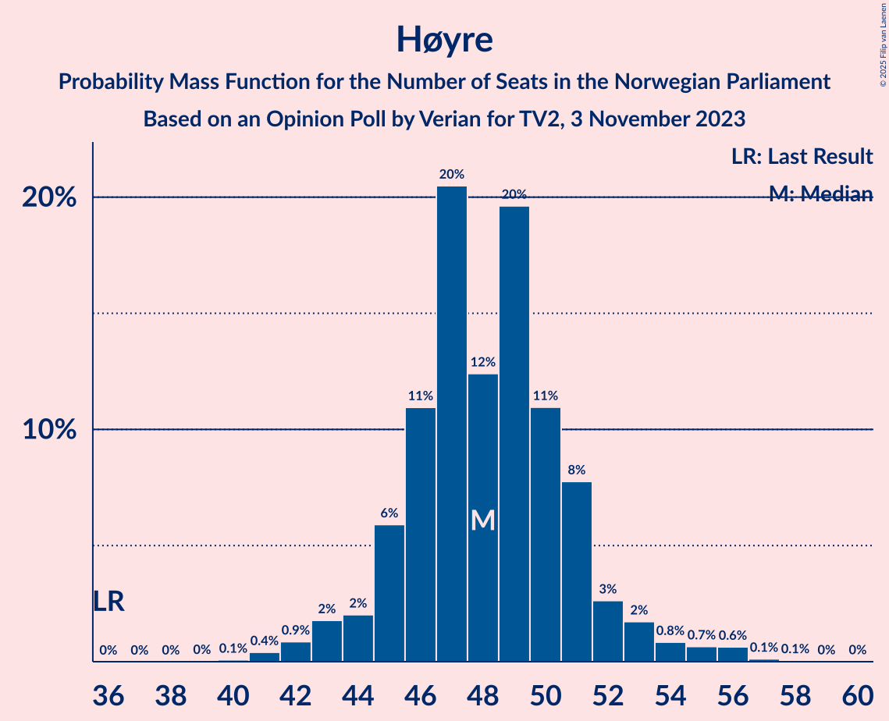

| Number of Seats | Probability | Accumulated | Special Marks |
|:---------------:|:-----------:|:-----------:|:-------------:|
| 36 | 0% | 100% | Last Result |
| 37 | 0% | 100% |  |
| 38 | 0% | 100% |  |
| 39 | 0% | 100% |  |
| 40 | 0.1% | 100% |  |
| 41 | 0.4% | 99.9% |  |
| 42 | 0.9% | 99.5% |  |
| 43 | 2% | 98.6% |  |
| 44 | 2% | 97% |  |
| 45 | 6% | 95% |  |
| 46 | 11% | 89% |  |
| 47 | 20% | 78% |  |
| 48 | 12% | 57% | Median |
| 49 | 20% | 45% |  |
| 50 | 11% | 25% |  |
| 51 | 8% | 14% |  |
| 52 | 3% | 7% |  |
| 53 | 2% | 4% |  |
| 54 | 0.8% | 2% |  |
| 55 | 0.7% | 2% |  |
| 56 | 0.6% | 0.9% |  |
| 57 | 0.1% | 0.2% |  |
| 58 | 0.1% | 0.1% |  |
| 59 | 0% | 0% |  |

### Arbeiderpartiet

*For a full overview of the results for this party, see the [Arbeiderpartiet](party-arbeiderpartiet.html) page.*

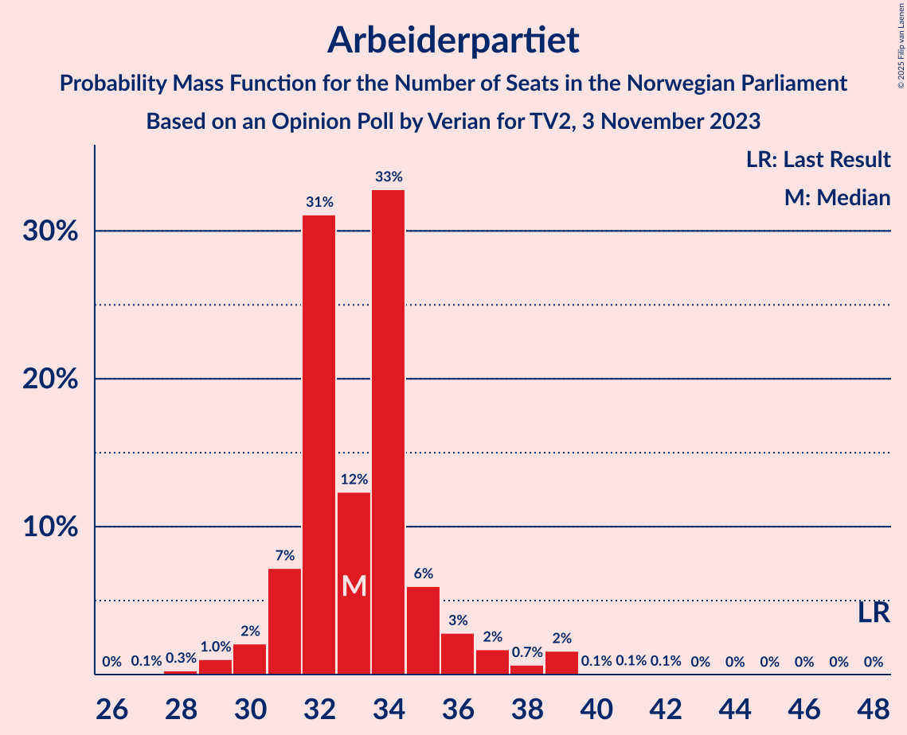

| Number of Seats | Probability | Accumulated | Special Marks |
|:---------------:|:-----------:|:-----------:|:-------------:|
| 26 | 0% | 100% |  |
| 27 | 0.1% | 99.9% |  |
| 28 | 0.3% | 99.9% |  |
| 29 | 1.0% | 99.6% |  |
| 30 | 2% | 98.6% |  |
| 31 | 7% | 96% |  |
| 32 | 31% | 89% |  |
| 33 | 12% | 58% | Median |
| 34 | 33% | 46% |  |
| 35 | 6% | 13% |  |
| 36 | 3% | 7% |  |
| 37 | 2% | 4% |  |
| 38 | 0.7% | 3% |  |
| 39 | 2% | 2% |  |
| 40 | 0.1% | 0.2% |  |
| 41 | 0.1% | 0.2% |  |
| 42 | 0.1% | 0.1% |  |
| 43 | 0% | 0% |  |
| 44 | 0% | 0% |  |
| 45 | 0% | 0% |  |
| 46 | 0% | 0% |  |
| 47 | 0% | 0% |  |
| 48 | 0% | 0% | Last Result |

### Fremskrittspartiet

*For a full overview of the results for this party, see the [Fremskrittspartiet](party-fremskrittspartiet.html) page.*

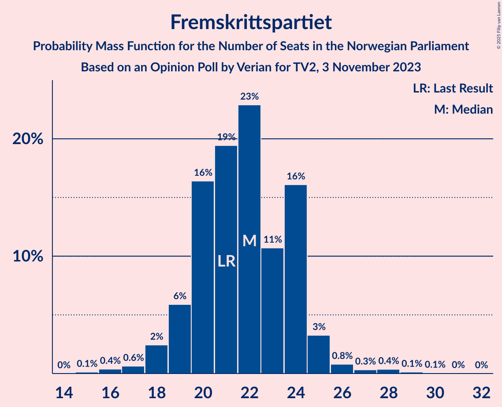

| Number of Seats | Probability | Accumulated | Special Marks |
|:---------------:|:-----------:|:-----------:|:-------------:|
| 15 | 0.1% | 100% |  |
| 16 | 0.4% | 99.9% |  |
| 17 | 0.6% | 99.5% |  |
| 18 | 2% | 98.8% |  |
| 19 | 6% | 96% |  |
| 20 | 16% | 91% |  |
| 21 | 19% | 74% | Last Result |
| 22 | 23% | 55% | Median |
| 23 | 11% | 32% |  |
| 24 | 16% | 21% |  |
| 25 | 3% | 5% |  |
| 26 | 0.8% | 2% |  |
| 27 | 0.3% | 0.9% |  |
| 28 | 0.4% | 0.6% |  |
| 29 | 0.1% | 0.2% |  |
| 30 | 0.1% | 0.1% |  |
| 31 | 0% | 0% |  |

### Sosialistisk Venstreparti

*For a full overview of the results for this party, see the [Sosialistisk Venstreparti](party-sosialistiskvenstreparti.html) page.*

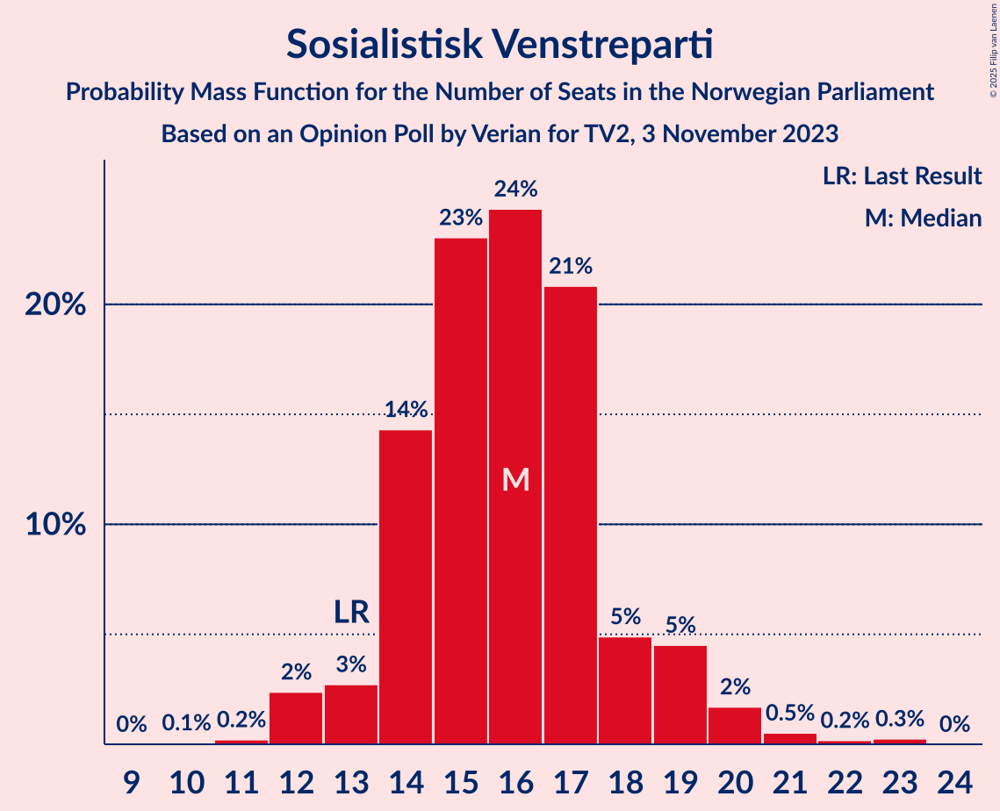

| Number of Seats | Probability | Accumulated | Special Marks |
|:---------------:|:-----------:|:-----------:|:-------------:|
| 10 | 0.1% | 100% |  |
| 11 | 0.2% | 99.9% |  |
| 12 | 2% | 99.7% |  |
| 13 | 3% | 97% | Last Result |
| 14 | 14% | 95% |  |
| 15 | 23% | 80% |  |
| 16 | 24% | 57% | Median |
| 17 | 21% | 33% |  |
| 18 | 5% | 12% |  |
| 19 | 5% | 7% |  |
| 20 | 2% | 3% |  |
| 21 | 0.5% | 1.0% |  |
| 22 | 0.2% | 0.4% |  |
| 23 | 0.3% | 0.3% |  |
| 24 | 0% | 0% |  |

### Venstre

*For a full overview of the results for this party, see the [Venstre](party-venstre.html) page.*

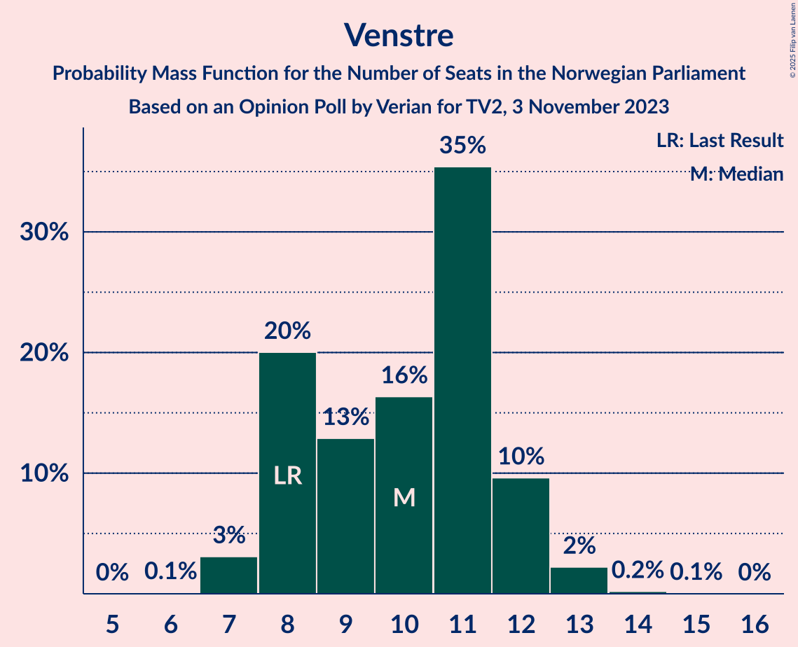

| Number of Seats | Probability | Accumulated | Special Marks |
|:---------------:|:-----------:|:-----------:|:-------------:|
| 6 | 0.1% | 100% |  |
| 7 | 3% | 99.9% |  |
| 8 | 20% | 97% | Last Result |
| 9 | 13% | 77% |  |
| 10 | 16% | 64% | Median |
| 11 | 35% | 48% |  |
| 12 | 10% | 12% |  |
| 13 | 2% | 2% |  |
| 14 | 0.2% | 0.3% |  |
| 15 | 0.1% | 0.1% |  |
| 16 | 0% | 0% |  |

### Senterpartiet

*For a full overview of the results for this party, see the [Senterpartiet](party-senterpartiet.html) page.*

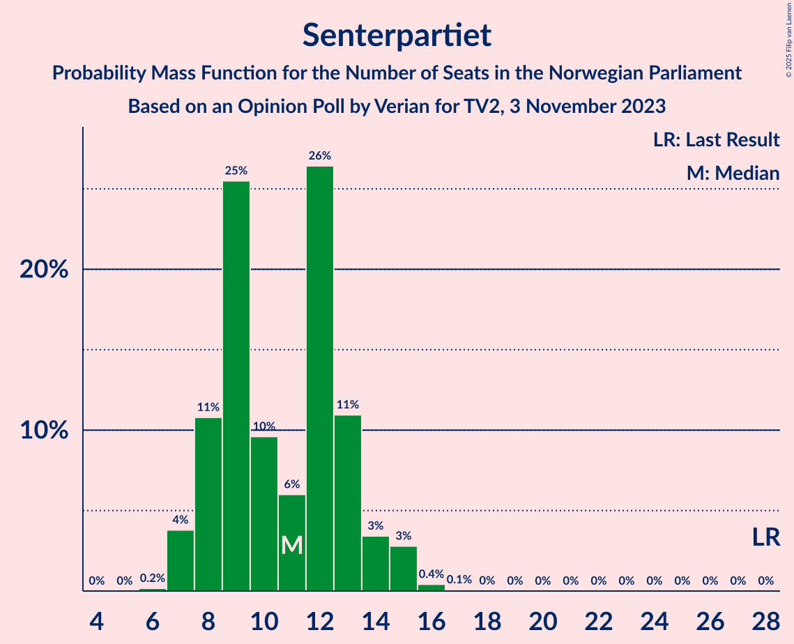

| Number of Seats | Probability | Accumulated | Special Marks |
|:---------------:|:-----------:|:-----------:|:-------------:|
| 6 | 0.2% | 100% |  |
| 7 | 4% | 99.8% |  |
| 8 | 11% | 96% |  |
| 9 | 25% | 85% |  |
| 10 | 10% | 60% |  |
| 11 | 6% | 50% | Median |
| 12 | 26% | 44% |  |
| 13 | 11% | 18% |  |
| 14 | 3% | 7% |  |
| 15 | 3% | 3% |  |
| 16 | 0.4% | 0.5% |  |
| 17 | 0.1% | 0.1% |  |
| 18 | 0% | 0% |  |
| 19 | 0% | 0% |  |
| 20 | 0% | 0% |  |
| 21 | 0% | 0% |  |
| 22 | 0% | 0% |  |
| 23 | 0% | 0% |  |
| 24 | 0% | 0% |  |
| 25 | 0% | 0% |  |
| 26 | 0% | 0% |  |
| 27 | 0% | 0% |  |
| 28 | 0% | 0% | Last Result |

### Rødt

*For a full overview of the results for this party, see the [Rødt](party-rødt.html) page.*

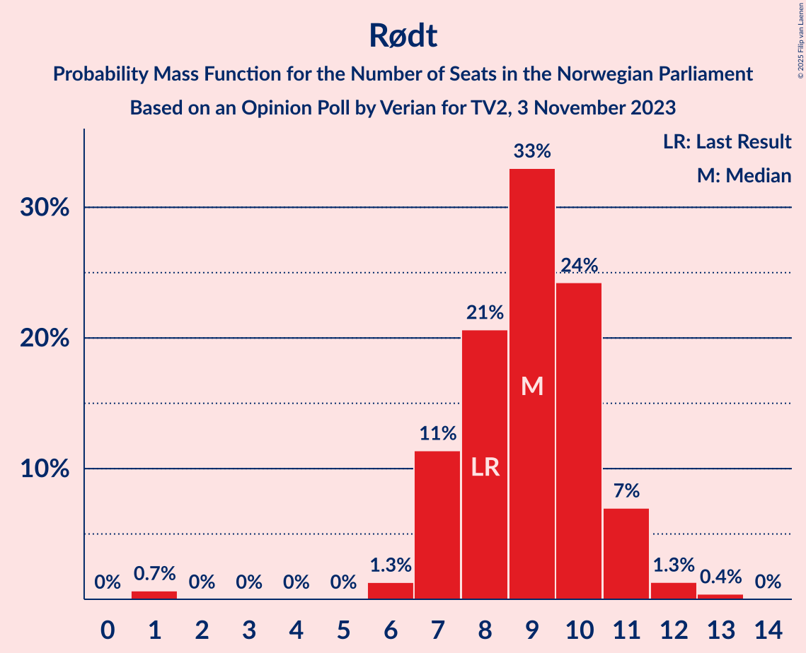

| Number of Seats | Probability | Accumulated | Special Marks |
|:---------------:|:-----------:|:-----------:|:-------------:|
| 1 | 0.7% | 100% |  |
| 2 | 0% | 99.3% |  |
| 3 | 0% | 99.3% |  |
| 4 | 0% | 99.3% |  |
| 5 | 0% | 99.3% |  |
| 6 | 1.3% | 99.3% |  |
| 7 | 11% | 98% |  |
| 8 | 21% | 87% | Last Result |
| 9 | 33% | 66% | Median |
| 10 | 24% | 33% |  |
| 11 | 7% | 9% |  |
| 12 | 1.3% | 2% |  |
| 13 | 0.4% | 0.4% |  |
| 14 | 0% | 0% |  |

### Kristelig Folkeparti

*For a full overview of the results for this party, see the [Kristelig Folkeparti](party-kristeligfolkeparti.html) page.*

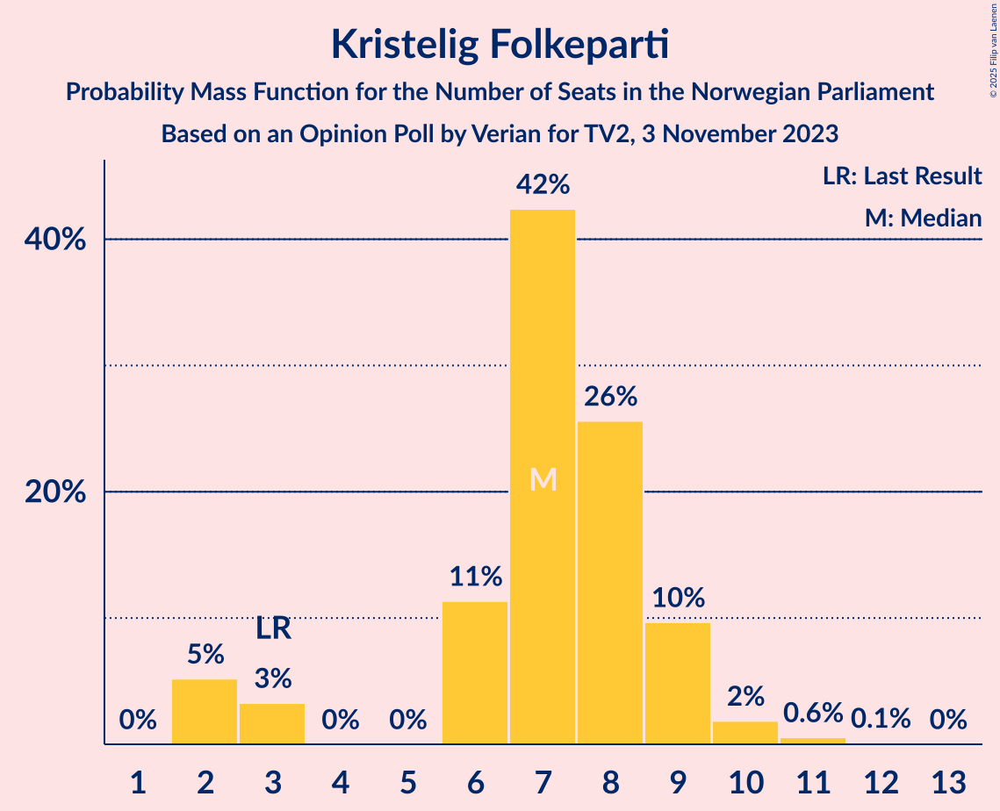

| Number of Seats | Probability | Accumulated | Special Marks |
|:---------------:|:-----------:|:-----------:|:-------------:|
| 2 | 5% | 100% |  |
| 3 | 3% | 95% | Last Result |
| 4 | 0% | 92% |  |
| 5 | 0% | 92% |  |
| 6 | 11% | 92% |  |
| 7 | 42% | 80% | Median |
| 8 | 26% | 38% |  |
| 9 | 10% | 12% |  |
| 10 | 2% | 3% |  |
| 11 | 0.6% | 0.7% |  |
| 12 | 0.1% | 0.1% |  |
| 13 | 0% | 0% |  |

### Miljøpartiet De Grønne

*For a full overview of the results for this party, see the [Miljøpartiet De Grønne](party-miljøpartietdegrønne.html) page.*

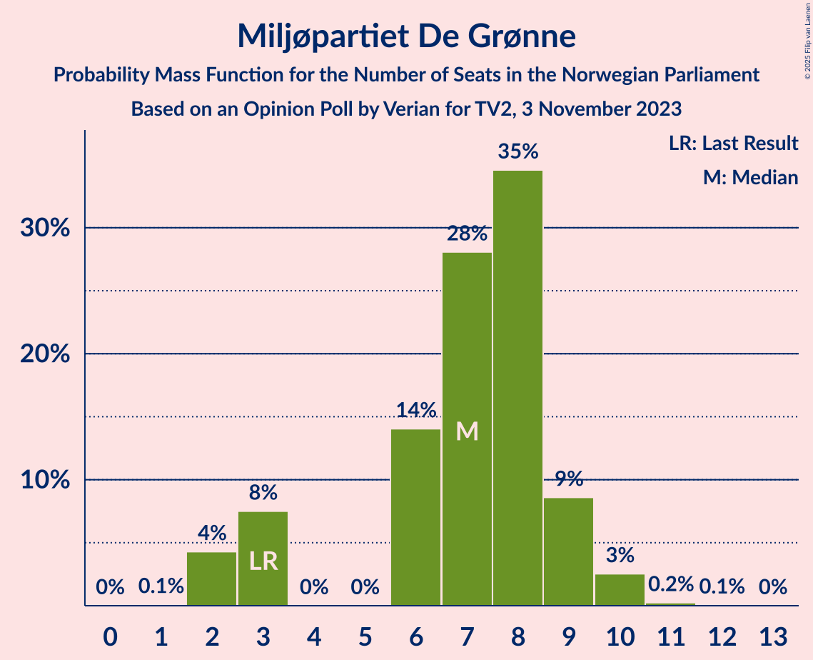

| Number of Seats | Probability | Accumulated | Special Marks |
|:---------------:|:-----------:|:-----------:|:-------------:|
| 1 | 0.1% | 100% |  |
| 2 | 4% | 99.9% |  |
| 3 | 8% | 96% | Last Result |
| 4 | 0% | 88% |  |
| 5 | 0% | 88% |  |
| 6 | 14% | 88% |  |
| 7 | 28% | 74% | Median |
| 8 | 35% | 46% |  |
| 9 | 9% | 11% |  |
| 10 | 3% | 3% |  |
| 11 | 0.2% | 0.3% |  |
| 12 | 0.1% | 0.1% |  |
| 13 | 0% | 0% |  |

### Industri- og Næringspartiet

*For a full overview of the results for this party, see the [Industri- og Næringspartiet](party-industri-ognæringspartiet.html) page.*

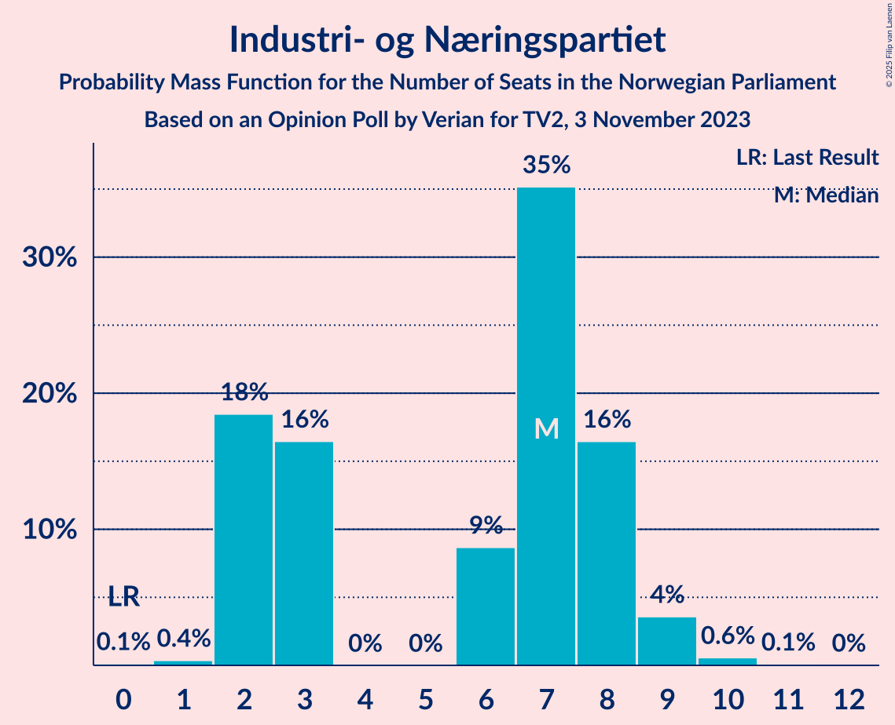

| Number of Seats | Probability | Accumulated | Special Marks |
|:---------------:|:-----------:|:-----------:|:-------------:|
| 0 | 0.1% | 100% | Last Result |
| 1 | 0.4% | 99.9% |  |
| 2 | 18% | 99.5% |  |
| 3 | 16% | 81% |  |
| 4 | 0% | 65% |  |
| 5 | 0% | 65% |  |
| 6 | 9% | 65% |  |
| 7 | 35% | 56% | Median |
| 8 | 16% | 21% |  |
| 9 | 4% | 4% |  |
| 10 | 0.6% | 0.7% |  |
| 11 | 0.1% | 0.1% |  |
| 12 | 0% | 0% |  |

## Coalitions

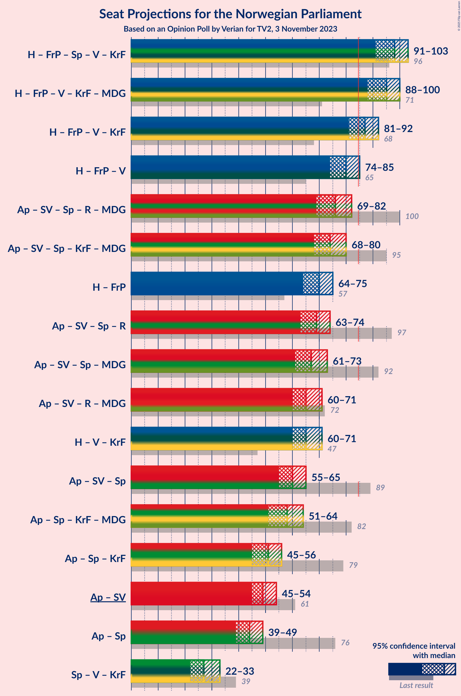

### Confidence Intervals

| Coalition | Last Result | Median | Majority? | 80% Confidence Interval | 90% Confidence Interval | 95% Confidence Interval | 99% Confidence Interval |
|:---------:|:-----------:|:------:|:---------:|:-----------------------:|:-----------------------:|:-----------------------:|:-----------------------:|
| Høyre – Fremskrittspartiet – Senterpartiet – Venstre – Kristelig Folkeparti | 96 | 98 | 100% | 94–101 | 93–101 | 91–103 | 89–105 |
| Høyre – Fremskrittspartiet – Venstre – Kristelig Folkeparti – Miljøpartiet De Grønne | 71 | 95 | 99.7% | 90–97 | 89–98 | 88–100 | 86–101 |
| Høyre – Fremskrittspartiet – Venstre – Kristelig Folkeparti | 68 | 87 | 76% | 83–90 | 81–92 | 81–92 | 79–95 |
| Høyre – Fremskrittspartiet – Venstre | 65 | 80 | 3% | 77–83 | 75–84 | 74–85 | 72–87 |
| Arbeiderpartiet – Sosialistisk Venstreparti – Senterpartiet – Rødt – Miljøpartiet De Grønne | 100 | 76 | 0.6% | 71–79 | 71–80 | 69–82 | 67–85 |
| Arbeiderpartiet – Sosialistisk Venstreparti – Senterpartiet – Kristelig Folkeparti – Miljøpartiet De Grønne | 95 | 74 | 0% | 70–77 | 69–79 | 68–80 | 65–83 |
| Høyre – Fremskrittspartiet | 57 | 70 | 0% | 66–73 | 66–74 | 64–75 | 62–77 |
| Arbeiderpartiet – Sosialistisk Venstreparti – Senterpartiet – Rødt | 97 | 69 | 0% | 64–72 | 64–73 | 63–74 | 61–77 |
| Arbeiderpartiet – Sosialistisk Venstreparti – Senterpartiet – Miljøpartiet De Grønne | 92 | 67 | 0% | 64–70 | 62–71 | 61–73 | 59–75 |
| Arbeiderpartiet – Sosialistisk Venstreparti – Rødt – Miljøpartiet De Grønne | 72 | 65 | 0% | 61–68 | 61–69 | 60–71 | 57–72 |
| Høyre – Venstre – Kristelig Folkeparti | 47 | 65 | 0% | 61–69 | 61–70 | 60–71 | 58–73 |
| Arbeiderpartiet – Sosialistisk Venstreparti – Senterpartiet | 89 | 60 | 0% | 56–63 | 56–64 | 55–65 | 53–67 |
| Arbeiderpartiet – Senterpartiet – Kristelig Folkeparti – Miljøpartiet De Grønne | 82 | 58 | 0% | 54–62 | 53–63 | 51–64 | 49–66 |
| Arbeiderpartiet – Senterpartiet – Kristelig Folkeparti | 79 | 51 | 0% | 47–55 | 46–56 | 45–56 | 42–58 |
| Arbeiderpartiet – Sosialistisk Venstreparti | 61 | 49 | 0% | 47–52 | 46–53 | 45–54 | 44–56 |
| Arbeiderpartiet – Senterpartiet | 76 | 44 | 0% | 40–47 | 40–48 | 39–49 | 37–50 |
| Senterpartiet – Venstre – Kristelig Folkeparti | 39 | 27 | 0% | 24–31 | 23–32 | 22–33 | 20–35 |

### Høyre – Fremskrittspartiet – Senterpartiet – Venstre – Kristelig Folkeparti

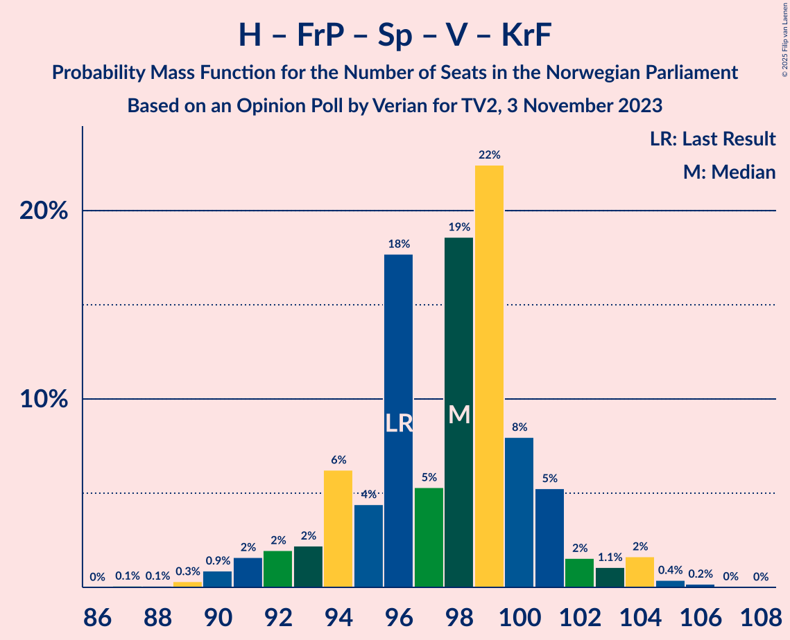

| Number of Seats | Probability | Accumulated | Special Marks |
|:---------------:|:-----------:|:-----------:|:-------------:|
| 87 | 0.1% | 100% |  |
| 88 | 0.1% | 99.9% |  |
| 89 | 0.3% | 99.8% |  |
| 90 | 0.9% | 99.5% |  |
| 91 | 2% | 98.6% |  |
| 92 | 2% | 97% |  |
| 93 | 2% | 95% |  |
| 94 | 6% | 93% |  |
| 95 | 4% | 87% |  |
| 96 | 18% | 82% | Last Result |
| 97 | 5% | 64% |  |
| 98 | 19% | 59% | Median |
| 99 | 22% | 41% |  |
| 100 | 8% | 18% |  |
| 101 | 5% | 10% |  |
| 102 | 2% | 5% |  |
| 103 | 1.1% | 3% |  |
| 104 | 2% | 2% |  |
| 105 | 0.4% | 0.7% |  |
| 106 | 0.2% | 0.3% |  |
| 107 | 0% | 0.1% |  |
| 108 | 0% | 0% |  |

### Høyre – Fremskrittspartiet – Venstre – Kristelig Folkeparti – Miljøpartiet De Grønne

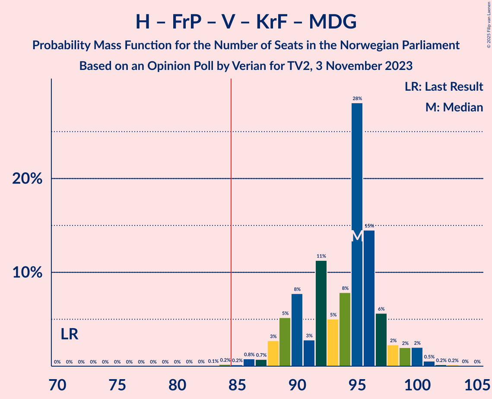

| Number of Seats | Probability | Accumulated | Special Marks |
|:---------------:|:-----------:|:-----------:|:-------------:|
| 71 | 0% | 100% | Last Result |
| 72 | 0% | 100% |  |
| 73 | 0% | 100% |  |
| 74 | 0% | 100% |  |
| 75 | 0% | 100% |  |
| 76 | 0% | 100% |  |
| 77 | 0% | 100% |  |
| 78 | 0% | 100% |  |
| 79 | 0% | 100% |  |
| 80 | 0% | 100% |  |
| 81 | 0% | 100% |  |
| 82 | 0% | 100% |  |
| 83 | 0.1% | 99.9% |  |
| 84 | 0.2% | 99.9% |  |
| 85 | 0.2% | 99.7% | Majority |
| 86 | 0.8% | 99.5% |  |
| 87 | 0.7% | 98.7% |  |
| 88 | 3% | 98% |  |
| 89 | 5% | 95% |  |
| 90 | 8% | 90% |  |
| 91 | 3% | 82% |  |
| 92 | 11% | 80% |  |
| 93 | 5% | 68% |  |
| 94 | 8% | 63% | Median |
| 95 | 28% | 55% |  |
| 96 | 15% | 27% |  |
| 97 | 6% | 13% |  |
| 98 | 2% | 7% |  |
| 99 | 2% | 5% |  |
| 100 | 2% | 3% |  |
| 101 | 0.5% | 0.9% |  |
| 102 | 0.2% | 0.4% |  |
| 103 | 0.2% | 0.2% |  |
| 104 | 0% | 0.1% |  |
| 105 | 0% | 0% |  |

### Høyre – Fremskrittspartiet – Venstre – Kristelig Folkeparti

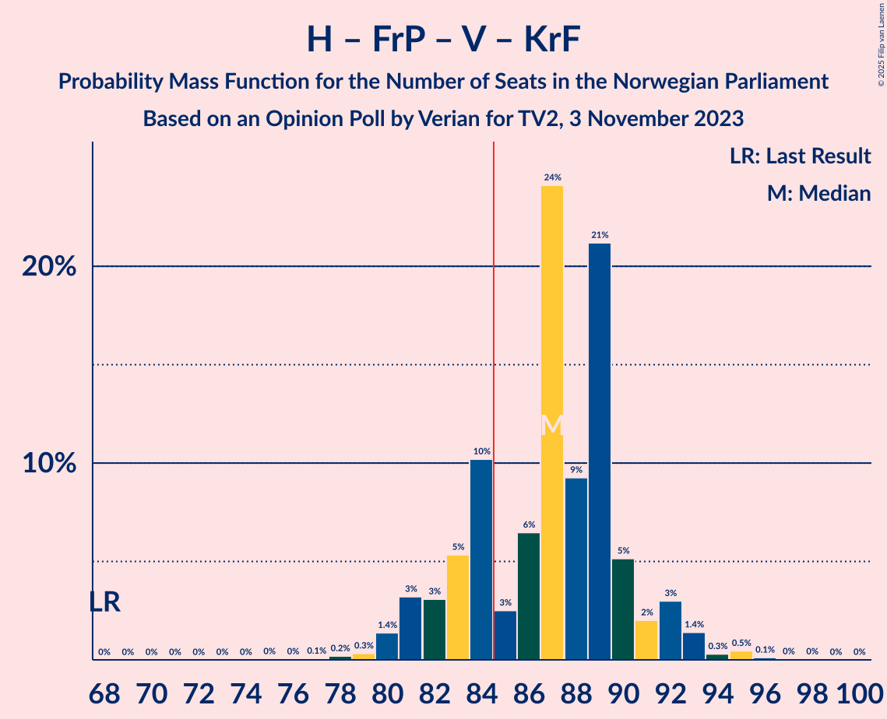

| Number of Seats | Probability | Accumulated | Special Marks |
|:---------------:|:-----------:|:-----------:|:-------------:|
| 68 | 0% | 100% | Last Result |
| 69 | 0% | 100% |  |
| 70 | 0% | 100% |  |
| 71 | 0% | 100% |  |
| 72 | 0% | 100% |  |
| 73 | 0% | 100% |  |
| 74 | 0% | 100% |  |
| 75 | 0% | 100% |  |
| 76 | 0% | 99.9% |  |
| 77 | 0.1% | 99.9% |  |
| 78 | 0.2% | 99.8% |  |
| 79 | 0.3% | 99.6% |  |
| 80 | 1.4% | 99.3% |  |
| 81 | 3% | 98% |  |
| 82 | 3% | 95% |  |
| 83 | 5% | 92% |  |
| 84 | 10% | 86% |  |
| 85 | 3% | 76% | Majority |
| 86 | 6% | 74% |  |
| 87 | 24% | 67% | Median |
| 88 | 9% | 43% |  |
| 89 | 21% | 34% |  |
| 90 | 5% | 13% |  |
| 91 | 2% | 7% |  |
| 92 | 3% | 5% |  |
| 93 | 1.4% | 2% |  |
| 94 | 0.3% | 1.0% |  |
| 95 | 0.5% | 0.7% |  |
| 96 | 0.1% | 0.2% |  |
| 97 | 0% | 0.1% |  |
| 98 | 0% | 0.1% |  |
| 99 | 0% | 0% |  |

### Høyre – Fremskrittspartiet – Venstre

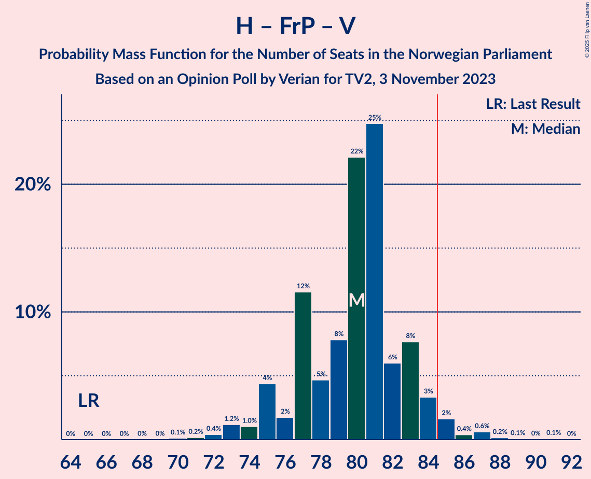

| Number of Seats | Probability | Accumulated | Special Marks |
|:---------------:|:-----------:|:-----------:|:-------------:|
| 65 | 0% | 100% | Last Result |
| 66 | 0% | 100% |  |
| 67 | 0% | 100% |  |
| 68 | 0% | 100% |  |
| 69 | 0% | 100% |  |
| 70 | 0.1% | 100% |  |
| 71 | 0.2% | 99.9% |  |
| 72 | 0.4% | 99.7% |  |
| 73 | 1.2% | 99.3% |  |
| 74 | 1.0% | 98% |  |
| 75 | 4% | 97% |  |
| 76 | 2% | 93% |  |
| 77 | 12% | 91% |  |
| 78 | 5% | 79% |  |
| 79 | 8% | 75% |  |
| 80 | 22% | 67% | Median |
| 81 | 25% | 45% |  |
| 82 | 6% | 20% |  |
| 83 | 8% | 14% |  |
| 84 | 3% | 6% |  |
| 85 | 2% | 3% | Majority |
| 86 | 0.4% | 1.4% |  |
| 87 | 0.6% | 1.0% |  |
| 88 | 0.2% | 0.4% |  |
| 89 | 0.1% | 0.2% |  |
| 90 | 0% | 0.1% |  |
| 91 | 0.1% | 0.1% |  |
| 92 | 0% | 0% |  |

### Arbeiderpartiet – Sosialistisk Venstreparti – Senterpartiet – Rødt – Miljøpartiet De Grønne

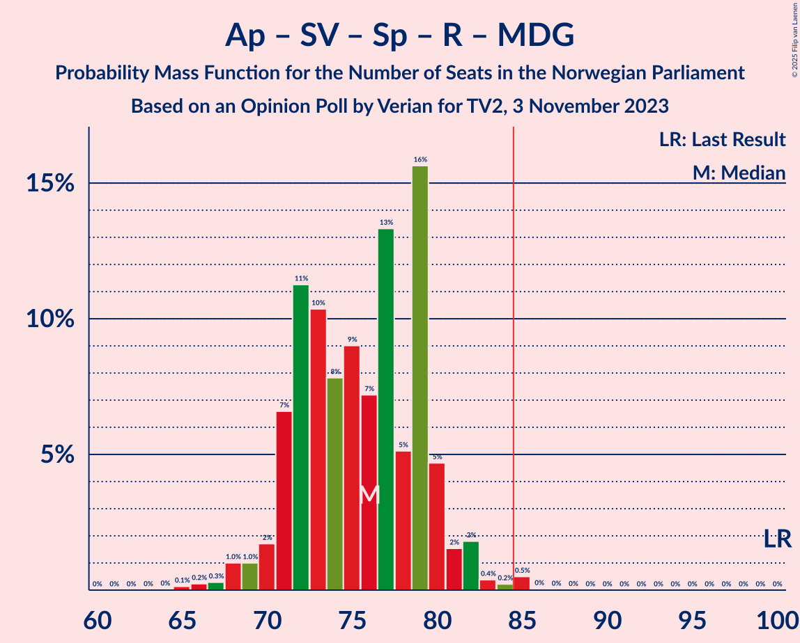

| Number of Seats | Probability | Accumulated | Special Marks |
|:---------------:|:-----------:|:-----------:|:-------------:|
| 65 | 0.1% | 100% |  |
| 66 | 0.2% | 99.8% |  |
| 67 | 0.3% | 99.6% |  |
| 68 | 1.0% | 99.3% |  |
| 69 | 1.0% | 98% |  |
| 70 | 2% | 97% |  |
| 71 | 7% | 96% |  |
| 72 | 11% | 89% |  |
| 73 | 10% | 78% |  |
| 74 | 8% | 67% |  |
| 75 | 9% | 60% |  |
| 76 | 7% | 51% | Median |
| 77 | 13% | 43% |  |
| 78 | 5% | 30% |  |
| 79 | 16% | 25% |  |
| 80 | 5% | 9% |  |
| 81 | 2% | 5% |  |
| 82 | 2% | 3% |  |
| 83 | 0.4% | 1.2% |  |
| 84 | 0.2% | 0.8% |  |
| 85 | 0.5% | 0.6% | Majority |
| 86 | 0% | 0.1% |  |
| 87 | 0% | 0% |  |
| 88 | 0% | 0% |  |
| 89 | 0% | 0% |  |
| 90 | 0% | 0% |  |
| 91 | 0% | 0% |  |
| 92 | 0% | 0% |  |
| 93 | 0% | 0% |  |
| 94 | 0% | 0% |  |
| 95 | 0% | 0% |  |
| 96 | 0% | 0% |  |
| 97 | 0% | 0% |  |
| 98 | 0% | 0% |  |
| 99 | 0% | 0% |  |
| 100 | 0% | 0% | Last Result |

### Arbeiderpartiet – Sosialistisk Venstreparti – Senterpartiet – Kristelig Folkeparti – Miljøpartiet De Grønne

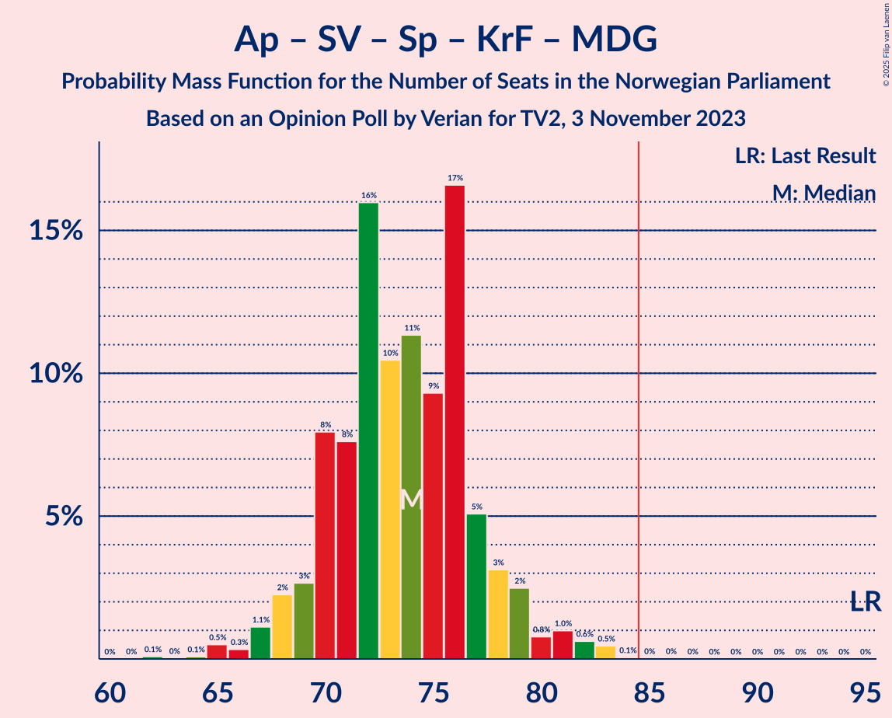

| Number of Seats | Probability | Accumulated | Special Marks |
|:---------------:|:-----------:|:-----------:|:-------------:|
| 62 | 0.1% | 100% |  |
| 63 | 0% | 99.9% |  |
| 64 | 0.1% | 99.9% |  |
| 65 | 0.5% | 99.8% |  |
| 66 | 0.3% | 99.3% |  |
| 67 | 1.1% | 98.9% |  |
| 68 | 2% | 98% |  |
| 69 | 3% | 96% |  |
| 70 | 8% | 93% |  |
| 71 | 8% | 85% |  |
| 72 | 16% | 77% |  |
| 73 | 10% | 61% |  |
| 74 | 11% | 51% | Median |
| 75 | 9% | 40% |  |
| 76 | 17% | 30% |  |
| 77 | 5% | 14% |  |
| 78 | 3% | 9% |  |
| 79 | 2% | 5% |  |
| 80 | 0.8% | 3% |  |
| 81 | 1.0% | 2% |  |
| 82 | 0.6% | 1.2% |  |
| 83 | 0.5% | 0.6% |  |
| 84 | 0.1% | 0.1% |  |
| 85 | 0% | 0% | Majority |
| 86 | 0% | 0% |  |
| 87 | 0% | 0% |  |
| 88 | 0% | 0% |  |
| 89 | 0% | 0% |  |
| 90 | 0% | 0% |  |
| 91 | 0% | 0% |  |
| 92 | 0% | 0% |  |
| 93 | 0% | 0% |  |
| 94 | 0% | 0% |  |
| 95 | 0% | 0% | Last Result |

### Høyre – Fremskrittspartiet

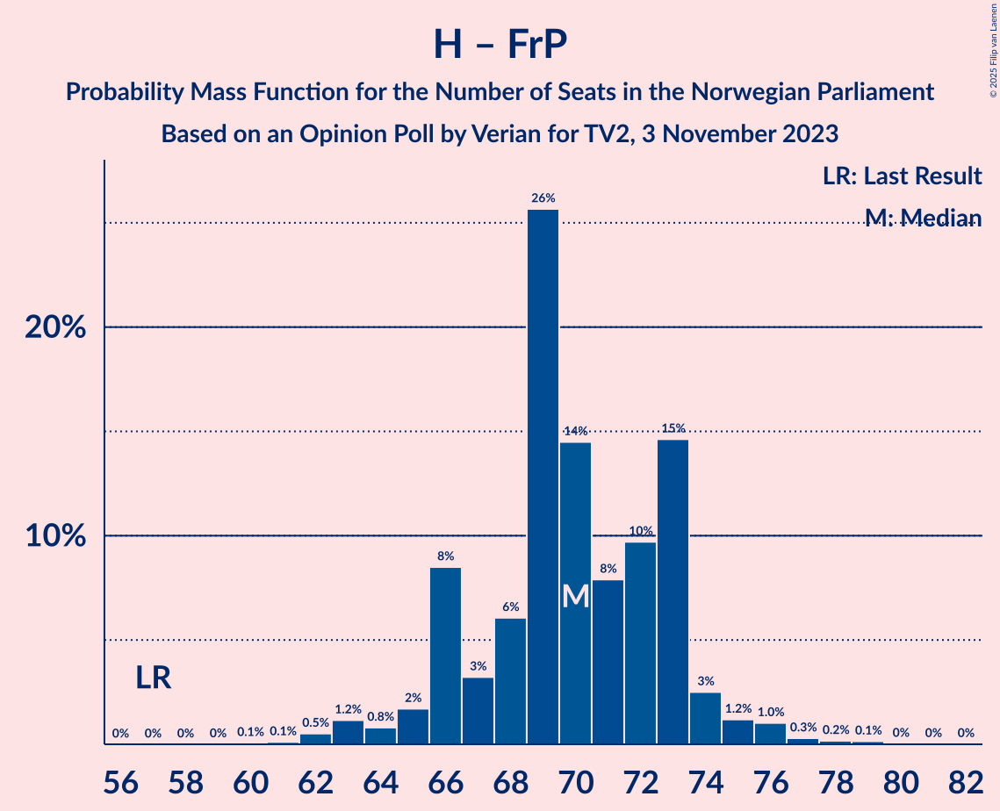

| Number of Seats | Probability | Accumulated | Special Marks |
|:---------------:|:-----------:|:-----------:|:-------------:|
| 57 | 0% | 100% | Last Result |
| 58 | 0% | 100% |  |
| 59 | 0% | 100% |  |
| 60 | 0.1% | 100% |  |
| 61 | 0.1% | 99.9% |  |
| 62 | 0.5% | 99.8% |  |
| 63 | 1.2% | 99.3% |  |
| 64 | 0.8% | 98% |  |
| 65 | 2% | 97% |  |
| 66 | 8% | 96% |  |
| 67 | 3% | 87% |  |
| 68 | 6% | 84% |  |
| 69 | 26% | 78% |  |
| 70 | 14% | 52% | Median |
| 71 | 8% | 38% |  |
| 72 | 10% | 30% |  |
| 73 | 15% | 20% |  |
| 74 | 3% | 5% |  |
| 75 | 1.2% | 3% |  |
| 76 | 1.0% | 2% |  |
| 77 | 0.3% | 0.7% |  |
| 78 | 0.2% | 0.4% |  |
| 79 | 0.1% | 0.2% |  |
| 80 | 0% | 0.1% |  |
| 81 | 0% | 0.1% |  |
| 82 | 0% | 0% |  |

### Arbeiderpartiet – Sosialistisk Venstreparti – Senterpartiet – Rødt

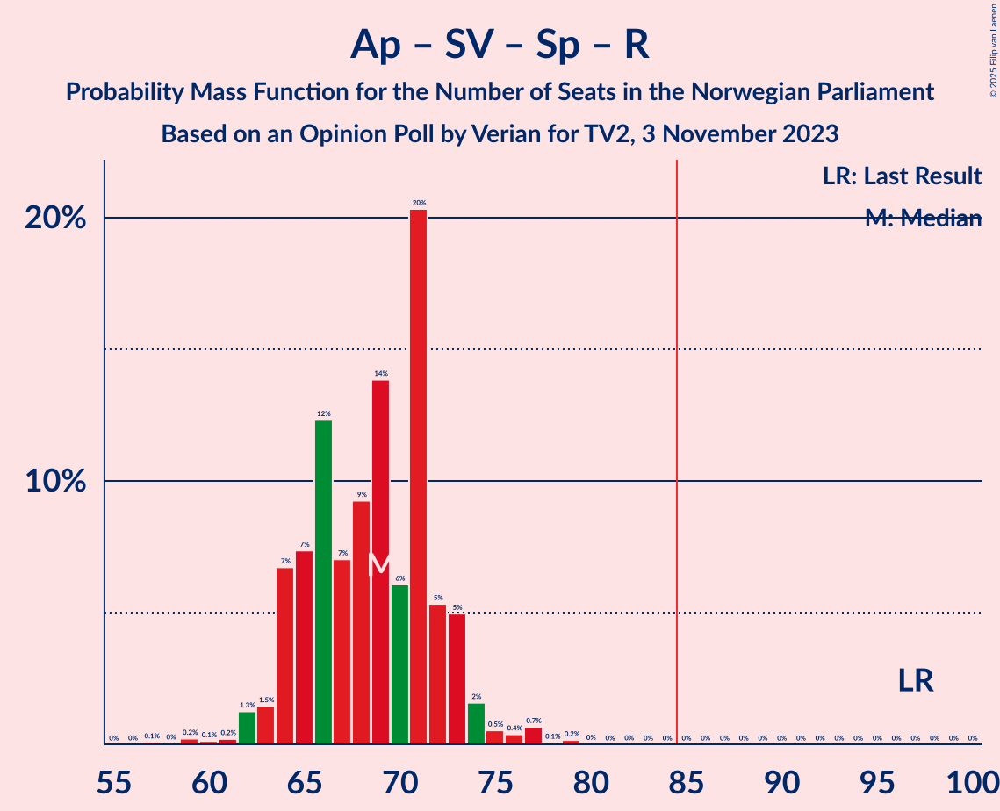

| Number of Seats | Probability | Accumulated | Special Marks |
|:---------------:|:-----------:|:-----------:|:-------------:|
| 57 | 0.1% | 100% |  |
| 58 | 0% | 99.9% |  |
| 59 | 0.2% | 99.9% |  |
| 60 | 0.1% | 99.7% |  |
| 61 | 0.2% | 99.5% |  |
| 62 | 1.3% | 99.3% |  |
| 63 | 1.5% | 98% |  |
| 64 | 7% | 97% |  |
| 65 | 7% | 90% |  |
| 66 | 12% | 83% |  |
| 67 | 7% | 70% |  |
| 68 | 9% | 63% |  |
| 69 | 14% | 54% | Median |
| 70 | 6% | 40% |  |
| 71 | 20% | 34% |  |
| 72 | 5% | 14% |  |
| 73 | 5% | 8% |  |
| 74 | 2% | 3% |  |
| 75 | 0.5% | 2% |  |
| 76 | 0.4% | 1.3% |  |
| 77 | 0.7% | 0.9% |  |
| 78 | 0.1% | 0.3% |  |
| 79 | 0.2% | 0.2% |  |
| 80 | 0% | 0% |  |
| 81 | 0% | 0% |  |
| 82 | 0% | 0% |  |
| 83 | 0% | 0% |  |
| 84 | 0% | 0% |  |
| 85 | 0% | 0% | Majority |
| 86 | 0% | 0% |  |
| 87 | 0% | 0% |  |
| 88 | 0% | 0% |  |
| 89 | 0% | 0% |  |
| 90 | 0% | 0% |  |
| 91 | 0% | 0% |  |
| 92 | 0% | 0% |  |
| 93 | 0% | 0% |  |
| 94 | 0% | 0% |  |
| 95 | 0% | 0% |  |
| 96 | 0% | 0% |  |
| 97 | 0% | 0% | Last Result |

### Arbeiderpartiet – Sosialistisk Venstreparti – Senterpartiet – Miljøpartiet De Grønne

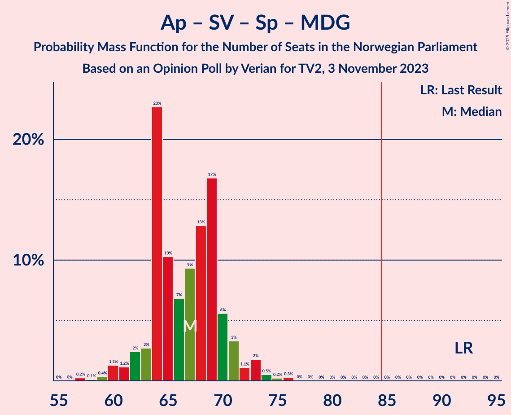

| Number of Seats | Probability | Accumulated | Special Marks |
|:---------------:|:-----------:|:-----------:|:-------------:|
| 57 | 0.2% | 100% |  |
| 58 | 0.1% | 99.7% |  |
| 59 | 0.4% | 99.6% |  |
| 60 | 1.3% | 99.3% |  |
| 61 | 1.2% | 98% |  |
| 62 | 2% | 97% |  |
| 63 | 3% | 94% |  |
| 64 | 23% | 92% |  |
| 65 | 10% | 69% |  |
| 66 | 7% | 59% |  |
| 67 | 9% | 52% | Median |
| 68 | 13% | 43% |  |
| 69 | 17% | 30% |  |
| 70 | 6% | 13% |  |
| 71 | 3% | 7% |  |
| 72 | 1.1% | 4% |  |
| 73 | 2% | 3% |  |
| 74 | 0.5% | 1.1% |  |
| 75 | 0.2% | 0.6% |  |
| 76 | 0.3% | 0.3% |  |
| 77 | 0% | 0.1% |  |
| 78 | 0% | 0% |  |
| 79 | 0% | 0% |  |
| 80 | 0% | 0% |  |
| 81 | 0% | 0% |  |
| 82 | 0% | 0% |  |
| 83 | 0% | 0% |  |
| 84 | 0% | 0% |  |
| 85 | 0% | 0% | Majority |
| 86 | 0% | 0% |  |
| 87 | 0% | 0% |  |
| 88 | 0% | 0% |  |
| 89 | 0% | 0% |  |
| 90 | 0% | 0% |  |
| 91 | 0% | 0% |  |
| 92 | 0% | 0% | Last Result |

### Arbeiderpartiet – Sosialistisk Venstreparti – Rødt – Miljøpartiet De Grønne

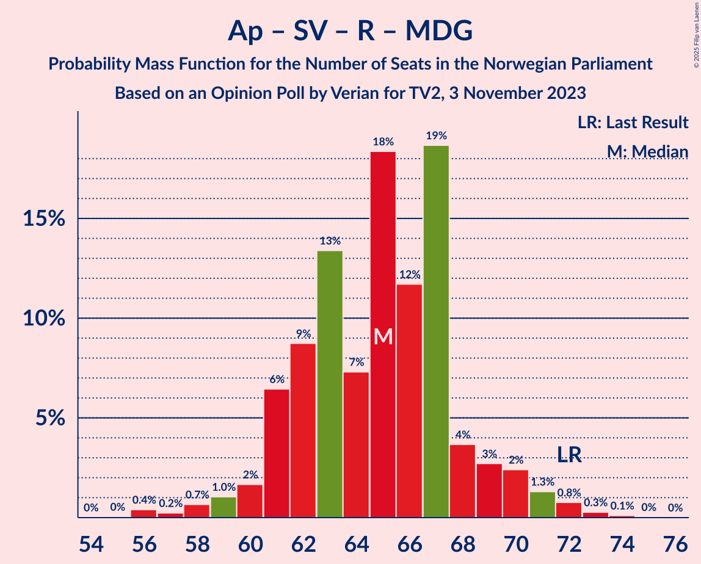

| Number of Seats | Probability | Accumulated | Special Marks |
|:---------------:|:-----------:|:-----------:|:-------------:|
| 55 | 0% | 100% |  |
| 56 | 0.4% | 99.9% |  |
| 57 | 0.2% | 99.5% |  |
| 58 | 0.7% | 99.3% |  |
| 59 | 1.0% | 98.6% |  |
| 60 | 2% | 98% |  |
| 61 | 6% | 96% |  |
| 62 | 9% | 89% |  |
| 63 | 13% | 81% |  |
| 64 | 7% | 67% |  |
| 65 | 18% | 60% | Median |
| 66 | 12% | 42% |  |
| 67 | 19% | 30% |  |
| 68 | 4% | 11% |  |
| 69 | 3% | 8% |  |
| 70 | 2% | 5% |  |
| 71 | 1.3% | 3% |  |
| 72 | 0.8% | 1.2% | Last Result |
| 73 | 0.3% | 0.4% |  |
| 74 | 0.1% | 0.2% |  |
| 75 | 0% | 0.1% |  |
| 76 | 0% | 0% |  |

### Høyre – Venstre – Kristelig Folkeparti

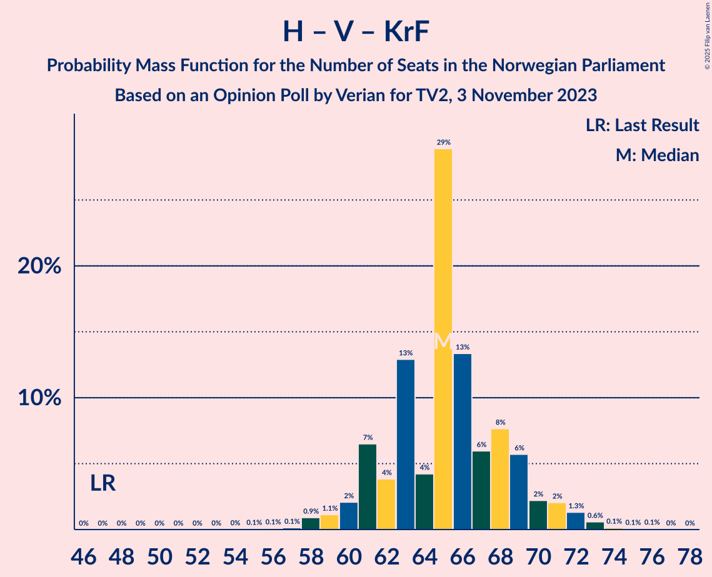

| Number of Seats | Probability | Accumulated | Special Marks |
|:---------------:|:-----------:|:-----------:|:-------------:|
| 47 | 0% | 100% | Last Result |
| 48 | 0% | 100% |  |
| 49 | 0% | 100% |  |
| 50 | 0% | 100% |  |
| 51 | 0% | 100% |  |
| 52 | 0% | 100% |  |
| 53 | 0% | 100% |  |
| 54 | 0% | 100% |  |
| 55 | 0.1% | 100% |  |
| 56 | 0.1% | 99.9% |  |
| 57 | 0.1% | 99.8% |  |
| 58 | 0.9% | 99.7% |  |
| 59 | 1.1% | 98.8% |  |
| 60 | 2% | 98% |  |
| 61 | 7% | 96% |  |
| 62 | 4% | 89% |  |
| 63 | 13% | 85% |  |
| 64 | 4% | 72% |  |
| 65 | 29% | 68% | Median |
| 66 | 13% | 39% |  |
| 67 | 6% | 26% |  |
| 68 | 8% | 20% |  |
| 69 | 6% | 12% |  |
| 70 | 2% | 6% |  |
| 71 | 2% | 4% |  |
| 72 | 1.3% | 2% |  |
| 73 | 0.6% | 0.9% |  |
| 74 | 0.1% | 0.3% |  |
| 75 | 0.1% | 0.2% |  |
| 76 | 0.1% | 0.1% |  |
| 77 | 0% | 0% |  |

### Arbeiderpartiet – Sosialistisk Venstreparti – Senterpartiet

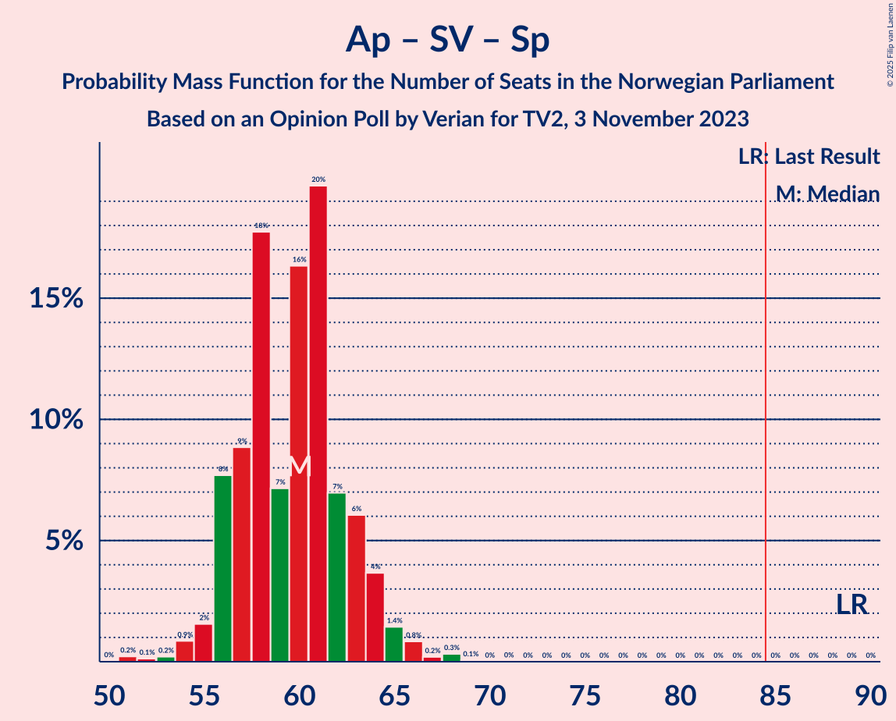

| Number of Seats | Probability | Accumulated | Special Marks |
|:---------------:|:-----------:|:-----------:|:-------------:|
| 51 | 0.2% | 100% |  |
| 52 | 0.1% | 99.7% |  |
| 53 | 0.2% | 99.6% |  |
| 54 | 0.9% | 99.4% |  |
| 55 | 2% | 98.5% |  |
| 56 | 8% | 97% |  |
| 57 | 9% | 89% |  |
| 58 | 18% | 80% |  |
| 59 | 7% | 63% |  |
| 60 | 16% | 56% | Median |
| 61 | 20% | 39% |  |
| 62 | 7% | 20% |  |
| 63 | 6% | 13% |  |
| 64 | 4% | 7% |  |
| 65 | 1.4% | 3% |  |
| 66 | 0.8% | 1.4% |  |
| 67 | 0.2% | 0.6% |  |
| 68 | 0.3% | 0.4% |  |
| 69 | 0.1% | 0.1% |  |
| 70 | 0% | 0% |  |
| 71 | 0% | 0% |  |
| 72 | 0% | 0% |  |
| 73 | 0% | 0% |  |
| 74 | 0% | 0% |  |
| 75 | 0% | 0% |  |
| 76 | 0% | 0% |  |
| 77 | 0% | 0% |  |
| 78 | 0% | 0% |  |
| 79 | 0% | 0% |  |
| 80 | 0% | 0% |  |
| 81 | 0% | 0% |  |
| 82 | 0% | 0% |  |
| 83 | 0% | 0% |  |
| 84 | 0% | 0% |  |
| 85 | 0% | 0% | Majority |
| 86 | 0% | 0% |  |
| 87 | 0% | 0% |  |
| 88 | 0% | 0% |  |
| 89 | 0% | 0% | Last Result |

### Arbeiderpartiet – Senterpartiet – Kristelig Folkeparti – Miljøpartiet De Grønne

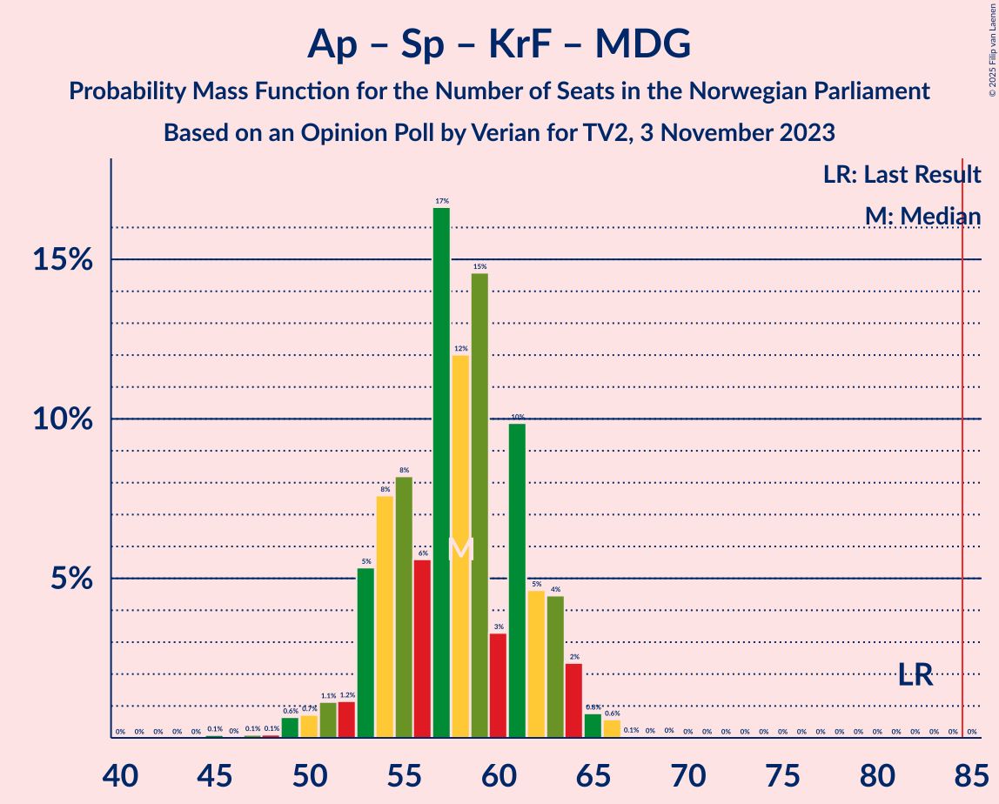

| Number of Seats | Probability | Accumulated | Special Marks |
|:---------------:|:-----------:|:-----------:|:-------------:|
| 45 | 0.1% | 100% |  |
| 46 | 0% | 99.9% |  |
| 47 | 0.1% | 99.9% |  |
| 48 | 0.1% | 99.8% |  |
| 49 | 0.6% | 99.7% |  |
| 50 | 0.7% | 99.0% |  |
| 51 | 1.1% | 98% |  |
| 52 | 1.2% | 97% |  |
| 53 | 5% | 96% |  |
| 54 | 8% | 91% |  |
| 55 | 8% | 83% |  |
| 56 | 6% | 75% |  |
| 57 | 17% | 69% |  |
| 58 | 12% | 53% | Median |
| 59 | 15% | 41% |  |
| 60 | 3% | 26% |  |
| 61 | 10% | 23% |  |
| 62 | 5% | 13% |  |
| 63 | 4% | 8% |  |
| 64 | 2% | 4% |  |
| 65 | 0.8% | 1.5% |  |
| 66 | 0.6% | 0.7% |  |
| 67 | 0.1% | 0.1% |  |
| 68 | 0% | 0.1% |  |
| 69 | 0% | 0% |  |
| 70 | 0% | 0% |  |
| 71 | 0% | 0% |  |
| 72 | 0% | 0% |  |
| 73 | 0% | 0% |  |
| 74 | 0% | 0% |  |
| 75 | 0% | 0% |  |
| 76 | 0% | 0% |  |
| 77 | 0% | 0% |  |
| 78 | 0% | 0% |  |
| 79 | 0% | 0% |  |
| 80 | 0% | 0% |  |
| 81 | 0% | 0% |  |
| 82 | 0% | 0% | Last Result |

### Arbeiderpartiet – Senterpartiet – Kristelig Folkeparti

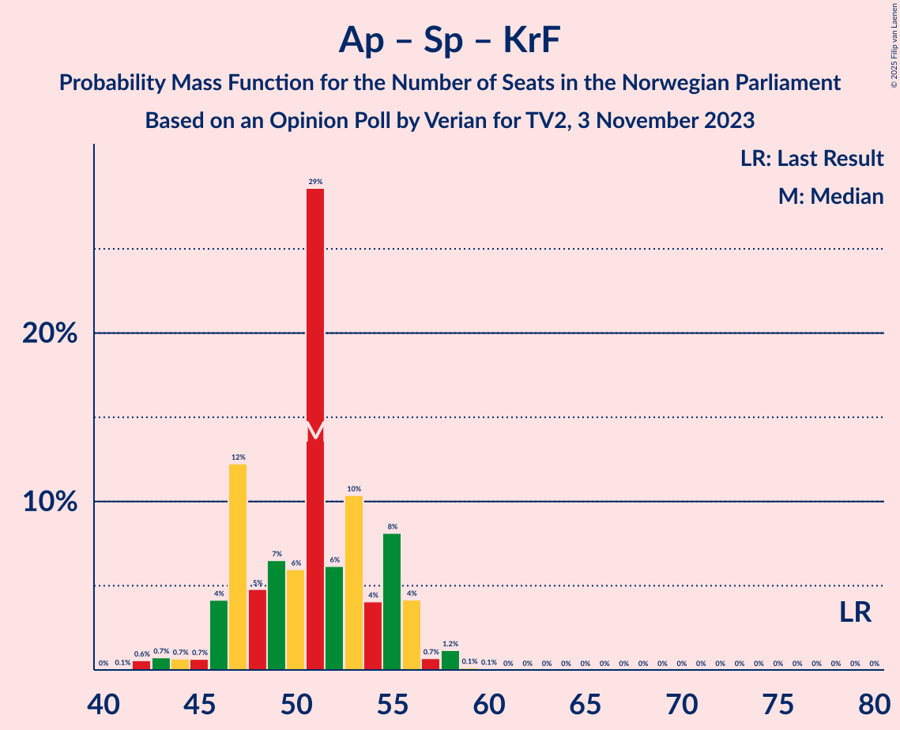

| Number of Seats | Probability | Accumulated | Special Marks |
|:---------------:|:-----------:|:-----------:|:-------------:|
| 41 | 0.1% | 100% |  |
| 42 | 0.6% | 99.9% |  |
| 43 | 0.7% | 99.3% |  |
| 44 | 0.7% | 98.6% |  |
| 45 | 0.7% | 98% |  |
| 46 | 4% | 97% |  |
| 47 | 12% | 93% |  |
| 48 | 5% | 81% |  |
| 49 | 7% | 76% |  |
| 50 | 6% | 70% |  |
| 51 | 29% | 64% | Median |
| 52 | 6% | 35% |  |
| 53 | 10% | 29% |  |
| 54 | 4% | 18% |  |
| 55 | 8% | 14% |  |
| 56 | 4% | 6% |  |
| 57 | 0.7% | 2% |  |
| 58 | 1.2% | 1.4% |  |
| 59 | 0.1% | 0.2% |  |
| 60 | 0.1% | 0.1% |  |
| 61 | 0% | 0% |  |
| 62 | 0% | 0% |  |
| 63 | 0% | 0% |  |
| 64 | 0% | 0% |  |
| 65 | 0% | 0% |  |
| 66 | 0% | 0% |  |
| 67 | 0% | 0% |  |
| 68 | 0% | 0% |  |
| 69 | 0% | 0% |  |
| 70 | 0% | 0% |  |
| 71 | 0% | 0% |  |
| 72 | 0% | 0% |  |
| 73 | 0% | 0% |  |
| 74 | 0% | 0% |  |
| 75 | 0% | 0% |  |
| 76 | 0% | 0% |  |
| 77 | 0% | 0% |  |
| 78 | 0% | 0% |  |
| 79 | 0% | 0% | Last Result |

### Arbeiderpartiet – Sosialistisk Venstreparti

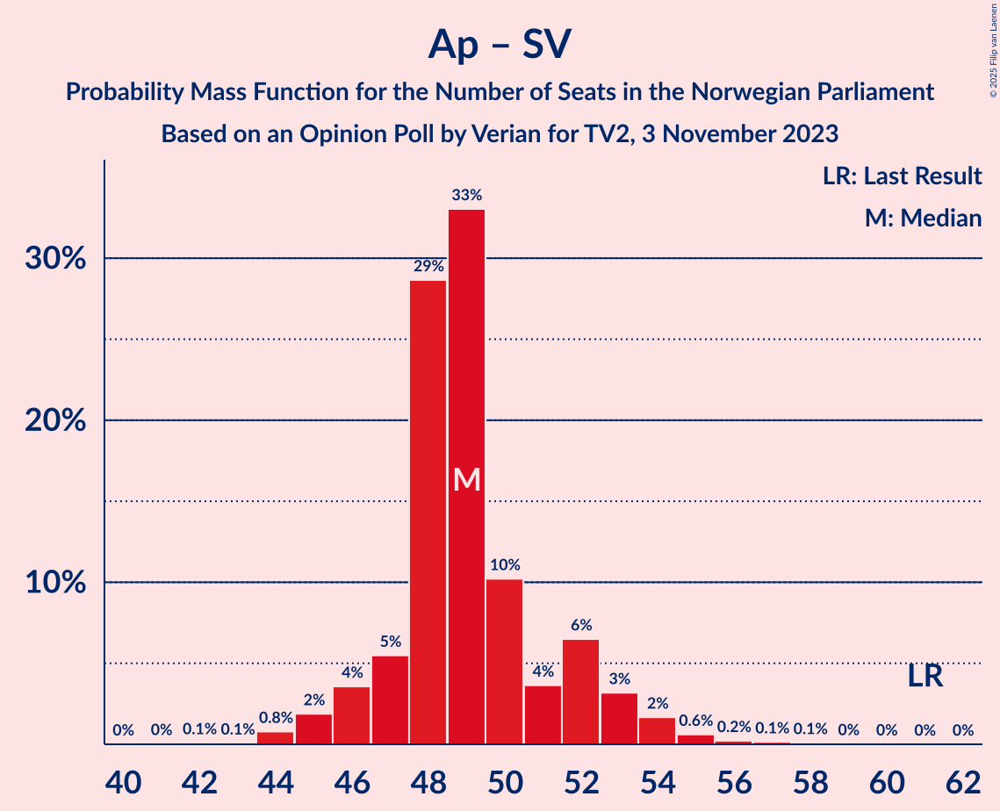

| Number of Seats | Probability | Accumulated | Special Marks |
|:---------------:|:-----------:|:-----------:|:-------------:|
| 41 | 0% | 100% |  |
| 42 | 0.1% | 99.9% |  |
| 43 | 0.1% | 99.8% |  |
| 44 | 0.8% | 99.8% |  |
| 45 | 2% | 99.0% |  |
| 46 | 4% | 97% |  |
| 47 | 5% | 94% |  |
| 48 | 29% | 88% |  |
| 49 | 33% | 59% | Median |
| 50 | 10% | 26% |  |
| 51 | 4% | 16% |  |
| 52 | 6% | 12% |  |
| 53 | 3% | 6% |  |
| 54 | 2% | 3% |  |
| 55 | 0.6% | 1.1% |  |
| 56 | 0.2% | 0.5% |  |
| 57 | 0.1% | 0.3% |  |
| 58 | 0.1% | 0.2% |  |
| 59 | 0% | 0.1% |  |
| 60 | 0% | 0% |  |
| 61 | 0% | 0% | Last Result |

### Arbeiderpartiet – Senterpartiet

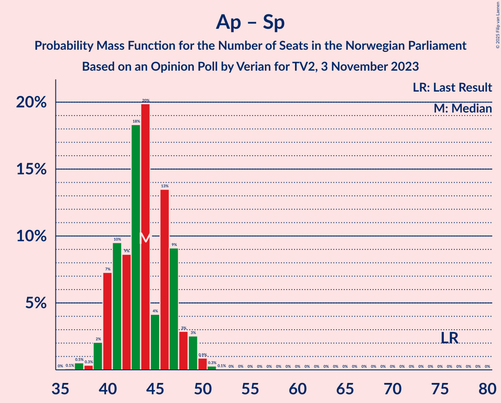

| Number of Seats | Probability | Accumulated | Special Marks |
|:---------------:|:-----------:|:-----------:|:-------------:|
| 35 | 0% | 100% |  |
| 36 | 0.1% | 99.9% |  |
| 37 | 0.5% | 99.9% |  |
| 38 | 0.3% | 99.3% |  |
| 39 | 2% | 99.0% |  |
| 40 | 7% | 97% |  |
| 41 | 10% | 90% |  |
| 42 | 9% | 80% |  |
| 43 | 18% | 72% |  |
| 44 | 20% | 53% | Median |
| 45 | 4% | 33% |  |
| 46 | 13% | 29% |  |
| 47 | 9% | 16% |  |
| 48 | 3% | 7% |  |
| 49 | 3% | 4% |  |
| 50 | 0.9% | 1.2% |  |
| 51 | 0.3% | 0.4% |  |
| 52 | 0.1% | 0.1% |  |
| 53 | 0% | 0% |  |
| 54 | 0% | 0% |  |
| 55 | 0% | 0% |  |
| 56 | 0% | 0% |  |
| 57 | 0% | 0% |  |
| 58 | 0% | 0% |  |
| 59 | 0% | 0% |  |
| 60 | 0% | 0% |  |
| 61 | 0% | 0% |  |
| 62 | 0% | 0% |  |
| 63 | 0% | 0% |  |
| 64 | 0% | 0% |  |
| 65 | 0% | 0% |  |
| 66 | 0% | 0% |  |
| 67 | 0% | 0% |  |
| 68 | 0% | 0% |  |
| 69 | 0% | 0% |  |
| 70 | 0% | 0% |  |
| 71 | 0% | 0% |  |
| 72 | 0% | 0% |  |
| 73 | 0% | 0% |  |
| 74 | 0% | 0% |  |
| 75 | 0% | 0% |  |
| 76 | 0% | 0% | Last Result |

### Senterpartiet – Venstre – Kristelig Folkeparti

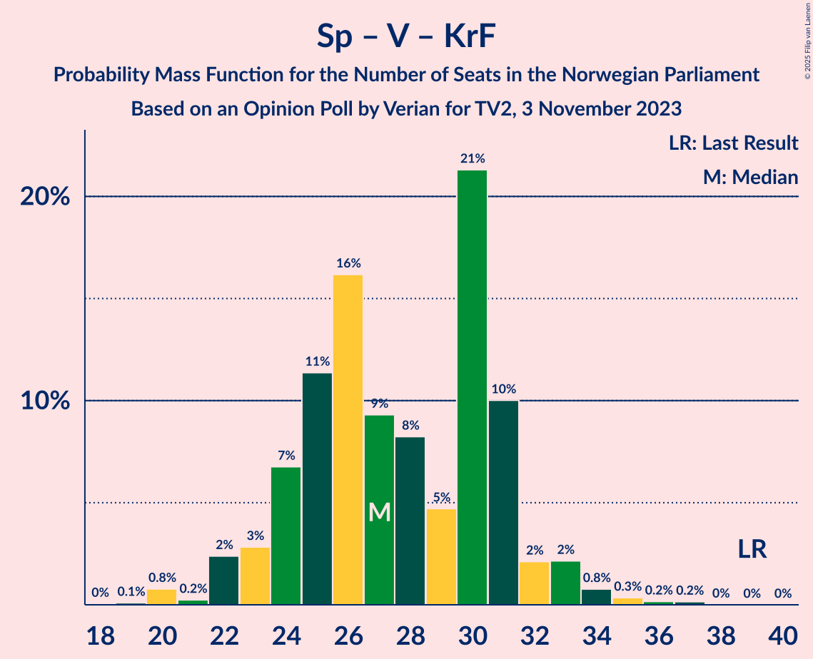

| Number of Seats | Probability | Accumulated | Special Marks |
|:---------------:|:-----------:|:-----------:|:-------------:|
| 18 | 0% | 100% |  |
| 19 | 0.1% | 99.9% |  |
| 20 | 0.8% | 99.8% |  |
| 21 | 0.2% | 99.1% |  |
| 22 | 2% | 98.8% |  |
| 23 | 3% | 96% |  |
| 24 | 7% | 94% |  |
| 25 | 11% | 87% |  |
| 26 | 16% | 75% |  |
| 27 | 9% | 59% |  |
| 28 | 8% | 50% | Median |
| 29 | 5% | 42% |  |
| 30 | 21% | 37% |  |
| 31 | 10% | 16% |  |
| 32 | 2% | 6% |  |
| 33 | 2% | 4% |  |
| 34 | 0.8% | 1.4% |  |
| 35 | 0.3% | 0.7% |  |
| 36 | 0.2% | 0.3% |  |
| 37 | 0.2% | 0.2% |  |
| 38 | 0% | 0% |  |
| 39 | 0% | 0% | Last Result |

## Technical Information

### Opinion Poll

+ **Polling firm:** Verian
+ **Commissioner(s):** TV2
+ **Fieldwork period:** 3 November 2023

### Calculations

+ **Sample size:** 1000
+ **Simulations done:** 1,048,576
+ **Error estimate:** 1.39%

