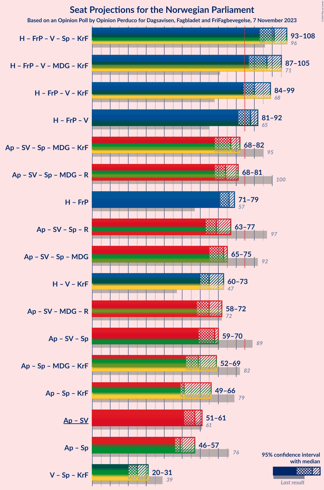

# Opinion Poll by Opinion Perduco for Dagsavisen, Fagbladet and FriFagbevegelse, 7 November 2023

<a href="#voting-intentions">Voting Intentions</a> | <a href="#seats">Seats</a> | <a href="#coalitions">Coalitions</a> | <a href="#technical-information">Technical Information</a>

## Voting Intentions

### Confidence Intervals

| Party | Last Result | Poll Result | 80% Confidence Interval | 90% Confidence Interval | 95% Confidence Interval | 99% Confidence Interval |
|:-----:|:-----------:|:-----------:|:-----------------------:|:-----------------------:|:-----------------------:|:-----------------------:|
| Høyre | 20.4% | 27.9% | 26.1–29.8% |25.6–30.3% |25.2–30.8% |24.4–31.7% |
| Arbeiderpartiet | 26.2% | 21.0% | 19.4–22.7% |19.0–23.2% |18.6–23.6% |17.8–24.5% |
| Fremskrittspartiet | 11.6% | 13.2% | 11.9–14.7% |11.6–15.1% |11.2–15.5% |10.7–16.2% |
| Sosialistisk Venstreparti | 7.6% | 8.2% | 7.2–9.4% |6.9–9.8% |6.6–10.1% |6.2–10.7% |
| Venstre | 4.6% | 6.6% | 5.7–7.7% |5.4–8.0% |5.2–8.3% |4.8–8.9% |
| Senterpartiet | 13.5% | 5.3% | 4.5–6.3% |4.3–6.6% |4.1–6.9% |3.7–7.4% |
| Miljøpartiet De Grønne | 3.9% | 4.0% | 3.3–4.9% |3.1–5.2% |2.9–5.4% |2.7–5.9% |
| Rødt | 4.7% | 3.9% | 3.2–4.8% |3.0–5.1% |2.9–5.3% |2.6–5.8% |
| Kristelig Folkeparti | 3.8% | 3.6% | 2.9–4.5% |2.8–4.7% |2.6–5.0% |2.3–5.4% |
| Industri- og Næringspartiet | 0.3% | 3.4% | 2.8–4.3% |2.6–4.5% |2.4–4.7% |2.2–5.2% |
| Konservativt | 0.4% | 1.4% | 1.0–2.0% |0.9–2.2% |0.8–2.3% |0.7–2.7% |
| Pensjonistpartiet | 0.6% | 0.7% | 0.5–1.2% |0.4–1.3% |0.3–1.4% |0.2–1.7% |
| Liberalistene | 0.2% | 0.4% | 0.2–0.8% |0.2–0.9% |0.2–1.0% |0.1–1.3% |

*Note:* The poll result column reflects the actual value used in the calculations. Published results may vary slightly, and in addition be rounded to fewer digits.

## Seats

### Confidence Intervals

| Party | Last Result | Median | 80% Confidence Interval | 90% Confidence Interval | 95% Confidence Interval | 99% Confidence Interval |
|:-----:|:-----------:|:------:|:-----------------------:|:-----------------------:|:-----------------------:|:-----------------------:|
| <a href="#høyre">Høyre</a> | 36 | 51 | 49–52 |47–54 |47–54 |45–59 |
| <a href="#arbeiderpartiet">Arbeiderpartiet</a> | 48 | 38 | 38–47 |38–47 |38–47 |35–48 |
| <a href="#fremskrittspartiet">Fremskrittspartiet</a> | 21 | 25 | 19–28 |19–30 |19–30 |19–30 |
| <a href="#sosialistisk-venstreparti">Sosialistisk Venstreparti</a> | 13 | 14 | 13–19 |9–19 |9–19 |9–19 |
| <a href="#venstre">Venstre</a> | 8 | 12 | 10–13 |9–15 |9–15 |9–15 |
| <a href="#senterpartiet">Senterpartiet</a> | 28 | 10 | 8–11 |8–11 |7–11 |6–13 |
| <a href="#miljøpartiet-de-grønne">Miljøpartiet De Grønne</a> | 3 | 7 | 2–10 |2–10 |2–10 |1–10 |
| <a href="#rødt">Rødt</a> | 8 | 1 | 1–7 |1–8 |1–10 |1–10 |
| <a href="#kristelig-folkeparti">Kristelig Folkeparti</a> | 3 | 3 | 2–9 |2–9 |2–9 |2–10 |
| <a href="#industri--og-næringspartiet">Industri- og Næringspartiet</a> | 0 | 2 | 1–6 |0–8 |0–8 |0–9 |
| <a href="#konservativt">Konservativt</a> | 0 | 0 | 0 |0 |0 |0 |
| <a href="#pensjonistpartiet">Pensjonistpartiet</a> | 0 | 0 | 0 |0 |0 |0 |
| <a href="#liberalistene">Liberalistene</a> | 0 | 0 | 0 |0 |0 |0 |

### Høyre

*For a full overview of the results for this party, see the [Høyre](party-høyre.html) page.*

| Number of Seats | Probability | Accumulated | Special Marks |
|:---------------:|:-----------:|:-----------:|:-------------:|
| 36 | 0% | 100% | Last Result |
| 37 | 0% | 100% |  |
| 38 | 0% | 100% |  |
| 39 | 0% | 100% |  |
| 40 | 0% | 100% |  |
| 41 | 0% | 100% |  |
| 42 | 0% | 100% |  |
| 43 | 0% | 99.9% |  |
| 44 | 0.2% | 99.9% |  |
| 45 | 0.5% | 99.8% |  |
| 46 | 0.8% | 99.2% |  |
| 47 | 4% | 98% |  |
| 48 | 1.3% | 94% |  |
| 49 | 17% | 93% |  |
| 50 | 5% | 76% |  |
| 51 | 35% | 71% | Median |
| 52 | 29% | 36% |  |
| 53 | 1.3% | 7% |  |
| 54 | 3% | 6% |  |
| 55 | 1.2% | 2% |  |
| 56 | 0.3% | 1.2% |  |
| 57 | 0.2% | 0.8% |  |
| 58 | 0.1% | 0.7% |  |
| 59 | 0.5% | 0.6% |  |
| 60 | 0% | 0.1% |  |
| 61 | 0% | 0.1% |  |
| 62 | 0% | 0.1% |  |
| 63 | 0% | 0.1% |  |
| 64 | 0.1% | 0.1% |  |
| 65 | 0% | 0% |  |

### Arbeiderpartiet

*For a full overview of the results for this party, see the [Arbeiderpartiet](party-arbeiderpartiet.html) page.*

| Number of Seats | Probability | Accumulated | Special Marks |
|:---------------:|:-----------:|:-----------:|:-------------:|
| 34 | 0.1% | 100% |  |
| 35 | 0.5% | 99.9% |  |
| 36 | 0.4% | 99.4% |  |
| 37 | 1.3% | 99.0% |  |
| 38 | 49% | 98% | Median |
| 39 | 4% | 49% |  |
| 40 | 1.4% | 45% |  |
| 41 | 0.4% | 43% |  |
| 42 | 5% | 43% |  |
| 43 | 0.6% | 38% |  |
| 44 | 0.9% | 37% |  |
| 45 | 7% | 36% |  |
| 46 | 1.2% | 29% |  |
| 47 | 27% | 28% |  |
| 48 | 0.2% | 0.5% | Last Result |
| 49 | 0.2% | 0.3% |  |
| 50 | 0.1% | 0.1% |  |
| 51 | 0% | 0% |  |

### Fremskrittspartiet

*For a full overview of the results for this party, see the [Fremskrittspartiet](party-fremskrittspartiet.html) page.*

| Number of Seats | Probability | Accumulated | Special Marks |
|:---------------:|:-----------:|:-----------:|:-------------:|
| 18 | 0.3% | 100% |  |
| 19 | 30% | 99.7% |  |
| 20 | 2% | 69% |  |
| 21 | 1.1% | 68% | Last Result |
| 22 | 1.0% | 67% |  |
| 23 | 0.6% | 66% |  |
| 24 | 5% | 65% |  |
| 25 | 40% | 60% | Median |
| 26 | 2% | 20% |  |
| 27 | 2% | 18% |  |
| 28 | 9% | 17% |  |
| 29 | 2% | 8% |  |
| 30 | 6% | 6% |  |
| 31 | 0.1% | 0.1% |  |
| 32 | 0% | 0% |  |

### Sosialistisk Venstreparti

*For a full overview of the results for this party, see the [Sosialistisk Venstreparti](party-sosialistiskvenstreparti.html) page.*

| Number of Seats | Probability | Accumulated | Special Marks |
|:---------------:|:-----------:|:-----------:|:-------------:|
| 9 | 6% | 100% |  |
| 10 | 0.7% | 94% |  |
| 11 | 2% | 93% |  |
| 12 | 1.0% | 92% |  |
| 13 | 32% | 91% | Last Result |
| 14 | 10% | 59% | Median |
| 15 | 2% | 49% |  |
| 16 | 7% | 47% |  |
| 17 | 5% | 40% |  |
| 18 | 0.2% | 35% |  |
| 19 | 35% | 35% |  |
| 20 | 0% | 0.1% |  |
| 21 | 0% | 0.1% |  |
| 22 | 0% | 0% |  |

### Venstre

*For a full overview of the results for this party, see the [Venstre](party-venstre.html) page.*

| Number of Seats | Probability | Accumulated | Special Marks |
|:---------------:|:-----------:|:-----------:|:-------------:|
| 7 | 0.1% | 100% |  |
| 8 | 0.3% | 99.9% | Last Result |
| 9 | 7% | 99.6% |  |
| 10 | 8% | 93% |  |
| 11 | 9% | 85% |  |
| 12 | 65% | 76% | Median |
| 13 | 2% | 11% |  |
| 14 | 0.3% | 9% |  |
| 15 | 9% | 9% |  |
| 16 | 0% | 0.1% |  |
| 17 | 0.1% | 0.1% |  |
| 18 | 0% | 0% |  |

### Senterpartiet

*For a full overview of the results for this party, see the [Senterpartiet](party-senterpartiet.html) page.*

| Number of Seats | Probability | Accumulated | Special Marks |
|:---------------:|:-----------:|:-----------:|:-------------:|
| 1 | 0.2% | 100% |  |
| 2 | 0.1% | 99.7% |  |
| 3 | 0% | 99.6% |  |
| 4 | 0% | 99.6% |  |
| 5 | 0% | 99.6% |  |
| 6 | 0.2% | 99.6% |  |
| 7 | 2% | 99.4% |  |
| 8 | 11% | 97% |  |
| 9 | 9% | 86% |  |
| 10 | 39% | 76% | Median |
| 11 | 36% | 38% |  |
| 12 | 1.1% | 2% |  |
| 13 | 0.4% | 0.6% |  |
| 14 | 0% | 0.2% |  |
| 15 | 0% | 0.2% |  |
| 16 | 0.1% | 0.1% |  |
| 17 | 0% | 0% |  |
| 18 | 0% | 0% |  |
| 19 | 0% | 0% |  |
| 20 | 0% | 0% |  |
| 21 | 0% | 0% |  |
| 22 | 0% | 0% |  |
| 23 | 0% | 0% |  |
| 24 | 0% | 0% |  |
| 25 | 0% | 0% |  |
| 26 | 0% | 0% |  |
| 27 | 0% | 0% |  |
| 28 | 0% | 0% | Last Result |

### Miljøpartiet De Grønne

*For a full overview of the results for this party, see the [Miljøpartiet De Grønne](party-miljøpartietdegrønne.html) page.*

| Number of Seats | Probability | Accumulated | Special Marks |
|:---------------:|:-----------:|:-----------:|:-------------:|
| 1 | 2% | 100% |  |
| 2 | 9% | 98% |  |
| 3 | 32% | 89% | Last Result |
| 4 | 0% | 57% |  |
| 5 | 0% | 57% |  |
| 6 | 6% | 57% |  |
| 7 | 37% | 51% | Median |
| 8 | 2% | 14% |  |
| 9 | 1.2% | 11% |  |
| 10 | 10% | 10% |  |
| 11 | 0.1% | 0.1% |  |
| 12 | 0% | 0% |  |

### Rødt

*For a full overview of the results for this party, see the [Rødt](party-rødt.html) page.*

| Number of Seats | Probability | Accumulated | Special Marks |
|:---------------:|:-----------:|:-----------:|:-------------:|
| 1 | 77% | 100% | Median |
| 2 | 0% | 23% |  |
| 3 | 0% | 23% |  |
| 4 | 0% | 23% |  |
| 5 | 0% | 23% |  |
| 6 | 6% | 23% |  |
| 7 | 7% | 17% |  |
| 8 | 6% | 10% | Last Result |
| 9 | 0.8% | 3% |  |
| 10 | 3% | 3% |  |
| 11 | 0% | 0% |  |

### Kristelig Folkeparti

*For a full overview of the results for this party, see the [Kristelig Folkeparti](party-kristeligfolkeparti.html) page.*

| Number of Seats | Probability | Accumulated | Special Marks |
|:---------------:|:-----------:|:-----------:|:-------------:|
| 0 | 0.1% | 100% |  |
| 1 | 0% | 99.9% |  |
| 2 | 47% | 99.9% |  |
| 3 | 19% | 53% | Last Result, Median |
| 4 | 0% | 34% |  |
| 5 | 0% | 34% |  |
| 6 | 1.0% | 34% |  |
| 7 | 2% | 33% |  |
| 8 | 2% | 31% |  |
| 9 | 27% | 29% |  |
| 10 | 2% | 2% |  |
| 11 | 0% | 0% |  |

### Industri- og Næringspartiet

*For a full overview of the results for this party, see the [Industri- og Næringspartiet](party-industri-ognæringspartiet.html) page.*

| Number of Seats | Probability | Accumulated | Special Marks |
|:---------------:|:-----------:|:-----------:|:-------------:|
| 0 | 10% | 100% | Last Result |
| 1 | 0.4% | 90% |  |
| 2 | 67% | 90% | Median |
| 3 | 10% | 23% |  |
| 4 | 0% | 13% |  |
| 5 | 0% | 13% |  |
| 6 | 6% | 13% |  |
| 7 | 1.0% | 7% |  |
| 8 | 5% | 6% |  |
| 9 | 1.1% | 1.2% |  |
| 10 | 0% | 0.1% |  |
| 11 | 0% | 0% |  |

### Konservativt

*For a full overview of the results for this party, see the [Konservativt](party-konservativt.html) page.*

| Number of Seats | Probability | Accumulated | Special Marks |
|:---------------:|:-----------:|:-----------:|:-------------:|
| 0 | 100% | 100% | Last Result, Median |

### Pensjonistpartiet

*For a full overview of the results for this party, see the [Pensjonistpartiet](party-pensjonistpartiet.html) page.*

| Number of Seats | Probability | Accumulated | Special Marks |
|:---------------:|:-----------:|:-----------:|:-------------:|
| 0 | 100% | 100% | Last Result, Median |

### Liberalistene

*For a full overview of the results for this party, see the [Liberalistene](party-liberalistene.html) page.*

| Number of Seats | Probability | Accumulated | Special Marks |
|:---------------:|:-----------:|:-----------:|:-------------:|
| 0 | 100% | 100% | Last Result, Median |

## Coalitions

### Confidence Intervals

| Coalition | Last Result | Median | Majority? | 80% Confidence Interval | 90% Confidence Interval | 95% Confidence Interval | 99% Confidence Interval |
|:---------:|:-----------:|:------:|:---------:|:-----------------------:|:-----------------------:|:-----------------------:|:-----------------------:|
| Høyre – Fremskrittspartiet – Venstre – Senterpartiet – Kristelig Folkeparti | 96 | 101 | 100% | 95–105 | 94–105 | 93–108 | 91–110 |
| Høyre – Fremskrittspartiet – Venstre – Miljøpartiet De Grønne – Kristelig Folkeparti | 71 | 97 | 99.9% | 91–102 | 90–105 | 87–105 | 86–105 |
| Høyre – Fremskrittspartiet – Venstre – Kristelig Folkeparti | 68 | 90 | 96% | 87–95 | 85–95 | 84–99 | 81–101 |
| Høyre – Fremskrittspartiet – Venstre | 65 | 88 | 60% | 83–91 | 82–92 | 81–92 | 78–94 |
| Arbeiderpartiet – Sosialistisk Venstreparti – Senterpartiet – Miljøpartiet De Grønne – Kristelig Folkeparti | 95 | 77 | 0.2% | 69–82 | 68–82 | 68–82 | 65–83 |
| Arbeiderpartiet – Sosialistisk Venstreparti – Senterpartiet – Miljøpartiet De Grønne – Rødt | 100 | 74 | 0.1% | 71–77 | 70–80 | 68–81 | 64–81 |
| Høyre – Fremskrittspartiet | 57 | 76 | 0.3% | 71–78 | 71–79 | 71–79 | 68–83 |
| Arbeiderpartiet – Sosialistisk Venstreparti – Senterpartiet – Rødt | 97 | 69 | 0% | 65–71 | 63–76 | 63–77 | 61–78 |
| Arbeiderpartiet – Sosialistisk Venstreparti – Senterpartiet – Miljøpartiet De Grønne | 92 | 73 | 0% | 66–75 | 65–75 | 65–75 | 62–78 |
| Høyre – Venstre – Kristelig Folkeparti | 47 | 65 | 0% | 61–73 | 61–73 | 60–73 | 59–78 |
| Arbeiderpartiet – Sosialistisk Venstreparti – Miljøpartiet De Grønne – Rødt | 72 | 65 | 0% | 63–69 | 60–71 | 58–72 | 55–72 |
| Arbeiderpartiet – Sosialistisk Venstreparti – Senterpartiet | 89 | 68 | 0% | 62–70 | 59–70 | 59–70 | 58–71 |
| Arbeiderpartiet – Senterpartiet – Miljøpartiet De Grønne – Kristelig Folkeparti | 82 | 59 | 0% | 57–69 | 54–69 | 52–69 | 50–70 |
| Arbeiderpartiet – Senterpartiet – Kristelig Folkeparti | 79 | 51 | 0% | 51–66 | 49–66 | 49–66 | 48–66 |
| Arbeiderpartiet – Sosialistisk Venstreparti | 61 | 57 | 0% | 52–60 | 51–60 | 51–61 | 50–62 |
| Arbeiderpartiet – Senterpartiet | 76 | 49 | 0% | 48–57 | 47–57 | 46–57 | 44–57 |
| Venstre – Senterpartiet – Kristelig Folkeparti | 39 | 25 | 0% | 21–31 | 20–31 | 20–31 | 20–32 |

### Høyre – Fremskrittspartiet – Venstre – Senterpartiet – Kristelig Folkeparti

| Number of Seats | Probability | Accumulated | Special Marks |
|:---------------:|:-----------:|:-----------:|:-------------:|
| 88 | 0.1% | 100% |  |
| 89 | 0.1% | 99.9% |  |
| 90 | 0.1% | 99.8% |  |
| 91 | 0.8% | 99.8% |  |
| 92 | 0.3% | 98.9% |  |
| 93 | 3% | 98.6% |  |
| 94 | 3% | 96% |  |
| 95 | 5% | 93% |  |
| 96 | 3% | 89% | Last Result |
| 97 | 1.1% | 86% |  |
| 98 | 1.3% | 85% |  |
| 99 | 7% | 84% |  |
| 100 | 0.7% | 76% |  |
| 101 | 35% | 76% | Median |
| 102 | 27% | 41% |  |
| 103 | 0.4% | 13% |  |
| 104 | 0.6% | 13% |  |
| 105 | 8% | 12% |  |
| 106 | 0.7% | 4% |  |
| 107 | 0.2% | 4% |  |
| 108 | 1.1% | 3% |  |
| 109 | 2% | 2% |  |
| 110 | 0.4% | 0.7% |  |
| 111 | 0% | 0.3% |  |
| 112 | 0.3% | 0.3% |  |
| 113 | 0% | 0% |  |

### Høyre – Fremskrittspartiet – Venstre – Miljøpartiet De Grønne – Kristelig Folkeparti

| Number of Seats | Probability | Accumulated | Special Marks |
|:---------------:|:-----------:|:-----------:|:-------------:|
| 71 | 0% | 100% | Last Result |
| 72 | 0% | 100% |  |
| 73 | 0% | 100% |  |
| 74 | 0% | 100% |  |
| 75 | 0% | 100% |  |
| 76 | 0% | 100% |  |
| 77 | 0% | 100% |  |
| 78 | 0% | 100% |  |
| 79 | 0% | 100% |  |
| 80 | 0% | 100% |  |
| 81 | 0.1% | 100% |  |
| 82 | 0% | 99.9% |  |
| 83 | 0% | 99.9% |  |
| 84 | 0% | 99.9% |  |
| 85 | 0.1% | 99.9% | Majority |
| 86 | 1.0% | 99.8% |  |
| 87 | 2% | 98.7% |  |
| 88 | 0.1% | 96% |  |
| 89 | 0.1% | 96% |  |
| 90 | 6% | 96% |  |
| 91 | 0.9% | 90% |  |
| 92 | 1.1% | 89% |  |
| 93 | 0.5% | 88% |  |
| 94 | 3% | 88% |  |
| 95 | 29% | 85% |  |
| 96 | 0.7% | 56% |  |
| 97 | 42% | 55% |  |
| 98 | 2% | 14% | Median |
| 99 | 0.6% | 12% |  |
| 100 | 0.8% | 11% |  |
| 101 | 0.3% | 11% |  |
| 102 | 2% | 10% |  |
| 103 | 0.6% | 9% |  |
| 104 | 0.1% | 8% |  |
| 105 | 8% | 8% |  |
| 106 | 0.3% | 0.4% |  |
| 107 | 0.1% | 0.1% |  |
| 108 | 0% | 0% |  |

### Høyre – Fremskrittspartiet – Venstre – Kristelig Folkeparti

| Number of Seats | Probability | Accumulated | Special Marks |
|:---------------:|:-----------:|:-----------:|:-------------:|
| 68 | 0% | 100% | Last Result |
| 69 | 0% | 100% |  |
| 70 | 0% | 100% |  |
| 71 | 0% | 100% |  |
| 72 | 0% | 100% |  |
| 73 | 0% | 100% |  |
| 74 | 0% | 100% |  |
| 75 | 0% | 100% |  |
| 76 | 0% | 100% |  |
| 77 | 0% | 100% |  |
| 78 | 0% | 100% |  |
| 79 | 0.1% | 100% |  |
| 80 | 0% | 99.9% |  |
| 81 | 0.8% | 99.9% |  |
| 82 | 0.1% | 99.0% |  |
| 83 | 0.2% | 99.0% |  |
| 84 | 3% | 98.8% |  |
| 85 | 4% | 96% | Majority |
| 86 | 0.2% | 92% |  |
| 87 | 3% | 92% |  |
| 88 | 4% | 89% |  |
| 89 | 2% | 85% |  |
| 90 | 36% | 83% |  |
| 91 | 6% | 48% | Median |
| 92 | 27% | 41% |  |
| 93 | 0.5% | 14% |  |
| 94 | 0.9% | 13% |  |
| 95 | 8% | 12% |  |
| 96 | 0.7% | 4% |  |
| 97 | 0.2% | 3% |  |
| 98 | 0.2% | 3% |  |
| 99 | 0.5% | 3% |  |
| 100 | 2% | 2% |  |
| 101 | 0.5% | 0.8% |  |
| 102 | 0% | 0.3% |  |
| 103 | 0.3% | 0.3% |  |
| 104 | 0% | 0% |  |

### Høyre – Fremskrittspartiet – Venstre

| Number of Seats | Probability | Accumulated | Special Marks |
|:---------------:|:-----------:|:-----------:|:-------------:|
| 65 | 0% | 100% | Last Result |
| 66 | 0% | 100% |  |
| 67 | 0% | 100% |  |
| 68 | 0% | 100% |  |
| 69 | 0% | 100% |  |
| 70 | 0% | 100% |  |
| 71 | 0% | 100% |  |
| 72 | 0% | 100% |  |
| 73 | 0% | 100% |  |
| 74 | 0% | 100% |  |
| 75 | 0% | 100% |  |
| 76 | 0% | 99.9% |  |
| 77 | 0.3% | 99.9% |  |
| 78 | 0.8% | 99.6% |  |
| 79 | 0.2% | 98.7% |  |
| 80 | 0.3% | 98.6% |  |
| 81 | 0.9% | 98% |  |
| 82 | 3% | 97% |  |
| 83 | 31% | 95% |  |
| 84 | 4% | 64% |  |
| 85 | 1.5% | 60% | Majority |
| 86 | 3% | 59% |  |
| 87 | 2% | 55% |  |
| 88 | 41% | 54% | Median |
| 89 | 0.2% | 13% |  |
| 90 | 2% | 13% |  |
| 91 | 1.1% | 11% |  |
| 92 | 8% | 10% |  |
| 93 | 0.1% | 1.2% |  |
| 94 | 0.6% | 1.1% |  |
| 95 | 0% | 0.5% |  |
| 96 | 0.1% | 0.5% |  |
| 97 | 0% | 0.4% |  |
| 98 | 0.1% | 0.4% |  |
| 99 | 0% | 0.3% |  |
| 100 | 0.3% | 0.3% |  |
| 101 | 0% | 0% |  |

### Arbeiderpartiet – Sosialistisk Venstreparti – Senterpartiet – Miljøpartiet De Grønne – Kristelig Folkeparti

| Number of Seats | Probability | Accumulated | Special Marks |
|:---------------:|:-----------:|:-----------:|:-------------:|
| 62 | 0.1% | 100% |  |
| 63 | 0% | 99.9% |  |
| 64 | 0% | 99.9% |  |
| 65 | 0.4% | 99.9% |  |
| 66 | 0.4% | 99.5% |  |
| 67 | 0.9% | 99.1% |  |
| 68 | 6% | 98% |  |
| 69 | 3% | 92% |  |
| 70 | 3% | 89% |  |
| 71 | 2% | 86% |  |
| 72 | 1.1% | 84% | Median |
| 73 | 1.4% | 83% |  |
| 74 | 4% | 82% |  |
| 75 | 10% | 78% |  |
| 76 | 0.3% | 67% |  |
| 77 | 37% | 67% |  |
| 78 | 1.0% | 30% |  |
| 79 | 0.2% | 29% |  |
| 80 | 0.5% | 29% |  |
| 81 | 1.0% | 29% |  |
| 82 | 27% | 28% |  |
| 83 | 0.4% | 0.6% |  |
| 84 | 0% | 0.2% |  |
| 85 | 0.1% | 0.2% | Majority |
| 86 | 0% | 0.1% |  |
| 87 | 0% | 0.1% |  |
| 88 | 0% | 0.1% |  |
| 89 | 0% | 0% |  |
| 90 | 0% | 0% |  |
| 91 | 0% | 0% |  |
| 92 | 0% | 0% |  |
| 93 | 0% | 0% |  |
| 94 | 0% | 0% |  |
| 95 | 0% | 0% | Last Result |

### Arbeiderpartiet – Sosialistisk Venstreparti – Senterpartiet – Miljøpartiet De Grønne – Rødt

| Number of Seats | Probability | Accumulated | Special Marks |
|:---------------:|:-----------:|:-----------:|:-------------:|
| 63 | 0% | 100% |  |
| 64 | 0.7% | 99.9% |  |
| 65 | 0% | 99.2% |  |
| 66 | 0.1% | 99.2% |  |
| 67 | 0.7% | 99.1% |  |
| 68 | 2% | 98% |  |
| 69 | 0.2% | 96% |  |
| 70 | 1.5% | 96% | Median |
| 71 | 6% | 94% |  |
| 72 | 0.6% | 88% |  |
| 73 | 11% | 87% |  |
| 74 | 28% | 77% |  |
| 75 | 0.9% | 48% |  |
| 76 | 36% | 47% |  |
| 77 | 2% | 12% |  |
| 78 | 3% | 10% |  |
| 79 | 1.1% | 7% |  |
| 80 | 3% | 5% |  |
| 81 | 3% | 3% |  |
| 82 | 0.1% | 0.3% |  |
| 83 | 0% | 0.2% |  |
| 84 | 0.1% | 0.2% |  |
| 85 | 0% | 0.1% | Majority |
| 86 | 0% | 0.1% |  |
| 87 | 0% | 0% |  |
| 88 | 0% | 0% |  |
| 89 | 0% | 0% |  |
| 90 | 0% | 0% |  |
| 91 | 0% | 0% |  |
| 92 | 0% | 0% |  |
| 93 | 0% | 0% |  |
| 94 | 0% | 0% |  |
| 95 | 0% | 0% |  |
| 96 | 0% | 0% |  |
| 97 | 0% | 0% |  |
| 98 | 0% | 0% |  |
| 99 | 0% | 0% |  |
| 100 | 0% | 0% | Last Result |

### Høyre – Fremskrittspartiet

| Number of Seats | Probability | Accumulated | Special Marks |
|:---------------:|:-----------:|:-----------:|:-------------:|
| 57 | 0% | 100% | Last Result |
| 58 | 0% | 100% |  |
| 59 | 0% | 100% |  |
| 60 | 0% | 100% |  |
| 61 | 0% | 100% |  |
| 62 | 0% | 100% |  |
| 63 | 0% | 100% |  |
| 64 | 0.1% | 100% |  |
| 65 | 0.1% | 99.9% |  |
| 66 | 0.1% | 99.8% |  |
| 67 | 0.1% | 99.7% |  |
| 68 | 1.0% | 99.6% |  |
| 69 | 0.3% | 98.7% |  |
| 70 | 0.4% | 98% |  |
| 71 | 30% | 98% |  |
| 72 | 0.3% | 68% |  |
| 73 | 5% | 67% |  |
| 74 | 4% | 62% |  |
| 75 | 4% | 58% |  |
| 76 | 36% | 54% | Median |
| 77 | 8% | 18% |  |
| 78 | 0.3% | 10% |  |
| 79 | 8% | 10% |  |
| 80 | 0.2% | 2% |  |
| 81 | 0.7% | 2% |  |
| 82 | 0.6% | 1.2% |  |
| 83 | 0.2% | 0.6% |  |
| 84 | 0.1% | 0.4% |  |
| 85 | 0.3% | 0.3% | Majority |
| 86 | 0% | 0.1% |  |
| 87 | 0% | 0% |  |

### Arbeiderpartiet – Sosialistisk Venstreparti – Senterpartiet – Rødt

| Number of Seats | Probability | Accumulated | Special Marks |
|:---------------:|:-----------:|:-----------:|:-------------:|
| 59 | 0% | 100% |  |
| 60 | 0.2% | 99.9% |  |
| 61 | 0.6% | 99.7% |  |
| 62 | 0.6% | 99.1% |  |
| 63 | 8% | 98% | Median |
| 64 | 0.3% | 91% |  |
| 65 | 6% | 90% |  |
| 66 | 3% | 85% |  |
| 67 | 0.4% | 82% |  |
| 68 | 3% | 82% |  |
| 69 | 35% | 78% |  |
| 70 | 5% | 43% |  |
| 71 | 30% | 38% |  |
| 72 | 0.6% | 8% |  |
| 73 | 1.3% | 7% |  |
| 74 | 0.7% | 6% |  |
| 75 | 0.2% | 5% |  |
| 76 | 3% | 5% |  |
| 77 | 0.1% | 3% |  |
| 78 | 2% | 2% |  |
| 79 | 0.1% | 0.2% |  |
| 80 | 0% | 0.1% |  |
| 81 | 0% | 0% |  |
| 82 | 0% | 0% |  |
| 83 | 0% | 0% |  |
| 84 | 0% | 0% |  |
| 85 | 0% | 0% | Majority |
| 86 | 0% | 0% |  |
| 87 | 0% | 0% |  |
| 88 | 0% | 0% |  |
| 89 | 0% | 0% |  |
| 90 | 0% | 0% |  |
| 91 | 0% | 0% |  |
| 92 | 0% | 0% |  |
| 93 | 0% | 0% |  |
| 94 | 0% | 0% |  |
| 95 | 0% | 0% |  |
| 96 | 0% | 0% |  |
| 97 | 0% | 0% | Last Result |

### Arbeiderpartiet – Sosialistisk Venstreparti – Senterpartiet – Miljøpartiet De Grønne

| Number of Seats | Probability | Accumulated | Special Marks |
|:---------------:|:-----------:|:-----------:|:-------------:|
| 59 | 0.1% | 100% |  |
| 60 | 0.1% | 99.9% |  |
| 61 | 0.2% | 99.7% |  |
| 62 | 0.5% | 99.5% |  |
| 63 | 0.7% | 99.1% |  |
| 64 | 0.8% | 98% |  |
| 65 | 6% | 98% |  |
| 66 | 4% | 92% |  |
| 67 | 2% | 87% |  |
| 68 | 3% | 85% |  |
| 69 | 2% | 82% | Median |
| 70 | 2% | 80% |  |
| 71 | 0.4% | 78% |  |
| 72 | 11% | 77% |  |
| 73 | 30% | 67% |  |
| 74 | 0.2% | 37% |  |
| 75 | 35% | 37% |  |
| 76 | 0.5% | 2% |  |
| 77 | 0.1% | 1.4% |  |
| 78 | 1.0% | 1.2% |  |
| 79 | 0.1% | 0.2% |  |
| 80 | 0% | 0.1% |  |
| 81 | 0% | 0.1% |  |
| 82 | 0% | 0% |  |
| 83 | 0% | 0% |  |
| 84 | 0% | 0% |  |
| 85 | 0% | 0% | Majority |
| 86 | 0% | 0% |  |
| 87 | 0% | 0% |  |
| 88 | 0% | 0% |  |
| 89 | 0% | 0% |  |
| 90 | 0% | 0% |  |
| 91 | 0% | 0% |  |
| 92 | 0% | 0% | Last Result |

### Høyre – Venstre – Kristelig Folkeparti

| Number of Seats | Probability | Accumulated | Special Marks |
|:---------------:|:-----------:|:-----------:|:-------------:|
| 47 | 0% | 100% | Last Result |
| 48 | 0% | 100% |  |
| 49 | 0% | 100% |  |
| 50 | 0% | 100% |  |
| 51 | 0% | 100% |  |
| 52 | 0% | 100% |  |
| 53 | 0% | 100% |  |
| 54 | 0% | 100% |  |
| 55 | 0% | 100% |  |
| 56 | 0% | 100% |  |
| 57 | 0% | 100% |  |
| 58 | 0.1% | 99.9% |  |
| 59 | 0.7% | 99.8% |  |
| 60 | 4% | 99.1% |  |
| 61 | 7% | 95% |  |
| 62 | 3% | 89% |  |
| 63 | 4% | 86% |  |
| 64 | 1.0% | 82% |  |
| 65 | 35% | 81% |  |
| 66 | 3% | 46% | Median |
| 67 | 8% | 43% |  |
| 68 | 2% | 35% |  |
| 69 | 1.1% | 33% |  |
| 70 | 0.8% | 32% |  |
| 71 | 0.8% | 31% |  |
| 72 | 0.9% | 30% |  |
| 73 | 28% | 29% |  |
| 74 | 0.4% | 1.0% |  |
| 75 | 0.1% | 0.6% |  |
| 76 | 0% | 0.6% |  |
| 77 | 0% | 0.5% |  |
| 78 | 0% | 0.5% |  |
| 79 | 0.4% | 0.5% |  |
| 80 | 0.1% | 0.1% |  |
| 81 | 0% | 0% |  |

### Arbeiderpartiet – Sosialistisk Venstreparti – Miljøpartiet De Grønne – Rødt

| Number of Seats | Probability | Accumulated | Special Marks |
|:---------------:|:-----------:|:-----------:|:-------------:|
| 54 | 0% | 100% |  |
| 55 | 0.7% | 99.9% |  |
| 56 | 0.1% | 99.3% |  |
| 57 | 0.4% | 99.1% |  |
| 58 | 1.4% | 98.8% |  |
| 59 | 2% | 97% |  |
| 60 | 1.2% | 96% | Median |
| 61 | 0.8% | 95% |  |
| 62 | 1.0% | 94% |  |
| 63 | 13% | 93% |  |
| 64 | 28% | 80% |  |
| 65 | 37% | 51% |  |
| 66 | 0.7% | 14% |  |
| 67 | 2% | 14% |  |
| 68 | 1.5% | 12% |  |
| 69 | 1.0% | 10% |  |
| 70 | 4% | 9% |  |
| 71 | 2% | 5% |  |
| 72 | 3% | 3% | Last Result |
| 73 | 0.1% | 0.3% |  |
| 74 | 0.1% | 0.2% |  |
| 75 | 0% | 0.1% |  |
| 76 | 0.1% | 0.1% |  |
| 77 | 0% | 0% |  |

### Arbeiderpartiet – Sosialistisk Venstreparti – Senterpartiet

| Number of Seats | Probability | Accumulated | Special Marks |
|:---------------:|:-----------:|:-----------:|:-------------:|
| 53 | 0.1% | 100% |  |
| 54 | 0.1% | 99.8% |  |
| 55 | 0.1% | 99.7% |  |
| 56 | 0% | 99.6% |  |
| 57 | 0.1% | 99.6% |  |
| 58 | 0.4% | 99.5% |  |
| 59 | 6% | 99.2% |  |
| 60 | 1.0% | 94% |  |
| 61 | 2% | 93% |  |
| 62 | 8% | 90% | Median |
| 63 | 6% | 82% |  |
| 64 | 1.1% | 76% |  |
| 65 | 4% | 75% |  |
| 66 | 3% | 71% |  |
| 67 | 2% | 68% |  |
| 68 | 34% | 66% |  |
| 69 | 2% | 32% |  |
| 70 | 29% | 30% |  |
| 71 | 0.3% | 0.7% |  |
| 72 | 0.1% | 0.4% |  |
| 73 | 0.1% | 0.3% |  |
| 74 | 0.1% | 0.2% |  |
| 75 | 0.1% | 0.1% |  |
| 76 | 0% | 0% |  |
| 77 | 0% | 0% |  |
| 78 | 0% | 0% |  |
| 79 | 0% | 0% |  |
| 80 | 0% | 0% |  |
| 81 | 0% | 0% |  |
| 82 | 0% | 0% |  |
| 83 | 0% | 0% |  |
| 84 | 0% | 0% |  |
| 85 | 0% | 0% | Majority |
| 86 | 0% | 0% |  |
| 87 | 0% | 0% |  |
| 88 | 0% | 0% |  |
| 89 | 0% | 0% | Last Result |

### Arbeiderpartiet – Senterpartiet – Miljøpartiet De Grønne – Kristelig Folkeparti

| Number of Seats | Probability | Accumulated | Special Marks |
|:---------------:|:-----------:|:-----------:|:-------------:|
| 48 | 0% | 100% |  |
| 49 | 0% | 99.9% |  |
| 50 | 0.4% | 99.9% |  |
| 51 | 0.1% | 99.5% |  |
| 52 | 3% | 99.4% |  |
| 53 | 0.6% | 96% |  |
| 54 | 0.7% | 95% |  |
| 55 | 1.2% | 95% |  |
| 56 | 1.3% | 93% |  |
| 57 | 3% | 92% |  |
| 58 | 38% | 89% | Median |
| 59 | 8% | 52% |  |
| 60 | 3% | 44% |  |
| 61 | 9% | 41% |  |
| 62 | 1.3% | 32% |  |
| 63 | 0.6% | 31% |  |
| 64 | 0.3% | 30% |  |
| 65 | 0.8% | 30% |  |
| 66 | 0.2% | 29% |  |
| 67 | 0.3% | 29% |  |
| 68 | 1.2% | 29% |  |
| 69 | 27% | 28% |  |
| 70 | 0.6% | 0.7% |  |
| 71 | 0% | 0.1% |  |
| 72 | 0% | 0.1% |  |
| 73 | 0% | 0.1% |  |
| 74 | 0.1% | 0.1% |  |
| 75 | 0% | 0% |  |
| 76 | 0% | 0% |  |
| 77 | 0% | 0% |  |
| 78 | 0% | 0% |  |
| 79 | 0% | 0% |  |
| 80 | 0% | 0% |  |
| 81 | 0% | 0% |  |
| 82 | 0% | 0% | Last Result |

### Arbeiderpartiet – Senterpartiet – Kristelig Folkeparti

| Number of Seats | Probability | Accumulated | Special Marks |
|:---------------:|:-----------:|:-----------:|:-------------:|
| 44 | 0% | 100% |  |
| 45 | 0% | 99.9% |  |
| 46 | 0.1% | 99.9% |  |
| 47 | 0.1% | 99.8% |  |
| 48 | 2% | 99.8% |  |
| 49 | 5% | 98% |  |
| 50 | 0.7% | 93% |  |
| 51 | 43% | 92% | Median |
| 52 | 0.9% | 49% |  |
| 53 | 6% | 48% |  |
| 54 | 0.5% | 42% |  |
| 55 | 4% | 41% |  |
| 56 | 3% | 38% |  |
| 57 | 1.1% | 34% |  |
| 58 | 3% | 33% |  |
| 59 | 1.0% | 30% |  |
| 60 | 0.7% | 29% |  |
| 61 | 0.5% | 28% |  |
| 62 | 0.6% | 28% |  |
| 63 | 0.3% | 27% |  |
| 64 | 0.1% | 27% |  |
| 65 | 0.1% | 27% |  |
| 66 | 27% | 27% |  |
| 67 | 0.1% | 0.1% |  |
| 68 | 0% | 0% |  |
| 69 | 0% | 0% |  |
| 70 | 0% | 0% |  |
| 71 | 0% | 0% |  |
| 72 | 0% | 0% |  |
| 73 | 0% | 0% |  |
| 74 | 0% | 0% |  |
| 75 | 0% | 0% |  |
| 76 | 0% | 0% |  |
| 77 | 0% | 0% |  |
| 78 | 0% | 0% |  |
| 79 | 0% | 0% | Last Result |

### Arbeiderpartiet – Sosialistisk Venstreparti

| Number of Seats | Probability | Accumulated | Special Marks |
|:---------------:|:-----------:|:-----------:|:-------------:|
| 47 | 0% | 100% |  |
| 48 | 0.2% | 99.9% |  |
| 49 | 0.1% | 99.7% |  |
| 50 | 1.2% | 99.6% |  |
| 51 | 6% | 98% |  |
| 52 | 9% | 92% | Median |
| 53 | 0.8% | 83% |  |
| 54 | 4% | 82% |  |
| 55 | 4% | 78% |  |
| 56 | 3% | 74% |  |
| 57 | 36% | 71% |  |
| 58 | 4% | 35% |  |
| 59 | 1.4% | 31% |  |
| 60 | 27% | 30% |  |
| 61 | 2% | 3% | Last Result |
| 62 | 0.2% | 0.6% |  |
| 63 | 0.2% | 0.4% |  |
| 64 | 0.1% | 0.2% |  |
| 65 | 0% | 0.1% |  |
| 66 | 0.1% | 0.1% |  |
| 67 | 0% | 0% |  |

### Arbeiderpartiet – Senterpartiet

| Number of Seats | Probability | Accumulated | Special Marks |
|:---------------:|:-----------:|:-----------:|:-------------:|
| 41 | 0.1% | 100% |  |
| 42 | 0.2% | 99.8% |  |
| 43 | 0.1% | 99.7% |  |
| 44 | 0.2% | 99.6% |  |
| 45 | 0.7% | 99.4% |  |
| 46 | 3% | 98.7% |  |
| 47 | 4% | 95% |  |
| 48 | 10% | 92% | Median |
| 49 | 36% | 82% |  |
| 50 | 7% | 45% |  |
| 51 | 1.1% | 39% |  |
| 52 | 2% | 38% |  |
| 53 | 3% | 35% |  |
| 54 | 3% | 33% |  |
| 55 | 1.2% | 30% |  |
| 56 | 1.3% | 29% |  |
| 57 | 27% | 27% |  |
| 58 | 0.2% | 0.4% |  |
| 59 | 0.2% | 0.2% |  |
| 60 | 0% | 0% |  |
| 61 | 0% | 0% |  |
| 62 | 0% | 0% |  |
| 63 | 0% | 0% |  |
| 64 | 0% | 0% |  |
| 65 | 0% | 0% |  |
| 66 | 0% | 0% |  |
| 67 | 0% | 0% |  |
| 68 | 0% | 0% |  |
| 69 | 0% | 0% |  |
| 70 | 0% | 0% |  |
| 71 | 0% | 0% |  |
| 72 | 0% | 0% |  |
| 73 | 0% | 0% |  |
| 74 | 0% | 0% |  |
| 75 | 0% | 0% |  |
| 76 | 0% | 0% | Last Result |

### Venstre – Senterpartiet – Kristelig Folkeparti

| Number of Seats | Probability | Accumulated | Special Marks |
|:---------------:|:-----------:|:-----------:|:-------------:|
| 15 | 0% | 100% |  |
| 16 | 0.1% | 99.9% |  |
| 17 | 0% | 99.8% |  |
| 18 | 0% | 99.8% |  |
| 19 | 0.2% | 99.7% |  |
| 20 | 5% | 99.5% |  |
| 21 | 8% | 94% |  |
| 22 | 6% | 86% |  |
| 23 | 2% | 81% |  |
| 24 | 2% | 79% |  |
| 25 | 35% | 77% | Median |
| 26 | 0.9% | 42% |  |
| 27 | 0.6% | 41% |  |
| 28 | 9% | 40% |  |
| 29 | 0.5% | 31% |  |
| 30 | 2% | 30% |  |
| 31 | 28% | 28% |  |
| 32 | 0.3% | 0.5% |  |
| 33 | 0% | 0.2% |  |
| 34 | 0.2% | 0.2% |  |
| 35 | 0% | 0% |  |
| 36 | 0% | 0% |  |
| 37 | 0% | 0% |  |
| 38 | 0% | 0% |  |
| 39 | 0% | 0% | Last Result |

## Technical Information

### Opinion Poll

+ **Polling firm:** Opinion Perduco
+ **Commissioner(s):** Dagsavisen, Fagbladet and FriFagbevegelse
+ **Fieldwork period:** 7 November 2023

### Calculations

+ **Sample size:** 1000
+ **Simulations done:** 1,048,576
+ **Error estimate:** 3.41%

