# Opinion Poll by Norfakta for Klassekampen and Nationen, 7–8 November 2023

<a href="#voting-intentions">Voting Intentions</a> | <a href="#seats">Seats</a> | <a href="#coalitions">Coalitions</a> | <a href="#technical-information">Technical Information</a>

## Voting Intentions

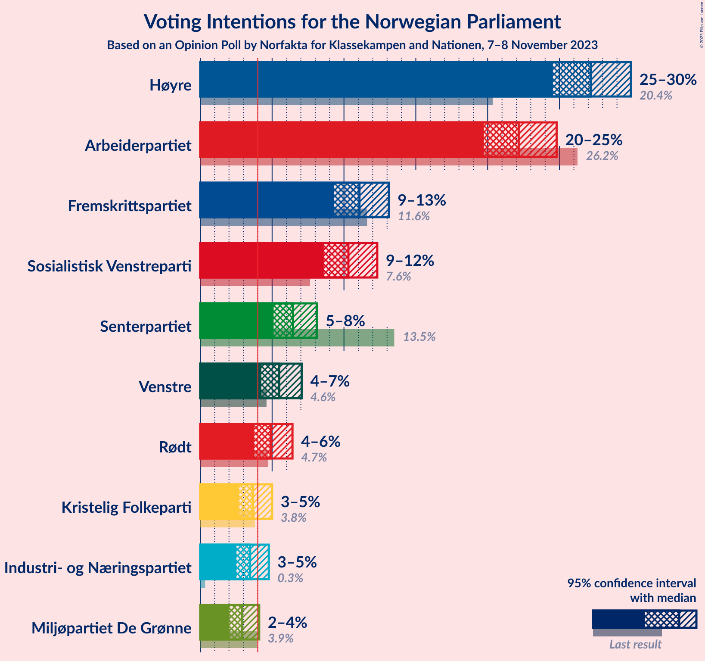

### Confidence Intervals

| Party | Last Result | Poll Result | 80% Confidence Interval | 90% Confidence Interval | 95% Confidence Interval | 99% Confidence Interval |
|:-----:|:-----------:|:-----------:|:-----------------------:|:-----------------------:|:-----------------------:|:-----------------------:|
| Høyre | 20.4% | 27.2% | 25.4–29.0% |25.0–29.5% |24.5–30.0% |23.7–30.8% |
| Arbeiderpartiet | 26.2% | 22.2% | 20.6–23.9% |20.1–24.4% |19.7–24.8% |19.0–25.6% |
| Fremskrittspartiet | 11.6% | 11.1% | 9.9–12.4% |9.6–12.8% |9.3–13.1% |8.8–13.8% |
| Sosialistisk Venstreparti | 7.6% | 10.3% | 9.2–11.6% |8.9–12.0% |8.6–12.3% |8.1–13.0% |
| Senterpartiet | 13.5% | 6.5% | 5.6–7.5% |5.3–7.8% |5.1–8.1% |4.7–8.7% |
| Venstre | 4.6% | 5.5% | 4.7–6.5% |4.5–6.8% |4.3–7.1% |3.9–7.6% |
| Rødt | 4.7% | 4.9% | 4.1–5.9% |3.9–6.2% |3.7–6.4% |3.4–6.9% |
| Kristelig Folkeparti | 3.8% | 3.7% | 3.0–4.5% |2.8–4.8% |2.7–5.0% |2.4–5.4% |
| Industri- og Næringspartiet | 0.3% | 3.5% | 2.8–4.3% |2.7–4.6% |2.5–4.8% |2.2–5.2% |
| Miljøpartiet De Grønne | 3.9% | 2.9% | 2.3–3.7% |2.2–3.9% |2.0–4.1% |1.8–4.5% |

*Note:* The poll result column reflects the actual value used in the calculations. Published results may vary slightly, and in addition be rounded to fewer digits.

## Seats

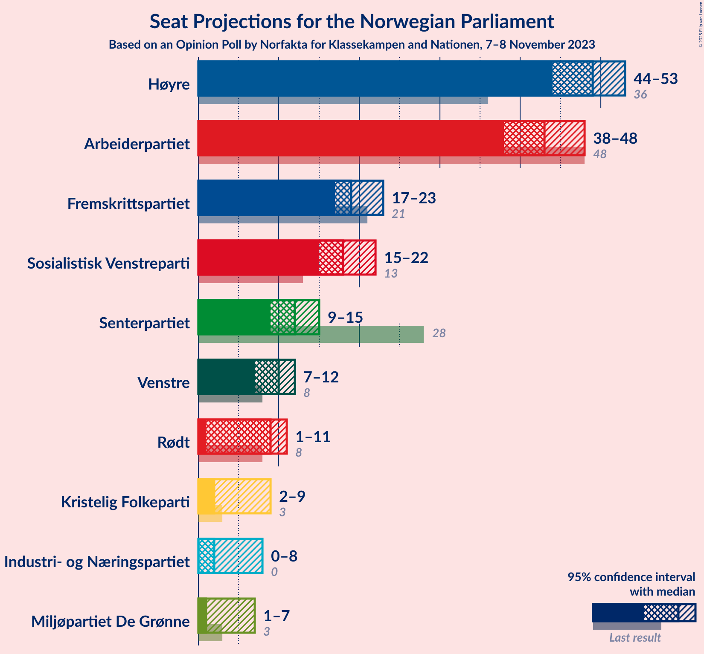

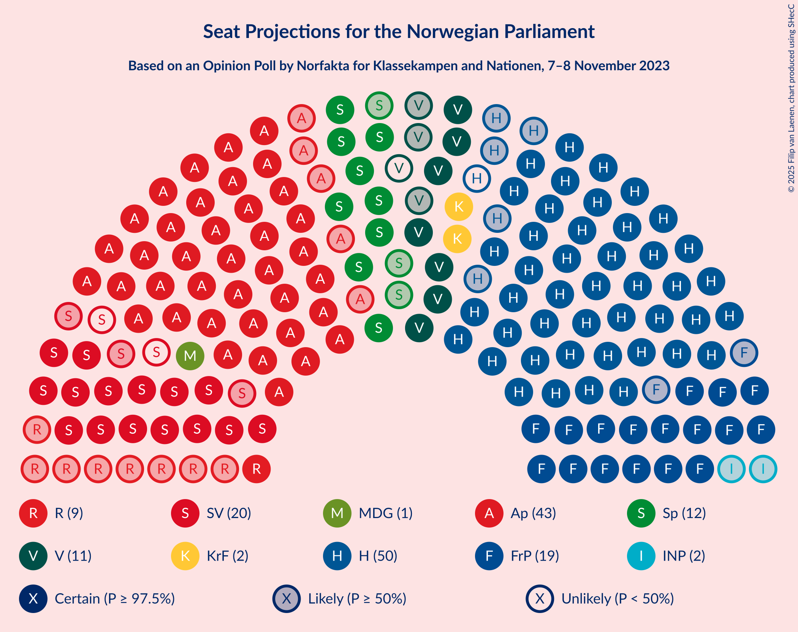

### Confidence Intervals

| Party | Last Result | Median | 80% Confidence Interval | 90% Confidence Interval | 95% Confidence Interval | 99% Confidence Interval |
|:-----:|:-----------:|:------:|:-----------------------:|:-----------------------:|:-----------------------:|:-----------------------:|
| <a href="#høyre">Høyre</a> | 36 | 49 | 45–52 |44–52 |44–53 |42–56 |
| <a href="#arbeiderpartiet">Arbeiderpartiet</a> | 48 | 43 | 40–47 |39–48 |38–48 |36–49 |
| <a href="#fremskrittspartiet">Fremskrittspartiet</a> | 21 | 19 | 17–22 |17–23 |17–23 |15–25 |
| <a href="#sosialistisk-venstreparti">Sosialistisk Venstreparti</a> | 13 | 18 | 16–20 |15–21 |15–22 |14–24 |
| <a href="#senterpartiet">Senterpartiet</a> | 28 | 12 | 9–13 |9–14 |9–15 |8–16 |
| <a href="#venstre">Venstre</a> | 8 | 10 | 8–12 |8–12 |7–12 |3–13 |
| <a href="#rødt">Rødt</a> | 8 | 9 | 7–10 |7–10 |1–11 |1–12 |
| <a href="#kristelig-folkeparti">Kristelig Folkeparti</a> | 3 | 2 | 2–8 |2–8 |2–9 |2–9 |
| <a href="#industri--og-næringspartiet">Industri- og Næringspartiet</a> | 0 | 2 | 2–7 |1–8 |0–8 |0–9 |
| <a href="#miljøpartiet-de-grønne">Miljøpartiet De Grønne</a> | 3 | 1 | 1–2 |1–2 |1–7 |1–8 |

### Høyre

*For a full overview of the results for this party, see the [Høyre](party-høyre.html) page.*

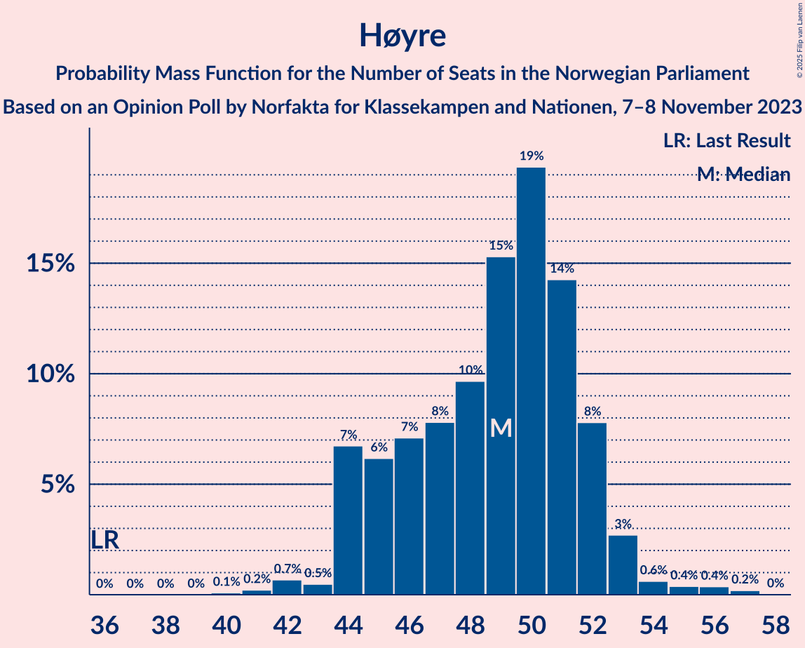

| Number of Seats | Probability | Accumulated | Special Marks |
|:---------------:|:-----------:|:-----------:|:-------------:|
| 36 | 0% | 100% | Last Result |
| 37 | 0% | 100% |  |
| 38 | 0% | 100% |  |
| 39 | 0% | 100% |  |
| 40 | 0.1% | 100% |  |
| 41 | 0.2% | 99.9% |  |
| 42 | 0.7% | 99.7% |  |
| 43 | 0.5% | 99.0% |  |
| 44 | 7% | 98.5% |  |
| 45 | 6% | 92% |  |
| 46 | 7% | 86% |  |
| 47 | 8% | 79% |  |
| 48 | 10% | 71% |  |
| 49 | 15% | 61% | Median |
| 50 | 19% | 46% |  |
| 51 | 14% | 26% |  |
| 52 | 8% | 12% |  |
| 53 | 3% | 4% |  |
| 54 | 0.6% | 2% |  |
| 55 | 0.4% | 1.0% |  |
| 56 | 0.4% | 0.6% |  |
| 57 | 0.2% | 0.2% |  |
| 58 | 0% | 0% |  |

### Arbeiderpartiet

*For a full overview of the results for this party, see the [Arbeiderpartiet](party-arbeiderpartiet.html) page.*

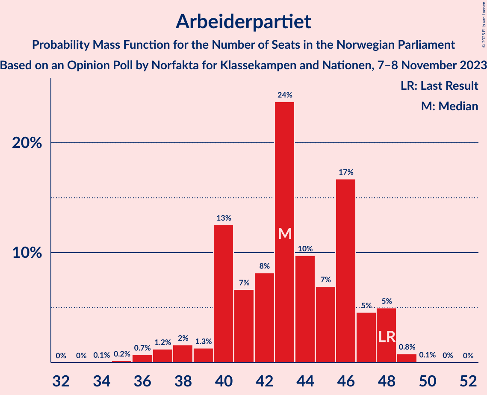

| Number of Seats | Probability | Accumulated | Special Marks |
|:---------------:|:-----------:|:-----------:|:-------------:|
| 34 | 0.1% | 100% |  |
| 35 | 0.2% | 99.9% |  |
| 36 | 0.7% | 99.8% |  |
| 37 | 1.2% | 99.1% |  |
| 38 | 2% | 98% |  |
| 39 | 1.3% | 96% |  |
| 40 | 13% | 95% |  |
| 41 | 7% | 82% |  |
| 42 | 8% | 76% |  |
| 43 | 24% | 68% | Median |
| 44 | 10% | 44% |  |
| 45 | 7% | 34% |  |
| 46 | 17% | 27% |  |
| 47 | 5% | 10% |  |
| 48 | 5% | 6% | Last Result |
| 49 | 0.8% | 0.9% |  |
| 50 | 0.1% | 0.1% |  |
| 51 | 0% | 0% |  |

### Fremskrittspartiet

*For a full overview of the results for this party, see the [Fremskrittspartiet](party-fremskrittspartiet.html) page.*

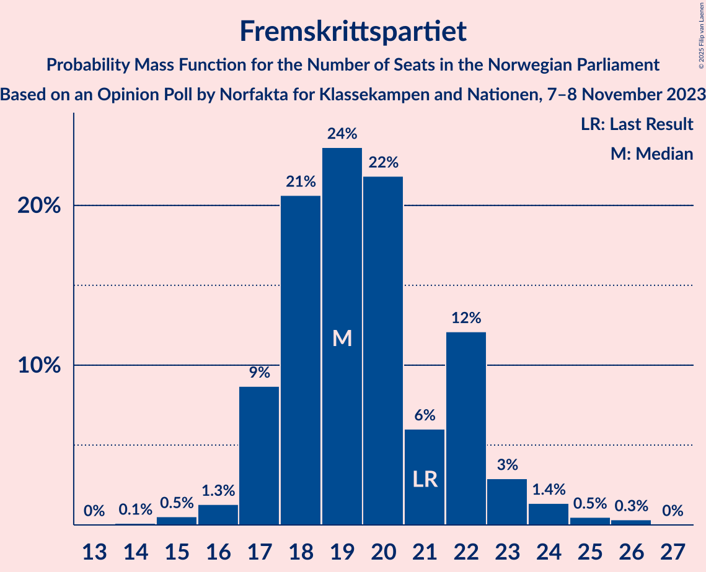

| Number of Seats | Probability | Accumulated | Special Marks |
|:---------------:|:-----------:|:-----------:|:-------------:|
| 14 | 0.1% | 100% |  |
| 15 | 0.5% | 99.9% |  |
| 16 | 1.3% | 99.3% |  |
| 17 | 9% | 98% |  |
| 18 | 21% | 89% |  |
| 19 | 24% | 69% | Median |
| 20 | 22% | 45% |  |
| 21 | 6% | 23% | Last Result |
| 22 | 12% | 17% |  |
| 23 | 3% | 5% |  |
| 24 | 1.4% | 2% |  |
| 25 | 0.5% | 0.9% |  |
| 26 | 0.3% | 0.4% |  |
| 27 | 0% | 0% |  |

### Sosialistisk Venstreparti

*For a full overview of the results for this party, see the [Sosialistisk Venstreparti](party-sosialistiskvenstreparti.html) page.*

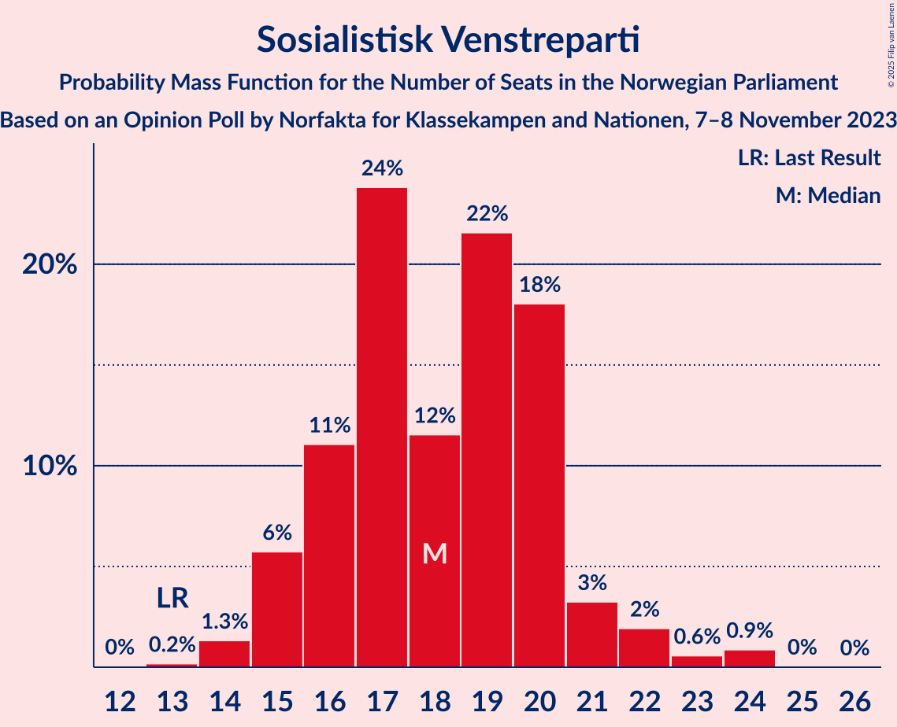

| Number of Seats | Probability | Accumulated | Special Marks |
|:---------------:|:-----------:|:-----------:|:-------------:|
| 12 | 0% | 100% |  |
| 13 | 0.2% | 99.9% | Last Result |
| 14 | 1.3% | 99.8% |  |
| 15 | 6% | 98% |  |
| 16 | 11% | 93% |  |
| 17 | 24% | 82% |  |
| 18 | 12% | 58% | Median |
| 19 | 22% | 46% |  |
| 20 | 18% | 25% |  |
| 21 | 3% | 7% |  |
| 22 | 2% | 3% |  |
| 23 | 0.6% | 1.5% |  |
| 24 | 0.9% | 0.9% |  |
| 25 | 0% | 0.1% |  |
| 26 | 0% | 0% |  |

### Senterpartiet

*For a full overview of the results for this party, see the [Senterpartiet](party-senterpartiet.html) page.*

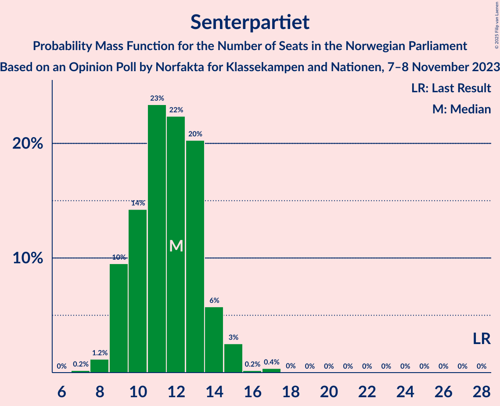

| Number of Seats | Probability | Accumulated | Special Marks |
|:---------------:|:-----------:|:-----------:|:-------------:|
| 7 | 0.2% | 100% |  |
| 8 | 1.2% | 99.8% |  |
| 9 | 10% | 98.6% |  |
| 10 | 14% | 89% |  |
| 11 | 23% | 75% |  |
| 12 | 22% | 51% | Median |
| 13 | 20% | 29% |  |
| 14 | 6% | 9% |  |
| 15 | 3% | 3% |  |
| 16 | 0.2% | 0.6% |  |
| 17 | 0.4% | 0.4% |  |
| 18 | 0% | 0% |  |
| 19 | 0% | 0% |  |
| 20 | 0% | 0% |  |
| 21 | 0% | 0% |  |
| 22 | 0% | 0% |  |
| 23 | 0% | 0% |  |
| 24 | 0% | 0% |  |
| 25 | 0% | 0% |  |
| 26 | 0% | 0% |  |
| 27 | 0% | 0% |  |
| 28 | 0% | 0% | Last Result |

### Venstre

*For a full overview of the results for this party, see the [Venstre](party-venstre.html) page.*

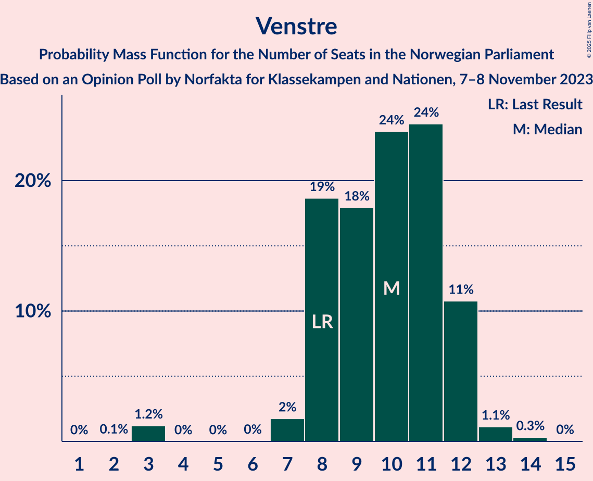

| Number of Seats | Probability | Accumulated | Special Marks |
|:---------------:|:-----------:|:-----------:|:-------------:|
| 2 | 0.1% | 100% |  |
| 3 | 1.2% | 99.9% |  |
| 4 | 0% | 98.7% |  |
| 5 | 0% | 98.7% |  |
| 6 | 0% | 98.7% |  |
| 7 | 2% | 98.7% |  |
| 8 | 19% | 97% | Last Result |
| 9 | 18% | 78% |  |
| 10 | 24% | 60% | Median |
| 11 | 24% | 37% |  |
| 12 | 11% | 12% |  |
| 13 | 1.1% | 1.5% |  |
| 14 | 0.3% | 0.3% |  |
| 15 | 0% | 0% |  |

### Rødt

*For a full overview of the results for this party, see the [Rødt](party-rødt.html) page.*

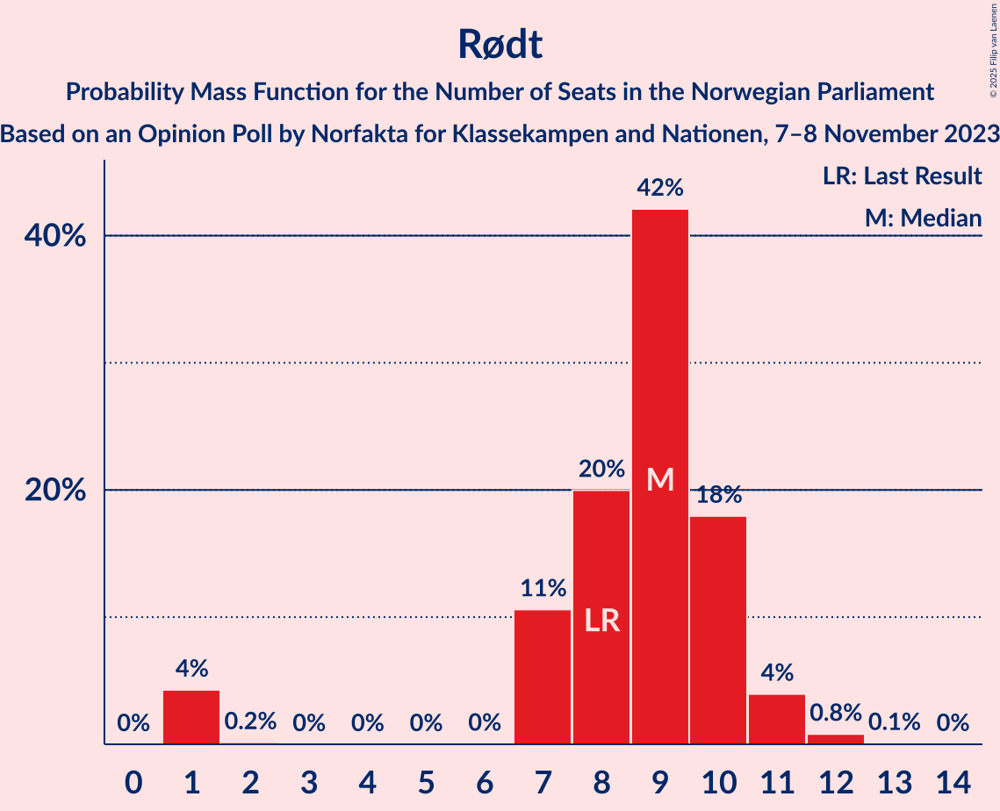

| Number of Seats | Probability | Accumulated | Special Marks |
|:---------------:|:-----------:|:-----------:|:-------------:|
| 1 | 4% | 100% |  |
| 2 | 0.2% | 96% |  |
| 3 | 0% | 96% |  |
| 4 | 0% | 96% |  |
| 5 | 0% | 96% |  |
| 6 | 0% | 96% |  |
| 7 | 11% | 96% |  |
| 8 | 20% | 85% | Last Result |
| 9 | 42% | 65% | Median |
| 10 | 18% | 23% |  |
| 11 | 4% | 5% |  |
| 12 | 0.8% | 0.9% |  |
| 13 | 0.1% | 0.1% |  |
| 14 | 0% | 0% |  |

### Kristelig Folkeparti

*For a full overview of the results for this party, see the [Kristelig Folkeparti](party-kristeligfolkeparti.html) page.*

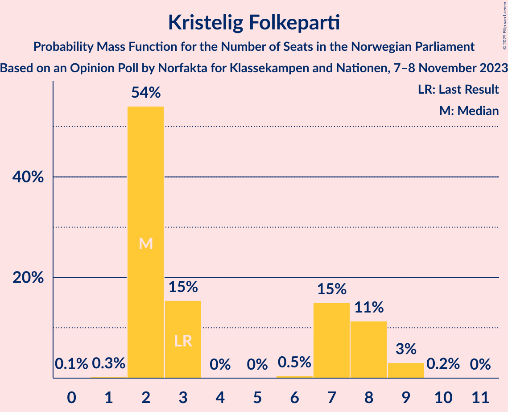

| Number of Seats | Probability | Accumulated | Special Marks |
|:---------------:|:-----------:|:-----------:|:-------------:|
| 0 | 0.1% | 100% |  |
| 1 | 0.3% | 99.9% |  |
| 2 | 54% | 99.6% | Median |
| 3 | 15% | 46% | Last Result |
| 4 | 0% | 30% |  |
| 5 | 0% | 30% |  |
| 6 | 0.5% | 30% |  |
| 7 | 15% | 30% |  |
| 8 | 11% | 15% |  |
| 9 | 3% | 3% |  |
| 10 | 0.2% | 0.2% |  |
| 11 | 0% | 0% |  |

### Industri- og Næringspartiet

*For a full overview of the results for this party, see the [Industri- og Næringspartiet](party-industri-ognæringspartiet.html) page.*

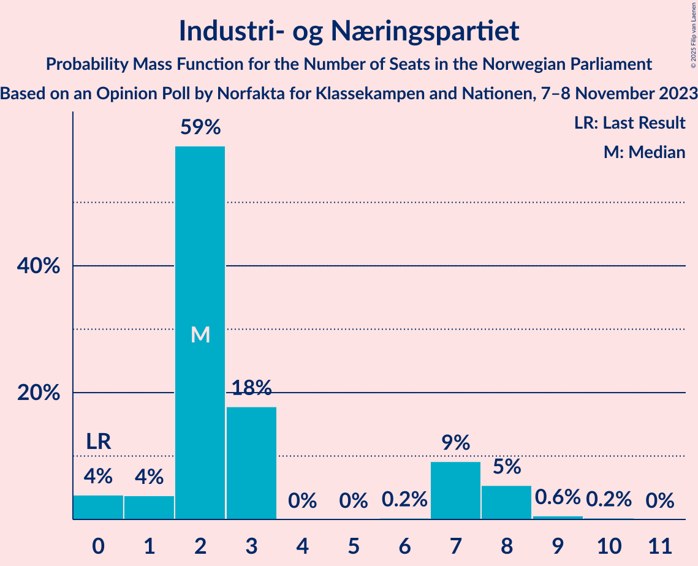

| Number of Seats | Probability | Accumulated | Special Marks |
|:---------------:|:-----------:|:-----------:|:-------------:|
| 0 | 4% | 100% | Last Result |
| 1 | 4% | 96% |  |
| 2 | 59% | 92% | Median |
| 3 | 18% | 33% |  |
| 4 | 0% | 16% |  |
| 5 | 0% | 16% |  |
| 6 | 0.2% | 16% |  |
| 7 | 9% | 15% |  |
| 8 | 5% | 6% |  |
| 9 | 0.6% | 0.8% |  |
| 10 | 0.2% | 0.3% |  |
| 11 | 0% | 0% |  |

### Miljøpartiet De Grønne

*For a full overview of the results for this party, see the [Miljøpartiet De Grønne](party-miljøpartietdegrønne.html) page.*

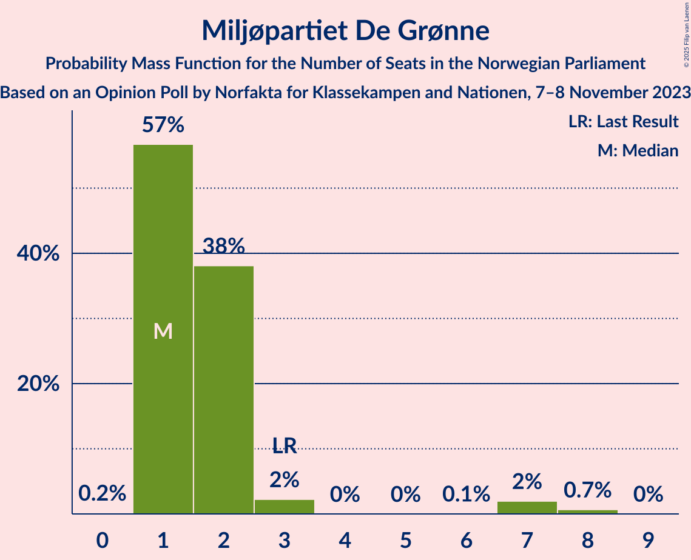

| Number of Seats | Probability | Accumulated | Special Marks |
|:---------------:|:-----------:|:-----------:|:-------------:|
| 0 | 0.2% | 100% |  |
| 1 | 57% | 99.8% | Median |
| 2 | 38% | 43% |  |
| 3 | 2% | 5% | Last Result |
| 4 | 0% | 3% |  |
| 5 | 0% | 3% |  |
| 6 | 0.1% | 3% |  |
| 7 | 2% | 3% |  |
| 8 | 0.7% | 0.7% |  |
| 9 | 0% | 0% |  |

## Coalitions

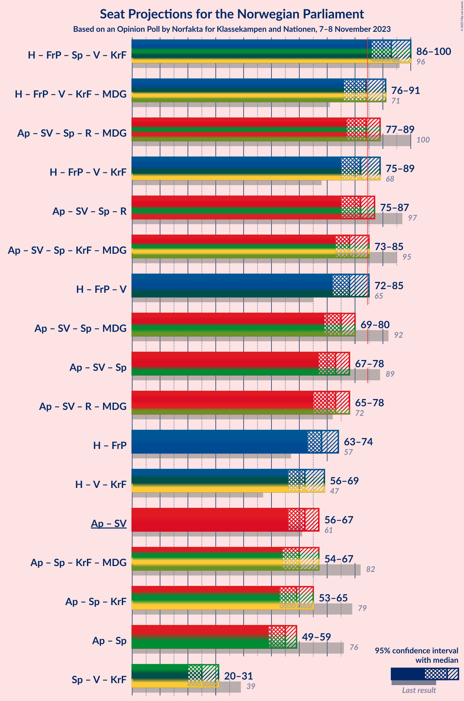

### Confidence Intervals

| Coalition | Last Result | Median | Majority? | 80% Confidence Interval | 90% Confidence Interval | 95% Confidence Interval | 99% Confidence Interval |
|:---------:|:-----------:|:------:|:---------:|:-----------------------:|:-----------------------:|:-----------------------:|:-----------------------:|
| Høyre – Fremskrittspartiet – Senterpartiet – Venstre – Kristelig Folkeparti | 96 | 93 | 99.7% | 88–99 | 87–99 | 86–100 | 85–102 |
| Høyre – Fremskrittspartiet – Venstre – Kristelig Folkeparti – Miljøpartiet De Grønne | 71 | 84 | 41% | 79–88 | 78–89 | 76–91 | 75–92 |
| Arbeiderpartiet – Sosialistisk Venstreparti – Senterpartiet – Rødt – Miljøpartiet De Grønne | 100 | 84 | 41% | 79–87 | 78–88 | 77–89 | 75–91 |
| Høyre – Fremskrittspartiet – Venstre – Kristelig Folkeparti | 68 | 82 | 22% | 78–87 | 76–88 | 75–89 | 73–90 |
| Arbeiderpartiet – Sosialistisk Venstreparti – Senterpartiet – Rødt | 97 | 82 | 20% | 77–85 | 76–85 | 75–87 | 73–88 |
| Arbeiderpartiet – Sosialistisk Venstreparti – Senterpartiet – Kristelig Folkeparti – Miljøpartiet De Grønne | 95 | 78 | 4% | 74–83 | 73–84 | 73–85 | 70–87 |
| Høyre – Fremskrittspartiet – Venstre | 65 | 78 | 5% | 74–83 | 73–84 | 72–85 | 70–87 |
| Arbeiderpartiet – Sosialistisk Venstreparti – Senterpartiet – Miljøpartiet De Grønne | 92 | 75 | 0.1% | 71–78 | 70–79 | 69–80 | 67–84 |
| Arbeiderpartiet – Sosialistisk Venstreparti – Senterpartiet | 89 | 73 | 0% | 70–76 | 68–77 | 67–78 | 65–82 |
| Arbeiderpartiet – Sosialistisk Venstreparti – Rødt – Miljøpartiet De Grønne | 72 | 73 | 0% | 67–75 | 66–78 | 65–78 | 63–79 |
| Høyre – Fremskrittspartiet | 57 | 68 | 0% | 64–72 | 64–74 | 63–74 | 60–76 |
| Høyre – Venstre – Kristelig Folkeparti | 47 | 62 | 0% | 58–67 | 57–68 | 56–69 | 55–69 |
| Arbeiderpartiet – Sosialistisk Venstreparti | 61 | 62 | 0% | 57–65 | 57–67 | 56–67 | 54–69 |
| Arbeiderpartiet – Senterpartiet – Kristelig Folkeparti – Miljøpartiet De Grønne | 82 | 60 | 0% | 56–65 | 55–66 | 54–67 | 52–69 |
| Arbeiderpartiet – Senterpartiet – Kristelig Folkeparti | 79 | 59 | 0% | 55–63 | 54–64 | 53–65 | 50–67 |
| Arbeiderpartiet – Senterpartiet | 76 | 55 | 0% | 52–59 | 51–59 | 49–59 | 48–62 |
| Senterpartiet – Venstre – Kristelig Folkeparti | 39 | 25 | 0% | 21–29 | 21–31 | 20–31 | 18–33 |

### Høyre – Fremskrittspartiet – Senterpartiet – Venstre – Kristelig Folkeparti

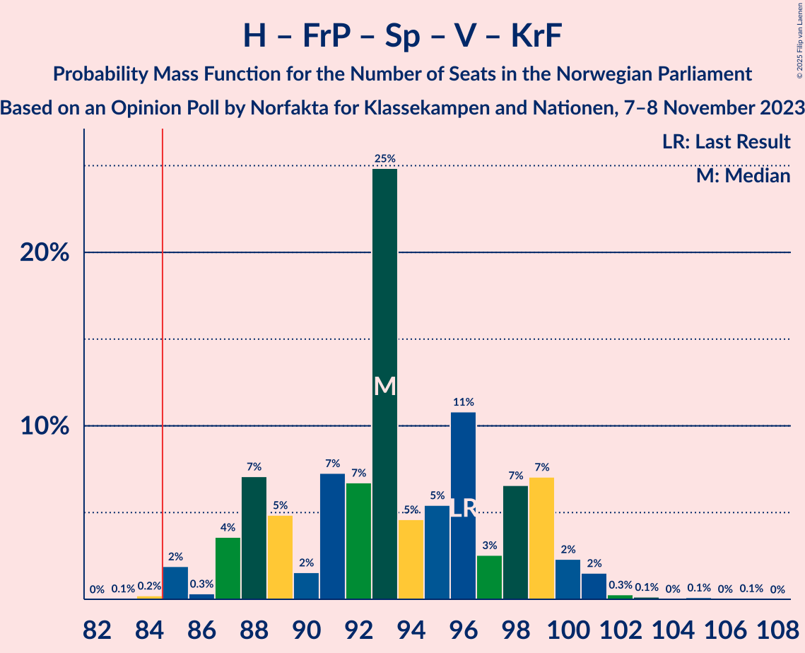

| Number of Seats | Probability | Accumulated | Special Marks |
|:---------------:|:-----------:|:-----------:|:-------------:|
| 83 | 0.1% | 100% |  |
| 84 | 0.2% | 99.9% |  |
| 85 | 2% | 99.7% | Majority |
| 86 | 0.3% | 98% |  |
| 87 | 4% | 97% |  |
| 88 | 7% | 94% |  |
| 89 | 5% | 87% |  |
| 90 | 2% | 82% |  |
| 91 | 7% | 80% |  |
| 92 | 7% | 73% | Median |
| 93 | 25% | 66% |  |
| 94 | 5% | 42% |  |
| 95 | 5% | 37% |  |
| 96 | 11% | 32% | Last Result |
| 97 | 3% | 21% |  |
| 98 | 7% | 18% |  |
| 99 | 7% | 12% |  |
| 100 | 2% | 5% |  |
| 101 | 2% | 2% |  |
| 102 | 0.3% | 0.7% |  |
| 103 | 0.1% | 0.4% |  |
| 104 | 0% | 0.3% |  |
| 105 | 0.1% | 0.2% |  |
| 106 | 0% | 0.1% |  |
| 107 | 0.1% | 0.1% |  |
| 108 | 0% | 0% |  |

### Høyre – Fremskrittspartiet – Venstre – Kristelig Folkeparti – Miljøpartiet De Grønne

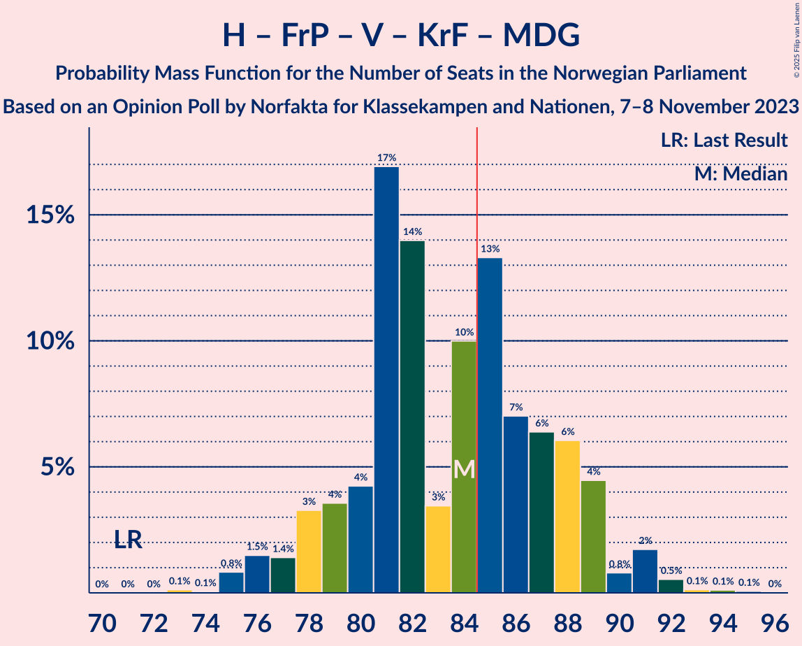

| Number of Seats | Probability | Accumulated | Special Marks |
|:---------------:|:-----------:|:-----------:|:-------------:|
| 71 | 0% | 100% | Last Result |
| 72 | 0% | 100% |  |
| 73 | 0.1% | 100% |  |
| 74 | 0.1% | 99.9% |  |
| 75 | 0.8% | 99.8% |  |
| 76 | 1.5% | 99.0% |  |
| 77 | 1.4% | 97% |  |
| 78 | 3% | 96% |  |
| 79 | 4% | 93% |  |
| 80 | 4% | 89% |  |
| 81 | 17% | 85% | Median |
| 82 | 14% | 68% |  |
| 83 | 3% | 54% |  |
| 84 | 10% | 51% |  |
| 85 | 13% | 41% | Majority |
| 86 | 7% | 27% |  |
| 87 | 6% | 20% |  |
| 88 | 6% | 14% |  |
| 89 | 4% | 8% |  |
| 90 | 0.8% | 3% |  |
| 91 | 2% | 3% |  |
| 92 | 0.5% | 0.9% |  |
| 93 | 0.1% | 0.3% |  |
| 94 | 0.1% | 0.2% |  |
| 95 | 0.1% | 0.1% |  |
| 96 | 0% | 0% |  |

### Arbeiderpartiet – Sosialistisk Venstreparti – Senterpartiet – Rødt – Miljøpartiet De Grønne

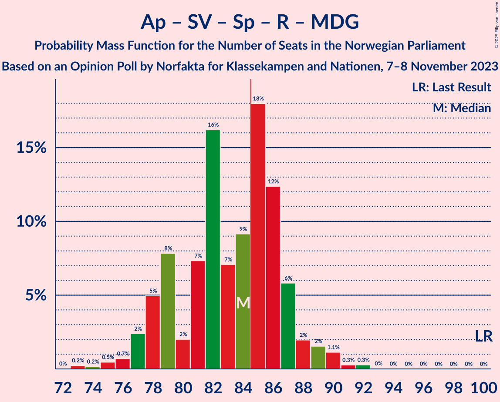

| Number of Seats | Probability | Accumulated | Special Marks |
|:---------------:|:-----------:|:-----------:|:-------------:|
| 72 | 0% | 100% |  |
| 73 | 0.2% | 99.9% |  |
| 74 | 0.2% | 99.7% |  |
| 75 | 0.5% | 99.5% |  |
| 76 | 0.7% | 99.1% |  |
| 77 | 2% | 98% |  |
| 78 | 5% | 96% |  |
| 79 | 8% | 91% |  |
| 80 | 2% | 83% |  |
| 81 | 7% | 81% |  |
| 82 | 16% | 74% |  |
| 83 | 7% | 58% | Median |
| 84 | 9% | 51% |  |
| 85 | 18% | 41% | Majority |
| 86 | 12% | 23% |  |
| 87 | 6% | 11% |  |
| 88 | 2% | 5% |  |
| 89 | 2% | 3% |  |
| 90 | 1.1% | 2% |  |
| 91 | 0.3% | 0.6% |  |
| 92 | 0.3% | 0.3% |  |
| 93 | 0% | 0.1% |  |
| 94 | 0% | 0% |  |
| 95 | 0% | 0% |  |
| 96 | 0% | 0% |  |
| 97 | 0% | 0% |  |
| 98 | 0% | 0% |  |
| 99 | 0% | 0% |  |
| 100 | 0% | 0% | Last Result |

### Høyre – Fremskrittspartiet – Venstre – Kristelig Folkeparti

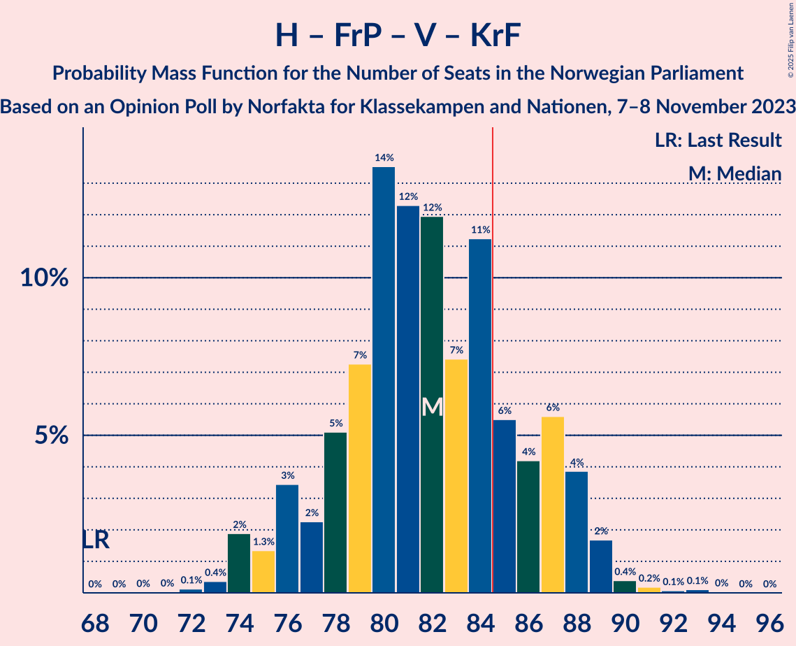

| Number of Seats | Probability | Accumulated | Special Marks |
|:---------------:|:-----------:|:-----------:|:-------------:|
| 68 | 0% | 100% | Last Result |
| 69 | 0% | 100% |  |
| 70 | 0% | 100% |  |
| 71 | 0% | 100% |  |
| 72 | 0.1% | 99.9% |  |
| 73 | 0.4% | 99.8% |  |
| 74 | 2% | 99.5% |  |
| 75 | 1.3% | 98% |  |
| 76 | 3% | 96% |  |
| 77 | 2% | 93% |  |
| 78 | 5% | 91% |  |
| 79 | 7% | 85% |  |
| 80 | 14% | 78% | Median |
| 81 | 12% | 65% |  |
| 82 | 12% | 52% |  |
| 83 | 7% | 40% |  |
| 84 | 11% | 33% |  |
| 85 | 6% | 22% | Majority |
| 86 | 4% | 16% |  |
| 87 | 6% | 12% |  |
| 88 | 4% | 6% |  |
| 89 | 2% | 3% |  |
| 90 | 0.4% | 0.8% |  |
| 91 | 0.2% | 0.4% |  |
| 92 | 0.1% | 0.2% |  |
| 93 | 0.1% | 0.2% |  |
| 94 | 0% | 0.1% |  |
| 95 | 0% | 0% |  |

### Arbeiderpartiet – Sosialistisk Venstreparti – Senterpartiet – Rødt

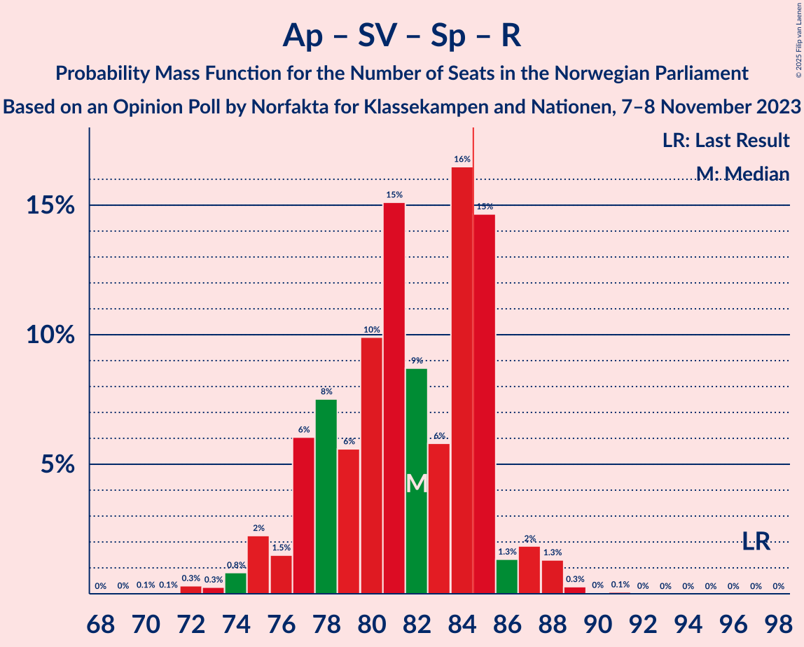

| Number of Seats | Probability | Accumulated | Special Marks |
|:---------------:|:-----------:|:-----------:|:-------------:|
| 70 | 0.1% | 100% |  |
| 71 | 0.1% | 99.9% |  |
| 72 | 0.3% | 99.9% |  |
| 73 | 0.3% | 99.5% |  |
| 74 | 0.8% | 99.3% |  |
| 75 | 2% | 98% |  |
| 76 | 1.5% | 96% |  |
| 77 | 6% | 95% |  |
| 78 | 8% | 89% |  |
| 79 | 6% | 81% |  |
| 80 | 10% | 76% |  |
| 81 | 15% | 66% |  |
| 82 | 9% | 51% | Median |
| 83 | 6% | 42% |  |
| 84 | 16% | 36% |  |
| 85 | 15% | 20% | Majority |
| 86 | 1.3% | 5% |  |
| 87 | 2% | 4% |  |
| 88 | 1.3% | 2% |  |
| 89 | 0.3% | 0.4% |  |
| 90 | 0% | 0.1% |  |
| 91 | 0.1% | 0.1% |  |
| 92 | 0% | 0% |  |
| 93 | 0% | 0% |  |
| 94 | 0% | 0% |  |
| 95 | 0% | 0% |  |
| 96 | 0% | 0% |  |
| 97 | 0% | 0% | Last Result |

### Arbeiderpartiet – Sosialistisk Venstreparti – Senterpartiet – Kristelig Folkeparti – Miljøpartiet De Grønne

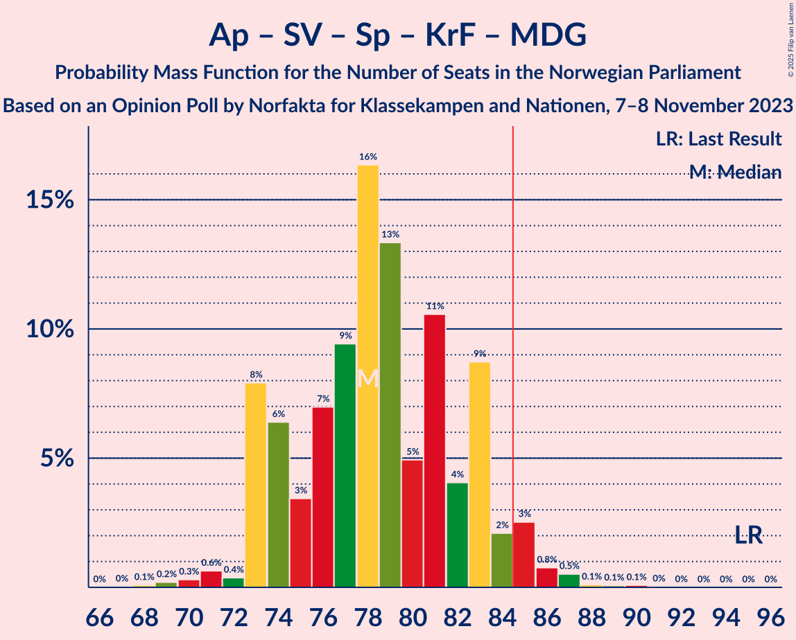

| Number of Seats | Probability | Accumulated | Special Marks |
|:---------------:|:-----------:|:-----------:|:-------------:|
| 68 | 0.1% | 100% |  |
| 69 | 0.2% | 99.9% |  |
| 70 | 0.3% | 99.7% |  |
| 71 | 0.6% | 99.4% |  |
| 72 | 0.4% | 98.7% |  |
| 73 | 8% | 98% |  |
| 74 | 6% | 90% |  |
| 75 | 3% | 84% |  |
| 76 | 7% | 81% | Median |
| 77 | 9% | 74% |  |
| 78 | 16% | 64% |  |
| 79 | 13% | 48% |  |
| 80 | 5% | 34% |  |
| 81 | 11% | 30% |  |
| 82 | 4% | 19% |  |
| 83 | 9% | 15% |  |
| 84 | 2% | 6% |  |
| 85 | 3% | 4% | Majority |
| 86 | 0.8% | 2% |  |
| 87 | 0.5% | 0.8% |  |
| 88 | 0.1% | 0.3% |  |
| 89 | 0.1% | 0.2% |  |
| 90 | 0.1% | 0.1% |  |
| 91 | 0% | 0% |  |
| 92 | 0% | 0% |  |
| 93 | 0% | 0% |  |
| 94 | 0% | 0% |  |
| 95 | 0% | 0% | Last Result |

### Høyre – Fremskrittspartiet – Venstre

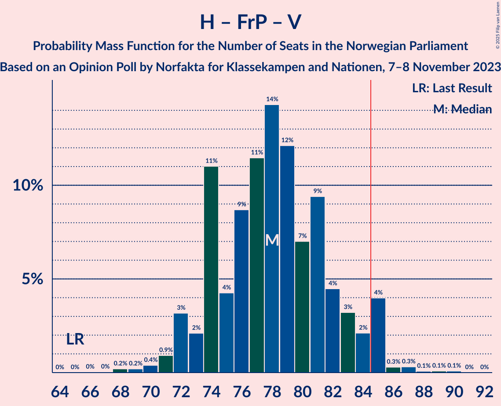

| Number of Seats | Probability | Accumulated | Special Marks |
|:---------------:|:-----------:|:-----------:|:-------------:|
| 65 | 0% | 100% | Last Result |
| 66 | 0% | 100% |  |
| 67 | 0% | 100% |  |
| 68 | 0.2% | 99.9% |  |
| 69 | 0.2% | 99.7% |  |
| 70 | 0.4% | 99.5% |  |
| 71 | 0.9% | 99.1% |  |
| 72 | 3% | 98% |  |
| 73 | 2% | 95% |  |
| 74 | 11% | 93% |  |
| 75 | 4% | 82% |  |
| 76 | 9% | 78% |  |
| 77 | 11% | 69% |  |
| 78 | 14% | 57% | Median |
| 79 | 12% | 43% |  |
| 80 | 7% | 31% |  |
| 81 | 9% | 24% |  |
| 82 | 4% | 15% |  |
| 83 | 3% | 10% |  |
| 84 | 2% | 7% |  |
| 85 | 4% | 5% | Majority |
| 86 | 0.3% | 0.9% |  |
| 87 | 0.3% | 0.6% |  |
| 88 | 0.1% | 0.3% |  |
| 89 | 0.1% | 0.2% |  |
| 90 | 0.1% | 0.1% |  |
| 91 | 0% | 0% |  |

### Arbeiderpartiet – Sosialistisk Venstreparti – Senterpartiet – Miljøpartiet De Grønne

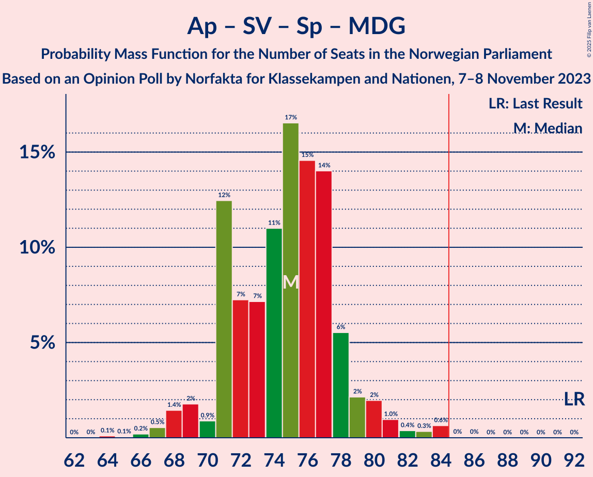

| Number of Seats | Probability | Accumulated | Special Marks |
|:---------------:|:-----------:|:-----------:|:-------------:|
| 64 | 0.1% | 100% |  |
| 65 | 0.1% | 99.9% |  |
| 66 | 0.2% | 99.8% |  |
| 67 | 0.5% | 99.6% |  |
| 68 | 1.4% | 99.1% |  |
| 69 | 2% | 98% |  |
| 70 | 0.9% | 96% |  |
| 71 | 12% | 95% |  |
| 72 | 7% | 83% |  |
| 73 | 7% | 75% |  |
| 74 | 11% | 68% | Median |
| 75 | 17% | 57% |  |
| 76 | 15% | 41% |  |
| 77 | 14% | 26% |  |
| 78 | 6% | 12% |  |
| 79 | 2% | 6% |  |
| 80 | 2% | 4% |  |
| 81 | 1.0% | 2% |  |
| 82 | 0.4% | 1.4% |  |
| 83 | 0.3% | 1.0% |  |
| 84 | 0.6% | 0.7% |  |
| 85 | 0% | 0.1% | Majority |
| 86 | 0% | 0% |  |
| 87 | 0% | 0% |  |
| 88 | 0% | 0% |  |
| 89 | 0% | 0% |  |
| 90 | 0% | 0% |  |
| 91 | 0% | 0% |  |
| 92 | 0% | 0% | Last Result |

### Arbeiderpartiet – Sosialistisk Venstreparti – Senterpartiet

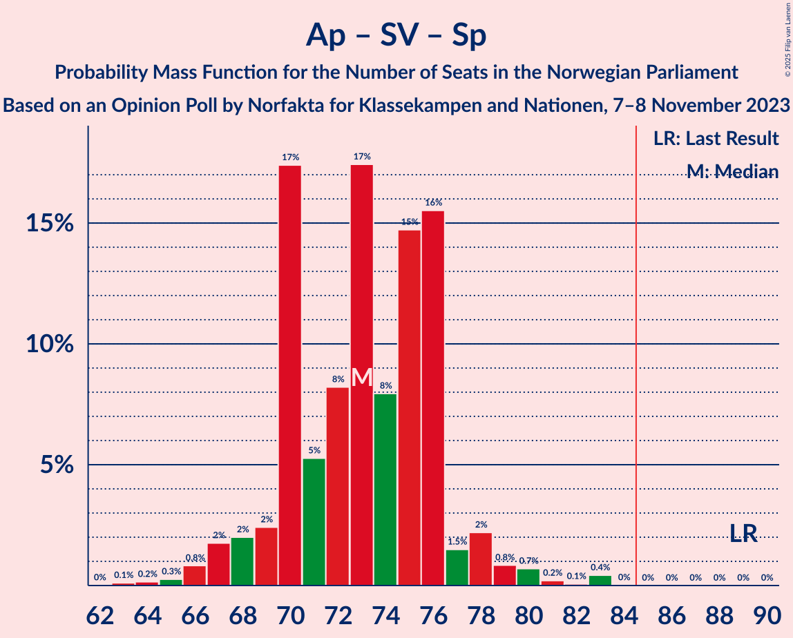

| Number of Seats | Probability | Accumulated | Special Marks |
|:---------------:|:-----------:|:-----------:|:-------------:|
| 63 | 0.1% | 100% |  |
| 64 | 0.2% | 99.9% |  |
| 65 | 0.3% | 99.7% |  |
| 66 | 0.8% | 99.4% |  |
| 67 | 2% | 98.6% |  |
| 68 | 2% | 97% |  |
| 69 | 2% | 95% |  |
| 70 | 17% | 92% |  |
| 71 | 5% | 75% |  |
| 72 | 8% | 70% |  |
| 73 | 17% | 62% | Median |
| 74 | 8% | 44% |  |
| 75 | 15% | 36% |  |
| 76 | 16% | 21% |  |
| 77 | 1.5% | 6% |  |
| 78 | 2% | 4% |  |
| 79 | 0.8% | 2% |  |
| 80 | 0.7% | 1.4% |  |
| 81 | 0.2% | 0.7% |  |
| 82 | 0.1% | 0.5% |  |
| 83 | 0.4% | 0.4% |  |
| 84 | 0% | 0% |  |
| 85 | 0% | 0% | Majority |
| 86 | 0% | 0% |  |
| 87 | 0% | 0% |  |
| 88 | 0% | 0% |  |
| 89 | 0% | 0% | Last Result |

### Arbeiderpartiet – Sosialistisk Venstreparti – Rødt – Miljøpartiet De Grønne

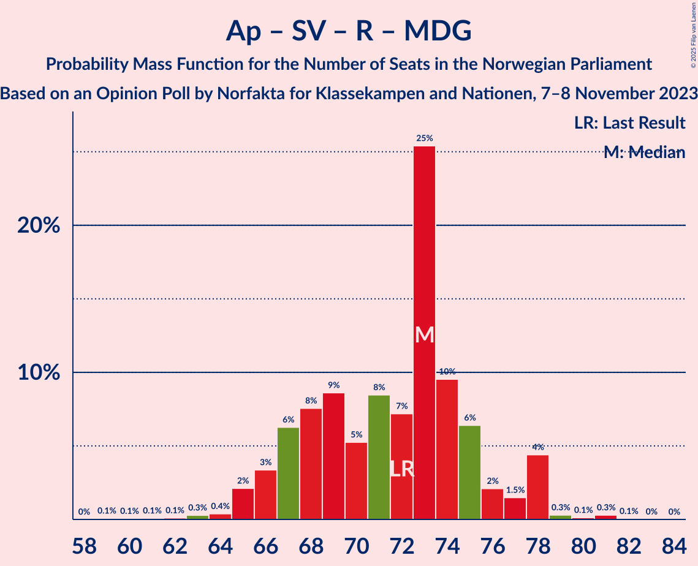

| Number of Seats | Probability | Accumulated | Special Marks |
|:---------------:|:-----------:|:-----------:|:-------------:|
| 59 | 0.1% | 100% |  |
| 60 | 0.1% | 99.9% |  |
| 61 | 0.1% | 99.8% |  |
| 62 | 0.1% | 99.8% |  |
| 63 | 0.3% | 99.7% |  |
| 64 | 0.4% | 99.4% |  |
| 65 | 2% | 99.0% |  |
| 66 | 3% | 97% |  |
| 67 | 6% | 93% |  |
| 68 | 8% | 87% |  |
| 69 | 9% | 80% |  |
| 70 | 5% | 71% |  |
| 71 | 8% | 66% | Median |
| 72 | 7% | 57% | Last Result |
| 73 | 25% | 50% |  |
| 74 | 10% | 25% |  |
| 75 | 6% | 15% |  |
| 76 | 2% | 9% |  |
| 77 | 1.5% | 7% |  |
| 78 | 4% | 5% |  |
| 79 | 0.3% | 0.8% |  |
| 80 | 0.1% | 0.5% |  |
| 81 | 0.3% | 0.4% |  |
| 82 | 0.1% | 0.1% |  |
| 83 | 0% | 0% |  |

### Høyre – Fremskrittspartiet

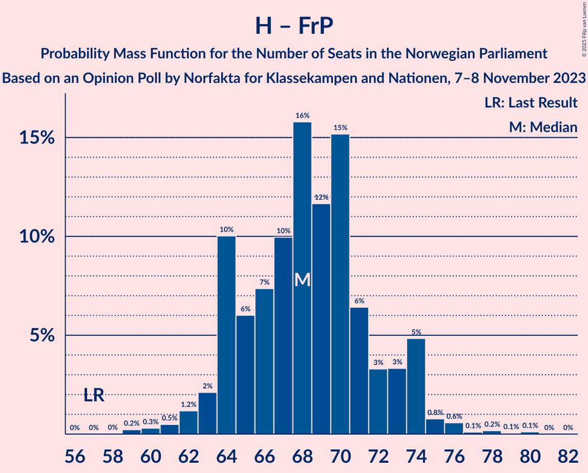

| Number of Seats | Probability | Accumulated | Special Marks |
|:---------------:|:-----------:|:-----------:|:-------------:|
| 57 | 0% | 100% | Last Result |
| 58 | 0% | 100% |  |
| 59 | 0.2% | 100% |  |
| 60 | 0.3% | 99.7% |  |
| 61 | 0.5% | 99.4% |  |
| 62 | 1.2% | 99.0% |  |
| 63 | 2% | 98% |  |
| 64 | 10% | 96% |  |
| 65 | 6% | 86% |  |
| 66 | 7% | 80% |  |
| 67 | 10% | 72% |  |
| 68 | 16% | 62% | Median |
| 69 | 12% | 47% |  |
| 70 | 15% | 35% |  |
| 71 | 6% | 20% |  |
| 72 | 3% | 13% |  |
| 73 | 3% | 10% |  |
| 74 | 5% | 7% |  |
| 75 | 0.8% | 2% |  |
| 76 | 0.6% | 1.0% |  |
| 77 | 0.1% | 0.5% |  |
| 78 | 0.2% | 0.4% |  |
| 79 | 0.1% | 0.2% |  |
| 80 | 0.1% | 0.1% |  |
| 81 | 0% | 0% |  |

### Høyre – Venstre – Kristelig Folkeparti

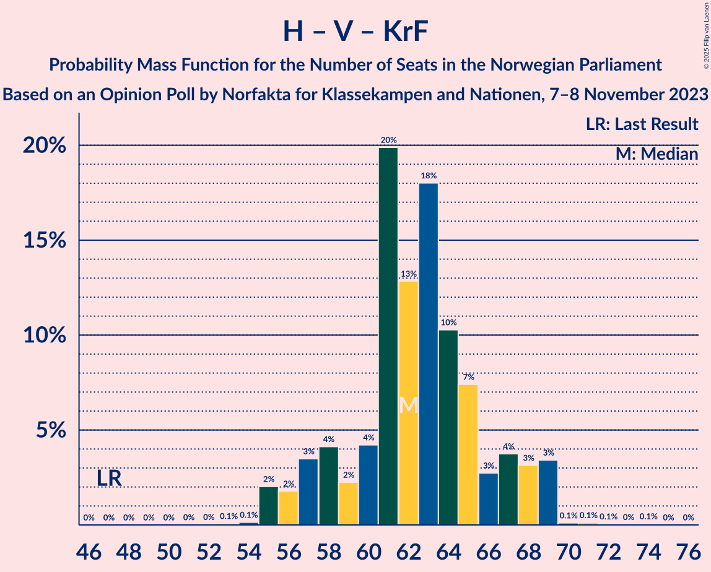

| Number of Seats | Probability | Accumulated | Special Marks |
|:---------------:|:-----------:|:-----------:|:-------------:|
| 47 | 0% | 100% | Last Result |
| 48 | 0% | 100% |  |
| 49 | 0% | 100% |  |
| 50 | 0% | 100% |  |
| 51 | 0% | 100% |  |
| 52 | 0% | 100% |  |
| 53 | 0.1% | 100% |  |
| 54 | 0.1% | 99.9% |  |
| 55 | 2% | 99.7% |  |
| 56 | 2% | 98% |  |
| 57 | 3% | 96% |  |
| 58 | 4% | 92% |  |
| 59 | 2% | 88% |  |
| 60 | 4% | 86% |  |
| 61 | 20% | 82% | Median |
| 62 | 13% | 62% |  |
| 63 | 18% | 49% |  |
| 64 | 10% | 31% |  |
| 65 | 7% | 21% |  |
| 66 | 3% | 13% |  |
| 67 | 4% | 11% |  |
| 68 | 3% | 7% |  |
| 69 | 3% | 4% |  |
| 70 | 0.1% | 0.4% |  |
| 71 | 0.1% | 0.3% |  |
| 72 | 0.1% | 0.2% |  |
| 73 | 0% | 0.1% |  |
| 74 | 0.1% | 0.1% |  |
| 75 | 0% | 0% |  |

### Arbeiderpartiet – Sosialistisk Venstreparti

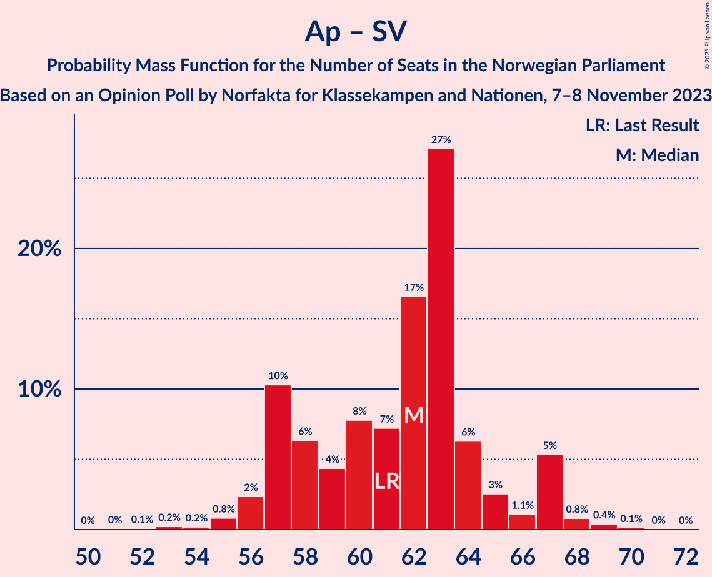

| Number of Seats | Probability | Accumulated | Special Marks |
|:---------------:|:-----------:|:-----------:|:-------------:|
| 51 | 0% | 100% |  |
| 52 | 0.1% | 99.9% |  |
| 53 | 0.2% | 99.9% |  |
| 54 | 0.2% | 99.7% |  |
| 55 | 0.8% | 99.5% |  |
| 56 | 2% | 98.7% |  |
| 57 | 10% | 96% |  |
| 58 | 6% | 86% |  |
| 59 | 4% | 80% |  |
| 60 | 8% | 75% |  |
| 61 | 7% | 68% | Last Result, Median |
| 62 | 17% | 60% |  |
| 63 | 27% | 44% |  |
| 64 | 6% | 17% |  |
| 65 | 3% | 10% |  |
| 66 | 1.1% | 8% |  |
| 67 | 5% | 7% |  |
| 68 | 0.8% | 1.3% |  |
| 69 | 0.4% | 0.5% |  |
| 70 | 0.1% | 0.2% |  |
| 71 | 0% | 0% |  |

### Arbeiderpartiet – Senterpartiet – Kristelig Folkeparti – Miljøpartiet De Grønne

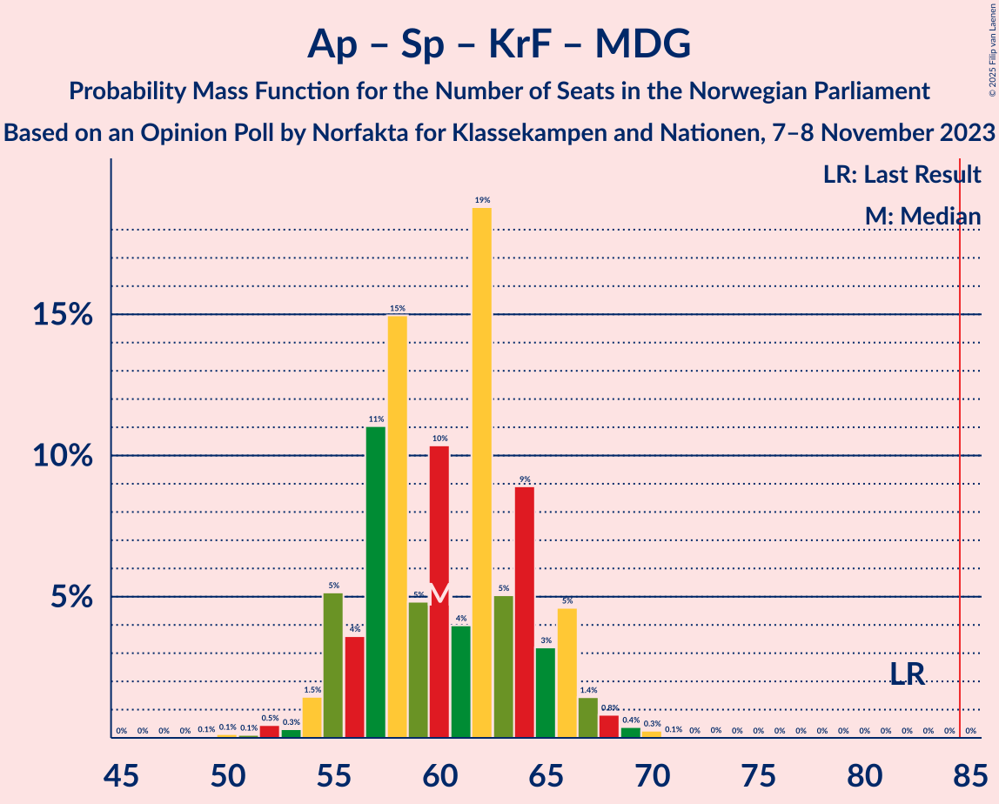

| Number of Seats | Probability | Accumulated | Special Marks |
|:---------------:|:-----------:|:-----------:|:-------------:|
| 49 | 0.1% | 100% |  |
| 50 | 0.1% | 99.9% |  |
| 51 | 0.1% | 99.8% |  |
| 52 | 0.5% | 99.7% |  |
| 53 | 0.3% | 99.2% |  |
| 54 | 1.5% | 98.9% |  |
| 55 | 5% | 97% |  |
| 56 | 4% | 92% |  |
| 57 | 11% | 89% |  |
| 58 | 15% | 78% | Median |
| 59 | 5% | 63% |  |
| 60 | 10% | 58% |  |
| 61 | 4% | 48% |  |
| 62 | 19% | 44% |  |
| 63 | 5% | 25% |  |
| 64 | 9% | 20% |  |
| 65 | 3% | 11% |  |
| 66 | 5% | 8% |  |
| 67 | 1.4% | 3% |  |
| 68 | 0.8% | 2% |  |
| 69 | 0.4% | 0.7% |  |
| 70 | 0.3% | 0.3% |  |
| 71 | 0.1% | 0.1% |  |
| 72 | 0% | 0% |  |
| 73 | 0% | 0% |  |
| 74 | 0% | 0% |  |
| 75 | 0% | 0% |  |
| 76 | 0% | 0% |  |
| 77 | 0% | 0% |  |
| 78 | 0% | 0% |  |
| 79 | 0% | 0% |  |
| 80 | 0% | 0% |  |
| 81 | 0% | 0% |  |
| 82 | 0% | 0% | Last Result |

### Arbeiderpartiet – Senterpartiet – Kristelig Folkeparti

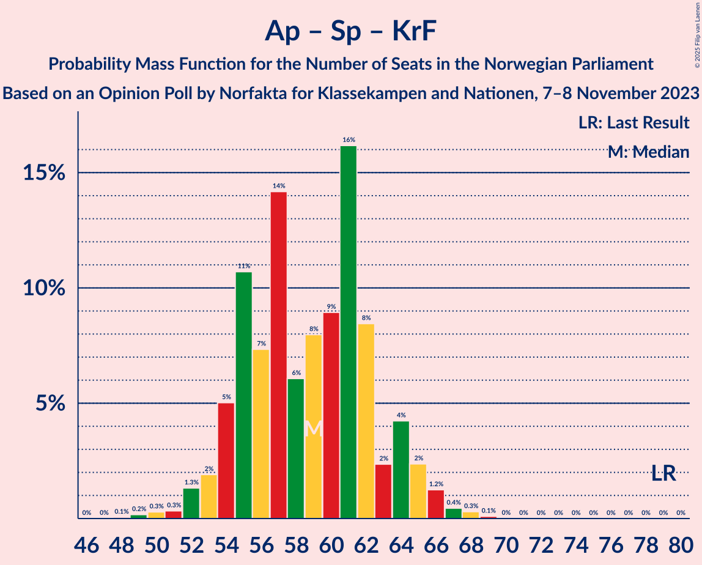

| Number of Seats | Probability | Accumulated | Special Marks |
|:---------------:|:-----------:|:-----------:|:-------------:|
| 48 | 0.1% | 100% |  |
| 49 | 0.2% | 99.9% |  |
| 50 | 0.3% | 99.8% |  |
| 51 | 0.3% | 99.5% |  |
| 52 | 1.3% | 99.1% |  |
| 53 | 2% | 98% |  |
| 54 | 5% | 96% |  |
| 55 | 11% | 91% |  |
| 56 | 7% | 80% |  |
| 57 | 14% | 73% | Median |
| 58 | 6% | 59% |  |
| 59 | 8% | 53% |  |
| 60 | 9% | 45% |  |
| 61 | 16% | 36% |  |
| 62 | 8% | 20% |  |
| 63 | 2% | 11% |  |
| 64 | 4% | 9% |  |
| 65 | 2% | 4% |  |
| 66 | 1.2% | 2% |  |
| 67 | 0.4% | 0.9% |  |
| 68 | 0.3% | 0.4% |  |
| 69 | 0.1% | 0.1% |  |
| 70 | 0% | 0% |  |
| 71 | 0% | 0% |  |
| 72 | 0% | 0% |  |
| 73 | 0% | 0% |  |
| 74 | 0% | 0% |  |
| 75 | 0% | 0% |  |
| 76 | 0% | 0% |  |
| 77 | 0% | 0% |  |
| 78 | 0% | 0% |  |
| 79 | 0% | 0% | Last Result |

### Arbeiderpartiet – Senterpartiet

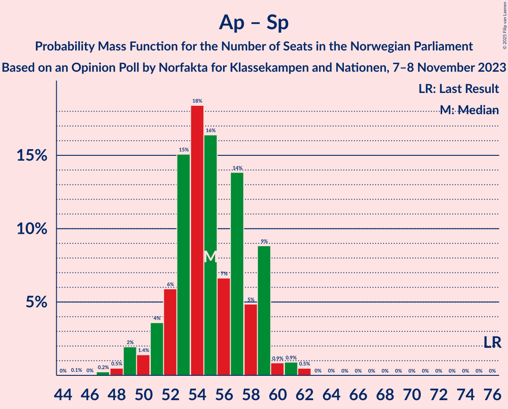

| Number of Seats | Probability | Accumulated | Special Marks |
|:---------------:|:-----------:|:-----------:|:-------------:|
| 45 | 0.1% | 100% |  |
| 46 | 0% | 99.9% |  |
| 47 | 0.2% | 99.9% |  |
| 48 | 0.5% | 99.7% |  |
| 49 | 2% | 99.2% |  |
| 50 | 1.4% | 97% |  |
| 51 | 4% | 96% |  |
| 52 | 6% | 92% |  |
| 53 | 15% | 86% |  |
| 54 | 18% | 71% |  |
| 55 | 16% | 53% | Median |
| 56 | 7% | 36% |  |
| 57 | 14% | 30% |  |
| 58 | 5% | 16% |  |
| 59 | 9% | 11% |  |
| 60 | 0.9% | 2% |  |
| 61 | 0.9% | 1.4% |  |
| 62 | 0.5% | 0.5% |  |
| 63 | 0% | 0% |  |
| 64 | 0% | 0% |  |
| 65 | 0% | 0% |  |
| 66 | 0% | 0% |  |
| 67 | 0% | 0% |  |
| 68 | 0% | 0% |  |
| 69 | 0% | 0% |  |
| 70 | 0% | 0% |  |
| 71 | 0% | 0% |  |
| 72 | 0% | 0% |  |
| 73 | 0% | 0% |  |
| 74 | 0% | 0% |  |
| 75 | 0% | 0% |  |
| 76 | 0% | 0% | Last Result |

### Senterpartiet – Venstre – Kristelig Folkeparti

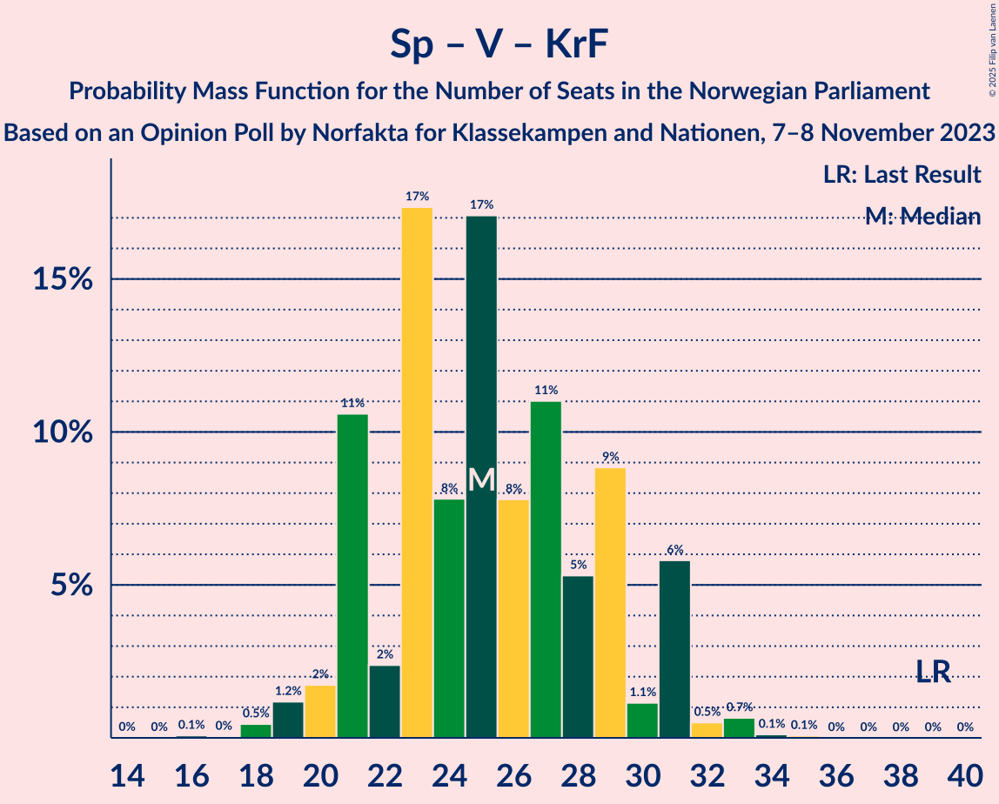

| Number of Seats | Probability | Accumulated | Special Marks |
|:---------------:|:-----------:|:-----------:|:-------------:|
| 16 | 0.1% | 100% |  |
| 17 | 0% | 99.9% |  |
| 18 | 0.5% | 99.9% |  |
| 19 | 1.2% | 99.4% |  |
| 20 | 2% | 98% |  |
| 21 | 11% | 96% |  |
| 22 | 2% | 86% |  |
| 23 | 17% | 84% |  |
| 24 | 8% | 66% | Median |
| 25 | 17% | 58% |  |
| 26 | 8% | 41% |  |
| 27 | 11% | 33% |  |
| 28 | 5% | 22% |  |
| 29 | 9% | 17% |  |
| 30 | 1.1% | 8% |  |
| 31 | 6% | 7% |  |
| 32 | 0.5% | 1.3% |  |
| 33 | 0.7% | 0.8% |  |
| 34 | 0.1% | 0.2% |  |
| 35 | 0.1% | 0.1% |  |
| 36 | 0% | 0% |  |
| 37 | 0% | 0% |  |
| 38 | 0% | 0% |  |
| 39 | 0% | 0% | Last Result |

## Technical Information

### Opinion Poll

+ **Polling firm:** Norfakta
+ **Commissioner(s):** Klassekampen and Nationen
+ **Fieldwork period:** 7–8 November 2023

### Calculations

+ **Sample size:** 1038
+ **Simulations done:** 1,048,576
+ **Error estimate:** 2.56%

