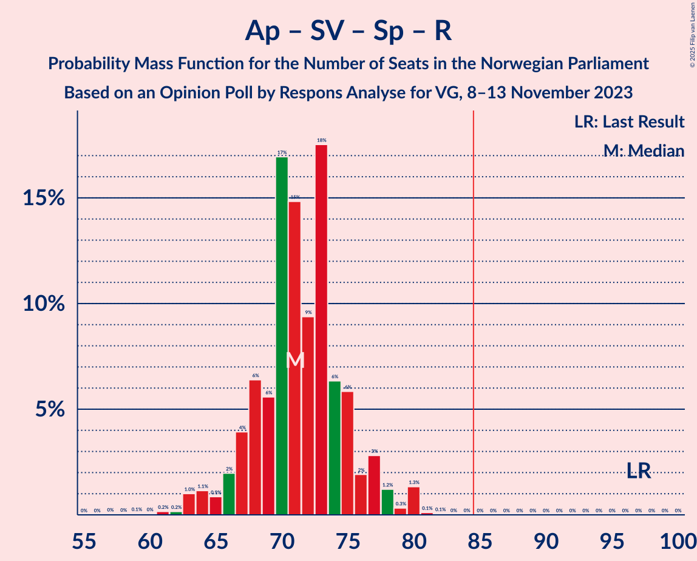
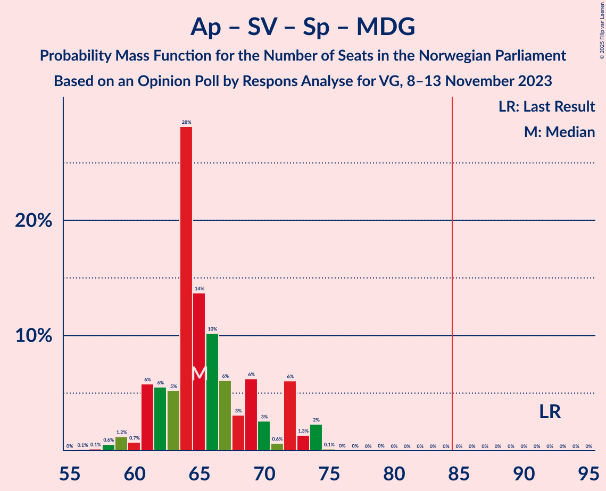

# Opinion Poll by Respons Analyse for VG, 8–13 November 2023

<a href="#voting-intentions">Voting Intentions</a> | <a href="#seats">Seats</a> | <a href="#coalitions">Coalitions</a> | <a href="#technical-information">Technical Information</a>

## Voting Intentions

### Confidence Intervals

| Party | Last Result | Poll Result | 80% Confidence Interval | 90% Confidence Interval | 95% Confidence Interval | 99% Confidence Interval |
|:-----:|:-----------:|:-----------:|:-----------------------:|:-----------------------:|:-----------------------:|:-----------------------:|
| Høyre | 20.4% | 26.9% | 25.1–28.8% |24.7–29.3% |24.2–29.7% |23.4–30.7% |
| Arbeiderpartiet | 26.2% | 18.4% | 16.9–20.1% |16.5–20.5% |16.1–20.9% |15.4–21.7% |
| Fremskrittspartiet | 11.6% | 13.3% | 12.0–14.8% |11.6–15.2% |11.3–15.6% |10.7–16.3% |
| Sosialistisk Venstreparti | 7.6% | 9.3% | 8.2–10.6% |7.9–10.9% |7.7–11.3% |7.2–11.9% |
| Venstre | 4.6% | 6.8% | 5.9–7.9% |5.6–8.3% |5.4–8.5% |5.0–9.1% |
| Senterpartiet | 13.5% | 6.4% | 5.5–7.5% |5.3–7.8% |5.0–8.1% |4.6–8.7% |
| Rødt | 4.7% | 5.4% | 4.6–6.4% |4.3–6.7% |4.2–7.0% |3.8–7.5% |
| Kristelig Folkeparti | 3.8% | 4.7% | 3.9–5.7% |3.7–6.0% |3.6–6.2% |3.2–6.7% |
| Industri- og Næringspartiet | 0.3% | 3.6% | 2.9–4.5% |2.8–4.7% |2.6–5.0% |2.3–5.4% |
| Miljøpartiet De Grønne | 3.9% | 3.5% | 2.9–4.4% |2.7–4.6% |2.5–4.8% |2.2–5.3% |

*Note:* The poll result column reflects the actual value used in the calculations. Published results may vary slightly, and in addition be rounded to fewer digits.

## Seats

### Confidence Intervals

| Party | Last Result | Median | 80% Confidence Interval | 90% Confidence Interval | 95% Confidence Interval | 99% Confidence Interval |
|:-----:|:-----------:|:------:|:-----------------------:|:-----------------------:|:-----------------------:|:-----------------------:|
| <a href="#høyre">Høyre</a> | 36 | 47 | 43–50 |43–51 |42–52 |41–54 |
| <a href="#arbeiderpartiet">Arbeiderpartiet</a> | 48 | 35 | 33–38 |33–39 |32–40 |31–42 |
| <a href="#fremskrittspartiet">Fremskrittspartiet</a> | 21 | 24 | 21–26 |20–28 |20–28 |19–32 |
| <a href="#sosialistisk-venstreparti">Sosialistisk Venstreparti</a> | 13 | 16 | 14–18 |12–19 |12–19 |11–21 |
| <a href="#venstre">Venstre</a> | 8 | 11 | 10–14 |9–14 |9–14 |8–16 |
| <a href="#senterpartiet">Senterpartiet</a> | 28 | 12 | 9–13 |8–14 |8–14 |7–16 |
| <a href="#rødt">Rødt</a> | 8 | 9 | 7–11 |7–11 |7–12 |1–13 |
| <a href="#kristelig-folkeparti">Kristelig Folkeparti</a> | 3 | 8 | 3–9 |3–10 |2–11 |2–11 |
| <a href="#industri--og-næringspartiet">Industri- og Næringspartiet</a> | 0 | 3 | 2–7 |1–7 |0–8 |0–9 |
| <a href="#miljøpartiet-de-grønne">Miljøpartiet De Grønne</a> | 3 | 2 | 1–7 |1–8 |1–8 |1–9 |

### Høyre

*For a full overview of the results for this party, see the [Høyre](party-høyre.html) page.*

| Number of Seats | Probability | Accumulated | Special Marks |
|:---------------:|:-----------:|:-----------:|:-------------:|
| 36 | 0% | 100% | Last Result |
| 37 | 0% | 100% |  |
| 38 | 0% | 100% |  |
| 39 | 0% | 100% |  |
| 40 | 0.3% | 99.9% |  |
| 41 | 0.7% | 99.7% |  |
| 42 | 3% | 99.0% |  |
| 43 | 7% | 96% |  |
| 44 | 5% | 90% |  |
| 45 | 6% | 85% |  |
| 46 | 15% | 79% |  |
| 47 | 18% | 63% | Median |
| 48 | 21% | 46% |  |
| 49 | 12% | 25% |  |
| 50 | 5% | 13% |  |
| 51 | 5% | 8% |  |
| 52 | 2% | 3% |  |
| 53 | 0.7% | 2% |  |
| 54 | 0.4% | 0.9% |  |
| 55 | 0.3% | 0.5% |  |
| 56 | 0.2% | 0.2% |  |
| 57 | 0% | 0% |  |

### Arbeiderpartiet

*For a full overview of the results for this party, see the [Arbeiderpartiet](party-arbeiderpartiet.html) page.*

| Number of Seats | Probability | Accumulated | Special Marks |
|:---------------:|:-----------:|:-----------:|:-------------:|
| 29 | 0.1% | 100% |  |
| 30 | 0.3% | 99.9% |  |
| 31 | 0.7% | 99.6% |  |
| 32 | 2% | 98.9% |  |
| 33 | 21% | 97% |  |
| 34 | 18% | 76% |  |
| 35 | 11% | 57% | Median |
| 36 | 12% | 46% |  |
| 37 | 17% | 34% |  |
| 38 | 9% | 17% |  |
| 39 | 5% | 8% |  |
| 40 | 1.0% | 3% |  |
| 41 | 0.7% | 2% |  |
| 42 | 0.4% | 0.8% |  |
| 43 | 0.3% | 0.5% |  |
| 44 | 0.1% | 0.2% |  |
| 45 | 0% | 0.1% |  |
| 46 | 0% | 0% |  |
| 47 | 0% | 0% |  |
| 48 | 0% | 0% | Last Result |

### Fremskrittspartiet

*For a full overview of the results for this party, see the [Fremskrittspartiet](party-fremskrittspartiet.html) page.*

| Number of Seats | Probability | Accumulated | Special Marks |
|:---------------:|:-----------:|:-----------:|:-------------:|
| 18 | 0.4% | 100% |  |
| 19 | 2% | 99.5% |  |
| 20 | 3% | 98% |  |
| 21 | 13% | 95% | Last Result |
| 22 | 9% | 82% |  |
| 23 | 18% | 73% |  |
| 24 | 30% | 55% | Median |
| 25 | 11% | 24% |  |
| 26 | 6% | 14% |  |
| 27 | 2% | 7% |  |
| 28 | 3% | 5% |  |
| 29 | 1.2% | 2% |  |
| 30 | 0.4% | 1.2% |  |
| 31 | 0.3% | 0.8% |  |
| 32 | 0.4% | 0.5% |  |
| 33 | 0.1% | 0.1% |  |
| 34 | 0% | 0% |  |

### Sosialistisk Venstreparti

*For a full overview of the results for this party, see the [Sosialistisk Venstreparti](party-sosialistiskvenstreparti.html) page.*

| Number of Seats | Probability | Accumulated | Special Marks |
|:---------------:|:-----------:|:-----------:|:-------------:|
| 10 | 0.3% | 100% |  |
| 11 | 2% | 99.7% |  |
| 12 | 3% | 98% |  |
| 13 | 4% | 95% | Last Result |
| 14 | 18% | 91% |  |
| 15 | 22% | 73% |  |
| 16 | 18% | 51% | Median |
| 17 | 18% | 33% |  |
| 18 | 8% | 14% |  |
| 19 | 4% | 6% |  |
| 20 | 1.5% | 2% |  |
| 21 | 0.4% | 0.5% |  |
| 22 | 0.1% | 0.1% |  |
| 23 | 0% | 0% |  |

### Venstre

*For a full overview of the results for this party, see the [Venstre](party-venstre.html) page.*

| Number of Seats | Probability | Accumulated | Special Marks |
|:---------------:|:-----------:|:-----------:|:-------------:|
| 7 | 0.1% | 100% |  |
| 8 | 1.4% | 99.9% | Last Result |
| 9 | 8% | 98% |  |
| 10 | 15% | 91% |  |
| 11 | 30% | 75% | Median |
| 12 | 17% | 45% |  |
| 13 | 11% | 28% |  |
| 14 | 15% | 17% |  |
| 15 | 0.6% | 2% |  |
| 16 | 1.3% | 1.4% |  |
| 17 | 0.1% | 0.1% |  |
| 18 | 0% | 0% |  |

### Senterpartiet

*For a full overview of the results for this party, see the [Senterpartiet](party-senterpartiet.html) page.*

| Number of Seats | Probability | Accumulated | Special Marks |
|:---------------:|:-----------:|:-----------:|:-------------:|
| 6 | 0.1% | 100% |  |
| 7 | 2% | 99.9% |  |
| 8 | 3% | 98% |  |
| 9 | 15% | 95% |  |
| 10 | 16% | 80% |  |
| 11 | 13% | 63% |  |
| 12 | 22% | 51% | Median |
| 13 | 20% | 28% |  |
| 14 | 6% | 8% |  |
| 15 | 1.3% | 2% |  |
| 16 | 0.4% | 0.6% |  |
| 17 | 0.2% | 0.2% |  |
| 18 | 0% | 0% |  |
| 19 | 0% | 0% |  |
| 20 | 0% | 0% |  |
| 21 | 0% | 0% |  |
| 22 | 0% | 0% |  |
| 23 | 0% | 0% |  |
| 24 | 0% | 0% |  |
| 25 | 0% | 0% |  |
| 26 | 0% | 0% |  |
| 27 | 0% | 0% |  |
| 28 | 0% | 0% | Last Result |

### Rødt

*For a full overview of the results for this party, see the [Rødt](party-rødt.html) page.*

| Number of Seats | Probability | Accumulated | Special Marks |
|:---------------:|:-----------:|:-----------:|:-------------:|
| 1 | 1.5% | 100% |  |
| 2 | 0% | 98.5% |  |
| 3 | 0% | 98.5% |  |
| 4 | 0% | 98.5% |  |
| 5 | 0% | 98.5% |  |
| 6 | 0.4% | 98.5% |  |
| 7 | 9% | 98% |  |
| 8 | 22% | 89% | Last Result |
| 9 | 30% | 68% | Median |
| 10 | 17% | 38% |  |
| 11 | 17% | 21% |  |
| 12 | 3% | 5% |  |
| 13 | 1.1% | 1.2% |  |
| 14 | 0.1% | 0.1% |  |
| 15 | 0% | 0% |  |

### Kristelig Folkeparti

*For a full overview of the results for this party, see the [Kristelig Folkeparti](party-kristeligfolkeparti.html) page.*

| Number of Seats | Probability | Accumulated | Special Marks |
|:---------------:|:-----------:|:-----------:|:-------------:|
| 2 | 5% | 100% |  |
| 3 | 7% | 95% | Last Result |
| 4 | 0% | 89% |  |
| 5 | 0% | 89% |  |
| 6 | 1.1% | 89% |  |
| 7 | 29% | 88% |  |
| 8 | 36% | 59% | Median |
| 9 | 13% | 22% |  |
| 10 | 7% | 10% |  |
| 11 | 3% | 3% |  |
| 12 | 0.2% | 0.3% |  |
| 13 | 0% | 0% |  |

### Industri- og Næringspartiet

*For a full overview of the results for this party, see the [Industri- og Næringspartiet](party-industri-ognæringspartiet.html) page.*

| Number of Seats | Probability | Accumulated | Special Marks |
|:---------------:|:-----------:|:-----------:|:-------------:|
| 0 | 4% | 100% | Last Result |
| 1 | 4% | 96% |  |
| 2 | 25% | 92% |  |
| 3 | 40% | 67% | Median |
| 4 | 0% | 26% |  |
| 5 | 0% | 26% |  |
| 6 | 2% | 26% |  |
| 7 | 20% | 24% |  |
| 8 | 4% | 4% |  |
| 9 | 0.5% | 0.6% |  |
| 10 | 0.1% | 0.1% |  |
| 11 | 0% | 0% |  |

### Miljøpartiet De Grønne

*For a full overview of the results for this party, see the [Miljøpartiet De Grønne](party-miljøpartietdegrønne.html) page.*

| Number of Seats | Probability | Accumulated | Special Marks |
|:---------------:|:-----------:|:-----------:|:-------------:|
| 1 | 11% | 100% |  |
| 2 | 54% | 89% | Median |
| 3 | 9% | 35% | Last Result |
| 4 | 0% | 26% |  |
| 5 | 0% | 26% |  |
| 6 | 8% | 26% |  |
| 7 | 9% | 18% |  |
| 8 | 8% | 9% |  |
| 9 | 0.6% | 0.6% |  |
| 10 | 0.1% | 0.1% |  |
| 11 | 0% | 0% |  |

## Coalitions

### Confidence Intervals

| Coalition | Last Result | Median | Majority? | 80% Confidence Interval | 90% Confidence Interval | 95% Confidence Interval | 99% Confidence Interval |
|:---------:|:-----------:|:------:|:---------:|:-----------------------:|:-----------------------:|:-----------------------:|:-----------------------:|
| Høyre – Fremskrittspartiet – Venstre – Senterpartiet – Kristelig Folkeparti | 96 | 101 | 100% | 97–105 | 95–106 | 95–107 | 93–109 |
| Høyre – Fremskrittspartiet – Venstre – Kristelig Folkeparti – Miljøpartiet De Grønne | 71 | 93 | 99.7% | 89–97 | 88–98 | 86–99 | 85–102 |
| Høyre – Fremskrittspartiet – Venstre – Kristelig Folkeparti | 68 | 90 | 93% | 85–93 | 84–95 | 84–96 | 81–98 |
| Høyre – Fremskrittspartiet – Venstre | 65 | 82 | 19% | 78–86 | 77–87 | 77–89 | 74–91 |
| Arbeiderpartiet – Sosialistisk Venstreparti – Senterpartiet – Rødt – Miljøpartiet De Grønne | 100 | 74 | 0.2% | 71–80 | 70–81 | 68–82 | 66–84 |
| Arbeiderpartiet – Sosialistisk Venstreparti – Senterpartiet – Kristelig Folkeparti – Miljøpartiet De Grønne | 95 | 72 | 0.1% | 69–79 | 68–80 | 66–81 | 64–82 |
| Arbeiderpartiet – Sosialistisk Venstreparti – Senterpartiet – Rødt | 97 | 71 | 0% | 68–75 | 66–77 | 64–78 | 63–80 |
| Høyre – Fremskrittspartiet | 57 | 71 | 0% | 67–74 | 66–76 | 65–77 | 63–79 |
| Arbeiderpartiet – Sosialistisk Venstreparti – Senterpartiet – Miljøpartiet De Grønne | 92 | 65 | 0% | 62–71 | 61–72 | 60–74 | 58–74 |
| Høyre – Venstre – Kristelig Folkeparti | 47 | 67 | 0% | 61–70 | 60–72 | 60–72 | 58–75 |
| Arbeiderpartiet – Sosialistisk Venstreparti – Rødt – Miljøpartiet De Grønne | 72 | 63 | 0% | 60–68 | 59–69 | 57–71 | 54–72 |
| Arbeiderpartiet – Sosialistisk Venstreparti – Senterpartiet | 89 | 62 | 0% | 59–66 | 58–67 | 57–68 | 55–70 |
| Arbeiderpartiet – Senterpartiet – Kristelig Folkeparti – Miljøpartiet De Grønne | 82 | 57 | 0% | 53–63 | 52–64 | 50–64 | 48–66 |
| Arbeiderpartiet – Senterpartiet – Kristelig Folkeparti | 79 | 54 | 0% | 50–58 | 49–58 | 49–60 | 46–62 |
| Arbeiderpartiet – Sosialistisk Venstreparti | 61 | 51 | 0% | 48–55 | 47–55 | 47–56 | 44–58 |
| Arbeiderpartiet – Senterpartiet | 76 | 46 | 0% | 44–50 | 43–51 | 42–51 | 41–54 |
| Venstre – Senterpartiet – Kristelig Folkeparti | 39 | 30 | 0% | 26–34 | 25–34 | 25–35 | 23–37 |

### Høyre – Fremskrittspartiet – Venstre – Senterpartiet – Kristelig Folkeparti

| Number of Seats | Probability | Accumulated | Special Marks |
|:---------------:|:-----------:|:-----------:|:-------------:|
| 89 | 0% | 100% |  |
| 90 | 0% | 99.9% |  |
| 91 | 0.2% | 99.9% |  |
| 92 | 0% | 99.7% |  |
| 93 | 0.4% | 99.6% |  |
| 94 | 1.2% | 99.2% |  |
| 95 | 3% | 98% |  |
| 96 | 3% | 95% | Last Result |
| 97 | 7% | 92% |  |
| 98 | 15% | 85% |  |
| 99 | 8% | 71% |  |
| 100 | 11% | 63% |  |
| 101 | 9% | 52% |  |
| 102 | 4% | 42% | Median |
| 103 | 6% | 38% |  |
| 104 | 17% | 32% |  |
| 105 | 8% | 15% |  |
| 106 | 4% | 7% |  |
| 107 | 1.0% | 3% |  |
| 108 | 1.0% | 2% |  |
| 109 | 0.4% | 0.8% |  |
| 110 | 0.1% | 0.4% |  |
| 111 | 0.2% | 0.3% |  |
| 112 | 0% | 0.1% |  |
| 113 | 0% | 0.1% |  |
| 114 | 0% | 0% |  |

### Høyre – Fremskrittspartiet – Venstre – Kristelig Folkeparti – Miljøpartiet De Grønne

| Number of Seats | Probability | Accumulated | Special Marks |
|:---------------:|:-----------:|:-----------:|:-------------:|
| 71 | 0% | 100% | Last Result |
| 72 | 0% | 100% |  |
| 73 | 0% | 100% |  |
| 74 | 0% | 100% |  |
| 75 | 0% | 100% |  |
| 76 | 0% | 100% |  |
| 77 | 0% | 100% |  |
| 78 | 0% | 100% |  |
| 79 | 0% | 100% |  |
| 80 | 0% | 100% |  |
| 81 | 0% | 100% |  |
| 82 | 0.1% | 100% |  |
| 83 | 0% | 99.9% |  |
| 84 | 0.2% | 99.8% |  |
| 85 | 0.4% | 99.7% | Majority |
| 86 | 2% | 99.3% |  |
| 87 | 2% | 97% |  |
| 88 | 3% | 95% |  |
| 89 | 4% | 92% |  |
| 90 | 5% | 88% |  |
| 91 | 11% | 83% |  |
| 92 | 17% | 72% | Median |
| 93 | 12% | 55% |  |
| 94 | 14% | 43% |  |
| 95 | 11% | 28% |  |
| 96 | 6% | 17% |  |
| 97 | 4% | 11% |  |
| 98 | 4% | 7% |  |
| 99 | 0.9% | 3% |  |
| 100 | 0.8% | 2% |  |
| 101 | 0.9% | 2% |  |
| 102 | 0.4% | 0.8% |  |
| 103 | 0.1% | 0.4% |  |
| 104 | 0.3% | 0.3% |  |
| 105 | 0% | 0.1% |  |
| 106 | 0% | 0% |  |

### Høyre – Fremskrittspartiet – Venstre – Kristelig Folkeparti

| Number of Seats | Probability | Accumulated | Special Marks |
|:---------------:|:-----------:|:-----------:|:-------------:|
| 68 | 0% | 100% | Last Result |
| 69 | 0% | 100% |  |
| 70 | 0% | 100% |  |
| 71 | 0% | 100% |  |
| 72 | 0% | 100% |  |
| 73 | 0% | 100% |  |
| 74 | 0% | 100% |  |
| 75 | 0% | 100% |  |
| 76 | 0% | 100% |  |
| 77 | 0% | 100% |  |
| 78 | 0% | 100% |  |
| 79 | 0.1% | 100% |  |
| 80 | 0.4% | 99.9% |  |
| 81 | 0.2% | 99.5% |  |
| 82 | 0.5% | 99.3% |  |
| 83 | 1.1% | 98.8% |  |
| 84 | 4% | 98% |  |
| 85 | 9% | 93% | Majority |
| 86 | 4% | 84% |  |
| 87 | 3% | 80% |  |
| 88 | 5% | 77% |  |
| 89 | 17% | 72% |  |
| 90 | 14% | 55% | Median |
| 91 | 10% | 42% |  |
| 92 | 15% | 32% |  |
| 93 | 7% | 17% |  |
| 94 | 5% | 10% |  |
| 95 | 3% | 5% |  |
| 96 | 0.9% | 3% |  |
| 97 | 0.6% | 2% |  |
| 98 | 0.8% | 1.2% |  |
| 99 | 0.2% | 0.4% |  |
| 100 | 0.1% | 0.3% |  |
| 101 | 0.1% | 0.1% |  |
| 102 | 0.1% | 0.1% |  |
| 103 | 0% | 0% |  |

### Høyre – Fremskrittspartiet – Venstre

| Number of Seats | Probability | Accumulated | Special Marks |
|:---------------:|:-----------:|:-----------:|:-------------:|
| 65 | 0% | 100% | Last Result |
| 66 | 0% | 100% |  |
| 67 | 0% | 100% |  |
| 68 | 0% | 100% |  |
| 69 | 0% | 100% |  |
| 70 | 0% | 100% |  |
| 71 | 0% | 100% |  |
| 72 | 0.1% | 100% |  |
| 73 | 0.2% | 99.9% |  |
| 74 | 0.4% | 99.7% |  |
| 75 | 0.4% | 99.3% |  |
| 76 | 1.3% | 98.9% |  |
| 77 | 5% | 98% |  |
| 78 | 7% | 93% |  |
| 79 | 5% | 86% |  |
| 80 | 5% | 81% |  |
| 81 | 7% | 76% |  |
| 82 | 24% | 68% | Median |
| 83 | 10% | 44% |  |
| 84 | 15% | 34% |  |
| 85 | 8% | 19% | Majority |
| 86 | 4% | 11% |  |
| 87 | 3% | 7% |  |
| 88 | 1.2% | 4% |  |
| 89 | 2% | 3% |  |
| 90 | 0.6% | 1.3% |  |
| 91 | 0.3% | 0.7% |  |
| 92 | 0.3% | 0.5% |  |
| 93 | 0.1% | 0.2% |  |
| 94 | 0% | 0.1% |  |
| 95 | 0% | 0.1% |  |
| 96 | 0% | 0% |  |

### Arbeiderpartiet – Sosialistisk Venstreparti – Senterpartiet – Rødt – Miljøpartiet De Grønne

| Number of Seats | Probability | Accumulated | Special Marks |
|:---------------:|:-----------:|:-----------:|:-------------:|
| 61 | 0% | 100% |  |
| 62 | 0% | 99.9% |  |
| 63 | 0% | 99.9% |  |
| 64 | 0.1% | 99.9% |  |
| 65 | 0.2% | 99.8% |  |
| 66 | 0.9% | 99.6% |  |
| 67 | 0.7% | 98.7% |  |
| 68 | 1.3% | 98% |  |
| 69 | 2% | 97% |  |
| 70 | 3% | 95% |  |
| 71 | 5% | 92% |  |
| 72 | 13% | 87% |  |
| 73 | 15% | 74% |  |
| 74 | 10% | 58% | Median |
| 75 | 14% | 48% |  |
| 76 | 10% | 34% |  |
| 77 | 6% | 24% |  |
| 78 | 3% | 18% |  |
| 79 | 2% | 15% |  |
| 80 | 3% | 13% |  |
| 81 | 5% | 10% |  |
| 82 | 4% | 5% |  |
| 83 | 0.3% | 0.8% |  |
| 84 | 0.3% | 0.5% |  |
| 85 | 0.2% | 0.2% | Majority |
| 86 | 0% | 0.1% |  |
| 87 | 0% | 0% |  |
| 88 | 0% | 0% |  |
| 89 | 0% | 0% |  |
| 90 | 0% | 0% |  |
| 91 | 0% | 0% |  |
| 92 | 0% | 0% |  |
| 93 | 0% | 0% |  |
| 94 | 0% | 0% |  |
| 95 | 0% | 0% |  |
| 96 | 0% | 0% |  |
| 97 | 0% | 0% |  |
| 98 | 0% | 0% |  |
| 99 | 0% | 0% |  |
| 100 | 0% | 0% | Last Result |

### Arbeiderpartiet – Sosialistisk Venstreparti – Senterpartiet – Kristelig Folkeparti – Miljøpartiet De Grønne

| Number of Seats | Probability | Accumulated | Special Marks |
|:---------------:|:-----------:|:-----------:|:-------------:|
| 62 | 0.1% | 100% |  |
| 63 | 0.3% | 99.9% |  |
| 64 | 0.1% | 99.6% |  |
| 65 | 0.3% | 99.5% |  |
| 66 | 2% | 99.2% |  |
| 67 | 0.8% | 97% |  |
| 68 | 2% | 96% |  |
| 69 | 7% | 94% |  |
| 70 | 5% | 87% |  |
| 71 | 12% | 83% |  |
| 72 | 28% | 70% |  |
| 73 | 7% | 42% | Median |
| 74 | 9% | 34% |  |
| 75 | 4% | 26% |  |
| 76 | 6% | 22% |  |
| 77 | 2% | 16% |  |
| 78 | 4% | 14% |  |
| 79 | 5% | 10% |  |
| 80 | 2% | 5% |  |
| 81 | 3% | 3% |  |
| 82 | 0.4% | 0.6% |  |
| 83 | 0.1% | 0.2% |  |
| 84 | 0.1% | 0.1% |  |
| 85 | 0% | 0.1% | Majority |
| 86 | 0% | 0% |  |
| 87 | 0% | 0% |  |
| 88 | 0% | 0% |  |
| 89 | 0% | 0% |  |
| 90 | 0% | 0% |  |
| 91 | 0% | 0% |  |
| 92 | 0% | 0% |  |
| 93 | 0% | 0% |  |
| 94 | 0% | 0% |  |
| 95 | 0% | 0% | Last Result |

### Arbeiderpartiet – Sosialistisk Venstreparti – Senterpartiet – Rødt

| Number of Seats | Probability | Accumulated | Special Marks |
|:---------------:|:-----------:|:-----------:|:-------------:|
| 58 | 0% | 100% |  |
| 59 | 0.1% | 99.9% |  |
| 60 | 0% | 99.9% |  |
| 61 | 0.2% | 99.8% |  |
| 62 | 0.2% | 99.7% |  |
| 63 | 1.0% | 99.5% |  |
| 64 | 1.1% | 98.5% |  |
| 65 | 0.9% | 97% |  |
| 66 | 2% | 97% |  |
| 67 | 4% | 95% |  |
| 68 | 6% | 91% |  |
| 69 | 6% | 84% |  |
| 70 | 17% | 79% |  |
| 71 | 15% | 62% |  |
| 72 | 9% | 47% | Median |
| 73 | 18% | 37% |  |
| 74 | 6% | 20% |  |
| 75 | 6% | 14% |  |
| 76 | 2% | 8% |  |
| 77 | 3% | 6% |  |
| 78 | 1.2% | 3% |  |
| 79 | 0.3% | 2% |  |
| 80 | 1.3% | 2% |  |
| 81 | 0.1% | 0.2% |  |
| 82 | 0.1% | 0.1% |  |
| 83 | 0% | 0% |  |
| 84 | 0% | 0% |  |
| 85 | 0% | 0% | Majority |
| 86 | 0% | 0% |  |
| 87 | 0% | 0% |  |
| 88 | 0% | 0% |  |
| 89 | 0% | 0% |  |
| 90 | 0% | 0% |  |
| 91 | 0% | 0% |  |
| 92 | 0% | 0% |  |
| 93 | 0% | 0% |  |
| 94 | 0% | 0% |  |
| 95 | 0% | 0% |  |
| 96 | 0% | 0% |  |
| 97 | 0% | 0% | Last Result |

### Høyre – Fremskrittspartiet

| Number of Seats | Probability | Accumulated | Special Marks |
|:---------------:|:-----------:|:-----------:|:-------------:|
| 57 | 0% | 100% | Last Result |
| 58 | 0% | 100% |  |
| 59 | 0% | 100% |  |
| 60 | 0% | 100% |  |
| 61 | 0.1% | 100% |  |
| 62 | 0.2% | 99.9% |  |
| 63 | 0.2% | 99.7% |  |
| 64 | 0.7% | 99.5% |  |
| 65 | 2% | 98.8% |  |
| 66 | 4% | 97% |  |
| 67 | 4% | 93% |  |
| 68 | 10% | 89% |  |
| 69 | 6% | 79% |  |
| 70 | 21% | 74% |  |
| 71 | 19% | 52% | Median |
| 72 | 14% | 33% |  |
| 73 | 8% | 19% |  |
| 74 | 3% | 11% |  |
| 75 | 1.4% | 8% |  |
| 76 | 2% | 6% |  |
| 77 | 2% | 4% |  |
| 78 | 0.8% | 2% |  |
| 79 | 0.6% | 1.0% |  |
| 80 | 0.2% | 0.4% |  |
| 81 | 0.1% | 0.3% |  |
| 82 | 0.1% | 0.2% |  |
| 83 | 0% | 0.1% |  |
| 84 | 0% | 0% |  |

### Arbeiderpartiet – Sosialistisk Venstreparti – Senterpartiet – Miljøpartiet De Grønne

| Number of Seats | Probability | Accumulated | Special Marks |
|:---------------:|:-----------:|:-----------:|:-------------:|
| 56 | 0.1% | 100% |  |
| 57 | 0.1% | 99.8% |  |
| 58 | 0.6% | 99.7% |  |
| 59 | 1.2% | 99.2% |  |
| 60 | 0.7% | 98% |  |
| 61 | 6% | 97% |  |
| 62 | 6% | 91% |  |
| 63 | 5% | 86% |  |
| 64 | 28% | 81% |  |
| 65 | 14% | 53% | Median |
| 66 | 10% | 39% |  |
| 67 | 6% | 29% |  |
| 68 | 3% | 23% |  |
| 69 | 6% | 19% |  |
| 70 | 3% | 13% |  |
| 71 | 0.6% | 11% |  |
| 72 | 6% | 10% |  |
| 73 | 1.3% | 4% |  |
| 74 | 2% | 3% |  |
| 75 | 0.1% | 0.3% |  |
| 76 | 0% | 0.1% |  |
| 77 | 0% | 0.1% |  |
| 78 | 0% | 0% |  |
| 79 | 0% | 0% |  |
| 80 | 0% | 0% |  |
| 81 | 0% | 0% |  |
| 82 | 0% | 0% |  |
| 83 | 0% | 0% |  |
| 84 | 0% | 0% |  |
| 85 | 0% | 0% | Majority |
| 86 | 0% | 0% |  |
| 87 | 0% | 0% |  |
| 88 | 0% | 0% |  |
| 89 | 0% | 0% |  |
| 90 | 0% | 0% |  |
| 91 | 0% | 0% |  |
| 92 | 0% | 0% | Last Result |

### Høyre – Venstre – Kristelig Folkeparti

| Number of Seats | Probability | Accumulated | Special Marks |
|:---------------:|:-----------:|:-----------:|:-------------:|
| 47 | 0% | 100% | Last Result |
| 48 | 0% | 100% |  |
| 49 | 0% | 100% |  |
| 50 | 0% | 100% |  |
| 51 | 0% | 100% |  |
| 52 | 0% | 100% |  |
| 53 | 0% | 100% |  |
| 54 | 0% | 100% |  |
| 55 | 0% | 100% |  |
| 56 | 0% | 100% |  |
| 57 | 0.1% | 99.9% |  |
| 58 | 0.6% | 99.8% |  |
| 59 | 0.7% | 99.2% |  |
| 60 | 7% | 98.6% |  |
| 61 | 3% | 92% |  |
| 62 | 4% | 89% |  |
| 63 | 6% | 85% |  |
| 64 | 3% | 79% |  |
| 65 | 12% | 76% |  |
| 66 | 13% | 64% | Median |
| 67 | 17% | 51% |  |
| 68 | 18% | 34% |  |
| 69 | 5% | 16% |  |
| 70 | 4% | 11% |  |
| 71 | 1.1% | 6% |  |
| 72 | 3% | 5% |  |
| 73 | 0.9% | 2% |  |
| 74 | 0.3% | 1.4% |  |
| 75 | 0.7% | 1.1% |  |
| 76 | 0.2% | 0.4% |  |
| 77 | 0.2% | 0.2% |  |
| 78 | 0% | 0% |  |

### Arbeiderpartiet – Sosialistisk Venstreparti – Rødt – Miljøpartiet De Grønne

| Number of Seats | Probability | Accumulated | Special Marks |
|:---------------:|:-----------:|:-----------:|:-------------:|
| 52 | 0.1% | 100% |  |
| 53 | 0% | 99.9% |  |
| 54 | 0.9% | 99.9% |  |
| 55 | 0.3% | 99.0% |  |
| 56 | 0.8% | 98.7% |  |
| 57 | 1.1% | 98% |  |
| 58 | 1.4% | 97% |  |
| 59 | 2% | 95% |  |
| 60 | 8% | 93% |  |
| 61 | 20% | 85% |  |
| 62 | 7% | 65% | Median |
| 63 | 12% | 58% |  |
| 64 | 9% | 46% |  |
| 65 | 13% | 37% |  |
| 66 | 6% | 24% |  |
| 67 | 4% | 18% |  |
| 68 | 8% | 14% |  |
| 69 | 2% | 6% |  |
| 70 | 1.1% | 4% |  |
| 71 | 2% | 3% |  |
| 72 | 0.2% | 0.6% | Last Result |
| 73 | 0.2% | 0.3% |  |
| 74 | 0% | 0.1% |  |
| 75 | 0% | 0% |  |

### Arbeiderpartiet – Sosialistisk Venstreparti – Senterpartiet

| Number of Seats | Probability | Accumulated | Special Marks |
|:---------------:|:-----------:|:-----------:|:-------------:|
| 52 | 0% | 100% |  |
| 53 | 0.1% | 99.9% |  |
| 54 | 0.2% | 99.9% |  |
| 55 | 0.2% | 99.6% |  |
| 56 | 1.3% | 99.4% |  |
| 57 | 1.4% | 98% |  |
| 58 | 3% | 97% |  |
| 59 | 11% | 94% |  |
| 60 | 9% | 84% |  |
| 61 | 5% | 74% |  |
| 62 | 30% | 70% |  |
| 63 | 11% | 40% | Median |
| 64 | 12% | 29% |  |
| 65 | 4% | 17% |  |
| 66 | 8% | 13% |  |
| 67 | 2% | 5% |  |
| 68 | 1.2% | 3% |  |
| 69 | 0.4% | 2% |  |
| 70 | 1.1% | 1.4% |  |
| 71 | 0.1% | 0.3% |  |
| 72 | 0.1% | 0.2% |  |
| 73 | 0.1% | 0.1% |  |
| 74 | 0% | 0% |  |
| 75 | 0% | 0% |  |
| 76 | 0% | 0% |  |
| 77 | 0% | 0% |  |
| 78 | 0% | 0% |  |
| 79 | 0% | 0% |  |
| 80 | 0% | 0% |  |
| 81 | 0% | 0% |  |
| 82 | 0% | 0% |  |
| 83 | 0% | 0% |  |
| 84 | 0% | 0% |  |
| 85 | 0% | 0% | Majority |
| 86 | 0% | 0% |  |
| 87 | 0% | 0% |  |
| 88 | 0% | 0% |  |
| 89 | 0% | 0% | Last Result |

### Arbeiderpartiet – Senterpartiet – Kristelig Folkeparti – Miljøpartiet De Grønne

| Number of Seats | Probability | Accumulated | Special Marks |
|:---------------:|:-----------:|:-----------:|:-------------:|
| 46 | 0.1% | 100% |  |
| 47 | 0.4% | 99.9% |  |
| 48 | 0.2% | 99.5% |  |
| 49 | 0.4% | 99.3% |  |
| 50 | 2% | 98.9% |  |
| 51 | 1.4% | 97% |  |
| 52 | 3% | 96% |  |
| 53 | 3% | 93% |  |
| 54 | 3% | 89% |  |
| 55 | 23% | 87% |  |
| 56 | 9% | 63% |  |
| 57 | 12% | 54% | Median |
| 58 | 13% | 42% |  |
| 59 | 4% | 29% |  |
| 60 | 3% | 25% |  |
| 61 | 5% | 22% |  |
| 62 | 3% | 17% |  |
| 63 | 5% | 14% |  |
| 64 | 6% | 8% |  |
| 65 | 1.2% | 2% |  |
| 66 | 0.3% | 0.8% |  |
| 67 | 0.3% | 0.5% |  |
| 68 | 0.1% | 0.2% |  |
| 69 | 0% | 0.1% |  |
| 70 | 0% | 0% |  |
| 71 | 0% | 0% |  |
| 72 | 0% | 0% |  |
| 73 | 0% | 0% |  |
| 74 | 0% | 0% |  |
| 75 | 0% | 0% |  |
| 76 | 0% | 0% |  |
| 77 | 0% | 0% |  |
| 78 | 0% | 0% |  |
| 79 | 0% | 0% |  |
| 80 | 0% | 0% |  |
| 81 | 0% | 0% |  |
| 82 | 0% | 0% | Last Result |

### Arbeiderpartiet – Senterpartiet – Kristelig Folkeparti

| Number of Seats | Probability | Accumulated | Special Marks |
|:---------------:|:-----------:|:-----------:|:-------------:|
| 44 | 0.1% | 100% |  |
| 45 | 0.3% | 99.9% |  |
| 46 | 0.5% | 99.6% |  |
| 47 | 0.5% | 99.1% |  |
| 48 | 1.1% | 98.6% |  |
| 49 | 4% | 98% |  |
| 50 | 4% | 93% |  |
| 51 | 7% | 89% |  |
| 52 | 4% | 83% |  |
| 53 | 25% | 79% |  |
| 54 | 9% | 54% |  |
| 55 | 12% | 45% | Median |
| 56 | 17% | 33% |  |
| 57 | 5% | 16% |  |
| 58 | 5% | 10% |  |
| 59 | 2% | 5% |  |
| 60 | 2% | 3% |  |
| 61 | 1.0% | 2% |  |
| 62 | 0.3% | 0.6% |  |
| 63 | 0.1% | 0.3% |  |
| 64 | 0.2% | 0.2% |  |
| 65 | 0% | 0% |  |
| 66 | 0% | 0% |  |
| 67 | 0% | 0% |  |
| 68 | 0% | 0% |  |
| 69 | 0% | 0% |  |
| 70 | 0% | 0% |  |
| 71 | 0% | 0% |  |
| 72 | 0% | 0% |  |
| 73 | 0% | 0% |  |
| 74 | 0% | 0% |  |
| 75 | 0% | 0% |  |
| 76 | 0% | 0% |  |
| 77 | 0% | 0% |  |
| 78 | 0% | 0% |  |
| 79 | 0% | 0% | Last Result |

### Arbeiderpartiet – Sosialistisk Venstreparti

| Number of Seats | Probability | Accumulated | Special Marks |
|:---------------:|:-----------:|:-----------:|:-------------:|
| 43 | 0.1% | 100% |  |
| 44 | 0.4% | 99.9% |  |
| 45 | 0.8% | 99.5% |  |
| 46 | 0.8% | 98.7% |  |
| 47 | 5% | 98% |  |
| 48 | 8% | 93% |  |
| 49 | 9% | 84% |  |
| 50 | 22% | 75% |  |
| 51 | 13% | 53% | Median |
| 52 | 13% | 40% |  |
| 53 | 13% | 27% |  |
| 54 | 4% | 14% |  |
| 55 | 6% | 10% |  |
| 56 | 2% | 4% |  |
| 57 | 0.4% | 2% |  |
| 58 | 0.9% | 1.3% |  |
| 59 | 0.2% | 0.5% |  |
| 60 | 0.2% | 0.3% |  |
| 61 | 0.1% | 0.1% | Last Result |
| 62 | 0% | 0% |  |

### Arbeiderpartiet – Senterpartiet

| Number of Seats | Probability | Accumulated | Special Marks |
|:---------------:|:-----------:|:-----------:|:-------------:|
| 39 | 0.1% | 100% |  |
| 40 | 0.3% | 99.9% |  |
| 41 | 0.6% | 99.6% |  |
| 42 | 2% | 99.0% |  |
| 43 | 3% | 97% |  |
| 44 | 11% | 94% |  |
| 45 | 17% | 83% |  |
| 46 | 18% | 66% |  |
| 47 | 10% | 48% | Median |
| 48 | 19% | 38% |  |
| 49 | 9% | 20% |  |
| 50 | 5% | 10% |  |
| 51 | 3% | 6% |  |
| 52 | 0.8% | 2% |  |
| 53 | 0.8% | 1.3% |  |
| 54 | 0.3% | 0.6% |  |
| 55 | 0.1% | 0.2% |  |
| 56 | 0.1% | 0.1% |  |
| 57 | 0% | 0% |  |
| 58 | 0% | 0% |  |
| 59 | 0% | 0% |  |
| 60 | 0% | 0% |  |
| 61 | 0% | 0% |  |
| 62 | 0% | 0% |  |
| 63 | 0% | 0% |  |
| 64 | 0% | 0% |  |
| 65 | 0% | 0% |  |
| 66 | 0% | 0% |  |
| 67 | 0% | 0% |  |
| 68 | 0% | 0% |  |
| 69 | 0% | 0% |  |
| 70 | 0% | 0% |  |
| 71 | 0% | 0% |  |
| 72 | 0% | 0% |  |
| 73 | 0% | 0% |  |
| 74 | 0% | 0% |  |
| 75 | 0% | 0% |  |
| 76 | 0% | 0% | Last Result |

### Venstre – Senterpartiet – Kristelig Folkeparti

| Number of Seats | Probability | Accumulated | Special Marks |
|:---------------:|:-----------:|:-----------:|:-------------:|
| 21 | 0.1% | 100% |  |
| 22 | 0.3% | 99.9% |  |
| 23 | 0.5% | 99.6% |  |
| 24 | 1.4% | 99.0% |  |
| 25 | 3% | 98% |  |
| 26 | 5% | 95% |  |
| 27 | 14% | 89% |  |
| 28 | 5% | 76% |  |
| 29 | 14% | 70% |  |
| 30 | 10% | 56% |  |
| 31 | 7% | 46% | Median |
| 32 | 7% | 39% |  |
| 33 | 9% | 32% |  |
| 34 | 18% | 23% |  |
| 35 | 3% | 5% |  |
| 36 | 0.8% | 1.4% |  |
| 37 | 0.3% | 0.6% |  |
| 38 | 0.2% | 0.2% |  |
| 39 | 0% | 0.1% | Last Result |
| 40 | 0% | 0% |  |

## Technical Information

### Opinion Poll

+ **Polling firm:** Respons Analyse
+ **Commissioner(s):** VG
+ **Fieldwork period:** 8–13 November 2023

### Calculations

+ **Sample size:** 1000
+ **Simulations done:** 1,048,576
+ **Error estimate:** 2.36%

