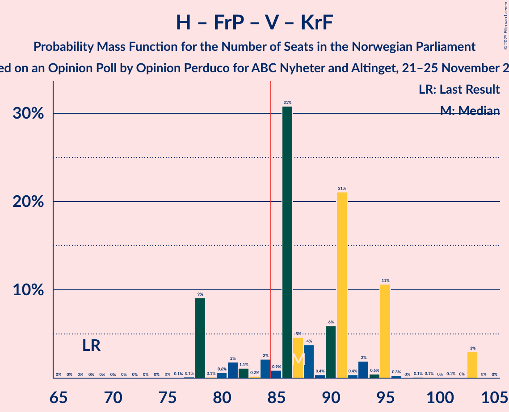

# Opinion Poll by Opinion Perduco for ABC Nyheter and Altinget, 21–25 November 2023

<a href="#voting-intentions">Voting Intentions</a> | <a href="#seats">Seats</a> | <a href="#coalitions">Coalitions</a> | <a href="#technical-information">Technical Information</a>

## Voting Intentions

### Confidence Intervals

| Party | Last Result | Poll Result | 80% Confidence Interval | 90% Confidence Interval | 95% Confidence Interval | 99% Confidence Interval |
|:-----:|:-----------:|:-----------:|:-----------------------:|:-----------------------:|:-----------------------:|:-----------------------:|
| Høyre | 20.4% | 25.5% | 23.6–27.7% |23.0–28.3% |22.5–28.8% |21.6–29.9% |
| Arbeiderpartiet | 26.2% | 17.6% | 15.9–19.5% |15.4–20.0% |15.0–20.5% |14.2–21.4% |
| Fremskrittspartiet | 11.6% | 13.1% | 11.6–14.8% |11.2–15.3% |10.9–15.7% |10.2–16.6% |
| Sosialistisk Venstreparti | 7.6% | 10.1% | 8.8–11.7% |8.5–12.1% |8.2–12.5% |7.6–13.3% |
| Venstre | 4.6% | 7.2% | 6.1–8.5% |5.8–8.9% |5.5–9.3% |5.0–10.0% |
| Rødt | 4.7% | 6.8% | 5.7–8.1% |5.4–8.5% |5.2–8.8% |4.7–9.5% |
| Senterpartiet | 13.5% | 5.0% | 4.1–6.2% |3.9–6.5% |3.6–6.8% |3.3–7.4% |
| Kristelig Folkeparti | 3.8% | 4.3% | 3.5–5.4% |3.3–5.8% |3.1–6.1% |2.7–6.6% |
| Miljøpartiet De Grønne | 3.9% | 4.1% | 3.3–5.2% |3.0–5.5% |2.9–5.7% |2.5–6.3% |
| Industri- og Næringspartiet | 0.3% | 3.9% | 3.1–5.0% |2.9–5.3% |2.7–5.6% |2.4–6.1% |
| Konservativt | 0.4% | 0.9% | 0.6–1.6% |0.5–1.8% |0.5–2.0% |0.3–2.3% |
| Norgesdemokratene | 1.1% | 0.8% | 0.5–1.4% |0.4–1.6% |0.4–1.8% |0.3–2.1% |
| Pensjonistpartiet | 0.6% | 0.3% | 0.1–0.7% |0.1–0.9% |0.1–1.0% |0.0–1.2% |
| Liberalistene | 0.2% | 0.1% | 0.1–0.5% |0.0–0.6% |0.0–0.8% |0.0–1.0% |

*Note:* The poll result column reflects the actual value used in the calculations. Published results may vary slightly, and in addition be rounded to fewer digits.

## Seats

### Confidence Intervals

| Party | Last Result | Median | 80% Confidence Interval | 90% Confidence Interval | 95% Confidence Interval | 99% Confidence Interval |
|:-----:|:-----------:|:------:|:-----------------------:|:-----------------------:|:-----------------------:|:-----------------------:|
| <a href="#høyre">Høyre</a> | 36 | 47 | 41–50 |41–53 |41–53 |38–54 |
| <a href="#arbeiderpartiet">Arbeiderpartiet</a> | 48 | 34 | 29–38 |28–39 |28–42 |28–48 |
| <a href="#fremskrittspartiet">Fremskrittspartiet</a> | 21 | 24 | 20–31 |20–34 |19–34 |18–34 |
| <a href="#sosialistisk-venstreparti">Sosialistisk Venstreparti</a> | 13 | 16 | 14–20 |12–21 |12–22 |12–24 |
| <a href="#venstre">Venstre</a> | 8 | 12 | 10–14 |10–15 |10–15 |8–18 |
| <a href="#rødt">Rødt</a> | 8 | 9 | 7–13 |7–14 |7–14 |7–16 |
| <a href="#senterpartiet">Senterpartiet</a> | 28 | 8 | 7–10 |1–13 |1–13 |0–14 |
| <a href="#kristelig-folkeparti">Kristelig Folkeparti</a> | 3 | 3 | 2–8 |2–9 |1–10 |1–11 |
| <a href="#miljøpartiet-de-grønne">Miljøpartiet De Grønne</a> | 3 | 7 | 2–8 |2–9 |2–9 |1–11 |
| <a href="#industri--og-næringspartiet">Industri- og Næringspartiet</a> | 0 | 6 | 2–8 |1–9 |1–9 |0–9 |
| <a href="#konservativt">Konservativt</a> | 0 | 0 | 0 |0 |0 |0 |
| <a href="#norgesdemokratene">Norgesdemokratene</a> | 0 | 0 | 0 |0 |0 |0 |
| <a href="#pensjonistpartiet">Pensjonistpartiet</a> | 0 | 0 | 0 |0 |0 |0 |
| <a href="#liberalistene">Liberalistene</a> | 0 | 0 | 0 |0 |0 |0 |

### Høyre

*For a full overview of the results for this party, see the [Høyre](party-høyre.html) page.*

| Number of Seats | Probability | Accumulated | Special Marks |
|:---------------:|:-----------:|:-----------:|:-------------:|
| 36 | 0% | 100% | Last Result |
| 37 | 0% | 100% |  |
| 38 | 0.7% | 99.9% |  |
| 39 | 0.5% | 99.2% |  |
| 40 | 0.9% | 98.8% |  |
| 41 | 9% | 98% |  |
| 42 | 6% | 89% |  |
| 43 | 0.5% | 83% |  |
| 44 | 23% | 83% |  |
| 45 | 2% | 60% |  |
| 46 | 6% | 58% |  |
| 47 | 3% | 52% | Median |
| 48 | 31% | 49% |  |
| 49 | 5% | 19% |  |
| 50 | 4% | 13% |  |
| 51 | 3% | 10% |  |
| 52 | 0.3% | 7% |  |
| 53 | 6% | 6% |  |
| 54 | 0.1% | 0.5% |  |
| 55 | 0.4% | 0.5% |  |
| 56 | 0.1% | 0.1% |  |
| 57 | 0% | 0% |  |

### Arbeiderpartiet

*For a full overview of the results for this party, see the [Arbeiderpartiet](party-arbeiderpartiet.html) page.*

| Number of Seats | Probability | Accumulated | Special Marks |
|:---------------:|:-----------:|:-----------:|:-------------:|
| 25 | 0.1% | 100% |  |
| 26 | 0.2% | 99.9% |  |
| 27 | 0% | 99.7% |  |
| 28 | 6% | 99.7% |  |
| 29 | 15% | 94% |  |
| 30 | 4% | 79% |  |
| 31 | 12% | 75% |  |
| 32 | 8% | 63% |  |
| 33 | 1.3% | 55% |  |
| 34 | 7% | 54% | Median |
| 35 | 5% | 47% |  |
| 36 | 6% | 42% |  |
| 37 | 3% | 36% |  |
| 38 | 25% | 33% |  |
| 39 | 4% | 8% |  |
| 40 | 0.9% | 5% |  |
| 41 | 0.9% | 4% |  |
| 42 | 0.3% | 3% |  |
| 43 | 0.6% | 2% |  |
| 44 | 0% | 2% |  |
| 45 | 0.1% | 2% |  |
| 46 | 0.1% | 2% |  |
| 47 | 0% | 2% |  |
| 48 | 2% | 2% | Last Result |
| 49 | 0% | 0% |  |

### Fremskrittspartiet

*For a full overview of the results for this party, see the [Fremskrittspartiet](party-fremskrittspartiet.html) page.*

| Number of Seats | Probability | Accumulated | Special Marks |
|:---------------:|:-----------:|:-----------:|:-------------:|
| 16 | 0.1% | 100% |  |
| 17 | 0.2% | 99.9% |  |
| 18 | 0.6% | 99.7% |  |
| 19 | 4% | 99.1% |  |
| 20 | 10% | 95% |  |
| 21 | 5% | 85% | Last Result |
| 22 | 5% | 81% |  |
| 23 | 5% | 75% |  |
| 24 | 33% | 71% | Median |
| 25 | 2% | 38% |  |
| 26 | 1.0% | 36% |  |
| 27 | 2% | 35% |  |
| 28 | 5% | 34% |  |
| 29 | 2% | 28% |  |
| 30 | 15% | 26% |  |
| 31 | 6% | 11% |  |
| 32 | 0% | 6% |  |
| 33 | 0% | 6% |  |
| 34 | 5% | 6% |  |
| 35 | 0% | 0.2% |  |
| 36 | 0.2% | 0.2% |  |
| 37 | 0% | 0% |  |

### Sosialistisk Venstreparti

*For a full overview of the results for this party, see the [Sosialistisk Venstreparti](party-sosialistiskvenstreparti.html) page.*

| Number of Seats | Probability | Accumulated | Special Marks |
|:---------------:|:-----------:|:-----------:|:-------------:|
| 10 | 0.1% | 100% |  |
| 11 | 0.1% | 99.9% |  |
| 12 | 7% | 99.8% |  |
| 13 | 1.2% | 93% | Last Result |
| 14 | 8% | 92% |  |
| 15 | 3% | 84% |  |
| 16 | 36% | 81% | Median |
| 17 | 2% | 45% |  |
| 18 | 24% | 42% |  |
| 19 | 4% | 18% |  |
| 20 | 9% | 14% |  |
| 21 | 3% | 5% |  |
| 22 | 0.9% | 3% |  |
| 23 | 0.9% | 2% |  |
| 24 | 0.4% | 0.7% |  |
| 25 | 0.1% | 0.3% |  |
| 26 | 0.2% | 0.2% |  |
| 27 | 0% | 0% |  |

### Venstre

*For a full overview of the results for this party, see the [Venstre](party-venstre.html) page.*

| Number of Seats | Probability | Accumulated | Special Marks |
|:---------------:|:-----------:|:-----------:|:-------------:|
| 7 | 0.1% | 100% |  |
| 8 | 0.6% | 99.9% | Last Result |
| 9 | 0.8% | 99.3% |  |
| 10 | 19% | 98.5% |  |
| 11 | 20% | 80% |  |
| 12 | 37% | 60% | Median |
| 13 | 9% | 23% |  |
| 14 | 6% | 14% |  |
| 15 | 6% | 8% |  |
| 16 | 1.0% | 2% |  |
| 17 | 0.2% | 1.0% |  |
| 18 | 0.6% | 0.8% |  |
| 19 | 0.2% | 0.2% |  |
| 20 | 0% | 0% |  |

### Rødt

*For a full overview of the results for this party, see the [Rødt](party-rødt.html) page.*

| Number of Seats | Probability | Accumulated | Special Marks |
|:---------------:|:-----------:|:-----------:|:-------------:|
| 6 | 0.1% | 100% |  |
| 7 | 28% | 99.9% |  |
| 8 | 21% | 72% | Last Result |
| 9 | 4% | 51% | Median |
| 10 | 5% | 47% |  |
| 11 | 15% | 42% |  |
| 12 | 9% | 26% |  |
| 13 | 11% | 18% |  |
| 14 | 5% | 6% |  |
| 15 | 1.2% | 2% |  |
| 16 | 0.3% | 0.5% |  |
| 17 | 0.1% | 0.2% |  |
| 18 | 0% | 0% |  |

### Senterpartiet

*For a full overview of the results for this party, see the [Senterpartiet](party-senterpartiet.html) page.*

| Number of Seats | Probability | Accumulated | Special Marks |
|:---------------:|:-----------:|:-----------:|:-------------:|
| 0 | 0.8% | 100% |  |
| 1 | 5% | 99.2% |  |
| 2 | 3% | 94% |  |
| 3 | 0% | 91% |  |
| 4 | 0% | 91% |  |
| 5 | 0% | 91% |  |
| 6 | 0.2% | 91% |  |
| 7 | 4% | 91% |  |
| 8 | 59% | 87% | Median |
| 9 | 17% | 28% |  |
| 10 | 1.5% | 11% |  |
| 11 | 0.4% | 10% |  |
| 12 | 4% | 9% |  |
| 13 | 4% | 6% |  |
| 14 | 1.3% | 1.3% |  |
| 15 | 0% | 0.1% |  |
| 16 | 0.1% | 0.1% |  |
| 17 | 0% | 0% |  |
| 18 | 0% | 0% |  |
| 19 | 0% | 0% |  |
| 20 | 0% | 0% |  |
| 21 | 0% | 0% |  |
| 22 | 0% | 0% |  |
| 23 | 0% | 0% |  |
| 24 | 0% | 0% |  |
| 25 | 0% | 0% |  |
| 26 | 0% | 0% |  |
| 27 | 0% | 0% |  |
| 28 | 0% | 0% | Last Result |

### Kristelig Folkeparti

*For a full overview of the results for this party, see the [Kristelig Folkeparti](party-kristeligfolkeparti.html) page.*

| Number of Seats | Probability | Accumulated | Special Marks |
|:---------------:|:-----------:|:-----------:|:-------------:|
| 0 | 0.1% | 100% |  |
| 1 | 3% | 99.9% |  |
| 2 | 30% | 97% |  |
| 3 | 22% | 68% | Last Result, Median |
| 4 | 0% | 45% |  |
| 5 | 0% | 45% |  |
| 6 | 0.1% | 45% |  |
| 7 | 30% | 45% |  |
| 8 | 8% | 15% |  |
| 9 | 4% | 7% |  |
| 10 | 3% | 3% |  |
| 11 | 0.2% | 0.6% |  |
| 12 | 0.2% | 0.4% |  |
| 13 | 0.2% | 0.2% |  |
| 14 | 0% | 0% |  |

### Miljøpartiet De Grønne

*For a full overview of the results for this party, see the [Miljøpartiet De Grønne](party-miljøpartietdegrønne.html) page.*

| Number of Seats | Probability | Accumulated | Special Marks |
|:---------------:|:-----------:|:-----------:|:-------------:|
| 1 | 2% | 100% |  |
| 2 | 22% | 98% |  |
| 3 | 4% | 76% | Last Result |
| 4 | 0% | 72% |  |
| 5 | 0% | 72% |  |
| 6 | 21% | 72% |  |
| 7 | 29% | 51% | Median |
| 8 | 14% | 22% |  |
| 9 | 7% | 8% |  |
| 10 | 0.4% | 0.9% |  |
| 11 | 0.5% | 0.5% |  |
| 12 | 0% | 0% |  |

### Industri- og Næringspartiet

*For a full overview of the results for this party, see the [Industri- og Næringspartiet](party-industri-ognæringspartiet.html) page.*

| Number of Seats | Probability | Accumulated | Special Marks |
|:---------------:|:-----------:|:-----------:|:-------------:|
| 0 | 2% | 100% | Last Result |
| 1 | 6% | 98% |  |
| 2 | 6% | 93% |  |
| 3 | 20% | 86% |  |
| 4 | 0% | 66% |  |
| 5 | 0% | 66% |  |
| 6 | 25% | 66% | Median |
| 7 | 6% | 41% |  |
| 8 | 27% | 35% |  |
| 9 | 7% | 7% |  |
| 10 | 0.3% | 0.3% |  |
| 11 | 0% | 0.1% |  |
| 12 | 0% | 0% |  |

### Konservativt

*For a full overview of the results for this party, see the [Konservativt](party-konservativt.html) page.*

| Number of Seats | Probability | Accumulated | Special Marks |
|:---------------:|:-----------:|:-----------:|:-------------:|
| 0 | 100% | 100% | Last Result, Median |

### Norgesdemokratene

*For a full overview of the results for this party, see the [Norgesdemokratene](party-norgesdemokratene.html) page.*

| Number of Seats | Probability | Accumulated | Special Marks |
|:---------------:|:-----------:|:-----------:|:-------------:|
| 0 | 100% | 100% | Last Result, Median |

### Pensjonistpartiet

*For a full overview of the results for this party, see the [Pensjonistpartiet](party-pensjonistpartiet.html) page.*

| Number of Seats | Probability | Accumulated | Special Marks |
|:---------------:|:-----------:|:-----------:|:-------------:|
| 0 | 100% | 100% | Last Result, Median |

### Liberalistene

*For a full overview of the results for this party, see the [Liberalistene](party-liberalistene.html) page.*

| Number of Seats | Probability | Accumulated | Special Marks |
|:---------------:|:-----------:|:-----------:|:-------------:|
| 0 | 100% | 100% | Last Result, Median |

## Coalitions

### Confidence Intervals

| Coalition | Last Result | Median | Majority? | 80% Confidence Interval | 90% Confidence Interval | 95% Confidence Interval | 99% Confidence Interval |
|:---------:|:-----------:|:------:|:---------:|:-----------------------:|:-----------------------:|:-----------------------:|:-----------------------:|
| Høyre – Fremskrittspartiet – Venstre – Kristelig Folkeparti – Miljøpartiet De Grønne | 71 | 93 | 94% | 86–101 | 83–104 | 80–110 | 80–110 |
| Høyre – Fremskrittspartiet – Venstre – Senterpartiet – Kristelig Folkeparti | 96 | 95 | 99.2% | 87–104 | 86–104 | 85–105 | 82–105 |
| Høyre – Fremskrittspartiet – Venstre – Kristelig Folkeparti | 68 | 87 | 85% | 80–95 | 78–95 | 78–103 | 78–103 |
| Høyre – Fremskrittspartiet – Venstre | 65 | 84 | 28% | 75–88 | 75–89 | 72–96 | 70–96 |
| Arbeiderpartiet – Sosialistisk Venstreparti – Rødt – Senterpartiet – Miljøpartiet De Grønne | 100 | 75 | 2% | 69–82 | 69–83 | 62–84 | 62–88 |
| Høyre – Fremskrittspartiet | 57 | 72 | 0% | 64–77 | 62–77 | 61–83 | 60–83 |
| Arbeiderpartiet – Sosialistisk Venstreparti – Senterpartiet – Kristelig Folkeparti – Miljøpartiet De Grønne | 95 | 71 | 0% | 62–74 | 60–78 | 60–81 | 60–83 |
| Arbeiderpartiet – Sosialistisk Venstreparti – Rødt – Senterpartiet | 97 | 69 | 2% | 63–75 | 63–81 | 55–81 | 55–86 |
| Arbeiderpartiet – Sosialistisk Venstreparti – Rødt – Miljøpartiet De Grønne | 72 | 67 | 0% | 61–73 | 61–75 | 60–77 | 60–81 |
| Arbeiderpartiet – Sosialistisk Venstreparti – Senterpartiet – Miljøpartiet De Grønne | 92 | 64 | 0% | 57–69 | 57–71 | 55–74 | 55–78 |
| Høyre – Venstre – Kristelig Folkeparti | 47 | 62 | 0% | 58–69 | 55–70 | 54–70 | 53–75 |
| Arbeiderpartiet – Sosialistisk Venstreparti – Senterpartiet | 89 | 59 | 0% | 52–64 | 52–67 | 48–68 | 48–76 |
| Arbeiderpartiet – Senterpartiet – Kristelig Folkeparti – Miljøpartiet De Grønne | 82 | 54 | 0% | 45–57 | 42–60 | 42–62 | 42–68 |
| Arbeiderpartiet – Sosialistisk Venstreparti | 61 | 51 | 0% | 46–55 | 43–59 | 43–60 | 43–69 |
| Arbeiderpartiet – Senterpartiet – Kristelig Folkeparti | 79 | 48 | 0% | 41–54 | 40–55 | 39–58 | 35–60 |
| Arbeiderpartiet – Senterpartiet | 76 | 42 | 0% | 37–47 | 36–48 | 34–51 | 32–55 |
| Venstre – Senterpartiet – Kristelig Folkeparti | 39 | 25 | 0% | 22–31 | 20–32 | 15–34 | 14–35 |

### Høyre – Fremskrittspartiet – Venstre – Kristelig Folkeparti – Miljøpartiet De Grønne

| Number of Seats | Probability | Accumulated | Special Marks |
|:---------------:|:-----------:|:-----------:|:-------------:|
| 71 | 0% | 100% | Last Result |
| 72 | 0% | 100% |  |
| 73 | 0% | 100% |  |
| 74 | 0% | 100% |  |
| 75 | 0% | 100% |  |
| 76 | 0% | 100% |  |
| 77 | 0% | 100% |  |
| 78 | 0% | 100% |  |
| 79 | 0% | 100% |  |
| 80 | 5% | 100% |  |
| 81 | 0.2% | 95% |  |
| 82 | 0.1% | 95% |  |
| 83 | 0.1% | 95% |  |
| 84 | 1.2% | 95% |  |
| 85 | 0.4% | 94% | Majority |
| 86 | 5% | 93% |  |
| 87 | 1.1% | 89% |  |
| 88 | 1.0% | 88% |  |
| 89 | 6% | 87% |  |
| 90 | 1.4% | 81% |  |
| 91 | 0.9% | 79% |  |
| 92 | 6% | 78% |  |
| 93 | 29% | 72% | Median |
| 94 | 7% | 43% |  |
| 95 | 2% | 36% |  |
| 96 | 2% | 34% |  |
| 97 | 15% | 32% |  |
| 98 | 0.2% | 16% |  |
| 99 | 0.2% | 16% |  |
| 100 | 0.6% | 16% |  |
| 101 | 7% | 15% |  |
| 102 | 0.2% | 8% |  |
| 103 | 0.3% | 8% |  |
| 104 | 5% | 8% |  |
| 105 | 0% | 3% |  |
| 106 | 0% | 3% |  |
| 107 | 0% | 3% |  |
| 108 | 0% | 3% |  |
| 109 | 0% | 3% |  |
| 110 | 3% | 3% |  |
| 111 | 0% | 0% |  |

### Høyre – Fremskrittspartiet – Venstre – Senterpartiet – Kristelig Folkeparti

| Number of Seats | Probability | Accumulated | Special Marks |
|:---------------:|:-----------:|:-----------:|:-------------:|
| 82 | 0.6% | 100% |  |
| 83 | 0.1% | 99.4% |  |
| 84 | 0.1% | 99.3% |  |
| 85 | 3% | 99.2% | Majority |
| 86 | 4% | 96% |  |
| 87 | 4% | 92% |  |
| 88 | 1.1% | 89% |  |
| 89 | 3% | 88% |  |
| 90 | 0.4% | 85% |  |
| 91 | 0.4% | 84% |  |
| 92 | 1.0% | 84% |  |
| 93 | 1.1% | 83% |  |
| 94 | 29% | 82% | Median |
| 95 | 5% | 53% |  |
| 96 | 2% | 48% | Last Result |
| 97 | 0.9% | 47% |  |
| 98 | 0.8% | 46% |  |
| 99 | 23% | 45% |  |
| 100 | 0.5% | 22% |  |
| 101 | 2% | 22% |  |
| 102 | 0.5% | 20% |  |
| 103 | 7% | 19% |  |
| 104 | 9% | 12% |  |
| 105 | 3% | 3% |  |
| 106 | 0% | 0.2% |  |
| 107 | 0% | 0.2% |  |
| 108 | 0.1% | 0.1% |  |
| 109 | 0% | 0% |  |

### Høyre – Fremskrittspartiet – Venstre – Kristelig Folkeparti

| Number of Seats | Probability | Accumulated | Special Marks |
|:---------------:|:-----------:|:-----------:|:-------------:|
| 68 | 0% | 100% | Last Result |
| 69 | 0% | 100% |  |
| 70 | 0% | 100% |  |
| 71 | 0% | 100% |  |
| 72 | 0% | 100% |  |
| 73 | 0% | 100% |  |
| 74 | 0% | 100% |  |
| 75 | 0% | 100% |  |
| 76 | 0.1% | 100% |  |
| 77 | 0.1% | 99.9% |  |
| 78 | 9% | 99.7% |  |
| 79 | 0.1% | 91% |  |
| 80 | 0.6% | 91% |  |
| 81 | 2% | 90% |  |
| 82 | 1.1% | 88% |  |
| 83 | 0.2% | 87% |  |
| 84 | 2% | 87% |  |
| 85 | 0.9% | 85% | Majority |
| 86 | 31% | 84% | Median |
| 87 | 5% | 53% |  |
| 88 | 4% | 48% |  |
| 89 | 0.4% | 45% |  |
| 90 | 6% | 44% |  |
| 91 | 21% | 38% |  |
| 92 | 0.4% | 17% |  |
| 93 | 2% | 17% |  |
| 94 | 0.5% | 15% |  |
| 95 | 11% | 14% |  |
| 96 | 0.3% | 4% |  |
| 97 | 0% | 3% |  |
| 98 | 0.1% | 3% |  |
| 99 | 0.1% | 3% |  |
| 100 | 0% | 3% |  |
| 101 | 0.1% | 3% |  |
| 102 | 0% | 3% |  |
| 103 | 3% | 3% |  |
| 104 | 0% | 0% |  |

### Høyre – Fremskrittspartiet – Venstre

| Number of Seats | Probability | Accumulated | Special Marks |
|:---------------:|:-----------:|:-----------:|:-------------:|
| 65 | 0% | 100% | Last Result |
| 66 | 0% | 100% |  |
| 67 | 0% | 100% |  |
| 68 | 0% | 100% |  |
| 69 | 0.1% | 100% |  |
| 70 | 0.8% | 99.9% |  |
| 71 | 0.5% | 99.1% |  |
| 72 | 1.3% | 98.6% |  |
| 73 | 0.1% | 97% |  |
| 74 | 0.3% | 97% |  |
| 75 | 9% | 97% |  |
| 76 | 0.8% | 88% |  |
| 77 | 1.2% | 87% |  |
| 78 | 1.3% | 86% |  |
| 79 | 3% | 85% |  |
| 80 | 0.9% | 82% |  |
| 81 | 1.4% | 81% |  |
| 82 | 1.5% | 80% |  |
| 83 | 10% | 78% | Median |
| 84 | 40% | 68% |  |
| 85 | 3% | 28% | Majority |
| 86 | 3% | 25% |  |
| 87 | 6% | 22% |  |
| 88 | 10% | 16% |  |
| 89 | 0.4% | 5% |  |
| 90 | 0.4% | 5% |  |
| 91 | 1.4% | 4% |  |
| 92 | 0% | 3% |  |
| 93 | 0.1% | 3% |  |
| 94 | 0% | 3% |  |
| 95 | 0% | 3% |  |
| 96 | 3% | 3% |  |
| 97 | 0% | 0% |  |

### Arbeiderpartiet – Sosialistisk Venstreparti – Rødt – Senterpartiet – Miljøpartiet De Grønne

| Number of Seats | Probability | Accumulated | Special Marks |
|:---------------:|:-----------:|:-----------:|:-------------:|
| 61 | 0.1% | 100% |  |
| 62 | 3% | 99.9% |  |
| 63 | 0.1% | 97% |  |
| 64 | 0% | 97% |  |
| 65 | 0.2% | 97% |  |
| 66 | 0.1% | 97% |  |
| 67 | 0.5% | 96% |  |
| 68 | 0.4% | 96% |  |
| 69 | 15% | 96% |  |
| 70 | 12% | 81% |  |
| 71 | 3% | 69% |  |
| 72 | 10% | 67% |  |
| 73 | 0.6% | 56% |  |
| 74 | 4% | 56% | Median |
| 75 | 3% | 51% |  |
| 76 | 25% | 48% |  |
| 77 | 3% | 23% |  |
| 78 | 2% | 20% |  |
| 79 | 5% | 19% |  |
| 80 | 0.8% | 14% |  |
| 81 | 0.6% | 13% |  |
| 82 | 6% | 13% |  |
| 83 | 3% | 7% |  |
| 84 | 2% | 4% |  |
| 85 | 0.1% | 2% | Majority |
| 86 | 0.2% | 2% |  |
| 87 | 0% | 2% |  |
| 88 | 2% | 2% |  |
| 89 | 0% | 0% |  |
| 90 | 0% | 0% |  |
| 91 | 0% | 0% |  |
| 92 | 0% | 0% |  |
| 93 | 0% | 0% |  |
| 94 | 0% | 0% |  |
| 95 | 0% | 0% |  |
| 96 | 0% | 0% |  |
| 97 | 0% | 0% |  |
| 98 | 0% | 0% |  |
| 99 | 0% | 0% |  |
| 100 | 0% | 0% | Last Result |

### Høyre – Fremskrittspartiet

| Number of Seats | Probability | Accumulated | Special Marks |
|:---------------:|:-----------:|:-----------:|:-------------:|
| 57 | 0% | 100% | Last Result |
| 58 | 0.4% | 100% |  |
| 59 | 0% | 99.6% |  |
| 60 | 0.9% | 99.6% |  |
| 61 | 1.4% | 98.7% |  |
| 62 | 4% | 97% |  |
| 63 | 2% | 93% |  |
| 64 | 4% | 91% |  |
| 65 | 2% | 87% |  |
| 66 | 1.2% | 85% |  |
| 67 | 1.3% | 84% |  |
| 68 | 6% | 82% |  |
| 69 | 0.3% | 76% |  |
| 70 | 3% | 76% |  |
| 71 | 4% | 73% | Median |
| 72 | 28% | 70% |  |
| 73 | 6% | 42% |  |
| 74 | 15% | 36% |  |
| 75 | 6% | 21% |  |
| 76 | 5% | 15% |  |
| 77 | 6% | 10% |  |
| 78 | 1.5% | 5% |  |
| 79 | 0.2% | 3% |  |
| 80 | 0.2% | 3% |  |
| 81 | 0% | 3% |  |
| 82 | 0% | 3% |  |
| 83 | 3% | 3% |  |
| 84 | 0% | 0% |  |

### Arbeiderpartiet – Sosialistisk Venstreparti – Senterpartiet – Kristelig Folkeparti – Miljøpartiet De Grønne

| Number of Seats | Probability | Accumulated | Special Marks |
|:---------------:|:-----------:|:-----------:|:-------------:|
| 57 | 0% | 100% |  |
| 58 | 0% | 99.9% |  |
| 59 | 0.1% | 99.9% |  |
| 60 | 6% | 99.8% |  |
| 61 | 0.1% | 94% |  |
| 62 | 6% | 94% |  |
| 63 | 4% | 88% |  |
| 64 | 0.5% | 84% |  |
| 65 | 6% | 84% |  |
| 66 | 0.5% | 78% |  |
| 67 | 2% | 78% |  |
| 68 | 17% | 76% | Median |
| 69 | 5% | 60% |  |
| 70 | 1.5% | 54% |  |
| 71 | 33% | 53% |  |
| 72 | 4% | 19% |  |
| 73 | 2% | 15% |  |
| 74 | 4% | 13% |  |
| 75 | 0.8% | 9% |  |
| 76 | 0.9% | 8% |  |
| 77 | 2% | 7% |  |
| 78 | 2% | 5% |  |
| 79 | 0.4% | 4% |  |
| 80 | 0% | 3% |  |
| 81 | 2% | 3% |  |
| 82 | 0% | 1.3% |  |
| 83 | 1.1% | 1.2% |  |
| 84 | 0.1% | 0.1% |  |
| 85 | 0% | 0% | Majority |
| 86 | 0% | 0% |  |
| 87 | 0% | 0% |  |
| 88 | 0% | 0% |  |
| 89 | 0% | 0% |  |
| 90 | 0% | 0% |  |
| 91 | 0% | 0% |  |
| 92 | 0% | 0% |  |
| 93 | 0% | 0% |  |
| 94 | 0% | 0% |  |
| 95 | 0% | 0% | Last Result |

### Arbeiderpartiet – Sosialistisk Venstreparti – Rødt – Senterpartiet

| Number of Seats | Probability | Accumulated | Special Marks |
|:---------------:|:-----------:|:-----------:|:-------------:|
| 55 | 3% | 100% |  |
| 56 | 0% | 97% |  |
| 57 | 0% | 97% |  |
| 58 | 0% | 97% |  |
| 59 | 0.1% | 97% |  |
| 60 | 0.3% | 97% |  |
| 61 | 0.1% | 97% |  |
| 62 | 0.1% | 96% |  |
| 63 | 22% | 96% |  |
| 64 | 7% | 74% |  |
| 65 | 0.4% | 68% |  |
| 66 | 1.3% | 67% |  |
| 67 | 0.5% | 66% | Median |
| 68 | 8% | 65% |  |
| 69 | 25% | 58% |  |
| 70 | 5% | 33% |  |
| 71 | 5% | 28% |  |
| 72 | 5% | 23% |  |
| 73 | 0.7% | 18% |  |
| 74 | 6% | 17% |  |
| 75 | 0.8% | 11% |  |
| 76 | 3% | 10% |  |
| 77 | 0.6% | 7% |  |
| 78 | 0.6% | 6% |  |
| 79 | 0% | 6% |  |
| 80 | 0.8% | 6% |  |
| 81 | 3% | 5% |  |
| 82 | 0.2% | 2% |  |
| 83 | 0% | 2% |  |
| 84 | 0% | 2% |  |
| 85 | 0.1% | 2% | Majority |
| 86 | 2% | 2% |  |
| 87 | 0% | 0% |  |
| 88 | 0% | 0% |  |
| 89 | 0% | 0% |  |
| 90 | 0% | 0% |  |
| 91 | 0% | 0% |  |
| 92 | 0% | 0% |  |
| 93 | 0% | 0% |  |
| 94 | 0% | 0% |  |
| 95 | 0% | 0% |  |
| 96 | 0% | 0% |  |
| 97 | 0% | 0% | Last Result |

### Arbeiderpartiet – Sosialistisk Venstreparti – Rødt – Miljøpartiet De Grønne

| Number of Seats | Probability | Accumulated | Special Marks |
|:---------------:|:-----------:|:-----------:|:-------------:|
| 56 | 0.1% | 100% |  |
| 57 | 0.1% | 99.8% |  |
| 58 | 0.1% | 99.7% |  |
| 59 | 0.1% | 99.6% |  |
| 60 | 4% | 99.5% |  |
| 61 | 30% | 96% |  |
| 62 | 1.3% | 66% |  |
| 63 | 1.4% | 65% |  |
| 64 | 9% | 64% |  |
| 65 | 2% | 55% |  |
| 66 | 0.6% | 53% | Median |
| 67 | 2% | 52% |  |
| 68 | 26% | 50% |  |
| 69 | 0.5% | 24% |  |
| 70 | 5% | 24% |  |
| 71 | 5% | 19% |  |
| 72 | 0.4% | 14% | Last Result |
| 73 | 5% | 14% |  |
| 74 | 1.2% | 9% |  |
| 75 | 4% | 8% |  |
| 76 | 0.5% | 4% |  |
| 77 | 1.1% | 3% |  |
| 78 | 0.1% | 2% |  |
| 79 | 0% | 2% |  |
| 80 | 0% | 2% |  |
| 81 | 2% | 2% |  |
| 82 | 0% | 0.1% |  |
| 83 | 0.1% | 0.1% |  |
| 84 | 0% | 0% |  |

### Arbeiderpartiet – Sosialistisk Venstreparti – Senterpartiet – Miljøpartiet De Grønne

| Number of Seats | Probability | Accumulated | Special Marks |
|:---------------:|:-----------:|:-----------:|:-------------:|
| 50 | 0.1% | 100% |  |
| 51 | 0.1% | 99.9% |  |
| 52 | 0.2% | 99.9% |  |
| 53 | 0% | 99.6% |  |
| 54 | 0.1% | 99.6% |  |
| 55 | 3% | 99.5% |  |
| 56 | 0.4% | 96% |  |
| 57 | 6% | 96% |  |
| 58 | 6% | 90% |  |
| 59 | 0.3% | 84% |  |
| 60 | 3% | 83% |  |
| 61 | 20% | 81% |  |
| 62 | 0.3% | 61% |  |
| 63 | 5% | 61% |  |
| 64 | 6% | 56% |  |
| 65 | 3% | 50% | Median |
| 66 | 5% | 47% |  |
| 67 | 2% | 42% |  |
| 68 | 1.0% | 40% |  |
| 69 | 29% | 39% |  |
| 70 | 2% | 9% |  |
| 71 | 4% | 8% |  |
| 72 | 1.1% | 4% |  |
| 73 | 0.1% | 3% |  |
| 74 | 1.3% | 3% |  |
| 75 | 0% | 2% |  |
| 76 | 0.1% | 2% |  |
| 77 | 0% | 2% |  |
| 78 | 2% | 2% |  |
| 79 | 0% | 0% |  |
| 80 | 0% | 0% |  |
| 81 | 0% | 0% |  |
| 82 | 0% | 0% |  |
| 83 | 0% | 0% |  |
| 84 | 0% | 0% |  |
| 85 | 0% | 0% | Majority |
| 86 | 0% | 0% |  |
| 87 | 0% | 0% |  |
| 88 | 0% | 0% |  |
| 89 | 0% | 0% |  |
| 90 | 0% | 0% |  |
| 91 | 0% | 0% |  |
| 92 | 0% | 0% | Last Result |

### Høyre – Venstre – Kristelig Folkeparti

| Number of Seats | Probability | Accumulated | Special Marks |
|:---------------:|:-----------:|:-----------:|:-------------:|
| 47 | 0% | 100% | Last Result |
| 48 | 0% | 100% |  |
| 49 | 0% | 100% |  |
| 50 | 0% | 100% |  |
| 51 | 0.4% | 100% |  |
| 52 | 0% | 99.6% |  |
| 53 | 0.1% | 99.5% |  |
| 54 | 2% | 99.4% |  |
| 55 | 4% | 97% |  |
| 56 | 0.3% | 93% |  |
| 57 | 1.1% | 93% |  |
| 58 | 3% | 92% |  |
| 59 | 4% | 89% |  |
| 60 | 0.9% | 85% |  |
| 61 | 15% | 84% |  |
| 62 | 30% | 69% | Median |
| 63 | 4% | 39% |  |
| 64 | 9% | 34% |  |
| 65 | 2% | 26% |  |
| 66 | 2% | 23% |  |
| 67 | 6% | 22% |  |
| 68 | 0.3% | 15% |  |
| 69 | 8% | 15% |  |
| 70 | 6% | 7% |  |
| 71 | 0.1% | 1.4% |  |
| 72 | 0.5% | 1.3% |  |
| 73 | 0% | 0.8% |  |
| 74 | 0.2% | 0.8% |  |
| 75 | 0.5% | 0.6% |  |
| 76 | 0.2% | 0.2% |  |
| 77 | 0% | 0% |  |

### Arbeiderpartiet – Sosialistisk Venstreparti – Senterpartiet

| Number of Seats | Probability | Accumulated | Special Marks |
|:---------------:|:-----------:|:-----------:|:-------------:|
| 46 | 0.1% | 100% |  |
| 47 | 0% | 99.9% |  |
| 48 | 3% | 99.9% |  |
| 49 | 0.2% | 97% |  |
| 50 | 0.1% | 97% |  |
| 51 | 0.2% | 97% |  |
| 52 | 8% | 96% |  |
| 53 | 1.3% | 89% |  |
| 54 | 0.5% | 87% |  |
| 55 | 26% | 87% |  |
| 56 | 2% | 61% |  |
| 57 | 0.8% | 59% |  |
| 58 | 5% | 58% | Median |
| 59 | 4% | 54% |  |
| 60 | 2% | 49% |  |
| 61 | 5% | 48% |  |
| 62 | 27% | 43% |  |
| 63 | 5% | 16% |  |
| 64 | 3% | 11% |  |
| 65 | 0.8% | 8% |  |
| 66 | 1.3% | 7% |  |
| 67 | 3% | 6% |  |
| 68 | 0.2% | 3% |  |
| 69 | 0% | 2% |  |
| 70 | 0.7% | 2% |  |
| 71 | 0% | 2% |  |
| 72 | 0% | 2% |  |
| 73 | 0.1% | 2% |  |
| 74 | 0% | 2% |  |
| 75 | 0% | 2% |  |
| 76 | 2% | 2% |  |
| 77 | 0% | 0% |  |
| 78 | 0% | 0% |  |
| 79 | 0% | 0% |  |
| 80 | 0% | 0% |  |
| 81 | 0% | 0% |  |
| 82 | 0% | 0% |  |
| 83 | 0% | 0% |  |
| 84 | 0% | 0% |  |
| 85 | 0% | 0% | Majority |
| 86 | 0% | 0% |  |
| 87 | 0% | 0% |  |
| 88 | 0% | 0% |  |
| 89 | 0% | 0% | Last Result |

### Arbeiderpartiet – Senterpartiet – Kristelig Folkeparti – Miljøpartiet De Grønne

| Number of Seats | Probability | Accumulated | Special Marks |
|:---------------:|:-----------:|:-----------:|:-------------:|
| 38 | 0% | 100% |  |
| 39 | 0% | 99.9% |  |
| 40 | 0% | 99.9% |  |
| 41 | 0.1% | 99.9% |  |
| 42 | 6% | 99.9% |  |
| 43 | 3% | 94% |  |
| 44 | 1.0% | 91% |  |
| 45 | 0.9% | 90% |  |
| 46 | 0.3% | 89% |  |
| 47 | 3% | 89% |  |
| 48 | 3% | 87% |  |
| 49 | 6% | 83% |  |
| 50 | 15% | 77% |  |
| 51 | 0.5% | 63% |  |
| 52 | 6% | 62% | Median |
| 53 | 7% | 57% |  |
| 54 | 1.4% | 50% |  |
| 55 | 31% | 49% |  |
| 56 | 4% | 18% |  |
| 57 | 6% | 14% |  |
| 58 | 1.4% | 8% |  |
| 59 | 0.2% | 7% |  |
| 60 | 2% | 7% |  |
| 61 | 0.5% | 4% |  |
| 62 | 2% | 4% |  |
| 63 | 0% | 2% |  |
| 64 | 0.6% | 2% |  |
| 65 | 0.1% | 1.3% |  |
| 66 | 0% | 1.3% |  |
| 67 | 0% | 1.2% |  |
| 68 | 1.1% | 1.2% |  |
| 69 | 0.1% | 0.1% |  |
| 70 | 0% | 0% |  |
| 71 | 0% | 0% |  |
| 72 | 0% | 0% |  |
| 73 | 0% | 0% |  |
| 74 | 0% | 0% |  |
| 75 | 0% | 0% |  |
| 76 | 0% | 0% |  |
| 77 | 0% | 0% |  |
| 78 | 0% | 0% |  |
| 79 | 0% | 0% |  |
| 80 | 0% | 0% |  |
| 81 | 0% | 0% |  |
| 82 | 0% | 0% | Last Result |

### Arbeiderpartiet – Sosialistisk Venstreparti

| Number of Seats | Probability | Accumulated | Special Marks |
|:---------------:|:-----------:|:-----------:|:-------------:|
| 42 | 0.3% | 100% |  |
| 43 | 5% | 99.7% |  |
| 44 | 0.1% | 94% |  |
| 45 | 2% | 94% |  |
| 46 | 9% | 93% |  |
| 47 | 21% | 84% |  |
| 48 | 4% | 63% |  |
| 49 | 0.7% | 59% |  |
| 50 | 6% | 58% | Median |
| 51 | 7% | 52% |  |
| 52 | 3% | 45% |  |
| 53 | 0.9% | 42% |  |
| 54 | 29% | 41% |  |
| 55 | 2% | 12% |  |
| 56 | 2% | 10% |  |
| 57 | 1.0% | 8% |  |
| 58 | 0.8% | 7% |  |
| 59 | 3% | 6% |  |
| 60 | 0.7% | 3% |  |
| 61 | 0.3% | 2% | Last Result |
| 62 | 0.1% | 2% |  |
| 63 | 0% | 2% |  |
| 64 | 0% | 2% |  |
| 65 | 0% | 2% |  |
| 66 | 0% | 2% |  |
| 67 | 0% | 2% |  |
| 68 | 0% | 2% |  |
| 69 | 2% | 2% |  |
| 70 | 0% | 0% |  |

### Arbeiderpartiet – Senterpartiet – Kristelig Folkeparti

| Number of Seats | Probability | Accumulated | Special Marks |
|:---------------:|:-----------:|:-----------:|:-------------:|
| 35 | 0.6% | 100% |  |
| 36 | 0.1% | 99.4% |  |
| 37 | 0% | 99.3% |  |
| 38 | 0.1% | 99.3% |  |
| 39 | 2% | 99.2% |  |
| 40 | 6% | 97% |  |
| 41 | 11% | 91% |  |
| 42 | 0.3% | 80% |  |
| 43 | 1.4% | 79% |  |
| 44 | 15% | 78% |  |
| 45 | 0.8% | 63% | Median |
| 46 | 6% | 62% |  |
| 47 | 6% | 56% |  |
| 48 | 28% | 50% |  |
| 49 | 0.5% | 22% |  |
| 50 | 5% | 21% |  |
| 51 | 1.3% | 17% |  |
| 52 | 0.7% | 15% |  |
| 53 | 2% | 15% |  |
| 54 | 3% | 13% |  |
| 55 | 5% | 9% |  |
| 56 | 0.9% | 5% |  |
| 57 | 0.1% | 4% |  |
| 58 | 2% | 4% |  |
| 59 | 0.1% | 2% |  |
| 60 | 1.2% | 1.5% |  |
| 61 | 0.1% | 0.3% |  |
| 62 | 0.2% | 0.2% |  |
| 63 | 0% | 0% |  |
| 64 | 0% | 0% |  |
| 65 | 0% | 0% |  |
| 66 | 0% | 0% |  |
| 67 | 0% | 0% |  |
| 68 | 0% | 0% |  |
| 69 | 0% | 0% |  |
| 70 | 0% | 0% |  |
| 71 | 0% | 0% |  |
| 72 | 0% | 0% |  |
| 73 | 0% | 0% |  |
| 74 | 0% | 0% |  |
| 75 | 0% | 0% |  |
| 76 | 0% | 0% |  |
| 77 | 0% | 0% |  |
| 78 | 0% | 0% |  |
| 79 | 0% | 0% | Last Result |

### Arbeiderpartiet – Senterpartiet

| Number of Seats | Probability | Accumulated | Special Marks |
|:---------------:|:-----------:|:-----------:|:-------------:|
| 31 | 0% | 100% |  |
| 32 | 0.6% | 99.9% |  |
| 33 | 0.3% | 99.3% |  |
| 34 | 3% | 99.0% |  |
| 35 | 0.4% | 96% |  |
| 36 | 3% | 95% |  |
| 37 | 21% | 93% |  |
| 38 | 5% | 72% |  |
| 39 | 7% | 67% |  |
| 40 | 9% | 61% |  |
| 41 | 1.2% | 52% |  |
| 42 | 1.4% | 51% | Median |
| 43 | 2% | 49% |  |
| 44 | 2% | 47% |  |
| 45 | 5% | 45% |  |
| 46 | 27% | 40% |  |
| 47 | 7% | 14% |  |
| 48 | 2% | 7% |  |
| 49 | 1.0% | 5% |  |
| 50 | 0.8% | 4% |  |
| 51 | 1.2% | 3% |  |
| 52 | 0.2% | 2% |  |
| 53 | 0.1% | 2% |  |
| 54 | 0% | 2% |  |
| 55 | 2% | 2% |  |
| 56 | 0% | 0% |  |
| 57 | 0% | 0% |  |
| 58 | 0% | 0% |  |
| 59 | 0% | 0% |  |
| 60 | 0% | 0% |  |
| 61 | 0% | 0% |  |
| 62 | 0% | 0% |  |
| 63 | 0% | 0% |  |
| 64 | 0% | 0% |  |
| 65 | 0% | 0% |  |
| 66 | 0% | 0% |  |
| 67 | 0% | 0% |  |
| 68 | 0% | 0% |  |
| 69 | 0% | 0% |  |
| 70 | 0% | 0% |  |
| 71 | 0% | 0% |  |
| 72 | 0% | 0% |  |
| 73 | 0% | 0% |  |
| 74 | 0% | 0% |  |
| 75 | 0% | 0% |  |
| 76 | 0% | 0% | Last Result |

### Venstre – Senterpartiet – Kristelig Folkeparti

| Number of Seats | Probability | Accumulated | Special Marks |
|:---------------:|:-----------:|:-----------:|:-------------:|
| 14 | 2% | 100% |  |
| 15 | 0.1% | 98% |  |
| 16 | 0.6% | 97% |  |
| 17 | 0% | 97% |  |
| 18 | 0.2% | 97% |  |
| 19 | 0.8% | 97% |  |
| 20 | 4% | 96% |  |
| 21 | 1.0% | 92% |  |
| 22 | 30% | 91% |  |
| 23 | 6% | 61% | Median |
| 24 | 4% | 55% |  |
| 25 | 15% | 51% |  |
| 26 | 11% | 36% |  |
| 27 | 11% | 25% |  |
| 28 | 2% | 15% |  |
| 29 | 1.4% | 13% |  |
| 30 | 0.9% | 12% |  |
| 31 | 2% | 11% |  |
| 32 | 5% | 9% |  |
| 33 | 1.5% | 4% |  |
| 34 | 1.5% | 3% |  |
| 35 | 1.3% | 1.4% |  |
| 36 | 0.1% | 0.1% |  |
| 37 | 0% | 0.1% |  |
| 38 | 0% | 0.1% |  |
| 39 | 0% | 0% | Last Result |

## Technical Information

### Opinion Poll

+ **Polling firm:** Opinion Perduco
+ **Commissioner(s):** ABC Nyheter and Altinget
+ **Fieldwork period:** 21–25 November 2023

### Calculations

+ **Sample size:** 740
+ **Simulations done:** 1,048,576
+ **Error estimate:** 3.76%

