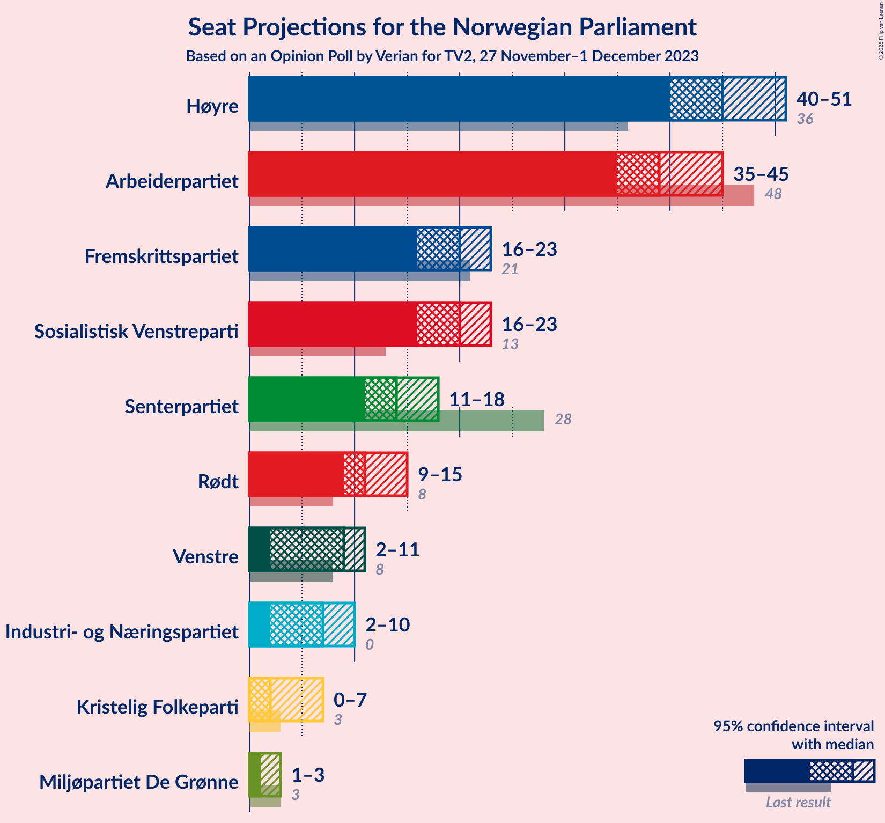
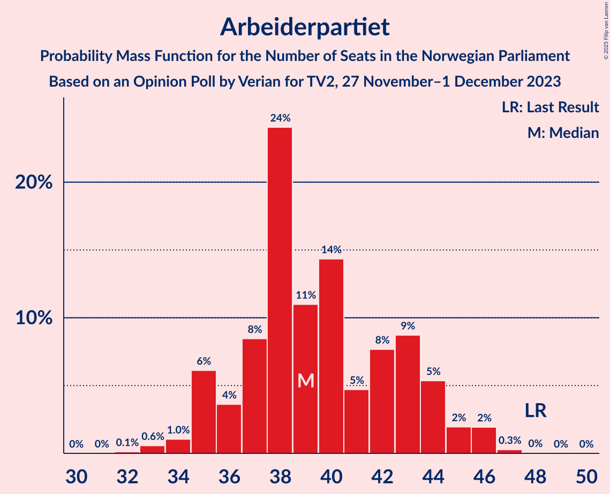
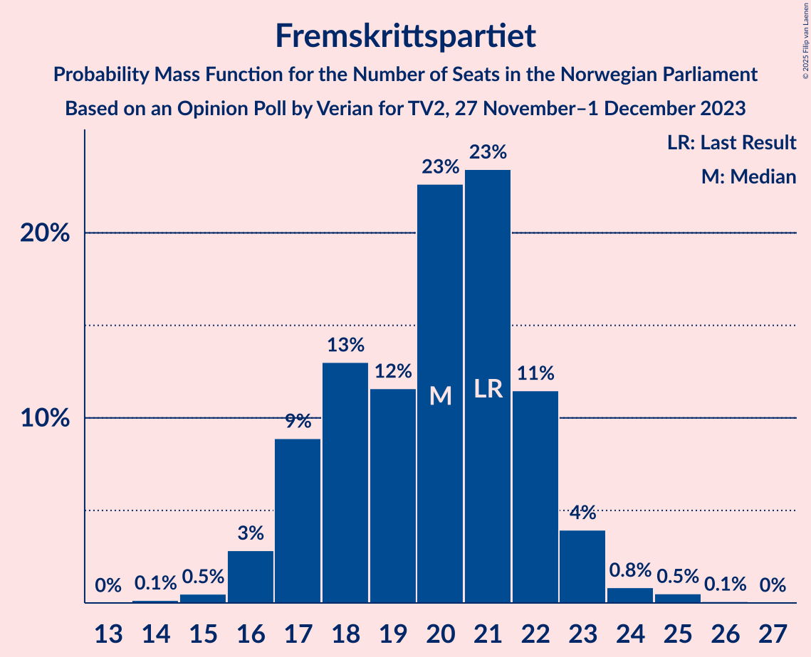

# Opinion Poll by Verian for TV2, 27 November–1 December 2023

<a href="#voting-intentions">Voting Intentions</a> | <a href="#seats">Seats</a> | <a href="#coalitions">Coalitions</a> | <a href="#technical-information">Technical Information</a>

## Voting Intentions

### Confidence Intervals

| Party | Last Result | Poll Result | 80% Confidence Interval | 90% Confidence Interval | 95% Confidence Interval | 99% Confidence Interval |
|:-----:|:-----------:|:-----------:|:-----------------------:|:-----------------------:|:-----------------------:|:-----------------------:|
| Høyre | 20.4% | 25.4% | 23.7–27.2% |23.2–27.7% |22.8–28.2% |22.0–29.1% |
| Arbeiderpartiet | 26.2% | 20.8% | 19.2–22.6% |18.8–23.0% |18.4–23.5% |17.7–24.3% |
| Fremskrittspartiet | 11.6% | 11.0% | 9.8–12.4% |9.5–12.8% |9.2–13.1% |8.7–13.8% |
| Sosialistisk Venstreparti | 7.6% | 10.8% | 9.6–12.2% |9.3–12.6% |9.0–12.9% |8.5–13.6% |
| Senterpartiet | 13.5% | 7.9% | 6.9–9.1% |6.6–9.4% |6.4–9.7% |5.9–10.3% |
| Rødt | 4.7% | 6.4% | 5.5–7.5% |5.2–7.8% |5.0–8.1% |4.6–8.6% |
| Venstre | 4.6% | 4.7% | 3.9–5.6% |3.7–5.9% |3.5–6.2% |3.2–6.7% |
| Industri- og Næringspartiet | 0.3% | 4.3% | 3.6–5.3% |3.4–5.6% |3.2–5.8% |2.9–6.3% |
| Kristelig Folkeparti | 3.8% | 3.1% | 2.5–4.0% |2.4–4.2% |2.2–4.4% |2.0–4.9% |
| Miljøpartiet De Grønne | 3.9% | 2.6% | 2.1–3.4% |1.9–3.6% |1.8–3.8% |1.6–4.2% |

*Note:* The poll result column reflects the actual value used in the calculations. Published results may vary slightly, and in addition be rounded to fewer digits.

## Seats

### Confidence Intervals

| Party | Last Result | Median | 80% Confidence Interval | 90% Confidence Interval | 95% Confidence Interval | 99% Confidence Interval |
|:-----:|:-----------:|:------:|:-----------------------:|:-----------------------:|:-----------------------:|:-----------------------:|
| <a href="#høyre">Høyre</a> | 36 | 45 | 43–48 |41–50 |40–51 |39–52 |
| <a href="#arbeiderpartiet">Arbeiderpartiet</a> | 48 | 39 | 36–43 |35–44 |35–45 |33–46 |
| <a href="#fremskrittspartiet">Fremskrittspartiet</a> | 21 | 20 | 17–22 |17–23 |16–23 |15–25 |
| <a href="#sosialistisk-venstreparti">Sosialistisk Venstreparti</a> | 13 | 20 | 17–22 |16–22 |16–23 |14–24 |
| <a href="#senterpartiet">Senterpartiet</a> | 28 | 14 | 13–17 |12–17 |11–18 |10–19 |
| <a href="#rødt">Rødt</a> | 8 | 11 | 9–13 |9–14 |9–15 |8–15 |
| <a href="#venstre">Venstre</a> | 8 | 9 | 3–10 |3–11 |2–11 |2–12 |
| <a href="#industri--og-næringspartiet">Industri- og Næringspartiet</a> | 0 | 7 | 2–9 |2–10 |2–10 |2–11 |
| <a href="#kristelig-folkeparti">Kristelig Folkeparti</a> | 3 | 2 | 2–3 |1–3 |0–7 |0–8 |
| <a href="#miljøpartiet-de-grønne">Miljøpartiet De Grønne</a> | 3 | 1 | 1–2 |1–3 |1–3 |0–7 |

### Høyre

*For a full overview of the results for this party, see the [Høyre](party-høyre.html) page.*

| Number of Seats | Probability | Accumulated | Special Marks |
|:---------------:|:-----------:|:-----------:|:-------------:|
| 36 | 0% | 100% | Last Result |
| 37 | 0% | 100% |  |
| 38 | 0.1% | 100% |  |
| 39 | 1.1% | 99.9% |  |
| 40 | 2% | 98.7% |  |
| 41 | 3% | 97% |  |
| 42 | 3% | 94% |  |
| 43 | 9% | 90% |  |
| 44 | 13% | 81% |  |
| 45 | 33% | 68% | Median |
| 46 | 10% | 36% |  |
| 47 | 11% | 26% |  |
| 48 | 7% | 15% |  |
| 49 | 3% | 8% |  |
| 50 | 2% | 5% |  |
| 51 | 1.1% | 3% |  |
| 52 | 2% | 2% |  |
| 53 | 0.3% | 0.4% |  |
| 54 | 0% | 0.1% |  |
| 55 | 0% | 0% |  |

### Arbeiderpartiet

*For a full overview of the results for this party, see the [Arbeiderpartiet](party-arbeiderpartiet.html) page.*

| Number of Seats | Probability | Accumulated | Special Marks |
|:---------------:|:-----------:|:-----------:|:-------------:|
| 32 | 0.1% | 100% |  |
| 33 | 0.6% | 99.9% |  |
| 34 | 1.0% | 99.3% |  |
| 35 | 6% | 98% |  |
| 36 | 4% | 92% |  |
| 37 | 8% | 89% |  |
| 38 | 24% | 80% |  |
| 39 | 11% | 56% | Median |
| 40 | 14% | 45% |  |
| 41 | 5% | 31% |  |
| 42 | 8% | 26% |  |
| 43 | 9% | 18% |  |
| 44 | 5% | 10% |  |
| 45 | 2% | 4% |  |
| 46 | 2% | 2% |  |
| 47 | 0.3% | 0.3% |  |
| 48 | 0% | 0.1% | Last Result |
| 49 | 0% | 0% |  |

### Fremskrittspartiet

*For a full overview of the results for this party, see the [Fremskrittspartiet](party-fremskrittspartiet.html) page.*

| Number of Seats | Probability | Accumulated | Special Marks |
|:---------------:|:-----------:|:-----------:|:-------------:|
| 14 | 0.1% | 100% |  |
| 15 | 0.5% | 99.8% |  |
| 16 | 3% | 99.3% |  |
| 17 | 9% | 96% |  |
| 18 | 13% | 88% |  |
| 19 | 12% | 75% |  |
| 20 | 23% | 63% | Median |
| 21 | 23% | 40% | Last Result |
| 22 | 11% | 17% |  |
| 23 | 4% | 5% |  |
| 24 | 0.8% | 1.5% |  |
| 25 | 0.5% | 0.6% |  |
| 26 | 0.1% | 0.1% |  |
| 27 | 0% | 0% |  |

### Sosialistisk Venstreparti

*For a full overview of the results for this party, see the [Sosialistisk Venstreparti](party-sosialistiskvenstreparti.html) page.*

| Number of Seats | Probability | Accumulated | Special Marks |
|:---------------:|:-----------:|:-----------:|:-------------:|
| 13 | 0.1% | 100% | Last Result |
| 14 | 0.6% | 99.9% |  |
| 15 | 1.2% | 99.3% |  |
| 16 | 4% | 98% |  |
| 17 | 10% | 94% |  |
| 18 | 19% | 84% |  |
| 19 | 11% | 66% |  |
| 20 | 32% | 55% | Median |
| 21 | 8% | 23% |  |
| 22 | 11% | 15% |  |
| 23 | 2% | 4% |  |
| 24 | 2% | 2% |  |
| 25 | 0.3% | 0.5% |  |
| 26 | 0.2% | 0.2% |  |
| 27 | 0% | 0% |  |

### Senterpartiet

*For a full overview of the results for this party, see the [Senterpartiet](party-senterpartiet.html) page.*

| Number of Seats | Probability | Accumulated | Special Marks |
|:---------------:|:-----------:|:-----------:|:-------------:|
| 9 | 0.1% | 100% |  |
| 10 | 0.9% | 99.9% |  |
| 11 | 3% | 99.0% |  |
| 12 | 4% | 96% |  |
| 13 | 16% | 91% |  |
| 14 | 27% | 75% | Median |
| 15 | 19% | 48% |  |
| 16 | 12% | 30% |  |
| 17 | 13% | 18% |  |
| 18 | 4% | 4% |  |
| 19 | 0.7% | 0.8% |  |
| 20 | 0.1% | 0.1% |  |
| 21 | 0% | 0% |  |
| 22 | 0% | 0% |  |
| 23 | 0% | 0% |  |
| 24 | 0% | 0% |  |
| 25 | 0% | 0% |  |
| 26 | 0% | 0% |  |
| 27 | 0% | 0% |  |
| 28 | 0% | 0% | Last Result |

### Rødt

*For a full overview of the results for this party, see the [Rødt](party-rødt.html) page.*

| Number of Seats | Probability | Accumulated | Special Marks |
|:---------------:|:-----------:|:-----------:|:-------------:|
| 7 | 0.1% | 100% |  |
| 8 | 2% | 99.9% | Last Result |
| 9 | 16% | 98% |  |
| 10 | 25% | 82% |  |
| 11 | 19% | 57% | Median |
| 12 | 17% | 38% |  |
| 13 | 13% | 21% |  |
| 14 | 5% | 8% |  |
| 15 | 2% | 3% |  |
| 16 | 0.3% | 0.3% |  |
| 17 | 0.1% | 0.1% |  |
| 18 | 0% | 0% |  |

### Venstre

*For a full overview of the results for this party, see the [Venstre](party-venstre.html) page.*

| Number of Seats | Probability | Accumulated | Special Marks |
|:---------------:|:-----------:|:-----------:|:-------------:|
| 2 | 3% | 100% |  |
| 3 | 10% | 97% |  |
| 4 | 0% | 87% |  |
| 5 | 0% | 87% |  |
| 6 | 0.1% | 87% |  |
| 7 | 11% | 86% |  |
| 8 | 16% | 75% | Last Result |
| 9 | 37% | 60% | Median |
| 10 | 18% | 23% |  |
| 11 | 4% | 5% |  |
| 12 | 0.6% | 0.7% |  |
| 13 | 0.1% | 0.1% |  |
| 14 | 0% | 0% |  |

### Industri- og Næringspartiet

*For a full overview of the results for this party, see the [Industri- og Næringspartiet](party-industri-ognæringspartiet.html) page.*

| Number of Seats | Probability | Accumulated | Special Marks |
|:---------------:|:-----------:|:-----------:|:-------------:|
| 0 | 0.1% | 100% | Last Result |
| 1 | 0.1% | 99.9% |  |
| 2 | 18% | 99.8% |  |
| 3 | 13% | 82% |  |
| 4 | 0% | 70% |  |
| 5 | 0% | 70% |  |
| 6 | 0.7% | 70% |  |
| 7 | 21% | 69% | Median |
| 8 | 34% | 48% |  |
| 9 | 7% | 14% |  |
| 10 | 6% | 7% |  |
| 11 | 1.0% | 1.1% |  |
| 12 | 0.1% | 0.1% |  |
| 13 | 0% | 0% |  |

### Kristelig Folkeparti

*For a full overview of the results for this party, see the [Kristelig Folkeparti](party-kristeligfolkeparti.html) page.*

| Number of Seats | Probability | Accumulated | Special Marks |
|:---------------:|:-----------:|:-----------:|:-------------:|
| 0 | 5% | 100% |  |
| 1 | 3% | 95% |  |
| 2 | 78% | 92% | Median |
| 3 | 10% | 14% | Last Result |
| 4 | 0% | 4% |  |
| 5 | 0% | 4% |  |
| 6 | 0.2% | 4% |  |
| 7 | 2% | 4% |  |
| 8 | 2% | 2% |  |
| 9 | 0.2% | 0.3% |  |
| 10 | 0% | 0% |  |

### Miljøpartiet De Grønne

*For a full overview of the results for this party, see the [Miljøpartiet De Grønne](party-miljøpartietdegrønne.html) page.*

| Number of Seats | Probability | Accumulated | Special Marks |
|:---------------:|:-----------:|:-----------:|:-------------:|
| 0 | 0.8% | 100% |  |
| 1 | 68% | 99.2% | Median |
| 2 | 25% | 31% |  |
| 3 | 5% | 6% | Last Result |
| 4 | 0% | 0.7% |  |
| 5 | 0% | 0.7% |  |
| 6 | 0.1% | 0.7% |  |
| 7 | 0.5% | 0.7% |  |
| 8 | 0.2% | 0.2% |  |
| 9 | 0% | 0% |  |

## Coalitions

### Confidence Intervals

| Coalition | Last Result | Median | Majority? | 80% Confidence Interval | 90% Confidence Interval | 95% Confidence Interval | 99% Confidence Interval |
|:---------:|:-----------:|:------:|:---------:|:-----------------------:|:-----------------------:|:-----------------------:|:-----------------------:|
| Høyre – Fremskrittspartiet – Senterpartiet – Venstre – Kristelig Folkeparti | 96 | 91 | 91% | 85–95 | 83–95 | 83–96 | 80–98 |
| Arbeiderpartiet – Sosialistisk Venstreparti – Senterpartiet – Rødt – Miljøpartiet De Grønne | 100 | 86 | 65% | 83–90 | 81–91 | 79–92 | 77–95 |
| Arbeiderpartiet – Sosialistisk Venstreparti – Senterpartiet – Rødt | 97 | 85 | 52% | 81–89 | 79–90 | 77–91 | 76–94 |
| Arbeiderpartiet – Sosialistisk Venstreparti – Senterpartiet – Kristelig Folkeparti – Miljøpartiet De Grønne | 95 | 77 | 2% | 74–81 | 72–82 | 71–83 | 68–86 |
| Høyre – Fremskrittspartiet – Venstre – Kristelig Folkeparti – Miljøpartiet De Grønne | 71 | 77 | 0.8% | 72–80 | 71–81 | 70–83 | 68–85 |
| Høyre – Fremskrittspartiet – Venstre – Kristelig Folkeparti | 68 | 76 | 0.3% | 71–78 | 70–80 | 68–81 | 66–84 |
| Arbeiderpartiet – Sosialistisk Venstreparti – Senterpartiet – Miljøpartiet De Grønne | 92 | 75 | 0.1% | 72–79 | 70–79 | 69–80 | 66–83 |
| Arbeiderpartiet – Sosialistisk Venstreparti – Senterpartiet | 89 | 74 | 0% | 70–77 | 69–78 | 67–79 | 65–81 |
| Høyre – Fremskrittspartiet – Venstre | 65 | 74 | 0% | 68–76 | 67–77 | 66–79 | 64–81 |
| Arbeiderpartiet – Sosialistisk Venstreparti – Rødt – Miljøpartiet De Grønne | 72 | 71 | 0% | 67–76 | 66–78 | 65–78 | 63–80 |
| Høyre – Fremskrittspartiet | 57 | 66 | 0% | 62–68 | 60–69 | 59–71 | 58–72 |
| Arbeiderpartiet – Sosialistisk Venstreparti | 61 | 58 | 0% | 56–64 | 54–64 | 53–65 | 51–66 |
| Arbeiderpartiet – Senterpartiet – Kristelig Folkeparti – Miljøpartiet De Grønne | 82 | 58 | 0% | 54–61 | 53–63 | 52–64 | 51–68 |
| Arbeiderpartiet – Senterpartiet – Kristelig Folkeparti | 79 | 56 | 0% | 53–60 | 52–61 | 51–62 | 49–66 |
| Høyre – Venstre – Kristelig Folkeparti | 47 | 56 | 0% | 51–60 | 50–61 | 49–62 | 47–63 |
| Arbeiderpartiet – Senterpartiet | 76 | 54 | 0% | 51–58 | 49–58 | 49–59 | 47–62 |
| Senterpartiet – Venstre – Kristelig Folkeparti | 39 | 25 | 0% | 21–28 | 18–29 | 18–30 | 16–33 |

### Høyre – Fremskrittspartiet – Senterpartiet – Venstre – Kristelig Folkeparti

| Number of Seats | Probability | Accumulated | Special Marks |
|:---------------:|:-----------:|:-----------:|:-------------:|
| 79 | 0.2% | 100% |  |
| 80 | 0.3% | 99.7% |  |
| 81 | 0.9% | 99.4% |  |
| 82 | 0.6% | 98% |  |
| 83 | 4% | 98% |  |
| 84 | 3% | 93% |  |
| 85 | 2% | 91% | Majority |
| 86 | 4% | 89% |  |
| 87 | 8% | 84% |  |
| 88 | 10% | 76% |  |
| 89 | 5% | 67% |  |
| 90 | 8% | 62% | Median |
| 91 | 23% | 53% |  |
| 92 | 5% | 30% |  |
| 93 | 9% | 25% |  |
| 94 | 5% | 16% |  |
| 95 | 8% | 11% |  |
| 96 | 1.5% | 3% | Last Result |
| 97 | 1.3% | 2% |  |
| 98 | 0.2% | 0.5% |  |
| 99 | 0.2% | 0.3% |  |
| 100 | 0.1% | 0.2% |  |
| 101 | 0% | 0.1% |  |
| 102 | 0% | 0% |  |

### Arbeiderpartiet – Sosialistisk Venstreparti – Senterpartiet – Rødt – Miljøpartiet De Grønne

| Number of Seats | Probability | Accumulated | Special Marks |
|:---------------:|:-----------:|:-----------:|:-------------:|
| 75 | 0.1% | 100% |  |
| 76 | 0.1% | 99.9% |  |
| 77 | 1.1% | 99.7% |  |
| 78 | 0.6% | 98.6% |  |
| 79 | 0.9% | 98% |  |
| 80 | 0.8% | 97% |  |
| 81 | 3% | 96% |  |
| 82 | 3% | 93% |  |
| 83 | 18% | 90% |  |
| 84 | 6% | 72% |  |
| 85 | 8% | 65% | Median, Majority |
| 86 | 10% | 57% |  |
| 87 | 17% | 47% |  |
| 88 | 9% | 30% |  |
| 89 | 6% | 21% |  |
| 90 | 5% | 15% |  |
| 91 | 6% | 10% |  |
| 92 | 2% | 4% |  |
| 93 | 0.6% | 2% |  |
| 94 | 0.9% | 2% |  |
| 95 | 0.4% | 0.7% |  |
| 96 | 0.2% | 0.3% |  |
| 97 | 0.1% | 0.1% |  |
| 98 | 0% | 0% |  |
| 99 | 0% | 0% |  |
| 100 | 0% | 0% | Last Result |

### Arbeiderpartiet – Sosialistisk Venstreparti – Senterpartiet – Rødt

| Number of Seats | Probability | Accumulated | Special Marks |
|:---------------:|:-----------:|:-----------:|:-------------:|
| 73 | 0% | 100% |  |
| 74 | 0.2% | 99.9% |  |
| 75 | 0.2% | 99.8% |  |
| 76 | 1.1% | 99.6% |  |
| 77 | 1.0% | 98% |  |
| 78 | 0.8% | 97% |  |
| 79 | 3% | 97% |  |
| 80 | 3% | 94% |  |
| 81 | 3% | 92% |  |
| 82 | 19% | 89% |  |
| 83 | 11% | 70% |  |
| 84 | 6% | 59% | Median |
| 85 | 9% | 52% | Majority |
| 86 | 17% | 43% |  |
| 87 | 8% | 26% |  |
| 88 | 6% | 18% |  |
| 89 | 6% | 12% |  |
| 90 | 3% | 6% |  |
| 91 | 1.1% | 3% |  |
| 92 | 0.4% | 2% |  |
| 93 | 0.7% | 1.3% |  |
| 94 | 0.3% | 0.5% |  |
| 95 | 0.2% | 0.2% |  |
| 96 | 0% | 0% |  |
| 97 | 0% | 0% | Last Result |

### Arbeiderpartiet – Sosialistisk Venstreparti – Senterpartiet – Kristelig Folkeparti – Miljøpartiet De Grønne

| Number of Seats | Probability | Accumulated | Special Marks |
|:---------------:|:-----------:|:-----------:|:-------------:|
| 67 | 0.2% | 100% |  |
| 68 | 0.6% | 99.8% |  |
| 69 | 0.4% | 99.2% |  |
| 70 | 0.6% | 98.8% |  |
| 71 | 1.5% | 98% |  |
| 72 | 3% | 97% |  |
| 73 | 4% | 94% |  |
| 74 | 7% | 90% |  |
| 75 | 19% | 84% |  |
| 76 | 9% | 65% | Median |
| 77 | 8% | 56% |  |
| 78 | 15% | 48% |  |
| 79 | 10% | 33% |  |
| 80 | 10% | 23% |  |
| 81 | 7% | 12% |  |
| 82 | 0.9% | 5% |  |
| 83 | 2% | 4% |  |
| 84 | 0.5% | 2% |  |
| 85 | 0.7% | 2% | Majority |
| 86 | 0.9% | 1.1% |  |
| 87 | 0.1% | 0.2% |  |
| 88 | 0.1% | 0.1% |  |
| 89 | 0% | 0% |  |
| 90 | 0% | 0% |  |
| 91 | 0% | 0% |  |
| 92 | 0% | 0% |  |
| 93 | 0% | 0% |  |
| 94 | 0% | 0% |  |
| 95 | 0% | 0% | Last Result |

### Høyre – Fremskrittspartiet – Venstre – Kristelig Folkeparti – Miljøpartiet De Grønne

| Number of Seats | Probability | Accumulated | Special Marks |
|:---------------:|:-----------:|:-----------:|:-------------:|
| 65 | 0.2% | 100% |  |
| 66 | 0.1% | 99.8% |  |
| 67 | 0.1% | 99.8% |  |
| 68 | 0.2% | 99.6% |  |
| 69 | 0.9% | 99.5% |  |
| 70 | 2% | 98.5% |  |
| 71 | 2% | 96% | Last Result |
| 72 | 7% | 94% |  |
| 73 | 3% | 88% |  |
| 74 | 7% | 85% |  |
| 75 | 9% | 78% |  |
| 76 | 7% | 69% |  |
| 77 | 13% | 62% | Median |
| 78 | 24% | 50% |  |
| 79 | 13% | 26% |  |
| 80 | 5% | 13% |  |
| 81 | 4% | 8% |  |
| 82 | 1.2% | 4% |  |
| 83 | 0.8% | 3% |  |
| 84 | 1.0% | 2% |  |
| 85 | 0.4% | 0.8% | Majority |
| 86 | 0.2% | 0.4% |  |
| 87 | 0.1% | 0.2% |  |
| 88 | 0.1% | 0.1% |  |
| 89 | 0% | 0% |  |

### Høyre – Fremskrittspartiet – Venstre – Kristelig Folkeparti

| Number of Seats | Probability | Accumulated | Special Marks |
|:---------------:|:-----------:|:-----------:|:-------------:|
| 64 | 0.2% | 100% |  |
| 65 | 0.1% | 99.8% |  |
| 66 | 0.2% | 99.7% |  |
| 67 | 0.2% | 99.5% |  |
| 68 | 3% | 99.3% | Last Result |
| 69 | 1.4% | 97% |  |
| 70 | 5% | 95% |  |
| 71 | 5% | 90% |  |
| 72 | 4% | 86% |  |
| 73 | 6% | 82% |  |
| 74 | 11% | 76% |  |
| 75 | 12% | 65% |  |
| 76 | 7% | 53% | Median |
| 77 | 21% | 46% |  |
| 78 | 15% | 25% |  |
| 79 | 3% | 10% |  |
| 80 | 4% | 7% |  |
| 81 | 1.0% | 3% |  |
| 82 | 0.7% | 2% |  |
| 83 | 1.1% | 2% |  |
| 84 | 0.3% | 0.5% |  |
| 85 | 0.1% | 0.3% | Majority |
| 86 | 0.1% | 0.1% |  |
| 87 | 0% | 0% |  |

### Arbeiderpartiet – Sosialistisk Venstreparti – Senterpartiet – Miljøpartiet De Grønne

| Number of Seats | Probability | Accumulated | Special Marks |
|:---------------:|:-----------:|:-----------:|:-------------:|
| 64 | 0.1% | 100% |  |
| 65 | 0.2% | 99.9% |  |
| 66 | 0.7% | 99.7% |  |
| 67 | 0.4% | 99.0% |  |
| 68 | 0.8% | 98.6% |  |
| 69 | 1.4% | 98% |  |
| 70 | 2% | 96% |  |
| 71 | 3% | 94% |  |
| 72 | 8% | 91% |  |
| 73 | 19% | 83% |  |
| 74 | 9% | 65% | Median |
| 75 | 11% | 56% |  |
| 76 | 14% | 44% |  |
| 77 | 10% | 30% |  |
| 78 | 9% | 20% |  |
| 79 | 8% | 11% |  |
| 80 | 0.9% | 3% |  |
| 81 | 1.4% | 2% |  |
| 82 | 0.5% | 1.0% |  |
| 83 | 0.3% | 0.5% |  |
| 84 | 0.1% | 0.2% |  |
| 85 | 0% | 0.1% | Majority |
| 86 | 0% | 0% |  |
| 87 | 0% | 0% |  |
| 88 | 0% | 0% |  |
| 89 | 0% | 0% |  |
| 90 | 0% | 0% |  |
| 91 | 0% | 0% |  |
| 92 | 0% | 0% | Last Result |

### Arbeiderpartiet – Sosialistisk Venstreparti – Senterpartiet

| Number of Seats | Probability | Accumulated | Special Marks |
|:---------------:|:-----------:|:-----------:|:-------------:|
| 63 | 0.2% | 100% |  |
| 64 | 0.2% | 99.8% |  |
| 65 | 0.8% | 99.6% |  |
| 66 | 0.7% | 98.9% |  |
| 67 | 0.8% | 98% |  |
| 68 | 2% | 97% |  |
| 69 | 3% | 95% |  |
| 70 | 4% | 92% |  |
| 71 | 10% | 88% |  |
| 72 | 19% | 78% |  |
| 73 | 8% | 59% | Median |
| 74 | 12% | 51% |  |
| 75 | 10% | 38% |  |
| 76 | 11% | 29% |  |
| 77 | 12% | 18% |  |
| 78 | 3% | 6% |  |
| 79 | 0.9% | 3% |  |
| 80 | 1.3% | 2% |  |
| 81 | 0.5% | 0.8% |  |
| 82 | 0.3% | 0.3% |  |
| 83 | 0% | 0.1% |  |
| 84 | 0% | 0% |  |
| 85 | 0% | 0% | Majority |
| 86 | 0% | 0% |  |
| 87 | 0% | 0% |  |
| 88 | 0% | 0% |  |
| 89 | 0% | 0% | Last Result |

### Høyre – Fremskrittspartiet – Venstre

| Number of Seats | Probability | Accumulated | Special Marks |
|:---------------:|:-----------:|:-----------:|:-------------:|
| 61 | 0.1% | 100% |  |
| 62 | 0.1% | 99.9% |  |
| 63 | 0.2% | 99.8% |  |
| 64 | 0.3% | 99.6% |  |
| 65 | 0.3% | 99.3% | Last Result |
| 66 | 3% | 99.0% |  |
| 67 | 2% | 96% |  |
| 68 | 5% | 94% |  |
| 69 | 5% | 89% |  |
| 70 | 4% | 84% |  |
| 71 | 5% | 80% |  |
| 72 | 12% | 75% |  |
| 73 | 13% | 63% |  |
| 74 | 5% | 50% | Median |
| 75 | 22% | 45% |  |
| 76 | 15% | 24% |  |
| 77 | 5% | 9% |  |
| 78 | 2% | 4% |  |
| 79 | 0.7% | 3% |  |
| 80 | 0.7% | 2% |  |
| 81 | 0.8% | 1.1% |  |
| 82 | 0.2% | 0.3% |  |
| 83 | 0.1% | 0.1% |  |
| 84 | 0% | 0.1% |  |
| 85 | 0% | 0% | Majority |

### Arbeiderpartiet – Sosialistisk Venstreparti – Rødt – Miljøpartiet De Grønne

| Number of Seats | Probability | Accumulated | Special Marks |
|:---------------:|:-----------:|:-----------:|:-------------:|
| 61 | 0.1% | 100% |  |
| 62 | 0.3% | 99.9% |  |
| 63 | 0.3% | 99.6% |  |
| 64 | 1.0% | 99.3% |  |
| 65 | 2% | 98% |  |
| 66 | 3% | 96% |  |
| 67 | 3% | 93% |  |
| 68 | 3% | 90% |  |
| 69 | 20% | 87% |  |
| 70 | 11% | 66% |  |
| 71 | 9% | 55% | Median |
| 72 | 8% | 46% | Last Result |
| 73 | 12% | 37% |  |
| 74 | 11% | 25% |  |
| 75 | 2% | 14% |  |
| 76 | 4% | 13% |  |
| 77 | 2% | 9% |  |
| 78 | 5% | 7% |  |
| 79 | 0.5% | 1.3% |  |
| 80 | 0.6% | 0.8% |  |
| 81 | 0.1% | 0.2% |  |
| 82 | 0.1% | 0.1% |  |
| 83 | 0% | 0% |  |

### Høyre – Fremskrittspartiet

| Number of Seats | Probability | Accumulated | Special Marks |
|:---------------:|:-----------:|:-----------:|:-------------:|
| 56 | 0% | 100% |  |
| 57 | 0.2% | 99.9% | Last Result |
| 58 | 0.9% | 99.7% |  |
| 59 | 2% | 98.8% |  |
| 60 | 3% | 96% |  |
| 61 | 3% | 93% |  |
| 62 | 4% | 90% |  |
| 63 | 9% | 87% |  |
| 64 | 14% | 78% |  |
| 65 | 14% | 64% | Median |
| 66 | 24% | 50% |  |
| 67 | 16% | 26% |  |
| 68 | 3% | 10% |  |
| 69 | 3% | 8% |  |
| 70 | 2% | 5% |  |
| 71 | 1.2% | 3% |  |
| 72 | 1.1% | 2% |  |
| 73 | 0.2% | 0.5% |  |
| 74 | 0.2% | 0.3% |  |
| 75 | 0% | 0.1% |  |
| 76 | 0% | 0.1% |  |
| 77 | 0% | 0.1% |  |
| 78 | 0% | 0% |  |

### Arbeiderpartiet – Sosialistisk Venstreparti

| Number of Seats | Probability | Accumulated | Special Marks |
|:---------------:|:-----------:|:-----------:|:-------------:|
| 49 | 0% | 100% |  |
| 50 | 0.2% | 99.9% |  |
| 51 | 0.4% | 99.8% |  |
| 52 | 2% | 99.3% |  |
| 53 | 1.2% | 98% |  |
| 54 | 2% | 96% |  |
| 55 | 3% | 94% |  |
| 56 | 7% | 91% |  |
| 57 | 10% | 84% |  |
| 58 | 29% | 74% |  |
| 59 | 13% | 45% | Median |
| 60 | 6% | 32% |  |
| 61 | 7% | 26% | Last Result |
| 62 | 2% | 20% |  |
| 63 | 7% | 17% |  |
| 64 | 6% | 10% |  |
| 65 | 3% | 4% |  |
| 66 | 0.6% | 0.8% |  |
| 67 | 0.1% | 0.2% |  |
| 68 | 0% | 0.1% |  |
| 69 | 0% | 0.1% |  |
| 70 | 0% | 0% |  |

### Arbeiderpartiet – Senterpartiet – Kristelig Folkeparti – Miljøpartiet De Grønne

| Number of Seats | Probability | Accumulated | Special Marks |
|:---------------:|:-----------:|:-----------:|:-------------:|
| 48 | 0.2% | 100% |  |
| 49 | 0.1% | 99.8% |  |
| 50 | 0.2% | 99.7% |  |
| 51 | 1.0% | 99.5% |  |
| 52 | 2% | 98.5% |  |
| 53 | 3% | 97% |  |
| 54 | 5% | 94% |  |
| 55 | 24% | 89% |  |
| 56 | 5% | 65% | Median |
| 57 | 9% | 60% |  |
| 58 | 8% | 51% |  |
| 59 | 10% | 43% |  |
| 60 | 14% | 33% |  |
| 61 | 12% | 20% |  |
| 62 | 2% | 7% |  |
| 63 | 2% | 5% |  |
| 64 | 0.6% | 3% |  |
| 65 | 0.9% | 2% |  |
| 66 | 0.4% | 1.4% |  |
| 67 | 0.4% | 1.1% |  |
| 68 | 0.7% | 0.7% |  |
| 69 | 0% | 0.1% |  |
| 70 | 0% | 0% |  |
| 71 | 0% | 0% |  |
| 72 | 0% | 0% |  |
| 73 | 0% | 0% |  |
| 74 | 0% | 0% |  |
| 75 | 0% | 0% |  |
| 76 | 0% | 0% |  |
| 77 | 0% | 0% |  |
| 78 | 0% | 0% |  |
| 79 | 0% | 0% |  |
| 80 | 0% | 0% |  |
| 81 | 0% | 0% |  |
| 82 | 0% | 0% | Last Result |

### Arbeiderpartiet – Senterpartiet – Kristelig Folkeparti

| Number of Seats | Probability | Accumulated | Special Marks |
|:---------------:|:-----------:|:-----------:|:-------------:|
| 47 | 0.2% | 100% |  |
| 48 | 0.1% | 99.8% |  |
| 49 | 0.4% | 99.7% |  |
| 50 | 1.1% | 99.2% |  |
| 51 | 3% | 98% |  |
| 52 | 3% | 95% |  |
| 53 | 8% | 93% |  |
| 54 | 21% | 84% |  |
| 55 | 8% | 63% | Median |
| 56 | 9% | 55% |  |
| 57 | 9% | 46% |  |
| 58 | 7% | 38% |  |
| 59 | 19% | 31% |  |
| 60 | 6% | 12% |  |
| 61 | 2% | 6% |  |
| 62 | 2% | 4% |  |
| 63 | 0.6% | 2% |  |
| 64 | 0.9% | 2% |  |
| 65 | 0.2% | 1.0% |  |
| 66 | 0.6% | 0.8% |  |
| 67 | 0.1% | 0.1% |  |
| 68 | 0% | 0.1% |  |
| 69 | 0% | 0% |  |
| 70 | 0% | 0% |  |
| 71 | 0% | 0% |  |
| 72 | 0% | 0% |  |
| 73 | 0% | 0% |  |
| 74 | 0% | 0% |  |
| 75 | 0% | 0% |  |
| 76 | 0% | 0% |  |
| 77 | 0% | 0% |  |
| 78 | 0% | 0% |  |
| 79 | 0% | 0% | Last Result |

### Høyre – Venstre – Kristelig Folkeparti

| Number of Seats | Probability | Accumulated | Special Marks |
|:---------------:|:-----------:|:-----------:|:-------------:|
| 44 | 0% | 100% |  |
| 45 | 0% | 99.9% |  |
| 46 | 0.2% | 99.9% |  |
| 47 | 0.6% | 99.7% | Last Result |
| 48 | 1.5% | 99.1% |  |
| 49 | 2% | 98% |  |
| 50 | 5% | 96% |  |
| 51 | 3% | 90% |  |
| 52 | 5% | 88% |  |
| 53 | 5% | 83% |  |
| 54 | 14% | 78% |  |
| 55 | 8% | 64% |  |
| 56 | 20% | 56% | Median |
| 57 | 8% | 36% |  |
| 58 | 14% | 28% |  |
| 59 | 3% | 14% |  |
| 60 | 5% | 11% |  |
| 61 | 3% | 6% |  |
| 62 | 1.5% | 3% |  |
| 63 | 0.9% | 1.3% |  |
| 64 | 0.2% | 0.4% |  |
| 65 | 0.2% | 0.2% |  |
| 66 | 0% | 0.1% |  |
| 67 | 0% | 0% |  |

### Arbeiderpartiet – Senterpartiet

| Number of Seats | Probability | Accumulated | Special Marks |
|:---------------:|:-----------:|:-----------:|:-------------:|
| 45 | 0.2% | 100% |  |
| 46 | 0.2% | 99.8% |  |
| 47 | 0.4% | 99.6% |  |
| 48 | 0.9% | 99.2% |  |
| 49 | 3% | 98% |  |
| 50 | 3% | 95% |  |
| 51 | 6% | 92% |  |
| 52 | 20% | 85% |  |
| 53 | 12% | 65% | Median |
| 54 | 12% | 54% |  |
| 55 | 8% | 41% |  |
| 56 | 3% | 34% |  |
| 57 | 19% | 30% |  |
| 58 | 7% | 11% |  |
| 59 | 1.3% | 4% |  |
| 60 | 2% | 2% |  |
| 61 | 0.2% | 0.9% |  |
| 62 | 0.6% | 0.6% |  |
| 63 | 0% | 0.1% |  |
| 64 | 0.1% | 0.1% |  |
| 65 | 0% | 0% |  |
| 66 | 0% | 0% |  |
| 67 | 0% | 0% |  |
| 68 | 0% | 0% |  |
| 69 | 0% | 0% |  |
| 70 | 0% | 0% |  |
| 71 | 0% | 0% |  |
| 72 | 0% | 0% |  |
| 73 | 0% | 0% |  |
| 74 | 0% | 0% |  |
| 75 | 0% | 0% |  |
| 76 | 0% | 0% | Last Result |

### Senterpartiet – Venstre – Kristelig Folkeparti

| Number of Seats | Probability | Accumulated | Special Marks |
|:---------------:|:-----------:|:-----------:|:-------------:|
| 15 | 0.1% | 100% |  |
| 16 | 0.5% | 99.9% |  |
| 17 | 0.3% | 99.4% |  |
| 18 | 5% | 99.1% |  |
| 19 | 1.3% | 94% |  |
| 20 | 1.3% | 93% |  |
| 21 | 5% | 92% |  |
| 22 | 7% | 86% |  |
| 23 | 5% | 80% |  |
| 24 | 10% | 75% |  |
| 25 | 22% | 65% | Median |
| 26 | 11% | 42% |  |
| 27 | 13% | 32% |  |
| 28 | 11% | 18% |  |
| 29 | 4% | 7% |  |
| 30 | 2% | 3% |  |
| 31 | 0.4% | 1.3% |  |
| 32 | 0.3% | 0.9% |  |
| 33 | 0.1% | 0.6% |  |
| 34 | 0.4% | 0.5% |  |
| 35 | 0% | 0% |  |
| 36 | 0% | 0% |  |
| 37 | 0% | 0% |  |
| 38 | 0% | 0% |  |
| 39 | 0% | 0% | Last Result |

## Technical Information

### Opinion Poll

+ **Polling firm:** Verian
+ **Commissioner(s):** TV2
+ **Fieldwork period:** 27 November–1 December 2023

### Calculations

+ **Sample size:** 989
+ **Simulations done:** 1,048,576
+ **Error estimate:** 1.42%

