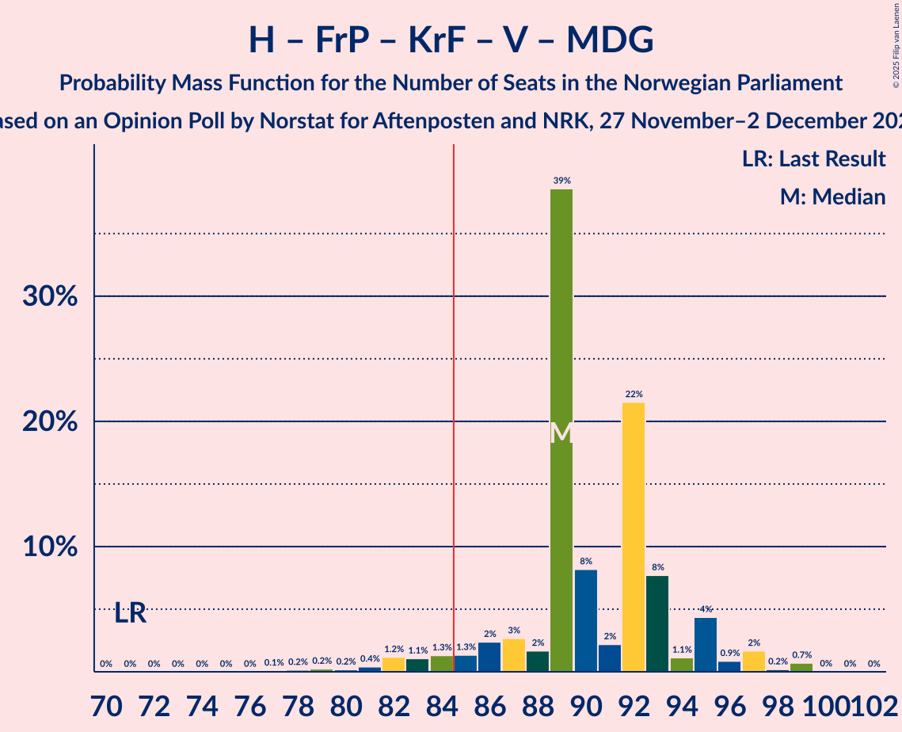
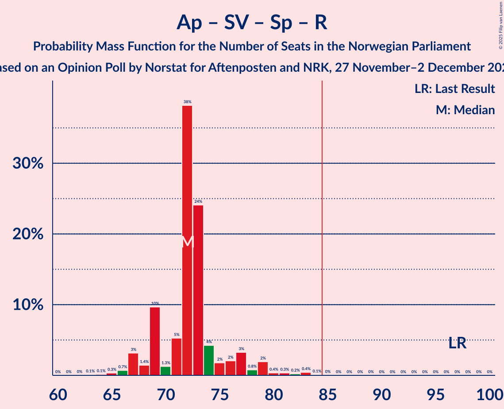

# Opinion Poll by Norstat for Aftenposten and NRK, 27 November–2 December 2023

<a href="#voting-intentions">Voting Intentions</a> | <a href="#seats">Seats</a> | <a href="#coalitions">Coalitions</a> | <a href="#technical-information">Technical Information</a>

## Voting Intentions

### Confidence Intervals

| Party | Last Result | Poll Result | 80% Confidence Interval | 90% Confidence Interval | 95% Confidence Interval | 99% Confidence Interval |
|:-----:|:-----------:|:-----------:|:-----------------------:|:-----------------------:|:-----------------------:|:-----------------------:|
| Høyre | 20.4% | 26.3% | 24.6–28.2% |24.1–28.7% |23.7–29.1% |22.8–30.0% |
| Arbeiderpartiet | 26.2% | 18.6% | 17.1–20.3% |16.7–20.7% |16.3–21.1% |15.6–21.9% |
| Fremskrittspartiet | 11.6% | 13.6% | 12.3–15.1% |11.9–15.5% |11.6–15.9% |11.0–16.6% |
| Sosialistisk Venstreparti | 7.6% | 11.4% | 10.2–12.8% |9.9–13.2% |9.6–13.5% |9.0–14.2% |
| Senterpartiet | 13.5% | 6.1% | 5.2–7.2% |5.0–7.5% |4.8–7.8% |4.4–8.3% |
| Rødt | 4.7% | 4.8% | 4.0–5.8% |3.8–6.1% |3.6–6.3% |3.3–6.8% |
| Kristelig Folkeparti | 3.8% | 4.7% | 3.9–5.7% |3.7–6.0% |3.6–6.2% |3.2–6.7% |
| Industri- og Næringspartiet | 0.3% | 4.1% | 3.4–5.0% |3.2–5.3% |3.0–5.5% |2.7–6.0% |
| Venstre | 4.6% | 4.0% | 3.3–4.9% |3.1–5.2% |2.9–5.4% |2.7–5.9% |
| Miljøpartiet De Grønne | 3.9% | 3.9% | 3.2–4.8% |3.0–5.1% |2.9–5.3% |2.6–5.8% |
| Norgesdemokratene | 1.1% | 1.0% | 0.7–1.5% |0.6–1.7% |0.5–1.8% |0.4–2.1% |
| Pensjonistpartiet | 0.6% | 0.8% | 0.5–1.3% |0.5–1.4% |0.4–1.6% |0.3–1.9% |

*Note:* The poll result column reflects the actual value used in the calculations. Published results may vary slightly, and in addition be rounded to fewer digits.

## Seats

### Confidence Intervals

| Party | Last Result | Median | 80% Confidence Interval | 90% Confidence Interval | 95% Confidence Interval | 99% Confidence Interval |
|:-----:|:-----------:|:------:|:-----------------------:|:-----------------------:|:-----------------------:|:-----------------------:|
| <a href="#høyre">Høyre</a> | 36 | 46 | 45–53 |44–53 |42–53 |40–53 |
| <a href="#arbeiderpartiet">Arbeiderpartiet</a> | 48 | 37 | 33–38 |33–38 |32–39 |30–42 |
| <a href="#fremskrittspartiet">Fremskrittspartiet</a> | 21 | 26 | 21–27 |21–29 |21–29 |19–32 |
| <a href="#sosialistisk-venstreparti">Sosialistisk Venstreparti</a> | 13 | 19 | 18–21 |17–23 |16–23 |15–25 |
| <a href="#senterpartiet">Senterpartiet</a> | 28 | 10 | 9–13 |9–13 |8–14 |7–15 |
| <a href="#rødt">Rødt</a> | 8 | 7 | 1–9 |1–10 |1–11 |1–12 |
| <a href="#kristelig-folkeparti">Kristelig Folkeparti</a> | 3 | 8 | 3–9 |3–10 |3–11 |2–12 |
| <a href="#industri--og-næringspartiet">Industri- og Næringspartiet</a> | 0 | 7 | 2–9 |2–9 |2–9 |2–9 |
| <a href="#venstre">Venstre</a> | 8 | 3 | 2–8 |2–8 |2–9 |2–10 |
| <a href="#miljøpartiet-de-grønne">Miljøpartiet De Grønne</a> | 3 | 8 | 2–8 |2–8 |2–9 |1–10 |
| <a href="#norgesdemokratene">Norgesdemokratene</a> | 0 | 0 | 0 |0 |0 |0 |
| <a href="#pensjonistpartiet">Pensjonistpartiet</a> | 0 | 0 | 0 |0 |0 |0 |

### Høyre

*For a full overview of the results for this party, see the [Høyre](party-høyre.html) page.*

| Number of Seats | Probability | Accumulated | Special Marks |
|:---------------:|:-----------:|:-----------:|:-------------:|
| 36 | 0% | 100% | Last Result |
| 37 | 0% | 100% |  |
| 38 | 0% | 100% |  |
| 39 | 0.1% | 100% |  |
| 40 | 1.2% | 99.9% |  |
| 41 | 0.7% | 98.7% |  |
| 42 | 2% | 98% |  |
| 43 | 0.6% | 96% |  |
| 44 | 2% | 95% |  |
| 45 | 40% | 93% |  |
| 46 | 5% | 53% | Median |
| 47 | 3% | 49% |  |
| 48 | 10% | 46% |  |
| 49 | 8% | 36% |  |
| 50 | 4% | 28% |  |
| 51 | 1.4% | 23% |  |
| 52 | 2% | 22% |  |
| 53 | 20% | 20% |  |
| 54 | 0.3% | 0.4% |  |
| 55 | 0.1% | 0.1% |  |
| 56 | 0% | 0% |  |

### Arbeiderpartiet

*For a full overview of the results for this party, see the [Arbeiderpartiet](party-arbeiderpartiet.html) page.*

| Number of Seats | Probability | Accumulated | Special Marks |
|:---------------:|:-----------:|:-----------:|:-------------:|
| 29 | 0.1% | 100% |  |
| 30 | 0.7% | 99.9% |  |
| 31 | 0.5% | 99.2% |  |
| 32 | 2% | 98.7% |  |
| 33 | 21% | 97% |  |
| 34 | 10% | 75% |  |
| 35 | 4% | 66% |  |
| 36 | 9% | 61% |  |
| 37 | 40% | 52% | Median |
| 38 | 8% | 12% |  |
| 39 | 3% | 5% |  |
| 40 | 0.3% | 2% |  |
| 41 | 0.5% | 2% |  |
| 42 | 0.8% | 1.1% |  |
| 43 | 0.1% | 0.3% |  |
| 44 | 0.1% | 0.2% |  |
| 45 | 0% | 0% |  |
| 46 | 0% | 0% |  |
| 47 | 0% | 0% |  |
| 48 | 0% | 0% | Last Result |

### Fremskrittspartiet

*For a full overview of the results for this party, see the [Fremskrittspartiet](party-fremskrittspartiet.html) page.*

| Number of Seats | Probability | Accumulated | Special Marks |
|:---------------:|:-----------:|:-----------:|:-------------:|
| 17 | 0.1% | 100% |  |
| 18 | 0.1% | 99.9% |  |
| 19 | 1.1% | 99.8% |  |
| 20 | 1.1% | 98.8% |  |
| 21 | 22% | 98% | Last Result |
| 22 | 2% | 76% |  |
| 23 | 4% | 74% |  |
| 24 | 6% | 69% |  |
| 25 | 5% | 64% |  |
| 26 | 41% | 59% | Median |
| 27 | 10% | 17% |  |
| 28 | 0.5% | 8% |  |
| 29 | 5% | 7% |  |
| 30 | 0.6% | 2% |  |
| 31 | 0.9% | 2% |  |
| 32 | 0.4% | 0.7% |  |
| 33 | 0.2% | 0.3% |  |
| 34 | 0% | 0% |  |

### Sosialistisk Venstreparti

*For a full overview of the results for this party, see the [Sosialistisk Venstreparti](party-sosialistiskvenstreparti.html) page.*

| Number of Seats | Probability | Accumulated | Special Marks |
|:---------------:|:-----------:|:-----------:|:-------------:|
| 13 | 0% | 100% | Last Result |
| 14 | 0.3% | 100% |  |
| 15 | 0.8% | 99.7% |  |
| 16 | 4% | 98.9% |  |
| 17 | 2% | 95% |  |
| 18 | 6% | 93% |  |
| 19 | 41% | 87% | Median |
| 20 | 8% | 46% |  |
| 21 | 28% | 38% |  |
| 22 | 3% | 9% |  |
| 23 | 5% | 6% |  |
| 24 | 0.3% | 1.0% |  |
| 25 | 0.5% | 0.7% |  |
| 26 | 0.1% | 0.2% |  |
| 27 | 0% | 0.1% |  |
| 28 | 0% | 0.1% |  |
| 29 | 0% | 0% |  |

### Senterpartiet

*For a full overview of the results for this party, see the [Senterpartiet](party-senterpartiet.html) page.*

| Number of Seats | Probability | Accumulated | Special Marks |
|:---------------:|:-----------:|:-----------:|:-------------:|
| 1 | 0.2% | 100% |  |
| 2 | 0% | 99.8% |  |
| 3 | 0% | 99.8% |  |
| 4 | 0% | 99.8% |  |
| 5 | 0% | 99.8% |  |
| 6 | 0% | 99.8% |  |
| 7 | 0.7% | 99.7% |  |
| 8 | 2% | 99.0% |  |
| 9 | 39% | 97% |  |
| 10 | 34% | 58% | Median |
| 11 | 4% | 24% |  |
| 12 | 4% | 21% |  |
| 13 | 14% | 17% |  |
| 14 | 2% | 3% |  |
| 15 | 1.3% | 1.3% |  |
| 16 | 0% | 0% |  |
| 17 | 0% | 0% |  |
| 18 | 0% | 0% |  |
| 19 | 0% | 0% |  |
| 20 | 0% | 0% |  |
| 21 | 0% | 0% |  |
| 22 | 0% | 0% |  |
| 23 | 0% | 0% |  |
| 24 | 0% | 0% |  |
| 25 | 0% | 0% |  |
| 26 | 0% | 0% |  |
| 27 | 0% | 0% |  |
| 28 | 0% | 0% | Last Result |

### Rødt

*For a full overview of the results for this party, see the [Rødt](party-rødt.html) page.*

| Number of Seats | Probability | Accumulated | Special Marks |
|:---------------:|:-----------:|:-----------:|:-------------:|
| 1 | 19% | 100% |  |
| 2 | 0% | 81% |  |
| 3 | 0% | 81% |  |
| 4 | 0% | 81% |  |
| 5 | 0% | 81% |  |
| 6 | 0.8% | 81% |  |
| 7 | 39% | 80% | Median |
| 8 | 12% | 41% | Last Result |
| 9 | 22% | 29% |  |
| 10 | 4% | 7% |  |
| 11 | 2% | 3% |  |
| 12 | 0.4% | 0.6% |  |
| 13 | 0.2% | 0.2% |  |
| 14 | 0% | 0% |  |

### Kristelig Folkeparti

*For a full overview of the results for this party, see the [Kristelig Folkeparti](party-kristeligfolkeparti.html) page.*

| Number of Seats | Probability | Accumulated | Special Marks |
|:---------------:|:-----------:|:-----------:|:-------------:|
| 2 | 2% | 100% |  |
| 3 | 14% | 98% | Last Result |
| 4 | 0% | 85% |  |
| 5 | 0% | 85% |  |
| 6 | 0.7% | 85% |  |
| 7 | 5% | 84% |  |
| 8 | 44% | 78% | Median |
| 9 | 25% | 34% |  |
| 10 | 6% | 9% |  |
| 11 | 2% | 3% |  |
| 12 | 0.5% | 0.6% |  |
| 13 | 0% | 0% |  |

### Industri- og Næringspartiet

*For a full overview of the results for this party, see the [Industri- og Næringspartiet](party-industri-ognæringspartiet.html) page.*

| Number of Seats | Probability | Accumulated | Special Marks |
|:---------------:|:-----------:|:-----------:|:-------------:|
| 0 | 0.3% | 100% | Last Result |
| 1 | 0.1% | 99.7% |  |
| 2 | 17% | 99.6% |  |
| 3 | 22% | 83% |  |
| 4 | 0% | 61% |  |
| 5 | 0% | 61% |  |
| 6 | 0.3% | 61% |  |
| 7 | 42% | 60% | Median |
| 8 | 8% | 19% |  |
| 9 | 10% | 11% |  |
| 10 | 0.4% | 0.4% |  |
| 11 | 0.1% | 0.1% |  |
| 12 | 0% | 0% |  |

### Venstre

*For a full overview of the results for this party, see the [Venstre](party-venstre.html) page.*

| Number of Seats | Probability | Accumulated | Special Marks |
|:---------------:|:-----------:|:-----------:|:-------------:|
| 1 | 0.1% | 100% |  |
| 2 | 48% | 99.9% |  |
| 3 | 10% | 52% | Median |
| 4 | 0% | 42% |  |
| 5 | 0% | 42% |  |
| 6 | 0.9% | 42% |  |
| 7 | 25% | 41% |  |
| 8 | 12% | 16% | Last Result |
| 9 | 3% | 4% |  |
| 10 | 1.0% | 1.1% |  |
| 11 | 0.1% | 0.1% |  |
| 12 | 0% | 0% |  |

### Miljøpartiet De Grønne

*For a full overview of the results for this party, see the [Miljøpartiet De Grønne](party-miljøpartietdegrønne.html) page.*

| Number of Seats | Probability | Accumulated | Special Marks |
|:---------------:|:-----------:|:-----------:|:-------------:|
| 1 | 2% | 100% |  |
| 2 | 26% | 98% |  |
| 3 | 8% | 71% | Last Result |
| 4 | 0% | 64% |  |
| 5 | 0% | 64% |  |
| 6 | 0.2% | 64% |  |
| 7 | 7% | 63% |  |
| 8 | 53% | 57% | Median |
| 9 | 3% | 4% |  |
| 10 | 0.7% | 0.8% |  |
| 11 | 0.1% | 0.1% |  |
| 12 | 0% | 0% |  |

### Norgesdemokratene

*For a full overview of the results for this party, see the [Norgesdemokratene](party-norgesdemokratene.html) page.*

| Number of Seats | Probability | Accumulated | Special Marks |
|:---------------:|:-----------:|:-----------:|:-------------:|
| 0 | 100% | 100% | Last Result, Median |

### Pensjonistpartiet

*For a full overview of the results for this party, see the [Pensjonistpartiet](party-pensjonistpartiet.html) page.*

| Number of Seats | Probability | Accumulated | Special Marks |
|:---------------:|:-----------:|:-----------:|:-------------:|
| 0 | 99.9% | 100% | Last Result, Median |
| 1 | 0.1% | 0.1% |  |
| 2 | 0% | 0% |  |

## Coalitions

### Confidence Intervals

| Coalition | Last Result | Median | Majority? | 80% Confidence Interval | 90% Confidence Interval | 95% Confidence Interval | 99% Confidence Interval |
|:---------:|:-----------:|:------:|:---------:|:-----------------------:|:-----------------------:|:-----------------------:|:-----------------------:|
| Høyre – Fremskrittspartiet – Senterpartiet – Kristelig Folkeparti – Venstre | 96 | 94 | 99.7% | 90–100 | 90–101 | 90–104 | 85–106 |
| Høyre – Fremskrittspartiet – Kristelig Folkeparti – Venstre – Miljøpartiet De Grønne | 71 | 89 | 95% | 87–93 | 85–95 | 83–97 | 79–99 |
| Høyre – Fremskrittspartiet – Kristelig Folkeparti – Venstre | 68 | 82 | 42% | 81–90 | 80–90 | 78–92 | 75–96 |
| Arbeiderpartiet – Sosialistisk Venstreparti – Senterpartiet – Kristelig Folkeparti – Miljøpartiet De Grønne | 95 | 81 | 4% | 75–82 | 75–83 | 72–86 | 66–89 |
| Arbeiderpartiet – Sosialistisk Venstreparti – Senterpartiet – Rødt – Miljøpartiet De Grønne | 100 | 79 | 3% | 75–81 | 74–84 | 72–85 | 67–89 |
| Høyre – Fremskrittspartiet – Venstre | 65 | 76 | 2% | 73–81 | 72–84 | 71–84 | 68–87 |
| Arbeiderpartiet – Sosialistisk Venstreparti – Senterpartiet – Rødt | 97 | 72 | 0.1% | 69–75 | 68–77 | 67–79 | 65–83 |
| Arbeiderpartiet – Sosialistisk Venstreparti – Senterpartiet – Miljøpartiet De Grønne | 92 | 73 | 0% | 66–76 | 66–78 | 65–78 | 60–80 |
| Høyre – Fremskrittspartiet | 57 | 71 | 0% | 69–77 | 67–77 | 65–78 | 64–79 |
| Arbeiderpartiet – Sosialistisk Venstreparti – Rødt – Miljøpartiet De Grønne | 72 | 68 | 0% | 64–71 | 63–72 | 61–74 | 57–76 |
| Arbeiderpartiet – Sosialistisk Venstreparti – Senterpartiet | 89 | 65 | 0% | 64–69 | 62–70 | 61–72 | 58–74 |
| Høyre – Kristelig Folkeparti – Venstre | 47 | 56 | 0% | 55–69 | 55–69 | 53–69 | 50–70 |
| Arbeiderpartiet – Senterpartiet – Kristelig Folkeparti – Miljøpartiet De Grønne | 82 | 61 | 0% | 54–63 | 54–65 | 52–66 | 48–69 |
| Arbeiderpartiet – Sosialistisk Venstreparti | 61 | 56 | 0% | 53–58 | 52–60 | 51–61 | 49–64 |
| Arbeiderpartiet – Senterpartiet – Kristelig Folkeparti | 79 | 54 | 0% | 50–56 | 50–58 | 49–61 | 43–63 |
| Arbeiderpartiet – Senterpartiet | 76 | 46 | 0% | 43–49 | 43–49 | 42–52 | 40–53 |
| Senterpartiet – Kristelig Folkeparti – Venstre | 39 | 20 | 0% | 19–27 | 19–29 | 17–30 | 14–31 |

### Høyre – Fremskrittspartiet – Senterpartiet – Kristelig Folkeparti – Venstre

| Number of Seats | Probability | Accumulated | Special Marks |
|:---------------:|:-----------:|:-----------:|:-------------:|
| 84 | 0.3% | 100% |  |
| 85 | 0.6% | 99.7% | Majority |
| 86 | 0.1% | 99.1% |  |
| 87 | 0.3% | 99.1% |  |
| 88 | 0.5% | 98.7% |  |
| 89 | 0.6% | 98% |  |
| 90 | 37% | 98% |  |
| 91 | 1.2% | 60% |  |
| 92 | 2% | 59% |  |
| 93 | 4% | 57% | Median |
| 94 | 3% | 53% |  |
| 95 | 9% | 50% |  |
| 96 | 5% | 41% | Last Result |
| 97 | 4% | 36% |  |
| 98 | 6% | 32% |  |
| 99 | 0.8% | 26% |  |
| 100 | 21% | 26% |  |
| 101 | 0.5% | 5% |  |
| 102 | 1.5% | 5% |  |
| 103 | 0.3% | 3% |  |
| 104 | 1.2% | 3% |  |
| 105 | 0.9% | 1.5% |  |
| 106 | 0.1% | 0.5% |  |
| 107 | 0% | 0.5% |  |
| 108 | 0.4% | 0.4% |  |
| 109 | 0% | 0% |  |

### Høyre – Fremskrittspartiet – Kristelig Folkeparti – Venstre – Miljøpartiet De Grønne

| Number of Seats | Probability | Accumulated | Special Marks |
|:---------------:|:-----------:|:-----------:|:-------------:|
| 71 | 0% | 100% | Last Result |
| 72 | 0% | 100% |  |
| 73 | 0% | 100% |  |
| 74 | 0% | 100% |  |
| 75 | 0% | 100% |  |
| 76 | 0% | 100% |  |
| 77 | 0.1% | 100% |  |
| 78 | 0.2% | 99.9% |  |
| 79 | 0.2% | 99.7% |  |
| 80 | 0.2% | 99.5% |  |
| 81 | 0.4% | 99.3% |  |
| 82 | 1.2% | 98.9% |  |
| 83 | 1.1% | 98% |  |
| 84 | 1.3% | 97% |  |
| 85 | 1.3% | 95% | Majority |
| 86 | 2% | 94% |  |
| 87 | 3% | 92% |  |
| 88 | 2% | 89% |  |
| 89 | 39% | 87% |  |
| 90 | 8% | 49% |  |
| 91 | 2% | 40% | Median |
| 92 | 22% | 38% |  |
| 93 | 8% | 17% |  |
| 94 | 1.1% | 9% |  |
| 95 | 4% | 8% |  |
| 96 | 0.9% | 4% |  |
| 97 | 2% | 3% |  |
| 98 | 0.2% | 1.0% |  |
| 99 | 0.7% | 0.8% |  |
| 100 | 0% | 0.1% |  |
| 101 | 0% | 0% |  |

### Høyre – Fremskrittspartiet – Kristelig Folkeparti – Venstre

| Number of Seats | Probability | Accumulated | Special Marks |
|:---------------:|:-----------:|:-----------:|:-------------:|
| 68 | 0% | 100% | Last Result |
| 69 | 0% | 100% |  |
| 70 | 0% | 100% |  |
| 71 | 0% | 100% |  |
| 72 | 0% | 100% |  |
| 73 | 0% | 100% |  |
| 74 | 0% | 99.9% |  |
| 75 | 1.0% | 99.9% |  |
| 76 | 0.4% | 98.9% |  |
| 77 | 0.8% | 98.5% |  |
| 78 | 0.4% | 98% |  |
| 79 | 1.2% | 97% |  |
| 80 | 2% | 96% |  |
| 81 | 37% | 94% |  |
| 82 | 11% | 58% |  |
| 83 | 2% | 46% | Median |
| 84 | 3% | 45% |  |
| 85 | 4% | 42% | Majority |
| 86 | 5% | 37% |  |
| 87 | 5% | 33% |  |
| 88 | 1.0% | 28% |  |
| 89 | 2% | 27% |  |
| 90 | 21% | 25% |  |
| 91 | 0.2% | 3% |  |
| 92 | 0.8% | 3% |  |
| 93 | 0.2% | 2% |  |
| 94 | 1.3% | 2% |  |
| 95 | 0.1% | 0.6% |  |
| 96 | 0.5% | 0.5% |  |
| 97 | 0% | 0% |  |

### Arbeiderpartiet – Sosialistisk Venstreparti – Senterpartiet – Kristelig Folkeparti – Miljøpartiet De Grønne

| Number of Seats | Probability | Accumulated | Special Marks |
|:---------------:|:-----------:|:-----------:|:-------------:|
| 64 | 0.2% | 100% |  |
| 65 | 0% | 99.8% |  |
| 66 | 0.3% | 99.8% |  |
| 67 | 0% | 99.5% |  |
| 68 | 0.1% | 99.5% |  |
| 69 | 0.8% | 99.4% |  |
| 70 | 0.2% | 98.6% |  |
| 71 | 0.3% | 98% |  |
| 72 | 0.8% | 98% |  |
| 73 | 1.0% | 97% |  |
| 74 | 0.7% | 96% |  |
| 75 | 21% | 96% |  |
| 76 | 4% | 75% |  |
| 77 | 2% | 71% |  |
| 78 | 3% | 70% |  |
| 79 | 11% | 67% |  |
| 80 | 5% | 56% |  |
| 81 | 41% | 52% |  |
| 82 | 1.1% | 11% | Median |
| 83 | 5% | 9% |  |
| 84 | 0.4% | 4% |  |
| 85 | 0.3% | 4% | Majority |
| 86 | 1.4% | 4% |  |
| 87 | 2% | 2% |  |
| 88 | 0.1% | 0.9% |  |
| 89 | 0.6% | 0.7% |  |
| 90 | 0.1% | 0.2% |  |
| 91 | 0% | 0% |  |
| 92 | 0% | 0% |  |
| 93 | 0% | 0% |  |
| 94 | 0% | 0% |  |
| 95 | 0% | 0% | Last Result |

### Arbeiderpartiet – Sosialistisk Venstreparti – Senterpartiet – Rødt – Miljøpartiet De Grønne

| Number of Seats | Probability | Accumulated | Special Marks |
|:---------------:|:-----------:|:-----------:|:-------------:|
| 65 | 0.1% | 100% |  |
| 66 | 0.1% | 99.9% |  |
| 67 | 0.4% | 99.8% |  |
| 68 | 0% | 99.5% |  |
| 69 | 0.5% | 99.5% |  |
| 70 | 0% | 99.0% |  |
| 71 | 1.3% | 98.9% |  |
| 72 | 1.5% | 98% |  |
| 73 | 0.4% | 96% |  |
| 74 | 4% | 96% |  |
| 75 | 21% | 92% |  |
| 76 | 3% | 71% |  |
| 77 | 12% | 68% |  |
| 78 | 2% | 56% |  |
| 79 | 4% | 54% |  |
| 80 | 38% | 50% |  |
| 81 | 5% | 12% | Median |
| 82 | 1.2% | 7% |  |
| 83 | 0.4% | 6% |  |
| 84 | 2% | 5% |  |
| 85 | 1.4% | 3% | Majority |
| 86 | 0.9% | 2% |  |
| 87 | 0.1% | 0.8% |  |
| 88 | 0% | 0.7% |  |
| 89 | 0.5% | 0.6% |  |
| 90 | 0% | 0.1% |  |
| 91 | 0% | 0.1% |  |
| 92 | 0% | 0% |  |
| 93 | 0% | 0% |  |
| 94 | 0% | 0% |  |
| 95 | 0% | 0% |  |
| 96 | 0% | 0% |  |
| 97 | 0% | 0% |  |
| 98 | 0% | 0% |  |
| 99 | 0% | 0% |  |
| 100 | 0% | 0% | Last Result |

### Høyre – Fremskrittspartiet – Venstre

| Number of Seats | Probability | Accumulated | Special Marks |
|:---------------:|:-----------:|:-----------:|:-------------:|
| 65 | 0% | 100% | Last Result |
| 66 | 0.1% | 100% |  |
| 67 | 0.1% | 99.9% |  |
| 68 | 0.3% | 99.8% |  |
| 69 | 0.8% | 99.5% |  |
| 70 | 0.4% | 98.7% |  |
| 71 | 2% | 98% |  |
| 72 | 2% | 96% |  |
| 73 | 37% | 94% |  |
| 74 | 2% | 57% |  |
| 75 | 2% | 55% | Median |
| 76 | 6% | 53% |  |
| 77 | 2% | 47% |  |
| 78 | 4% | 46% |  |
| 79 | 11% | 42% |  |
| 80 | 1.3% | 31% |  |
| 81 | 22% | 29% |  |
| 82 | 1.0% | 8% |  |
| 83 | 0.4% | 7% |  |
| 84 | 5% | 6% |  |
| 85 | 0.4% | 2% | Majority |
| 86 | 0.3% | 1.2% |  |
| 87 | 0.9% | 0.9% |  |
| 88 | 0% | 0% |  |

### Arbeiderpartiet – Sosialistisk Venstreparti – Senterpartiet – Rødt

| Number of Seats | Probability | Accumulated | Special Marks |
|:---------------:|:-----------:|:-----------:|:-------------:|
| 63 | 0.1% | 100% |  |
| 64 | 0.1% | 99.8% |  |
| 65 | 0.3% | 99.7% |  |
| 66 | 0.7% | 99.4% |  |
| 67 | 3% | 98.7% |  |
| 68 | 1.4% | 96% |  |
| 69 | 10% | 94% |  |
| 70 | 1.3% | 84% |  |
| 71 | 5% | 83% |  |
| 72 | 38% | 78% |  |
| 73 | 24% | 40% | Median |
| 74 | 4% | 16% |  |
| 75 | 2% | 11% |  |
| 76 | 2% | 10% |  |
| 77 | 3% | 7% |  |
| 78 | 0.8% | 4% |  |
| 79 | 2% | 3% |  |
| 80 | 0.4% | 2% |  |
| 81 | 0.3% | 1.2% |  |
| 82 | 0.2% | 0.8% |  |
| 83 | 0.4% | 0.6% |  |
| 84 | 0.1% | 0.2% |  |
| 85 | 0% | 0.1% | Majority |
| 86 | 0% | 0% |  |
| 87 | 0% | 0% |  |
| 88 | 0% | 0% |  |
| 89 | 0% | 0% |  |
| 90 | 0% | 0% |  |
| 91 | 0% | 0% |  |
| 92 | 0% | 0% |  |
| 93 | 0% | 0% |  |
| 94 | 0% | 0% |  |
| 95 | 0% | 0% |  |
| 96 | 0% | 0% |  |
| 97 | 0% | 0% | Last Result |

### Arbeiderpartiet – Sosialistisk Venstreparti – Senterpartiet – Miljøpartiet De Grønne

| Number of Seats | Probability | Accumulated | Special Marks |
|:---------------:|:-----------:|:-----------:|:-------------:|
| 57 | 0.2% | 100% |  |
| 58 | 0.1% | 99.8% |  |
| 59 | 0% | 99.7% |  |
| 60 | 0.4% | 99.7% |  |
| 61 | 0.1% | 99.3% |  |
| 62 | 0.1% | 99.3% |  |
| 63 | 0.2% | 99.2% |  |
| 64 | 1.2% | 99.0% |  |
| 65 | 0.7% | 98% |  |
| 66 | 19% | 97% |  |
| 67 | 2% | 78% |  |
| 68 | 4% | 76% |  |
| 69 | 4% | 72% |  |
| 70 | 1.4% | 68% |  |
| 71 | 3% | 67% |  |
| 72 | 1.3% | 64% |  |
| 73 | 42% | 62% |  |
| 74 | 2% | 20% | Median |
| 75 | 1.1% | 18% |  |
| 76 | 11% | 17% |  |
| 77 | 0.5% | 6% |  |
| 78 | 3% | 6% |  |
| 79 | 1.4% | 2% |  |
| 80 | 0.6% | 0.8% |  |
| 81 | 0.1% | 0.2% |  |
| 82 | 0% | 0.1% |  |
| 83 | 0% | 0.1% |  |
| 84 | 0% | 0% |  |
| 85 | 0% | 0% | Majority |
| 86 | 0% | 0% |  |
| 87 | 0% | 0% |  |
| 88 | 0% | 0% |  |
| 89 | 0% | 0% |  |
| 90 | 0% | 0% |  |
| 91 | 0% | 0% |  |
| 92 | 0% | 0% | Last Result |

### Høyre – Fremskrittspartiet

| Number of Seats | Probability | Accumulated | Special Marks |
|:---------------:|:-----------:|:-----------:|:-------------:|
| 57 | 0% | 100% | Last Result |
| 58 | 0% | 100% |  |
| 59 | 0% | 100% |  |
| 60 | 0.1% | 100% |  |
| 61 | 0.1% | 99.9% |  |
| 62 | 0.1% | 99.8% |  |
| 63 | 0.2% | 99.7% |  |
| 64 | 1.0% | 99.5% |  |
| 65 | 1.4% | 98% |  |
| 66 | 1.4% | 97% |  |
| 67 | 1.4% | 96% |  |
| 68 | 4% | 94% |  |
| 69 | 2% | 90% |  |
| 70 | 5% | 88% |  |
| 71 | 38% | 83% |  |
| 72 | 1.0% | 46% | Median |
| 73 | 2% | 45% |  |
| 74 | 23% | 42% |  |
| 75 | 1.3% | 19% |  |
| 76 | 7% | 18% |  |
| 77 | 7% | 11% |  |
| 78 | 0.9% | 3% |  |
| 79 | 2% | 2% |  |
| 80 | 0.3% | 0.4% |  |
| 81 | 0% | 0.2% |  |
| 82 | 0% | 0.1% |  |
| 83 | 0% | 0.1% |  |
| 84 | 0.1% | 0.1% |  |
| 85 | 0% | 0% | Majority |

### Arbeiderpartiet – Sosialistisk Venstreparti – Rødt – Miljøpartiet De Grønne

| Number of Seats | Probability | Accumulated | Special Marks |
|:---------------:|:-----------:|:-----------:|:-------------:|
| 56 | 0.1% | 100% |  |
| 57 | 0.5% | 99.9% |  |
| 58 | 0% | 99.4% |  |
| 59 | 1.4% | 99.4% |  |
| 60 | 0.2% | 98% |  |
| 61 | 1.0% | 98% |  |
| 62 | 1.4% | 97% |  |
| 63 | 0.8% | 95% |  |
| 64 | 11% | 95% |  |
| 65 | 21% | 83% |  |
| 66 | 4% | 62% |  |
| 67 | 2% | 58% |  |
| 68 | 8% | 56% |  |
| 69 | 4% | 48% |  |
| 70 | 2% | 44% |  |
| 71 | 37% | 42% | Median |
| 72 | 0.6% | 6% | Last Result |
| 73 | 1.3% | 5% |  |
| 74 | 2% | 4% |  |
| 75 | 0.1% | 2% |  |
| 76 | 1.3% | 2% |  |
| 77 | 0.3% | 0.4% |  |
| 78 | 0.1% | 0.1% |  |
| 79 | 0% | 0.1% |  |
| 80 | 0% | 0% |  |

### Arbeiderpartiet – Sosialistisk Venstreparti – Senterpartiet

| Number of Seats | Probability | Accumulated | Special Marks |
|:---------------:|:-----------:|:-----------:|:-------------:|
| 55 | 0.2% | 100% |  |
| 56 | 0.1% | 99.8% |  |
| 57 | 0% | 99.7% |  |
| 58 | 0.3% | 99.6% |  |
| 59 | 0.2% | 99.3% |  |
| 60 | 0.7% | 99.1% |  |
| 61 | 1.4% | 98% |  |
| 62 | 3% | 97% |  |
| 63 | 0.9% | 94% |  |
| 64 | 20% | 93% |  |
| 65 | 41% | 73% |  |
| 66 | 8% | 33% | Median |
| 67 | 3% | 25% |  |
| 68 | 10% | 21% |  |
| 69 | 3% | 12% |  |
| 70 | 4% | 9% |  |
| 71 | 1.5% | 5% |  |
| 72 | 2% | 4% |  |
| 73 | 1.4% | 2% |  |
| 74 | 0.2% | 0.5% |  |
| 75 | 0% | 0.3% |  |
| 76 | 0% | 0.3% |  |
| 77 | 0.2% | 0.2% |  |
| 78 | 0% | 0% |  |
| 79 | 0% | 0% |  |
| 80 | 0% | 0% |  |
| 81 | 0% | 0% |  |
| 82 | 0% | 0% |  |
| 83 | 0% | 0% |  |
| 84 | 0% | 0% |  |
| 85 | 0% | 0% | Majority |
| 86 | 0% | 0% |  |
| 87 | 0% | 0% |  |
| 88 | 0% | 0% |  |
| 89 | 0% | 0% | Last Result |

### Høyre – Kristelig Folkeparti – Venstre

| Number of Seats | Probability | Accumulated | Special Marks |
|:---------------:|:-----------:|:-----------:|:-------------:|
| 47 | 0% | 100% | Last Result |
| 48 | 0% | 100% |  |
| 49 | 0.2% | 100% |  |
| 50 | 0.7% | 99.7% |  |
| 51 | 0.1% | 99.1% |  |
| 52 | 1.0% | 99.0% |  |
| 53 | 1.5% | 98% |  |
| 54 | 1.4% | 97% |  |
| 55 | 45% | 95% |  |
| 56 | 0.9% | 50% |  |
| 57 | 0.8% | 50% | Median |
| 58 | 5% | 49% |  |
| 59 | 1.3% | 44% |  |
| 60 | 4% | 43% |  |
| 61 | 7% | 38% |  |
| 62 | 3% | 31% |  |
| 63 | 1.4% | 29% |  |
| 64 | 4% | 27% |  |
| 65 | 2% | 24% |  |
| 66 | 0.3% | 22% |  |
| 67 | 0.4% | 22% |  |
| 68 | 0.8% | 21% |  |
| 69 | 20% | 20% |  |
| 70 | 0.1% | 0.5% |  |
| 71 | 0.4% | 0.4% |  |
| 72 | 0% | 0% |  |

### Arbeiderpartiet – Senterpartiet – Kristelig Folkeparti – Miljøpartiet De Grønne

| Number of Seats | Probability | Accumulated | Special Marks |
|:---------------:|:-----------:|:-----------:|:-------------:|
| 46 | 0% | 100% |  |
| 47 | 0.2% | 99.9% |  |
| 48 | 0.4% | 99.8% |  |
| 49 | 0% | 99.3% |  |
| 50 | 1.1% | 99.3% |  |
| 51 | 0.4% | 98% |  |
| 52 | 2% | 98% |  |
| 53 | 0.3% | 96% |  |
| 54 | 19% | 96% |  |
| 55 | 0.5% | 77% |  |
| 56 | 2% | 76% |  |
| 57 | 3% | 75% |  |
| 58 | 13% | 72% |  |
| 59 | 4% | 59% |  |
| 60 | 2% | 55% |  |
| 61 | 3% | 53% |  |
| 62 | 38% | 50% |  |
| 63 | 3% | 12% | Median |
| 64 | 4% | 9% |  |
| 65 | 1.0% | 5% |  |
| 66 | 2% | 4% |  |
| 67 | 0.2% | 2% |  |
| 68 | 0.9% | 2% |  |
| 69 | 0.5% | 0.6% |  |
| 70 | 0.1% | 0.2% |  |
| 71 | 0% | 0.1% |  |
| 72 | 0% | 0% |  |
| 73 | 0% | 0% |  |
| 74 | 0% | 0% |  |
| 75 | 0% | 0% |  |
| 76 | 0% | 0% |  |
| 77 | 0% | 0% |  |
| 78 | 0% | 0% |  |
| 79 | 0% | 0% |  |
| 80 | 0% | 0% |  |
| 81 | 0% | 0% |  |
| 82 | 0% | 0% | Last Result |

### Arbeiderpartiet – Sosialistisk Venstreparti

| Number of Seats | Probability | Accumulated | Special Marks |
|:---------------:|:-----------:|:-----------:|:-------------:|
| 47 | 0.2% | 100% |  |
| 48 | 0.2% | 99.8% |  |
| 49 | 0.3% | 99.6% |  |
| 50 | 1.4% | 99.2% |  |
| 51 | 2% | 98% |  |
| 52 | 6% | 96% |  |
| 53 | 1.2% | 90% |  |
| 54 | 22% | 89% |  |
| 55 | 8% | 67% |  |
| 56 | 43% | 59% | Median |
| 57 | 4% | 16% |  |
| 58 | 4% | 12% |  |
| 59 | 1.1% | 8% |  |
| 60 | 4% | 7% |  |
| 61 | 2% | 3% | Last Result |
| 62 | 0.4% | 1.2% |  |
| 63 | 0.3% | 0.8% |  |
| 64 | 0.4% | 0.6% |  |
| 65 | 0.1% | 0.1% |  |
| 66 | 0% | 0% |  |

### Arbeiderpartiet – Senterpartiet – Kristelig Folkeparti

| Number of Seats | Probability | Accumulated | Special Marks |
|:---------------:|:-----------:|:-----------:|:-------------:|
| 43 | 0.5% | 100% |  |
| 44 | 0.1% | 99.5% |  |
| 45 | 0.3% | 99.4% |  |
| 46 | 0.4% | 99.1% |  |
| 47 | 0.2% | 98.7% |  |
| 48 | 0.8% | 98% |  |
| 49 | 0.7% | 98% |  |
| 50 | 12% | 97% |  |
| 51 | 3% | 85% |  |
| 52 | 21% | 81% |  |
| 53 | 0.8% | 61% |  |
| 54 | 38% | 60% |  |
| 55 | 3% | 22% | Median |
| 56 | 10% | 19% |  |
| 57 | 2% | 10% |  |
| 58 | 2% | 7% |  |
| 59 | 1.3% | 5% |  |
| 60 | 0.6% | 4% |  |
| 61 | 1.3% | 3% |  |
| 62 | 0.4% | 2% |  |
| 63 | 1.2% | 1.4% |  |
| 64 | 0% | 0.1% |  |
| 65 | 0.1% | 0.1% |  |
| 66 | 0% | 0% |  |
| 67 | 0% | 0% |  |
| 68 | 0% | 0% |  |
| 69 | 0% | 0% |  |
| 70 | 0% | 0% |  |
| 71 | 0% | 0% |  |
| 72 | 0% | 0% |  |
| 73 | 0% | 0% |  |
| 74 | 0% | 0% |  |
| 75 | 0% | 0% |  |
| 76 | 0% | 0% |  |
| 77 | 0% | 0% |  |
| 78 | 0% | 0% |  |
| 79 | 0% | 0% | Last Result |

### Arbeiderpartiet – Senterpartiet

| Number of Seats | Probability | Accumulated | Special Marks |
|:---------------:|:-----------:|:-----------:|:-------------:|
| 37 | 0.2% | 100% |  |
| 38 | 0% | 99.8% |  |
| 39 | 0.1% | 99.7% |  |
| 40 | 0.8% | 99.6% |  |
| 41 | 0.7% | 98.8% |  |
| 42 | 1.4% | 98% |  |
| 43 | 21% | 97% |  |
| 44 | 1.0% | 76% |  |
| 45 | 3% | 75% |  |
| 46 | 42% | 72% |  |
| 47 | 12% | 30% | Median |
| 48 | 6% | 18% |  |
| 49 | 8% | 13% |  |
| 50 | 1.4% | 5% |  |
| 51 | 0.7% | 3% |  |
| 52 | 0.5% | 3% |  |
| 53 | 2% | 2% |  |
| 54 | 0.3% | 0.5% |  |
| 55 | 0% | 0.2% |  |
| 56 | 0.1% | 0.1% |  |
| 57 | 0% | 0% |  |
| 58 | 0% | 0% |  |
| 59 | 0% | 0% |  |
| 60 | 0% | 0% |  |
| 61 | 0% | 0% |  |
| 62 | 0% | 0% |  |
| 63 | 0% | 0% |  |
| 64 | 0% | 0% |  |
| 65 | 0% | 0% |  |
| 66 | 0% | 0% |  |
| 67 | 0% | 0% |  |
| 68 | 0% | 0% |  |
| 69 | 0% | 0% |  |
| 70 | 0% | 0% |  |
| 71 | 0% | 0% |  |
| 72 | 0% | 0% |  |
| 73 | 0% | 0% |  |
| 74 | 0% | 0% |  |
| 75 | 0% | 0% |  |
| 76 | 0% | 0% | Last Result |

### Senterpartiet – Kristelig Folkeparti – Venstre

| Number of Seats | Probability | Accumulated | Special Marks |
|:---------------:|:-----------:|:-----------:|:-------------:|
| 13 | 0.4% | 100% |  |
| 14 | 0.6% | 99.6% |  |
| 15 | 1.3% | 99.0% |  |
| 16 | 0.2% | 98% |  |
| 17 | 0.3% | 98% |  |
| 18 | 1.4% | 97% |  |
| 19 | 43% | 96% |  |
| 20 | 4% | 53% |  |
| 21 | 2% | 48% | Median |
| 22 | 4% | 46% |  |
| 23 | 2% | 42% |  |
| 24 | 2% | 40% |  |
| 25 | 4% | 38% |  |
| 26 | 22% | 34% |  |
| 27 | 3% | 12% |  |
| 28 | 4% | 9% |  |
| 29 | 2% | 5% |  |
| 30 | 2% | 3% |  |
| 31 | 0.6% | 0.9% |  |
| 32 | 0.2% | 0.3% |  |
| 33 | 0.1% | 0.1% |  |
| 34 | 0% | 0% |  |
| 35 | 0% | 0% |  |
| 36 | 0% | 0% |  |
| 37 | 0% | 0% |  |
| 38 | 0% | 0% |  |
| 39 | 0% | 0% | Last Result |

## Technical Information

### Opinion Poll

+ **Polling firm:** Norstat
+ **Commissioner(s):** Aftenposten and NRK
+ **Fieldwork period:** 27 November–2 December 2023

### Calculations

+ **Sample size:** 1000
+ **Simulations done:** 1,048,576
+ **Error estimate:** 3.15%

