# Opinion Poll by Opinion Perduco for Dagsavisen, Fagbladet and FriFagbevegelse, 28 November–4 December 2023

<a href="#voting-intentions">Voting Intentions</a> | <a href="#seats">Seats</a> | <a href="#coalitions">Coalitions</a> | <a href="#technical-information">Technical Information</a>

## Voting Intentions

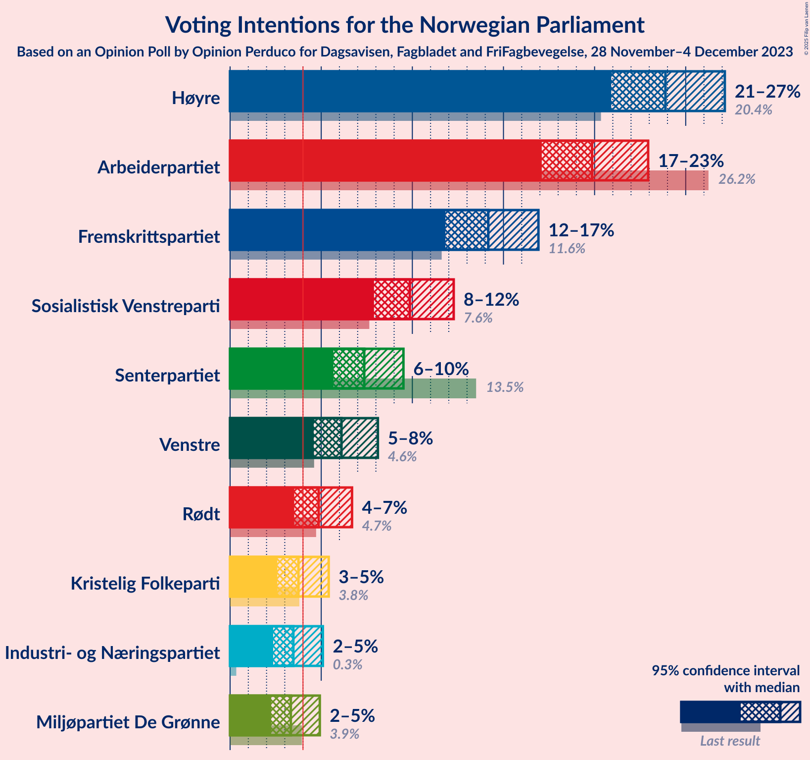

### Confidence Intervals

| Party | Last Result | Poll Result | 80% Confidence Interval | 90% Confidence Interval | 95% Confidence Interval | 99% Confidence Interval |
|:-----:|:-----------:|:-----------:|:-----------------------:|:-----------------------:|:-----------------------:|:-----------------------:|
| Høyre | 20.4% | 23.9% | 21.9–26.0% |21.4–26.6% |20.9–27.1% |20.0–28.2% |
| Arbeiderpartiet | 26.2% | 19.9% | 18.0–21.9% |17.5–22.4% |17.1–22.9% |16.3–23.9% |
| Fremskrittspartiet | 11.6% | 14.2% | 12.6–16.0% |12.2–16.5% |11.8–16.9% |11.1–17.8% |
| Sosialistisk Venstreparti | 7.6% | 9.9% | 8.6–11.4% |8.2–11.9% |7.9–12.3% |7.3–13.0% |
| Senterpartiet | 13.5% | 7.4% | 6.2–8.8% |5.9–9.2% |5.7–9.5% |5.2–10.2% |
| Venstre | 4.6% | 6.1% | 5.1–7.4% |4.8–7.8% |4.6–8.1% |4.1–8.8% |
| Rødt | 4.7% | 4.9% | 4.0–6.1% |3.7–6.4% |3.5–6.7% |3.1–7.3% |
| Kristelig Folkeparti | 3.8% | 3.8% | 3.0–4.8% |2.8–5.1% |2.6–5.4% |2.3–6.0% |
| Industri- og Næringspartiet | 0.3% | 3.5% | 2.7–4.5% |2.5–4.8% |2.4–5.1% |2.1–5.6% |
| Miljøpartiet De Grønne | 3.9% | 3.3% | 2.6–4.4% |2.4–4.7% |2.3–4.9% |2.0–5.5% |

*Note:* The poll result column reflects the actual value used in the calculations. Published results may vary slightly, and in addition be rounded to fewer digits.

## Seats

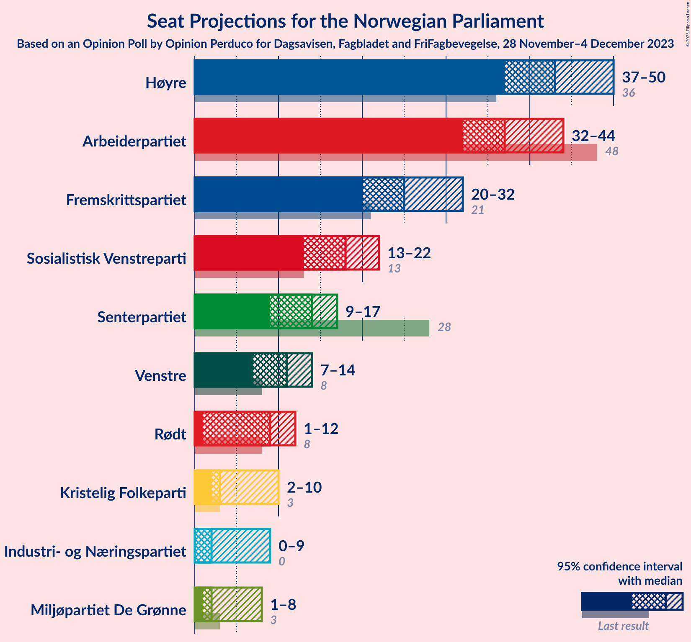

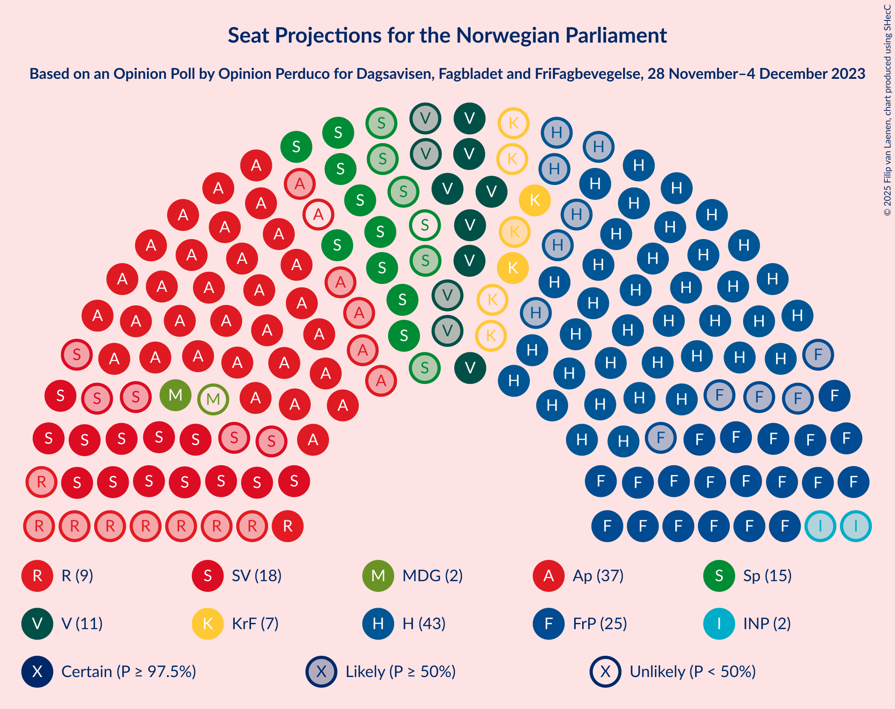

### Confidence Intervals

| Party | Last Result | Median | 80% Confidence Interval | 90% Confidence Interval | 95% Confidence Interval | 99% Confidence Interval |
|:-----:|:-----------:|:------:|:-----------------------:|:-----------------------:|:-----------------------:|:-----------------------:|
| <a href="#høyre">Høyre</a> | 36 | 43 | 39–47 |38–48 |37–50 |35–53 |
| <a href="#arbeiderpartiet">Arbeiderpartiet</a> | 48 | 37 | 34–42 |33–44 |32–44 |32–47 |
| <a href="#fremskrittspartiet">Fremskrittspartiet</a> | 21 | 25 | 22–29 |21–30 |20–32 |20–34 |
| <a href="#sosialistisk-venstreparti">Sosialistisk Venstreparti</a> | 13 | 18 | 14–20 |14–21 |13–22 |11–23 |
| <a href="#senterpartiet">Senterpartiet</a> | 28 | 14 | 11–15 |10–17 |9–17 |8–18 |
| <a href="#venstre">Venstre</a> | 8 | 11 | 9–14 |8–14 |7–14 |7–16 |
| <a href="#rødt">Rødt</a> | 8 | 9 | 1–10 |1–11 |1–12 |1–13 |
| <a href="#kristelig-folkeparti">Kristelig Folkeparti</a> | 3 | 3 | 2–8 |2–9 |2–10 |0–10 |
| <a href="#industri--og-næringspartiet">Industri- og Næringspartiet</a> | 0 | 2 | 1–8 |0–8 |0–9 |0–10 |
| <a href="#miljøpartiet-de-grønne">Miljøpartiet De Grønne</a> | 3 | 2 | 1–8 |1–8 |1–8 |1–9 |

### Høyre

*For a full overview of the results for this party, see the [Høyre](party-høyre.html) page.*

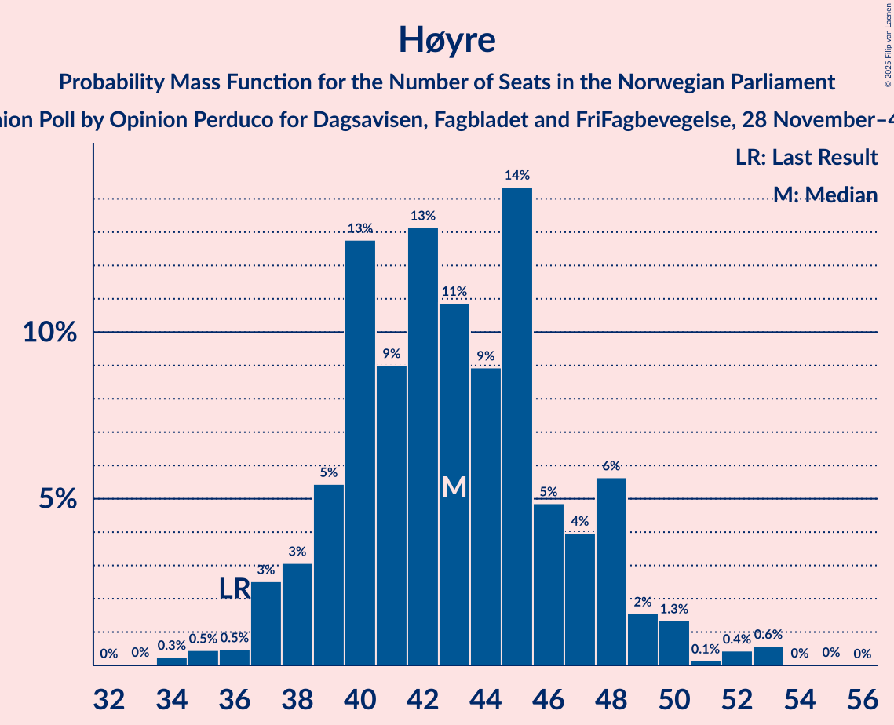

| Number of Seats | Probability | Accumulated | Special Marks |
|:---------------:|:-----------:|:-----------:|:-------------:|
| 33 | 0% | 100% |  |
| 34 | 0.3% | 99.9% |  |
| 35 | 0.5% | 99.7% |  |
| 36 | 0.5% | 99.2% | Last Result |
| 37 | 3% | 98.8% |  |
| 38 | 3% | 96% |  |
| 39 | 5% | 93% |  |
| 40 | 13% | 88% |  |
| 41 | 9% | 75% |  |
| 42 | 13% | 66% |  |
| 43 | 11% | 53% | Median |
| 44 | 9% | 42% |  |
| 45 | 14% | 33% |  |
| 46 | 5% | 19% |  |
| 47 | 4% | 14% |  |
| 48 | 6% | 10% |  |
| 49 | 2% | 4% |  |
| 50 | 1.3% | 3% |  |
| 51 | 0.1% | 1.2% |  |
| 52 | 0.4% | 1.1% |  |
| 53 | 0.6% | 0.7% |  |
| 54 | 0% | 0.1% |  |
| 55 | 0% | 0.1% |  |
| 56 | 0% | 0% |  |

### Arbeiderpartiet

*For a full overview of the results for this party, see the [Arbeiderpartiet](party-arbeiderpartiet.html) page.*

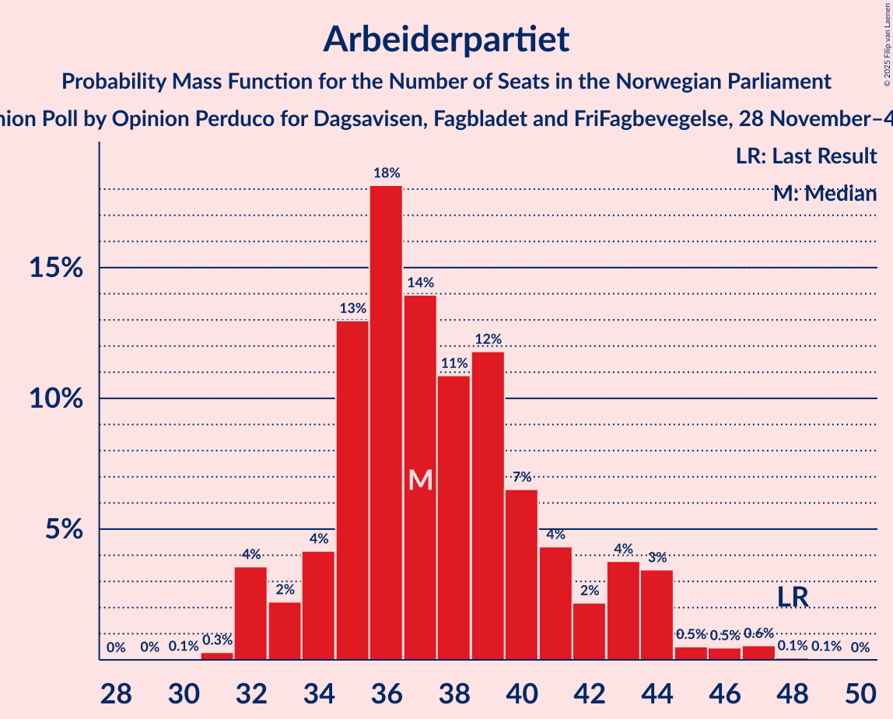

| Number of Seats | Probability | Accumulated | Special Marks |
|:---------------:|:-----------:|:-----------:|:-------------:|
| 30 | 0.1% | 100% |  |
| 31 | 0.3% | 99.9% |  |
| 32 | 4% | 99.6% |  |
| 33 | 2% | 96% |  |
| 34 | 4% | 94% |  |
| 35 | 13% | 90% |  |
| 36 | 18% | 77% |  |
| 37 | 14% | 59% | Median |
| 38 | 11% | 45% |  |
| 39 | 12% | 34% |  |
| 40 | 7% | 22% |  |
| 41 | 4% | 15% |  |
| 42 | 2% | 11% |  |
| 43 | 4% | 9% |  |
| 44 | 3% | 5% |  |
| 45 | 0.5% | 2% |  |
| 46 | 0.5% | 1.2% |  |
| 47 | 0.6% | 0.7% |  |
| 48 | 0.1% | 0.1% | Last Result |
| 49 | 0.1% | 0.1% |  |
| 50 | 0% | 0% |  |

### Fremskrittspartiet

*For a full overview of the results for this party, see the [Fremskrittspartiet](party-fremskrittspartiet.html) page.*

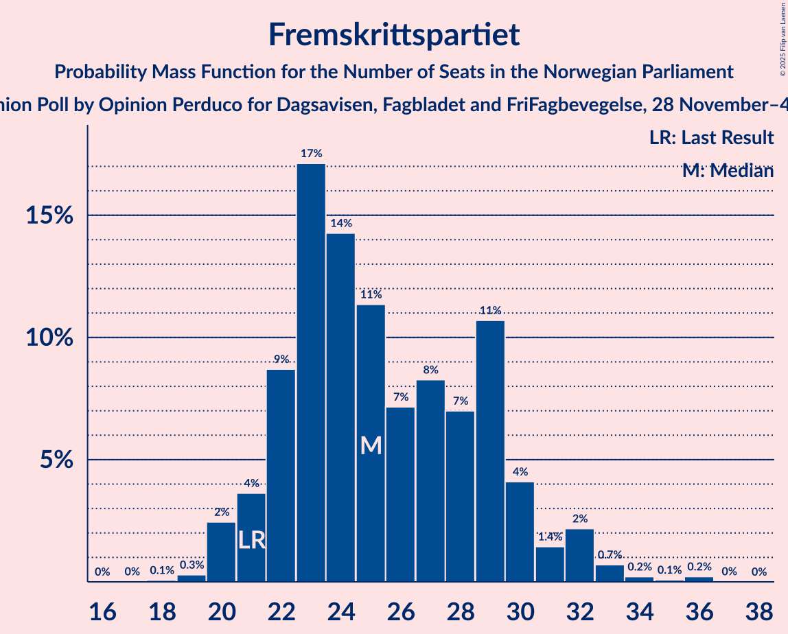

| Number of Seats | Probability | Accumulated | Special Marks |
|:---------------:|:-----------:|:-----------:|:-------------:|
| 18 | 0.1% | 100% |  |
| 19 | 0.3% | 99.9% |  |
| 20 | 2% | 99.6% |  |
| 21 | 4% | 97% | Last Result |
| 22 | 9% | 94% |  |
| 23 | 17% | 85% |  |
| 24 | 14% | 68% |  |
| 25 | 11% | 53% | Median |
| 26 | 7% | 42% |  |
| 27 | 8% | 35% |  |
| 28 | 7% | 27% |  |
| 29 | 11% | 20% |  |
| 30 | 4% | 9% |  |
| 31 | 1.4% | 5% |  |
| 32 | 2% | 3% |  |
| 33 | 0.7% | 1.2% |  |
| 34 | 0.2% | 0.5% |  |
| 35 | 0.1% | 0.3% |  |
| 36 | 0.2% | 0.2% |  |
| 37 | 0% | 0% |  |

### Sosialistisk Venstreparti

*For a full overview of the results for this party, see the [Sosialistisk Venstreparti](party-sosialistiskvenstreparti.html) page.*

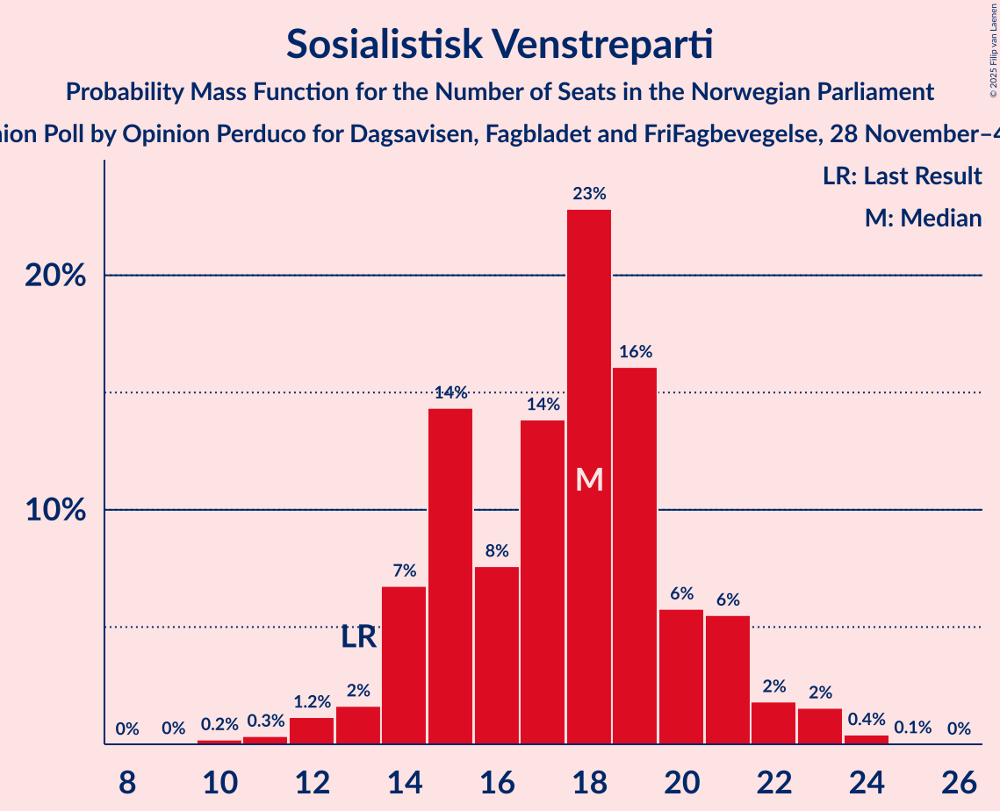

| Number of Seats | Probability | Accumulated | Special Marks |
|:---------------:|:-----------:|:-----------:|:-------------:|
| 10 | 0.2% | 100% |  |
| 11 | 0.3% | 99.8% |  |
| 12 | 1.2% | 99.4% |  |
| 13 | 2% | 98% | Last Result |
| 14 | 7% | 97% |  |
| 15 | 14% | 90% |  |
| 16 | 8% | 76% |  |
| 17 | 14% | 68% |  |
| 18 | 23% | 54% | Median |
| 19 | 16% | 31% |  |
| 20 | 6% | 15% |  |
| 21 | 6% | 9% |  |
| 22 | 2% | 4% |  |
| 23 | 2% | 2% |  |
| 24 | 0.4% | 0.5% |  |
| 25 | 0.1% | 0.1% |  |
| 26 | 0% | 0% |  |

### Senterpartiet

*For a full overview of the results for this party, see the [Senterpartiet](party-senterpartiet.html) page.*

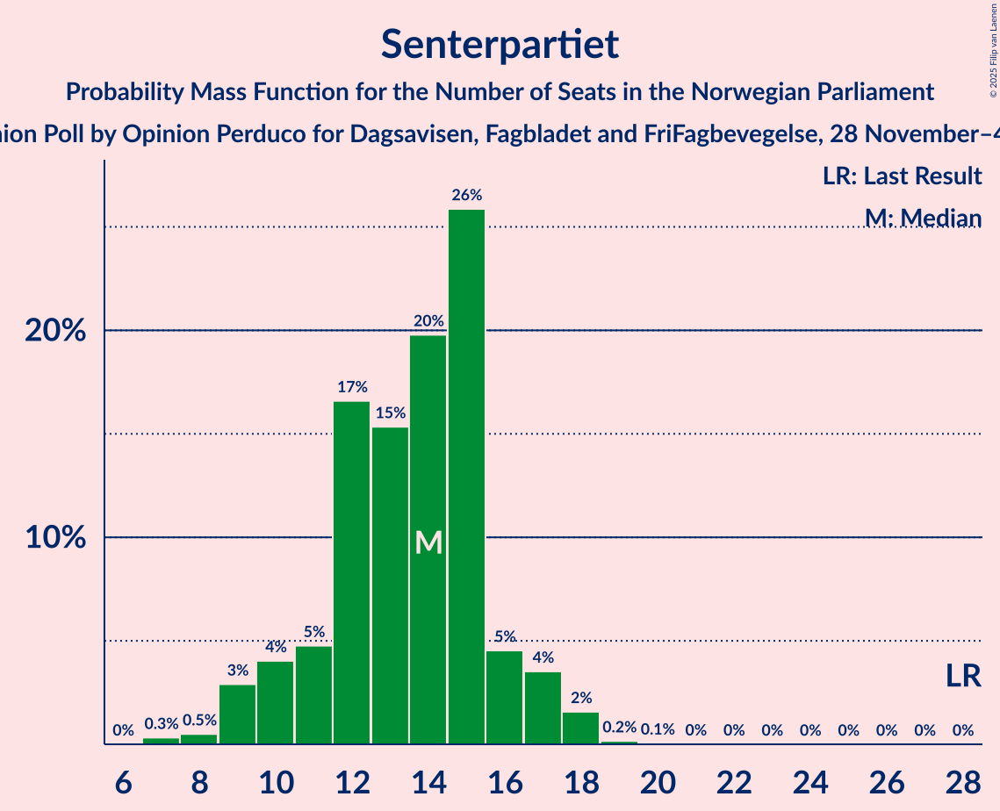

| Number of Seats | Probability | Accumulated | Special Marks |
|:---------------:|:-----------:|:-----------:|:-------------:|
| 7 | 0.3% | 100% |  |
| 8 | 0.5% | 99.7% |  |
| 9 | 3% | 99.2% |  |
| 10 | 4% | 96% |  |
| 11 | 5% | 92% |  |
| 12 | 17% | 87% |  |
| 13 | 15% | 71% |  |
| 14 | 20% | 56% | Median |
| 15 | 26% | 36% |  |
| 16 | 5% | 10% |  |
| 17 | 4% | 5% |  |
| 18 | 2% | 2% |  |
| 19 | 0.2% | 0.2% |  |
| 20 | 0.1% | 0.1% |  |
| 21 | 0% | 0% |  |
| 22 | 0% | 0% |  |
| 23 | 0% | 0% |  |
| 24 | 0% | 0% |  |
| 25 | 0% | 0% |  |
| 26 | 0% | 0% |  |
| 27 | 0% | 0% |  |
| 28 | 0% | 0% | Last Result |

### Venstre

*For a full overview of the results for this party, see the [Venstre](party-venstre.html) page.*

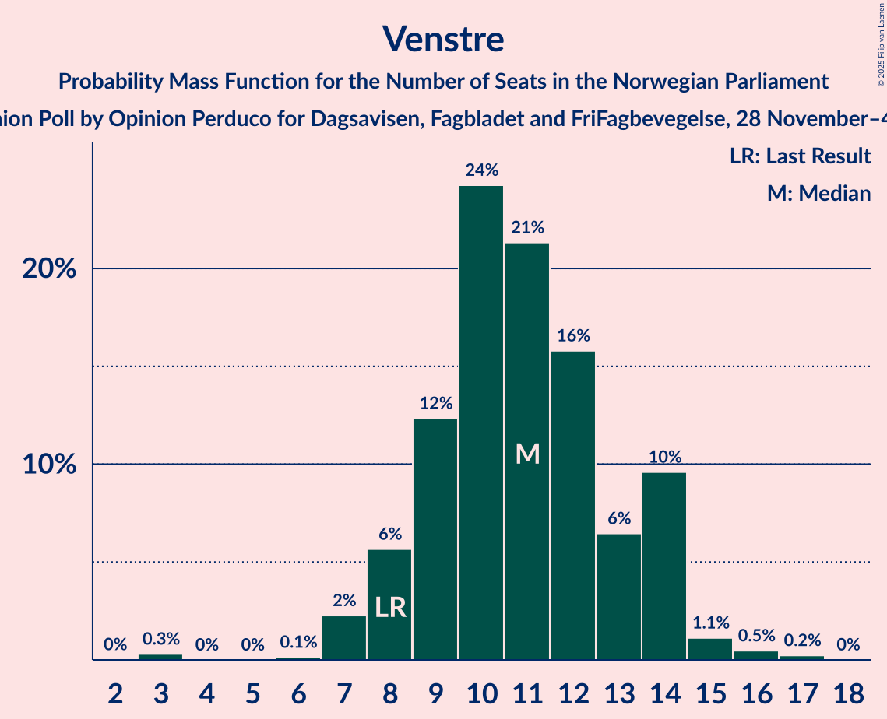

| Number of Seats | Probability | Accumulated | Special Marks |
|:---------------:|:-----------:|:-----------:|:-------------:|
| 3 | 0.3% | 100% |  |
| 4 | 0% | 99.7% |  |
| 5 | 0% | 99.7% |  |
| 6 | 0.1% | 99.7% |  |
| 7 | 2% | 99.5% |  |
| 8 | 6% | 97% | Last Result |
| 9 | 12% | 92% |  |
| 10 | 24% | 79% |  |
| 11 | 21% | 55% | Median |
| 12 | 16% | 34% |  |
| 13 | 6% | 18% |  |
| 14 | 10% | 11% |  |
| 15 | 1.1% | 2% |  |
| 16 | 0.5% | 0.7% |  |
| 17 | 0.2% | 0.2% |  |
| 18 | 0% | 0% |  |

### Rødt

*For a full overview of the results for this party, see the [Rødt](party-rødt.html) page.*

| Number of Seats | Probability | Accumulated | Special Marks |
|:---------------:|:-----------:|:-----------:|:-------------:|
| 1 | 12% | 100% |  |
| 2 | 0.1% | 88% |  |
| 3 | 0% | 88% |  |
| 4 | 0% | 88% |  |
| 5 | 0.1% | 88% |  |
| 6 | 0.7% | 88% |  |
| 7 | 11% | 87% |  |
| 8 | 23% | 76% | Last Result |
| 9 | 32% | 53% | Median |
| 10 | 13% | 21% |  |
| 11 | 4% | 8% |  |
| 12 | 3% | 3% |  |
| 13 | 0.6% | 0.8% |  |
| 14 | 0.1% | 0.1% |  |
| 15 | 0% | 0% |  |

### Kristelig Folkeparti

*For a full overview of the results for this party, see the [Kristelig Folkeparti](party-kristeligfolkeparti.html) page.*

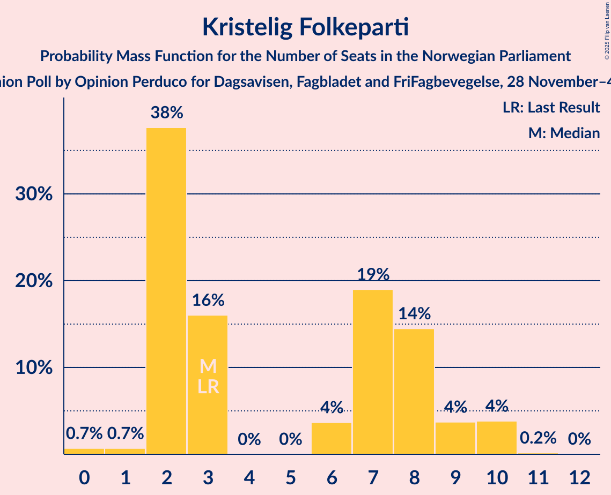

| Number of Seats | Probability | Accumulated | Special Marks |
|:---------------:|:-----------:|:-----------:|:-------------:|
| 0 | 0.7% | 100% |  |
| 1 | 0.7% | 99.3% |  |
| 2 | 38% | 98.6% |  |
| 3 | 16% | 61% | Last Result, Median |
| 4 | 0% | 45% |  |
| 5 | 0% | 45% |  |
| 6 | 4% | 45% |  |
| 7 | 19% | 41% |  |
| 8 | 14% | 22% |  |
| 9 | 4% | 8% |  |
| 10 | 4% | 4% |  |
| 11 | 0.2% | 0.2% |  |
| 12 | 0% | 0% |  |

### Industri- og Næringspartiet

*For a full overview of the results for this party, see the [Industri- og Næringspartiet](party-industri-ognæringspartiet.html) page.*

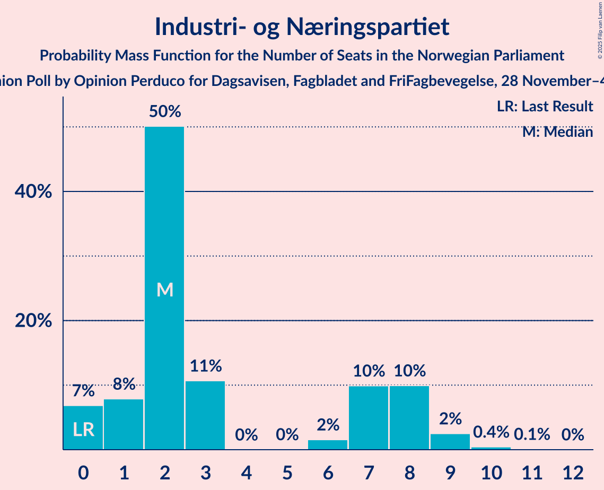

| Number of Seats | Probability | Accumulated | Special Marks |
|:---------------:|:-----------:|:-----------:|:-------------:|
| 0 | 7% | 100% | Last Result |
| 1 | 8% | 93% |  |
| 2 | 50% | 85% | Median |
| 3 | 11% | 35% |  |
| 4 | 0% | 24% |  |
| 5 | 0% | 24% |  |
| 6 | 2% | 24% |  |
| 7 | 10% | 23% |  |
| 8 | 10% | 13% |  |
| 9 | 2% | 3% |  |
| 10 | 0.4% | 0.6% |  |
| 11 | 0.1% | 0.1% |  |
| 12 | 0% | 0% |  |

### Miljøpartiet De Grønne

*For a full overview of the results for this party, see the [Miljøpartiet De Grønne](party-miljøpartietdegrønne.html) page.*

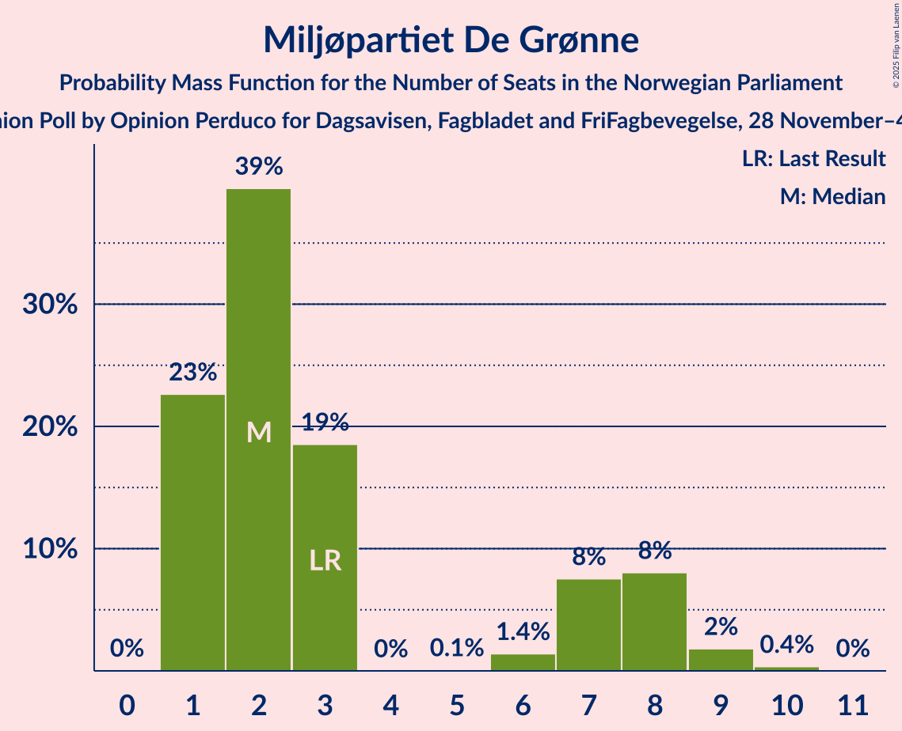

| Number of Seats | Probability | Accumulated | Special Marks |
|:---------------:|:-----------:|:-----------:|:-------------:|
| 1 | 23% | 100% |  |
| 2 | 39% | 77% | Median |
| 3 | 19% | 38% | Last Result |
| 4 | 0% | 19% |  |
| 5 | 0.1% | 19% |  |
| 6 | 1.4% | 19% |  |
| 7 | 8% | 18% |  |
| 8 | 8% | 10% |  |
| 9 | 2% | 2% |  |
| 10 | 0.4% | 0.4% |  |
| 11 | 0% | 0% |  |

## Coalitions

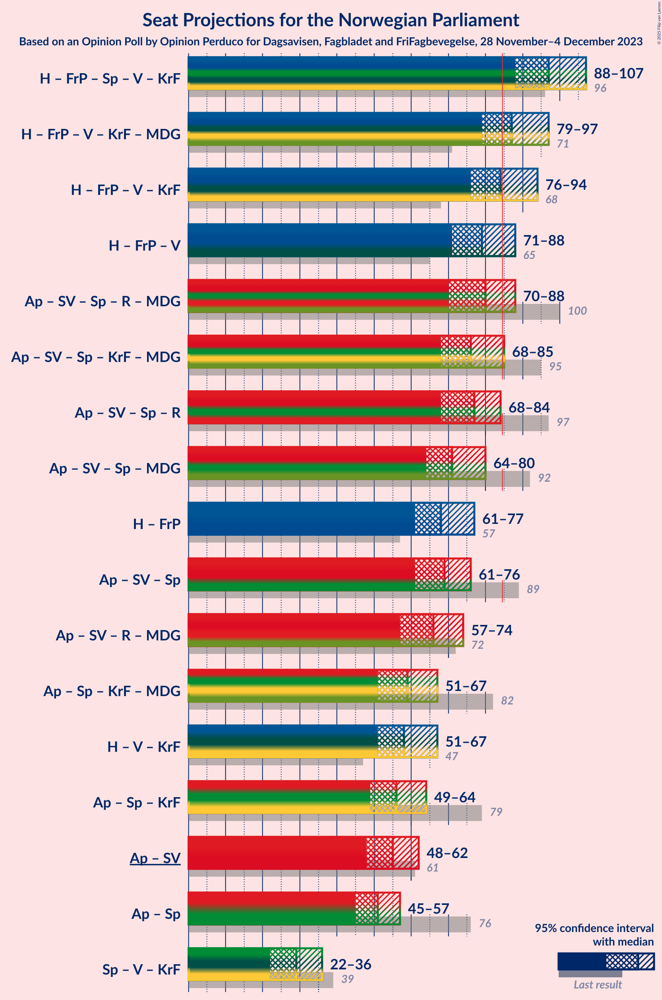

### Confidence Intervals

| Coalition | Last Result | Median | Majority? | 80% Confidence Interval | 90% Confidence Interval | 95% Confidence Interval | 99% Confidence Interval |
|:---------:|:-----------:|:------:|:---------:|:-----------------------:|:-----------------------:|:-----------------------:|:-----------------------:|
| Høyre – Fremskrittspartiet – Senterpartiet – Venstre – Kristelig Folkeparti | 96 | 97 | 99.8% | 92–104 | 90–105 | 88–107 | 85–110 |
| Høyre – Fremskrittspartiet – Venstre – Kristelig Folkeparti – Miljøpartiet De Grønne | 71 | 87 | 73% | 81–92 | 81–95 | 79–97 | 76–98 |
| Høyre – Fremskrittspartiet – Venstre – Kristelig Folkeparti | 68 | 84 | 43% | 79–89 | 77–92 | 76–94 | 72–96 |
| Høyre – Fremskrittspartiet – Venstre | 65 | 79 | 18% | 73–85 | 72–86 | 71–88 | 69–93 |
| Arbeiderpartiet – Sosialistisk Venstreparti – Senterpartiet – Rødt – Miljøpartiet De Grønne | 100 | 80 | 13% | 74–86 | 71–87 | 70–88 | 66–90 |
| Arbeiderpartiet – Sosialistisk Venstreparti – Senterpartiet – Kristelig Folkeparti – Miljøpartiet De Grønne | 95 | 76 | 4% | 71–82 | 69–83 | 68–85 | 66–87 |
| Arbeiderpartiet – Sosialistisk Venstreparti – Senterpartiet – Rødt | 97 | 77 | 2% | 71–81 | 69–83 | 68–84 | 65–87 |
| Arbeiderpartiet – Sosialistisk Venstreparti – Senterpartiet – Miljøpartiet De Grønne | 92 | 71 | 0.2% | 67–77 | 65–78 | 64–80 | 62–82 |
| Høyre – Fremskrittspartiet | 57 | 68 | 0% | 63–73 | 62–75 | 61–77 | 59–81 |
| Arbeiderpartiet – Sosialistisk Venstreparti – Senterpartiet | 89 | 69 | 0% | 64–73 | 62–74 | 61–76 | 59–78 |
| Arbeiderpartiet – Sosialistisk Venstreparti – Rødt – Miljøpartiet De Grønne | 72 | 66 | 0% | 61–71 | 59–73 | 57–74 | 53–77 |
| Arbeiderpartiet – Senterpartiet – Kristelig Folkeparti – Miljøpartiet De Grønne | 82 | 59 | 0% | 54–64 | 52–67 | 51–67 | 50–70 |
| Høyre – Venstre – Kristelig Folkeparti | 47 | 58 | 0% | 54–64 | 52–65 | 51–67 | 48–68 |
| Arbeiderpartiet – Senterpartiet – Kristelig Folkeparti | 79 | 56 | 0% | 50–61 | 49–62 | 49–64 | 46–65 |
| Arbeiderpartiet – Sosialistisk Venstreparti | 61 | 55 | 0% | 51–60 | 49–61 | 48–62 | 46–64 |
| Arbeiderpartiet – Senterpartiet | 76 | 51 | 0% | 47–56 | 47–56 | 45–57 | 43–60 |
| Senterpartiet – Venstre – Kristelig Folkeparti | 39 | 29 | 0% | 24–33 | 24–35 | 22–36 | 20–39 |

### Høyre – Fremskrittspartiet – Senterpartiet – Venstre – Kristelig Folkeparti

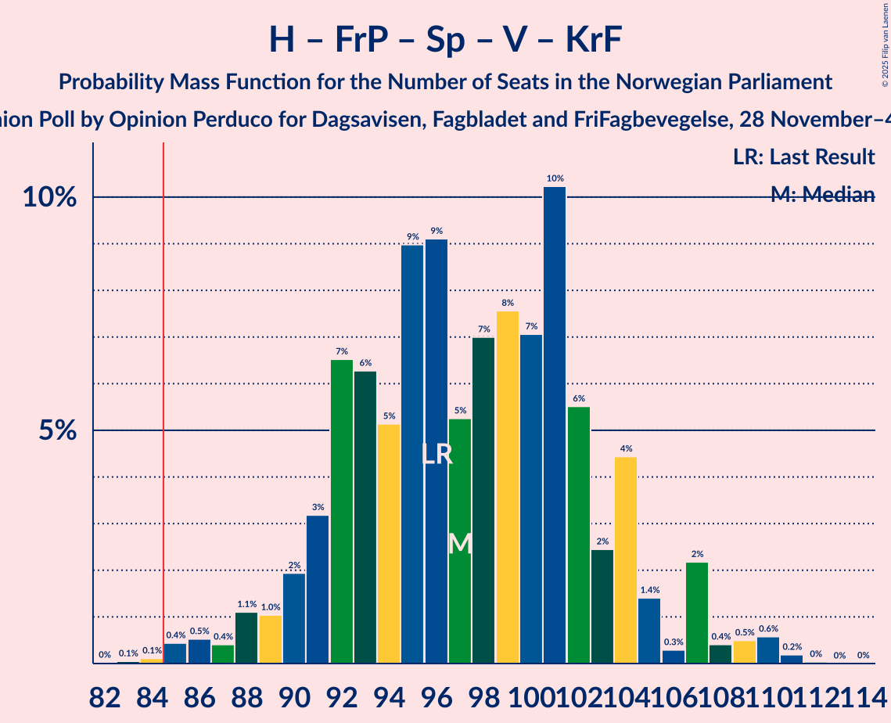

| Number of Seats | Probability | Accumulated | Special Marks |
|:---------------:|:-----------:|:-----------:|:-------------:|
| 83 | 0.1% | 100% |  |
| 84 | 0.1% | 99.9% |  |
| 85 | 0.4% | 99.8% | Majority |
| 86 | 0.5% | 99.4% |  |
| 87 | 0.4% | 98.8% |  |
| 88 | 1.1% | 98% |  |
| 89 | 1.0% | 97% |  |
| 90 | 2% | 96% |  |
| 91 | 3% | 94% |  |
| 92 | 7% | 91% |  |
| 93 | 6% | 85% |  |
| 94 | 5% | 78% |  |
| 95 | 9% | 73% |  |
| 96 | 9% | 64% | Last Result, Median |
| 97 | 5% | 55% |  |
| 98 | 7% | 50% |  |
| 99 | 8% | 43% |  |
| 100 | 7% | 35% |  |
| 101 | 10% | 28% |  |
| 102 | 6% | 18% |  |
| 103 | 2% | 12% |  |
| 104 | 4% | 10% |  |
| 105 | 1.4% | 6% |  |
| 106 | 0.3% | 4% |  |
| 107 | 2% | 4% |  |
| 108 | 0.4% | 2% |  |
| 109 | 0.5% | 1.3% |  |
| 110 | 0.6% | 0.8% |  |
| 111 | 0.2% | 0.2% |  |
| 112 | 0% | 0.1% |  |
| 113 | 0% | 0% |  |

### Høyre – Fremskrittspartiet – Venstre – Kristelig Folkeparti – Miljøpartiet De Grønne

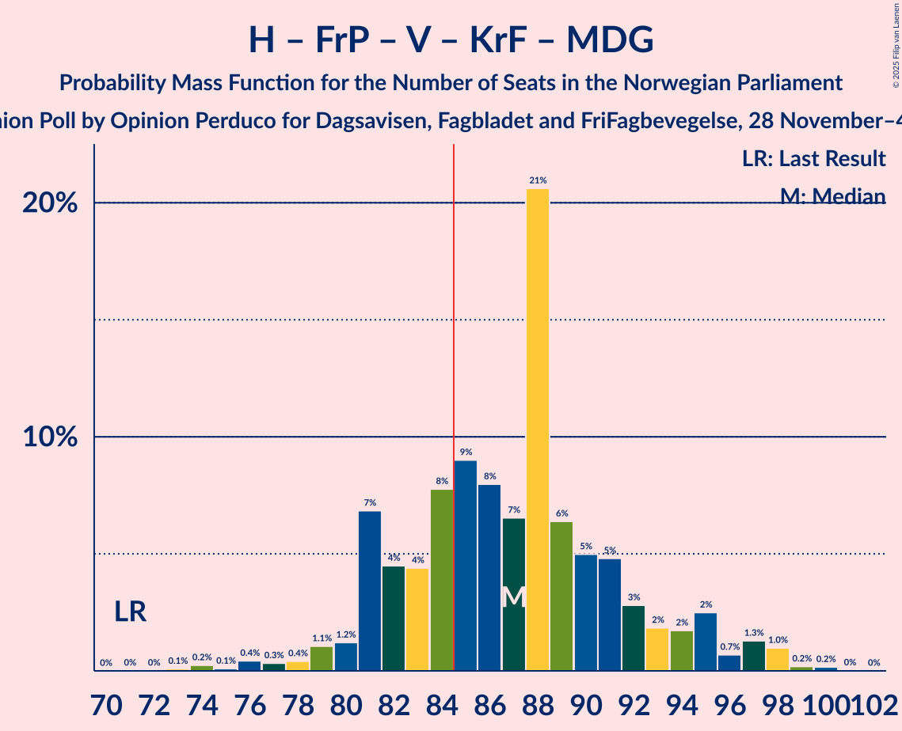

| Number of Seats | Probability | Accumulated | Special Marks |
|:---------------:|:-----------:|:-----------:|:-------------:|
| 71 | 0% | 100% | Last Result |
| 72 | 0% | 100% |  |
| 73 | 0.1% | 100% |  |
| 74 | 0.2% | 99.9% |  |
| 75 | 0.1% | 99.6% |  |
| 76 | 0.4% | 99.5% |  |
| 77 | 0.3% | 99.1% |  |
| 78 | 0.4% | 98.8% |  |
| 79 | 1.1% | 98% |  |
| 80 | 1.2% | 97% |  |
| 81 | 7% | 96% |  |
| 82 | 4% | 89% |  |
| 83 | 4% | 85% |  |
| 84 | 8% | 80% | Median |
| 85 | 9% | 73% | Majority |
| 86 | 8% | 64% |  |
| 87 | 7% | 56% |  |
| 88 | 21% | 49% |  |
| 89 | 6% | 28% |  |
| 90 | 5% | 22% |  |
| 91 | 5% | 17% |  |
| 92 | 3% | 12% |  |
| 93 | 2% | 9% |  |
| 94 | 2% | 8% |  |
| 95 | 2% | 6% |  |
| 96 | 0.7% | 3% |  |
| 97 | 1.3% | 3% |  |
| 98 | 1.0% | 1.4% |  |
| 99 | 0.2% | 0.4% |  |
| 100 | 0.2% | 0.2% |  |
| 101 | 0% | 0.1% |  |
| 102 | 0% | 0% |  |

### Høyre – Fremskrittspartiet – Venstre – Kristelig Folkeparti

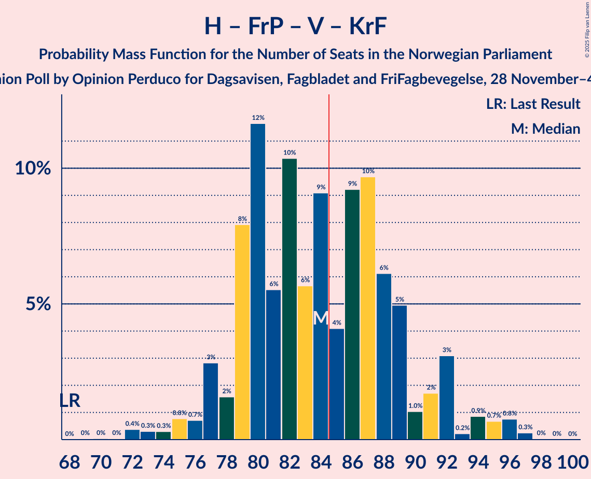

| Number of Seats | Probability | Accumulated | Special Marks |
|:---------------:|:-----------:|:-----------:|:-------------:|
| 68 | 0% | 100% | Last Result |
| 69 | 0% | 100% |  |
| 70 | 0% | 100% |  |
| 71 | 0% | 99.9% |  |
| 72 | 0.4% | 99.9% |  |
| 73 | 0.3% | 99.5% |  |
| 74 | 0.3% | 99.2% |  |
| 75 | 0.8% | 98.9% |  |
| 76 | 0.7% | 98% |  |
| 77 | 3% | 97% |  |
| 78 | 2% | 95% |  |
| 79 | 8% | 93% |  |
| 80 | 12% | 85% |  |
| 81 | 6% | 73% |  |
| 82 | 10% | 68% | Median |
| 83 | 6% | 58% |  |
| 84 | 9% | 52% |  |
| 85 | 4% | 43% | Majority |
| 86 | 9% | 39% |  |
| 87 | 10% | 29% |  |
| 88 | 6% | 20% |  |
| 89 | 5% | 14% |  |
| 90 | 1.0% | 9% |  |
| 91 | 2% | 8% |  |
| 92 | 3% | 6% |  |
| 93 | 0.2% | 3% |  |
| 94 | 0.9% | 3% |  |
| 95 | 0.7% | 2% |  |
| 96 | 0.8% | 1.1% |  |
| 97 | 0.3% | 0.3% |  |
| 98 | 0% | 0.1% |  |
| 99 | 0% | 0% |  |

### Høyre – Fremskrittspartiet – Venstre

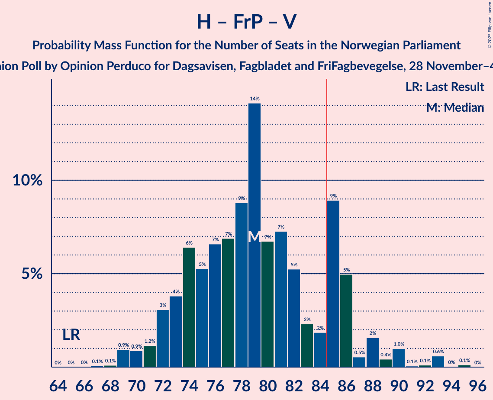

| Number of Seats | Probability | Accumulated | Special Marks |
|:---------------:|:-----------:|:-----------:|:-------------:|
| 65 | 0% | 100% | Last Result |
| 66 | 0% | 100% |  |
| 67 | 0.1% | 100% |  |
| 68 | 0.1% | 99.9% |  |
| 69 | 0.9% | 99.8% |  |
| 70 | 0.9% | 98.8% |  |
| 71 | 1.2% | 98% |  |
| 72 | 3% | 97% |  |
| 73 | 4% | 94% |  |
| 74 | 6% | 90% |  |
| 75 | 5% | 84% |  |
| 76 | 7% | 78% |  |
| 77 | 7% | 72% |  |
| 78 | 9% | 65% |  |
| 79 | 14% | 56% | Median |
| 80 | 7% | 42% |  |
| 81 | 7% | 35% |  |
| 82 | 5% | 28% |  |
| 83 | 2% | 23% |  |
| 84 | 2% | 20% |  |
| 85 | 9% | 18% | Majority |
| 86 | 5% | 9% |  |
| 87 | 0.5% | 4% |  |
| 88 | 2% | 4% |  |
| 89 | 0.4% | 2% |  |
| 90 | 1.0% | 2% |  |
| 91 | 0.1% | 0.9% |  |
| 92 | 0.1% | 0.9% |  |
| 93 | 0.6% | 0.8% |  |
| 94 | 0% | 0.2% |  |
| 95 | 0.1% | 0.1% |  |
| 96 | 0% | 0% |  |

### Arbeiderpartiet – Sosialistisk Venstreparti – Senterpartiet – Rødt – Miljøpartiet De Grønne

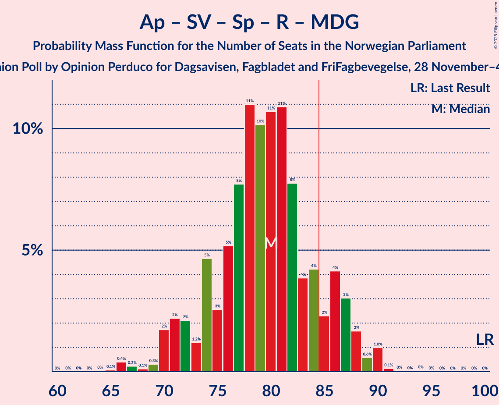

| Number of Seats | Probability | Accumulated | Special Marks |
|:---------------:|:-----------:|:-----------:|:-------------:|
| 65 | 0.1% | 100% |  |
| 66 | 0.4% | 99.9% |  |
| 67 | 0.2% | 99.5% |  |
| 68 | 0.1% | 99.3% |  |
| 69 | 0.3% | 99.1% |  |
| 70 | 2% | 98.8% |  |
| 71 | 2% | 97% |  |
| 72 | 2% | 95% |  |
| 73 | 1.2% | 93% |  |
| 74 | 5% | 92% |  |
| 75 | 3% | 87% |  |
| 76 | 5% | 84% |  |
| 77 | 8% | 79% |  |
| 78 | 11% | 72% |  |
| 79 | 10% | 61% |  |
| 80 | 11% | 50% | Median |
| 81 | 11% | 40% |  |
| 82 | 8% | 29% |  |
| 83 | 4% | 21% |  |
| 84 | 4% | 17% |  |
| 85 | 2% | 13% | Majority |
| 86 | 4% | 11% |  |
| 87 | 3% | 6% |  |
| 88 | 2% | 3% |  |
| 89 | 0.6% | 2% |  |
| 90 | 1.0% | 1.2% |  |
| 91 | 0.1% | 0.2% |  |
| 92 | 0% | 0.1% |  |
| 93 | 0% | 0.1% |  |
| 94 | 0% | 0.1% |  |
| 95 | 0% | 0% |  |
| 96 | 0% | 0% |  |
| 97 | 0% | 0% |  |
| 98 | 0% | 0% |  |
| 99 | 0% | 0% |  |
| 100 | 0% | 0% | Last Result |

### Arbeiderpartiet – Sosialistisk Venstreparti – Senterpartiet – Kristelig Folkeparti – Miljøpartiet De Grønne

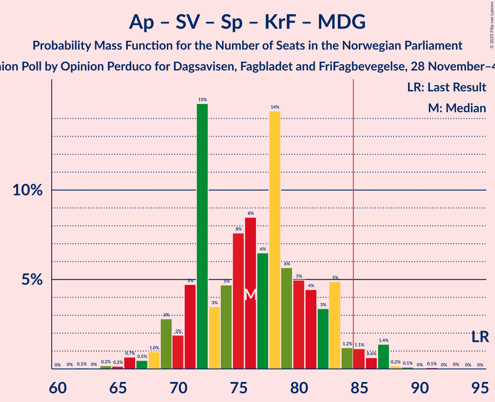

| Number of Seats | Probability | Accumulated | Special Marks |
|:---------------:|:-----------:|:-----------:|:-------------:|
| 62 | 0.1% | 100% |  |
| 63 | 0% | 99.9% |  |
| 64 | 0.2% | 99.9% |  |
| 65 | 0.2% | 99.7% |  |
| 66 | 0.7% | 99.5% |  |
| 67 | 0.5% | 98.9% |  |
| 68 | 1.0% | 98% |  |
| 69 | 3% | 97% |  |
| 70 | 2% | 95% |  |
| 71 | 5% | 93% |  |
| 72 | 15% | 88% |  |
| 73 | 3% | 73% |  |
| 74 | 5% | 70% | Median |
| 75 | 8% | 65% |  |
| 76 | 8% | 57% |  |
| 77 | 6% | 49% |  |
| 78 | 14% | 42% |  |
| 79 | 6% | 28% |  |
| 80 | 5% | 22% |  |
| 81 | 4% | 17% |  |
| 82 | 3% | 13% |  |
| 83 | 5% | 10% |  |
| 84 | 1.2% | 5% |  |
| 85 | 1.1% | 4% | Majority |
| 86 | 0.6% | 2% |  |
| 87 | 1.4% | 2% |  |
| 88 | 0.2% | 0.4% |  |
| 89 | 0.1% | 0.2% |  |
| 90 | 0% | 0.1% |  |
| 91 | 0.1% | 0.1% |  |
| 92 | 0% | 0% |  |
| 93 | 0% | 0% |  |
| 94 | 0% | 0% |  |
| 95 | 0% | 0% | Last Result |

### Arbeiderpartiet – Sosialistisk Venstreparti – Senterpartiet – Rødt

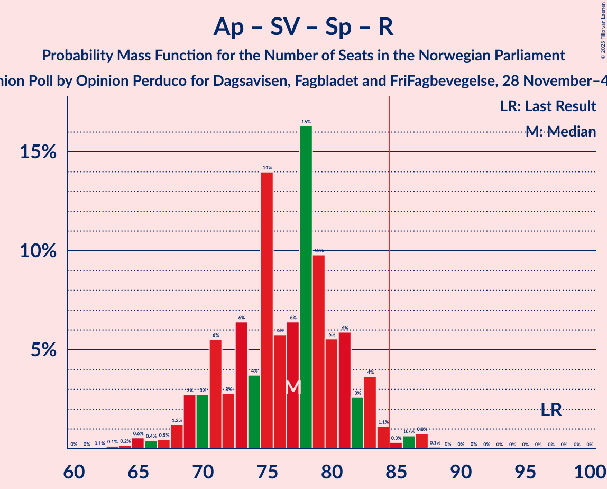

| Number of Seats | Probability | Accumulated | Special Marks |
|:---------------:|:-----------:|:-----------:|:-------------:|
| 62 | 0.1% | 100% |  |
| 63 | 0.1% | 99.9% |  |
| 64 | 0.2% | 99.8% |  |
| 65 | 0.6% | 99.6% |  |
| 66 | 0.4% | 99.0% |  |
| 67 | 0.5% | 98.6% |  |
| 68 | 1.2% | 98% |  |
| 69 | 3% | 97% |  |
| 70 | 3% | 94% |  |
| 71 | 6% | 91% |  |
| 72 | 3% | 86% |  |
| 73 | 6% | 83% |  |
| 74 | 4% | 77% |  |
| 75 | 14% | 73% |  |
| 76 | 6% | 59% |  |
| 77 | 6% | 53% |  |
| 78 | 16% | 47% | Median |
| 79 | 10% | 31% |  |
| 80 | 6% | 21% |  |
| 81 | 6% | 15% |  |
| 82 | 3% | 9% |  |
| 83 | 4% | 7% |  |
| 84 | 1.1% | 3% |  |
| 85 | 0.3% | 2% | Majority |
| 86 | 0.7% | 2% |  |
| 87 | 0.8% | 0.9% |  |
| 88 | 0.1% | 0.2% |  |
| 89 | 0% | 0.1% |  |
| 90 | 0% | 0% |  |
| 91 | 0% | 0% |  |
| 92 | 0% | 0% |  |
| 93 | 0% | 0% |  |
| 94 | 0% | 0% |  |
| 95 | 0% | 0% |  |
| 96 | 0% | 0% |  |
| 97 | 0% | 0% | Last Result |

### Arbeiderpartiet – Sosialistisk Venstreparti – Senterpartiet – Miljøpartiet De Grønne

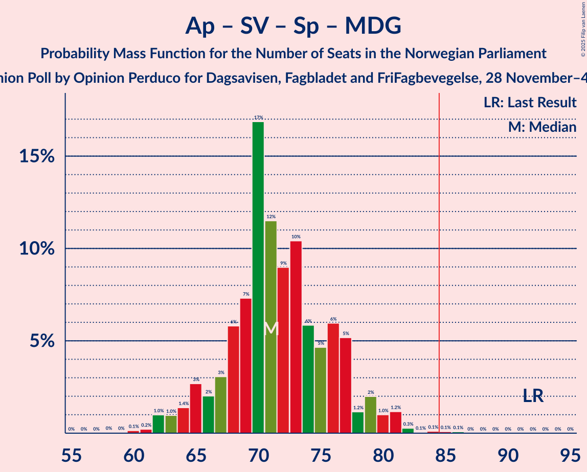

| Number of Seats | Probability | Accumulated | Special Marks |
|:---------------:|:-----------:|:-----------:|:-------------:|
| 58 | 0% | 100% |  |
| 59 | 0% | 99.9% |  |
| 60 | 0.1% | 99.9% |  |
| 61 | 0.2% | 99.8% |  |
| 62 | 1.0% | 99.5% |  |
| 63 | 1.0% | 98.6% |  |
| 64 | 1.4% | 98% |  |
| 65 | 3% | 96% |  |
| 66 | 2% | 94% |  |
| 67 | 3% | 92% |  |
| 68 | 6% | 88% |  |
| 69 | 7% | 83% |  |
| 70 | 17% | 75% |  |
| 71 | 12% | 58% | Median |
| 72 | 9% | 47% |  |
| 73 | 10% | 38% |  |
| 74 | 6% | 28% |  |
| 75 | 5% | 22% |  |
| 76 | 6% | 17% |  |
| 77 | 5% | 11% |  |
| 78 | 1.2% | 6% |  |
| 79 | 2% | 5% |  |
| 80 | 1.0% | 3% |  |
| 81 | 1.2% | 2% |  |
| 82 | 0.3% | 0.6% |  |
| 83 | 0.1% | 0.3% |  |
| 84 | 0.1% | 0.3% |  |
| 85 | 0.1% | 0.2% | Majority |
| 86 | 0.1% | 0.1% |  |
| 87 | 0% | 0% |  |
| 88 | 0% | 0% |  |
| 89 | 0% | 0% |  |
| 90 | 0% | 0% |  |
| 91 | 0% | 0% |  |
| 92 | 0% | 0% | Last Result |

### Høyre – Fremskrittspartiet

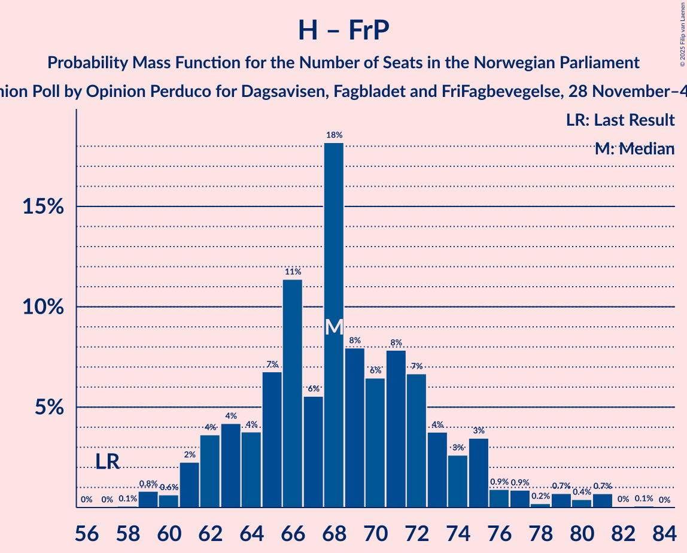

| Number of Seats | Probability | Accumulated | Special Marks |
|:---------------:|:-----------:|:-----------:|:-------------:|
| 57 | 0% | 100% | Last Result |
| 58 | 0.1% | 99.9% |  |
| 59 | 0.8% | 99.9% |  |
| 60 | 0.6% | 99.1% |  |
| 61 | 2% | 98% |  |
| 62 | 4% | 96% |  |
| 63 | 4% | 93% |  |
| 64 | 4% | 88% |  |
| 65 | 7% | 85% |  |
| 66 | 11% | 78% |  |
| 67 | 6% | 66% |  |
| 68 | 18% | 61% | Median |
| 69 | 8% | 43% |  |
| 70 | 6% | 35% |  |
| 71 | 8% | 28% |  |
| 72 | 7% | 20% |  |
| 73 | 4% | 14% |  |
| 74 | 3% | 10% |  |
| 75 | 3% | 7% |  |
| 76 | 0.9% | 4% |  |
| 77 | 0.9% | 3% |  |
| 78 | 0.2% | 2% |  |
| 79 | 0.7% | 2% |  |
| 80 | 0.4% | 1.2% |  |
| 81 | 0.7% | 0.8% |  |
| 82 | 0% | 0.1% |  |
| 83 | 0.1% | 0.1% |  |
| 84 | 0% | 0% |  |

### Arbeiderpartiet – Sosialistisk Venstreparti – Senterpartiet

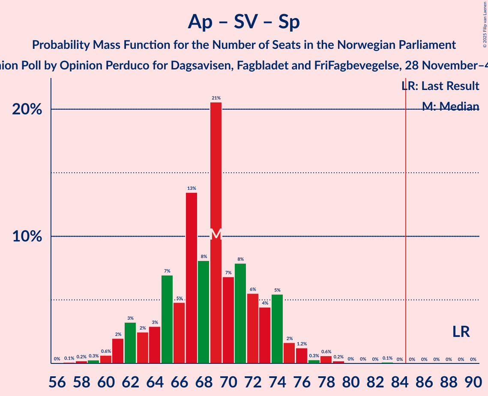

| Number of Seats | Probability | Accumulated | Special Marks |
|:---------------:|:-----------:|:-----------:|:-------------:|
| 56 | 0% | 100% |  |
| 57 | 0.1% | 99.9% |  |
| 58 | 0.2% | 99.8% |  |
| 59 | 0.3% | 99.6% |  |
| 60 | 0.6% | 99.4% |  |
| 61 | 2% | 98.7% |  |
| 62 | 3% | 97% |  |
| 63 | 2% | 94% |  |
| 64 | 3% | 91% |  |
| 65 | 7% | 88% |  |
| 66 | 5% | 81% |  |
| 67 | 13% | 76% |  |
| 68 | 8% | 63% |  |
| 69 | 21% | 55% | Median |
| 70 | 7% | 34% |  |
| 71 | 8% | 27% |  |
| 72 | 6% | 20% |  |
| 73 | 4% | 14% |  |
| 74 | 5% | 10% |  |
| 75 | 2% | 4% |  |
| 76 | 1.2% | 3% |  |
| 77 | 0.3% | 1.3% |  |
| 78 | 0.6% | 1.0% |  |
| 79 | 0.2% | 0.4% |  |
| 80 | 0% | 0.2% |  |
| 81 | 0% | 0.1% |  |
| 82 | 0% | 0.1% |  |
| 83 | 0.1% | 0.1% |  |
| 84 | 0% | 0% |  |
| 85 | 0% | 0% | Majority |
| 86 | 0% | 0% |  |
| 87 | 0% | 0% |  |
| 88 | 0% | 0% |  |
| 89 | 0% | 0% | Last Result |

### Arbeiderpartiet – Sosialistisk Venstreparti – Rødt – Miljøpartiet De Grønne

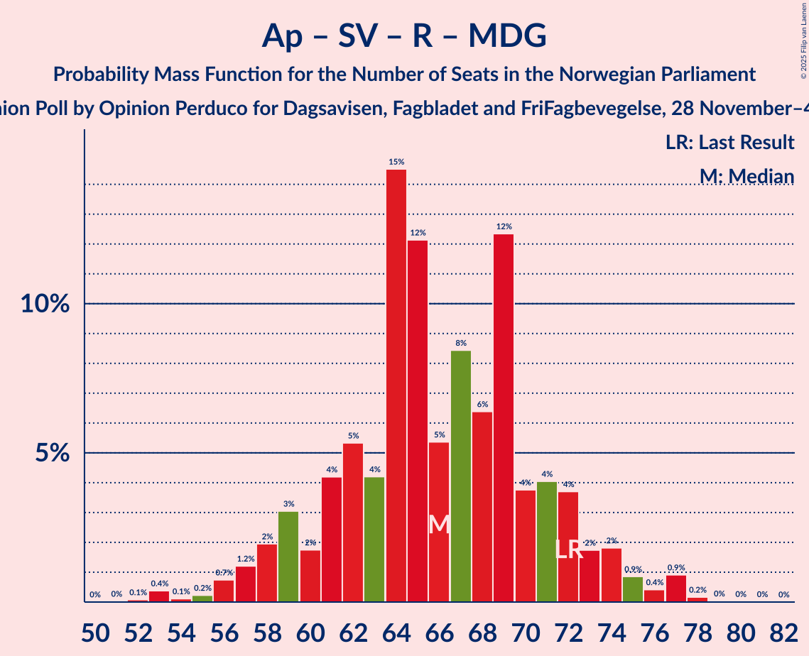

| Number of Seats | Probability | Accumulated | Special Marks |
|:---------------:|:-----------:|:-----------:|:-------------:|
| 52 | 0.1% | 100% |  |
| 53 | 0.4% | 99.9% |  |
| 54 | 0.1% | 99.5% |  |
| 55 | 0.2% | 99.4% |  |
| 56 | 0.7% | 99.2% |  |
| 57 | 1.2% | 98% |  |
| 58 | 2% | 97% |  |
| 59 | 3% | 95% |  |
| 60 | 2% | 92% |  |
| 61 | 4% | 90% |  |
| 62 | 5% | 86% |  |
| 63 | 4% | 81% |  |
| 64 | 15% | 77% |  |
| 65 | 12% | 62% |  |
| 66 | 5% | 50% | Median |
| 67 | 8% | 45% |  |
| 68 | 6% | 36% |  |
| 69 | 12% | 30% |  |
| 70 | 4% | 18% |  |
| 71 | 4% | 14% |  |
| 72 | 4% | 10% | Last Result |
| 73 | 2% | 6% |  |
| 74 | 2% | 4% |  |
| 75 | 0.9% | 2% |  |
| 76 | 0.4% | 2% |  |
| 77 | 0.9% | 1.2% |  |
| 78 | 0.2% | 0.3% |  |
| 79 | 0% | 0.1% |  |
| 80 | 0% | 0.1% |  |
| 81 | 0% | 0% |  |

### Arbeiderpartiet – Senterpartiet – Kristelig Folkeparti – Miljøpartiet De Grønne

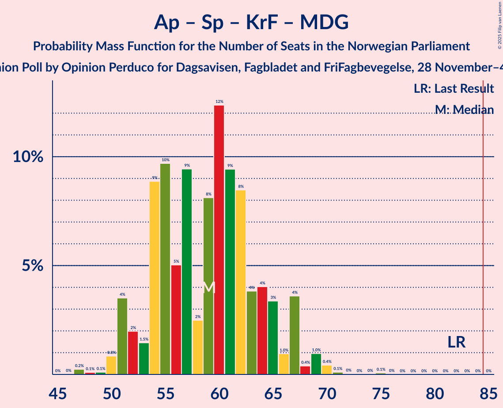

| Number of Seats | Probability | Accumulated | Special Marks |
|:---------------:|:-----------:|:-----------:|:-------------:|
| 47 | 0.2% | 100% |  |
| 48 | 0.1% | 99.7% |  |
| 49 | 0.1% | 99.6% |  |
| 50 | 0.8% | 99.5% |  |
| 51 | 4% | 98.7% |  |
| 52 | 2% | 95% |  |
| 53 | 1.5% | 93% |  |
| 54 | 9% | 92% |  |
| 55 | 10% | 83% |  |
| 56 | 5% | 73% | Median |
| 57 | 9% | 68% |  |
| 58 | 2% | 59% |  |
| 59 | 8% | 56% |  |
| 60 | 12% | 48% |  |
| 61 | 9% | 36% |  |
| 62 | 8% | 26% |  |
| 63 | 4% | 18% |  |
| 64 | 4% | 14% |  |
| 65 | 3% | 10% |  |
| 66 | 1.0% | 7% |  |
| 67 | 4% | 6% |  |
| 68 | 0.4% | 2% |  |
| 69 | 1.0% | 2% |  |
| 70 | 0.4% | 0.7% |  |
| 71 | 0.1% | 0.2% |  |
| 72 | 0% | 0.1% |  |
| 73 | 0% | 0.1% |  |
| 74 | 0% | 0.1% |  |
| 75 | 0.1% | 0.1% |  |
| 76 | 0% | 0% |  |
| 77 | 0% | 0% |  |
| 78 | 0% | 0% |  |
| 79 | 0% | 0% |  |
| 80 | 0% | 0% |  |
| 81 | 0% | 0% |  |
| 82 | 0% | 0% | Last Result |

### Høyre – Venstre – Kristelig Folkeparti

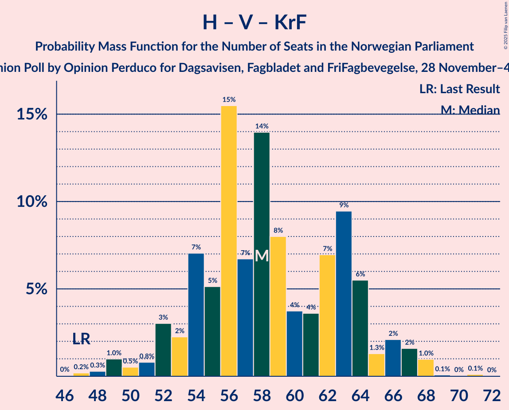

| Number of Seats | Probability | Accumulated | Special Marks |
|:---------------:|:-----------:|:-----------:|:-------------:|
| 46 | 0% | 100% |  |
| 47 | 0.2% | 99.9% | Last Result |
| 48 | 0.3% | 99.7% |  |
| 49 | 1.0% | 99.4% |  |
| 50 | 0.5% | 98% |  |
| 51 | 0.8% | 98% |  |
| 52 | 3% | 97% |  |
| 53 | 2% | 94% |  |
| 54 | 7% | 92% |  |
| 55 | 5% | 85% |  |
| 56 | 15% | 80% |  |
| 57 | 7% | 64% | Median |
| 58 | 14% | 57% |  |
| 59 | 8% | 43% |  |
| 60 | 4% | 35% |  |
| 61 | 4% | 32% |  |
| 62 | 7% | 28% |  |
| 63 | 9% | 21% |  |
| 64 | 6% | 12% |  |
| 65 | 1.3% | 6% |  |
| 66 | 2% | 5% |  |
| 67 | 2% | 3% |  |
| 68 | 1.0% | 1.2% |  |
| 69 | 0.1% | 0.3% |  |
| 70 | 0% | 0.2% |  |
| 71 | 0.1% | 0.1% |  |
| 72 | 0% | 0% |  |

### Arbeiderpartiet – Senterpartiet – Kristelig Folkeparti

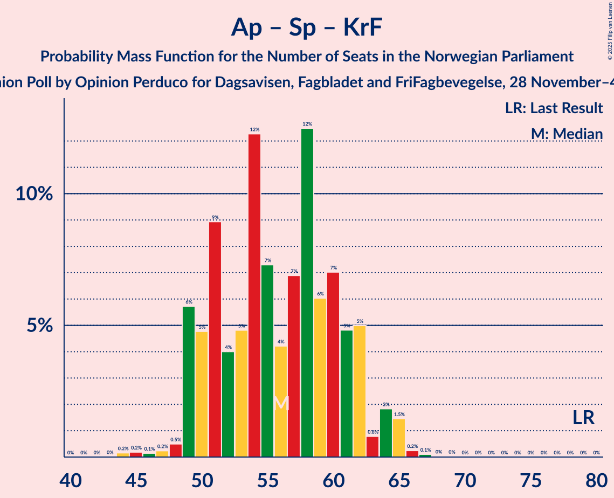

| Number of Seats | Probability | Accumulated | Special Marks |
|:---------------:|:-----------:|:-----------:|:-------------:|
| 44 | 0.2% | 100% |  |
| 45 | 0.2% | 99.8% |  |
| 46 | 0.1% | 99.6% |  |
| 47 | 0.2% | 99.5% |  |
| 48 | 0.5% | 99.3% |  |
| 49 | 6% | 98.8% |  |
| 50 | 5% | 93% |  |
| 51 | 9% | 88% |  |
| 52 | 4% | 79% |  |
| 53 | 5% | 75% |  |
| 54 | 12% | 71% | Median |
| 55 | 7% | 58% |  |
| 56 | 4% | 51% |  |
| 57 | 7% | 47% |  |
| 58 | 12% | 40% |  |
| 59 | 6% | 27% |  |
| 60 | 7% | 21% |  |
| 61 | 5% | 14% |  |
| 62 | 5% | 9% |  |
| 63 | 0.8% | 4% |  |
| 64 | 2% | 4% |  |
| 65 | 1.5% | 2% |  |
| 66 | 0.2% | 0.4% |  |
| 67 | 0.1% | 0.2% |  |
| 68 | 0% | 0.1% |  |
| 69 | 0% | 0% |  |
| 70 | 0% | 0% |  |
| 71 | 0% | 0% |  |
| 72 | 0% | 0% |  |
| 73 | 0% | 0% |  |
| 74 | 0% | 0% |  |
| 75 | 0% | 0% |  |
| 76 | 0% | 0% |  |
| 77 | 0% | 0% |  |
| 78 | 0% | 0% |  |
| 79 | 0% | 0% | Last Result |

### Arbeiderpartiet – Sosialistisk Venstreparti

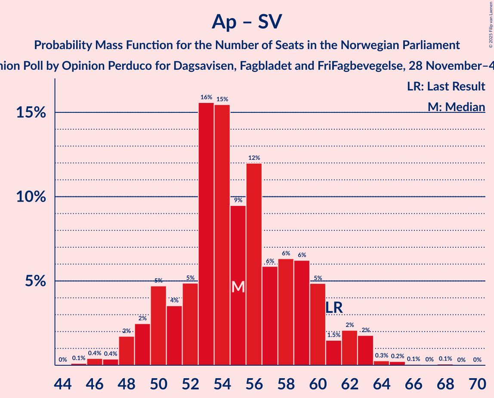

| Number of Seats | Probability | Accumulated | Special Marks |
|:---------------:|:-----------:|:-----------:|:-------------:|
| 45 | 0.1% | 100% |  |
| 46 | 0.4% | 99.9% |  |
| 47 | 0.4% | 99.5% |  |
| 48 | 2% | 99.1% |  |
| 49 | 2% | 97% |  |
| 50 | 5% | 95% |  |
| 51 | 4% | 90% |  |
| 52 | 5% | 87% |  |
| 53 | 16% | 82% |  |
| 54 | 15% | 66% |  |
| 55 | 9% | 51% | Median |
| 56 | 12% | 41% |  |
| 57 | 6% | 29% |  |
| 58 | 6% | 23% |  |
| 59 | 6% | 17% |  |
| 60 | 5% | 11% |  |
| 61 | 1.5% | 6% | Last Result |
| 62 | 2% | 5% |  |
| 63 | 2% | 2% |  |
| 64 | 0.3% | 0.7% |  |
| 65 | 0.2% | 0.4% |  |
| 66 | 0.1% | 0.2% |  |
| 67 | 0% | 0.1% |  |
| 68 | 0.1% | 0.1% |  |
| 69 | 0% | 0% |  |

### Arbeiderpartiet – Senterpartiet

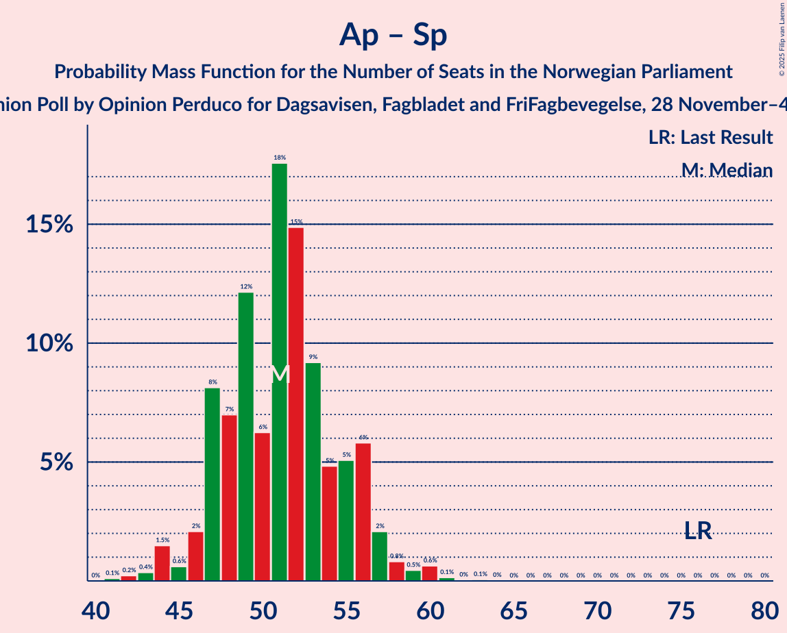

| Number of Seats | Probability | Accumulated | Special Marks |
|:---------------:|:-----------:|:-----------:|:-------------:|
| 41 | 0.1% | 100% |  |
| 42 | 0.2% | 99.9% |  |
| 43 | 0.4% | 99.7% |  |
| 44 | 1.5% | 99.3% |  |
| 45 | 0.6% | 98% |  |
| 46 | 2% | 97% |  |
| 47 | 8% | 95% |  |
| 48 | 7% | 87% |  |
| 49 | 12% | 80% |  |
| 50 | 6% | 68% |  |
| 51 | 18% | 62% | Median |
| 52 | 15% | 44% |  |
| 53 | 9% | 29% |  |
| 54 | 5% | 20% |  |
| 55 | 5% | 15% |  |
| 56 | 6% | 10% |  |
| 57 | 2% | 4% |  |
| 58 | 0.8% | 2% |  |
| 59 | 0.5% | 1.4% |  |
| 60 | 0.6% | 0.9% |  |
| 61 | 0.1% | 0.3% |  |
| 62 | 0% | 0.1% |  |
| 63 | 0.1% | 0.1% |  |
| 64 | 0% | 0% |  |
| 65 | 0% | 0% |  |
| 66 | 0% | 0% |  |
| 67 | 0% | 0% |  |
| 68 | 0% | 0% |  |
| 69 | 0% | 0% |  |
| 70 | 0% | 0% |  |
| 71 | 0% | 0% |  |
| 72 | 0% | 0% |  |
| 73 | 0% | 0% |  |
| 74 | 0% | 0% |  |
| 75 | 0% | 0% |  |
| 76 | 0% | 0% | Last Result |

### Senterpartiet – Venstre – Kristelig Folkeparti

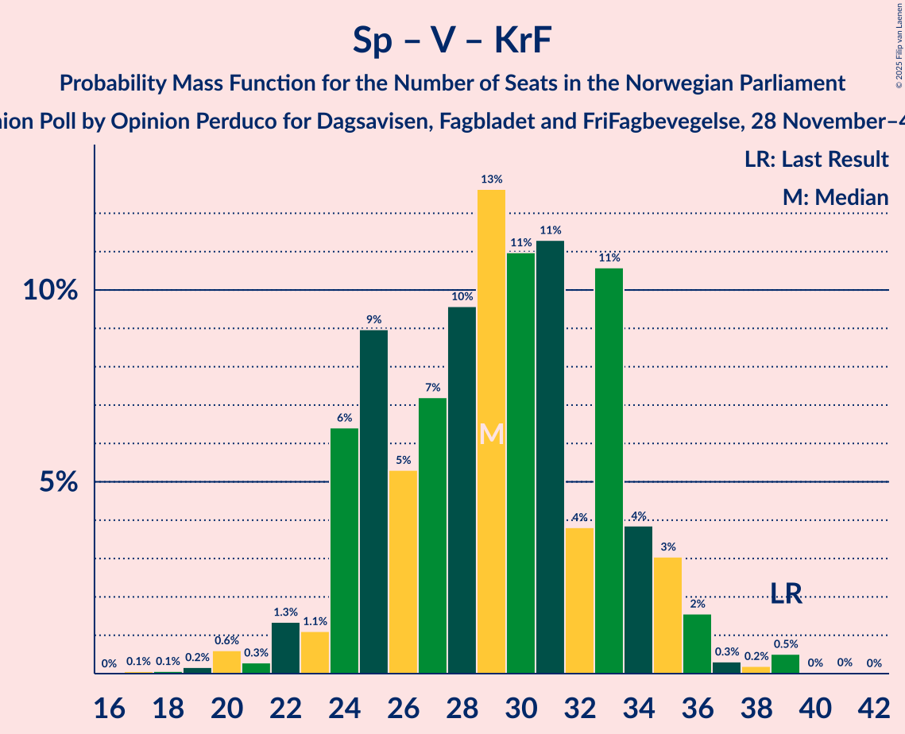

| Number of Seats | Probability | Accumulated | Special Marks |
|:---------------:|:-----------:|:-----------:|:-------------:|
| 17 | 0.1% | 100% |  |
| 18 | 0.1% | 99.9% |  |
| 19 | 0.2% | 99.9% |  |
| 20 | 0.6% | 99.7% |  |
| 21 | 0.3% | 99.1% |  |
| 22 | 1.3% | 98.8% |  |
| 23 | 1.1% | 97% |  |
| 24 | 6% | 96% |  |
| 25 | 9% | 90% |  |
| 26 | 5% | 81% |  |
| 27 | 7% | 76% |  |
| 28 | 10% | 68% | Median |
| 29 | 13% | 59% |  |
| 30 | 11% | 46% |  |
| 31 | 11% | 35% |  |
| 32 | 4% | 24% |  |
| 33 | 11% | 20% |  |
| 34 | 4% | 10% |  |
| 35 | 3% | 6% |  |
| 36 | 2% | 3% |  |
| 37 | 0.3% | 1.1% |  |
| 38 | 0.2% | 0.8% |  |
| 39 | 0.5% | 0.6% | Last Result |
| 40 | 0% | 0.1% |  |
| 41 | 0% | 0% |  |

## Technical Information

### Opinion Poll

+ **Polling firm:** Opinion Perduco
+ **Commissioner(s):** Dagsavisen, Fagbladet and FriFagbevegelse
+ **Fieldwork period:** 28 November–4 December 2023

### Calculations

+ **Sample size:** 720
+ **Simulations done:** 1,048,576
+ **Error estimate:** 3.14%

