# Opinion Poll by Norfakta for Klassekampen and Nationen, 5–6 December 2023

<a href="#voting-intentions">Voting Intentions</a> | <a href="#seats">Seats</a> | <a href="#coalitions">Coalitions</a> | <a href="#technical-information">Technical Information</a>

## Voting Intentions

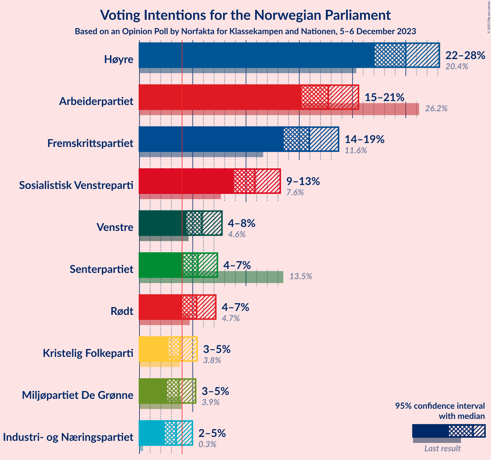

### Confidence Intervals

| Party | Last Result | Poll Result | 80% Confidence Interval | 90% Confidence Interval | 95% Confidence Interval | 99% Confidence Interval |
|:-----:|:-----------:|:-----------:|:-----------------------:|:-----------------------:|:-----------------------:|:-----------------------:|
| Høyre | 20.4% | 25.0% | 23.1–27.1% |22.6–27.6% |22.1–28.2% |21.2–29.2% |
| Arbeiderpartiet | 26.2% | 17.7% | 16.1–19.6% |15.6–20.1% |15.2–20.6% |14.4–21.5% |
| Fremskrittspartiet | 11.6% | 15.9% | 14.4–17.7% |13.9–18.2% |13.5–18.7% |12.8–19.6% |
| Sosialistisk Venstreparti | 7.6% | 10.8% | 9.5–12.4% |9.2–12.8% |8.9–13.2% |8.3–14.0% |
| Venstre | 4.6% | 5.9% | 4.9–7.1% |4.6–7.4% |4.4–7.7% |4.0–8.4% |
| Senterpartiet | 13.5% | 5.5% | 4.6–6.7% |4.3–7.0% |4.1–7.3% |3.7–7.9% |
| Rødt | 4.7% | 5.4% | 4.5–6.5% |4.2–6.9% |4.0–7.2% |3.6–7.8% |
| Kristelig Folkeparti | 3.8% | 3.8% | 3.1–4.9% |2.9–5.2% |2.7–5.4% |2.4–6.0% |
| Miljøpartiet De Grønne | 3.9% | 3.7% | 3.0–4.7% |2.8–5.0% |2.6–5.3% |2.3–5.8% |
| Industri- og Næringspartiet | 0.3% | 3.4% | 2.7–4.4% |2.5–4.7% |2.4–5.0% |2.1–5.5% |

*Note:* The poll result column reflects the actual value used in the calculations. Published results may vary slightly, and in addition be rounded to fewer digits.

## Seats

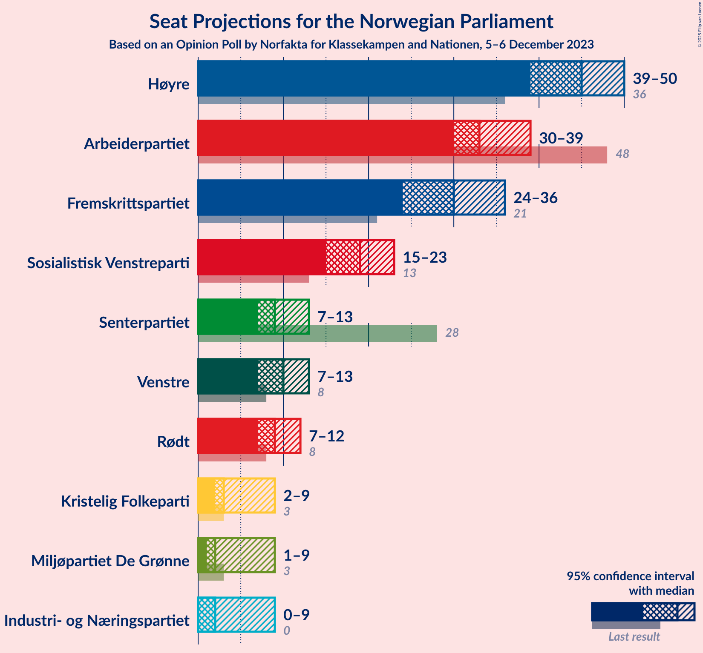

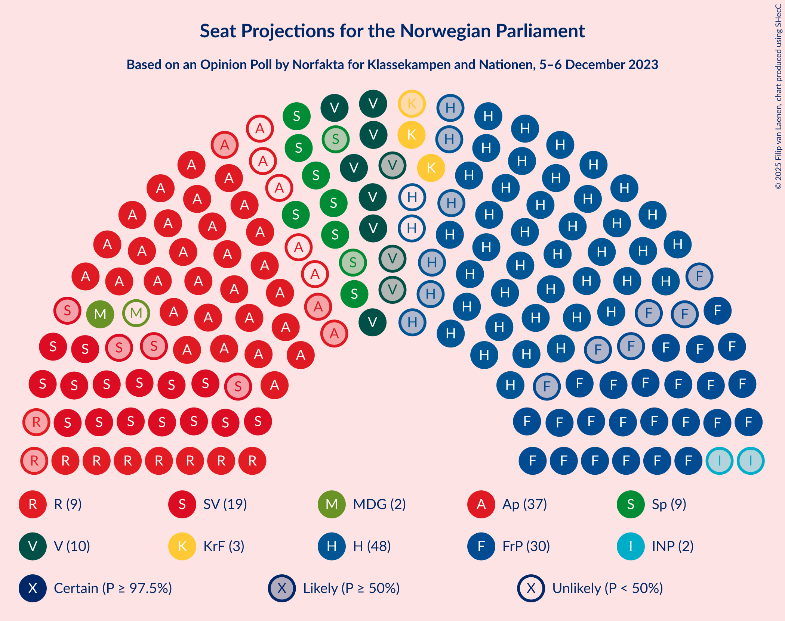

### Confidence Intervals

| Party | Last Result | Median | 80% Confidence Interval | 90% Confidence Interval | 95% Confidence Interval | 99% Confidence Interval |
|:-----:|:-----------:|:------:|:-----------------------:|:-----------------------:|:-----------------------:|:-----------------------:|
| <a href="#høyre">Høyre</a> | 36 | 45 | 40–48 |40–49 |39–50 |38–52 |
| <a href="#arbeiderpartiet">Arbeiderpartiet</a> | 48 | 33 | 32–37 |31–38 |30–39 |29–40 |
| <a href="#fremskrittspartiet">Fremskrittspartiet</a> | 21 | 30 | 26–34 |24–35 |24–36 |23–37 |
| <a href="#sosialistisk-venstreparti">Sosialistisk Venstreparti</a> | 13 | 19 | 16–22 |15–23 |15–23 |13–24 |
| <a href="#venstre">Venstre</a> | 8 | 10 | 8–12 |8–13 |7–13 |6–14 |
| <a href="#senterpartiet">Senterpartiet</a> | 28 | 9 | 8–12 |7–13 |7–13 |1–14 |
| <a href="#rødt">Rødt</a> | 8 | 9 | 8–11 |7–12 |7–12 |1–13 |
| <a href="#kristelig-folkeparti">Kristelig Folkeparti</a> | 3 | 3 | 2–8 |2–8 |2–9 |1–10 |
| <a href="#miljøpartiet-de-grønne">Miljøpartiet De Grønne</a> | 3 | 2 | 1–7 |1–8 |1–9 |1–10 |
| <a href="#industri--og-næringspartiet">Industri- og Næringspartiet</a> | 0 | 2 | 2–7 |0–8 |0–9 |0–9 |

### Høyre

*For a full overview of the results for this party, see the [Høyre](party-høyre.html) page.*

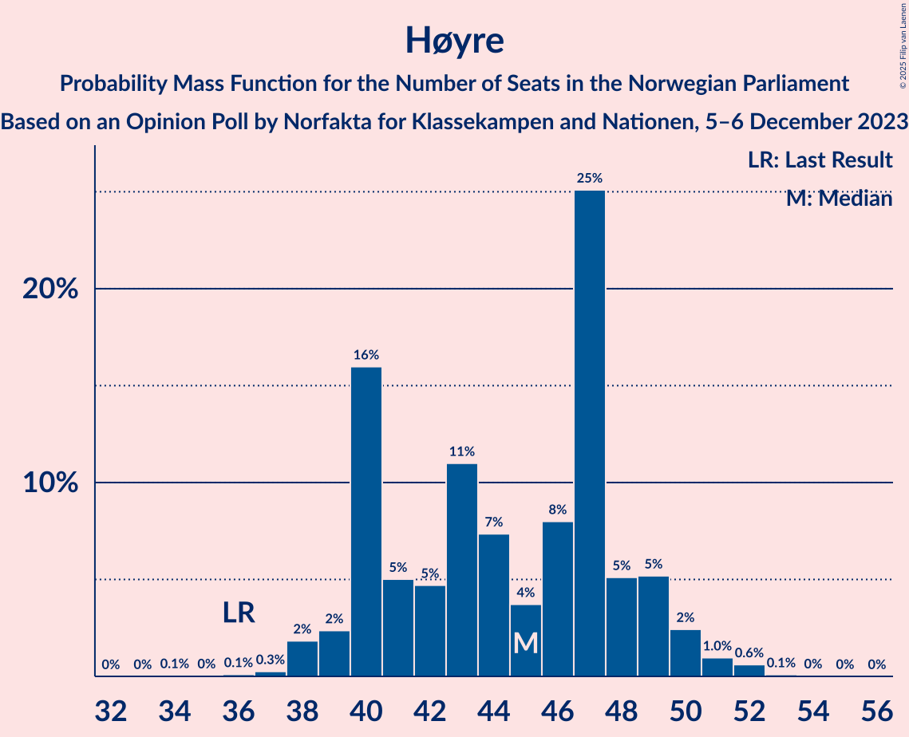

| Number of Seats | Probability | Accumulated | Special Marks |
|:---------------:|:-----------:|:-----------:|:-------------:|
| 34 | 0.1% | 100% |  |
| 35 | 0% | 99.9% |  |
| 36 | 0.1% | 99.9% | Last Result |
| 37 | 0.3% | 99.8% |  |
| 38 | 2% | 99.5% |  |
| 39 | 2% | 98% |  |
| 40 | 16% | 95% |  |
| 41 | 5% | 79% |  |
| 42 | 5% | 74% |  |
| 43 | 11% | 70% |  |
| 44 | 7% | 59% |  |
| 45 | 4% | 51% | Median |
| 46 | 8% | 48% |  |
| 47 | 25% | 40% |  |
| 48 | 5% | 14% |  |
| 49 | 5% | 9% |  |
| 50 | 2% | 4% |  |
| 51 | 1.0% | 2% |  |
| 52 | 0.6% | 0.8% |  |
| 53 | 0.1% | 0.2% |  |
| 54 | 0% | 0.1% |  |
| 55 | 0% | 0% |  |

### Arbeiderpartiet

*For a full overview of the results for this party, see the [Arbeiderpartiet](party-arbeiderpartiet.html) page.*

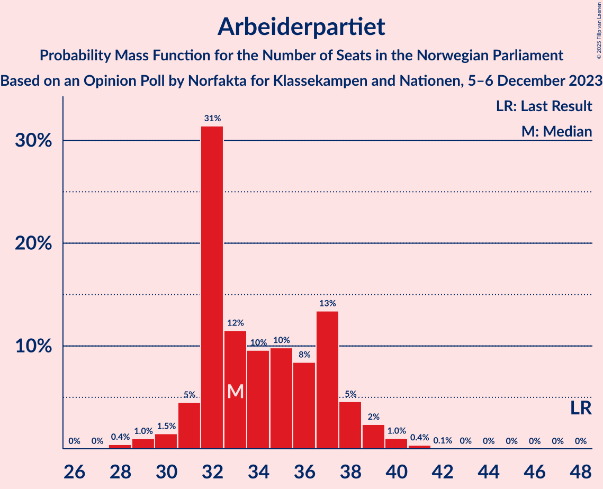

| Number of Seats | Probability | Accumulated | Special Marks |
|:---------------:|:-----------:|:-----------:|:-------------:|
| 28 | 0.4% | 100% |  |
| 29 | 1.0% | 99.5% |  |
| 30 | 1.5% | 98.6% |  |
| 31 | 5% | 97% |  |
| 32 | 31% | 93% |  |
| 33 | 12% | 61% | Median |
| 34 | 10% | 50% |  |
| 35 | 10% | 40% |  |
| 36 | 8% | 30% |  |
| 37 | 13% | 22% |  |
| 38 | 5% | 8% |  |
| 39 | 2% | 4% |  |
| 40 | 1.0% | 1.5% |  |
| 41 | 0.4% | 0.5% |  |
| 42 | 0.1% | 0.1% |  |
| 43 | 0% | 0.1% |  |
| 44 | 0% | 0% |  |
| 45 | 0% | 0% |  |
| 46 | 0% | 0% |  |
| 47 | 0% | 0% |  |
| 48 | 0% | 0% | Last Result |

### Fremskrittspartiet

*For a full overview of the results for this party, see the [Fremskrittspartiet](party-fremskrittspartiet.html) page.*

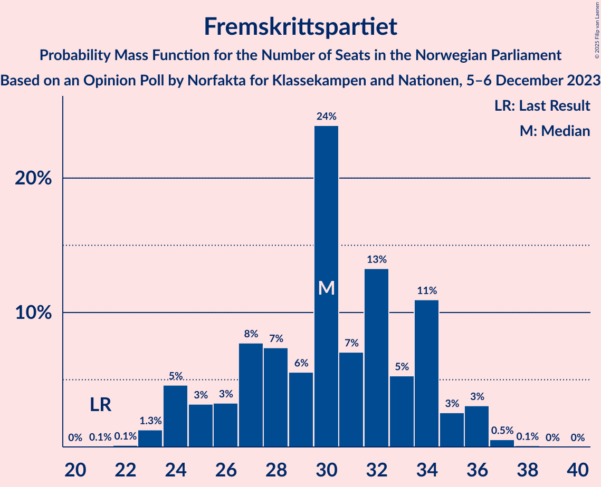

| Number of Seats | Probability | Accumulated | Special Marks |
|:---------------:|:-----------:|:-----------:|:-------------:|
| 21 | 0.1% | 100% | Last Result |
| 22 | 0.1% | 99.9% |  |
| 23 | 1.3% | 99.8% |  |
| 24 | 5% | 98.5% |  |
| 25 | 3% | 94% |  |
| 26 | 3% | 91% |  |
| 27 | 8% | 87% |  |
| 28 | 7% | 80% |  |
| 29 | 6% | 72% |  |
| 30 | 24% | 67% | Median |
| 31 | 7% | 43% |  |
| 32 | 13% | 36% |  |
| 33 | 5% | 23% |  |
| 34 | 11% | 17% |  |
| 35 | 3% | 6% |  |
| 36 | 3% | 4% |  |
| 37 | 0.5% | 0.7% |  |
| 38 | 0.1% | 0.1% |  |
| 39 | 0% | 0% |  |

### Sosialistisk Venstreparti

*For a full overview of the results for this party, see the [Sosialistisk Venstreparti](party-sosialistiskvenstreparti.html) page.*

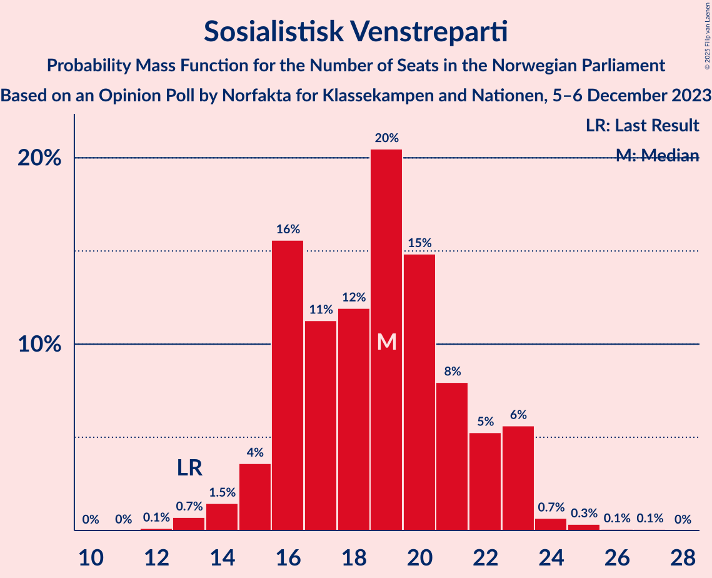

| Number of Seats | Probability | Accumulated | Special Marks |
|:---------------:|:-----------:|:-----------:|:-------------:|
| 12 | 0.1% | 100% |  |
| 13 | 0.7% | 99.9% | Last Result |
| 14 | 1.5% | 99.2% |  |
| 15 | 4% | 98% |  |
| 16 | 16% | 94% |  |
| 17 | 11% | 79% |  |
| 18 | 12% | 67% |  |
| 19 | 20% | 55% | Median |
| 20 | 15% | 35% |  |
| 21 | 8% | 20% |  |
| 22 | 5% | 12% |  |
| 23 | 6% | 7% |  |
| 24 | 0.7% | 1.1% |  |
| 25 | 0.3% | 0.5% |  |
| 26 | 0.1% | 0.1% |  |
| 27 | 0.1% | 0.1% |  |
| 28 | 0% | 0% |  |

### Venstre

*For a full overview of the results for this party, see the [Venstre](party-venstre.html) page.*

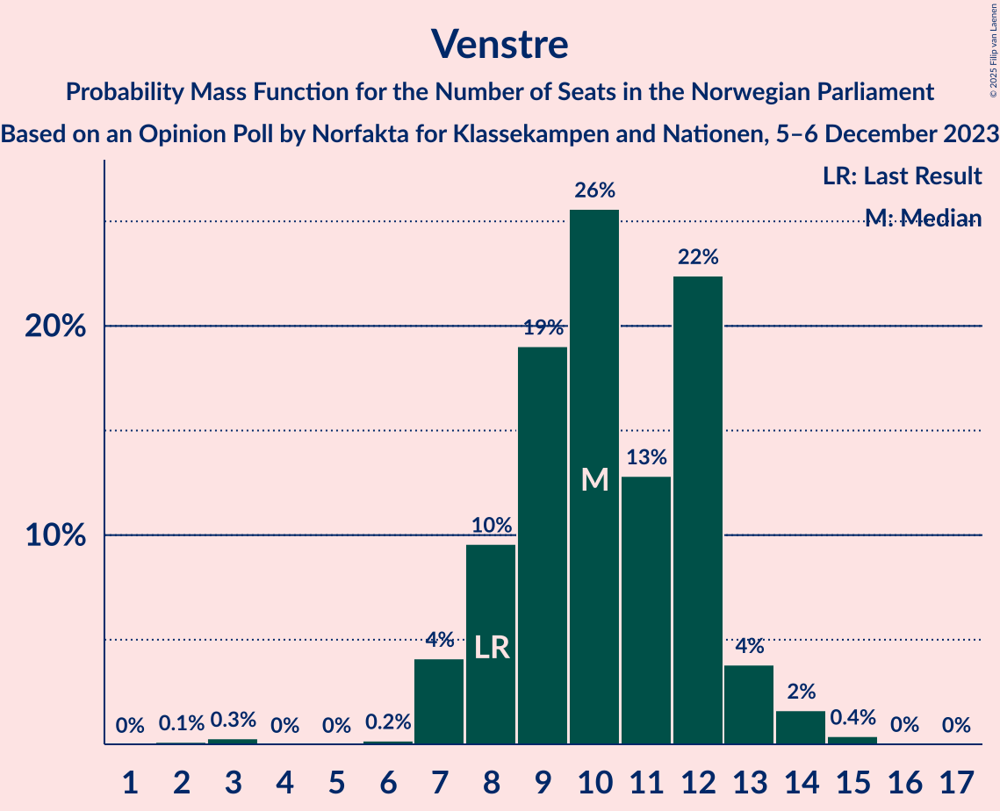

| Number of Seats | Probability | Accumulated | Special Marks |
|:---------------:|:-----------:|:-----------:|:-------------:|
| 2 | 0.1% | 100% |  |
| 3 | 0.3% | 99.9% |  |
| 4 | 0% | 99.6% |  |
| 5 | 0% | 99.6% |  |
| 6 | 0.2% | 99.6% |  |
| 7 | 4% | 99.4% |  |
| 8 | 10% | 95% | Last Result |
| 9 | 19% | 86% |  |
| 10 | 26% | 67% | Median |
| 11 | 13% | 41% |  |
| 12 | 22% | 28% |  |
| 13 | 4% | 6% |  |
| 14 | 2% | 2% |  |
| 15 | 0.4% | 0.5% |  |
| 16 | 0% | 0.1% |  |
| 17 | 0% | 0% |  |

### Senterpartiet

*For a full overview of the results for this party, see the [Senterpartiet](party-senterpartiet.html) page.*

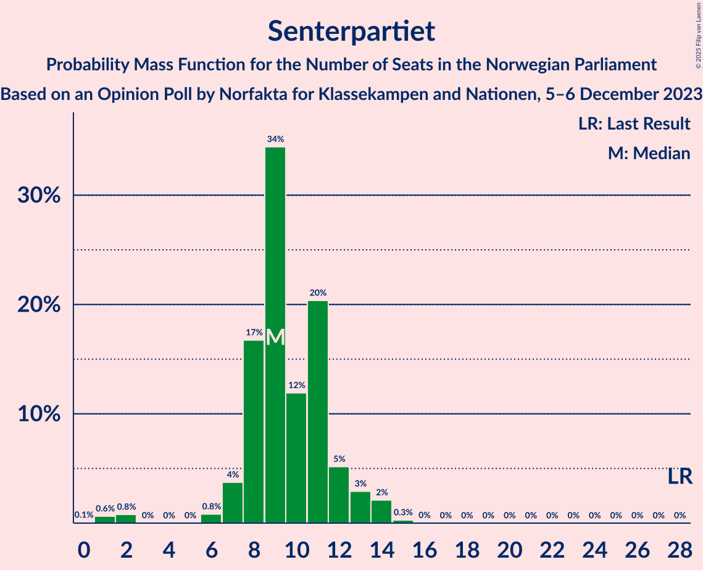

| Number of Seats | Probability | Accumulated | Special Marks |
|:---------------:|:-----------:|:-----------:|:-------------:|
| 0 | 0.1% | 100% |  |
| 1 | 0.6% | 99.9% |  |
| 2 | 0.8% | 99.3% |  |
| 3 | 0% | 98.5% |  |
| 4 | 0% | 98.5% |  |
| 5 | 0% | 98.5% |  |
| 6 | 0.8% | 98.5% |  |
| 7 | 4% | 98% |  |
| 8 | 17% | 94% |  |
| 9 | 34% | 77% | Median |
| 10 | 12% | 43% |  |
| 11 | 20% | 31% |  |
| 12 | 5% | 10% |  |
| 13 | 3% | 5% |  |
| 14 | 2% | 2% |  |
| 15 | 0.3% | 0.3% |  |
| 16 | 0% | 0% |  |
| 17 | 0% | 0% |  |
| 18 | 0% | 0% |  |
| 19 | 0% | 0% |  |
| 20 | 0% | 0% |  |
| 21 | 0% | 0% |  |
| 22 | 0% | 0% |  |
| 23 | 0% | 0% |  |
| 24 | 0% | 0% |  |
| 25 | 0% | 0% |  |
| 26 | 0% | 0% |  |
| 27 | 0% | 0% |  |
| 28 | 0% | 0% | Last Result |

### Rødt

*For a full overview of the results for this party, see the [Rødt](party-rødt.html) page.*

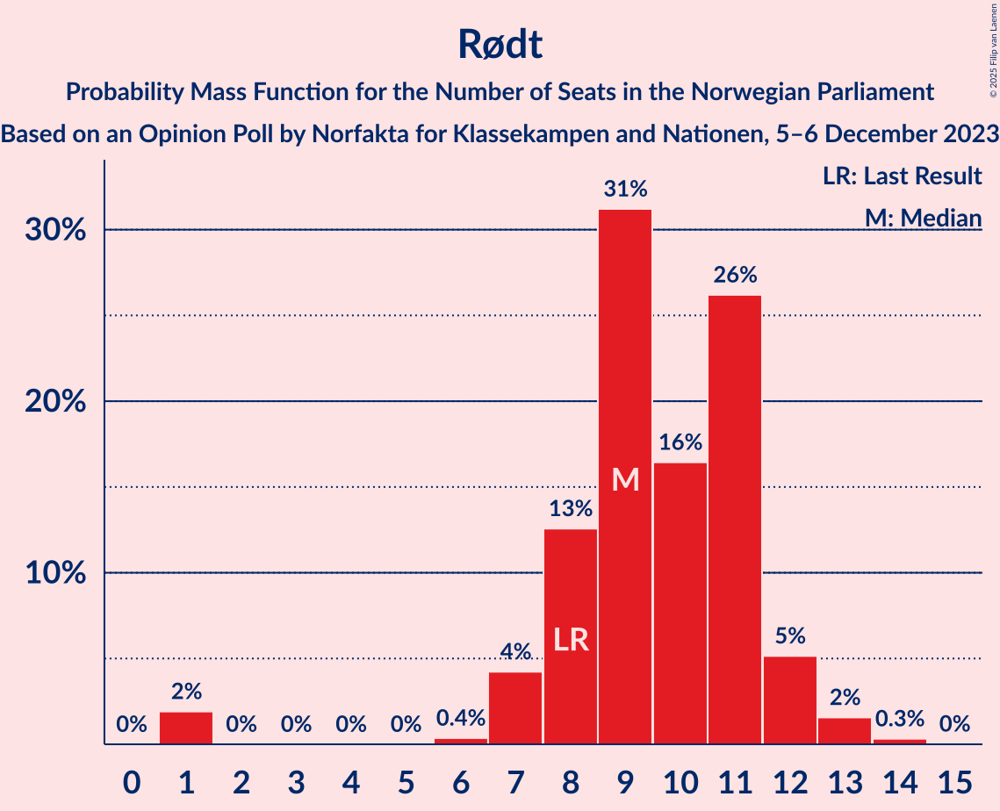

| Number of Seats | Probability | Accumulated | Special Marks |
|:---------------:|:-----------:|:-----------:|:-------------:|
| 1 | 2% | 100% |  |
| 2 | 0% | 98% |  |
| 3 | 0% | 98% |  |
| 4 | 0% | 98% |  |
| 5 | 0% | 98% |  |
| 6 | 0.4% | 98% |  |
| 7 | 4% | 98% |  |
| 8 | 13% | 93% | Last Result |
| 9 | 31% | 81% | Median |
| 10 | 16% | 50% |  |
| 11 | 26% | 33% |  |
| 12 | 5% | 7% |  |
| 13 | 2% | 2% |  |
| 14 | 0.3% | 0.3% |  |
| 15 | 0% | 0% |  |

### Kristelig Folkeparti

*For a full overview of the results for this party, see the [Kristelig Folkeparti](party-kristeligfolkeparti.html) page.*

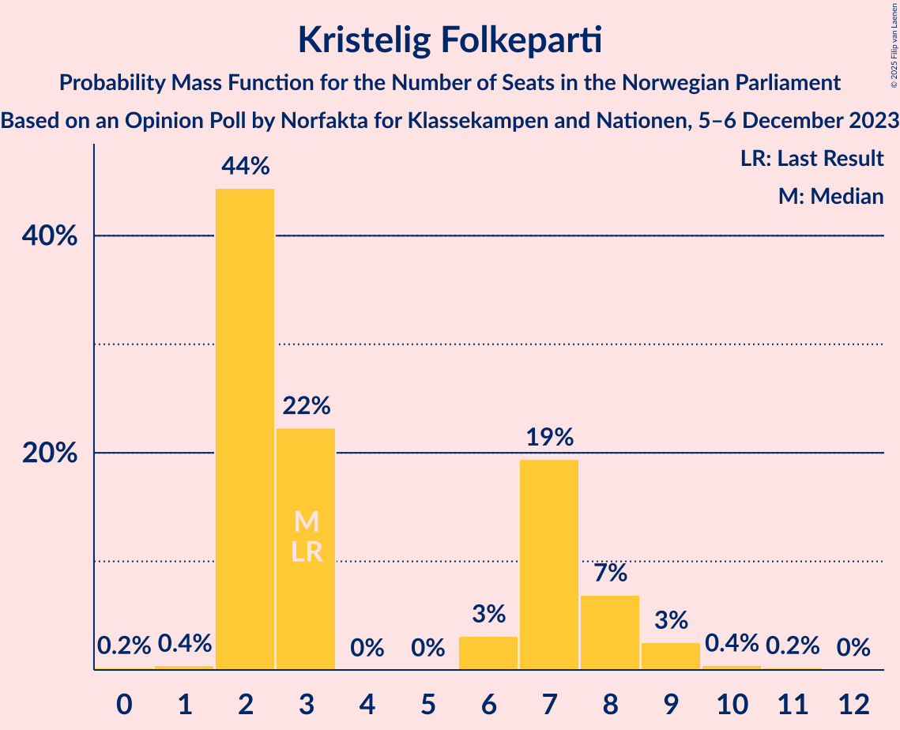

| Number of Seats | Probability | Accumulated | Special Marks |
|:---------------:|:-----------:|:-----------:|:-------------:|
| 0 | 0.2% | 100% |  |
| 1 | 0.4% | 99.8% |  |
| 2 | 44% | 99.4% |  |
| 3 | 22% | 55% | Last Result, Median |
| 4 | 0% | 33% |  |
| 5 | 0% | 33% |  |
| 6 | 3% | 33% |  |
| 7 | 19% | 30% |  |
| 8 | 7% | 10% |  |
| 9 | 3% | 3% |  |
| 10 | 0.4% | 0.7% |  |
| 11 | 0.2% | 0.2% |  |
| 12 | 0% | 0% |  |

### Miljøpartiet De Grønne

*For a full overview of the results for this party, see the [Miljøpartiet De Grønne](party-miljøpartietdegrønne.html) page.*

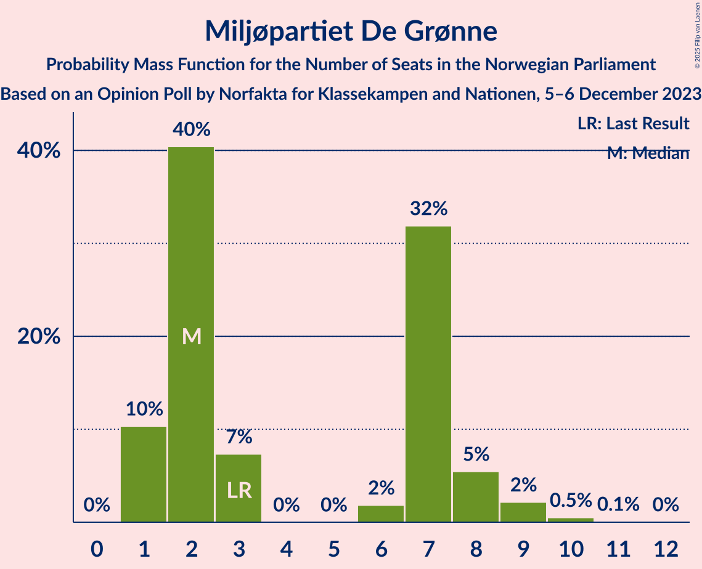

| Number of Seats | Probability | Accumulated | Special Marks |
|:---------------:|:-----------:|:-----------:|:-------------:|
| 1 | 10% | 100% |  |
| 2 | 40% | 90% | Median |
| 3 | 7% | 49% | Last Result |
| 4 | 0% | 42% |  |
| 5 | 0% | 42% |  |
| 6 | 2% | 42% |  |
| 7 | 32% | 40% |  |
| 8 | 5% | 8% |  |
| 9 | 2% | 3% |  |
| 10 | 0.5% | 0.6% |  |
| 11 | 0.1% | 0.1% |  |
| 12 | 0% | 0% |  |

### Industri- og Næringspartiet

*For a full overview of the results for this party, see the [Industri- og Næringspartiet](party-industri-ognæringspartiet.html) page.*

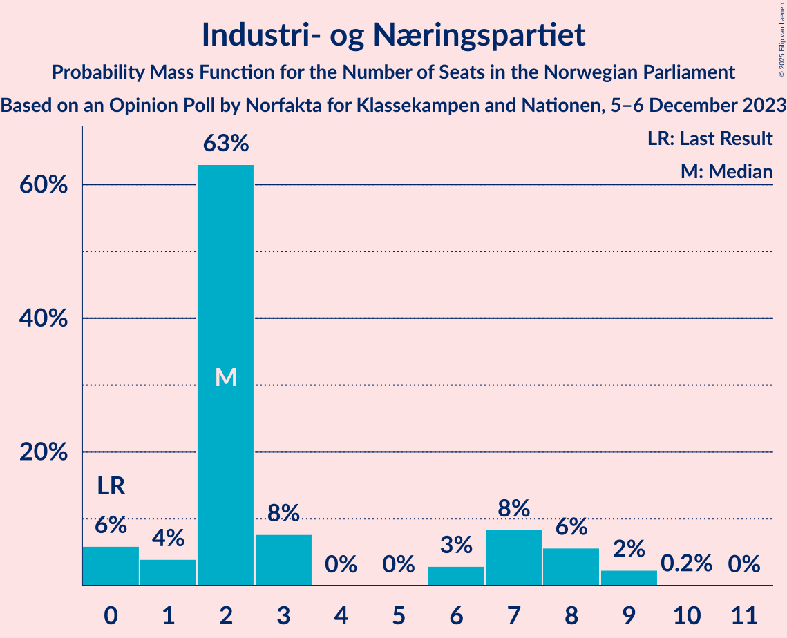

| Number of Seats | Probability | Accumulated | Special Marks |
|:---------------:|:-----------:|:-----------:|:-------------:|
| 0 | 6% | 100% | Last Result |
| 1 | 4% | 94% |  |
| 2 | 63% | 90% | Median |
| 3 | 8% | 27% |  |
| 4 | 0% | 19% |  |
| 5 | 0% | 19% |  |
| 6 | 3% | 19% |  |
| 7 | 8% | 17% |  |
| 8 | 6% | 8% |  |
| 9 | 2% | 3% |  |
| 10 | 0.2% | 0.2% |  |
| 11 | 0% | 0% |  |

## Coalitions

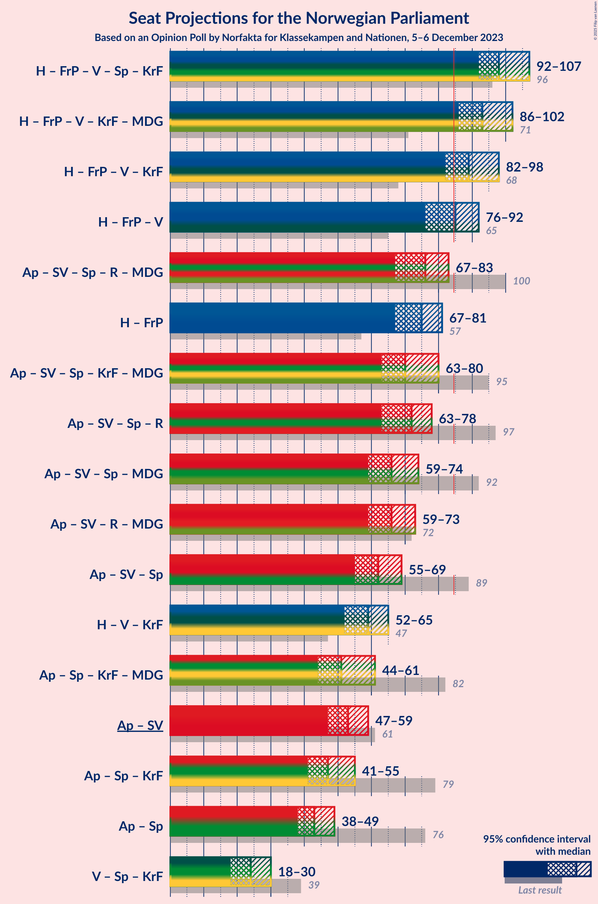

### Confidence Intervals

| Coalition | Last Result | Median | Majority? | 80% Confidence Interval | 90% Confidence Interval | 95% Confidence Interval | 99% Confidence Interval |
|:---------:|:-----------:|:------:|:---------:|:-----------------------:|:-----------------------:|:-----------------------:|:-----------------------:|
| Høyre – Fremskrittspartiet – Venstre – Senterpartiet – Kristelig Folkeparti | 96 | 98 | 100% | 94–102 | 93–104 | 92–107 | 89–110 |
| Høyre – Fremskrittspartiet – Venstre – Kristelig Folkeparti – Miljøpartiet De Grønne | 71 | 93 | 99.4% | 88–100 | 87–100 | 86–102 | 84–105 |
| Høyre – Fremskrittspartiet – Venstre – Kristelig Folkeparti | 68 | 89 | 88% | 84–93 | 83–95 | 82–98 | 80–101 |
| Høyre – Fremskrittspartiet – Venstre | 65 | 85 | 53% | 79–91 | 78–91 | 76–92 | 74–93 |
| Arbeiderpartiet – Sosialistisk Venstreparti – Senterpartiet – Rødt – Miljøpartiet De Grønne | 100 | 76 | 0.8% | 72–80 | 69–82 | 67–83 | 64–85 |
| Høyre – Fremskrittspartiet | 57 | 75 | 0.3% | 70–81 | 67–81 | 67–81 | 65–84 |
| Arbeiderpartiet – Sosialistisk Venstreparti – Senterpartiet – Kristelig Folkeparti – Miljøpartiet De Grønne | 95 | 70 | 0.1% | 66–77 | 64–78 | 63–80 | 62–83 |
| Arbeiderpartiet – Sosialistisk Venstreparti – Senterpartiet – Rødt | 97 | 72 | 0% | 66–76 | 65–77 | 63–78 | 61–80 |
| Arbeiderpartiet – Sosialistisk Venstreparti – Senterpartiet – Miljøpartiet De Grønne | 92 | 66 | 0% | 62–72 | 60–73 | 59–74 | 56–77 |
| Arbeiderpartiet – Sosialistisk Venstreparti – Rødt – Miljøpartiet De Grønne | 72 | 66 | 0% | 63–71 | 61–72 | 59–73 | 55–75 |
| Arbeiderpartiet – Sosialistisk Venstreparti – Senterpartiet | 89 | 62 | 0% | 57–66 | 57–67 | 55–69 | 53–72 |
| Høyre – Venstre – Kristelig Folkeparti | 47 | 59 | 0% | 54–63 | 53–65 | 52–65 | 50–69 |
| Arbeiderpartiet – Senterpartiet – Kristelig Folkeparti – Miljøpartiet De Grønne | 82 | 51 | 0% | 47–60 | 45–60 | 44–61 | 42–63 |
| Arbeiderpartiet – Sosialistisk Venstreparti | 61 | 53 | 0% | 48–57 | 48–59 | 47–59 | 45–61 |
| Arbeiderpartiet – Senterpartiet – Kristelig Folkeparti | 79 | 47 | 0% | 43–53 | 42–54 | 41–55 | 40–58 |
| Arbeiderpartiet – Senterpartiet | 76 | 43 | 0% | 41–46 | 40–48 | 38–49 | 36–51 |
| Venstre – Senterpartiet – Kristelig Folkeparti | 39 | 24 | 0% | 20–28 | 19–29 | 18–30 | 15–32 |

### Høyre – Fremskrittspartiet – Venstre – Senterpartiet – Kristelig Folkeparti

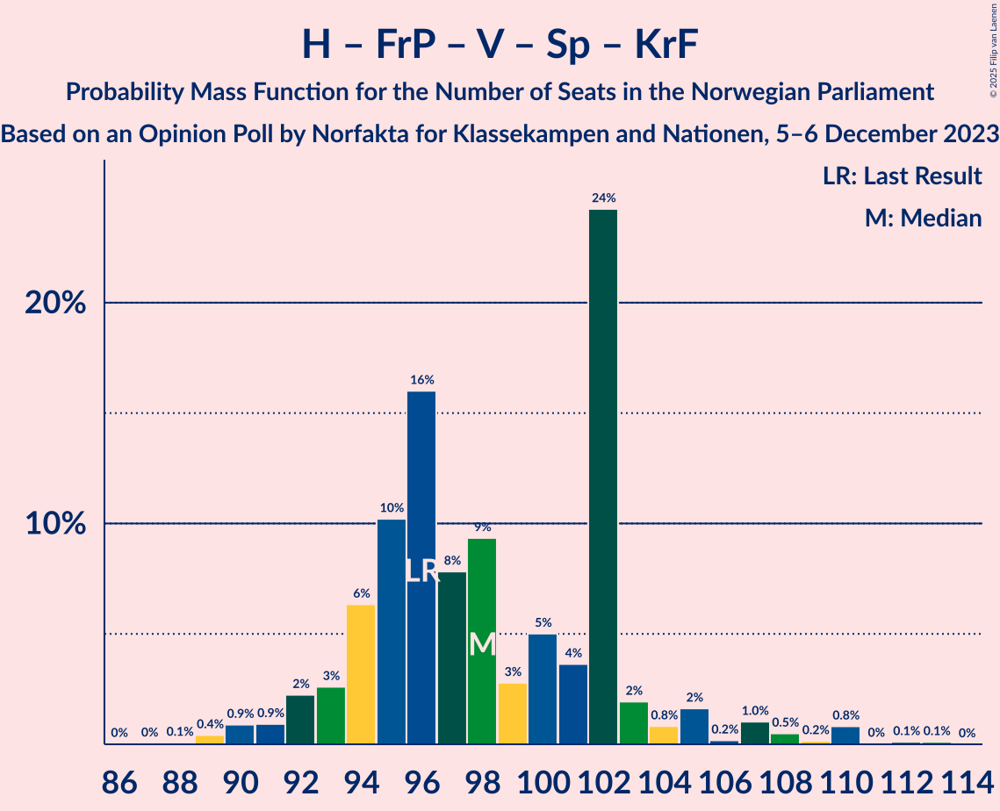

| Number of Seats | Probability | Accumulated | Special Marks |
|:---------------:|:-----------:|:-----------:|:-------------:|
| 86 | 0% | 100% |  |
| 87 | 0% | 99.9% |  |
| 88 | 0.1% | 99.9% |  |
| 89 | 0.4% | 99.8% |  |
| 90 | 0.9% | 99.4% |  |
| 91 | 0.9% | 98.5% |  |
| 92 | 2% | 98% |  |
| 93 | 3% | 95% |  |
| 94 | 6% | 93% |  |
| 95 | 10% | 86% |  |
| 96 | 16% | 76% | Last Result |
| 97 | 8% | 60% | Median |
| 98 | 9% | 52% |  |
| 99 | 3% | 43% |  |
| 100 | 5% | 40% |  |
| 101 | 4% | 35% |  |
| 102 | 24% | 32% |  |
| 103 | 2% | 7% |  |
| 104 | 0.8% | 5% |  |
| 105 | 2% | 5% |  |
| 106 | 0.2% | 3% |  |
| 107 | 1.0% | 3% |  |
| 108 | 0.5% | 2% |  |
| 109 | 0.2% | 1.2% |  |
| 110 | 0.8% | 1.1% |  |
| 111 | 0% | 0.3% |  |
| 112 | 0.1% | 0.2% |  |
| 113 | 0.1% | 0.1% |  |
| 114 | 0% | 0% |  |

### Høyre – Fremskrittspartiet – Venstre – Kristelig Folkeparti – Miljøpartiet De Grønne

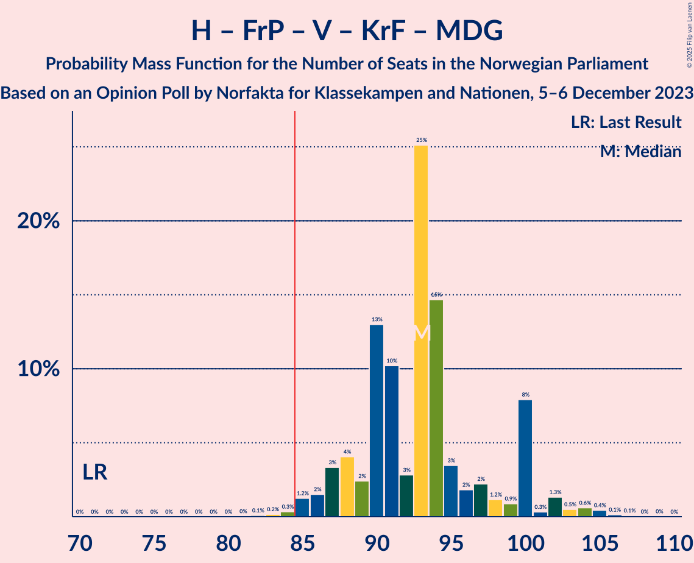

| Number of Seats | Probability | Accumulated | Special Marks |
|:---------------:|:-----------:|:-----------:|:-------------:|
| 71 | 0% | 100% | Last Result |
| 72 | 0% | 100% |  |
| 73 | 0% | 100% |  |
| 74 | 0% | 100% |  |
| 75 | 0% | 100% |  |
| 76 | 0% | 100% |  |
| 77 | 0% | 100% |  |
| 78 | 0% | 100% |  |
| 79 | 0% | 100% |  |
| 80 | 0% | 100% |  |
| 81 | 0% | 100% |  |
| 82 | 0.1% | 100% |  |
| 83 | 0.2% | 99.9% |  |
| 84 | 0.3% | 99.7% |  |
| 85 | 1.2% | 99.4% | Majority |
| 86 | 2% | 98% |  |
| 87 | 3% | 97% |  |
| 88 | 4% | 93% |  |
| 89 | 2% | 89% |  |
| 90 | 13% | 87% | Median |
| 91 | 10% | 74% |  |
| 92 | 3% | 64% |  |
| 93 | 25% | 61% |  |
| 94 | 15% | 36% |  |
| 95 | 3% | 21% |  |
| 96 | 2% | 17% |  |
| 97 | 2% | 16% |  |
| 98 | 1.2% | 13% |  |
| 99 | 0.9% | 12% |  |
| 100 | 8% | 11% |  |
| 101 | 0.3% | 3% |  |
| 102 | 1.3% | 3% |  |
| 103 | 0.5% | 2% |  |
| 104 | 0.6% | 1.3% |  |
| 105 | 0.4% | 0.7% |  |
| 106 | 0.1% | 0.3% |  |
| 107 | 0.1% | 0.1% |  |
| 108 | 0% | 0% |  |

### Høyre – Fremskrittspartiet – Venstre – Kristelig Folkeparti

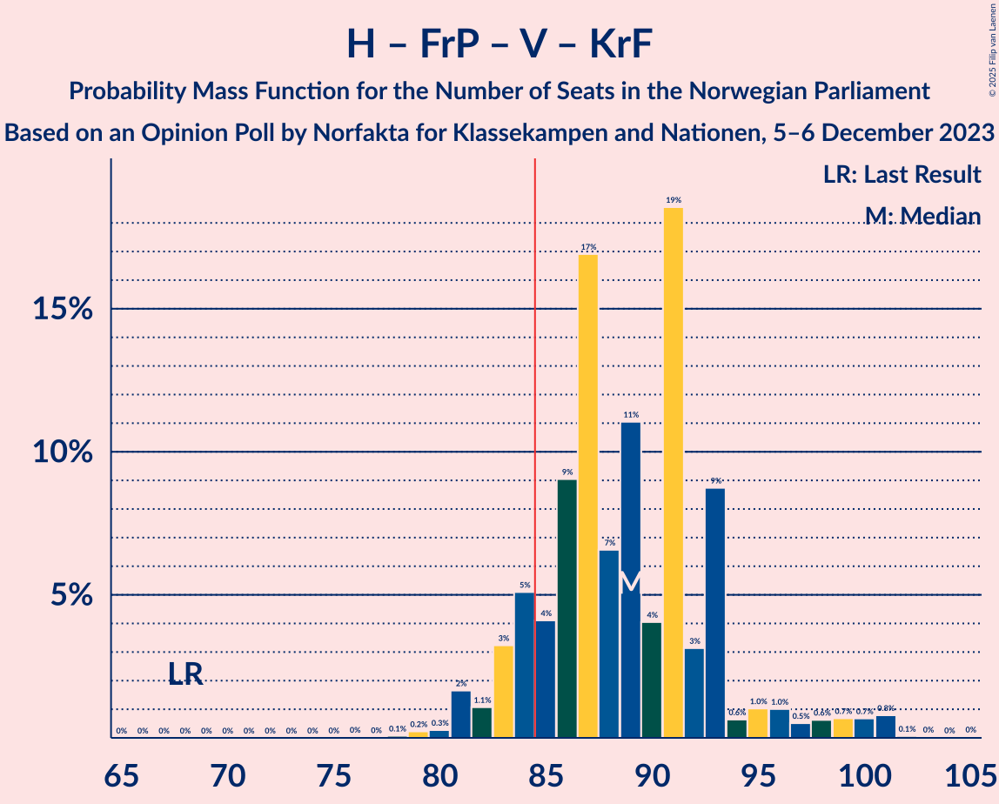

| Number of Seats | Probability | Accumulated | Special Marks |
|:---------------:|:-----------:|:-----------:|:-------------:|
| 68 | 0% | 100% | Last Result |
| 69 | 0% | 100% |  |
| 70 | 0% | 100% |  |
| 71 | 0% | 100% |  |
| 72 | 0% | 100% |  |
| 73 | 0% | 100% |  |
| 74 | 0% | 100% |  |
| 75 | 0% | 100% |  |
| 76 | 0% | 100% |  |
| 77 | 0% | 100% |  |
| 78 | 0.1% | 99.9% |  |
| 79 | 0.2% | 99.9% |  |
| 80 | 0.3% | 99.6% |  |
| 81 | 2% | 99.4% |  |
| 82 | 1.1% | 98% |  |
| 83 | 3% | 97% |  |
| 84 | 5% | 93% |  |
| 85 | 4% | 88% | Majority |
| 86 | 9% | 84% |  |
| 87 | 17% | 75% |  |
| 88 | 7% | 58% | Median |
| 89 | 11% | 52% |  |
| 90 | 4% | 41% |  |
| 91 | 19% | 37% |  |
| 92 | 3% | 18% |  |
| 93 | 9% | 15% |  |
| 94 | 0.6% | 6% |  |
| 95 | 1.0% | 5% |  |
| 96 | 1.0% | 4% |  |
| 97 | 0.5% | 3% |  |
| 98 | 0.6% | 3% |  |
| 99 | 0.7% | 2% |  |
| 100 | 0.7% | 2% |  |
| 101 | 0.8% | 0.9% |  |
| 102 | 0.1% | 0.2% |  |
| 103 | 0% | 0.1% |  |
| 104 | 0% | 0.1% |  |
| 105 | 0% | 0% |  |

### Høyre – Fremskrittspartiet – Venstre

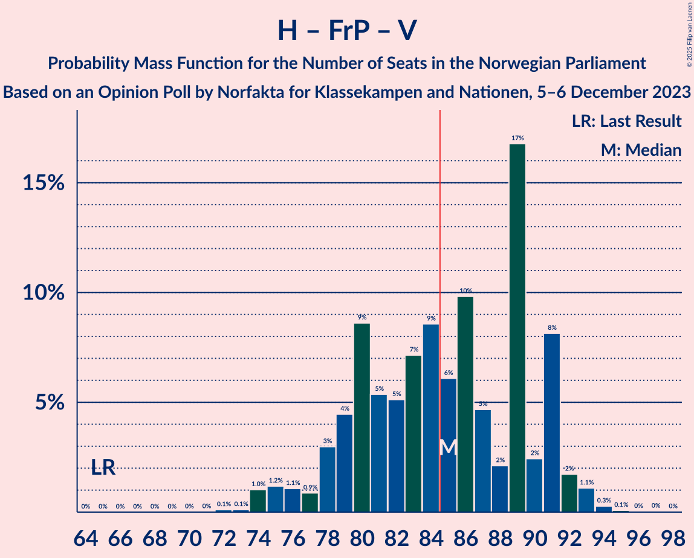

| Number of Seats | Probability | Accumulated | Special Marks |
|:---------------:|:-----------:|:-----------:|:-------------:|
| 65 | 0% | 100% | Last Result |
| 66 | 0% | 100% |  |
| 67 | 0% | 100% |  |
| 68 | 0% | 100% |  |
| 69 | 0% | 100% |  |
| 70 | 0% | 100% |  |
| 71 | 0% | 100% |  |
| 72 | 0.1% | 100% |  |
| 73 | 0.1% | 99.9% |  |
| 74 | 1.0% | 99.7% |  |
| 75 | 1.2% | 98.7% |  |
| 76 | 1.1% | 98% |  |
| 77 | 0.9% | 96% |  |
| 78 | 3% | 96% |  |
| 79 | 4% | 93% |  |
| 80 | 9% | 88% |  |
| 81 | 5% | 80% |  |
| 82 | 5% | 74% |  |
| 83 | 7% | 69% |  |
| 84 | 9% | 62% |  |
| 85 | 6% | 53% | Median, Majority |
| 86 | 10% | 47% |  |
| 87 | 5% | 37% |  |
| 88 | 2% | 33% |  |
| 89 | 17% | 31% |  |
| 90 | 2% | 14% |  |
| 91 | 8% | 11% |  |
| 92 | 2% | 3% |  |
| 93 | 1.1% | 2% |  |
| 94 | 0.3% | 0.5% |  |
| 95 | 0.1% | 0.2% |  |
| 96 | 0% | 0.1% |  |
| 97 | 0% | 0.1% |  |
| 98 | 0% | 0% |  |

### Arbeiderpartiet – Sosialistisk Venstreparti – Senterpartiet – Rødt – Miljøpartiet De Grønne

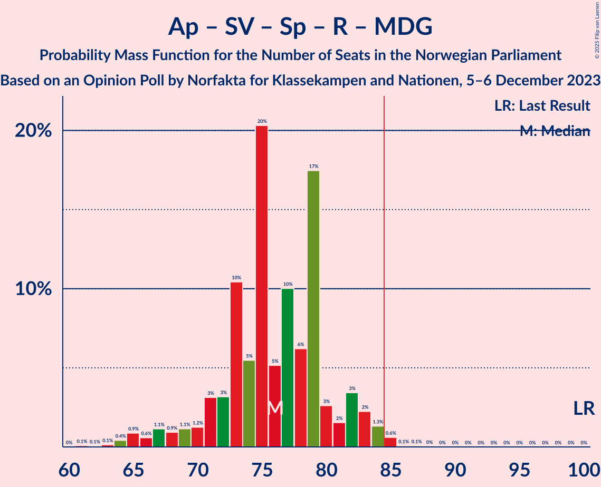

| Number of Seats | Probability | Accumulated | Special Marks |
|:---------------:|:-----------:|:-----------:|:-------------:|
| 61 | 0.1% | 100% |  |
| 62 | 0.1% | 99.9% |  |
| 63 | 0.1% | 99.8% |  |
| 64 | 0.4% | 99.7% |  |
| 65 | 0.9% | 99.3% |  |
| 66 | 0.6% | 98% |  |
| 67 | 1.1% | 98% |  |
| 68 | 0.9% | 97% |  |
| 69 | 1.1% | 96% |  |
| 70 | 1.2% | 95% |  |
| 71 | 3% | 93% |  |
| 72 | 3% | 90% | Median |
| 73 | 10% | 87% |  |
| 74 | 5% | 77% |  |
| 75 | 20% | 71% |  |
| 76 | 5% | 51% |  |
| 77 | 10% | 46% |  |
| 78 | 6% | 36% |  |
| 79 | 17% | 29% |  |
| 80 | 3% | 12% |  |
| 81 | 2% | 9% |  |
| 82 | 3% | 8% |  |
| 83 | 2% | 4% |  |
| 84 | 1.3% | 2% |  |
| 85 | 0.6% | 0.8% | Majority |
| 86 | 0.1% | 0.2% |  |
| 87 | 0.1% | 0.1% |  |
| 88 | 0% | 0% |  |
| 89 | 0% | 0% |  |
| 90 | 0% | 0% |  |
| 91 | 0% | 0% |  |
| 92 | 0% | 0% |  |
| 93 | 0% | 0% |  |
| 94 | 0% | 0% |  |
| 95 | 0% | 0% |  |
| 96 | 0% | 0% |  |
| 97 | 0% | 0% |  |
| 98 | 0% | 0% |  |
| 99 | 0% | 0% |  |
| 100 | 0% | 0% | Last Result |

### Høyre – Fremskrittspartiet

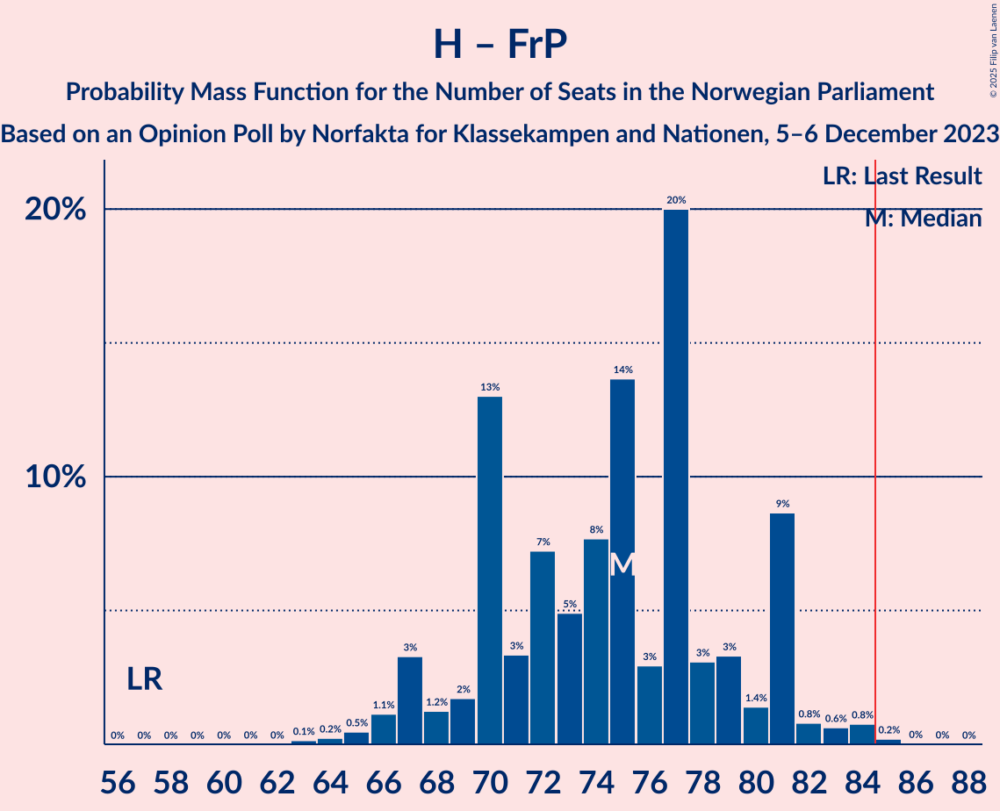

| Number of Seats | Probability | Accumulated | Special Marks |
|:---------------:|:-----------:|:-----------:|:-------------:|
| 57 | 0% | 100% | Last Result |
| 58 | 0% | 100% |  |
| 59 | 0% | 100% |  |
| 60 | 0% | 100% |  |
| 61 | 0% | 100% |  |
| 62 | 0% | 100% |  |
| 63 | 0.1% | 100% |  |
| 64 | 0.2% | 99.8% |  |
| 65 | 0.5% | 99.6% |  |
| 66 | 1.1% | 99.1% |  |
| 67 | 3% | 98% |  |
| 68 | 1.2% | 95% |  |
| 69 | 2% | 93% |  |
| 70 | 13% | 92% |  |
| 71 | 3% | 79% |  |
| 72 | 7% | 75% |  |
| 73 | 5% | 68% |  |
| 74 | 8% | 63% |  |
| 75 | 14% | 56% | Median |
| 76 | 3% | 42% |  |
| 77 | 20% | 39% |  |
| 78 | 3% | 19% |  |
| 79 | 3% | 16% |  |
| 80 | 1.4% | 13% |  |
| 81 | 9% | 11% |  |
| 82 | 0.8% | 2% |  |
| 83 | 0.6% | 2% |  |
| 84 | 0.8% | 1.0% |  |
| 85 | 0.2% | 0.3% | Majority |
| 86 | 0% | 0.1% |  |
| 87 | 0% | 0% |  |

### Arbeiderpartiet – Sosialistisk Venstreparti – Senterpartiet – Kristelig Folkeparti – Miljøpartiet De Grønne

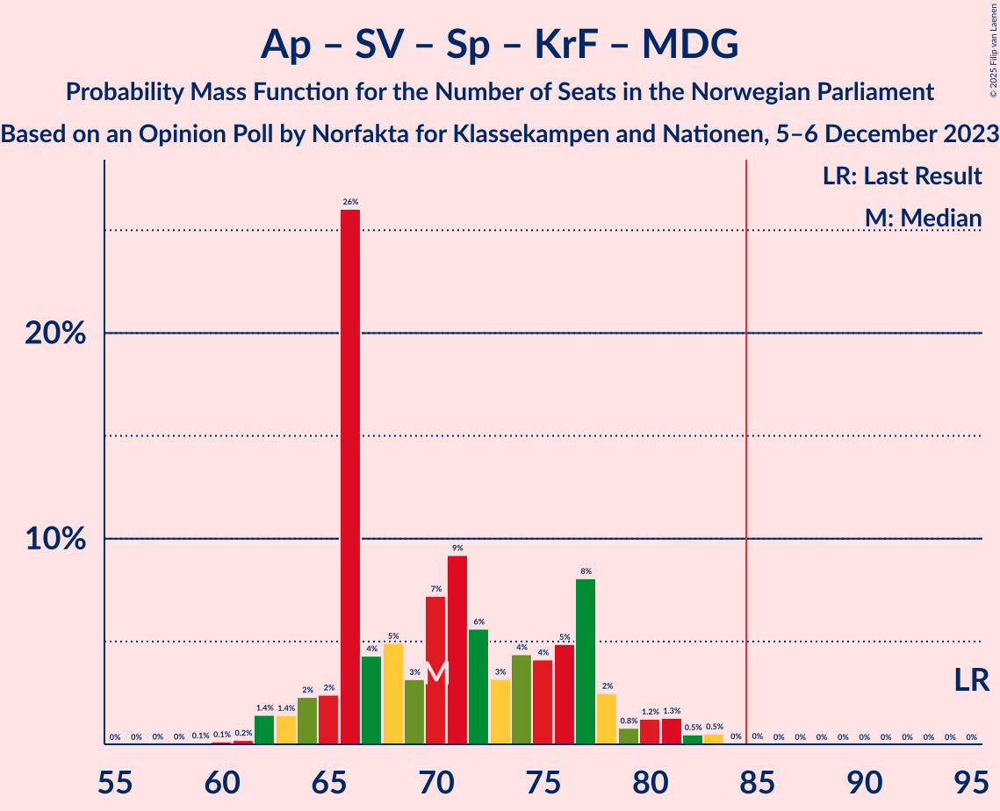

| Number of Seats | Probability | Accumulated | Special Marks |
|:---------------:|:-----------:|:-----------:|:-------------:|
| 58 | 0% | 100% |  |
| 59 | 0.1% | 99.9% |  |
| 60 | 0.1% | 99.9% |  |
| 61 | 0.2% | 99.7% |  |
| 62 | 1.4% | 99.5% |  |
| 63 | 1.4% | 98% |  |
| 64 | 2% | 97% |  |
| 65 | 2% | 94% |  |
| 66 | 26% | 92% | Median |
| 67 | 4% | 66% |  |
| 68 | 5% | 62% |  |
| 69 | 3% | 57% |  |
| 70 | 7% | 54% |  |
| 71 | 9% | 46% |  |
| 72 | 6% | 37% |  |
| 73 | 3% | 32% |  |
| 74 | 4% | 28% |  |
| 75 | 4% | 24% |  |
| 76 | 5% | 20% |  |
| 77 | 8% | 15% |  |
| 78 | 2% | 7% |  |
| 79 | 0.8% | 4% |  |
| 80 | 1.2% | 4% |  |
| 81 | 1.3% | 2% |  |
| 82 | 0.5% | 1.1% |  |
| 83 | 0.5% | 0.6% |  |
| 84 | 0% | 0.1% |  |
| 85 | 0% | 0.1% | Majority |
| 86 | 0% | 0% |  |
| 87 | 0% | 0% |  |
| 88 | 0% | 0% |  |
| 89 | 0% | 0% |  |
| 90 | 0% | 0% |  |
| 91 | 0% | 0% |  |
| 92 | 0% | 0% |  |
| 93 | 0% | 0% |  |
| 94 | 0% | 0% |  |
| 95 | 0% | 0% | Last Result |

### Arbeiderpartiet – Sosialistisk Venstreparti – Senterpartiet – Rødt

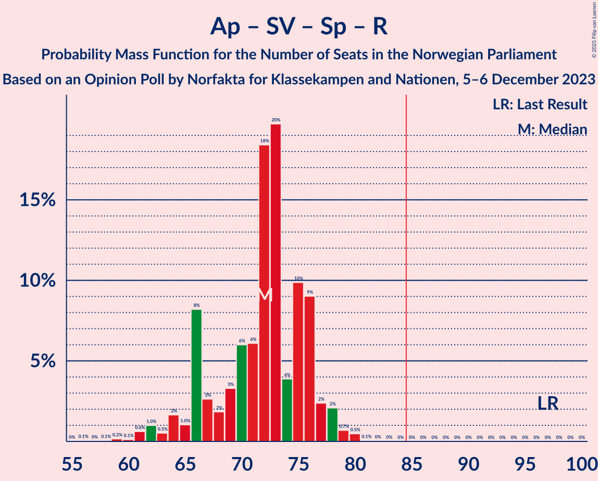

| Number of Seats | Probability | Accumulated | Special Marks |
|:---------------:|:-----------:|:-----------:|:-------------:|
| 56 | 0.1% | 100% |  |
| 57 | 0% | 99.9% |  |
| 58 | 0.1% | 99.9% |  |
| 59 | 0.2% | 99.8% |  |
| 60 | 0.1% | 99.7% |  |
| 61 | 0.6% | 99.5% |  |
| 62 | 1.0% | 98.9% |  |
| 63 | 0.5% | 98% |  |
| 64 | 2% | 97% |  |
| 65 | 1.0% | 96% |  |
| 66 | 8% | 95% |  |
| 67 | 3% | 87% |  |
| 68 | 2% | 84% |  |
| 69 | 3% | 82% |  |
| 70 | 6% | 79% | Median |
| 71 | 6% | 73% |  |
| 72 | 18% | 67% |  |
| 73 | 20% | 48% |  |
| 74 | 4% | 29% |  |
| 75 | 10% | 25% |  |
| 76 | 9% | 15% |  |
| 77 | 2% | 6% |  |
| 78 | 2% | 3% |  |
| 79 | 0.7% | 1.3% |  |
| 80 | 0.5% | 0.6% |  |
| 81 | 0.1% | 0.1% |  |
| 82 | 0% | 0.1% |  |
| 83 | 0% | 0% |  |
| 84 | 0% | 0% |  |
| 85 | 0% | 0% | Majority |
| 86 | 0% | 0% |  |
| 87 | 0% | 0% |  |
| 88 | 0% | 0% |  |
| 89 | 0% | 0% |  |
| 90 | 0% | 0% |  |
| 91 | 0% | 0% |  |
| 92 | 0% | 0% |  |
| 93 | 0% | 0% |  |
| 94 | 0% | 0% |  |
| 95 | 0% | 0% |  |
| 96 | 0% | 0% |  |
| 97 | 0% | 0% | Last Result |

### Arbeiderpartiet – Sosialistisk Venstreparti – Senterpartiet – Miljøpartiet De Grønne

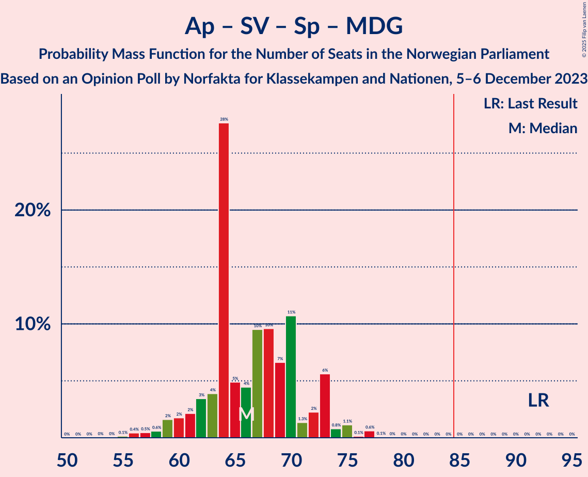

| Number of Seats | Probability | Accumulated | Special Marks |
|:---------------:|:-----------:|:-----------:|:-------------:|
| 54 | 0% | 100% |  |
| 55 | 0.1% | 99.9% |  |
| 56 | 0.4% | 99.8% |  |
| 57 | 0.5% | 99.3% |  |
| 58 | 0.6% | 98.9% |  |
| 59 | 2% | 98% |  |
| 60 | 2% | 97% |  |
| 61 | 2% | 95% |  |
| 62 | 3% | 93% |  |
| 63 | 4% | 89% | Median |
| 64 | 28% | 85% |  |
| 65 | 5% | 58% |  |
| 66 | 4% | 53% |  |
| 67 | 10% | 48% |  |
| 68 | 10% | 39% |  |
| 69 | 7% | 29% |  |
| 70 | 11% | 23% |  |
| 71 | 1.3% | 12% |  |
| 72 | 2% | 11% |  |
| 73 | 6% | 8% |  |
| 74 | 0.8% | 3% |  |
| 75 | 1.1% | 2% |  |
| 76 | 0.1% | 0.9% |  |
| 77 | 0.6% | 0.7% |  |
| 78 | 0.1% | 0.1% |  |
| 79 | 0% | 0% |  |
| 80 | 0% | 0% |  |
| 81 | 0% | 0% |  |
| 82 | 0% | 0% |  |
| 83 | 0% | 0% |  |
| 84 | 0% | 0% |  |
| 85 | 0% | 0% | Majority |
| 86 | 0% | 0% |  |
| 87 | 0% | 0% |  |
| 88 | 0% | 0% |  |
| 89 | 0% | 0% |  |
| 90 | 0% | 0% |  |
| 91 | 0% | 0% |  |
| 92 | 0% | 0% | Last Result |

### Arbeiderpartiet – Sosialistisk Venstreparti – Rødt – Miljøpartiet De Grønne

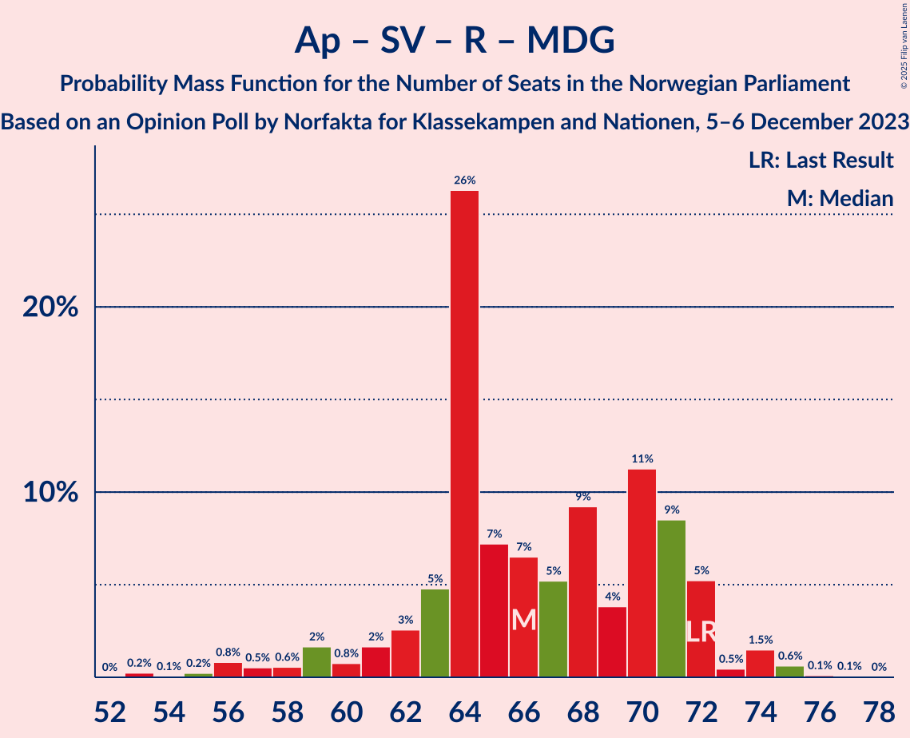

| Number of Seats | Probability | Accumulated | Special Marks |
|:---------------:|:-----------:|:-----------:|:-------------:|
| 52 | 0% | 100% |  |
| 53 | 0.2% | 99.9% |  |
| 54 | 0.1% | 99.7% |  |
| 55 | 0.2% | 99.6% |  |
| 56 | 0.8% | 99.4% |  |
| 57 | 0.5% | 98.6% |  |
| 58 | 0.6% | 98% |  |
| 59 | 2% | 98% |  |
| 60 | 0.8% | 96% |  |
| 61 | 2% | 95% |  |
| 62 | 3% | 93% |  |
| 63 | 5% | 91% | Median |
| 64 | 26% | 86% |  |
| 65 | 7% | 60% |  |
| 66 | 7% | 53% |  |
| 67 | 5% | 46% |  |
| 68 | 9% | 41% |  |
| 69 | 4% | 32% |  |
| 70 | 11% | 28% |  |
| 71 | 9% | 17% |  |
| 72 | 5% | 8% | Last Result |
| 73 | 0.5% | 3% |  |
| 74 | 1.5% | 2% |  |
| 75 | 0.6% | 0.8% |  |
| 76 | 0.1% | 0.2% |  |
| 77 | 0.1% | 0.1% |  |
| 78 | 0% | 0% |  |

### Arbeiderpartiet – Sosialistisk Venstreparti – Senterpartiet

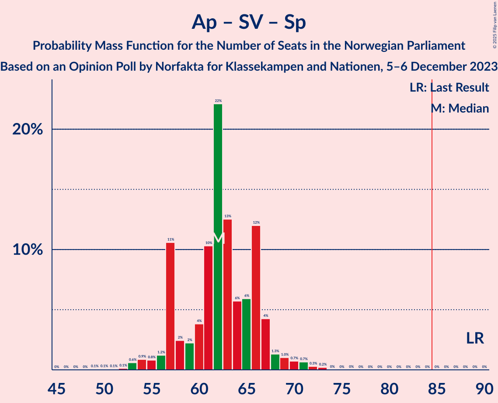

| Number of Seats | Probability | Accumulated | Special Marks |
|:---------------:|:-----------:|:-----------:|:-------------:|
| 49 | 0.1% | 100% |  |
| 50 | 0.1% | 99.9% |  |
| 51 | 0.1% | 99.9% |  |
| 52 | 0.1% | 99.8% |  |
| 53 | 0.6% | 99.7% |  |
| 54 | 0.9% | 99.1% |  |
| 55 | 0.8% | 98% |  |
| 56 | 1.2% | 97% |  |
| 57 | 11% | 96% |  |
| 58 | 2% | 86% |  |
| 59 | 2% | 83% |  |
| 60 | 4% | 81% |  |
| 61 | 10% | 77% | Median |
| 62 | 22% | 67% |  |
| 63 | 13% | 45% |  |
| 64 | 6% | 32% |  |
| 65 | 6% | 26% |  |
| 66 | 12% | 21% |  |
| 67 | 4% | 9% |  |
| 68 | 1.3% | 4% |  |
| 69 | 1.0% | 3% |  |
| 70 | 0.7% | 2% |  |
| 71 | 0.7% | 1.2% |  |
| 72 | 0.3% | 0.5% |  |
| 73 | 0.2% | 0.2% |  |
| 74 | 0% | 0% |  |
| 75 | 0% | 0% |  |
| 76 | 0% | 0% |  |
| 77 | 0% | 0% |  |
| 78 | 0% | 0% |  |
| 79 | 0% | 0% |  |
| 80 | 0% | 0% |  |
| 81 | 0% | 0% |  |
| 82 | 0% | 0% |  |
| 83 | 0% | 0% |  |
| 84 | 0% | 0% |  |
| 85 | 0% | 0% | Majority |
| 86 | 0% | 0% |  |
| 87 | 0% | 0% |  |
| 88 | 0% | 0% |  |
| 89 | 0% | 0% | Last Result |

### Høyre – Venstre – Kristelig Folkeparti

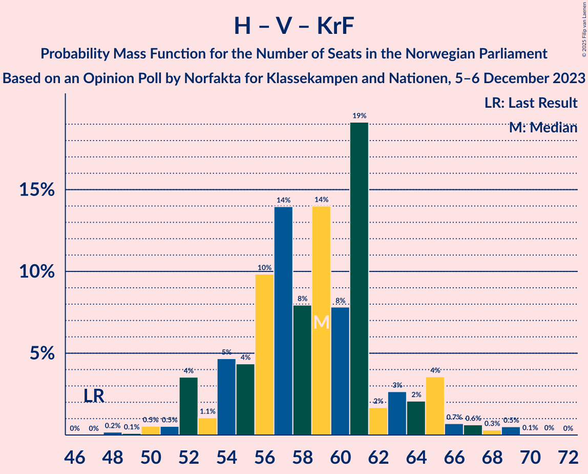

| Number of Seats | Probability | Accumulated | Special Marks |
|:---------------:|:-----------:|:-----------:|:-------------:|
| 47 | 0% | 100% | Last Result |
| 48 | 0.2% | 100% |  |
| 49 | 0.1% | 99.8% |  |
| 50 | 0.5% | 99.7% |  |
| 51 | 0.5% | 99.1% |  |
| 52 | 4% | 98.6% |  |
| 53 | 1.1% | 95% |  |
| 54 | 5% | 94% |  |
| 55 | 4% | 89% |  |
| 56 | 10% | 85% |  |
| 57 | 14% | 75% |  |
| 58 | 8% | 61% | Median |
| 59 | 14% | 53% |  |
| 60 | 8% | 39% |  |
| 61 | 19% | 31% |  |
| 62 | 2% | 12% |  |
| 63 | 3% | 11% |  |
| 64 | 2% | 8% |  |
| 65 | 4% | 6% |  |
| 66 | 0.7% | 2% |  |
| 67 | 0.6% | 2% |  |
| 68 | 0.3% | 1.0% |  |
| 69 | 0.5% | 0.7% |  |
| 70 | 0.1% | 0.1% |  |
| 71 | 0% | 0.1% |  |
| 72 | 0% | 0% |  |

### Arbeiderpartiet – Senterpartiet – Kristelig Folkeparti – Miljøpartiet De Grønne

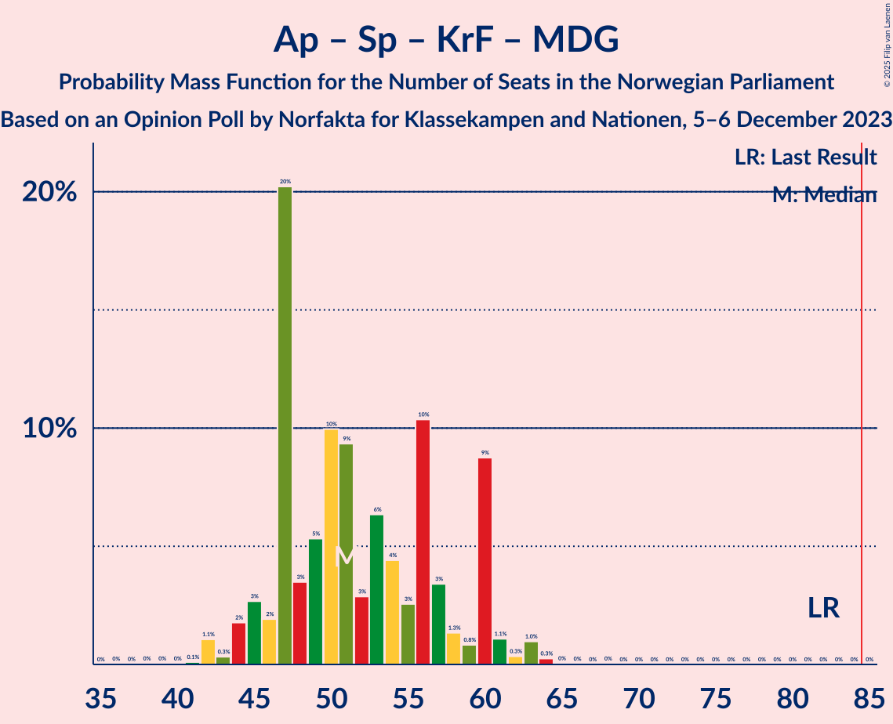

| Number of Seats | Probability | Accumulated | Special Marks |
|:---------------:|:-----------:|:-----------:|:-------------:|
| 38 | 0% | 100% |  |
| 39 | 0% | 99.9% |  |
| 40 | 0% | 99.9% |  |
| 41 | 0.1% | 99.8% |  |
| 42 | 1.1% | 99.7% |  |
| 43 | 0.3% | 98.7% |  |
| 44 | 2% | 98% |  |
| 45 | 3% | 97% |  |
| 46 | 2% | 94% |  |
| 47 | 20% | 92% | Median |
| 48 | 3% | 72% |  |
| 49 | 5% | 68% |  |
| 50 | 10% | 63% |  |
| 51 | 9% | 53% |  |
| 52 | 3% | 44% |  |
| 53 | 6% | 41% |  |
| 54 | 4% | 34% |  |
| 55 | 3% | 30% |  |
| 56 | 10% | 27% |  |
| 57 | 3% | 17% |  |
| 58 | 1.3% | 14% |  |
| 59 | 0.8% | 12% |  |
| 60 | 9% | 12% |  |
| 61 | 1.1% | 3% |  |
| 62 | 0.3% | 2% |  |
| 63 | 1.0% | 1.3% |  |
| 64 | 0.3% | 0.4% |  |
| 65 | 0% | 0.1% |  |
| 66 | 0% | 0.1% |  |
| 67 | 0% | 0% |  |
| 68 | 0% | 0% |  |
| 69 | 0% | 0% |  |
| 70 | 0% | 0% |  |
| 71 | 0% | 0% |  |
| 72 | 0% | 0% |  |
| 73 | 0% | 0% |  |
| 74 | 0% | 0% |  |
| 75 | 0% | 0% |  |
| 76 | 0% | 0% |  |
| 77 | 0% | 0% |  |
| 78 | 0% | 0% |  |
| 79 | 0% | 0% |  |
| 80 | 0% | 0% |  |
| 81 | 0% | 0% |  |
| 82 | 0% | 0% | Last Result |

### Arbeiderpartiet – Sosialistisk Venstreparti

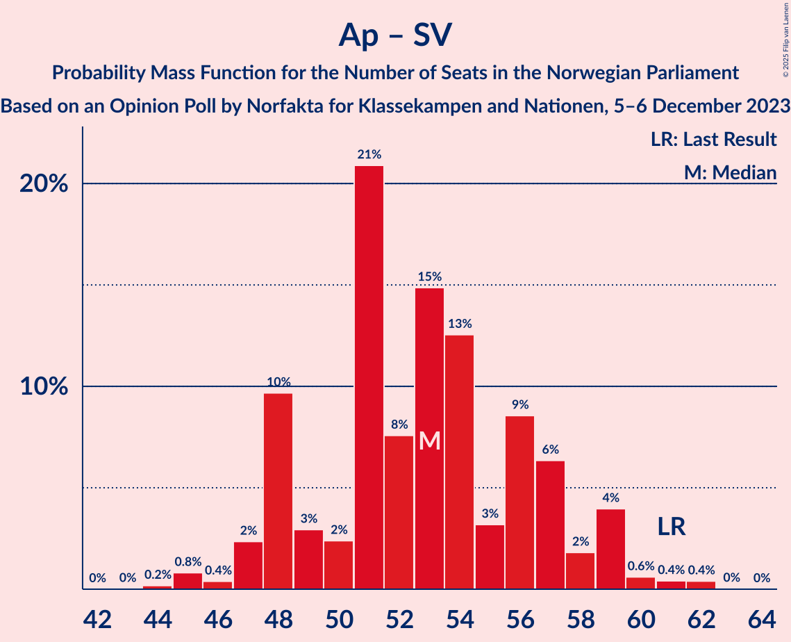

| Number of Seats | Probability | Accumulated | Special Marks |
|:---------------:|:-----------:|:-----------:|:-------------:|
| 44 | 0.2% | 100% |  |
| 45 | 0.8% | 99.8% |  |
| 46 | 0.4% | 99.0% |  |
| 47 | 2% | 98.6% |  |
| 48 | 10% | 96% |  |
| 49 | 3% | 87% |  |
| 50 | 2% | 84% |  |
| 51 | 21% | 81% |  |
| 52 | 8% | 60% | Median |
| 53 | 15% | 53% |  |
| 54 | 13% | 38% |  |
| 55 | 3% | 25% |  |
| 56 | 9% | 22% |  |
| 57 | 6% | 14% |  |
| 58 | 2% | 7% |  |
| 59 | 4% | 5% |  |
| 60 | 0.6% | 1.5% |  |
| 61 | 0.4% | 0.9% | Last Result |
| 62 | 0.4% | 0.4% |  |
| 63 | 0% | 0.1% |  |
| 64 | 0% | 0% |  |

### Arbeiderpartiet – Senterpartiet – Kristelig Folkeparti

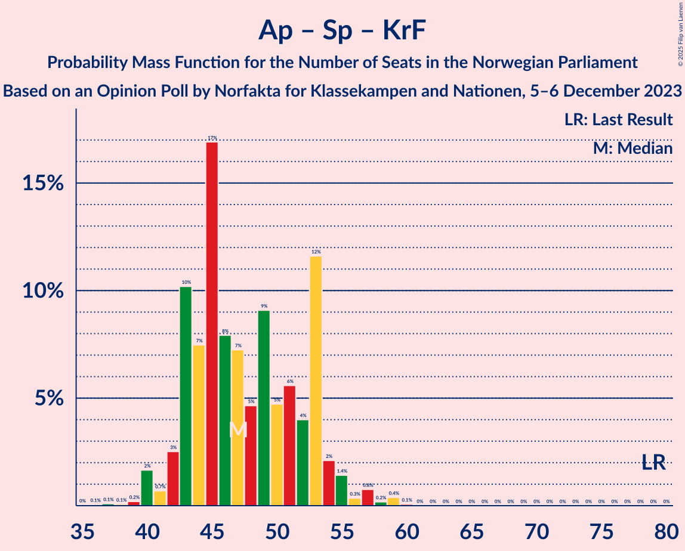

| Number of Seats | Probability | Accumulated | Special Marks |
|:---------------:|:-----------:|:-----------:|:-------------:|
| 35 | 0% | 100% |  |
| 36 | 0.1% | 99.9% |  |
| 37 | 0.1% | 99.9% |  |
| 38 | 0.1% | 99.8% |  |
| 39 | 0.2% | 99.7% |  |
| 40 | 2% | 99.5% |  |
| 41 | 0.7% | 98% |  |
| 42 | 3% | 97% |  |
| 43 | 10% | 95% |  |
| 44 | 7% | 84% |  |
| 45 | 17% | 77% | Median |
| 46 | 8% | 60% |  |
| 47 | 7% | 52% |  |
| 48 | 5% | 45% |  |
| 49 | 9% | 40% |  |
| 50 | 5% | 31% |  |
| 51 | 6% | 26% |  |
| 52 | 4% | 21% |  |
| 53 | 12% | 17% |  |
| 54 | 2% | 5% |  |
| 55 | 1.4% | 3% |  |
| 56 | 0.3% | 2% |  |
| 57 | 0.8% | 1.4% |  |
| 58 | 0.2% | 0.6% |  |
| 59 | 0.4% | 0.5% |  |
| 60 | 0.1% | 0.1% |  |
| 61 | 0% | 0% |  |
| 62 | 0% | 0% |  |
| 63 | 0% | 0% |  |
| 64 | 0% | 0% |  |
| 65 | 0% | 0% |  |
| 66 | 0% | 0% |  |
| 67 | 0% | 0% |  |
| 68 | 0% | 0% |  |
| 69 | 0% | 0% |  |
| 70 | 0% | 0% |  |
| 71 | 0% | 0% |  |
| 72 | 0% | 0% |  |
| 73 | 0% | 0% |  |
| 74 | 0% | 0% |  |
| 75 | 0% | 0% |  |
| 76 | 0% | 0% |  |
| 77 | 0% | 0% |  |
| 78 | 0% | 0% |  |
| 79 | 0% | 0% | Last Result |

### Arbeiderpartiet – Senterpartiet

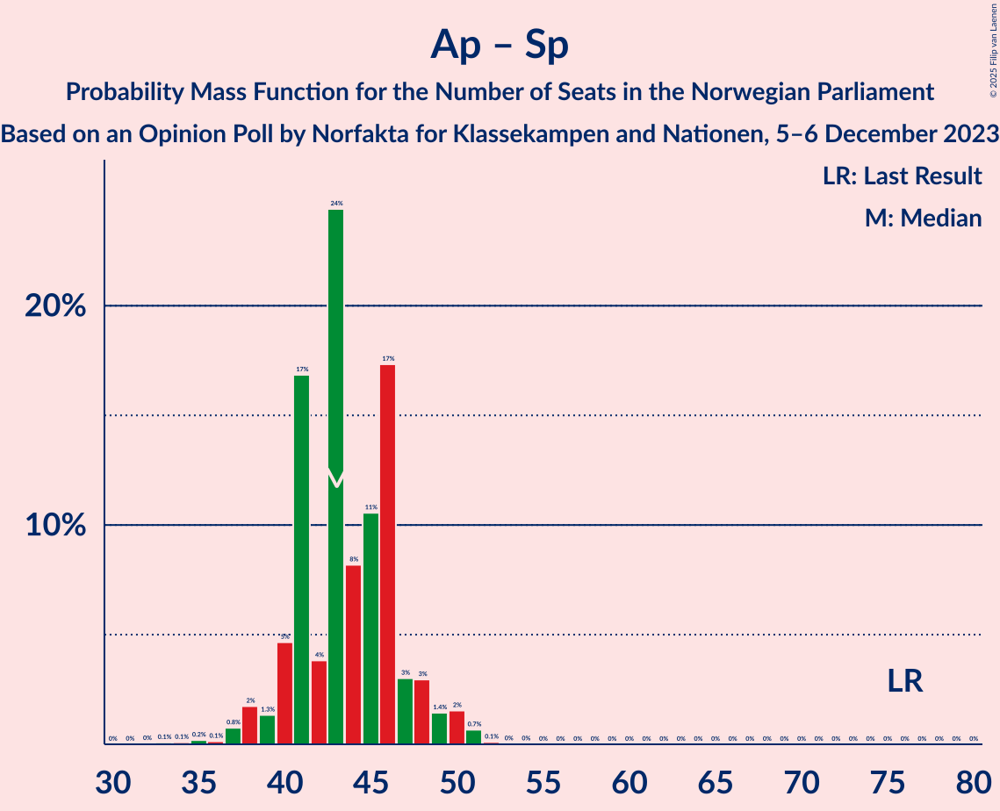

| Number of Seats | Probability | Accumulated | Special Marks |
|:---------------:|:-----------:|:-----------:|:-------------:|
| 32 | 0% | 100% |  |
| 33 | 0.1% | 99.9% |  |
| 34 | 0.1% | 99.9% |  |
| 35 | 0.2% | 99.8% |  |
| 36 | 0.1% | 99.6% |  |
| 37 | 0.8% | 99.4% |  |
| 38 | 2% | 98.7% |  |
| 39 | 1.3% | 97% |  |
| 40 | 5% | 96% |  |
| 41 | 17% | 91% |  |
| 42 | 4% | 74% | Median |
| 43 | 24% | 70% |  |
| 44 | 8% | 46% |  |
| 45 | 11% | 38% |  |
| 46 | 17% | 27% |  |
| 47 | 3% | 10% |  |
| 48 | 3% | 7% |  |
| 49 | 1.4% | 4% |  |
| 50 | 2% | 2% |  |
| 51 | 0.7% | 0.8% |  |
| 52 | 0.1% | 0.2% |  |
| 53 | 0% | 0.1% |  |
| 54 | 0% | 0% |  |
| 55 | 0% | 0% |  |
| 56 | 0% | 0% |  |
| 57 | 0% | 0% |  |
| 58 | 0% | 0% |  |
| 59 | 0% | 0% |  |
| 60 | 0% | 0% |  |
| 61 | 0% | 0% |  |
| 62 | 0% | 0% |  |
| 63 | 0% | 0% |  |
| 64 | 0% | 0% |  |
| 65 | 0% | 0% |  |
| 66 | 0% | 0% |  |
| 67 | 0% | 0% |  |
| 68 | 0% | 0% |  |
| 69 | 0% | 0% |  |
| 70 | 0% | 0% |  |
| 71 | 0% | 0% |  |
| 72 | 0% | 0% |  |
| 73 | 0% | 0% |  |
| 74 | 0% | 0% |  |
| 75 | 0% | 0% |  |
| 76 | 0% | 0% | Last Result |

### Venstre – Senterpartiet – Kristelig Folkeparti

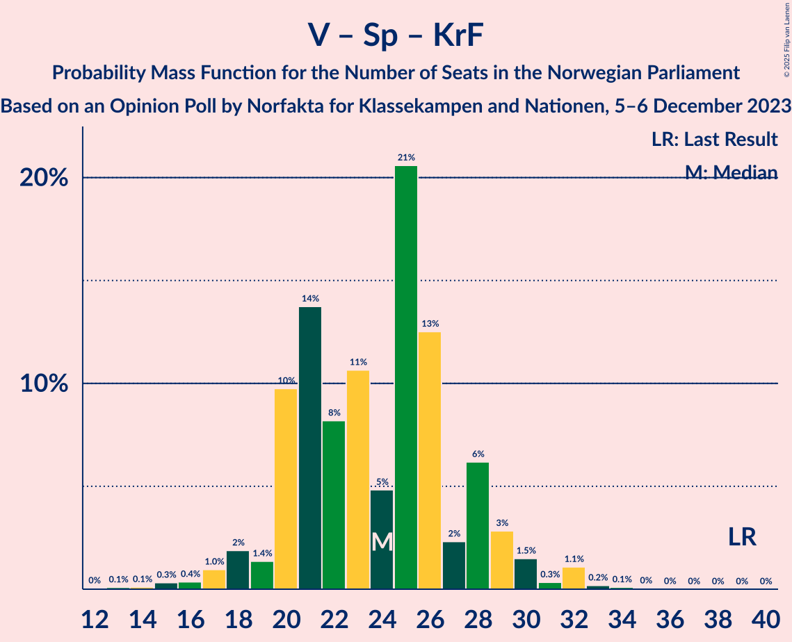

| Number of Seats | Probability | Accumulated | Special Marks |
|:---------------:|:-----------:|:-----------:|:-------------:|
| 12 | 0% | 100% |  |
| 13 | 0.1% | 99.9% |  |
| 14 | 0.1% | 99.9% |  |
| 15 | 0.3% | 99.7% |  |
| 16 | 0.4% | 99.4% |  |
| 17 | 1.0% | 99.1% |  |
| 18 | 2% | 98% |  |
| 19 | 1.4% | 96% |  |
| 20 | 10% | 95% |  |
| 21 | 14% | 85% |  |
| 22 | 8% | 71% | Median |
| 23 | 11% | 63% |  |
| 24 | 5% | 53% |  |
| 25 | 21% | 48% |  |
| 26 | 13% | 27% |  |
| 27 | 2% | 15% |  |
| 28 | 6% | 12% |  |
| 29 | 3% | 6% |  |
| 30 | 1.5% | 3% |  |
| 31 | 0.3% | 2% |  |
| 32 | 1.1% | 1.4% |  |
| 33 | 0.2% | 0.3% |  |
| 34 | 0.1% | 0.2% |  |
| 35 | 0% | 0.1% |  |
| 36 | 0% | 0% |  |
| 37 | 0% | 0% |  |
| 38 | 0% | 0% |  |
| 39 | 0% | 0% | Last Result |

## Technical Information

### Opinion Poll

+ **Polling firm:** Norfakta
+ **Commissioner(s):** Klassekampen and Nationen
+ **Fieldwork period:** 5–6 December 2023

### Calculations

+ **Sample size:** 784
+ **Simulations done:** 1,048,576
+ **Error estimate:** 3.35%

