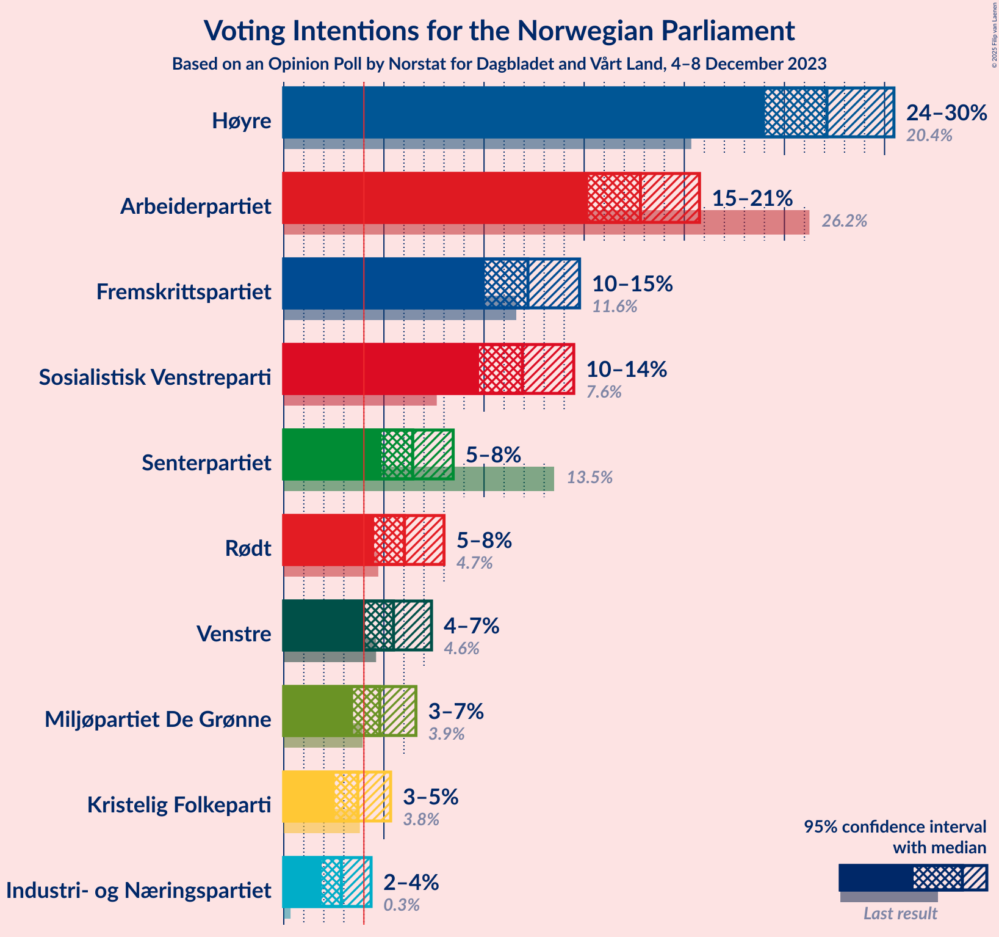
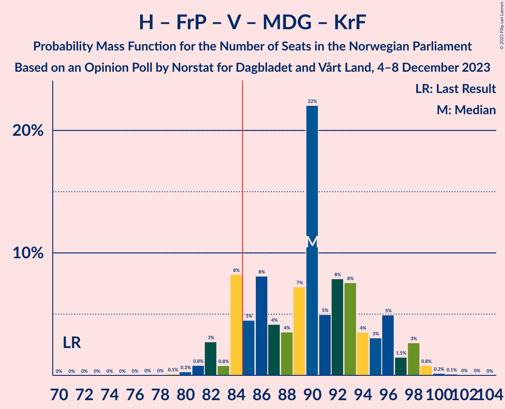
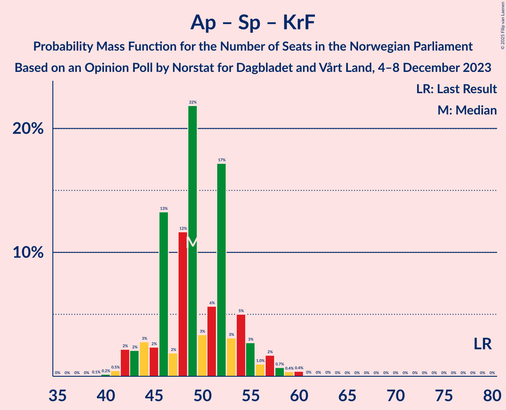

# Opinion Poll by Norstat for Dagbladet and Vårt Land, 4–8 December 2023

<a href="#voting-intentions">Voting Intentions</a> | <a href="#seats">Seats</a> | <a href="#coalitions">Coalitions</a> | <a href="#technical-information">Technical Information</a>

## Voting Intentions

### Confidence Intervals

| Party | Last Result | Poll Result | 80% Confidence Interval | 90% Confidence Interval | 95% Confidence Interval | 99% Confidence Interval |
|:-----:|:-----------:|:-----------:|:-----------------------:|:-----------------------:|:-----------------------:|:-----------------------:|
| Høyre | 20.4% | 27.1% | 25.1–29.3% |24.5–29.9% |24.0–30.5% |23.1–31.5% |
| Arbeiderpartiet | 26.2% | 17.8% | 16.1–19.7% |15.6–20.3% |15.2–20.8% |14.4–21.7% |
| Fremskrittspartiet | 11.6% | 12.2% | 10.8–13.9% |10.3–14.4% |10.0–14.8% |9.4–15.6% |
| Sosialistisk Venstreparti | 7.6% | 11.9% | 10.5–13.6% |10.1–14.1% |9.8–14.5% |9.1–15.3% |
| Senterpartiet | 13.5% | 6.4% | 5.4–7.8% |5.1–8.1% |4.9–8.5% |4.4–9.1% |
| Rødt | 4.7% | 6.0% | 5.0–7.3% |4.8–7.7% |4.5–8.0% |4.1–8.7% |
| Venstre | 4.6% | 5.5% | 4.5–6.7% |4.3–7.1% |4.1–7.4% |3.6–8.0% |
| Miljøpartiet De Grønne | 3.9% | 4.8% | 3.9–6.0% |3.7–6.3% |3.5–6.6% |3.1–7.2% |
| Kristelig Folkeparti | 3.8% | 3.7% | 2.9–4.8% |2.7–5.1% |2.5–5.3% |2.2–5.9% |
| Industri- og Næringspartiet | 0.3% | 2.9% | 2.2–3.8% |2.0–4.1% |1.9–4.4% |1.6–4.9% |

*Note:* The poll result column reflects the actual value used in the calculations. Published results may vary slightly, and in addition be rounded to fewer digits.

## Seats

### Confidence Intervals

| Party | Last Result | Median | 80% Confidence Interval | 90% Confidence Interval | 95% Confidence Interval | 99% Confidence Interval |
|:-----:|:-----------:|:------:|:-----------------------:|:-----------------------:|:-----------------------:|:-----------------------:|
| <a href="#høyre">Høyre</a> | 36 | 47 | 44–52 |42–53 |41–53 |40–55 |
| <a href="#arbeiderpartiet">Arbeiderpartiet</a> | 48 | 34 | 31–37 |30–38 |29–40 |28–42 |
| <a href="#fremskrittspartiet">Fremskrittspartiet</a> | 21 | 21 | 19–24 |18–25 |18–26 |17–28 |
| <a href="#sosialistisk-venstreparti">Sosialistisk Venstreparti</a> | 13 | 21 | 17–23 |17–24 |16–25 |15–27 |
| <a href="#senterpartiet">Senterpartiet</a> | 28 | 11 | 9–14 |8–14 |8–15 |7–16 |
| <a href="#rødt">Rødt</a> | 8 | 10 | 9–13 |8–13 |8–14 |7–15 |
| <a href="#venstre">Venstre</a> | 8 | 9 | 8–11 |7–12 |3–13 |2–13 |
| <a href="#miljøpartiet-de-grønne">Miljøpartiet De Grønne</a> | 3 | 8 | 2–10 |2–10 |2–11 |2–12 |
| <a href="#kristelig-folkeparti">Kristelig Folkeparti</a> | 3 | 3 | 2–8 |2–8 |2–9 |1–10 |
| <a href="#industri--og-næringspartiet">Industri- og Næringspartiet</a> | 0 | 2 | 0–3 |0–7 |0–7 |0–8 |

### Høyre

*For a full overview of the results for this party, see the [Høyre](party-høyre.html) page.*

| Number of Seats | Probability | Accumulated | Special Marks |
|:---------------:|:-----------:|:-----------:|:-------------:|
| 36 | 0% | 100% | Last Result |
| 37 | 0% | 100% |  |
| 38 | 0% | 100% |  |
| 39 | 0.3% | 100% |  |
| 40 | 2% | 99.6% |  |
| 41 | 0.6% | 98% |  |
| 42 | 3% | 97% |  |
| 43 | 2% | 94% |  |
| 44 | 10% | 92% |  |
| 45 | 6% | 82% |  |
| 46 | 20% | 76% |  |
| 47 | 17% | 56% | Median |
| 48 | 7% | 39% |  |
| 49 | 7% | 32% |  |
| 50 | 11% | 25% |  |
| 51 | 4% | 14% |  |
| 52 | 5% | 10% |  |
| 53 | 4% | 5% |  |
| 54 | 0.8% | 2% |  |
| 55 | 0.4% | 0.7% |  |
| 56 | 0.2% | 0.3% |  |
| 57 | 0.1% | 0.2% |  |
| 58 | 0.1% | 0.1% |  |
| 59 | 0% | 0.1% |  |
| 60 | 0% | 0% |  |

### Arbeiderpartiet

*For a full overview of the results for this party, see the [Arbeiderpartiet](party-arbeiderpartiet.html) page.*

| Number of Seats | Probability | Accumulated | Special Marks |
|:---------------:|:-----------:|:-----------:|:-------------:|
| 27 | 0.1% | 100% |  |
| 28 | 2% | 99.9% |  |
| 29 | 2% | 98% |  |
| 30 | 3% | 97% |  |
| 31 | 8% | 93% |  |
| 32 | 11% | 85% |  |
| 33 | 24% | 75% |  |
| 34 | 18% | 51% | Median |
| 35 | 17% | 34% |  |
| 36 | 4% | 16% |  |
| 37 | 3% | 12% |  |
| 38 | 4% | 8% |  |
| 39 | 1.4% | 5% |  |
| 40 | 1.2% | 3% |  |
| 41 | 1.1% | 2% |  |
| 42 | 0.7% | 1.1% |  |
| 43 | 0.3% | 0.4% |  |
| 44 | 0.1% | 0.1% |  |
| 45 | 0% | 0% |  |
| 46 | 0% | 0% |  |
| 47 | 0% | 0% |  |
| 48 | 0% | 0% | Last Result |

### Fremskrittspartiet

*For a full overview of the results for this party, see the [Fremskrittspartiet](party-fremskrittspartiet.html) page.*

| Number of Seats | Probability | Accumulated | Special Marks |
|:---------------:|:-----------:|:-----------:|:-------------:|
| 15 | 0.1% | 100% |  |
| 16 | 0.2% | 99.8% |  |
| 17 | 1.2% | 99.7% |  |
| 18 | 4% | 98% |  |
| 19 | 7% | 95% |  |
| 20 | 17% | 87% |  |
| 21 | 32% | 70% | Last Result, Median |
| 22 | 11% | 38% |  |
| 23 | 9% | 27% |  |
| 24 | 10% | 18% |  |
| 25 | 5% | 7% |  |
| 26 | 1.3% | 3% |  |
| 27 | 0.8% | 1.4% |  |
| 28 | 0.2% | 0.5% |  |
| 29 | 0.2% | 0.4% |  |
| 30 | 0.1% | 0.2% |  |
| 31 | 0% | 0.1% |  |
| 32 | 0% | 0% |  |

### Sosialistisk Venstreparti

*For a full overview of the results for this party, see the [Sosialistisk Venstreparti](party-sosialistiskvenstreparti.html) page.*

| Number of Seats | Probability | Accumulated | Special Marks |
|:---------------:|:-----------:|:-----------:|:-------------:|
| 13 | 0% | 100% | Last Result |
| 14 | 0.1% | 100% |  |
| 15 | 0.6% | 99.8% |  |
| 16 | 3% | 99.2% |  |
| 17 | 6% | 96% |  |
| 18 | 5% | 90% |  |
| 19 | 14% | 84% |  |
| 20 | 11% | 71% |  |
| 21 | 9% | 59% | Median |
| 22 | 26% | 50% |  |
| 23 | 16% | 24% |  |
| 24 | 4% | 8% |  |
| 25 | 2% | 3% |  |
| 26 | 0.5% | 1.1% |  |
| 27 | 0.3% | 0.6% |  |
| 28 | 0.2% | 0.3% |  |
| 29 | 0.1% | 0.1% |  |
| 30 | 0% | 0% |  |

### Senterpartiet

*For a full overview of the results for this party, see the [Senterpartiet](party-senterpartiet.html) page.*

| Number of Seats | Probability | Accumulated | Special Marks |
|:---------------:|:-----------:|:-----------:|:-------------:|
| 2 | 0% | 100% |  |
| 3 | 0% | 99.9% |  |
| 4 | 0% | 99.9% |  |
| 5 | 0% | 99.9% |  |
| 6 | 0% | 99.9% |  |
| 7 | 0.8% | 99.9% |  |
| 8 | 6% | 99.1% |  |
| 9 | 13% | 93% |  |
| 10 | 24% | 81% |  |
| 11 | 11% | 57% | Median |
| 12 | 8% | 46% |  |
| 13 | 26% | 37% |  |
| 14 | 8% | 12% |  |
| 15 | 2% | 4% |  |
| 16 | 2% | 2% |  |
| 17 | 0.2% | 0.3% |  |
| 18 | 0.1% | 0.1% |  |
| 19 | 0% | 0% |  |
| 20 | 0% | 0% |  |
| 21 | 0% | 0% |  |
| 22 | 0% | 0% |  |
| 23 | 0% | 0% |  |
| 24 | 0% | 0% |  |
| 25 | 0% | 0% |  |
| 26 | 0% | 0% |  |
| 27 | 0% | 0% |  |
| 28 | 0% | 0% | Last Result |

### Rødt

*For a full overview of the results for this party, see the [Rødt](party-rødt.html) page.*

| Number of Seats | Probability | Accumulated | Special Marks |
|:---------------:|:-----------:|:-----------:|:-------------:|
| 1 | 0.3% | 100% |  |
| 2 | 0% | 99.7% |  |
| 3 | 0% | 99.7% |  |
| 4 | 0% | 99.7% |  |
| 5 | 0% | 99.7% |  |
| 6 | 0.1% | 99.7% |  |
| 7 | 1.0% | 99.6% |  |
| 8 | 8% | 98.6% | Last Result |
| 9 | 26% | 90% |  |
| 10 | 18% | 64% | Median |
| 11 | 19% | 46% |  |
| 12 | 11% | 26% |  |
| 13 | 11% | 15% |  |
| 14 | 3% | 4% |  |
| 15 | 0.6% | 0.8% |  |
| 16 | 0.2% | 0.2% |  |
| 17 | 0% | 0% |  |

### Venstre

*For a full overview of the results for this party, see the [Venstre](party-venstre.html) page.*

| Number of Seats | Probability | Accumulated | Special Marks |
|:---------------:|:-----------:|:-----------:|:-------------:|
| 2 | 2% | 100% |  |
| 3 | 2% | 98% |  |
| 4 | 0% | 97% |  |
| 5 | 0% | 97% |  |
| 6 | 0.1% | 97% |  |
| 7 | 3% | 96% |  |
| 8 | 28% | 94% | Last Result |
| 9 | 26% | 66% | Median |
| 10 | 16% | 40% |  |
| 11 | 17% | 24% |  |
| 12 | 3% | 7% |  |
| 13 | 4% | 5% |  |
| 14 | 0.3% | 0.3% |  |
| 15 | 0% | 0.1% |  |
| 16 | 0% | 0% |  |

### Miljøpartiet De Grønne

*For a full overview of the results for this party, see the [Miljøpartiet De Grønne](party-miljøpartietdegrønne.html) page.*

| Number of Seats | Probability | Accumulated | Special Marks |
|:---------------:|:-----------:|:-----------:|:-------------:|
| 1 | 0.3% | 100% |  |
| 2 | 10% | 99.7% |  |
| 3 | 5% | 90% | Last Result |
| 4 | 0% | 85% |  |
| 5 | 0% | 85% |  |
| 6 | 0.5% | 85% |  |
| 7 | 10% | 84% |  |
| 8 | 40% | 74% | Median |
| 9 | 21% | 35% |  |
| 10 | 10% | 13% |  |
| 11 | 3% | 4% |  |
| 12 | 0.5% | 0.6% |  |
| 13 | 0.1% | 0.1% |  |
| 14 | 0% | 0% |  |

### Kristelig Folkeparti

*For a full overview of the results for this party, see the [Kristelig Folkeparti](party-kristeligfolkeparti.html) page.*

| Number of Seats | Probability | Accumulated | Special Marks |
|:---------------:|:-----------:|:-----------:|:-------------:|
| 0 | 0.4% | 100% |  |
| 1 | 0.8% | 99.6% |  |
| 2 | 40% | 98.8% |  |
| 3 | 19% | 59% | Last Result, Median |
| 4 | 0% | 40% |  |
| 5 | 0% | 40% |  |
| 6 | 0.8% | 40% |  |
| 7 | 29% | 39% |  |
| 8 | 8% | 11% |  |
| 9 | 2% | 3% |  |
| 10 | 0.5% | 0.6% |  |
| 11 | 0.1% | 0.1% |  |
| 12 | 0% | 0% |  |

### Industri- og Næringspartiet

*For a full overview of the results for this party, see the [Industri- og Næringspartiet](party-industri-ognæringspartiet.html) page.*

| Number of Seats | Probability | Accumulated | Special Marks |
|:---------------:|:-----------:|:-----------:|:-------------:|
| 0 | 21% | 100% | Last Result |
| 1 | 17% | 79% |  |
| 2 | 46% | 62% | Median |
| 3 | 8% | 15% |  |
| 4 | 0% | 7% |  |
| 5 | 0% | 7% |  |
| 6 | 0.9% | 7% |  |
| 7 | 6% | 6% |  |
| 8 | 0.5% | 0.5% |  |
| 9 | 0% | 0.1% |  |
| 10 | 0% | 0% |  |

## Coalitions

### Confidence Intervals

| Coalition | Last Result | Median | Majority? | 80% Confidence Interval | 90% Confidence Interval | 95% Confidence Interval | 99% Confidence Interval |
|:---------:|:-----------:|:------:|:---------:|:-----------------------:|:-----------------------:|:-----------------------:|:-----------------------:|
| Høyre – Fremskrittspartiet – Senterpartiet – Venstre – Kristelig Folkeparti | 96 | 93 | 99.5% | 88–99 | 88–101 | 87–101 | 84–103 |
| Høyre – Fremskrittspartiet – Venstre – Miljøpartiet De Grønne – Kristelig Folkeparti | 71 | 90 | 87% | 84–96 | 84–97 | 82–98 | 80–99 |
| Arbeiderpartiet – Sosialistisk Venstreparti – Senterpartiet – Rødt – Miljøpartiet De Grønne | 100 | 84 | 34% | 79–91 | 77–92 | 77–92 | 73–93 |
| Høyre – Fremskrittspartiet – Venstre – Kristelig Folkeparti | 68 | 82 | 29% | 75–88 | 75–89 | 75–90 | 73–92 |
| Høyre – Fremskrittspartiet – Venstre | 65 | 78 | 6% | 73–83 | 72–85 | 71–86 | 69–87 |
| Arbeiderpartiet – Sosialistisk Venstreparti – Senterpartiet – Miljøpartiet De Grønne – Kristelig Folkeparti | 95 | 78 | 3% | 72–82 | 72–83 | 70–85 | 68–89 |
| Arbeiderpartiet – Sosialistisk Venstreparti – Senterpartiet – Rødt | 97 | 76 | 0.9% | 71–82 | 69–83 | 69–83 | 67–85 |
| Arbeiderpartiet – Sosialistisk Venstreparti – Senterpartiet – Miljøpartiet De Grønne | 92 | 74 | 0% | 69–79 | 68–79 | 67–80 | 65–82 |
| Arbeiderpartiet – Sosialistisk Venstreparti – Rødt – Miljøpartiet De Grønne | 72 | 73 | 0.1% | 68–79 | 66–79 | 65–80 | 63–82 |
| Høyre – Fremskrittspartiet | 57 | 68 | 0% | 64–73 | 63–75 | 62–77 | 60–78 |
| Arbeiderpartiet – Sosialistisk Venstreparti – Senterpartiet | 89 | 67 | 0% | 61–70 | 61–71 | 60–71 | 58–74 |
| Høyre – Venstre – Kristelig Folkeparti | 47 | 61 | 0% | 55–65 | 55–68 | 53–70 | 52–70 |
| Arbeiderpartiet – Senterpartiet – Miljøpartiet De Grønne – Kristelig Folkeparti | 82 | 58 | 0% | 51–61 | 49–63 | 48–64 | 46–68 |
| Arbeiderpartiet – Sosialistisk Venstreparti | 61 | 55 | 0% | 51–57 | 50–59 | 49–61 | 48–63 |
| Arbeiderpartiet – Senterpartiet – Kristelig Folkeparti | 79 | 49 | 0% | 45–54 | 44–55 | 42–57 | 41–60 |
| Arbeiderpartiet – Senterpartiet | 76 | 45 | 0% | 41–48 | 41–50 | 40–52 | 39–53 |
| Senterpartiet – Venstre – Kristelig Folkeparti | 39 | 25 | 0% | 21–29 | 19–31 | 17–32 | 15–34 |

### Høyre – Fremskrittspartiet – Senterpartiet – Venstre – Kristelig Folkeparti

| Number of Seats | Probability | Accumulated | Special Marks |
|:---------------:|:-----------:|:-----------:|:-------------:|
| 81 | 0.1% | 100% |  |
| 82 | 0.1% | 99.8% |  |
| 83 | 0.1% | 99.8% |  |
| 84 | 0.2% | 99.7% |  |
| 85 | 0.5% | 99.5% | Majority |
| 86 | 1.4% | 99.0% |  |
| 87 | 2% | 98% |  |
| 88 | 9% | 96% |  |
| 89 | 2% | 86% |  |
| 90 | 7% | 85% |  |
| 91 | 3% | 78% | Median |
| 92 | 19% | 75% |  |
| 93 | 9% | 56% |  |
| 94 | 8% | 47% |  |
| 95 | 12% | 38% |  |
| 96 | 5% | 26% | Last Result |
| 97 | 6% | 22% |  |
| 98 | 4% | 16% |  |
| 99 | 4% | 12% |  |
| 100 | 2% | 8% |  |
| 101 | 4% | 6% |  |
| 102 | 0.6% | 2% |  |
| 103 | 1.1% | 1.4% |  |
| 104 | 0.2% | 0.3% |  |
| 105 | 0.1% | 0.2% |  |
| 106 | 0.1% | 0.1% |  |
| 107 | 0% | 0% |  |

### Høyre – Fremskrittspartiet – Venstre – Miljøpartiet De Grønne – Kristelig Folkeparti

| Number of Seats | Probability | Accumulated | Special Marks |
|:---------------:|:-----------:|:-----------:|:-------------:|
| 71 | 0% | 100% | Last Result |
| 72 | 0% | 100% |  |
| 73 | 0% | 100% |  |
| 74 | 0% | 100% |  |
| 75 | 0% | 100% |  |
| 76 | 0% | 100% |  |
| 77 | 0% | 100% |  |
| 78 | 0% | 99.9% |  |
| 79 | 0.1% | 99.9% |  |
| 80 | 0.3% | 99.8% |  |
| 81 | 0.8% | 99.5% |  |
| 82 | 3% | 98.7% |  |
| 83 | 0.8% | 96% |  |
| 84 | 8% | 95% |  |
| 85 | 5% | 87% | Majority |
| 86 | 8% | 82% |  |
| 87 | 4% | 74% |  |
| 88 | 4% | 70% | Median |
| 89 | 7% | 67% |  |
| 90 | 22% | 59% |  |
| 91 | 5% | 37% |  |
| 92 | 8% | 32% |  |
| 93 | 8% | 24% |  |
| 94 | 4% | 17% |  |
| 95 | 3% | 13% |  |
| 96 | 5% | 10% |  |
| 97 | 1.5% | 5% |  |
| 98 | 3% | 4% |  |
| 99 | 0.8% | 1.2% |  |
| 100 | 0.2% | 0.4% |  |
| 101 | 0.1% | 0.2% |  |
| 102 | 0% | 0.1% |  |
| 103 | 0% | 0.1% |  |
| 104 | 0% | 0% |  |

### Arbeiderpartiet – Sosialistisk Venstreparti – Senterpartiet – Rødt – Miljøpartiet De Grønne

| Number of Seats | Probability | Accumulated | Special Marks |
|:---------------:|:-----------:|:-----------:|:-------------:|
| 71 | 0.1% | 100% |  |
| 72 | 0.1% | 99.9% |  |
| 73 | 0.5% | 99.8% |  |
| 74 | 0.2% | 99.3% |  |
| 75 | 0.7% | 99.1% |  |
| 76 | 0.5% | 98% |  |
| 77 | 3% | 98% |  |
| 78 | 2% | 95% |  |
| 79 | 7% | 93% |  |
| 80 | 7% | 86% |  |
| 81 | 7% | 80% |  |
| 82 | 11% | 73% |  |
| 83 | 7% | 62% |  |
| 84 | 21% | 55% | Median |
| 85 | 2% | 34% | Majority |
| 86 | 7% | 32% |  |
| 87 | 5% | 25% |  |
| 88 | 5% | 20% |  |
| 89 | 3% | 15% |  |
| 90 | 1.0% | 12% |  |
| 91 | 2% | 11% |  |
| 92 | 8% | 9% |  |
| 93 | 0.5% | 0.9% |  |
| 94 | 0.2% | 0.4% |  |
| 95 | 0.2% | 0.2% |  |
| 96 | 0% | 0.1% |  |
| 97 | 0% | 0% |  |
| 98 | 0% | 0% |  |
| 99 | 0% | 0% |  |
| 100 | 0% | 0% | Last Result |

### Høyre – Fremskrittspartiet – Venstre – Kristelig Folkeparti

| Number of Seats | Probability | Accumulated | Special Marks |
|:---------------:|:-----------:|:-----------:|:-------------:|
| 68 | 0% | 100% | Last Result |
| 69 | 0% | 100% |  |
| 70 | 0.1% | 100% |  |
| 71 | 0.1% | 99.9% |  |
| 72 | 0.2% | 99.8% |  |
| 73 | 0.8% | 99.6% |  |
| 74 | 0.5% | 98.8% |  |
| 75 | 8% | 98% |  |
| 76 | 0.6% | 90% |  |
| 77 | 4% | 89% |  |
| 78 | 4% | 86% |  |
| 79 | 5% | 81% |  |
| 80 | 5% | 76% | Median |
| 81 | 5% | 71% |  |
| 82 | 26% | 66% |  |
| 83 | 4% | 39% |  |
| 84 | 6% | 36% |  |
| 85 | 10% | 29% | Majority |
| 86 | 5% | 19% |  |
| 87 | 3% | 14% |  |
| 88 | 5% | 11% |  |
| 89 | 2% | 7% |  |
| 90 | 3% | 4% |  |
| 91 | 0.3% | 2% |  |
| 92 | 1.0% | 1.3% |  |
| 93 | 0.2% | 0.3% |  |
| 94 | 0.1% | 0.1% |  |
| 95 | 0.1% | 0.1% |  |
| 96 | 0% | 0% |  |

### Høyre – Fremskrittspartiet – Venstre

| Number of Seats | Probability | Accumulated | Special Marks |
|:---------------:|:-----------:|:-----------:|:-------------:|
| 65 | 0% | 100% | Last Result |
| 66 | 0% | 100% |  |
| 67 | 0% | 99.9% |  |
| 68 | 0.4% | 99.9% |  |
| 69 | 0.3% | 99.5% |  |
| 70 | 1.1% | 99.2% |  |
| 71 | 1.0% | 98% |  |
| 72 | 4% | 97% |  |
| 73 | 8% | 93% |  |
| 74 | 2% | 84% |  |
| 75 | 20% | 82% |  |
| 76 | 3% | 62% |  |
| 77 | 5% | 59% | Median |
| 78 | 8% | 54% |  |
| 79 | 11% | 46% |  |
| 80 | 9% | 35% |  |
| 81 | 7% | 26% |  |
| 82 | 5% | 19% |  |
| 83 | 7% | 14% |  |
| 84 | 1.4% | 7% |  |
| 85 | 1.2% | 6% | Majority |
| 86 | 4% | 4% |  |
| 87 | 0.3% | 0.7% |  |
| 88 | 0.2% | 0.4% |  |
| 89 | 0% | 0.2% |  |
| 90 | 0.1% | 0.2% |  |
| 91 | 0% | 0% |  |

### Arbeiderpartiet – Sosialistisk Venstreparti – Senterpartiet – Miljøpartiet De Grønne – Kristelig Folkeparti

| Number of Seats | Probability | Accumulated | Special Marks |
|:---------------:|:-----------:|:-----------:|:-------------:|
| 65 | 0% | 100% |  |
| 66 | 0% | 99.9% |  |
| 67 | 0.1% | 99.9% |  |
| 68 | 0.6% | 99.8% |  |
| 69 | 0.7% | 99.2% |  |
| 70 | 3% | 98.6% |  |
| 71 | 0.6% | 96% |  |
| 72 | 5% | 95% |  |
| 73 | 9% | 90% |  |
| 74 | 7% | 81% |  |
| 75 | 5% | 74% |  |
| 76 | 6% | 69% |  |
| 77 | 7% | 63% | Median |
| 78 | 11% | 56% |  |
| 79 | 4% | 45% |  |
| 80 | 6% | 41% |  |
| 81 | 12% | 36% |  |
| 82 | 16% | 23% |  |
| 83 | 2% | 7% |  |
| 84 | 2% | 5% |  |
| 85 | 0.6% | 3% | Majority |
| 86 | 0.8% | 2% |  |
| 87 | 0.5% | 1.3% |  |
| 88 | 0.1% | 0.8% |  |
| 89 | 0.6% | 0.7% |  |
| 90 | 0.1% | 0.1% |  |
| 91 | 0% | 0% |  |
| 92 | 0% | 0% |  |
| 93 | 0% | 0% |  |
| 94 | 0% | 0% |  |
| 95 | 0% | 0% | Last Result |

### Arbeiderpartiet – Sosialistisk Venstreparti – Senterpartiet – Rødt

| Number of Seats | Probability | Accumulated | Special Marks |
|:---------------:|:-----------:|:-----------:|:-------------:|
| 64 | 0% | 100% |  |
| 65 | 0.1% | 99.9% |  |
| 66 | 0.1% | 99.8% |  |
| 67 | 0.6% | 99.7% |  |
| 68 | 0.6% | 99.2% |  |
| 69 | 4% | 98.5% |  |
| 70 | 4% | 95% |  |
| 71 | 4% | 91% |  |
| 72 | 4% | 87% |  |
| 73 | 6% | 83% |  |
| 74 | 8% | 77% |  |
| 75 | 8% | 69% |  |
| 76 | 17% | 61% | Median |
| 77 | 5% | 44% |  |
| 78 | 4% | 38% |  |
| 79 | 9% | 35% |  |
| 80 | 9% | 26% |  |
| 81 | 5% | 16% |  |
| 82 | 2% | 12% |  |
| 83 | 8% | 10% |  |
| 84 | 0.6% | 2% |  |
| 85 | 0.6% | 0.9% | Majority |
| 86 | 0.2% | 0.3% |  |
| 87 | 0.1% | 0.2% |  |
| 88 | 0.1% | 0.1% |  |
| 89 | 0% | 0% |  |
| 90 | 0% | 0% |  |
| 91 | 0% | 0% |  |
| 92 | 0% | 0% |  |
| 93 | 0% | 0% |  |
| 94 | 0% | 0% |  |
| 95 | 0% | 0% |  |
| 96 | 0% | 0% |  |
| 97 | 0% | 0% | Last Result |

### Arbeiderpartiet – Sosialistisk Venstreparti – Senterpartiet – Miljøpartiet De Grønne

| Number of Seats | Probability | Accumulated | Special Marks |
|:---------------:|:-----------:|:-----------:|:-------------:|
| 61 | 0% | 100% |  |
| 62 | 0.1% | 99.9% |  |
| 63 | 0.1% | 99.9% |  |
| 64 | 0.3% | 99.8% |  |
| 65 | 0.6% | 99.5% |  |
| 66 | 0.9% | 98.9% |  |
| 67 | 2% | 98% |  |
| 68 | 4% | 96% |  |
| 69 | 4% | 91% |  |
| 70 | 10% | 87% |  |
| 71 | 10% | 77% |  |
| 72 | 11% | 68% |  |
| 73 | 5% | 57% |  |
| 74 | 4% | 52% | Median |
| 75 | 24% | 48% |  |
| 76 | 3% | 24% |  |
| 77 | 2% | 21% |  |
| 78 | 6% | 18% |  |
| 79 | 9% | 13% |  |
| 80 | 2% | 4% |  |
| 81 | 1.2% | 2% |  |
| 82 | 0.5% | 0.9% |  |
| 83 | 0.2% | 0.4% |  |
| 84 | 0.1% | 0.2% |  |
| 85 | 0% | 0% | Majority |
| 86 | 0% | 0% |  |
| 87 | 0% | 0% |  |
| 88 | 0% | 0% |  |
| 89 | 0% | 0% |  |
| 90 | 0% | 0% |  |
| 91 | 0% | 0% |  |
| 92 | 0% | 0% | Last Result |

### Arbeiderpartiet – Sosialistisk Venstreparti – Rødt – Miljøpartiet De Grønne

| Number of Seats | Probability | Accumulated | Special Marks |
|:---------------:|:-----------:|:-----------:|:-------------:|
| 61 | 0.1% | 100% |  |
| 62 | 0.1% | 99.9% |  |
| 63 | 0.3% | 99.8% |  |
| 64 | 0.4% | 99.4% |  |
| 65 | 2% | 99.0% |  |
| 66 | 4% | 97% |  |
| 67 | 3% | 93% |  |
| 68 | 8% | 90% |  |
| 69 | 5% | 83% |  |
| 70 | 4% | 78% |  |
| 71 | 11% | 73% |  |
| 72 | 8% | 62% | Last Result |
| 73 | 10% | 54% | Median |
| 74 | 20% | 44% |  |
| 75 | 4% | 24% |  |
| 76 | 4% | 21% |  |
| 77 | 1.3% | 16% |  |
| 78 | 3% | 15% |  |
| 79 | 9% | 12% |  |
| 80 | 2% | 3% |  |
| 81 | 0.4% | 0.9% |  |
| 82 | 0.2% | 0.5% |  |
| 83 | 0.1% | 0.3% |  |
| 84 | 0% | 0.2% |  |
| 85 | 0.1% | 0.1% | Majority |
| 86 | 0% | 0.1% |  |
| 87 | 0% | 0% |  |

### Høyre – Fremskrittspartiet

| Number of Seats | Probability | Accumulated | Special Marks |
|:---------------:|:-----------:|:-----------:|:-------------:|
| 57 | 0% | 100% | Last Result |
| 58 | 0% | 100% |  |
| 59 | 0.4% | 99.9% |  |
| 60 | 0.5% | 99.5% |  |
| 61 | 0.8% | 99.0% |  |
| 62 | 2% | 98% |  |
| 63 | 3% | 97% |  |
| 64 | 10% | 94% |  |
| 65 | 2% | 84% |  |
| 66 | 3% | 82% |  |
| 67 | 21% | 80% |  |
| 68 | 14% | 58% | Median |
| 69 | 7% | 44% |  |
| 70 | 5% | 38% |  |
| 71 | 12% | 33% |  |
| 72 | 6% | 21% |  |
| 73 | 5% | 15% |  |
| 74 | 3% | 10% |  |
| 75 | 1.4% | 6% |  |
| 76 | 1.3% | 5% |  |
| 77 | 3% | 3% |  |
| 78 | 0.2% | 0.6% |  |
| 79 | 0.3% | 0.4% |  |
| 80 | 0.1% | 0.1% |  |
| 81 | 0.1% | 0.1% |  |
| 82 | 0% | 0% |  |

### Arbeiderpartiet – Sosialistisk Venstreparti – Senterpartiet

| Number of Seats | Probability | Accumulated | Special Marks |
|:---------------:|:-----------:|:-----------:|:-------------:|
| 55 | 0% | 100% |  |
| 56 | 0.1% | 99.9% |  |
| 57 | 0.1% | 99.8% |  |
| 58 | 0.7% | 99.7% |  |
| 59 | 1.0% | 99.0% |  |
| 60 | 3% | 98% |  |
| 61 | 8% | 95% |  |
| 62 | 8% | 87% |  |
| 63 | 4% | 79% |  |
| 64 | 10% | 75% |  |
| 65 | 6% | 65% |  |
| 66 | 7% | 59% | Median |
| 67 | 18% | 52% |  |
| 68 | 8% | 34% |  |
| 69 | 7% | 26% |  |
| 70 | 14% | 19% |  |
| 71 | 3% | 5% |  |
| 72 | 0.8% | 2% |  |
| 73 | 1.0% | 2% |  |
| 74 | 0.3% | 0.7% |  |
| 75 | 0.2% | 0.4% |  |
| 76 | 0% | 0.2% |  |
| 77 | 0.1% | 0.1% |  |
| 78 | 0% | 0% |  |
| 79 | 0% | 0% |  |
| 80 | 0% | 0% |  |
| 81 | 0% | 0% |  |
| 82 | 0% | 0% |  |
| 83 | 0% | 0% |  |
| 84 | 0% | 0% |  |
| 85 | 0% | 0% | Majority |
| 86 | 0% | 0% |  |
| 87 | 0% | 0% |  |
| 88 | 0% | 0% |  |
| 89 | 0% | 0% | Last Result |

### Høyre – Venstre – Kristelig Folkeparti

| Number of Seats | Probability | Accumulated | Special Marks |
|:---------------:|:-----------:|:-----------:|:-------------:|
| 47 | 0% | 100% | Last Result |
| 48 | 0% | 100% |  |
| 49 | 0% | 100% |  |
| 50 | 0.1% | 100% |  |
| 51 | 0.3% | 99.9% |  |
| 52 | 0.6% | 99.6% |  |
| 53 | 2% | 98.9% |  |
| 54 | 1.4% | 97% |  |
| 55 | 9% | 96% |  |
| 56 | 2% | 87% |  |
| 57 | 3% | 85% |  |
| 58 | 9% | 82% |  |
| 59 | 7% | 72% | Median |
| 60 | 5% | 66% |  |
| 61 | 26% | 61% |  |
| 62 | 5% | 35% |  |
| 63 | 10% | 30% |  |
| 64 | 5% | 21% |  |
| 65 | 6% | 15% |  |
| 66 | 2% | 9% |  |
| 67 | 2% | 7% |  |
| 68 | 2% | 6% |  |
| 69 | 0.3% | 3% |  |
| 70 | 3% | 3% |  |
| 71 | 0.1% | 0.4% |  |
| 72 | 0.2% | 0.3% |  |
| 73 | 0% | 0.1% |  |
| 74 | 0% | 0% |  |

### Arbeiderpartiet – Senterpartiet – Miljøpartiet De Grønne – Kristelig Folkeparti

| Number of Seats | Probability | Accumulated | Special Marks |
|:---------------:|:-----------:|:-----------:|:-------------:|
| 44 | 0% | 100% |  |
| 45 | 0.1% | 99.9% |  |
| 46 | 0.5% | 99.8% |  |
| 47 | 0.2% | 99.3% |  |
| 48 | 3% | 99.1% |  |
| 49 | 2% | 96% |  |
| 50 | 3% | 94% |  |
| 51 | 3% | 91% |  |
| 52 | 2% | 88% |  |
| 53 | 3% | 86% |  |
| 54 | 7% | 83% |  |
| 55 | 6% | 76% |  |
| 56 | 9% | 70% | Median |
| 57 | 9% | 62% |  |
| 58 | 17% | 53% |  |
| 59 | 6% | 36% |  |
| 60 | 17% | 30% |  |
| 61 | 4% | 13% |  |
| 62 | 2% | 9% |  |
| 63 | 2% | 7% |  |
| 64 | 2% | 4% |  |
| 65 | 0.8% | 2% |  |
| 66 | 0.8% | 2% |  |
| 67 | 0.1% | 0.8% |  |
| 68 | 0.5% | 0.7% |  |
| 69 | 0.1% | 0.2% |  |
| 70 | 0.1% | 0.1% |  |
| 71 | 0% | 0% |  |
| 72 | 0% | 0% |  |
| 73 | 0% | 0% |  |
| 74 | 0% | 0% |  |
| 75 | 0% | 0% |  |
| 76 | 0% | 0% |  |
| 77 | 0% | 0% |  |
| 78 | 0% | 0% |  |
| 79 | 0% | 0% |  |
| 80 | 0% | 0% |  |
| 81 | 0% | 0% |  |
| 82 | 0% | 0% | Last Result |

### Arbeiderpartiet – Sosialistisk Venstreparti

| Number of Seats | Probability | Accumulated | Special Marks |
|:---------------:|:-----------:|:-----------:|:-------------:|
| 46 | 0.1% | 100% |  |
| 47 | 0.3% | 99.9% |  |
| 48 | 1.0% | 99.6% |  |
| 49 | 3% | 98.7% |  |
| 50 | 4% | 96% |  |
| 51 | 5% | 92% |  |
| 52 | 14% | 87% |  |
| 53 | 13% | 73% |  |
| 54 | 2% | 59% |  |
| 55 | 12% | 57% | Median |
| 56 | 9% | 45% |  |
| 57 | 26% | 36% |  |
| 58 | 2% | 9% |  |
| 59 | 3% | 7% |  |
| 60 | 1.0% | 4% |  |
| 61 | 1.2% | 3% | Last Result |
| 62 | 1.1% | 2% |  |
| 63 | 0.1% | 0.5% |  |
| 64 | 0.2% | 0.4% |  |
| 65 | 0.1% | 0.2% |  |
| 66 | 0.1% | 0.1% |  |
| 67 | 0% | 0% |  |

### Arbeiderpartiet – Senterpartiet – Kristelig Folkeparti

| Number of Seats | Probability | Accumulated | Special Marks |
|:---------------:|:-----------:|:-----------:|:-------------:|
| 39 | 0.1% | 100% |  |
| 40 | 0.2% | 99.9% |  |
| 41 | 0.5% | 99.7% |  |
| 42 | 2% | 99.3% |  |
| 43 | 2% | 97% |  |
| 44 | 3% | 95% |  |
| 45 | 2% | 92% |  |
| 46 | 13% | 90% |  |
| 47 | 2% | 77% |  |
| 48 | 12% | 75% | Median |
| 49 | 22% | 63% |  |
| 50 | 3% | 41% |  |
| 51 | 6% | 38% |  |
| 52 | 17% | 32% |  |
| 53 | 3% | 15% |  |
| 54 | 5% | 12% |  |
| 55 | 3% | 7% |  |
| 56 | 1.0% | 4% |  |
| 57 | 2% | 3% |  |
| 58 | 0.7% | 2% |  |
| 59 | 0.4% | 0.9% |  |
| 60 | 0.4% | 0.5% |  |
| 61 | 0% | 0.1% |  |
| 62 | 0% | 0.1% |  |
| 63 | 0% | 0% |  |
| 64 | 0% | 0% |  |
| 65 | 0% | 0% |  |
| 66 | 0% | 0% |  |
| 67 | 0% | 0% |  |
| 68 | 0% | 0% |  |
| 69 | 0% | 0% |  |
| 70 | 0% | 0% |  |
| 71 | 0% | 0% |  |
| 72 | 0% | 0% |  |
| 73 | 0% | 0% |  |
| 74 | 0% | 0% |  |
| 75 | 0% | 0% |  |
| 76 | 0% | 0% |  |
| 77 | 0% | 0% |  |
| 78 | 0% | 0% |  |
| 79 | 0% | 0% | Last Result |

### Arbeiderpartiet – Senterpartiet

| Number of Seats | Probability | Accumulated | Special Marks |
|:---------------:|:-----------:|:-----------:|:-------------:|
| 36 | 0% | 100% |  |
| 37 | 0.1% | 99.9% |  |
| 38 | 0.3% | 99.8% |  |
| 39 | 1.3% | 99.5% |  |
| 40 | 3% | 98% |  |
| 41 | 6% | 95% |  |
| 42 | 8% | 90% |  |
| 43 | 8% | 81% |  |
| 44 | 10% | 74% |  |
| 45 | 21% | 63% | Median |
| 46 | 12% | 42% |  |
| 47 | 15% | 30% |  |
| 48 | 6% | 15% |  |
| 49 | 2% | 9% |  |
| 50 | 2% | 7% |  |
| 51 | 1.5% | 5% |  |
| 52 | 2% | 3% |  |
| 53 | 0.8% | 1.0% |  |
| 54 | 0.1% | 0.2% |  |
| 55 | 0.1% | 0.1% |  |
| 56 | 0% | 0.1% |  |
| 57 | 0% | 0% |  |
| 58 | 0% | 0% |  |
| 59 | 0% | 0% |  |
| 60 | 0% | 0% |  |
| 61 | 0% | 0% |  |
| 62 | 0% | 0% |  |
| 63 | 0% | 0% |  |
| 64 | 0% | 0% |  |
| 65 | 0% | 0% |  |
| 66 | 0% | 0% |  |
| 67 | 0% | 0% |  |
| 68 | 0% | 0% |  |
| 69 | 0% | 0% |  |
| 70 | 0% | 0% |  |
| 71 | 0% | 0% |  |
| 72 | 0% | 0% |  |
| 73 | 0% | 0% |  |
| 74 | 0% | 0% |  |
| 75 | 0% | 0% |  |
| 76 | 0% | 0% | Last Result |

### Senterpartiet – Venstre – Kristelig Folkeparti

| Number of Seats | Probability | Accumulated | Special Marks |
|:---------------:|:-----------:|:-----------:|:-------------:|
| 13 | 0.1% | 100% |  |
| 14 | 0.1% | 99.9% |  |
| 15 | 0.7% | 99.9% |  |
| 16 | 1.3% | 99.2% |  |
| 17 | 0.4% | 98% |  |
| 18 | 0.8% | 97% |  |
| 19 | 3% | 97% |  |
| 20 | 2% | 94% |  |
| 21 | 3% | 92% |  |
| 22 | 6% | 89% |  |
| 23 | 5% | 82% | Median |
| 24 | 22% | 78% |  |
| 25 | 22% | 56% |  |
| 26 | 12% | 34% |  |
| 27 | 9% | 22% |  |
| 28 | 3% | 13% |  |
| 29 | 2% | 11% |  |
| 30 | 2% | 9% |  |
| 31 | 4% | 7% |  |
| 32 | 1.1% | 3% |  |
| 33 | 1.3% | 2% |  |
| 34 | 0.3% | 0.5% |  |
| 35 | 0.2% | 0.2% |  |
| 36 | 0% | 0% |  |
| 37 | 0% | 0% |  |
| 38 | 0% | 0% |  |
| 39 | 0% | 0% | Last Result |

## Technical Information

### Opinion Poll

+ **Polling firm:** Norstat
+ **Commissioner(s):** Dagbladet and Vårt Land
+ **Fieldwork period:** 4–8 December 2023

### Calculations

+ **Sample size:** 730
+ **Simulations done:** 1,048,576
+ **Error estimate:** 2.41%

