# Opinion Poll by Respons Analyse for VG, 6–11 December 2023

<a href="#voting-intentions">Voting Intentions</a> | <a href="#seats">Seats</a> | <a href="#coalitions">Coalitions</a> | <a href="#technical-information">Technical Information</a>

## Voting Intentions

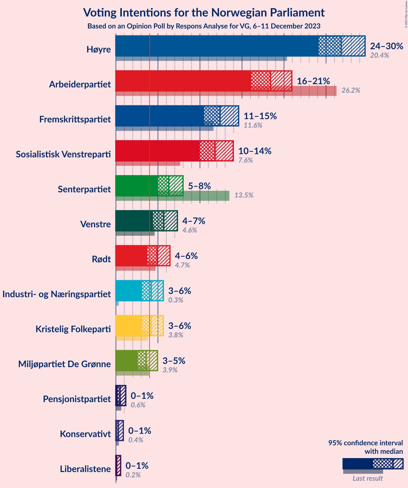

### Confidence Intervals

| Party | Last Result | Poll Result | 80% Confidence Interval | 90% Confidence Interval | 95% Confidence Interval | 99% Confidence Interval |
|:-----:|:-----------:|:-----------:|:-----------------------:|:-----------------------:|:-----------------------:|:-----------------------:|
| Høyre | 20.4% | 26.8% | 25.1–28.7% |24.6–29.2% |24.1–29.6% |23.3–30.5% |
| Arbeiderpartiet | 26.2% | 18.4% | 16.9–20.1% |16.5–20.5% |16.1–20.9% |15.4–21.7% |
| Fremskrittspartiet | 11.6% | 12.4% | 11.1–13.8% |10.8–14.2% |10.5–14.6% |9.9–15.3% |
| Sosialistisk Venstreparti | 7.6% | 11.8% | 10.6–13.2% |10.2–13.6% |9.9–14.0% |9.4–14.6% |
| Senterpartiet | 13.5% | 6.3% | 5.4–7.4% |5.2–7.7% |5.0–8.0% |4.6–8.6% |
| Venstre | 4.6% | 5.7% | 4.9–6.8% |4.6–7.1% |4.4–7.3% |4.1–7.9% |
| Rødt | 4.7% | 4.9% | 4.1–5.9% |3.9–6.2% |3.7–6.4% |3.4–6.9% |
| Kristelig Folkeparti | 3.8% | 4.2% | 3.5–5.1% |3.3–5.4% |3.1–5.6% |2.8–6.1% |
| Industri- og Næringspartiet | 0.3% | 4.2% | 3.5–5.1% |3.3–5.4% |3.1–5.6% |2.8–6.1% |
| Miljøpartiet De Grønne | 3.9% | 3.6% | 2.9–4.5% |2.8–4.7% |2.6–5.0% |2.3–5.4% |
| Pensjonistpartiet | 0.6% | 0.5% | 0.3–0.9% |0.3–1.1% |0.2–1.2% |0.2–1.4% |
| Konservativt | 0.4% | 0.3% | 0.2–0.7% |0.1–0.8% |0.1–0.9% |0.1–1.1% |
| Liberalistene | 0.2% | 0.1% | 0.0–0.4% |0.0–0.5% |0.0–0.6% |0.0–0.7% |

*Note:* The poll result column reflects the actual value used in the calculations. Published results may vary slightly, and in addition be rounded to fewer digits.

## Seats

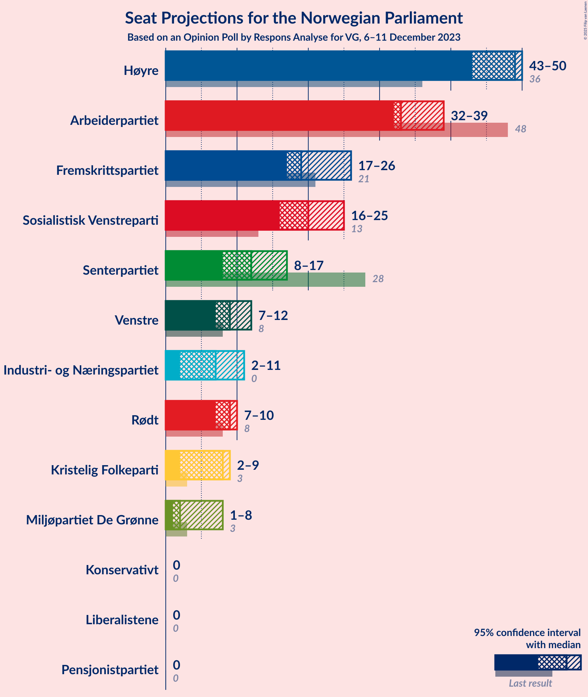

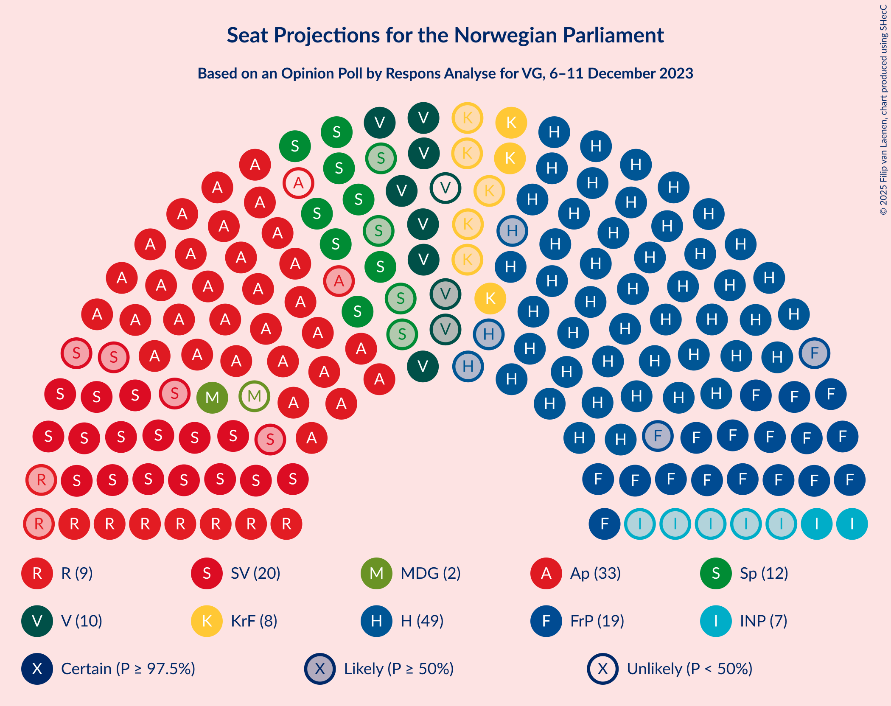

### Confidence Intervals

| Party | Last Result | Median | 80% Confidence Interval | 90% Confidence Interval | 95% Confidence Interval | 99% Confidence Interval |
|:-----:|:-----------:|:------:|:-----------------------:|:-----------------------:|:-----------------------:|:-----------------------:|
| <a href="#høyre">Høyre</a> | 36 | 49 | 45–49 |44–49 |43–50 |41–54 |
| <a href="#arbeiderpartiet">Arbeiderpartiet</a> | 48 | 33 | 33–35 |32–38 |32–39 |31–42 |
| <a href="#fremskrittspartiet">Fremskrittspartiet</a> | 21 | 19 | 19–26 |17–26 |17–26 |17–27 |
| <a href="#sosialistisk-venstreparti">Sosialistisk Venstreparti</a> | 13 | 20 | 19–23 |17–24 |16–25 |15–25 |
| <a href="#senterpartiet">Senterpartiet</a> | 28 | 12 | 10–13 |9–17 |8–17 |7–17 |
| <a href="#venstre">Venstre</a> | 8 | 9 | 8–11 |8–12 |7–12 |7–13 |
| <a href="#rødt">Rødt</a> | 8 | 9 | 7–9 |7–9 |7–10 |1–11 |
| <a href="#kristelig-folkeparti">Kristelig Folkeparti</a> | 3 | 8 | 3–8 |3–8 |2–9 |2–10 |
| <a href="#industri--og-næringspartiet">Industri- og Næringspartiet</a> | 0 | 7 | 2–8 |2–11 |2–11 |2–11 |
| <a href="#miljøpartiet-de-grønne">Miljøpartiet De Grønne</a> | 3 | 2 | 2–3 |2–7 |1–8 |1–8 |
| <a href="#pensjonistpartiet">Pensjonistpartiet</a> | 0 | 0 | 0 |0 |0 |0 |
| <a href="#konservativt">Konservativt</a> | 0 | 0 | 0 |0 |0 |0 |
| <a href="#liberalistene">Liberalistene</a> | 0 | 0 | 0 |0 |0 |0 |

### Høyre

*For a full overview of the results for this party, see the [Høyre](party-høyre.html) page.*

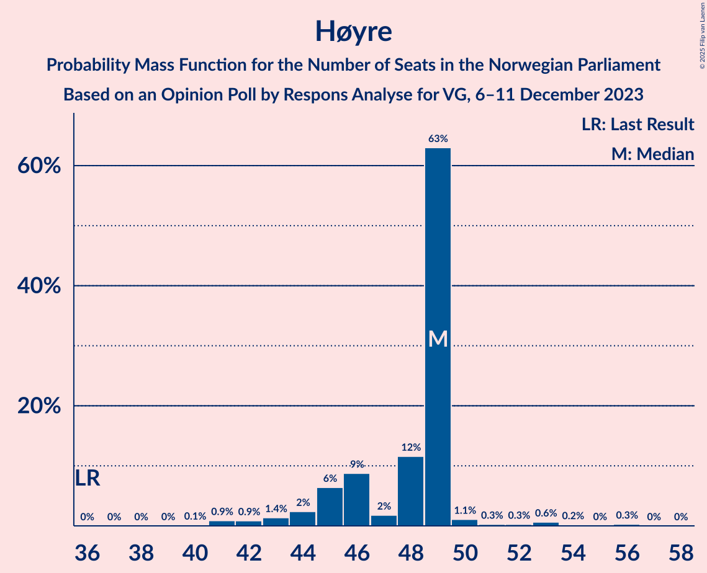

| Number of Seats | Probability | Accumulated | Special Marks |
|:---------------:|:-----------:|:-----------:|:-------------:|
| 36 | 0% | 100% | Last Result |
| 37 | 0% | 100% |  |
| 38 | 0% | 100% |  |
| 39 | 0% | 100% |  |
| 40 | 0.1% | 100% |  |
| 41 | 0.9% | 99.8% |  |
| 42 | 0.9% | 99.0% |  |
| 43 | 1.4% | 98% |  |
| 44 | 2% | 97% |  |
| 45 | 6% | 94% |  |
| 46 | 9% | 88% |  |
| 47 | 2% | 79% |  |
| 48 | 12% | 77% |  |
| 49 | 63% | 66% | Median |
| 50 | 1.1% | 3% |  |
| 51 | 0.3% | 2% |  |
| 52 | 0.3% | 1.4% |  |
| 53 | 0.6% | 1.2% |  |
| 54 | 0.2% | 0.5% |  |
| 55 | 0% | 0.3% |  |
| 56 | 0.3% | 0.3% |  |
| 57 | 0% | 0% |  |

### Arbeiderpartiet

*For a full overview of the results for this party, see the [Arbeiderpartiet](party-arbeiderpartiet.html) page.*

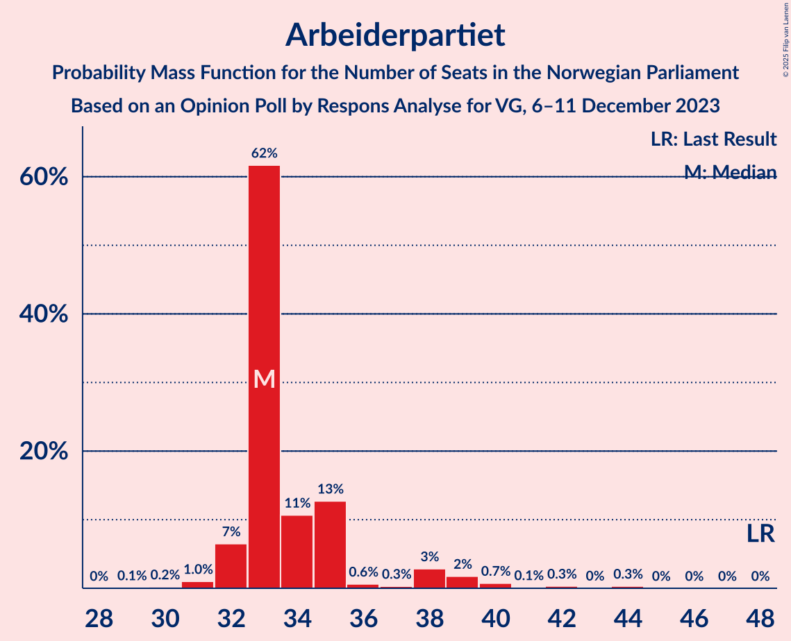

| Number of Seats | Probability | Accumulated | Special Marks |
|:---------------:|:-----------:|:-----------:|:-------------:|
| 29 | 0.1% | 100% |  |
| 30 | 0.2% | 99.9% |  |
| 31 | 1.0% | 99.7% |  |
| 32 | 7% | 98.7% |  |
| 33 | 62% | 92% | Median |
| 34 | 11% | 30% |  |
| 35 | 13% | 20% |  |
| 36 | 0.6% | 7% |  |
| 37 | 0.3% | 6% |  |
| 38 | 3% | 6% |  |
| 39 | 2% | 3% |  |
| 40 | 0.7% | 2% |  |
| 41 | 0.1% | 0.8% |  |
| 42 | 0.3% | 0.7% |  |
| 43 | 0% | 0.4% |  |
| 44 | 0.3% | 0.3% |  |
| 45 | 0% | 0% |  |
| 46 | 0% | 0% |  |
| 47 | 0% | 0% |  |
| 48 | 0% | 0% | Last Result |

### Fremskrittspartiet

*For a full overview of the results for this party, see the [Fremskrittspartiet](party-fremskrittspartiet.html) page.*

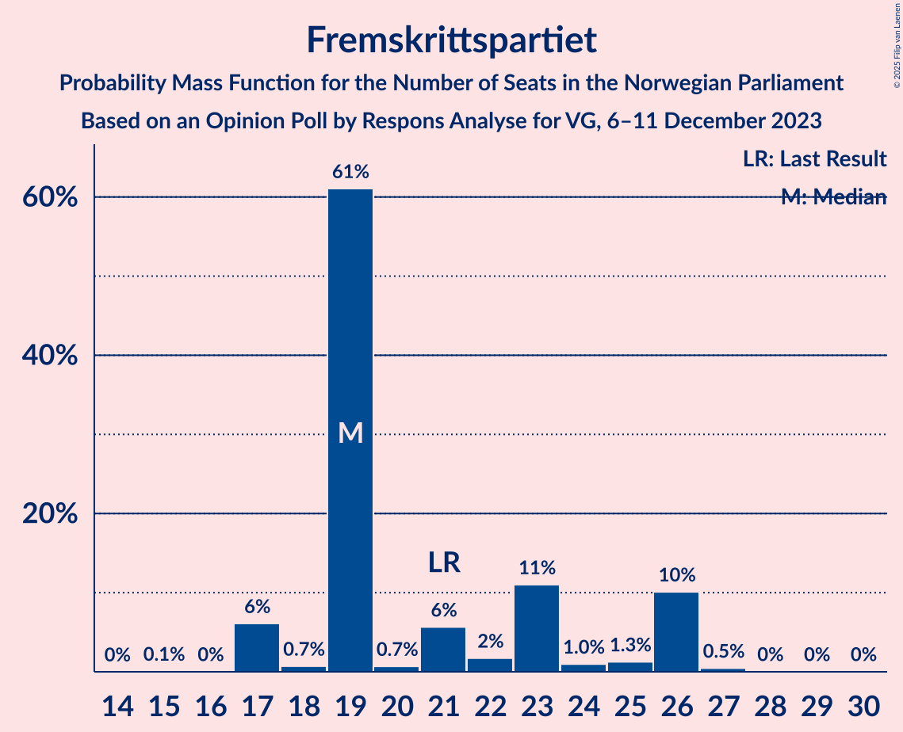

| Number of Seats | Probability | Accumulated | Special Marks |
|:---------------:|:-----------:|:-----------:|:-------------:|
| 15 | 0.1% | 100% |  |
| 16 | 0% | 99.9% |  |
| 17 | 6% | 99.9% |  |
| 18 | 0.7% | 94% |  |
| 19 | 61% | 93% | Median |
| 20 | 0.7% | 32% |  |
| 21 | 6% | 31% | Last Result |
| 22 | 2% | 26% |  |
| 23 | 11% | 24% |  |
| 24 | 1.0% | 13% |  |
| 25 | 1.3% | 12% |  |
| 26 | 10% | 11% |  |
| 27 | 0.5% | 0.6% |  |
| 28 | 0% | 0.1% |  |
| 29 | 0% | 0.1% |  |
| 30 | 0% | 0% |  |

### Sosialistisk Venstreparti

*For a full overview of the results for this party, see the [Sosialistisk Venstreparti](party-sosialistiskvenstreparti.html) page.*

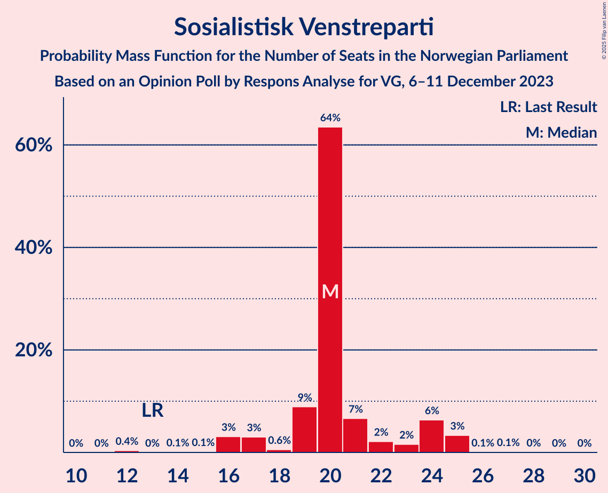

| Number of Seats | Probability | Accumulated | Special Marks |
|:---------------:|:-----------:|:-----------:|:-------------:|
| 12 | 0.4% | 100% |  |
| 13 | 0% | 99.6% | Last Result |
| 14 | 0.1% | 99.6% |  |
| 15 | 0.1% | 99.5% |  |
| 16 | 3% | 99.4% |  |
| 17 | 3% | 96% |  |
| 18 | 0.6% | 93% |  |
| 19 | 9% | 93% |  |
| 20 | 64% | 84% | Median |
| 21 | 7% | 20% |  |
| 22 | 2% | 14% |  |
| 23 | 2% | 12% |  |
| 24 | 6% | 10% |  |
| 25 | 3% | 4% |  |
| 26 | 0.1% | 0.2% |  |
| 27 | 0.1% | 0.2% |  |
| 28 | 0% | 0.1% |  |
| 29 | 0% | 0% |  |

### Senterpartiet

*For a full overview of the results for this party, see the [Senterpartiet](party-senterpartiet.html) page.*

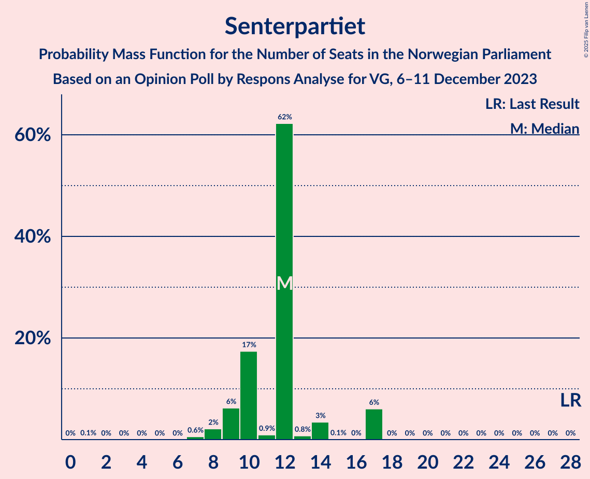

| Number of Seats | Probability | Accumulated | Special Marks |
|:---------------:|:-----------:|:-----------:|:-------------:|
| 1 | 0.1% | 100% |  |
| 2 | 0% | 99.9% |  |
| 3 | 0% | 99.9% |  |
| 4 | 0% | 99.9% |  |
| 5 | 0% | 99.9% |  |
| 6 | 0% | 99.9% |  |
| 7 | 0.6% | 99.9% |  |
| 8 | 2% | 99.3% |  |
| 9 | 6% | 97% |  |
| 10 | 17% | 91% |  |
| 11 | 0.9% | 74% |  |
| 12 | 62% | 73% | Median |
| 13 | 0.8% | 10% |  |
| 14 | 3% | 10% |  |
| 15 | 0.1% | 6% |  |
| 16 | 0% | 6% |  |
| 17 | 6% | 6% |  |
| 18 | 0% | 0% |  |
| 19 | 0% | 0% |  |
| 20 | 0% | 0% |  |
| 21 | 0% | 0% |  |
| 22 | 0% | 0% |  |
| 23 | 0% | 0% |  |
| 24 | 0% | 0% |  |
| 25 | 0% | 0% |  |
| 26 | 0% | 0% |  |
| 27 | 0% | 0% |  |
| 28 | 0% | 0% | Last Result |

### Venstre

*For a full overview of the results for this party, see the [Venstre](party-venstre.html) page.*

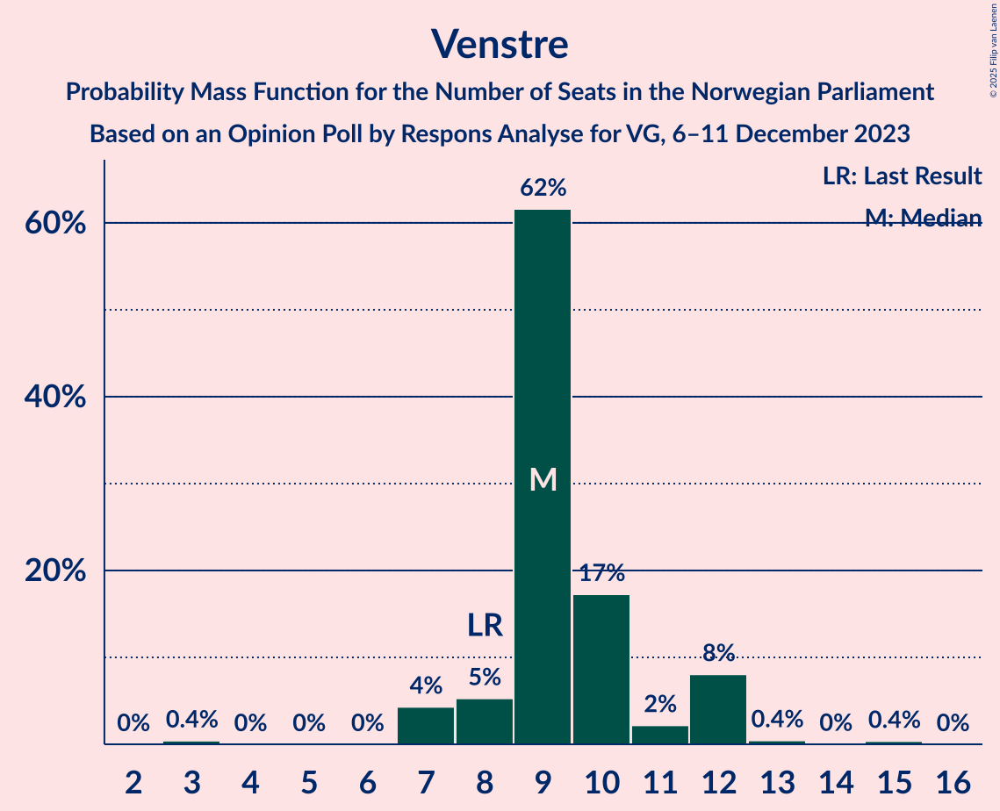

| Number of Seats | Probability | Accumulated | Special Marks |
|:---------------:|:-----------:|:-----------:|:-------------:|
| 3 | 0.4% | 100% |  |
| 4 | 0% | 99.6% |  |
| 5 | 0% | 99.6% |  |
| 6 | 0% | 99.6% |  |
| 7 | 4% | 99.6% |  |
| 8 | 5% | 95% | Last Result |
| 9 | 62% | 90% | Median |
| 10 | 17% | 28% |  |
| 11 | 2% | 11% |  |
| 12 | 8% | 9% |  |
| 13 | 0.4% | 0.8% |  |
| 14 | 0% | 0.4% |  |
| 15 | 0.4% | 0.4% |  |
| 16 | 0% | 0% |  |

### Rødt

*For a full overview of the results for this party, see the [Rødt](party-rødt.html) page.*

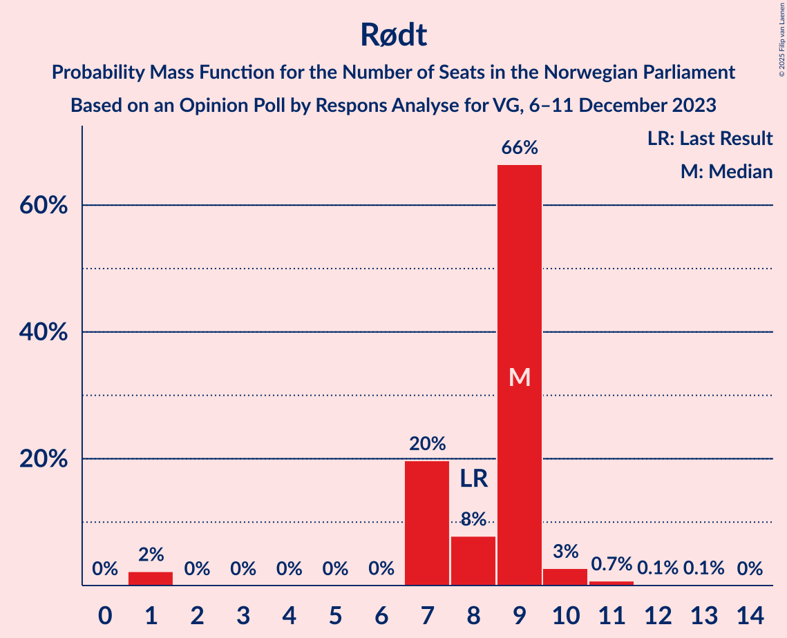

| Number of Seats | Probability | Accumulated | Special Marks |
|:---------------:|:-----------:|:-----------:|:-------------:|
| 1 | 2% | 100% |  |
| 2 | 0% | 98% |  |
| 3 | 0% | 98% |  |
| 4 | 0% | 98% |  |
| 5 | 0% | 98% |  |
| 6 | 0% | 98% |  |
| 7 | 20% | 98% |  |
| 8 | 8% | 78% | Last Result |
| 9 | 66% | 70% | Median |
| 10 | 3% | 4% |  |
| 11 | 0.7% | 1.0% |  |
| 12 | 0.1% | 0.3% |  |
| 13 | 0.1% | 0.1% |  |
| 14 | 0% | 0% |  |

### Kristelig Folkeparti

*For a full overview of the results for this party, see the [Kristelig Folkeparti](party-kristeligfolkeparti.html) page.*

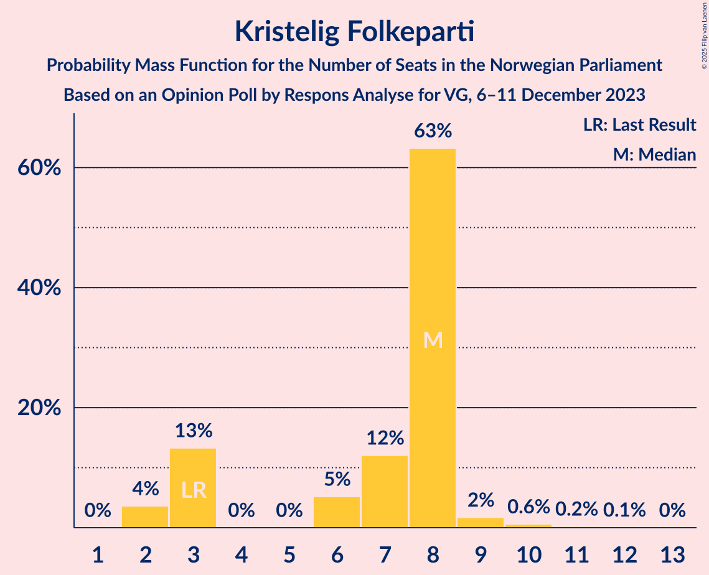

| Number of Seats | Probability | Accumulated | Special Marks |
|:---------------:|:-----------:|:-----------:|:-------------:|
| 2 | 4% | 100% |  |
| 3 | 13% | 96% | Last Result |
| 4 | 0% | 83% |  |
| 5 | 0% | 83% |  |
| 6 | 5% | 83% |  |
| 7 | 12% | 78% |  |
| 8 | 63% | 66% | Median |
| 9 | 2% | 3% |  |
| 10 | 0.6% | 0.9% |  |
| 11 | 0.2% | 0.3% |  |
| 12 | 0.1% | 0.1% |  |
| 13 | 0% | 0% |  |

### Industri- og Næringspartiet

*For a full overview of the results for this party, see the [Industri- og Næringspartiet](party-industri-ognæringspartiet.html) page.*

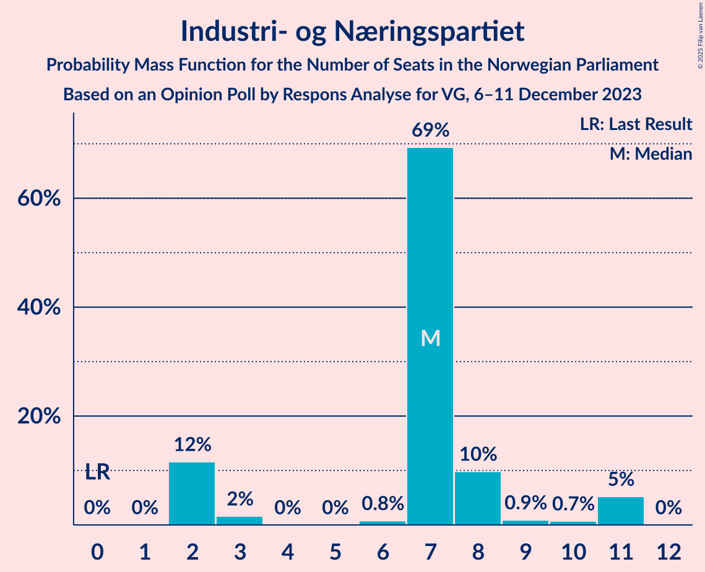

| Number of Seats | Probability | Accumulated | Special Marks |
|:---------------:|:-----------:|:-----------:|:-------------:|
| 0 | 0% | 100% | Last Result |
| 1 | 0% | 100% |  |
| 2 | 12% | 100% |  |
| 3 | 2% | 88% |  |
| 4 | 0% | 87% |  |
| 5 | 0% | 87% |  |
| 6 | 0.8% | 87% |  |
| 7 | 69% | 86% | Median |
| 8 | 10% | 17% |  |
| 9 | 0.9% | 7% |  |
| 10 | 0.7% | 6% |  |
| 11 | 5% | 5% |  |
| 12 | 0% | 0% |  |

### Miljøpartiet De Grønne

*For a full overview of the results for this party, see the [Miljøpartiet De Grønne](party-miljøpartietdegrønne.html) page.*

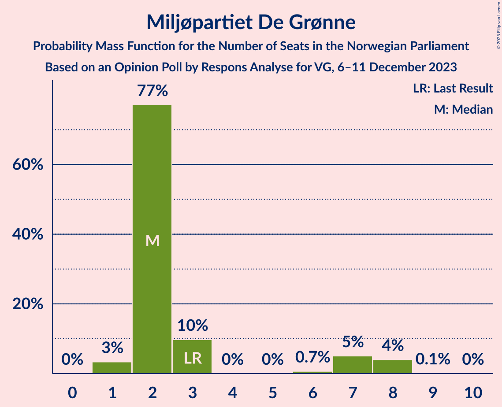

| Number of Seats | Probability | Accumulated | Special Marks |
|:---------------:|:-----------:|:-----------:|:-------------:|
| 1 | 3% | 100% |  |
| 2 | 77% | 97% | Median |
| 3 | 10% | 20% | Last Result |
| 4 | 0% | 10% |  |
| 5 | 0% | 10% |  |
| 6 | 0.7% | 10% |  |
| 7 | 5% | 9% |  |
| 8 | 4% | 4% |  |
| 9 | 0.1% | 0.1% |  |
| 10 | 0% | 0% |  |

### Pensjonistpartiet

*For a full overview of the results for this party, see the [Pensjonistpartiet](party-pensjonistpartiet.html) page.*

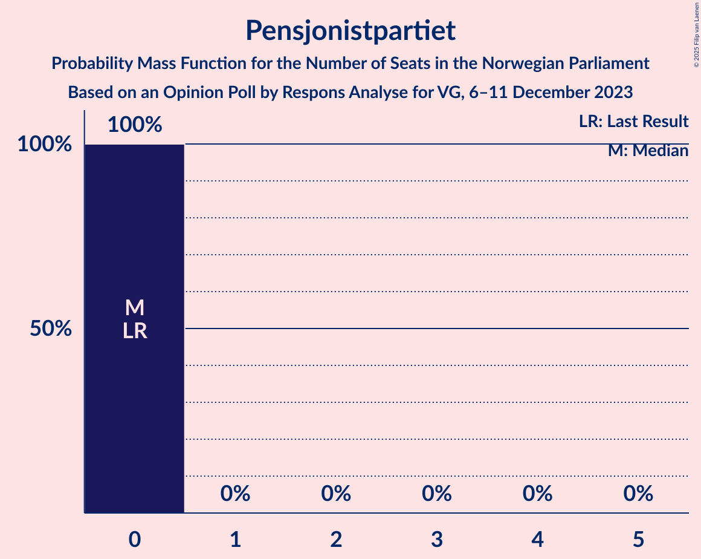

| Number of Seats | Probability | Accumulated | Special Marks |
|:---------------:|:-----------:|:-----------:|:-------------:|
| 0 | 100% | 100% | Last Result, Median |

### Konservativt

*For a full overview of the results for this party, see the [Konservativt](party-konservativt.html) page.*

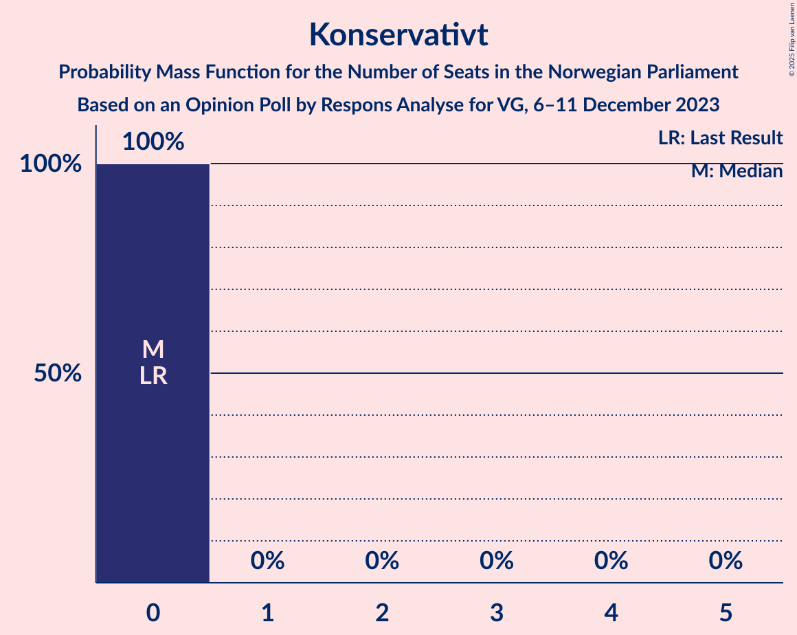

| Number of Seats | Probability | Accumulated | Special Marks |
|:---------------:|:-----------:|:-----------:|:-------------:|
| 0 | 100% | 100% | Last Result, Median |

### Liberalistene

*For a full overview of the results for this party, see the [Liberalistene](party-liberalistene.html) page.*

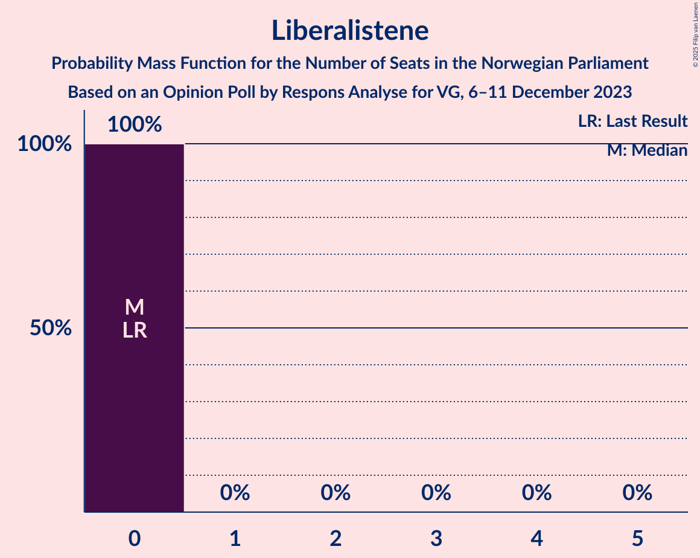

| Number of Seats | Probability | Accumulated | Special Marks |
|:---------------:|:-----------:|:-----------:|:-------------:|
| 0 | 100% | 100% | Last Result, Median |

## Coalitions

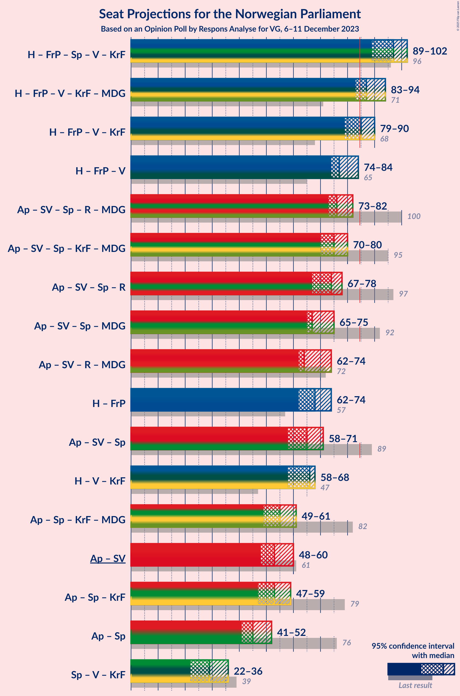

### Confidence Intervals

| Coalition | Last Result | Median | Majority? | 80% Confidence Interval | 90% Confidence Interval | 95% Confidence Interval | 99% Confidence Interval |
|:---------:|:-----------:|:------:|:---------:|:-----------------------:|:-----------------------:|:-----------------------:|:-----------------------:|
| Høyre – Fremskrittspartiet – Senterpartiet – Venstre – Kristelig Folkeparti | 96 | 97 | 100% | 93–98 | 92–98 | 89–102 | 86–105 |
| Høyre – Fremskrittspartiet – Venstre – Kristelig Folkeparti – Miljøpartiet De Grønne | 71 | 87 | 86% | 84–90 | 83–93 | 83–94 | 80–96 |
| Høyre – Fremskrittspartiet – Venstre – Kristelig Folkeparti | 68 | 85 | 80% | 82–87 | 81–88 | 79–90 | 72–93 |
| Høyre – Fremskrittspartiet – Venstre | 65 | 77 | 2% | 76–81 | 74–84 | 74–84 | 70–87 |
| Arbeiderpartiet – Sosialistisk Venstreparti – Senterpartiet – Rødt – Miljøpartiet De Grønne | 100 | 76 | 2% | 75–80 | 74–80 | 73–82 | 70–88 |
| Arbeiderpartiet – Sosialistisk Venstreparti – Senterpartiet – Kristelig Folkeparti – Miljøpartiet De Grønne | 95 | 75 | 0.4% | 72–79 | 70–80 | 70–80 | 67–84 |
| Arbeiderpartiet – Sosialistisk Venstreparti – Senterpartiet – Rødt | 97 | 74 | 0.2% | 72–76 | 70–78 | 67–78 | 67–81 |
| Arbeiderpartiet – Sosialistisk Venstreparti – Senterpartiet – Miljøpartiet De Grønne | 92 | 67 | 0% | 67–72 | 66–73 | 65–75 | 63–78 |
| Arbeiderpartiet – Sosialistisk Venstreparti – Rødt – Miljøpartiet De Grønne | 72 | 64 | 0% | 63–69 | 63–71 | 62–74 | 60–75 |
| Høyre – Fremskrittspartiet | 57 | 68 | 0% | 67–72 | 62–74 | 62–74 | 61–77 |
| Arbeiderpartiet – Sosialistisk Venstreparti – Senterpartiet | 89 | 65 | 0% | 65–70 | 63–71 | 58–71 | 58–74 |
| Høyre – Venstre – Kristelig Folkeparti | 47 | 66 | 0% | 59–66 | 59–66 | 58–68 | 53–72 |
| Arbeiderpartiet – Senterpartiet – Kristelig Folkeparti – Miljøpartiet De Grønne | 82 | 55 | 0% | 51–59 | 49–61 | 49–61 | 47–64 |
| Arbeiderpartiet – Sosialistisk Venstreparti | 61 | 53 | 0% | 53–58 | 51–59 | 48–60 | 48–63 |
| Arbeiderpartiet – Senterpartiet – Kristelig Folkeparti | 79 | 53 | 0% | 48–56 | 47–59 | 47–59 | 44–60 |
| Arbeiderpartiet – Senterpartiet | 76 | 45 | 0% | 43–48 | 42–52 | 41–52 | 40–52 |
| Senterpartiet – Venstre – Kristelig Folkeparti | 39 | 29 | 0% | 23–30 | 23–36 | 22–36 | 20–36 |

### Høyre – Fremskrittspartiet – Senterpartiet – Venstre – Kristelig Folkeparti

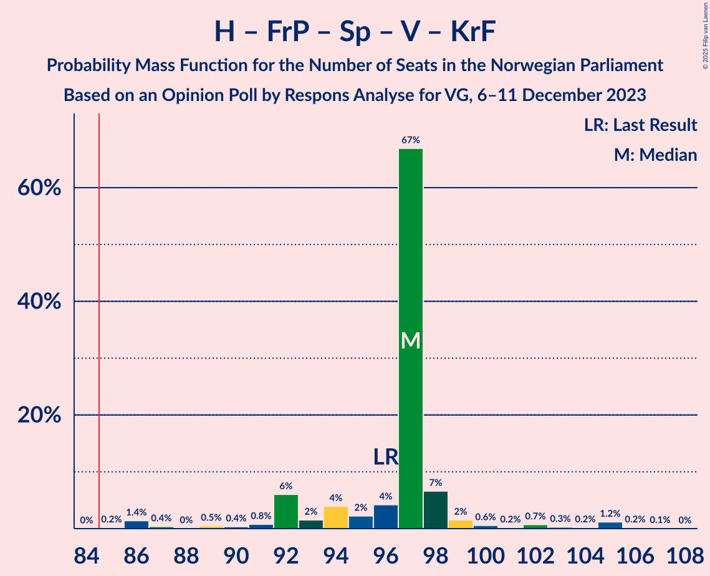

| Number of Seats | Probability | Accumulated | Special Marks |
|:---------------:|:-----------:|:-----------:|:-------------:|
| 85 | 0.2% | 100% | Majority |
| 86 | 1.4% | 99.8% |  |
| 87 | 0.4% | 98% |  |
| 88 | 0% | 98% |  |
| 89 | 0.5% | 98% |  |
| 90 | 0.4% | 97% |  |
| 91 | 0.8% | 97% |  |
| 92 | 6% | 96% |  |
| 93 | 2% | 90% |  |
| 94 | 4% | 89% |  |
| 95 | 2% | 85% |  |
| 96 | 4% | 83% | Last Result |
| 97 | 67% | 78% | Median |
| 98 | 7% | 11% |  |
| 99 | 2% | 5% |  |
| 100 | 0.6% | 3% |  |
| 101 | 0.2% | 3% |  |
| 102 | 0.7% | 3% |  |
| 103 | 0.3% | 2% |  |
| 104 | 0.2% | 2% |  |
| 105 | 1.2% | 1.4% |  |
| 106 | 0.2% | 0.3% |  |
| 107 | 0.1% | 0.1% |  |
| 108 | 0% | 0% |  |

### Høyre – Fremskrittspartiet – Venstre – Kristelig Folkeparti – Miljøpartiet De Grønne

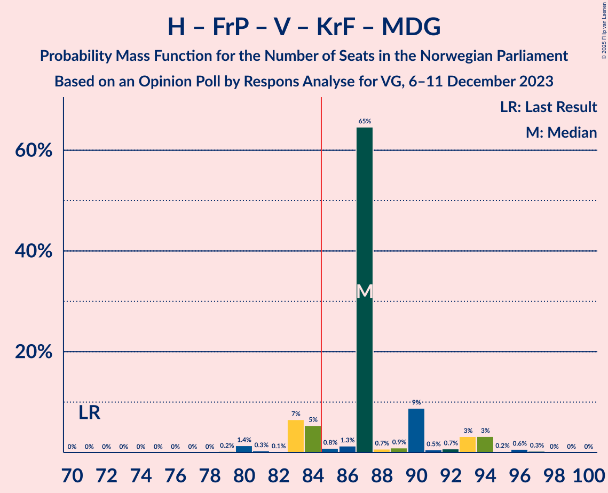

| Number of Seats | Probability | Accumulated | Special Marks |
|:---------------:|:-----------:|:-----------:|:-------------:|
| 71 | 0% | 100% | Last Result |
| 72 | 0% | 100% |  |
| 73 | 0% | 100% |  |
| 74 | 0% | 100% |  |
| 75 | 0% | 100% |  |
| 76 | 0% | 100% |  |
| 77 | 0% | 100% |  |
| 78 | 0% | 100% |  |
| 79 | 0.2% | 100% |  |
| 80 | 1.4% | 99.7% |  |
| 81 | 0.3% | 98% |  |
| 82 | 0.1% | 98% |  |
| 83 | 7% | 98% |  |
| 84 | 5% | 91% |  |
| 85 | 0.8% | 86% | Majority |
| 86 | 1.3% | 85% |  |
| 87 | 65% | 84% | Median |
| 88 | 0.7% | 19% |  |
| 89 | 0.9% | 19% |  |
| 90 | 9% | 18% |  |
| 91 | 0.5% | 9% |  |
| 92 | 0.7% | 8% |  |
| 93 | 3% | 8% |  |
| 94 | 3% | 4% |  |
| 95 | 0.2% | 1.2% |  |
| 96 | 0.6% | 1.0% |  |
| 97 | 0.3% | 0.4% |  |
| 98 | 0% | 0.1% |  |
| 99 | 0% | 0.1% |  |
| 100 | 0% | 0% |  |

### Høyre – Fremskrittspartiet – Venstre – Kristelig Folkeparti

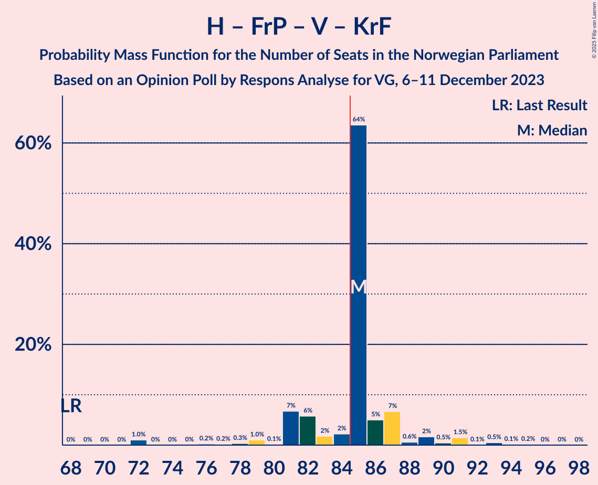

| Number of Seats | Probability | Accumulated | Special Marks |
|:---------------:|:-----------:|:-----------:|:-------------:|
| 68 | 0% | 100% | Last Result |
| 69 | 0% | 100% |  |
| 70 | 0% | 100% |  |
| 71 | 0% | 100% |  |
| 72 | 1.0% | 100% |  |
| 73 | 0% | 99.0% |  |
| 74 | 0% | 99.0% |  |
| 75 | 0% | 98.9% |  |
| 76 | 0.2% | 98.9% |  |
| 77 | 0.2% | 98.7% |  |
| 78 | 0.3% | 98% |  |
| 79 | 1.0% | 98% |  |
| 80 | 0.1% | 97% |  |
| 81 | 7% | 97% |  |
| 82 | 6% | 90% |  |
| 83 | 2% | 84% |  |
| 84 | 2% | 83% |  |
| 85 | 64% | 80% | Median, Majority |
| 86 | 5% | 17% |  |
| 87 | 7% | 12% |  |
| 88 | 0.6% | 5% |  |
| 89 | 2% | 5% |  |
| 90 | 0.5% | 3% |  |
| 91 | 1.5% | 2% |  |
| 92 | 0.1% | 0.9% |  |
| 93 | 0.5% | 0.9% |  |
| 94 | 0.1% | 0.4% |  |
| 95 | 0.2% | 0.2% |  |
| 96 | 0% | 0.1% |  |
| 97 | 0% | 0% |  |

### Høyre – Fremskrittspartiet – Venstre

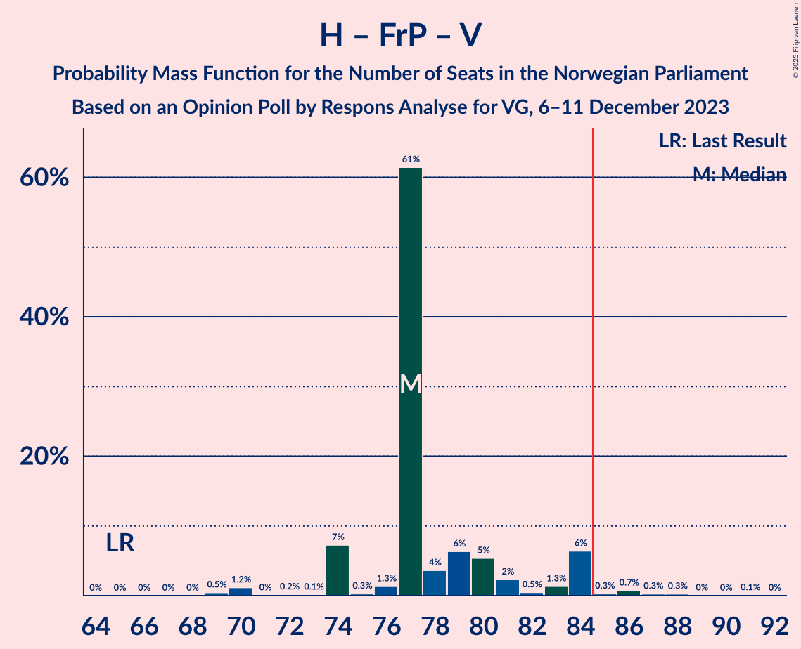

| Number of Seats | Probability | Accumulated | Special Marks |
|:---------------:|:-----------:|:-----------:|:-------------:|
| 65 | 0% | 100% | Last Result |
| 66 | 0% | 100% |  |
| 67 | 0% | 100% |  |
| 68 | 0% | 100% |  |
| 69 | 0.5% | 100% |  |
| 70 | 1.2% | 99.5% |  |
| 71 | 0% | 98% |  |
| 72 | 0.2% | 98% |  |
| 73 | 0.1% | 98% |  |
| 74 | 7% | 98% |  |
| 75 | 0.3% | 91% |  |
| 76 | 1.3% | 90% |  |
| 77 | 61% | 89% | Median |
| 78 | 4% | 28% |  |
| 79 | 6% | 24% |  |
| 80 | 5% | 18% |  |
| 81 | 2% | 12% |  |
| 82 | 0.5% | 10% |  |
| 83 | 1.3% | 9% |  |
| 84 | 6% | 8% |  |
| 85 | 0.3% | 2% | Majority |
| 86 | 0.7% | 1.4% |  |
| 87 | 0.3% | 0.7% |  |
| 88 | 0.3% | 0.4% |  |
| 89 | 0% | 0.1% |  |
| 90 | 0% | 0.1% |  |
| 91 | 0.1% | 0.1% |  |
| 92 | 0% | 0% |  |

### Arbeiderpartiet – Sosialistisk Venstreparti – Senterpartiet – Rødt – Miljøpartiet De Grønne

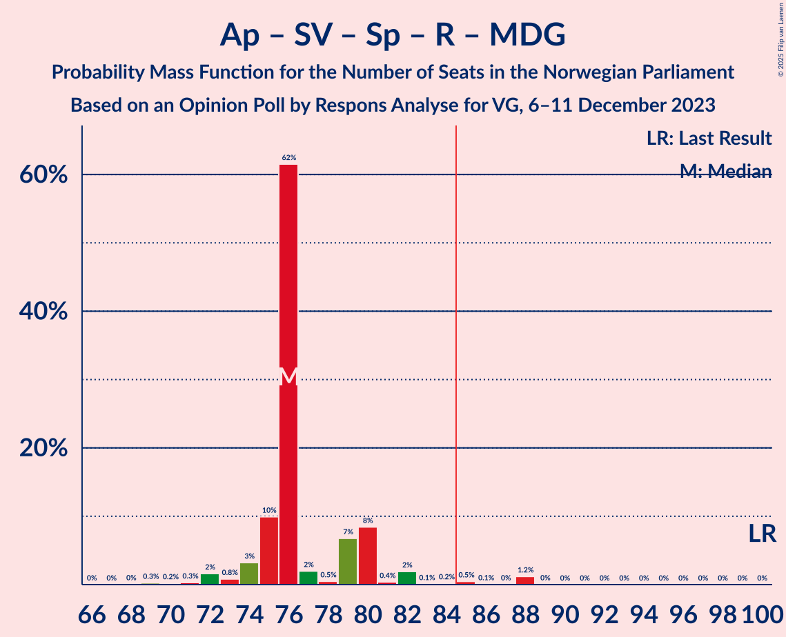

| Number of Seats | Probability | Accumulated | Special Marks |
|:---------------:|:-----------:|:-----------:|:-------------:|
| 67 | 0% | 100% |  |
| 68 | 0% | 99.9% |  |
| 69 | 0.3% | 99.9% |  |
| 70 | 0.2% | 99.6% |  |
| 71 | 0.3% | 99.4% |  |
| 72 | 2% | 99.1% |  |
| 73 | 0.8% | 98% |  |
| 74 | 3% | 97% |  |
| 75 | 10% | 93% |  |
| 76 | 62% | 84% | Median |
| 77 | 2% | 22% |  |
| 78 | 0.5% | 20% |  |
| 79 | 7% | 20% |  |
| 80 | 8% | 13% |  |
| 81 | 0.4% | 4% |  |
| 82 | 2% | 4% |  |
| 83 | 0.1% | 2% |  |
| 84 | 0.2% | 2% |  |
| 85 | 0.5% | 2% | Majority |
| 86 | 0.1% | 1.3% |  |
| 87 | 0% | 1.3% |  |
| 88 | 1.2% | 1.2% |  |
| 89 | 0% | 0.1% |  |
| 90 | 0% | 0% |  |
| 91 | 0% | 0% |  |
| 92 | 0% | 0% |  |
| 93 | 0% | 0% |  |
| 94 | 0% | 0% |  |
| 95 | 0% | 0% |  |
| 96 | 0% | 0% |  |
| 97 | 0% | 0% |  |
| 98 | 0% | 0% |  |
| 99 | 0% | 0% |  |
| 100 | 0% | 0% | Last Result |

### Arbeiderpartiet – Sosialistisk Venstreparti – Senterpartiet – Kristelig Folkeparti – Miljøpartiet De Grønne

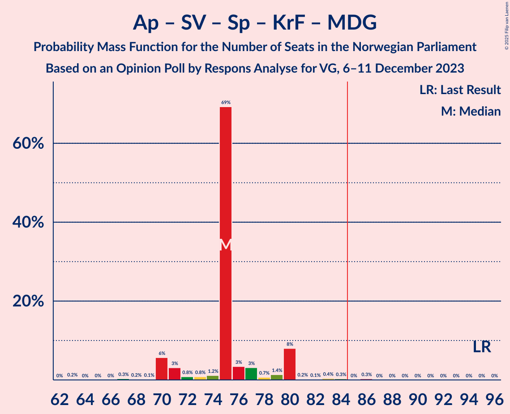

| Number of Seats | Probability | Accumulated | Special Marks |
|:---------------:|:-----------:|:-----------:|:-------------:|
| 63 | 0.2% | 100% |  |
| 64 | 0% | 99.8% |  |
| 65 | 0% | 99.8% |  |
| 66 | 0% | 99.7% |  |
| 67 | 0.3% | 99.7% |  |
| 68 | 0.2% | 99.4% |  |
| 69 | 0.1% | 99.2% |  |
| 70 | 6% | 99.0% |  |
| 71 | 3% | 93% |  |
| 72 | 0.8% | 90% |  |
| 73 | 0.8% | 89% |  |
| 74 | 1.2% | 89% |  |
| 75 | 69% | 87% | Median |
| 76 | 3% | 18% |  |
| 77 | 3% | 15% |  |
| 78 | 0.7% | 12% |  |
| 79 | 1.4% | 11% |  |
| 80 | 8% | 9% |  |
| 81 | 0.2% | 1.4% |  |
| 82 | 0.1% | 1.2% |  |
| 83 | 0.4% | 1.1% |  |
| 84 | 0.3% | 0.7% |  |
| 85 | 0% | 0.4% | Majority |
| 86 | 0.3% | 0.3% |  |
| 87 | 0% | 0% |  |
| 88 | 0% | 0% |  |
| 89 | 0% | 0% |  |
| 90 | 0% | 0% |  |
| 91 | 0% | 0% |  |
| 92 | 0% | 0% |  |
| 93 | 0% | 0% |  |
| 94 | 0% | 0% |  |
| 95 | 0% | 0% | Last Result |

### Arbeiderpartiet – Sosialistisk Venstreparti – Senterpartiet – Rødt

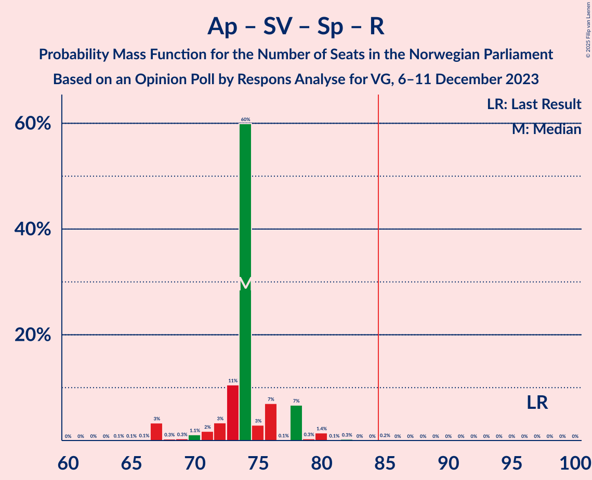

| Number of Seats | Probability | Accumulated | Special Marks |
|:---------------:|:-----------:|:-----------:|:-------------:|
| 64 | 0.1% | 100% |  |
| 65 | 0.1% | 99.9% |  |
| 66 | 0.1% | 99.8% |  |
| 67 | 3% | 99.7% |  |
| 68 | 0.3% | 96% |  |
| 69 | 0.3% | 96% |  |
| 70 | 1.1% | 96% |  |
| 71 | 2% | 95% |  |
| 72 | 3% | 93% |  |
| 73 | 11% | 90% |  |
| 74 | 60% | 79% | Median |
| 75 | 3% | 19% |  |
| 76 | 7% | 16% |  |
| 77 | 0.1% | 9% |  |
| 78 | 7% | 9% |  |
| 79 | 0.3% | 2% |  |
| 80 | 1.4% | 2% |  |
| 81 | 0.1% | 0.5% |  |
| 82 | 0.3% | 0.5% |  |
| 83 | 0% | 0.2% |  |
| 84 | 0% | 0.2% |  |
| 85 | 0.2% | 0.2% | Majority |
| 86 | 0% | 0% |  |
| 87 | 0% | 0% |  |
| 88 | 0% | 0% |  |
| 89 | 0% | 0% |  |
| 90 | 0% | 0% |  |
| 91 | 0% | 0% |  |
| 92 | 0% | 0% |  |
| 93 | 0% | 0% |  |
| 94 | 0% | 0% |  |
| 95 | 0% | 0% |  |
| 96 | 0% | 0% |  |
| 97 | 0% | 0% | Last Result |

### Arbeiderpartiet – Sosialistisk Venstreparti – Senterpartiet – Miljøpartiet De Grønne

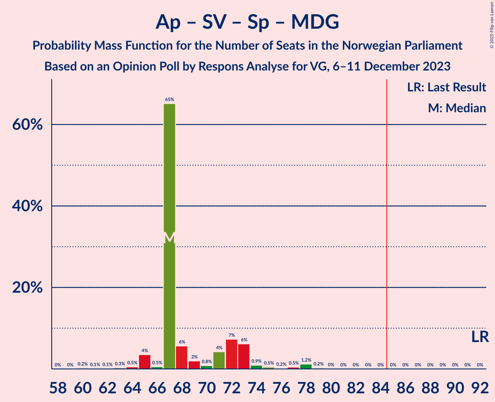

| Number of Seats | Probability | Accumulated | Special Marks |
|:---------------:|:-----------:|:-----------:|:-------------:|
| 60 | 0.2% | 100% |  |
| 61 | 0.1% | 99.7% |  |
| 62 | 0.1% | 99.7% |  |
| 63 | 0.3% | 99.6% |  |
| 64 | 0.5% | 99.3% |  |
| 65 | 4% | 98.8% |  |
| 66 | 0.5% | 95% |  |
| 67 | 65% | 95% | Median |
| 68 | 6% | 30% |  |
| 69 | 2% | 24% |  |
| 70 | 0.8% | 22% |  |
| 71 | 4% | 21% |  |
| 72 | 7% | 17% |  |
| 73 | 6% | 10% |  |
| 74 | 0.9% | 3% |  |
| 75 | 0.5% | 3% |  |
| 76 | 0.2% | 2% |  |
| 77 | 0.5% | 2% |  |
| 78 | 1.2% | 1.5% |  |
| 79 | 0.2% | 0.3% |  |
| 80 | 0% | 0.1% |  |
| 81 | 0% | 0% |  |
| 82 | 0% | 0% |  |
| 83 | 0% | 0% |  |
| 84 | 0% | 0% |  |
| 85 | 0% | 0% | Majority |
| 86 | 0% | 0% |  |
| 87 | 0% | 0% |  |
| 88 | 0% | 0% |  |
| 89 | 0% | 0% |  |
| 90 | 0% | 0% |  |
| 91 | 0% | 0% |  |
| 92 | 0% | 0% | Last Result |

### Arbeiderpartiet – Sosialistisk Venstreparti – Rødt – Miljøpartiet De Grønne

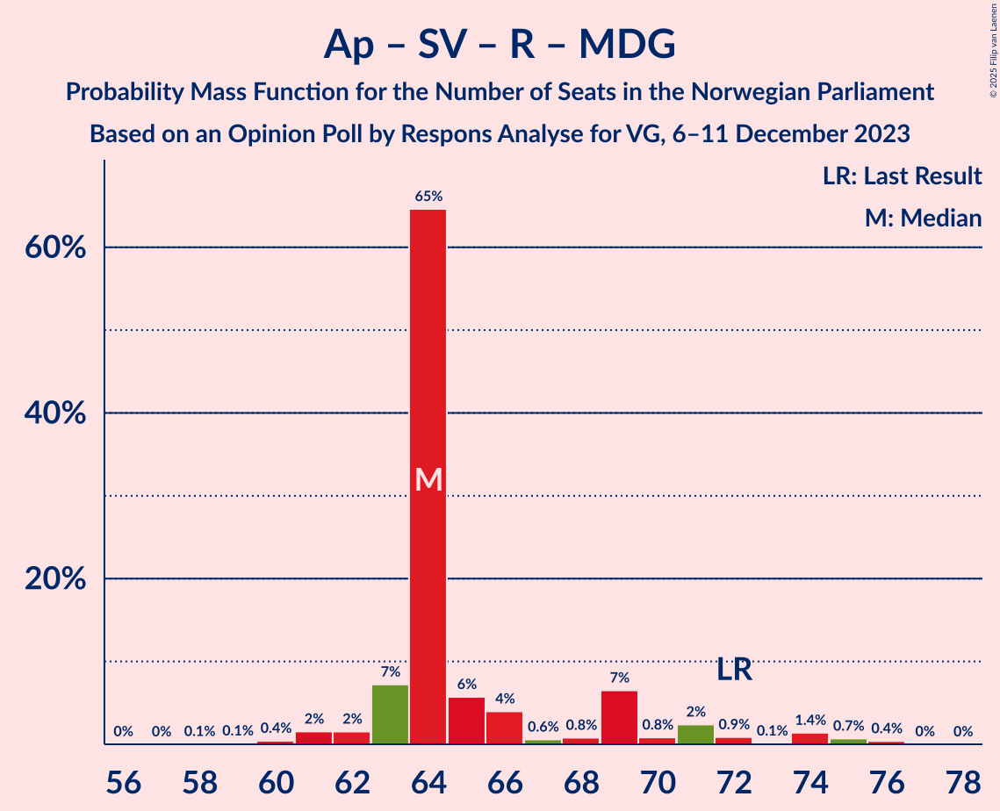

| Number of Seats | Probability | Accumulated | Special Marks |
|:---------------:|:-----------:|:-----------:|:-------------:|
| 56 | 0% | 100% |  |
| 57 | 0% | 99.9% |  |
| 58 | 0.1% | 99.9% |  |
| 59 | 0.1% | 99.9% |  |
| 60 | 0.4% | 99.8% |  |
| 61 | 2% | 99.3% |  |
| 62 | 2% | 98% |  |
| 63 | 7% | 96% |  |
| 64 | 65% | 89% | Median |
| 65 | 6% | 24% |  |
| 66 | 4% | 19% |  |
| 67 | 0.6% | 15% |  |
| 68 | 0.8% | 14% |  |
| 69 | 7% | 13% |  |
| 70 | 0.8% | 7% |  |
| 71 | 2% | 6% |  |
| 72 | 0.9% | 4% | Last Result |
| 73 | 0.1% | 3% |  |
| 74 | 1.4% | 3% |  |
| 75 | 0.7% | 1.2% |  |
| 76 | 0.4% | 0.4% |  |
| 77 | 0% | 0.1% |  |
| 78 | 0% | 0% |  |

### Høyre – Fremskrittspartiet

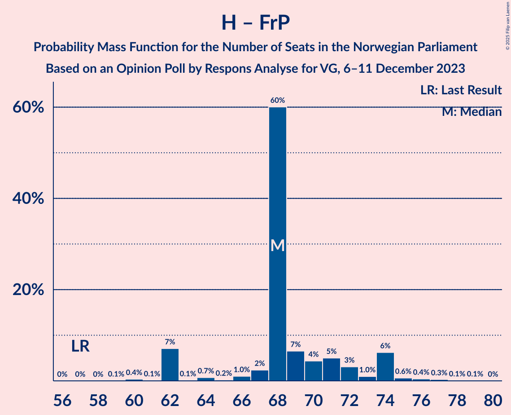

| Number of Seats | Probability | Accumulated | Special Marks |
|:---------------:|:-----------:|:-----------:|:-------------:|
| 57 | 0% | 100% | Last Result |
| 58 | 0% | 100% |  |
| 59 | 0.1% | 100% |  |
| 60 | 0.4% | 99.9% |  |
| 61 | 0.1% | 99.6% |  |
| 62 | 7% | 99.5% |  |
| 63 | 0.1% | 92% |  |
| 64 | 0.7% | 92% |  |
| 65 | 0.2% | 92% |  |
| 66 | 1.0% | 91% |  |
| 67 | 2% | 90% |  |
| 68 | 60% | 88% | Median |
| 69 | 7% | 28% |  |
| 70 | 4% | 21% |  |
| 71 | 5% | 17% |  |
| 72 | 3% | 12% |  |
| 73 | 1.0% | 9% |  |
| 74 | 6% | 8% |  |
| 75 | 0.6% | 2% |  |
| 76 | 0.4% | 1.0% |  |
| 77 | 0.3% | 0.5% |  |
| 78 | 0.1% | 0.2% |  |
| 79 | 0.1% | 0.1% |  |
| 80 | 0% | 0% |  |

### Arbeiderpartiet – Sosialistisk Venstreparti – Senterpartiet

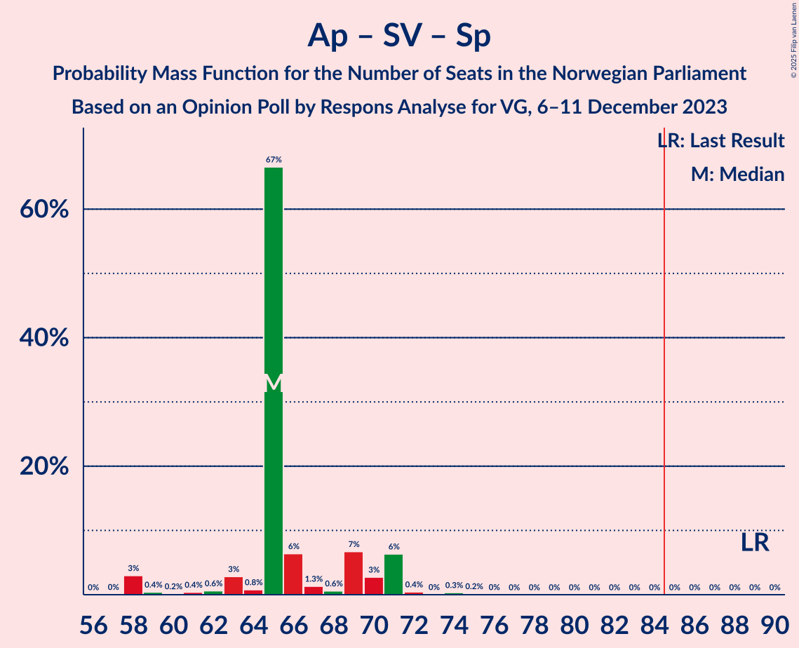

| Number of Seats | Probability | Accumulated | Special Marks |
|:---------------:|:-----------:|:-----------:|:-------------:|
| 57 | 0% | 100% |  |
| 58 | 3% | 99.9% |  |
| 59 | 0.4% | 97% |  |
| 60 | 0.2% | 97% |  |
| 61 | 0.4% | 96% |  |
| 62 | 0.6% | 96% |  |
| 63 | 3% | 95% |  |
| 64 | 0.8% | 93% |  |
| 65 | 67% | 92% | Median |
| 66 | 6% | 25% |  |
| 67 | 1.3% | 19% |  |
| 68 | 0.6% | 17% |  |
| 69 | 7% | 17% |  |
| 70 | 3% | 10% |  |
| 71 | 6% | 7% |  |
| 72 | 0.4% | 1.0% |  |
| 73 | 0% | 0.6% |  |
| 74 | 0.3% | 0.5% |  |
| 75 | 0.2% | 0.2% |  |
| 76 | 0% | 0% |  |
| 77 | 0% | 0% |  |
| 78 | 0% | 0% |  |
| 79 | 0% | 0% |  |
| 80 | 0% | 0% |  |
| 81 | 0% | 0% |  |
| 82 | 0% | 0% |  |
| 83 | 0% | 0% |  |
| 84 | 0% | 0% |  |
| 85 | 0% | 0% | Majority |
| 86 | 0% | 0% |  |
| 87 | 0% | 0% |  |
| 88 | 0% | 0% |  |
| 89 | 0% | 0% | Last Result |

### Høyre – Venstre – Kristelig Folkeparti

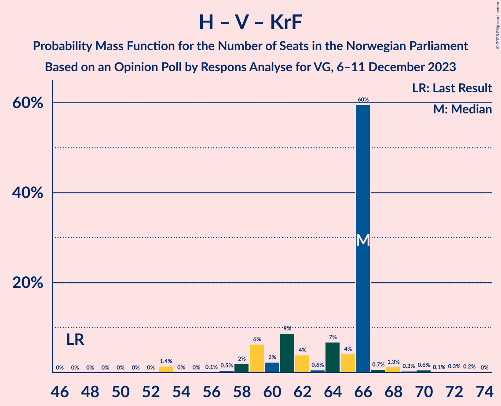

| Number of Seats | Probability | Accumulated | Special Marks |
|:---------------:|:-----------:|:-----------:|:-------------:|
| 47 | 0% | 100% | Last Result |
| 48 | 0% | 100% |  |
| 49 | 0% | 100% |  |
| 50 | 0% | 100% |  |
| 51 | 0% | 100% |  |
| 52 | 0% | 100% |  |
| 53 | 1.4% | 100% |  |
| 54 | 0% | 98.6% |  |
| 55 | 0% | 98.5% |  |
| 56 | 0.1% | 98.5% |  |
| 57 | 0.5% | 98% |  |
| 58 | 2% | 98% |  |
| 59 | 6% | 96% |  |
| 60 | 2% | 90% |  |
| 61 | 9% | 87% |  |
| 62 | 4% | 79% |  |
| 63 | 0.6% | 75% |  |
| 64 | 7% | 74% |  |
| 65 | 4% | 67% |  |
| 66 | 60% | 63% | Median |
| 67 | 0.7% | 4% |  |
| 68 | 1.3% | 3% |  |
| 69 | 0.3% | 2% |  |
| 70 | 0.6% | 1.2% |  |
| 71 | 0.1% | 0.6% |  |
| 72 | 0.3% | 0.5% |  |
| 73 | 0.2% | 0.3% |  |
| 74 | 0% | 0% |  |

### Arbeiderpartiet – Senterpartiet – Kristelig Folkeparti – Miljøpartiet De Grønne

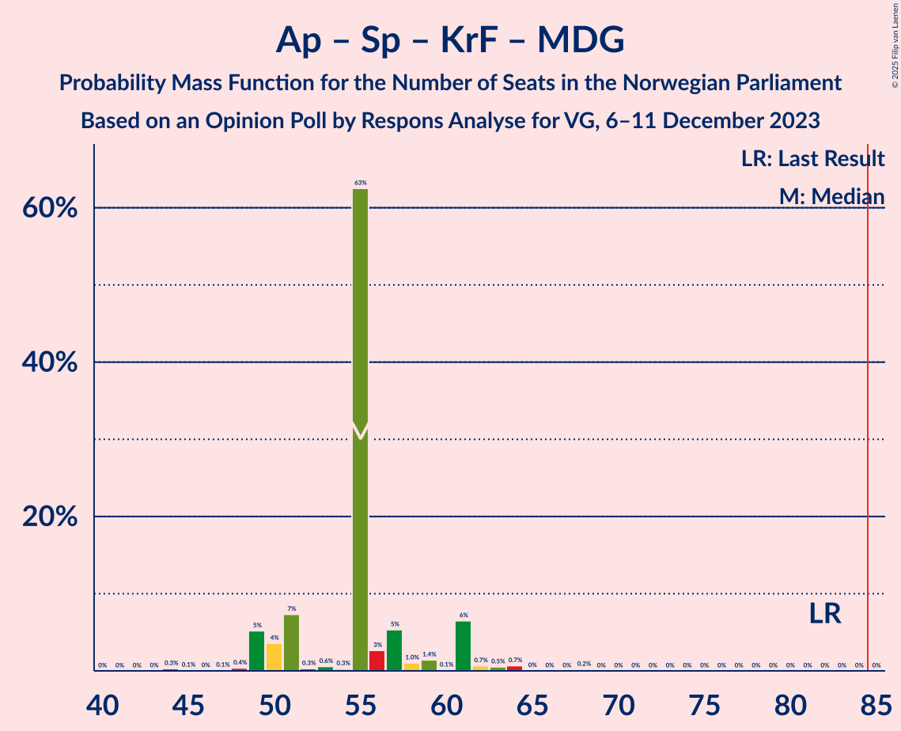

| Number of Seats | Probability | Accumulated | Special Marks |
|:---------------:|:-----------:|:-----------:|:-------------:|
| 44 | 0.3% | 100% |  |
| 45 | 0.1% | 99.7% |  |
| 46 | 0% | 99.6% |  |
| 47 | 0.1% | 99.5% |  |
| 48 | 0.4% | 99.4% |  |
| 49 | 5% | 99.1% |  |
| 50 | 4% | 94% |  |
| 51 | 7% | 90% |  |
| 52 | 0.3% | 83% |  |
| 53 | 0.6% | 83% |  |
| 54 | 0.3% | 82% |  |
| 55 | 63% | 82% | Median |
| 56 | 3% | 19% |  |
| 57 | 5% | 17% |  |
| 58 | 1.0% | 11% |  |
| 59 | 1.4% | 10% |  |
| 60 | 0.1% | 9% |  |
| 61 | 6% | 9% |  |
| 62 | 0.7% | 2% |  |
| 63 | 0.5% | 1.5% |  |
| 64 | 0.7% | 1.0% |  |
| 65 | 0% | 0.3% |  |
| 66 | 0% | 0.2% |  |
| 67 | 0% | 0.2% |  |
| 68 | 0.2% | 0.2% |  |
| 69 | 0% | 0% |  |
| 70 | 0% | 0% |  |
| 71 | 0% | 0% |  |
| 72 | 0% | 0% |  |
| 73 | 0% | 0% |  |
| 74 | 0% | 0% |  |
| 75 | 0% | 0% |  |
| 76 | 0% | 0% |  |
| 77 | 0% | 0% |  |
| 78 | 0% | 0% |  |
| 79 | 0% | 0% |  |
| 80 | 0% | 0% |  |
| 81 | 0% | 0% |  |
| 82 | 0% | 0% | Last Result |

### Arbeiderpartiet – Sosialistisk Venstreparti

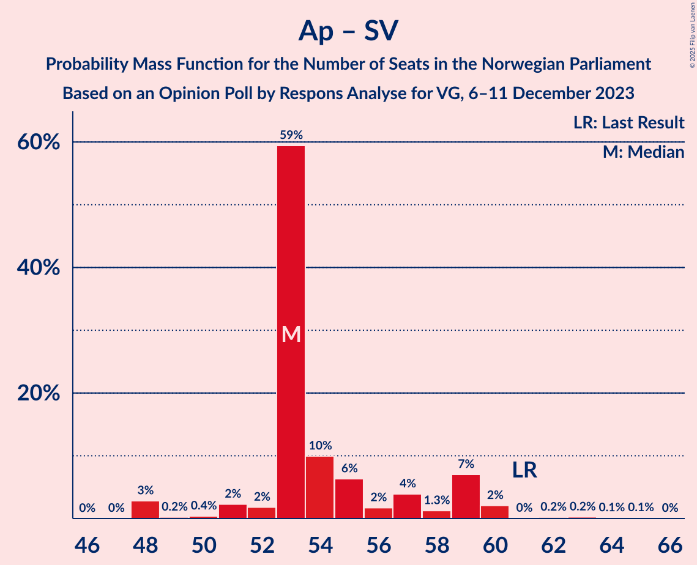

| Number of Seats | Probability | Accumulated | Special Marks |
|:---------------:|:-----------:|:-----------:|:-------------:|
| 48 | 3% | 100% |  |
| 49 | 0.2% | 97% |  |
| 50 | 0.4% | 97% |  |
| 51 | 2% | 97% |  |
| 52 | 2% | 94% |  |
| 53 | 59% | 92% | Median |
| 54 | 10% | 33% |  |
| 55 | 6% | 23% |  |
| 56 | 2% | 17% |  |
| 57 | 4% | 15% |  |
| 58 | 1.3% | 11% |  |
| 59 | 7% | 10% |  |
| 60 | 2% | 3% |  |
| 61 | 0% | 0.8% | Last Result |
| 62 | 0.2% | 0.7% |  |
| 63 | 0.2% | 0.5% |  |
| 64 | 0.1% | 0.3% |  |
| 65 | 0.1% | 0.2% |  |
| 66 | 0% | 0% |  |

### Arbeiderpartiet – Senterpartiet – Kristelig Folkeparti

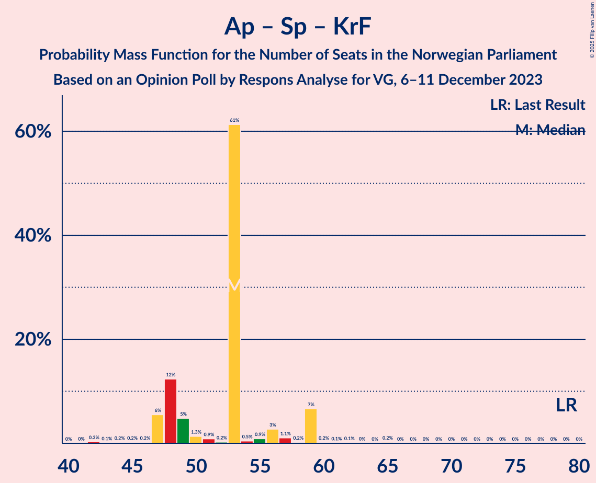

| Number of Seats | Probability | Accumulated | Special Marks |
|:---------------:|:-----------:|:-----------:|:-------------:|
| 42 | 0.3% | 100% |  |
| 43 | 0.1% | 99.7% |  |
| 44 | 0.2% | 99.6% |  |
| 45 | 0.2% | 99.4% |  |
| 46 | 0.2% | 99.2% |  |
| 47 | 6% | 99.1% |  |
| 48 | 12% | 94% |  |
| 49 | 5% | 81% |  |
| 50 | 1.3% | 76% |  |
| 51 | 0.9% | 75% |  |
| 52 | 0.2% | 74% |  |
| 53 | 61% | 74% | Median |
| 54 | 0.5% | 13% |  |
| 55 | 0.9% | 12% |  |
| 56 | 3% | 11% |  |
| 57 | 1.1% | 8% |  |
| 58 | 0.2% | 7% |  |
| 59 | 7% | 7% |  |
| 60 | 0.2% | 0.6% |  |
| 61 | 0.1% | 0.4% |  |
| 62 | 0.1% | 0.3% |  |
| 63 | 0% | 0.2% |  |
| 64 | 0% | 0.2% |  |
| 65 | 0.2% | 0.2% |  |
| 66 | 0% | 0% |  |
| 67 | 0% | 0% |  |
| 68 | 0% | 0% |  |
| 69 | 0% | 0% |  |
| 70 | 0% | 0% |  |
| 71 | 0% | 0% |  |
| 72 | 0% | 0% |  |
| 73 | 0% | 0% |  |
| 74 | 0% | 0% |  |
| 75 | 0% | 0% |  |
| 76 | 0% | 0% |  |
| 77 | 0% | 0% |  |
| 78 | 0% | 0% |  |
| 79 | 0% | 0% | Last Result |

### Arbeiderpartiet – Senterpartiet

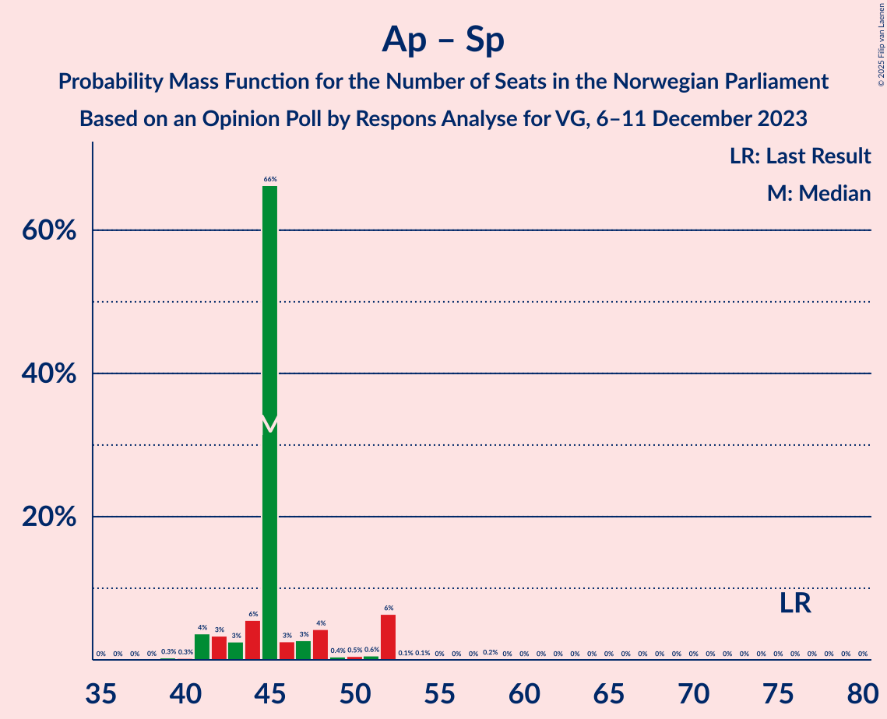

| Number of Seats | Probability | Accumulated | Special Marks |
|:---------------:|:-----------:|:-----------:|:-------------:|
| 38 | 0% | 100% |  |
| 39 | 0.3% | 99.9% |  |
| 40 | 0.3% | 99.6% |  |
| 41 | 4% | 99.4% |  |
| 42 | 3% | 96% |  |
| 43 | 3% | 92% |  |
| 44 | 6% | 90% |  |
| 45 | 66% | 84% | Median |
| 46 | 3% | 18% |  |
| 47 | 3% | 15% |  |
| 48 | 4% | 13% |  |
| 49 | 0.4% | 8% |  |
| 50 | 0.5% | 8% |  |
| 51 | 0.6% | 7% |  |
| 52 | 6% | 7% |  |
| 53 | 0.1% | 0.4% |  |
| 54 | 0.1% | 0.3% |  |
| 55 | 0% | 0.2% |  |
| 56 | 0% | 0.2% |  |
| 57 | 0% | 0.2% |  |
| 58 | 0.2% | 0.2% |  |
| 59 | 0% | 0% |  |
| 60 | 0% | 0% |  |
| 61 | 0% | 0% |  |
| 62 | 0% | 0% |  |
| 63 | 0% | 0% |  |
| 64 | 0% | 0% |  |
| 65 | 0% | 0% |  |
| 66 | 0% | 0% |  |
| 67 | 0% | 0% |  |
| 68 | 0% | 0% |  |
| 69 | 0% | 0% |  |
| 70 | 0% | 0% |  |
| 71 | 0% | 0% |  |
| 72 | 0% | 0% |  |
| 73 | 0% | 0% |  |
| 74 | 0% | 0% |  |
| 75 | 0% | 0% |  |
| 76 | 0% | 0% | Last Result |

### Senterpartiet – Venstre – Kristelig Folkeparti

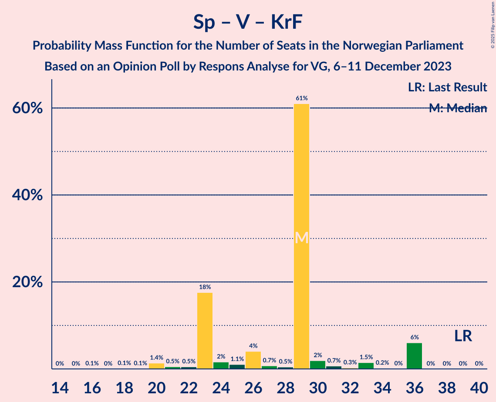

| Number of Seats | Probability | Accumulated | Special Marks |
|:---------------:|:-----------:|:-----------:|:-------------:|
| 16 | 0.1% | 100% |  |
| 17 | 0% | 99.9% |  |
| 18 | 0.1% | 99.9% |  |
| 19 | 0.1% | 99.8% |  |
| 20 | 1.4% | 99.7% |  |
| 21 | 0.5% | 98% |  |
| 22 | 0.5% | 98% |  |
| 23 | 18% | 97% |  |
| 24 | 2% | 80% |  |
| 25 | 1.1% | 78% |  |
| 26 | 4% | 77% |  |
| 27 | 0.7% | 73% |  |
| 28 | 0.5% | 72% |  |
| 29 | 61% | 72% | Median |
| 30 | 2% | 11% |  |
| 31 | 0.7% | 9% |  |
| 32 | 0.3% | 8% |  |
| 33 | 1.5% | 8% |  |
| 34 | 0.2% | 6% |  |
| 35 | 0% | 6% |  |
| 36 | 6% | 6% |  |
| 37 | 0% | 0% |  |
| 38 | 0% | 0% |  |
| 39 | 0% | 0% | Last Result |

## Technical Information

### Opinion Poll

+ **Polling firm:** Respons Analyse
+ **Commissioner(s):** VG
+ **Fieldwork period:** 6–11 December 2023

### Calculations

+ **Sample size:** 1000
+ **Simulations done:** 1,048,576
+ **Error estimate:** 3.08%

