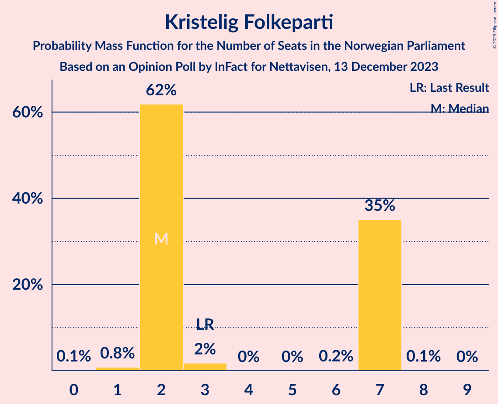
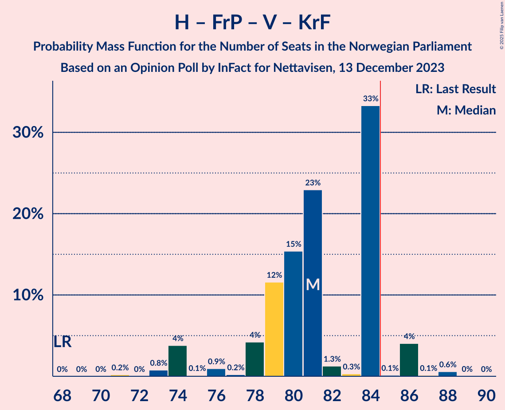
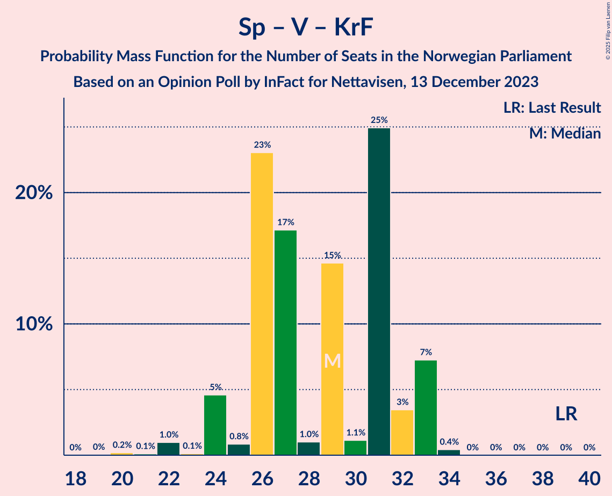

# Opinion Poll by InFact for Nettavisen, 13 December 2023

<a href="#voting-intentions">Voting Intentions</a> | <a href="#seats">Seats</a> | <a href="#coalitions">Coalitions</a> | <a href="#technical-information">Technical Information</a>

## Voting Intentions

### Confidence Intervals

| Party | Last Result | Poll Result | 80% Confidence Interval | 90% Confidence Interval | 95% Confidence Interval | 99% Confidence Interval |
|:-----:|:-----------:|:-----------:|:-----------------------:|:-----------------------:|:-----------------------:|:-----------------------:|
| Høyre | 20.4% | 24.5% | 22.9–26.1% |22.5–26.6% |22.1–27.0% |21.3–27.8% |
| Arbeiderpartiet | 26.2% | 18.9% | 17.5–20.4% |17.1–20.8% |16.7–21.2% |16.0–22.0% |
| Fremskrittspartiet | 11.6% | 14.2% | 13.0–15.6% |12.6–16.0% |12.3–16.4% |11.7–17.0% |
| Sosialistisk Venstreparti | 7.6% | 9.7% | 8.7–10.9% |8.4–11.3% |8.2–11.6% |7.7–12.2% |
| Senterpartiet | 13.5% | 7.8% | 6.9–8.9% |6.6–9.3% |6.4–9.5% |6.0–10.1% |
| Venstre | 4.6% | 6.0% | 5.2–7.0% |5.0–7.3% |4.8–7.6% |4.4–8.1% |
| Rødt | 4.7% | 5.7% | 4.9–6.7% |4.7–6.9% |4.5–7.2% |4.1–7.7% |
| Industri- og Næringspartiet | 0.3% | 4.7% | 4.0–5.6% |3.8–5.9% |3.7–6.1% |3.3–6.6% |
| Miljøpartiet De Grønne | 3.9% | 3.5% | 2.9–4.3% |2.8–4.6% |2.6–4.8% |2.3–5.2% |
| Kristelig Folkeparti | 3.8% | 3.3% | 2.7–4.1% |2.5–4.3% |2.4–4.5% |2.1–4.9% |
| Norgesdemokratene | 1.1% | 0.2% | 0.1–0.5% |0.1–0.5% |0.0–0.6% |0.0–0.8% |
| Folkets parti | 0.1% | 0.1% | 0.0–0.3% |0.0–0.4% |0.0–0.5% |0.0–0.6% |
| Liberalistene | 0.2% | 0.1% | 0.0–0.3% |0.0–0.4% |0.0–0.5% |0.0–0.6% |
| Konservativt | 0.4% | 0.1% | 0.0–0.3% |0.0–0.4% |0.0–0.5% |0.0–0.6% |
| Pensjonistpartiet | 0.6% | 0.1% | 0.0–0.3% |0.0–0.4% |0.0–0.5% |0.0–0.6% |

*Note:* The poll result column reflects the actual value used in the calculations. Published results may vary slightly, and in addition be rounded to fewer digits.

## Seats

### Confidence Intervals

| Party | Last Result | Median | 80% Confidence Interval | 90% Confidence Interval | 95% Confidence Interval | 99% Confidence Interval |
|:-----:|:-----------:|:------:|:-----------------------:|:-----------------------:|:-----------------------:|:-----------------------:|
| <a href="#høyre">Høyre</a> | 36 | 43 | 41–45 |39–45 |38–45 |38–47 |
| <a href="#arbeiderpartiet">Arbeiderpartiet</a> | 48 | 36 | 31–38 |31–38 |31–38 |31–41 |
| <a href="#fremskrittspartiet">Fremskrittspartiet</a> | 21 | 24 | 21–26 |21–26 |21–27 |21–30 |
| <a href="#sosialistisk-venstreparti">Sosialistisk Venstreparti</a> | 13 | 17 | 15–21 |15–21 |15–21 |13–21 |
| <a href="#senterpartiet">Senterpartiet</a> | 28 | 14 | 13–16 |13–16 |13–16 |10–18 |
| <a href="#venstre">Venstre</a> | 8 | 10 | 10–12 |9–12 |9–12 |7–14 |
| <a href="#rødt">Rødt</a> | 8 | 10 | 8–10 |8–11 |7–12 |6–13 |
| <a href="#industri--og-næringspartiet">Industri- og Næringspartiet</a> | 0 | 9 | 8–10 |8–10 |7–13 |3–13 |
| <a href="#miljøpartiet-de-grønne">Miljøpartiet De Grønne</a> | 3 | 1 | 1–2 |1–2 |1–3 |1–8 |
| <a href="#kristelig-folkeparti">Kristelig Folkeparti</a> | 3 | 2 | 2–7 |2–7 |2–7 |1–7 |
| <a href="#norgesdemokratene">Norgesdemokratene</a> | 0 | 0 | 0 |0 |0 |0 |
| <a href="#folkets-parti">Folkets parti</a> | 0 | 0 | 0 |0 |0 |0 |
| <a href="#liberalistene">Liberalistene</a> | 0 | 0 | 0 |0 |0 |0 |
| <a href="#konservativt">Konservativt</a> | 0 | 0 | 0 |0 |0 |0 |
| <a href="#pensjonistpartiet">Pensjonistpartiet</a> | 0 | 0 | 0 |0 |0 |0 |

### Høyre

*For a full overview of the results for this party, see the [Høyre](party-høyre.html) page.*

| Number of Seats | Probability | Accumulated | Special Marks |
|:---------------:|:-----------:|:-----------:|:-------------:|
| 36 | 0.1% | 100% | Last Result |
| 37 | 0.2% | 99.9% |  |
| 38 | 4% | 99.7% |  |
| 39 | 2% | 96% |  |
| 40 | 2% | 94% |  |
| 41 | 40% | 92% |  |
| 42 | 0.9% | 53% |  |
| 43 | 15% | 52% | Median |
| 44 | 0.5% | 37% |  |
| 45 | 34% | 36% |  |
| 46 | 0.4% | 2% |  |
| 47 | 2% | 2% |  |
| 48 | 0.1% | 0.4% |  |
| 49 | 0.2% | 0.3% |  |
| 50 | 0.1% | 0.1% |  |
| 51 | 0% | 0% |  |

### Arbeiderpartiet

*For a full overview of the results for this party, see the [Arbeiderpartiet](party-arbeiderpartiet.html) page.*

| Number of Seats | Probability | Accumulated | Special Marks |
|:---------------:|:-----------:|:-----------:|:-------------:|
| 29 | 0.1% | 100% |  |
| 30 | 0.1% | 99.9% |  |
| 31 | 26% | 99.7% |  |
| 32 | 0.3% | 74% |  |
| 33 | 6% | 74% |  |
| 34 | 2% | 67% |  |
| 35 | 8% | 65% |  |
| 36 | 20% | 57% | Median |
| 37 | 16% | 37% |  |
| 38 | 21% | 22% |  |
| 39 | 0.1% | 1.1% |  |
| 40 | 0.2% | 1.0% |  |
| 41 | 0.7% | 0.7% |  |
| 42 | 0.1% | 0.1% |  |
| 43 | 0% | 0% |  |
| 44 | 0% | 0% |  |
| 45 | 0% | 0% |  |
| 46 | 0% | 0% |  |
| 47 | 0% | 0% |  |
| 48 | 0% | 0% | Last Result |

### Fremskrittspartiet

*For a full overview of the results for this party, see the [Fremskrittspartiet](party-fremskrittspartiet.html) page.*

| Number of Seats | Probability | Accumulated | Special Marks |
|:---------------:|:-----------:|:-----------:|:-------------:|
| 17 | 0.1% | 100% |  |
| 18 | 0% | 99.9% |  |
| 19 | 0% | 99.9% |  |
| 20 | 0.2% | 99.9% |  |
| 21 | 11% | 99.7% | Last Result |
| 22 | 8% | 89% |  |
| 23 | 6% | 81% |  |
| 24 | 26% | 74% | Median |
| 25 | 18% | 48% |  |
| 26 | 26% | 30% |  |
| 27 | 1.4% | 4% |  |
| 28 | 0.8% | 2% |  |
| 29 | 0.2% | 2% |  |
| 30 | 0.9% | 1.3% |  |
| 31 | 0.3% | 0.4% |  |
| 32 | 0% | 0.1% |  |
| 33 | 0% | 0.1% |  |
| 34 | 0% | 0% |  |

### Sosialistisk Venstreparti

*For a full overview of the results for this party, see the [Sosialistisk Venstreparti](party-sosialistiskvenstreparti.html) page.*

| Number of Seats | Probability | Accumulated | Special Marks |
|:---------------:|:-----------:|:-----------:|:-------------:|
| 11 | 0% | 100% |  |
| 12 | 0.4% | 99.9% |  |
| 13 | 0.7% | 99.6% | Last Result |
| 14 | 1.0% | 98.9% |  |
| 15 | 42% | 98% |  |
| 16 | 2% | 56% |  |
| 17 | 29% | 54% | Median |
| 18 | 1.1% | 26% |  |
| 19 | 4% | 24% |  |
| 20 | 0.4% | 20% |  |
| 21 | 20% | 20% |  |
| 22 | 0.1% | 0.4% |  |
| 23 | 0.1% | 0.3% |  |
| 24 | 0.2% | 0.2% |  |
| 25 | 0% | 0% |  |

### Senterpartiet

*For a full overview of the results for this party, see the [Senterpartiet](party-senterpartiet.html) page.*

| Number of Seats | Probability | Accumulated | Special Marks |
|:---------------:|:-----------:|:-----------:|:-------------:|
| 9 | 0.3% | 100% |  |
| 10 | 0.8% | 99.7% |  |
| 11 | 0.2% | 99.0% |  |
| 12 | 1.2% | 98.7% |  |
| 13 | 20% | 98% |  |
| 14 | 58% | 77% | Median |
| 15 | 2% | 19% |  |
| 16 | 15% | 17% |  |
| 17 | 0.3% | 2% |  |
| 18 | 0.8% | 1.2% |  |
| 19 | 0.4% | 0.4% |  |
| 20 | 0% | 0% |  |
| 21 | 0% | 0% |  |
| 22 | 0% | 0% |  |
| 23 | 0% | 0% |  |
| 24 | 0% | 0% |  |
| 25 | 0% | 0% |  |
| 26 | 0% | 0% |  |
| 27 | 0% | 0% |  |
| 28 | 0% | 0% | Last Result |

### Venstre

*For a full overview of the results for this party, see the [Venstre](party-venstre.html) page.*

| Number of Seats | Probability | Accumulated | Special Marks |
|:---------------:|:-----------:|:-----------:|:-------------:|
| 3 | 0.3% | 100% |  |
| 4 | 0% | 99.7% |  |
| 5 | 0% | 99.7% |  |
| 6 | 0% | 99.7% |  |
| 7 | 0.5% | 99.7% |  |
| 8 | 0.6% | 99.2% | Last Result |
| 9 | 7% | 98.6% |  |
| 10 | 48% | 92% | Median |
| 11 | 18% | 44% |  |
| 12 | 24% | 26% |  |
| 13 | 1.0% | 2% |  |
| 14 | 1.3% | 1.4% |  |
| 15 | 0% | 0% |  |

### Rødt

*For a full overview of the results for this party, see the [Rødt](party-rødt.html) page.*

| Number of Seats | Probability | Accumulated | Special Marks |
|:---------------:|:-----------:|:-----------:|:-------------:|
| 1 | 0.2% | 100% |  |
| 2 | 0% | 99.8% |  |
| 3 | 0% | 99.8% |  |
| 4 | 0% | 99.8% |  |
| 5 | 0% | 99.8% |  |
| 6 | 2% | 99.8% |  |
| 7 | 0.4% | 98% |  |
| 8 | 15% | 97% | Last Result |
| 9 | 2% | 82% |  |
| 10 | 73% | 80% | Median |
| 11 | 5% | 7% |  |
| 12 | 1.0% | 3% |  |
| 13 | 1.5% | 2% |  |
| 14 | 0.1% | 0.1% |  |
| 15 | 0% | 0% |  |

### Industri- og Næringspartiet

*For a full overview of the results for this party, see the [Industri- og Næringspartiet](party-industri-ognæringspartiet.html) page.*

| Number of Seats | Probability | Accumulated | Special Marks |
|:---------------:|:-----------:|:-----------:|:-------------:|
| 0 | 0% | 100% | Last Result |
| 1 | 0% | 100% |  |
| 2 | 0.3% | 100% |  |
| 3 | 1.3% | 99.7% |  |
| 4 | 0% | 98% |  |
| 5 | 0% | 98% |  |
| 6 | 0% | 98% |  |
| 7 | 1.3% | 98% |  |
| 8 | 14% | 97% |  |
| 9 | 39% | 83% | Median |
| 10 | 39% | 44% |  |
| 11 | 0.5% | 5% |  |
| 12 | 0.2% | 4% |  |
| 13 | 4% | 4% |  |
| 14 | 0% | 0% |  |

### Miljøpartiet De Grønne

*For a full overview of the results for this party, see the [Miljøpartiet De Grønne](party-miljøpartietdegrønne.html) page.*

| Number of Seats | Probability | Accumulated | Special Marks |
|:---------------:|:-----------:|:-----------:|:-------------:|
| 1 | 51% | 100% | Median |
| 2 | 46% | 49% |  |
| 3 | 2% | 3% | Last Result |
| 4 | 0% | 2% |  |
| 5 | 0% | 2% |  |
| 6 | 0% | 2% |  |
| 7 | 0.5% | 2% |  |
| 8 | 0.8% | 1.2% |  |
| 9 | 0.1% | 0.4% |  |
| 10 | 0.3% | 0.3% |  |
| 11 | 0% | 0% |  |

### Kristelig Folkeparti

*For a full overview of the results for this party, see the [Kristelig Folkeparti](party-kristeligfolkeparti.html) page.*

| Number of Seats | Probability | Accumulated | Special Marks |
|:---------------:|:-----------:|:-----------:|:-------------:|
| 0 | 0.1% | 100% |  |
| 1 | 0.8% | 99.9% |  |
| 2 | 62% | 99.0% | Median |
| 3 | 2% | 37% | Last Result |
| 4 | 0% | 35% |  |
| 5 | 0% | 35% |  |
| 6 | 0.2% | 35% |  |
| 7 | 35% | 35% |  |
| 8 | 0.1% | 0.1% |  |
| 9 | 0% | 0% |  |

### Norgesdemokratene

*For a full overview of the results for this party, see the [Norgesdemokratene](party-norgesdemokratene.html) page.*

| Number of Seats | Probability | Accumulated | Special Marks |
|:---------------:|:-----------:|:-----------:|:-------------:|
| 0 | 100% | 100% | Last Result, Median |

### Folkets parti

*For a full overview of the results for this party, see the [Folkets parti](party-folketsparti.html) page.*

| Number of Seats | Probability | Accumulated | Special Marks |
|:---------------:|:-----------:|:-----------:|:-------------:|
| 0 | 100% | 100% | Last Result, Median |

### Liberalistene

*For a full overview of the results for this party, see the [Liberalistene](party-liberalistene.html) page.*

| Number of Seats | Probability | Accumulated | Special Marks |
|:---------------:|:-----------:|:-----------:|:-------------:|
| 0 | 100% | 100% | Last Result, Median |

### Konservativt

*For a full overview of the results for this party, see the [Konservativt](party-konservativt.html) page.*

| Number of Seats | Probability | Accumulated | Special Marks |
|:---------------:|:-----------:|:-----------:|:-------------:|
| 0 | 100% | 100% | Last Result, Median |

### Pensjonistpartiet

*For a full overview of the results for this party, see the [Pensjonistpartiet](party-pensjonistpartiet.html) page.*

| Number of Seats | Probability | Accumulated | Special Marks |
|:---------------:|:-----------:|:-----------:|:-------------:|
| 0 | 100% | 100% | Last Result, Median |

## Coalitions

### Confidence Intervals

| Coalition | Last Result | Median | Majority? | 80% Confidence Interval | 90% Confidence Interval | 95% Confidence Interval | 99% Confidence Interval |
|:---------:|:-----------:|:------:|:---------:|:-----------------------:|:-----------------------:|:-----------------------:|:-----------------------:|
| Høyre – Fremskrittspartiet – Senterpartiet – Venstre – Kristelig Folkeparti | 96 | 95 | 100% | 92–98 | 91–99 | 90–100 | 88–102 |
| Høyre – Fremskrittspartiet – Venstre – Miljøpartiet De Grønne – Kristelig Folkeparti | 71 | 82 | 39% | 80–86 | 79–87 | 76–88 | 76–90 |
| Høyre – Fremskrittspartiet – Venstre – Kristelig Folkeparti | 68 | 81 | 5% | 78–84 | 76–84 | 74–86 | 73–88 |
| Arbeiderpartiet – Sosialistisk Venstreparti – Senterpartiet – Rødt – Miljøpartiet De Grønne | 100 | 78 | 5% | 74–79 | 74–85 | 73–86 | 70–87 |
| Arbeiderpartiet – Sosialistisk Venstreparti – Senterpartiet – Rødt | 97 | 77 | 0.1% | 72–78 | 72–81 | 72–84 | 69–84 |
| Høyre – Fremskrittspartiet – Venstre | 65 | 77 | 0.7% | 76–79 | 73–79 | 72–83 | 70–86 |
| Arbeiderpartiet – Sosialistisk Venstreparti – Senterpartiet – Miljøpartiet De Grønne – Kristelig Folkeparti | 95 | 71 | 0% | 70–73 | 69–77 | 68–77 | 63–78 |
| Arbeiderpartiet – Sosialistisk Venstreparti – Senterpartiet – Miljøpartiet De Grønne | 92 | 68 | 0% | 64–71 | 64–74 | 64–75 | 61–76 |
| Arbeiderpartiet – Sosialistisk Venstreparti – Senterpartiet | 89 | 67 | 0% | 62–70 | 62–71 | 62–73 | 59–73 |
| Høyre – Fremskrittspartiet | 57 | 67 | 0% | 65–69 | 64–69 | 61–71 | 61–75 |
| Arbeiderpartiet – Sosialistisk Venstreparti – Rødt – Miljøpartiet De Grønne | 72 | 63 | 0% | 60–66 | 60–69 | 59–70 | 58–71 |
| Høyre – Venstre – Kristelig Folkeparti | 47 | 57 | 0% | 54–61 | 51–62 | 51–62 | 50–63 |
| Arbeiderpartiet – Senterpartiet – Miljøpartiet De Grønne – Kristelig Folkeparti | 82 | 54 | 0% | 52–58 | 50–58 | 50–59 | 47–62 |
| Arbeiderpartiet – Senterpartiet – Kristelig Folkeparti | 79 | 53 | 0% | 51–56 | 48–56 | 48–58 | 45–58 |
| Arbeiderpartiet – Sosialistisk Venstreparti | 61 | 52 | 0% | 48–57 | 48–57 | 48–57 | 47–58 |
| Arbeiderpartiet – Senterpartiet | 76 | 49 | 0% | 45–53 | 45–53 | 45–53 | 43–54 |
| Senterpartiet – Venstre – Kristelig Folkeparti | 39 | 29 | 0% | 26–32 | 24–33 | 24–33 | 22–33 |

### Høyre – Fremskrittspartiet – Senterpartiet – Venstre – Kristelig Folkeparti

| Number of Seats | Probability | Accumulated | Special Marks |
|:---------------:|:-----------:|:-----------:|:-------------:|
| 85 | 0.2% | 100% | Majority |
| 86 | 0% | 99.8% |  |
| 87 | 0.1% | 99.7% |  |
| 88 | 0.2% | 99.7% |  |
| 89 | 0.5% | 99.4% |  |
| 90 | 4% | 99.0% |  |
| 91 | 5% | 95% |  |
| 92 | 1.3% | 90% |  |
| 93 | 15% | 89% | Median |
| 94 | 2% | 74% |  |
| 95 | 32% | 71% |  |
| 96 | 0.6% | 39% | Last Result |
| 97 | 0.4% | 39% |  |
| 98 | 33% | 38% |  |
| 99 | 0.9% | 6% |  |
| 100 | 3% | 5% |  |
| 101 | 0.3% | 2% |  |
| 102 | 1.2% | 1.3% |  |
| 103 | 0% | 0.1% |  |
| 104 | 0% | 0.1% |  |
| 105 | 0% | 0% |  |

### Høyre – Fremskrittspartiet – Venstre – Miljøpartiet De Grønne – Kristelig Folkeparti

| Number of Seats | Probability | Accumulated | Special Marks |
|:---------------:|:-----------:|:-----------:|:-------------:|
| 71 | 0% | 100% | Last Result |
| 72 | 0% | 100% |  |
| 73 | 0% | 100% |  |
| 74 | 0% | 100% |  |
| 75 | 0% | 100% |  |
| 76 | 4% | 100% |  |
| 77 | 0% | 96% |  |
| 78 | 0.3% | 96% |  |
| 79 | 0.6% | 95% |  |
| 80 | 15% | 95% | Median |
| 81 | 16% | 80% |  |
| 82 | 23% | 64% |  |
| 83 | 1.3% | 41% |  |
| 84 | 1.3% | 40% |  |
| 85 | 0.9% | 39% | Majority |
| 86 | 33% | 38% |  |
| 87 | 3% | 5% |  |
| 88 | 2% | 3% |  |
| 89 | 0.6% | 1.1% |  |
| 90 | 0.1% | 0.5% |  |
| 91 | 0.1% | 0.5% |  |
| 92 | 0% | 0.4% |  |
| 93 | 0% | 0.4% |  |
| 94 | 0.2% | 0.3% |  |
| 95 | 0.1% | 0.1% |  |
| 96 | 0.1% | 0.1% |  |
| 97 | 0% | 0% |  |

### Høyre – Fremskrittspartiet – Venstre – Kristelig Folkeparti

| Number of Seats | Probability | Accumulated | Special Marks |
|:---------------:|:-----------:|:-----------:|:-------------:|
| 68 | 0% | 100% | Last Result |
| 69 | 0% | 100% |  |
| 70 | 0% | 100% |  |
| 71 | 0.2% | 100% |  |
| 72 | 0% | 99.8% |  |
| 73 | 0.8% | 99.8% |  |
| 74 | 4% | 99.0% |  |
| 75 | 0.1% | 95% |  |
| 76 | 0.9% | 95% |  |
| 77 | 0.2% | 94% |  |
| 78 | 4% | 94% |  |
| 79 | 12% | 90% | Median |
| 80 | 15% | 78% |  |
| 81 | 23% | 63% |  |
| 82 | 1.3% | 40% |  |
| 83 | 0.3% | 39% |  |
| 84 | 33% | 38% |  |
| 85 | 0.1% | 5% | Majority |
| 86 | 4% | 5% |  |
| 87 | 0.1% | 0.8% |  |
| 88 | 0.6% | 0.6% |  |
| 89 | 0% | 0.1% |  |
| 90 | 0% | 0% |  |

### Arbeiderpartiet – Sosialistisk Venstreparti – Senterpartiet – Rødt – Miljøpartiet De Grønne

| Number of Seats | Probability | Accumulated | Special Marks |
|:---------------:|:-----------:|:-----------:|:-------------:|
| 70 | 0.5% | 100% |  |
| 71 | 0.4% | 99.5% |  |
| 72 | 0.1% | 99.1% |  |
| 73 | 2% | 99.0% |  |
| 74 | 25% | 97% |  |
| 75 | 0.2% | 72% |  |
| 76 | 9% | 71% |  |
| 77 | 6% | 62% |  |
| 78 | 21% | 56% | Median |
| 79 | 27% | 35% |  |
| 80 | 0.7% | 8% |  |
| 81 | 0.5% | 7% |  |
| 82 | 0.4% | 7% |  |
| 83 | 0.2% | 6% |  |
| 84 | 0.8% | 6% |  |
| 85 | 0.3% | 5% | Majority |
| 86 | 4% | 5% |  |
| 87 | 0.4% | 0.7% |  |
| 88 | 0% | 0.3% |  |
| 89 | 0% | 0.2% |  |
| 90 | 0.2% | 0.2% |  |
| 91 | 0% | 0% |  |
| 92 | 0% | 0% |  |
| 93 | 0% | 0% |  |
| 94 | 0% | 0% |  |
| 95 | 0% | 0% |  |
| 96 | 0% | 0% |  |
| 97 | 0% | 0% |  |
| 98 | 0% | 0% |  |
| 99 | 0% | 0% |  |
| 100 | 0% | 0% | Last Result |

### Arbeiderpartiet – Sosialistisk Venstreparti – Senterpartiet – Rødt

| Number of Seats | Probability | Accumulated | Special Marks |
|:---------------:|:-----------:|:-----------:|:-------------:|
| 66 | 0.2% | 100% |  |
| 67 | 0.1% | 99.8% |  |
| 68 | 0% | 99.8% |  |
| 69 | 0.9% | 99.7% |  |
| 70 | 0.1% | 98.8% |  |
| 71 | 0.2% | 98.7% |  |
| 72 | 27% | 98.5% |  |
| 73 | 0.6% | 71% |  |
| 74 | 9% | 71% |  |
| 75 | 5% | 62% |  |
| 76 | 3% | 57% |  |
| 77 | 23% | 55% | Median |
| 78 | 25% | 32% |  |
| 79 | 0.7% | 7% |  |
| 80 | 0.7% | 6% |  |
| 81 | 0.6% | 5% |  |
| 82 | 0.2% | 5% |  |
| 83 | 0.2% | 4% |  |
| 84 | 4% | 4% |  |
| 85 | 0% | 0.1% | Majority |
| 86 | 0% | 0% |  |
| 87 | 0% | 0% |  |
| 88 | 0% | 0% |  |
| 89 | 0% | 0% |  |
| 90 | 0% | 0% |  |
| 91 | 0% | 0% |  |
| 92 | 0% | 0% |  |
| 93 | 0% | 0% |  |
| 94 | 0% | 0% |  |
| 95 | 0% | 0% |  |
| 96 | 0% | 0% |  |
| 97 | 0% | 0% | Last Result |

### Høyre – Fremskrittspartiet – Venstre

| Number of Seats | Probability | Accumulated | Special Marks |
|:---------------:|:-----------:|:-----------:|:-------------:|
| 65 | 0% | 100% | Last Result |
| 66 | 0% | 100% |  |
| 67 | 0% | 100% |  |
| 68 | 0% | 100% |  |
| 69 | 0.3% | 100% |  |
| 70 | 0.4% | 99.7% |  |
| 71 | 0.4% | 99.4% |  |
| 72 | 4% | 99.0% |  |
| 73 | 0.2% | 95% |  |
| 74 | 1.0% | 95% |  |
| 75 | 0.3% | 94% |  |
| 76 | 5% | 94% |  |
| 77 | 43% | 89% | Median |
| 78 | 15% | 45% |  |
| 79 | 25% | 30% |  |
| 80 | 0.6% | 5% |  |
| 81 | 0.8% | 4% |  |
| 82 | 0.6% | 3% |  |
| 83 | 0.4% | 3% |  |
| 84 | 1.4% | 2% |  |
| 85 | 0.1% | 0.7% | Majority |
| 86 | 0.6% | 0.6% |  |
| 87 | 0% | 0% |  |

### Arbeiderpartiet – Sosialistisk Venstreparti – Senterpartiet – Miljøpartiet De Grønne – Kristelig Folkeparti

| Number of Seats | Probability | Accumulated | Special Marks |
|:---------------:|:-----------:|:-----------:|:-------------:|
| 62 | 0.5% | 100% |  |
| 63 | 0% | 99.5% |  |
| 64 | 0.5% | 99.5% |  |
| 65 | 0.3% | 98.9% |  |
| 66 | 0.5% | 98.7% |  |
| 67 | 0.2% | 98% |  |
| 68 | 1.0% | 98% |  |
| 69 | 6% | 97% |  |
| 70 | 20% | 91% | Median |
| 71 | 37% | 70% |  |
| 72 | 1.3% | 33% |  |
| 73 | 23% | 32% |  |
| 74 | 3% | 10% |  |
| 75 | 0.3% | 7% |  |
| 76 | 1.3% | 6% |  |
| 77 | 4% | 5% |  |
| 78 | 0.4% | 0.9% |  |
| 79 | 0.1% | 0.5% |  |
| 80 | 0.1% | 0.4% |  |
| 81 | 0.3% | 0.3% |  |
| 82 | 0% | 0.1% |  |
| 83 | 0% | 0% |  |
| 84 | 0% | 0% |  |
| 85 | 0% | 0% | Majority |
| 86 | 0% | 0% |  |
| 87 | 0% | 0% |  |
| 88 | 0% | 0% |  |
| 89 | 0% | 0% |  |
| 90 | 0% | 0% |  |
| 91 | 0% | 0% |  |
| 92 | 0% | 0% |  |
| 93 | 0% | 0% |  |
| 94 | 0% | 0% |  |
| 95 | 0% | 0% | Last Result |

### Arbeiderpartiet – Sosialistisk Venstreparti – Senterpartiet – Miljøpartiet De Grønne

| Number of Seats | Probability | Accumulated | Special Marks |
|:---------------:|:-----------:|:-----------:|:-------------:|
| 60 | 0.5% | 100% |  |
| 61 | 0% | 99.5% |  |
| 62 | 0% | 99.5% |  |
| 63 | 1.1% | 99.5% |  |
| 64 | 25% | 98% |  |
| 65 | 0.5% | 73% |  |
| 66 | 9% | 73% |  |
| 67 | 9% | 64% |  |
| 68 | 20% | 56% | Median |
| 69 | 12% | 36% |  |
| 70 | 1.1% | 23% |  |
| 71 | 15% | 22% |  |
| 72 | 0.3% | 7% |  |
| 73 | 0.3% | 6% |  |
| 74 | 2% | 6% |  |
| 75 | 4% | 4% |  |
| 76 | 0.4% | 0.7% |  |
| 77 | 0.1% | 0.4% |  |
| 78 | 0% | 0.3% |  |
| 79 | 0.2% | 0.3% |  |
| 80 | 0% | 0% |  |
| 81 | 0% | 0% |  |
| 82 | 0% | 0% |  |
| 83 | 0% | 0% |  |
| 84 | 0% | 0% |  |
| 85 | 0% | 0% | Majority |
| 86 | 0% | 0% |  |
| 87 | 0% | 0% |  |
| 88 | 0% | 0% |  |
| 89 | 0% | 0% |  |
| 90 | 0% | 0% |  |
| 91 | 0% | 0% |  |
| 92 | 0% | 0% | Last Result |

### Arbeiderpartiet – Sosialistisk Venstreparti – Senterpartiet

| Number of Seats | Probability | Accumulated | Special Marks |
|:---------------:|:-----------:|:-----------:|:-------------:|
| 59 | 0.5% | 100% |  |
| 60 | 0.2% | 99.4% |  |
| 61 | 1.3% | 99.3% |  |
| 62 | 25% | 98% |  |
| 63 | 0.8% | 73% |  |
| 64 | 8% | 72% |  |
| 65 | 5% | 64% |  |
| 66 | 5% | 59% |  |
| 67 | 22% | 55% | Median |
| 68 | 12% | 32% |  |
| 69 | 0.4% | 21% |  |
| 70 | 15% | 21% |  |
| 71 | 1.0% | 5% |  |
| 72 | 0.4% | 4% |  |
| 73 | 4% | 4% |  |
| 74 | 0.1% | 0.1% |  |
| 75 | 0% | 0% |  |
| 76 | 0% | 0% |  |
| 77 | 0% | 0% |  |
| 78 | 0% | 0% |  |
| 79 | 0% | 0% |  |
| 80 | 0% | 0% |  |
| 81 | 0% | 0% |  |
| 82 | 0% | 0% |  |
| 83 | 0% | 0% |  |
| 84 | 0% | 0% |  |
| 85 | 0% | 0% | Majority |
| 86 | 0% | 0% |  |
| 87 | 0% | 0% |  |
| 88 | 0% | 0% |  |
| 89 | 0% | 0% | Last Result |

### Høyre – Fremskrittspartiet

| Number of Seats | Probability | Accumulated | Special Marks |
|:---------------:|:-----------:|:-----------:|:-------------:|
| 57 | 0% | 100% | Last Result |
| 58 | 0% | 100% |  |
| 59 | 0% | 100% |  |
| 60 | 0% | 100% |  |
| 61 | 4% | 99.9% |  |
| 62 | 0.2% | 96% |  |
| 63 | 0.2% | 95% |  |
| 64 | 0.9% | 95% |  |
| 65 | 9% | 94% |  |
| 66 | 25% | 85% |  |
| 67 | 30% | 60% | Median |
| 68 | 4% | 30% |  |
| 69 | 22% | 27% |  |
| 70 | 2% | 4% |  |
| 71 | 0.9% | 3% |  |
| 72 | 0.8% | 2% |  |
| 73 | 0.1% | 0.9% |  |
| 74 | 0.1% | 0.9% |  |
| 75 | 0.6% | 0.7% |  |
| 76 | 0% | 0.1% |  |
| 77 | 0.1% | 0.1% |  |
| 78 | 0% | 0% |  |

### Arbeiderpartiet – Sosialistisk Venstreparti – Rødt – Miljøpartiet De Grønne

| Number of Seats | Probability | Accumulated | Special Marks |
|:---------------:|:-----------:|:-----------:|:-------------:|
| 57 | 0.4% | 100% |  |
| 58 | 0.6% | 99.6% |  |
| 59 | 2% | 99.0% |  |
| 60 | 25% | 97% |  |
| 61 | 1.1% | 72% |  |
| 62 | 8% | 71% |  |
| 63 | 13% | 63% |  |
| 64 | 25% | 49% | Median |
| 65 | 1.3% | 25% |  |
| 66 | 15% | 23% |  |
| 67 | 1.2% | 8% |  |
| 68 | 1.2% | 7% |  |
| 69 | 1.1% | 6% |  |
| 70 | 4% | 4% |  |
| 71 | 0.1% | 0.5% |  |
| 72 | 0.1% | 0.4% | Last Result |
| 73 | 0.1% | 0.3% |  |
| 74 | 0% | 0.3% |  |
| 75 | 0% | 0.2% |  |
| 76 | 0.2% | 0.2% |  |
| 77 | 0% | 0% |  |

### Høyre – Venstre – Kristelig Folkeparti

| Number of Seats | Probability | Accumulated | Special Marks |
|:---------------:|:-----------:|:-----------:|:-------------:|
| 47 | 0% | 100% | Last Result |
| 48 | 0.1% | 100% |  |
| 49 | 0% | 99.9% |  |
| 50 | 0.9% | 99.9% |  |
| 51 | 4% | 99.0% |  |
| 52 | 0.9% | 95% |  |
| 53 | 0.3% | 94% |  |
| 54 | 6% | 93% |  |
| 55 | 15% | 87% | Median |
| 56 | 1.3% | 72% |  |
| 57 | 23% | 71% |  |
| 58 | 36% | 48% |  |
| 59 | 0.2% | 12% |  |
| 60 | 0.5% | 12% |  |
| 61 | 3% | 12% |  |
| 62 | 7% | 9% |  |
| 63 | 1.3% | 1.4% |  |
| 64 | 0% | 0% |  |

### Arbeiderpartiet – Senterpartiet – Miljøpartiet De Grønne – Kristelig Folkeparti

| Number of Seats | Probability | Accumulated | Special Marks |
|:---------------:|:-----------:|:-----------:|:-------------:|
| 46 | 0.5% | 100% |  |
| 47 | 0.1% | 99.5% |  |
| 48 | 0.7% | 99.4% |  |
| 49 | 0.3% | 98.7% |  |
| 50 | 5% | 98% |  |
| 51 | 0.7% | 94% |  |
| 52 | 15% | 93% |  |
| 53 | 0.5% | 78% | Median |
| 54 | 29% | 77% |  |
| 55 | 21% | 49% |  |
| 56 | 14% | 28% |  |
| 57 | 0.7% | 13% |  |
| 58 | 8% | 13% |  |
| 59 | 3% | 4% |  |
| 60 | 0.5% | 2% |  |
| 61 | 0.7% | 1.3% |  |
| 62 | 0.1% | 0.6% |  |
| 63 | 0.3% | 0.5% |  |
| 64 | 0.1% | 0.2% |  |
| 65 | 0.1% | 0.1% |  |
| 66 | 0% | 0% |  |
| 67 | 0% | 0% |  |
| 68 | 0% | 0% |  |
| 69 | 0% | 0% |  |
| 70 | 0% | 0% |  |
| 71 | 0% | 0% |  |
| 72 | 0% | 0% |  |
| 73 | 0% | 0% |  |
| 74 | 0% | 0% |  |
| 75 | 0% | 0% |  |
| 76 | 0% | 0% |  |
| 77 | 0% | 0% |  |
| 78 | 0% | 0% |  |
| 79 | 0% | 0% |  |
| 80 | 0% | 0% |  |
| 81 | 0% | 0% |  |
| 82 | 0% | 0% | Last Result |

### Arbeiderpartiet – Senterpartiet – Kristelig Folkeparti

| Number of Seats | Probability | Accumulated | Special Marks |
|:---------------:|:-----------:|:-----------:|:-------------:|
| 45 | 0.7% | 100% |  |
| 46 | 0.7% | 99.3% |  |
| 47 | 0.2% | 98.6% |  |
| 48 | 5% | 98% |  |
| 49 | 0.8% | 93% |  |
| 50 | 0.6% | 92% |  |
| 51 | 15% | 92% |  |
| 52 | 26% | 77% | Median |
| 53 | 4% | 50% |  |
| 54 | 24% | 46% |  |
| 55 | 11% | 22% |  |
| 56 | 8% | 11% |  |
| 57 | 0.7% | 3% |  |
| 58 | 2% | 3% |  |
| 59 | 0% | 0.2% |  |
| 60 | 0.1% | 0.2% |  |
| 61 | 0% | 0.1% |  |
| 62 | 0% | 0% |  |
| 63 | 0% | 0% |  |
| 64 | 0% | 0% |  |
| 65 | 0% | 0% |  |
| 66 | 0% | 0% |  |
| 67 | 0% | 0% |  |
| 68 | 0% | 0% |  |
| 69 | 0% | 0% |  |
| 70 | 0% | 0% |  |
| 71 | 0% | 0% |  |
| 72 | 0% | 0% |  |
| 73 | 0% | 0% |  |
| 74 | 0% | 0% |  |
| 75 | 0% | 0% |  |
| 76 | 0% | 0% |  |
| 77 | 0% | 0% |  |
| 78 | 0% | 0% |  |
| 79 | 0% | 0% | Last Result |

### Arbeiderpartiet – Sosialistisk Venstreparti

| Number of Seats | Probability | Accumulated | Special Marks |
|:---------------:|:-----------:|:-----------:|:-------------:|
| 45 | 0.1% | 100% |  |
| 46 | 0.2% | 99.9% |  |
| 47 | 1.1% | 99.7% |  |
| 48 | 25% | 98.6% |  |
| 49 | 0.9% | 73% |  |
| 50 | 9% | 73% |  |
| 51 | 2% | 64% |  |
| 52 | 18% | 62% |  |
| 53 | 21% | 43% | Median |
| 54 | 1.4% | 22% |  |
| 55 | 1.0% | 21% |  |
| 56 | 0.1% | 20% |  |
| 57 | 19% | 20% |  |
| 58 | 0.6% | 0.8% |  |
| 59 | 0.1% | 0.2% |  |
| 60 | 0% | 0.1% |  |
| 61 | 0% | 0% | Last Result |

### Arbeiderpartiet – Senterpartiet

| Number of Seats | Probability | Accumulated | Special Marks |
|:---------------:|:-----------:|:-----------:|:-------------:|
| 43 | 0.6% | 100% |  |
| 44 | 0.2% | 99.3% |  |
| 45 | 26% | 99.1% |  |
| 46 | 5% | 73% |  |
| 47 | 1.0% | 68% |  |
| 48 | 0.5% | 67% |  |
| 49 | 23% | 67% |  |
| 50 | 2% | 44% | Median |
| 51 | 6% | 42% |  |
| 52 | 24% | 36% |  |
| 53 | 11% | 12% |  |
| 54 | 0.6% | 0.7% |  |
| 55 | 0% | 0.1% |  |
| 56 | 0% | 0.1% |  |
| 57 | 0% | 0.1% |  |
| 58 | 0% | 0% |  |
| 59 | 0% | 0% |  |
| 60 | 0% | 0% |  |
| 61 | 0% | 0% |  |
| 62 | 0% | 0% |  |
| 63 | 0% | 0% |  |
| 64 | 0% | 0% |  |
| 65 | 0% | 0% |  |
| 66 | 0% | 0% |  |
| 67 | 0% | 0% |  |
| 68 | 0% | 0% |  |
| 69 | 0% | 0% |  |
| 70 | 0% | 0% |  |
| 71 | 0% | 0% |  |
| 72 | 0% | 0% |  |
| 73 | 0% | 0% |  |
| 74 | 0% | 0% |  |
| 75 | 0% | 0% |  |
| 76 | 0% | 0% | Last Result |

### Senterpartiet – Venstre – Kristelig Folkeparti

| Number of Seats | Probability | Accumulated | Special Marks |
|:---------------:|:-----------:|:-----------:|:-------------:|
| 20 | 0.2% | 100% |  |
| 21 | 0.1% | 99.8% |  |
| 22 | 1.0% | 99.6% |  |
| 23 | 0.1% | 98.7% |  |
| 24 | 5% | 98.5% |  |
| 25 | 0.8% | 94% |  |
| 26 | 23% | 93% | Median |
| 27 | 17% | 70% |  |
| 28 | 1.0% | 53% |  |
| 29 | 15% | 52% |  |
| 30 | 1.1% | 37% |  |
| 31 | 25% | 36% |  |
| 32 | 3% | 11% |  |
| 33 | 7% | 8% |  |
| 34 | 0.4% | 0.5% |  |
| 35 | 0% | 0% |  |
| 36 | 0% | 0% |  |
| 37 | 0% | 0% |  |
| 38 | 0% | 0% |  |
| 39 | 0% | 0% | Last Result |

## Technical Information

### Opinion Poll

+ **Polling firm:** InFact
+ **Commissioner(s):** Nettavisen
+ **Fieldwork period:** 13 December 2023

### Calculations

+ **Sample size:** 1161
+ **Simulations done:** 1,048,576
+ **Error estimate:** 2.99%

