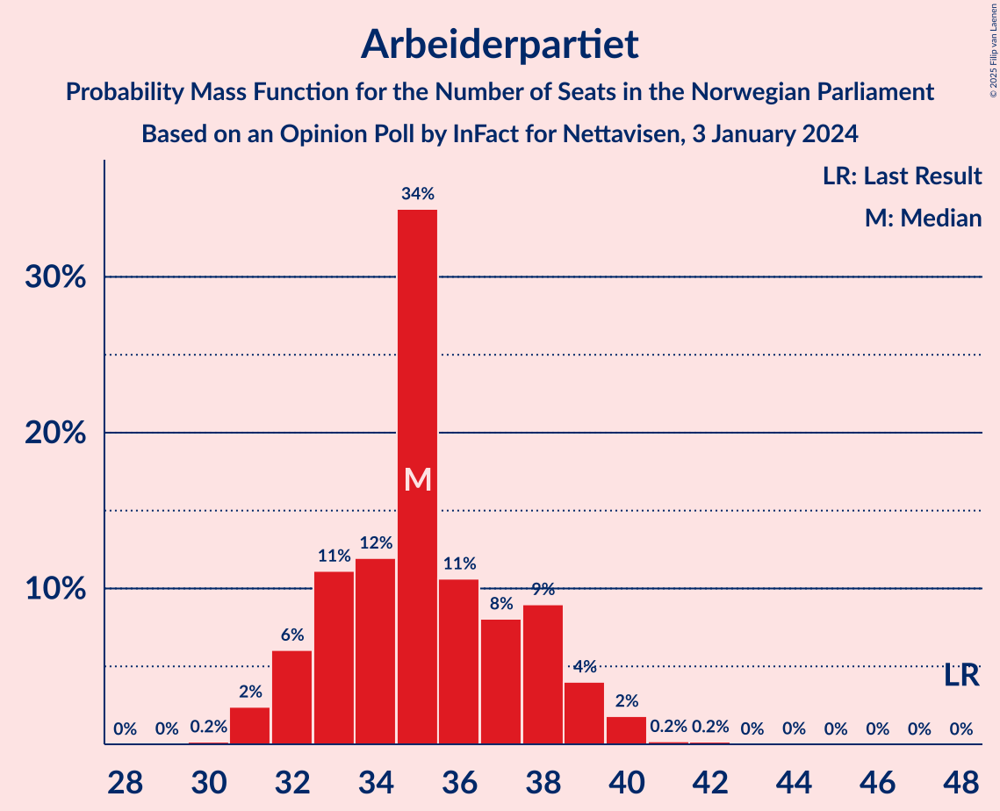
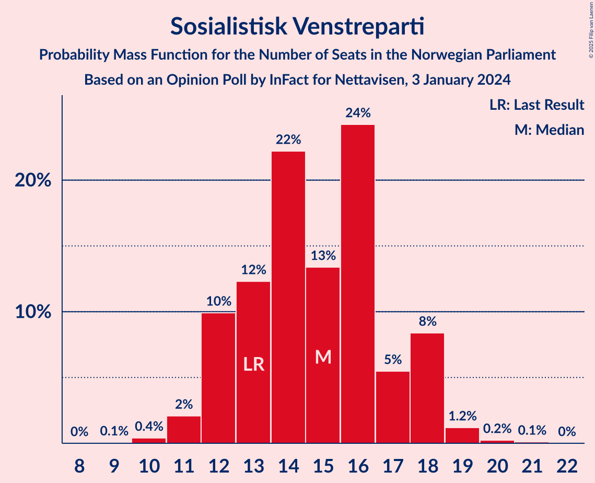
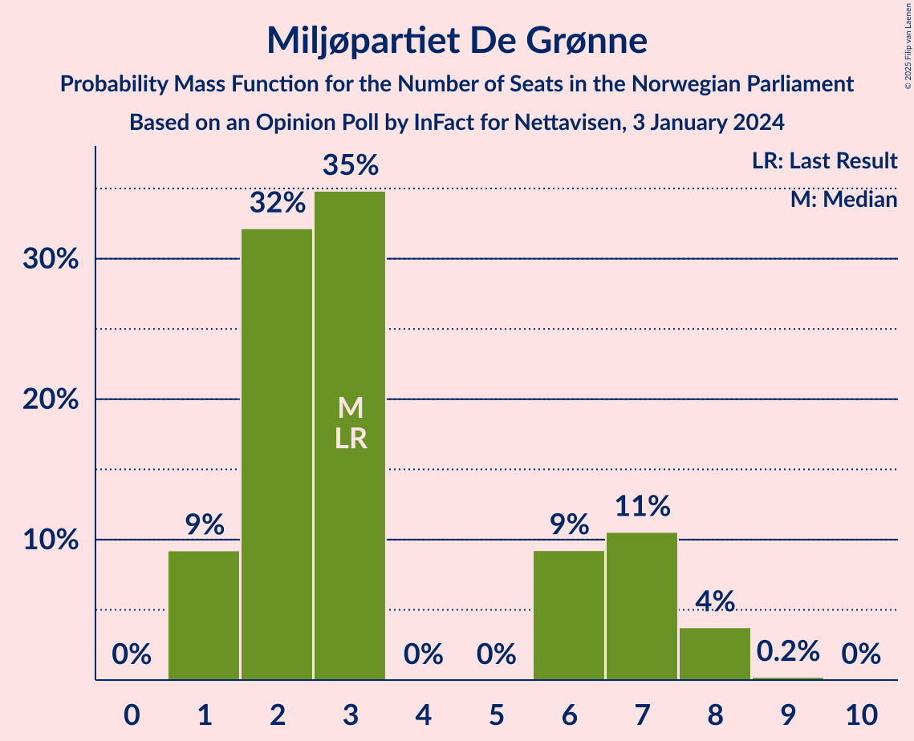
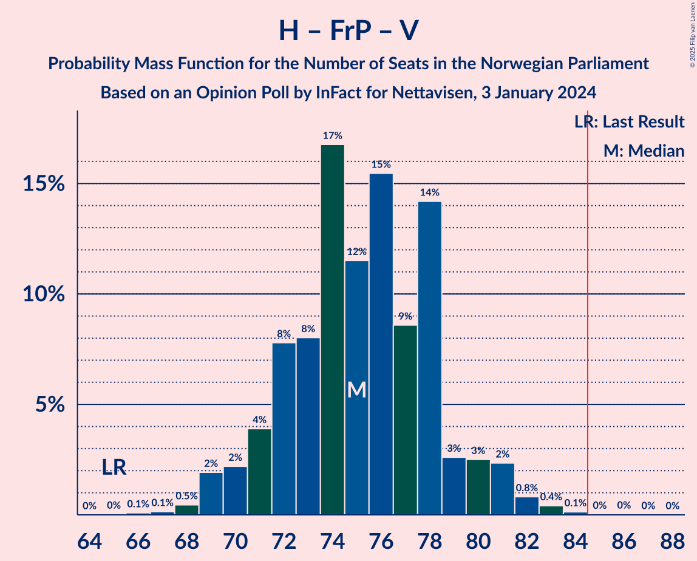
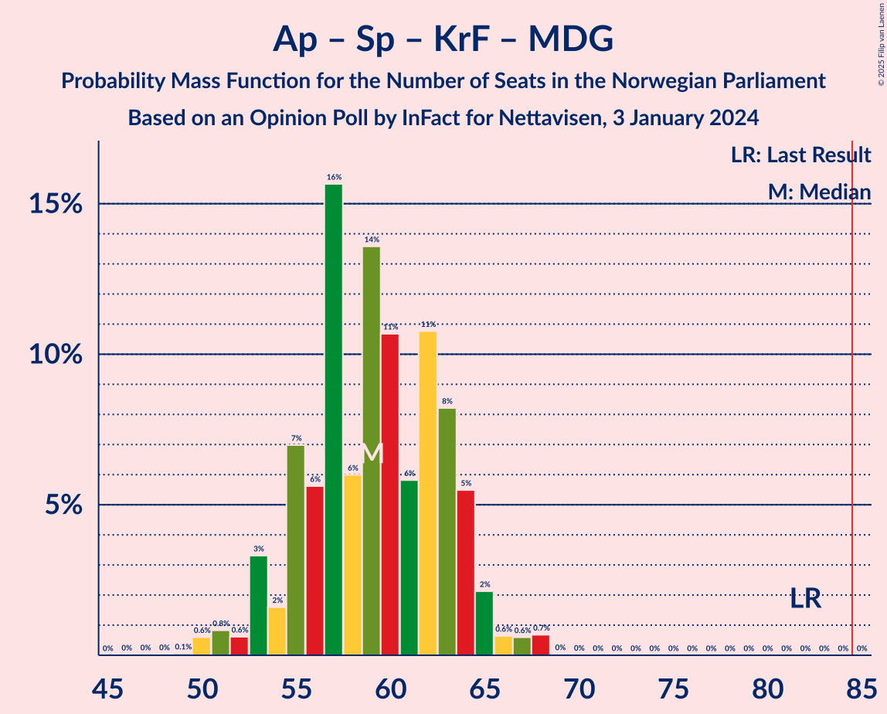

# Opinion Poll by InFact for Nettavisen, 3 January 2024

<a href="#voting-intentions">Voting Intentions</a> | <a href="#seats">Seats</a> | <a href="#coalitions">Coalitions</a> | <a href="#technical-information">Technical Information</a>

## Voting Intentions

### Confidence Intervals

| Party | Last Result | Poll Result | 80% Confidence Interval | 90% Confidence Interval | 95% Confidence Interval | 99% Confidence Interval |
|:-----:|:-----------:|:-----------:|:-----------------------:|:-----------------------:|:-----------------------:|:-----------------------:|
| Høyre | 20.4% | 23.5% | 21.9–25.2% |21.4–25.7% |21.0–26.1% |20.3–26.9% |
| Arbeiderpartiet | 26.2% | 18.5% | 17.0–20.1% |16.6–20.5% |16.3–20.9% |15.6–21.7% |
| Fremskrittspartiet | 11.6% | 14.4% | 13.2–15.9% |12.8–16.3% |12.5–16.7% |11.9–17.4% |
| Sosialistisk Venstreparti | 7.6% | 9.1% | 8.1–10.3% |7.8–10.7% |7.5–11.0% |7.1–11.6% |
| Senterpartiet | 13.5% | 7.8% | 6.9–9.0% |6.6–9.3% |6.4–9.6% |5.9–10.2% |
| Industri- og Næringspartiet | 0.3% | 6.1% | 5.2–7.1% |5.0–7.4% |4.8–7.7% |4.4–8.2% |
| Rødt | 4.7% | 5.6% | 4.8–6.6% |4.6–6.9% |4.4–7.1% |4.0–7.7% |
| Venstre | 4.6% | 5.3% | 4.6–6.3% |4.3–6.6% |4.1–6.8% |3.8–7.3% |
| Kristelig Folkeparti | 3.8% | 4.6% | 3.9–5.5% |3.7–5.8% |3.5–6.0% |3.2–6.5% |
| Miljøpartiet De Grønne | 3.9% | 3.6% | 3.0–4.4% |2.8–4.7% |2.6–4.9% |2.4–5.3% |

*Note:* The poll result column reflects the actual value used in the calculations. Published results may vary slightly, and in addition be rounded to fewer digits.

## Seats

### Confidence Intervals

| Party | Last Result | Median | 80% Confidence Interval | 90% Confidence Interval | 95% Confidence Interval | 99% Confidence Interval |
|:-----:|:-----------:|:------:|:-----------------------:|:-----------------------:|:-----------------------:|:-----------------------:|
| <a href="#høyre">Høyre</a> | 36 | 41 | 38–45 |38–46 |36–46 |36–47 |
| <a href="#arbeiderpartiet">Arbeiderpartiet</a> | 48 | 35 | 33–37 |32–39 |31–39 |31–40 |
| <a href="#fremskrittspartiet">Fremskrittspartiet</a> | 21 | 25 | 22–29 |22–29 |21–31 |20–32 |
| <a href="#sosialistisk-venstreparti">Sosialistisk Venstreparti</a> | 13 | 14 | 13–17 |12–18 |11–18 |10–19 |
| <a href="#senterpartiet">Senterpartiet</a> | 28 | 14 | 12–15 |11–16 |10–16 |10–18 |
| <a href="#industri--og-næringspartiet">Industri- og Næringspartiet</a> | 0 | 10 | 8–12 |8–12 |7–12 |7–14 |
| <a href="#rødt">Rødt</a> | 8 | 9 | 8–11 |7–12 |7–12 |7–13 |
| <a href="#venstre">Venstre</a> | 8 | 9 | 7–11 |7–11 |7–11 |3–12 |
| <a href="#kristelig-folkeparti">Kristelig Folkeparti</a> | 3 | 7 | 3–9 |2–9 |2–9 |2–11 |
| <a href="#miljøpartiet-de-grønne">Miljøpartiet De Grønne</a> | 3 | 3 | 2–7 |1–8 |1–8 |1–8 |

### Høyre

*For a full overview of the results for this party, see the [Høyre](party-høyre.html) page.*

| Number of Seats | Probability | Accumulated | Special Marks |
|:---------------:|:-----------:|:-----------:|:-------------:|
| 33 | 0.1% | 100% |  |
| 34 | 0.1% | 99.9% |  |
| 35 | 0.1% | 99.8% |  |
| 36 | 3% | 99.7% | Last Result |
| 37 | 2% | 97% |  |
| 38 | 10% | 95% |  |
| 39 | 4% | 85% |  |
| 40 | 17% | 80% |  |
| 41 | 17% | 63% | Median |
| 42 | 13% | 46% |  |
| 43 | 12% | 33% |  |
| 44 | 6% | 21% |  |
| 45 | 9% | 15% |  |
| 46 | 5% | 6% |  |
| 47 | 1.0% | 1.2% |  |
| 48 | 0.1% | 0.2% |  |
| 49 | 0% | 0.2% |  |
| 50 | 0.1% | 0.1% |  |
| 51 | 0% | 0% |  |

### Arbeiderpartiet

*For a full overview of the results for this party, see the [Arbeiderpartiet](party-arbeiderpartiet.html) page.*

| Number of Seats | Probability | Accumulated | Special Marks |
|:---------------:|:-----------:|:-----------:|:-------------:|
| 30 | 0.2% | 100% |  |
| 31 | 2% | 99.8% |  |
| 32 | 7% | 97% |  |
| 33 | 17% | 91% |  |
| 34 | 19% | 73% |  |
| 35 | 26% | 54% | Median |
| 36 | 14% | 28% |  |
| 37 | 4% | 14% |  |
| 38 | 3% | 10% |  |
| 39 | 4% | 7% |  |
| 40 | 2% | 2% |  |
| 41 | 0.2% | 0.4% |  |
| 42 | 0.1% | 0.2% |  |
| 43 | 0% | 0.1% |  |
| 44 | 0.1% | 0.1% |  |
| 45 | 0% | 0% |  |
| 46 | 0% | 0% |  |
| 47 | 0% | 0% |  |
| 48 | 0% | 0% | Last Result |

### Fremskrittspartiet

*For a full overview of the results for this party, see the [Fremskrittspartiet](party-fremskrittspartiet.html) page.*

| Number of Seats | Probability | Accumulated | Special Marks |
|:---------------:|:-----------:|:-----------:|:-------------:|
| 19 | 0.1% | 100% |  |
| 20 | 1.0% | 99.9% |  |
| 21 | 4% | 98.9% | Last Result |
| 22 | 6% | 95% |  |
| 23 | 14% | 89% |  |
| 24 | 13% | 75% |  |
| 25 | 15% | 62% | Median |
| 26 | 19% | 47% |  |
| 27 | 12% | 28% |  |
| 28 | 3% | 16% |  |
| 29 | 9% | 13% |  |
| 30 | 1.0% | 4% |  |
| 31 | 3% | 3% |  |
| 32 | 0.5% | 0.7% |  |
| 33 | 0.1% | 0.2% |  |
| 34 | 0.1% | 0.1% |  |
| 35 | 0% | 0% |  |

### Sosialistisk Venstreparti

*For a full overview of the results for this party, see the [Sosialistisk Venstreparti](party-sosialistiskvenstreparti.html) page.*

| Number of Seats | Probability | Accumulated | Special Marks |
|:---------------:|:-----------:|:-----------:|:-------------:|
| 10 | 0.5% | 100% |  |
| 11 | 3% | 99.5% |  |
| 12 | 7% | 97% |  |
| 13 | 13% | 90% | Last Result |
| 14 | 27% | 77% | Median |
| 15 | 19% | 50% |  |
| 16 | 19% | 31% |  |
| 17 | 4% | 12% |  |
| 18 | 6% | 8% |  |
| 19 | 1.5% | 2% |  |
| 20 | 0.2% | 0.3% |  |
| 21 | 0.1% | 0.1% |  |
| 22 | 0% | 0% |  |

### Senterpartiet

*For a full overview of the results for this party, see the [Senterpartiet](party-senterpartiet.html) page.*

| Number of Seats | Probability | Accumulated | Special Marks |
|:---------------:|:-----------:|:-----------:|:-------------:|
| 8 | 0.1% | 100% |  |
| 9 | 0.3% | 99.9% |  |
| 10 | 4% | 99.6% |  |
| 11 | 3% | 96% |  |
| 12 | 4% | 93% |  |
| 13 | 38% | 89% |  |
| 14 | 22% | 51% | Median |
| 15 | 23% | 29% |  |
| 16 | 5% | 6% |  |
| 17 | 0.6% | 1.3% |  |
| 18 | 0.4% | 0.7% |  |
| 19 | 0.2% | 0.3% |  |
| 20 | 0% | 0.1% |  |
| 21 | 0.1% | 0.1% |  |
| 22 | 0% | 0% |  |
| 23 | 0% | 0% |  |
| 24 | 0% | 0% |  |
| 25 | 0% | 0% |  |
| 26 | 0% | 0% |  |
| 27 | 0% | 0% |  |
| 28 | 0% | 0% | Last Result |

### Industri- og Næringspartiet

*For a full overview of the results for this party, see the [Industri- og Næringspartiet](party-industri-ognæringspartiet.html) page.*

| Number of Seats | Probability | Accumulated | Special Marks |
|:---------------:|:-----------:|:-----------:|:-------------:|
| 0 | 0% | 100% | Last Result |
| 1 | 0% | 100% |  |
| 2 | 0% | 100% |  |
| 3 | 0% | 100% |  |
| 4 | 0% | 100% |  |
| 5 | 0% | 100% |  |
| 6 | 0.1% | 100% |  |
| 7 | 3% | 99.8% |  |
| 8 | 9% | 97% |  |
| 9 | 20% | 87% |  |
| 10 | 24% | 67% | Median |
| 11 | 31% | 44% |  |
| 12 | 11% | 13% |  |
| 13 | 2% | 2% |  |
| 14 | 0.4% | 0.5% |  |
| 15 | 0.1% | 0.1% |  |
| 16 | 0% | 0% |  |

### Rødt

*For a full overview of the results for this party, see the [Rødt](party-rødt.html) page.*

| Number of Seats | Probability | Accumulated | Special Marks |
|:---------------:|:-----------:|:-----------:|:-------------:|
| 1 | 0.3% | 100% |  |
| 2 | 0% | 99.7% |  |
| 3 | 0% | 99.7% |  |
| 4 | 0% | 99.7% |  |
| 5 | 0% | 99.7% |  |
| 6 | 0.2% | 99.7% |  |
| 7 | 9% | 99.5% |  |
| 8 | 16% | 91% | Last Result |
| 9 | 38% | 74% | Median |
| 10 | 21% | 36% |  |
| 11 | 8% | 15% |  |
| 12 | 5% | 7% |  |
| 13 | 1.2% | 1.2% |  |
| 14 | 0% | 0% |  |

### Venstre

*For a full overview of the results for this party, see the [Venstre](party-venstre.html) page.*

| Number of Seats | Probability | Accumulated | Special Marks |
|:---------------:|:-----------:|:-----------:|:-------------:|
| 2 | 0.1% | 100% |  |
| 3 | 1.0% | 99.9% |  |
| 4 | 0% | 98.8% |  |
| 5 | 0% | 98.8% |  |
| 6 | 0.6% | 98.8% |  |
| 7 | 18% | 98% |  |
| 8 | 23% | 80% | Last Result |
| 9 | 26% | 57% | Median |
| 10 | 21% | 32% |  |
| 11 | 10% | 11% |  |
| 12 | 0.7% | 0.8% |  |
| 13 | 0.1% | 0.1% |  |
| 14 | 0% | 0% |  |

### Kristelig Folkeparti

*For a full overview of the results for this party, see the [Kristelig Folkeparti](party-kristeligfolkeparti.html) page.*

| Number of Seats | Probability | Accumulated | Special Marks |
|:---------------:|:-----------:|:-----------:|:-------------:|
| 2 | 6% | 100% |  |
| 3 | 13% | 94% | Last Result |
| 4 | 0% | 81% |  |
| 5 | 0% | 81% |  |
| 6 | 3% | 81% |  |
| 7 | 37% | 78% | Median |
| 8 | 24% | 41% |  |
| 9 | 15% | 17% |  |
| 10 | 1.4% | 2% |  |
| 11 | 0.4% | 0.5% |  |
| 12 | 0.1% | 0.1% |  |
| 13 | 0% | 0% |  |

### Miljøpartiet De Grønne

*For a full overview of the results for this party, see the [Miljøpartiet De Grønne](party-miljøpartietdegrønne.html) page.*

| Number of Seats | Probability | Accumulated | Special Marks |
|:---------------:|:-----------:|:-----------:|:-------------:|
| 1 | 10% | 100% |  |
| 2 | 39% | 90% |  |
| 3 | 27% | 51% | Last Result, Median |
| 4 | 0% | 24% |  |
| 5 | 0% | 24% |  |
| 6 | 9% | 24% |  |
| 7 | 9% | 14% |  |
| 8 | 5% | 5% |  |
| 9 | 0.2% | 0.2% |  |
| 10 | 0% | 0% |  |

## Coalitions

### Confidence Intervals

| Coalition | Last Result | Median | Majority? | 80% Confidence Interval | 90% Confidence Interval | 95% Confidence Interval | 99% Confidence Interval |
|:---------:|:-----------:|:------:|:---------:|:-----------------------:|:-----------------------:|:-----------------------:|:-----------------------:|
| Høyre – Fremskrittspartiet – Senterpartiet – Venstre – Kristelig Folkeparti | 96 | 97 | 100% | 92–99 | 91–100 | 89–103 | 87–105 |
| Høyre – Fremskrittspartiet – Venstre – Kristelig Folkeparti – Miljøpartiet De Grønne | 71 | 86 | 72% | 81–89 | 80–90 | 80–91 | 78–94 |
| Høyre – Fremskrittspartiet – Venstre – Kristelig Folkeparti | 68 | 83 | 23% | 78–85 | 77–86 | 77–88 | 74–90 |
| Arbeiderpartiet – Sosialistisk Venstreparti – Senterpartiet – Rødt – Miljøpartiet De Grønne | 100 | 75 | 0.1% | 73–80 | 72–81 | 70–82 | 69–83 |
| Høyre – Fremskrittspartiet – Venstre | 65 | 76 | 0.1% | 72–79 | 71–81 | 69–81 | 68–83 |
| Arbeiderpartiet – Sosialistisk Venstreparti – Senterpartiet – Kristelig Folkeparti – Miljøpartiet De Grønne | 95 | 73 | 0.1% | 69–78 | 68–78 | 68–79 | 66–81 |
| Arbeiderpartiet – Sosialistisk Venstreparti – Senterpartiet – Rødt | 97 | 72 | 0% | 70–76 | 68–77 | 67–79 | 66–80 |
| Arbeiderpartiet – Sosialistisk Venstreparti – Senterpartiet – Miljøpartiet De Grønne | 92 | 66 | 0% | 64–71 | 63–72 | 62–72 | 60–74 |
| Høyre – Fremskrittspartiet | 57 | 67 | 0% | 63–70 | 62–71 | 61–72 | 60–74 |
| Arbeiderpartiet – Sosialistisk Venstreparti – Rødt – Miljøpartiet De Grønne | 72 | 61 | 0% | 59–66 | 58–68 | 57–69 | 54–70 |
| Arbeiderpartiet – Sosialistisk Venstreparti – Senterpartiet | 89 | 63 | 0% | 61–67 | 60–67 | 59–68 | 57–70 |
| Arbeiderpartiet – Senterpartiet – Kristelig Folkeparti – Miljøpartiet De Grønne | 82 | 57 | 0% | 55–64 | 53–64 | 53–66 | 51–68 |
| Høyre – Venstre – Kristelig Folkeparti | 47 | 57 | 0% | 53–61 | 52–61 | 50–62 | 48–64 |
| Arbeiderpartiet – Senterpartiet – Kristelig Folkeparti | 79 | 55 | 0% | 51–59 | 50–60 | 48–61 | 46–62 |
| Arbeiderpartiet – Sosialistisk Venstreparti | 61 | 49 | 0% | 47–53 | 46–54 | 45–54 | 43–56 |
| Arbeiderpartiet – Senterpartiet | 76 | 48 | 0% | 46–51 | 46–53 | 44–53 | 43–54 |
| Senterpartiet – Venstre – Kristelig Folkeparti | 39 | 30 | 0% | 26–32 | 24–33 | 24–33 | 22–36 |

### Høyre – Fremskrittspartiet – Senterpartiet – Venstre – Kristelig Folkeparti

| Number of Seats | Probability | Accumulated | Special Marks |
|:---------------:|:-----------:|:-----------:|:-------------:|
| 85 | 0% | 100% | Majority |
| 86 | 0.4% | 99.9% |  |
| 87 | 0.1% | 99.6% |  |
| 88 | 0.2% | 99.5% |  |
| 89 | 3% | 99.3% |  |
| 90 | 1.3% | 96% |  |
| 91 | 3% | 95% |  |
| 92 | 3% | 92% |  |
| 93 | 6% | 89% |  |
| 94 | 15% | 83% |  |
| 95 | 13% | 68% |  |
| 96 | 3% | 55% | Last Result, Median |
| 97 | 18% | 52% |  |
| 98 | 17% | 34% |  |
| 99 | 10% | 16% |  |
| 100 | 2% | 6% |  |
| 101 | 0.7% | 4% |  |
| 102 | 0.6% | 3% |  |
| 103 | 1.4% | 3% |  |
| 104 | 0.6% | 1.1% |  |
| 105 | 0.5% | 0.6% |  |
| 106 | 0.1% | 0.1% |  |
| 107 | 0% | 0% |  |

### Høyre – Fremskrittspartiet – Venstre – Kristelig Folkeparti – Miljøpartiet De Grønne

| Number of Seats | Probability | Accumulated | Special Marks |
|:---------------:|:-----------:|:-----------:|:-------------:|
| 71 | 0% | 100% | Last Result |
| 72 | 0% | 100% |  |
| 73 | 0% | 100% |  |
| 74 | 0% | 100% |  |
| 75 | 0% | 100% |  |
| 76 | 0.3% | 100% |  |
| 77 | 0.2% | 99.7% |  |
| 78 | 0.3% | 99.5% |  |
| 79 | 0.6% | 99.2% |  |
| 80 | 4% | 98.6% |  |
| 81 | 7% | 95% |  |
| 82 | 6% | 88% |  |
| 83 | 4% | 82% |  |
| 84 | 5% | 77% |  |
| 85 | 19% | 72% | Median, Majority |
| 86 | 7% | 53% |  |
| 87 | 24% | 47% |  |
| 88 | 9% | 23% |  |
| 89 | 8% | 14% |  |
| 90 | 2% | 6% |  |
| 91 | 2% | 4% |  |
| 92 | 1.4% | 2% |  |
| 93 | 0.4% | 1.0% |  |
| 94 | 0.4% | 0.6% |  |
| 95 | 0.1% | 0.2% |  |
| 96 | 0% | 0.1% |  |
| 97 | 0% | 0% |  |

### Høyre – Fremskrittspartiet – Venstre – Kristelig Folkeparti

| Number of Seats | Probability | Accumulated | Special Marks |
|:---------------:|:-----------:|:-----------:|:-------------:|
| 68 | 0% | 100% | Last Result |
| 69 | 0% | 100% |  |
| 70 | 0% | 100% |  |
| 71 | 0% | 100% |  |
| 72 | 0.1% | 100% |  |
| 73 | 0.2% | 99.9% |  |
| 74 | 0.4% | 99.7% |  |
| 75 | 0.3% | 99.3% |  |
| 76 | 0.8% | 99.0% |  |
| 77 | 3% | 98% |  |
| 78 | 5% | 95% |  |
| 79 | 12% | 90% |  |
| 80 | 4% | 77% |  |
| 81 | 12% | 73% |  |
| 82 | 5% | 61% | Median |
| 83 | 14% | 55% |  |
| 84 | 19% | 41% |  |
| 85 | 14% | 23% | Majority |
| 86 | 5% | 9% |  |
| 87 | 1.0% | 4% |  |
| 88 | 1.4% | 3% |  |
| 89 | 0.8% | 2% |  |
| 90 | 0.5% | 0.9% |  |
| 91 | 0.2% | 0.3% |  |
| 92 | 0% | 0.1% |  |
| 93 | 0.1% | 0.1% |  |
| 94 | 0% | 0% |  |

### Arbeiderpartiet – Sosialistisk Venstreparti – Senterpartiet – Rødt – Miljøpartiet De Grønne

| Number of Seats | Probability | Accumulated | Special Marks |
|:---------------:|:-----------:|:-----------:|:-------------:|
| 64 | 0% | 100% |  |
| 65 | 0% | 99.9% |  |
| 66 | 0% | 99.9% |  |
| 67 | 0.1% | 99.9% |  |
| 68 | 0.2% | 99.8% |  |
| 69 | 0.7% | 99.6% |  |
| 70 | 2% | 98.9% |  |
| 71 | 0.8% | 97% |  |
| 72 | 3% | 97% |  |
| 73 | 20% | 93% |  |
| 74 | 17% | 73% |  |
| 75 | 11% | 55% | Median |
| 76 | 7% | 45% |  |
| 77 | 12% | 37% |  |
| 78 | 8% | 25% |  |
| 79 | 5% | 18% |  |
| 80 | 6% | 13% |  |
| 81 | 3% | 7% |  |
| 82 | 3% | 4% |  |
| 83 | 0.6% | 1.0% |  |
| 84 | 0.3% | 0.4% |  |
| 85 | 0.1% | 0.1% | Majority |
| 86 | 0.1% | 0.1% |  |
| 87 | 0% | 0% |  |
| 88 | 0% | 0% |  |
| 89 | 0% | 0% |  |
| 90 | 0% | 0% |  |
| 91 | 0% | 0% |  |
| 92 | 0% | 0% |  |
| 93 | 0% | 0% |  |
| 94 | 0% | 0% |  |
| 95 | 0% | 0% |  |
| 96 | 0% | 0% |  |
| 97 | 0% | 0% |  |
| 98 | 0% | 0% |  |
| 99 | 0% | 0% |  |
| 100 | 0% | 0% | Last Result |

### Høyre – Fremskrittspartiet – Venstre

| Number of Seats | Probability | Accumulated | Special Marks |
|:---------------:|:-----------:|:-----------:|:-------------:|
| 65 | 0% | 100% | Last Result |
| 66 | 0.1% | 100% |  |
| 67 | 0.2% | 99.8% |  |
| 68 | 0.3% | 99.6% |  |
| 69 | 2% | 99.3% |  |
| 70 | 0.9% | 97% |  |
| 71 | 4% | 96% |  |
| 72 | 7% | 93% |  |
| 73 | 6% | 86% |  |
| 74 | 19% | 80% |  |
| 75 | 7% | 61% | Median |
| 76 | 21% | 54% |  |
| 77 | 7% | 33% |  |
| 78 | 15% | 26% |  |
| 79 | 3% | 11% |  |
| 80 | 1.1% | 7% |  |
| 81 | 4% | 6% |  |
| 82 | 1.3% | 2% |  |
| 83 | 0.5% | 0.8% |  |
| 84 | 0.2% | 0.3% |  |
| 85 | 0% | 0.1% | Majority |
| 86 | 0.1% | 0.1% |  |
| 87 | 0% | 0% |  |

### Arbeiderpartiet – Sosialistisk Venstreparti – Senterpartiet – Kristelig Folkeparti – Miljøpartiet De Grønne

| Number of Seats | Probability | Accumulated | Special Marks |
|:---------------:|:-----------:|:-----------:|:-------------:|
| 63 | 0% | 100% |  |
| 64 | 0.1% | 99.9% |  |
| 65 | 0.1% | 99.9% |  |
| 66 | 1.1% | 99.8% |  |
| 67 | 0.8% | 98.6% |  |
| 68 | 3% | 98% |  |
| 69 | 6% | 95% |  |
| 70 | 6% | 88% |  |
| 71 | 13% | 82% |  |
| 72 | 17% | 69% |  |
| 73 | 15% | 51% | Median |
| 74 | 6% | 36% |  |
| 75 | 4% | 30% |  |
| 76 | 5% | 26% |  |
| 77 | 5% | 22% |  |
| 78 | 13% | 16% |  |
| 79 | 2% | 4% |  |
| 80 | 0.3% | 1.4% |  |
| 81 | 0.6% | 1.0% |  |
| 82 | 0.2% | 0.5% |  |
| 83 | 0.1% | 0.3% |  |
| 84 | 0.1% | 0.1% |  |
| 85 | 0% | 0.1% | Majority |
| 86 | 0% | 0% |  |
| 87 | 0% | 0% |  |
| 88 | 0% | 0% |  |
| 89 | 0% | 0% |  |
| 90 | 0% | 0% |  |
| 91 | 0% | 0% |  |
| 92 | 0% | 0% |  |
| 93 | 0% | 0% |  |
| 94 | 0% | 0% |  |
| 95 | 0% | 0% | Last Result |

### Arbeiderpartiet – Sosialistisk Venstreparti – Senterpartiet – Rødt

| Number of Seats | Probability | Accumulated | Special Marks |
|:---------------:|:-----------:|:-----------:|:-------------:|
| 62 | 0.1% | 100% |  |
| 63 | 0% | 99.9% |  |
| 64 | 0.1% | 99.9% |  |
| 65 | 0.2% | 99.8% |  |
| 66 | 0.6% | 99.6% |  |
| 67 | 2% | 99.0% |  |
| 68 | 3% | 97% |  |
| 69 | 3% | 95% |  |
| 70 | 16% | 92% |  |
| 71 | 16% | 75% |  |
| 72 | 23% | 60% | Median |
| 73 | 10% | 37% |  |
| 74 | 6% | 27% |  |
| 75 | 8% | 21% |  |
| 76 | 4% | 12% |  |
| 77 | 4% | 8% |  |
| 78 | 0.5% | 4% |  |
| 79 | 3% | 3% |  |
| 80 | 0.4% | 0.6% |  |
| 81 | 0.2% | 0.2% |  |
| 82 | 0% | 0% |  |
| 83 | 0% | 0% |  |
| 84 | 0% | 0% |  |
| 85 | 0% | 0% | Majority |
| 86 | 0% | 0% |  |
| 87 | 0% | 0% |  |
| 88 | 0% | 0% |  |
| 89 | 0% | 0% |  |
| 90 | 0% | 0% |  |
| 91 | 0% | 0% |  |
| 92 | 0% | 0% |  |
| 93 | 0% | 0% |  |
| 94 | 0% | 0% |  |
| 95 | 0% | 0% |  |
| 96 | 0% | 0% |  |
| 97 | 0% | 0% | Last Result |

### Arbeiderpartiet – Sosialistisk Venstreparti – Senterpartiet – Miljøpartiet De Grønne

| Number of Seats | Probability | Accumulated | Special Marks |
|:---------------:|:-----------:|:-----------:|:-------------:|
| 56 | 0% | 100% |  |
| 57 | 0% | 99.9% |  |
| 58 | 0.1% | 99.9% |  |
| 59 | 0.2% | 99.9% |  |
| 60 | 0.3% | 99.7% |  |
| 61 | 1.4% | 99.4% |  |
| 62 | 3% | 98% |  |
| 63 | 3% | 95% |  |
| 64 | 29% | 92% |  |
| 65 | 8% | 62% |  |
| 66 | 15% | 54% | Median |
| 67 | 5% | 40% |  |
| 68 | 6% | 34% |  |
| 69 | 8% | 28% |  |
| 70 | 10% | 20% |  |
| 71 | 5% | 11% |  |
| 72 | 4% | 6% |  |
| 73 | 0.6% | 1.4% |  |
| 74 | 0.4% | 0.9% |  |
| 75 | 0.3% | 0.5% |  |
| 76 | 0.1% | 0.2% |  |
| 77 | 0% | 0.1% |  |
| 78 | 0% | 0% |  |
| 79 | 0% | 0% |  |
| 80 | 0% | 0% |  |
| 81 | 0% | 0% |  |
| 82 | 0% | 0% |  |
| 83 | 0% | 0% |  |
| 84 | 0% | 0% |  |
| 85 | 0% | 0% | Majority |
| 86 | 0% | 0% |  |
| 87 | 0% | 0% |  |
| 88 | 0% | 0% |  |
| 89 | 0% | 0% |  |
| 90 | 0% | 0% |  |
| 91 | 0% | 0% |  |
| 92 | 0% | 0% | Last Result |

### Høyre – Fremskrittspartiet

| Number of Seats | Probability | Accumulated | Special Marks |
|:---------------:|:-----------:|:-----------:|:-------------:|
| 57 | 0% | 100% | Last Result |
| 58 | 0% | 100% |  |
| 59 | 0.2% | 99.9% |  |
| 60 | 0.8% | 99.7% |  |
| 61 | 2% | 98.9% |  |
| 62 | 4% | 97% |  |
| 63 | 5% | 94% |  |
| 64 | 6% | 89% |  |
| 65 | 8% | 83% |  |
| 66 | 22% | 76% | Median |
| 67 | 23% | 54% |  |
| 68 | 9% | 31% |  |
| 69 | 5% | 23% |  |
| 70 | 9% | 17% |  |
| 71 | 3% | 8% |  |
| 72 | 3% | 5% |  |
| 73 | 0.9% | 2% |  |
| 74 | 0.4% | 0.6% |  |
| 75 | 0.1% | 0.2% |  |
| 76 | 0% | 0.1% |  |
| 77 | 0% | 0.1% |  |
| 78 | 0% | 0.1% |  |
| 79 | 0% | 0% |  |

### Arbeiderpartiet – Sosialistisk Venstreparti – Rødt – Miljøpartiet De Grønne

| Number of Seats | Probability | Accumulated | Special Marks |
|:---------------:|:-----------:|:-----------:|:-------------:|
| 53 | 0.1% | 100% |  |
| 54 | 0.6% | 99.9% |  |
| 55 | 1.3% | 99.3% |  |
| 56 | 0.4% | 98% |  |
| 57 | 0.4% | 98% |  |
| 58 | 2% | 97% |  |
| 59 | 12% | 95% |  |
| 60 | 20% | 83% |  |
| 61 | 15% | 63% | Median |
| 62 | 12% | 48% |  |
| 63 | 5% | 36% |  |
| 64 | 13% | 31% |  |
| 65 | 8% | 18% |  |
| 66 | 2% | 10% |  |
| 67 | 2% | 8% |  |
| 68 | 3% | 6% |  |
| 69 | 1.0% | 3% |  |
| 70 | 2% | 2% |  |
| 71 | 0.1% | 0.3% |  |
| 72 | 0.1% | 0.1% | Last Result |
| 73 | 0.1% | 0.1% |  |
| 74 | 0% | 0% |  |

### Arbeiderpartiet – Sosialistisk Venstreparti – Senterpartiet

| Number of Seats | Probability | Accumulated | Special Marks |
|:---------------:|:-----------:|:-----------:|:-------------:|
| 54 | 0.1% | 100% |  |
| 55 | 0% | 99.9% |  |
| 56 | 0.1% | 99.9% |  |
| 57 | 0.4% | 99.8% |  |
| 58 | 0.9% | 99.4% |  |
| 59 | 3% | 98% |  |
| 60 | 5% | 95% |  |
| 61 | 10% | 91% |  |
| 62 | 27% | 80% |  |
| 63 | 17% | 54% | Median |
| 64 | 14% | 36% |  |
| 65 | 6% | 23% |  |
| 66 | 5% | 16% |  |
| 67 | 9% | 11% |  |
| 68 | 1.3% | 3% |  |
| 69 | 0.8% | 1.4% |  |
| 70 | 0.4% | 0.6% |  |
| 71 | 0% | 0.2% |  |
| 72 | 0.1% | 0.1% |  |
| 73 | 0% | 0% |  |
| 74 | 0% | 0% |  |
| 75 | 0% | 0% |  |
| 76 | 0% | 0% |  |
| 77 | 0% | 0% |  |
| 78 | 0% | 0% |  |
| 79 | 0% | 0% |  |
| 80 | 0% | 0% |  |
| 81 | 0% | 0% |  |
| 82 | 0% | 0% |  |
| 83 | 0% | 0% |  |
| 84 | 0% | 0% |  |
| 85 | 0% | 0% | Majority |
| 86 | 0% | 0% |  |
| 87 | 0% | 0% |  |
| 88 | 0% | 0% |  |
| 89 | 0% | 0% | Last Result |

### Arbeiderpartiet – Senterpartiet – Kristelig Folkeparti – Miljøpartiet De Grønne

| Number of Seats | Probability | Accumulated | Special Marks |
|:---------------:|:-----------:|:-----------:|:-------------:|
| 48 | 0.1% | 100% |  |
| 49 | 0% | 99.9% |  |
| 50 | 0.4% | 99.9% |  |
| 51 | 1.1% | 99.5% |  |
| 52 | 0.6% | 98% |  |
| 53 | 5% | 98% |  |
| 54 | 3% | 93% |  |
| 55 | 10% | 91% |  |
| 56 | 9% | 81% |  |
| 57 | 24% | 72% |  |
| 58 | 5% | 48% |  |
| 59 | 4% | 43% | Median |
| 60 | 12% | 39% |  |
| 61 | 3% | 27% |  |
| 62 | 6% | 23% |  |
| 63 | 5% | 18% |  |
| 64 | 8% | 12% |  |
| 65 | 1.2% | 4% |  |
| 66 | 0.9% | 3% |  |
| 67 | 0.5% | 2% |  |
| 68 | 1.1% | 1.2% |  |
| 69 | 0% | 0.1% |  |
| 70 | 0% | 0% |  |
| 71 | 0% | 0% |  |
| 72 | 0% | 0% |  |
| 73 | 0% | 0% |  |
| 74 | 0% | 0% |  |
| 75 | 0% | 0% |  |
| 76 | 0% | 0% |  |
| 77 | 0% | 0% |  |
| 78 | 0% | 0% |  |
| 79 | 0% | 0% |  |
| 80 | 0% | 0% |  |
| 81 | 0% | 0% |  |
| 82 | 0% | 0% | Last Result |

### Høyre – Venstre – Kristelig Folkeparti

| Number of Seats | Probability | Accumulated | Special Marks |
|:---------------:|:-----------:|:-----------:|:-------------:|
| 45 | 0.2% | 100% |  |
| 46 | 0.1% | 99.8% |  |
| 47 | 0% | 99.8% | Last Result |
| 48 | 0.3% | 99.7% |  |
| 49 | 0.6% | 99.5% |  |
| 50 | 2% | 98.9% |  |
| 51 | 0.9% | 97% |  |
| 52 | 4% | 96% |  |
| 53 | 6% | 92% |  |
| 54 | 4% | 85% |  |
| 55 | 16% | 82% |  |
| 56 | 5% | 65% |  |
| 57 | 15% | 60% | Median |
| 58 | 10% | 45% |  |
| 59 | 10% | 34% |  |
| 60 | 13% | 25% |  |
| 61 | 8% | 11% |  |
| 62 | 1.2% | 3% |  |
| 63 | 1.2% | 2% |  |
| 64 | 0.8% | 1.1% |  |
| 65 | 0.2% | 0.3% |  |
| 66 | 0.1% | 0.2% |  |
| 67 | 0% | 0% |  |

### Arbeiderpartiet – Senterpartiet – Kristelig Folkeparti

| Number of Seats | Probability | Accumulated | Special Marks |
|:---------------:|:-----------:|:-----------:|:-------------:|
| 46 | 1.1% | 100% |  |
| 47 | 0.2% | 98.9% |  |
| 48 | 1.2% | 98.7% |  |
| 49 | 0.6% | 97% |  |
| 50 | 5% | 97% |  |
| 51 | 3% | 92% |  |
| 52 | 2% | 90% |  |
| 53 | 16% | 88% |  |
| 54 | 10% | 72% |  |
| 55 | 16% | 62% |  |
| 56 | 17% | 46% | Median |
| 57 | 5% | 30% |  |
| 58 | 13% | 24% |  |
| 59 | 4% | 11% |  |
| 60 | 4% | 7% |  |
| 61 | 2% | 3% |  |
| 62 | 1.0% | 1.2% |  |
| 63 | 0.2% | 0.2% |  |
| 64 | 0% | 0.1% |  |
| 65 | 0% | 0% |  |
| 66 | 0% | 0% |  |
| 67 | 0% | 0% |  |
| 68 | 0% | 0% |  |
| 69 | 0% | 0% |  |
| 70 | 0% | 0% |  |
| 71 | 0% | 0% |  |
| 72 | 0% | 0% |  |
| 73 | 0% | 0% |  |
| 74 | 0% | 0% |  |
| 75 | 0% | 0% |  |
| 76 | 0% | 0% |  |
| 77 | 0% | 0% |  |
| 78 | 0% | 0% |  |
| 79 | 0% | 0% | Last Result |

### Arbeiderpartiet – Sosialistisk Venstreparti

| Number of Seats | Probability | Accumulated | Special Marks |
|:---------------:|:-----------:|:-----------:|:-------------:|
| 42 | 0.1% | 100% |  |
| 43 | 0.5% | 99.9% |  |
| 44 | 1.1% | 99.4% |  |
| 45 | 1.4% | 98% |  |
| 46 | 3% | 97% |  |
| 47 | 14% | 94% |  |
| 48 | 10% | 80% |  |
| 49 | 23% | 70% | Median |
| 50 | 22% | 47% |  |
| 51 | 9% | 25% |  |
| 52 | 5% | 15% |  |
| 53 | 5% | 10% |  |
| 54 | 4% | 5% |  |
| 55 | 0.9% | 2% |  |
| 56 | 0.3% | 0.7% |  |
| 57 | 0.2% | 0.4% |  |
| 58 | 0% | 0.1% |  |
| 59 | 0.1% | 0.1% |  |
| 60 | 0% | 0% |  |
| 61 | 0% | 0% | Last Result |

### Arbeiderpartiet – Senterpartiet

| Number of Seats | Probability | Accumulated | Special Marks |
|:---------------:|:-----------:|:-----------:|:-------------:|
| 41 | 0.1% | 100% |  |
| 42 | 0.1% | 99.9% |  |
| 43 | 0.9% | 99.7% |  |
| 44 | 1.4% | 98.8% |  |
| 45 | 2% | 97% |  |
| 46 | 16% | 95% |  |
| 47 | 9% | 79% |  |
| 48 | 22% | 70% |  |
| 49 | 23% | 48% | Median |
| 50 | 11% | 25% |  |
| 51 | 6% | 14% |  |
| 52 | 3% | 8% |  |
| 53 | 4% | 5% |  |
| 54 | 1.5% | 2% |  |
| 55 | 0.3% | 0.4% |  |
| 56 | 0.1% | 0.1% |  |
| 57 | 0% | 0% |  |
| 58 | 0% | 0% |  |
| 59 | 0% | 0% |  |
| 60 | 0% | 0% |  |
| 61 | 0% | 0% |  |
| 62 | 0% | 0% |  |
| 63 | 0% | 0% |  |
| 64 | 0% | 0% |  |
| 65 | 0% | 0% |  |
| 66 | 0% | 0% |  |
| 67 | 0% | 0% |  |
| 68 | 0% | 0% |  |
| 69 | 0% | 0% |  |
| 70 | 0% | 0% |  |
| 71 | 0% | 0% |  |
| 72 | 0% | 0% |  |
| 73 | 0% | 0% |  |
| 74 | 0% | 0% |  |
| 75 | 0% | 0% |  |
| 76 | 0% | 0% | Last Result |

### Senterpartiet – Venstre – Kristelig Folkeparti

| Number of Seats | Probability | Accumulated | Special Marks |
|:---------------:|:-----------:|:-----------:|:-------------:|
| 19 | 0.2% | 100% |  |
| 20 | 0% | 99.8% |  |
| 21 | 0.2% | 99.8% |  |
| 22 | 0.3% | 99.6% |  |
| 23 | 1.2% | 99.3% |  |
| 24 | 5% | 98% |  |
| 25 | 3% | 93% |  |
| 26 | 6% | 90% |  |
| 27 | 4% | 84% |  |
| 28 | 19% | 80% |  |
| 29 | 8% | 61% |  |
| 30 | 14% | 53% | Median |
| 31 | 26% | 39% |  |
| 32 | 8% | 13% |  |
| 33 | 3% | 5% |  |
| 34 | 0.7% | 2% |  |
| 35 | 0.6% | 1.1% |  |
| 36 | 0.3% | 0.5% |  |
| 37 | 0.1% | 0.2% |  |
| 38 | 0% | 0% |  |
| 39 | 0% | 0% | Last Result |

## Technical Information

### Opinion Poll

+ **Polling firm:** InFact
+ **Commissioner(s):** Nettavisen
+ **Fieldwork period:** 3 January 2024

### Calculations

+ **Sample size:** 1087
+ **Simulations done:** 524,288
+ **Error estimate:** 2.88%

