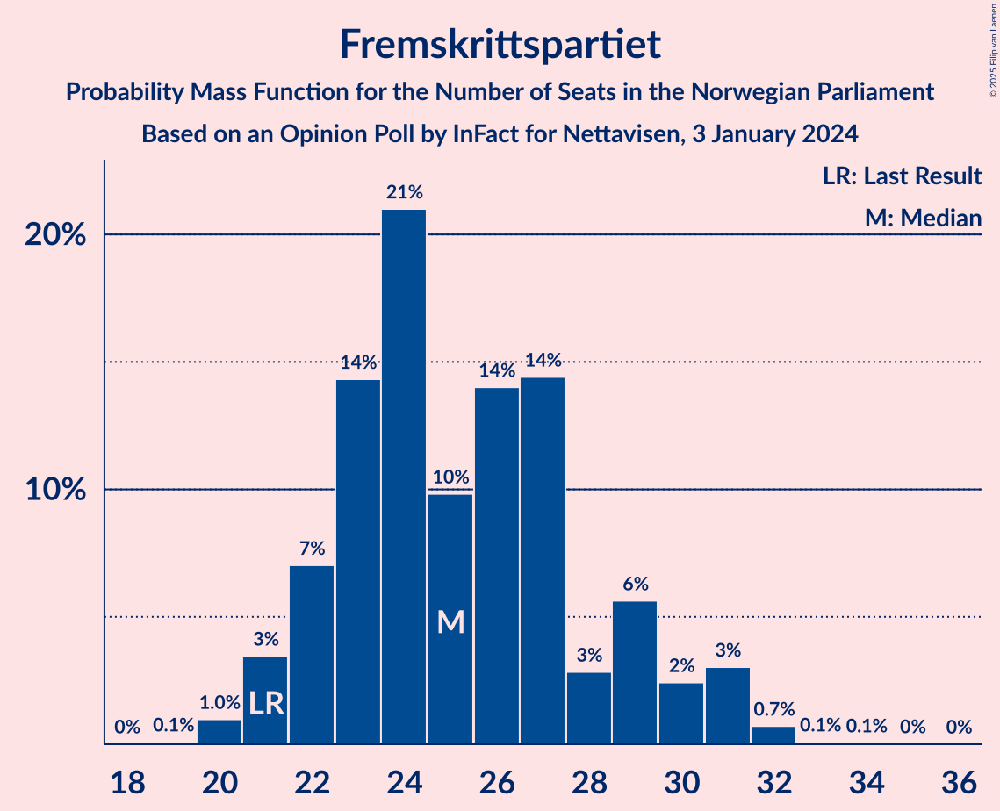
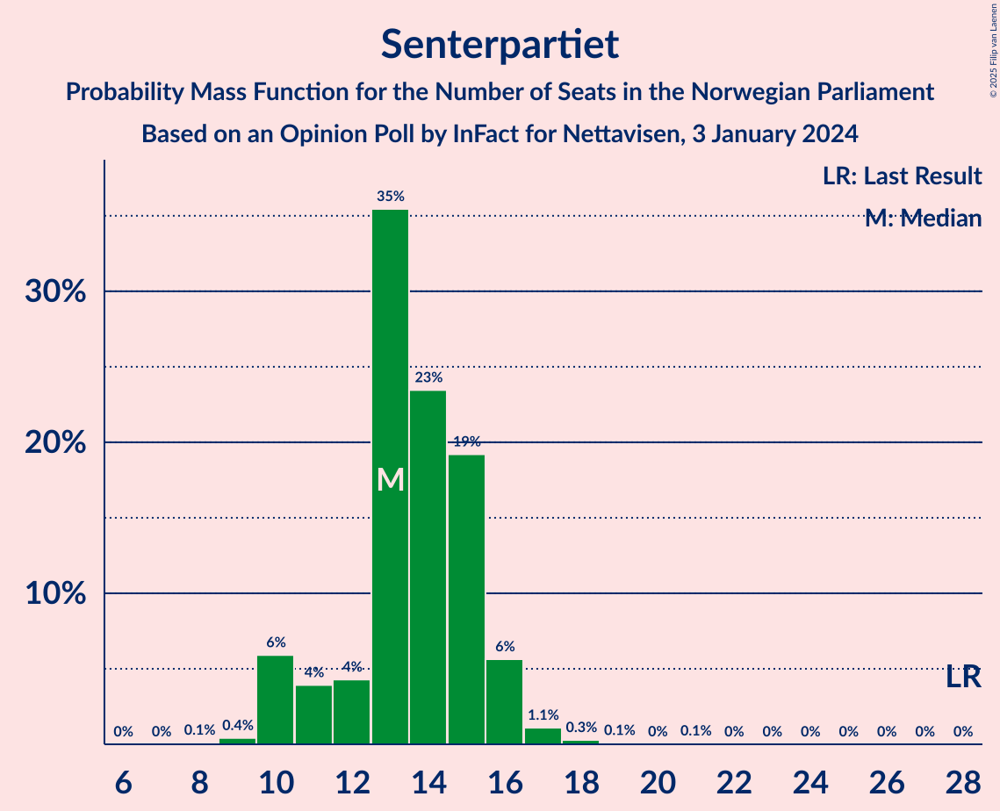
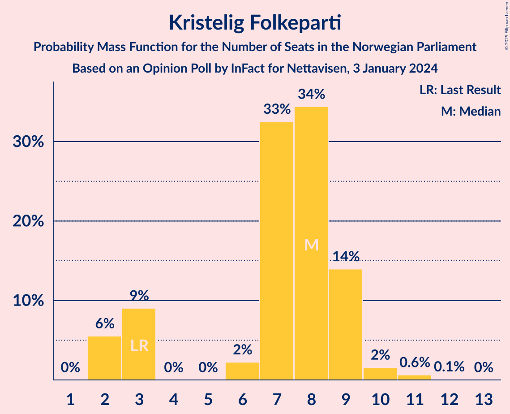
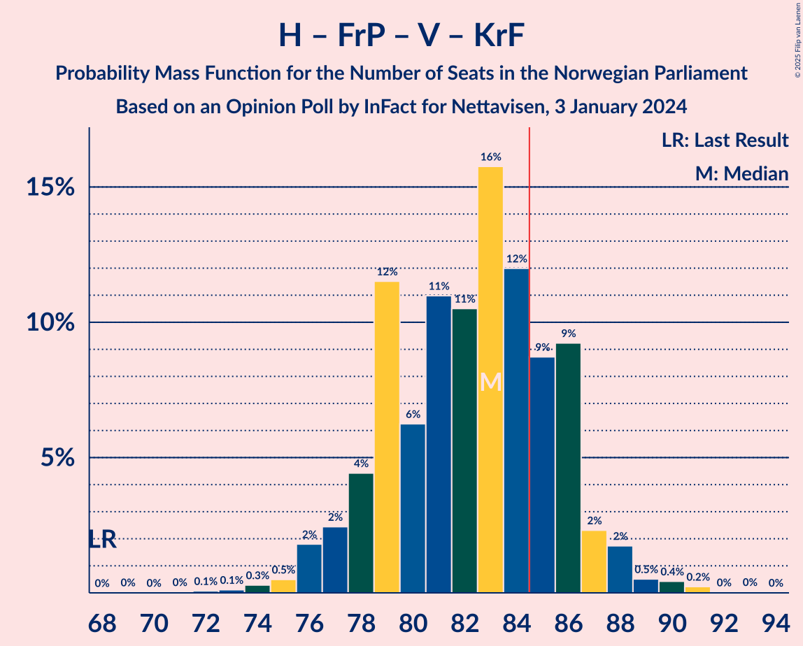
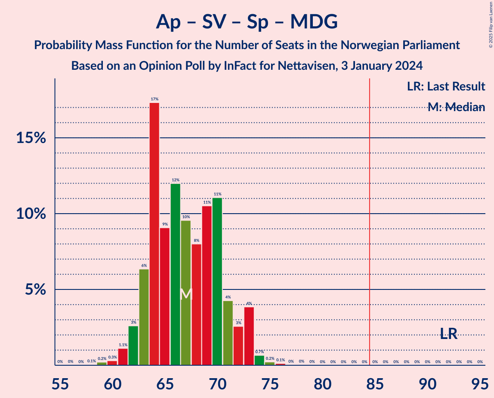
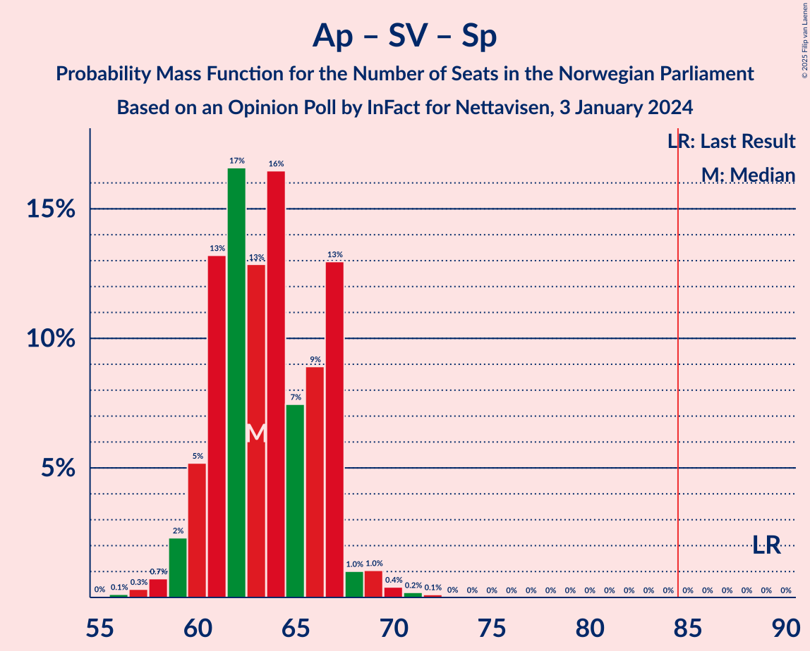
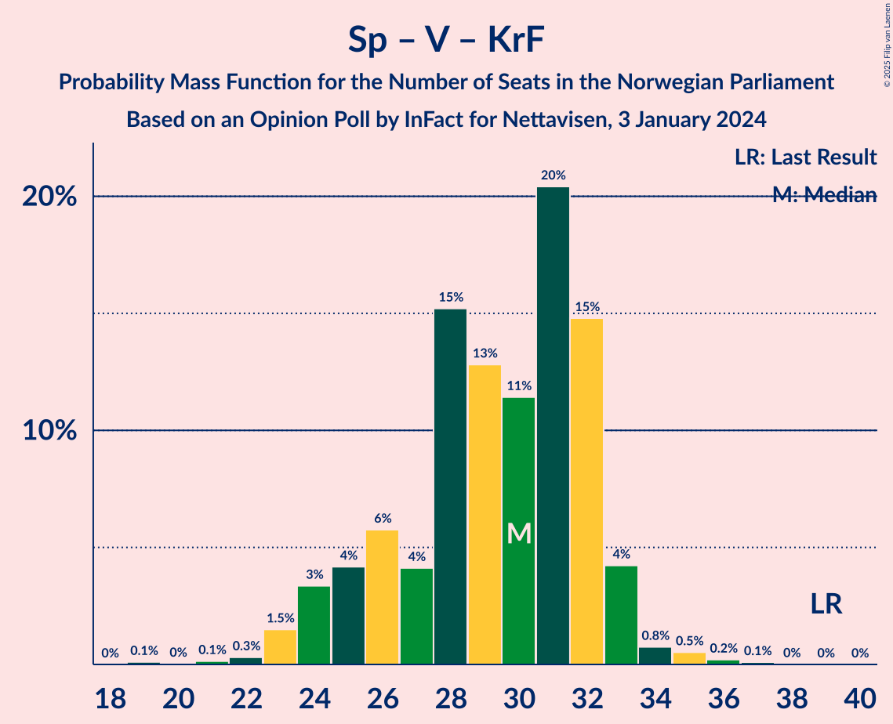

# Opinion Poll by InFact for Nettavisen, 3 January 2024

<a href="#voting-intentions">Voting Intentions</a> | <a href="#seats">Seats</a> | <a href="#coalitions">Coalitions</a> | <a href="#technical-information">Technical Information</a>

## Voting Intentions

### Confidence Intervals

| Party | Last Result | Poll Result | 80% Confidence Interval | 90% Confidence Interval | 95% Confidence Interval | 99% Confidence Interval |
|:-----:|:-----------:|:-----------:|:-----------------------:|:-----------------------:|:-----------------------:|:-----------------------:|
| Høyre | 20.4% | 23.5% | 21.9–25.2% |21.4–25.7% |21.0–26.1% |20.3–26.9% |
| Arbeiderpartiet | 26.2% | 18.5% | 17.0–20.1% |16.6–20.5% |16.3–20.9% |15.6–21.7% |
| Fremskrittspartiet | 11.6% | 14.4% | 13.2–15.9% |12.8–16.3% |12.5–16.7% |11.9–17.4% |
| Sosialistisk Venstreparti | 7.6% | 9.1% | 8.1–10.3% |7.8–10.7% |7.5–11.0% |7.1–11.6% |
| Senterpartiet | 13.5% | 7.8% | 6.9–9.0% |6.6–9.3% |6.4–9.6% |5.9–10.2% |
| Industri- og Næringspartiet | 0.3% | 6.1% | 5.2–7.1% |5.0–7.4% |4.8–7.7% |4.4–8.2% |
| Rødt | 4.7% | 5.6% | 4.8–6.6% |4.6–6.9% |4.4–7.1% |4.0–7.7% |
| Venstre | 4.6% | 5.3% | 4.6–6.3% |4.3–6.6% |4.1–6.8% |3.8–7.3% |
| Kristelig Folkeparti | 3.8% | 4.6% | 3.9–5.5% |3.7–5.8% |3.5–6.0% |3.2–6.5% |
| Miljøpartiet De Grønne | 3.9% | 3.6% | 3.0–4.4% |2.8–4.7% |2.6–4.9% |2.4–5.3% |

*Note:* The poll result column reflects the actual value used in the calculations. Published results may vary slightly, and in addition be rounded to fewer digits.

## Seats

### Confidence Intervals

| Party | Last Result | Median | 80% Confidence Interval | 90% Confidence Interval | 95% Confidence Interval | 99% Confidence Interval |
|:-----:|:-----------:|:------:|:-----------------------:|:-----------------------:|:-----------------------:|:-----------------------:|
| <a href="#høyre">Høyre</a> | 36 | 41 | 38–45 |37–45 |36–46 |35–47 |
| <a href="#arbeiderpartiet">Arbeiderpartiet</a> | 48 | 35 | 33–38 |32–39 |31–39 |31–40 |
| <a href="#fremskrittspartiet">Fremskrittspartiet</a> | 21 | 25 | 22–29 |22–30 |21–31 |20–32 |
| <a href="#sosialistisk-venstreparti">Sosialistisk Venstreparti</a> | 13 | 15 | 12–17 |12–18 |11–18 |11–19 |
| <a href="#senterpartiet">Senterpartiet</a> | 28 | 13 | 11–15 |10–16 |10–16 |9–17 |
| <a href="#industri--og-næringspartiet">Industri- og Næringspartiet</a> | 0 | 10 | 8–12 |8–12 |7–12 |7–14 |
| <a href="#rødt">Rødt</a> | 8 | 9 | 7–11 |7–11 |7–12 |1–13 |
| <a href="#venstre">Venstre</a> | 8 | 9 | 7–11 |7–11 |7–11 |3–12 |
| <a href="#kristelig-folkeparti">Kristelig Folkeparti</a> | 3 | 8 | 3–9 |2–9 |2–9 |2–11 |
| <a href="#miljøpartiet-de-grønne">Miljøpartiet De Grønne</a> | 3 | 3 | 2–7 |1–7 |1–8 |1–8 |

### Høyre

*For a full overview of the results for this party, see the [Høyre](party-høyre.html) page.*

| Number of Seats | Probability | Accumulated | Special Marks |
|:---------------:|:-----------:|:-----------:|:-------------:|
| 33 | 0.1% | 100% |  |
| 34 | 0.1% | 99.9% |  |
| 35 | 1.4% | 99.8% |  |
| 36 | 2% | 98% | Last Result |
| 37 | 3% | 96% |  |
| 38 | 9% | 93% |  |
| 39 | 4% | 85% |  |
| 40 | 22% | 80% |  |
| 41 | 11% | 58% | Median |
| 42 | 15% | 47% |  |
| 43 | 14% | 32% |  |
| 44 | 6% | 19% |  |
| 45 | 8% | 12% |  |
| 46 | 3% | 4% |  |
| 47 | 0.7% | 1.0% |  |
| 48 | 0.2% | 0.3% |  |
| 49 | 0% | 0.1% |  |
| 50 | 0.1% | 0.1% |  |
| 51 | 0% | 0% |  |

### Arbeiderpartiet

*For a full overview of the results for this party, see the [Arbeiderpartiet](party-arbeiderpartiet.html) page.*

| Number of Seats | Probability | Accumulated | Special Marks |
|:---------------:|:-----------:|:-----------:|:-------------:|
| 30 | 0.2% | 100% |  |
| 31 | 2% | 99.8% |  |
| 32 | 6% | 97% |  |
| 33 | 11% | 91% |  |
| 34 | 12% | 80% |  |
| 35 | 34% | 68% | Median |
| 36 | 11% | 34% |  |
| 37 | 8% | 23% |  |
| 38 | 9% | 15% |  |
| 39 | 4% | 6% |  |
| 40 | 2% | 2% |  |
| 41 | 0.2% | 0.4% |  |
| 42 | 0.2% | 0.2% |  |
| 43 | 0% | 0.1% |  |
| 44 | 0% | 0.1% |  |
| 45 | 0% | 0% |  |
| 46 | 0% | 0% |  |
| 47 | 0% | 0% |  |
| 48 | 0% | 0% | Last Result |

### Fremskrittspartiet

*For a full overview of the results for this party, see the [Fremskrittspartiet](party-fremskrittspartiet.html) page.*

| Number of Seats | Probability | Accumulated | Special Marks |
|:---------------:|:-----------:|:-----------:|:-------------:|
| 19 | 0.1% | 100% |  |
| 20 | 1.0% | 99.9% |  |
| 21 | 3% | 98.9% | Last Result |
| 22 | 7% | 95% |  |
| 23 | 14% | 88% |  |
| 24 | 21% | 74% |  |
| 25 | 10% | 53% | Median |
| 26 | 14% | 43% |  |
| 27 | 14% | 29% |  |
| 28 | 3% | 15% |  |
| 29 | 6% | 12% |  |
| 30 | 2% | 6% |  |
| 31 | 3% | 4% |  |
| 32 | 0.7% | 0.9% |  |
| 33 | 0.1% | 0.2% |  |
| 34 | 0.1% | 0.1% |  |
| 35 | 0% | 0% |  |

### Sosialistisk Venstreparti

*For a full overview of the results for this party, see the [Sosialistisk Venstreparti](party-sosialistiskvenstreparti.html) page.*

| Number of Seats | Probability | Accumulated | Special Marks |
|:---------------:|:-----------:|:-----------:|:-------------:|
| 9 | 0.1% | 100% |  |
| 10 | 0.4% | 99.9% |  |
| 11 | 2% | 99.5% |  |
| 12 | 10% | 97% |  |
| 13 | 12% | 88% | Last Result |
| 14 | 22% | 75% |  |
| 15 | 13% | 53% | Median |
| 16 | 24% | 40% |  |
| 17 | 5% | 15% |  |
| 18 | 8% | 10% |  |
| 19 | 1.2% | 2% |  |
| 20 | 0.2% | 0.3% |  |
| 21 | 0.1% | 0.1% |  |
| 22 | 0% | 0% |  |

### Senterpartiet

*For a full overview of the results for this party, see the [Senterpartiet](party-senterpartiet.html) page.*

| Number of Seats | Probability | Accumulated | Special Marks |
|:---------------:|:-----------:|:-----------:|:-------------:|
| 8 | 0.1% | 100% |  |
| 9 | 0.4% | 99.9% |  |
| 10 | 6% | 99.5% |  |
| 11 | 4% | 94% |  |
| 12 | 4% | 90% |  |
| 13 | 35% | 85% | Median |
| 14 | 23% | 50% |  |
| 15 | 19% | 26% |  |
| 16 | 6% | 7% |  |
| 17 | 1.1% | 2% |  |
| 18 | 0.3% | 0.5% |  |
| 19 | 0.1% | 0.2% |  |
| 20 | 0% | 0.1% |  |
| 21 | 0.1% | 0.1% |  |
| 22 | 0% | 0% |  |
| 23 | 0% | 0% |  |
| 24 | 0% | 0% |  |
| 25 | 0% | 0% |  |
| 26 | 0% | 0% |  |
| 27 | 0% | 0% |  |
| 28 | 0% | 0% | Last Result |

### Industri- og Næringspartiet

*For a full overview of the results for this party, see the [Industri- og Næringspartiet](party-industri-ognæringspartiet.html) page.*

| Number of Seats | Probability | Accumulated | Special Marks |
|:---------------:|:-----------:|:-----------:|:-------------:|
| 0 | 0% | 100% | Last Result |
| 1 | 0% | 100% |  |
| 2 | 0% | 100% |  |
| 3 | 0% | 100% |  |
| 4 | 0% | 100% |  |
| 5 | 0% | 100% |  |
| 6 | 0.1% | 100% |  |
| 7 | 3% | 99.8% |  |
| 8 | 13% | 97% |  |
| 9 | 24% | 83% |  |
| 10 | 27% | 59% | Median |
| 11 | 20% | 33% |  |
| 12 | 11% | 13% |  |
| 13 | 1.4% | 2% |  |
| 14 | 0.5% | 0.6% |  |
| 15 | 0% | 0.1% |  |
| 16 | 0% | 0% |  |

### Rødt

*For a full overview of the results for this party, see the [Rødt](party-rødt.html) page.*

| Number of Seats | Probability | Accumulated | Special Marks |
|:---------------:|:-----------:|:-----------:|:-------------:|
| 1 | 1.3% | 100% |  |
| 2 | 0% | 98.7% |  |
| 3 | 0% | 98.7% |  |
| 4 | 0% | 98.7% |  |
| 5 | 0% | 98.7% |  |
| 6 | 0.6% | 98.7% |  |
| 7 | 11% | 98% |  |
| 8 | 17% | 87% | Last Result |
| 9 | 39% | 70% | Median |
| 10 | 18% | 31% |  |
| 11 | 8% | 12% |  |
| 12 | 4% | 5% |  |
| 13 | 0.7% | 0.7% |  |
| 14 | 0% | 0% |  |

### Venstre

*For a full overview of the results for this party, see the [Venstre](party-venstre.html) page.*

| Number of Seats | Probability | Accumulated | Special Marks |
|:---------------:|:-----------:|:-----------:|:-------------:|
| 2 | 0.1% | 100% |  |
| 3 | 1.2% | 99.9% |  |
| 4 | 0% | 98.7% |  |
| 5 | 0% | 98.7% |  |
| 6 | 0.6% | 98.7% |  |
| 7 | 16% | 98% |  |
| 8 | 26% | 82% | Last Result |
| 9 | 26% | 57% | Median |
| 10 | 18% | 30% |  |
| 11 | 12% | 13% |  |
| 12 | 0.7% | 0.9% |  |
| 13 | 0.1% | 0.1% |  |
| 14 | 0% | 0% |  |

### Kristelig Folkeparti

*For a full overview of the results for this party, see the [Kristelig Folkeparti](party-kristeligfolkeparti.html) page.*

| Number of Seats | Probability | Accumulated | Special Marks |
|:---------------:|:-----------:|:-----------:|:-------------:|
| 2 | 6% | 100% |  |
| 3 | 9% | 94% | Last Result |
| 4 | 0% | 85% |  |
| 5 | 0% | 85% |  |
| 6 | 2% | 85% |  |
| 7 | 33% | 83% |  |
| 8 | 34% | 51% | Median |
| 9 | 14% | 16% |  |
| 10 | 2% | 2% |  |
| 11 | 0.6% | 0.7% |  |
| 12 | 0.1% | 0.1% |  |
| 13 | 0% | 0% |  |

### Miljøpartiet De Grønne

*For a full overview of the results for this party, see the [Miljøpartiet De Grønne](party-miljøpartietdegrønne.html) page.*

| Number of Seats | Probability | Accumulated | Special Marks |
|:---------------:|:-----------:|:-----------:|:-------------:|
| 1 | 9% | 100% |  |
| 2 | 32% | 91% |  |
| 3 | 35% | 59% | Last Result, Median |
| 4 | 0% | 24% |  |
| 5 | 0% | 24% |  |
| 6 | 9% | 24% |  |
| 7 | 11% | 15% |  |
| 8 | 4% | 4% |  |
| 9 | 0.2% | 0.2% |  |
| 10 | 0% | 0% |  |

## Coalitions

### Confidence Intervals

| Coalition | Last Result | Median | Majority? | 80% Confidence Interval | 90% Confidence Interval | 95% Confidence Interval | 99% Confidence Interval |
|:---------:|:-----------:|:------:|:---------:|:-----------------------:|:-----------------------:|:-----------------------:|:-----------------------:|
| Høyre – Fremskrittspartiet – Senterpartiet – Venstre – Kristelig Folkeparti | 96 | 96 | 99.9% | 92–100 | 91–101 | 89–102 | 88–104 |
| Høyre – Fremskrittspartiet – Venstre – Kristelig Folkeparti – Miljøpartiet De Grønne | 71 | 86 | 71% | 81–89 | 81–90 | 80–91 | 78–94 |
| Høyre – Fremskrittspartiet – Venstre – Kristelig Folkeparti | 68 | 83 | 23% | 79–86 | 77–87 | 76–88 | 74–90 |
| Arbeiderpartiet – Sosialistisk Venstreparti – Senterpartiet – Rødt – Miljøpartiet De Grønne | 100 | 76 | 0.2% | 72–80 | 72–81 | 70–82 | 69–84 |
| Høyre – Fremskrittspartiet – Venstre | 65 | 75 | 0.1% | 72–78 | 71–80 | 69–81 | 68–83 |
| Arbeiderpartiet – Sosialistisk Venstreparti – Senterpartiet – Kristelig Folkeparti – Miljøpartiet De Grønne | 95 | 73 | 0% | 70–78 | 69–80 | 68–80 | 66–81 |
| Arbeiderpartiet – Sosialistisk Venstreparti – Senterpartiet – Rødt | 97 | 72 | 0% | 69–76 | 68–77 | 67–79 | 66–80 |
| Arbeiderpartiet – Sosialistisk Venstreparti – Senterpartiet – Miljøpartiet De Grønne | 92 | 67 | 0% | 63–71 | 63–72 | 62–73 | 60–74 |
| Høyre – Fremskrittspartiet | 57 | 66 | 0% | 63–70 | 62–71 | 61–72 | 60–74 |
| Arbeiderpartiet – Sosialistisk Venstreparti – Senterpartiet | 89 | 63 | 0% | 61–67 | 60–67 | 59–68 | 57–70 |
| Arbeiderpartiet – Sosialistisk Venstreparti – Rødt – Miljøpartiet De Grønne | 72 | 62 | 0% | 58–67 | 58–68 | 56–68 | 55–70 |
| Arbeiderpartiet – Senterpartiet – Kristelig Folkeparti – Miljøpartiet De Grønne | 82 | 59 | 0% | 55–63 | 53–64 | 53–65 | 50–68 |
| Høyre – Venstre – Kristelig Folkeparti | 47 | 58 | 0% | 53–60 | 51–61 | 51–62 | 49–64 |
| Arbeiderpartiet – Senterpartiet – Kristelig Folkeparti | 79 | 56 | 0% | 53–59 | 50–60 | 49–61 | 46–62 |
| Arbeiderpartiet – Sosialistisk Venstreparti | 61 | 50 | 0% | 47–53 | 46–54 | 45–54 | 44–56 |
| Arbeiderpartiet – Senterpartiet | 76 | 49 | 0% | 46–52 | 45–53 | 45–53 | 43–55 |
| Senterpartiet – Venstre – Kristelig Folkeparti | 39 | 30 | 0% | 26–32 | 24–33 | 24–33 | 22–35 |

### Høyre – Fremskrittspartiet – Senterpartiet – Venstre – Kristelig Folkeparti

| Number of Seats | Probability | Accumulated | Special Marks |
|:---------------:|:-----------:|:-----------:|:-------------:|
| 84 | 0% | 100% |  |
| 85 | 0% | 99.9% | Majority |
| 86 | 0.2% | 99.9% |  |
| 87 | 0.1% | 99.7% |  |
| 88 | 0.2% | 99.6% |  |
| 89 | 2% | 99.4% |  |
| 90 | 2% | 97% |  |
| 91 | 4% | 95% |  |
| 92 | 6% | 91% |  |
| 93 | 5% | 86% |  |
| 94 | 14% | 81% |  |
| 95 | 15% | 67% |  |
| 96 | 9% | 52% | Last Result, Median |
| 97 | 13% | 43% |  |
| 98 | 11% | 30% |  |
| 99 | 7% | 19% |  |
| 100 | 6% | 12% |  |
| 101 | 2% | 5% |  |
| 102 | 0.8% | 3% |  |
| 103 | 1.2% | 2% |  |
| 104 | 0.4% | 0.8% |  |
| 105 | 0.3% | 0.4% |  |
| 106 | 0.1% | 0.1% |  |
| 107 | 0% | 0% |  |

### Høyre – Fremskrittspartiet – Venstre – Kristelig Folkeparti – Miljøpartiet De Grønne

| Number of Seats | Probability | Accumulated | Special Marks |
|:---------------:|:-----------:|:-----------:|:-------------:|
| 71 | 0% | 100% | Last Result |
| 72 | 0% | 100% |  |
| 73 | 0% | 100% |  |
| 74 | 0% | 100% |  |
| 75 | 0% | 100% |  |
| 76 | 0.1% | 100% |  |
| 77 | 0.3% | 99.8% |  |
| 78 | 0.6% | 99.6% |  |
| 79 | 1.4% | 99.0% |  |
| 80 | 2% | 98% |  |
| 81 | 5% | 95% |  |
| 82 | 6% | 90% |  |
| 83 | 8% | 84% |  |
| 84 | 6% | 76% |  |
| 85 | 15% | 71% | Majority |
| 86 | 13% | 56% | Median |
| 87 | 16% | 43% |  |
| 88 | 13% | 27% |  |
| 89 | 8% | 14% |  |
| 90 | 2% | 6% |  |
| 91 | 2% | 4% |  |
| 92 | 1.1% | 2% |  |
| 93 | 0.3% | 1.1% |  |
| 94 | 0.6% | 0.8% |  |
| 95 | 0.1% | 0.1% |  |
| 96 | 0% | 0.1% |  |
| 97 | 0% | 0% |  |

### Høyre – Fremskrittspartiet – Venstre – Kristelig Folkeparti

| Number of Seats | Probability | Accumulated | Special Marks |
|:---------------:|:-----------:|:-----------:|:-------------:|
| 68 | 0% | 100% | Last Result |
| 69 | 0% | 100% |  |
| 70 | 0% | 100% |  |
| 71 | 0% | 100% |  |
| 72 | 0.1% | 99.9% |  |
| 73 | 0.1% | 99.9% |  |
| 74 | 0.3% | 99.7% |  |
| 75 | 0.5% | 99.5% |  |
| 76 | 2% | 99.0% |  |
| 77 | 2% | 97% |  |
| 78 | 4% | 95% |  |
| 79 | 12% | 90% |  |
| 80 | 6% | 79% |  |
| 81 | 11% | 73% |  |
| 82 | 11% | 62% |  |
| 83 | 16% | 51% | Median |
| 84 | 12% | 35% |  |
| 85 | 9% | 23% | Majority |
| 86 | 9% | 15% |  |
| 87 | 2% | 5% |  |
| 88 | 2% | 3% |  |
| 89 | 0.5% | 1.3% |  |
| 90 | 0.4% | 0.7% |  |
| 91 | 0.2% | 0.3% |  |
| 92 | 0% | 0.1% |  |
| 93 | 0% | 0.1% |  |
| 94 | 0% | 0% |  |

### Arbeiderpartiet – Sosialistisk Venstreparti – Senterpartiet – Rødt – Miljøpartiet De Grønne

| Number of Seats | Probability | Accumulated | Special Marks |
|:---------------:|:-----------:|:-----------:|:-------------:|
| 65 | 0% | 100% |  |
| 66 | 0% | 99.9% |  |
| 67 | 0.1% | 99.9% |  |
| 68 | 0.1% | 99.9% |  |
| 69 | 2% | 99.7% |  |
| 70 | 1.0% | 98% |  |
| 71 | 2% | 97% |  |
| 72 | 8% | 95% |  |
| 73 | 12% | 87% |  |
| 74 | 12% | 75% |  |
| 75 | 10% | 64% | Median |
| 76 | 13% | 54% |  |
| 77 | 12% | 40% |  |
| 78 | 6% | 28% |  |
| 79 | 8% | 22% |  |
| 80 | 6% | 15% |  |
| 81 | 6% | 9% |  |
| 82 | 2% | 3% |  |
| 83 | 0.5% | 1.0% |  |
| 84 | 0.4% | 0.5% |  |
| 85 | 0.1% | 0.2% | Majority |
| 86 | 0% | 0.1% |  |
| 87 | 0% | 0% |  |
| 88 | 0% | 0% |  |
| 89 | 0% | 0% |  |
| 90 | 0% | 0% |  |
| 91 | 0% | 0% |  |
| 92 | 0% | 0% |  |
| 93 | 0% | 0% |  |
| 94 | 0% | 0% |  |
| 95 | 0% | 0% |  |
| 96 | 0% | 0% |  |
| 97 | 0% | 0% |  |
| 98 | 0% | 0% |  |
| 99 | 0% | 0% |  |
| 100 | 0% | 0% | Last Result |

### Høyre – Fremskrittspartiet – Venstre

| Number of Seats | Probability | Accumulated | Special Marks |
|:---------------:|:-----------:|:-----------:|:-------------:|
| 65 | 0% | 100% | Last Result |
| 66 | 0.1% | 100% |  |
| 67 | 0.1% | 99.9% |  |
| 68 | 0.5% | 99.7% |  |
| 69 | 2% | 99.3% |  |
| 70 | 2% | 97% |  |
| 71 | 4% | 95% |  |
| 72 | 8% | 91% |  |
| 73 | 8% | 83% |  |
| 74 | 17% | 75% |  |
| 75 | 12% | 59% | Median |
| 76 | 15% | 47% |  |
| 77 | 9% | 32% |  |
| 78 | 14% | 23% |  |
| 79 | 3% | 9% |  |
| 80 | 3% | 6% |  |
| 81 | 2% | 4% |  |
| 82 | 0.8% | 1.5% |  |
| 83 | 0.4% | 0.6% |  |
| 84 | 0.1% | 0.2% |  |
| 85 | 0% | 0.1% | Majority |
| 86 | 0% | 0.1% |  |
| 87 | 0% | 0% |  |

### Arbeiderpartiet – Sosialistisk Venstreparti – Senterpartiet – Kristelig Folkeparti – Miljøpartiet De Grønne

| Number of Seats | Probability | Accumulated | Special Marks |
|:---------------:|:-----------:|:-----------:|:-------------:|
| 63 | 0% | 100% |  |
| 64 | 0.1% | 99.9% |  |
| 65 | 0.1% | 99.9% |  |
| 66 | 0.7% | 99.8% |  |
| 67 | 1.2% | 99.0% |  |
| 68 | 2% | 98% |  |
| 69 | 4% | 95% |  |
| 70 | 5% | 92% |  |
| 71 | 12% | 87% |  |
| 72 | 10% | 75% |  |
| 73 | 15% | 65% |  |
| 74 | 7% | 50% | Median |
| 75 | 12% | 43% |  |
| 76 | 5% | 32% |  |
| 77 | 8% | 26% |  |
| 78 | 10% | 18% |  |
| 79 | 3% | 8% |  |
| 80 | 4% | 5% |  |
| 81 | 0.6% | 1.1% |  |
| 82 | 0.2% | 0.5% |  |
| 83 | 0.1% | 0.2% |  |
| 84 | 0% | 0.1% |  |
| 85 | 0% | 0% | Majority |
| 86 | 0% | 0% |  |
| 87 | 0% | 0% |  |
| 88 | 0% | 0% |  |
| 89 | 0% | 0% |  |
| 90 | 0% | 0% |  |
| 91 | 0% | 0% |  |
| 92 | 0% | 0% |  |
| 93 | 0% | 0% |  |
| 94 | 0% | 0% |  |
| 95 | 0% | 0% | Last Result |

### Arbeiderpartiet – Sosialistisk Venstreparti – Senterpartiet – Rødt

| Number of Seats | Probability | Accumulated | Special Marks |
|:---------------:|:-----------:|:-----------:|:-------------:|
| 62 | 0% | 100% |  |
| 63 | 0% | 99.9% |  |
| 64 | 0.1% | 99.9% |  |
| 65 | 0.1% | 99.8% |  |
| 66 | 2% | 99.7% |  |
| 67 | 1.1% | 98% |  |
| 68 | 3% | 97% |  |
| 69 | 5% | 94% |  |
| 70 | 14% | 88% |  |
| 71 | 12% | 74% |  |
| 72 | 14% | 62% | Median |
| 73 | 14% | 48% |  |
| 74 | 12% | 35% |  |
| 75 | 8% | 22% |  |
| 76 | 4% | 14% |  |
| 77 | 6% | 10% |  |
| 78 | 1.0% | 4% |  |
| 79 | 2% | 3% |  |
| 80 | 0.4% | 0.6% |  |
| 81 | 0.2% | 0.2% |  |
| 82 | 0.1% | 0.1% |  |
| 83 | 0% | 0% |  |
| 84 | 0% | 0% |  |
| 85 | 0% | 0% | Majority |
| 86 | 0% | 0% |  |
| 87 | 0% | 0% |  |
| 88 | 0% | 0% |  |
| 89 | 0% | 0% |  |
| 90 | 0% | 0% |  |
| 91 | 0% | 0% |  |
| 92 | 0% | 0% |  |
| 93 | 0% | 0% |  |
| 94 | 0% | 0% |  |
| 95 | 0% | 0% |  |
| 96 | 0% | 0% |  |
| 97 | 0% | 0% | Last Result |

### Arbeiderpartiet – Sosialistisk Venstreparti – Senterpartiet – Miljøpartiet De Grønne

| Number of Seats | Probability | Accumulated | Special Marks |
|:---------------:|:-----------:|:-----------:|:-------------:|
| 58 | 0.1% | 100% |  |
| 59 | 0.2% | 99.9% |  |
| 60 | 0.3% | 99.7% |  |
| 61 | 1.1% | 99.4% |  |
| 62 | 3% | 98% |  |
| 63 | 6% | 96% |  |
| 64 | 17% | 89% |  |
| 65 | 9% | 72% |  |
| 66 | 12% | 63% | Median |
| 67 | 10% | 51% |  |
| 68 | 8% | 41% |  |
| 69 | 11% | 33% |  |
| 70 | 11% | 23% |  |
| 71 | 4% | 12% |  |
| 72 | 3% | 8% |  |
| 73 | 4% | 5% |  |
| 74 | 0.7% | 1.1% |  |
| 75 | 0.2% | 0.4% |  |
| 76 | 0.1% | 0.2% |  |
| 77 | 0% | 0.1% |  |
| 78 | 0% | 0% |  |
| 79 | 0% | 0% |  |
| 80 | 0% | 0% |  |
| 81 | 0% | 0% |  |
| 82 | 0% | 0% |  |
| 83 | 0% | 0% |  |
| 84 | 0% | 0% |  |
| 85 | 0% | 0% | Majority |
| 86 | 0% | 0% |  |
| 87 | 0% | 0% |  |
| 88 | 0% | 0% |  |
| 89 | 0% | 0% |  |
| 90 | 0% | 0% |  |
| 91 | 0% | 0% |  |
| 92 | 0% | 0% | Last Result |

### Høyre – Fremskrittspartiet

| Number of Seats | Probability | Accumulated | Special Marks |
|:---------------:|:-----------:|:-----------:|:-------------:|
| 57 | 0% | 100% | Last Result |
| 58 | 0.1% | 100% |  |
| 59 | 0.2% | 99.9% |  |
| 60 | 0.9% | 99.7% |  |
| 61 | 3% | 98.8% |  |
| 62 | 3% | 96% |  |
| 63 | 4% | 93% |  |
| 64 | 13% | 89% |  |
| 65 | 8% | 76% |  |
| 66 | 20% | 68% | Median |
| 67 | 17% | 48% |  |
| 68 | 9% | 31% |  |
| 69 | 11% | 23% |  |
| 70 | 6% | 12% |  |
| 71 | 2% | 6% |  |
| 72 | 3% | 4% |  |
| 73 | 0.9% | 2% |  |
| 74 | 0.3% | 0.6% |  |
| 75 | 0.1% | 0.2% |  |
| 76 | 0% | 0.1% |  |
| 77 | 0% | 0.1% |  |
| 78 | 0% | 0.1% |  |
| 79 | 0% | 0% |  |

### Arbeiderpartiet – Sosialistisk Venstreparti – Senterpartiet

| Number of Seats | Probability | Accumulated | Special Marks |
|:---------------:|:-----------:|:-----------:|:-------------:|
| 55 | 0% | 100% |  |
| 56 | 0.1% | 99.9% |  |
| 57 | 0.3% | 99.8% |  |
| 58 | 0.7% | 99.5% |  |
| 59 | 2% | 98.7% |  |
| 60 | 5% | 96% |  |
| 61 | 13% | 91% |  |
| 62 | 17% | 78% |  |
| 63 | 13% | 61% | Median |
| 64 | 16% | 49% |  |
| 65 | 7% | 32% |  |
| 66 | 9% | 25% |  |
| 67 | 13% | 16% |  |
| 68 | 1.0% | 3% |  |
| 69 | 1.0% | 2% |  |
| 70 | 0.4% | 0.7% |  |
| 71 | 0.2% | 0.3% |  |
| 72 | 0.1% | 0.1% |  |
| 73 | 0% | 0% |  |
| 74 | 0% | 0% |  |
| 75 | 0% | 0% |  |
| 76 | 0% | 0% |  |
| 77 | 0% | 0% |  |
| 78 | 0% | 0% |  |
| 79 | 0% | 0% |  |
| 80 | 0% | 0% |  |
| 81 | 0% | 0% |  |
| 82 | 0% | 0% |  |
| 83 | 0% | 0% |  |
| 84 | 0% | 0% |  |
| 85 | 0% | 0% | Majority |
| 86 | 0% | 0% |  |
| 87 | 0% | 0% |  |
| 88 | 0% | 0% |  |
| 89 | 0% | 0% | Last Result |

### Arbeiderpartiet – Sosialistisk Venstreparti – Rødt – Miljøpartiet De Grønne

| Number of Seats | Probability | Accumulated | Special Marks |
|:---------------:|:-----------:|:-----------:|:-------------:|
| 53 | 0.1% | 100% |  |
| 54 | 0.4% | 99.9% |  |
| 55 | 2% | 99.5% |  |
| 56 | 0.8% | 98% |  |
| 57 | 1.1% | 97% |  |
| 58 | 6% | 96% |  |
| 59 | 7% | 90% |  |
| 60 | 13% | 83% |  |
| 61 | 11% | 70% |  |
| 62 | 11% | 59% | Median |
| 63 | 12% | 48% |  |
| 64 | 15% | 36% |  |
| 65 | 8% | 22% |  |
| 66 | 4% | 14% |  |
| 67 | 3% | 11% |  |
| 68 | 6% | 8% |  |
| 69 | 0.8% | 2% |  |
| 70 | 1.2% | 1.4% |  |
| 71 | 0.1% | 0.2% |  |
| 72 | 0.1% | 0.1% | Last Result |
| 73 | 0% | 0.1% |  |
| 74 | 0% | 0.1% |  |
| 75 | 0% | 0% |  |

### Arbeiderpartiet – Senterpartiet – Kristelig Folkeparti – Miljøpartiet De Grønne

| Number of Seats | Probability | Accumulated | Special Marks |
|:---------------:|:-----------:|:-----------:|:-------------:|
| 48 | 0% | 100% |  |
| 49 | 0.1% | 99.9% |  |
| 50 | 0.6% | 99.9% |  |
| 51 | 0.8% | 99.3% |  |
| 52 | 0.6% | 98% |  |
| 53 | 3% | 98% |  |
| 54 | 2% | 95% |  |
| 55 | 7% | 93% |  |
| 56 | 6% | 86% |  |
| 57 | 16% | 80% |  |
| 58 | 6% | 65% |  |
| 59 | 14% | 59% | Median |
| 60 | 11% | 45% |  |
| 61 | 6% | 34% |  |
| 62 | 11% | 29% |  |
| 63 | 8% | 18% |  |
| 64 | 5% | 10% |  |
| 65 | 2% | 4% |  |
| 66 | 0.6% | 2% |  |
| 67 | 0.6% | 1.3% |  |
| 68 | 0.7% | 0.7% |  |
| 69 | 0% | 0.1% |  |
| 70 | 0% | 0% |  |
| 71 | 0% | 0% |  |
| 72 | 0% | 0% |  |
| 73 | 0% | 0% |  |
| 74 | 0% | 0% |  |
| 75 | 0% | 0% |  |
| 76 | 0% | 0% |  |
| 77 | 0% | 0% |  |
| 78 | 0% | 0% |  |
| 79 | 0% | 0% |  |
| 80 | 0% | 0% |  |
| 81 | 0% | 0% |  |
| 82 | 0% | 0% | Last Result |

### Høyre – Venstre – Kristelig Folkeparti

| Number of Seats | Probability | Accumulated | Special Marks |
|:---------------:|:-----------:|:-----------:|:-------------:|
| 45 | 0.1% | 100% |  |
| 46 | 0% | 99.9% |  |
| 47 | 0% | 99.8% | Last Result |
| 48 | 0.3% | 99.8% |  |
| 49 | 0.4% | 99.5% |  |
| 50 | 2% | 99.1% |  |
| 51 | 3% | 98% |  |
| 52 | 4% | 94% |  |
| 53 | 5% | 91% |  |
| 54 | 4% | 85% |  |
| 55 | 13% | 81% |  |
| 56 | 8% | 68% |  |
| 57 | 10% | 61% |  |
| 58 | 8% | 50% | Median |
| 59 | 22% | 43% |  |
| 60 | 11% | 21% |  |
| 61 | 7% | 10% |  |
| 62 | 1.0% | 3% |  |
| 63 | 1.4% | 2% |  |
| 64 | 0.6% | 0.9% |  |
| 65 | 0.1% | 0.3% |  |
| 66 | 0.1% | 0.1% |  |
| 67 | 0% | 0% |  |

### Arbeiderpartiet – Senterpartiet – Kristelig Folkeparti

| Number of Seats | Probability | Accumulated | Special Marks |
|:---------------:|:-----------:|:-----------:|:-------------:|
| 45 | 0% | 100% |  |
| 46 | 0.5% | 99.9% |  |
| 47 | 0.2% | 99.4% |  |
| 48 | 1.2% | 99.2% |  |
| 49 | 0.6% | 98% |  |
| 50 | 3% | 97% |  |
| 51 | 2% | 94% |  |
| 52 | 2% | 93% |  |
| 53 | 9% | 90% |  |
| 54 | 11% | 81% |  |
| 55 | 15% | 70% |  |
| 56 | 17% | 55% | Median |
| 57 | 11% | 38% |  |
| 58 | 12% | 28% |  |
| 59 | 7% | 16% |  |
| 60 | 4% | 9% |  |
| 61 | 3% | 5% |  |
| 62 | 1.0% | 1.5% |  |
| 63 | 0.4% | 0.4% |  |
| 64 | 0% | 0.1% |  |
| 65 | 0% | 0% |  |
| 66 | 0% | 0% |  |
| 67 | 0% | 0% |  |
| 68 | 0% | 0% |  |
| 69 | 0% | 0% |  |
| 70 | 0% | 0% |  |
| 71 | 0% | 0% |  |
| 72 | 0% | 0% |  |
| 73 | 0% | 0% |  |
| 74 | 0% | 0% |  |
| 75 | 0% | 0% |  |
| 76 | 0% | 0% |  |
| 77 | 0% | 0% |  |
| 78 | 0% | 0% |  |
| 79 | 0% | 0% | Last Result |

### Arbeiderpartiet – Sosialistisk Venstreparti

| Number of Seats | Probability | Accumulated | Special Marks |
|:---------------:|:-----------:|:-----------:|:-------------:|
| 42 | 0.1% | 100% |  |
| 43 | 0.4% | 99.9% |  |
| 44 | 0.7% | 99.6% |  |
| 45 | 2% | 98.9% |  |
| 46 | 4% | 97% |  |
| 47 | 12% | 92% |  |
| 48 | 8% | 80% |  |
| 49 | 13% | 72% |  |
| 50 | 15% | 59% | Median |
| 51 | 16% | 44% |  |
| 52 | 9% | 28% |  |
| 53 | 12% | 19% |  |
| 54 | 5% | 7% |  |
| 55 | 0.7% | 2% |  |
| 56 | 0.6% | 0.9% |  |
| 57 | 0.2% | 0.3% |  |
| 58 | 0% | 0.1% |  |
| 59 | 0% | 0.1% |  |
| 60 | 0% | 0% |  |
| 61 | 0% | 0% | Last Result |

### Arbeiderpartiet – Senterpartiet

| Number of Seats | Probability | Accumulated | Special Marks |
|:---------------:|:-----------:|:-----------:|:-------------:|
| 41 | 0.1% | 100% |  |
| 42 | 0.1% | 99.9% |  |
| 43 | 0.6% | 99.8% |  |
| 44 | 1.0% | 99.2% |  |
| 45 | 4% | 98% |  |
| 46 | 11% | 94% |  |
| 47 | 8% | 83% |  |
| 48 | 24% | 75% | Median |
| 49 | 21% | 51% |  |
| 50 | 9% | 30% |  |
| 51 | 11% | 21% |  |
| 52 | 3% | 10% |  |
| 53 | 4% | 7% |  |
| 54 | 2% | 2% |  |
| 55 | 0.4% | 0.6% |  |
| 56 | 0.1% | 0.1% |  |
| 57 | 0% | 0% |  |
| 58 | 0% | 0% |  |
| 59 | 0% | 0% |  |
| 60 | 0% | 0% |  |
| 61 | 0% | 0% |  |
| 62 | 0% | 0% |  |
| 63 | 0% | 0% |  |
| 64 | 0% | 0% |  |
| 65 | 0% | 0% |  |
| 66 | 0% | 0% |  |
| 67 | 0% | 0% |  |
| 68 | 0% | 0% |  |
| 69 | 0% | 0% |  |
| 70 | 0% | 0% |  |
| 71 | 0% | 0% |  |
| 72 | 0% | 0% |  |
| 73 | 0% | 0% |  |
| 74 | 0% | 0% |  |
| 75 | 0% | 0% |  |
| 76 | 0% | 0% | Last Result |

### Senterpartiet – Venstre – Kristelig Folkeparti

| Number of Seats | Probability | Accumulated | Special Marks |
|:---------------:|:-----------:|:-----------:|:-------------:|
| 19 | 0.1% | 100% |  |
| 20 | 0% | 99.9% |  |
| 21 | 0.1% | 99.9% |  |
| 22 | 0.3% | 99.7% |  |
| 23 | 1.5% | 99.4% |  |
| 24 | 3% | 98% |  |
| 25 | 4% | 95% |  |
| 26 | 6% | 90% |  |
| 27 | 4% | 85% |  |
| 28 | 15% | 80% |  |
| 29 | 13% | 65% |  |
| 30 | 11% | 52% | Median |
| 31 | 20% | 41% |  |
| 32 | 15% | 21% |  |
| 33 | 4% | 6% |  |
| 34 | 0.8% | 2% |  |
| 35 | 0.5% | 0.8% |  |
| 36 | 0.2% | 0.3% |  |
| 37 | 0.1% | 0.1% |  |
| 38 | 0% | 0% |  |
| 39 | 0% | 0% | Last Result |

## Technical Information

### Opinion Poll

+ **Polling firm:** InFact
+ **Commissioner(s):** Nettavisen
+ **Fieldwork period:** 3 January 2024

### Calculations

+ **Sample size:** 1087
+ **Simulations done:** 1,048,576
+ **Error estimate:** 2.03%

