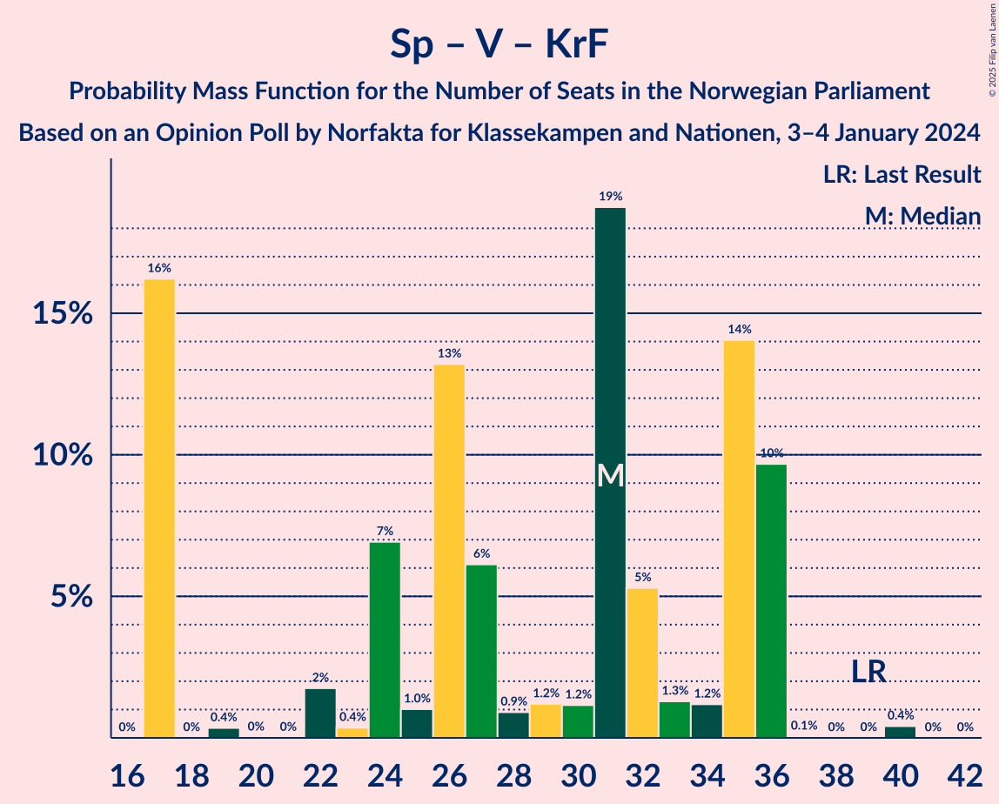

# Opinion Poll by Norfakta for Klassekampen and Nationen, 3–4 January 2024

<a href="#voting-intentions">Voting Intentions</a> | <a href="#seats">Seats</a> | <a href="#coalitions">Coalitions</a> | <a href="#technical-information">Technical Information</a>

## Voting Intentions

### Confidence Intervals

| Party | Last Result | Poll Result | 80% Confidence Interval | 90% Confidence Interval | 95% Confidence Interval | 99% Confidence Interval |
|:-----:|:-----------:|:-----------:|:-----------------------:|:-----------------------:|:-----------------------:|:-----------------------:|
| Høyre | 20.4% | 25.2% | 23.4–27.3% |22.8–27.8% |22.4–28.3% |21.5–29.3% |
| Arbeiderpartiet | 26.2% | 19.0% | 17.3–20.8% |16.8–21.4% |16.4–21.8% |15.6–22.7% |
| Fremskrittspartiet | 11.6% | 14.2% | 12.7–15.9% |12.3–16.3% |11.9–16.7% |11.3–17.6% |
| Sosialistisk Venstreparti | 7.6% | 10.6% | 9.3–12.1% |9.0–12.5% |8.7–12.9% |8.1–13.7% |
| Senterpartiet | 13.5% | 6.7% | 5.7–7.9% |5.4–8.3% |5.1–8.6% |4.7–9.2% |
| Venstre | 4.6% | 5.9% | 5.0–7.1% |4.7–7.5% |4.5–7.8% |4.1–8.4% |
| Rødt | 4.7% | 4.3% | 3.5–5.4% |3.3–5.7% |3.1–5.9% |2.8–6.5% |
| Kristelig Folkeparti | 3.8% | 4.1% | 3.3–5.1% |3.1–5.4% |2.9–5.7% |2.6–6.2% |
| Miljøpartiet De Grønne | 3.9% | 3.4% | 2.7–4.4% |2.6–4.7% |2.4–5.0% |2.1–5.5% |
| Industri- og Næringspartiet | 0.3% | 3.4% | 2.7–4.4% |2.6–4.7% |2.4–5.0% |2.1–5.5% |
| Pensjonistpartiet | 0.6% | 1.6% | 1.2–2.3% |1.0–2.5% |0.9–2.7% |0.8–3.1% |
| Liberalistene | 0.2% | 0.6% | 0.4–1.1% |0.3–1.3% |0.3–1.4% |0.2–1.7% |
| Konservativt | 0.4% | 0.4% | 0.2–0.8% |0.2–1.0% |0.1–1.1% |0.1–1.4% |
| Folkets parti | 0.1% | 0.2% | 0.1–0.7% |0.1–0.8% |0.1–0.9% |0.0–1.1% |
| Norgesdemokratene | 1.1% | 0.1% | 0.1–0.5% |0.0–0.6% |0.0–0.7% |0.0–0.9% |

*Note:* The poll result column reflects the actual value used in the calculations. Published results may vary slightly, and in addition be rounded to fewer digits.

## Seats

### Confidence Intervals

| Party | Last Result | Median | 80% Confidence Interval | 90% Confidence Interval | 95% Confidence Interval | 99% Confidence Interval |
|:-----:|:-----------:|:------:|:-----------------------:|:-----------------------:|:-----------------------:|:-----------------------:|
| <a href="#høyre">Høyre</a> | 36 | 45 | 40–50 |40–50 |40–51 |38–54 |
| <a href="#arbeiderpartiet">Arbeiderpartiet</a> | 48 | 36 | 28–39 |28–39 |28–39 |28–42 |
| <a href="#fremskrittspartiet">Fremskrittspartiet</a> | 21 | 29 | 22–34 |22–34 |22–34 |21–34 |
| <a href="#sosialistisk-venstreparti">Sosialistisk Venstreparti</a> | 13 | 18 | 15–22 |15–22 |14–22 |14–22 |
| <a href="#senterpartiet">Senterpartiet</a> | 28 | 13 | 8–15 |8–16 |8–17 |7–19 |
| <a href="#venstre">Venstre</a> | 8 | 10 | 3–13 |3–14 |3–14 |3–14 |
| <a href="#rødt">Rødt</a> | 8 | 8 | 1–9 |1–10 |1–12 |1–12 |
| <a href="#kristelig-folkeparti">Kristelig Folkeparti</a> | 3 | 8 | 2–9 |2–9 |2–9 |0–11 |
| <a href="#miljøpartiet-de-grønne">Miljøpartiet De Grønne</a> | 3 | 2 | 1–8 |1–8 |1–8 |1–8 |
| <a href="#industri--og-næringspartiet">Industri- og Næringspartiet</a> | 0 | 2 | 2–3 |2–8 |1–9 |0–9 |
| <a href="#pensjonistpartiet">Pensjonistpartiet</a> | 0 | 0 | 0 |0–1 |0–1 |0–1 |
| <a href="#liberalistene">Liberalistene</a> | 0 | 0 | 0 |0 |0 |0 |
| <a href="#konservativt">Konservativt</a> | 0 | 0 | 0 |0 |0 |0 |
| <a href="#folkets-parti">Folkets parti</a> | 0 | 0 | 0 |0 |0 |0 |
| <a href="#norgesdemokratene">Norgesdemokratene</a> | 0 | 0 | 0 |0 |0 |0 |

### Høyre

*For a full overview of the results for this party, see the [Høyre](party-høyre.html) page.*

| Number of Seats | Probability | Accumulated | Special Marks |
|:---------------:|:-----------:|:-----------:|:-------------:|
| 36 | 0% | 100% | Last Result |
| 37 | 0% | 100% |  |
| 38 | 1.0% | 100% |  |
| 39 | 0.3% | 98.9% |  |
| 40 | 10% | 98.6% |  |
| 41 | 10% | 88% |  |
| 42 | 2% | 79% |  |
| 43 | 5% | 76% |  |
| 44 | 17% | 71% |  |
| 45 | 6% | 55% | Median |
| 46 | 3% | 49% |  |
| 47 | 4% | 46% |  |
| 48 | 17% | 42% |  |
| 49 | 5% | 25% |  |
| 50 | 16% | 20% |  |
| 51 | 2% | 4% |  |
| 52 | 0.2% | 2% |  |
| 53 | 0% | 1.4% |  |
| 54 | 1.1% | 1.4% |  |
| 55 | 0.1% | 0.3% |  |
| 56 | 0% | 0.2% |  |
| 57 | 0.2% | 0.2% |  |
| 58 | 0% | 0% |  |

### Arbeiderpartiet

*For a full overview of the results for this party, see the [Arbeiderpartiet](party-arbeiderpartiet.html) page.*

| Number of Seats | Probability | Accumulated | Special Marks |
|:---------------:|:-----------:|:-----------:|:-------------:|
| 28 | 15% | 100% |  |
| 29 | 0.1% | 85% |  |
| 30 | 0.5% | 85% |  |
| 31 | 18% | 85% |  |
| 32 | 4% | 67% |  |
| 33 | 5% | 64% |  |
| 34 | 6% | 59% |  |
| 35 | 2% | 53% |  |
| 36 | 6% | 50% | Median |
| 37 | 12% | 45% |  |
| 38 | 21% | 33% |  |
| 39 | 10% | 12% |  |
| 40 | 1.0% | 2% |  |
| 41 | 0.7% | 1.3% |  |
| 42 | 0.3% | 0.6% |  |
| 43 | 0.1% | 0.2% |  |
| 44 | 0.1% | 0.2% |  |
| 45 | 0% | 0% |  |
| 46 | 0% | 0% |  |
| 47 | 0% | 0% |  |
| 48 | 0% | 0% | Last Result |

### Fremskrittspartiet

*For a full overview of the results for this party, see the [Fremskrittspartiet](party-fremskrittspartiet.html) page.*

| Number of Seats | Probability | Accumulated | Special Marks |
|:---------------:|:-----------:|:-----------:|:-------------:|
| 19 | 0.2% | 100% |  |
| 20 | 0.1% | 99.8% |  |
| 21 | 1.0% | 99.7% | Last Result |
| 22 | 11% | 98.7% |  |
| 23 | 2% | 88% |  |
| 24 | 5% | 85% |  |
| 25 | 0.7% | 80% |  |
| 26 | 5% | 79% |  |
| 27 | 18% | 74% |  |
| 28 | 2% | 56% |  |
| 29 | 6% | 55% | Median |
| 30 | 7% | 49% |  |
| 31 | 16% | 42% |  |
| 32 | 2% | 26% |  |
| 33 | 0% | 24% |  |
| 34 | 24% | 24% |  |
| 35 | 0% | 0.1% |  |
| 36 | 0.1% | 0.1% |  |
| 37 | 0% | 0% |  |

### Sosialistisk Venstreparti

*For a full overview of the results for this party, see the [Sosialistisk Venstreparti](party-sosialistiskvenstreparti.html) page.*

| Number of Seats | Probability | Accumulated | Special Marks |
|:---------------:|:-----------:|:-----------:|:-------------:|
| 12 | 0% | 100% |  |
| 13 | 0% | 99.9% | Last Result |
| 14 | 3% | 99.9% |  |
| 15 | 14% | 97% |  |
| 16 | 15% | 83% |  |
| 17 | 18% | 68% |  |
| 18 | 6% | 50% | Median |
| 19 | 12% | 44% |  |
| 20 | 9% | 33% |  |
| 21 | 2% | 24% |  |
| 22 | 21% | 22% |  |
| 23 | 0% | 0.4% |  |
| 24 | 0.1% | 0.4% |  |
| 25 | 0.3% | 0.3% |  |
| 26 | 0% | 0% |  |

### Senterpartiet

*For a full overview of the results for this party, see the [Senterpartiet](party-senterpartiet.html) page.*

| Number of Seats | Probability | Accumulated | Special Marks |
|:---------------:|:-----------:|:-----------:|:-------------:|
| 7 | 1.0% | 100% |  |
| 8 | 9% | 99.0% |  |
| 9 | 1.0% | 89% |  |
| 10 | 6% | 88% |  |
| 11 | 19% | 82% |  |
| 12 | 6% | 64% |  |
| 13 | 26% | 57% | Median |
| 14 | 19% | 31% |  |
| 15 | 5% | 12% |  |
| 16 | 2% | 7% |  |
| 17 | 4% | 5% |  |
| 18 | 0% | 1.0% |  |
| 19 | 0.9% | 1.0% |  |
| 20 | 0.1% | 0.1% |  |
| 21 | 0% | 0% |  |
| 22 | 0% | 0% |  |
| 23 | 0% | 0% |  |
| 24 | 0% | 0% |  |
| 25 | 0% | 0% |  |
| 26 | 0% | 0% |  |
| 27 | 0% | 0% |  |
| 28 | 0% | 0% | Last Result |

### Venstre

*For a full overview of the results for this party, see the [Venstre](party-venstre.html) page.*

| Number of Seats | Probability | Accumulated | Special Marks |
|:---------------:|:-----------:|:-----------:|:-------------:|
| 3 | 17% | 100% |  |
| 4 | 0% | 83% |  |
| 5 | 0% | 83% |  |
| 6 | 0% | 83% |  |
| 7 | 0.1% | 83% |  |
| 8 | 4% | 83% | Last Result |
| 9 | 13% | 79% |  |
| 10 | 21% | 66% | Median |
| 11 | 2% | 45% |  |
| 12 | 27% | 42% |  |
| 13 | 6% | 16% |  |
| 14 | 10% | 10% |  |
| 15 | 0% | 0.4% |  |
| 16 | 0.3% | 0.4% |  |
| 17 | 0% | 0% |  |

### Rødt

*For a full overview of the results for this party, see the [Rødt](party-rødt.html) page.*

| Number of Seats | Probability | Accumulated | Special Marks |
|:---------------:|:-----------:|:-----------:|:-------------:|
| 1 | 24% | 100% |  |
| 2 | 0% | 76% |  |
| 3 | 0% | 76% |  |
| 4 | 0% | 76% |  |
| 5 | 0% | 76% |  |
| 6 | 0% | 76% |  |
| 7 | 2% | 76% |  |
| 8 | 29% | 73% | Last Result, Median |
| 9 | 37% | 45% |  |
| 10 | 3% | 7% |  |
| 11 | 0.1% | 4% |  |
| 12 | 4% | 4% |  |
| 13 | 0.1% | 0.1% |  |
| 14 | 0% | 0% |  |

### Kristelig Folkeparti

*For a full overview of the results for this party, see the [Kristelig Folkeparti](party-kristeligfolkeparti.html) page.*

| Number of Seats | Probability | Accumulated | Special Marks |
|:---------------:|:-----------:|:-----------:|:-------------:|
| 0 | 2% | 100% |  |
| 1 | 0.1% | 98% |  |
| 2 | 14% | 98% |  |
| 3 | 25% | 84% | Last Result |
| 4 | 0% | 59% |  |
| 5 | 0% | 59% |  |
| 6 | 0.1% | 59% |  |
| 7 | 7% | 59% |  |
| 8 | 17% | 52% | Median |
| 9 | 33% | 35% |  |
| 10 | 0.2% | 2% |  |
| 11 | 2% | 2% |  |
| 12 | 0.2% | 0.2% |  |
| 13 | 0% | 0% |  |

### Miljøpartiet De Grønne

*For a full overview of the results for this party, see the [Miljøpartiet De Grønne](party-miljøpartietdegrønne.html) page.*

| Number of Seats | Probability | Accumulated | Special Marks |
|:---------------:|:-----------:|:-----------:|:-------------:|
| 1 | 21% | 100% |  |
| 2 | 39% | 79% | Median |
| 3 | 20% | 39% | Last Result |
| 4 | 0% | 20% |  |
| 5 | 0% | 20% |  |
| 6 | 0% | 20% |  |
| 7 | 5% | 20% |  |
| 8 | 15% | 15% |  |
| 9 | 0% | 0.1% |  |
| 10 | 0.1% | 0.1% |  |
| 11 | 0% | 0% |  |

### Industri- og Næringspartiet

*For a full overview of the results for this party, see the [Industri- og Næringspartiet](party-industri-ognæringspartiet.html) page.*

| Number of Seats | Probability | Accumulated | Special Marks |
|:---------------:|:-----------:|:-----------:|:-------------:|
| 0 | 1.1% | 100% | Last Result |
| 1 | 2% | 98.9% |  |
| 2 | 68% | 96% | Median |
| 3 | 20% | 29% |  |
| 4 | 0% | 9% |  |
| 5 | 0% | 9% |  |
| 6 | 0% | 9% |  |
| 7 | 1.4% | 9% |  |
| 8 | 4% | 8% |  |
| 9 | 4% | 4% |  |
| 10 | 0.2% | 0.2% |  |
| 11 | 0% | 0% |  |

### Pensjonistpartiet

*For a full overview of the results for this party, see the [Pensjonistpartiet](party-pensjonistpartiet.html) page.*

| Number of Seats | Probability | Accumulated | Special Marks |
|:---------------:|:-----------:|:-----------:|:-------------:|
| 0 | 92% | 100% | Last Result, Median |
| 1 | 8% | 8% |  |
| 2 | 0% | 0% |  |

### Liberalistene

*For a full overview of the results for this party, see the [Liberalistene](party-liberalistene.html) page.*

| Number of Seats | Probability | Accumulated | Special Marks |
|:---------------:|:-----------:|:-----------:|:-------------:|
| 0 | 100% | 100% | Last Result, Median |

### Konservativt

*For a full overview of the results for this party, see the [Konservativt](party-konservativt.html) page.*

| Number of Seats | Probability | Accumulated | Special Marks |
|:---------------:|:-----------:|:-----------:|:-------------:|
| 0 | 100% | 100% | Last Result, Median |

### Folkets parti

*For a full overview of the results for this party, see the [Folkets parti](party-folketsparti.html) page.*

| Number of Seats | Probability | Accumulated | Special Marks |
|:---------------:|:-----------:|:-----------:|:-------------:|
| 0 | 99.8% | 100% | Last Result, Median |
| 1 | 0.2% | 0.2% |  |
| 2 | 0% | 0% |  |

### Norgesdemokratene

*For a full overview of the results for this party, see the [Norgesdemokratene](party-norgesdemokratene.html) page.*

| Number of Seats | Probability | Accumulated | Special Marks |
|:---------------:|:-----------:|:-----------:|:-------------:|
| 0 | 100% | 100% | Last Result, Median |

## Coalitions

### Confidence Intervals

| Coalition | Last Result | Median | Majority? | 80% Confidence Interval | 90% Confidence Interval | 95% Confidence Interval | 99% Confidence Interval |
|:---------:|:-----------:|:------:|:---------:|:-----------------------:|:-----------------------:|:-----------------------:|:-----------------------:|
| Høyre – Fremskrittspartiet – Senterpartiet – Venstre – Kristelig Folkeparti | 96 | 101 | 100% | 98–110 | 95–110 | 94–110 | 92–110 |
| Høyre – Fremskrittspartiet – Venstre – Kristelig Folkeparti – Miljøpartiet De Grønne | 71 | 93 | 97% | 86–104 | 85–104 | 82–104 | 77–104 |
| Høyre – Fremskrittspartiet – Venstre – Kristelig Folkeparti | 68 | 90 | 89% | 84–96 | 83–96 | 80–96 | 75–98 |
| Høyre – Fremskrittspartiet – Venstre | 65 | 85 | 64% | 77–88 | 76–89 | 76–90 | 72–91 |
| Høyre – Fremskrittspartiet | 57 | 75 | 0.2% | 63–84 | 63–84 | 63–84 | 60–84 |
| Arbeiderpartiet – Sosialistisk Venstreparti – Senterpartiet – Rødt – Miljøpartiet De Grønne | 100 | 74 | 0.4% | 70–80 | 70–82 | 70–82 | 67–84 |
| Arbeiderpartiet – Sosialistisk Venstreparti – Senterpartiet – Kristelig Folkeparti – Miljøpartiet De Grønne | 95 | 73 | 0.1% | 71–80 | 68–80 | 67–80 | 67–83 |
| Arbeiderpartiet – Sosialistisk Venstreparti – Senterpartiet – Rødt | 97 | 72 | 0.2% | 62–78 | 62–80 | 62–80 | 62–82 |
| Arbeiderpartiet – Sosialistisk Venstreparti – Senterpartiet – Miljøpartiet De Grønne | 92 | 68 | 0% | 64–73 | 64–73 | 64–75 | 64–76 |
| Arbeiderpartiet – Sosialistisk Venstreparti – Senterpartiet | 89 | 65 | 0% | 61–69 | 61–70 | 59–72 | 57–74 |
| Arbeiderpartiet – Sosialistisk Venstreparti – Rødt – Miljøpartiet De Grønne | 72 | 64 | 0% | 56–67 | 56–67 | 56–70 | 56–74 |
| Høyre – Venstre – Kristelig Folkeparti | 47 | 62 | 0% | 56–66 | 56–66 | 54–69 | 53–75 |
| Arbeiderpartiet – Senterpartiet – Kristelig Folkeparti – Miljøpartiet De Grønne | 82 | 55 | 0% | 50–62 | 50–62 | 47–62 | 47–66 |
| Arbeiderpartiet – Senterpartiet – Kristelig Folkeparti | 79 | 52 | 0% | 49–59 | 47–60 | 46–60 | 44–62 |
| Arbeiderpartiet – Sosialistisk Venstreparti | 61 | 54 | 0% | 47–56 | 47–57 | 47–58 | 46–59 |
| Arbeiderpartiet – Senterpartiet | 76 | 47 | 0% | 41–50 | 41–53 | 41–53 | 41–54 |
| Senterpartiet – Venstre – Kristelig Folkeparti | 39 | 31 | 0% | 17–36 | 17–36 | 17–36 | 17–36 |

### Høyre – Fremskrittspartiet – Senterpartiet – Venstre – Kristelig Folkeparti

| Number of Seats | Probability | Accumulated | Special Marks |
|:---------------:|:-----------:|:-----------:|:-------------:|
| 89 | 0.4% | 100% |  |
| 90 | 0% | 99.6% |  |
| 91 | 0.1% | 99.6% |  |
| 92 | 0.1% | 99.5% |  |
| 93 | 2% | 99.5% |  |
| 94 | 1.1% | 98% |  |
| 95 | 5% | 96% |  |
| 96 | 0.1% | 92% | Last Result |
| 97 | 0.8% | 91% |  |
| 98 | 7% | 91% |  |
| 99 | 11% | 84% |  |
| 100 | 11% | 73% |  |
| 101 | 18% | 63% |  |
| 102 | 5% | 44% |  |
| 103 | 0.5% | 40% |  |
| 104 | 2% | 39% |  |
| 105 | 2% | 37% | Median |
| 106 | 15% | 35% |  |
| 107 | 2% | 21% |  |
| 108 | 0.2% | 19% |  |
| 109 | 4% | 19% |  |
| 110 | 15% | 15% |  |
| 111 | 0.2% | 0.3% |  |
| 112 | 0% | 0% |  |

### Høyre – Fremskrittspartiet – Venstre – Kristelig Folkeparti – Miljøpartiet De Grønne

| Number of Seats | Probability | Accumulated | Special Marks |
|:---------------:|:-----------:|:-----------:|:-------------:|
| 71 | 0% | 100% | Last Result |
| 72 | 0% | 100% |  |
| 73 | 0% | 100% |  |
| 74 | 0% | 100% |  |
| 75 | 0% | 100% |  |
| 76 | 0% | 100% |  |
| 77 | 0.9% | 100% |  |
| 78 | 0.1% | 99.1% |  |
| 79 | 0.1% | 99.0% |  |
| 80 | 0% | 98.9% |  |
| 81 | 0% | 98.9% |  |
| 82 | 2% | 98.8% |  |
| 83 | 0.1% | 97% |  |
| 84 | 0.1% | 97% |  |
| 85 | 5% | 97% | Majority |
| 86 | 5% | 92% |  |
| 87 | 0.6% | 87% |  |
| 88 | 11% | 87% |  |
| 89 | 2% | 76% |  |
| 90 | 1.0% | 73% |  |
| 91 | 0.7% | 72% |  |
| 92 | 18% | 72% |  |
| 93 | 5% | 54% |  |
| 94 | 15% | 48% | Median |
| 95 | 12% | 34% |  |
| 96 | 2% | 22% |  |
| 97 | 2% | 20% |  |
| 98 | 0.3% | 18% |  |
| 99 | 0.7% | 18% |  |
| 100 | 2% | 17% |  |
| 101 | 0.7% | 15% |  |
| 102 | 0.1% | 14% |  |
| 103 | 0% | 14% |  |
| 104 | 14% | 14% |  |
| 105 | 0% | 0.1% |  |
| 106 | 0.1% | 0.1% |  |
| 107 | 0% | 0% |  |

### Høyre – Fremskrittspartiet – Venstre – Kristelig Folkeparti

| Number of Seats | Probability | Accumulated | Special Marks |
|:---------------:|:-----------:|:-----------:|:-------------:|
| 68 | 0% | 100% | Last Result |
| 69 | 0% | 100% |  |
| 70 | 0% | 100% |  |
| 71 | 0% | 100% |  |
| 72 | 0% | 100% |  |
| 73 | 0% | 100% |  |
| 74 | 0% | 100% |  |
| 75 | 0.9% | 100% |  |
| 76 | 0.1% | 99.1% |  |
| 77 | 0% | 99.0% |  |
| 78 | 0.2% | 98.9% |  |
| 79 | 0.1% | 98.8% |  |
| 80 | 2% | 98.7% |  |
| 81 | 0.1% | 97% |  |
| 82 | 0.5% | 97% |  |
| 83 | 5% | 96% |  |
| 84 | 2% | 92% |  |
| 85 | 4% | 89% | Majority |
| 86 | 10% | 86% |  |
| 87 | 4% | 76% |  |
| 88 | 0.3% | 72% |  |
| 89 | 2% | 72% |  |
| 90 | 21% | 70% |  |
| 91 | 1.1% | 48% |  |
| 92 | 13% | 47% | Median |
| 93 | 18% | 34% |  |
| 94 | 0.8% | 16% |  |
| 95 | 0.3% | 15% |  |
| 96 | 14% | 15% |  |
| 97 | 0% | 1.1% |  |
| 98 | 0.8% | 1.1% |  |
| 99 | 0.4% | 0.4% |  |
| 100 | 0% | 0% |  |

### Høyre – Fremskrittspartiet – Venstre

| Number of Seats | Probability | Accumulated | Special Marks |
|:---------------:|:-----------:|:-----------:|:-------------:|
| 65 | 0% | 100% | Last Result |
| 66 | 0% | 100% |  |
| 67 | 0% | 100% |  |
| 68 | 0% | 100% |  |
| 69 | 0% | 100% |  |
| 70 | 0% | 100% |  |
| 71 | 0% | 100% |  |
| 72 | 0.9% | 99.9% |  |
| 73 | 0.2% | 99.0% |  |
| 74 | 0.4% | 98.8% |  |
| 75 | 0.1% | 98% |  |
| 76 | 5% | 98% |  |
| 77 | 10% | 94% |  |
| 78 | 3% | 84% |  |
| 79 | 0.8% | 81% |  |
| 80 | 0.6% | 80% |  |
| 81 | 0.8% | 80% |  |
| 82 | 0.8% | 79% |  |
| 83 | 12% | 78% |  |
| 84 | 2% | 66% | Median |
| 85 | 17% | 64% | Majority |
| 86 | 4% | 46% |  |
| 87 | 32% | 42% |  |
| 88 | 3% | 10% |  |
| 89 | 4% | 7% |  |
| 90 | 0.9% | 3% |  |
| 91 | 1.5% | 2% |  |
| 92 | 0.1% | 0.3% |  |
| 93 | 0% | 0.3% |  |
| 94 | 0% | 0.2% |  |
| 95 | 0% | 0.2% |  |
| 96 | 0% | 0.2% |  |
| 97 | 0.2% | 0.2% |  |
| 98 | 0% | 0% |  |

### Høyre – Fremskrittspartiet

| Number of Seats | Probability | Accumulated | Special Marks |
|:---------------:|:-----------:|:-----------:|:-------------:|
| 57 | 0% | 100% | Last Result |
| 58 | 0% | 100% |  |
| 59 | 0% | 100% |  |
| 60 | 0.9% | 100% |  |
| 61 | 0% | 99.0% |  |
| 62 | 0% | 99.0% |  |
| 63 | 9% | 99.0% |  |
| 64 | 0.2% | 90% |  |
| 65 | 0.3% | 89% |  |
| 66 | 2% | 89% |  |
| 67 | 5% | 87% |  |
| 68 | 0.4% | 82% |  |
| 69 | 1.1% | 81% |  |
| 70 | 2% | 80% |  |
| 71 | 6% | 78% |  |
| 72 | 0.2% | 72% |  |
| 73 | 2% | 72% |  |
| 74 | 10% | 70% | Median |
| 75 | 29% | 59% |  |
| 76 | 0.1% | 31% |  |
| 77 | 5% | 31% |  |
| 78 | 7% | 25% |  |
| 79 | 0% | 18% |  |
| 80 | 0.1% | 18% |  |
| 81 | 1.4% | 18% |  |
| 82 | 0% | 16% |  |
| 83 | 0% | 16% |  |
| 84 | 16% | 16% |  |
| 85 | 0% | 0.2% | Majority |
| 86 | 0% | 0.2% |  |
| 87 | 0.2% | 0.2% |  |
| 88 | 0% | 0% |  |

### Arbeiderpartiet – Sosialistisk Venstreparti – Senterpartiet – Rødt – Miljøpartiet De Grønne

| Number of Seats | Probability | Accumulated | Special Marks |
|:---------------:|:-----------:|:-----------:|:-------------:|
| 65 | 0.1% | 100% |  |
| 66 | 0.3% | 99.9% |  |
| 67 | 0.2% | 99.6% |  |
| 68 | 1.0% | 99.5% |  |
| 69 | 0.5% | 98% |  |
| 70 | 14% | 98% |  |
| 71 | 0.1% | 84% |  |
| 72 | 2% | 84% |  |
| 73 | 25% | 82% |  |
| 74 | 8% | 57% |  |
| 75 | 4% | 49% |  |
| 76 | 21% | 44% |  |
| 77 | 0.3% | 23% | Median |
| 78 | 1.5% | 23% |  |
| 79 | 2% | 21% |  |
| 80 | 11% | 20% |  |
| 81 | 2% | 8% |  |
| 82 | 4% | 6% |  |
| 83 | 0.6% | 2% |  |
| 84 | 1.0% | 1.4% |  |
| 85 | 0.1% | 0.4% | Majority |
| 86 | 0.1% | 0.3% |  |
| 87 | 0.1% | 0.2% |  |
| 88 | 0% | 0.1% |  |
| 89 | 0% | 0.1% |  |
| 90 | 0.1% | 0.1% |  |
| 91 | 0% | 0% |  |
| 92 | 0% | 0% |  |
| 93 | 0% | 0% |  |
| 94 | 0% | 0% |  |
| 95 | 0% | 0% |  |
| 96 | 0% | 0% |  |
| 97 | 0% | 0% |  |
| 98 | 0% | 0% |  |
| 99 | 0% | 0% |  |
| 100 | 0% | 0% | Last Result |

### Arbeiderpartiet – Sosialistisk Venstreparti – Senterpartiet – Kristelig Folkeparti – Miljøpartiet De Grønne

| Number of Seats | Probability | Accumulated | Special Marks |
|:---------------:|:-----------:|:-----------:|:-------------:|
| 65 | 0% | 100% |  |
| 66 | 0.4% | 99.9% |  |
| 67 | 3% | 99.6% |  |
| 68 | 3% | 96% |  |
| 69 | 1.2% | 93% |  |
| 70 | 0% | 91% |  |
| 71 | 20% | 91% |  |
| 72 | 17% | 71% |  |
| 73 | 5% | 54% |  |
| 74 | 9% | 49% |  |
| 75 | 0.8% | 40% |  |
| 76 | 4% | 39% |  |
| 77 | 5% | 35% | Median |
| 78 | 16% | 30% |  |
| 79 | 2% | 14% |  |
| 80 | 10% | 12% |  |
| 81 | 1.0% | 2% |  |
| 82 | 0.6% | 1.5% |  |
| 83 | 0.7% | 0.9% |  |
| 84 | 0.1% | 0.2% |  |
| 85 | 0% | 0.1% | Majority |
| 86 | 0% | 0.1% |  |
| 87 | 0% | 0.1% |  |
| 88 | 0% | 0.1% |  |
| 89 | 0% | 0% |  |
| 90 | 0% | 0% |  |
| 91 | 0% | 0% |  |
| 92 | 0% | 0% |  |
| 93 | 0% | 0% |  |
| 94 | 0% | 0% |  |
| 95 | 0% | 0% | Last Result |

### Arbeiderpartiet – Sosialistisk Venstreparti – Senterpartiet – Rødt

| Number of Seats | Probability | Accumulated | Special Marks |
|:---------------:|:-----------:|:-----------:|:-------------:|
| 59 | 0% | 100% |  |
| 60 | 0.1% | 99.9% |  |
| 61 | 0% | 99.8% |  |
| 62 | 14% | 99.8% |  |
| 63 | 0.1% | 86% |  |
| 64 | 0.3% | 86% |  |
| 65 | 1.0% | 86% |  |
| 66 | 3% | 85% |  |
| 67 | 0.9% | 82% |  |
| 68 | 0.2% | 81% |  |
| 69 | 3% | 81% |  |
| 70 | 8% | 78% |  |
| 71 | 5% | 69% |  |
| 72 | 19% | 65% |  |
| 73 | 5% | 46% |  |
| 74 | 17% | 41% |  |
| 75 | 1.1% | 24% | Median |
| 76 | 1.0% | 23% |  |
| 77 | 2% | 21% |  |
| 78 | 11% | 19% |  |
| 79 | 2% | 8% |  |
| 80 | 4% | 6% |  |
| 81 | 0.3% | 2% |  |
| 82 | 1.1% | 1.3% |  |
| 83 | 0.1% | 0.3% |  |
| 84 | 0% | 0.2% |  |
| 85 | 0.1% | 0.2% | Majority |
| 86 | 0% | 0.1% |  |
| 87 | 0% | 0.1% |  |
| 88 | 0.1% | 0.1% |  |
| 89 | 0% | 0% |  |
| 90 | 0% | 0% |  |
| 91 | 0% | 0% |  |
| 92 | 0% | 0% |  |
| 93 | 0% | 0% |  |
| 94 | 0% | 0% |  |
| 95 | 0% | 0% |  |
| 96 | 0% | 0% |  |
| 97 | 0% | 0% | Last Result |

### Arbeiderpartiet – Sosialistisk Venstreparti – Senterpartiet – Miljøpartiet De Grønne

| Number of Seats | Probability | Accumulated | Special Marks |
|:---------------:|:-----------:|:-----------:|:-------------:|
| 60 | 0% | 100% |  |
| 61 | 0.3% | 99.9% |  |
| 62 | 0% | 99.7% |  |
| 63 | 0.1% | 99.7% |  |
| 64 | 17% | 99.5% |  |
| 65 | 12% | 82% |  |
| 66 | 4% | 70% |  |
| 67 | 3% | 67% |  |
| 68 | 18% | 64% |  |
| 69 | 17% | 47% | Median |
| 70 | 5% | 29% |  |
| 71 | 13% | 24% |  |
| 72 | 0.3% | 11% |  |
| 73 | 7% | 11% |  |
| 74 | 0.7% | 4% |  |
| 75 | 2% | 3% |  |
| 76 | 1.1% | 2% |  |
| 77 | 0.1% | 0.5% |  |
| 78 | 0.1% | 0.3% |  |
| 79 | 0% | 0.2% |  |
| 80 | 0.1% | 0.2% |  |
| 81 | 0% | 0.1% |  |
| 82 | 0% | 0% |  |
| 83 | 0% | 0% |  |
| 84 | 0% | 0% |  |
| 85 | 0% | 0% | Majority |
| 86 | 0% | 0% |  |
| 87 | 0% | 0% |  |
| 88 | 0% | 0% |  |
| 89 | 0% | 0% |  |
| 90 | 0% | 0% |  |
| 91 | 0% | 0% |  |
| 92 | 0% | 0% | Last Result |

### Arbeiderpartiet – Sosialistisk Venstreparti – Senterpartiet

| Number of Seats | Probability | Accumulated | Special Marks |
|:---------------:|:-----------:|:-----------:|:-------------:|
| 57 | 2% | 100% |  |
| 58 | 0% | 98% |  |
| 59 | 0.3% | 98% |  |
| 60 | 0.3% | 97% |  |
| 61 | 14% | 97% |  |
| 62 | 10% | 83% |  |
| 63 | 19% | 74% |  |
| 64 | 5% | 55% |  |
| 65 | 2% | 50% |  |
| 66 | 18% | 48% |  |
| 67 | 2% | 30% | Median |
| 68 | 6% | 28% |  |
| 69 | 13% | 22% |  |
| 70 | 5% | 10% |  |
| 71 | 2% | 5% |  |
| 72 | 2% | 3% |  |
| 73 | 0% | 1.4% |  |
| 74 | 1.0% | 1.4% |  |
| 75 | 0.1% | 0.4% |  |
| 76 | 0.1% | 0.2% |  |
| 77 | 0% | 0.1% |  |
| 78 | 0.1% | 0.1% |  |
| 79 | 0% | 0% |  |
| 80 | 0% | 0% |  |
| 81 | 0% | 0% |  |
| 82 | 0% | 0% |  |
| 83 | 0% | 0% |  |
| 84 | 0% | 0% |  |
| 85 | 0% | 0% | Majority |
| 86 | 0% | 0% |  |
| 87 | 0% | 0% |  |
| 88 | 0% | 0% |  |
| 89 | 0% | 0% | Last Result |

### Arbeiderpartiet – Sosialistisk Venstreparti – Rødt – Miljøpartiet De Grønne

| Number of Seats | Probability | Accumulated | Special Marks |
|:---------------:|:-----------:|:-----------:|:-------------:|
| 53 | 0.1% | 100% |  |
| 54 | 0.3% | 99.9% |  |
| 55 | 0% | 99.6% |  |
| 56 | 15% | 99.5% |  |
| 57 | 4% | 85% |  |
| 58 | 2% | 80% |  |
| 59 | 0.1% | 78% |  |
| 60 | 17% | 78% |  |
| 61 | 0.1% | 62% |  |
| 62 | 4% | 62% |  |
| 63 | 4% | 58% |  |
| 64 | 5% | 54% | Median |
| 65 | 25% | 50% |  |
| 66 | 4% | 25% |  |
| 67 | 18% | 21% |  |
| 68 | 0.2% | 3% |  |
| 69 | 0.3% | 3% |  |
| 70 | 0.2% | 3% |  |
| 71 | 2% | 2% |  |
| 72 | 0.1% | 0.7% | Last Result |
| 73 | 0% | 0.6% |  |
| 74 | 0.2% | 0.6% |  |
| 75 | 0% | 0.4% |  |
| 76 | 0.4% | 0.4% |  |
| 77 | 0% | 0% |  |

### Høyre – Venstre – Kristelig Folkeparti

| Number of Seats | Probability | Accumulated | Special Marks |
|:---------------:|:-----------:|:-----------:|:-------------:|
| 47 | 0% | 100% | Last Result |
| 48 | 0% | 100% |  |
| 49 | 0.1% | 100% |  |
| 50 | 0% | 99.9% |  |
| 51 | 0% | 99.9% |  |
| 52 | 0% | 99.9% |  |
| 53 | 1.1% | 99.9% |  |
| 54 | 2% | 98.8% |  |
| 55 | 0% | 97% |  |
| 56 | 18% | 97% |  |
| 57 | 2% | 79% |  |
| 58 | 8% | 77% |  |
| 59 | 10% | 68% |  |
| 60 | 0.1% | 59% |  |
| 61 | 8% | 58% |  |
| 62 | 4% | 50% |  |
| 63 | 2% | 46% | Median |
| 64 | 12% | 44% |  |
| 65 | 14% | 32% |  |
| 66 | 15% | 18% |  |
| 67 | 0.2% | 3% |  |
| 68 | 0.3% | 3% |  |
| 69 | 0.4% | 3% |  |
| 70 | 1.2% | 2% |  |
| 71 | 0.2% | 0.9% |  |
| 72 | 0% | 0.8% |  |
| 73 | 0% | 0.8% |  |
| 74 | 0% | 0.8% |  |
| 75 | 0.7% | 0.7% |  |
| 76 | 0% | 0% |  |

### Arbeiderpartiet – Senterpartiet – Kristelig Folkeparti – Miljøpartiet De Grønne

| Number of Seats | Probability | Accumulated | Special Marks |
|:---------------:|:-----------:|:-----------:|:-------------:|
| 44 | 0.3% | 100% |  |
| 45 | 0% | 99.7% |  |
| 46 | 0.1% | 99.7% |  |
| 47 | 4% | 99.6% |  |
| 48 | 0.1% | 96% |  |
| 49 | 0.1% | 95% |  |
| 50 | 18% | 95% |  |
| 51 | 3% | 77% |  |
| 52 | 2% | 74% |  |
| 53 | 1.0% | 72% |  |
| 54 | 20% | 71% |  |
| 55 | 2% | 50% |  |
| 56 | 0.2% | 49% |  |
| 57 | 6% | 49% |  |
| 58 | 2% | 43% |  |
| 59 | 10% | 41% | Median |
| 60 | 0.2% | 31% |  |
| 61 | 10% | 31% |  |
| 62 | 19% | 20% |  |
| 63 | 0.1% | 2% |  |
| 64 | 0.8% | 2% |  |
| 65 | 0.1% | 0.8% |  |
| 66 | 0.6% | 0.7% |  |
| 67 | 0% | 0.1% |  |
| 68 | 0% | 0.1% |  |
| 69 | 0% | 0% |  |
| 70 | 0% | 0% |  |
| 71 | 0% | 0% |  |
| 72 | 0% | 0% |  |
| 73 | 0% | 0% |  |
| 74 | 0% | 0% |  |
| 75 | 0% | 0% |  |
| 76 | 0% | 0% |  |
| 77 | 0% | 0% |  |
| 78 | 0% | 0% |  |
| 79 | 0% | 0% |  |
| 80 | 0% | 0% |  |
| 81 | 0% | 0% |  |
| 82 | 0% | 0% | Last Result |

### Arbeiderpartiet – Senterpartiet – Kristelig Folkeparti

| Number of Seats | Probability | Accumulated | Special Marks |
|:---------------:|:-----------:|:-----------:|:-------------:|
| 43 | 0.4% | 100% |  |
| 44 | 0.1% | 99.6% |  |
| 45 | 0% | 99.5% |  |
| 46 | 4% | 99.5% |  |
| 47 | 3% | 95% |  |
| 48 | 0.2% | 92% |  |
| 49 | 18% | 92% |  |
| 50 | 6% | 74% |  |
| 51 | 4% | 67% |  |
| 52 | 19% | 63% |  |
| 53 | 0.3% | 45% |  |
| 54 | 14% | 44% |  |
| 55 | 2% | 30% |  |
| 56 | 9% | 27% |  |
| 57 | 2% | 18% | Median |
| 58 | 1.4% | 16% |  |
| 59 | 10% | 15% |  |
| 60 | 4% | 5% |  |
| 61 | 0.2% | 1.0% |  |
| 62 | 0.6% | 0.8% |  |
| 63 | 0.2% | 0.3% |  |
| 64 | 0% | 0% |  |
| 65 | 0% | 0% |  |
| 66 | 0% | 0% |  |
| 67 | 0% | 0% |  |
| 68 | 0% | 0% |  |
| 69 | 0% | 0% |  |
| 70 | 0% | 0% |  |
| 71 | 0% | 0% |  |
| 72 | 0% | 0% |  |
| 73 | 0% | 0% |  |
| 74 | 0% | 0% |  |
| 75 | 0% | 0% |  |
| 76 | 0% | 0% |  |
| 77 | 0% | 0% |  |
| 78 | 0% | 0% |  |
| 79 | 0% | 0% | Last Result |

### Arbeiderpartiet – Sosialistisk Venstreparti

| Number of Seats | Probability | Accumulated | Special Marks |
|:---------------:|:-----------:|:-----------:|:-------------:|
| 44 | 0.1% | 100% |  |
| 45 | 0% | 99.9% |  |
| 46 | 2% | 99.9% |  |
| 47 | 14% | 98% |  |
| 48 | 0.4% | 84% |  |
| 49 | 0.3% | 84% |  |
| 50 | 15% | 83% |  |
| 51 | 5% | 69% |  |
| 52 | 4% | 64% |  |
| 53 | 9% | 60% |  |
| 54 | 12% | 51% | Median |
| 55 | 18% | 39% |  |
| 56 | 14% | 20% |  |
| 57 | 3% | 7% |  |
| 58 | 1.0% | 3% |  |
| 59 | 2% | 2% |  |
| 60 | 0.1% | 0.4% |  |
| 61 | 0.1% | 0.3% | Last Result |
| 62 | 0.1% | 0.3% |  |
| 63 | 0% | 0.1% |  |
| 64 | 0% | 0.1% |  |
| 65 | 0% | 0.1% |  |
| 66 | 0% | 0% |  |

### Arbeiderpartiet – Senterpartiet

| Number of Seats | Probability | Accumulated | Special Marks |
|:---------------:|:-----------:|:-----------:|:-------------:|
| 40 | 0.1% | 100% |  |
| 41 | 15% | 99.8% |  |
| 42 | 0.1% | 85% |  |
| 43 | 2% | 85% |  |
| 44 | 4% | 82% |  |
| 45 | 18% | 78% |  |
| 46 | 1.5% | 60% |  |
| 47 | 13% | 58% |  |
| 48 | 5% | 45% |  |
| 49 | 17% | 40% | Median |
| 50 | 14% | 22% |  |
| 51 | 0.8% | 8% |  |
| 52 | 2% | 8% |  |
| 53 | 4% | 6% |  |
| 54 | 1.0% | 1.4% |  |
| 55 | 0.1% | 0.4% |  |
| 56 | 0.2% | 0.4% |  |
| 57 | 0.1% | 0.2% |  |
| 58 | 0% | 0.1% |  |
| 59 | 0.1% | 0.1% |  |
| 60 | 0% | 0% |  |
| 61 | 0% | 0% |  |
| 62 | 0% | 0% |  |
| 63 | 0% | 0% |  |
| 64 | 0% | 0% |  |
| 65 | 0% | 0% |  |
| 66 | 0% | 0% |  |
| 67 | 0% | 0% |  |
| 68 | 0% | 0% |  |
| 69 | 0% | 0% |  |
| 70 | 0% | 0% |  |
| 71 | 0% | 0% |  |
| 72 | 0% | 0% |  |
| 73 | 0% | 0% |  |
| 74 | 0% | 0% |  |
| 75 | 0% | 0% |  |
| 76 | 0% | 0% | Last Result |

### Senterpartiet – Venstre – Kristelig Folkeparti

| Number of Seats | Probability | Accumulated | Special Marks |
|:---------------:|:-----------:|:-----------:|:-------------:|
| 17 | 16% | 100% |  |
| 18 | 0% | 84% |  |
| 19 | 0.4% | 84% |  |
| 20 | 0% | 83% |  |
| 21 | 0% | 83% |  |
| 22 | 2% | 83% |  |
| 23 | 0.4% | 82% |  |
| 24 | 7% | 81% |  |
| 25 | 1.0% | 74% |  |
| 26 | 13% | 73% |  |
| 27 | 6% | 60% |  |
| 28 | 0.9% | 54% |  |
| 29 | 1.2% | 53% |  |
| 30 | 1.2% | 52% |  |
| 31 | 19% | 51% | Median |
| 32 | 5% | 32% |  |
| 33 | 1.3% | 27% |  |
| 34 | 1.2% | 25% |  |
| 35 | 14% | 24% |  |
| 36 | 10% | 10% |  |
| 37 | 0.1% | 0.5% |  |
| 38 | 0% | 0.4% |  |
| 39 | 0% | 0.4% | Last Result |
| 40 | 0.4% | 0.4% |  |
| 41 | 0% | 0% |  |

## Technical Information

### Opinion Poll

+ **Polling firm:** Norfakta
+ **Commissioner(s):** Klassekampen and Nationen
+ **Fieldwork period:** 3–4 January 2024

### Calculations

+ **Sample size:** 812
+ **Simulations done:** 1,048,576
+ **Error estimate:** 5.26%

