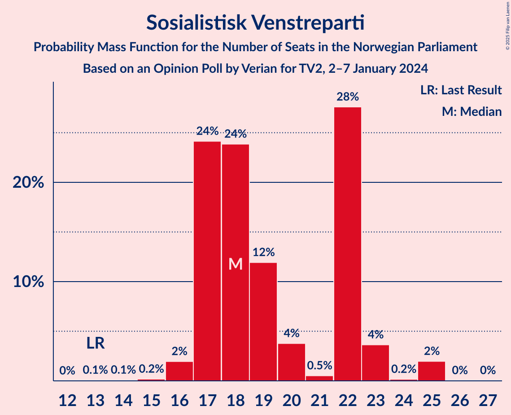
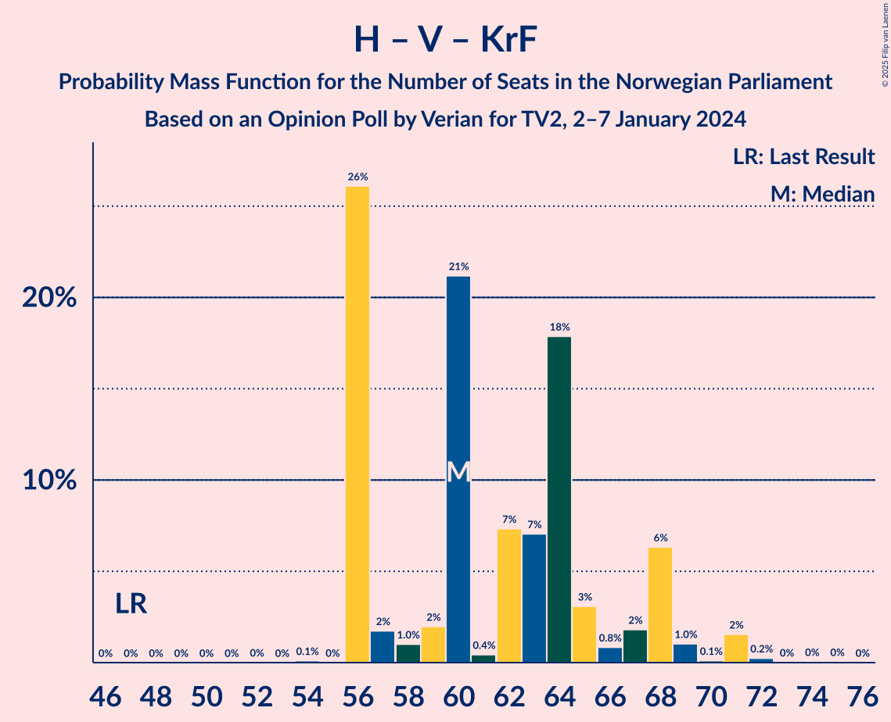

# Opinion Poll by Verian for TV2, 2–7 January 2024

<a href="#voting-intentions">Voting Intentions</a> | <a href="#seats">Seats</a> | <a href="#coalitions">Coalitions</a> | <a href="#technical-information">Technical Information</a>

## Voting Intentions

### Confidence Intervals

| Party | Last Result | Poll Result | 80% Confidence Interval | 90% Confidence Interval | 95% Confidence Interval | 99% Confidence Interval |
|:-----:|:-----------:|:-----------:|:-----------------------:|:-----------------------:|:-----------------------:|:-----------------------:|
| Høyre | 20.4% | 27.3% | 25.5–29.1% |25.0–29.7% |24.6–30.1% |23.7–31.0% |
| Arbeiderpartiet | 26.2% | 19.3% | 17.7–20.9% |17.3–21.4% |16.9–21.8% |16.2–22.7% |
| Fremskrittspartiet | 11.6% | 11.4% | 10.2–12.8% |9.9–13.2% |9.6–13.6% |9.1–14.3% |
| Sosialistisk Venstreparti | 7.6% | 10.7% | 9.6–12.1% |9.2–12.5% |8.9–12.8% |8.4–13.5% |
| Venstre | 4.6% | 7.2% | 6.2–8.4% |6.0–8.7% |5.7–9.0% |5.3–9.6% |
| Senterpartiet | 13.5% | 6.9% | 5.9–8.0% |5.7–8.4% |5.5–8.7% |5.0–9.2% |
| Rødt | 4.7% | 4.8% | 4.0–5.7% |3.8–6.0% |3.6–6.3% |3.3–6.8% |
| Industri- og Næringspartiet | 0.3% | 4.5% | 3.7–5.4% |3.5–5.7% |3.3–5.9% |3.0–6.4% |
| Kristelig Folkeparti | 3.8% | 3.5% | 2.9–4.4% |2.7–4.7% |2.6–4.9% |2.3–5.3% |
| Miljøpartiet De Grønne | 3.9% | 2.9% | 2.3–3.7% |2.2–4.0% |2.1–4.2% |1.8–4.6% |
| Norgesdemokratene | 1.1% | 0.8% | 0.5–1.3% |0.5–1.5% |0.4–1.6% |0.3–1.9% |
| Konservativt | 0.4% | 0.3% | 0.2–0.7% |0.1–0.8% |0.1–0.9% |0.1–1.1% |
| Pensjonistpartiet | 0.6% | 0.2% | 0.1–0.5% |0.1–0.6% |0.1–0.7% |0.0–0.9% |

*Note:* The poll result column reflects the actual value used in the calculations. Published results may vary slightly, and in addition be rounded to fewer digits.

## Seats

### Confidence Intervals

| Party | Last Result | Median | 80% Confidence Interval | 90% Confidence Interval | 95% Confidence Interval | 99% Confidence Interval |
|:-----:|:-----------:|:------:|:-----------------------:|:-----------------------:|:-----------------------:|:-----------------------:|
| <a href="#høyre">Høyre</a> | 36 | 46 | 42–50 |42–53 |41–53 |41–55 |
| <a href="#arbeiderpartiet">Arbeiderpartiet</a> | 48 | 37 | 33–43 |32–43 |32–43 |31–43 |
| <a href="#fremskrittspartiet">Fremskrittspartiet</a> | 21 | 21 | 18–24 |18–24 |18–24 |16–24 |
| <a href="#sosialistisk-venstreparti">Sosialistisk Venstreparti</a> | 13 | 18 | 17–22 |17–23 |17–23 |16–25 |
| <a href="#venstre">Venstre</a> | 8 | 12 | 10–14 |10–16 |10–16 |10–16 |
| <a href="#senterpartiet">Senterpartiet</a> | 28 | 13 | 10–14 |10–14 |10–15 |8–16 |
| <a href="#rødt">Rødt</a> | 8 | 8 | 1–10 |1–10 |1–11 |1–11 |
| <a href="#industri--og-næringspartiet">Industri- og Næringspartiet</a> | 0 | 8 | 3–9 |3–10 |2–10 |2–11 |
| <a href="#kristelig-folkeparti">Kristelig Folkeparti</a> | 3 | 2 | 2–8 |2–8 |2–8 |2–8 |
| <a href="#miljøpartiet-de-grønne">Miljøpartiet De Grønne</a> | 3 | 1 | 1–2 |1–2 |1–2 |1–6 |
| <a href="#norgesdemokratene">Norgesdemokratene</a> | 0 | 0 | 0 |0 |0 |0 |
| <a href="#konservativt">Konservativt</a> | 0 | 0 | 0 |0 |0 |0 |
| <a href="#pensjonistpartiet">Pensjonistpartiet</a> | 0 | 0 | 0 |0 |0 |0 |

### Høyre

*For a full overview of the results for this party, see the [Høyre](party-høyre.html) page.*

| Number of Seats | Probability | Accumulated | Special Marks |
|:---------------:|:-----------:|:-----------:|:-------------:|
| 36 | 0% | 100% | Last Result |
| 37 | 0% | 100% |  |
| 38 | 0% | 100% |  |
| 39 | 0% | 100% |  |
| 40 | 0% | 100% |  |
| 41 | 5% | 100% |  |
| 42 | 26% | 95% |  |
| 43 | 0.4% | 69% |  |
| 44 | 0.3% | 68% |  |
| 45 | 10% | 68% |  |
| 46 | 13% | 58% | Median |
| 47 | 0.7% | 45% |  |
| 48 | 21% | 44% |  |
| 49 | 13% | 23% |  |
| 50 | 0.9% | 11% |  |
| 51 | 0.3% | 10% |  |
| 52 | 2% | 9% |  |
| 53 | 5% | 7% |  |
| 54 | 0.9% | 2% |  |
| 55 | 1.1% | 1.2% |  |
| 56 | 0% | 0.1% |  |
| 57 | 0% | 0.1% |  |
| 58 | 0% | 0% |  |

### Arbeiderpartiet

*For a full overview of the results for this party, see the [Arbeiderpartiet](party-arbeiderpartiet.html) page.*

| Number of Seats | Probability | Accumulated | Special Marks |
|:---------------:|:-----------:|:-----------:|:-------------:|
| 30 | 0.2% | 100% |  |
| 31 | 1.0% | 99.8% |  |
| 32 | 8% | 98.8% |  |
| 33 | 2% | 91% |  |
| 34 | 1.0% | 88% |  |
| 35 | 33% | 87% |  |
| 36 | 4% | 54% |  |
| 37 | 4% | 50% | Median |
| 38 | 2% | 46% |  |
| 39 | 0.2% | 45% |  |
| 40 | 15% | 44% |  |
| 41 | 0.4% | 29% |  |
| 42 | 0.4% | 29% |  |
| 43 | 28% | 28% |  |
| 44 | 0.2% | 0.3% |  |
| 45 | 0.1% | 0.1% |  |
| 46 | 0% | 0% |  |
| 47 | 0% | 0% |  |
| 48 | 0% | 0% | Last Result |

### Fremskrittspartiet

*For a full overview of the results for this party, see the [Fremskrittspartiet](party-fremskrittspartiet.html) page.*

| Number of Seats | Probability | Accumulated | Special Marks |
|:---------------:|:-----------:|:-----------:|:-------------:|
| 16 | 0.7% | 100% |  |
| 17 | 0.3% | 99.3% |  |
| 18 | 14% | 99.0% |  |
| 19 | 0.7% | 85% |  |
| 20 | 11% | 84% |  |
| 21 | 28% | 74% | Last Result, Median |
| 22 | 3% | 46% |  |
| 23 | 16% | 43% |  |
| 24 | 27% | 28% |  |
| 25 | 0.3% | 0.4% |  |
| 26 | 0% | 0.1% |  |
| 27 | 0% | 0% |  |

### Sosialistisk Venstreparti

*For a full overview of the results for this party, see the [Sosialistisk Venstreparti](party-sosialistiskvenstreparti.html) page.*

| Number of Seats | Probability | Accumulated | Special Marks |
|:---------------:|:-----------:|:-----------:|:-------------:|
| 13 | 0.1% | 100% | Last Result |
| 14 | 0.1% | 99.9% |  |
| 15 | 0.2% | 99.8% |  |
| 16 | 2% | 99.6% |  |
| 17 | 24% | 98% |  |
| 18 | 24% | 74% | Median |
| 19 | 12% | 50% |  |
| 20 | 4% | 38% |  |
| 21 | 0.5% | 34% |  |
| 22 | 28% | 33% |  |
| 23 | 4% | 6% |  |
| 24 | 0.2% | 2% |  |
| 25 | 2% | 2% |  |
| 26 | 0% | 0.1% |  |
| 27 | 0% | 0% |  |

### Venstre

*For a full overview of the results for this party, see the [Venstre](party-venstre.html) page.*

| Number of Seats | Probability | Accumulated | Special Marks |
|:---------------:|:-----------:|:-----------:|:-------------:|
| 8 | 0.1% | 100% | Last Result |
| 9 | 0.2% | 99.9% |  |
| 10 | 35% | 99.7% |  |
| 11 | 4% | 65% |  |
| 12 | 32% | 61% | Median |
| 13 | 10% | 29% |  |
| 14 | 10% | 19% |  |
| 15 | 0.2% | 8% |  |
| 16 | 8% | 8% |  |
| 17 | 0.1% | 0.1% |  |
| 18 | 0% | 0% |  |

### Senterpartiet

*For a full overview of the results for this party, see the [Senterpartiet](party-senterpartiet.html) page.*

| Number of Seats | Probability | Accumulated | Special Marks |
|:---------------:|:-----------:|:-----------:|:-------------:|
| 8 | 1.1% | 100% |  |
| 9 | 0.7% | 98.9% |  |
| 10 | 21% | 98% |  |
| 11 | 17% | 77% |  |
| 12 | 5% | 60% |  |
| 13 | 28% | 55% | Median |
| 14 | 24% | 27% |  |
| 15 | 2% | 3% |  |
| 16 | 0.3% | 0.7% |  |
| 17 | 0.2% | 0.4% |  |
| 18 | 0.2% | 0.2% |  |
| 19 | 0% | 0% |  |
| 20 | 0% | 0% |  |
| 21 | 0% | 0% |  |
| 22 | 0% | 0% |  |
| 23 | 0% | 0% |  |
| 24 | 0% | 0% |  |
| 25 | 0% | 0% |  |
| 26 | 0% | 0% |  |
| 27 | 0% | 0% |  |
| 28 | 0% | 0% | Last Result |

### Rødt

*For a full overview of the results for this party, see the [Rødt](party-rødt.html) page.*

| Number of Seats | Probability | Accumulated | Special Marks |
|:---------------:|:-----------:|:-----------:|:-------------:|
| 1 | 14% | 100% |  |
| 2 | 5% | 86% |  |
| 3 | 0% | 82% |  |
| 4 | 0% | 82% |  |
| 5 | 0% | 82% |  |
| 6 | 0% | 82% |  |
| 7 | 21% | 82% |  |
| 8 | 40% | 60% | Last Result, Median |
| 9 | 9% | 20% |  |
| 10 | 8% | 12% |  |
| 11 | 3% | 4% |  |
| 12 | 0.5% | 0.5% |  |
| 13 | 0% | 0% |  |

### Industri- og Næringspartiet

*For a full overview of the results for this party, see the [Industri- og Næringspartiet](party-industri-ognæringspartiet.html) page.*

| Number of Seats | Probability | Accumulated | Special Marks |
|:---------------:|:-----------:|:-----------:|:-------------:|
| 0 | 0% | 100% | Last Result |
| 1 | 0% | 100% |  |
| 2 | 4% | 99.9% |  |
| 3 | 8% | 96% |  |
| 4 | 0% | 88% |  |
| 5 | 0% | 88% |  |
| 6 | 0% | 88% |  |
| 7 | 6% | 88% |  |
| 8 | 63% | 81% | Median |
| 9 | 10% | 18% |  |
| 10 | 7% | 9% |  |
| 11 | 2% | 2% |  |
| 12 | 0% | 0% |  |

### Kristelig Folkeparti

*For a full overview of the results for this party, see the [Kristelig Folkeparti](party-kristeligfolkeparti.html) page.*

| Number of Seats | Probability | Accumulated | Special Marks |
|:---------------:|:-----------:|:-----------:|:-------------:|
| 0 | 0.4% | 100% |  |
| 1 | 0.1% | 99.6% |  |
| 2 | 74% | 99.5% | Median |
| 3 | 8% | 26% | Last Result |
| 4 | 0% | 18% |  |
| 5 | 0% | 18% |  |
| 6 | 0% | 18% |  |
| 7 | 6% | 18% |  |
| 8 | 12% | 12% |  |
| 9 | 0.2% | 0.3% |  |
| 10 | 0.1% | 0.1% |  |
| 11 | 0% | 0% |  |

### Miljøpartiet De Grønne

*For a full overview of the results for this party, see the [Miljøpartiet De Grønne](party-miljøpartietdegrønne.html) page.*

| Number of Seats | Probability | Accumulated | Special Marks |
|:---------------:|:-----------:|:-----------:|:-------------:|
| 0 | 0.3% | 100% |  |
| 1 | 63% | 99.7% | Median |
| 2 | 36% | 37% |  |
| 3 | 0.2% | 0.7% | Last Result |
| 4 | 0% | 0.5% |  |
| 5 | 0% | 0.5% |  |
| 6 | 0% | 0.5% |  |
| 7 | 0.4% | 0.5% |  |
| 8 | 0.1% | 0.1% |  |
| 9 | 0% | 0% |  |

### Norgesdemokratene

*For a full overview of the results for this party, see the [Norgesdemokratene](party-norgesdemokratene.html) page.*

| Number of Seats | Probability | Accumulated | Special Marks |
|:---------------:|:-----------:|:-----------:|:-------------:|
| 0 | 100% | 100% | Last Result, Median |

### Konservativt

*For a full overview of the results for this party, see the [Konservativt](party-konservativt.html) page.*

| Number of Seats | Probability | Accumulated | Special Marks |
|:---------------:|:-----------:|:-----------:|:-------------:|
| 0 | 100% | 100% | Last Result, Median |

### Pensjonistpartiet

*For a full overview of the results for this party, see the [Pensjonistpartiet](party-pensjonistpartiet.html) page.*

| Number of Seats | Probability | Accumulated | Special Marks |
|:---------------:|:-----------:|:-----------:|:-------------:|
| 0 | 100% | 100% | Last Result, Median |

## Coalitions

### Confidence Intervals

| Coalition | Last Result | Median | Majority? | 80% Confidence Interval | 90% Confidence Interval | 95% Confidence Interval | 99% Confidence Interval |
|:---------:|:-----------:|:------:|:---------:|:-----------------------:|:-----------------------:|:-----------------------:|:-----------------------:|
| Høyre – Fremskrittspartiet – Venstre – Senterpartiet – Kristelig Folkeparti | 96 | 94 | 99.9% | 91–100 | 91–104 | 88–104 | 88–106 |
| Høyre – Fremskrittspartiet – Venstre – Kristelig Folkeparti – Miljøpartiet De Grønne | 71 | 83 | 27% | 81–88 | 81–92 | 80–92 | 79–93 |
| Høyre – Fremskrittspartiet – Venstre – Kristelig Folkeparti | 68 | 81 | 22% | 80–87 | 80–91 | 78–91 | 77–91 |
| Høyre – Fremskrittspartiet – Venstre | 65 | 79 | 8% | 76–84 | 76–88 | 75–88 | 73–89 |
| Arbeiderpartiet – Sosialistisk Venstreparti – Senterpartiet – Rødt – Miljøpartiet De Grønne | 100 | 79 | 0.4% | 73–82 | 68–82 | 67–83 | 67–84 |
| Arbeiderpartiet – Sosialistisk Venstreparti – Senterpartiet – Rødt | 97 | 77 | 0.1% | 72–80 | 67–81 | 66–81 | 66–83 |
| Arbeiderpartiet – Sosialistisk Venstreparti – Senterpartiet – Kristelig Folkeparti – Miljøpartiet De Grønne | 95 | 74 | 0% | 69–80 | 68–80 | 67–80 | 67–83 |
| Høyre – Fremskrittspartiet | 57 | 67 | 0% | 65–71 | 62–75 | 62–76 | 61–76 |
| Arbeiderpartiet – Sosialistisk Venstreparti – Senterpartiet – Miljøpartiet De Grønne | 92 | 72 | 0% | 67–74 | 65–74 | 64–75 | 61–76 |
| Arbeiderpartiet – Sosialistisk Venstreparti – Senterpartiet | 89 | 70 | 0% | 65–72 | 64–73 | 63–73 | 59–75 |
| Arbeiderpartiet – Sosialistisk Venstreparti – Rødt – Miljøpartiet De Grønne | 72 | 66 | 0% | 60–70 | 58–71 | 54–72 | 54–73 |
| Høyre – Venstre – Kristelig Folkeparti | 47 | 60 | 0% | 56–67 | 56–68 | 56–69 | 56–71 |
| Arbeiderpartiet – Sosialistisk Venstreparti | 61 | 57 | 0% | 53–60 | 51–62 | 51–62 | 49–63 |
| Arbeiderpartiet – Senterpartiet – Kristelig Folkeparti – Miljøpartiet De Grønne | 82 | 52 | 0% | 49–62 | 49–62 | 47–62 | 46–63 |
| Arbeiderpartiet – Senterpartiet – Kristelig Folkeparti | 79 | 51 | 0% | 48–61 | 48–61 | 46–61 | 44–61 |
| Arbeiderpartiet – Senterpartiet | 76 | 49 | 0% | 45–53 | 45–54 | 43–54 | 42–56 |
| Venstre – Senterpartiet – Kristelig Folkeparti | 39 | 28 | 0% | 22–31 | 22–32 | 22–32 | 21–34 |

### Høyre – Fremskrittspartiet – Venstre – Senterpartiet – Kristelig Folkeparti

| Number of Seats | Probability | Accumulated | Special Marks |
|:---------------:|:-----------:|:-----------:|:-------------:|
| 83 | 0.1% | 100% |  |
| 84 | 0% | 99.9% |  |
| 85 | 0.1% | 99.9% | Majority |
| 86 | 0.1% | 99.8% |  |
| 87 | 0% | 99.7% |  |
| 88 | 2% | 99.7% |  |
| 89 | 0.2% | 97% |  |
| 90 | 0.6% | 97% |  |
| 91 | 21% | 97% |  |
| 92 | 6% | 76% |  |
| 93 | 0.4% | 70% |  |
| 94 | 33% | 70% | Median |
| 95 | 10% | 36% |  |
| 96 | 4% | 26% | Last Result |
| 97 | 0.2% | 23% |  |
| 98 | 0.3% | 23% |  |
| 99 | 2% | 22% |  |
| 100 | 13% | 21% |  |
| 101 | 1.4% | 8% |  |
| 102 | 0.3% | 7% |  |
| 103 | 0.1% | 6% |  |
| 104 | 5% | 6% |  |
| 105 | 0.3% | 2% |  |
| 106 | 1.1% | 1.2% |  |
| 107 | 0.1% | 0.1% |  |
| 108 | 0% | 0% |  |

### Høyre – Fremskrittspartiet – Venstre – Kristelig Folkeparti – Miljøpartiet De Grønne

| Number of Seats | Probability | Accumulated | Special Marks |
|:---------------:|:-----------:|:-----------:|:-------------:|
| 71 | 0% | 100% | Last Result |
| 72 | 0% | 100% |  |
| 73 | 0.1% | 100% |  |
| 74 | 0% | 99.9% |  |
| 75 | 0.1% | 99.9% |  |
| 76 | 0% | 99.8% |  |
| 77 | 0% | 99.8% |  |
| 78 | 0% | 99.8% |  |
| 79 | 2% | 99.7% |  |
| 80 | 2% | 98% |  |
| 81 | 26% | 96% |  |
| 82 | 1.0% | 70% | Median |
| 83 | 21% | 69% |  |
| 84 | 21% | 47% |  |
| 85 | 3% | 27% | Majority |
| 86 | 1.3% | 24% |  |
| 87 | 2% | 23% |  |
| 88 | 12% | 21% |  |
| 89 | 0.6% | 9% |  |
| 90 | 0.3% | 8% |  |
| 91 | 1.0% | 8% |  |
| 92 | 5% | 7% |  |
| 93 | 2% | 2% |  |
| 94 | 0.1% | 0.3% |  |
| 95 | 0.1% | 0.1% |  |
| 96 | 0% | 0.1% |  |
| 97 | 0% | 0% |  |

### Høyre – Fremskrittspartiet – Venstre – Kristelig Folkeparti

| Number of Seats | Probability | Accumulated | Special Marks |
|:---------------:|:-----------:|:-----------:|:-------------:|
| 68 | 0% | 100% | Last Result |
| 69 | 0% | 100% |  |
| 70 | 0% | 100% |  |
| 71 | 0% | 100% |  |
| 72 | 0.1% | 100% |  |
| 73 | 0.1% | 99.9% |  |
| 74 | 0% | 99.8% |  |
| 75 | 0.1% | 99.8% |  |
| 76 | 0% | 99.7% |  |
| 77 | 2% | 99.6% |  |
| 78 | 2% | 98% |  |
| 79 | 0.5% | 96% |  |
| 80 | 26% | 95% |  |
| 81 | 21% | 69% | Median |
| 82 | 8% | 48% |  |
| 83 | 14% | 40% |  |
| 84 | 4% | 26% |  |
| 85 | 0.3% | 22% | Majority |
| 86 | 2% | 22% |  |
| 87 | 12% | 20% |  |
| 88 | 0.6% | 9% |  |
| 89 | 0.9% | 8% |  |
| 90 | 0.2% | 7% |  |
| 91 | 7% | 7% |  |
| 92 | 0.1% | 0.3% |  |
| 93 | 0.1% | 0.1% |  |
| 94 | 0% | 0% |  |

### Høyre – Fremskrittspartiet – Venstre

| Number of Seats | Probability | Accumulated | Special Marks |
|:---------------:|:-----------:|:-----------:|:-------------:|
| 65 | 0% | 100% | Last Result |
| 66 | 0% | 100% |  |
| 67 | 0% | 100% |  |
| 68 | 0% | 100% |  |
| 69 | 0% | 100% |  |
| 70 | 0.1% | 100% |  |
| 71 | 0.1% | 99.9% |  |
| 72 | 0.1% | 99.8% |  |
| 73 | 0.8% | 99.7% |  |
| 74 | 0.2% | 98.9% |  |
| 75 | 2% | 98.7% |  |
| 76 | 7% | 97% |  |
| 77 | 0.2% | 90% |  |
| 78 | 26% | 90% |  |
| 79 | 31% | 63% | Median |
| 80 | 8% | 33% |  |
| 81 | 12% | 24% |  |
| 82 | 1.4% | 13% |  |
| 83 | 0.5% | 11% |  |
| 84 | 2% | 11% |  |
| 85 | 1.2% | 8% | Majority |
| 86 | 0.2% | 7% |  |
| 87 | 0.9% | 7% |  |
| 88 | 5% | 6% |  |
| 89 | 1.3% | 1.4% |  |
| 90 | 0% | 0.1% |  |
| 91 | 0% | 0% |  |

### Arbeiderpartiet – Sosialistisk Venstreparti – Senterpartiet – Rødt – Miljøpartiet De Grønne

| Number of Seats | Probability | Accumulated | Special Marks |
|:---------------:|:-----------:|:-----------:|:-------------:|
| 67 | 5% | 100% |  |
| 68 | 0.7% | 95% |  |
| 69 | 0.1% | 95% |  |
| 70 | 0% | 95% |  |
| 71 | 2% | 94% |  |
| 72 | 0.2% | 93% |  |
| 73 | 11% | 93% |  |
| 74 | 0.2% | 81% |  |
| 75 | 3% | 81% |  |
| 76 | 0.3% | 78% |  |
| 77 | 11% | 77% | Median |
| 78 | 6% | 67% |  |
| 79 | 21% | 61% |  |
| 80 | 28% | 40% |  |
| 81 | 2% | 12% |  |
| 82 | 7% | 10% |  |
| 83 | 2% | 3% |  |
| 84 | 0.6% | 0.9% |  |
| 85 | 0.2% | 0.4% | Majority |
| 86 | 0.1% | 0.2% |  |
| 87 | 0% | 0% |  |
| 88 | 0% | 0% |  |
| 89 | 0% | 0% |  |
| 90 | 0% | 0% |  |
| 91 | 0% | 0% |  |
| 92 | 0% | 0% |  |
| 93 | 0% | 0% |  |
| 94 | 0% | 0% |  |
| 95 | 0% | 0% |  |
| 96 | 0% | 0% |  |
| 97 | 0% | 0% |  |
| 98 | 0% | 0% |  |
| 99 | 0% | 0% |  |
| 100 | 0% | 0% | Last Result |

### Arbeiderpartiet – Sosialistisk Venstreparti – Senterpartiet – Rødt

| Number of Seats | Probability | Accumulated | Special Marks |
|:---------------:|:-----------:|:-----------:|:-------------:|
| 65 | 0% | 100% |  |
| 66 | 5% | 99.9% |  |
| 67 | 0.6% | 95% |  |
| 68 | 0% | 94% |  |
| 69 | 0.1% | 94% |  |
| 70 | 2% | 94% |  |
| 71 | 0.2% | 93% |  |
| 72 | 11% | 92% |  |
| 73 | 2% | 81% |  |
| 74 | 2% | 80% |  |
| 75 | 8% | 77% |  |
| 76 | 3% | 69% | Median |
| 77 | 26% | 66% |  |
| 78 | 3% | 40% |  |
| 79 | 27% | 38% |  |
| 80 | 0.4% | 10% |  |
| 81 | 9% | 10% |  |
| 82 | 0% | 0.8% |  |
| 83 | 0.6% | 0.8% |  |
| 84 | 0.1% | 0.2% |  |
| 85 | 0.1% | 0.1% | Majority |
| 86 | 0% | 0% |  |
| 87 | 0% | 0% |  |
| 88 | 0% | 0% |  |
| 89 | 0% | 0% |  |
| 90 | 0% | 0% |  |
| 91 | 0% | 0% |  |
| 92 | 0% | 0% |  |
| 93 | 0% | 0% |  |
| 94 | 0% | 0% |  |
| 95 | 0% | 0% |  |
| 96 | 0% | 0% |  |
| 97 | 0% | 0% | Last Result |

### Arbeiderpartiet – Sosialistisk Venstreparti – Senterpartiet – Kristelig Folkeparti – Miljøpartiet De Grønne

| Number of Seats | Probability | Accumulated | Special Marks |
|:---------------:|:-----------:|:-----------:|:-------------:|
| 64 | 0% | 100% |  |
| 65 | 0% | 99.9% |  |
| 66 | 0.2% | 99.9% |  |
| 67 | 2% | 99.8% |  |
| 68 | 6% | 97% |  |
| 69 | 3% | 91% |  |
| 70 | 8% | 88% |  |
| 71 | 1.4% | 81% | Median |
| 72 | 6% | 79% |  |
| 73 | 0.7% | 74% |  |
| 74 | 44% | 73% |  |
| 75 | 2% | 29% |  |
| 76 | 8% | 27% |  |
| 77 | 7% | 19% |  |
| 78 | 0.3% | 12% |  |
| 79 | 0.2% | 12% |  |
| 80 | 11% | 12% |  |
| 81 | 0.2% | 0.8% |  |
| 82 | 0.1% | 0.6% |  |
| 83 | 0.1% | 0.5% |  |
| 84 | 0.4% | 0.4% |  |
| 85 | 0% | 0% | Majority |
| 86 | 0% | 0% |  |
| 87 | 0% | 0% |  |
| 88 | 0% | 0% |  |
| 89 | 0% | 0% |  |
| 90 | 0% | 0% |  |
| 91 | 0% | 0% |  |
| 92 | 0% | 0% |  |
| 93 | 0% | 0% |  |
| 94 | 0% | 0% |  |
| 95 | 0% | 0% | Last Result |

### Høyre – Fremskrittspartiet

| Number of Seats | Probability | Accumulated | Special Marks |
|:---------------:|:-----------:|:-----------:|:-------------:|
| 57 | 0% | 100% | Last Result |
| 58 | 0% | 100% |  |
| 59 | 0.1% | 100% |  |
| 60 | 0.1% | 99.8% |  |
| 61 | 0.3% | 99.7% |  |
| 62 | 5% | 99.4% |  |
| 63 | 1.0% | 95% |  |
| 64 | 2% | 94% |  |
| 65 | 7% | 92% |  |
| 66 | 28% | 85% |  |
| 67 | 10% | 57% | Median |
| 68 | 0.6% | 47% |  |
| 69 | 34% | 46% |  |
| 70 | 2% | 12% |  |
| 71 | 2% | 10% |  |
| 72 | 0.9% | 8% |  |
| 73 | 0.2% | 7% |  |
| 74 | 0.9% | 7% |  |
| 75 | 1.4% | 6% |  |
| 76 | 5% | 5% |  |
| 77 | 0.1% | 0.1% |  |
| 78 | 0% | 0% |  |

### Arbeiderpartiet – Sosialistisk Venstreparti – Senterpartiet – Miljøpartiet De Grønne

| Number of Seats | Probability | Accumulated | Special Marks |
|:---------------:|:-----------:|:-----------:|:-------------:|
| 60 | 0.5% | 100% |  |
| 61 | 0.2% | 99.5% |  |
| 62 | 0% | 99.3% |  |
| 63 | 0.1% | 99.3% |  |
| 64 | 2% | 99.2% |  |
| 65 | 6% | 97% |  |
| 66 | 1.0% | 92% |  |
| 67 | 3% | 91% |  |
| 68 | 8% | 87% |  |
| 69 | 1.3% | 79% | Median |
| 70 | 10% | 78% |  |
| 71 | 0.3% | 68% |  |
| 72 | 55% | 68% |  |
| 73 | 2% | 13% |  |
| 74 | 8% | 11% |  |
| 75 | 2% | 3% |  |
| 76 | 0.5% | 0.9% |  |
| 77 | 0.1% | 0.3% |  |
| 78 | 0.1% | 0.3% |  |
| 79 | 0.1% | 0.1% |  |
| 80 | 0% | 0% |  |
| 81 | 0% | 0% |  |
| 82 | 0% | 0% |  |
| 83 | 0% | 0% |  |
| 84 | 0% | 0% |  |
| 85 | 0% | 0% | Majority |
| 86 | 0% | 0% |  |
| 87 | 0% | 0% |  |
| 88 | 0% | 0% |  |
| 89 | 0% | 0% |  |
| 90 | 0% | 0% |  |
| 91 | 0% | 0% |  |
| 92 | 0% | 0% | Last Result |

### Arbeiderpartiet – Sosialistisk Venstreparti – Senterpartiet

| Number of Seats | Probability | Accumulated | Special Marks |
|:---------------:|:-----------:|:-----------:|:-------------:|
| 59 | 0.7% | 100% |  |
| 60 | 0% | 99.3% |  |
| 61 | 0.1% | 99.3% |  |
| 62 | 0.2% | 99.2% |  |
| 63 | 2% | 99.0% |  |
| 64 | 6% | 97% |  |
| 65 | 0.8% | 91% |  |
| 66 | 10% | 90% |  |
| 67 | 1.0% | 80% |  |
| 68 | 1.4% | 79% | Median |
| 69 | 10% | 78% |  |
| 70 | 22% | 67% |  |
| 71 | 34% | 45% |  |
| 72 | 2% | 11% |  |
| 73 | 9% | 10% |  |
| 74 | 0.1% | 0.8% |  |
| 75 | 0.5% | 0.7% |  |
| 76 | 0.2% | 0.2% |  |
| 77 | 0% | 0% |  |
| 78 | 0% | 0% |  |
| 79 | 0% | 0% |  |
| 80 | 0% | 0% |  |
| 81 | 0% | 0% |  |
| 82 | 0% | 0% |  |
| 83 | 0% | 0% |  |
| 84 | 0% | 0% |  |
| 85 | 0% | 0% | Majority |
| 86 | 0% | 0% |  |
| 87 | 0% | 0% |  |
| 88 | 0% | 0% |  |
| 89 | 0% | 0% | Last Result |

### Arbeiderpartiet – Sosialistisk Venstreparti – Rødt – Miljøpartiet De Grønne

| Number of Seats | Probability | Accumulated | Special Marks |
|:---------------:|:-----------:|:-----------:|:-------------:|
| 54 | 5% | 100% |  |
| 55 | 0% | 95% |  |
| 56 | 0.1% | 95% |  |
| 57 | 0.1% | 95% |  |
| 58 | 2% | 95% |  |
| 59 | 0.1% | 93% |  |
| 60 | 12% | 93% |  |
| 61 | 0.3% | 81% |  |
| 62 | 0.3% | 80% |  |
| 63 | 0.6% | 80% |  |
| 64 | 12% | 79% | Median |
| 65 | 0.5% | 68% |  |
| 66 | 26% | 67% |  |
| 67 | 5% | 41% |  |
| 68 | 4% | 37% |  |
| 69 | 21% | 32% |  |
| 70 | 2% | 11% |  |
| 71 | 7% | 10% |  |
| 72 | 2% | 3% | Last Result |
| 73 | 0.3% | 0.6% |  |
| 74 | 0.1% | 0.2% |  |
| 75 | 0% | 0.1% |  |
| 76 | 0.1% | 0.1% |  |
| 77 | 0% | 0% |  |

### Høyre – Venstre – Kristelig Folkeparti

| Number of Seats | Probability | Accumulated | Special Marks |
|:---------------:|:-----------:|:-----------:|:-------------:|
| 47 | 0% | 100% | Last Result |
| 48 | 0% | 100% |  |
| 49 | 0% | 100% |  |
| 50 | 0% | 100% |  |
| 51 | 0% | 100% |  |
| 52 | 0% | 100% |  |
| 53 | 0% | 100% |  |
| 54 | 0.1% | 100% |  |
| 55 | 0% | 99.9% |  |
| 56 | 26% | 99.9% |  |
| 57 | 2% | 74% |  |
| 58 | 1.0% | 72% |  |
| 59 | 2% | 71% |  |
| 60 | 21% | 69% | Median |
| 61 | 0.4% | 48% |  |
| 62 | 7% | 47% |  |
| 63 | 7% | 40% |  |
| 64 | 18% | 33% |  |
| 65 | 3% | 15% |  |
| 66 | 0.8% | 12% |  |
| 67 | 2% | 11% |  |
| 68 | 6% | 9% |  |
| 69 | 1.0% | 3% |  |
| 70 | 0.1% | 2% |  |
| 71 | 2% | 2% |  |
| 72 | 0.2% | 0.4% |  |
| 73 | 0% | 0.1% |  |
| 74 | 0% | 0.1% |  |
| 75 | 0% | 0.1% |  |
| 76 | 0% | 0% |  |

### Arbeiderpartiet – Sosialistisk Venstreparti

| Number of Seats | Probability | Accumulated | Special Marks |
|:---------------:|:-----------:|:-----------:|:-------------:|
| 48 | 0.1% | 100% |  |
| 49 | 0.9% | 99.9% |  |
| 50 | 0.2% | 99.0% |  |
| 51 | 6% | 98.7% |  |
| 52 | 2% | 93% |  |
| 53 | 10% | 91% |  |
| 54 | 0.4% | 80% |  |
| 55 | 2% | 80% | Median |
| 56 | 3% | 78% |  |
| 57 | 27% | 75% |  |
| 58 | 16% | 48% |  |
| 59 | 0.9% | 32% |  |
| 60 | 22% | 31% |  |
| 61 | 0.4% | 10% | Last Result |
| 62 | 8% | 9% |  |
| 63 | 0.5% | 0.7% |  |
| 64 | 0.1% | 0.2% |  |
| 65 | 0% | 0.1% |  |
| 66 | 0% | 0% |  |

### Arbeiderpartiet – Senterpartiet – Kristelig Folkeparti – Miljøpartiet De Grønne

| Number of Seats | Probability | Accumulated | Special Marks |
|:---------------:|:-----------:|:-----------:|:-------------:|
| 46 | 1.1% | 100% |  |
| 47 | 2% | 98.8% |  |
| 48 | 1.2% | 97% |  |
| 49 | 6% | 96% |  |
| 50 | 4% | 89% |  |
| 51 | 0.9% | 85% |  |
| 52 | 35% | 85% |  |
| 53 | 0.9% | 50% | Median |
| 54 | 1.2% | 49% |  |
| 55 | 0.2% | 48% |  |
| 56 | 3% | 48% |  |
| 57 | 27% | 44% |  |
| 58 | 0.6% | 17% |  |
| 59 | 5% | 16% |  |
| 60 | 0.4% | 12% |  |
| 61 | 0.2% | 11% |  |
| 62 | 11% | 11% |  |
| 63 | 0.1% | 0.6% |  |
| 64 | 0.1% | 0.5% |  |
| 65 | 0% | 0.4% |  |
| 66 | 0.1% | 0.4% |  |
| 67 | 0.4% | 0.4% |  |
| 68 | 0% | 0% |  |
| 69 | 0% | 0% |  |
| 70 | 0% | 0% |  |
| 71 | 0% | 0% |  |
| 72 | 0% | 0% |  |
| 73 | 0% | 0% |  |
| 74 | 0% | 0% |  |
| 75 | 0% | 0% |  |
| 76 | 0% | 0% |  |
| 77 | 0% | 0% |  |
| 78 | 0% | 0% |  |
| 79 | 0% | 0% |  |
| 80 | 0% | 0% |  |
| 81 | 0% | 0% |  |
| 82 | 0% | 0% | Last Result |

### Arbeiderpartiet – Senterpartiet – Kristelig Folkeparti

| Number of Seats | Probability | Accumulated | Special Marks |
|:---------------:|:-----------:|:-----------:|:-------------:|
| 44 | 0.9% | 100% |  |
| 45 | 0.1% | 99.0% |  |
| 46 | 3% | 98.9% |  |
| 47 | 1.0% | 96% |  |
| 48 | 6% | 95% |  |
| 49 | 4% | 89% |  |
| 50 | 10% | 85% |  |
| 51 | 26% | 75% |  |
| 52 | 0.8% | 49% | Median |
| 53 | 0.7% | 48% |  |
| 54 | 3% | 47% |  |
| 55 | 20% | 45% |  |
| 56 | 8% | 24% |  |
| 57 | 0.1% | 16% |  |
| 58 | 5% | 16% |  |
| 59 | 0.2% | 11% |  |
| 60 | 0.1% | 11% |  |
| 61 | 11% | 11% |  |
| 62 | 0% | 0.4% |  |
| 63 | 0% | 0.4% |  |
| 64 | 0% | 0.4% |  |
| 65 | 0% | 0.4% |  |
| 66 | 0.4% | 0.4% |  |
| 67 | 0% | 0% |  |
| 68 | 0% | 0% |  |
| 69 | 0% | 0% |  |
| 70 | 0% | 0% |  |
| 71 | 0% | 0% |  |
| 72 | 0% | 0% |  |
| 73 | 0% | 0% |  |
| 74 | 0% | 0% |  |
| 75 | 0% | 0% |  |
| 76 | 0% | 0% |  |
| 77 | 0% | 0% |  |
| 78 | 0% | 0% |  |
| 79 | 0% | 0% | Last Result |

### Arbeiderpartiet – Senterpartiet

| Number of Seats | Probability | Accumulated | Special Marks |
|:---------------:|:-----------:|:-----------:|:-------------:|
| 41 | 0% | 100% |  |
| 42 | 1.0% | 99.9% |  |
| 43 | 3% | 98.9% |  |
| 44 | 0.4% | 96% |  |
| 45 | 6% | 96% |  |
| 46 | 2% | 90% |  |
| 47 | 4% | 88% |  |
| 48 | 11% | 84% |  |
| 49 | 26% | 73% |  |
| 50 | 0.6% | 48% | Median |
| 51 | 6% | 47% |  |
| 52 | 3% | 41% |  |
| 53 | 31% | 39% |  |
| 54 | 7% | 8% |  |
| 55 | 0.1% | 0.6% |  |
| 56 | 0% | 0.5% |  |
| 57 | 0% | 0.5% |  |
| 58 | 0.4% | 0.4% |  |
| 59 | 0% | 0% |  |
| 60 | 0% | 0% |  |
| 61 | 0% | 0% |  |
| 62 | 0% | 0% |  |
| 63 | 0% | 0% |  |
| 64 | 0% | 0% |  |
| 65 | 0% | 0% |  |
| 66 | 0% | 0% |  |
| 67 | 0% | 0% |  |
| 68 | 0% | 0% |  |
| 69 | 0% | 0% |  |
| 70 | 0% | 0% |  |
| 71 | 0% | 0% |  |
| 72 | 0% | 0% |  |
| 73 | 0% | 0% |  |
| 74 | 0% | 0% |  |
| 75 | 0% | 0% |  |
| 76 | 0% | 0% | Last Result |

### Venstre – Senterpartiet – Kristelig Folkeparti

| Number of Seats | Probability | Accumulated | Special Marks |
|:---------------:|:-----------:|:-----------:|:-------------:|
| 20 | 0.3% | 100% |  |
| 21 | 0.6% | 99.7% |  |
| 22 | 20% | 99.1% |  |
| 23 | 0.2% | 79% |  |
| 24 | 4% | 79% |  |
| 25 | 0.4% | 74% |  |
| 26 | 7% | 74% |  |
| 27 | 0.8% | 67% | Median |
| 28 | 34% | 66% |  |
| 29 | 12% | 32% |  |
| 30 | 0.7% | 20% |  |
| 31 | 13% | 19% |  |
| 32 | 5% | 7% |  |
| 33 | 0.6% | 1.2% |  |
| 34 | 0.4% | 0.7% |  |
| 35 | 0% | 0.2% |  |
| 36 | 0.1% | 0.2% |  |
| 37 | 0.1% | 0.1% |  |
| 38 | 0% | 0% |  |
| 39 | 0% | 0% | Last Result |

## Technical Information

### Opinion Poll

+ **Polling firm:** Verian
+ **Commissioner(s):** TV2
+ **Fieldwork period:** 2–7 January 2024

### Calculations

+ **Sample size:** 987
+ **Simulations done:** 1,048,576
+ **Error estimate:** 3.35%

