# Opinion Poll by Opinion Perduco for Dagsavisen, Fagbladet and FriFagbevegelse, 2–8 January 2024

<a href="#voting-intentions">Voting Intentions</a> | <a href="#seats">Seats</a> | <a href="#coalitions">Coalitions</a> | <a href="#technical-information">Technical Information</a>

## Voting Intentions

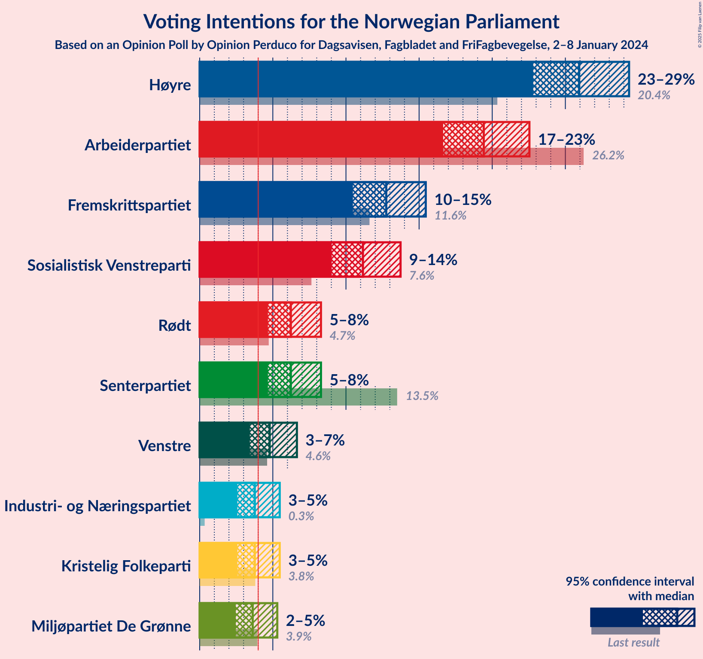

### Confidence Intervals

| Party | Last Result | Poll Result | 80% Confidence Interval | 90% Confidence Interval | 95% Confidence Interval | 99% Confidence Interval |
|:-----:|:-----------:|:-----------:|:-----------------------:|:-----------------------:|:-----------------------:|:-----------------------:|
| Høyre | 20.4% | 25.9% | 23.9–28.2% |23.3–28.8% |22.8–29.4% |21.8–30.4% |
| Arbeiderpartiet | 26.2% | 19.4% | 17.6–21.5% |17.1–22.0% |16.6–22.5% |15.8–23.5% |
| Fremskrittspartiet | 11.6% | 12.8% | 11.2–14.5% |10.8–15.0% |10.5–15.5% |9.8–16.3% |
| Sosialistisk Venstreparti | 7.6% | 11.2% | 9.8–12.8% |9.4–13.3% |9.0–13.7% |8.4–14.6% |
| Rødt | 4.7% | 6.2% | 5.2–7.6% |4.9–8.0% |4.7–8.3% |4.2–9.0% |
| Senterpartiet | 13.5% | 6.2% | 5.2–7.6% |4.9–8.0% |4.7–8.3% |4.2–9.0% |
| Venstre | 4.6% | 4.8% | 3.9–6.0% |3.6–6.3% |3.4–6.6% |3.0–7.3% |
| Kristelig Folkeparti | 3.8% | 3.8% | 3.0–4.9% |2.8–5.2% |2.6–5.5% |2.3–6.1% |
| Industri- og Næringspartiet | 0.3% | 3.8% | 3.0–4.9% |2.8–5.2% |2.6–5.5% |2.3–6.1% |
| Miljøpartiet De Grønne | 3.9% | 3.6% | 2.9–4.7% |2.6–5.0% |2.5–5.3% |2.1–5.9% |

*Note:* The poll result column reflects the actual value used in the calculations. Published results may vary slightly, and in addition be rounded to fewer digits.

## Seats

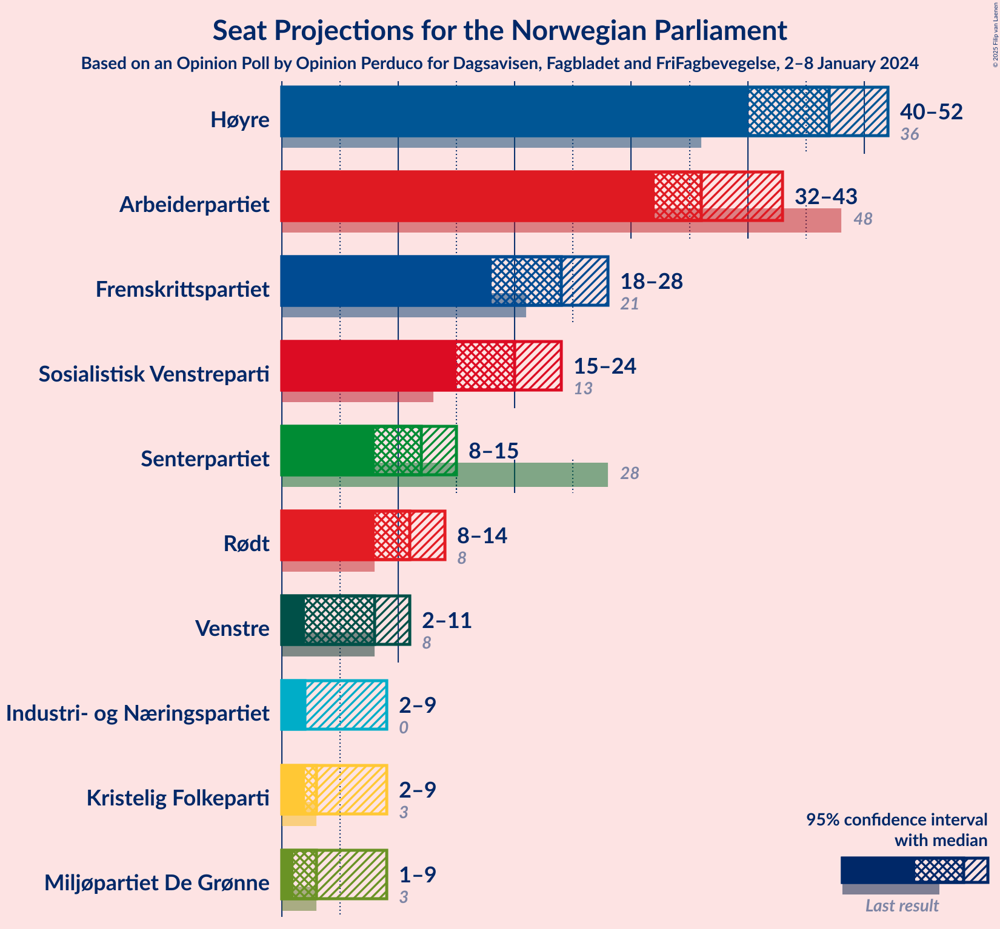

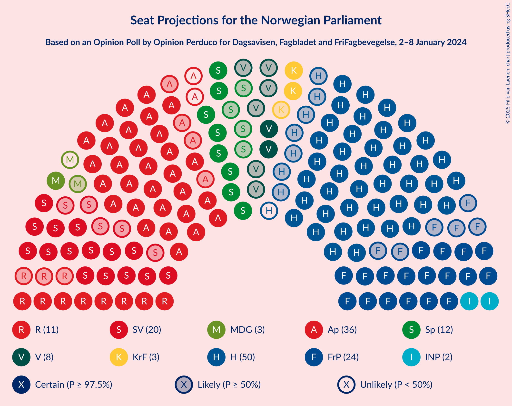

### Confidence Intervals

| Party | Last Result | Median | 80% Confidence Interval | 90% Confidence Interval | 95% Confidence Interval | 99% Confidence Interval |
|:-----:|:-----------:|:------:|:-----------------------:|:-----------------------:|:-----------------------:|:-----------------------:|
| <a href="#høyre">Høyre</a> | 36 | 47 | 42–50 |41–51 |40–52 |39–56 |
| <a href="#arbeiderpartiet">Arbeiderpartiet</a> | 48 | 36 | 34–41 |33–42 |32–43 |31–46 |
| <a href="#fremskrittspartiet">Fremskrittspartiet</a> | 21 | 24 | 20–25 |19–28 |18–28 |17–30 |
| <a href="#sosialistisk-venstreparti">Sosialistisk Venstreparti</a> | 13 | 20 | 17–22 |16–22 |15–24 |14–25 |
| <a href="#rødt">Rødt</a> | 8 | 11 | 9–13 |8–14 |8–14 |7–15 |
| <a href="#senterpartiet">Senterpartiet</a> | 28 | 12 | 9–13 |8–14 |8–15 |7–17 |
| <a href="#venstre">Venstre</a> | 8 | 8 | 3–11 |3–11 |2–11 |2–13 |
| <a href="#kristelig-folkeparti">Kristelig Folkeparti</a> | 3 | 3 | 2–8 |2–8 |2–9 |0–10 |
| <a href="#industri--og-næringspartiet">Industri- og Næringspartiet</a> | 0 | 2 | 2–8 |2–9 |2–9 |0–10 |
| <a href="#miljøpartiet-de-grønne">Miljøpartiet De Grønne</a> | 3 | 3 | 2–8 |1–9 |1–9 |1–10 |

### Høyre

*For a full overview of the results for this party, see the [Høyre](party-høyre.html) page.*

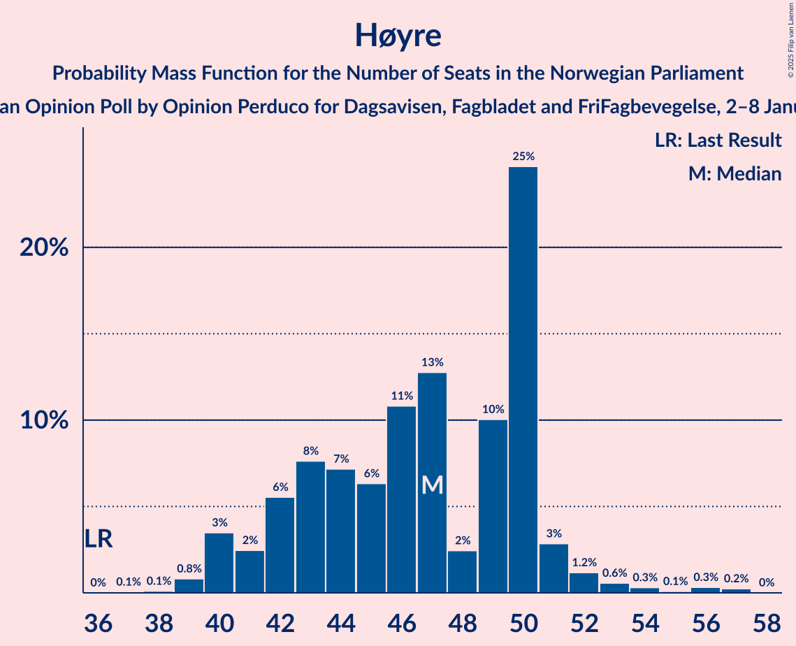

| Number of Seats | Probability | Accumulated | Special Marks |
|:---------------:|:-----------:|:-----------:|:-------------:|
| 36 | 0% | 100% | Last Result |
| 37 | 0.1% | 100% |  |
| 38 | 0.1% | 99.9% |  |
| 39 | 0.8% | 99.8% |  |
| 40 | 3% | 99.0% |  |
| 41 | 2% | 96% |  |
| 42 | 6% | 93% |  |
| 43 | 8% | 88% |  |
| 44 | 7% | 80% |  |
| 45 | 6% | 73% |  |
| 46 | 11% | 66% |  |
| 47 | 13% | 56% | Median |
| 48 | 2% | 43% |  |
| 49 | 10% | 40% |  |
| 50 | 25% | 30% |  |
| 51 | 3% | 6% |  |
| 52 | 1.2% | 3% |  |
| 53 | 0.6% | 2% |  |
| 54 | 0.3% | 1.0% |  |
| 55 | 0.1% | 0.7% |  |
| 56 | 0.3% | 0.6% |  |
| 57 | 0.2% | 0.3% |  |
| 58 | 0% | 0% |  |

### Arbeiderpartiet

*For a full overview of the results for this party, see the [Arbeiderpartiet](party-arbeiderpartiet.html) page.*

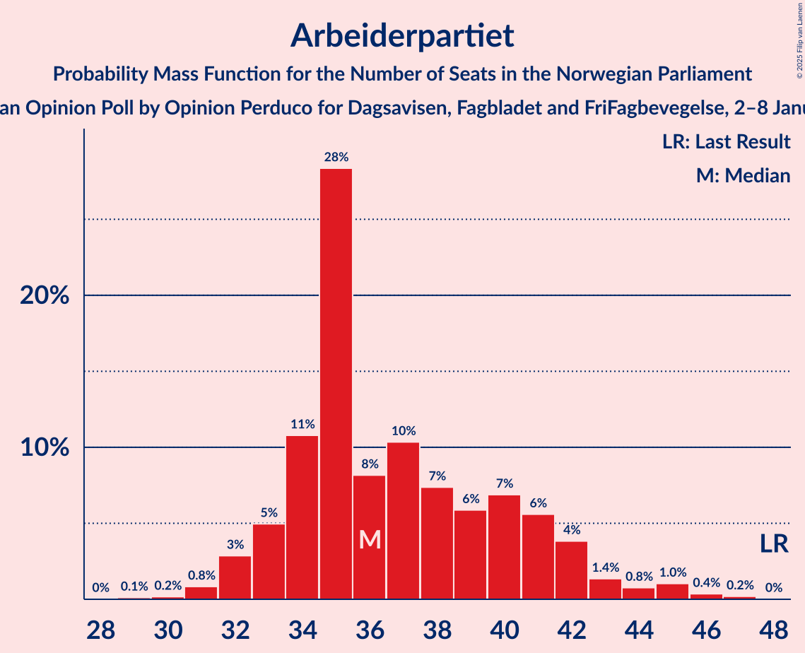

| Number of Seats | Probability | Accumulated | Special Marks |
|:---------------:|:-----------:|:-----------:|:-------------:|
| 29 | 0.1% | 100% |  |
| 30 | 0.2% | 99.8% |  |
| 31 | 0.8% | 99.7% |  |
| 32 | 3% | 98.8% |  |
| 33 | 5% | 96% |  |
| 34 | 11% | 91% |  |
| 35 | 28% | 80% |  |
| 36 | 8% | 52% | Median |
| 37 | 10% | 44% |  |
| 38 | 7% | 33% |  |
| 39 | 6% | 26% |  |
| 40 | 7% | 20% |  |
| 41 | 6% | 13% |  |
| 42 | 4% | 8% |  |
| 43 | 1.4% | 4% |  |
| 44 | 0.8% | 2% |  |
| 45 | 1.0% | 2% |  |
| 46 | 0.4% | 0.6% |  |
| 47 | 0.2% | 0.2% |  |
| 48 | 0% | 0% | Last Result |

### Fremskrittspartiet

*For a full overview of the results for this party, see the [Fremskrittspartiet](party-fremskrittspartiet.html) page.*

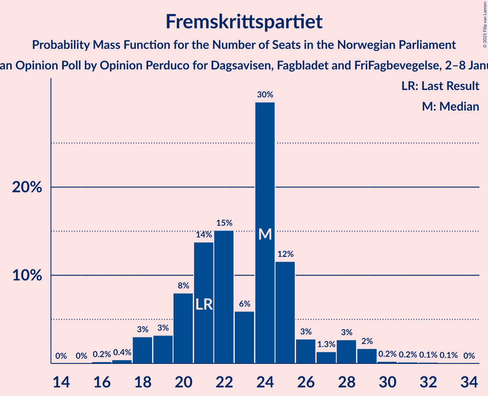

| Number of Seats | Probability | Accumulated | Special Marks |
|:---------------:|:-----------:|:-----------:|:-------------:|
| 16 | 0.2% | 100% |  |
| 17 | 0.4% | 99.8% |  |
| 18 | 3% | 99.4% |  |
| 19 | 3% | 96% |  |
| 20 | 8% | 93% |  |
| 21 | 14% | 85% | Last Result |
| 22 | 15% | 71% |  |
| 23 | 6% | 56% |  |
| 24 | 30% | 50% | Median |
| 25 | 12% | 21% |  |
| 26 | 3% | 9% |  |
| 27 | 1.3% | 6% |  |
| 28 | 3% | 5% |  |
| 29 | 2% | 2% |  |
| 30 | 0.2% | 0.7% |  |
| 31 | 0.2% | 0.4% |  |
| 32 | 0.1% | 0.3% |  |
| 33 | 0.1% | 0.1% |  |
| 34 | 0% | 0% |  |

### Sosialistisk Venstreparti

*For a full overview of the results for this party, see the [Sosialistisk Venstreparti](party-sosialistiskvenstreparti.html) page.*

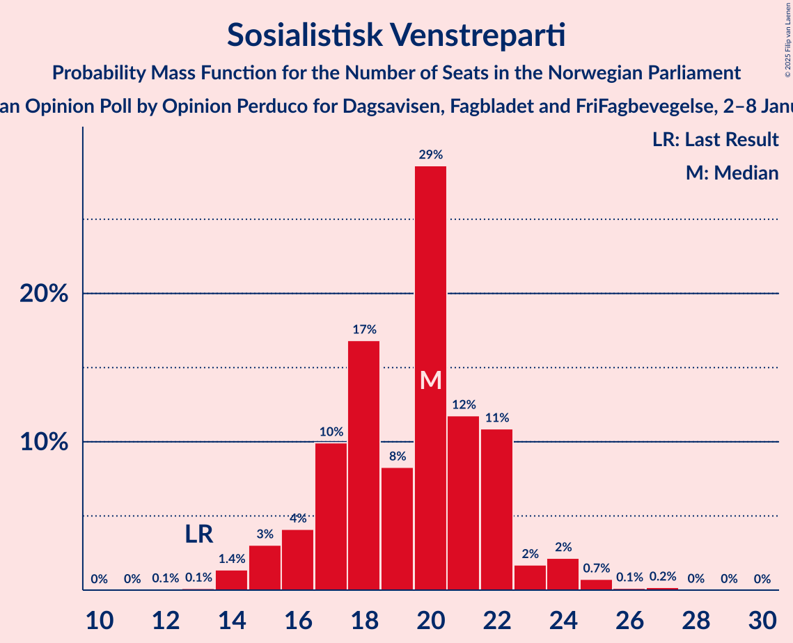

| Number of Seats | Probability | Accumulated | Special Marks |
|:---------------:|:-----------:|:-----------:|:-------------:|
| 12 | 0.1% | 100% |  |
| 13 | 0.1% | 99.9% | Last Result |
| 14 | 1.4% | 99.8% |  |
| 15 | 3% | 98% |  |
| 16 | 4% | 95% |  |
| 17 | 10% | 91% |  |
| 18 | 17% | 81% |  |
| 19 | 8% | 65% |  |
| 20 | 29% | 56% | Median |
| 21 | 12% | 28% |  |
| 22 | 11% | 16% |  |
| 23 | 2% | 5% |  |
| 24 | 2% | 3% |  |
| 25 | 0.7% | 1.1% |  |
| 26 | 0.1% | 0.4% |  |
| 27 | 0.2% | 0.3% |  |
| 28 | 0% | 0.1% |  |
| 29 | 0% | 0% |  |

### Rødt

*For a full overview of the results for this party, see the [Rødt](party-rødt.html) page.*

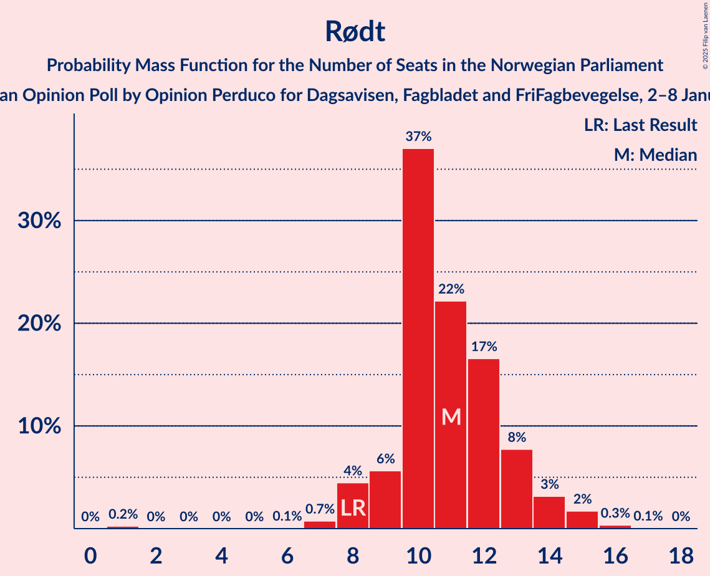

| Number of Seats | Probability | Accumulated | Special Marks |
|:---------------:|:-----------:|:-----------:|:-------------:|
| 1 | 0.2% | 100% |  |
| 2 | 0% | 99.8% |  |
| 3 | 0% | 99.8% |  |
| 4 | 0% | 99.8% |  |
| 5 | 0% | 99.8% |  |
| 6 | 0.1% | 99.8% |  |
| 7 | 0.7% | 99.7% |  |
| 8 | 4% | 98.9% | Last Result |
| 9 | 6% | 94% |  |
| 10 | 37% | 89% |  |
| 11 | 22% | 52% | Median |
| 12 | 17% | 30% |  |
| 13 | 8% | 13% |  |
| 14 | 3% | 5% |  |
| 15 | 2% | 2% |  |
| 16 | 0.3% | 0.4% |  |
| 17 | 0.1% | 0.1% |  |
| 18 | 0% | 0% |  |

### Senterpartiet

*For a full overview of the results for this party, see the [Senterpartiet](party-senterpartiet.html) page.*

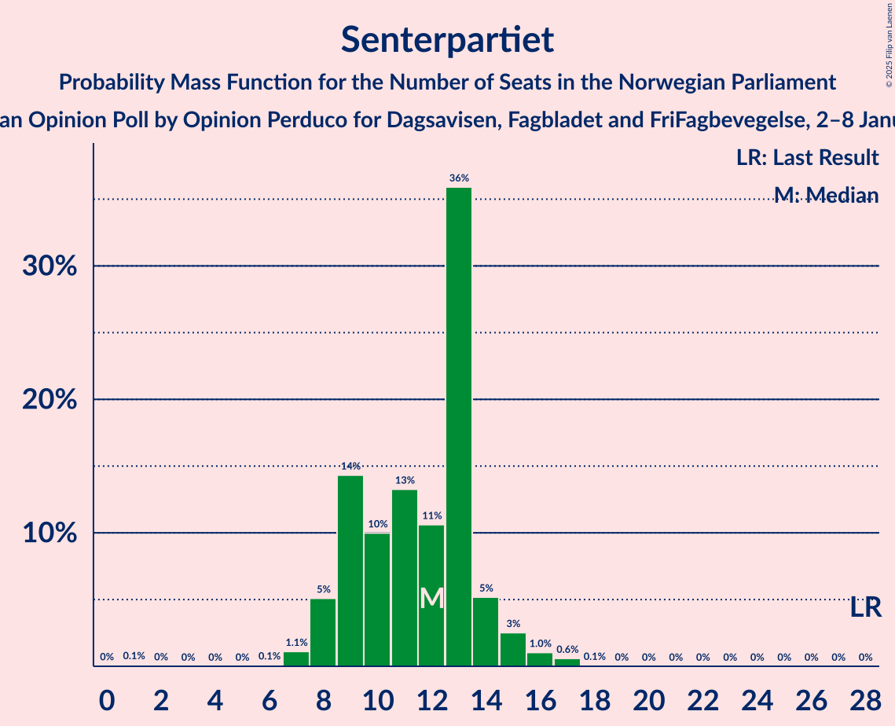

| Number of Seats | Probability | Accumulated | Special Marks |
|:---------------:|:-----------:|:-----------:|:-------------:|
| 1 | 0.1% | 100% |  |
| 2 | 0% | 99.8% |  |
| 3 | 0% | 99.8% |  |
| 4 | 0% | 99.8% |  |
| 5 | 0% | 99.8% |  |
| 6 | 0.1% | 99.8% |  |
| 7 | 1.1% | 99.7% |  |
| 8 | 5% | 98.6% |  |
| 9 | 14% | 94% |  |
| 10 | 10% | 79% |  |
| 11 | 13% | 69% |  |
| 12 | 11% | 56% | Median |
| 13 | 36% | 45% |  |
| 14 | 5% | 9% |  |
| 15 | 3% | 4% |  |
| 16 | 1.0% | 2% |  |
| 17 | 0.6% | 0.7% |  |
| 18 | 0.1% | 0.1% |  |
| 19 | 0% | 0% |  |
| 20 | 0% | 0% |  |
| 21 | 0% | 0% |  |
| 22 | 0% | 0% |  |
| 23 | 0% | 0% |  |
| 24 | 0% | 0% |  |
| 25 | 0% | 0% |  |
| 26 | 0% | 0% |  |
| 27 | 0% | 0% |  |
| 28 | 0% | 0% | Last Result |

### Venstre

*For a full overview of the results for this party, see the [Venstre](party-venstre.html) page.*

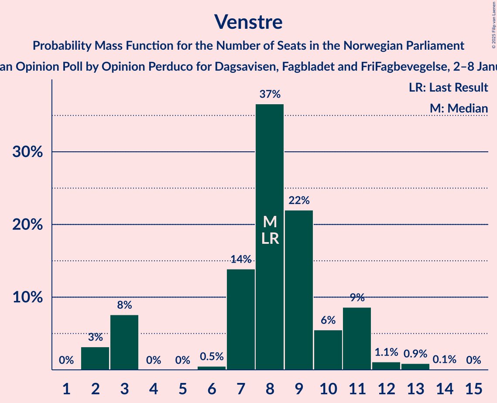

| Number of Seats | Probability | Accumulated | Special Marks |
|:---------------:|:-----------:|:-----------:|:-------------:|
| 2 | 3% | 100% |  |
| 3 | 8% | 97% |  |
| 4 | 0% | 89% |  |
| 5 | 0% | 89% |  |
| 6 | 0.5% | 89% |  |
| 7 | 14% | 89% |  |
| 8 | 37% | 75% | Last Result, Median |
| 9 | 22% | 38% |  |
| 10 | 6% | 16% |  |
| 11 | 9% | 11% |  |
| 12 | 1.1% | 2% |  |
| 13 | 0.9% | 1.0% |  |
| 14 | 0.1% | 0.1% |  |
| 15 | 0% | 0% |  |

### Kristelig Folkeparti

*For a full overview of the results for this party, see the [Kristelig Folkeparti](party-kristeligfolkeparti.html) page.*

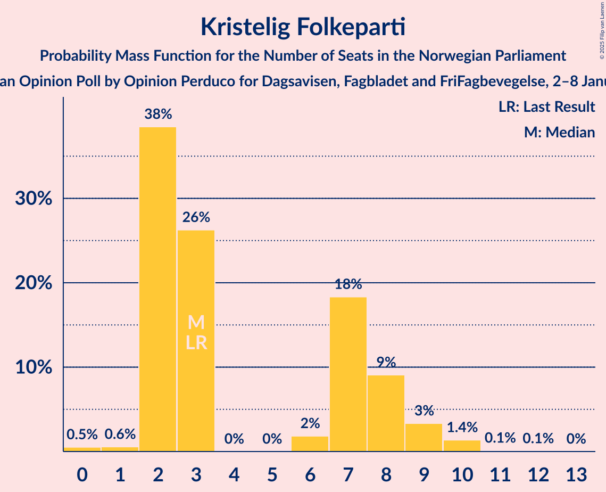

| Number of Seats | Probability | Accumulated | Special Marks |
|:---------------:|:-----------:|:-----------:|:-------------:|
| 0 | 0.5% | 100% |  |
| 1 | 0.6% | 99.5% |  |
| 2 | 38% | 98.9% |  |
| 3 | 26% | 60% | Last Result, Median |
| 4 | 0% | 34% |  |
| 5 | 0% | 34% |  |
| 6 | 2% | 34% |  |
| 7 | 18% | 32% |  |
| 8 | 9% | 14% |  |
| 9 | 3% | 5% |  |
| 10 | 1.4% | 2% |  |
| 11 | 0.1% | 0.2% |  |
| 12 | 0.1% | 0.1% |  |
| 13 | 0% | 0% |  |

### Industri- og Næringspartiet

*For a full overview of the results for this party, see the [Industri- og Næringspartiet](party-industri-ognæringspartiet.html) page.*

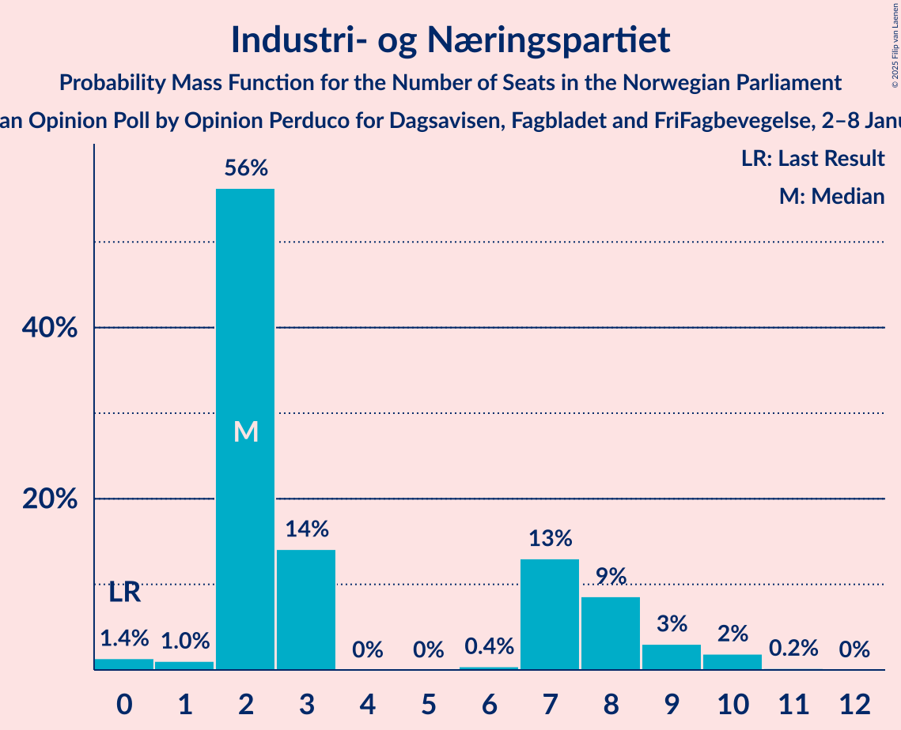

| Number of Seats | Probability | Accumulated | Special Marks |
|:---------------:|:-----------:|:-----------:|:-------------:|
| 0 | 1.4% | 100% | Last Result |
| 1 | 1.0% | 98.6% |  |
| 2 | 56% | 98% | Median |
| 3 | 14% | 41% |  |
| 4 | 0% | 27% |  |
| 5 | 0% | 27% |  |
| 6 | 0.4% | 27% |  |
| 7 | 13% | 27% |  |
| 8 | 9% | 14% |  |
| 9 | 3% | 5% |  |
| 10 | 2% | 2% |  |
| 11 | 0.2% | 0.2% |  |
| 12 | 0% | 0% |  |

### Miljøpartiet De Grønne

*For a full overview of the results for this party, see the [Miljøpartiet De Grønne](party-miljøpartietdegrønne.html) page.*

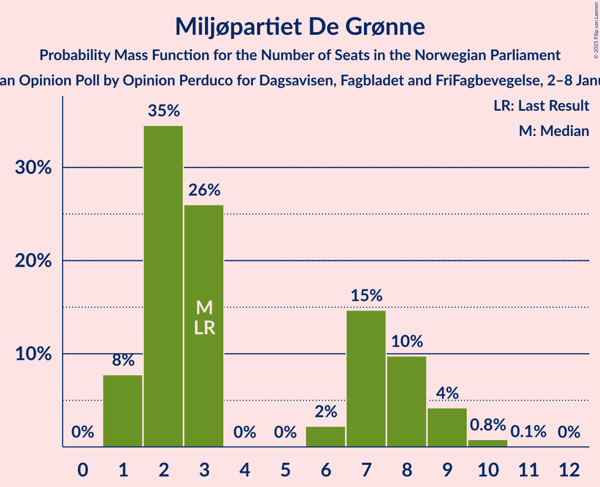

| Number of Seats | Probability | Accumulated | Special Marks |
|:---------------:|:-----------:|:-----------:|:-------------:|
| 1 | 8% | 100% |  |
| 2 | 35% | 92% |  |
| 3 | 26% | 58% | Last Result, Median |
| 4 | 0% | 32% |  |
| 5 | 0% | 32% |  |
| 6 | 2% | 32% |  |
| 7 | 15% | 30% |  |
| 8 | 10% | 15% |  |
| 9 | 4% | 5% |  |
| 10 | 0.8% | 0.9% |  |
| 11 | 0.1% | 0.1% |  |
| 12 | 0% | 0% |  |

## Coalitions

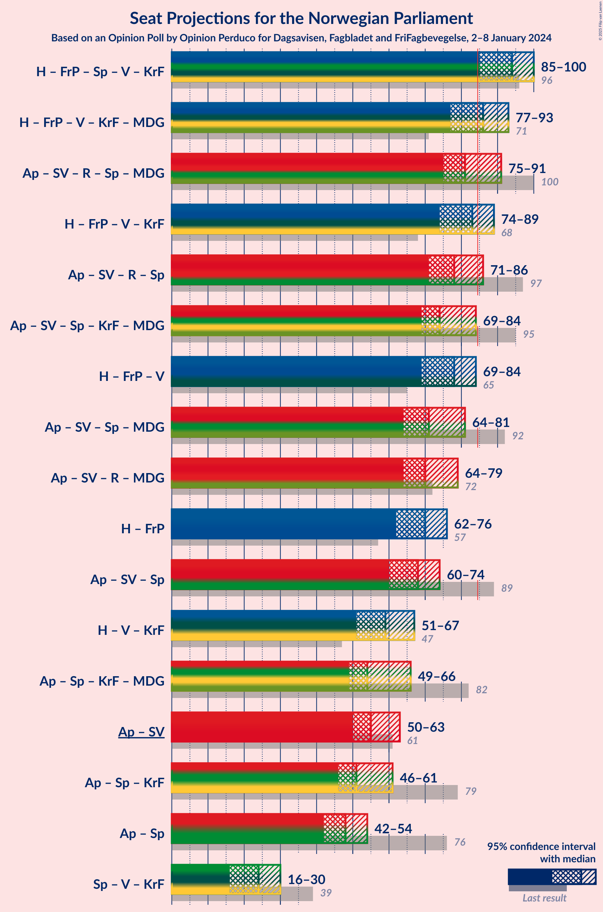

### Confidence Intervals

| Coalition | Last Result | Median | Majority? | 80% Confidence Interval | 90% Confidence Interval | 95% Confidence Interval | 99% Confidence Interval |
|:---------:|:-----------:|:------:|:---------:|:-----------------------:|:-----------------------:|:-----------------------:|:-----------------------:|
| Høyre – Fremskrittspartiet – Senterpartiet – Venstre – Kristelig Folkeparti | 96 | 94 | 98% | 88–98 | 86–98 | 85–100 | 81–102 |
| Høyre – Fremskrittspartiet – Venstre – Kristelig Folkeparti – Miljøpartiet De Grønne | 71 | 86 | 67% | 81–90 | 79–91 | 77–93 | 75–96 |
| Arbeiderpartiet – Sosialistisk Venstreparti – Rødt – Senterpartiet – Miljøpartiet De Grønne | 100 | 81 | 29% | 78–88 | 76–91 | 75–91 | 72–93 |
| Høyre – Fremskrittspartiet – Venstre – Kristelig Folkeparti | 68 | 83 | 31% | 76–86 | 75–88 | 74–89 | 68–92 |
| Arbeiderpartiet – Sosialistisk Venstreparti – Rødt – Senterpartiet | 97 | 78 | 6% | 74–84 | 71–85 | 71–86 | 68–88 |
| Arbeiderpartiet – Sosialistisk Venstreparti – Senterpartiet – Kristelig Folkeparti – Miljøpartiet De Grønne | 95 | 74 | 2% | 70–83 | 69–83 | 69–84 | 66–87 |
| Høyre – Fremskrittspartiet – Venstre | 65 | 78 | 2% | 72–82 | 71–82 | 69–84 | 65–86 |
| Arbeiderpartiet – Sosialistisk Venstreparti – Senterpartiet – Miljøpartiet De Grønne | 92 | 71 | 0.1% | 66–78 | 66–80 | 64–81 | 62–81 |
| Arbeiderpartiet – Sosialistisk Venstreparti – Rødt – Miljøpartiet De Grønne | 72 | 70 | 0.1% | 67–77 | 66–78 | 64–79 | 62–82 |
| Høyre – Fremskrittspartiet | 57 | 70 | 0% | 64–74 | 63–75 | 62–76 | 60–79 |
| Arbeiderpartiet – Sosialistisk Venstreparti – Senterpartiet | 89 | 68 | 0% | 63–72 | 62–74 | 60–74 | 59–77 |
| Høyre – Venstre – Kristelig Folkeparti | 47 | 59 | 0% | 54–64 | 53–67 | 51–67 | 48–69 |
| Arbeiderpartiet – Senterpartiet – Kristelig Folkeparti – Miljøpartiet De Grønne | 82 | 54 | 0% | 52–62 | 51–65 | 49–66 | 46–69 |
| Arbeiderpartiet – Sosialistisk Venstreparti | 61 | 55 | 0% | 53–61 | 51–62 | 50–63 | 49–66 |
| Arbeiderpartiet – Senterpartiet – Kristelig Folkeparti | 79 | 51 | 0% | 49–57 | 47–60 | 46–61 | 44–62 |
| Arbeiderpartiet – Senterpartiet | 76 | 48 | 0% | 44–53 | 43–54 | 42–54 | 40–57 |
| Senterpartiet – Venstre – Kristelig Folkeparti | 39 | 24 | 0% | 19–28 | 17–30 | 16–30 | 14–33 |

### Høyre – Fremskrittspartiet – Senterpartiet – Venstre – Kristelig Folkeparti

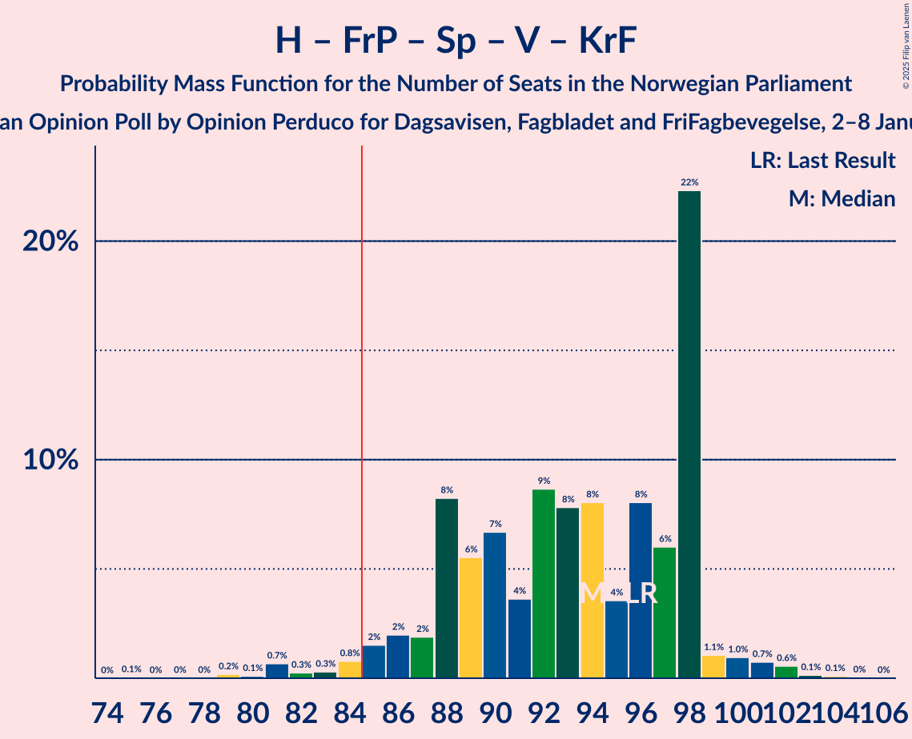

| Number of Seats | Probability | Accumulated | Special Marks |
|:---------------:|:-----------:|:-----------:|:-------------:|
| 75 | 0.1% | 100% |  |
| 76 | 0% | 99.9% |  |
| 77 | 0% | 99.9% |  |
| 78 | 0% | 99.9% |  |
| 79 | 0.2% | 99.9% |  |
| 80 | 0.1% | 99.7% |  |
| 81 | 0.7% | 99.6% |  |
| 82 | 0.3% | 98.9% |  |
| 83 | 0.3% | 98.7% |  |
| 84 | 0.8% | 98% |  |
| 85 | 2% | 98% | Majority |
| 86 | 2% | 96% |  |
| 87 | 2% | 94% |  |
| 88 | 8% | 92% |  |
| 89 | 6% | 84% |  |
| 90 | 7% | 78% |  |
| 91 | 4% | 72% |  |
| 92 | 9% | 68% |  |
| 93 | 8% | 59% |  |
| 94 | 8% | 52% | Median |
| 95 | 4% | 44% |  |
| 96 | 8% | 40% | Last Result |
| 97 | 6% | 32% |  |
| 98 | 22% | 26% |  |
| 99 | 1.1% | 4% |  |
| 100 | 1.0% | 3% |  |
| 101 | 0.7% | 2% |  |
| 102 | 0.6% | 0.9% |  |
| 103 | 0.1% | 0.3% |  |
| 104 | 0.1% | 0.2% |  |
| 105 | 0% | 0.1% |  |
| 106 | 0% | 0% |  |

### Høyre – Fremskrittspartiet – Venstre – Kristelig Folkeparti – Miljøpartiet De Grønne

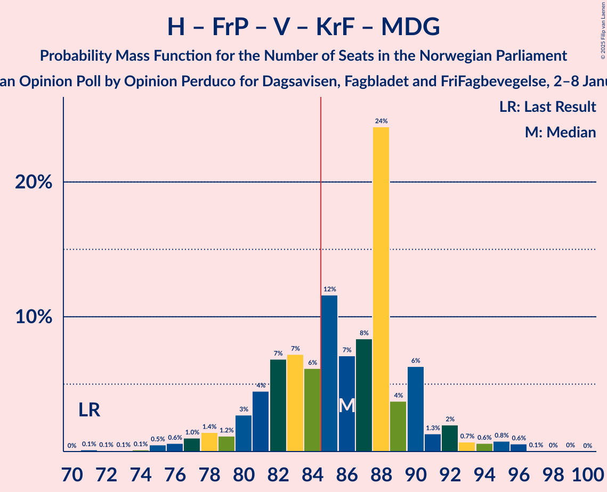

| Number of Seats | Probability | Accumulated | Special Marks |
|:---------------:|:-----------:|:-----------:|:-------------:|
| 71 | 0.1% | 100% | Last Result |
| 72 | 0.1% | 99.8% |  |
| 73 | 0.1% | 99.8% |  |
| 74 | 0.1% | 99.7% |  |
| 75 | 0.5% | 99.5% |  |
| 76 | 0.6% | 99.0% |  |
| 77 | 1.0% | 98% |  |
| 78 | 1.4% | 97% |  |
| 79 | 1.2% | 96% |  |
| 80 | 3% | 95% |  |
| 81 | 4% | 92% |  |
| 82 | 7% | 88% |  |
| 83 | 7% | 81% |  |
| 84 | 6% | 74% |  |
| 85 | 12% | 67% | Median, Majority |
| 86 | 7% | 56% |  |
| 87 | 8% | 49% |  |
| 88 | 24% | 40% |  |
| 89 | 4% | 16% |  |
| 90 | 6% | 12% |  |
| 91 | 1.3% | 6% |  |
| 92 | 2% | 5% |  |
| 93 | 0.7% | 3% |  |
| 94 | 0.6% | 2% |  |
| 95 | 0.8% | 2% |  |
| 96 | 0.6% | 0.7% |  |
| 97 | 0.1% | 0.2% |  |
| 98 | 0% | 0.1% |  |
| 99 | 0% | 0.1% |  |
| 100 | 0% | 0% |  |

### Arbeiderpartiet – Sosialistisk Venstreparti – Rødt – Senterpartiet – Miljøpartiet De Grønne

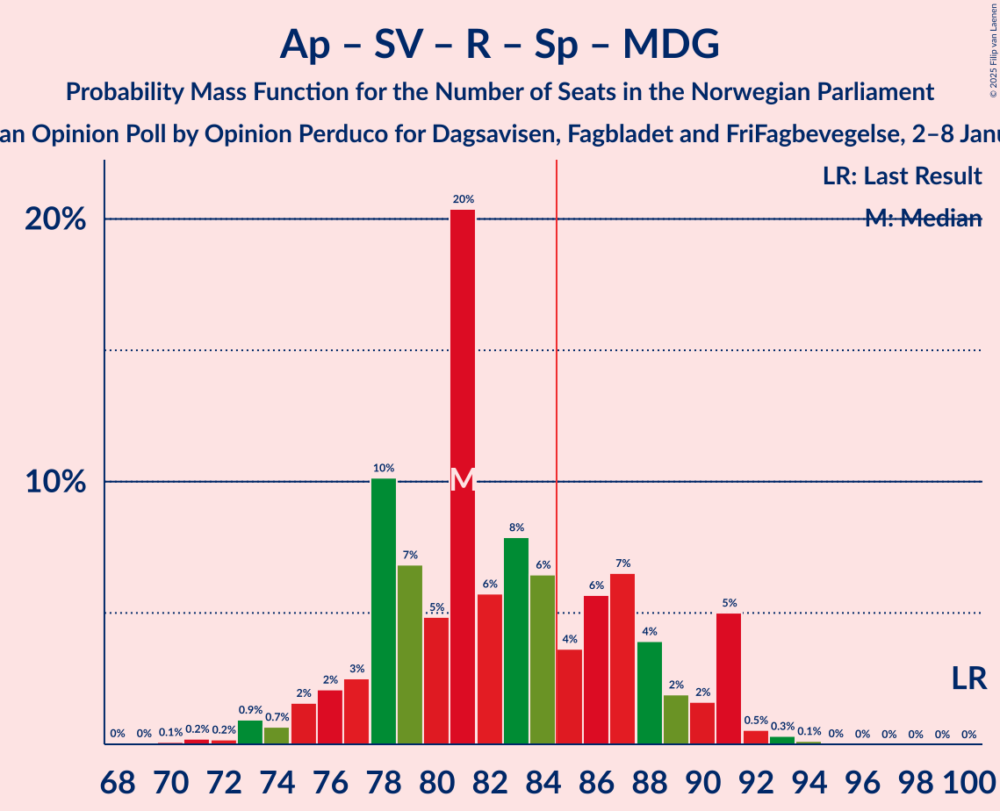

| Number of Seats | Probability | Accumulated | Special Marks |
|:---------------:|:-----------:|:-----------:|:-------------:|
| 68 | 0% | 100% |  |
| 69 | 0% | 99.9% |  |
| 70 | 0.1% | 99.9% |  |
| 71 | 0.2% | 99.8% |  |
| 72 | 0.2% | 99.6% |  |
| 73 | 0.9% | 99.4% |  |
| 74 | 0.7% | 98% |  |
| 75 | 2% | 98% |  |
| 76 | 2% | 96% |  |
| 77 | 3% | 94% |  |
| 78 | 10% | 92% |  |
| 79 | 7% | 81% |  |
| 80 | 5% | 75% |  |
| 81 | 20% | 70% |  |
| 82 | 6% | 49% | Median |
| 83 | 8% | 44% |  |
| 84 | 6% | 36% |  |
| 85 | 4% | 29% | Majority |
| 86 | 6% | 26% |  |
| 87 | 7% | 20% |  |
| 88 | 4% | 14% |  |
| 89 | 2% | 10% |  |
| 90 | 2% | 8% |  |
| 91 | 5% | 6% |  |
| 92 | 0.5% | 1.1% |  |
| 93 | 0.3% | 0.5% |  |
| 94 | 0.1% | 0.2% |  |
| 95 | 0% | 0.1% |  |
| 96 | 0% | 0% |  |
| 97 | 0% | 0% |  |
| 98 | 0% | 0% |  |
| 99 | 0% | 0% |  |
| 100 | 0% | 0% | Last Result |

### Høyre – Fremskrittspartiet – Venstre – Kristelig Folkeparti

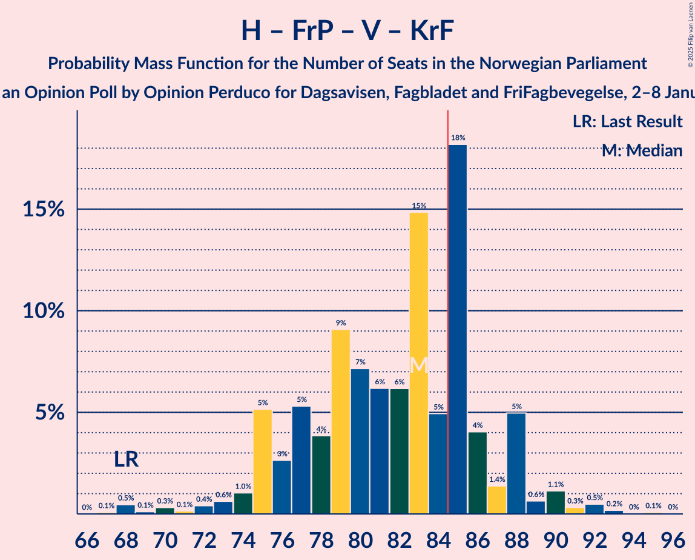

| Number of Seats | Probability | Accumulated | Special Marks |
|:---------------:|:-----------:|:-----------:|:-------------:|
| 67 | 0.1% | 100% |  |
| 68 | 0.5% | 99.9% | Last Result |
| 69 | 0.1% | 99.4% |  |
| 70 | 0.3% | 99.3% |  |
| 71 | 0.1% | 99.0% |  |
| 72 | 0.4% | 98.9% |  |
| 73 | 0.6% | 98% |  |
| 74 | 1.0% | 98% |  |
| 75 | 5% | 97% |  |
| 76 | 3% | 92% |  |
| 77 | 5% | 89% |  |
| 78 | 4% | 84% |  |
| 79 | 9% | 80% |  |
| 80 | 7% | 71% |  |
| 81 | 6% | 64% |  |
| 82 | 6% | 57% | Median |
| 83 | 15% | 51% |  |
| 84 | 5% | 36% |  |
| 85 | 18% | 31% | Majority |
| 86 | 4% | 13% |  |
| 87 | 1.4% | 9% |  |
| 88 | 5% | 8% |  |
| 89 | 0.6% | 3% |  |
| 90 | 1.1% | 2% |  |
| 91 | 0.3% | 1.1% |  |
| 92 | 0.5% | 0.8% |  |
| 93 | 0.2% | 0.3% |  |
| 94 | 0% | 0.1% |  |
| 95 | 0.1% | 0.1% |  |
| 96 | 0% | 0% |  |

### Arbeiderpartiet – Sosialistisk Venstreparti – Rødt – Senterpartiet

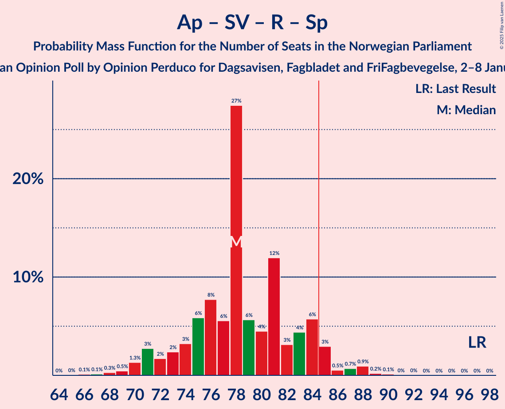

| Number of Seats | Probability | Accumulated | Special Marks |
|:---------------:|:-----------:|:-----------:|:-------------:|
| 65 | 0% | 100% |  |
| 66 | 0.1% | 99.9% |  |
| 67 | 0.1% | 99.8% |  |
| 68 | 0.3% | 99.7% |  |
| 69 | 0.5% | 99.4% |  |
| 70 | 1.3% | 98.9% |  |
| 71 | 3% | 98% |  |
| 72 | 2% | 95% |  |
| 73 | 2% | 93% |  |
| 74 | 3% | 91% |  |
| 75 | 6% | 88% |  |
| 76 | 8% | 82% |  |
| 77 | 6% | 74% |  |
| 78 | 27% | 68% |  |
| 79 | 6% | 41% | Median |
| 80 | 4% | 35% |  |
| 81 | 12% | 31% |  |
| 82 | 3% | 19% |  |
| 83 | 4% | 16% |  |
| 84 | 6% | 11% |  |
| 85 | 3% | 6% | Majority |
| 86 | 0.5% | 3% |  |
| 87 | 0.7% | 2% |  |
| 88 | 0.9% | 1.3% |  |
| 89 | 0.2% | 0.4% |  |
| 90 | 0.1% | 0.2% |  |
| 91 | 0% | 0.1% |  |
| 92 | 0% | 0% |  |
| 93 | 0% | 0% |  |
| 94 | 0% | 0% |  |
| 95 | 0% | 0% |  |
| 96 | 0% | 0% |  |
| 97 | 0% | 0% | Last Result |

### Arbeiderpartiet – Sosialistisk Venstreparti – Senterpartiet – Kristelig Folkeparti – Miljøpartiet De Grønne

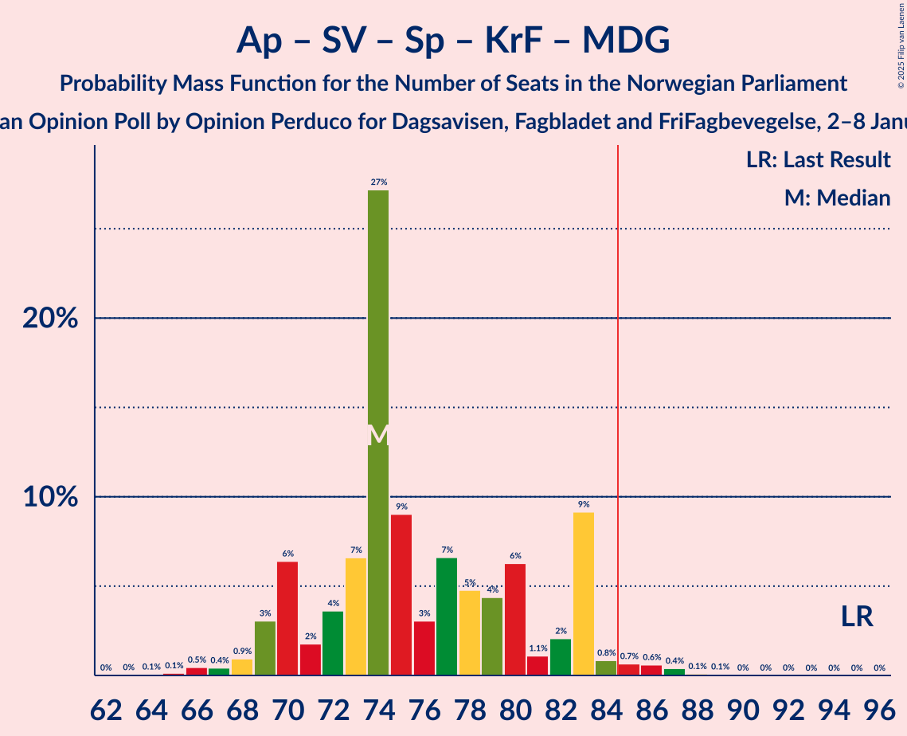

| Number of Seats | Probability | Accumulated | Special Marks |
|:---------------:|:-----------:|:-----------:|:-------------:|
| 63 | 0% | 100% |  |
| 64 | 0.1% | 99.9% |  |
| 65 | 0.1% | 99.9% |  |
| 66 | 0.5% | 99.7% |  |
| 67 | 0.4% | 99.3% |  |
| 68 | 0.9% | 98.8% |  |
| 69 | 3% | 98% |  |
| 70 | 6% | 95% |  |
| 71 | 2% | 88% |  |
| 72 | 4% | 87% |  |
| 73 | 7% | 83% |  |
| 74 | 27% | 76% | Median |
| 75 | 9% | 49% |  |
| 76 | 3% | 40% |  |
| 77 | 7% | 37% |  |
| 78 | 5% | 31% |  |
| 79 | 4% | 26% |  |
| 80 | 6% | 21% |  |
| 81 | 1.1% | 15% |  |
| 82 | 2% | 14% |  |
| 83 | 9% | 12% |  |
| 84 | 0.8% | 3% |  |
| 85 | 0.7% | 2% | Majority |
| 86 | 0.6% | 1.2% |  |
| 87 | 0.4% | 0.6% |  |
| 88 | 0.1% | 0.2% |  |
| 89 | 0.1% | 0.1% |  |
| 90 | 0% | 0% |  |
| 91 | 0% | 0% |  |
| 92 | 0% | 0% |  |
| 93 | 0% | 0% |  |
| 94 | 0% | 0% |  |
| 95 | 0% | 0% | Last Result |

### Høyre – Fremskrittspartiet – Venstre

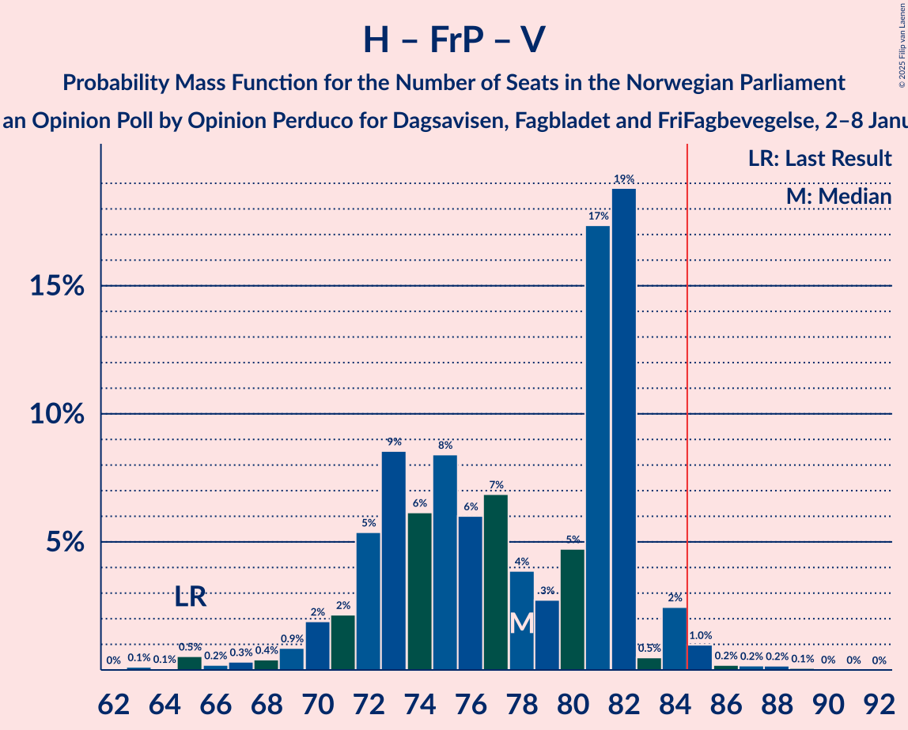

| Number of Seats | Probability | Accumulated | Special Marks |
|:---------------:|:-----------:|:-----------:|:-------------:|
| 63 | 0.1% | 100% |  |
| 64 | 0.1% | 99.9% |  |
| 65 | 0.5% | 99.8% | Last Result |
| 66 | 0.2% | 99.3% |  |
| 67 | 0.3% | 99.1% |  |
| 68 | 0.4% | 98.8% |  |
| 69 | 0.9% | 98% |  |
| 70 | 2% | 97% |  |
| 71 | 2% | 96% |  |
| 72 | 5% | 93% |  |
| 73 | 9% | 88% |  |
| 74 | 6% | 80% |  |
| 75 | 8% | 73% |  |
| 76 | 6% | 65% |  |
| 77 | 7% | 59% |  |
| 78 | 4% | 52% |  |
| 79 | 3% | 48% | Median |
| 80 | 5% | 45% |  |
| 81 | 17% | 41% |  |
| 82 | 19% | 23% |  |
| 83 | 0.5% | 5% |  |
| 84 | 2% | 4% |  |
| 85 | 1.0% | 2% | Majority |
| 86 | 0.2% | 0.7% |  |
| 87 | 0.2% | 0.5% |  |
| 88 | 0.2% | 0.3% |  |
| 89 | 0.1% | 0.1% |  |
| 90 | 0% | 0.1% |  |
| 91 | 0% | 0% |  |

### Arbeiderpartiet – Sosialistisk Venstreparti – Senterpartiet – Miljøpartiet De Grønne

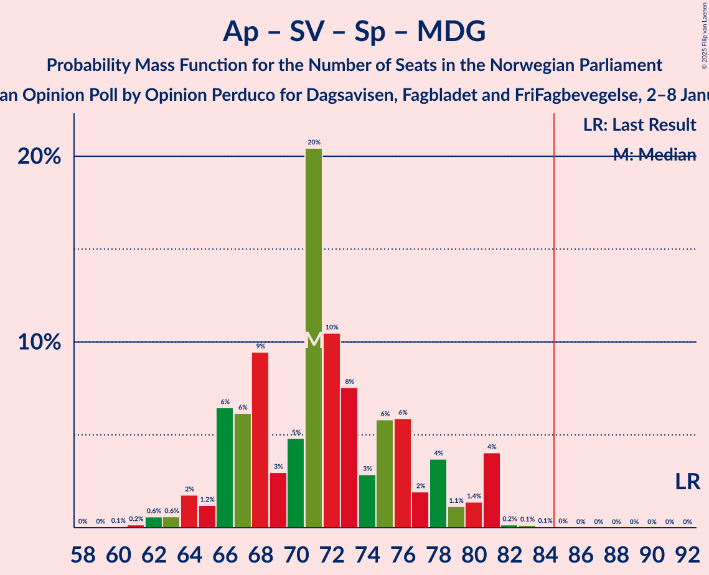

| Number of Seats | Probability | Accumulated | Special Marks |
|:---------------:|:-----------:|:-----------:|:-------------:|
| 59 | 0% | 100% |  |
| 60 | 0.1% | 99.9% |  |
| 61 | 0.2% | 99.9% |  |
| 62 | 0.6% | 99.7% |  |
| 63 | 0.6% | 99.1% |  |
| 64 | 2% | 98.5% |  |
| 65 | 1.2% | 97% |  |
| 66 | 6% | 96% |  |
| 67 | 6% | 89% |  |
| 68 | 9% | 83% |  |
| 69 | 3% | 73% |  |
| 70 | 5% | 70% |  |
| 71 | 20% | 66% | Median |
| 72 | 10% | 45% |  |
| 73 | 8% | 35% |  |
| 74 | 3% | 27% |  |
| 75 | 6% | 24% |  |
| 76 | 6% | 19% |  |
| 77 | 2% | 13% |  |
| 78 | 4% | 11% |  |
| 79 | 1.1% | 7% |  |
| 80 | 1.4% | 6% |  |
| 81 | 4% | 4% |  |
| 82 | 0.2% | 0.4% |  |
| 83 | 0.1% | 0.3% |  |
| 84 | 0.1% | 0.1% |  |
| 85 | 0% | 0.1% | Majority |
| 86 | 0% | 0% |  |
| 87 | 0% | 0% |  |
| 88 | 0% | 0% |  |
| 89 | 0% | 0% |  |
| 90 | 0% | 0% |  |
| 91 | 0% | 0% |  |
| 92 | 0% | 0% | Last Result |

### Arbeiderpartiet – Sosialistisk Venstreparti – Rødt – Miljøpartiet De Grønne

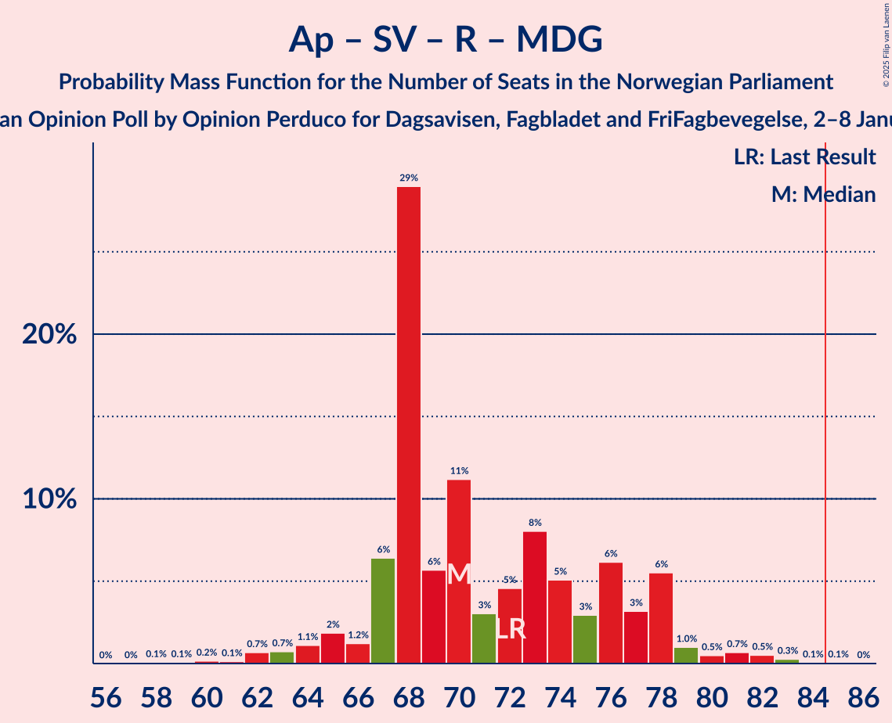

| Number of Seats | Probability | Accumulated | Special Marks |
|:---------------:|:-----------:|:-----------:|:-------------:|
| 58 | 0.1% | 100% |  |
| 59 | 0.1% | 99.9% |  |
| 60 | 0.2% | 99.8% |  |
| 61 | 0.1% | 99.7% |  |
| 62 | 0.7% | 99.5% |  |
| 63 | 0.7% | 98.9% |  |
| 64 | 1.1% | 98% |  |
| 65 | 2% | 97% |  |
| 66 | 1.2% | 95% |  |
| 67 | 6% | 94% |  |
| 68 | 29% | 88% |  |
| 69 | 6% | 59% |  |
| 70 | 11% | 53% | Median |
| 71 | 3% | 42% |  |
| 72 | 5% | 39% | Last Result |
| 73 | 8% | 34% |  |
| 74 | 5% | 26% |  |
| 75 | 3% | 21% |  |
| 76 | 6% | 18% |  |
| 77 | 3% | 12% |  |
| 78 | 6% | 9% |  |
| 79 | 1.0% | 3% |  |
| 80 | 0.5% | 2% |  |
| 81 | 0.7% | 2% |  |
| 82 | 0.5% | 0.9% |  |
| 83 | 0.3% | 0.4% |  |
| 84 | 0.1% | 0.1% |  |
| 85 | 0.1% | 0.1% | Majority |
| 86 | 0% | 0% |  |

### Høyre – Fremskrittspartiet

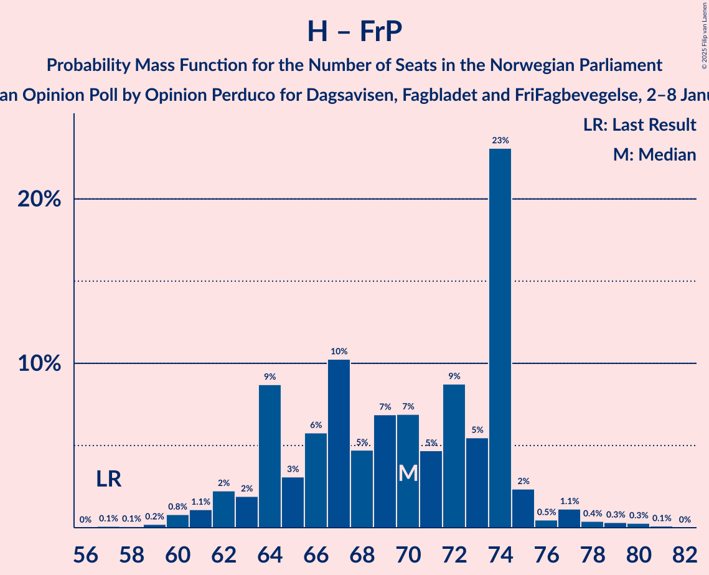

| Number of Seats | Probability | Accumulated | Special Marks |
|:---------------:|:-----------:|:-----------:|:-------------:|
| 57 | 0.1% | 100% | Last Result |
| 58 | 0.1% | 99.9% |  |
| 59 | 0.2% | 99.8% |  |
| 60 | 0.8% | 99.6% |  |
| 61 | 1.1% | 98.8% |  |
| 62 | 2% | 98% |  |
| 63 | 2% | 95% |  |
| 64 | 9% | 94% |  |
| 65 | 3% | 85% |  |
| 66 | 6% | 82% |  |
| 67 | 10% | 76% |  |
| 68 | 5% | 66% |  |
| 69 | 7% | 61% |  |
| 70 | 7% | 54% |  |
| 71 | 5% | 47% | Median |
| 72 | 9% | 42% |  |
| 73 | 5% | 34% |  |
| 74 | 23% | 28% |  |
| 75 | 2% | 5% |  |
| 76 | 0.5% | 3% |  |
| 77 | 1.1% | 2% |  |
| 78 | 0.4% | 1.1% |  |
| 79 | 0.3% | 0.8% |  |
| 80 | 0.3% | 0.4% |  |
| 81 | 0.1% | 0.1% |  |
| 82 | 0% | 0% |  |

### Arbeiderpartiet – Sosialistisk Venstreparti – Senterpartiet

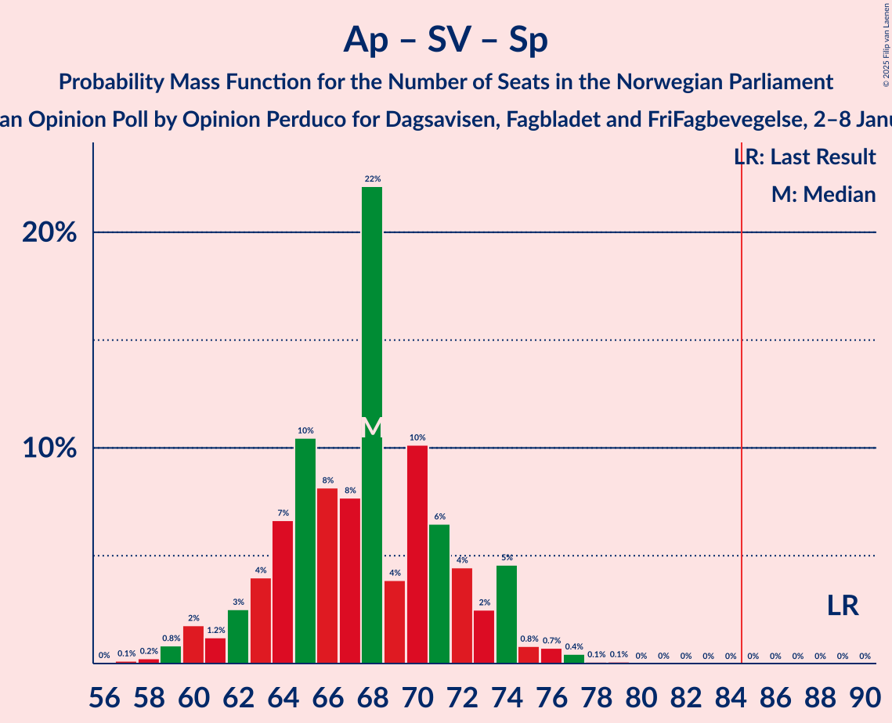

| Number of Seats | Probability | Accumulated | Special Marks |
|:---------------:|:-----------:|:-----------:|:-------------:|
| 56 | 0% | 100% |  |
| 57 | 0.1% | 99.9% |  |
| 58 | 0.2% | 99.8% |  |
| 59 | 0.8% | 99.6% |  |
| 60 | 2% | 98.7% |  |
| 61 | 1.2% | 97% |  |
| 62 | 3% | 96% |  |
| 63 | 4% | 93% |  |
| 64 | 7% | 89% |  |
| 65 | 10% | 83% |  |
| 66 | 8% | 72% |  |
| 67 | 8% | 64% |  |
| 68 | 22% | 56% | Median |
| 69 | 4% | 34% |  |
| 70 | 10% | 30% |  |
| 71 | 6% | 20% |  |
| 72 | 4% | 14% |  |
| 73 | 2% | 9% |  |
| 74 | 5% | 7% |  |
| 75 | 0.8% | 2% |  |
| 76 | 0.7% | 1.4% |  |
| 77 | 0.4% | 0.6% |  |
| 78 | 0.1% | 0.2% |  |
| 79 | 0.1% | 0.1% |  |
| 80 | 0% | 0% |  |
| 81 | 0% | 0% |  |
| 82 | 0% | 0% |  |
| 83 | 0% | 0% |  |
| 84 | 0% | 0% |  |
| 85 | 0% | 0% | Majority |
| 86 | 0% | 0% |  |
| 87 | 0% | 0% |  |
| 88 | 0% | 0% |  |
| 89 | 0% | 0% | Last Result |

### Høyre – Venstre – Kristelig Folkeparti

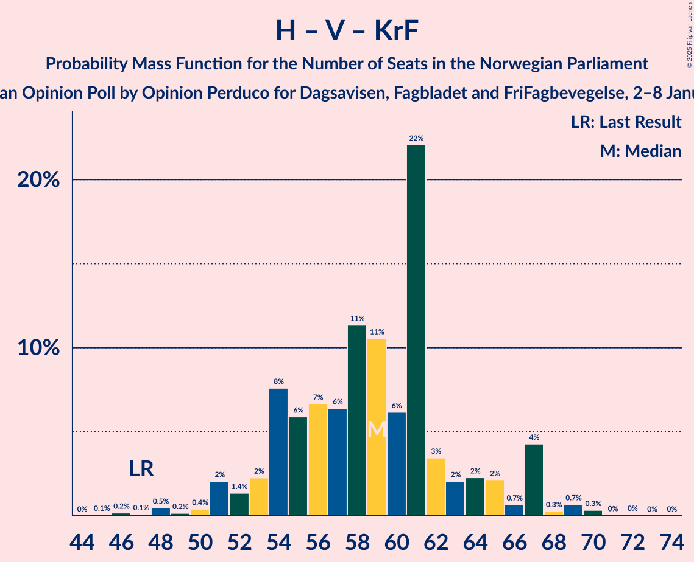

| Number of Seats | Probability | Accumulated | Special Marks |
|:---------------:|:-----------:|:-----------:|:-------------:|
| 45 | 0.1% | 100% |  |
| 46 | 0.2% | 99.9% |  |
| 47 | 0.1% | 99.7% | Last Result |
| 48 | 0.5% | 99.6% |  |
| 49 | 0.2% | 99.2% |  |
| 50 | 0.4% | 99.0% |  |
| 51 | 2% | 98.6% |  |
| 52 | 1.4% | 97% |  |
| 53 | 2% | 95% |  |
| 54 | 8% | 93% |  |
| 55 | 6% | 85% |  |
| 56 | 7% | 79% |  |
| 57 | 6% | 73% |  |
| 58 | 11% | 66% | Median |
| 59 | 11% | 55% |  |
| 60 | 6% | 44% |  |
| 61 | 22% | 38% |  |
| 62 | 3% | 16% |  |
| 63 | 2% | 13% |  |
| 64 | 2% | 11% |  |
| 65 | 2% | 8% |  |
| 66 | 0.7% | 6% |  |
| 67 | 4% | 6% |  |
| 68 | 0.3% | 1.4% |  |
| 69 | 0.7% | 1.1% |  |
| 70 | 0.3% | 0.4% |  |
| 71 | 0% | 0.1% |  |
| 72 | 0% | 0.1% |  |
| 73 | 0% | 0% |  |

### Arbeiderpartiet – Senterpartiet – Kristelig Folkeparti – Miljøpartiet De Grønne

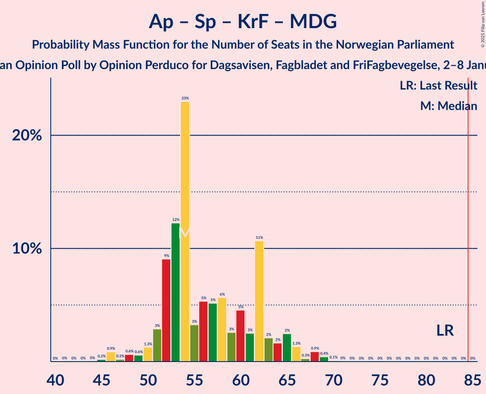

| Number of Seats | Probability | Accumulated | Special Marks |
|:---------------:|:-----------:|:-----------:|:-------------:|
| 44 | 0% | 100% |  |
| 45 | 0.2% | 99.9% |  |
| 46 | 0.9% | 99.7% |  |
| 47 | 0.2% | 98.9% |  |
| 48 | 0.6% | 98.7% |  |
| 49 | 0.6% | 98% |  |
| 50 | 1.3% | 97% |  |
| 51 | 3% | 96% |  |
| 52 | 9% | 93% |  |
| 53 | 12% | 84% |  |
| 54 | 23% | 72% | Median |
| 55 | 3% | 49% |  |
| 56 | 5% | 46% |  |
| 57 | 5% | 40% |  |
| 58 | 6% | 35% |  |
| 59 | 3% | 30% |  |
| 60 | 5% | 27% |  |
| 61 | 3% | 22% |  |
| 62 | 11% | 20% |  |
| 63 | 2% | 9% |  |
| 64 | 2% | 7% |  |
| 65 | 2% | 6% |  |
| 66 | 1.3% | 3% |  |
| 67 | 0.3% | 2% |  |
| 68 | 0.9% | 1.5% |  |
| 69 | 0.4% | 0.6% |  |
| 70 | 0.1% | 0.1% |  |
| 71 | 0% | 0% |  |
| 72 | 0% | 0% |  |
| 73 | 0% | 0% |  |
| 74 | 0% | 0% |  |
| 75 | 0% | 0% |  |
| 76 | 0% | 0% |  |
| 77 | 0% | 0% |  |
| 78 | 0% | 0% |  |
| 79 | 0% | 0% |  |
| 80 | 0% | 0% |  |
| 81 | 0% | 0% |  |
| 82 | 0% | 0% | Last Result |

### Arbeiderpartiet – Sosialistisk Venstreparti

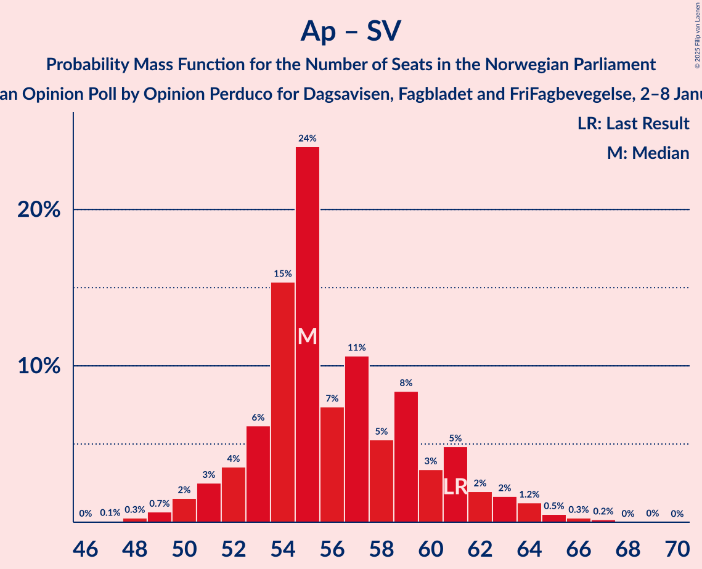

| Number of Seats | Probability | Accumulated | Special Marks |
|:---------------:|:-----------:|:-----------:|:-------------:|
| 47 | 0.1% | 100% |  |
| 48 | 0.3% | 99.9% |  |
| 49 | 0.7% | 99.6% |  |
| 50 | 2% | 98.9% |  |
| 51 | 3% | 97% |  |
| 52 | 4% | 95% |  |
| 53 | 6% | 91% |  |
| 54 | 15% | 85% |  |
| 55 | 24% | 70% |  |
| 56 | 7% | 46% | Median |
| 57 | 11% | 38% |  |
| 58 | 5% | 28% |  |
| 59 | 8% | 22% |  |
| 60 | 3% | 14% |  |
| 61 | 5% | 11% | Last Result |
| 62 | 2% | 6% |  |
| 63 | 2% | 4% |  |
| 64 | 1.2% | 2% |  |
| 65 | 0.5% | 1.0% |  |
| 66 | 0.3% | 0.5% |  |
| 67 | 0.2% | 0.2% |  |
| 68 | 0% | 0.1% |  |
| 69 | 0% | 0.1% |  |
| 70 | 0% | 0% |  |

### Arbeiderpartiet – Senterpartiet – Kristelig Folkeparti

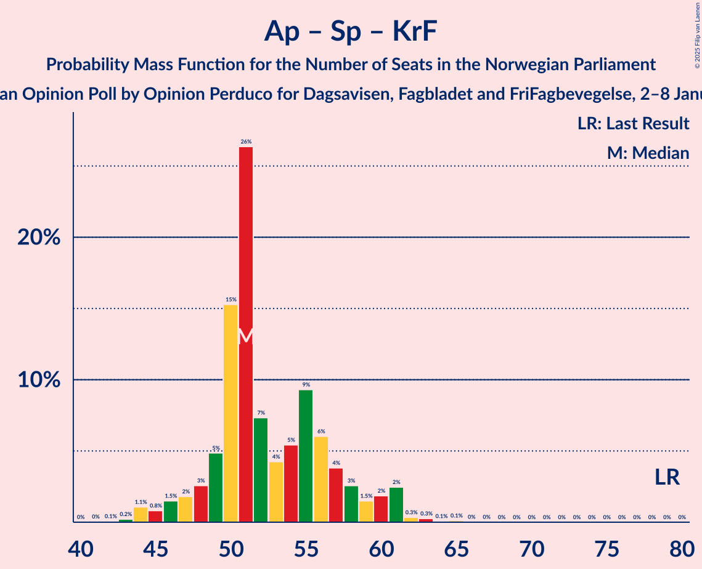

| Number of Seats | Probability | Accumulated | Special Marks |
|:---------------:|:-----------:|:-----------:|:-------------:|
| 41 | 0% | 100% |  |
| 42 | 0.1% | 99.9% |  |
| 43 | 0.2% | 99.8% |  |
| 44 | 1.1% | 99.6% |  |
| 45 | 0.8% | 98.6% |  |
| 46 | 1.5% | 98% |  |
| 47 | 2% | 96% |  |
| 48 | 3% | 94% |  |
| 49 | 5% | 92% |  |
| 50 | 15% | 87% |  |
| 51 | 26% | 72% | Median |
| 52 | 7% | 45% |  |
| 53 | 4% | 38% |  |
| 54 | 5% | 34% |  |
| 55 | 9% | 28% |  |
| 56 | 6% | 19% |  |
| 57 | 4% | 13% |  |
| 58 | 3% | 9% |  |
| 59 | 1.5% | 7% |  |
| 60 | 2% | 5% |  |
| 61 | 2% | 3% |  |
| 62 | 0.3% | 0.8% |  |
| 63 | 0.3% | 0.5% |  |
| 64 | 0.1% | 0.2% |  |
| 65 | 0.1% | 0.2% |  |
| 66 | 0% | 0% |  |
| 67 | 0% | 0% |  |
| 68 | 0% | 0% |  |
| 69 | 0% | 0% |  |
| 70 | 0% | 0% |  |
| 71 | 0% | 0% |  |
| 72 | 0% | 0% |  |
| 73 | 0% | 0% |  |
| 74 | 0% | 0% |  |
| 75 | 0% | 0% |  |
| 76 | 0% | 0% |  |
| 77 | 0% | 0% |  |
| 78 | 0% | 0% |  |
| 79 | 0% | 0% | Last Result |

### Arbeiderpartiet – Senterpartiet

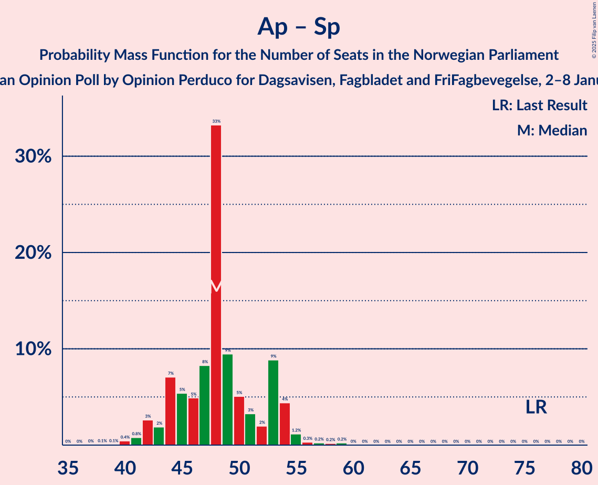

| Number of Seats | Probability | Accumulated | Special Marks |
|:---------------:|:-----------:|:-----------:|:-------------:|
| 37 | 0% | 100% |  |
| 38 | 0.1% | 99.9% |  |
| 39 | 0.1% | 99.9% |  |
| 40 | 0.4% | 99.8% |  |
| 41 | 0.8% | 99.4% |  |
| 42 | 3% | 98.6% |  |
| 43 | 2% | 96% |  |
| 44 | 7% | 94% |  |
| 45 | 5% | 87% |  |
| 46 | 5% | 82% |  |
| 47 | 8% | 77% |  |
| 48 | 33% | 68% | Median |
| 49 | 9% | 35% |  |
| 50 | 5% | 26% |  |
| 51 | 3% | 21% |  |
| 52 | 2% | 17% |  |
| 53 | 9% | 15% |  |
| 54 | 4% | 7% |  |
| 55 | 1.2% | 2% |  |
| 56 | 0.3% | 1.0% |  |
| 57 | 0.2% | 0.7% |  |
| 58 | 0.2% | 0.4% |  |
| 59 | 0.2% | 0.2% |  |
| 60 | 0% | 0% |  |
| 61 | 0% | 0% |  |
| 62 | 0% | 0% |  |
| 63 | 0% | 0% |  |
| 64 | 0% | 0% |  |
| 65 | 0% | 0% |  |
| 66 | 0% | 0% |  |
| 67 | 0% | 0% |  |
| 68 | 0% | 0% |  |
| 69 | 0% | 0% |  |
| 70 | 0% | 0% |  |
| 71 | 0% | 0% |  |
| 72 | 0% | 0% |  |
| 73 | 0% | 0% |  |
| 74 | 0% | 0% |  |
| 75 | 0% | 0% |  |
| 76 | 0% | 0% | Last Result |

### Senterpartiet – Venstre – Kristelig Folkeparti

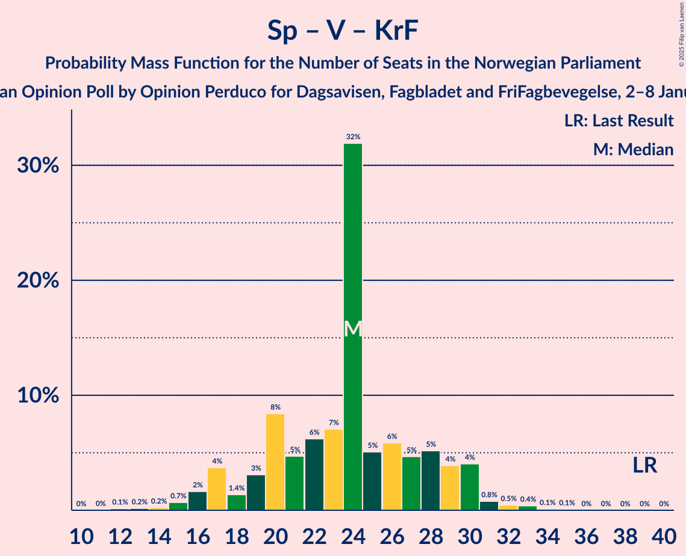

| Number of Seats | Probability | Accumulated | Special Marks |
|:---------------:|:-----------:|:-----------:|:-------------:|
| 12 | 0.1% | 100% |  |
| 13 | 0.2% | 99.8% |  |
| 14 | 0.2% | 99.6% |  |
| 15 | 0.7% | 99.4% |  |
| 16 | 2% | 98.7% |  |
| 17 | 4% | 97% |  |
| 18 | 1.4% | 93% |  |
| 19 | 3% | 92% |  |
| 20 | 8% | 89% |  |
| 21 | 5% | 80% |  |
| 22 | 6% | 76% |  |
| 23 | 7% | 70% | Median |
| 24 | 32% | 63% |  |
| 25 | 5% | 31% |  |
| 26 | 6% | 26% |  |
| 27 | 5% | 20% |  |
| 28 | 5% | 15% |  |
| 29 | 4% | 10% |  |
| 30 | 4% | 6% |  |
| 31 | 0.8% | 2% |  |
| 32 | 0.5% | 1.1% |  |
| 33 | 0.4% | 0.6% |  |
| 34 | 0.1% | 0.2% |  |
| 35 | 0.1% | 0.1% |  |
| 36 | 0% | 0% |  |
| 37 | 0% | 0% |  |
| 38 | 0% | 0% |  |
| 39 | 0% | 0% | Last Result |

## Technical Information

### Opinion Poll

+ **Polling firm:** Opinion Perduco
+ **Commissioner(s):** Dagsavisen, Fagbladet and FriFagbevegelse
+ **Fieldwork period:** 2–8 January 2024

### Calculations

+ **Sample size:** 690
+ **Simulations done:** 1,048,576
+ **Error estimate:** 2.23%

