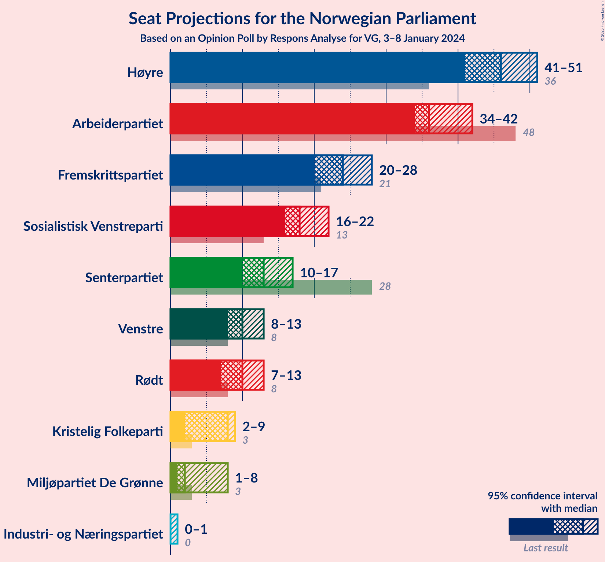

# Opinion Poll by Respons Analyse for VG, 3–8 January 2024

<a href="#voting-intentions">Voting Intentions</a> | <a href="#seats">Seats</a> | <a href="#coalitions">Coalitions</a> | <a href="#technical-information">Technical Information</a>

## Voting Intentions

### Confidence Intervals

| Party | Last Result | Poll Result | 80% Confidence Interval | 90% Confidence Interval | 95% Confidence Interval | 99% Confidence Interval |
|:-----:|:-----------:|:-----------:|:-----------------------:|:-----------------------:|:-----------------------:|:-----------------------:|
| Høyre | 20.4% | 26.2% | 24.5–28.0% |24.0–28.6% |23.6–29.0% |22.8–29.9% |
| Arbeiderpartiet | 26.2% | 20.5% | 18.9–22.2% |18.5–22.7% |18.1–23.1% |17.4–24.0% |
| Fremskrittspartiet | 11.6% | 13.5% | 12.2–15.0% |11.8–15.4% |11.5–15.8% |10.9–16.5% |
| Sosialistisk Venstreparti | 7.6% | 10.7% | 9.5–12.1% |9.2–12.4% |8.9–12.8% |8.4–13.5% |
| Senterpartiet | 13.5% | 7.6% | 6.6–8.8% |6.3–9.1% |6.1–9.4% |5.7–10.0% |
| Venstre | 4.6% | 5.9% | 5.0–7.0% |4.8–7.3% |4.6–7.5% |4.2–8.1% |
| Rødt | 4.7% | 5.4% | 4.6–6.4% |4.3–6.7% |4.2–7.0% |3.8–7.5% |
| Kristelig Folkeparti | 3.8% | 4.1% | 3.4–5.0% |3.2–5.3% |3.0–5.5% |2.7–6.0% |
| Miljøpartiet De Grønne | 3.9% | 3.5% | 2.9–4.4% |2.7–4.6% |2.5–4.8% |2.2–5.3% |
| Industri- og Næringspartiet | 0.3% | 1.7% | 1.3–2.4% |1.2–2.5% |1.1–2.7% |0.9–3.1% |

*Note:* The poll result column reflects the actual value used in the calculations. Published results may vary slightly, and in addition be rounded to fewer digits.

## Seats

### Confidence Intervals

| Party | Last Result | Median | 80% Confidence Interval | 90% Confidence Interval | 95% Confidence Interval | 99% Confidence Interval |
|:-----:|:-----------:|:------:|:-----------------------:|:-----------------------:|:-----------------------:|:-----------------------:|
| <a href="#høyre">Høyre</a> | 36 | 46 | 43–48 |42–49 |41–51 |40–53 |
| <a href="#arbeiderpartiet">Arbeiderpartiet</a> | 48 | 36 | 35–41 |34–42 |34–42 |33–45 |
| <a href="#fremskrittspartiet">Fremskrittspartiet</a> | 21 | 24 | 22–26 |21–27 |20–28 |19–29 |
| <a href="#sosialistisk-venstreparti">Sosialistisk Venstreparti</a> | 13 | 18 | 17–20 |16–21 |16–22 |15–24 |
| <a href="#senterpartiet">Senterpartiet</a> | 28 | 13 | 12–15 |11–15 |10–17 |10–17 |
| <a href="#venstre">Venstre</a> | 8 | 10 | 9–12 |8–13 |8–13 |7–14 |
| <a href="#rødt">Rødt</a> | 8 | 10 | 8–11 |8–12 |7–13 |1–13 |
| <a href="#kristelig-folkeparti">Kristelig Folkeparti</a> | 3 | 8 | 2–9 |2–9 |2–9 |2–10 |
| <a href="#miljøpartiet-de-grønne">Miljøpartiet De Grønne</a> | 3 | 2 | 1–7 |1–8 |1–8 |1–9 |
| <a href="#industri--og-næringspartiet">Industri- og Næringspartiet</a> | 0 | 0 | 0 |0 |0–1 |0–2 |

### Høyre

*For a full overview of the results for this party, see the [Høyre](party-høyre.html) page.*

| Number of Seats | Probability | Accumulated | Special Marks |
|:---------------:|:-----------:|:-----------:|:-------------:|
| 36 | 0% | 100% | Last Result |
| 37 | 0% | 100% |  |
| 38 | 0% | 100% |  |
| 39 | 0.1% | 99.9% |  |
| 40 | 1.4% | 99.9% |  |
| 41 | 2% | 98% |  |
| 42 | 3% | 96% |  |
| 43 | 9% | 93% |  |
| 44 | 13% | 84% |  |
| 45 | 7% | 71% |  |
| 46 | 39% | 64% | Median |
| 47 | 11% | 25% |  |
| 48 | 5% | 14% |  |
| 49 | 4% | 9% |  |
| 50 | 2% | 5% |  |
| 51 | 1.3% | 3% |  |
| 52 | 0.9% | 2% |  |
| 53 | 0.5% | 0.7% |  |
| 54 | 0.2% | 0.2% |  |
| 55 | 0% | 0.1% |  |
| 56 | 0% | 0% |  |

### Arbeiderpartiet

*For a full overview of the results for this party, see the [Arbeiderpartiet](party-arbeiderpartiet.html) page.*

| Number of Seats | Probability | Accumulated | Special Marks |
|:---------------:|:-----------:|:-----------:|:-------------:|
| 31 | 0% | 100% |  |
| 32 | 0.3% | 99.9% |  |
| 33 | 2% | 99.6% |  |
| 34 | 4% | 98% |  |
| 35 | 11% | 94% |  |
| 36 | 40% | 82% | Median |
| 37 | 9% | 42% |  |
| 38 | 11% | 33% |  |
| 39 | 4% | 21% |  |
| 40 | 3% | 17% |  |
| 41 | 8% | 14% |  |
| 42 | 4% | 6% |  |
| 43 | 0.9% | 2% |  |
| 44 | 0.6% | 1.2% |  |
| 45 | 0.5% | 0.6% |  |
| 46 | 0.1% | 0.1% |  |
| 47 | 0% | 0% |  |
| 48 | 0% | 0% | Last Result |

### Fremskrittspartiet

*For a full overview of the results for this party, see the [Fremskrittspartiet](party-fremskrittspartiet.html) page.*

| Number of Seats | Probability | Accumulated | Special Marks |
|:---------------:|:-----------:|:-----------:|:-------------:|
| 17 | 0.1% | 100% |  |
| 18 | 0.1% | 99.9% |  |
| 19 | 0.6% | 99.8% |  |
| 20 | 2% | 99.2% |  |
| 21 | 6% | 97% | Last Result |
| 22 | 13% | 91% |  |
| 23 | 10% | 78% |  |
| 24 | 42% | 68% | Median |
| 25 | 13% | 26% |  |
| 26 | 6% | 13% |  |
| 27 | 4% | 7% |  |
| 28 | 2% | 3% |  |
| 29 | 0.3% | 0.8% |  |
| 30 | 0.3% | 0.5% |  |
| 31 | 0.1% | 0.1% |  |
| 32 | 0% | 0.1% |  |
| 33 | 0.1% | 0.1% |  |
| 34 | 0% | 0% |  |

### Sosialistisk Venstreparti

*For a full overview of the results for this party, see the [Sosialistisk Venstreparti](party-sosialistiskvenstreparti.html) page.*

| Number of Seats | Probability | Accumulated | Special Marks |
|:---------------:|:-----------:|:-----------:|:-------------:|
| 13 | 0.1% | 100% | Last Result |
| 14 | 0.4% | 99.9% |  |
| 15 | 1.5% | 99.5% |  |
| 16 | 6% | 98% |  |
| 17 | 10% | 92% |  |
| 18 | 47% | 82% | Median |
| 19 | 15% | 35% |  |
| 20 | 10% | 20% |  |
| 21 | 5% | 9% |  |
| 22 | 3% | 5% |  |
| 23 | 0.4% | 1.2% |  |
| 24 | 0.6% | 0.8% |  |
| 25 | 0.2% | 0.2% |  |
| 26 | 0% | 0% |  |

### Senterpartiet

*For a full overview of the results for this party, see the [Senterpartiet](party-senterpartiet.html) page.*

| Number of Seats | Probability | Accumulated | Special Marks |
|:---------------:|:-----------:|:-----------:|:-------------:|
| 8 | 0.1% | 100% |  |
| 9 | 0.4% | 99.9% |  |
| 10 | 2% | 99.5% |  |
| 11 | 4% | 97% |  |
| 12 | 5% | 93% |  |
| 13 | 54% | 88% | Median |
| 14 | 23% | 34% |  |
| 15 | 6% | 11% |  |
| 16 | 2% | 5% |  |
| 17 | 2% | 3% |  |
| 18 | 0.4% | 0.4% |  |
| 19 | 0% | 0% |  |
| 20 | 0% | 0% |  |
| 21 | 0% | 0% |  |
| 22 | 0% | 0% |  |
| 23 | 0% | 0% |  |
| 24 | 0% | 0% |  |
| 25 | 0% | 0% |  |
| 26 | 0% | 0% |  |
| 27 | 0% | 0% |  |
| 28 | 0% | 0% | Last Result |

### Venstre

*For a full overview of the results for this party, see the [Venstre](party-venstre.html) page.*

| Number of Seats | Probability | Accumulated | Special Marks |
|:---------------:|:-----------:|:-----------:|:-------------:|
| 3 | 0.1% | 100% |  |
| 4 | 0% | 99.9% |  |
| 5 | 0% | 99.9% |  |
| 6 | 0% | 99.9% |  |
| 7 | 1.1% | 99.9% |  |
| 8 | 5% | 98.8% | Last Result |
| 9 | 12% | 94% |  |
| 10 | 45% | 82% | Median |
| 11 | 14% | 37% |  |
| 12 | 14% | 23% |  |
| 13 | 8% | 9% |  |
| 14 | 0.9% | 1.0% |  |
| 15 | 0% | 0.1% |  |
| 16 | 0% | 0% |  |

### Rødt

*For a full overview of the results for this party, see the [Rødt](party-rødt.html) page.*

| Number of Seats | Probability | Accumulated | Special Marks |
|:---------------:|:-----------:|:-----------:|:-------------:|
| 1 | 0.8% | 100% |  |
| 2 | 0% | 99.2% |  |
| 3 | 0% | 99.2% |  |
| 4 | 0% | 99.2% |  |
| 5 | 0% | 99.2% |  |
| 6 | 0% | 99.2% |  |
| 7 | 3% | 99.2% |  |
| 8 | 12% | 96% | Last Result |
| 9 | 19% | 83% |  |
| 10 | 45% | 64% | Median |
| 11 | 13% | 19% |  |
| 12 | 3% | 6% |  |
| 13 | 3% | 3% |  |
| 14 | 0.1% | 0.1% |  |
| 15 | 0% | 0% |  |

### Kristelig Folkeparti

*For a full overview of the results for this party, see the [Kristelig Folkeparti](party-kristeligfolkeparti.html) page.*

| Number of Seats | Probability | Accumulated | Special Marks |
|:---------------:|:-----------:|:-----------:|:-------------:|
| 2 | 19% | 100% |  |
| 3 | 12% | 81% | Last Result |
| 4 | 0% | 70% |  |
| 5 | 0% | 70% |  |
| 6 | 0.1% | 70% |  |
| 7 | 17% | 70% |  |
| 8 | 14% | 52% | Median |
| 9 | 38% | 38% |  |
| 10 | 0.6% | 0.7% |  |
| 11 | 0.1% | 0.1% |  |
| 12 | 0% | 0% |  |

### Miljøpartiet De Grønne

*For a full overview of the results for this party, see the [Miljøpartiet De Grønne](party-miljøpartietdegrønne.html) page.*

| Number of Seats | Probability | Accumulated | Special Marks |
|:---------------:|:-----------:|:-----------:|:-------------:|
| 1 | 15% | 100% |  |
| 2 | 59% | 85% | Median |
| 3 | 5% | 26% | Last Result |
| 4 | 0% | 21% |  |
| 5 | 0% | 21% |  |
| 6 | 0.1% | 21% |  |
| 7 | 14% | 21% |  |
| 8 | 5% | 7% |  |
| 9 | 1.1% | 1.1% |  |
| 10 | 0.1% | 0.1% |  |
| 11 | 0% | 0% |  |

### Industri- og Næringspartiet

*For a full overview of the results for this party, see the [Industri- og Næringspartiet](party-industri-ognæringspartiet.html) page.*

| Number of Seats | Probability | Accumulated | Special Marks |
|:---------------:|:-----------:|:-----------:|:-------------:|
| 0 | 96% | 100% | Last Result, Median |
| 1 | 3% | 4% |  |
| 2 | 1.1% | 1.1% |  |
| 3 | 0% | 0% |  |

## Coalitions

### Confidence Intervals

| Coalition | Last Result | Median | Majority? | 80% Confidence Interval | 90% Confidence Interval | 95% Confidence Interval | 99% Confidence Interval |
|:---------:|:-----------:|:------:|:---------:|:-----------------------:|:-----------------------:|:-----------------------:|:-----------------------:|
| Høyre – Fremskrittspartiet – Senterpartiet – Venstre – Kristelig Folkeparti | 96 | 102 | 100% | 94–103 | 91–103 | 91–105 | 90–106 |
| Høyre – Fremskrittspartiet – Venstre – Kristelig Folkeparti – Miljøpartiet De Grønne | 71 | 91 | 95% | 85–92 | 85–94 | 83–94 | 81–96 |
| Høyre – Fremskrittspartiet – Venstre – Kristelig Folkeparti | 68 | 88 | 73% | 80–89 | 78–90 | 78–91 | 77–92 |
| Arbeiderpartiet – Sosialistisk Venstreparti – Senterpartiet – Rødt – Miljøpartiet De Grønne | 100 | 79 | 19% | 79–88 | 78–90 | 77–90 | 75–91 |
| Høyre – Fremskrittspartiet – Venstre | 65 | 80 | 8% | 76–84 | 76–85 | 74–86 | 72–88 |
| Arbeiderpartiet – Sosialistisk Venstreparti – Senterpartiet – Rødt | 97 | 77 | 3% | 76–83 | 74–83 | 74–85 | 72–87 |
| Arbeiderpartiet – Sosialistisk Venstreparti – Senterpartiet – Kristelig Folkeparti – Miljøpartiet De Grønne | 95 | 78 | 3% | 75–82 | 74–83 | 72–85 | 70–87 |
| Arbeiderpartiet – Sosialistisk Venstreparti – Senterpartiet – Miljøpartiet De Grønne | 92 | 70 | 0% | 69–78 | 68–79 | 67–79 | 66–81 |
| Arbeiderpartiet – Sosialistisk Venstreparti – Rødt – Miljøpartiet De Grønne | 72 | 66 | 0% | 65–74 | 65–77 | 63–77 | 62–78 |
| Høyre – Fremskrittspartiet | 57 | 70 | 0% | 65–73 | 65–74 | 64–76 | 62–78 |
| Arbeiderpartiet – Sosialistisk Venstreparti – Senterpartiet | 89 | 68 | 0% | 67–72 | 65–74 | 64–75 | 63–78 |
| Høyre – Venstre – Kristelig Folkeparti | 47 | 64 | 0% | 58–65 | 56–67 | 56–67 | 54–69 |
| Arbeiderpartiet – Senterpartiet – Kristelig Folkeparti – Miljøpartiet De Grønne | 82 | 60 | 0% | 56–64 | 55–65 | 53–66 | 51–69 |
| Arbeiderpartiet – Senterpartiet – Kristelig Folkeparti | 79 | 58 | 0% | 53–60 | 52–62 | 51–62 | 49–65 |
| Arbeiderpartiet – Sosialistisk Venstreparti | 61 | 54 | 0% | 53–59 | 52–60 | 51–61 | 50–64 |
| Arbeiderpartiet – Senterpartiet | 76 | 49 | 0% | 49–54 | 48–54 | 47–55 | 46–58 |
| Senterpartiet – Venstre – Kristelig Folkeparti | 39 | 31 | 0% | 26–34 | 25–34 | 24–35 | 23–36 |

### Høyre – Fremskrittspartiet – Senterpartiet – Venstre – Kristelig Folkeparti

| Number of Seats | Probability | Accumulated | Special Marks |
|:---------------:|:-----------:|:-----------:|:-------------:|
| 88 | 0% | 100% |  |
| 89 | 0.2% | 99.9% |  |
| 90 | 0.4% | 99.7% |  |
| 91 | 6% | 99.3% |  |
| 92 | 0.9% | 93% |  |
| 93 | 1.5% | 92% |  |
| 94 | 3% | 91% |  |
| 95 | 3% | 88% |  |
| 96 | 4% | 85% | Last Result |
| 97 | 5% | 82% |  |
| 98 | 5% | 76% |  |
| 99 | 8% | 71% |  |
| 100 | 3% | 62% |  |
| 101 | 8% | 59% | Median |
| 102 | 35% | 51% |  |
| 103 | 11% | 16% |  |
| 104 | 1.2% | 4% |  |
| 105 | 3% | 3% |  |
| 106 | 0.3% | 0.6% |  |
| 107 | 0.1% | 0.2% |  |
| 108 | 0.1% | 0.2% |  |
| 109 | 0% | 0.1% |  |
| 110 | 0% | 0.1% |  |
| 111 | 0% | 0% |  |

### Høyre – Fremskrittspartiet – Venstre – Kristelig Folkeparti – Miljøpartiet De Grønne

| Number of Seats | Probability | Accumulated | Special Marks |
|:---------------:|:-----------:|:-----------:|:-------------:|
| 71 | 0% | 100% | Last Result |
| 72 | 0% | 100% |  |
| 73 | 0% | 100% |  |
| 74 | 0% | 100% |  |
| 75 | 0% | 100% |  |
| 76 | 0% | 100% |  |
| 77 | 0% | 100% |  |
| 78 | 0% | 100% |  |
| 79 | 0% | 100% |  |
| 80 | 0.4% | 99.9% |  |
| 81 | 0.4% | 99.6% |  |
| 82 | 2% | 99.2% |  |
| 83 | 0.9% | 98% |  |
| 84 | 1.3% | 97% |  |
| 85 | 8% | 95% | Majority |
| 86 | 8% | 87% |  |
| 87 | 6% | 79% |  |
| 88 | 4% | 73% |  |
| 89 | 7% | 69% |  |
| 90 | 6% | 62% | Median |
| 91 | 42% | 56% |  |
| 92 | 5% | 14% |  |
| 93 | 4% | 9% |  |
| 94 | 3% | 5% |  |
| 95 | 1.2% | 2% |  |
| 96 | 0.6% | 1.0% |  |
| 97 | 0.2% | 0.4% |  |
| 98 | 0.1% | 0.2% |  |
| 99 | 0% | 0.1% |  |
| 100 | 0% | 0.1% |  |
| 101 | 0% | 0% |  |

### Høyre – Fremskrittspartiet – Venstre – Kristelig Folkeparti

| Number of Seats | Probability | Accumulated | Special Marks |
|:---------------:|:-----------:|:-----------:|:-------------:|
| 68 | 0% | 100% | Last Result |
| 69 | 0% | 100% |  |
| 70 | 0% | 100% |  |
| 71 | 0% | 100% |  |
| 72 | 0% | 100% |  |
| 73 | 0% | 100% |  |
| 74 | 0% | 100% |  |
| 75 | 0.1% | 100% |  |
| 76 | 0.2% | 99.9% |  |
| 77 | 0.3% | 99.7% |  |
| 78 | 6% | 99.4% |  |
| 79 | 0.9% | 93% |  |
| 80 | 3% | 92% |  |
| 81 | 2% | 89% |  |
| 82 | 1.3% | 87% |  |
| 83 | 4% | 86% |  |
| 84 | 8% | 81% |  |
| 85 | 6% | 73% | Majority |
| 86 | 5% | 67% |  |
| 87 | 7% | 61% |  |
| 88 | 6% | 54% | Median |
| 89 | 39% | 48% |  |
| 90 | 5% | 9% |  |
| 91 | 3% | 4% |  |
| 92 | 1.0% | 1.4% |  |
| 93 | 0.2% | 0.5% |  |
| 94 | 0.1% | 0.3% |  |
| 95 | 0.1% | 0.2% |  |
| 96 | 0% | 0.1% |  |
| 97 | 0% | 0.1% |  |
| 98 | 0% | 0% |  |

### Arbeiderpartiet – Sosialistisk Venstreparti – Senterpartiet – Rødt – Miljøpartiet De Grønne

| Number of Seats | Probability | Accumulated | Special Marks |
|:---------------:|:-----------:|:-----------:|:-------------:|
| 71 | 0% | 100% |  |
| 72 | 0% | 99.9% |  |
| 73 | 0.1% | 99.9% |  |
| 74 | 0.1% | 99.8% |  |
| 75 | 0.2% | 99.7% |  |
| 76 | 0.9% | 99.5% |  |
| 77 | 3% | 98.5% |  |
| 78 | 5% | 96% |  |
| 79 | 41% | 91% | Median |
| 80 | 4% | 50% |  |
| 81 | 7% | 46% |  |
| 82 | 5% | 39% |  |
| 83 | 6% | 33% |  |
| 84 | 8% | 27% |  |
| 85 | 4% | 19% | Majority |
| 86 | 1.2% | 14% |  |
| 87 | 2% | 13% |  |
| 88 | 3% | 11% |  |
| 89 | 0.9% | 8% |  |
| 90 | 6% | 7% |  |
| 91 | 0.3% | 0.6% |  |
| 92 | 0.2% | 0.3% |  |
| 93 | 0.1% | 0.1% |  |
| 94 | 0% | 0% |  |
| 95 | 0% | 0% |  |
| 96 | 0% | 0% |  |
| 97 | 0% | 0% |  |
| 98 | 0% | 0% |  |
| 99 | 0% | 0% |  |
| 100 | 0% | 0% | Last Result |

### Høyre – Fremskrittspartiet – Venstre

| Number of Seats | Probability | Accumulated | Special Marks |
|:---------------:|:-----------:|:-----------:|:-------------:|
| 65 | 0% | 100% | Last Result |
| 66 | 0% | 100% |  |
| 67 | 0% | 100% |  |
| 68 | 0% | 100% |  |
| 69 | 0% | 100% |  |
| 70 | 0.1% | 99.9% |  |
| 71 | 0.2% | 99.9% |  |
| 72 | 0.6% | 99.6% |  |
| 73 | 1.1% | 99.0% |  |
| 74 | 1.4% | 98% |  |
| 75 | 1.5% | 97% |  |
| 76 | 9% | 95% |  |
| 77 | 8% | 86% |  |
| 78 | 5% | 78% |  |
| 79 | 3% | 74% |  |
| 80 | 39% | 71% | Median |
| 81 | 6% | 32% |  |
| 82 | 12% | 26% |  |
| 83 | 3% | 14% |  |
| 84 | 3% | 11% |  |
| 85 | 4% | 8% | Majority |
| 86 | 0.8% | 3% |  |
| 87 | 2% | 2% |  |
| 88 | 0.5% | 0.9% |  |
| 89 | 0.1% | 0.4% |  |
| 90 | 0.2% | 0.3% |  |
| 91 | 0% | 0% |  |

### Arbeiderpartiet – Sosialistisk Venstreparti – Senterpartiet – Rødt

| Number of Seats | Probability | Accumulated | Special Marks |
|:---------------:|:-----------:|:-----------:|:-------------:|
| 68 | 0% | 100% |  |
| 69 | 0% | 99.9% |  |
| 70 | 0.1% | 99.9% |  |
| 71 | 0.2% | 99.8% |  |
| 72 | 0.6% | 99.6% |  |
| 73 | 1.2% | 99.0% |  |
| 74 | 3% | 98% |  |
| 75 | 4% | 95% |  |
| 76 | 5% | 91% |  |
| 77 | 44% | 86% | Median |
| 78 | 4% | 41% |  |
| 79 | 7% | 38% |  |
| 80 | 4% | 31% |  |
| 81 | 6% | 27% |  |
| 82 | 8% | 21% |  |
| 83 | 8% | 13% |  |
| 84 | 1.3% | 5% |  |
| 85 | 0.9% | 3% | Majority |
| 86 | 2% | 2% |  |
| 87 | 0.4% | 0.8% |  |
| 88 | 0.3% | 0.4% |  |
| 89 | 0.1% | 0.1% |  |
| 90 | 0% | 0% |  |
| 91 | 0% | 0% |  |
| 92 | 0% | 0% |  |
| 93 | 0% | 0% |  |
| 94 | 0% | 0% |  |
| 95 | 0% | 0% |  |
| 96 | 0% | 0% |  |
| 97 | 0% | 0% | Last Result |

### Arbeiderpartiet – Sosialistisk Venstreparti – Senterpartiet – Kristelig Folkeparti – Miljøpartiet De Grønne

| Number of Seats | Probability | Accumulated | Special Marks |
|:---------------:|:-----------:|:-----------:|:-------------:|
| 68 | 0.2% | 100% |  |
| 69 | 0.2% | 99.8% |  |
| 70 | 0.1% | 99.6% |  |
| 71 | 0.6% | 99.5% |  |
| 72 | 2% | 98.9% |  |
| 73 | 2% | 97% |  |
| 74 | 3% | 96% |  |
| 75 | 8% | 93% |  |
| 76 | 5% | 85% |  |
| 77 | 10% | 79% | Median |
| 78 | 36% | 69% |  |
| 79 | 4% | 33% |  |
| 80 | 5% | 29% |  |
| 81 | 11% | 24% |  |
| 82 | 5% | 13% |  |
| 83 | 3% | 8% |  |
| 84 | 1.4% | 5% |  |
| 85 | 2% | 3% | Majority |
| 86 | 0.7% | 2% |  |
| 87 | 0.5% | 0.8% |  |
| 88 | 0.1% | 0.3% |  |
| 89 | 0.1% | 0.2% |  |
| 90 | 0% | 0.1% |  |
| 91 | 0% | 0% |  |
| 92 | 0% | 0% |  |
| 93 | 0% | 0% |  |
| 94 | 0% | 0% |  |
| 95 | 0% | 0% | Last Result |

### Arbeiderpartiet – Sosialistisk Venstreparti – Senterpartiet – Miljøpartiet De Grønne

| Number of Seats | Probability | Accumulated | Special Marks |
|:---------------:|:-----------:|:-----------:|:-------------:|
| 63 | 0% | 100% |  |
| 64 | 0.1% | 99.9% |  |
| 65 | 0.4% | 99.9% |  |
| 66 | 1.3% | 99.5% |  |
| 67 | 2% | 98% |  |
| 68 | 4% | 96% |  |
| 69 | 34% | 92% | Median |
| 70 | 11% | 59% |  |
| 71 | 3% | 47% |  |
| 72 | 4% | 44% |  |
| 73 | 11% | 40% |  |
| 74 | 8% | 29% |  |
| 75 | 3% | 22% |  |
| 76 | 6% | 19% |  |
| 77 | 2% | 13% |  |
| 78 | 3% | 11% |  |
| 79 | 7% | 9% |  |
| 80 | 1.4% | 2% |  |
| 81 | 0.2% | 0.7% |  |
| 82 | 0.2% | 0.5% |  |
| 83 | 0.2% | 0.3% |  |
| 84 | 0.1% | 0.1% |  |
| 85 | 0% | 0% | Majority |
| 86 | 0% | 0% |  |
| 87 | 0% | 0% |  |
| 88 | 0% | 0% |  |
| 89 | 0% | 0% |  |
| 90 | 0% | 0% |  |
| 91 | 0% | 0% |  |
| 92 | 0% | 0% | Last Result |

### Arbeiderpartiet – Sosialistisk Venstreparti – Rødt – Miljøpartiet De Grønne

| Number of Seats | Probability | Accumulated | Special Marks |
|:---------------:|:-----------:|:-----------:|:-------------:|
| 58 | 0% | 100% |  |
| 59 | 0% | 99.9% |  |
| 60 | 0.1% | 99.9% |  |
| 61 | 0.1% | 99.8% |  |
| 62 | 0.4% | 99.8% |  |
| 63 | 3% | 99.4% |  |
| 64 | 1.2% | 97% |  |
| 65 | 12% | 96% |  |
| 66 | 37% | 84% | Median |
| 67 | 6% | 47% |  |
| 68 | 3% | 41% |  |
| 69 | 8% | 37% |  |
| 70 | 5% | 29% |  |
| 71 | 6% | 24% |  |
| 72 | 3% | 18% | Last Result |
| 73 | 3% | 15% |  |
| 74 | 3% | 12% |  |
| 75 | 1.5% | 9% |  |
| 76 | 1.0% | 7% |  |
| 77 | 6% | 7% |  |
| 78 | 0.4% | 0.6% |  |
| 79 | 0.2% | 0.2% |  |
| 80 | 0% | 0.1% |  |
| 81 | 0% | 0% |  |

### Høyre – Fremskrittspartiet

| Number of Seats | Probability | Accumulated | Special Marks |
|:---------------:|:-----------:|:-----------:|:-------------:|
| 57 | 0% | 100% | Last Result |
| 58 | 0% | 100% |  |
| 59 | 0.1% | 100% |  |
| 60 | 0.1% | 99.9% |  |
| 61 | 0.2% | 99.8% |  |
| 62 | 0.8% | 99.7% |  |
| 63 | 0.7% | 98.8% |  |
| 64 | 1.4% | 98% |  |
| 65 | 8% | 97% |  |
| 66 | 5% | 88% |  |
| 67 | 4% | 84% |  |
| 68 | 9% | 79% |  |
| 69 | 9% | 71% |  |
| 70 | 36% | 62% | Median |
| 71 | 9% | 26% |  |
| 72 | 2% | 16% |  |
| 73 | 8% | 14% |  |
| 74 | 2% | 6% |  |
| 75 | 2% | 4% |  |
| 76 | 2% | 3% |  |
| 77 | 0.6% | 1.1% |  |
| 78 | 0.1% | 0.5% |  |
| 79 | 0.3% | 0.4% |  |
| 80 | 0% | 0.1% |  |
| 81 | 0% | 0.1% |  |
| 82 | 0% | 0% |  |

### Arbeiderpartiet – Sosialistisk Venstreparti – Senterpartiet

| Number of Seats | Probability | Accumulated | Special Marks |
|:---------------:|:-----------:|:-----------:|:-------------:|
| 61 | 0.1% | 100% |  |
| 62 | 0.3% | 99.9% |  |
| 63 | 0.5% | 99.6% |  |
| 64 | 2% | 99.1% |  |
| 65 | 2% | 97% |  |
| 66 | 4% | 95% |  |
| 67 | 36% | 91% | Median |
| 68 | 15% | 55% |  |
| 69 | 4% | 40% |  |
| 70 | 7% | 36% |  |
| 71 | 9% | 29% |  |
| 72 | 10% | 20% |  |
| 73 | 5% | 10% |  |
| 74 | 2% | 5% |  |
| 75 | 2% | 3% |  |
| 76 | 0.4% | 1.3% |  |
| 77 | 0.4% | 0.9% |  |
| 78 | 0.4% | 0.5% |  |
| 79 | 0.1% | 0.1% |  |
| 80 | 0% | 0% |  |
| 81 | 0% | 0% |  |
| 82 | 0% | 0% |  |
| 83 | 0% | 0% |  |
| 84 | 0% | 0% |  |
| 85 | 0% | 0% | Majority |
| 86 | 0% | 0% |  |
| 87 | 0% | 0% |  |
| 88 | 0% | 0% |  |
| 89 | 0% | 0% | Last Result |

### Høyre – Venstre – Kristelig Folkeparti

| Number of Seats | Probability | Accumulated | Special Marks |
|:---------------:|:-----------:|:-----------:|:-------------:|
| 47 | 0% | 100% | Last Result |
| 48 | 0% | 100% |  |
| 49 | 0% | 100% |  |
| 50 | 0% | 100% |  |
| 51 | 0% | 100% |  |
| 52 | 0.3% | 100% |  |
| 53 | 0.1% | 99.7% |  |
| 54 | 1.0% | 99.6% |  |
| 55 | 0.5% | 98.6% |  |
| 56 | 6% | 98% |  |
| 57 | 2% | 92% |  |
| 58 | 4% | 90% |  |
| 59 | 6% | 86% |  |
| 60 | 7% | 80% |  |
| 61 | 6% | 74% |  |
| 62 | 5% | 68% |  |
| 63 | 9% | 63% |  |
| 64 | 13% | 54% | Median |
| 65 | 34% | 41% |  |
| 66 | 2% | 7% |  |
| 67 | 4% | 5% |  |
| 68 | 0.6% | 2% |  |
| 69 | 0.9% | 1.1% |  |
| 70 | 0.1% | 0.3% |  |
| 71 | 0% | 0.1% |  |
| 72 | 0% | 0.1% |  |
| 73 | 0% | 0% |  |

### Arbeiderpartiet – Senterpartiet – Kristelig Folkeparti – Miljøpartiet De Grønne

| Number of Seats | Probability | Accumulated | Special Marks |
|:---------------:|:-----------:|:-----------:|:-------------:|
| 49 | 0% | 100% |  |
| 50 | 0% | 99.9% |  |
| 51 | 0.7% | 99.9% |  |
| 52 | 0.5% | 99.2% |  |
| 53 | 1.2% | 98.7% |  |
| 54 | 2% | 97% |  |
| 55 | 4% | 96% |  |
| 56 | 3% | 92% |  |
| 57 | 7% | 89% |  |
| 58 | 12% | 82% |  |
| 59 | 6% | 70% | Median |
| 60 | 35% | 64% |  |
| 61 | 4% | 29% |  |
| 62 | 4% | 25% |  |
| 63 | 12% | 22% |  |
| 64 | 3% | 10% |  |
| 65 | 3% | 8% |  |
| 66 | 2% | 5% |  |
| 67 | 0.7% | 2% |  |
| 68 | 0.7% | 2% |  |
| 69 | 0.6% | 1.0% |  |
| 70 | 0.3% | 0.4% |  |
| 71 | 0.1% | 0.1% |  |
| 72 | 0% | 0.1% |  |
| 73 | 0% | 0% |  |
| 74 | 0% | 0% |  |
| 75 | 0% | 0% |  |
| 76 | 0% | 0% |  |
| 77 | 0% | 0% |  |
| 78 | 0% | 0% |  |
| 79 | 0% | 0% |  |
| 80 | 0% | 0% |  |
| 81 | 0% | 0% |  |
| 82 | 0% | 0% | Last Result |

### Arbeiderpartiet – Senterpartiet – Kristelig Folkeparti

| Number of Seats | Probability | Accumulated | Special Marks |
|:---------------:|:-----------:|:-----------:|:-------------:|
| 47 | 0.1% | 100% |  |
| 48 | 0.1% | 99.9% |  |
| 49 | 0.8% | 99.9% |  |
| 50 | 0.9% | 99.1% |  |
| 51 | 1.5% | 98% |  |
| 52 | 4% | 97% |  |
| 53 | 4% | 93% |  |
| 54 | 5% | 88% |  |
| 55 | 8% | 83% |  |
| 56 | 16% | 75% |  |
| 57 | 8% | 60% | Median |
| 58 | 36% | 52% |  |
| 59 | 4% | 16% |  |
| 60 | 3% | 12% |  |
| 61 | 4% | 9% |  |
| 62 | 3% | 5% |  |
| 63 | 0.6% | 2% |  |
| 64 | 0.6% | 1.5% |  |
| 65 | 0.5% | 0.9% |  |
| 66 | 0.3% | 0.4% |  |
| 67 | 0.1% | 0.1% |  |
| 68 | 0% | 0% |  |
| 69 | 0% | 0% |  |
| 70 | 0% | 0% |  |
| 71 | 0% | 0% |  |
| 72 | 0% | 0% |  |
| 73 | 0% | 0% |  |
| 74 | 0% | 0% |  |
| 75 | 0% | 0% |  |
| 76 | 0% | 0% |  |
| 77 | 0% | 0% |  |
| 78 | 0% | 0% |  |
| 79 | 0% | 0% | Last Result |

### Arbeiderpartiet – Sosialistisk Venstreparti

| Number of Seats | Probability | Accumulated | Special Marks |
|:---------------:|:-----------:|:-----------:|:-------------:|
| 48 | 0.1% | 100% |  |
| 49 | 0.2% | 99.9% |  |
| 50 | 1.2% | 99.7% |  |
| 51 | 2% | 98.5% |  |
| 52 | 3% | 97% |  |
| 53 | 5% | 94% |  |
| 54 | 44% | 89% | Median |
| 55 | 8% | 45% |  |
| 56 | 8% | 38% |  |
| 57 | 5% | 30% |  |
| 58 | 5% | 25% |  |
| 59 | 11% | 20% |  |
| 60 | 5% | 9% |  |
| 61 | 2% | 4% | Last Result |
| 62 | 0.9% | 2% |  |
| 63 | 0.3% | 1.2% |  |
| 64 | 0.5% | 0.9% |  |
| 65 | 0.3% | 0.4% |  |
| 66 | 0% | 0.1% |  |
| 67 | 0% | 0% |  |

### Arbeiderpartiet – Senterpartiet

| Number of Seats | Probability | Accumulated | Special Marks |
|:---------------:|:-----------:|:-----------:|:-------------:|
| 44 | 0.1% | 100% |  |
| 45 | 0.2% | 99.8% |  |
| 46 | 2% | 99.6% |  |
| 47 | 3% | 98% |  |
| 48 | 4% | 95% |  |
| 49 | 46% | 91% | Median |
| 50 | 8% | 45% |  |
| 51 | 8% | 37% |  |
| 52 | 9% | 29% |  |
| 53 | 6% | 20% |  |
| 54 | 10% | 15% |  |
| 55 | 2% | 4% |  |
| 56 | 0.9% | 2% |  |
| 57 | 0.6% | 1.4% |  |
| 58 | 0.6% | 0.8% |  |
| 59 | 0.1% | 0.2% |  |
| 60 | 0.1% | 0.1% |  |
| 61 | 0% | 0% |  |
| 62 | 0% | 0% |  |
| 63 | 0% | 0% |  |
| 64 | 0% | 0% |  |
| 65 | 0% | 0% |  |
| 66 | 0% | 0% |  |
| 67 | 0% | 0% |  |
| 68 | 0% | 0% |  |
| 69 | 0% | 0% |  |
| 70 | 0% | 0% |  |
| 71 | 0% | 0% |  |
| 72 | 0% | 0% |  |
| 73 | 0% | 0% |  |
| 74 | 0% | 0% |  |
| 75 | 0% | 0% |  |
| 76 | 0% | 0% | Last Result |

### Senterpartiet – Venstre – Kristelig Folkeparti

| Number of Seats | Probability | Accumulated | Special Marks |
|:---------------:|:-----------:|:-----------:|:-------------:|
| 21 | 0% | 100% |  |
| 22 | 0.3% | 99.9% |  |
| 23 | 0.8% | 99.6% |  |
| 24 | 2% | 98.8% |  |
| 25 | 2% | 97% |  |
| 26 | 11% | 95% |  |
| 27 | 6% | 84% |  |
| 28 | 7% | 78% |  |
| 29 | 7% | 72% |  |
| 30 | 7% | 65% |  |
| 31 | 8% | 58% | Median |
| 32 | 35% | 50% |  |
| 33 | 4% | 15% |  |
| 34 | 8% | 11% |  |
| 35 | 2% | 3% |  |
| 36 | 1.0% | 1.2% |  |
| 37 | 0.1% | 0.3% |  |
| 38 | 0.1% | 0.1% |  |
| 39 | 0% | 0% | Last Result |

## Technical Information

### Opinion Poll

+ **Polling firm:** Respons Analyse
+ **Commissioner(s):** VG
+ **Fieldwork period:** 3–8 January 2024

### Calculations

+ **Sample size:** 1000
+ **Simulations done:** 1,048,576
+ **Error estimate:** 1.39%

