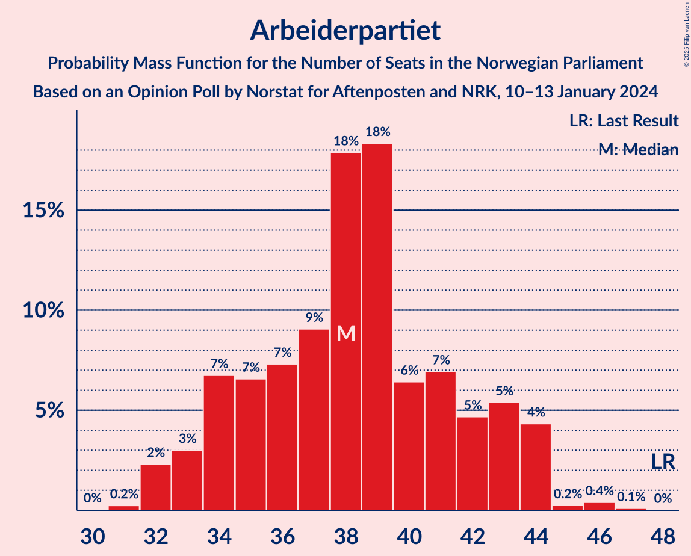
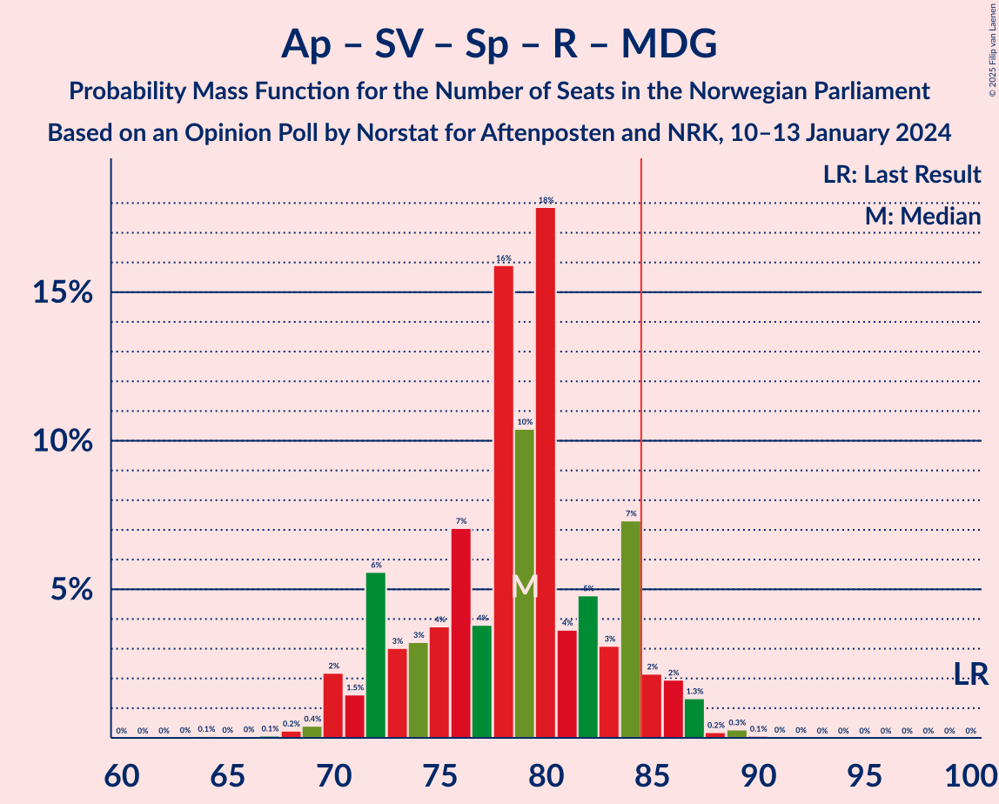

# Opinion Poll by Norstat for Aftenposten and NRK, 10–13 January 2024

<a href="#voting-intentions">Voting Intentions</a> | <a href="#seats">Seats</a> | <a href="#coalitions">Coalitions</a> | <a href="#technical-information">Technical Information</a>

## Voting Intentions

### Confidence Intervals

| Party | Last Result | Poll Result | 80% Confidence Interval | 90% Confidence Interval | 95% Confidence Interval | 99% Confidence Interval |
|:-----:|:-----------:|:-----------:|:-----------------------:|:-----------------------:|:-----------------------:|:-----------------------:|
| Høyre | 20.4% | 26.8% | 25.0–28.7% |24.6–29.2% |24.1–29.6% |23.3–30.6% |
| Arbeiderpartiet | 26.2% | 19.4% | 17.9–21.1% |17.4–21.6% |17.1–22.0% |16.4–22.8% |
| Fremskrittspartiet | 11.6% | 12.1% | 10.9–13.6% |10.5–14.0% |10.2–14.3% |9.7–15.0% |
| Sosialistisk Venstreparti | 7.6% | 11.4% | 10.2–12.8% |9.9–13.2% |9.6–13.6% |9.0–14.3% |
| Venstre | 4.6% | 6.0% | 5.1–7.1% |4.8–7.4% |4.6–7.6% |4.3–8.2% |
| Senterpartiet | 13.5% | 5.7% | 4.8–6.7% |4.6–7.0% |4.4–7.3% |4.0–7.8% |
| Rødt | 4.7% | 4.9% | 4.1–5.9% |3.9–6.1% |3.7–6.4% |3.3–6.9% |
| Kristelig Folkeparti | 3.8% | 3.7% | 3.1–4.6% |2.9–4.9% |2.7–5.1% |2.4–5.6% |
| Industri- og Næringspartiet | 0.3% | 3.3% | 2.7–4.2% |2.5–4.4% |2.4–4.7% |2.1–5.1% |
| Miljøpartiet De Grønne | 3.9% | 3.3% | 2.7–4.2% |2.5–4.4% |2.4–4.7% |2.1–5.1% |

*Note:* The poll result column reflects the actual value used in the calculations. Published results may vary slightly, and in addition be rounded to fewer digits.

## Seats

### Confidence Intervals

| Party | Last Result | Median | 80% Confidence Interval | 90% Confidence Interval | 95% Confidence Interval | 99% Confidence Interval |
|:-----:|:-----------:|:------:|:-----------------------:|:-----------------------:|:-----------------------:|:-----------------------:|
| <a href="#høyre">Høyre</a> | 36 | 48 | 45–51 |44–52 |43–53 |41–55 |
| <a href="#arbeiderpartiet">Arbeiderpartiet</a> | 48 | 38 | 34–43 |33–44 |32–44 |32–46 |
| <a href="#fremskrittspartiet">Fremskrittspartiet</a> | 21 | 22 | 19–25 |18–26 |18–26 |17–28 |
| <a href="#sosialistisk-venstreparti">Sosialistisk Venstreparti</a> | 13 | 20 | 17–23 |17–23 |16–24 |15–26 |
| <a href="#venstre">Venstre</a> | 8 | 11 | 8–12 |8–13 |8–14 |7–15 |
| <a href="#senterpartiet">Senterpartiet</a> | 28 | 9 | 8–12 |8–13 |7–13 |6–14 |
| <a href="#rødt">Rødt</a> | 8 | 9 | 7–10 |1–11 |1–12 |1–13 |
| <a href="#kristelig-folkeparti">Kristelig Folkeparti</a> | 3 | 3 | 2–8 |2–8 |2–9 |1–10 |
| <a href="#industri--og-næringspartiet">Industri- og Næringspartiet</a> | 0 | 2 | 2–7 |1–7 |0–8 |0–8 |
| <a href="#miljøpartiet-de-grønne">Miljøpartiet De Grønne</a> | 3 | 2 | 1–3 |1–7 |1–8 |1–8 |

### Høyre

*For a full overview of the results for this party, see the [Høyre](party-høyre.html) page.*

| Number of Seats | Probability | Accumulated | Special Marks |
|:---------------:|:-----------:|:-----------:|:-------------:|
| 36 | 0% | 100% | Last Result |
| 37 | 0% | 100% |  |
| 38 | 0% | 100% |  |
| 39 | 0% | 100% |  |
| 40 | 0.3% | 100% |  |
| 41 | 0.4% | 99.7% |  |
| 42 | 0.6% | 99.3% |  |
| 43 | 2% | 98.7% |  |
| 44 | 4% | 97% |  |
| 45 | 6% | 93% |  |
| 46 | 10% | 87% |  |
| 47 | 10% | 77% |  |
| 48 | 18% | 66% | Median |
| 49 | 10% | 48% |  |
| 50 | 8% | 38% |  |
| 51 | 22% | 30% |  |
| 52 | 4% | 8% |  |
| 53 | 2% | 4% |  |
| 54 | 1.3% | 2% |  |
| 55 | 0.5% | 0.8% |  |
| 56 | 0.1% | 0.4% |  |
| 57 | 0.2% | 0.2% |  |
| 58 | 0% | 0.1% |  |
| 59 | 0% | 0% |  |

### Arbeiderpartiet

*For a full overview of the results for this party, see the [Arbeiderpartiet](party-arbeiderpartiet.html) page.*

| Number of Seats | Probability | Accumulated | Special Marks |
|:---------------:|:-----------:|:-----------:|:-------------:|
| 31 | 0.2% | 100% |  |
| 32 | 2% | 99.7% |  |
| 33 | 3% | 97% |  |
| 34 | 7% | 94% |  |
| 35 | 7% | 88% |  |
| 36 | 7% | 81% |  |
| 37 | 9% | 74% |  |
| 38 | 18% | 65% | Median |
| 39 | 18% | 47% |  |
| 40 | 6% | 28% |  |
| 41 | 7% | 22% |  |
| 42 | 5% | 15% |  |
| 43 | 5% | 10% |  |
| 44 | 4% | 5% |  |
| 45 | 0.2% | 0.8% |  |
| 46 | 0.4% | 0.5% |  |
| 47 | 0.1% | 0.1% |  |
| 48 | 0% | 0% | Last Result |

### Fremskrittspartiet

*For a full overview of the results for this party, see the [Fremskrittspartiet](party-fremskrittspartiet.html) page.*

| Number of Seats | Probability | Accumulated | Special Marks |
|:---------------:|:-----------:|:-----------:|:-------------:|
| 16 | 0.1% | 100% |  |
| 17 | 0.6% | 99.9% |  |
| 18 | 5% | 99.3% |  |
| 19 | 7% | 94% |  |
| 20 | 27% | 87% |  |
| 21 | 10% | 60% | Last Result |
| 22 | 10% | 50% | Median |
| 23 | 11% | 41% |  |
| 24 | 15% | 30% |  |
| 25 | 8% | 15% |  |
| 26 | 5% | 7% |  |
| 27 | 2% | 2% |  |
| 28 | 0.6% | 0.9% |  |
| 29 | 0.2% | 0.3% |  |
| 30 | 0% | 0.1% |  |
| 31 | 0% | 0.1% |  |
| 32 | 0% | 0% |  |

### Sosialistisk Venstreparti

*For a full overview of the results for this party, see the [Sosialistisk Venstreparti](party-sosialistiskvenstreparti.html) page.*

| Number of Seats | Probability | Accumulated | Special Marks |
|:---------------:|:-----------:|:-----------:|:-------------:|
| 13 | 0% | 100% | Last Result |
| 14 | 0.1% | 100% |  |
| 15 | 1.1% | 99.8% |  |
| 16 | 3% | 98.7% |  |
| 17 | 12% | 96% |  |
| 18 | 11% | 84% |  |
| 19 | 10% | 73% |  |
| 20 | 30% | 63% | Median |
| 21 | 12% | 33% |  |
| 22 | 9% | 21% |  |
| 23 | 7% | 12% |  |
| 24 | 3% | 5% |  |
| 25 | 0.7% | 1.4% |  |
| 26 | 0.5% | 0.7% |  |
| 27 | 0.1% | 0.2% |  |
| 28 | 0.1% | 0.1% |  |
| 29 | 0% | 0% |  |

### Venstre

*For a full overview of the results for this party, see the [Venstre](party-venstre.html) page.*

| Number of Seats | Probability | Accumulated | Special Marks |
|:---------------:|:-----------:|:-----------:|:-------------:|
| 3 | 0.1% | 100% |  |
| 4 | 0% | 99.9% |  |
| 5 | 0% | 99.9% |  |
| 6 | 0.1% | 99.9% |  |
| 7 | 1.0% | 99.8% |  |
| 8 | 9% | 98.8% | Last Result |
| 9 | 22% | 90% |  |
| 10 | 17% | 68% |  |
| 11 | 28% | 51% | Median |
| 12 | 13% | 23% |  |
| 13 | 7% | 10% |  |
| 14 | 2% | 3% |  |
| 15 | 0.4% | 0.6% |  |
| 16 | 0.1% | 0.2% |  |
| 17 | 0% | 0% |  |

### Senterpartiet

*For a full overview of the results for this party, see the [Senterpartiet](party-senterpartiet.html) page.*

| Number of Seats | Probability | Accumulated | Special Marks |
|:---------------:|:-----------:|:-----------:|:-------------:|
| 1 | 0.2% | 100% |  |
| 2 | 0.1% | 99.8% |  |
| 3 | 0% | 99.7% |  |
| 4 | 0% | 99.7% |  |
| 5 | 0% | 99.7% |  |
| 6 | 0.3% | 99.6% |  |
| 7 | 3% | 99.3% |  |
| 8 | 13% | 96% |  |
| 9 | 38% | 83% | Median |
| 10 | 17% | 46% |  |
| 11 | 14% | 29% |  |
| 12 | 10% | 15% |  |
| 13 | 4% | 5% |  |
| 14 | 1.0% | 1.3% |  |
| 15 | 0.2% | 0.3% |  |
| 16 | 0.1% | 0.1% |  |
| 17 | 0% | 0% |  |
| 18 | 0% | 0% |  |
| 19 | 0% | 0% |  |
| 20 | 0% | 0% |  |
| 21 | 0% | 0% |  |
| 22 | 0% | 0% |  |
| 23 | 0% | 0% |  |
| 24 | 0% | 0% |  |
| 25 | 0% | 0% |  |
| 26 | 0% | 0% |  |
| 27 | 0% | 0% |  |
| 28 | 0% | 0% | Last Result |

### Rødt

*For a full overview of the results for this party, see the [Rødt](party-rødt.html) page.*

| Number of Seats | Probability | Accumulated | Special Marks |
|:---------------:|:-----------:|:-----------:|:-------------:|
| 1 | 7% | 100% |  |
| 2 | 0% | 93% |  |
| 3 | 0% | 93% |  |
| 4 | 0% | 93% |  |
| 5 | 0% | 93% |  |
| 6 | 2% | 93% |  |
| 7 | 15% | 91% |  |
| 8 | 19% | 76% | Last Result |
| 9 | 25% | 58% | Median |
| 10 | 26% | 33% |  |
| 11 | 4% | 7% |  |
| 12 | 2% | 3% |  |
| 13 | 0.7% | 0.8% |  |
| 14 | 0% | 0% |  |

### Kristelig Folkeparti

*For a full overview of the results for this party, see the [Kristelig Folkeparti](party-kristeligfolkeparti.html) page.*

| Number of Seats | Probability | Accumulated | Special Marks |
|:---------------:|:-----------:|:-----------:|:-------------:|
| 0 | 0.1% | 100% |  |
| 1 | 0.5% | 99.9% |  |
| 2 | 25% | 99.5% |  |
| 3 | 32% | 75% | Last Result, Median |
| 4 | 0% | 43% |  |
| 5 | 0% | 43% |  |
| 6 | 2% | 43% |  |
| 7 | 24% | 41% |  |
| 8 | 13% | 17% |  |
| 9 | 3% | 3% |  |
| 10 | 0.5% | 0.6% |  |
| 11 | 0.1% | 0.1% |  |
| 12 | 0% | 0% |  |

### Industri- og Næringspartiet

*For a full overview of the results for this party, see the [Industri- og Næringspartiet](party-industri-ognæringspartiet.html) page.*

| Number of Seats | Probability | Accumulated | Special Marks |
|:---------------:|:-----------:|:-----------:|:-------------:|
| 0 | 3% | 100% | Last Result |
| 1 | 3% | 97% |  |
| 2 | 46% | 94% | Median |
| 3 | 31% | 47% |  |
| 4 | 0% | 16% |  |
| 5 | 0.1% | 16% |  |
| 6 | 3% | 16% |  |
| 7 | 10% | 13% |  |
| 8 | 2% | 3% |  |
| 9 | 0.3% | 0.4% |  |
| 10 | 0.1% | 0.1% |  |
| 11 | 0% | 0% |  |

### Miljøpartiet De Grønne

*For a full overview of the results for this party, see the [Miljøpartiet De Grønne](party-miljøpartietdegrønne.html) page.*

| Number of Seats | Probability | Accumulated | Special Marks |
|:---------------:|:-----------:|:-----------:|:-------------:|
| 1 | 18% | 100% |  |
| 2 | 67% | 82% | Median |
| 3 | 6% | 15% | Last Result |
| 4 | 0% | 9% |  |
| 5 | 0% | 9% |  |
| 6 | 1.1% | 9% |  |
| 7 | 5% | 8% |  |
| 8 | 3% | 4% |  |
| 9 | 0.3% | 0.4% |  |
| 10 | 0.1% | 0.1% |  |
| 11 | 0% | 0% |  |

## Coalitions

### Confidence Intervals

| Coalition | Last Result | Median | Majority? | 80% Confidence Interval | 90% Confidence Interval | 95% Confidence Interval | 99% Confidence Interval |
|:---------:|:-----------:|:------:|:---------:|:-----------------------:|:-----------------------:|:-----------------------:|:-----------------------:|
| Høyre – Fremskrittspartiet – Venstre – Senterpartiet – Kristelig Folkeparti | 96 | 95 | 99.3% | 91–100 | 89–102 | 86–103 | 84–105 |
| Høyre – Fremskrittspartiet – Venstre – Kristelig Folkeparti – Miljøpartiet De Grønne | 71 | 88 | 80% | 83–93 | 82–95 | 80–96 | 78–98 |
| Høyre – Fremskrittspartiet – Venstre – Kristelig Folkeparti | 68 | 85 | 68% | 81–90 | 79–92 | 77–93 | 75–95 |
| Høyre – Fremskrittspartiet – Venstre | 65 | 81 | 10% | 77–85 | 75–86 | 73–88 | 72–90 |
| Arbeiderpartiet – Sosialistisk Venstreparti – Senterpartiet – Rødt – Miljøpartiet De Grønne | 100 | 79 | 6% | 72–84 | 72–85 | 70–86 | 69–88 |
| Arbeiderpartiet – Sosialistisk Venstreparti – Senterpartiet – Rødt | 97 | 77 | 2% | 70–82 | 69–83 | 68–84 | 66–85 |
| Arbeiderpartiet – Sosialistisk Venstreparti – Senterpartiet – Kristelig Folkeparti – Miljøpartiet De Grønne | 95 | 75 | 1.3% | 69–80 | 68–81 | 66–83 | 65–86 |
| Arbeiderpartiet – Sosialistisk Venstreparti – Senterpartiet – Miljøpartiet De Grønne | 92 | 70 | 0% | 65–76 | 63–77 | 63–78 | 62–79 |
| Høyre – Fremskrittspartiet | 57 | 71 | 0% | 66–74 | 65–75 | 64–77 | 62–79 |
| Arbeiderpartiet – Sosialistisk Venstreparti – Senterpartiet | 89 | 68 | 0% | 62–73 | 61–75 | 60–76 | 59–77 |
| Arbeiderpartiet – Sosialistisk Venstreparti – Rødt – Miljøpartiet De Grønne | 72 | 69 | 0% | 63–74 | 62–75 | 61–75 | 60–78 |
| Høyre – Venstre – Kristelig Folkeparti | 47 | 64 | 0% | 59–68 | 57–70 | 57–70 | 54–71 |
| Arbeiderpartiet – Sosialistisk Venstreparti | 61 | 58 | 0% | 54–63 | 52–65 | 51–65 | 50–67 |
| Arbeiderpartiet – Senterpartiet – Kristelig Folkeparti – Miljøpartiet De Grønne | 82 | 56 | 0% | 50–60 | 48–61 | 48–63 | 46–65 |
| Arbeiderpartiet – Senterpartiet – Kristelig Folkeparti | 79 | 53 | 0% | 48–57 | 46–58 | 45–59 | 43–63 |
| Arbeiderpartiet – Senterpartiet | 76 | 48 | 0% | 44–53 | 43–54 | 42–55 | 40–55 |
| Venstre – Senterpartiet – Kristelig Folkeparti | 39 | 25 | 0% | 21–29 | 20–31 | 19–32 | 17–33 |

### Høyre – Fremskrittspartiet – Venstre – Senterpartiet – Kristelig Folkeparti

| Number of Seats | Probability | Accumulated | Special Marks |
|:---------------:|:-----------:|:-----------:|:-------------:|
| 81 | 0.1% | 100% |  |
| 82 | 0% | 99.9% |  |
| 83 | 0.1% | 99.9% |  |
| 84 | 0.5% | 99.8% |  |
| 85 | 0.2% | 99.3% | Majority |
| 86 | 2% | 99.1% |  |
| 87 | 0.4% | 97% |  |
| 88 | 1.2% | 97% |  |
| 89 | 2% | 95% |  |
| 90 | 3% | 94% |  |
| 91 | 5% | 91% |  |
| 92 | 8% | 87% |  |
| 93 | 5% | 79% | Median |
| 94 | 20% | 73% |  |
| 95 | 11% | 53% |  |
| 96 | 5% | 42% | Last Result |
| 97 | 16% | 37% |  |
| 98 | 3% | 21% |  |
| 99 | 2% | 18% |  |
| 100 | 6% | 16% |  |
| 101 | 4% | 10% |  |
| 102 | 3% | 5% |  |
| 103 | 1.0% | 3% |  |
| 104 | 0.9% | 2% |  |
| 105 | 0.6% | 0.8% |  |
| 106 | 0.2% | 0.3% |  |
| 107 | 0% | 0.1% |  |
| 108 | 0% | 0% |  |

### Høyre – Fremskrittspartiet – Venstre – Kristelig Folkeparti – Miljøpartiet De Grønne

| Number of Seats | Probability | Accumulated | Special Marks |
|:---------------:|:-----------:|:-----------:|:-------------:|
| 71 | 0% | 100% | Last Result |
| 72 | 0% | 100% |  |
| 73 | 0% | 100% |  |
| 74 | 0% | 100% |  |
| 75 | 0% | 100% |  |
| 76 | 0.1% | 100% |  |
| 77 | 0.2% | 99.9% |  |
| 78 | 0.2% | 99.7% |  |
| 79 | 0.4% | 99.4% |  |
| 80 | 2% | 99.0% |  |
| 81 | 2% | 97% |  |
| 82 | 3% | 96% |  |
| 83 | 6% | 93% |  |
| 84 | 6% | 86% |  |
| 85 | 5% | 80% | Majority |
| 86 | 7% | 75% | Median |
| 87 | 19% | 69% |  |
| 88 | 10% | 50% |  |
| 89 | 8% | 40% |  |
| 90 | 15% | 32% |  |
| 91 | 3% | 18% |  |
| 92 | 4% | 15% |  |
| 93 | 2% | 11% |  |
| 94 | 2% | 8% |  |
| 95 | 3% | 7% |  |
| 96 | 0.7% | 3% |  |
| 97 | 1.1% | 2% |  |
| 98 | 0.8% | 1.2% |  |
| 99 | 0.4% | 0.5% |  |
| 100 | 0.1% | 0.1% |  |
| 101 | 0% | 0% |  |

### Høyre – Fremskrittspartiet – Venstre – Kristelig Folkeparti

| Number of Seats | Probability | Accumulated | Special Marks |
|:---------------:|:-----------:|:-----------:|:-------------:|
| 68 | 0% | 100% | Last Result |
| 69 | 0% | 100% |  |
| 70 | 0% | 100% |  |
| 71 | 0% | 100% |  |
| 72 | 0% | 100% |  |
| 73 | 0% | 100% |  |
| 74 | 0.2% | 99.9% |  |
| 75 | 0.3% | 99.7% |  |
| 76 | 0.4% | 99.4% |  |
| 77 | 2% | 99.0% |  |
| 78 | 2% | 97% |  |
| 79 | 1.4% | 96% |  |
| 80 | 3% | 94% |  |
| 81 | 5% | 92% |  |
| 82 | 8% | 86% |  |
| 83 | 6% | 79% |  |
| 84 | 5% | 73% | Median |
| 85 | 19% | 68% | Majority |
| 86 | 11% | 49% |  |
| 87 | 10% | 38% |  |
| 88 | 13% | 28% |  |
| 89 | 2% | 15% |  |
| 90 | 4% | 12% |  |
| 91 | 3% | 8% |  |
| 92 | 2% | 5% |  |
| 93 | 2% | 4% |  |
| 94 | 0.6% | 1.5% |  |
| 95 | 0.7% | 0.9% |  |
| 96 | 0.1% | 0.1% |  |
| 97 | 0% | 0.1% |  |
| 98 | 0% | 0% |  |

### Høyre – Fremskrittspartiet – Venstre

| Number of Seats | Probability | Accumulated | Special Marks |
|:---------------:|:-----------:|:-----------:|:-------------:|
| 65 | 0% | 100% | Last Result |
| 66 | 0% | 100% |  |
| 67 | 0% | 100% |  |
| 68 | 0% | 100% |  |
| 69 | 0.1% | 100% |  |
| 70 | 0.1% | 99.9% |  |
| 71 | 0.2% | 99.8% |  |
| 72 | 0.9% | 99.6% |  |
| 73 | 1.1% | 98.6% |  |
| 74 | 0.6% | 97% |  |
| 75 | 3% | 97% |  |
| 76 | 3% | 94% |  |
| 77 | 3% | 91% |  |
| 78 | 6% | 88% |  |
| 79 | 16% | 82% |  |
| 80 | 10% | 66% |  |
| 81 | 15% | 57% | Median |
| 82 | 21% | 42% |  |
| 83 | 3% | 21% |  |
| 84 | 8% | 18% |  |
| 85 | 3% | 10% | Majority |
| 86 | 4% | 7% |  |
| 87 | 1.0% | 4% |  |
| 88 | 0.9% | 3% |  |
| 89 | 0.6% | 2% |  |
| 90 | 0.7% | 1.1% |  |
| 91 | 0.2% | 0.4% |  |
| 92 | 0.1% | 0.2% |  |
| 93 | 0% | 0% |  |

### Arbeiderpartiet – Sosialistisk Venstreparti – Senterpartiet – Rødt – Miljøpartiet De Grønne

| Number of Seats | Probability | Accumulated | Special Marks |
|:---------------:|:-----------:|:-----------:|:-------------:|
| 64 | 0.1% | 100% |  |
| 65 | 0% | 99.9% |  |
| 66 | 0% | 99.9% |  |
| 67 | 0.1% | 99.8% |  |
| 68 | 0.2% | 99.8% |  |
| 69 | 0.4% | 99.5% |  |
| 70 | 2% | 99.1% |  |
| 71 | 1.5% | 97% |  |
| 72 | 6% | 95% |  |
| 73 | 3% | 90% |  |
| 74 | 3% | 87% |  |
| 75 | 4% | 84% |  |
| 76 | 7% | 80% |  |
| 77 | 4% | 73% |  |
| 78 | 16% | 69% | Median |
| 79 | 10% | 53% |  |
| 80 | 18% | 43% |  |
| 81 | 4% | 25% |  |
| 82 | 5% | 21% |  |
| 83 | 3% | 16% |  |
| 84 | 7% | 13% |  |
| 85 | 2% | 6% | Majority |
| 86 | 2% | 4% |  |
| 87 | 1.3% | 2% |  |
| 88 | 0.2% | 0.6% |  |
| 89 | 0.3% | 0.4% |  |
| 90 | 0.1% | 0.1% |  |
| 91 | 0% | 0.1% |  |
| 92 | 0% | 0% |  |
| 93 | 0% | 0% |  |
| 94 | 0% | 0% |  |
| 95 | 0% | 0% |  |
| 96 | 0% | 0% |  |
| 97 | 0% | 0% |  |
| 98 | 0% | 0% |  |
| 99 | 0% | 0% |  |
| 100 | 0% | 0% | Last Result |

### Arbeiderpartiet – Sosialistisk Venstreparti – Senterpartiet – Rødt

| Number of Seats | Probability | Accumulated | Special Marks |
|:---------------:|:-----------:|:-----------:|:-------------:|
| 62 | 0.1% | 100% |  |
| 63 | 0% | 99.9% |  |
| 64 | 0.1% | 99.9% |  |
| 65 | 0.1% | 99.8% |  |
| 66 | 0.4% | 99.7% |  |
| 67 | 0.8% | 99.3% |  |
| 68 | 2% | 98.5% |  |
| 69 | 2% | 97% |  |
| 70 | 8% | 95% |  |
| 71 | 4% | 87% |  |
| 72 | 3% | 83% |  |
| 73 | 3% | 80% |  |
| 74 | 6% | 77% |  |
| 75 | 5% | 71% |  |
| 76 | 15% | 66% | Median |
| 77 | 10% | 51% |  |
| 78 | 19% | 41% |  |
| 79 | 4% | 22% |  |
| 80 | 5% | 17% |  |
| 81 | 2% | 13% |  |
| 82 | 4% | 11% |  |
| 83 | 3% | 7% |  |
| 84 | 2% | 4% |  |
| 85 | 2% | 2% | Majority |
| 86 | 0.2% | 0.3% |  |
| 87 | 0.1% | 0.2% |  |
| 88 | 0.1% | 0.1% |  |
| 89 | 0% | 0% |  |
| 90 | 0% | 0% |  |
| 91 | 0% | 0% |  |
| 92 | 0% | 0% |  |
| 93 | 0% | 0% |  |
| 94 | 0% | 0% |  |
| 95 | 0% | 0% |  |
| 96 | 0% | 0% |  |
| 97 | 0% | 0% | Last Result |

### Arbeiderpartiet – Sosialistisk Venstreparti – Senterpartiet – Kristelig Folkeparti – Miljøpartiet De Grønne

| Number of Seats | Probability | Accumulated | Special Marks |
|:---------------:|:-----------:|:-----------:|:-------------:|
| 63 | 0% | 100% |  |
| 64 | 0.2% | 99.9% |  |
| 65 | 1.1% | 99.8% |  |
| 66 | 3% | 98.7% |  |
| 67 | 0.6% | 96% |  |
| 68 | 1.2% | 95% |  |
| 69 | 4% | 94% |  |
| 70 | 3% | 90% |  |
| 71 | 4% | 86% |  |
| 72 | 5% | 83% | Median |
| 73 | 18% | 77% |  |
| 74 | 4% | 59% |  |
| 75 | 8% | 55% |  |
| 76 | 15% | 47% |  |
| 77 | 7% | 32% |  |
| 78 | 6% | 25% |  |
| 79 | 5% | 19% |  |
| 80 | 7% | 14% |  |
| 81 | 2% | 7% |  |
| 82 | 2% | 5% |  |
| 83 | 1.4% | 3% |  |
| 84 | 0.5% | 2% |  |
| 85 | 0.4% | 1.3% | Majority |
| 86 | 0.7% | 0.9% |  |
| 87 | 0.1% | 0.2% |  |
| 88 | 0% | 0.1% |  |
| 89 | 0% | 0% |  |
| 90 | 0% | 0% |  |
| 91 | 0% | 0% |  |
| 92 | 0% | 0% |  |
| 93 | 0% | 0% |  |
| 94 | 0% | 0% |  |
| 95 | 0% | 0% | Last Result |

### Arbeiderpartiet – Sosialistisk Venstreparti – Senterpartiet – Miljøpartiet De Grønne

| Number of Seats | Probability | Accumulated | Special Marks |
|:---------------:|:-----------:|:-----------:|:-------------:|
| 57 | 0% | 100% |  |
| 58 | 0% | 99.9% |  |
| 59 | 0% | 99.9% |  |
| 60 | 0.1% | 99.9% |  |
| 61 | 0.3% | 99.8% |  |
| 62 | 1.5% | 99.6% |  |
| 63 | 3% | 98% |  |
| 64 | 3% | 95% |  |
| 65 | 3% | 92% |  |
| 66 | 4% | 89% |  |
| 67 | 6% | 85% |  |
| 68 | 4% | 79% |  |
| 69 | 20% | 75% | Median |
| 70 | 19% | 55% |  |
| 71 | 7% | 36% |  |
| 72 | 5% | 30% |  |
| 73 | 4% | 25% |  |
| 74 | 2% | 21% |  |
| 75 | 5% | 19% |  |
| 76 | 5% | 14% |  |
| 77 | 6% | 9% |  |
| 78 | 2% | 3% |  |
| 79 | 0.6% | 1.1% |  |
| 80 | 0.2% | 0.5% |  |
| 81 | 0.2% | 0.3% |  |
| 82 | 0.1% | 0.1% |  |
| 83 | 0% | 0.1% |  |
| 84 | 0% | 0% |  |
| 85 | 0% | 0% | Majority |
| 86 | 0% | 0% |  |
| 87 | 0% | 0% |  |
| 88 | 0% | 0% |  |
| 89 | 0% | 0% |  |
| 90 | 0% | 0% |  |
| 91 | 0% | 0% |  |
| 92 | 0% | 0% | Last Result |

### Høyre – Fremskrittspartiet

| Number of Seats | Probability | Accumulated | Special Marks |
|:---------------:|:-----------:|:-----------:|:-------------:|
| 57 | 0% | 100% | Last Result |
| 58 | 0% | 100% |  |
| 59 | 0.1% | 100% |  |
| 60 | 0.1% | 99.9% |  |
| 61 | 0.3% | 99.8% |  |
| 62 | 0.2% | 99.5% |  |
| 63 | 1.1% | 99.3% |  |
| 64 | 1.0% | 98% |  |
| 65 | 5% | 97% |  |
| 66 | 3% | 92% |  |
| 67 | 6% | 89% |  |
| 68 | 10% | 83% |  |
| 69 | 7% | 74% |  |
| 70 | 12% | 67% | Median |
| 71 | 21% | 55% |  |
| 72 | 16% | 34% |  |
| 73 | 7% | 18% |  |
| 74 | 2% | 11% |  |
| 75 | 4% | 9% |  |
| 76 | 2% | 5% |  |
| 77 | 1.3% | 3% |  |
| 78 | 1.3% | 2% |  |
| 79 | 0.4% | 0.7% |  |
| 80 | 0.1% | 0.2% |  |
| 81 | 0.1% | 0.1% |  |
| 82 | 0% | 0% |  |

### Arbeiderpartiet – Sosialistisk Venstreparti – Senterpartiet

| Number of Seats | Probability | Accumulated | Special Marks |
|:---------------:|:-----------:|:-----------:|:-------------:|
| 55 | 0% | 100% |  |
| 56 | 0% | 99.9% |  |
| 57 | 0% | 99.9% |  |
| 58 | 0.1% | 99.9% |  |
| 59 | 0.5% | 99.8% |  |
| 60 | 2% | 99.3% |  |
| 61 | 2% | 97% |  |
| 62 | 5% | 95% |  |
| 63 | 4% | 90% |  |
| 64 | 3% | 86% |  |
| 65 | 6% | 83% |  |
| 66 | 4% | 78% |  |
| 67 | 19% | 74% | Median |
| 68 | 22% | 55% |  |
| 69 | 6% | 32% |  |
| 70 | 7% | 27% |  |
| 71 | 4% | 20% |  |
| 72 | 1.2% | 16% |  |
| 73 | 5% | 15% |  |
| 74 | 0.7% | 10% |  |
| 75 | 7% | 9% |  |
| 76 | 2% | 3% |  |
| 77 | 0.4% | 0.7% |  |
| 78 | 0.2% | 0.3% |  |
| 79 | 0% | 0.1% |  |
| 80 | 0% | 0% |  |
| 81 | 0% | 0% |  |
| 82 | 0% | 0% |  |
| 83 | 0% | 0% |  |
| 84 | 0% | 0% |  |
| 85 | 0% | 0% | Majority |
| 86 | 0% | 0% |  |
| 87 | 0% | 0% |  |
| 88 | 0% | 0% |  |
| 89 | 0% | 0% | Last Result |

### Arbeiderpartiet – Sosialistisk Venstreparti – Rødt – Miljøpartiet De Grønne

| Number of Seats | Probability | Accumulated | Special Marks |
|:---------------:|:-----------:|:-----------:|:-------------:|
| 55 | 0% | 100% |  |
| 56 | 0.1% | 99.9% |  |
| 57 | 0% | 99.8% |  |
| 58 | 0.1% | 99.8% |  |
| 59 | 0.2% | 99.7% |  |
| 60 | 0.5% | 99.5% |  |
| 61 | 2% | 99.0% |  |
| 62 | 3% | 97% |  |
| 63 | 5% | 94% |  |
| 64 | 6% | 89% |  |
| 65 | 6% | 84% |  |
| 66 | 7% | 77% |  |
| 67 | 3% | 71% |  |
| 68 | 5% | 67% |  |
| 69 | 17% | 63% | Median |
| 70 | 7% | 46% |  |
| 71 | 17% | 38% |  |
| 72 | 7% | 21% | Last Result |
| 73 | 3% | 15% |  |
| 74 | 6% | 12% |  |
| 75 | 3% | 6% |  |
| 76 | 0.6% | 2% |  |
| 77 | 0.9% | 2% |  |
| 78 | 0.5% | 0.9% |  |
| 79 | 0.2% | 0.4% |  |
| 80 | 0.1% | 0.2% |  |
| 81 | 0% | 0.1% |  |
| 82 | 0% | 0% |  |

### Høyre – Venstre – Kristelig Folkeparti

| Number of Seats | Probability | Accumulated | Special Marks |
|:---------------:|:-----------:|:-----------:|:-------------:|
| 47 | 0% | 100% | Last Result |
| 48 | 0% | 100% |  |
| 49 | 0% | 100% |  |
| 50 | 0% | 100% |  |
| 51 | 0% | 100% |  |
| 52 | 0% | 100% |  |
| 53 | 0.2% | 99.9% |  |
| 54 | 0.3% | 99.8% |  |
| 55 | 0.6% | 99.5% |  |
| 56 | 1.3% | 98.9% |  |
| 57 | 4% | 98% |  |
| 58 | 3% | 93% |  |
| 59 | 2% | 90% |  |
| 60 | 6% | 88% |  |
| 61 | 12% | 83% |  |
| 62 | 5% | 70% | Median |
| 63 | 6% | 65% |  |
| 64 | 18% | 59% |  |
| 65 | 16% | 40% |  |
| 66 | 7% | 24% |  |
| 67 | 3% | 17% |  |
| 68 | 4% | 14% |  |
| 69 | 5% | 10% |  |
| 70 | 3% | 5% |  |
| 71 | 2% | 2% |  |
| 72 | 0.2% | 0.4% |  |
| 73 | 0.1% | 0.2% |  |
| 74 | 0% | 0.1% |  |
| 75 | 0% | 0.1% |  |
| 76 | 0% | 0% |  |

### Arbeiderpartiet – Sosialistisk Venstreparti

| Number of Seats | Probability | Accumulated | Special Marks |
|:---------------:|:-----------:|:-----------:|:-------------:|
| 49 | 0.1% | 100% |  |
| 50 | 0.5% | 99.9% |  |
| 51 | 2% | 99.4% |  |
| 52 | 4% | 97% |  |
| 53 | 3% | 93% |  |
| 54 | 9% | 90% |  |
| 55 | 4% | 81% |  |
| 56 | 7% | 78% |  |
| 57 | 6% | 71% |  |
| 58 | 17% | 65% | Median |
| 59 | 21% | 47% |  |
| 60 | 6% | 26% |  |
| 61 | 4% | 20% | Last Result |
| 62 | 3% | 16% |  |
| 63 | 5% | 13% |  |
| 64 | 2% | 8% |  |
| 65 | 4% | 6% |  |
| 66 | 1.3% | 2% |  |
| 67 | 0.2% | 0.7% |  |
| 68 | 0.3% | 0.5% |  |
| 69 | 0.1% | 0.1% |  |
| 70 | 0% | 0% |  |

### Arbeiderpartiet – Senterpartiet – Kristelig Folkeparti – Miljøpartiet De Grønne

| Number of Seats | Probability | Accumulated | Special Marks |
|:---------------:|:-----------:|:-----------:|:-------------:|
| 42 | 0% | 100% |  |
| 43 | 0% | 99.9% |  |
| 44 | 0.1% | 99.9% |  |
| 45 | 0.2% | 99.8% |  |
| 46 | 0.7% | 99.6% |  |
| 47 | 1.0% | 98.8% |  |
| 48 | 4% | 98% |  |
| 49 | 2% | 94% |  |
| 50 | 6% | 92% |  |
| 51 | 5% | 86% |  |
| 52 | 3% | 81% | Median |
| 53 | 16% | 78% |  |
| 54 | 7% | 62% |  |
| 55 | 5% | 55% |  |
| 56 | 14% | 50% |  |
| 57 | 6% | 37% |  |
| 58 | 13% | 30% |  |
| 59 | 7% | 18% |  |
| 60 | 5% | 10% |  |
| 61 | 2% | 6% |  |
| 62 | 0.8% | 4% |  |
| 63 | 1.2% | 3% |  |
| 64 | 0.7% | 2% |  |
| 65 | 0.7% | 1.0% |  |
| 66 | 0.2% | 0.3% |  |
| 67 | 0% | 0.1% |  |
| 68 | 0% | 0.1% |  |
| 69 | 0% | 0% |  |
| 70 | 0% | 0% |  |
| 71 | 0% | 0% |  |
| 72 | 0% | 0% |  |
| 73 | 0% | 0% |  |
| 74 | 0% | 0% |  |
| 75 | 0% | 0% |  |
| 76 | 0% | 0% |  |
| 77 | 0% | 0% |  |
| 78 | 0% | 0% |  |
| 79 | 0% | 0% |  |
| 80 | 0% | 0% |  |
| 81 | 0% | 0% |  |
| 82 | 0% | 0% | Last Result |

### Arbeiderpartiet – Senterpartiet – Kristelig Folkeparti

| Number of Seats | Probability | Accumulated | Special Marks |
|:---------------:|:-----------:|:-----------:|:-------------:|
| 40 | 0% | 100% |  |
| 41 | 0% | 99.9% |  |
| 42 | 0.1% | 99.9% |  |
| 43 | 0.6% | 99.7% |  |
| 44 | 0.8% | 99.1% |  |
| 45 | 1.2% | 98% |  |
| 46 | 3% | 97% |  |
| 47 | 3% | 94% |  |
| 48 | 5% | 91% |  |
| 49 | 6% | 86% |  |
| 50 | 6% | 80% | Median |
| 51 | 17% | 74% |  |
| 52 | 6% | 57% |  |
| 53 | 6% | 51% |  |
| 54 | 11% | 45% |  |
| 55 | 6% | 34% |  |
| 56 | 12% | 27% |  |
| 57 | 7% | 16% |  |
| 58 | 5% | 9% |  |
| 59 | 1.4% | 4% |  |
| 60 | 0.5% | 2% |  |
| 61 | 0.8% | 2% |  |
| 62 | 0.2% | 1.0% |  |
| 63 | 0.7% | 0.8% |  |
| 64 | 0.1% | 0.1% |  |
| 65 | 0% | 0% |  |
| 66 | 0% | 0% |  |
| 67 | 0% | 0% |  |
| 68 | 0% | 0% |  |
| 69 | 0% | 0% |  |
| 70 | 0% | 0% |  |
| 71 | 0% | 0% |  |
| 72 | 0% | 0% |  |
| 73 | 0% | 0% |  |
| 74 | 0% | 0% |  |
| 75 | 0% | 0% |  |
| 76 | 0% | 0% |  |
| 77 | 0% | 0% |  |
| 78 | 0% | 0% |  |
| 79 | 0% | 0% | Last Result |

### Arbeiderpartiet – Senterpartiet

| Number of Seats | Probability | Accumulated | Special Marks |
|:---------------:|:-----------:|:-----------:|:-------------:|
| 35 | 0% | 100% |  |
| 36 | 0% | 99.9% |  |
| 37 | 0% | 99.9% |  |
| 38 | 0.1% | 99.9% |  |
| 39 | 0.1% | 99.8% |  |
| 40 | 0.3% | 99.7% |  |
| 41 | 2% | 99.4% |  |
| 42 | 1.3% | 98% |  |
| 43 | 4% | 96% |  |
| 44 | 5% | 93% |  |
| 45 | 4% | 87% |  |
| 46 | 9% | 83% |  |
| 47 | 14% | 74% | Median |
| 48 | 25% | 60% |  |
| 49 | 11% | 35% |  |
| 50 | 5% | 24% |  |
| 51 | 5% | 19% |  |
| 52 | 3% | 13% |  |
| 53 | 2% | 10% |  |
| 54 | 5% | 8% |  |
| 55 | 3% | 3% |  |
| 56 | 0.1% | 0.2% |  |
| 57 | 0% | 0.1% |  |
| 58 | 0% | 0% |  |
| 59 | 0% | 0% |  |
| 60 | 0% | 0% |  |
| 61 | 0% | 0% |  |
| 62 | 0% | 0% |  |
| 63 | 0% | 0% |  |
| 64 | 0% | 0% |  |
| 65 | 0% | 0% |  |
| 66 | 0% | 0% |  |
| 67 | 0% | 0% |  |
| 68 | 0% | 0% |  |
| 69 | 0% | 0% |  |
| 70 | 0% | 0% |  |
| 71 | 0% | 0% |  |
| 72 | 0% | 0% |  |
| 73 | 0% | 0% |  |
| 74 | 0% | 0% |  |
| 75 | 0% | 0% |  |
| 76 | 0% | 0% | Last Result |

### Venstre – Senterpartiet – Kristelig Folkeparti

| Number of Seats | Probability | Accumulated | Special Marks |
|:---------------:|:-----------:|:-----------:|:-------------:|
| 13 | 0% | 100% |  |
| 14 | 0% | 99.9% |  |
| 15 | 0.1% | 99.9% |  |
| 16 | 0.1% | 99.8% |  |
| 17 | 1.1% | 99.7% |  |
| 18 | 0.2% | 98.6% |  |
| 19 | 2% | 98% |  |
| 20 | 3% | 97% |  |
| 21 | 7% | 94% |  |
| 22 | 6% | 87% |  |
| 23 | 20% | 81% | Median |
| 24 | 7% | 61% |  |
| 25 | 20% | 54% |  |
| 26 | 9% | 34% |  |
| 27 | 7% | 25% |  |
| 28 | 5% | 18% |  |
| 29 | 3% | 13% |  |
| 30 | 4% | 10% |  |
| 31 | 1.5% | 6% |  |
| 32 | 3% | 4% |  |
| 33 | 0.6% | 1.1% |  |
| 34 | 0.2% | 0.5% |  |
| 35 | 0.2% | 0.2% |  |
| 36 | 0% | 0% |  |
| 37 | 0% | 0% |  |
| 38 | 0% | 0% |  |
| 39 | 0% | 0% | Last Result |

## Technical Information

### Opinion Poll

+ **Polling firm:** Norstat
+ **Commissioner(s):** Aftenposten and NRK
+ **Fieldwork period:** 10–13 January 2024

### Calculations

+ **Sample size:** 989
+ **Simulations done:** 1,048,576
+ **Error estimate:** 2.64%

