# Opinion Poll by InFact for Nettavisen, 1 February 2024

<a href="#voting-intentions">Voting Intentions</a> | <a href="#seats">Seats</a> | <a href="#coalitions">Coalitions</a> | <a href="#technical-information">Technical Information</a>

## Voting Intentions

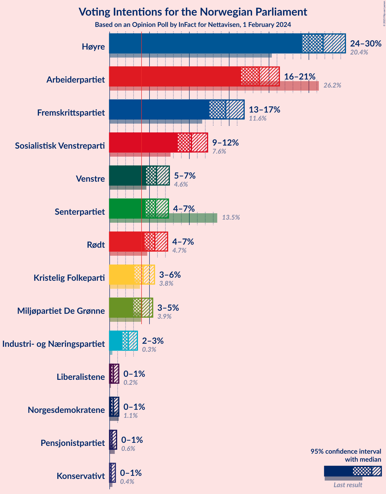

### Confidence Intervals

| Party | Last Result | Poll Result | 80% Confidence Interval | 90% Confidence Interval | 95% Confidence Interval | 99% Confidence Interval |
|:-----:|:-----------:|:-----------:|:-----------------------:|:-----------------------:|:-----------------------:|:-----------------------:|
| Høyre | 20.4% | 26.8% | 25.1–28.6% |24.6–29.1% |24.2–29.6% |23.4–30.5% |
| Arbeiderpartiet | 26.2% | 18.8% | 17.3–20.4% |16.8–20.9% |16.5–21.3% |15.8–22.1% |
| Fremskrittspartiet | 11.6% | 14.6% | 13.2–16.1% |12.8–16.5% |12.5–16.9% |11.9–17.6% |
| Sosialistisk Venstreparti | 7.6% | 10.3% | 9.1–11.6% |8.8–11.9% |8.6–12.3% |8.0–12.9% |
| Venstre | 4.6% | 5.9% | 5.0–6.9% |4.8–7.2% |4.6–7.5% |4.2–8.0% |
| Senterpartiet | 13.5% | 5.8% | 4.9–6.8% |4.7–7.1% |4.5–7.4% |4.1–7.9% |
| Rødt | 4.7% | 5.7% | 4.8–6.7% |4.6–7.0% |4.4–7.3% |4.0–7.8% |
| Kristelig Folkeparti | 3.8% | 4.2% | 3.5–5.1% |3.3–5.4% |3.1–5.6% |2.8–6.1% |
| Miljøpartiet De Grønne | 3.9% | 4.0% | 3.3–4.9% |3.1–5.2% |3.0–5.4% |2.7–5.9% |
| Industri- og Næringspartiet | 0.3% | 2.3% | 1.8–3.1% |1.7–3.3% |1.6–3.5% |1.4–3.9% |
| Liberalistene | 0.2% | 0.5% | 0.3–0.9% |0.2–1.0% |0.2–1.1% |0.1–1.4% |
| Norgesdemokratene | 1.1% | 0.5% | 0.3–0.9% |0.2–1.0% |0.2–1.1% |0.1–1.4% |
| Pensjonistpartiet | 0.6% | 0.3% | 0.2–0.7% |0.1–0.8% |0.1–0.9% |0.1–1.1% |
| Konservativt | 0.4% | 0.2% | 0.1–0.5% |0.1–0.6% |0.0–0.7% |0.0–0.9% |

*Note:* The poll result column reflects the actual value used in the calculations. Published results may vary slightly, and in addition be rounded to fewer digits.

## Seats

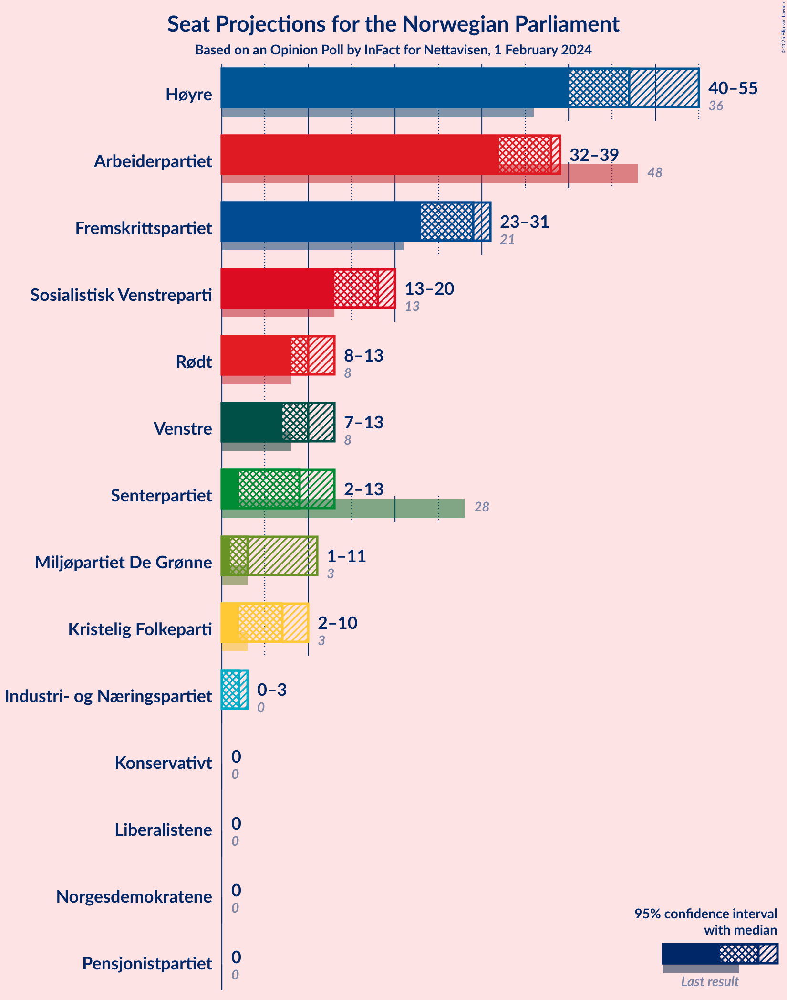

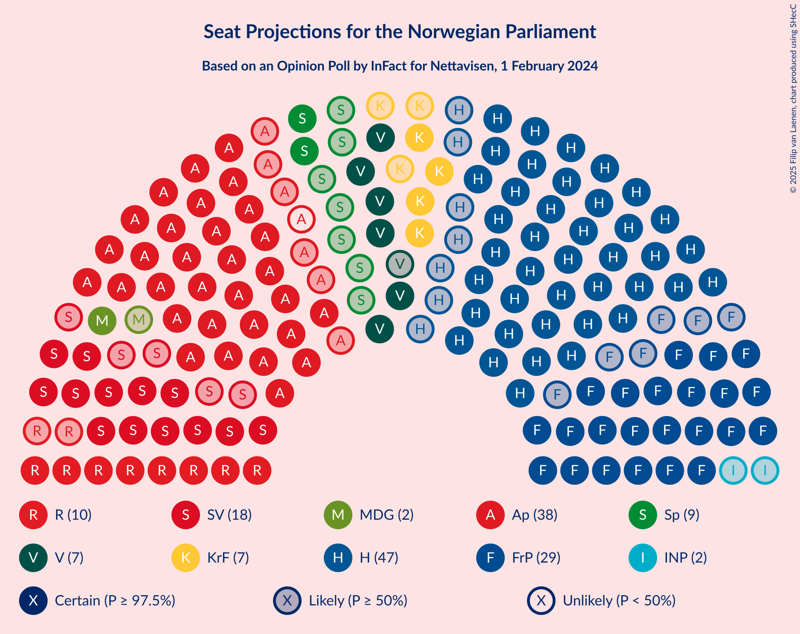

### Confidence Intervals

| Party | Last Result | Median | 80% Confidence Interval | 90% Confidence Interval | 95% Confidence Interval | 99% Confidence Interval |
|:-----:|:-----------:|:------:|:-----------------------:|:-----------------------:|:-----------------------:|:-----------------------:|
| <a href="#høyre">Høyre</a> | 36 | 47 | 40–52 |40–55 |40–55 |40–55 |
| <a href="#arbeiderpartiet">Arbeiderpartiet</a> | 48 | 38 | 32–39 |32–39 |32–39 |32–43 |
| <a href="#fremskrittspartiet">Fremskrittspartiet</a> | 21 | 29 | 25–31 |23–31 |23–31 |19–32 |
| <a href="#sosialistisk-venstreparti">Sosialistisk Venstreparti</a> | 13 | 18 | 13–19 |13–19 |13–20 |13–21 |
| <a href="#venstre">Venstre</a> | 8 | 10 | 7–13 |7–13 |7–13 |7–13 |
| <a href="#senterpartiet">Senterpartiet</a> | 28 | 9 | 8–11 |2–13 |2–13 |1–15 |
| <a href="#rødt">Rødt</a> | 8 | 10 | 8–11 |8–11 |8–13 |1–14 |
| <a href="#kristelig-folkeparti">Kristelig Folkeparti</a> | 3 | 7 | 2–8 |2–9 |2–10 |2–10 |
| <a href="#miljøpartiet-de-grønne">Miljøpartiet De Grønne</a> | 3 | 3 | 2–8 |1–8 |1–11 |1–11 |
| <a href="#industri--og-næringspartiet">Industri- og Næringspartiet</a> | 0 | 2 | 0–3 |0–3 |0–3 |0–3 |
| <a href="#liberalistene">Liberalistene</a> | 0 | 0 | 0 |0 |0 |0 |
| <a href="#norgesdemokratene">Norgesdemokratene</a> | 0 | 0 | 0 |0 |0 |0 |
| <a href="#pensjonistpartiet">Pensjonistpartiet</a> | 0 | 0 | 0 |0 |0 |0 |
| <a href="#konservativt">Konservativt</a> | 0 | 0 | 0 |0 |0 |0 |

### Høyre

*For a full overview of the results for this party, see the [Høyre](party-høyre.html) page.*

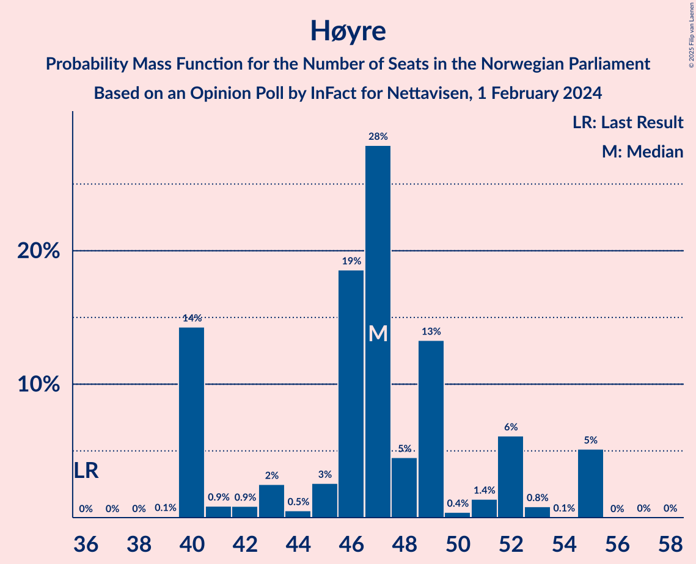

| Number of Seats | Probability | Accumulated | Special Marks |
|:---------------:|:-----------:|:-----------:|:-------------:|
| 36 | 0% | 100% | Last Result |
| 37 | 0% | 100% |  |
| 38 | 0% | 100% |  |
| 39 | 0.1% | 100% |  |
| 40 | 14% | 99.9% |  |
| 41 | 0.9% | 86% |  |
| 42 | 0.9% | 85% |  |
| 43 | 2% | 84% |  |
| 44 | 0.5% | 81% |  |
| 45 | 3% | 81% |  |
| 46 | 19% | 78% |  |
| 47 | 28% | 60% | Median |
| 48 | 5% | 32% |  |
| 49 | 13% | 27% |  |
| 50 | 0.4% | 14% |  |
| 51 | 1.4% | 14% |  |
| 52 | 6% | 12% |  |
| 53 | 0.8% | 6% |  |
| 54 | 0.1% | 5% |  |
| 55 | 5% | 5% |  |
| 56 | 0% | 0.1% |  |
| 57 | 0% | 0.1% |  |
| 58 | 0% | 0% |  |

### Arbeiderpartiet

*For a full overview of the results for this party, see the [Arbeiderpartiet](party-arbeiderpartiet.html) page.*

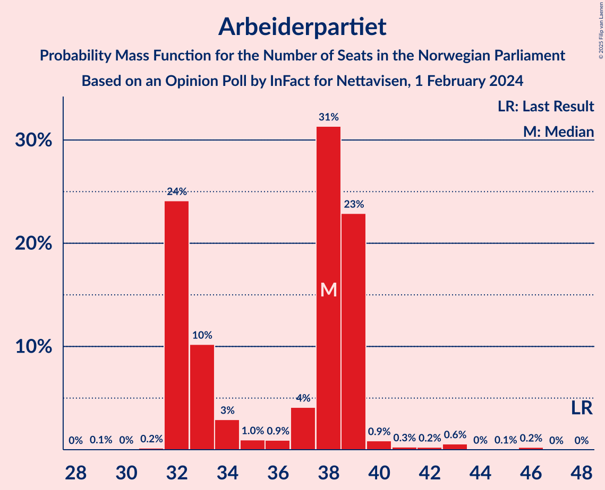

| Number of Seats | Probability | Accumulated | Special Marks |
|:---------------:|:-----------:|:-----------:|:-------------:|
| 29 | 0.1% | 100% |  |
| 30 | 0% | 99.9% |  |
| 31 | 0.2% | 99.9% |  |
| 32 | 24% | 99.7% |  |
| 33 | 10% | 76% |  |
| 34 | 3% | 65% |  |
| 35 | 1.0% | 62% |  |
| 36 | 0.9% | 62% |  |
| 37 | 4% | 61% |  |
| 38 | 31% | 56% | Median |
| 39 | 23% | 25% |  |
| 40 | 0.9% | 2% |  |
| 41 | 0.3% | 1.4% |  |
| 42 | 0.2% | 1.1% |  |
| 43 | 0.6% | 0.9% |  |
| 44 | 0% | 0.3% |  |
| 45 | 0.1% | 0.3% |  |
| 46 | 0.2% | 0.2% |  |
| 47 | 0% | 0% |  |
| 48 | 0% | 0% | Last Result |

### Fremskrittspartiet

*For a full overview of the results for this party, see the [Fremskrittspartiet](party-fremskrittspartiet.html) page.*

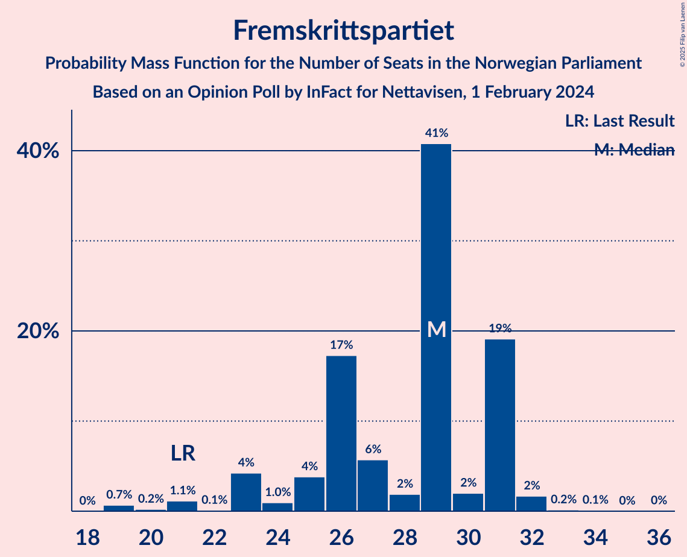

| Number of Seats | Probability | Accumulated | Special Marks |
|:---------------:|:-----------:|:-----------:|:-------------:|
| 19 | 0.7% | 100% |  |
| 20 | 0.2% | 99.3% |  |
| 21 | 1.1% | 99.1% | Last Result |
| 22 | 0.1% | 98% |  |
| 23 | 4% | 98% |  |
| 24 | 1.0% | 94% |  |
| 25 | 4% | 93% |  |
| 26 | 17% | 89% |  |
| 27 | 6% | 72% |  |
| 28 | 2% | 66% |  |
| 29 | 41% | 64% | Median |
| 30 | 2% | 23% |  |
| 31 | 19% | 21% |  |
| 32 | 2% | 2% |  |
| 33 | 0.2% | 0.3% |  |
| 34 | 0.1% | 0.2% |  |
| 35 | 0% | 0.1% |  |
| 36 | 0% | 0% |  |

### Sosialistisk Venstreparti

*For a full overview of the results for this party, see the [Sosialistisk Venstreparti](party-sosialistiskvenstreparti.html) page.*

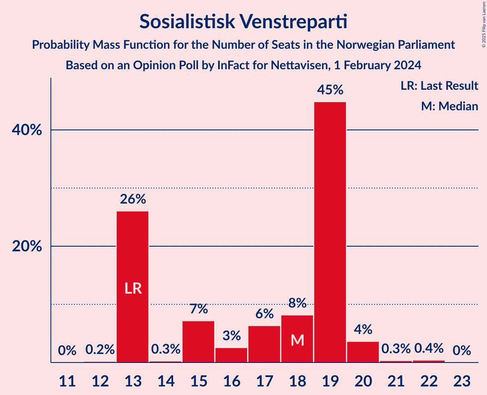

| Number of Seats | Probability | Accumulated | Special Marks |
|:---------------:|:-----------:|:-----------:|:-------------:|
| 12 | 0.2% | 100% |  |
| 13 | 26% | 99.8% | Last Result |
| 14 | 0.3% | 74% |  |
| 15 | 7% | 73% |  |
| 16 | 3% | 66% |  |
| 17 | 6% | 64% |  |
| 18 | 8% | 57% | Median |
| 19 | 45% | 49% |  |
| 20 | 4% | 4% |  |
| 21 | 0.3% | 0.8% |  |
| 22 | 0.4% | 0.4% |  |
| 23 | 0% | 0% |  |

### Venstre

*For a full overview of the results for this party, see the [Venstre](party-venstre.html) page.*

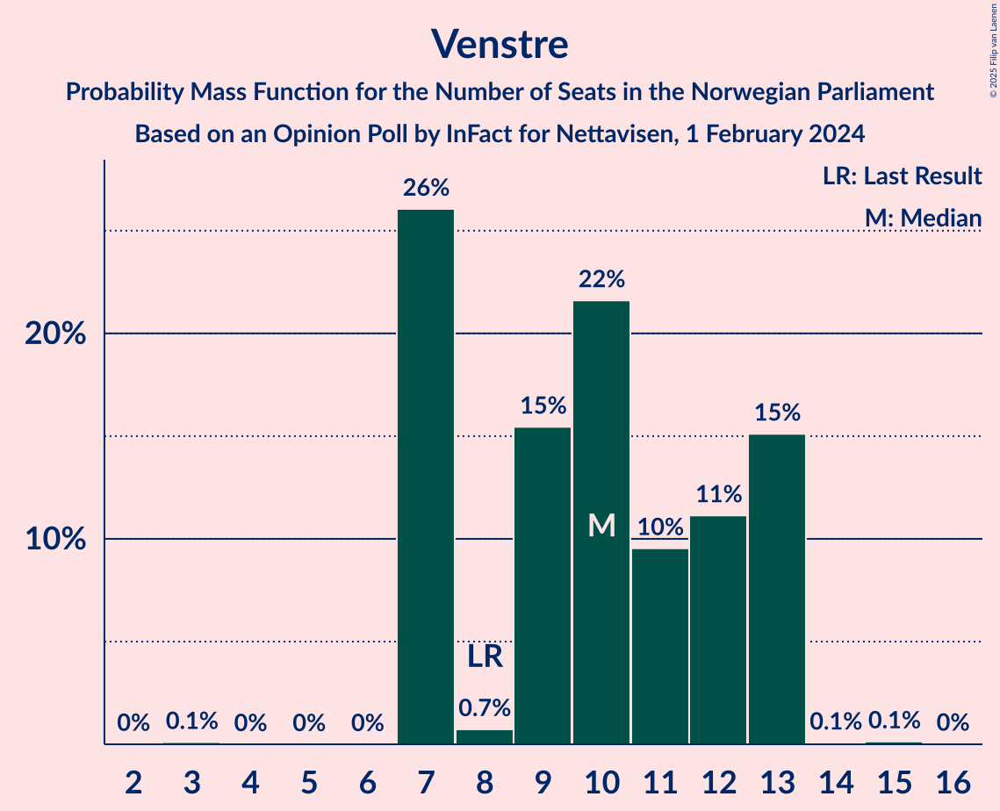

| Number of Seats | Probability | Accumulated | Special Marks |
|:---------------:|:-----------:|:-----------:|:-------------:|
| 3 | 0.1% | 100% |  |
| 4 | 0% | 99.9% |  |
| 5 | 0% | 99.9% |  |
| 6 | 0% | 99.9% |  |
| 7 | 26% | 99.9% |  |
| 8 | 0.7% | 74% | Last Result |
| 9 | 15% | 73% |  |
| 10 | 22% | 58% | Median |
| 11 | 10% | 36% |  |
| 12 | 11% | 26% |  |
| 13 | 15% | 15% |  |
| 14 | 0.1% | 0.2% |  |
| 15 | 0.1% | 0.2% |  |
| 16 | 0% | 0% |  |

### Senterpartiet

*For a full overview of the results for this party, see the [Senterpartiet](party-senterpartiet.html) page.*

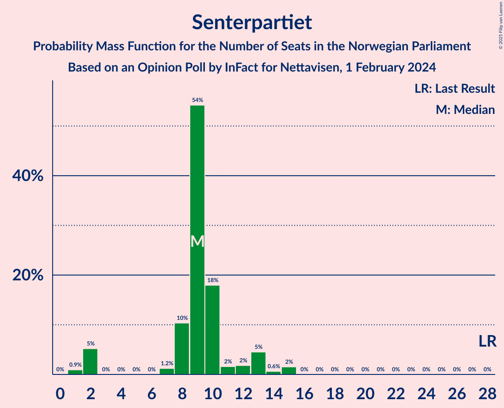

| Number of Seats | Probability | Accumulated | Special Marks |
|:---------------:|:-----------:|:-----------:|:-------------:|
| 1 | 0.9% | 100% |  |
| 2 | 5% | 99.1% |  |
| 3 | 0% | 94% |  |
| 4 | 0% | 94% |  |
| 5 | 0% | 94% |  |
| 6 | 0% | 94% |  |
| 7 | 1.2% | 94% |  |
| 8 | 10% | 93% |  |
| 9 | 54% | 82% | Median |
| 10 | 18% | 28% |  |
| 11 | 2% | 10% |  |
| 12 | 2% | 9% |  |
| 13 | 5% | 7% |  |
| 14 | 0.6% | 2% |  |
| 15 | 2% | 2% |  |
| 16 | 0% | 0% |  |
| 17 | 0% | 0% |  |
| 18 | 0% | 0% |  |
| 19 | 0% | 0% |  |
| 20 | 0% | 0% |  |
| 21 | 0% | 0% |  |
| 22 | 0% | 0% |  |
| 23 | 0% | 0% |  |
| 24 | 0% | 0% |  |
| 25 | 0% | 0% |  |
| 26 | 0% | 0% |  |
| 27 | 0% | 0% |  |
| 28 | 0% | 0% | Last Result |

### Rødt

*For a full overview of the results for this party, see the [Rødt](party-rødt.html) page.*

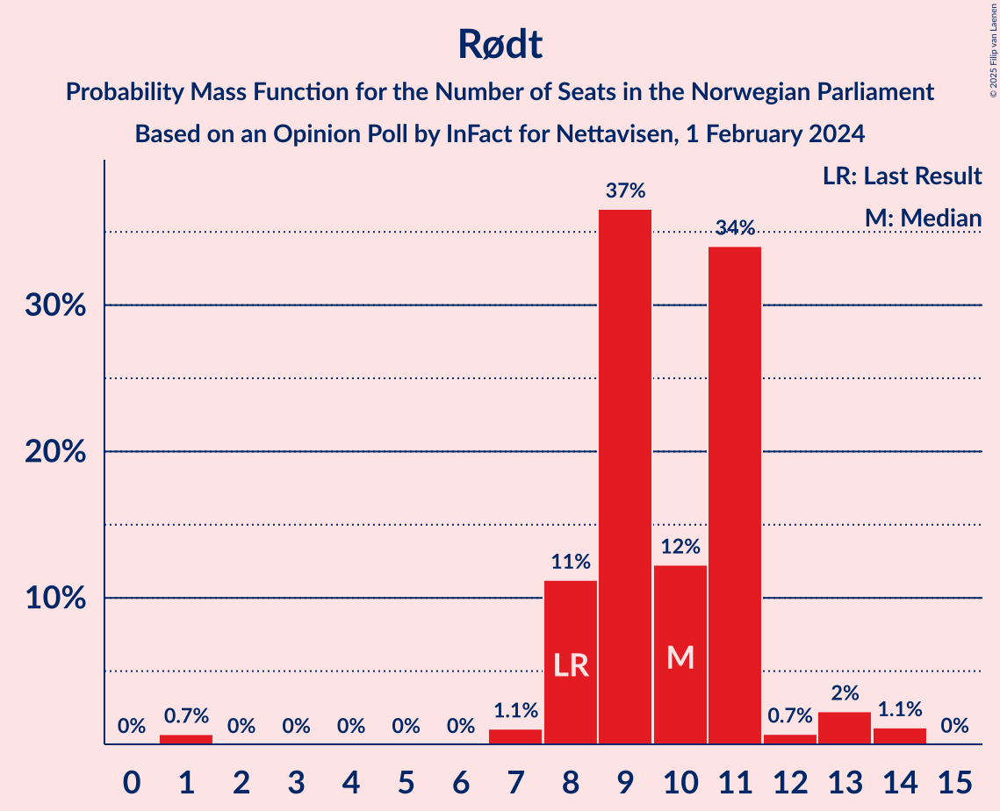

| Number of Seats | Probability | Accumulated | Special Marks |
|:---------------:|:-----------:|:-----------:|:-------------:|
| 1 | 0.7% | 100% |  |
| 2 | 0% | 99.3% |  |
| 3 | 0% | 99.3% |  |
| 4 | 0% | 99.3% |  |
| 5 | 0% | 99.3% |  |
| 6 | 0% | 99.3% |  |
| 7 | 1.1% | 99.3% |  |
| 8 | 11% | 98% | Last Result |
| 9 | 37% | 87% |  |
| 10 | 12% | 50% | Median |
| 11 | 34% | 38% |  |
| 12 | 0.7% | 4% |  |
| 13 | 2% | 3% |  |
| 14 | 1.1% | 1.2% |  |
| 15 | 0% | 0% |  |

### Kristelig Folkeparti

*For a full overview of the results for this party, see the [Kristelig Folkeparti](party-kristeligfolkeparti.html) page.*

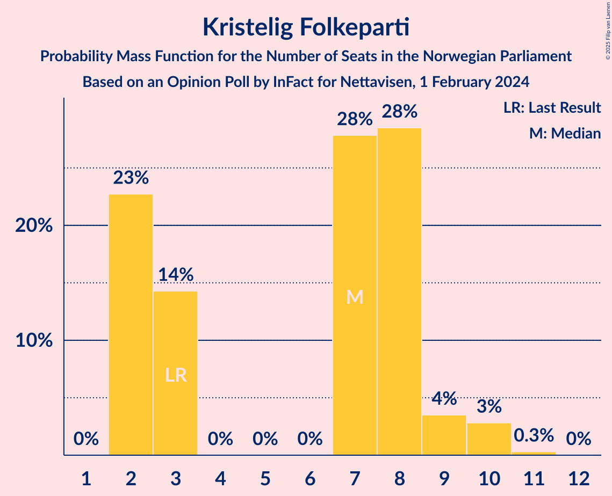

| Number of Seats | Probability | Accumulated | Special Marks |
|:---------------:|:-----------:|:-----------:|:-------------:|
| 2 | 23% | 100% |  |
| 3 | 14% | 77% | Last Result |
| 4 | 0% | 63% |  |
| 5 | 0% | 63% |  |
| 6 | 0% | 63% |  |
| 7 | 28% | 63% | Median |
| 8 | 28% | 35% |  |
| 9 | 4% | 7% |  |
| 10 | 3% | 3% |  |
| 11 | 0.3% | 0.3% |  |
| 12 | 0% | 0% |  |

### Miljøpartiet De Grønne

*For a full overview of the results for this party, see the [Miljøpartiet De Grønne](party-miljøpartietdegrønne.html) page.*

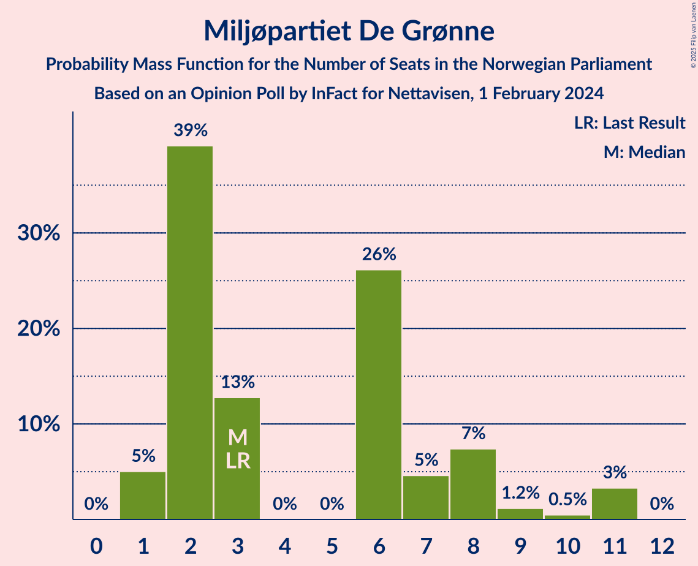

| Number of Seats | Probability | Accumulated | Special Marks |
|:---------------:|:-----------:|:-----------:|:-------------:|
| 1 | 5% | 100% |  |
| 2 | 39% | 95% |  |
| 3 | 13% | 56% | Last Result, Median |
| 4 | 0% | 43% |  |
| 5 | 0% | 43% |  |
| 6 | 26% | 43% |  |
| 7 | 5% | 17% |  |
| 8 | 7% | 12% |  |
| 9 | 1.2% | 5% |  |
| 10 | 0.5% | 4% |  |
| 11 | 3% | 3% |  |
| 12 | 0% | 0% |  |

### Industri- og Næringspartiet

*For a full overview of the results for this party, see the [Industri- og Næringspartiet](party-industri-ognæringspartiet.html) page.*

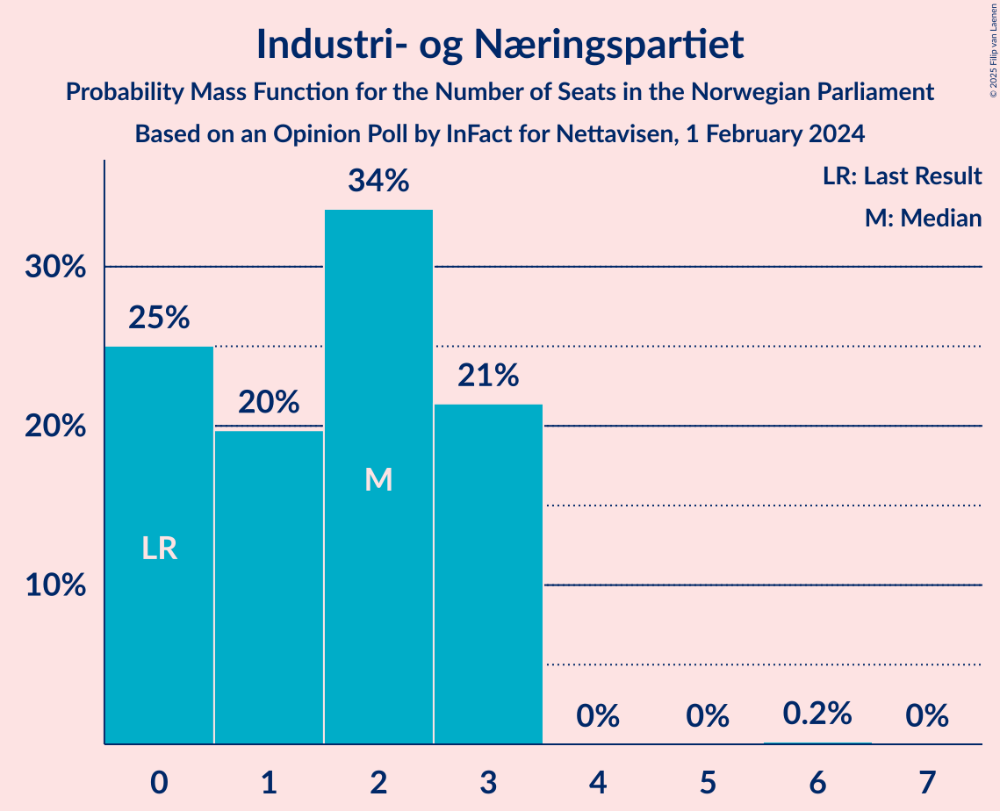

| Number of Seats | Probability | Accumulated | Special Marks |
|:---------------:|:-----------:|:-----------:|:-------------:|
| 0 | 25% | 100% | Last Result |
| 1 | 20% | 75% |  |
| 2 | 34% | 55% | Median |
| 3 | 21% | 22% |  |
| 4 | 0% | 0.2% |  |
| 5 | 0% | 0.2% |  |
| 6 | 0.2% | 0.2% |  |
| 7 | 0% | 0% |  |

### Liberalistene

*For a full overview of the results for this party, see the [Liberalistene](party-liberalistene.html) page.*

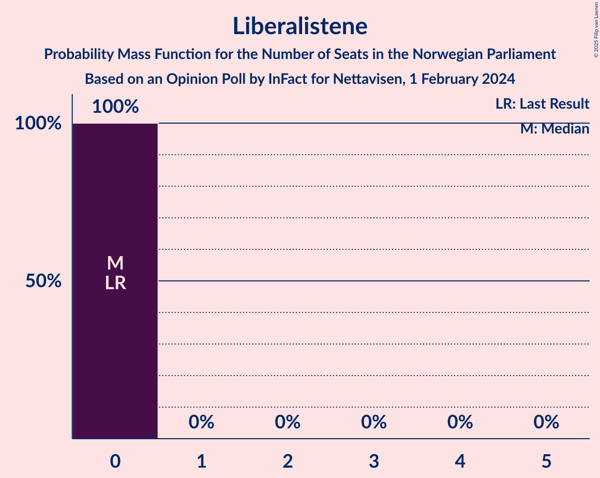

| Number of Seats | Probability | Accumulated | Special Marks |
|:---------------:|:-----------:|:-----------:|:-------------:|
| 0 | 100% | 100% | Last Result, Median |

### Norgesdemokratene

*For a full overview of the results for this party, see the [Norgesdemokratene](party-norgesdemokratene.html) page.*

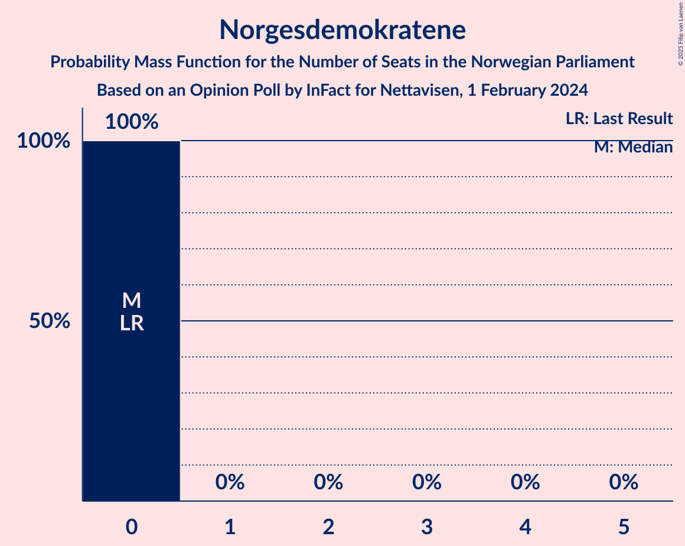

| Number of Seats | Probability | Accumulated | Special Marks |
|:---------------:|:-----------:|:-----------:|:-------------:|
| 0 | 100% | 100% | Last Result, Median |

### Pensjonistpartiet

*For a full overview of the results for this party, see the [Pensjonistpartiet](party-pensjonistpartiet.html) page.*

| Number of Seats | Probability | Accumulated | Special Marks |
|:---------------:|:-----------:|:-----------:|:-------------:|
| 0 | 100% | 100% | Last Result, Median |

### Konservativt

*For a full overview of the results for this party, see the [Konservativt](party-konservativt.html) page.*

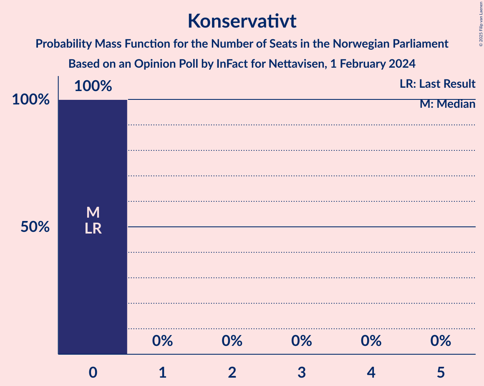

| Number of Seats | Probability | Accumulated | Special Marks |
|:---------------:|:-----------:|:-----------:|:-------------:|
| 0 | 100% | 100% | Last Result, Median |

## Coalitions

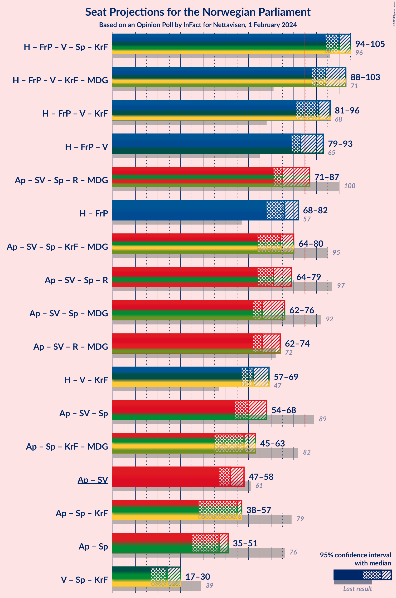

### Confidence Intervals

| Coalition | Last Result | Median | Majority? | 80% Confidence Interval | 90% Confidence Interval | 95% Confidence Interval | 99% Confidence Interval |
|:---------:|:-----------:|:------:|:---------:|:-----------------------:|:-----------------------:|:-----------------------:|:-----------------------:|
| Høyre – Fremskrittspartiet – Venstre – Senterpartiet – Kristelig Folkeparti | 96 | 100 | 100% | 95–104 | 95–104 | 94–105 | 90–106 |
| Høyre – Fremskrittspartiet – Venstre – Kristelig Folkeparti – Miljøpartiet De Grønne | 71 | 94 | 99.9% | 88–99 | 88–101 | 88–103 | 88–103 |
| Høyre – Fremskrittspartiet – Venstre – Kristelig Folkeparti | 68 | 91 | 95% | 86–96 | 85–96 | 81–96 | 81–97 |
| Høyre – Fremskrittspartiet – Venstre | 65 | 83 | 36% | 79–90 | 79–92 | 79–93 | 74–93 |
| Arbeiderpartiet – Sosialistisk Venstreparti – Senterpartiet – Rødt – Miljøpartiet De Grønne | 100 | 75 | 4% | 72–81 | 71–82 | 71–87 | 70–87 |
| Høyre – Fremskrittspartiet | 57 | 76 | 0% | 69–80 | 69–81 | 68–82 | 64–82 |
| Arbeiderpartiet – Sosialistisk Venstreparti – Senterpartiet – Kristelig Folkeparti – Miljøpartiet De Grønne | 95 | 74 | 0.5% | 64–77 | 64–78 | 64–80 | 64–86 |
| Arbeiderpartiet – Sosialistisk Venstreparti – Senterpartiet – Rødt | 97 | 71 | 0% | 68–79 | 64–79 | 64–79 | 64–80 |
| Arbeiderpartiet – Sosialistisk Venstreparti – Senterpartiet – Miljøpartiet De Grønne | 92 | 66 | 0% | 62–70 | 62–73 | 62–76 | 59–78 |
| Arbeiderpartiet – Sosialistisk Venstreparti – Rødt – Miljøpartiet De Grønne | 72 | 66 | 0% | 63–71 | 63–71 | 62–74 | 62–78 |
| Høyre – Venstre – Kristelig Folkeparti | 47 | 62 | 0% | 57–67 | 57–69 | 57–69 | 57–73 |
| Arbeiderpartiet – Sosialistisk Venstreparti – Senterpartiet | 89 | 60 | 0% | 57–68 | 54–68 | 54–68 | 54–70 |
| Arbeiderpartiet – Senterpartiet – Kristelig Folkeparti – Miljøpartiet De Grønne | 82 | 58 | 0% | 45–61 | 45–61 | 45–63 | 45–67 |
| Arbeiderpartiet – Sosialistisk Venstreparti | 61 | 52 | 0% | 51–58 | 49–58 | 47–58 | 47–61 |
| Arbeiderpartiet – Senterpartiet – Kristelig Folkeparti | 79 | 55 | 0% | 43–56 | 38–56 | 38–57 | 38–60 |
| Arbeiderpartiet – Senterpartiet | 76 | 47 | 0% | 41–49 | 35–49 | 35–51 | 35–53 |
| Venstre – Senterpartiet – Kristelig Folkeparti | 39 | 24 | 0% | 22–27 | 17–30 | 17–30 | 17–33 |

### Høyre – Fremskrittspartiet – Venstre – Senterpartiet – Kristelig Folkeparti

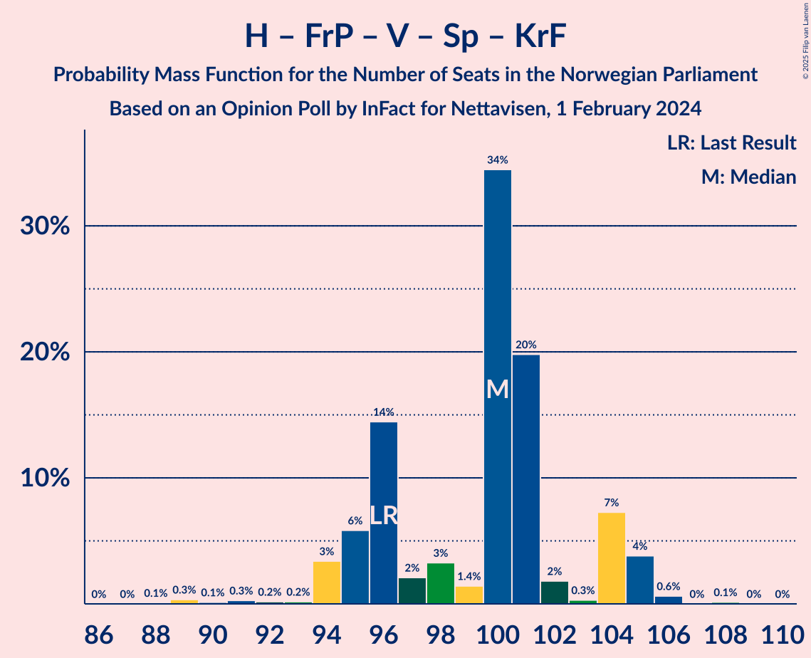

| Number of Seats | Probability | Accumulated | Special Marks |
|:---------------:|:-----------:|:-----------:|:-------------:|
| 88 | 0.1% | 100% |  |
| 89 | 0.3% | 99.9% |  |
| 90 | 0.1% | 99.6% |  |
| 91 | 0.3% | 99.4% |  |
| 92 | 0.2% | 99.1% |  |
| 93 | 0.2% | 99.0% |  |
| 94 | 3% | 98.8% |  |
| 95 | 6% | 95% |  |
| 96 | 14% | 90% | Last Result |
| 97 | 2% | 75% |  |
| 98 | 3% | 73% |  |
| 99 | 1.4% | 70% |  |
| 100 | 34% | 68% |  |
| 101 | 20% | 34% |  |
| 102 | 2% | 14% | Median |
| 103 | 0.3% | 12% |  |
| 104 | 7% | 12% |  |
| 105 | 4% | 5% |  |
| 106 | 0.6% | 0.8% |  |
| 107 | 0% | 0.2% |  |
| 108 | 0.1% | 0.2% |  |
| 109 | 0% | 0% |  |

### Høyre – Fremskrittspartiet – Venstre – Kristelig Folkeparti – Miljøpartiet De Grønne

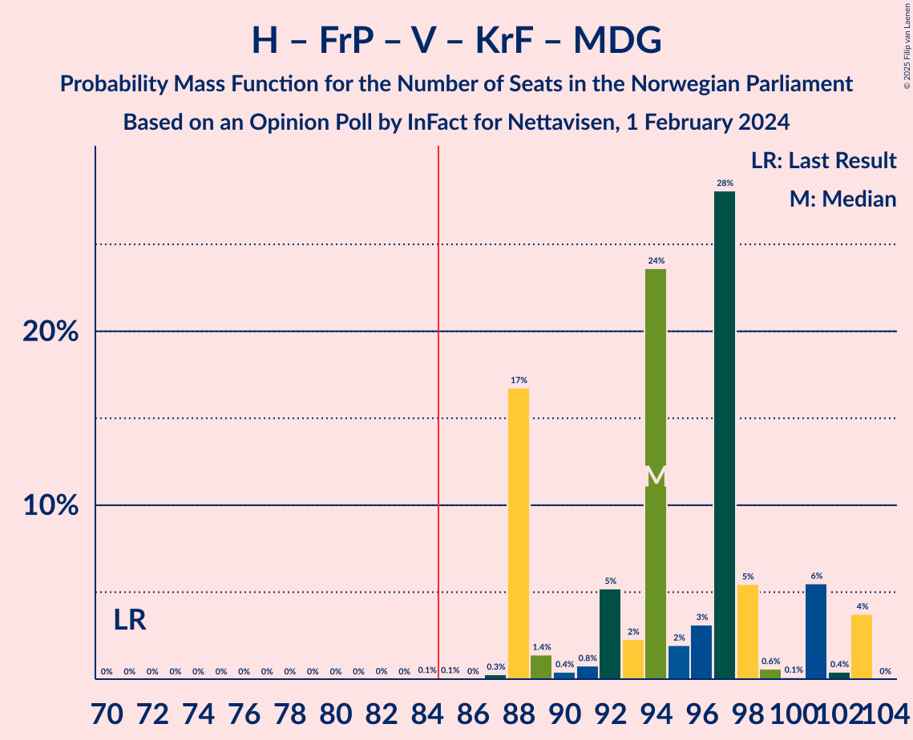

| Number of Seats | Probability | Accumulated | Special Marks |
|:---------------:|:-----------:|:-----------:|:-------------:|
| 71 | 0% | 100% | Last Result |
| 72 | 0% | 100% |  |
| 73 | 0% | 100% |  |
| 74 | 0% | 100% |  |
| 75 | 0% | 100% |  |
| 76 | 0% | 100% |  |
| 77 | 0% | 100% |  |
| 78 | 0% | 100% |  |
| 79 | 0% | 100% |  |
| 80 | 0% | 100% |  |
| 81 | 0% | 100% |  |
| 82 | 0% | 100% |  |
| 83 | 0% | 100% |  |
| 84 | 0.1% | 100% |  |
| 85 | 0.1% | 99.9% | Majority |
| 86 | 0% | 99.8% |  |
| 87 | 0.3% | 99.8% |  |
| 88 | 17% | 99.5% |  |
| 89 | 1.4% | 83% |  |
| 90 | 0.4% | 81% |  |
| 91 | 0.8% | 81% |  |
| 92 | 5% | 80% |  |
| 93 | 2% | 75% |  |
| 94 | 24% | 73% |  |
| 95 | 2% | 49% |  |
| 96 | 3% | 47% | Median |
| 97 | 28% | 44% |  |
| 98 | 5% | 16% |  |
| 99 | 0.6% | 10% |  |
| 100 | 0.1% | 10% |  |
| 101 | 6% | 10% |  |
| 102 | 0.4% | 4% |  |
| 103 | 4% | 4% |  |
| 104 | 0% | 0% |  |

### Høyre – Fremskrittspartiet – Venstre – Kristelig Folkeparti

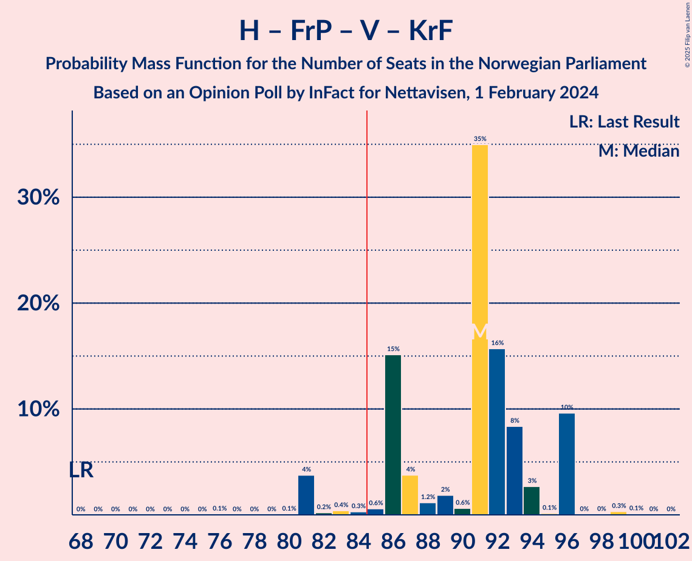

| Number of Seats | Probability | Accumulated | Special Marks |
|:---------------:|:-----------:|:-----------:|:-------------:|
| 68 | 0% | 100% | Last Result |
| 69 | 0% | 100% |  |
| 70 | 0% | 100% |  |
| 71 | 0% | 100% |  |
| 72 | 0% | 100% |  |
| 73 | 0% | 100% |  |
| 74 | 0% | 100% |  |
| 75 | 0% | 100% |  |
| 76 | 0.1% | 100% |  |
| 77 | 0% | 99.9% |  |
| 78 | 0% | 99.9% |  |
| 79 | 0% | 99.9% |  |
| 80 | 0.1% | 99.9% |  |
| 81 | 4% | 99.8% |  |
| 82 | 0.2% | 96% |  |
| 83 | 0.4% | 96% |  |
| 84 | 0.3% | 95% |  |
| 85 | 0.6% | 95% | Majority |
| 86 | 15% | 95% |  |
| 87 | 4% | 79% |  |
| 88 | 1.2% | 76% |  |
| 89 | 2% | 75% |  |
| 90 | 0.6% | 73% |  |
| 91 | 35% | 72% |  |
| 92 | 16% | 37% |  |
| 93 | 8% | 21% | Median |
| 94 | 3% | 13% |  |
| 95 | 0.1% | 10% |  |
| 96 | 10% | 10% |  |
| 97 | 0% | 0.5% |  |
| 98 | 0% | 0.5% |  |
| 99 | 0.3% | 0.5% |  |
| 100 | 0.1% | 0.1% |  |
| 101 | 0% | 0% |  |

### Høyre – Fremskrittspartiet – Venstre

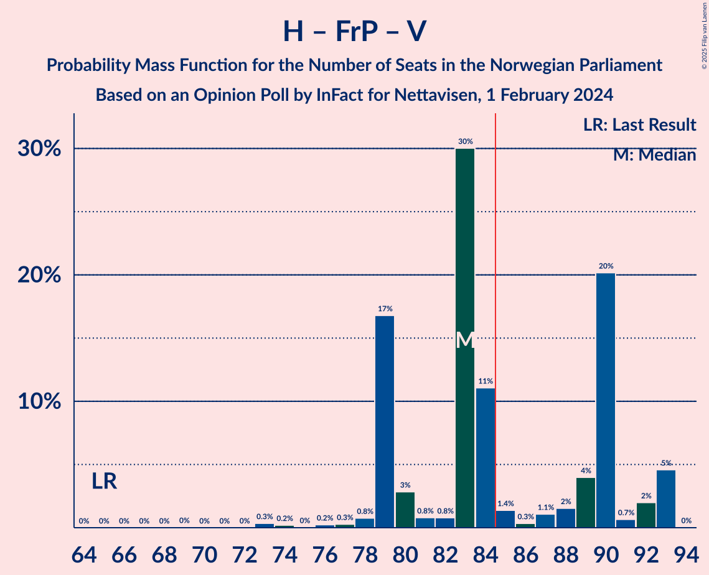

| Number of Seats | Probability | Accumulated | Special Marks |
|:---------------:|:-----------:|:-----------:|:-------------:|
| 65 | 0% | 100% | Last Result |
| 66 | 0% | 100% |  |
| 67 | 0% | 100% |  |
| 68 | 0% | 100% |  |
| 69 | 0% | 100% |  |
| 70 | 0% | 100% |  |
| 71 | 0% | 100% |  |
| 72 | 0% | 100% |  |
| 73 | 0.3% | 100% |  |
| 74 | 0.2% | 99.6% |  |
| 75 | 0% | 99.4% |  |
| 76 | 0.2% | 99.4% |  |
| 77 | 0.3% | 99.1% |  |
| 78 | 0.8% | 98.9% |  |
| 79 | 17% | 98% |  |
| 80 | 3% | 81% |  |
| 81 | 0.8% | 78% |  |
| 82 | 0.8% | 78% |  |
| 83 | 30% | 77% |  |
| 84 | 11% | 47% |  |
| 85 | 1.4% | 36% | Majority |
| 86 | 0.3% | 34% | Median |
| 87 | 1.1% | 34% |  |
| 88 | 2% | 33% |  |
| 89 | 4% | 31% |  |
| 90 | 20% | 27% |  |
| 91 | 0.7% | 7% |  |
| 92 | 2% | 7% |  |
| 93 | 5% | 5% |  |
| 94 | 0% | 0% |  |

### Arbeiderpartiet – Sosialistisk Venstreparti – Senterpartiet – Rødt – Miljøpartiet De Grønne

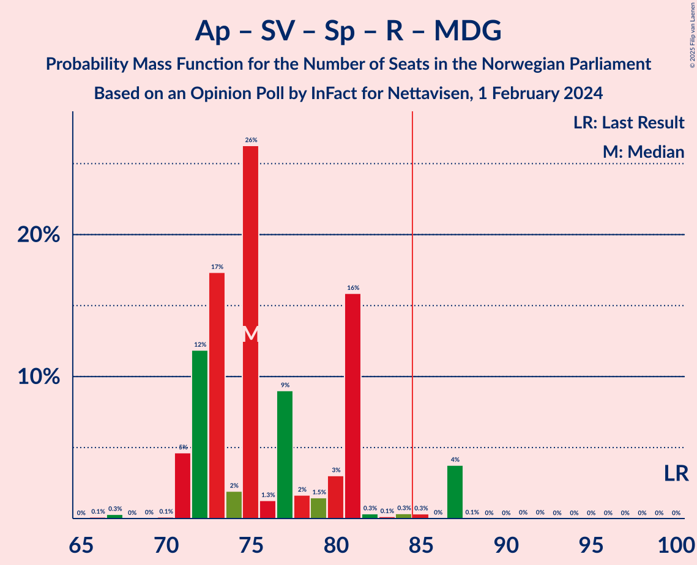

| Number of Seats | Probability | Accumulated | Special Marks |
|:---------------:|:-----------:|:-----------:|:-------------:|
| 66 | 0.1% | 100% |  |
| 67 | 0.3% | 99.9% |  |
| 68 | 0% | 99.6% |  |
| 69 | 0% | 99.6% |  |
| 70 | 0.1% | 99.5% |  |
| 71 | 5% | 99.4% |  |
| 72 | 12% | 95% |  |
| 73 | 17% | 83% |  |
| 74 | 2% | 66% |  |
| 75 | 26% | 64% |  |
| 76 | 1.3% | 37% |  |
| 77 | 9% | 36% |  |
| 78 | 2% | 27% | Median |
| 79 | 1.5% | 25% |  |
| 80 | 3% | 24% |  |
| 81 | 16% | 21% |  |
| 82 | 0.3% | 5% |  |
| 83 | 0.1% | 5% |  |
| 84 | 0.3% | 5% |  |
| 85 | 0.3% | 4% | Majority |
| 86 | 0% | 4% |  |
| 87 | 4% | 4% |  |
| 88 | 0.1% | 0.1% |  |
| 89 | 0% | 0.1% |  |
| 90 | 0% | 0.1% |  |
| 91 | 0% | 0.1% |  |
| 92 | 0% | 0% |  |
| 93 | 0% | 0% |  |
| 94 | 0% | 0% |  |
| 95 | 0% | 0% |  |
| 96 | 0% | 0% |  |
| 97 | 0% | 0% |  |
| 98 | 0% | 0% |  |
| 99 | 0% | 0% |  |
| 100 | 0% | 0% | Last Result |

### Høyre – Fremskrittspartiet

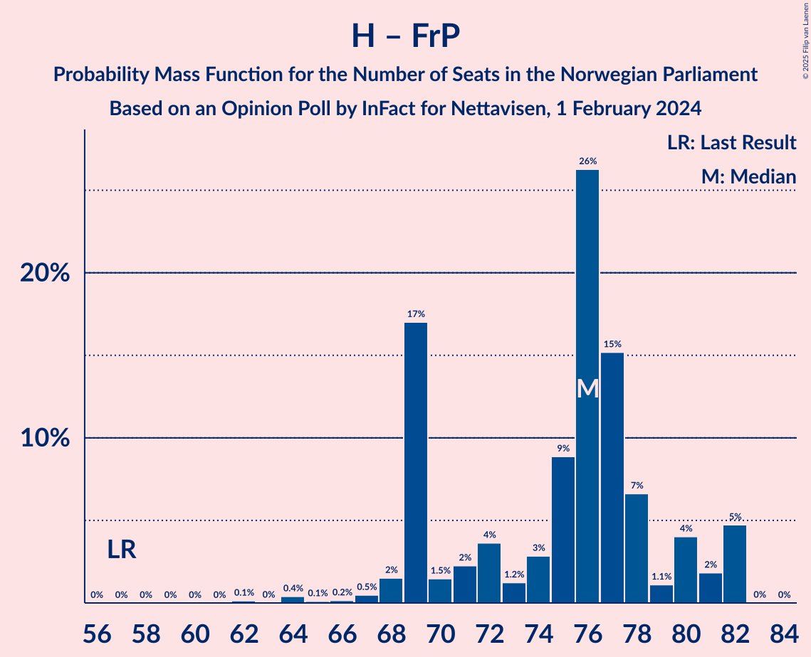

| Number of Seats | Probability | Accumulated | Special Marks |
|:---------------:|:-----------:|:-----------:|:-------------:|
| 57 | 0% | 100% | Last Result |
| 58 | 0% | 100% |  |
| 59 | 0% | 100% |  |
| 60 | 0% | 100% |  |
| 61 | 0% | 100% |  |
| 62 | 0.1% | 100% |  |
| 63 | 0% | 99.9% |  |
| 64 | 0.4% | 99.8% |  |
| 65 | 0.1% | 99.4% |  |
| 66 | 0.2% | 99.3% |  |
| 67 | 0.5% | 99.2% |  |
| 68 | 2% | 98.7% |  |
| 69 | 17% | 97% |  |
| 70 | 1.5% | 80% |  |
| 71 | 2% | 79% |  |
| 72 | 4% | 76% |  |
| 73 | 1.2% | 73% |  |
| 74 | 3% | 72% |  |
| 75 | 9% | 69% |  |
| 76 | 26% | 60% | Median |
| 77 | 15% | 34% |  |
| 78 | 7% | 18% |  |
| 79 | 1.1% | 12% |  |
| 80 | 4% | 11% |  |
| 81 | 2% | 7% |  |
| 82 | 5% | 5% |  |
| 83 | 0% | 0% |  |

### Arbeiderpartiet – Sosialistisk Venstreparti – Senterpartiet – Kristelig Folkeparti – Miljøpartiet De Grønne

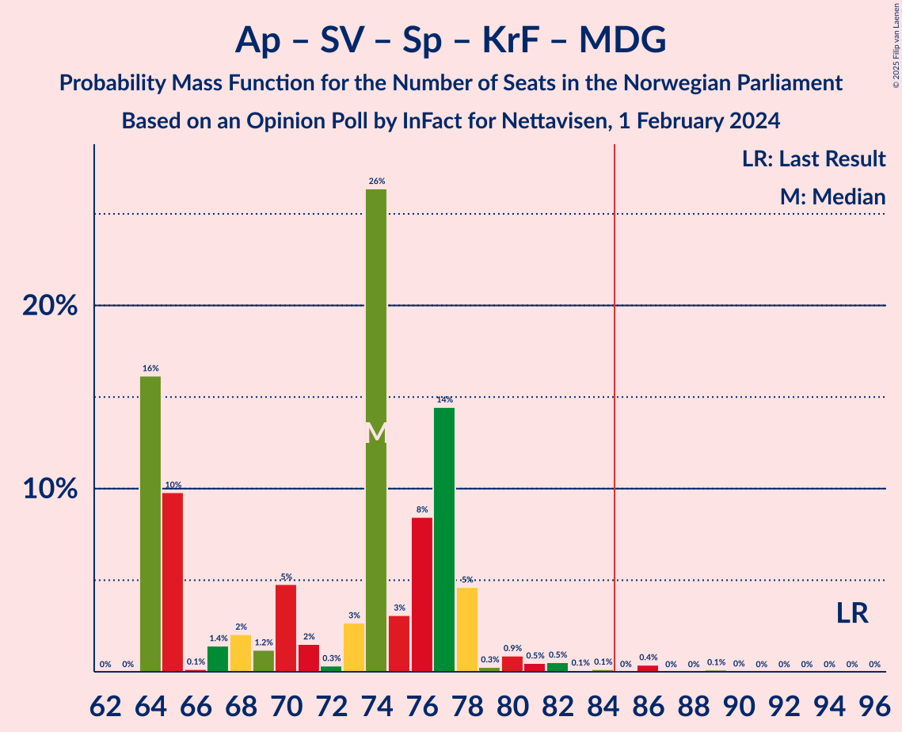

| Number of Seats | Probability | Accumulated | Special Marks |
|:---------------:|:-----------:|:-----------:|:-------------:|
| 64 | 16% | 100% |  |
| 65 | 10% | 84% |  |
| 66 | 0.1% | 74% |  |
| 67 | 1.4% | 74% |  |
| 68 | 2% | 72% |  |
| 69 | 1.2% | 70% |  |
| 70 | 5% | 69% |  |
| 71 | 2% | 64% |  |
| 72 | 0.3% | 63% |  |
| 73 | 3% | 63% |  |
| 74 | 26% | 60% |  |
| 75 | 3% | 34% | Median |
| 76 | 8% | 30% |  |
| 77 | 14% | 22% |  |
| 78 | 5% | 8% |  |
| 79 | 0.3% | 3% |  |
| 80 | 0.9% | 3% |  |
| 81 | 0.5% | 2% |  |
| 82 | 0.5% | 1.3% |  |
| 83 | 0.1% | 0.8% |  |
| 84 | 0.1% | 0.7% |  |
| 85 | 0% | 0.5% | Majority |
| 86 | 0.4% | 0.5% |  |
| 87 | 0% | 0.2% |  |
| 88 | 0% | 0.2% |  |
| 89 | 0.1% | 0.2% |  |
| 90 | 0% | 0% |  |
| 91 | 0% | 0% |  |
| 92 | 0% | 0% |  |
| 93 | 0% | 0% |  |
| 94 | 0% | 0% |  |
| 95 | 0% | 0% | Last Result |

### Arbeiderpartiet – Sosialistisk Venstreparti – Senterpartiet – Rødt

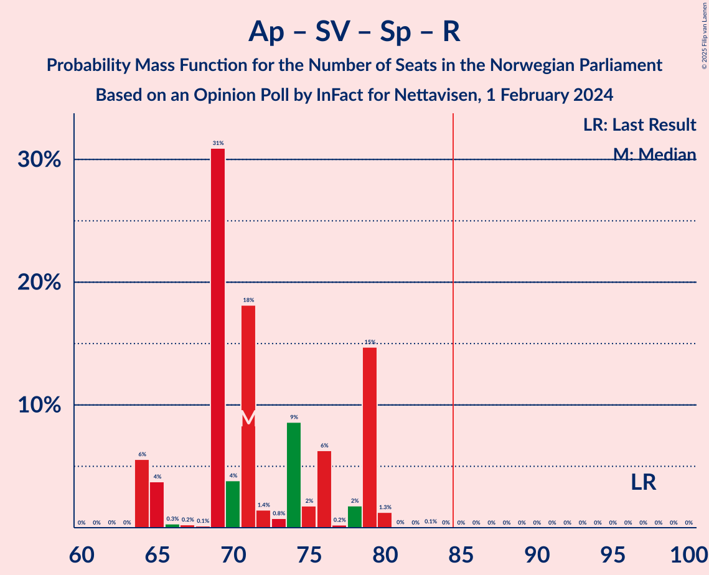

| Number of Seats | Probability | Accumulated | Special Marks |
|:---------------:|:-----------:|:-----------:|:-------------:|
| 64 | 6% | 100% |  |
| 65 | 4% | 94% |  |
| 66 | 0.3% | 91% |  |
| 67 | 0.2% | 90% |  |
| 68 | 0.1% | 90% |  |
| 69 | 31% | 90% |  |
| 70 | 4% | 59% |  |
| 71 | 18% | 55% |  |
| 72 | 1.4% | 37% |  |
| 73 | 0.8% | 36% |  |
| 74 | 9% | 35% |  |
| 75 | 2% | 26% | Median |
| 76 | 6% | 24% |  |
| 77 | 0.2% | 18% |  |
| 78 | 2% | 18% |  |
| 79 | 15% | 16% |  |
| 80 | 1.3% | 1.4% |  |
| 81 | 0% | 0.2% |  |
| 82 | 0% | 0.1% |  |
| 83 | 0.1% | 0.1% |  |
| 84 | 0% | 0% |  |
| 85 | 0% | 0% | Majority |
| 86 | 0% | 0% |  |
| 87 | 0% | 0% |  |
| 88 | 0% | 0% |  |
| 89 | 0% | 0% |  |
| 90 | 0% | 0% |  |
| 91 | 0% | 0% |  |
| 92 | 0% | 0% |  |
| 93 | 0% | 0% |  |
| 94 | 0% | 0% |  |
| 95 | 0% | 0% |  |
| 96 | 0% | 0% |  |
| 97 | 0% | 0% | Last Result |

### Arbeiderpartiet – Sosialistisk Venstreparti – Senterpartiet – Miljøpartiet De Grønne

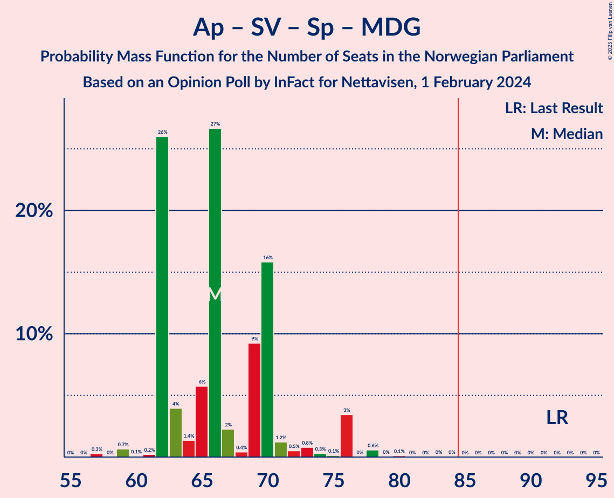

| Number of Seats | Probability | Accumulated | Special Marks |
|:---------------:|:-----------:|:-----------:|:-------------:|
| 57 | 0.3% | 100% |  |
| 58 | 0% | 99.7% |  |
| 59 | 0.7% | 99.7% |  |
| 60 | 0.1% | 99.0% |  |
| 61 | 0.2% | 99.0% |  |
| 62 | 26% | 98.7% |  |
| 63 | 4% | 73% |  |
| 64 | 1.4% | 69% |  |
| 65 | 6% | 67% |  |
| 66 | 27% | 62% |  |
| 67 | 2% | 35% |  |
| 68 | 0.4% | 33% | Median |
| 69 | 9% | 32% |  |
| 70 | 16% | 23% |  |
| 71 | 1.2% | 7% |  |
| 72 | 0.5% | 6% |  |
| 73 | 0.8% | 6% |  |
| 74 | 0.3% | 5% |  |
| 75 | 0.1% | 4% |  |
| 76 | 3% | 4% |  |
| 77 | 0% | 0.8% |  |
| 78 | 0.6% | 0.8% |  |
| 79 | 0% | 0.2% |  |
| 80 | 0.1% | 0.2% |  |
| 81 | 0% | 0.1% |  |
| 82 | 0% | 0.1% |  |
| 83 | 0% | 0.1% |  |
| 84 | 0% | 0% |  |
| 85 | 0% | 0% | Majority |
| 86 | 0% | 0% |  |
| 87 | 0% | 0% |  |
| 88 | 0% | 0% |  |
| 89 | 0% | 0% |  |
| 90 | 0% | 0% |  |
| 91 | 0% | 0% |  |
| 92 | 0% | 0% | Last Result |

### Arbeiderpartiet – Sosialistisk Venstreparti – Rødt – Miljøpartiet De Grønne

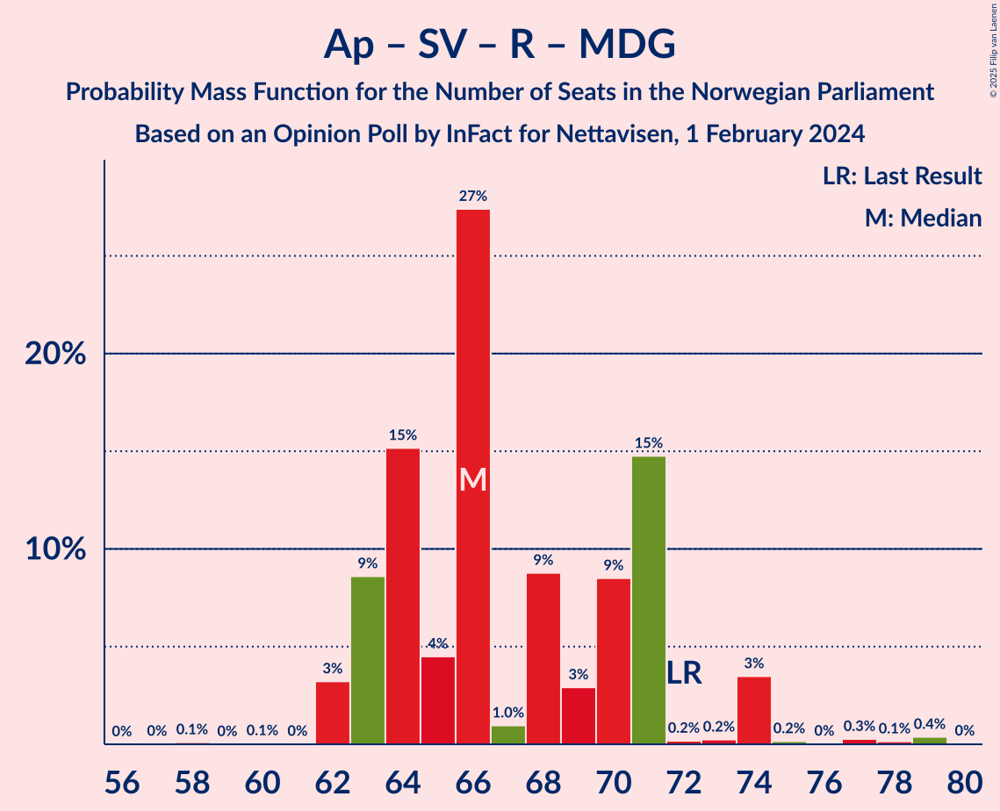

| Number of Seats | Probability | Accumulated | Special Marks |
|:---------------:|:-----------:|:-----------:|:-------------:|
| 58 | 0.1% | 100% |  |
| 59 | 0% | 99.9% |  |
| 60 | 0.1% | 99.8% |  |
| 61 | 0% | 99.8% |  |
| 62 | 3% | 99.8% |  |
| 63 | 9% | 97% |  |
| 64 | 15% | 88% |  |
| 65 | 4% | 73% |  |
| 66 | 27% | 68% |  |
| 67 | 1.0% | 41% |  |
| 68 | 9% | 40% |  |
| 69 | 3% | 31% | Median |
| 70 | 9% | 28% |  |
| 71 | 15% | 20% |  |
| 72 | 0.2% | 5% | Last Result |
| 73 | 0.2% | 5% |  |
| 74 | 3% | 5% |  |
| 75 | 0.2% | 1.0% |  |
| 76 | 0% | 0.9% |  |
| 77 | 0.3% | 0.8% |  |
| 78 | 0.1% | 0.6% |  |
| 79 | 0.4% | 0.4% |  |
| 80 | 0% | 0% |  |

### Høyre – Venstre – Kristelig Folkeparti

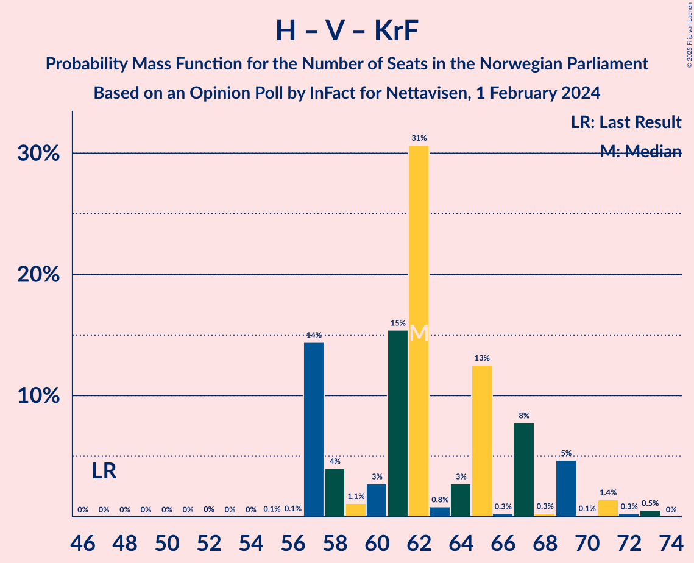

| Number of Seats | Probability | Accumulated | Special Marks |
|:---------------:|:-----------:|:-----------:|:-------------:|
| 47 | 0% | 100% | Last Result |
| 48 | 0% | 100% |  |
| 49 | 0% | 100% |  |
| 50 | 0% | 100% |  |
| 51 | 0% | 100% |  |
| 52 | 0% | 100% |  |
| 53 | 0% | 100% |  |
| 54 | 0% | 99.9% |  |
| 55 | 0.1% | 99.9% |  |
| 56 | 0.1% | 99.9% |  |
| 57 | 14% | 99.8% |  |
| 58 | 4% | 85% |  |
| 59 | 1.1% | 81% |  |
| 60 | 3% | 80% |  |
| 61 | 15% | 78% |  |
| 62 | 31% | 62% |  |
| 63 | 0.8% | 31% |  |
| 64 | 3% | 31% | Median |
| 65 | 13% | 28% |  |
| 66 | 0.3% | 15% |  |
| 67 | 8% | 15% |  |
| 68 | 0.3% | 7% |  |
| 69 | 5% | 7% |  |
| 70 | 0.1% | 2% |  |
| 71 | 1.4% | 2% |  |
| 72 | 0.3% | 0.8% |  |
| 73 | 0.5% | 0.6% |  |
| 74 | 0% | 0% |  |

### Arbeiderpartiet – Sosialistisk Venstreparti – Senterpartiet

| Number of Seats | Probability | Accumulated | Special Marks |
|:---------------:|:-----------:|:-----------:|:-------------:|
| 54 | 5% | 100% |  |
| 55 | 0% | 95% |  |
| 56 | 4% | 94% |  |
| 57 | 0.9% | 91% |  |
| 58 | 0.1% | 90% |  |
| 59 | 1.0% | 90% |  |
| 60 | 45% | 89% |  |
| 61 | 2% | 43% |  |
| 62 | 5% | 41% |  |
| 63 | 3% | 37% |  |
| 64 | 1.1% | 34% |  |
| 65 | 5% | 33% | Median |
| 66 | 10% | 28% |  |
| 67 | 0.7% | 18% |  |
| 68 | 15% | 17% |  |
| 69 | 1.2% | 2% |  |
| 70 | 0.6% | 0.9% |  |
| 71 | 0.1% | 0.3% |  |
| 72 | 0.1% | 0.2% |  |
| 73 | 0% | 0.1% |  |
| 74 | 0% | 0.1% |  |
| 75 | 0% | 0% |  |
| 76 | 0% | 0% |  |
| 77 | 0% | 0% |  |
| 78 | 0% | 0% |  |
| 79 | 0% | 0% |  |
| 80 | 0% | 0% |  |
| 81 | 0% | 0% |  |
| 82 | 0% | 0% |  |
| 83 | 0% | 0% |  |
| 84 | 0% | 0% |  |
| 85 | 0% | 0% | Majority |
| 86 | 0% | 0% |  |
| 87 | 0% | 0% |  |
| 88 | 0% | 0% |  |
| 89 | 0% | 0% | Last Result |

### Arbeiderpartiet – Senterpartiet – Kristelig Folkeparti – Miljøpartiet De Grønne

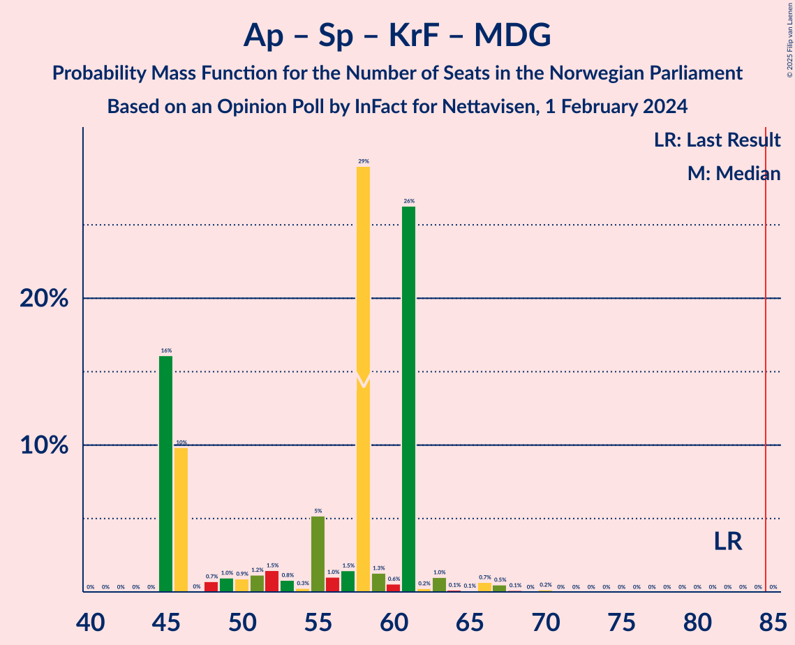

| Number of Seats | Probability | Accumulated | Special Marks |
|:---------------:|:-----------:|:-----------:|:-------------:|
| 45 | 16% | 100% |  |
| 46 | 10% | 84% |  |
| 47 | 0% | 74% |  |
| 48 | 0.7% | 74% |  |
| 49 | 1.0% | 73% |  |
| 50 | 0.9% | 72% |  |
| 51 | 1.2% | 71% |  |
| 52 | 1.5% | 70% |  |
| 53 | 0.8% | 69% |  |
| 54 | 0.3% | 68% |  |
| 55 | 5% | 68% |  |
| 56 | 1.0% | 63% |  |
| 57 | 1.5% | 62% | Median |
| 58 | 29% | 60% |  |
| 59 | 1.3% | 31% |  |
| 60 | 0.6% | 30% |  |
| 61 | 26% | 29% |  |
| 62 | 0.2% | 3% |  |
| 63 | 1.0% | 3% |  |
| 64 | 0.1% | 2% |  |
| 65 | 0.1% | 2% |  |
| 66 | 0.7% | 1.4% |  |
| 67 | 0.5% | 0.8% |  |
| 68 | 0.1% | 0.3% |  |
| 69 | 0% | 0.2% |  |
| 70 | 0.2% | 0.2% |  |
| 71 | 0% | 0% |  |
| 72 | 0% | 0% |  |
| 73 | 0% | 0% |  |
| 74 | 0% | 0% |  |
| 75 | 0% | 0% |  |
| 76 | 0% | 0% |  |
| 77 | 0% | 0% |  |
| 78 | 0% | 0% |  |
| 79 | 0% | 0% |  |
| 80 | 0% | 0% |  |
| 81 | 0% | 0% |  |
| 82 | 0% | 0% | Last Result |

### Arbeiderpartiet – Sosialistisk Venstreparti

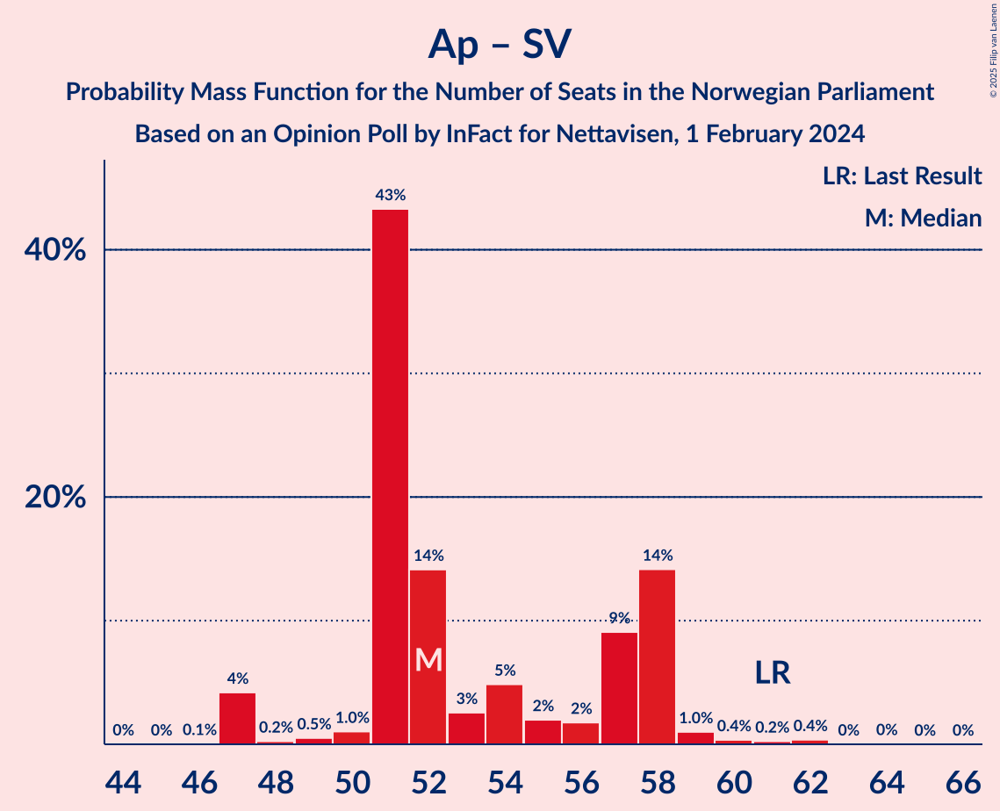

| Number of Seats | Probability | Accumulated | Special Marks |
|:---------------:|:-----------:|:-----------:|:-------------:|
| 46 | 0.1% | 100% |  |
| 47 | 4% | 99.9% |  |
| 48 | 0.2% | 96% |  |
| 49 | 0.5% | 95% |  |
| 50 | 1.0% | 95% |  |
| 51 | 43% | 94% |  |
| 52 | 14% | 51% |  |
| 53 | 3% | 36% |  |
| 54 | 5% | 34% |  |
| 55 | 2% | 29% |  |
| 56 | 2% | 27% | Median |
| 57 | 9% | 25% |  |
| 58 | 14% | 16% |  |
| 59 | 1.0% | 2% |  |
| 60 | 0.4% | 1.0% |  |
| 61 | 0.2% | 0.7% | Last Result |
| 62 | 0.4% | 0.4% |  |
| 63 | 0% | 0.1% |  |
| 64 | 0% | 0.1% |  |
| 65 | 0% | 0% |  |

### Arbeiderpartiet – Senterpartiet – Kristelig Folkeparti

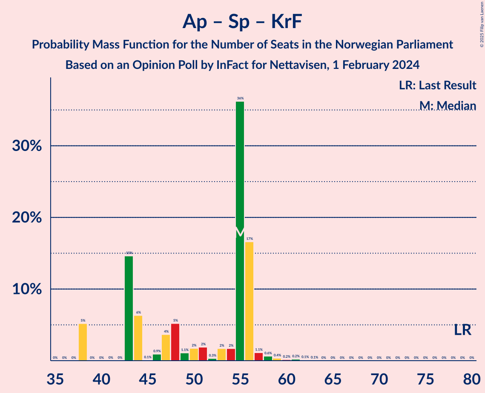

| Number of Seats | Probability | Accumulated | Special Marks |
|:---------------:|:-----------:|:-----------:|:-------------:|
| 38 | 5% | 100% |  |
| 39 | 0% | 95% |  |
| 40 | 0% | 95% |  |
| 41 | 0% | 95% |  |
| 42 | 0% | 95% |  |
| 43 | 15% | 95% |  |
| 44 | 6% | 80% |  |
| 45 | 0.1% | 74% |  |
| 46 | 0.9% | 74% |  |
| 47 | 4% | 73% |  |
| 48 | 5% | 69% |  |
| 49 | 1.1% | 64% |  |
| 50 | 2% | 63% |  |
| 51 | 2% | 61% |  |
| 52 | 0.3% | 59% |  |
| 53 | 2% | 59% |  |
| 54 | 2% | 57% | Median |
| 55 | 36% | 56% |  |
| 56 | 17% | 19% |  |
| 57 | 1.1% | 3% |  |
| 58 | 0.6% | 2% |  |
| 59 | 0.4% | 0.9% |  |
| 60 | 0.2% | 0.6% |  |
| 61 | 0.2% | 0.4% |  |
| 62 | 0.1% | 0.2% |  |
| 63 | 0.1% | 0.1% |  |
| 64 | 0% | 0% |  |
| 65 | 0% | 0% |  |
| 66 | 0% | 0% |  |
| 67 | 0% | 0% |  |
| 68 | 0% | 0% |  |
| 69 | 0% | 0% |  |
| 70 | 0% | 0% |  |
| 71 | 0% | 0% |  |
| 72 | 0% | 0% |  |
| 73 | 0% | 0% |  |
| 74 | 0% | 0% |  |
| 75 | 0% | 0% |  |
| 76 | 0% | 0% |  |
| 77 | 0% | 0% |  |
| 78 | 0% | 0% |  |
| 79 | 0% | 0% | Last Result |

### Arbeiderpartiet – Senterpartiet

| Number of Seats | Probability | Accumulated | Special Marks |
|:---------------:|:-----------:|:-----------:|:-------------:|
| 35 | 5% | 100% |  |
| 36 | 0% | 95% |  |
| 37 | 0% | 95% |  |
| 38 | 0% | 95% |  |
| 39 | 0% | 94% |  |
| 40 | 0.9% | 94% |  |
| 41 | 23% | 94% |  |
| 42 | 2% | 70% |  |
| 43 | 0.1% | 68% |  |
| 44 | 0.8% | 68% |  |
| 45 | 7% | 67% |  |
| 46 | 4% | 60% |  |
| 47 | 29% | 56% | Median |
| 48 | 9% | 28% |  |
| 49 | 15% | 19% |  |
| 50 | 0.9% | 4% |  |
| 51 | 0.6% | 3% |  |
| 52 | 0.3% | 2% |  |
| 53 | 2% | 2% |  |
| 54 | 0.3% | 0.4% |  |
| 55 | 0% | 0.1% |  |
| 56 | 0% | 0% |  |
| 57 | 0% | 0% |  |
| 58 | 0% | 0% |  |
| 59 | 0% | 0% |  |
| 60 | 0% | 0% |  |
| 61 | 0% | 0% |  |
| 62 | 0% | 0% |  |
| 63 | 0% | 0% |  |
| 64 | 0% | 0% |  |
| 65 | 0% | 0% |  |
| 66 | 0% | 0% |  |
| 67 | 0% | 0% |  |
| 68 | 0% | 0% |  |
| 69 | 0% | 0% |  |
| 70 | 0% | 0% |  |
| 71 | 0% | 0% |  |
| 72 | 0% | 0% |  |
| 73 | 0% | 0% |  |
| 74 | 0% | 0% |  |
| 75 | 0% | 0% |  |
| 76 | 0% | 0% | Last Result |

### Venstre – Senterpartiet – Kristelig Folkeparti

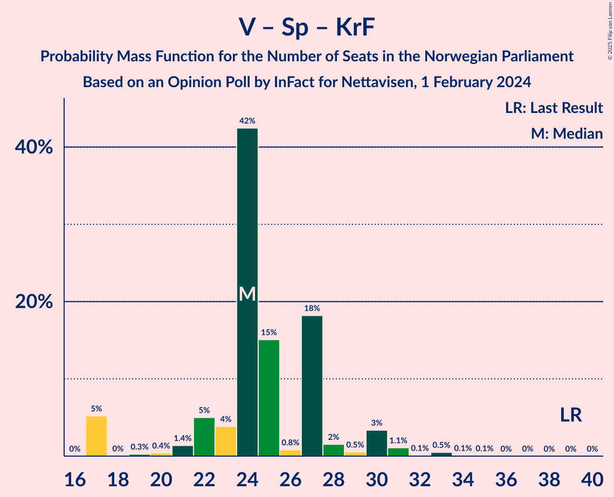

| Number of Seats | Probability | Accumulated | Special Marks |
|:---------------:|:-----------:|:-----------:|:-------------:|
| 17 | 5% | 100% |  |
| 18 | 0% | 95% |  |
| 19 | 0.3% | 95% |  |
| 20 | 0.4% | 94% |  |
| 21 | 1.4% | 94% |  |
| 22 | 5% | 93% |  |
| 23 | 4% | 88% |  |
| 24 | 42% | 84% |  |
| 25 | 15% | 41% |  |
| 26 | 0.8% | 26% | Median |
| 27 | 18% | 25% |  |
| 28 | 2% | 7% |  |
| 29 | 0.5% | 6% |  |
| 30 | 3% | 5% |  |
| 31 | 1.1% | 2% |  |
| 32 | 0.1% | 0.8% |  |
| 33 | 0.5% | 0.7% |  |
| 34 | 0.1% | 0.2% |  |
| 35 | 0.1% | 0.1% |  |
| 36 | 0% | 0% |  |
| 37 | 0% | 0% |  |
| 38 | 0% | 0% |  |
| 39 | 0% | 0% | Last Result |

## Technical Information

### Opinion Poll

+ **Polling firm:** InFact
+ **Commissioner(s):** Nettavisen
+ **Fieldwork period:** 1 February 2024

### Calculations

+ **Sample size:** 1023
+ **Simulations done:** 1,048,576
+ **Error estimate:** 3.06%

