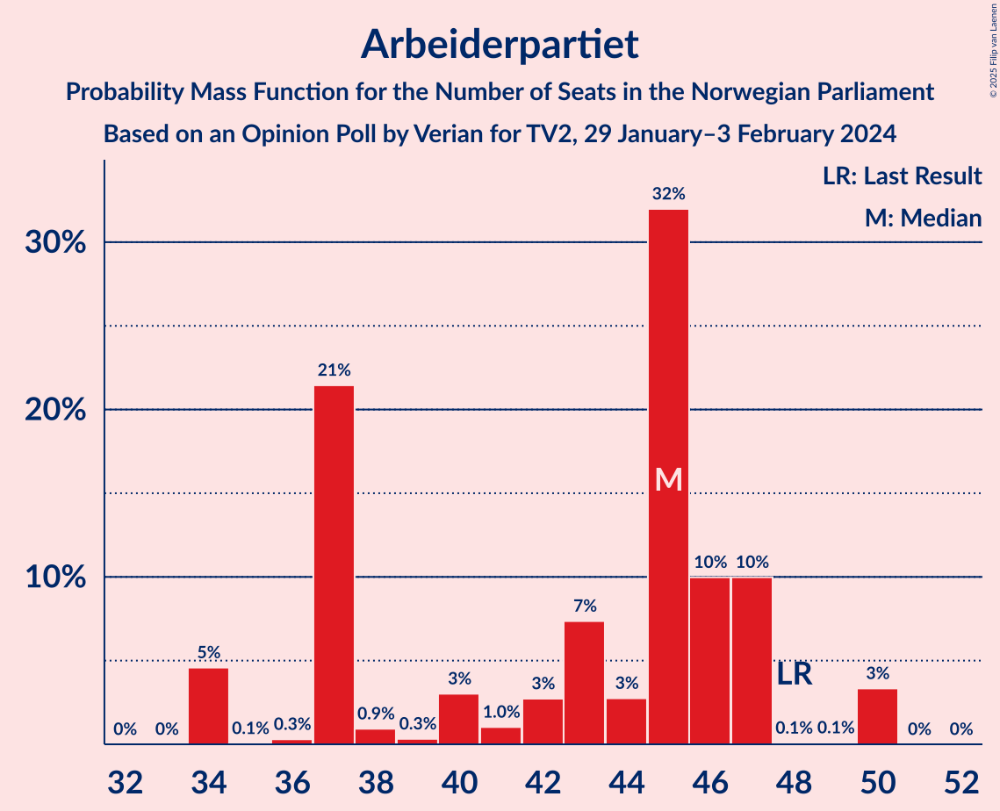
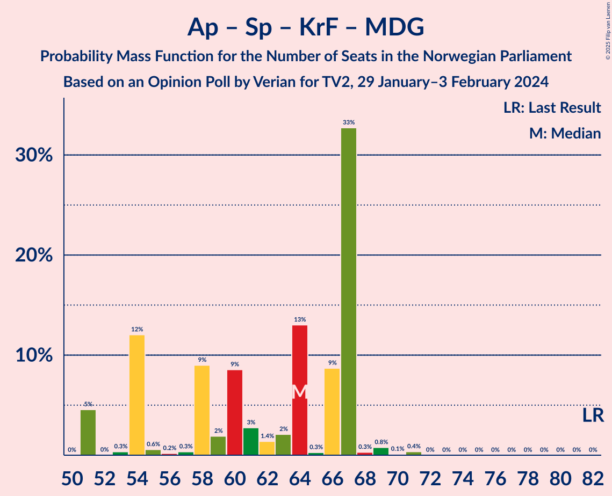

# Opinion Poll by Verian for TV2, 29 January–3 February 2024

<a href="#voting-intentions">Voting Intentions</a> | <a href="#seats">Seats</a> | <a href="#coalitions">Coalitions</a> | <a href="#technical-information">Technical Information</a>

## Voting Intentions

### Confidence Intervals

| Party | Last Result | Poll Result | 80% Confidence Interval | 90% Confidence Interval | 95% Confidence Interval | 99% Confidence Interval |
|:-----:|:-----------:|:-----------:|:-----------------------:|:-----------------------:|:-----------------------:|:-----------------------:|
| Høyre | 20.4% | 27.6% | 25.8–29.5% |25.3–30.0% |24.9–30.5% |24.1–31.4% |
| Arbeiderpartiet | 26.2% | 22.0% | 20.3–23.7% |19.9–24.2% |19.5–24.6% |18.7–25.5% |
| Fremskrittspartiet | 11.6% | 11.6% | 10.4–13.0% |10.1–13.4% |9.8–13.8% |9.2–14.5% |
| Sosialistisk Venstreparti | 7.6% | 8.7% | 7.7–10.0% |7.4–10.3% |7.1–10.7% |6.6–11.3% |
| Senterpartiet | 13.5% | 6.6% | 5.7–7.7% |5.5–8.1% |5.2–8.3% |4.8–8.9% |
| Venstre | 4.6% | 6.1% | 5.2–7.2% |5.0–7.5% |4.8–7.8% |4.4–8.3% |
| Rødt | 4.7% | 5.8% | 5.0–6.9% |4.7–7.2% |4.5–7.5% |4.1–8.0% |
| Kristelig Folkeparti | 3.8% | 4.0% | 3.3–4.9% |3.1–5.2% |3.0–5.4% |2.7–5.9% |
| Miljøpartiet De Grønne | 3.9% | 3.1% | 2.5–3.9% |2.3–4.2% |2.2–4.4% |1.9–4.8% |
| Industri- og Næringspartiet | 0.3% | 2.7% | 2.1–3.5% |2.0–3.7% |1.9–3.9% |1.6–4.3% |
| Konservativt | 0.4% | 0.6% | 0.4–1.1% |0.3–1.2% |0.3–1.3% |0.2–1.6% |
| Norgesdemokratene | 1.1% | 0.4% | 0.2–0.8% |0.2–0.9% |0.2–1.0% |0.1–1.3% |
| Liberalistene | 0.2% | 0.3% | 0.2–0.7% |0.1–0.8% |0.1–0.9% |0.1–1.1% |
| Pensjonistpartiet | 0.6% | 0.2% | 0.1–0.5% |0.1–0.6% |0.1–0.7% |0.0–0.9% |

*Note:* The poll result column reflects the actual value used in the calculations. Published results may vary slightly, and in addition be rounded to fewer digits.

## Seats

### Confidence Intervals

| Party | Last Result | Median | 80% Confidence Interval | 90% Confidence Interval | 95% Confidence Interval | 99% Confidence Interval |
|:-----:|:-----------:|:------:|:-----------------------:|:-----------------------:|:-----------------------:|:-----------------------:|
| <a href="#høyre">Høyre</a> | 36 | 47 | 46–53 |45–54 |44–54 |43–54 |
| <a href="#arbeiderpartiet">Arbeiderpartiet</a> | 48 | 45 | 37–47 |37–47 |34–50 |34–50 |
| <a href="#fremskrittspartiet">Fremskrittspartiet</a> | 21 | 18 | 18–25 |18–25 |18–25 |16–26 |
| <a href="#sosialistisk-venstreparti">Sosialistisk Venstreparti</a> | 13 | 15 | 13–17 |12–19 |12–19 |12–21 |
| <a href="#senterpartiet">Senterpartiet</a> | 28 | 12 | 10–14 |9–15 |9–15 |8–15 |
| <a href="#venstre">Venstre</a> | 8 | 11 | 9–14 |9–14 |9–14 |8–14 |
| <a href="#rødt">Rødt</a> | 8 | 10 | 9–11 |9–11 |8–11 |1–12 |
| <a href="#kristelig-folkeparti">Kristelig Folkeparti</a> | 3 | 3 | 2–9 |2–9 |2–9 |2–9 |
| <a href="#miljøpartiet-de-grønne">Miljøpartiet De Grønne</a> | 3 | 2 | 1–7 |1–7 |1–7 |1–7 |
| <a href="#industri--og-næringspartiet">Industri- og Næringspartiet</a> | 0 | 2 | 0–2 |0–2 |0–2 |0–6 |
| <a href="#konservativt">Konservativt</a> | 0 | 0 | 0 |0 |0 |0 |
| <a href="#norgesdemokratene">Norgesdemokratene</a> | 0 | 0 | 0 |0 |0 |0 |
| <a href="#liberalistene">Liberalistene</a> | 0 | 0 | 0 |0 |0 |0 |
| <a href="#pensjonistpartiet">Pensjonistpartiet</a> | 0 | 0 | 0 |0 |0 |0 |

### Høyre

*For a full overview of the results for this party, see the [Høyre](party-høyre.html) page.*

| Number of Seats | Probability | Accumulated | Special Marks |
|:---------------:|:-----------:|:-----------:|:-------------:|
| 36 | 0% | 100% | Last Result |
| 37 | 0% | 100% |  |
| 38 | 0% | 100% |  |
| 39 | 0% | 100% |  |
| 40 | 0% | 100% |  |
| 41 | 0% | 100% |  |
| 42 | 0% | 100% |  |
| 43 | 0.8% | 99.9% |  |
| 44 | 3% | 99.1% |  |
| 45 | 5% | 96% |  |
| 46 | 31% | 91% |  |
| 47 | 19% | 60% | Median |
| 48 | 1.2% | 41% |  |
| 49 | 2% | 39% |  |
| 50 | 10% | 38% |  |
| 51 | 0.7% | 28% |  |
| 52 | 13% | 27% |  |
| 53 | 8% | 14% |  |
| 54 | 6% | 6% |  |
| 55 | 0% | 0.1% |  |
| 56 | 0.1% | 0.1% |  |
| 57 | 0% | 0% |  |

### Arbeiderpartiet

*For a full overview of the results for this party, see the [Arbeiderpartiet](party-arbeiderpartiet.html) page.*

| Number of Seats | Probability | Accumulated | Special Marks |
|:---------------:|:-----------:|:-----------:|:-------------:|
| 34 | 5% | 100% |  |
| 35 | 0.1% | 95% |  |
| 36 | 0.3% | 95% |  |
| 37 | 21% | 95% |  |
| 38 | 0.9% | 74% |  |
| 39 | 0.3% | 73% |  |
| 40 | 3% | 72% |  |
| 41 | 1.0% | 69% |  |
| 42 | 3% | 68% |  |
| 43 | 7% | 66% |  |
| 44 | 3% | 58% |  |
| 45 | 32% | 55% | Median |
| 46 | 10% | 23% |  |
| 47 | 10% | 13% |  |
| 48 | 0.1% | 4% | Last Result |
| 49 | 0.1% | 3% |  |
| 50 | 3% | 3% |  |
| 51 | 0% | 0% |  |

### Fremskrittspartiet

*For a full overview of the results for this party, see the [Fremskrittspartiet](party-fremskrittspartiet.html) page.*

| Number of Seats | Probability | Accumulated | Special Marks |
|:---------------:|:-----------:|:-----------:|:-------------:|
| 16 | 1.4% | 100% |  |
| 17 | 0.9% | 98.6% |  |
| 18 | 50% | 98% | Median |
| 19 | 4% | 48% |  |
| 20 | 10% | 44% |  |
| 21 | 9% | 34% | Last Result |
| 22 | 2% | 26% |  |
| 23 | 9% | 24% |  |
| 24 | 0% | 14% |  |
| 25 | 13% | 14% |  |
| 26 | 1.5% | 2% |  |
| 27 | 0% | 0.2% |  |
| 28 | 0.1% | 0.1% |  |
| 29 | 0% | 0% |  |

### Sosialistisk Venstreparti

*For a full overview of the results for this party, see the [Sosialistisk Venstreparti](party-sosialistiskvenstreparti.html) page.*

| Number of Seats | Probability | Accumulated | Special Marks |
|:---------------:|:-----------:|:-----------:|:-------------:|
| 10 | 0.1% | 100% |  |
| 11 | 0.2% | 99.9% |  |
| 12 | 8% | 99.7% |  |
| 13 | 2% | 92% | Last Result |
| 14 | 13% | 90% |  |
| 15 | 53% | 77% | Median |
| 16 | 12% | 23% |  |
| 17 | 3% | 11% |  |
| 18 | 2% | 8% |  |
| 19 | 5% | 7% |  |
| 20 | 0.1% | 1.4% |  |
| 21 | 1.3% | 1.3% |  |
| 22 | 0% | 0% |  |

### Senterpartiet

*For a full overview of the results for this party, see the [Senterpartiet](party-senterpartiet.html) page.*

| Number of Seats | Probability | Accumulated | Special Marks |
|:---------------:|:-----------:|:-----------:|:-------------:|
| 1 | 0.1% | 100% |  |
| 2 | 0% | 99.9% |  |
| 3 | 0% | 99.9% |  |
| 4 | 0% | 99.9% |  |
| 5 | 0% | 99.9% |  |
| 6 | 0% | 99.9% |  |
| 7 | 0% | 99.9% |  |
| 8 | 2% | 99.9% |  |
| 9 | 4% | 98% |  |
| 10 | 5% | 94% |  |
| 11 | 10% | 89% |  |
| 12 | 45% | 79% | Median |
| 13 | 22% | 34% |  |
| 14 | 2% | 11% |  |
| 15 | 9% | 9% |  |
| 16 | 0% | 0.3% |  |
| 17 | 0% | 0.2% |  |
| 18 | 0.2% | 0.2% |  |
| 19 | 0% | 0% |  |
| 20 | 0% | 0% |  |
| 21 | 0% | 0% |  |
| 22 | 0% | 0% |  |
| 23 | 0% | 0% |  |
| 24 | 0% | 0% |  |
| 25 | 0% | 0% |  |
| 26 | 0% | 0% |  |
| 27 | 0% | 0% |  |
| 28 | 0% | 0% | Last Result |

### Venstre

*For a full overview of the results for this party, see the [Venstre](party-venstre.html) page.*

| Number of Seats | Probability | Accumulated | Special Marks |
|:---------------:|:-----------:|:-----------:|:-------------:|
| 3 | 0.1% | 100% |  |
| 4 | 0% | 99.9% |  |
| 5 | 0% | 99.9% |  |
| 6 | 0% | 99.9% |  |
| 7 | 0.1% | 99.9% |  |
| 8 | 1.0% | 99.9% | Last Result |
| 9 | 34% | 98.9% |  |
| 10 | 12% | 65% |  |
| 11 | 17% | 53% | Median |
| 12 | 18% | 36% |  |
| 13 | 5% | 18% |  |
| 14 | 13% | 13% |  |
| 15 | 0% | 0% |  |

### Rødt

*For a full overview of the results for this party, see the [Rødt](party-rødt.html) page.*

| Number of Seats | Probability | Accumulated | Special Marks |
|:---------------:|:-----------:|:-----------:|:-------------:|
| 1 | 0.6% | 100% |  |
| 2 | 0% | 99.4% |  |
| 3 | 0% | 99.4% |  |
| 4 | 0% | 99.4% |  |
| 5 | 0% | 99.4% |  |
| 6 | 0% | 99.4% |  |
| 7 | 0.5% | 99.4% |  |
| 8 | 3% | 98.9% | Last Result |
| 9 | 23% | 96% |  |
| 10 | 28% | 73% | Median |
| 11 | 45% | 46% |  |
| 12 | 0.3% | 0.7% |  |
| 13 | 0.1% | 0.3% |  |
| 14 | 0% | 0.2% |  |
| 15 | 0.2% | 0.2% |  |
| 16 | 0% | 0% |  |

### Kristelig Folkeparti

*For a full overview of the results for this party, see the [Kristelig Folkeparti](party-kristeligfolkeparti.html) page.*

| Number of Seats | Probability | Accumulated | Special Marks |
|:---------------:|:-----------:|:-----------:|:-------------:|
| 2 | 26% | 100% |  |
| 3 | 55% | 74% | Last Result, Median |
| 4 | 0% | 19% |  |
| 5 | 0% | 19% |  |
| 6 | 0.1% | 19% |  |
| 7 | 3% | 19% |  |
| 8 | 3% | 16% |  |
| 9 | 13% | 14% |  |
| 10 | 0.4% | 0.5% |  |
| 11 | 0.1% | 0.1% |  |
| 12 | 0% | 0% |  |

### Miljøpartiet De Grønne

*For a full overview of the results for this party, see the [Miljøpartiet De Grønne](party-miljøpartietdegrønne.html) page.*

| Number of Seats | Probability | Accumulated | Special Marks |
|:---------------:|:-----------:|:-----------:|:-------------:|
| 1 | 26% | 100% |  |
| 2 | 24% | 74% | Median |
| 3 | 16% | 49% | Last Result |
| 4 | 0% | 33% |  |
| 5 | 0% | 33% |  |
| 6 | 0% | 33% |  |
| 7 | 33% | 33% |  |
| 8 | 0.2% | 0.3% |  |
| 9 | 0.1% | 0.1% |  |
| 10 | 0% | 0% |  |

### Industri- og Næringspartiet

*For a full overview of the results for this party, see the [Industri- og Næringspartiet](party-industri-ognæringspartiet.html) page.*

| Number of Seats | Probability | Accumulated | Special Marks |
|:---------------:|:-----------:|:-----------:|:-------------:|
| 0 | 33% | 100% | Last Result |
| 1 | 9% | 67% |  |
| 2 | 58% | 59% | Median |
| 3 | 0.2% | 1.2% |  |
| 4 | 0% | 1.0% |  |
| 5 | 0% | 1.0% |  |
| 6 | 0.7% | 1.0% |  |
| 7 | 0.3% | 0.3% |  |
| 8 | 0% | 0% |  |

### Konservativt

*For a full overview of the results for this party, see the [Konservativt](party-konservativt.html) page.*

| Number of Seats | Probability | Accumulated | Special Marks |
|:---------------:|:-----------:|:-----------:|:-------------:|
| 0 | 100% | 100% | Last Result, Median |

### Norgesdemokratene

*For a full overview of the results for this party, see the [Norgesdemokratene](party-norgesdemokratene.html) page.*

| Number of Seats | Probability | Accumulated | Special Marks |
|:---------------:|:-----------:|:-----------:|:-------------:|
| 0 | 100% | 100% | Last Result, Median |

### Liberalistene

*For a full overview of the results for this party, see the [Liberalistene](party-liberalistene.html) page.*

| Number of Seats | Probability | Accumulated | Special Marks |
|:---------------:|:-----------:|:-----------:|:-------------:|
| 0 | 100% | 100% | Last Result, Median |

### Pensjonistpartiet

*For a full overview of the results for this party, see the [Pensjonistpartiet](party-pensjonistpartiet.html) page.*

| Number of Seats | Probability | Accumulated | Special Marks |
|:---------------:|:-----------:|:-----------:|:-------------:|
| 0 | 100% | 100% | Last Result, Median |

## Coalitions

### Confidence Intervals

| Coalition | Last Result | Median | Majority? | 80% Confidence Interval | 90% Confidence Interval | 95% Confidence Interval | 99% Confidence Interval |
|:---------:|:-----------:|:------:|:---------:|:-----------------------:|:-----------------------:|:-----------------------:|:-----------------------:|
| Høyre – Fremskrittspartiet – Senterpartiet – Venstre – Kristelig Folkeparti | 96 | 93 | 100% | 88–105 | 88–105 | 88–105 | 88–107 |
| Høyre – Fremskrittspartiet – Venstre – Kristelig Folkeparti – Miljøpartiet De Grønne | 71 | 83 | 44% | 81–96 | 79–96 | 79–96 | 79–98 |
| Høyre – Fremskrittspartiet – Venstre – Kristelig Folkeparti | 68 | 80 | 40% | 76–93 | 76–93 | 76–93 | 76–96 |
| Høyre – Fremskrittspartiet – Venstre | 65 | 77 | 25% | 73–91 | 73–91 | 73–91 | 73–91 |
| Arbeiderpartiet – Sosialistisk Venstreparti – Senterpartiet – Rødt – Miljøpartiet De Grønne | 100 | 86 | 57% | 75–90 | 75–90 | 75–90 | 70–90 |
| Arbeiderpartiet – Sosialistisk Venstreparti – Senterpartiet – Rødt | 97 | 83 | 14% | 72–85 | 72–88 | 72–88 | 69–88 |
| Arbeiderpartiet – Sosialistisk Venstreparti – Senterpartiet – Kristelig Folkeparti – Miljøpartiet De Grønne | 95 | 79 | 0.3% | 68–82 | 68–82 | 68–83 | 68–84 |
| Arbeiderpartiet – Sosialistisk Venstreparti – Senterpartiet – Miljøpartiet De Grønne | 92 | 76 | 0% | 66–79 | 65–79 | 65–79 | 65–79 |
| Arbeiderpartiet – Sosialistisk Venstreparti – Rødt – Miljøpartiet De Grønne | 72 | 73 | 0% | 63–78 | 63–78 | 63–78 | 59–78 |
| Høyre – Fremskrittspartiet | 57 | 65 | 0% | 64–77 | 64–77 | 64–77 | 63–77 |
| Arbeiderpartiet – Sosialistisk Venstreparti – Senterpartiet | 89 | 72 | 0% | 63–75 | 63–77 | 63–77 | 63–77 |
| Høyre – Venstre – Kristelig Folkeparti | 47 | 62 | 0% | 58–70 | 58–70 | 58–70 | 58–73 |
| Arbeiderpartiet – Senterpartiet – Kristelig Folkeparti – Miljøpartiet De Grønne | 82 | 64 | 0% | 54–67 | 54–67 | 51–67 | 51–69 |
| Arbeiderpartiet – Sosialistisk Venstreparti | 61 | 60 | 0% | 51–62 | 51–62 | 51–65 | 51–65 |
| Arbeiderpartiet – Senterpartiet – Kristelig Folkeparti | 79 | 60 | 0% | 51–64 | 51–65 | 50–65 | 50–66 |
| Arbeiderpartiet – Senterpartiet | 76 | 57 | 0% | 48–60 | 48–62 | 47–62 | 47–62 |
| Senterpartiet – Venstre – Kristelig Folkeparti | 39 | 28 | 0% | 24–31 | 24–31 | 23–32 | 19–35 |

### Høyre – Fremskrittspartiet – Senterpartiet – Venstre – Kristelig Folkeparti

| Number of Seats | Probability | Accumulated | Special Marks |
|:---------------:|:-----------:|:-----------:|:-------------:|
| 87 | 0% | 100% |  |
| 88 | 31% | 99.9% |  |
| 89 | 3% | 69% |  |
| 90 | 0% | 65% |  |
| 91 | 0.1% | 65% | Median |
| 92 | 4% | 65% |  |
| 93 | 19% | 61% |  |
| 94 | 1.3% | 42% |  |
| 95 | 0.2% | 41% |  |
| 96 | 0.8% | 40% | Last Result |
| 97 | 0.8% | 40% |  |
| 98 | 2% | 39% |  |
| 99 | 0.4% | 37% |  |
| 100 | 9% | 36% |  |
| 101 | 0.7% | 27% |  |
| 102 | 0.6% | 27% |  |
| 103 | 0.1% | 26% |  |
| 104 | 13% | 26% |  |
| 105 | 12% | 13% |  |
| 106 | 0% | 0.5% |  |
| 107 | 0% | 0.5% |  |
| 108 | 0% | 0.5% |  |
| 109 | 0% | 0.5% |  |
| 110 | 0.5% | 0.5% |  |
| 111 | 0% | 0% |  |

### Høyre – Fremskrittspartiet – Venstre – Kristelig Folkeparti – Miljøpartiet De Grønne

| Number of Seats | Probability | Accumulated | Special Marks |
|:---------------:|:-----------:|:-----------:|:-------------:|
| 71 | 0% | 100% | Last Result |
| 72 | 0% | 100% |  |
| 73 | 0% | 100% |  |
| 74 | 0% | 100% |  |
| 75 | 0% | 100% |  |
| 76 | 0% | 100% |  |
| 77 | 0% | 100% |  |
| 78 | 0% | 100% |  |
| 79 | 9% | 100% |  |
| 80 | 0.1% | 91% |  |
| 81 | 5% | 91% | Median |
| 82 | 10% | 87% |  |
| 83 | 31% | 77% |  |
| 84 | 2% | 46% |  |
| 85 | 0.2% | 44% | Majority |
| 86 | 0.6% | 43% |  |
| 87 | 2% | 43% |  |
| 88 | 3% | 41% |  |
| 89 | 7% | 39% |  |
| 90 | 2% | 32% |  |
| 91 | 0.8% | 30% |  |
| 92 | 7% | 29% |  |
| 93 | 0% | 22% |  |
| 94 | 9% | 22% |  |
| 95 | 0.6% | 13% |  |
| 96 | 12% | 13% |  |
| 97 | 0% | 0.6% |  |
| 98 | 0.5% | 0.6% |  |
| 99 | 0% | 0% |  |

### Høyre – Fremskrittspartiet – Venstre – Kristelig Folkeparti

| Number of Seats | Probability | Accumulated | Special Marks |
|:---------------:|:-----------:|:-----------:|:-------------:|
| 68 | 0% | 100% | Last Result |
| 69 | 0% | 100% |  |
| 70 | 0% | 100% |  |
| 71 | 0% | 100% |  |
| 72 | 0% | 100% |  |
| 73 | 0% | 100% |  |
| 74 | 0% | 100% |  |
| 75 | 0% | 100% |  |
| 76 | 31% | 100% |  |
| 77 | 0.2% | 69% |  |
| 78 | 10% | 69% |  |
| 79 | 4% | 59% | Median |
| 80 | 10% | 56% |  |
| 81 | 0.5% | 46% |  |
| 82 | 2% | 46% |  |
| 83 | 2% | 44% |  |
| 84 | 2% | 42% |  |
| 85 | 1.2% | 40% | Majority |
| 86 | 0.5% | 39% |  |
| 87 | 8% | 38% |  |
| 88 | 0.9% | 30% |  |
| 89 | 0.2% | 29% |  |
| 90 | 0.7% | 29% |  |
| 91 | 6% | 28% |  |
| 92 | 0% | 22% |  |
| 93 | 21% | 22% |  |
| 94 | 0.1% | 0.6% |  |
| 95 | 0% | 0.5% |  |
| 96 | 0.5% | 0.5% |  |
| 97 | 0% | 0% |  |

### Høyre – Fremskrittspartiet – Venstre

| Number of Seats | Probability | Accumulated | Special Marks |
|:---------------:|:-----------:|:-----------:|:-------------:|
| 65 | 0% | 100% | Last Result |
| 66 | 0% | 100% |  |
| 67 | 0% | 100% |  |
| 68 | 0% | 100% |  |
| 69 | 0% | 100% |  |
| 70 | 0% | 100% |  |
| 71 | 0.2% | 100% |  |
| 72 | 0.1% | 99.8% |  |
| 73 | 32% | 99.7% |  |
| 74 | 0.1% | 67% |  |
| 75 | 9% | 67% |  |
| 76 | 4% | 59% | Median |
| 77 | 14% | 55% |  |
| 78 | 0.2% | 41% |  |
| 79 | 2% | 41% |  |
| 80 | 0.3% | 38% |  |
| 81 | 0.4% | 38% |  |
| 82 | 3% | 38% |  |
| 83 | 0.5% | 34% |  |
| 84 | 9% | 34% |  |
| 85 | 7% | 25% | Majority |
| 86 | 0.2% | 18% |  |
| 87 | 0.6% | 18% |  |
| 88 | 5% | 17% |  |
| 89 | 0% | 13% |  |
| 90 | 0.5% | 13% |  |
| 91 | 12% | 12% |  |
| 92 | 0% | 0% |  |

### Arbeiderpartiet – Sosialistisk Venstreparti – Senterpartiet – Rødt – Miljøpartiet De Grønne

| Number of Seats | Probability | Accumulated | Special Marks |
|:---------------:|:-----------:|:-----------:|:-------------:|
| 70 | 0.5% | 100% |  |
| 71 | 0.1% | 99.5% |  |
| 72 | 0.1% | 99.4% |  |
| 73 | 0% | 99.3% |  |
| 74 | 0% | 99.3% |  |
| 75 | 23% | 99.2% |  |
| 76 | 0.2% | 76% |  |
| 77 | 5% | 76% |  |
| 78 | 1.1% | 71% |  |
| 79 | 8% | 70% |  |
| 80 | 0.7% | 62% |  |
| 81 | 1.3% | 62% |  |
| 82 | 2% | 61% |  |
| 83 | 1.3% | 59% |  |
| 84 | 0.4% | 58% | Median |
| 85 | 2% | 57% | Majority |
| 86 | 11% | 55% |  |
| 87 | 4% | 45% |  |
| 88 | 1.3% | 41% |  |
| 89 | 8% | 40% |  |
| 90 | 31% | 31% |  |
| 91 | 0.2% | 0.2% |  |
| 92 | 0% | 0% |  |
| 93 | 0% | 0% |  |
| 94 | 0% | 0% |  |
| 95 | 0% | 0% |  |
| 96 | 0% | 0% |  |
| 97 | 0% | 0% |  |
| 98 | 0% | 0% |  |
| 99 | 0% | 0% |  |
| 100 | 0% | 0% | Last Result |

### Arbeiderpartiet – Sosialistisk Venstreparti – Senterpartiet – Rødt

| Number of Seats | Probability | Accumulated | Special Marks |
|:---------------:|:-----------:|:-----------:|:-------------:|
| 68 | 0.5% | 100% |  |
| 69 | 0.1% | 99.5% |  |
| 70 | 0.1% | 99.4% |  |
| 71 | 0.1% | 99.3% |  |
| 72 | 12% | 99.2% |  |
| 73 | 0.7% | 87% |  |
| 74 | 10% | 86% |  |
| 75 | 0.6% | 76% |  |
| 76 | 5% | 75% |  |
| 77 | 7% | 70% |  |
| 78 | 3% | 63% |  |
| 79 | 1.4% | 60% |  |
| 80 | 2% | 58% |  |
| 81 | 0.4% | 56% |  |
| 82 | 0.3% | 56% | Median |
| 83 | 31% | 56% |  |
| 84 | 11% | 24% |  |
| 85 | 5% | 14% | Majority |
| 86 | 0.2% | 9% |  |
| 87 | 0% | 9% |  |
| 88 | 8% | 9% |  |
| 89 | 0.1% | 0.1% |  |
| 90 | 0% | 0% |  |
| 91 | 0% | 0% |  |
| 92 | 0% | 0% |  |
| 93 | 0% | 0% |  |
| 94 | 0% | 0% |  |
| 95 | 0% | 0% |  |
| 96 | 0% | 0% |  |
| 97 | 0% | 0% | Last Result |

### Arbeiderpartiet – Sosialistisk Venstreparti – Senterpartiet – Kristelig Folkeparti – Miljøpartiet De Grønne

| Number of Seats | Probability | Accumulated | Special Marks |
|:---------------:|:-----------:|:-----------:|:-------------:|
| 68 | 12% | 100% |  |
| 69 | 0.5% | 88% |  |
| 70 | 5% | 87% |  |
| 71 | 0.3% | 83% |  |
| 72 | 7% | 83% |  |
| 73 | 1.4% | 75% |  |
| 74 | 9% | 74% |  |
| 75 | 0.3% | 64% |  |
| 76 | 2% | 64% |  |
| 77 | 0.8% | 62% | Median |
| 78 | 2% | 61% |  |
| 79 | 15% | 59% |  |
| 80 | 0.2% | 44% |  |
| 81 | 9% | 44% |  |
| 82 | 32% | 35% |  |
| 83 | 2% | 4% |  |
| 84 | 2% | 2% |  |
| 85 | 0% | 0.3% | Majority |
| 86 | 0% | 0.3% |  |
| 87 | 0% | 0.3% |  |
| 88 | 0.2% | 0.3% |  |
| 89 | 0% | 0% |  |
| 90 | 0% | 0% |  |
| 91 | 0% | 0% |  |
| 92 | 0% | 0% |  |
| 93 | 0% | 0% |  |
| 94 | 0% | 0% |  |
| 95 | 0% | 0% | Last Result |

### Arbeiderpartiet – Sosialistisk Venstreparti – Senterpartiet – Miljøpartiet De Grønne

| Number of Seats | Probability | Accumulated | Special Marks |
|:---------------:|:-----------:|:-----------:|:-------------:|
| 64 | 0.2% | 100% |  |
| 65 | 9% | 99.7% |  |
| 66 | 13% | 91% |  |
| 67 | 6% | 78% |  |
| 68 | 0.6% | 72% |  |
| 69 | 1.1% | 71% |  |
| 70 | 9% | 70% |  |
| 71 | 1.4% | 61% |  |
| 72 | 0.6% | 60% |  |
| 73 | 0.3% | 59% |  |
| 74 | 0.9% | 59% | Median |
| 75 | 2% | 58% |  |
| 76 | 11% | 56% |  |
| 77 | 5% | 45% |  |
| 78 | 9% | 40% |  |
| 79 | 31% | 31% |  |
| 80 | 0% | 0% |  |
| 81 | 0% | 0% |  |
| 82 | 0% | 0% |  |
| 83 | 0% | 0% |  |
| 84 | 0% | 0% |  |
| 85 | 0% | 0% | Majority |
| 86 | 0% | 0% |  |
| 87 | 0% | 0% |  |
| 88 | 0% | 0% |  |
| 89 | 0% | 0% |  |
| 90 | 0% | 0% |  |
| 91 | 0% | 0% |  |
| 92 | 0% | 0% | Last Result |

### Arbeiderpartiet – Sosialistisk Venstreparti – Rødt – Miljøpartiet De Grønne

| Number of Seats | Probability | Accumulated | Special Marks |
|:---------------:|:-----------:|:-----------:|:-------------:|
| 56 | 0.5% | 100% |  |
| 57 | 0% | 99.5% |  |
| 58 | 0% | 99.5% |  |
| 59 | 0% | 99.5% |  |
| 60 | 0.1% | 99.5% |  |
| 61 | 0.2% | 99.4% |  |
| 62 | 0% | 99.2% |  |
| 63 | 12% | 99.2% |  |
| 64 | 13% | 87% |  |
| 65 | 0.2% | 73% |  |
| 66 | 9% | 73% |  |
| 67 | 0.7% | 64% |  |
| 68 | 0.4% | 64% |  |
| 69 | 2% | 63% |  |
| 70 | 2% | 62% |  |
| 71 | 0.3% | 59% |  |
| 72 | 0.5% | 59% | Last Result, Median |
| 73 | 10% | 59% |  |
| 74 | 12% | 49% |  |
| 75 | 0.1% | 36% |  |
| 76 | 2% | 36% |  |
| 77 | 3% | 35% |  |
| 78 | 31% | 31% |  |
| 79 | 0% | 0.2% |  |
| 80 | 0.1% | 0.2% |  |
| 81 | 0% | 0% |  |

### Høyre – Fremskrittspartiet

| Number of Seats | Probability | Accumulated | Special Marks |
|:---------------:|:-----------:|:-----------:|:-------------:|
| 57 | 0% | 100% | Last Result |
| 58 | 0% | 100% |  |
| 59 | 0% | 100% |  |
| 60 | 0% | 100% |  |
| 61 | 0% | 100% |  |
| 62 | 0.1% | 100% |  |
| 63 | 2% | 99.9% |  |
| 64 | 31% | 98% |  |
| 65 | 19% | 66% | Median |
| 66 | 5% | 47% |  |
| 67 | 1.3% | 42% |  |
| 68 | 1.4% | 41% |  |
| 69 | 0.6% | 39% |  |
| 70 | 1.1% | 39% |  |
| 71 | 3% | 38% |  |
| 72 | 0.1% | 35% |  |
| 73 | 17% | 35% |  |
| 74 | 0.2% | 18% |  |
| 75 | 5% | 18% |  |
| 76 | 0.5% | 13% |  |
| 77 | 13% | 13% |  |
| 78 | 0% | 0% |  |

### Arbeiderpartiet – Sosialistisk Venstreparti – Senterpartiet

| Number of Seats | Probability | Accumulated | Special Marks |
|:---------------:|:-----------:|:-----------:|:-------------:|
| 60 | 0.1% | 100% |  |
| 61 | 0% | 99.9% |  |
| 62 | 0.1% | 99.9% |  |
| 63 | 12% | 99.7% |  |
| 64 | 9% | 88% |  |
| 65 | 0.1% | 78% |  |
| 66 | 6% | 78% |  |
| 67 | 2% | 72% |  |
| 68 | 8% | 70% |  |
| 69 | 4% | 61% |  |
| 70 | 0.6% | 58% |  |
| 71 | 1.2% | 57% |  |
| 72 | 31% | 56% | Median |
| 73 | 2% | 25% |  |
| 74 | 11% | 23% |  |
| 75 | 3% | 12% |  |
| 76 | 0.3% | 9% |  |
| 77 | 8% | 8% |  |
| 78 | 0% | 0% |  |
| 79 | 0% | 0% |  |
| 80 | 0% | 0% |  |
| 81 | 0% | 0% |  |
| 82 | 0% | 0% |  |
| 83 | 0% | 0% |  |
| 84 | 0% | 0% |  |
| 85 | 0% | 0% | Majority |
| 86 | 0% | 0% |  |
| 87 | 0% | 0% |  |
| 88 | 0% | 0% |  |
| 89 | 0% | 0% | Last Result |

### Høyre – Venstre – Kristelig Folkeparti

| Number of Seats | Probability | Accumulated | Special Marks |
|:---------------:|:-----------:|:-----------:|:-------------:|
| 47 | 0% | 100% | Last Result |
| 48 | 0% | 100% |  |
| 49 | 0% | 100% |  |
| 50 | 0% | 100% |  |
| 51 | 0% | 100% |  |
| 52 | 0% | 100% |  |
| 53 | 0% | 100% |  |
| 54 | 0% | 100% |  |
| 55 | 0% | 100% |  |
| 56 | 0% | 100% |  |
| 57 | 0% | 100% |  |
| 58 | 34% | 99.9% |  |
| 59 | 0.1% | 65% |  |
| 60 | 9% | 65% |  |
| 61 | 2% | 57% | Median |
| 62 | 11% | 55% |  |
| 63 | 2% | 44% |  |
| 64 | 0.3% | 42% |  |
| 65 | 4% | 41% |  |
| 66 | 0.5% | 37% |  |
| 67 | 9% | 37% |  |
| 68 | 13% | 28% |  |
| 69 | 0.3% | 15% |  |
| 70 | 14% | 15% |  |
| 71 | 0.2% | 1.1% |  |
| 72 | 0.1% | 1.0% |  |
| 73 | 0.8% | 0.9% |  |
| 74 | 0% | 0.1% |  |
| 75 | 0% | 0% |  |

### Arbeiderpartiet – Senterpartiet – Kristelig Folkeparti – Miljøpartiet De Grønne

| Number of Seats | Probability | Accumulated | Special Marks |
|:---------------:|:-----------:|:-----------:|:-------------:|
| 51 | 5% | 100% |  |
| 52 | 0% | 95% |  |
| 53 | 0.3% | 95% |  |
| 54 | 12% | 95% |  |
| 55 | 0.6% | 83% |  |
| 56 | 0.2% | 82% |  |
| 57 | 0.3% | 82% |  |
| 58 | 9% | 82% |  |
| 59 | 2% | 73% |  |
| 60 | 9% | 71% |  |
| 61 | 3% | 62% |  |
| 62 | 1.4% | 60% | Median |
| 63 | 2% | 58% |  |
| 64 | 13% | 56% |  |
| 65 | 0.3% | 43% |  |
| 66 | 9% | 43% |  |
| 67 | 33% | 34% |  |
| 68 | 0.3% | 2% |  |
| 69 | 0.8% | 1.3% |  |
| 70 | 0.1% | 0.5% |  |
| 71 | 0.4% | 0.4% |  |
| 72 | 0% | 0% |  |
| 73 | 0% | 0% |  |
| 74 | 0% | 0% |  |
| 75 | 0% | 0% |  |
| 76 | 0% | 0% |  |
| 77 | 0% | 0% |  |
| 78 | 0% | 0% |  |
| 79 | 0% | 0% |  |
| 80 | 0% | 0% |  |
| 81 | 0% | 0% |  |
| 82 | 0% | 0% | Last Result |

### Arbeiderpartiet – Sosialistisk Venstreparti

| Number of Seats | Probability | Accumulated | Special Marks |
|:---------------:|:-----------:|:-----------:|:-------------:|
| 48 | 0.2% | 100% |  |
| 49 | 0% | 99.7% |  |
| 50 | 0% | 99.7% |  |
| 51 | 12% | 99.7% |  |
| 52 | 0.2% | 88% |  |
| 53 | 14% | 87% |  |
| 54 | 0.6% | 74% |  |
| 55 | 7% | 73% |  |
| 56 | 1.3% | 66% |  |
| 57 | 2% | 65% |  |
| 58 | 3% | 62% |  |
| 59 | 1.3% | 60% |  |
| 60 | 35% | 59% | Median |
| 61 | 11% | 23% | Last Result |
| 62 | 9% | 13% |  |
| 63 | 0.2% | 4% |  |
| 64 | 0.1% | 3% |  |
| 65 | 3% | 3% |  |
| 66 | 0.1% | 0.1% |  |
| 67 | 0% | 0% |  |

### Arbeiderpartiet – Senterpartiet – Kristelig Folkeparti

| Number of Seats | Probability | Accumulated | Special Marks |
|:---------------:|:-----------:|:-----------:|:-------------:|
| 48 | 0.1% | 100% |  |
| 49 | 0% | 99.9% |  |
| 50 | 5% | 99.9% |  |
| 51 | 12% | 95% |  |
| 52 | 0.1% | 83% |  |
| 53 | 0.6% | 83% |  |
| 54 | 0% | 82% |  |
| 55 | 0.4% | 82% |  |
| 56 | 0.2% | 82% |  |
| 57 | 10% | 82% |  |
| 58 | 10% | 71% |  |
| 59 | 0.2% | 61% |  |
| 60 | 35% | 61% | Median |
| 61 | 2% | 26% |  |
| 62 | 13% | 24% |  |
| 63 | 0.6% | 11% |  |
| 64 | 0.4% | 10% |  |
| 65 | 9% | 10% |  |
| 66 | 1.1% | 1.3% |  |
| 67 | 0.1% | 0.2% |  |
| 68 | 0.1% | 0.1% |  |
| 69 | 0% | 0% |  |
| 70 | 0% | 0% |  |
| 71 | 0% | 0% |  |
| 72 | 0% | 0% |  |
| 73 | 0% | 0% |  |
| 74 | 0% | 0% |  |
| 75 | 0% | 0% |  |
| 76 | 0% | 0% |  |
| 77 | 0% | 0% |  |
| 78 | 0% | 0% |  |
| 79 | 0% | 0% | Last Result |

### Arbeiderpartiet – Senterpartiet

| Number of Seats | Probability | Accumulated | Special Marks |
|:---------------:|:-----------:|:-----------:|:-------------:|
| 45 | 0.1% | 100% |  |
| 46 | 0% | 99.9% |  |
| 47 | 5% | 99.9% |  |
| 48 | 9% | 95% |  |
| 49 | 14% | 86% |  |
| 50 | 1.1% | 73% |  |
| 51 | 1.3% | 71% |  |
| 52 | 2% | 70% |  |
| 53 | 2% | 68% |  |
| 54 | 1.4% | 66% |  |
| 55 | 1.5% | 64% |  |
| 56 | 9% | 63% |  |
| 57 | 32% | 54% | Median |
| 58 | 1.2% | 23% |  |
| 59 | 10% | 22% |  |
| 60 | 3% | 12% |  |
| 61 | 0.1% | 9% |  |
| 62 | 8% | 8% |  |
| 63 | 0% | 0% |  |
| 64 | 0% | 0% |  |
| 65 | 0% | 0% |  |
| 66 | 0% | 0% |  |
| 67 | 0% | 0% |  |
| 68 | 0% | 0% |  |
| 69 | 0% | 0% |  |
| 70 | 0% | 0% |  |
| 71 | 0% | 0% |  |
| 72 | 0% | 0% |  |
| 73 | 0% | 0% |  |
| 74 | 0% | 0% |  |
| 75 | 0% | 0% |  |
| 76 | 0% | 0% | Last Result |

### Senterpartiet – Venstre – Kristelig Folkeparti

| Number of Seats | Probability | Accumulated | Special Marks |
|:---------------:|:-----------:|:-----------:|:-------------:|
| 15 | 0.1% | 100% |  |
| 16 | 0% | 99.9% |  |
| 17 | 0% | 99.9% |  |
| 18 | 0% | 99.9% |  |
| 19 | 1.2% | 99.9% |  |
| 20 | 0% | 98.8% |  |
| 21 | 0.1% | 98.7% |  |
| 22 | 0.1% | 98.6% |  |
| 23 | 3% | 98.5% |  |
| 24 | 32% | 95% |  |
| 25 | 0.6% | 63% |  |
| 26 | 3% | 62% | Median |
| 27 | 8% | 60% |  |
| 28 | 30% | 51% |  |
| 29 | 7% | 21% |  |
| 30 | 1.3% | 14% |  |
| 31 | 10% | 13% |  |
| 32 | 0.7% | 3% |  |
| 33 | 0.3% | 2% |  |
| 34 | 0.6% | 2% |  |
| 35 | 0.9% | 0.9% |  |
| 36 | 0% | 0.1% |  |
| 37 | 0% | 0% |  |
| 38 | 0% | 0% |  |
| 39 | 0% | 0% | Last Result |

## Technical Information

### Opinion Poll

+ **Polling firm:** Verian
+ **Commissioner(s):** TV2
+ **Fieldwork period:** 29 January–3 February 2024

### Calculations

+ **Sample size:** 997
+ **Simulations done:** 1,048,576
+ **Error estimate:** 1.17%

