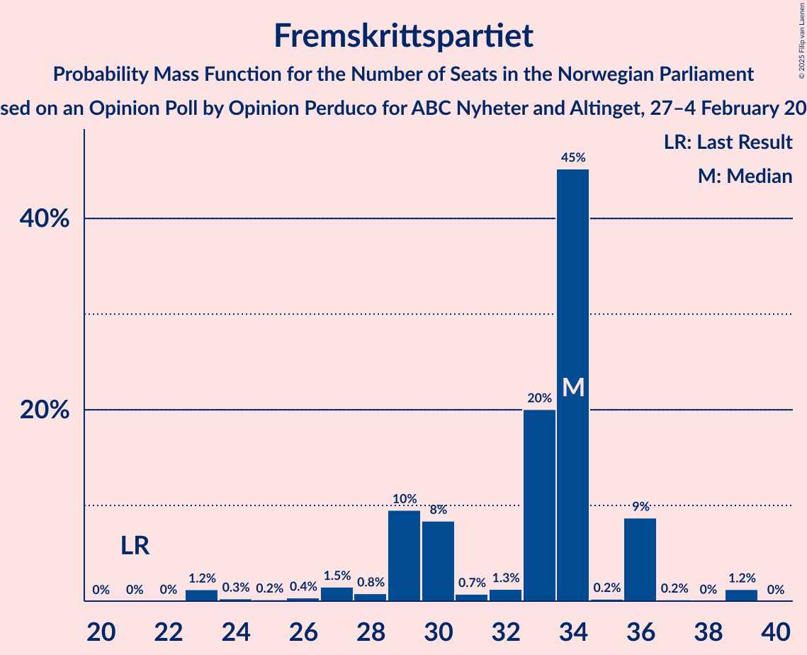

# Opinion Poll by Opinion Perduco for ABC Nyheter and Altinget, 27–4 February 2024

<a href="#voting-intentions">Voting Intentions</a> | <a href="#seats">Seats</a> | <a href="#coalitions">Coalitions</a> | <a href="#technical-information">Technical Information</a>

## Voting Intentions

### Confidence Intervals

| Party | Last Result | Poll Result | 80% Confidence Interval | 90% Confidence Interval | 95% Confidence Interval | 99% Confidence Interval |
|:-----:|:-----------:|:-----------:|:-----------------------:|:-----------------------:|:-----------------------:|:-----------------------:|
| Høyre | 20.4% | 24.9% | 22.9–27.0% |22.3–27.6% |21.8–28.2% |20.9–29.2% |
| Arbeiderpartiet | 26.2% | 18.8% | 17.0–20.7% |16.5–21.3% |16.1–21.8% |15.3–22.7% |
| Fremskrittspartiet | 11.6% | 16.2% | 14.6–18.1% |14.1–18.7% |13.7–19.1% |13.0–20.1% |
| Sosialistisk Venstreparti | 7.6% | 10.8% | 9.5–12.5% |9.1–12.9% |8.8–13.3% |8.2–14.1% |
| Venstre | 4.6% | 5.8% | 4.8–7.1% |4.6–7.5% |4.3–7.8% |3.9–8.5% |
| Rødt | 4.7% | 5.8% | 4.8–7.1% |4.6–7.5% |4.3–7.8% |3.9–8.5% |
| Senterpartiet | 13.5% | 5.4% | 4.5–6.7% |4.2–7.0% |4.0–7.3% |3.6–8.0% |
| Miljøpartiet De Grønne | 3.9% | 4.9% | 4.0–6.1% |3.7–6.4% |3.5–6.7% |3.1–7.3% |
| Kristelig Folkeparti | 3.8% | 2.6% | 2.0–3.6% |1.8–3.9% |1.7–4.1% |1.4–4.6% |
| Industri- og Næringspartiet | 0.3% | 1.4% | 1.0–2.1% |0.9–2.3% |0.8–2.5% |0.6–3.0% |
| Pensjonistpartiet | 0.6% | 0.8% | 0.5–1.5% |0.4–1.6% |0.4–1.8% |0.3–2.2% |
| Norgesdemokratene | 1.1% | 0.6% | 0.3–1.1% |0.3–1.3% |0.2–1.4% |0.1–1.7% |
| Konservativt | 0.4% | 0.4% | 0.2–0.9% |0.2–1.1% |0.1–1.2% |0.1–1.5% |
| Folkets parti | 0.1% | 0.1% | 0.1–0.5% |0.0–0.7% |0.0–0.8% |0.0–1.0% |
| Liberalistene | 0.2% | 0.1% | 0.1–0.5% |0.0–0.7% |0.0–0.8% |0.0–1.0% |
| Kystpartiet | 0.0% | 0.1% | 0.1–0.5% |0.0–0.7% |0.0–0.8% |0.0–1.0% |

*Note:* The poll result column reflects the actual value used in the calculations. Published results may vary slightly, and in addition be rounded to fewer digits.

## Seats

### Confidence Intervals

| Party | Last Result | Median | 80% Confidence Interval | 90% Confidence Interval | 95% Confidence Interval | 99% Confidence Interval |
|:-----:|:-----------:|:------:|:-----------------------:|:-----------------------:|:-----------------------:|:-----------------------:|
| <a href="#høyre">Høyre</a> | 36 | 37 | 36–46 |36–46 |33–48 |33–52 |
| <a href="#arbeiderpartiet">Arbeiderpartiet</a> | 48 | 33 | 32–42 |32–42 |30–42 |30–42 |
| <a href="#fremskrittspartiet">Fremskrittspartiet</a> | 21 | 34 | 29–36 |29–36 |27–36 |23–39 |
| <a href="#sosialistisk-venstreparti">Sosialistisk Venstreparti</a> | 13 | 21 | 16–22 |16–22 |15–24 |15–27 |
| <a href="#venstre">Venstre</a> | 8 | 9 | 9–13 |9–13 |8–13 |7–14 |
| <a href="#rødt">Rødt</a> | 8 | 11 | 9–12 |8–12 |8–12 |1–14 |
| <a href="#senterpartiet">Senterpartiet</a> | 28 | 9 | 1–10 |1–12 |1–13 |1–14 |
| <a href="#miljøpartiet-de-grønne">Miljøpartiet De Grønne</a> | 3 | 11 | 2–11 |2–11 |2–12 |2–12 |
| <a href="#kristelig-folkeparti">Kristelig Folkeparti</a> | 3 | 2 | 1–3 |0–3 |0–6 |0–8 |
| <a href="#industri--og-næringspartiet">Industri- og Næringspartiet</a> | 0 | 1 | 0–2 |0–2 |0–2 |0–2 |
| <a href="#pensjonistpartiet">Pensjonistpartiet</a> | 0 | 0 | 0 |0 |0 |0 |
| <a href="#norgesdemokratene">Norgesdemokratene</a> | 0 | 0 | 0 |0 |0 |0 |
| <a href="#konservativt">Konservativt</a> | 0 | 0 | 0 |0 |0 |0 |
| <a href="#folkets-parti">Folkets parti</a> | 0 | 0 | 0 |0 |0 |0 |
| <a href="#liberalistene">Liberalistene</a> | 0 | 0 | 0 |0 |0 |0 |
| <a href="#kystpartiet">Kystpartiet</a> | 0 | 0 | 0 |0–1 |0–1 |0–1 |

### Høyre

*For a full overview of the results for this party, see the [Høyre](party-høyre.html) page.*

| Number of Seats | Probability | Accumulated | Special Marks |
|:---------------:|:-----------:|:-----------:|:-------------:|
| 33 | 4% | 100% |  |
| 34 | 0% | 96% |  |
| 35 | 0% | 96% |  |
| 36 | 17% | 96% | Last Result |
| 37 | 44% | 79% | Median |
| 38 | 0.1% | 35% |  |
| 39 | 3% | 35% |  |
| 40 | 1.1% | 32% |  |
| 41 | 1.4% | 31% |  |
| 42 | 1.2% | 29% |  |
| 43 | 2% | 28% |  |
| 44 | 4% | 26% |  |
| 45 | 6% | 22% |  |
| 46 | 12% | 16% |  |
| 47 | 1.3% | 4% |  |
| 48 | 0.4% | 3% |  |
| 49 | 0.3% | 2% |  |
| 50 | 1.2% | 2% |  |
| 51 | 0.3% | 0.8% |  |
| 52 | 0.5% | 0.6% |  |
| 53 | 0% | 0.1% |  |
| 54 | 0% | 0% |  |

### Arbeiderpartiet

*For a full overview of the results for this party, see the [Arbeiderpartiet](party-arbeiderpartiet.html) page.*

| Number of Seats | Probability | Accumulated | Special Marks |
|:---------------:|:-----------:|:-----------:|:-------------:|
| 28 | 0.1% | 100% |  |
| 29 | 0.4% | 99.9% |  |
| 30 | 3% | 99.6% |  |
| 31 | 0.3% | 96% |  |
| 32 | 44% | 96% |  |
| 33 | 3% | 52% | Median |
| 34 | 1.0% | 49% |  |
| 35 | 9% | 48% |  |
| 36 | 5% | 39% |  |
| 37 | 0.3% | 34% |  |
| 38 | 5% | 33% |  |
| 39 | 10% | 29% |  |
| 40 | 2% | 19% |  |
| 41 | 1.0% | 17% |  |
| 42 | 16% | 16% |  |
| 43 | 0% | 0.2% |  |
| 44 | 0.1% | 0.1% |  |
| 45 | 0% | 0% |  |
| 46 | 0% | 0% |  |
| 47 | 0% | 0% |  |
| 48 | 0% | 0% | Last Result |

### Fremskrittspartiet

*For a full overview of the results for this party, see the [Fremskrittspartiet](party-fremskrittspartiet.html) page.*

| Number of Seats | Probability | Accumulated | Special Marks |
|:---------------:|:-----------:|:-----------:|:-------------:|
| 21 | 0% | 100% | Last Result |
| 22 | 0% | 100% |  |
| 23 | 1.2% | 99.9% |  |
| 24 | 0.3% | 98.7% |  |
| 25 | 0.2% | 98% |  |
| 26 | 0.4% | 98% |  |
| 27 | 1.5% | 98% |  |
| 28 | 0.8% | 96% |  |
| 29 | 10% | 96% |  |
| 30 | 8% | 86% |  |
| 31 | 0.7% | 78% |  |
| 32 | 1.3% | 77% |  |
| 33 | 20% | 76% |  |
| 34 | 45% | 56% | Median |
| 35 | 0.2% | 10% |  |
| 36 | 9% | 10% |  |
| 37 | 0.2% | 1.5% |  |
| 38 | 0% | 1.3% |  |
| 39 | 1.2% | 1.3% |  |
| 40 | 0% | 0% |  |

### Sosialistisk Venstreparti

*For a full overview of the results for this party, see the [Sosialistisk Venstreparti](party-sosialistiskvenstreparti.html) page.*

| Number of Seats | Probability | Accumulated | Special Marks |
|:---------------:|:-----------:|:-----------:|:-------------:|
| 12 | 0.3% | 100% |  |
| 13 | 0% | 99.7% | Last Result |
| 14 | 0.1% | 99.7% |  |
| 15 | 2% | 99.5% |  |
| 16 | 19% | 97% |  |
| 17 | 11% | 78% |  |
| 18 | 2% | 67% |  |
| 19 | 2% | 66% |  |
| 20 | 4% | 64% |  |
| 21 | 47% | 60% | Median |
| 22 | 9% | 13% |  |
| 23 | 0.2% | 3% |  |
| 24 | 2% | 3% |  |
| 25 | 0.2% | 1.5% |  |
| 26 | 0.1% | 1.3% |  |
| 27 | 1.2% | 1.2% |  |
| 28 | 0% | 0% |  |

### Venstre

*For a full overview of the results for this party, see the [Venstre](party-venstre.html) page.*

| Number of Seats | Probability | Accumulated | Special Marks |
|:---------------:|:-----------:|:-----------:|:-------------:|
| 2 | 0.1% | 100% |  |
| 3 | 0% | 99.9% |  |
| 4 | 0% | 99.9% |  |
| 5 | 0% | 99.9% |  |
| 6 | 0% | 99.9% |  |
| 7 | 0.8% | 99.9% |  |
| 8 | 2% | 99.1% | Last Result |
| 9 | 67% | 97% | Median |
| 10 | 9% | 30% |  |
| 11 | 4% | 20% |  |
| 12 | 3% | 17% |  |
| 13 | 13% | 13% |  |
| 14 | 0.7% | 0.8% |  |
| 15 | 0.1% | 0.1% |  |
| 16 | 0% | 0% |  |

### Rødt

*For a full overview of the results for this party, see the [Rødt](party-rødt.html) page.*

| Number of Seats | Probability | Accumulated | Special Marks |
|:---------------:|:-----------:|:-----------:|:-------------:|
| 1 | 1.0% | 100% |  |
| 2 | 0% | 99.0% |  |
| 3 | 0% | 99.0% |  |
| 4 | 0% | 99.0% |  |
| 5 | 0% | 99.0% |  |
| 6 | 0% | 99.0% |  |
| 7 | 0.1% | 99.0% |  |
| 8 | 6% | 98.9% | Last Result |
| 9 | 20% | 93% |  |
| 10 | 6% | 73% |  |
| 11 | 45% | 68% | Median |
| 12 | 21% | 23% |  |
| 13 | 0.5% | 2% |  |
| 14 | 1.4% | 2% |  |
| 15 | 0.4% | 0.5% |  |
| 16 | 0% | 0.1% |  |
| 17 | 0% | 0.1% |  |
| 18 | 0.1% | 0.1% |  |
| 19 | 0% | 0% |  |

### Senterpartiet

*For a full overview of the results for this party, see the [Senterpartiet](party-senterpartiet.html) page.*

| Number of Seats | Probability | Accumulated | Special Marks |
|:---------------:|:-----------:|:-----------:|:-------------:|
| 1 | 11% | 100% |  |
| 2 | 0.1% | 89% |  |
| 3 | 0% | 89% |  |
| 4 | 0% | 89% |  |
| 5 | 0% | 89% |  |
| 6 | 0% | 89% |  |
| 7 | 1.0% | 89% |  |
| 8 | 19% | 88% |  |
| 9 | 54% | 69% | Median |
| 10 | 8% | 14% |  |
| 11 | 1.2% | 7% |  |
| 12 | 1.1% | 6% |  |
| 13 | 4% | 5% |  |
| 14 | 0.4% | 0.5% |  |
| 15 | 0.1% | 0.1% |  |
| 16 | 0.1% | 0.1% |  |
| 17 | 0% | 0% |  |
| 18 | 0% | 0% |  |
| 19 | 0% | 0% |  |
| 20 | 0% | 0% |  |
| 21 | 0% | 0% |  |
| 22 | 0% | 0% |  |
| 23 | 0% | 0% |  |
| 24 | 0% | 0% |  |
| 25 | 0% | 0% |  |
| 26 | 0% | 0% |  |
| 27 | 0% | 0% |  |
| 28 | 0% | 0% | Last Result |

### Miljøpartiet De Grønne

*For a full overview of the results for this party, see the [Miljøpartiet De Grønne](party-miljøpartietdegrønne.html) page.*

| Number of Seats | Probability | Accumulated | Special Marks |
|:---------------:|:-----------:|:-----------:|:-------------:|
| 1 | 0.2% | 100% |  |
| 2 | 12% | 99.8% |  |
| 3 | 2% | 88% | Last Result |
| 4 | 0% | 87% |  |
| 5 | 0% | 87% |  |
| 6 | 0% | 87% |  |
| 7 | 2% | 87% |  |
| 8 | 3% | 85% |  |
| 9 | 8% | 81% |  |
| 10 | 20% | 73% |  |
| 11 | 49% | 53% | Median |
| 12 | 4% | 5% |  |
| 13 | 0.3% | 0.4% |  |
| 14 | 0.1% | 0.1% |  |
| 15 | 0% | 0% |  |

### Kristelig Folkeparti

*For a full overview of the results for this party, see the [Kristelig Folkeparti](party-kristeligfolkeparti.html) page.*

| Number of Seats | Probability | Accumulated | Special Marks |
|:---------------:|:-----------:|:-----------:|:-------------:|
| 0 | 9% | 100% |  |
| 1 | 6% | 91% |  |
| 2 | 72% | 85% | Median |
| 3 | 11% | 13% | Last Result |
| 4 | 0% | 3% |  |
| 5 | 0% | 3% |  |
| 6 | 0% | 3% |  |
| 7 | 0.7% | 2% |  |
| 8 | 2% | 2% |  |
| 9 | 0% | 0% |  |

### Industri- og Næringspartiet

*For a full overview of the results for this party, see the [Industri- og Næringspartiet](party-industri-ognæringspartiet.html) page.*

| Number of Seats | Probability | Accumulated | Special Marks |
|:---------------:|:-----------:|:-----------:|:-------------:|
| 0 | 37% | 100% | Last Result |
| 1 | 17% | 63% | Median |
| 2 | 45% | 46% |  |
| 3 | 0.3% | 0.3% |  |
| 4 | 0% | 0% |  |

### Pensjonistpartiet

*For a full overview of the results for this party, see the [Pensjonistpartiet](party-pensjonistpartiet.html) page.*

| Number of Seats | Probability | Accumulated | Special Marks |
|:---------------:|:-----------:|:-----------:|:-------------:|
| 0 | 99.9% | 100% | Last Result, Median |
| 1 | 0.1% | 0.1% |  |
| 2 | 0% | 0% |  |

### Norgesdemokratene

*For a full overview of the results for this party, see the [Norgesdemokratene](party-norgesdemokratene.html) page.*

| Number of Seats | Probability | Accumulated | Special Marks |
|:---------------:|:-----------:|:-----------:|:-------------:|
| 0 | 100% | 100% | Last Result, Median |

### Konservativt

*For a full overview of the results for this party, see the [Konservativt](party-konservativt.html) page.*

| Number of Seats | Probability | Accumulated | Special Marks |
|:---------------:|:-----------:|:-----------:|:-------------:|
| 0 | 100% | 100% | Last Result, Median |

### Folkets parti

*For a full overview of the results for this party, see the [Folkets parti](party-folketsparti.html) page.*

| Number of Seats | Probability | Accumulated | Special Marks |
|:---------------:|:-----------:|:-----------:|:-------------:|
| 0 | 100% | 100% | Last Result, Median |

### Liberalistene

*For a full overview of the results for this party, see the [Liberalistene](party-liberalistene.html) page.*

| Number of Seats | Probability | Accumulated | Special Marks |
|:---------------:|:-----------:|:-----------:|:-------------:|
| 0 | 100% | 100% | Last Result, Median |

### Kystpartiet

*For a full overview of the results for this party, see the [Kystpartiet](party-kystpartiet.html) page.*

| Number of Seats | Probability | Accumulated | Special Marks |
|:---------------:|:-----------:|:-----------:|:-------------:|
| 0 | 95% | 100% | Last Result, Median |
| 1 | 5% | 5% |  |
| 2 | 0% | 0% |  |

## Coalitions

### Confidence Intervals

| Coalition | Last Result | Median | Majority? | 80% Confidence Interval | 90% Confidence Interval | 95% Confidence Interval | 99% Confidence Interval |
|:---------:|:-----------:|:------:|:---------:|:-----------------------:|:-----------------------:|:-----------------------:|:-----------------------:|
| Høyre – Fremskrittspartiet – Venstre – Miljøpartiet De Grønne – Kristelig Folkeparti | 71 | 93 | 99.9% | 90–99 | 90–100 | 89–100 | 86–105 |
| Høyre – Fremskrittspartiet – Venstre – Senterpartiet – Kristelig Folkeparti | 96 | 91 | 99.8% | 88–100 | 88–100 | 88–100 | 87–102 |
| Høyre – Fremskrittspartiet – Venstre – Kristelig Folkeparti | 68 | 82 | 34% | 80–91 | 80–91 | 78–91 | 78–94 |
| Arbeiderpartiet – Sosialistisk Venstreparti – Rødt – Senterpartiet – Miljøpartiet De Grønne | 100 | 84 | 20% | 76–88 | 76–88 | 76–90 | 72–90 |
| Høyre – Fremskrittspartiet – Venstre | 65 | 80 | 28% | 78–88 | 78–90 | 76–90 | 76–91 |
| Arbeiderpartiet – Sosialistisk Venstreparti – Senterpartiet – Miljøpartiet De Grønne – Kristelig Folkeparti | 95 | 75 | 0.1% | 69–78 | 68–79 | 68–83 | 65–83 |
| Arbeiderpartiet – Sosialistisk Venstreparti – Senterpartiet – Miljøpartiet De Grønne | 92 | 73 | 0% | 67–76 | 67–78 | 67–81 | 62–81 |
| Høyre – Fremskrittspartiet | 57 | 71 | 0.3% | 69–77 | 69–81 | 63–81 | 63–83 |
| Arbeiderpartiet – Sosialistisk Venstreparti – Rødt – Miljøpartiet De Grønne | 72 | 75 | 0% | 68–80 | 67–80 | 67–80 | 65–81 |
| Arbeiderpartiet – Sosialistisk Venstreparti – Rødt – Senterpartiet | 97 | 73 | 0.1% | 69–78 | 67–78 | 67–79 | 63–82 |
| Arbeiderpartiet – Sosialistisk Venstreparti – Senterpartiet | 89 | 62 | 0% | 59–66 | 58–69 | 58–71 | 54–73 |
| Arbeiderpartiet – Senterpartiet – Miljøpartiet De Grønne – Kristelig Folkeparti | 82 | 54 | 0% | 50–62 | 46–62 | 46–63 | 41–64 |
| Høyre – Venstre – Kristelig Folkeparti | 47 | 48 | 0% | 47–62 | 47–62 | 47–62 | 47–65 |
| Arbeiderpartiet – Sosialistisk Venstreparti | 61 | 53 | 0% | 53–58 | 50–60 | 49–60 | 48–63 |
| Arbeiderpartiet – Senterpartiet – Kristelig Folkeparti | 79 | 43 | 0% | 39–52 | 37–52 | 37–53 | 37–56 |
| Arbeiderpartiet – Senterpartiet | 76 | 41 | 0% | 39–50 | 36–50 | 36–50 | 36–53 |
| Venstre – Senterpartiet – Kristelig Folkeparti | 39 | 20 | 0% | 13–25 | 11–27 | 11–28 | 11–29 |

### Høyre – Fremskrittspartiet – Venstre – Miljøpartiet De Grønne – Kristelig Folkeparti

| Number of Seats | Probability | Accumulated | Special Marks |
|:---------------:|:-----------:|:-----------:|:-------------:|
| 71 | 0% | 100% | Last Result |
| 72 | 0% | 100% |  |
| 73 | 0% | 100% |  |
| 74 | 0% | 100% |  |
| 75 | 0% | 100% |  |
| 76 | 0% | 100% |  |
| 77 | 0% | 100% |  |
| 78 | 0% | 100% |  |
| 79 | 0% | 100% |  |
| 80 | 0% | 100% |  |
| 81 | 0% | 100% |  |
| 82 | 0% | 100% |  |
| 83 | 0% | 99.9% |  |
| 84 | 0% | 99.9% |  |
| 85 | 0.1% | 99.9% | Majority |
| 86 | 0.5% | 99.8% |  |
| 87 | 0.2% | 99.3% |  |
| 88 | 0.5% | 99.1% |  |
| 89 | 2% | 98.7% |  |
| 90 | 20% | 97% |  |
| 91 | 0.6% | 77% |  |
| 92 | 2% | 77% |  |
| 93 | 53% | 75% | Median |
| 94 | 2% | 23% |  |
| 95 | 4% | 21% |  |
| 96 | 3% | 17% |  |
| 97 | 4% | 14% |  |
| 98 | 0.1% | 10% |  |
| 99 | 3% | 10% |  |
| 100 | 6% | 7% |  |
| 101 | 0.1% | 0.9% |  |
| 102 | 0.1% | 0.8% |  |
| 103 | 0% | 0.7% |  |
| 104 | 0% | 0.7% |  |
| 105 | 0.5% | 0.7% |  |
| 106 | 0% | 0.2% |  |
| 107 | 0% | 0.2% |  |
| 108 | 0.2% | 0.2% |  |
| 109 | 0% | 0% |  |

### Høyre – Fremskrittspartiet – Venstre – Senterpartiet – Kristelig Folkeparti

| Number of Seats | Probability | Accumulated | Special Marks |
|:---------------:|:-----------:|:-----------:|:-------------:|
| 84 | 0.1% | 100% |  |
| 85 | 0% | 99.8% | Majority |
| 86 | 0% | 99.8% |  |
| 87 | 0.6% | 99.8% |  |
| 88 | 16% | 99.2% |  |
| 89 | 3% | 83% |  |
| 90 | 0.3% | 80% |  |
| 91 | 47% | 80% | Median |
| 92 | 6% | 32% |  |
| 93 | 0.9% | 26% |  |
| 94 | 3% | 25% |  |
| 95 | 5% | 22% |  |
| 96 | 0.6% | 16% | Last Result |
| 97 | 2% | 16% |  |
| 98 | 1.0% | 14% |  |
| 99 | 3% | 13% |  |
| 100 | 9% | 10% |  |
| 101 | 0.6% | 1.1% |  |
| 102 | 0.2% | 0.5% |  |
| 103 | 0.1% | 0.3% |  |
| 104 | 0.1% | 0.2% |  |
| 105 | 0% | 0.1% |  |
| 106 | 0% | 0.1% |  |
| 107 | 0% | 0.1% |  |
| 108 | 0% | 0.1% |  |
| 109 | 0% | 0.1% |  |
| 110 | 0% | 0% |  |

### Høyre – Fremskrittspartiet – Venstre – Kristelig Folkeparti

| Number of Seats | Probability | Accumulated | Special Marks |
|:---------------:|:-----------:|:-----------:|:-------------:|
| 68 | 0% | 100% | Last Result |
| 69 | 0% | 100% |  |
| 70 | 0% | 100% |  |
| 71 | 0% | 100% |  |
| 72 | 0% | 100% |  |
| 73 | 0% | 100% |  |
| 74 | 0% | 100% |  |
| 75 | 0% | 100% |  |
| 76 | 0.1% | 100% |  |
| 77 | 0.1% | 99.9% |  |
| 78 | 4% | 99.8% |  |
| 79 | 0% | 96% |  |
| 80 | 16% | 96% |  |
| 81 | 0.1% | 80% |  |
| 82 | 44% | 80% | Median |
| 83 | 1.3% | 36% |  |
| 84 | 0.7% | 34% |  |
| 85 | 4% | 34% | Majority |
| 86 | 4% | 30% |  |
| 87 | 2% | 26% |  |
| 88 | 4% | 24% |  |
| 89 | 3% | 20% |  |
| 90 | 0% | 17% |  |
| 91 | 14% | 17% |  |
| 92 | 0.1% | 2% |  |
| 93 | 0.1% | 2% |  |
| 94 | 2% | 2% |  |
| 95 | 0% | 0.4% |  |
| 96 | 0.1% | 0.4% |  |
| 97 | 0.3% | 0.3% |  |
| 98 | 0% | 0% |  |

### Arbeiderpartiet – Sosialistisk Venstreparti – Rødt – Senterpartiet – Miljøpartiet De Grønne

| Number of Seats | Probability | Accumulated | Special Marks |
|:---------------:|:-----------:|:-----------:|:-------------:|
| 71 | 0.3% | 100% |  |
| 72 | 0.2% | 99.6% |  |
| 73 | 0.2% | 99.5% |  |
| 74 | 1.5% | 99.2% |  |
| 75 | 0% | 98% |  |
| 76 | 14% | 98% |  |
| 77 | 0.5% | 83% |  |
| 78 | 0.1% | 83% |  |
| 79 | 3% | 83% |  |
| 80 | 4% | 80% |  |
| 81 | 5% | 76% |  |
| 82 | 3% | 70% |  |
| 83 | 2% | 67% |  |
| 84 | 45% | 65% |  |
| 85 | 0.2% | 20% | Median, Majority |
| 86 | 0% | 20% |  |
| 87 | 0.1% | 20% |  |
| 88 | 16% | 20% |  |
| 89 | 0% | 4% |  |
| 90 | 4% | 4% |  |
| 91 | 0.1% | 0.1% |  |
| 92 | 0% | 0% |  |
| 93 | 0% | 0% |  |
| 94 | 0% | 0% |  |
| 95 | 0% | 0% |  |
| 96 | 0% | 0% |  |
| 97 | 0% | 0% |  |
| 98 | 0% | 0% |  |
| 99 | 0% | 0% |  |
| 100 | 0% | 0% | Last Result |

### Høyre – Fremskrittspartiet – Venstre

| Number of Seats | Probability | Accumulated | Special Marks |
|:---------------:|:-----------:|:-----------:|:-------------:|
| 65 | 0% | 100% | Last Result |
| 66 | 0% | 100% |  |
| 67 | 0% | 100% |  |
| 68 | 0% | 100% |  |
| 69 | 0% | 100% |  |
| 70 | 0% | 100% |  |
| 71 | 0% | 100% |  |
| 72 | 0% | 100% |  |
| 73 | 0% | 100% |  |
| 74 | 0% | 100% |  |
| 75 | 0.1% | 99.9% |  |
| 76 | 4% | 99.9% |  |
| 77 | 0.1% | 96% |  |
| 78 | 16% | 96% |  |
| 79 | 1.2% | 80% |  |
| 80 | 45% | 79% | Median |
| 81 | 2% | 35% |  |
| 82 | 0.8% | 33% |  |
| 83 | 1.4% | 32% |  |
| 84 | 2% | 31% |  |
| 85 | 3% | 28% | Majority |
| 86 | 3% | 25% |  |
| 87 | 3% | 23% |  |
| 88 | 11% | 19% |  |
| 89 | 0.1% | 8% |  |
| 90 | 6% | 8% |  |
| 91 | 1.4% | 2% |  |
| 92 | 0.1% | 0.5% |  |
| 93 | 0% | 0.4% |  |
| 94 | 0% | 0.4% |  |
| 95 | 0.2% | 0.3% |  |
| 96 | 0.1% | 0.1% |  |
| 97 | 0% | 0% |  |

### Arbeiderpartiet – Sosialistisk Venstreparti – Senterpartiet – Miljøpartiet De Grønne – Kristelig Folkeparti

| Number of Seats | Probability | Accumulated | Special Marks |
|:---------------:|:-----------:|:-----------:|:-------------:|
| 62 | 0.1% | 100% |  |
| 63 | 0.2% | 99.9% |  |
| 64 | 0% | 99.7% |  |
| 65 | 1.1% | 99.6% |  |
| 66 | 0.1% | 98.5% |  |
| 67 | 0.1% | 98% |  |
| 68 | 7% | 98% |  |
| 69 | 3% | 92% |  |
| 70 | 9% | 89% |  |
| 71 | 3% | 80% |  |
| 72 | 4% | 77% |  |
| 73 | 1.3% | 73% |  |
| 74 | 2% | 71% |  |
| 75 | 45% | 69% |  |
| 76 | 1.2% | 24% | Median |
| 77 | 1.0% | 22% |  |
| 78 | 16% | 21% |  |
| 79 | 0.2% | 5% |  |
| 80 | 0.1% | 5% |  |
| 81 | 0.1% | 5% |  |
| 82 | 0.8% | 5% |  |
| 83 | 4% | 4% |  |
| 84 | 0.1% | 0.3% |  |
| 85 | 0.1% | 0.1% | Majority |
| 86 | 0% | 0% |  |
| 87 | 0% | 0% |  |
| 88 | 0% | 0% |  |
| 89 | 0% | 0% |  |
| 90 | 0% | 0% |  |
| 91 | 0% | 0% |  |
| 92 | 0% | 0% |  |
| 93 | 0% | 0% |  |
| 94 | 0% | 0% |  |
| 95 | 0% | 0% | Last Result |

### Arbeiderpartiet – Sosialistisk Venstreparti – Senterpartiet – Miljøpartiet De Grønne

| Number of Seats | Probability | Accumulated | Special Marks |
|:---------------:|:-----------:|:-----------:|:-------------:|
| 61 | 0.2% | 100% |  |
| 62 | 1.2% | 99.7% |  |
| 63 | 0.3% | 98.5% |  |
| 64 | 0.2% | 98% |  |
| 65 | 0.4% | 98% |  |
| 66 | 0.1% | 98% |  |
| 67 | 16% | 98% |  |
| 68 | 0.6% | 82% |  |
| 69 | 6% | 81% |  |
| 70 | 1.3% | 75% |  |
| 71 | 2% | 74% |  |
| 72 | 4% | 72% |  |
| 73 | 44% | 68% |  |
| 74 | 3% | 24% | Median |
| 75 | 0.4% | 22% |  |
| 76 | 16% | 21% |  |
| 77 | 0.1% | 5% |  |
| 78 | 0.6% | 5% |  |
| 79 | 0% | 5% |  |
| 80 | 0.7% | 5% |  |
| 81 | 4% | 4% |  |
| 82 | 0.1% | 0.3% |  |
| 83 | 0.1% | 0.1% |  |
| 84 | 0% | 0% |  |
| 85 | 0% | 0% | Majority |
| 86 | 0% | 0% |  |
| 87 | 0% | 0% |  |
| 88 | 0% | 0% |  |
| 89 | 0% | 0% |  |
| 90 | 0% | 0% |  |
| 91 | 0% | 0% |  |
| 92 | 0% | 0% | Last Result |

### Høyre – Fremskrittspartiet

| Number of Seats | Probability | Accumulated | Special Marks |
|:---------------:|:-----------:|:-----------:|:-------------:|
| 57 | 0% | 100% | Last Result |
| 58 | 0% | 100% |  |
| 59 | 0% | 100% |  |
| 60 | 0% | 100% |  |
| 61 | 0% | 100% |  |
| 62 | 0% | 100% |  |
| 63 | 4% | 100% |  |
| 64 | 0% | 96% |  |
| 65 | 0.1% | 96% |  |
| 66 | 0% | 96% |  |
| 67 | 0.1% | 96% |  |
| 68 | 0.2% | 96% |  |
| 69 | 16% | 96% |  |
| 70 | 2% | 80% |  |
| 71 | 45% | 77% | Median |
| 72 | 1.2% | 33% |  |
| 73 | 1.1% | 32% |  |
| 74 | 3% | 31% |  |
| 75 | 13% | 28% |  |
| 76 | 4% | 15% |  |
| 77 | 3% | 11% |  |
| 78 | 0.5% | 9% |  |
| 79 | 0.3% | 8% |  |
| 80 | 0.1% | 8% |  |
| 81 | 6% | 8% |  |
| 82 | 0.1% | 1.5% |  |
| 83 | 1.0% | 1.3% |  |
| 84 | 0.1% | 0.3% |  |
| 85 | 0.3% | 0.3% | Majority |
| 86 | 0% | 0% |  |

### Arbeiderpartiet – Sosialistisk Venstreparti – Rødt – Miljøpartiet De Grønne

| Number of Seats | Probability | Accumulated | Special Marks |
|:---------------:|:-----------:|:-----------:|:-------------:|
| 59 | 0% | 100% |  |
| 60 | 0% | 99.9% |  |
| 61 | 0% | 99.9% |  |
| 62 | 0% | 99.9% |  |
| 63 | 0.1% | 99.9% |  |
| 64 | 0.2% | 99.7% |  |
| 65 | 0.1% | 99.6% |  |
| 66 | 0.1% | 99.5% |  |
| 67 | 9% | 99.4% |  |
| 68 | 0.3% | 90% |  |
| 69 | 4% | 90% |  |
| 70 | 0.3% | 86% |  |
| 71 | 4% | 85% |  |
| 72 | 1.5% | 81% | Last Result |
| 73 | 3% | 80% |  |
| 74 | 2% | 77% |  |
| 75 | 51% | 75% |  |
| 76 | 0.4% | 24% | Median |
| 77 | 4% | 24% |  |
| 78 | 0.1% | 20% |  |
| 79 | 3% | 20% |  |
| 80 | 16% | 17% |  |
| 81 | 0.6% | 0.8% |  |
| 82 | 0% | 0.2% |  |
| 83 | 0% | 0.2% |  |
| 84 | 0.1% | 0.1% |  |
| 85 | 0% | 0% | Majority |

### Arbeiderpartiet – Sosialistisk Venstreparti – Rødt – Senterpartiet

| Number of Seats | Probability | Accumulated | Special Marks |
|:---------------:|:-----------:|:-----------:|:-------------:|
| 60 | 0.2% | 100% |  |
| 61 | 0.1% | 99.8% |  |
| 62 | 0.1% | 99.8% |  |
| 63 | 0.4% | 99.7% |  |
| 64 | 0% | 99.3% |  |
| 65 | 0.1% | 99.3% |  |
| 66 | 0.1% | 99.2% |  |
| 67 | 6% | 99.1% |  |
| 68 | 0.3% | 93% |  |
| 69 | 3% | 93% |  |
| 70 | 0.7% | 90% |  |
| 71 | 6% | 89% |  |
| 72 | 4% | 83% |  |
| 73 | 44% | 79% |  |
| 74 | 10% | 35% | Median |
| 75 | 1.3% | 25% |  |
| 76 | 1.0% | 24% |  |
| 77 | 0.5% | 23% |  |
| 78 | 20% | 22% |  |
| 79 | 1.4% | 3% |  |
| 80 | 0.5% | 1.3% |  |
| 81 | 0% | 0.7% |  |
| 82 | 0.5% | 0.7% |  |
| 83 | 0.1% | 0.2% |  |
| 84 | 0.1% | 0.1% |  |
| 85 | 0% | 0.1% | Majority |
| 86 | 0% | 0% |  |
| 87 | 0% | 0% |  |
| 88 | 0% | 0% |  |
| 89 | 0% | 0% |  |
| 90 | 0% | 0% |  |
| 91 | 0% | 0% |  |
| 92 | 0% | 0% |  |
| 93 | 0% | 0% |  |
| 94 | 0% | 0% |  |
| 95 | 0% | 0% |  |
| 96 | 0% | 0% |  |
| 97 | 0% | 0% | Last Result |

### Arbeiderpartiet – Sosialistisk Venstreparti – Senterpartiet

| Number of Seats | Probability | Accumulated | Special Marks |
|:---------------:|:-----------:|:-----------:|:-------------:|
| 50 | 0.2% | 100% |  |
| 51 | 0% | 99.8% |  |
| 52 | 0% | 99.8% |  |
| 53 | 0.1% | 99.8% |  |
| 54 | 0.4% | 99.7% |  |
| 55 | 0.2% | 99.3% |  |
| 56 | 0.1% | 99.1% |  |
| 57 | 0.2% | 99.1% |  |
| 58 | 6% | 98.9% |  |
| 59 | 3% | 93% |  |
| 60 | 3% | 90% |  |
| 61 | 7% | 86% |  |
| 62 | 44% | 79% |  |
| 63 | 0.4% | 35% | Median |
| 64 | 1.5% | 35% |  |
| 65 | 9% | 34% |  |
| 66 | 16% | 24% |  |
| 67 | 0.5% | 8% |  |
| 68 | 0.5% | 8% |  |
| 69 | 4% | 7% |  |
| 70 | 0.5% | 3% |  |
| 71 | 2% | 3% |  |
| 72 | 0.1% | 0.7% |  |
| 73 | 0.4% | 0.6% |  |
| 74 | 0.1% | 0.2% |  |
| 75 | 0% | 0% |  |
| 76 | 0% | 0% |  |
| 77 | 0% | 0% |  |
| 78 | 0% | 0% |  |
| 79 | 0% | 0% |  |
| 80 | 0% | 0% |  |
| 81 | 0% | 0% |  |
| 82 | 0% | 0% |  |
| 83 | 0% | 0% |  |
| 84 | 0% | 0% |  |
| 85 | 0% | 0% | Majority |
| 86 | 0% | 0% |  |
| 87 | 0% | 0% |  |
| 88 | 0% | 0% |  |
| 89 | 0% | 0% | Last Result |

### Arbeiderpartiet – Senterpartiet – Miljøpartiet De Grønne – Kristelig Folkeparti

| Number of Seats | Probability | Accumulated | Special Marks |
|:---------------:|:-----------:|:-----------:|:-------------:|
| 41 | 1.0% | 100% |  |
| 42 | 0% | 99.0% |  |
| 43 | 0% | 99.0% |  |
| 44 | 0.1% | 99.0% |  |
| 45 | 0.1% | 98.9% |  |
| 46 | 6% | 98.8% |  |
| 47 | 0.2% | 93% |  |
| 48 | 0.2% | 92% |  |
| 49 | 1.3% | 92% |  |
| 50 | 5% | 91% |  |
| 51 | 0.6% | 85% |  |
| 52 | 2% | 85% |  |
| 53 | 12% | 83% |  |
| 54 | 44% | 71% |  |
| 55 | 0.4% | 27% | Median |
| 56 | 0.7% | 26% |  |
| 57 | 1.3% | 26% |  |
| 58 | 2% | 24% |  |
| 59 | 0.9% | 23% |  |
| 60 | 1.2% | 22% |  |
| 61 | 0.1% | 20% |  |
| 62 | 16% | 20% |  |
| 63 | 4% | 5% |  |
| 64 | 0.9% | 1.0% |  |
| 65 | 0% | 0% |  |
| 66 | 0% | 0% |  |
| 67 | 0% | 0% |  |
| 68 | 0% | 0% |  |
| 69 | 0% | 0% |  |
| 70 | 0% | 0% |  |
| 71 | 0% | 0% |  |
| 72 | 0% | 0% |  |
| 73 | 0% | 0% |  |
| 74 | 0% | 0% |  |
| 75 | 0% | 0% |  |
| 76 | 0% | 0% |  |
| 77 | 0% | 0% |  |
| 78 | 0% | 0% |  |
| 79 | 0% | 0% |  |
| 80 | 0% | 0% |  |
| 81 | 0% | 0% |  |
| 82 | 0% | 0% | Last Result |

### Høyre – Venstre – Kristelig Folkeparti

| Number of Seats | Probability | Accumulated | Special Marks |
|:---------------:|:-----------:|:-----------:|:-------------:|
| 47 | 17% | 100% | Last Result |
| 48 | 48% | 83% | Median |
| 49 | 3% | 35% |  |
| 50 | 0.7% | 32% |  |
| 51 | 0.2% | 31% |  |
| 52 | 1.2% | 31% |  |
| 53 | 0.1% | 30% |  |
| 54 | 0.5% | 30% |  |
| 55 | 6% | 29% |  |
| 56 | 5% | 23% |  |
| 57 | 0.5% | 18% |  |
| 58 | 5% | 18% |  |
| 59 | 0.1% | 13% |  |
| 60 | 0.4% | 13% |  |
| 61 | 1.2% | 12% |  |
| 62 | 9% | 11% |  |
| 63 | 0.4% | 2% |  |
| 64 | 1.2% | 2% |  |
| 65 | 0.7% | 0.9% |  |
| 66 | 0% | 0.2% |  |
| 67 | 0.2% | 0.2% |  |
| 68 | 0% | 0% |  |

### Arbeiderpartiet – Sosialistisk Venstreparti

| Number of Seats | Probability | Accumulated | Special Marks |
|:---------------:|:-----------:|:-----------:|:-------------:|
| 44 | 0.2% | 100% |  |
| 45 | 0% | 99.8% |  |
| 46 | 0.1% | 99.8% |  |
| 47 | 0.2% | 99.7% |  |
| 48 | 0.1% | 99.5% |  |
| 49 | 4% | 99.4% |  |
| 50 | 1.3% | 96% |  |
| 51 | 3% | 94% |  |
| 52 | 0.8% | 92% |  |
| 53 | 44% | 91% |  |
| 54 | 1.0% | 46% | Median |
| 55 | 2% | 45% |  |
| 56 | 12% | 44% |  |
| 57 | 7% | 31% |  |
| 58 | 16% | 24% |  |
| 59 | 3% | 8% |  |
| 60 | 4% | 6% |  |
| 61 | 0.1% | 2% | Last Result |
| 62 | 0% | 2% |  |
| 63 | 2% | 2% |  |
| 64 | 0% | 0.1% |  |
| 65 | 0% | 0.1% |  |
| 66 | 0% | 0% |  |

### Arbeiderpartiet – Senterpartiet – Kristelig Folkeparti

| Number of Seats | Probability | Accumulated | Special Marks |
|:---------------:|:-----------:|:-----------:|:-------------:|
| 35 | 0.3% | 100% |  |
| 36 | 0.1% | 99.7% |  |
| 37 | 6% | 99.6% |  |
| 38 | 0% | 94% |  |
| 39 | 4% | 94% |  |
| 40 | 0.1% | 90% |  |
| 41 | 0.6% | 90% |  |
| 42 | 3% | 89% |  |
| 43 | 47% | 86% |  |
| 44 | 0.1% | 39% | Median |
| 45 | 1.5% | 39% |  |
| 46 | 1.4% | 38% |  |
| 47 | 3% | 36% |  |
| 48 | 0.4% | 33% |  |
| 49 | 0.3% | 33% |  |
| 50 | 1.4% | 33% |  |
| 51 | 13% | 31% |  |
| 52 | 16% | 19% |  |
| 53 | 1.2% | 3% |  |
| 54 | 0.2% | 2% |  |
| 55 | 0.7% | 1.5% |  |
| 56 | 0.7% | 0.8% |  |
| 57 | 0.1% | 0.1% |  |
| 58 | 0% | 0% |  |
| 59 | 0% | 0% |  |
| 60 | 0% | 0% |  |
| 61 | 0% | 0% |  |
| 62 | 0% | 0% |  |
| 63 | 0% | 0% |  |
| 64 | 0% | 0% |  |
| 65 | 0% | 0% |  |
| 66 | 0% | 0% |  |
| 67 | 0% | 0% |  |
| 68 | 0% | 0% |  |
| 69 | 0% | 0% |  |
| 70 | 0% | 0% |  |
| 71 | 0% | 0% |  |
| 72 | 0% | 0% |  |
| 73 | 0% | 0% |  |
| 74 | 0% | 0% |  |
| 75 | 0% | 0% |  |
| 76 | 0% | 0% |  |
| 77 | 0% | 0% |  |
| 78 | 0% | 0% |  |
| 79 | 0% | 0% | Last Result |

### Arbeiderpartiet – Senterpartiet

| Number of Seats | Probability | Accumulated | Special Marks |
|:---------------:|:-----------:|:-----------:|:-------------:|
| 33 | 0.2% | 100% |  |
| 34 | 0% | 99.8% |  |
| 35 | 0.1% | 99.8% |  |
| 36 | 7% | 99.7% |  |
| 37 | 0.2% | 93% |  |
| 38 | 0.7% | 92% |  |
| 39 | 3% | 92% |  |
| 40 | 3% | 89% |  |
| 41 | 44% | 86% |  |
| 42 | 0.5% | 42% | Median |
| 43 | 4% | 41% |  |
| 44 | 1.3% | 37% |  |
| 45 | 2% | 36% |  |
| 46 | 0.1% | 34% |  |
| 47 | 2% | 34% |  |
| 48 | 10% | 32% |  |
| 49 | 4% | 22% |  |
| 50 | 16% | 17% |  |
| 51 | 0.1% | 1.1% |  |
| 52 | 0.2% | 1.0% |  |
| 53 | 0.7% | 0.8% |  |
| 54 | 0.1% | 0.1% |  |
| 55 | 0% | 0% |  |
| 56 | 0% | 0% |  |
| 57 | 0% | 0% |  |
| 58 | 0% | 0% |  |
| 59 | 0% | 0% |  |
| 60 | 0% | 0% |  |
| 61 | 0% | 0% |  |
| 62 | 0% | 0% |  |
| 63 | 0% | 0% |  |
| 64 | 0% | 0% |  |
| 65 | 0% | 0% |  |
| 66 | 0% | 0% |  |
| 67 | 0% | 0% |  |
| 68 | 0% | 0% |  |
| 69 | 0% | 0% |  |
| 70 | 0% | 0% |  |
| 71 | 0% | 0% |  |
| 72 | 0% | 0% |  |
| 73 | 0% | 0% |  |
| 74 | 0% | 0% |  |
| 75 | 0% | 0% |  |
| 76 | 0% | 0% | Last Result |

### Venstre – Senterpartiet – Kristelig Folkeparti

| Number of Seats | Probability | Accumulated | Special Marks |
|:---------------:|:-----------:|:-----------:|:-------------:|
| 11 | 6% | 100% |  |
| 12 | 1.0% | 94% |  |
| 13 | 3% | 93% |  |
| 14 | 0.9% | 90% |  |
| 15 | 0% | 89% |  |
| 16 | 0% | 89% |  |
| 17 | 0.7% | 89% |  |
| 18 | 0% | 88% |  |
| 19 | 16% | 88% |  |
| 20 | 50% | 72% | Median |
| 21 | 1.0% | 22% |  |
| 22 | 4% | 21% |  |
| 23 | 0.4% | 17% |  |
| 24 | 2% | 17% |  |
| 25 | 9% | 15% |  |
| 26 | 0.6% | 6% |  |
| 27 | 1.2% | 5% |  |
| 28 | 4% | 4% |  |
| 29 | 0.3% | 0.5% |  |
| 30 | 0.1% | 0.3% |  |
| 31 | 0% | 0.2% |  |
| 32 | 0% | 0.2% |  |
| 33 | 0.2% | 0.2% |  |
| 34 | 0% | 0% |  |
| 35 | 0% | 0% |  |
| 36 | 0% | 0% |  |
| 37 | 0% | 0% |  |
| 38 | 0% | 0% |  |
| 39 | 0% | 0% | Last Result |

## Technical Information

### Opinion Poll

+ **Polling firm:** Opinion Perduco
+ **Commissioner(s):** ABC Nyheter and Altinget
+ **Fieldwork period:** 27–4 February 2024

### Calculations

+ **Sample size:** 720
+ **Simulations done:** 1,048,576
+ **Error estimate:** 4.18%

