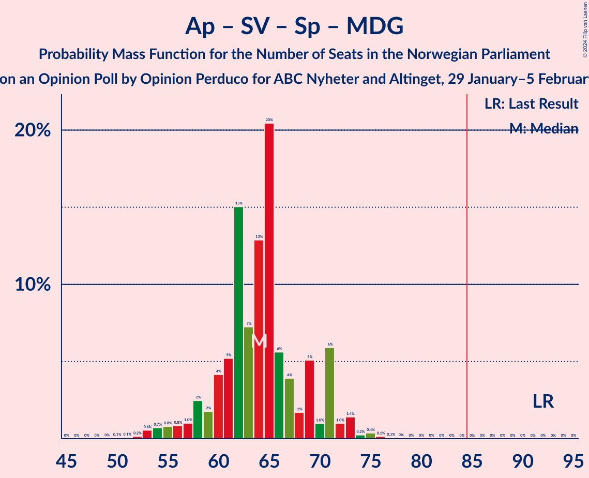
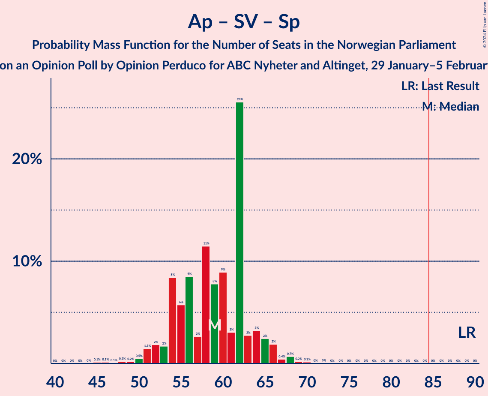

# Opinion Poll by Opinion Perduco for ABC Nyheter and Altinget, 29 January–5 February 2024

<a href="#voting-intentions">Voting Intentions</a> | <a href="#seats">Seats</a> | <a href="#coalitions">Coalitions</a> | <a href="#technical-information">Technical Information</a>

## Voting Intentions

### Confidence Intervals

| Party | Last Result | Poll Result | 80% Confidence Interval | 90% Confidence Interval | 95% Confidence Interval | 99% Confidence Interval |
|:-----:|:-----------:|:-----------:|:-----------------------:|:-----------------------:|:-----------------------:|:-----------------------:|
| Høyre | 20.4% | 31.1% | 29.0–33.4% |28.3–34.1% |27.8–34.6% |26.8–35.7% |
| Arbeiderpartiet | 26.2% | 17.6% | 15.9–19.6% |15.4–20.1% |15.0–20.6% |14.2–21.6% |
| Fremskrittspartiet | 11.6% | 11.8% | 10.4–13.5% |10.0–14.0% |9.6–14.4% |9.0–15.3% |
| Sosialistisk Venstreparti | 7.6% | 10.0% | 8.7–11.6% |8.3–12.0% |8.0–12.4% |7.4–13.2% |
| Venstre | 4.6% | 5.9% | 4.9–7.2% |4.6–7.6% |4.4–7.9% |4.0–8.6% |
| Kristelig Folkeparti | 3.8% | 4.6% | 3.8–5.8% |3.5–6.2% |3.3–6.5% |3.0–7.1% |
| Rødt | 4.7% | 4.6% | 3.8–5.8% |3.5–6.2% |3.3–6.5% |3.0–7.1% |
| Senterpartiet | 13.5% | 4.6% | 3.8–5.8% |3.5–6.2% |3.3–6.5% |3.0–7.1% |
| Miljøpartiet De Grønne | 3.9% | 4.2% | 3.4–5.4% |3.2–5.7% |3.0–6.0% |2.6–6.6% |
| Industri- og Næringspartiet | 0.3% | 3.5% | 2.8–4.6% |2.6–4.9% |2.4–5.2% |2.1–5.7% |

*Note:* The poll result column reflects the actual value used in the calculations. Published results may vary slightly, and in addition be rounded to fewer digits.

## Seats

### Confidence Intervals

| Party | Last Result | Median | 80% Confidence Interval | 90% Confidence Interval | 95% Confidence Interval | 99% Confidence Interval |
|:-----:|:-----------:|:------:|:-----------------------:|:-----------------------:|:-----------------------:|:-----------------------:|
| <a href="#høyre">Høyre</a> | 36 | 56 | 51–60 |50–62 |49–64 |48–66 |
| <a href="#arbeiderpartiet">Arbeiderpartiet</a> | 48 | 34 | 32–38 |31–40 |29–41 |29–42 |
| <a href="#fremskrittspartiet">Fremskrittspartiet</a> | 21 | 20 | 18–25 |17–27 |17–28 |16–29 |
| <a href="#sosialistisk-venstreparti">Sosialistisk Venstreparti</a> | 13 | 17 | 13–20 |12–21 |12–22 |11–23 |
| <a href="#venstre">Venstre</a> | 8 | 11 | 8–12 |7–13 |7–13 |7–15 |
| <a href="#kristelig-folkeparti">Kristelig Folkeparti</a> | 3 | 8 | 3–9 |2–10 |2–10 |2–11 |
| <a href="#rødt">Rødt</a> | 8 | 8 | 1–9 |1–9 |1–10 |1–12 |
| <a href="#senterpartiet">Senterpartiet</a> | 28 | 8 | 7–9 |3–9 |1–10 |0–13 |
| <a href="#miljøpartiet-de-grønne">Miljøpartiet De Grønne</a> | 3 | 6 | 2–9 |2–9 |2–10 |1–10 |
| <a href="#industri--og-næringspartiet">Industri- og Næringspartiet</a> | 0 | 3 | 2–7 |0–7 |0–8 |0–9 |

### Høyre

*For a full overview of the results for this party, see the [Høyre](party-høyre.html) page.*

| Number of Seats | Probability | Accumulated | Special Marks |
|:---------------:|:-----------:|:-----------:|:-------------:|
| 36 | 0% | 100% | Last Result |
| 37 | 0% | 100% |  |
| 38 | 0% | 100% |  |
| 39 | 0% | 100% |  |
| 40 | 0% | 100% |  |
| 41 | 0% | 100% |  |
| 42 | 0% | 100% |  |
| 43 | 0% | 100% |  |
| 44 | 0% | 100% |  |
| 45 | 0% | 100% |  |
| 46 | 0.2% | 99.9% |  |
| 47 | 0.2% | 99.8% |  |
| 48 | 2% | 99.6% |  |
| 49 | 2% | 98% |  |
| 50 | 4% | 96% |  |
| 51 | 7% | 92% |  |
| 52 | 5% | 85% |  |
| 53 | 16% | 80% |  |
| 54 | 7% | 64% |  |
| 55 | 5% | 57% |  |
| 56 | 3% | 52% | Median |
| 57 | 10% | 49% |  |
| 58 | 8% | 39% |  |
| 59 | 4% | 31% |  |
| 60 | 19% | 27% |  |
| 61 | 3% | 9% |  |
| 62 | 2% | 5% |  |
| 63 | 0.4% | 3% |  |
| 64 | 1.0% | 3% |  |
| 65 | 1.0% | 2% |  |
| 66 | 0.7% | 1.0% |  |
| 67 | 0.2% | 0.3% |  |
| 68 | 0.1% | 0.1% |  |
| 69 | 0% | 0% |  |

### Arbeiderpartiet

*For a full overview of the results for this party, see the [Arbeiderpartiet](party-arbeiderpartiet.html) page.*

| Number of Seats | Probability | Accumulated | Special Marks |
|:---------------:|:-----------:|:-----------:|:-------------:|
| 26 | 0.1% | 100% |  |
| 27 | 0% | 99.9% |  |
| 28 | 0.3% | 99.9% |  |
| 29 | 2% | 99.6% |  |
| 30 | 2% | 97% |  |
| 31 | 4% | 95% |  |
| 32 | 6% | 91% |  |
| 33 | 21% | 85% |  |
| 34 | 22% | 64% | Median |
| 35 | 23% | 41% |  |
| 36 | 3% | 18% |  |
| 37 | 5% | 15% |  |
| 38 | 2% | 11% |  |
| 39 | 1.3% | 9% |  |
| 40 | 4% | 8% |  |
| 41 | 3% | 3% |  |
| 42 | 0.2% | 0.6% |  |
| 43 | 0.1% | 0.4% |  |
| 44 | 0.1% | 0.3% |  |
| 45 | 0.1% | 0.2% |  |
| 46 | 0.1% | 0.1% |  |
| 47 | 0% | 0% |  |
| 48 | 0% | 0% | Last Result |

### Fremskrittspartiet

*For a full overview of the results for this party, see the [Fremskrittspartiet](party-fremskrittspartiet.html) page.*

| Number of Seats | Probability | Accumulated | Special Marks |
|:---------------:|:-----------:|:-----------:|:-------------:|
| 14 | 0.1% | 100% |  |
| 15 | 0.3% | 99.9% |  |
| 16 | 1.4% | 99.6% |  |
| 17 | 4% | 98% |  |
| 18 | 12% | 95% |  |
| 19 | 9% | 82% |  |
| 20 | 26% | 73% | Median |
| 21 | 11% | 47% | Last Result |
| 22 | 5% | 35% |  |
| 23 | 4% | 31% |  |
| 24 | 6% | 26% |  |
| 25 | 13% | 21% |  |
| 26 | 2% | 7% |  |
| 27 | 2% | 5% |  |
| 28 | 2% | 3% |  |
| 29 | 1.0% | 1.4% |  |
| 30 | 0.2% | 0.4% |  |
| 31 | 0.1% | 0.2% |  |
| 32 | 0.1% | 0.2% |  |
| 33 | 0.1% | 0.1% |  |
| 34 | 0% | 0% |  |

### Sosialistisk Venstreparti

*For a full overview of the results for this party, see the [Sosialistisk Venstreparti](party-sosialistiskvenstreparti.html) page.*

| Number of Seats | Probability | Accumulated | Special Marks |
|:---------------:|:-----------:|:-----------:|:-------------:|
| 10 | 0.1% | 100% |  |
| 11 | 1.1% | 99.9% |  |
| 12 | 7% | 98.9% |  |
| 13 | 2% | 92% | Last Result |
| 14 | 6% | 90% |  |
| 15 | 14% | 84% |  |
| 16 | 7% | 70% |  |
| 17 | 20% | 63% | Median |
| 18 | 21% | 43% |  |
| 19 | 8% | 21% |  |
| 20 | 7% | 13% |  |
| 21 | 4% | 7% |  |
| 22 | 1.1% | 3% |  |
| 23 | 1.2% | 1.5% |  |
| 24 | 0.2% | 0.3% |  |
| 25 | 0.1% | 0.1% |  |
| 26 | 0% | 0% |  |

### Venstre

*For a full overview of the results for this party, see the [Venstre](party-venstre.html) page.*

| Number of Seats | Probability | Accumulated | Special Marks |
|:---------------:|:-----------:|:-----------:|:-------------:|
| 2 | 0.1% | 100% |  |
| 3 | 0.3% | 99.9% |  |
| 4 | 0% | 99.6% |  |
| 5 | 0% | 99.6% |  |
| 6 | 0.1% | 99.6% |  |
| 7 | 9% | 99.5% |  |
| 8 | 9% | 90% | Last Result |
| 9 | 21% | 81% |  |
| 10 | 9% | 60% |  |
| 11 | 36% | 50% | Median |
| 12 | 9% | 15% |  |
| 13 | 4% | 6% |  |
| 14 | 0.4% | 2% |  |
| 15 | 0.8% | 1.1% |  |
| 16 | 0.3% | 0.3% |  |
| 17 | 0% | 0% |  |

### Kristelig Folkeparti

*For a full overview of the results for this party, see the [Kristelig Folkeparti](party-kristeligfolkeparti.html) page.*

| Number of Seats | Probability | Accumulated | Special Marks |
|:---------------:|:-----------:|:-----------:|:-------------:|
| 1 | 0.1% | 100% |  |
| 2 | 9% | 99.9% |  |
| 3 | 2% | 91% | Last Result |
| 4 | 0% | 90% |  |
| 5 | 0% | 90% |  |
| 6 | 2% | 90% |  |
| 7 | 26% | 87% |  |
| 8 | 39% | 61% | Median |
| 9 | 14% | 22% |  |
| 10 | 6% | 8% |  |
| 11 | 2% | 2% |  |
| 12 | 0.3% | 0.4% |  |
| 13 | 0.1% | 0.1% |  |
| 14 | 0% | 0% |  |

### Rødt

*For a full overview of the results for this party, see the [Rødt](party-rødt.html) page.*

| Number of Seats | Probability | Accumulated | Special Marks |
|:---------------:|:-----------:|:-----------:|:-------------:|
| 1 | 32% | 100% |  |
| 2 | 0% | 68% |  |
| 3 | 0% | 68% |  |
| 4 | 0% | 68% |  |
| 5 | 0% | 68% |  |
| 6 | 4% | 68% |  |
| 7 | 13% | 64% |  |
| 8 | 33% | 51% | Last Result, Median |
| 9 | 13% | 18% |  |
| 10 | 2% | 5% |  |
| 11 | 1.5% | 2% |  |
| 12 | 0.4% | 0.6% |  |
| 13 | 0.2% | 0.2% |  |
| 14 | 0% | 0% |  |

### Senterpartiet

*For a full overview of the results for this party, see the [Senterpartiet](party-senterpartiet.html) page.*

| Number of Seats | Probability | Accumulated | Special Marks |
|:---------------:|:-----------:|:-----------:|:-------------:|
| 0 | 1.0% | 100% |  |
| 1 | 2% | 99.0% |  |
| 2 | 1.1% | 97% |  |
| 3 | 2% | 96% |  |
| 4 | 0% | 95% |  |
| 5 | 0% | 95% |  |
| 6 | 4% | 95% |  |
| 7 | 17% | 90% |  |
| 8 | 43% | 73% | Median |
| 9 | 26% | 31% |  |
| 10 | 2% | 4% |  |
| 11 | 0.8% | 2% |  |
| 12 | 1.0% | 2% |  |
| 13 | 0.4% | 0.6% |  |
| 14 | 0.1% | 0.2% |  |
| 15 | 0% | 0% |  |
| 16 | 0% | 0% |  |
| 17 | 0% | 0% |  |
| 18 | 0% | 0% |  |
| 19 | 0% | 0% |  |
| 20 | 0% | 0% |  |
| 21 | 0% | 0% |  |
| 22 | 0% | 0% |  |
| 23 | 0% | 0% |  |
| 24 | 0% | 0% |  |
| 25 | 0% | 0% |  |
| 26 | 0% | 0% |  |
| 27 | 0% | 0% |  |
| 28 | 0% | 0% | Last Result |

### Miljøpartiet De Grønne

*For a full overview of the results for this party, see the [Miljøpartiet De Grønne](party-miljøpartietdegrønne.html) page.*

| Number of Seats | Probability | Accumulated | Special Marks |
|:---------------:|:-----------:|:-----------:|:-------------:|
| 1 | 2% | 100% |  |
| 2 | 22% | 98% |  |
| 3 | 22% | 76% | Last Result |
| 4 | 0% | 54% |  |
| 5 | 0% | 54% |  |
| 6 | 13% | 54% | Median |
| 7 | 16% | 41% |  |
| 8 | 14% | 25% |  |
| 9 | 8% | 11% |  |
| 10 | 2% | 3% |  |
| 11 | 0.3% | 0.4% |  |
| 12 | 0.1% | 0.1% |  |
| 13 | 0% | 0% |  |

### Industri- og Næringspartiet

*For a full overview of the results for this party, see the [Industri- og Næringspartiet](party-industri-ognæringspartiet.html) page.*

| Number of Seats | Probability | Accumulated | Special Marks |
|:---------------:|:-----------:|:-----------:|:-------------:|
| 0 | 8% | 100% | Last Result |
| 1 | 1.5% | 92% |  |
| 2 | 21% | 91% |  |
| 3 | 49% | 70% | Median |
| 4 | 0% | 21% |  |
| 5 | 0% | 21% |  |
| 6 | 4% | 21% |  |
| 7 | 13% | 17% |  |
| 8 | 3% | 4% |  |
| 9 | 1.0% | 1.2% |  |
| 10 | 0.2% | 0.2% |  |
| 11 | 0% | 0.1% |  |
| 12 | 0% | 0% |  |

## Coalitions

### Confidence Intervals

| Coalition | Last Result | Median | Majority? | 80% Confidence Interval | 90% Confidence Interval | 95% Confidence Interval | 99% Confidence Interval |
|:---------:|:-----------:|:------:|:---------:|:-----------------------:|:-----------------------:|:-----------------------:|:-----------------------:|
| Høyre – Fremskrittspartiet – Venstre – Kristelig Folkeparti – Senterpartiet | 96 | 102 | 100% | 96–108 | 95–108 | 93–110 | 90–112 |
| Høyre – Fremskrittspartiet – Venstre – Kristelig Folkeparti – Miljøpartiet De Grønne | 71 | 100 | 100% | 94–104 | 92–106 | 92–108 | 88–110 |
| Høyre – Fremskrittspartiet – Venstre – Kristelig Folkeparti | 68 | 95 | 98.8% | 89–99 | 87–101 | 85–102 | 83–106 |
| Høyre – Fremskrittspartiet – Venstre | 65 | 87 | 74% | 82–92 | 80–94 | 79–95 | 76–97 |
| Høyre – Fremskrittspartiet | 57 | 78 | 2% | 72–81 | 71–83 | 69–84 | 68–86 |
| Høyre – Venstre – Kristelig Folkeparti | 47 | 73 | 0.3% | 67–79 | 66–80 | 65–82 | 62–84 |
| Arbeiderpartiet – Sosialistisk Venstreparti – Kristelig Folkeparti – Senterpartiet – Miljøpartiet De Grønne | 95 | 72 | 0.1% | 66–77 | 64–79 | 62–79 | 60–83 |
| Arbeiderpartiet – Sosialistisk Venstreparti – Rødt – Senterpartiet – Miljøpartiet De Grønne | 100 | 70 | 0.1% | 65–76 | 64–77 | 62–79 | 58–82 |
| Arbeiderpartiet – Sosialistisk Venstreparti – Rødt – Senterpartiet | 97 | 64 | 0% | 60–70 | 58–71 | 57–73 | 54–76 |
| Arbeiderpartiet – Sosialistisk Venstreparti – Senterpartiet – Miljøpartiet De Grønne | 92 | 64 | 0% | 60–70 | 58–71 | 56–72 | 53–75 |
| Arbeiderpartiet – Sosialistisk Venstreparti – Rødt – Miljøpartiet De Grønne | 72 | 63 | 0% | 57–68 | 56–70 | 55–71 | 53–74 |
| Arbeiderpartiet – Sosialistisk Venstreparti – Senterpartiet | 89 | 59 | 0% | 54–63 | 53–65 | 51–66 | 48–68 |
| Arbeiderpartiet – Kristelig Folkeparti – Senterpartiet – Miljøpartiet De Grønne | 82 | 55 | 0% | 49–60 | 47–61 | 44–64 | 43–65 |
| Arbeiderpartiet – Sosialistisk Venstreparti | 61 | 52 | 0% | 47–55 | 46–56 | 45–58 | 44–60 |
| Arbeiderpartiet – Kristelig Folkeparti – Senterpartiet | 79 | 50 | 0% | 44–54 | 42–56 | 41–57 | 38–58 |
| Arbeiderpartiet – Senterpartiet | 76 | 42 | 0% | 38–46 | 36–48 | 35–49 | 32–50 |
| Venstre – Kristelig Folkeparti – Senterpartiet | 39 | 26 | 0% | 22–28 | 20–29 | 19–31 | 16–32 |

### Høyre – Fremskrittspartiet – Venstre – Kristelig Folkeparti – Senterpartiet

| Number of Seats | Probability | Accumulated | Special Marks |
|:---------------:|:-----------:|:-----------:|:-------------:|
| 87 | 0% | 100% |  |
| 88 | 0.1% | 99.9% |  |
| 89 | 0.1% | 99.9% |  |
| 90 | 0.4% | 99.7% |  |
| 91 | 0.2% | 99.3% |  |
| 92 | 0.5% | 99.1% |  |
| 93 | 1.2% | 98.6% |  |
| 94 | 1.3% | 97% |  |
| 95 | 2% | 96% |  |
| 96 | 4% | 94% | Last Result |
| 97 | 2% | 90% |  |
| 98 | 10% | 88% |  |
| 99 | 6% | 78% |  |
| 100 | 3% | 72% |  |
| 101 | 13% | 69% |  |
| 102 | 6% | 55% |  |
| 103 | 14% | 49% | Median |
| 104 | 5% | 35% |  |
| 105 | 2% | 31% |  |
| 106 | 2% | 28% |  |
| 107 | 4% | 27% |  |
| 108 | 18% | 23% |  |
| 109 | 2% | 5% |  |
| 110 | 0.7% | 3% |  |
| 111 | 2% | 2% |  |
| 112 | 0.4% | 0.8% |  |
| 113 | 0.1% | 0.4% |  |
| 114 | 0.1% | 0.3% |  |
| 115 | 0.2% | 0.2% |  |
| 116 | 0% | 0% |  |

### Høyre – Fremskrittspartiet – Venstre – Kristelig Folkeparti – Miljøpartiet De Grønne

| Number of Seats | Probability | Accumulated | Special Marks |
|:---------------:|:-----------:|:-----------:|:-------------:|
| 71 | 0% | 100% | Last Result |
| 72 | 0% | 100% |  |
| 73 | 0% | 100% |  |
| 74 | 0% | 100% |  |
| 75 | 0% | 100% |  |
| 76 | 0% | 100% |  |
| 77 | 0% | 100% |  |
| 78 | 0% | 100% |  |
| 79 | 0% | 100% |  |
| 80 | 0% | 100% |  |
| 81 | 0% | 100% |  |
| 82 | 0% | 100% |  |
| 83 | 0% | 100% |  |
| 84 | 0% | 100% |  |
| 85 | 0% | 100% | Majority |
| 86 | 0.1% | 100% |  |
| 87 | 0.3% | 99.9% |  |
| 88 | 0.3% | 99.6% |  |
| 89 | 0.2% | 99.3% |  |
| 90 | 0.8% | 99.1% |  |
| 91 | 0.3% | 98% |  |
| 92 | 3% | 98% |  |
| 93 | 1.2% | 95% |  |
| 94 | 5% | 93% |  |
| 95 | 6% | 89% |  |
| 96 | 2% | 82% |  |
| 97 | 10% | 81% |  |
| 98 | 5% | 70% |  |
| 99 | 13% | 66% |  |
| 100 | 3% | 53% |  |
| 101 | 6% | 50% | Median |
| 102 | 24% | 44% |  |
| 103 | 6% | 20% |  |
| 104 | 4% | 14% |  |
| 105 | 3% | 10% |  |
| 106 | 3% | 7% |  |
| 107 | 0.9% | 4% |  |
| 108 | 0.9% | 3% |  |
| 109 | 1.1% | 2% |  |
| 110 | 0.4% | 0.9% |  |
| 111 | 0.2% | 0.4% |  |
| 112 | 0% | 0.2% |  |
| 113 | 0% | 0.2% |  |
| 114 | 0.1% | 0.2% |  |
| 115 | 0% | 0% |  |

### Høyre – Fremskrittspartiet – Venstre – Kristelig Folkeparti

| Number of Seats | Probability | Accumulated | Special Marks |
|:---------------:|:-----------:|:-----------:|:-------------:|
| 68 | 0% | 100% | Last Result |
| 69 | 0% | 100% |  |
| 70 | 0% | 100% |  |
| 71 | 0% | 100% |  |
| 72 | 0% | 100% |  |
| 73 | 0% | 100% |  |
| 74 | 0% | 100% |  |
| 75 | 0% | 100% |  |
| 76 | 0% | 100% |  |
| 77 | 0% | 100% |  |
| 78 | 0% | 100% |  |
| 79 | 0% | 100% |  |
| 80 | 0.1% | 100% |  |
| 81 | 0.1% | 99.9% |  |
| 82 | 0.1% | 99.8% |  |
| 83 | 0.5% | 99.7% |  |
| 84 | 0.4% | 99.2% |  |
| 85 | 2% | 98.8% | Majority |
| 86 | 1.0% | 97% |  |
| 87 | 2% | 96% |  |
| 88 | 4% | 94% |  |
| 89 | 2% | 90% |  |
| 90 | 5% | 88% |  |
| 91 | 8% | 83% |  |
| 92 | 5% | 75% |  |
| 93 | 17% | 71% |  |
| 94 | 2% | 54% |  |
| 95 | 9% | 52% | Median |
| 96 | 8% | 43% |  |
| 97 | 4% | 35% |  |
| 98 | 2% | 30% |  |
| 99 | 19% | 29% |  |
| 100 | 2% | 9% |  |
| 101 | 3% | 7% |  |
| 102 | 2% | 5% |  |
| 103 | 0.8% | 2% |  |
| 104 | 0.5% | 2% |  |
| 105 | 0.1% | 1.1% |  |
| 106 | 0.7% | 1.0% |  |
| 107 | 0.3% | 0.4% |  |
| 108 | 0% | 0% |  |

### Høyre – Fremskrittspartiet – Venstre

| Number of Seats | Probability | Accumulated | Special Marks |
|:---------------:|:-----------:|:-----------:|:-------------:|
| 65 | 0% | 100% | Last Result |
| 66 | 0% | 100% |  |
| 67 | 0% | 100% |  |
| 68 | 0% | 100% |  |
| 69 | 0% | 100% |  |
| 70 | 0% | 100% |  |
| 71 | 0% | 100% |  |
| 72 | 0% | 100% |  |
| 73 | 0% | 100% |  |
| 74 | 0% | 100% |  |
| 75 | 0.1% | 99.9% |  |
| 76 | 0.7% | 99.8% |  |
| 77 | 0.3% | 99.1% |  |
| 78 | 0.4% | 98.9% |  |
| 79 | 2% | 98% |  |
| 80 | 4% | 96% |  |
| 81 | 2% | 93% |  |
| 82 | 3% | 91% |  |
| 83 | 5% | 88% |  |
| 84 | 9% | 83% |  |
| 85 | 14% | 74% | Majority |
| 86 | 8% | 60% |  |
| 87 | 3% | 53% | Median |
| 88 | 9% | 50% |  |
| 89 | 5% | 40% |  |
| 90 | 7% | 35% |  |
| 91 | 18% | 28% |  |
| 92 | 2% | 10% |  |
| 93 | 2% | 8% |  |
| 94 | 4% | 6% |  |
| 95 | 0.9% | 3% |  |
| 96 | 0.4% | 2% |  |
| 97 | 1.0% | 1.4% |  |
| 98 | 0.1% | 0.4% |  |
| 99 | 0.2% | 0.3% |  |
| 100 | 0% | 0.1% |  |
| 101 | 0% | 0% |  |

### Høyre – Fremskrittspartiet

| Number of Seats | Probability | Accumulated | Special Marks |
|:---------------:|:-----------:|:-----------:|:-------------:|
| 57 | 0% | 100% | Last Result |
| 58 | 0% | 100% |  |
| 59 | 0% | 100% |  |
| 60 | 0% | 100% |  |
| 61 | 0% | 100% |  |
| 62 | 0% | 100% |  |
| 63 | 0% | 100% |  |
| 64 | 0% | 100% |  |
| 65 | 0% | 100% |  |
| 66 | 0.1% | 99.9% |  |
| 67 | 0.3% | 99.8% |  |
| 68 | 2% | 99.5% |  |
| 69 | 1.0% | 98% |  |
| 70 | 0.9% | 97% |  |
| 71 | 5% | 96% |  |
| 72 | 3% | 91% |  |
| 73 | 5% | 89% |  |
| 74 | 9% | 84% |  |
| 75 | 9% | 75% |  |
| 76 | 7% | 66% | Median |
| 77 | 6% | 59% |  |
| 78 | 11% | 53% |  |
| 79 | 8% | 42% |  |
| 80 | 21% | 34% |  |
| 81 | 4% | 13% |  |
| 82 | 3% | 9% |  |
| 83 | 2% | 6% |  |
| 84 | 2% | 3% |  |
| 85 | 0.5% | 2% | Majority |
| 86 | 0.8% | 1.3% |  |
| 87 | 0.2% | 0.5% |  |
| 88 | 0.1% | 0.3% |  |
| 89 | 0.1% | 0.2% |  |
| 90 | 0% | 0.1% |  |
| 91 | 0% | 0% |  |

### Høyre – Venstre – Kristelig Folkeparti

| Number of Seats | Probability | Accumulated | Special Marks |
|:---------------:|:-----------:|:-----------:|:-------------:|
| 47 | 0% | 100% | Last Result |
| 48 | 0% | 100% |  |
| 49 | 0% | 100% |  |
| 50 | 0% | 100% |  |
| 51 | 0% | 100% |  |
| 52 | 0% | 100% |  |
| 53 | 0% | 100% |  |
| 54 | 0% | 100% |  |
| 55 | 0% | 100% |  |
| 56 | 0% | 100% |  |
| 57 | 0% | 100% |  |
| 58 | 0% | 100% |  |
| 59 | 0% | 99.9% |  |
| 60 | 0.1% | 99.9% |  |
| 61 | 0.3% | 99.8% |  |
| 62 | 0.5% | 99.6% |  |
| 63 | 0.4% | 99.1% |  |
| 64 | 0.3% | 98.7% |  |
| 65 | 2% | 98% |  |
| 66 | 3% | 96% |  |
| 67 | 6% | 93% |  |
| 68 | 8% | 87% |  |
| 69 | 5% | 79% |  |
| 70 | 5% | 74% |  |
| 71 | 6% | 69% |  |
| 72 | 9% | 63% |  |
| 73 | 4% | 54% |  |
| 74 | 7% | 50% |  |
| 75 | 6% | 43% | Median |
| 76 | 5% | 36% |  |
| 77 | 3% | 32% |  |
| 78 | 5% | 28% |  |
| 79 | 17% | 23% |  |
| 80 | 2% | 6% |  |
| 81 | 1.2% | 4% |  |
| 82 | 0.8% | 3% |  |
| 83 | 0.8% | 2% |  |
| 84 | 0.7% | 1.0% |  |
| 85 | 0.1% | 0.3% | Majority |
| 86 | 0% | 0.3% |  |
| 87 | 0.2% | 0.2% |  |
| 88 | 0% | 0% |  |

### Arbeiderpartiet – Sosialistisk Venstreparti – Kristelig Folkeparti – Senterpartiet – Miljøpartiet De Grønne

| Number of Seats | Probability | Accumulated | Special Marks |
|:---------------:|:-----------:|:-----------:|:-------------:|
| 56 | 0.1% | 100% |  |
| 57 | 0.1% | 99.9% |  |
| 58 | 0.1% | 99.9% |  |
| 59 | 0.2% | 99.8% |  |
| 60 | 0.4% | 99.6% |  |
| 61 | 0.5% | 99.1% |  |
| 62 | 1.2% | 98.6% |  |
| 63 | 2% | 97% |  |
| 64 | 1.4% | 95% |  |
| 65 | 2% | 94% |  |
| 66 | 3% | 92% |  |
| 67 | 5% | 89% |  |
| 68 | 3% | 85% |  |
| 69 | 10% | 82% |  |
| 70 | 6% | 71% |  |
| 71 | 10% | 65% |  |
| 72 | 9% | 56% |  |
| 73 | 20% | 46% | Median |
| 74 | 8% | 26% |  |
| 75 | 2% | 18% |  |
| 76 | 2% | 15% |  |
| 77 | 4% | 13% |  |
| 78 | 0.6% | 9% |  |
| 79 | 6% | 8% |  |
| 80 | 0.6% | 2% |  |
| 81 | 0.4% | 1.2% |  |
| 82 | 0.3% | 0.8% |  |
| 83 | 0.4% | 0.6% |  |
| 84 | 0.1% | 0.2% |  |
| 85 | 0% | 0.1% | Majority |
| 86 | 0% | 0.1% |  |
| 87 | 0% | 0% |  |
| 88 | 0% | 0% |  |
| 89 | 0% | 0% |  |
| 90 | 0% | 0% |  |
| 91 | 0% | 0% |  |
| 92 | 0% | 0% |  |
| 93 | 0% | 0% |  |
| 94 | 0% | 0% |  |
| 95 | 0% | 0% | Last Result |

### Arbeiderpartiet – Sosialistisk Venstreparti – Rødt – Senterpartiet – Miljøpartiet De Grønne

| Number of Seats | Probability | Accumulated | Special Marks |
|:---------------:|:-----------:|:-----------:|:-------------:|
| 55 | 0% | 100% |  |
| 56 | 0% | 99.9% |  |
| 57 | 0% | 99.9% |  |
| 58 | 0.4% | 99.9% |  |
| 59 | 0.7% | 99.5% |  |
| 60 | 0.6% | 98.8% |  |
| 61 | 0.3% | 98% |  |
| 62 | 0.6% | 98% |  |
| 63 | 1.0% | 97% |  |
| 64 | 4% | 96% |  |
| 65 | 3% | 92% |  |
| 66 | 17% | 89% |  |
| 67 | 2% | 72% |  |
| 68 | 4% | 70% |  |
| 69 | 9% | 66% |  |
| 70 | 11% | 57% |  |
| 71 | 10% | 46% |  |
| 72 | 14% | 36% |  |
| 73 | 5% | 22% | Median |
| 74 | 3% | 17% |  |
| 75 | 3% | 13% |  |
| 76 | 2% | 11% |  |
| 77 | 4% | 9% |  |
| 78 | 0.8% | 5% |  |
| 79 | 2% | 4% |  |
| 80 | 1.0% | 2% |  |
| 81 | 0.3% | 0.9% |  |
| 82 | 0.4% | 0.6% |  |
| 83 | 0.1% | 0.2% |  |
| 84 | 0.1% | 0.1% |  |
| 85 | 0.1% | 0.1% | Majority |
| 86 | 0% | 0% |  |
| 87 | 0% | 0% |  |
| 88 | 0% | 0% |  |
| 89 | 0% | 0% |  |
| 90 | 0% | 0% |  |
| 91 | 0% | 0% |  |
| 92 | 0% | 0% |  |
| 93 | 0% | 0% |  |
| 94 | 0% | 0% |  |
| 95 | 0% | 0% |  |
| 96 | 0% | 0% |  |
| 97 | 0% | 0% |  |
| 98 | 0% | 0% |  |
| 99 | 0% | 0% |  |
| 100 | 0% | 0% | Last Result |

### Arbeiderpartiet – Sosialistisk Venstreparti – Rødt – Senterpartiet

| Number of Seats | Probability | Accumulated | Special Marks |
|:---------------:|:-----------:|:-----------:|:-------------:|
| 51 | 0.1% | 100% |  |
| 52 | 0.1% | 99.9% |  |
| 53 | 0.1% | 99.8% |  |
| 54 | 0.3% | 99.7% |  |
| 55 | 0.5% | 99.4% |  |
| 56 | 1.0% | 98.9% |  |
| 57 | 2% | 98% |  |
| 58 | 0.8% | 95% |  |
| 59 | 2% | 95% |  |
| 60 | 3% | 93% |  |
| 61 | 3% | 90% |  |
| 62 | 9% | 87% |  |
| 63 | 25% | 78% |  |
| 64 | 7% | 53% |  |
| 65 | 2% | 46% |  |
| 66 | 12% | 44% |  |
| 67 | 9% | 32% | Median |
| 68 | 3% | 23% |  |
| 69 | 7% | 20% |  |
| 70 | 4% | 13% |  |
| 71 | 4% | 9% |  |
| 72 | 2% | 5% |  |
| 73 | 2% | 3% |  |
| 74 | 0.5% | 1.3% |  |
| 75 | 0.2% | 0.8% |  |
| 76 | 0.1% | 0.6% |  |
| 77 | 0.2% | 0.5% |  |
| 78 | 0.2% | 0.2% |  |
| 79 | 0% | 0.1% |  |
| 80 | 0% | 0% |  |
| 81 | 0% | 0% |  |
| 82 | 0% | 0% |  |
| 83 | 0% | 0% |  |
| 84 | 0% | 0% |  |
| 85 | 0% | 0% | Majority |
| 86 | 0% | 0% |  |
| 87 | 0% | 0% |  |
| 88 | 0% | 0% |  |
| 89 | 0% | 0% |  |
| 90 | 0% | 0% |  |
| 91 | 0% | 0% |  |
| 92 | 0% | 0% |  |
| 93 | 0% | 0% |  |
| 94 | 0% | 0% |  |
| 95 | 0% | 0% |  |
| 96 | 0% | 0% |  |
| 97 | 0% | 0% | Last Result |

### Arbeiderpartiet – Sosialistisk Venstreparti – Senterpartiet – Miljøpartiet De Grønne

| Number of Seats | Probability | Accumulated | Special Marks |
|:---------------:|:-----------:|:-----------:|:-------------:|
| 50 | 0.1% | 100% |  |
| 51 | 0.1% | 99.9% |  |
| 52 | 0.2% | 99.8% |  |
| 53 | 0.6% | 99.7% |  |
| 54 | 0.7% | 99.1% |  |
| 55 | 0.8% | 98% |  |
| 56 | 0.8% | 98% |  |
| 57 | 1.0% | 97% |  |
| 58 | 2% | 96% |  |
| 59 | 2% | 93% |  |
| 60 | 4% | 92% |  |
| 61 | 5% | 87% |  |
| 62 | 15% | 82% |  |
| 63 | 7% | 67% |  |
| 64 | 13% | 60% |  |
| 65 | 20% | 47% | Median |
| 66 | 6% | 27% |  |
| 67 | 4% | 21% |  |
| 68 | 2% | 17% |  |
| 69 | 5% | 15% |  |
| 70 | 1.0% | 10% |  |
| 71 | 6% | 9% |  |
| 72 | 1.0% | 3% |  |
| 73 | 1.4% | 2% |  |
| 74 | 0.2% | 0.9% |  |
| 75 | 0.4% | 0.6% |  |
| 76 | 0.1% | 0.3% |  |
| 77 | 0.1% | 0.1% |  |
| 78 | 0% | 0.1% |  |
| 79 | 0% | 0% |  |
| 80 | 0% | 0% |  |
| 81 | 0% | 0% |  |
| 82 | 0% | 0% |  |
| 83 | 0% | 0% |  |
| 84 | 0% | 0% |  |
| 85 | 0% | 0% | Majority |
| 86 | 0% | 0% |  |
| 87 | 0% | 0% |  |
| 88 | 0% | 0% |  |
| 89 | 0% | 0% |  |
| 90 | 0% | 0% |  |
| 91 | 0% | 0% |  |
| 92 | 0% | 0% | Last Result |

### Arbeiderpartiet – Sosialistisk Venstreparti – Rødt – Miljøpartiet De Grønne

| Number of Seats | Probability | Accumulated | Special Marks |
|:---------------:|:-----------:|:-----------:|:-------------:|
| 50 | 0.3% | 100% |  |
| 51 | 0% | 99.7% |  |
| 52 | 0.1% | 99.7% |  |
| 53 | 0.1% | 99.6% |  |
| 54 | 0.7% | 99.5% |  |
| 55 | 2% | 98.8% |  |
| 56 | 3% | 97% |  |
| 57 | 18% | 94% |  |
| 58 | 2% | 76% |  |
| 59 | 4% | 74% |  |
| 60 | 3% | 70% |  |
| 61 | 5% | 67% |  |
| 62 | 10% | 62% |  |
| 63 | 16% | 52% |  |
| 64 | 10% | 36% |  |
| 65 | 7% | 26% | Median |
| 66 | 4% | 19% |  |
| 67 | 4% | 15% |  |
| 68 | 2% | 11% |  |
| 69 | 3% | 9% |  |
| 70 | 2% | 5% |  |
| 71 | 1.5% | 4% |  |
| 72 | 1.5% | 2% | Last Result |
| 73 | 0.2% | 0.9% |  |
| 74 | 0.4% | 0.6% |  |
| 75 | 0.1% | 0.3% |  |
| 76 | 0% | 0.1% |  |
| 77 | 0.1% | 0.1% |  |
| 78 | 0% | 0% |  |

### Arbeiderpartiet – Sosialistisk Venstreparti – Senterpartiet

| Number of Seats | Probability | Accumulated | Special Marks |
|:---------------:|:-----------:|:-----------:|:-------------:|
| 45 | 0.1% | 100% |  |
| 46 | 0.1% | 99.9% |  |
| 47 | 0.1% | 99.7% |  |
| 48 | 0.2% | 99.7% |  |
| 49 | 0.2% | 99.5% |  |
| 50 | 0.5% | 99.3% |  |
| 51 | 1.5% | 98.8% |  |
| 52 | 2% | 97% |  |
| 53 | 2% | 96% |  |
| 54 | 8% | 94% |  |
| 55 | 6% | 85% |  |
| 56 | 9% | 80% |  |
| 57 | 3% | 71% |  |
| 58 | 11% | 69% |  |
| 59 | 8% | 57% | Median |
| 60 | 9% | 49% |  |
| 61 | 3% | 40% |  |
| 62 | 26% | 37% |  |
| 63 | 3% | 12% |  |
| 64 | 3% | 9% |  |
| 65 | 2% | 6% |  |
| 66 | 2% | 3% |  |
| 67 | 0.4% | 1.5% |  |
| 68 | 0.7% | 1.1% |  |
| 69 | 0.2% | 0.4% |  |
| 70 | 0.1% | 0.2% |  |
| 71 | 0% | 0.1% |  |
| 72 | 0% | 0% |  |
| 73 | 0% | 0% |  |
| 74 | 0% | 0% |  |
| 75 | 0% | 0% |  |
| 76 | 0% | 0% |  |
| 77 | 0% | 0% |  |
| 78 | 0% | 0% |  |
| 79 | 0% | 0% |  |
| 80 | 0% | 0% |  |
| 81 | 0% | 0% |  |
| 82 | 0% | 0% |  |
| 83 | 0% | 0% |  |
| 84 | 0% | 0% |  |
| 85 | 0% | 0% | Majority |
| 86 | 0% | 0% |  |
| 87 | 0% | 0% |  |
| 88 | 0% | 0% |  |
| 89 | 0% | 0% | Last Result |

### Arbeiderpartiet – Kristelig Folkeparti – Senterpartiet – Miljøpartiet De Grønne

| Number of Seats | Probability | Accumulated | Special Marks |
|:---------------:|:-----------:|:-----------:|:-------------:|
| 39 | 0% | 100% |  |
| 40 | 0.1% | 99.9% |  |
| 41 | 0% | 99.8% |  |
| 42 | 0.2% | 99.8% |  |
| 43 | 1.4% | 99.7% |  |
| 44 | 0.8% | 98% |  |
| 45 | 0.8% | 97% |  |
| 46 | 0.8% | 97% |  |
| 47 | 1.1% | 96% |  |
| 48 | 1.1% | 95% |  |
| 49 | 5% | 94% |  |
| 50 | 2% | 89% |  |
| 51 | 4% | 87% |  |
| 52 | 6% | 82% |  |
| 53 | 5% | 76% |  |
| 54 | 7% | 71% |  |
| 55 | 26% | 64% |  |
| 56 | 9% | 38% | Median |
| 57 | 5% | 29% |  |
| 58 | 7% | 23% |  |
| 59 | 6% | 17% |  |
| 60 | 5% | 10% |  |
| 61 | 1.3% | 5% |  |
| 62 | 0.8% | 4% |  |
| 63 | 0.4% | 3% |  |
| 64 | 2% | 3% |  |
| 65 | 0.4% | 0.6% |  |
| 66 | 0.1% | 0.3% |  |
| 67 | 0.1% | 0.1% |  |
| 68 | 0% | 0.1% |  |
| 69 | 0% | 0% |  |
| 70 | 0% | 0% |  |
| 71 | 0% | 0% |  |
| 72 | 0% | 0% |  |
| 73 | 0% | 0% |  |
| 74 | 0% | 0% |  |
| 75 | 0% | 0% |  |
| 76 | 0% | 0% |  |
| 77 | 0% | 0% |  |
| 78 | 0% | 0% |  |
| 79 | 0% | 0% |  |
| 80 | 0% | 0% |  |
| 81 | 0% | 0% |  |
| 82 | 0% | 0% | Last Result |

### Arbeiderpartiet – Sosialistisk Venstreparti

| Number of Seats | Probability | Accumulated | Special Marks |
|:---------------:|:-----------:|:-----------:|:-------------:|
| 41 | 0% | 100% |  |
| 42 | 0.1% | 99.9% |  |
| 43 | 0.1% | 99.8% |  |
| 44 | 0.3% | 99.7% |  |
| 45 | 2% | 99.4% |  |
| 46 | 7% | 97% |  |
| 47 | 5% | 90% |  |
| 48 | 4% | 85% |  |
| 49 | 11% | 81% |  |
| 50 | 11% | 71% |  |
| 51 | 8% | 59% | Median |
| 52 | 8% | 51% |  |
| 53 | 24% | 43% |  |
| 54 | 7% | 19% |  |
| 55 | 3% | 12% |  |
| 56 | 5% | 9% |  |
| 57 | 2% | 4% |  |
| 58 | 2% | 3% |  |
| 59 | 0.6% | 1.2% |  |
| 60 | 0.2% | 0.6% |  |
| 61 | 0.2% | 0.4% | Last Result |
| 62 | 0.1% | 0.2% |  |
| 63 | 0% | 0.1% |  |
| 64 | 0% | 0.1% |  |
| 65 | 0% | 0% |  |

### Arbeiderpartiet – Kristelig Folkeparti – Senterpartiet

| Number of Seats | Probability | Accumulated | Special Marks |
|:---------------:|:-----------:|:-----------:|:-------------:|
| 34 | 0% | 100% |  |
| 35 | 0% | 99.9% |  |
| 36 | 0.1% | 99.9% |  |
| 37 | 0.1% | 99.8% |  |
| 38 | 0.2% | 99.7% |  |
| 39 | 0.5% | 99.5% |  |
| 40 | 0.4% | 99.0% |  |
| 41 | 2% | 98.6% |  |
| 42 | 2% | 96% |  |
| 43 | 3% | 95% |  |
| 44 | 3% | 92% |  |
| 45 | 3% | 89% |  |
| 46 | 2% | 86% |  |
| 47 | 5% | 84% |  |
| 48 | 11% | 79% |  |
| 49 | 15% | 68% |  |
| 50 | 9% | 53% | Median |
| 51 | 13% | 44% |  |
| 52 | 18% | 31% |  |
| 53 | 2% | 13% |  |
| 54 | 2% | 11% |  |
| 55 | 2% | 9% |  |
| 56 | 2% | 7% |  |
| 57 | 4% | 5% |  |
| 58 | 0.3% | 0.6% |  |
| 59 | 0.1% | 0.3% |  |
| 60 | 0.1% | 0.2% |  |
| 61 | 0.1% | 0.2% |  |
| 62 | 0% | 0.1% |  |
| 63 | 0% | 0% |  |
| 64 | 0% | 0% |  |
| 65 | 0% | 0% |  |
| 66 | 0% | 0% |  |
| 67 | 0% | 0% |  |
| 68 | 0% | 0% |  |
| 69 | 0% | 0% |  |
| 70 | 0% | 0% |  |
| 71 | 0% | 0% |  |
| 72 | 0% | 0% |  |
| 73 | 0% | 0% |  |
| 74 | 0% | 0% |  |
| 75 | 0% | 0% |  |
| 76 | 0% | 0% |  |
| 77 | 0% | 0% |  |
| 78 | 0% | 0% |  |
| 79 | 0% | 0% | Last Result |

### Arbeiderpartiet – Senterpartiet

| Number of Seats | Probability | Accumulated | Special Marks |
|:---------------:|:-----------:|:-----------:|:-------------:|
| 30 | 0% | 100% |  |
| 31 | 0.2% | 99.9% |  |
| 32 | 0.4% | 99.7% |  |
| 33 | 0.9% | 99.3% |  |
| 34 | 0.4% | 98% |  |
| 35 | 1.1% | 98% |  |
| 36 | 3% | 97% |  |
| 37 | 2% | 94% |  |
| 38 | 2% | 91% |  |
| 39 | 3% | 89% |  |
| 40 | 8% | 86% |  |
| 41 | 21% | 79% |  |
| 42 | 12% | 57% | Median |
| 43 | 11% | 45% |  |
| 44 | 18% | 34% |  |
| 45 | 4% | 16% |  |
| 46 | 2% | 12% |  |
| 47 | 2% | 10% |  |
| 48 | 3% | 7% |  |
| 49 | 4% | 4% |  |
| 50 | 0.3% | 0.6% |  |
| 51 | 0.1% | 0.3% |  |
| 52 | 0.1% | 0.3% |  |
| 53 | 0.1% | 0.2% |  |
| 54 | 0.1% | 0.1% |  |
| 55 | 0% | 0% |  |
| 56 | 0% | 0% |  |
| 57 | 0% | 0% |  |
| 58 | 0% | 0% |  |
| 59 | 0% | 0% |  |
| 60 | 0% | 0% |  |
| 61 | 0% | 0% |  |
| 62 | 0% | 0% |  |
| 63 | 0% | 0% |  |
| 64 | 0% | 0% |  |
| 65 | 0% | 0% |  |
| 66 | 0% | 0% |  |
| 67 | 0% | 0% |  |
| 68 | 0% | 0% |  |
| 69 | 0% | 0% |  |
| 70 | 0% | 0% |  |
| 71 | 0% | 0% |  |
| 72 | 0% | 0% |  |
| 73 | 0% | 0% |  |
| 74 | 0% | 0% |  |
| 75 | 0% | 0% |  |
| 76 | 0% | 0% | Last Result |

### Venstre – Kristelig Folkeparti – Senterpartiet

| Number of Seats | Probability | Accumulated | Special Marks |
|:---------------:|:-----------:|:-----------:|:-------------:|
| 12 | 0% | 100% |  |
| 13 | 0% | 99.9% |  |
| 14 | 0.1% | 99.9% |  |
| 15 | 0.1% | 99.8% |  |
| 16 | 0.5% | 99.7% |  |
| 17 | 0.3% | 99.2% |  |
| 18 | 1.3% | 98.9% |  |
| 19 | 2% | 98% |  |
| 20 | 2% | 96% |  |
| 21 | 3% | 93% |  |
| 22 | 8% | 90% |  |
| 23 | 15% | 82% |  |
| 24 | 8% | 67% |  |
| 25 | 7% | 59% |  |
| 26 | 8% | 52% |  |
| 27 | 12% | 44% | Median |
| 28 | 26% | 32% |  |
| 29 | 3% | 6% |  |
| 30 | 0.7% | 3% |  |
| 31 | 2% | 3% |  |
| 32 | 0.6% | 0.9% |  |
| 33 | 0.1% | 0.3% |  |
| 34 | 0% | 0.2% |  |
| 35 | 0.1% | 0.1% |  |
| 36 | 0% | 0% |  |
| 37 | 0% | 0% |  |
| 38 | 0% | 0% |  |
| 39 | 0% | 0% | Last Result |

## Technical Information

### Opinion Poll

+ **Polling firm:** Opinion Perduco
+ **Commissioner(s):** ABC Nyheter and Altinget
+ **Fieldwork period:** 29 January–5 February 2024

### Calculations

+ **Sample size:** 710
+ **Simulations done:** 1,048,576
+ **Error estimate:** 1.74%

