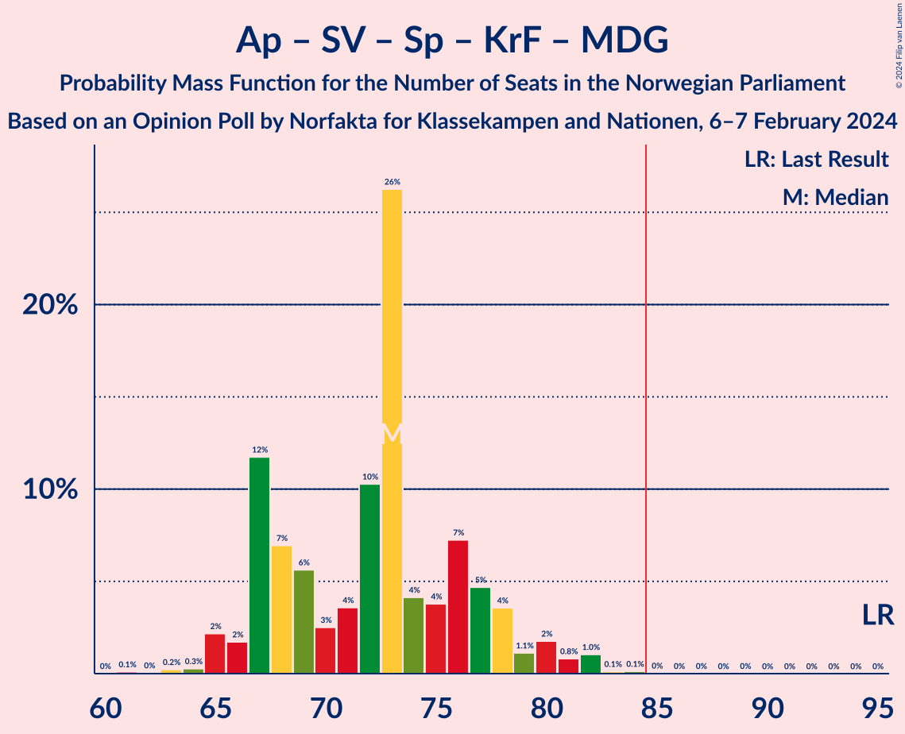

# Opinion Poll by Norfakta for Klassekampen and Nationen, 6–7 February 2024

<a href="#voting-intentions">Voting Intentions</a> | <a href="#seats">Seats</a> | <a href="#coalitions">Coalitions</a> | <a href="#technical-information">Technical Information</a>

## Voting Intentions

### Confidence Intervals

| Party | Last Result | Poll Result | 80% Confidence Interval | 90% Confidence Interval | 95% Confidence Interval | 99% Confidence Interval |
|:-----:|:-----------:|:-----------:|:-----------------------:|:-----------------------:|:-----------------------:|:-----------------------:|
| Høyre | 20.4% | 27.6% | 25.9–29.5% |25.4–30.0% |25.0–30.5% |24.1–31.4% |
| Arbeiderpartiet | 26.2% | 20.5% | 18.9–22.2% |18.5–22.7% |18.1–23.1% |17.4–23.9% |
| Fremskrittspartiet | 11.6% | 13.7% | 12.4–15.2% |12.0–15.6% |11.7–15.9% |11.1–16.7% |
| Sosialistisk Venstreparti | 7.6% | 9.1% | 8.0–10.4% |7.7–10.7% |7.5–11.1% |7.0–11.7% |
| Senterpartiet | 13.5% | 6.5% | 5.6–7.7% |5.4–8.0% |5.2–8.2% |4.8–8.8% |
| Venstre | 4.6% | 5.7% | 4.9–6.8% |4.7–7.1% |4.5–7.4% |4.1–7.9% |
| Rødt | 4.7% | 4.3% | 3.5–5.2% |3.3–5.5% |3.2–5.7% |2.9–6.2% |
| Kristelig Folkeparti | 3.8% | 3.5% | 2.8–4.3% |2.7–4.6% |2.5–4.8% |2.2–5.2% |
| Industri- og Næringspartiet | 0.3% | 3.0% | 2.4–3.8% |2.2–4.0% |2.1–4.2% |1.8–4.6% |
| Miljøpartiet De Grønne | 3.9% | 2.7% | 2.1–3.4% |2.0–3.7% |1.8–3.9% |1.6–4.3% |

*Note:* The poll result column reflects the actual value used in the calculations. Published results may vary slightly, and in addition be rounded to fewer digits.

## Seats

### Confidence Intervals

| Party | Last Result | Median | 80% Confidence Interval | 90% Confidence Interval | 95% Confidence Interval | 99% Confidence Interval |
|:-----:|:-----------:|:------:|:-----------------------:|:-----------------------:|:-----------------------:|:-----------------------:|
| <a href="#høyre">Høyre</a> | 36 | 51 | 47–55 |47–56 |46–56 |44–58 |
| <a href="#arbeiderpartiet">Arbeiderpartiet</a> | 48 | 39 | 36–43 |35–44 |34–44 |33–47 |
| <a href="#fremskrittspartiet">Fremskrittspartiet</a> | 21 | 25 | 23–28 |22–29 |20–29 |19–31 |
| <a href="#sosialistisk-venstreparti">Sosialistisk Venstreparti</a> | 13 | 17 | 14–19 |14–21 |13–21 |12–22 |
| <a href="#senterpartiet">Senterpartiet</a> | 28 | 12 | 9–14 |9–14 |9–15 |8–16 |
| <a href="#venstre">Venstre</a> | 8 | 11 | 9–13 |8–13 |8–13 |7–14 |
| <a href="#rødt">Rødt</a> | 8 | 8 | 1–9 |1–10 |1–10 |1–11 |
| <a href="#kristelig-folkeparti">Kristelig Folkeparti</a> | 3 | 3 | 2–7 |2–8 |2–8 |0–9 |
| <a href="#industri--og-næringspartiet">Industri- og Næringspartiet</a> | 0 | 2 | 0–3 |0–3 |0–7 |0–8 |
| <a href="#miljøpartiet-de-grønne">Miljøpartiet De Grønne</a> | 3 | 1 | 1–2 |1–3 |1–3 |0–7 |

### Høyre

*For a full overview of the results for this party, see the [Høyre](party-høyre.html) page.*

| Number of Seats | Probability | Accumulated | Special Marks |
|:---------------:|:-----------:|:-----------:|:-------------:|
| 36 | 0% | 100% | Last Result |
| 37 | 0% | 100% |  |
| 38 | 0% | 100% |  |
| 39 | 0% | 100% |  |
| 40 | 0% | 100% |  |
| 41 | 0% | 100% |  |
| 42 | 0.1% | 100% |  |
| 43 | 0.2% | 99.9% |  |
| 44 | 0.8% | 99.7% |  |
| 45 | 0.9% | 98.8% |  |
| 46 | 2% | 98% |  |
| 47 | 6% | 96% |  |
| 48 | 5% | 90% |  |
| 49 | 8% | 84% |  |
| 50 | 12% | 77% |  |
| 51 | 33% | 64% | Median |
| 52 | 9% | 31% |  |
| 53 | 5% | 22% |  |
| 54 | 6% | 17% |  |
| 55 | 5% | 11% |  |
| 56 | 4% | 6% |  |
| 57 | 1.2% | 2% |  |
| 58 | 0.4% | 0.8% |  |
| 59 | 0.3% | 0.4% |  |
| 60 | 0% | 0.1% |  |
| 61 | 0% | 0% |  |

### Arbeiderpartiet

*For a full overview of the results for this party, see the [Arbeiderpartiet](party-arbeiderpartiet.html) page.*

| Number of Seats | Probability | Accumulated | Special Marks |
|:---------------:|:-----------:|:-----------:|:-------------:|
| 32 | 0.1% | 100% |  |
| 33 | 0.6% | 99.9% |  |
| 34 | 3% | 99.3% |  |
| 35 | 4% | 96% |  |
| 36 | 9% | 92% |  |
| 37 | 19% | 83% |  |
| 38 | 10% | 64% |  |
| 39 | 24% | 54% | Median |
| 40 | 9% | 30% |  |
| 41 | 7% | 21% |  |
| 42 | 2% | 14% |  |
| 43 | 6% | 11% |  |
| 44 | 3% | 5% |  |
| 45 | 0.9% | 2% |  |
| 46 | 0.8% | 1.4% |  |
| 47 | 0.4% | 0.6% |  |
| 48 | 0.2% | 0.2% | Last Result |
| 49 | 0% | 0% |  |

### Fremskrittspartiet

*For a full overview of the results for this party, see the [Fremskrittspartiet](party-fremskrittspartiet.html) page.*

| Number of Seats | Probability | Accumulated | Special Marks |
|:---------------:|:-----------:|:-----------:|:-------------:|
| 18 | 0.2% | 100% |  |
| 19 | 0.6% | 99.7% |  |
| 20 | 2% | 99.2% |  |
| 21 | 2% | 97% | Last Result |
| 22 | 4% | 96% |  |
| 23 | 11% | 92% |  |
| 24 | 25% | 81% |  |
| 25 | 30% | 56% | Median |
| 26 | 11% | 26% |  |
| 27 | 4% | 15% |  |
| 28 | 3% | 10% |  |
| 29 | 5% | 7% |  |
| 30 | 1.3% | 2% |  |
| 31 | 0.6% | 0.9% |  |
| 32 | 0.2% | 0.4% |  |
| 33 | 0.1% | 0.2% |  |
| 34 | 0% | 0% |  |

### Sosialistisk Venstreparti

*For a full overview of the results for this party, see the [Sosialistisk Venstreparti](party-sosialistiskvenstreparti.html) page.*

| Number of Seats | Probability | Accumulated | Special Marks |
|:---------------:|:-----------:|:-----------:|:-------------:|
| 10 | 0.1% | 100% |  |
| 11 | 0.2% | 99.9% |  |
| 12 | 0.7% | 99.7% |  |
| 13 | 2% | 99.0% | Last Result |
| 14 | 7% | 97% |  |
| 15 | 15% | 90% |  |
| 16 | 15% | 75% |  |
| 17 | 16% | 60% | Median |
| 18 | 12% | 44% |  |
| 19 | 24% | 32% |  |
| 20 | 2% | 7% |  |
| 21 | 3% | 6% |  |
| 22 | 2% | 2% |  |
| 23 | 0.1% | 0.1% |  |
| 24 | 0% | 0% |  |

### Senterpartiet

*For a full overview of the results for this party, see the [Senterpartiet](party-senterpartiet.html) page.*

| Number of Seats | Probability | Accumulated | Special Marks |
|:---------------:|:-----------:|:-----------:|:-------------:|
| 7 | 0.2% | 100% |  |
| 8 | 0.9% | 99.8% |  |
| 9 | 14% | 98.8% |  |
| 10 | 12% | 84% |  |
| 11 | 11% | 73% |  |
| 12 | 26% | 62% | Median |
| 13 | 25% | 36% |  |
| 14 | 6% | 10% |  |
| 15 | 3% | 4% |  |
| 16 | 0.4% | 0.7% |  |
| 17 | 0.2% | 0.3% |  |
| 18 | 0.1% | 0.1% |  |
| 19 | 0% | 0% |  |
| 20 | 0% | 0% |  |
| 21 | 0% | 0% |  |
| 22 | 0% | 0% |  |
| 23 | 0% | 0% |  |
| 24 | 0% | 0% |  |
| 25 | 0% | 0% |  |
| 26 | 0% | 0% |  |
| 27 | 0% | 0% |  |
| 28 | 0% | 0% | Last Result |

### Venstre

*For a full overview of the results for this party, see the [Venstre](party-venstre.html) page.*

| Number of Seats | Probability | Accumulated | Special Marks |
|:---------------:|:-----------:|:-----------:|:-------------:|
| 3 | 0.1% | 100% |  |
| 4 | 0% | 99.9% |  |
| 5 | 0% | 99.9% |  |
| 6 | 0% | 99.9% |  |
| 7 | 1.0% | 99.8% |  |
| 8 | 4% | 98.8% | Last Result |
| 9 | 12% | 95% |  |
| 10 | 25% | 83% |  |
| 11 | 35% | 58% | Median |
| 12 | 6% | 23% |  |
| 13 | 15% | 17% |  |
| 14 | 2% | 2% |  |
| 15 | 0.2% | 0.3% |  |
| 16 | 0.1% | 0.1% |  |
| 17 | 0% | 0% |  |

### Rødt

*For a full overview of the results for this party, see the [Rødt](party-rødt.html) page.*

| Number of Seats | Probability | Accumulated | Special Marks |
|:---------------:|:-----------:|:-----------:|:-------------:|
| 1 | 27% | 100% |  |
| 2 | 0.2% | 73% |  |
| 3 | 0% | 73% |  |
| 4 | 0% | 73% |  |
| 5 | 0% | 73% |  |
| 6 | 0.5% | 73% |  |
| 7 | 16% | 72% |  |
| 8 | 30% | 56% | Last Result, Median |
| 9 | 18% | 27% |  |
| 10 | 7% | 9% |  |
| 11 | 0.8% | 1.1% |  |
| 12 | 0.3% | 0.4% |  |
| 13 | 0% | 0% |  |

### Kristelig Folkeparti

*For a full overview of the results for this party, see the [Kristelig Folkeparti](party-kristeligfolkeparti.html) page.*

| Number of Seats | Probability | Accumulated | Special Marks |
|:---------------:|:-----------:|:-----------:|:-------------:|
| 0 | 0.5% | 100% |  |
| 1 | 0.6% | 99.5% |  |
| 2 | 41% | 98.8% |  |
| 3 | 43% | 58% | Last Result, Median |
| 4 | 0% | 15% |  |
| 5 | 0% | 15% |  |
| 6 | 0.5% | 15% |  |
| 7 | 7% | 14% |  |
| 8 | 6% | 8% |  |
| 9 | 2% | 2% |  |
| 10 | 0.3% | 0.4% |  |
| 11 | 0% | 0% |  |

### Industri- og Næringspartiet

*For a full overview of the results for this party, see the [Industri- og Næringspartiet](party-industri-ognæringspartiet.html) page.*

| Number of Seats | Probability | Accumulated | Special Marks |
|:---------------:|:-----------:|:-----------:|:-------------:|
| 0 | 32% | 100% | Last Result |
| 1 | 12% | 68% |  |
| 2 | 39% | 56% | Median |
| 3 | 14% | 17% |  |
| 4 | 0% | 3% |  |
| 5 | 0% | 3% |  |
| 6 | 0.2% | 3% |  |
| 7 | 1.5% | 3% |  |
| 8 | 1.2% | 1.3% |  |
| 9 | 0.1% | 0.1% |  |
| 10 | 0% | 0% |  |

### Miljøpartiet De Grønne

*For a full overview of the results for this party, see the [Miljøpartiet De Grønne](party-miljøpartietdegrønne.html) page.*

| Number of Seats | Probability | Accumulated | Special Marks |
|:---------------:|:-----------:|:-----------:|:-------------:|
| 0 | 0.6% | 100% |  |
| 1 | 74% | 99.4% | Median |
| 2 | 19% | 26% |  |
| 3 | 5% | 7% | Last Result |
| 4 | 0% | 2% |  |
| 5 | 0% | 2% |  |
| 6 | 0.1% | 2% |  |
| 7 | 1.5% | 2% |  |
| 8 | 0.3% | 0.4% |  |
| 9 | 0.1% | 0.1% |  |
| 10 | 0% | 0% |  |

## Coalitions

### Confidence Intervals

| Coalition | Last Result | Median | Majority? | 80% Confidence Interval | 90% Confidence Interval | 95% Confidence Interval | 99% Confidence Interval |
|:---------:|:-----------:|:------:|:---------:|:-----------------------:|:-----------------------:|:-----------------------:|:-----------------------:|
| Høyre – Fremskrittspartiet – Senterpartiet – Venstre – Kristelig Folkeparti | 96 | 101 | 100% | 97–107 | 95–108 | 93–108 | 90–111 |
| Høyre – Fremskrittspartiet – Venstre – Kristelig Folkeparti – Miljøpartiet De Grønne | 71 | 91 | 97% | 87–96 | 85–97 | 84–98 | 82–101 |
| Høyre – Fremskrittspartiet – Venstre – Kristelig Folkeparti | 68 | 90 | 92% | 85–95 | 84–96 | 83–97 | 81–99 |
| Høyre – Fremskrittspartiet – Venstre | 65 | 87 | 79% | 82–91 | 80–93 | 79–94 | 77–95 |
| Høyre – Fremskrittspartiet | 57 | 76 | 0.2% | 72–80 | 70–81 | 69–83 | 67–84 |
| Arbeiderpartiet – Sosialistisk Venstreparti – Senterpartiet – Rødt – Miljøpartiet De Grønne | 100 | 75 | 0.3% | 71–80 | 69–81 | 68–82 | 66–84 |
| Arbeiderpartiet – Sosialistisk Venstreparti – Senterpartiet – Rødt | 97 | 74 | 0.2% | 70–78 | 68–79 | 67–80 | 64–83 |
| Arbeiderpartiet – Sosialistisk Venstreparti – Senterpartiet – Kristelig Folkeparti – Miljøpartiet De Grønne | 95 | 73 | 0.1% | 67–77 | 67–79 | 65–80 | 64–82 |
| Arbeiderpartiet – Sosialistisk Venstreparti – Senterpartiet – Miljøpartiet De Grønne | 92 | 70 | 0% | 64–74 | 64–75 | 63–76 | 60–77 |
| Arbeiderpartiet – Sosialistisk Venstreparti – Senterpartiet | 89 | 68 | 0% | 63–72 | 62–73 | 61–74 | 59–75 |
| Høyre – Venstre – Kristelig Folkeparti | 47 | 65 | 0% | 61–69 | 59–71 | 58–72 | 56–74 |
| Arbeiderpartiet – Sosialistisk Venstreparti – Rødt – Miljøpartiet De Grønne | 72 | 64 | 0% | 60–68 | 58–69 | 56–71 | 54–73 |
| Arbeiderpartiet – Senterpartiet – Kristelig Folkeparti – Miljøpartiet De Grønne | 82 | 54 | 0% | 51–60 | 51–62 | 49–64 | 49–65 |
| Arbeiderpartiet – Sosialistisk Venstreparti | 61 | 56 | 0% | 52–61 | 51–62 | 50–62 | 49–63 |
| Arbeiderpartiet – Senterpartiet – Kristelig Folkeparti | 79 | 53 | 0% | 50–58 | 49–60 | 48–62 | 47–64 |
| Arbeiderpartiet – Senterpartiet | 76 | 50 | 0% | 48–54 | 47–55 | 46–57 | 45–59 |
| Senterpartiet – Venstre – Kristelig Folkeparti | 39 | 26 | 0% | 22–30 | 21–30 | 21–32 | 19–34 |

### Høyre – Fremskrittspartiet – Senterpartiet – Venstre – Kristelig Folkeparti

| Number of Seats | Probability | Accumulated | Special Marks |
|:---------------:|:-----------:|:-----------:|:-------------:|
| 88 | 0% | 100% |  |
| 89 | 0.1% | 99.9% |  |
| 90 | 0.4% | 99.8% |  |
| 91 | 0.3% | 99.4% |  |
| 92 | 0.2% | 99.2% |  |
| 93 | 2% | 98.9% |  |
| 94 | 1.2% | 96% |  |
| 95 | 2% | 95% |  |
| 96 | 2% | 93% | Last Result |
| 97 | 13% | 91% |  |
| 98 | 3% | 78% |  |
| 99 | 3% | 74% |  |
| 100 | 3% | 71% |  |
| 101 | 19% | 68% |  |
| 102 | 3% | 49% | Median |
| 103 | 21% | 46% |  |
| 104 | 3% | 25% |  |
| 105 | 5% | 22% |  |
| 106 | 4% | 17% |  |
| 107 | 4% | 12% |  |
| 108 | 6% | 8% |  |
| 109 | 0.8% | 2% |  |
| 110 | 1.0% | 2% |  |
| 111 | 0.3% | 0.7% |  |
| 112 | 0.1% | 0.4% |  |
| 113 | 0.2% | 0.3% |  |
| 114 | 0% | 0.1% |  |
| 115 | 0% | 0% |  |

### Høyre – Fremskrittspartiet – Venstre – Kristelig Folkeparti – Miljøpartiet De Grønne

| Number of Seats | Probability | Accumulated | Special Marks |
|:---------------:|:-----------:|:-----------:|:-------------:|
| 71 | 0% | 100% | Last Result |
| 72 | 0% | 100% |  |
| 73 | 0% | 100% |  |
| 74 | 0% | 100% |  |
| 75 | 0% | 100% |  |
| 76 | 0% | 100% |  |
| 77 | 0% | 100% |  |
| 78 | 0% | 100% |  |
| 79 | 0% | 99.9% |  |
| 80 | 0.1% | 99.9% |  |
| 81 | 0.2% | 99.8% |  |
| 82 | 0.2% | 99.6% |  |
| 83 | 1.3% | 99.4% |  |
| 84 | 2% | 98% |  |
| 85 | 3% | 97% | Majority |
| 86 | 3% | 93% |  |
| 87 | 3% | 91% |  |
| 88 | 4% | 88% |  |
| 89 | 11% | 83% |  |
| 90 | 15% | 72% |  |
| 91 | 18% | 58% | Median |
| 92 | 7% | 39% |  |
| 93 | 7% | 32% |  |
| 94 | 7% | 25% |  |
| 95 | 6% | 17% |  |
| 96 | 3% | 12% |  |
| 97 | 5% | 9% |  |
| 98 | 2% | 4% |  |
| 99 | 1.0% | 2% |  |
| 100 | 0.7% | 1.5% |  |
| 101 | 0.6% | 0.8% |  |
| 102 | 0.1% | 0.2% |  |
| 103 | 0.2% | 0.2% |  |
| 104 | 0% | 0% |  |

### Høyre – Fremskrittspartiet – Venstre – Kristelig Folkeparti

| Number of Seats | Probability | Accumulated | Special Marks |
|:---------------:|:-----------:|:-----------:|:-------------:|
| 68 | 0% | 100% | Last Result |
| 69 | 0% | 100% |  |
| 70 | 0% | 100% |  |
| 71 | 0% | 100% |  |
| 72 | 0% | 100% |  |
| 73 | 0% | 100% |  |
| 74 | 0% | 100% |  |
| 75 | 0% | 100% |  |
| 76 | 0% | 100% |  |
| 77 | 0% | 99.9% |  |
| 78 | 0.1% | 99.9% |  |
| 79 | 0.1% | 99.8% |  |
| 80 | 0.2% | 99.7% |  |
| 81 | 0.7% | 99.5% |  |
| 82 | 1.2% | 98.8% |  |
| 83 | 2% | 98% |  |
| 84 | 3% | 95% |  |
| 85 | 3% | 92% | Majority |
| 86 | 4% | 89% |  |
| 87 | 5% | 85% |  |
| 88 | 15% | 81% |  |
| 89 | 13% | 66% |  |
| 90 | 17% | 53% | Median |
| 91 | 9% | 35% |  |
| 92 | 5% | 26% |  |
| 93 | 5% | 22% |  |
| 94 | 5% | 16% |  |
| 95 | 3% | 11% |  |
| 96 | 5% | 8% |  |
| 97 | 2% | 3% |  |
| 98 | 1.0% | 2% |  |
| 99 | 0.2% | 0.5% |  |
| 100 | 0.2% | 0.3% |  |
| 101 | 0.1% | 0.2% |  |
| 102 | 0.1% | 0.1% |  |
| 103 | 0% | 0% |  |

### Høyre – Fremskrittspartiet – Venstre

| Number of Seats | Probability | Accumulated | Special Marks |
|:---------------:|:-----------:|:-----------:|:-------------:|
| 65 | 0% | 100% | Last Result |
| 66 | 0% | 100% |  |
| 67 | 0% | 100% |  |
| 68 | 0% | 100% |  |
| 69 | 0% | 100% |  |
| 70 | 0% | 100% |  |
| 71 | 0% | 100% |  |
| 72 | 0% | 100% |  |
| 73 | 0% | 100% |  |
| 74 | 0% | 99.9% |  |
| 75 | 0.1% | 99.9% |  |
| 76 | 0.2% | 99.8% |  |
| 77 | 0.4% | 99.6% |  |
| 78 | 1.0% | 99.3% |  |
| 79 | 1.3% | 98% |  |
| 80 | 2% | 97% |  |
| 81 | 3% | 95% |  |
| 82 | 3% | 92% |  |
| 83 | 5% | 88% |  |
| 84 | 4% | 83% |  |
| 85 | 15% | 79% | Majority |
| 86 | 11% | 64% |  |
| 87 | 24% | 54% | Median |
| 88 | 4% | 30% |  |
| 89 | 8% | 26% |  |
| 90 | 4% | 18% |  |
| 91 | 6% | 14% |  |
| 92 | 0.7% | 8% |  |
| 93 | 4% | 7% |  |
| 94 | 2% | 3% |  |
| 95 | 0.6% | 0.9% |  |
| 96 | 0.1% | 0.3% |  |
| 97 | 0.1% | 0.2% |  |
| 98 | 0% | 0.1% |  |
| 99 | 0% | 0.1% |  |
| 100 | 0% | 0% |  |

### Høyre – Fremskrittspartiet

| Number of Seats | Probability | Accumulated | Special Marks |
|:---------------:|:-----------:|:-----------:|:-------------:|
| 57 | 0% | 100% | Last Result |
| 58 | 0% | 100% |  |
| 59 | 0% | 100% |  |
| 60 | 0% | 100% |  |
| 61 | 0% | 100% |  |
| 62 | 0% | 100% |  |
| 63 | 0% | 100% |  |
| 64 | 0% | 100% |  |
| 65 | 0% | 99.9% |  |
| 66 | 0.1% | 99.9% |  |
| 67 | 0.6% | 99.8% |  |
| 68 | 0.9% | 99.1% |  |
| 69 | 1.4% | 98% |  |
| 70 | 3% | 97% |  |
| 71 | 4% | 94% |  |
| 72 | 3% | 90% |  |
| 73 | 10% | 87% |  |
| 74 | 4% | 77% |  |
| 75 | 16% | 73% |  |
| 76 | 23% | 57% | Median |
| 77 | 8% | 33% |  |
| 78 | 7% | 25% |  |
| 79 | 3% | 18% |  |
| 80 | 10% | 15% |  |
| 81 | 1.2% | 6% |  |
| 82 | 2% | 5% |  |
| 83 | 2% | 3% |  |
| 84 | 0.4% | 0.6% |  |
| 85 | 0.1% | 0.2% | Majority |
| 86 | 0% | 0.1% |  |
| 87 | 0% | 0.1% |  |
| 88 | 0% | 0.1% |  |
| 89 | 0% | 0.1% |  |
| 90 | 0% | 0% |  |

### Arbeiderpartiet – Sosialistisk Venstreparti – Senterpartiet – Rødt – Miljøpartiet De Grønne

| Number of Seats | Probability | Accumulated | Special Marks |
|:---------------:|:-----------:|:-----------:|:-------------:|
| 63 | 0% | 100% |  |
| 64 | 0.1% | 99.9% |  |
| 65 | 0.2% | 99.9% |  |
| 66 | 0.3% | 99.7% |  |
| 67 | 1.3% | 99.3% |  |
| 68 | 1.2% | 98% |  |
| 69 | 2% | 97% |  |
| 70 | 2% | 95% |  |
| 71 | 16% | 93% |  |
| 72 | 6% | 77% |  |
| 73 | 3% | 71% |  |
| 74 | 8% | 67% |  |
| 75 | 10% | 59% |  |
| 76 | 7% | 49% |  |
| 77 | 4% | 42% | Median |
| 78 | 22% | 38% |  |
| 79 | 4% | 16% |  |
| 80 | 5% | 11% |  |
| 81 | 3% | 6% |  |
| 82 | 1.4% | 4% |  |
| 83 | 0.9% | 2% |  |
| 84 | 0.8% | 1.2% |  |
| 85 | 0.1% | 0.3% | Majority |
| 86 | 0.2% | 0.2% |  |
| 87 | 0% | 0% |  |
| 88 | 0% | 0% |  |
| 89 | 0% | 0% |  |
| 90 | 0% | 0% |  |
| 91 | 0% | 0% |  |
| 92 | 0% | 0% |  |
| 93 | 0% | 0% |  |
| 94 | 0% | 0% |  |
| 95 | 0% | 0% |  |
| 96 | 0% | 0% |  |
| 97 | 0% | 0% |  |
| 98 | 0% | 0% |  |
| 99 | 0% | 0% |  |
| 100 | 0% | 0% | Last Result |

### Arbeiderpartiet – Sosialistisk Venstreparti – Senterpartiet – Rødt

| Number of Seats | Probability | Accumulated | Special Marks |
|:---------------:|:-----------:|:-----------:|:-------------:|
| 61 | 0% | 100% |  |
| 62 | 0% | 99.9% |  |
| 63 | 0.1% | 99.9% |  |
| 64 | 0.3% | 99.8% |  |
| 65 | 0.5% | 99.4% |  |
| 66 | 1.4% | 98.9% |  |
| 67 | 2% | 98% |  |
| 68 | 2% | 95% |  |
| 69 | 2% | 93% |  |
| 70 | 16% | 92% |  |
| 71 | 7% | 76% |  |
| 72 | 5% | 69% |  |
| 73 | 10% | 64% |  |
| 74 | 10% | 55% |  |
| 75 | 8% | 45% |  |
| 76 | 4% | 37% | Median |
| 77 | 19% | 33% |  |
| 78 | 6% | 13% |  |
| 79 | 3% | 8% |  |
| 80 | 2% | 5% |  |
| 81 | 1.1% | 2% |  |
| 82 | 0.6% | 1.3% |  |
| 83 | 0.5% | 0.7% |  |
| 84 | 0.1% | 0.3% |  |
| 85 | 0.2% | 0.2% | Majority |
| 86 | 0% | 0% |  |
| 87 | 0% | 0% |  |
| 88 | 0% | 0% |  |
| 89 | 0% | 0% |  |
| 90 | 0% | 0% |  |
| 91 | 0% | 0% |  |
| 92 | 0% | 0% |  |
| 93 | 0% | 0% |  |
| 94 | 0% | 0% |  |
| 95 | 0% | 0% |  |
| 96 | 0% | 0% |  |
| 97 | 0% | 0% | Last Result |

### Arbeiderpartiet – Sosialistisk Venstreparti – Senterpartiet – Kristelig Folkeparti – Miljøpartiet De Grønne

| Number of Seats | Probability | Accumulated | Special Marks |
|:---------------:|:-----------:|:-----------:|:-------------:|
| 61 | 0.1% | 100% |  |
| 62 | 0% | 99.9% |  |
| 63 | 0.2% | 99.8% |  |
| 64 | 0.3% | 99.6% |  |
| 65 | 2% | 99.3% |  |
| 66 | 2% | 97% |  |
| 67 | 12% | 95% |  |
| 68 | 7% | 84% |  |
| 69 | 6% | 77% |  |
| 70 | 3% | 71% |  |
| 71 | 4% | 69% |  |
| 72 | 10% | 65% | Median |
| 73 | 26% | 55% |  |
| 74 | 4% | 28% |  |
| 75 | 4% | 24% |  |
| 76 | 7% | 21% |  |
| 77 | 5% | 13% |  |
| 78 | 4% | 9% |  |
| 79 | 1.1% | 5% |  |
| 80 | 2% | 4% |  |
| 81 | 0.8% | 2% |  |
| 82 | 1.0% | 1.4% |  |
| 83 | 0.1% | 0.3% |  |
| 84 | 0.1% | 0.2% |  |
| 85 | 0% | 0.1% | Majority |
| 86 | 0% | 0% |  |
| 87 | 0% | 0% |  |
| 88 | 0% | 0% |  |
| 89 | 0% | 0% |  |
| 90 | 0% | 0% |  |
| 91 | 0% | 0% |  |
| 92 | 0% | 0% |  |
| 93 | 0% | 0% |  |
| 94 | 0% | 0% |  |
| 95 | 0% | 0% | Last Result |

### Arbeiderpartiet – Sosialistisk Venstreparti – Senterpartiet – Miljøpartiet De Grønne

| Number of Seats | Probability | Accumulated | Special Marks |
|:---------------:|:-----------:|:-----------:|:-------------:|
| 59 | 0.2% | 100% |  |
| 60 | 0.5% | 99.8% |  |
| 61 | 0.4% | 99.2% |  |
| 62 | 0.9% | 98.8% |  |
| 63 | 3% | 98% |  |
| 64 | 11% | 95% |  |
| 65 | 6% | 84% |  |
| 66 | 7% | 77% |  |
| 67 | 6% | 70% |  |
| 68 | 3% | 65% |  |
| 69 | 10% | 61% | Median |
| 70 | 20% | 52% |  |
| 71 | 10% | 31% |  |
| 72 | 4% | 21% |  |
| 73 | 4% | 17% |  |
| 74 | 6% | 12% |  |
| 75 | 2% | 6% |  |
| 76 | 3% | 4% |  |
| 77 | 0.7% | 1.2% |  |
| 78 | 0.3% | 0.5% |  |
| 79 | 0.1% | 0.2% |  |
| 80 | 0.1% | 0.1% |  |
| 81 | 0% | 0.1% |  |
| 82 | 0% | 0% |  |
| 83 | 0% | 0% |  |
| 84 | 0% | 0% |  |
| 85 | 0% | 0% | Majority |
| 86 | 0% | 0% |  |
| 87 | 0% | 0% |  |
| 88 | 0% | 0% |  |
| 89 | 0% | 0% |  |
| 90 | 0% | 0% |  |
| 91 | 0% | 0% |  |
| 92 | 0% | 0% | Last Result |

### Arbeiderpartiet – Sosialistisk Venstreparti – Senterpartiet

| Number of Seats | Probability | Accumulated | Special Marks |
|:---------------:|:-----------:|:-----------:|:-------------:|
| 57 | 0.1% | 100% |  |
| 58 | 0.1% | 99.9% |  |
| 59 | 0.6% | 99.8% |  |
| 60 | 0.6% | 99.1% |  |
| 61 | 1.3% | 98.6% |  |
| 62 | 3% | 97% |  |
| 63 | 12% | 95% |  |
| 64 | 8% | 83% |  |
| 65 | 7% | 75% |  |
| 66 | 8% | 68% |  |
| 67 | 4% | 60% |  |
| 68 | 8% | 56% | Median |
| 69 | 22% | 48% |  |
| 70 | 7% | 26% |  |
| 71 | 4% | 19% |  |
| 72 | 7% | 15% |  |
| 73 | 3% | 8% |  |
| 74 | 3% | 5% |  |
| 75 | 1.0% | 1.4% |  |
| 76 | 0.2% | 0.5% |  |
| 77 | 0.1% | 0.3% |  |
| 78 | 0.1% | 0.1% |  |
| 79 | 0% | 0% |  |
| 80 | 0% | 0% |  |
| 81 | 0% | 0% |  |
| 82 | 0% | 0% |  |
| 83 | 0% | 0% |  |
| 84 | 0% | 0% |  |
| 85 | 0% | 0% | Majority |
| 86 | 0% | 0% |  |
| 87 | 0% | 0% |  |
| 88 | 0% | 0% |  |
| 89 | 0% | 0% | Last Result |

### Høyre – Venstre – Kristelig Folkeparti

| Number of Seats | Probability | Accumulated | Special Marks |
|:---------------:|:-----------:|:-----------:|:-------------:|
| 47 | 0% | 100% | Last Result |
| 48 | 0% | 100% |  |
| 49 | 0% | 100% |  |
| 50 | 0% | 100% |  |
| 51 | 0% | 100% |  |
| 52 | 0% | 100% |  |
| 53 | 0% | 100% |  |
| 54 | 0.1% | 100% |  |
| 55 | 0.2% | 99.9% |  |
| 56 | 0.4% | 99.7% |  |
| 57 | 0.8% | 99.4% |  |
| 58 | 1.4% | 98.6% |  |
| 59 | 3% | 97% |  |
| 60 | 4% | 94% |  |
| 61 | 3% | 91% |  |
| 62 | 5% | 88% |  |
| 63 | 4% | 82% |  |
| 64 | 20% | 78% |  |
| 65 | 23% | 58% | Median |
| 66 | 10% | 35% |  |
| 67 | 4% | 25% |  |
| 68 | 6% | 20% |  |
| 69 | 7% | 14% |  |
| 70 | 1.0% | 7% |  |
| 71 | 1.0% | 6% |  |
| 72 | 3% | 5% |  |
| 73 | 0.9% | 2% |  |
| 74 | 0.1% | 0.6% |  |
| 75 | 0.4% | 0.5% |  |
| 76 | 0.1% | 0.1% |  |
| 77 | 0% | 0% |  |

### Arbeiderpartiet – Sosialistisk Venstreparti – Rødt – Miljøpartiet De Grønne

| Number of Seats | Probability | Accumulated | Special Marks |
|:---------------:|:-----------:|:-----------:|:-------------:|
| 52 | 0% | 100% |  |
| 53 | 0.2% | 99.9% |  |
| 54 | 0.3% | 99.7% |  |
| 55 | 0.6% | 99.4% |  |
| 56 | 2% | 98.8% |  |
| 57 | 2% | 97% |  |
| 58 | 2% | 95% |  |
| 59 | 3% | 94% |  |
| 60 | 12% | 90% |  |
| 61 | 3% | 78% |  |
| 62 | 15% | 75% |  |
| 63 | 7% | 60% |  |
| 64 | 7% | 53% |  |
| 65 | 22% | 46% | Median |
| 66 | 7% | 24% |  |
| 67 | 6% | 17% |  |
| 68 | 5% | 11% |  |
| 69 | 1.4% | 6% |  |
| 70 | 2% | 5% |  |
| 71 | 2% | 3% |  |
| 72 | 0.8% | 1.4% | Last Result |
| 73 | 0.4% | 0.6% |  |
| 74 | 0.1% | 0.2% |  |
| 75 | 0.1% | 0.1% |  |
| 76 | 0% | 0% |  |

### Arbeiderpartiet – Senterpartiet – Kristelig Folkeparti – Miljøpartiet De Grønne

| Number of Seats | Probability | Accumulated | Special Marks |
|:---------------:|:-----------:|:-----------:|:-------------:|
| 46 | 0.1% | 100% |  |
| 47 | 0.1% | 99.9% |  |
| 48 | 0.2% | 99.8% |  |
| 49 | 2% | 99.6% |  |
| 50 | 2% | 97% |  |
| 51 | 10% | 95% |  |
| 52 | 12% | 85% |  |
| 53 | 3% | 73% |  |
| 54 | 22% | 70% |  |
| 55 | 8% | 48% | Median |
| 56 | 9% | 40% |  |
| 57 | 8% | 31% |  |
| 58 | 8% | 22% |  |
| 59 | 4% | 15% |  |
| 60 | 3% | 11% |  |
| 61 | 2% | 8% |  |
| 62 | 2% | 6% |  |
| 63 | 2% | 4% |  |
| 64 | 1.4% | 3% |  |
| 65 | 0.8% | 1.2% |  |
| 66 | 0.2% | 0.5% |  |
| 67 | 0.2% | 0.3% |  |
| 68 | 0.1% | 0.1% |  |
| 69 | 0% | 0.1% |  |
| 70 | 0% | 0% |  |
| 71 | 0% | 0% |  |
| 72 | 0% | 0% |  |
| 73 | 0% | 0% |  |
| 74 | 0% | 0% |  |
| 75 | 0% | 0% |  |
| 76 | 0% | 0% |  |
| 77 | 0% | 0% |  |
| 78 | 0% | 0% |  |
| 79 | 0% | 0% |  |
| 80 | 0% | 0% |  |
| 81 | 0% | 0% |  |
| 82 | 0% | 0% | Last Result |

### Arbeiderpartiet – Sosialistisk Venstreparti

| Number of Seats | Probability | Accumulated | Special Marks |
|:---------------:|:-----------:|:-----------:|:-------------:|
| 47 | 0.1% | 100% |  |
| 48 | 0.3% | 99.9% |  |
| 49 | 0.6% | 99.6% |  |
| 50 | 4% | 99.0% |  |
| 51 | 3% | 95% |  |
| 52 | 4% | 92% |  |
| 53 | 7% | 88% |  |
| 54 | 20% | 81% |  |
| 55 | 4% | 62% |  |
| 56 | 26% | 58% | Median |
| 57 | 3% | 32% |  |
| 58 | 11% | 29% |  |
| 59 | 4% | 17% |  |
| 60 | 3% | 13% |  |
| 61 | 3% | 10% | Last Result |
| 62 | 5% | 7% |  |
| 63 | 1.4% | 2% |  |
| 64 | 0.2% | 0.4% |  |
| 65 | 0.1% | 0.2% |  |
| 66 | 0.1% | 0.1% |  |
| 67 | 0% | 0% |  |

### Arbeiderpartiet – Senterpartiet – Kristelig Folkeparti

| Number of Seats | Probability | Accumulated | Special Marks |
|:---------------:|:-----------:|:-----------:|:-------------:|
| 45 | 0.1% | 100% |  |
| 46 | 0.1% | 99.9% |  |
| 47 | 0.4% | 99.8% |  |
| 48 | 2% | 99.4% |  |
| 49 | 3% | 97% |  |
| 50 | 10% | 94% |  |
| 51 | 13% | 84% |  |
| 52 | 5% | 71% |  |
| 53 | 21% | 66% |  |
| 54 | 11% | 45% | Median |
| 55 | 8% | 34% |  |
| 56 | 9% | 26% |  |
| 57 | 6% | 16% |  |
| 58 | 2% | 11% |  |
| 59 | 3% | 9% |  |
| 60 | 2% | 6% |  |
| 61 | 0.6% | 4% |  |
| 62 | 3% | 4% |  |
| 63 | 0.3% | 1.2% |  |
| 64 | 0.5% | 0.9% |  |
| 65 | 0.1% | 0.3% |  |
| 66 | 0.2% | 0.2% |  |
| 67 | 0% | 0% |  |
| 68 | 0% | 0% |  |
| 69 | 0% | 0% |  |
| 70 | 0% | 0% |  |
| 71 | 0% | 0% |  |
| 72 | 0% | 0% |  |
| 73 | 0% | 0% |  |
| 74 | 0% | 0% |  |
| 75 | 0% | 0% |  |
| 76 | 0% | 0% |  |
| 77 | 0% | 0% |  |
| 78 | 0% | 0% |  |
| 79 | 0% | 0% | Last Result |

### Arbeiderpartiet – Senterpartiet

| Number of Seats | Probability | Accumulated | Special Marks |
|:---------------:|:-----------:|:-----------:|:-------------:|
| 42 | 0% | 100% |  |
| 43 | 0.2% | 99.9% |  |
| 44 | 0.2% | 99.8% |  |
| 45 | 1.0% | 99.6% |  |
| 46 | 3% | 98.6% |  |
| 47 | 4% | 96% |  |
| 48 | 23% | 92% |  |
| 49 | 5% | 69% |  |
| 50 | 20% | 64% |  |
| 51 | 14% | 44% | Median |
| 52 | 9% | 30% |  |
| 53 | 9% | 21% |  |
| 54 | 5% | 12% |  |
| 55 | 3% | 7% |  |
| 56 | 1.2% | 4% |  |
| 57 | 2% | 3% |  |
| 58 | 0.8% | 2% |  |
| 59 | 0.4% | 0.8% |  |
| 60 | 0.3% | 0.4% |  |
| 61 | 0.1% | 0.1% |  |
| 62 | 0% | 0% |  |
| 63 | 0% | 0% |  |
| 64 | 0% | 0% |  |
| 65 | 0% | 0% |  |
| 66 | 0% | 0% |  |
| 67 | 0% | 0% |  |
| 68 | 0% | 0% |  |
| 69 | 0% | 0% |  |
| 70 | 0% | 0% |  |
| 71 | 0% | 0% |  |
| 72 | 0% | 0% |  |
| 73 | 0% | 0% |  |
| 74 | 0% | 0% |  |
| 75 | 0% | 0% |  |
| 76 | 0% | 0% | Last Result |

### Senterpartiet – Venstre – Kristelig Folkeparti

| Number of Seats | Probability | Accumulated | Special Marks |
|:---------------:|:-----------:|:-----------:|:-------------:|
| 17 | 0% | 100% |  |
| 18 | 0.2% | 99.9% |  |
| 19 | 0.4% | 99.7% |  |
| 20 | 1.3% | 99.3% |  |
| 21 | 3% | 98% |  |
| 22 | 12% | 95% |  |
| 23 | 8% | 83% |  |
| 24 | 10% | 75% |  |
| 25 | 10% | 65% |  |
| 26 | 7% | 55% | Median |
| 27 | 26% | 48% |  |
| 28 | 8% | 21% |  |
| 29 | 3% | 13% |  |
| 30 | 6% | 10% |  |
| 31 | 1.4% | 4% |  |
| 32 | 1.3% | 3% |  |
| 33 | 0.6% | 1.3% |  |
| 34 | 0.3% | 0.8% |  |
| 35 | 0.4% | 0.5% |  |
| 36 | 0.1% | 0.1% |  |
| 37 | 0% | 0% |  |
| 38 | 0% | 0% |  |
| 39 | 0% | 0% | Last Result |

## Technical Information

### Opinion Poll

+ **Polling firm:** Norfakta
+ **Commissioner(s):** Klassekampen and Nationen
+ **Fieldwork period:** 6–7 February 2024

### Calculations

+ **Sample size:** 1010
+ **Simulations done:** 1,048,576
+ **Error estimate:** 1.39%

