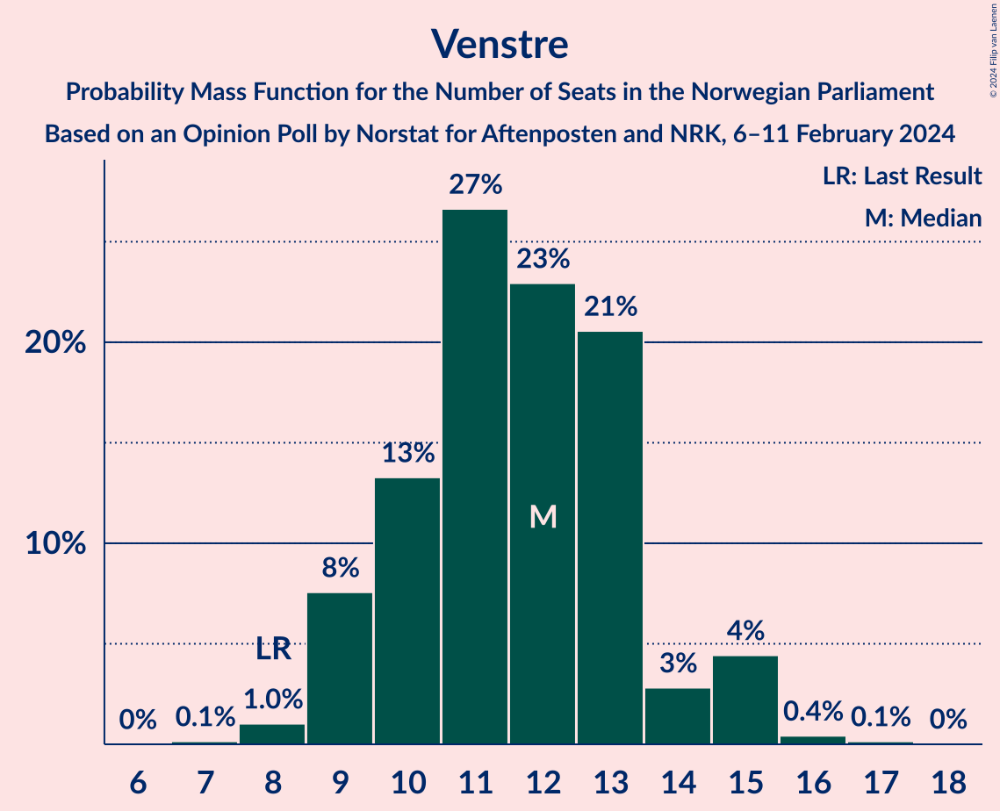
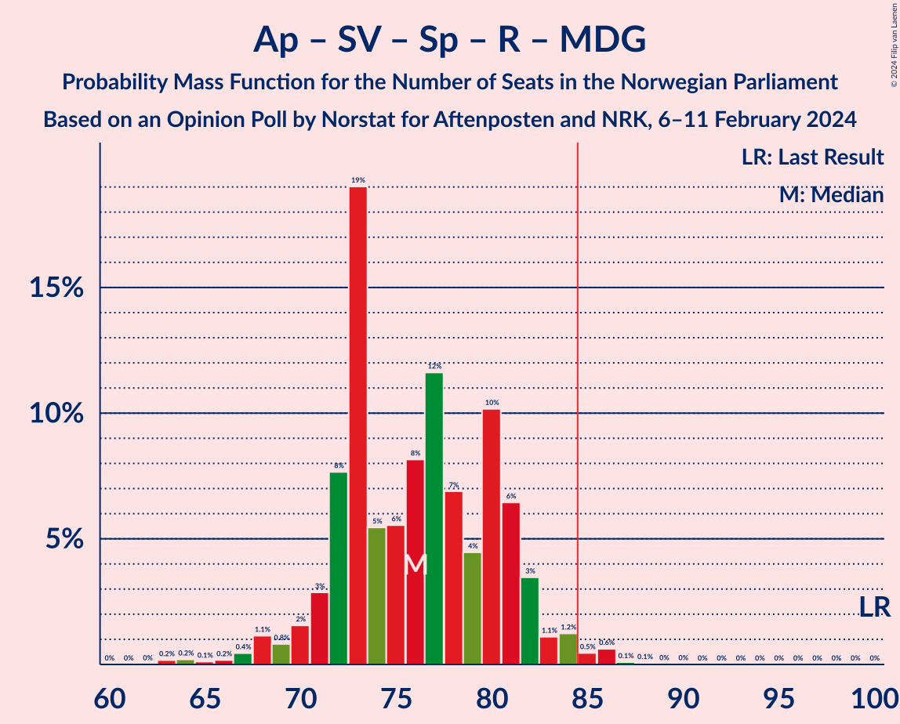
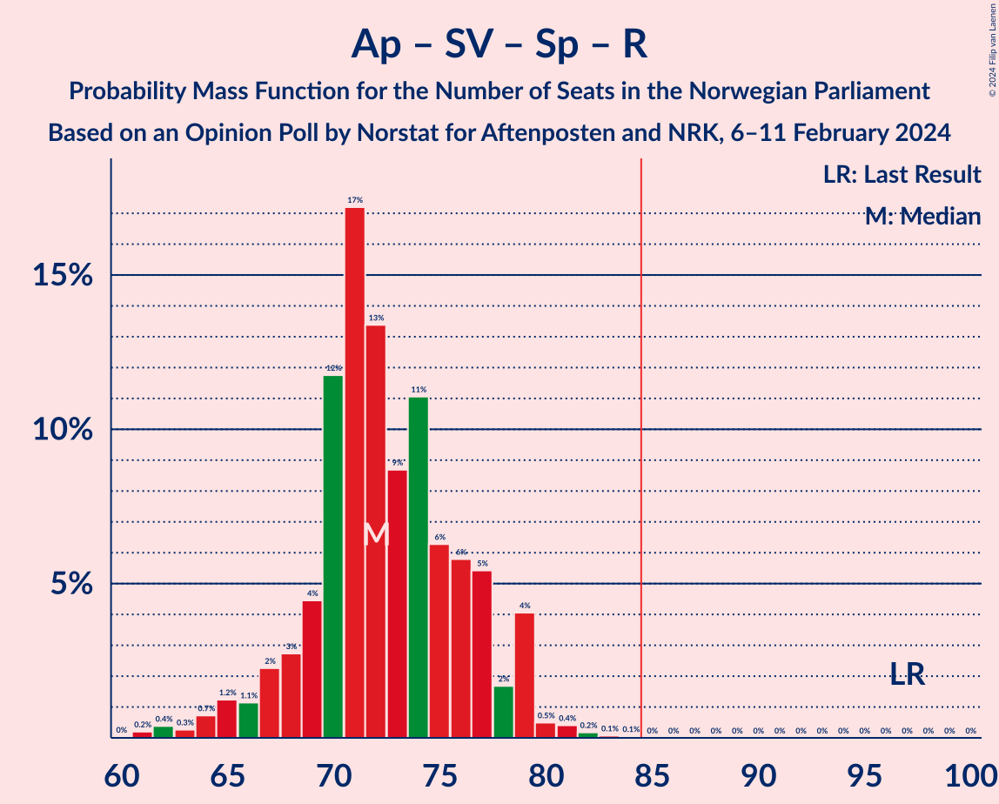
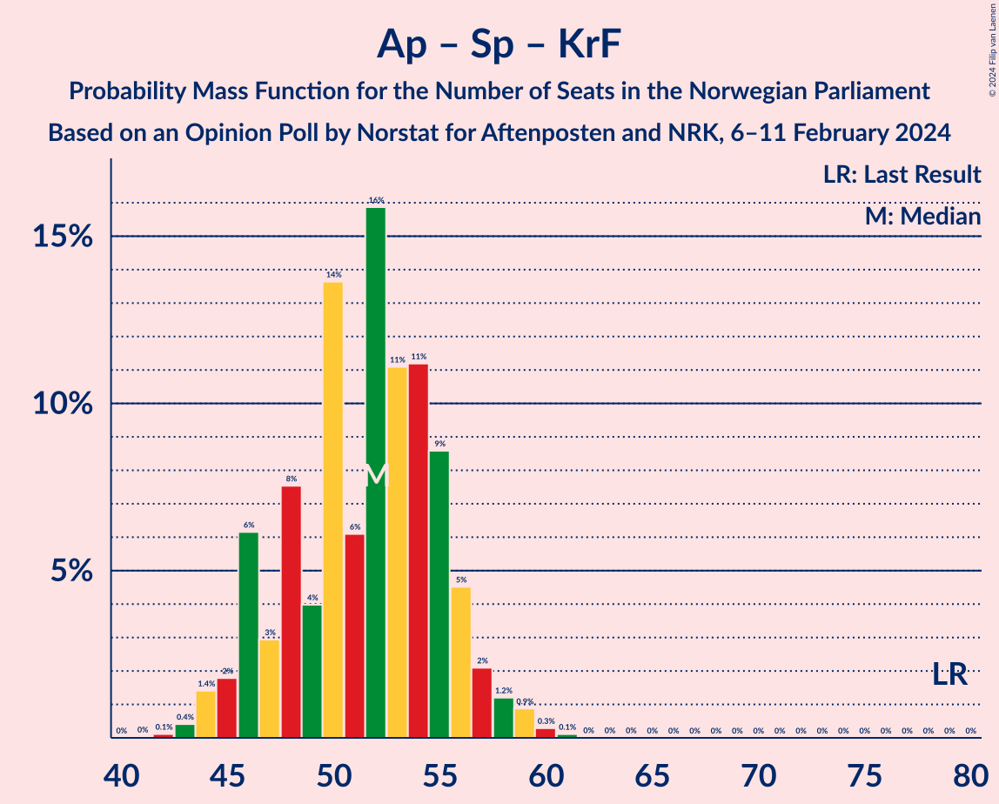

# Opinion Poll by Norstat for Aftenposten and NRK, 6–11 February 2024

<a href="#voting-intentions">Voting Intentions</a> | <a href="#seats">Seats</a> | <a href="#coalitions">Coalitions</a> | <a href="#technical-information">Technical Information</a>

## Voting Intentions

### Confidence Intervals

| Party | Last Result | Poll Result | 80% Confidence Interval | 90% Confidence Interval | 95% Confidence Interval | 99% Confidence Interval |
|:-----:|:-----------:|:-----------:|:-----------------------:|:-----------------------:|:-----------------------:|:-----------------------:|
| Høyre | 20.4% | 26.5% | 24.8–28.3% |24.3–28.9% |23.9–29.3% |23.0–30.2% |
| Arbeiderpartiet | 26.2% | 17.8% | 16.3–19.4% |15.9–19.9% |15.5–20.3% |14.9–21.1% |
| Fremskrittspartiet | 11.6% | 14.3% | 13.0–15.8% |12.6–16.2% |12.3–16.6% |11.6–17.4% |
| Sosialistisk Venstreparti | 7.6% | 9.5% | 8.4–10.8% |8.1–11.2% |7.8–11.5% |7.3–12.1% |
| Senterpartiet | 13.5% | 6.8% | 5.9–7.9% |5.6–8.3% |5.4–8.5% |5.0–9.1% |
| Venstre | 4.6% | 6.6% | 5.7–7.7% |5.4–8.0% |5.2–8.3% |4.8–8.9% |
| Rødt | 4.7% | 5.3% | 4.5–6.3% |4.3–6.6% |4.1–6.9% |3.7–7.4% |
| Kristelig Folkeparti | 3.8% | 3.7% | 3.0–4.6% |2.9–4.8% |2.7–5.1% |2.4–5.5% |
| Miljøpartiet De Grønne | 3.9% | 3.6% | 2.9–4.5% |2.8–4.7% |2.6–5.0% |2.3–5.4% |
| Industri- og Næringspartiet | 0.3% | 2.6% | 2.1–3.4% |1.9–3.6% |1.8–3.8% |1.6–4.2% |

*Note:* The poll result column reflects the actual value used in the calculations. Published results may vary slightly, and in addition be rounded to fewer digits.

## Seats

### Confidence Intervals

| Party | Last Result | Median | 80% Confidence Interval | 90% Confidence Interval | 95% Confidence Interval | 99% Confidence Interval |
|:-----:|:-----------:|:------:|:-----------------------:|:-----------------------:|:-----------------------:|:-----------------------:|
| <a href="#høyre">Høyre</a> | 36 | 47 | 44–50 |43–51 |42–52 |40–55 |
| <a href="#arbeiderpartiet">Arbeiderpartiet</a> | 48 | 34 | 32–37 |31–38 |30–39 |29–42 |
| <a href="#fremskrittspartiet">Fremskrittspartiet</a> | 21 | 26 | 23–29 |22–31 |22–33 |21–35 |
| <a href="#sosialistisk-venstreparti">Sosialistisk Venstreparti</a> | 13 | 17 | 14–19 |14–20 |13–21 |12–22 |
| <a href="#senterpartiet">Senterpartiet</a> | 28 | 12 | 10–14 |9–15 |9–16 |8–16 |
| <a href="#venstre">Venstre</a> | 8 | 12 | 10–13 |9–15 |9–15 |8–16 |
| <a href="#rødt">Rødt</a> | 8 | 9 | 8–11 |7–12 |6–13 |1–13 |
| <a href="#kristelig-folkeparti">Kristelig Folkeparti</a> | 3 | 6 | 2–8 |2–9 |2–9 |1–9 |
| <a href="#miljøpartiet-de-grønne">Miljøpartiet De Grønne</a> | 3 | 2 | 1–8 |1–8 |1–8 |1–9 |
| <a href="#industri--og-næringspartiet">Industri- og Næringspartiet</a> | 0 | 2 | 0–2 |0–3 |0–3 |0–7 |

### Høyre

*For a full overview of the results for this party, see the [Høyre](party-høyre.html) page.*

| Number of Seats | Probability | Accumulated | Special Marks |
|:---------------:|:-----------:|:-----------:|:-------------:|
| 36 | 0% | 100% | Last Result |
| 37 | 0% | 100% |  |
| 38 | 0% | 100% |  |
| 39 | 0.1% | 100% |  |
| 40 | 0.6% | 99.9% |  |
| 41 | 1.5% | 99.3% |  |
| 42 | 1.1% | 98% |  |
| 43 | 4% | 97% |  |
| 44 | 4% | 92% |  |
| 45 | 8% | 88% |  |
| 46 | 17% | 80% |  |
| 47 | 17% | 63% | Median |
| 48 | 16% | 45% |  |
| 49 | 13% | 30% |  |
| 50 | 8% | 17% |  |
| 51 | 4% | 9% |  |
| 52 | 3% | 5% |  |
| 53 | 0.6% | 2% |  |
| 54 | 0.3% | 0.9% |  |
| 55 | 0.3% | 0.6% |  |
| 56 | 0.2% | 0.3% |  |
| 57 | 0.1% | 0.1% |  |
| 58 | 0% | 0% |  |

### Arbeiderpartiet

*For a full overview of the results for this party, see the [Arbeiderpartiet](party-arbeiderpartiet.html) page.*

| Number of Seats | Probability | Accumulated | Special Marks |
|:---------------:|:-----------:|:-----------:|:-------------:|
| 28 | 0.1% | 100% |  |
| 29 | 0.6% | 99.9% |  |
| 30 | 4% | 99.2% |  |
| 31 | 3% | 96% |  |
| 32 | 20% | 93% |  |
| 33 | 20% | 73% |  |
| 34 | 15% | 53% | Median |
| 35 | 12% | 38% |  |
| 36 | 6% | 26% |  |
| 37 | 13% | 19% |  |
| 38 | 3% | 6% |  |
| 39 | 1.3% | 3% |  |
| 40 | 1.1% | 2% |  |
| 41 | 0.5% | 1.0% |  |
| 42 | 0.4% | 0.5% |  |
| 43 | 0.1% | 0.1% |  |
| 44 | 0% | 0% |  |
| 45 | 0% | 0% |  |
| 46 | 0% | 0% |  |
| 47 | 0% | 0% |  |
| 48 | 0% | 0% | Last Result |

### Fremskrittspartiet

*For a full overview of the results for this party, see the [Fremskrittspartiet](party-fremskrittspartiet.html) page.*

| Number of Seats | Probability | Accumulated | Special Marks |
|:---------------:|:-----------:|:-----------:|:-------------:|
| 19 | 0.1% | 100% |  |
| 20 | 0.3% | 99.9% |  |
| 21 | 0.9% | 99.6% | Last Result |
| 22 | 7% | 98.8% |  |
| 23 | 9% | 92% |  |
| 24 | 14% | 84% |  |
| 25 | 16% | 69% |  |
| 26 | 16% | 53% | Median |
| 27 | 10% | 37% |  |
| 28 | 15% | 27% |  |
| 29 | 4% | 12% |  |
| 30 | 3% | 9% |  |
| 31 | 1.5% | 6% |  |
| 32 | 1.1% | 4% |  |
| 33 | 2% | 3% |  |
| 34 | 0.7% | 1.2% |  |
| 35 | 0.5% | 0.6% |  |
| 36 | 0.1% | 0.1% |  |
| 37 | 0% | 0% |  |

### Sosialistisk Venstreparti

*For a full overview of the results for this party, see the [Sosialistisk Venstreparti](party-sosialistiskvenstreparti.html) page.*

| Number of Seats | Probability | Accumulated | Special Marks |
|:---------------:|:-----------:|:-----------:|:-------------:|
| 11 | 0.2% | 100% |  |
| 12 | 1.4% | 99.7% |  |
| 13 | 3% | 98% | Last Result |
| 14 | 8% | 95% |  |
| 15 | 13% | 87% |  |
| 16 | 22% | 75% |  |
| 17 | 13% | 52% | Median |
| 18 | 24% | 39% |  |
| 19 | 8% | 15% |  |
| 20 | 3% | 7% |  |
| 21 | 3% | 4% |  |
| 22 | 0.5% | 0.6% |  |
| 23 | 0.1% | 0.1% |  |
| 24 | 0.1% | 0.1% |  |
| 25 | 0% | 0% |  |

### Senterpartiet

*For a full overview of the results for this party, see the [Senterpartiet](party-senterpartiet.html) page.*

| Number of Seats | Probability | Accumulated | Special Marks |
|:---------------:|:-----------:|:-----------:|:-------------:|
| 7 | 0.2% | 100% |  |
| 8 | 0.7% | 99.7% |  |
| 9 | 4% | 99.0% |  |
| 10 | 10% | 95% |  |
| 11 | 15% | 85% |  |
| 12 | 21% | 70% | Median |
| 13 | 22% | 48% |  |
| 14 | 17% | 26% |  |
| 15 | 7% | 10% |  |
| 16 | 2% | 3% |  |
| 17 | 0.4% | 0.5% |  |
| 18 | 0.1% | 0.1% |  |
| 19 | 0% | 0% |  |
| 20 | 0% | 0% |  |
| 21 | 0% | 0% |  |
| 22 | 0% | 0% |  |
| 23 | 0% | 0% |  |
| 24 | 0% | 0% |  |
| 25 | 0% | 0% |  |
| 26 | 0% | 0% |  |
| 27 | 0% | 0% |  |
| 28 | 0% | 0% | Last Result |

### Venstre

*For a full overview of the results for this party, see the [Venstre](party-venstre.html) page.*

| Number of Seats | Probability | Accumulated | Special Marks |
|:---------------:|:-----------:|:-----------:|:-------------:|
| 7 | 0.1% | 100% |  |
| 8 | 1.0% | 99.8% | Last Result |
| 9 | 8% | 98.8% |  |
| 10 | 13% | 91% |  |
| 11 | 27% | 78% |  |
| 12 | 23% | 51% | Median |
| 13 | 21% | 28% |  |
| 14 | 3% | 8% |  |
| 15 | 4% | 5% |  |
| 16 | 0.4% | 0.6% |  |
| 17 | 0.1% | 0.2% |  |
| 18 | 0% | 0% |  |

### Rødt

*For a full overview of the results for this party, see the [Rødt](party-rødt.html) page.*

| Number of Seats | Probability | Accumulated | Special Marks |
|:---------------:|:-----------:|:-----------:|:-------------:|
| 1 | 2% | 100% |  |
| 2 | 0% | 98% |  |
| 3 | 0% | 98% |  |
| 4 | 0% | 98% |  |
| 5 | 0% | 98% |  |
| 6 | 0.7% | 98% |  |
| 7 | 6% | 97% |  |
| 8 | 18% | 92% | Last Result |
| 9 | 31% | 74% | Median |
| 10 | 23% | 43% |  |
| 11 | 13% | 20% |  |
| 12 | 4% | 7% |  |
| 13 | 3% | 3% |  |
| 14 | 0.2% | 0.2% |  |
| 15 | 0% | 0% |  |

### Kristelig Folkeparti

*For a full overview of the results for this party, see the [Kristelig Folkeparti](party-kristeligfolkeparti.html) page.*

| Number of Seats | Probability | Accumulated | Special Marks |
|:---------------:|:-----------:|:-----------:|:-------------:|
| 0 | 0.3% | 100% |  |
| 1 | 0.3% | 99.7% |  |
| 2 | 33% | 99.4% |  |
| 3 | 16% | 66% | Last Result |
| 4 | 0% | 50% |  |
| 5 | 0% | 50% |  |
| 6 | 1.1% | 50% | Median |
| 7 | 16% | 49% |  |
| 8 | 27% | 33% |  |
| 9 | 6% | 6% |  |
| 10 | 0.2% | 0.3% |  |
| 11 | 0% | 0% |  |

### Miljøpartiet De Grønne

*For a full overview of the results for this party, see the [Miljøpartiet De Grønne](party-miljøpartietdegrønne.html) page.*

| Number of Seats | Probability | Accumulated | Special Marks |
|:---------------:|:-----------:|:-----------:|:-------------:|
| 1 | 15% | 100% |  |
| 2 | 44% | 85% | Median |
| 3 | 11% | 41% | Last Result |
| 4 | 0% | 30% |  |
| 5 | 0% | 30% |  |
| 6 | 2% | 30% |  |
| 7 | 12% | 28% |  |
| 8 | 15% | 17% |  |
| 9 | 1.4% | 2% |  |
| 10 | 0.4% | 0.4% |  |
| 11 | 0% | 0% |  |

### Industri- og Næringspartiet

*For a full overview of the results for this party, see the [Industri- og Næringspartiet](party-industri-ognæringspartiet.html) page.*

| Number of Seats | Probability | Accumulated | Special Marks |
|:---------------:|:-----------:|:-----------:|:-------------:|
| 0 | 41% | 100% | Last Result |
| 1 | 7% | 59% |  |
| 2 | 45% | 52% | Median |
| 3 | 5% | 7% |  |
| 4 | 0% | 2% |  |
| 5 | 0% | 2% |  |
| 6 | 0.3% | 2% |  |
| 7 | 1.0% | 1.2% |  |
| 8 | 0.2% | 0.2% |  |
| 9 | 0% | 0% |  |

## Coalitions

### Confidence Intervals

| Coalition | Last Result | Median | Majority? | 80% Confidence Interval | 90% Confidence Interval | 95% Confidence Interval | 99% Confidence Interval |
|:---------:|:-----------:|:------:|:---------:|:-----------------------:|:-----------------------:|:-----------------------:|:-----------------------:|
| Høyre – Fremskrittspartiet – Senterpartiet – Venstre – Kristelig Folkeparti | 96 | 103 | 100% | 97–106 | 95–107 | 94–108 | 92–111 |
| Høyre – Fremskrittspartiet – Venstre – Kristelig Folkeparti – Miljøpartiet De Grønne | 71 | 94 | 99.2% | 89–98 | 88–99 | 86–100 | 84–103 |
| Høyre – Fremskrittspartiet – Venstre – Kristelig Folkeparti | 68 | 90 | 90% | 85–94 | 84–96 | 82–97 | 80–99 |
| Høyre – Fremskrittspartiet – Venstre | 65 | 85 | 57% | 80–89 | 79–91 | 78–92 | 76–95 |
| Arbeiderpartiet – Sosialistisk Venstreparti – Senterpartiet – Rødt – Miljøpartiet De Grønne | 100 | 76 | 1.3% | 72–81 | 71–82 | 69–83 | 65–86 |
| Høyre – Fremskrittspartiet | 57 | 73 | 0.1% | 69–77 | 68–79 | 67–82 | 65–83 |
| Arbeiderpartiet – Sosialistisk Venstreparti – Senterpartiet – Rødt | 97 | 72 | 0% | 69–77 | 67–79 | 65–79 | 62–81 |
| Arbeiderpartiet – Sosialistisk Venstreparti – Senterpartiet – Kristelig Folkeparti – Miljøpartiet De Grønne | 95 | 72 | 0% | 66–77 | 65–78 | 64–79 | 62–81 |
| Arbeiderpartiet – Sosialistisk Venstreparti – Senterpartiet – Miljøpartiet De Grønne | 92 | 66 | 0% | 63–72 | 62–73 | 61–75 | 57–78 |
| Arbeiderpartiet – Sosialistisk Venstreparti – Rødt – Miljøpartiet De Grønne | 72 | 63 | 0% | 60–69 | 58–70 | 57–71 | 54–73 |
| Arbeiderpartiet – Sosialistisk Venstreparti – Senterpartiet | 89 | 62 | 0% | 60–68 | 59–69 | 57–70 | 54–71 |
| Høyre – Venstre – Kristelig Folkeparti | 47 | 65 | 0% | 59–68 | 58–69 | 57–70 | 55–72 |
| Arbeiderpartiet – Senterpartiet – Kristelig Folkeparti – Miljøpartiet De Grønne | 82 | 55 | 0% | 50–60 | 48–61 | 47–63 | 46–64 |
| Arbeiderpartiet – Senterpartiet – Kristelig Folkeparti | 79 | 52 | 0% | 47–55 | 46–56 | 45–58 | 43–59 |
| Arbeiderpartiet – Sosialistisk Venstreparti | 61 | 50 | 0% | 48–54 | 47–56 | 46–57 | 44–59 |
| Arbeiderpartiet – Senterpartiet | 76 | 46 | 0% | 44–50 | 43–52 | 42–52 | 40–54 |
| Senterpartiet – Venstre – Kristelig Folkeparti | 39 | 29 | 0% | 24–33 | 23–34 | 23–35 | 21–36 |

### Høyre – Fremskrittspartiet – Senterpartiet – Venstre – Kristelig Folkeparti

| Number of Seats | Probability | Accumulated | Special Marks |
|:---------------:|:-----------:|:-----------:|:-------------:|
| 89 | 0.1% | 100% |  |
| 90 | 0% | 99.9% |  |
| 91 | 0.4% | 99.9% |  |
| 92 | 0.2% | 99.5% |  |
| 93 | 0.4% | 99.3% |  |
| 94 | 2% | 98.9% |  |
| 95 | 3% | 97% |  |
| 96 | 1.4% | 94% | Last Result |
| 97 | 5% | 93% |  |
| 98 | 4% | 88% |  |
| 99 | 7% | 84% |  |
| 100 | 6% | 77% |  |
| 101 | 10% | 71% |  |
| 102 | 6% | 61% |  |
| 103 | 13% | 55% | Median |
| 104 | 9% | 42% |  |
| 105 | 19% | 33% |  |
| 106 | 6% | 14% |  |
| 107 | 3% | 8% |  |
| 108 | 3% | 5% |  |
| 109 | 1.1% | 2% |  |
| 110 | 0.4% | 1.1% |  |
| 111 | 0.3% | 0.7% |  |
| 112 | 0.2% | 0.4% |  |
| 113 | 0.1% | 0.3% |  |
| 114 | 0.1% | 0.1% |  |
| 115 | 0% | 0.1% |  |
| 116 | 0% | 0% |  |

### Høyre – Fremskrittspartiet – Venstre – Kristelig Folkeparti – Miljøpartiet De Grønne

| Number of Seats | Probability | Accumulated | Special Marks |
|:---------------:|:-----------:|:-----------:|:-------------:|
| 71 | 0% | 100% | Last Result |
| 72 | 0% | 100% |  |
| 73 | 0% | 100% |  |
| 74 | 0% | 100% |  |
| 75 | 0% | 100% |  |
| 76 | 0% | 100% |  |
| 77 | 0% | 100% |  |
| 78 | 0% | 100% |  |
| 79 | 0% | 100% |  |
| 80 | 0.1% | 100% |  |
| 81 | 0.1% | 99.9% |  |
| 82 | 0.1% | 99.8% |  |
| 83 | 0.1% | 99.7% |  |
| 84 | 0.4% | 99.6% |  |
| 85 | 1.3% | 99.2% | Majority |
| 86 | 0.8% | 98% |  |
| 87 | 2% | 97% |  |
| 88 | 3% | 95% |  |
| 89 | 6% | 93% |  |
| 90 | 4% | 87% |  |
| 91 | 9% | 83% |  |
| 92 | 10% | 74% |  |
| 93 | 8% | 65% | Median |
| 94 | 17% | 56% |  |
| 95 | 18% | 39% |  |
| 96 | 4% | 21% |  |
| 97 | 2% | 17% |  |
| 98 | 9% | 15% |  |
| 99 | 2% | 6% |  |
| 100 | 1.0% | 3% |  |
| 101 | 0.8% | 2% |  |
| 102 | 0.8% | 2% |  |
| 103 | 0.5% | 0.7% |  |
| 104 | 0.2% | 0.3% |  |
| 105 | 0.1% | 0.1% |  |
| 106 | 0% | 0% |  |

### Høyre – Fremskrittspartiet – Venstre – Kristelig Folkeparti

| Number of Seats | Probability | Accumulated | Special Marks |
|:---------------:|:-----------:|:-----------:|:-------------:|
| 68 | 0% | 100% | Last Result |
| 69 | 0% | 100% |  |
| 70 | 0% | 100% |  |
| 71 | 0% | 100% |  |
| 72 | 0% | 100% |  |
| 73 | 0% | 100% |  |
| 74 | 0% | 100% |  |
| 75 | 0% | 100% |  |
| 76 | 0% | 100% |  |
| 77 | 0% | 100% |  |
| 78 | 0.2% | 100% |  |
| 79 | 0.2% | 99.8% |  |
| 80 | 0.4% | 99.6% |  |
| 81 | 1.2% | 99.1% |  |
| 82 | 2% | 98% |  |
| 83 | 1.1% | 96% |  |
| 84 | 5% | 95% |  |
| 85 | 5% | 90% | Majority |
| 86 | 5% | 85% |  |
| 87 | 8% | 80% |  |
| 88 | 8% | 71% |  |
| 89 | 7% | 63% |  |
| 90 | 10% | 57% |  |
| 91 | 8% | 47% | Median |
| 92 | 9% | 39% |  |
| 93 | 18% | 31% |  |
| 94 | 3% | 13% |  |
| 95 | 2% | 10% |  |
| 96 | 5% | 7% |  |
| 97 | 0.7% | 3% |  |
| 98 | 1.1% | 2% |  |
| 99 | 0.6% | 0.9% |  |
| 100 | 0.1% | 0.3% |  |
| 101 | 0.1% | 0.2% |  |
| 102 | 0.1% | 0.1% |  |
| 103 | 0% | 0% |  |

### Høyre – Fremskrittspartiet – Venstre

| Number of Seats | Probability | Accumulated | Special Marks |
|:---------------:|:-----------:|:-----------:|:-------------:|
| 65 | 0% | 100% | Last Result |
| 66 | 0% | 100% |  |
| 67 | 0% | 100% |  |
| 68 | 0% | 100% |  |
| 69 | 0% | 100% |  |
| 70 | 0% | 100% |  |
| 71 | 0% | 100% |  |
| 72 | 0% | 100% |  |
| 73 | 0% | 100% |  |
| 74 | 0.1% | 100% |  |
| 75 | 0.1% | 99.9% |  |
| 76 | 0.4% | 99.8% |  |
| 77 | 0.7% | 99.4% |  |
| 78 | 1.3% | 98.7% |  |
| 79 | 2% | 97% |  |
| 80 | 5% | 95% |  |
| 81 | 5% | 90% |  |
| 82 | 13% | 85% |  |
| 83 | 7% | 72% |  |
| 84 | 8% | 65% |  |
| 85 | 21% | 57% | Median, Majority |
| 86 | 9% | 36% |  |
| 87 | 7% | 27% |  |
| 88 | 6% | 21% |  |
| 89 | 6% | 15% |  |
| 90 | 2% | 9% |  |
| 91 | 2% | 6% |  |
| 92 | 2% | 4% |  |
| 93 | 0.9% | 2% |  |
| 94 | 0.4% | 1.4% |  |
| 95 | 0.7% | 1.0% |  |
| 96 | 0.2% | 0.3% |  |
| 97 | 0% | 0.1% |  |
| 98 | 0% | 0.1% |  |
| 99 | 0.1% | 0.1% |  |
| 100 | 0% | 0% |  |

### Arbeiderpartiet – Sosialistisk Venstreparti – Senterpartiet – Rødt – Miljøpartiet De Grønne

| Number of Seats | Probability | Accumulated | Special Marks |
|:---------------:|:-----------:|:-----------:|:-------------:|
| 63 | 0.2% | 100% |  |
| 64 | 0.2% | 99.8% |  |
| 65 | 0.1% | 99.6% |  |
| 66 | 0.2% | 99.5% |  |
| 67 | 0.4% | 99.3% |  |
| 68 | 1.1% | 98.9% |  |
| 69 | 0.8% | 98% |  |
| 70 | 2% | 97% |  |
| 71 | 3% | 95% |  |
| 72 | 8% | 92% |  |
| 73 | 19% | 85% |  |
| 74 | 5% | 66% | Median |
| 75 | 6% | 60% |  |
| 76 | 8% | 55% |  |
| 77 | 12% | 47% |  |
| 78 | 7% | 35% |  |
| 79 | 4% | 28% |  |
| 80 | 10% | 24% |  |
| 81 | 6% | 14% |  |
| 82 | 3% | 7% |  |
| 83 | 1.1% | 4% |  |
| 84 | 1.2% | 2% |  |
| 85 | 0.5% | 1.3% | Majority |
| 86 | 0.6% | 0.8% |  |
| 87 | 0.1% | 0.2% |  |
| 88 | 0.1% | 0.1% |  |
| 89 | 0% | 0% |  |
| 90 | 0% | 0% |  |
| 91 | 0% | 0% |  |
| 92 | 0% | 0% |  |
| 93 | 0% | 0% |  |
| 94 | 0% | 0% |  |
| 95 | 0% | 0% |  |
| 96 | 0% | 0% |  |
| 97 | 0% | 0% |  |
| 98 | 0% | 0% |  |
| 99 | 0% | 0% |  |
| 100 | 0% | 0% | Last Result |

### Høyre – Fremskrittspartiet

| Number of Seats | Probability | Accumulated | Special Marks |
|:---------------:|:-----------:|:-----------:|:-------------:|
| 57 | 0% | 100% | Last Result |
| 58 | 0% | 100% |  |
| 59 | 0% | 100% |  |
| 60 | 0% | 100% |  |
| 61 | 0% | 100% |  |
| 62 | 0% | 100% |  |
| 63 | 0% | 100% |  |
| 64 | 0.2% | 99.9% |  |
| 65 | 0.4% | 99.8% |  |
| 66 | 0.7% | 99.4% |  |
| 67 | 1.4% | 98.7% |  |
| 68 | 3% | 97% |  |
| 69 | 6% | 94% |  |
| 70 | 10% | 88% |  |
| 71 | 10% | 78% |  |
| 72 | 10% | 68% |  |
| 73 | 10% | 58% | Median |
| 74 | 20% | 49% |  |
| 75 | 9% | 29% |  |
| 76 | 6% | 20% |  |
| 77 | 4% | 14% |  |
| 78 | 3% | 10% |  |
| 79 | 2% | 6% |  |
| 80 | 1.1% | 5% |  |
| 81 | 0.9% | 3% |  |
| 82 | 1.1% | 3% |  |
| 83 | 1.0% | 1.4% |  |
| 84 | 0.2% | 0.4% |  |
| 85 | 0.1% | 0.1% | Majority |
| 86 | 0.1% | 0.1% |  |
| 87 | 0% | 0% |  |

### Arbeiderpartiet – Sosialistisk Venstreparti – Senterpartiet – Rødt

| Number of Seats | Probability | Accumulated | Special Marks |
|:---------------:|:-----------:|:-----------:|:-------------:|
| 61 | 0.2% | 100% |  |
| 62 | 0.4% | 99.8% |  |
| 63 | 0.3% | 99.4% |  |
| 64 | 0.7% | 99.1% |  |
| 65 | 1.2% | 98% |  |
| 66 | 1.1% | 97% |  |
| 67 | 2% | 96% |  |
| 68 | 3% | 94% |  |
| 69 | 4% | 91% |  |
| 70 | 12% | 87% |  |
| 71 | 17% | 75% |  |
| 72 | 13% | 58% | Median |
| 73 | 9% | 44% |  |
| 74 | 11% | 36% |  |
| 75 | 6% | 24% |  |
| 76 | 6% | 18% |  |
| 77 | 5% | 12% |  |
| 78 | 2% | 7% |  |
| 79 | 4% | 5% |  |
| 80 | 0.5% | 1.2% |  |
| 81 | 0.4% | 0.7% |  |
| 82 | 0.2% | 0.3% |  |
| 83 | 0.1% | 0.1% |  |
| 84 | 0.1% | 0.1% |  |
| 85 | 0% | 0% | Majority |
| 86 | 0% | 0% |  |
| 87 | 0% | 0% |  |
| 88 | 0% | 0% |  |
| 89 | 0% | 0% |  |
| 90 | 0% | 0% |  |
| 91 | 0% | 0% |  |
| 92 | 0% | 0% |  |
| 93 | 0% | 0% |  |
| 94 | 0% | 0% |  |
| 95 | 0% | 0% |  |
| 96 | 0% | 0% |  |
| 97 | 0% | 0% | Last Result |

### Arbeiderpartiet – Sosialistisk Venstreparti – Senterpartiet – Kristelig Folkeparti – Miljøpartiet De Grønne

| Number of Seats | Probability | Accumulated | Special Marks |
|:---------------:|:-----------:|:-----------:|:-------------:|
| 60 | 0.1% | 100% |  |
| 61 | 0.2% | 99.8% |  |
| 62 | 0.2% | 99.6% |  |
| 63 | 1.1% | 99.4% |  |
| 64 | 1.2% | 98% |  |
| 65 | 3% | 97% |  |
| 66 | 6% | 94% |  |
| 67 | 3% | 89% |  |
| 68 | 6% | 86% |  |
| 69 | 4% | 80% |  |
| 70 | 9% | 77% |  |
| 71 | 7% | 68% | Median |
| 72 | 18% | 61% |  |
| 73 | 13% | 43% |  |
| 74 | 7% | 31% |  |
| 75 | 7% | 23% |  |
| 76 | 5% | 16% |  |
| 77 | 5% | 11% |  |
| 78 | 2% | 6% |  |
| 79 | 2% | 3% |  |
| 80 | 1.2% | 2% |  |
| 81 | 0.2% | 0.5% |  |
| 82 | 0.1% | 0.3% |  |
| 83 | 0.2% | 0.2% |  |
| 84 | 0% | 0% |  |
| 85 | 0% | 0% | Majority |
| 86 | 0% | 0% |  |
| 87 | 0% | 0% |  |
| 88 | 0% | 0% |  |
| 89 | 0% | 0% |  |
| 90 | 0% | 0% |  |
| 91 | 0% | 0% |  |
| 92 | 0% | 0% |  |
| 93 | 0% | 0% |  |
| 94 | 0% | 0% |  |
| 95 | 0% | 0% | Last Result |

### Arbeiderpartiet – Sosialistisk Venstreparti – Senterpartiet – Miljøpartiet De Grønne

| Number of Seats | Probability | Accumulated | Special Marks |
|:---------------:|:-----------:|:-----------:|:-------------:|
| 54 | 0.1% | 100% |  |
| 55 | 0% | 99.9% |  |
| 56 | 0.2% | 99.9% |  |
| 57 | 0.3% | 99.7% |  |
| 58 | 0.1% | 99.5% |  |
| 59 | 0.6% | 99.4% |  |
| 60 | 0.9% | 98.8% |  |
| 61 | 2% | 98% |  |
| 62 | 3% | 96% |  |
| 63 | 9% | 93% |  |
| 64 | 21% | 84% |  |
| 65 | 5% | 63% | Median |
| 66 | 9% | 58% |  |
| 67 | 5% | 49% |  |
| 68 | 10% | 43% |  |
| 69 | 6% | 33% |  |
| 70 | 12% | 27% |  |
| 71 | 5% | 16% |  |
| 72 | 5% | 11% |  |
| 73 | 2% | 6% |  |
| 74 | 0.7% | 3% |  |
| 75 | 1.2% | 3% |  |
| 76 | 0.6% | 1.3% |  |
| 77 | 0.2% | 0.8% |  |
| 78 | 0.6% | 0.6% |  |
| 79 | 0% | 0% |  |
| 80 | 0% | 0% |  |
| 81 | 0% | 0% |  |
| 82 | 0% | 0% |  |
| 83 | 0% | 0% |  |
| 84 | 0% | 0% |  |
| 85 | 0% | 0% | Majority |
| 86 | 0% | 0% |  |
| 87 | 0% | 0% |  |
| 88 | 0% | 0% |  |
| 89 | 0% | 0% |  |
| 90 | 0% | 0% |  |
| 91 | 0% | 0% |  |
| 92 | 0% | 0% | Last Result |

### Arbeiderpartiet – Sosialistisk Venstreparti – Rødt – Miljøpartiet De Grønne

| Number of Seats | Probability | Accumulated | Special Marks |
|:---------------:|:-----------:|:-----------:|:-------------:|
| 52 | 0.1% | 100% |  |
| 53 | 0.1% | 99.9% |  |
| 54 | 0.5% | 99.8% |  |
| 55 | 0.3% | 99.3% |  |
| 56 | 0.5% | 98.9% |  |
| 57 | 2% | 98% |  |
| 58 | 2% | 97% |  |
| 59 | 3% | 95% |  |
| 60 | 5% | 92% |  |
| 61 | 15% | 87% |  |
| 62 | 12% | 72% | Median |
| 63 | 12% | 60% |  |
| 64 | 6% | 48% |  |
| 65 | 13% | 41% |  |
| 66 | 7% | 28% |  |
| 67 | 8% | 21% |  |
| 68 | 2% | 13% |  |
| 69 | 5% | 10% |  |
| 70 | 1.1% | 6% |  |
| 71 | 3% | 5% |  |
| 72 | 1.0% | 2% | Last Result |
| 73 | 0.2% | 0.6% |  |
| 74 | 0.3% | 0.4% |  |
| 75 | 0.1% | 0.2% |  |
| 76 | 0.1% | 0.1% |  |
| 77 | 0% | 0% |  |

### Arbeiderpartiet – Sosialistisk Venstreparti – Senterpartiet

| Number of Seats | Probability | Accumulated | Special Marks |
|:---------------:|:-----------:|:-----------:|:-------------:|
| 52 | 0.1% | 100% |  |
| 53 | 0.2% | 99.9% |  |
| 54 | 0.3% | 99.8% |  |
| 55 | 0.3% | 99.5% |  |
| 56 | 0.6% | 99.2% |  |
| 57 | 1.1% | 98.6% |  |
| 58 | 1.4% | 97% |  |
| 59 | 3% | 96% |  |
| 60 | 4% | 93% |  |
| 61 | 15% | 88% |  |
| 62 | 25% | 73% |  |
| 63 | 9% | 48% | Median |
| 64 | 11% | 40% |  |
| 65 | 9% | 28% |  |
| 66 | 4% | 19% |  |
| 67 | 5% | 15% |  |
| 68 | 4% | 10% |  |
| 69 | 3% | 6% |  |
| 70 | 0.8% | 3% |  |
| 71 | 2% | 2% |  |
| 72 | 0.1% | 0.4% |  |
| 73 | 0.2% | 0.3% |  |
| 74 | 0.1% | 0.1% |  |
| 75 | 0% | 0% |  |
| 76 | 0% | 0% |  |
| 77 | 0% | 0% |  |
| 78 | 0% | 0% |  |
| 79 | 0% | 0% |  |
| 80 | 0% | 0% |  |
| 81 | 0% | 0% |  |
| 82 | 0% | 0% |  |
| 83 | 0% | 0% |  |
| 84 | 0% | 0% |  |
| 85 | 0% | 0% | Majority |
| 86 | 0% | 0% |  |
| 87 | 0% | 0% |  |
| 88 | 0% | 0% |  |
| 89 | 0% | 0% | Last Result |

### Høyre – Venstre – Kristelig Folkeparti

| Number of Seats | Probability | Accumulated | Special Marks |
|:---------------:|:-----------:|:-----------:|:-------------:|
| 47 | 0% | 100% | Last Result |
| 48 | 0% | 100% |  |
| 49 | 0% | 100% |  |
| 50 | 0% | 100% |  |
| 51 | 0% | 100% |  |
| 52 | 0% | 100% |  |
| 53 | 0.1% | 100% |  |
| 54 | 0.2% | 99.8% |  |
| 55 | 0.7% | 99.6% |  |
| 56 | 1.0% | 98.9% |  |
| 57 | 2% | 98% |  |
| 58 | 4% | 96% |  |
| 59 | 3% | 92% |  |
| 60 | 4% | 89% |  |
| 61 | 10% | 85% |  |
| 62 | 7% | 75% |  |
| 63 | 11% | 68% |  |
| 64 | 6% | 58% |  |
| 65 | 18% | 51% | Median |
| 66 | 12% | 34% |  |
| 67 | 8% | 21% |  |
| 68 | 5% | 13% |  |
| 69 | 4% | 7% |  |
| 70 | 2% | 3% |  |
| 71 | 0.7% | 1.3% |  |
| 72 | 0.4% | 0.6% |  |
| 73 | 0.2% | 0.2% |  |
| 74 | 0% | 0.1% |  |
| 75 | 0% | 0% |  |

### Arbeiderpartiet – Senterpartiet – Kristelig Folkeparti – Miljøpartiet De Grønne

| Number of Seats | Probability | Accumulated | Special Marks |
|:---------------:|:-----------:|:-----------:|:-------------:|
| 44 | 0.1% | 100% |  |
| 45 | 0.2% | 99.9% |  |
| 46 | 0.9% | 99.7% |  |
| 47 | 2% | 98.9% |  |
| 48 | 2% | 96% |  |
| 49 | 2% | 95% |  |
| 50 | 5% | 93% |  |
| 51 | 2% | 87% |  |
| 52 | 8% | 85% |  |
| 53 | 4% | 77% |  |
| 54 | 19% | 73% | Median |
| 55 | 10% | 54% |  |
| 56 | 8% | 44% |  |
| 57 | 8% | 36% |  |
| 58 | 11% | 28% |  |
| 59 | 3% | 16% |  |
| 60 | 4% | 13% |  |
| 61 | 5% | 9% |  |
| 62 | 1.2% | 4% |  |
| 63 | 2% | 3% |  |
| 64 | 0.5% | 0.9% |  |
| 65 | 0.2% | 0.4% |  |
| 66 | 0.1% | 0.2% |  |
| 67 | 0.1% | 0.1% |  |
| 68 | 0% | 0% |  |
| 69 | 0% | 0% |  |
| 70 | 0% | 0% |  |
| 71 | 0% | 0% |  |
| 72 | 0% | 0% |  |
| 73 | 0% | 0% |  |
| 74 | 0% | 0% |  |
| 75 | 0% | 0% |  |
| 76 | 0% | 0% |  |
| 77 | 0% | 0% |  |
| 78 | 0% | 0% |  |
| 79 | 0% | 0% |  |
| 80 | 0% | 0% |  |
| 81 | 0% | 0% |  |
| 82 | 0% | 0% | Last Result |

### Arbeiderpartiet – Senterpartiet – Kristelig Folkeparti

| Number of Seats | Probability | Accumulated | Special Marks |
|:---------------:|:-----------:|:-----------:|:-------------:|
| 42 | 0.1% | 100% |  |
| 43 | 0.4% | 99.8% |  |
| 44 | 1.4% | 99.4% |  |
| 45 | 2% | 98% |  |
| 46 | 6% | 96% |  |
| 47 | 3% | 90% |  |
| 48 | 8% | 87% |  |
| 49 | 4% | 80% |  |
| 50 | 14% | 76% |  |
| 51 | 6% | 62% |  |
| 52 | 16% | 56% | Median |
| 53 | 11% | 40% |  |
| 54 | 11% | 29% |  |
| 55 | 9% | 18% |  |
| 56 | 5% | 9% |  |
| 57 | 2% | 5% |  |
| 58 | 1.2% | 3% |  |
| 59 | 0.9% | 1.3% |  |
| 60 | 0.3% | 0.4% |  |
| 61 | 0.1% | 0.1% |  |
| 62 | 0% | 0% |  |
| 63 | 0% | 0% |  |
| 64 | 0% | 0% |  |
| 65 | 0% | 0% |  |
| 66 | 0% | 0% |  |
| 67 | 0% | 0% |  |
| 68 | 0% | 0% |  |
| 69 | 0% | 0% |  |
| 70 | 0% | 0% |  |
| 71 | 0% | 0% |  |
| 72 | 0% | 0% |  |
| 73 | 0% | 0% |  |
| 74 | 0% | 0% |  |
| 75 | 0% | 0% |  |
| 76 | 0% | 0% |  |
| 77 | 0% | 0% |  |
| 78 | 0% | 0% |  |
| 79 | 0% | 0% | Last Result |

### Arbeiderpartiet – Sosialistisk Venstreparti

| Number of Seats | Probability | Accumulated | Special Marks |
|:---------------:|:-----------:|:-----------:|:-------------:|
| 43 | 0.1% | 100% |  |
| 44 | 0.6% | 99.8% |  |
| 45 | 0.9% | 99.2% |  |
| 46 | 2% | 98% |  |
| 47 | 4% | 97% |  |
| 48 | 14% | 93% |  |
| 49 | 7% | 79% |  |
| 50 | 23% | 71% |  |
| 51 | 12% | 49% | Median |
| 52 | 12% | 37% |  |
| 53 | 9% | 24% |  |
| 54 | 5% | 15% |  |
| 55 | 4% | 10% |  |
| 56 | 3% | 6% |  |
| 57 | 2% | 3% |  |
| 58 | 0.4% | 1.0% |  |
| 59 | 0.3% | 0.6% |  |
| 60 | 0.1% | 0.3% |  |
| 61 | 0.2% | 0.3% | Last Result |
| 62 | 0% | 0.1% |  |
| 63 | 0% | 0% |  |

### Arbeiderpartiet – Senterpartiet

| Number of Seats | Probability | Accumulated | Special Marks |
|:---------------:|:-----------:|:-----------:|:-------------:|
| 39 | 0.2% | 100% |  |
| 40 | 0.4% | 99.8% |  |
| 41 | 1.1% | 99.4% |  |
| 42 | 2% | 98% |  |
| 43 | 4% | 96% |  |
| 44 | 17% | 92% |  |
| 45 | 15% | 75% |  |
| 46 | 13% | 60% | Median |
| 47 | 15% | 47% |  |
| 48 | 15% | 32% |  |
| 49 | 6% | 17% |  |
| 50 | 3% | 11% |  |
| 51 | 2% | 8% |  |
| 52 | 4% | 6% |  |
| 53 | 1.2% | 2% |  |
| 54 | 0.3% | 0.5% |  |
| 55 | 0.1% | 0.2% |  |
| 56 | 0% | 0.1% |  |
| 57 | 0% | 0% |  |
| 58 | 0% | 0% |  |
| 59 | 0% | 0% |  |
| 60 | 0% | 0% |  |
| 61 | 0% | 0% |  |
| 62 | 0% | 0% |  |
| 63 | 0% | 0% |  |
| 64 | 0% | 0% |  |
| 65 | 0% | 0% |  |
| 66 | 0% | 0% |  |
| 67 | 0% | 0% |  |
| 68 | 0% | 0% |  |
| 69 | 0% | 0% |  |
| 70 | 0% | 0% |  |
| 71 | 0% | 0% |  |
| 72 | 0% | 0% |  |
| 73 | 0% | 0% |  |
| 74 | 0% | 0% |  |
| 75 | 0% | 0% |  |
| 76 | 0% | 0% | Last Result |

### Senterpartiet – Venstre – Kristelig Folkeparti

| Number of Seats | Probability | Accumulated | Special Marks |
|:---------------:|:-----------:|:-----------:|:-------------:|
| 20 | 0.4% | 100% |  |
| 21 | 0.3% | 99.6% |  |
| 22 | 0.9% | 99.3% |  |
| 23 | 4% | 98% |  |
| 24 | 5% | 94% |  |
| 25 | 4% | 89% |  |
| 26 | 8% | 84% |  |
| 27 | 7% | 76% |  |
| 28 | 11% | 70% |  |
| 29 | 10% | 59% |  |
| 30 | 11% | 48% | Median |
| 31 | 21% | 38% |  |
| 32 | 4% | 17% |  |
| 33 | 5% | 13% |  |
| 34 | 4% | 8% |  |
| 35 | 4% | 5% |  |
| 36 | 0.6% | 1.0% |  |
| 37 | 0.2% | 0.4% |  |
| 38 | 0.2% | 0.2% |  |
| 39 | 0% | 0% | Last Result |

## Technical Information

### Opinion Poll

+ **Polling firm:** Norstat
+ **Commissioner(s):** Aftenposten and NRK
+ **Fieldwork period:** 6–11 February 2024

### Calculations

+ **Sample size:** 1000
+ **Simulations done:** 1,048,576
+ **Error estimate:** 1.22%

