# Opinion Poll by Opinion Perduco for Dagsavisen, Fagbladet and FriFagbevegelse, 6–12 February 2024

<a href="#voting-intentions">Voting Intentions</a> | <a href="#seats">Seats</a> | <a href="#coalitions">Coalitions</a> | <a href="#technical-information">Technical Information</a>

## Voting Intentions

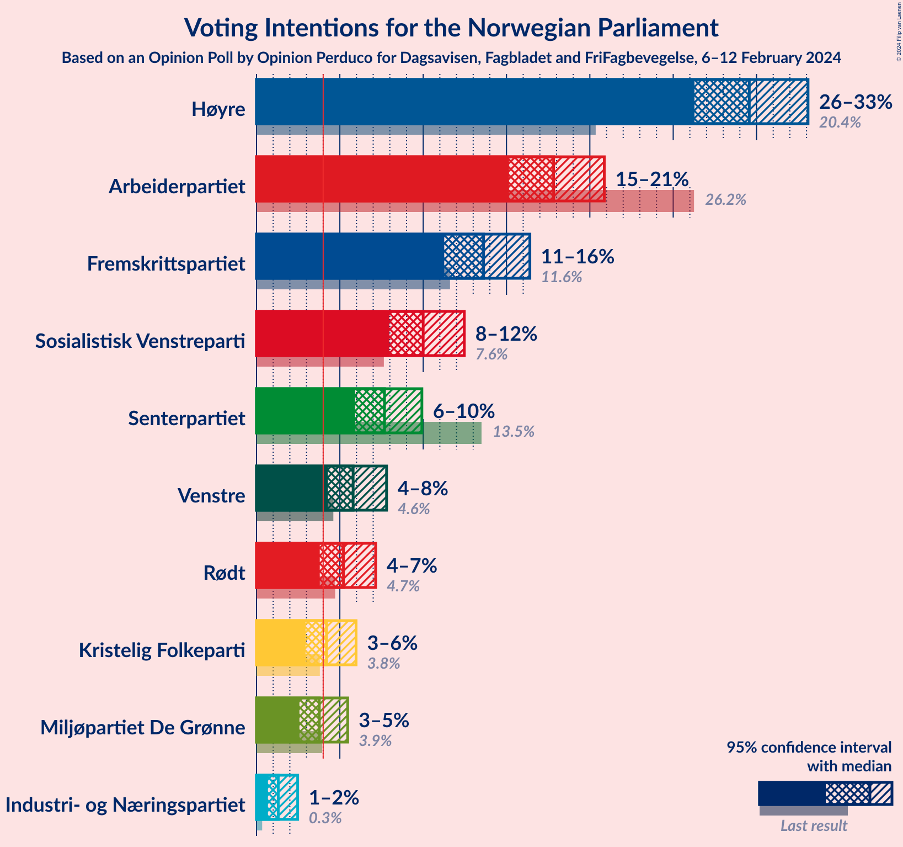

### Confidence Intervals

| Party | Last Result | Poll Result | 80% Confidence Interval | 90% Confidence Interval | 95% Confidence Interval | 99% Confidence Interval |
|:-----:|:-----------:|:-----------:|:-----------------------:|:-----------------------:|:-----------------------:|:-----------------------:|
| Høyre | 20.4% | 29.6% | 27.4–31.9% |26.8–32.5% |26.3–33.1% |25.3–34.2% |
| Arbeiderpartiet | 26.2% | 17.8% | 16.1–19.8% |15.6–20.4% |15.2–20.9% |14.3–21.8% |
| Fremskrittspartiet | 11.6% | 13.6% | 12.1–15.4% |11.6–15.9% |11.3–16.4% |10.6–17.3% |
| Sosialistisk Venstreparti | 7.6% | 10.0% | 8.7–11.6% |8.3–12.1% |8.0–12.5% |7.4–13.3% |
| Senterpartiet | 13.5% | 7.7% | 6.5–9.1% |6.2–9.6% |5.9–9.9% |5.4–10.7% |
| Venstre | 4.6% | 5.8% | 4.8–7.1% |4.5–7.5% |4.3–7.8% |3.9–8.5% |
| Rødt | 4.7% | 5.2% | 4.3–6.5% |4.0–6.8% |3.8–7.1% |3.4–7.8% |
| Kristelig Folkeparti | 3.8% | 4.2% | 3.4–5.4% |3.1–5.7% |2.9–6.0% |2.6–6.6% |
| Miljøpartiet De Grønne | 3.9% | 3.8% | 3.0–4.9% |2.8–5.2% |2.6–5.5% |2.3–6.1% |
| Industri- og Næringspartiet | 0.3% | 1.3% | 0.9–2.1% |0.8–2.3% |0.7–2.5% |0.5–2.9% |

*Note:* The poll result column reflects the actual value used in the calculations. Published results may vary slightly, and in addition be rounded to fewer digits.

## Seats

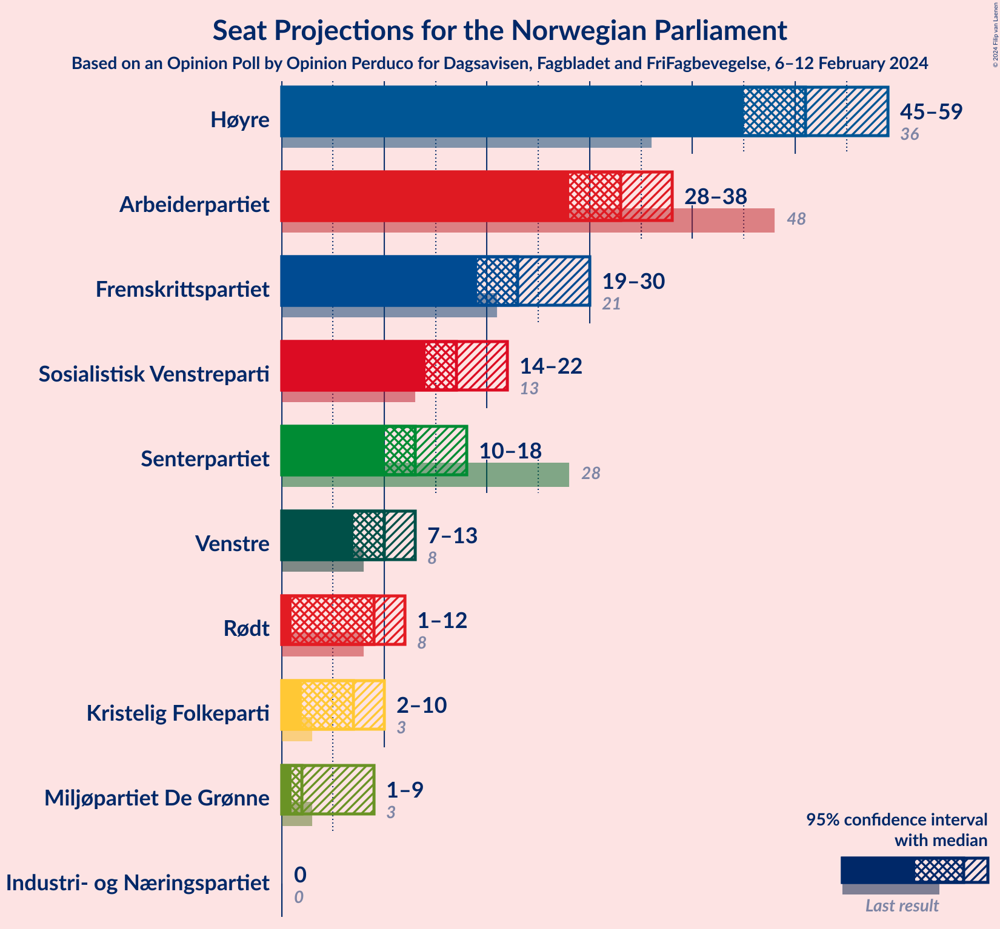

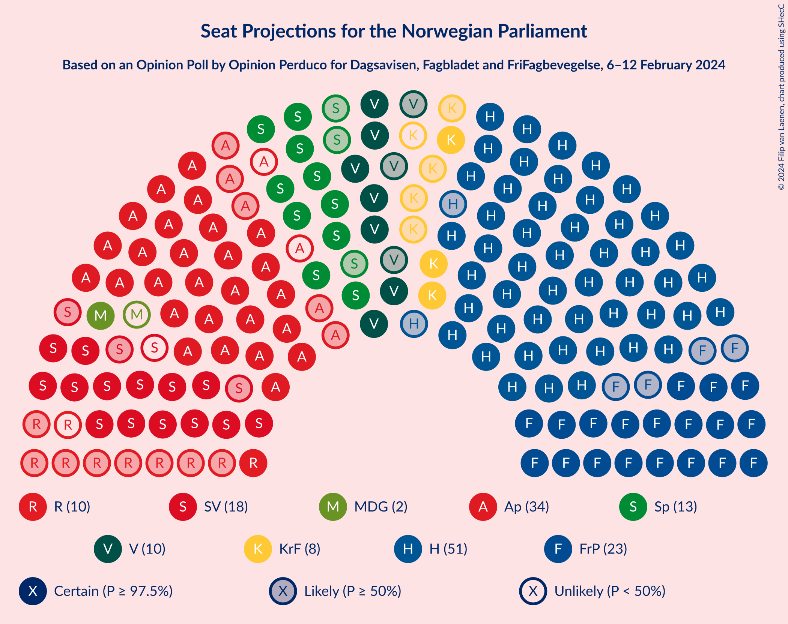

### Confidence Intervals

| Party | Last Result | Median | 80% Confidence Interval | 90% Confidence Interval | 95% Confidence Interval | 99% Confidence Interval |
|:-----:|:-----------:|:------:|:-----------------------:|:-----------------------:|:-----------------------:|:-----------------------:|
| <a href="#høyre">Høyre</a> | 36 | 51 | 47–56 |46–58 |45–59 |42–62 |
| <a href="#arbeiderpartiet">Arbeiderpartiet</a> | 48 | 33 | 31–37 |30–37 |28–38 |27–42 |
| <a href="#fremskrittspartiet">Fremskrittspartiet</a> | 21 | 23 | 21–28 |20–29 |19–30 |18–32 |
| <a href="#sosialistisk-venstreparti">Sosialistisk Venstreparti</a> | 13 | 17 | 14–21 |14–22 |14–22 |12–23 |
| <a href="#senterpartiet">Senterpartiet</a> | 28 | 13 | 11–16 |10–17 |10–18 |8–19 |
| <a href="#venstre">Venstre</a> | 8 | 10 | 8–12 |7–13 |7–13 |3–15 |
| <a href="#rødt">Rødt</a> | 8 | 9 | 7–11 |1–11 |1–12 |1–14 |
| <a href="#kristelig-folkeparti">Kristelig Folkeparti</a> | 3 | 7 | 2–9 |2–9 |2–10 |1–11 |
| <a href="#miljøpartiet-de-grønne">Miljøpartiet De Grønne</a> | 3 | 2 | 1–8 |1–9 |1–9 |1–10 |
| <a href="#industri--og-næringspartiet">Industri- og Næringspartiet</a> | 0 | 0 | 0 |0 |0 |0–2 |

### Høyre

*For a full overview of the results for this party, see the [Høyre](party-høyre.html) page.*

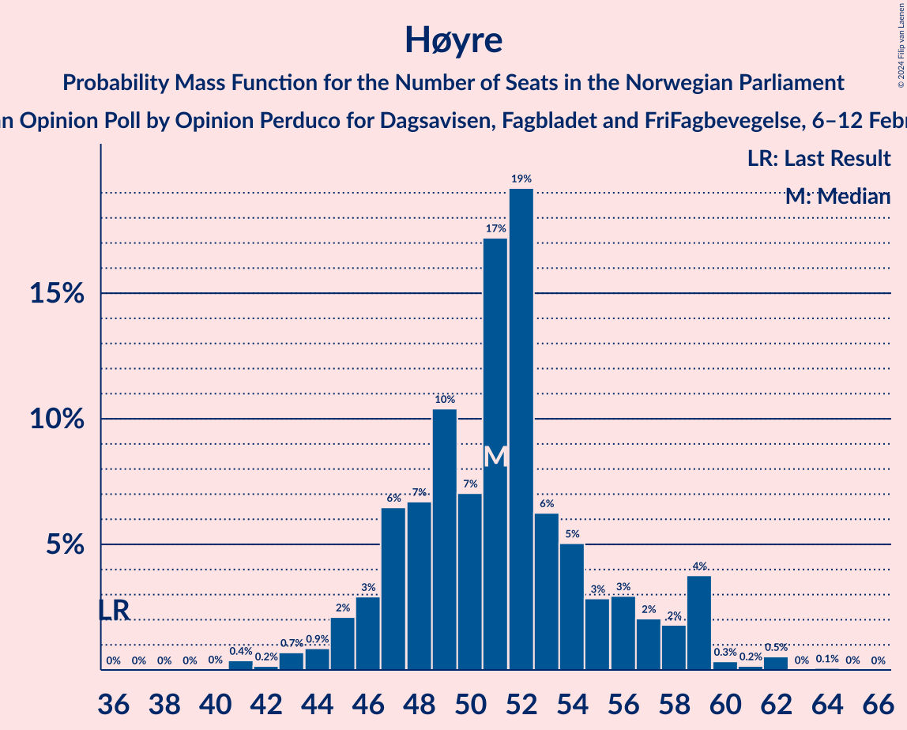

| Number of Seats | Probability | Accumulated | Special Marks |
|:---------------:|:-----------:|:-----------:|:-------------:|
| 36 | 0% | 100% | Last Result |
| 37 | 0% | 100% |  |
| 38 | 0% | 100% |  |
| 39 | 0% | 100% |  |
| 40 | 0% | 100% |  |
| 41 | 0.4% | 100% |  |
| 42 | 0.2% | 99.6% |  |
| 43 | 0.7% | 99.4% |  |
| 44 | 0.9% | 98.7% |  |
| 45 | 2% | 98% |  |
| 46 | 3% | 96% |  |
| 47 | 6% | 93% |  |
| 48 | 7% | 86% |  |
| 49 | 10% | 80% |  |
| 50 | 7% | 69% |  |
| 51 | 17% | 62% | Median |
| 52 | 19% | 45% |  |
| 53 | 6% | 26% |  |
| 54 | 5% | 20% |  |
| 55 | 3% | 15% |  |
| 56 | 3% | 12% |  |
| 57 | 2% | 9% |  |
| 58 | 2% | 7% |  |
| 59 | 4% | 5% |  |
| 60 | 0.3% | 1.1% |  |
| 61 | 0.2% | 0.8% |  |
| 62 | 0.5% | 0.6% |  |
| 63 | 0% | 0.1% |  |
| 64 | 0.1% | 0.1% |  |
| 65 | 0% | 0% |  |

### Arbeiderpartiet

*For a full overview of the results for this party, see the [Arbeiderpartiet](party-arbeiderpartiet.html) page.*

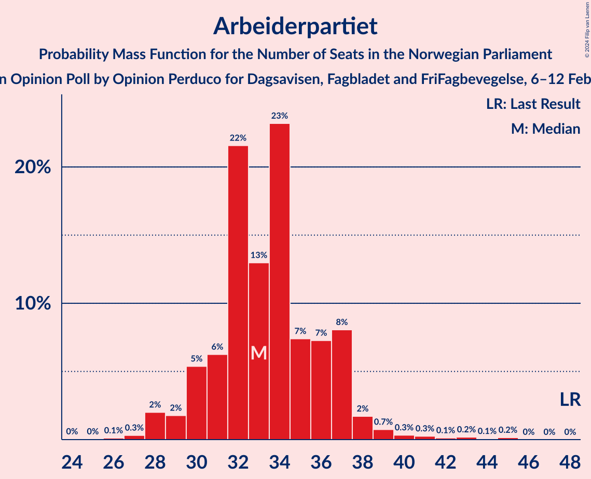

| Number of Seats | Probability | Accumulated | Special Marks |
|:---------------:|:-----------:|:-----------:|:-------------:|
| 24 | 0% | 100% |  |
| 25 | 0% | 99.9% |  |
| 26 | 0.1% | 99.9% |  |
| 27 | 0.3% | 99.8% |  |
| 28 | 2% | 99.5% |  |
| 29 | 2% | 97% |  |
| 30 | 5% | 96% |  |
| 31 | 6% | 90% |  |
| 32 | 22% | 84% |  |
| 33 | 13% | 62% | Median |
| 34 | 23% | 50% |  |
| 35 | 7% | 26% |  |
| 36 | 7% | 19% |  |
| 37 | 8% | 12% |  |
| 38 | 2% | 4% |  |
| 39 | 0.7% | 2% |  |
| 40 | 0.3% | 1.1% |  |
| 41 | 0.3% | 0.8% |  |
| 42 | 0.1% | 0.5% |  |
| 43 | 0.2% | 0.4% |  |
| 44 | 0.1% | 0.2% |  |
| 45 | 0.2% | 0.2% |  |
| 46 | 0% | 0% |  |
| 47 | 0% | 0% |  |
| 48 | 0% | 0% | Last Result |

### Fremskrittspartiet

*For a full overview of the results for this party, see the [Fremskrittspartiet](party-fremskrittspartiet.html) page.*

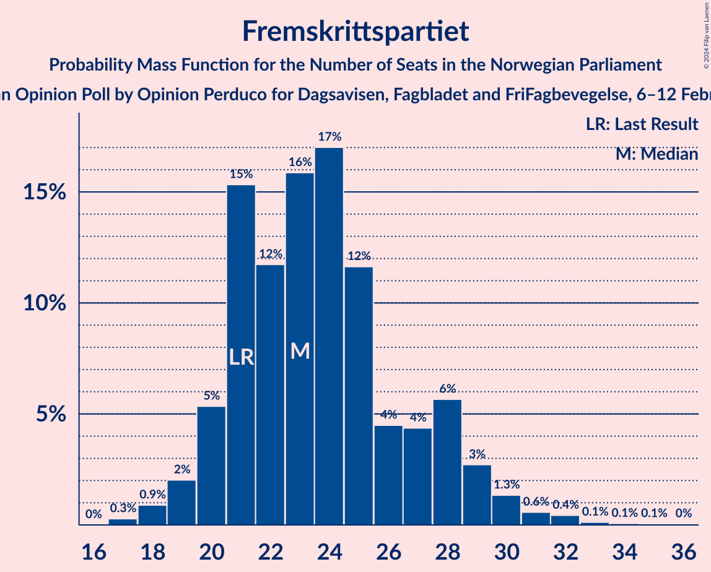

| Number of Seats | Probability | Accumulated | Special Marks |
|:---------------:|:-----------:|:-----------:|:-------------:|
| 17 | 0.3% | 100% |  |
| 18 | 0.9% | 99.7% |  |
| 19 | 2% | 98.8% |  |
| 20 | 5% | 97% |  |
| 21 | 15% | 91% | Last Result |
| 22 | 12% | 76% |  |
| 23 | 16% | 64% | Median |
| 24 | 17% | 49% |  |
| 25 | 12% | 32% |  |
| 26 | 4% | 20% |  |
| 27 | 4% | 15% |  |
| 28 | 6% | 11% |  |
| 29 | 3% | 5% |  |
| 30 | 1.3% | 3% |  |
| 31 | 0.6% | 1.3% |  |
| 32 | 0.4% | 0.7% |  |
| 33 | 0.1% | 0.3% |  |
| 34 | 0.1% | 0.2% |  |
| 35 | 0.1% | 0.1% |  |
| 36 | 0% | 0% |  |

### Sosialistisk Venstreparti

*For a full overview of the results for this party, see the [Sosialistisk Venstreparti](party-sosialistiskvenstreparti.html) page.*

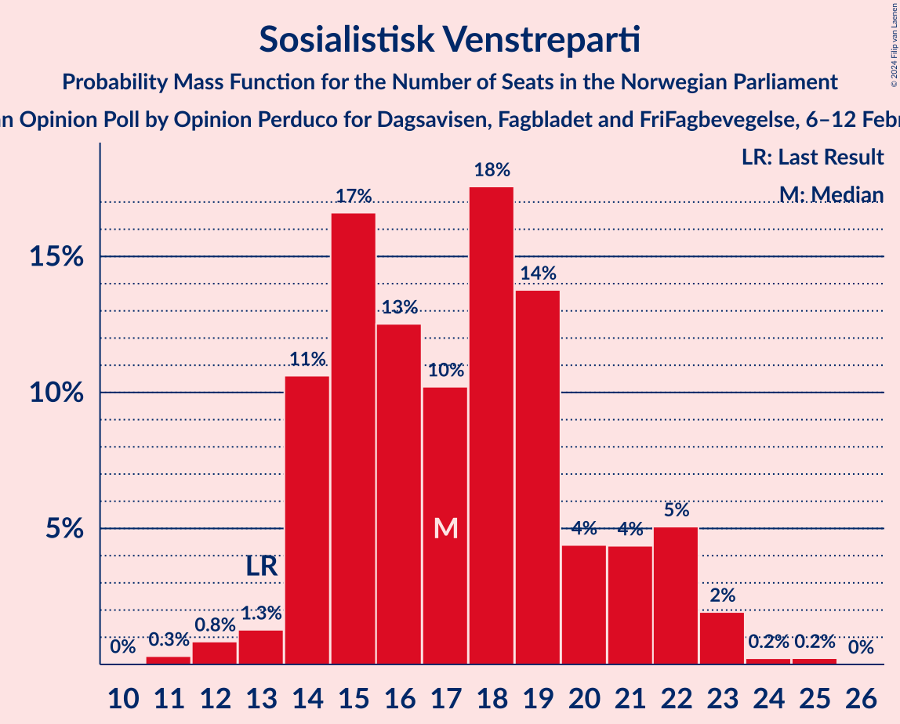

| Number of Seats | Probability | Accumulated | Special Marks |
|:---------------:|:-----------:|:-----------:|:-------------:|
| 11 | 0.3% | 100% |  |
| 12 | 0.8% | 99.6% |  |
| 13 | 1.3% | 98.8% | Last Result |
| 14 | 11% | 98% |  |
| 15 | 17% | 87% |  |
| 16 | 13% | 70% |  |
| 17 | 10% | 58% | Median |
| 18 | 18% | 48% |  |
| 19 | 14% | 30% |  |
| 20 | 4% | 16% |  |
| 21 | 4% | 12% |  |
| 22 | 5% | 7% |  |
| 23 | 2% | 2% |  |
| 24 | 0.2% | 0.5% |  |
| 25 | 0.2% | 0.3% |  |
| 26 | 0% | 0% |  |

### Senterpartiet

*For a full overview of the results for this party, see the [Senterpartiet](party-senterpartiet.html) page.*

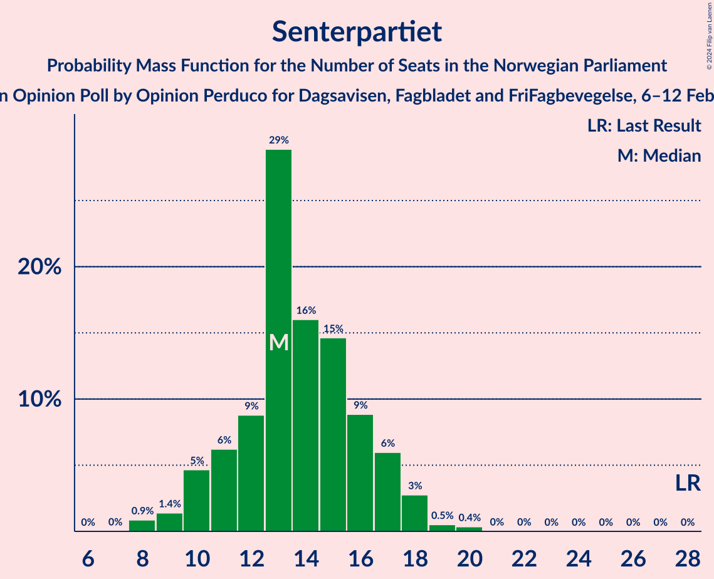

| Number of Seats | Probability | Accumulated | Special Marks |
|:---------------:|:-----------:|:-----------:|:-------------:|
| 8 | 0.9% | 100% |  |
| 9 | 1.4% | 99.1% |  |
| 10 | 5% | 98% |  |
| 11 | 6% | 93% |  |
| 12 | 9% | 87% |  |
| 13 | 29% | 78% | Median |
| 14 | 16% | 49% |  |
| 15 | 15% | 33% |  |
| 16 | 9% | 18% |  |
| 17 | 6% | 10% |  |
| 18 | 3% | 4% |  |
| 19 | 0.5% | 0.9% |  |
| 20 | 0.4% | 0.4% |  |
| 21 | 0% | 0% |  |
| 22 | 0% | 0% |  |
| 23 | 0% | 0% |  |
| 24 | 0% | 0% |  |
| 25 | 0% | 0% |  |
| 26 | 0% | 0% |  |
| 27 | 0% | 0% |  |
| 28 | 0% | 0% | Last Result |

### Venstre

*For a full overview of the results for this party, see the [Venstre](party-venstre.html) page.*

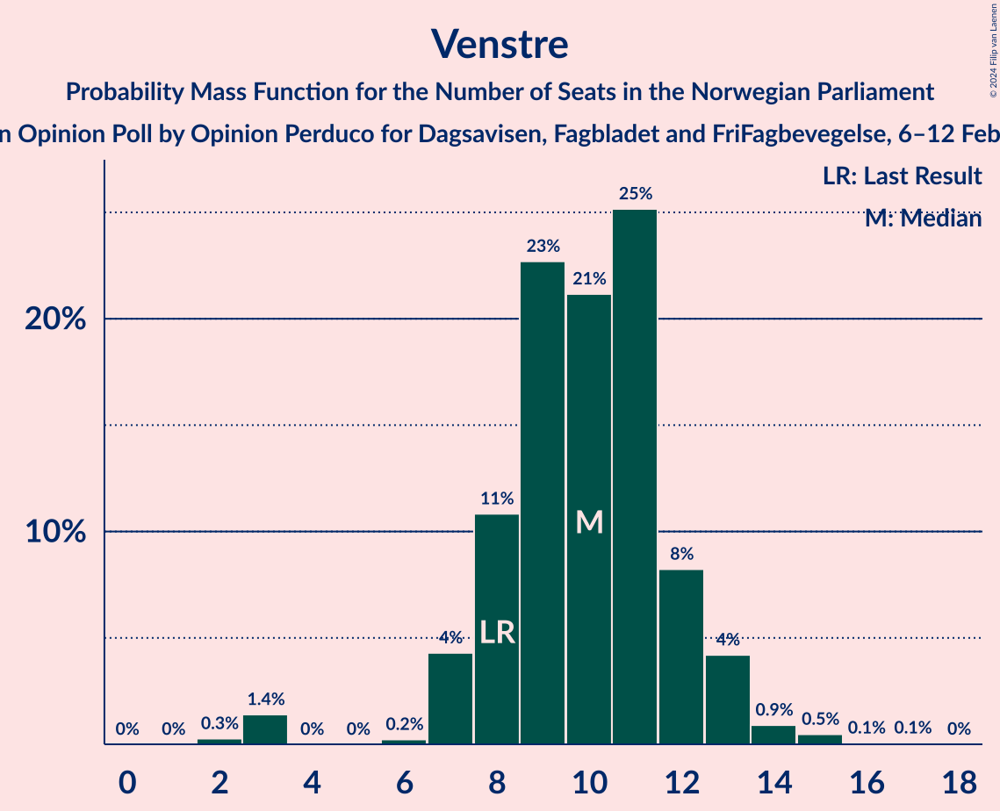

| Number of Seats | Probability | Accumulated | Special Marks |
|:---------------:|:-----------:|:-----------:|:-------------:|
| 2 | 0.3% | 100% |  |
| 3 | 1.4% | 99.7% |  |
| 4 | 0% | 98% |  |
| 5 | 0% | 98% |  |
| 6 | 0.2% | 98% |  |
| 7 | 4% | 98% |  |
| 8 | 11% | 94% | Last Result |
| 9 | 23% | 83% |  |
| 10 | 21% | 60% | Median |
| 11 | 25% | 39% |  |
| 12 | 8% | 14% |  |
| 13 | 4% | 6% |  |
| 14 | 0.9% | 2% |  |
| 15 | 0.5% | 0.6% |  |
| 16 | 0.1% | 0.1% |  |
| 17 | 0.1% | 0.1% |  |
| 18 | 0% | 0% |  |

### Rødt

*For a full overview of the results for this party, see the [Rødt](party-rødt.html) page.*

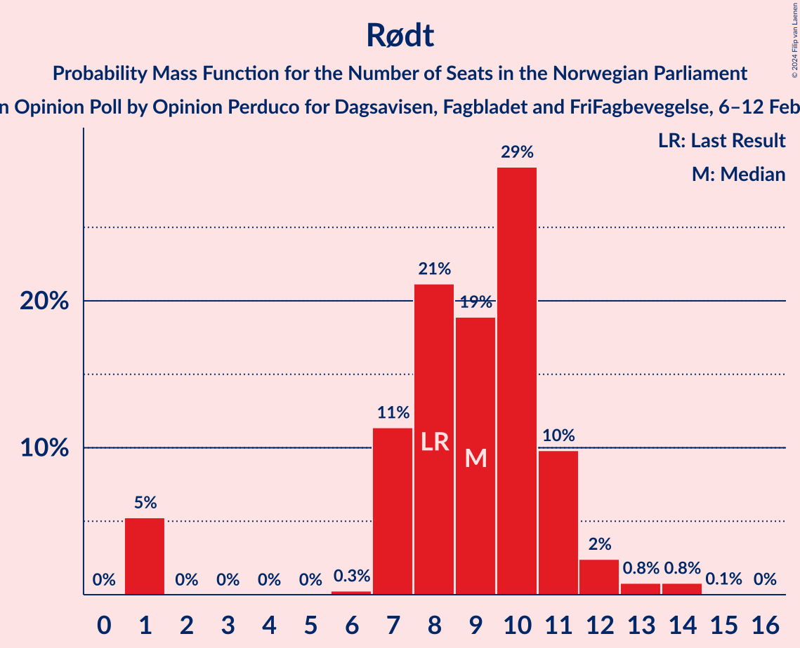

| Number of Seats | Probability | Accumulated | Special Marks |
|:---------------:|:-----------:|:-----------:|:-------------:|
| 1 | 5% | 100% |  |
| 2 | 0% | 95% |  |
| 3 | 0% | 95% |  |
| 4 | 0% | 95% |  |
| 5 | 0% | 95% |  |
| 6 | 0.3% | 95% |  |
| 7 | 11% | 94% |  |
| 8 | 21% | 83% | Last Result |
| 9 | 19% | 62% | Median |
| 10 | 29% | 43% |  |
| 11 | 10% | 14% |  |
| 12 | 2% | 4% |  |
| 13 | 0.8% | 2% |  |
| 14 | 0.8% | 0.9% |  |
| 15 | 0.1% | 0.1% |  |
| 16 | 0% | 0% |  |

### Kristelig Folkeparti

*For a full overview of the results for this party, see the [Kristelig Folkeparti](party-kristeligfolkeparti.html) page.*

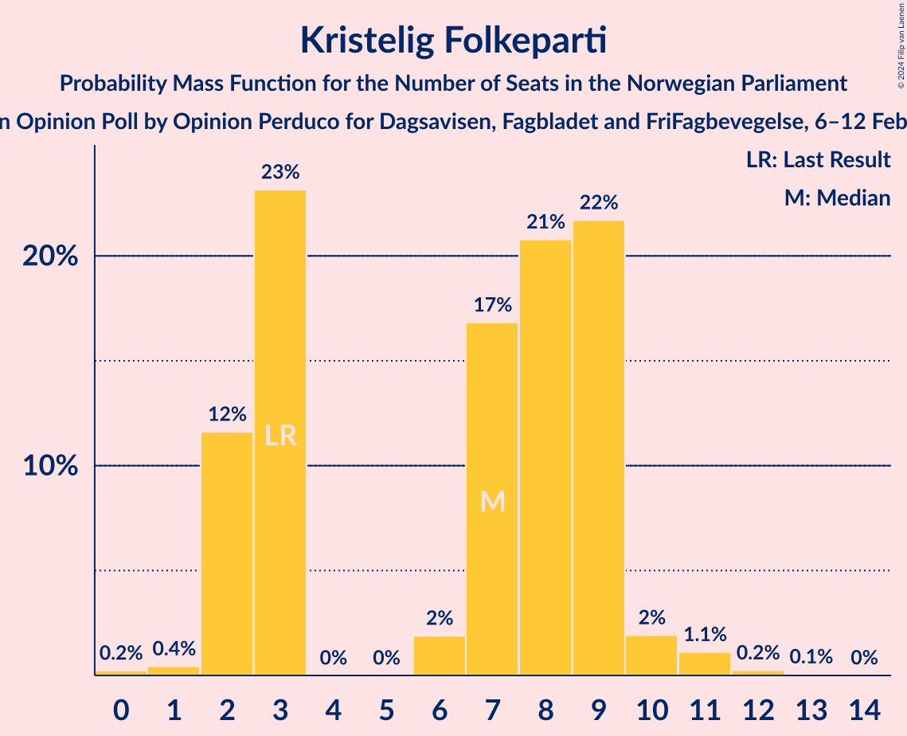

| Number of Seats | Probability | Accumulated | Special Marks |
|:---------------:|:-----------:|:-----------:|:-------------:|
| 0 | 0.2% | 100% |  |
| 1 | 0.4% | 99.8% |  |
| 2 | 12% | 99.3% |  |
| 3 | 23% | 88% | Last Result |
| 4 | 0% | 65% |  |
| 5 | 0% | 65% |  |
| 6 | 2% | 65% |  |
| 7 | 17% | 63% | Median |
| 8 | 21% | 46% |  |
| 9 | 22% | 25% |  |
| 10 | 2% | 3% |  |
| 11 | 1.1% | 1.4% |  |
| 12 | 0.2% | 0.3% |  |
| 13 | 0.1% | 0.1% |  |
| 14 | 0% | 0% |  |

### Miljøpartiet De Grønne

*For a full overview of the results for this party, see the [Miljøpartiet De Grønne](party-miljøpartietdegrønne.html) page.*

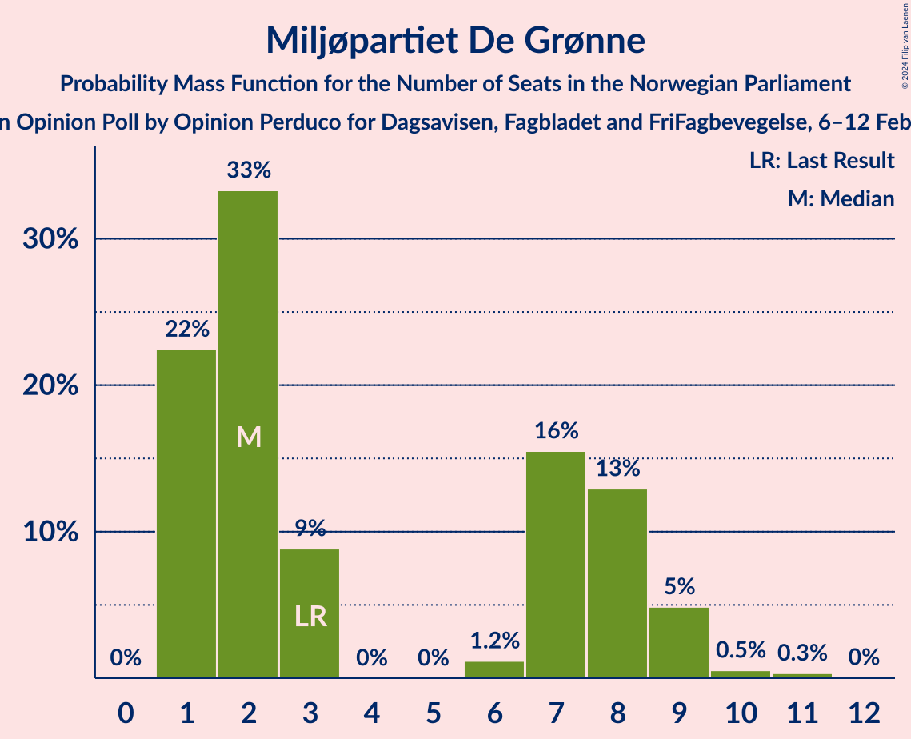

| Number of Seats | Probability | Accumulated | Special Marks |
|:---------------:|:-----------:|:-----------:|:-------------:|
| 1 | 22% | 100% |  |
| 2 | 33% | 78% | Median |
| 3 | 9% | 44% | Last Result |
| 4 | 0% | 35% |  |
| 5 | 0% | 35% |  |
| 6 | 1.2% | 35% |  |
| 7 | 16% | 34% |  |
| 8 | 13% | 19% |  |
| 9 | 5% | 6% |  |
| 10 | 0.5% | 0.9% |  |
| 11 | 0.3% | 0.4% |  |
| 12 | 0% | 0% |  |

### Industri- og Næringspartiet

*For a full overview of the results for this party, see the [Industri- og Næringspartiet](party-industri-ognæringspartiet.html) page.*

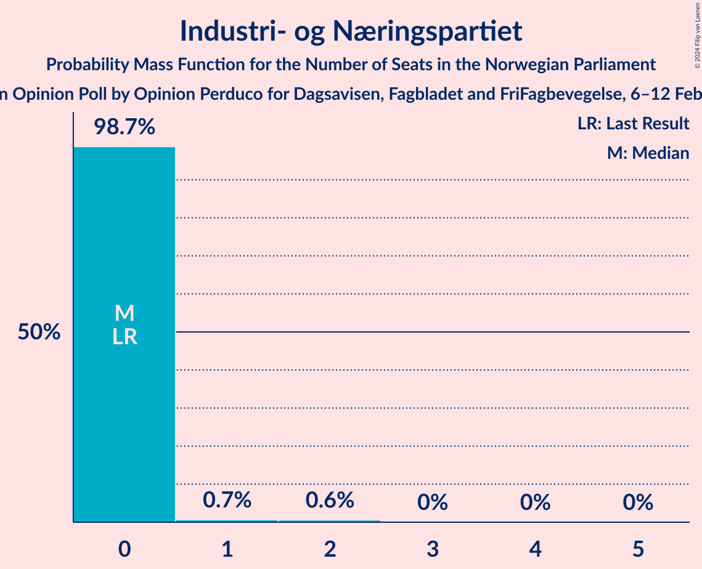

| Number of Seats | Probability | Accumulated | Special Marks |
|:---------------:|:-----------:|:-----------:|:-------------:|
| 0 | 98.7% | 100% | Last Result, Median |
| 1 | 0.7% | 1.3% |  |
| 2 | 0.6% | 0.6% |  |
| 3 | 0% | 0% |  |

## Coalitions

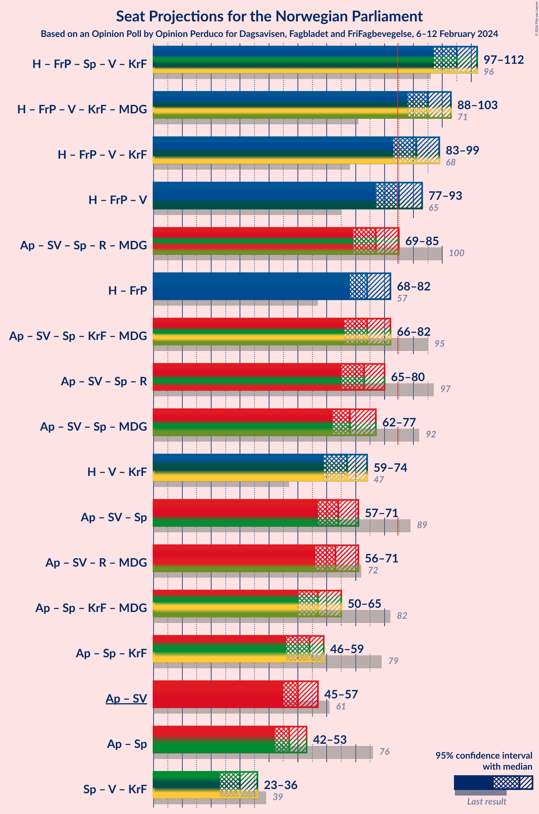

### Confidence Intervals

| Coalition | Last Result | Median | Majority? | 80% Confidence Interval | 90% Confidence Interval | 95% Confidence Interval | 99% Confidence Interval |
|:---------:|:-----------:|:------:|:---------:|:-----------------------:|:-----------------------:|:-----------------------:|:-----------------------:|
| Høyre – Fremskrittspartiet – Senterpartiet – Venstre – Kristelig Folkeparti | 96 | 105 | 100% | 99–110 | 97–111 | 97–112 | 94–115 |
| Høyre – Fremskrittspartiet – Venstre – Kristelig Folkeparti – Miljøpartiet De Grønne | 71 | 95 | 99.8% | 90–100 | 89–102 | 88–103 | 86–105 |
| Høyre – Fremskrittspartiet – Venstre – Kristelig Folkeparti | 68 | 91 | 95% | 86–96 | 85–98 | 83–99 | 80–102 |
| Høyre – Fremskrittspartiet – Venstre | 65 | 85 | 53% | 80–91 | 79–91 | 77–93 | 75–96 |
| Arbeiderpartiet – Sosialistisk Venstreparti – Senterpartiet – Rødt – Miljøpartiet De Grønne | 100 | 77 | 4% | 72–82 | 70–84 | 69–85 | 66–88 |
| Høyre – Fremskrittspartiet | 57 | 74 | 1.0% | 70–80 | 69–81 | 68–82 | 66–86 |
| Arbeiderpartiet – Sosialistisk Venstreparti – Senterpartiet – Kristelig Folkeparti – Miljøpartiet De Grønne | 95 | 74 | 0.5% | 69–80 | 68–80 | 66–82 | 64–84 |
| Arbeiderpartiet – Sosialistisk Venstreparti – Senterpartiet – Rødt | 97 | 73 | 0.1% | 68–78 | 66–79 | 65–80 | 63–82 |
| Arbeiderpartiet – Sosialistisk Venstreparti – Senterpartiet – Miljøpartiet De Grønne | 92 | 68 | 0% | 62–73 | 62–75 | 62–77 | 59–79 |
| Høyre – Venstre – Kristelig Folkeparti | 47 | 67 | 0% | 62–72 | 61–74 | 59–74 | 57–78 |
| Arbeiderpartiet – Sosialistisk Venstreparti – Senterpartiet | 89 | 64 | 0% | 60–69 | 59–69 | 57–71 | 55–74 |
| Arbeiderpartiet – Sosialistisk Venstreparti – Rødt – Miljøpartiet De Grønne | 72 | 63 | 0% | 59–69 | 57–71 | 56–71 | 53–74 |
| Arbeiderpartiet – Senterpartiet – Kristelig Folkeparti – Miljøpartiet De Grønne | 82 | 57 | 0% | 52–63 | 50–64 | 50–65 | 46–68 |
| Arbeiderpartiet – Senterpartiet – Kristelig Folkeparti | 79 | 54 | 0% | 49–57 | 48–58 | 46–59 | 43–62 |
| Arbeiderpartiet – Sosialistisk Venstreparti | 61 | 50 | 0% | 48–55 | 46–56 | 45–57 | 43–60 |
| Arbeiderpartiet – Senterpartiet | 76 | 47 | 0% | 44–51 | 43–51 | 42–53 | 40–56 |
| Senterpartiet – Venstre – Kristelig Folkeparti | 39 | 30 | 0% | 25–34 | 24–34 | 23–36 | 20–38 |

### Høyre – Fremskrittspartiet – Senterpartiet – Venstre – Kristelig Folkeparti

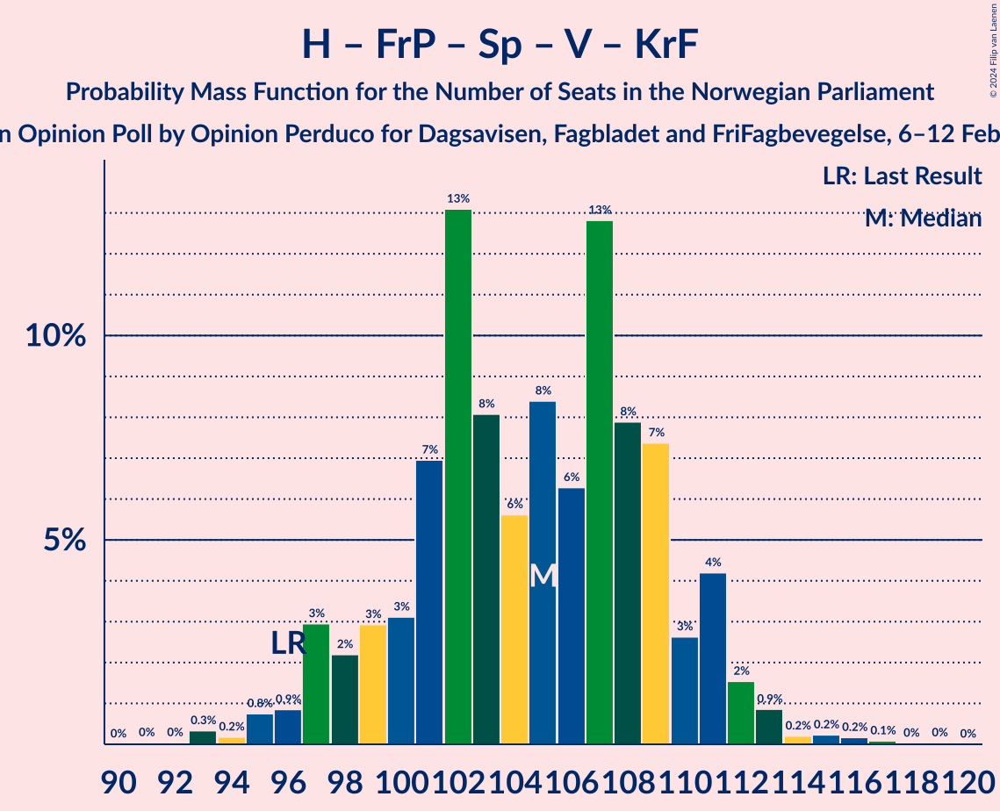

| Number of Seats | Probability | Accumulated | Special Marks |
|:---------------:|:-----------:|:-----------:|:-------------:|
| 91 | 0% | 100% |  |
| 92 | 0% | 99.9% |  |
| 93 | 0.3% | 99.9% |  |
| 94 | 0.2% | 99.6% |  |
| 95 | 0.8% | 99.4% |  |
| 96 | 0.9% | 98.6% | Last Result |
| 97 | 3% | 98% |  |
| 98 | 2% | 95% |  |
| 99 | 3% | 93% |  |
| 100 | 3% | 90% |  |
| 101 | 7% | 87% |  |
| 102 | 13% | 80% |  |
| 103 | 8% | 67% |  |
| 104 | 6% | 58% | Median |
| 105 | 8% | 53% |  |
| 106 | 6% | 44% |  |
| 107 | 13% | 38% |  |
| 108 | 8% | 25% |  |
| 109 | 7% | 17% |  |
| 110 | 3% | 10% |  |
| 111 | 4% | 7% |  |
| 112 | 2% | 3% |  |
| 113 | 0.9% | 2% |  |
| 114 | 0.2% | 0.8% |  |
| 115 | 0.2% | 0.6% |  |
| 116 | 0.2% | 0.4% |  |
| 117 | 0.1% | 0.2% |  |
| 118 | 0% | 0.1% |  |
| 119 | 0% | 0.1% |  |
| 120 | 0% | 0% |  |

### Høyre – Fremskrittspartiet – Venstre – Kristelig Folkeparti – Miljøpartiet De Grønne

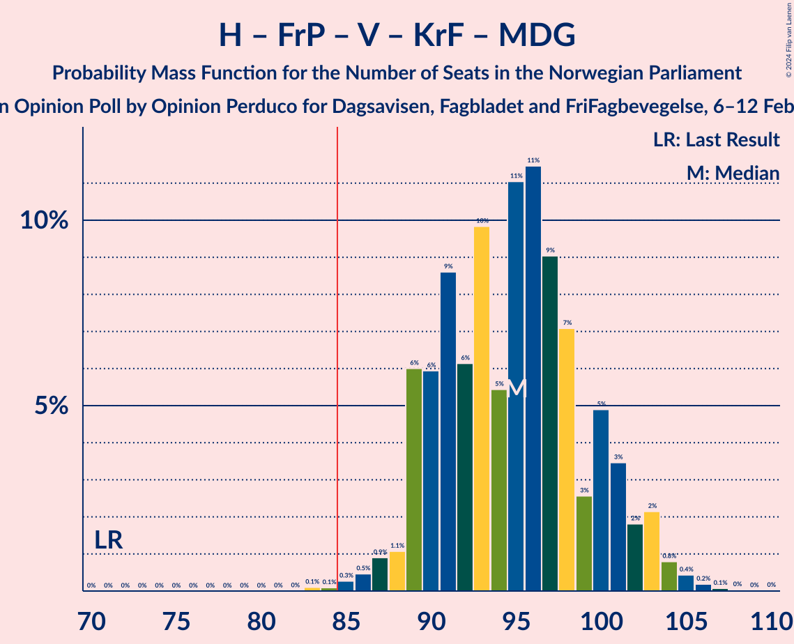

| Number of Seats | Probability | Accumulated | Special Marks |
|:---------------:|:-----------:|:-----------:|:-------------:|
| 71 | 0% | 100% | Last Result |
| 72 | 0% | 100% |  |
| 73 | 0% | 100% |  |
| 74 | 0% | 100% |  |
| 75 | 0% | 100% |  |
| 76 | 0% | 100% |  |
| 77 | 0% | 100% |  |
| 78 | 0% | 100% |  |
| 79 | 0% | 100% |  |
| 80 | 0% | 100% |  |
| 81 | 0% | 100% |  |
| 82 | 0% | 100% |  |
| 83 | 0.1% | 100% |  |
| 84 | 0.1% | 99.9% |  |
| 85 | 0.3% | 99.8% | Majority |
| 86 | 0.5% | 99.5% |  |
| 87 | 0.9% | 99.1% |  |
| 88 | 1.1% | 98% |  |
| 89 | 6% | 97% |  |
| 90 | 6% | 91% |  |
| 91 | 9% | 85% |  |
| 92 | 6% | 77% |  |
| 93 | 10% | 70% | Median |
| 94 | 5% | 61% |  |
| 95 | 11% | 55% |  |
| 96 | 11% | 44% |  |
| 97 | 9% | 33% |  |
| 98 | 7% | 24% |  |
| 99 | 3% | 16% |  |
| 100 | 5% | 14% |  |
| 101 | 3% | 9% |  |
| 102 | 2% | 6% |  |
| 103 | 2% | 4% |  |
| 104 | 0.8% | 2% |  |
| 105 | 0.4% | 0.8% |  |
| 106 | 0.2% | 0.3% |  |
| 107 | 0.1% | 0.2% |  |
| 108 | 0% | 0.1% |  |
| 109 | 0% | 0% |  |

### Høyre – Fremskrittspartiet – Venstre – Kristelig Folkeparti

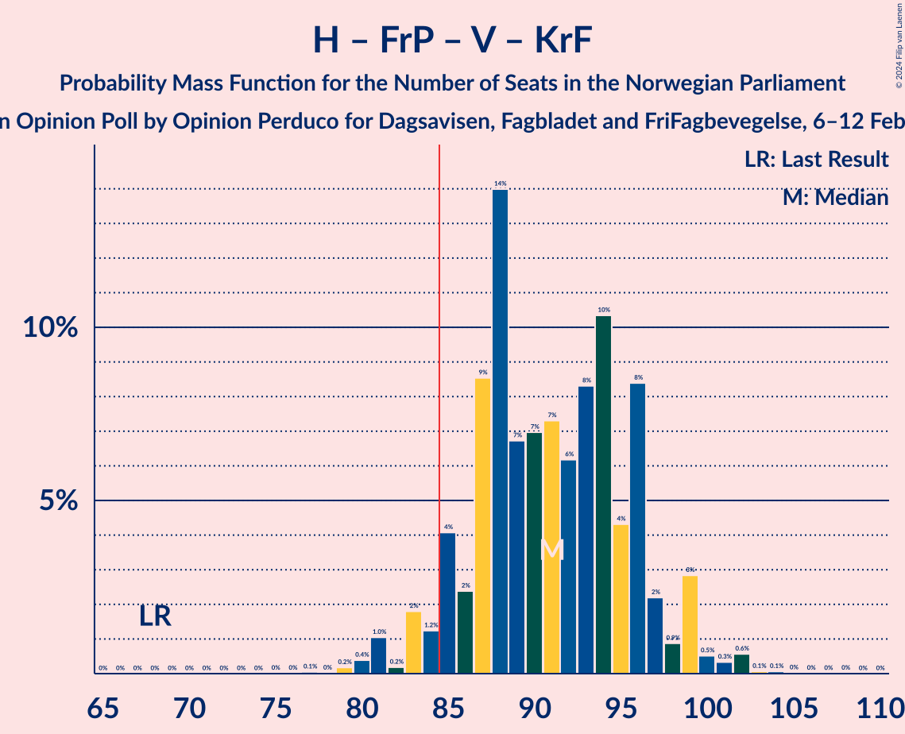

| Number of Seats | Probability | Accumulated | Special Marks |
|:---------------:|:-----------:|:-----------:|:-------------:|
| 68 | 0% | 100% | Last Result |
| 69 | 0% | 100% |  |
| 70 | 0% | 100% |  |
| 71 | 0% | 100% |  |
| 72 | 0% | 100% |  |
| 73 | 0% | 100% |  |
| 74 | 0% | 100% |  |
| 75 | 0% | 100% |  |
| 76 | 0% | 100% |  |
| 77 | 0.1% | 100% |  |
| 78 | 0% | 99.9% |  |
| 79 | 0.2% | 99.9% |  |
| 80 | 0.4% | 99.7% |  |
| 81 | 1.0% | 99.3% |  |
| 82 | 0.2% | 98% |  |
| 83 | 2% | 98% |  |
| 84 | 1.2% | 96% |  |
| 85 | 4% | 95% | Majority |
| 86 | 2% | 91% |  |
| 87 | 9% | 89% |  |
| 88 | 14% | 80% |  |
| 89 | 7% | 66% |  |
| 90 | 7% | 59% |  |
| 91 | 7% | 52% | Median |
| 92 | 6% | 45% |  |
| 93 | 8% | 39% |  |
| 94 | 10% | 31% |  |
| 95 | 4% | 20% |  |
| 96 | 8% | 16% |  |
| 97 | 2% | 8% |  |
| 98 | 0.9% | 5% |  |
| 99 | 3% | 4% |  |
| 100 | 0.5% | 2% |  |
| 101 | 0.3% | 1.1% |  |
| 102 | 0.6% | 0.8% |  |
| 103 | 0.1% | 0.2% |  |
| 104 | 0.1% | 0.1% |  |
| 105 | 0% | 0.1% |  |
| 106 | 0% | 0% |  |

### Høyre – Fremskrittspartiet – Venstre

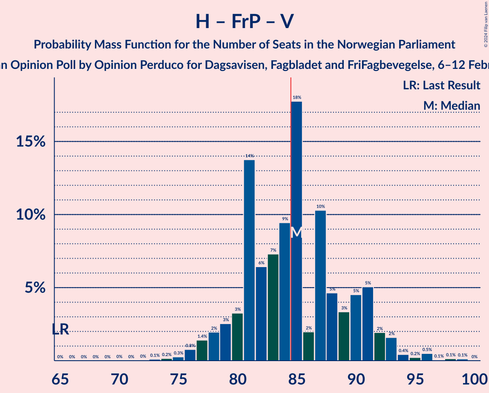

| Number of Seats | Probability | Accumulated | Special Marks |
|:---------------:|:-----------:|:-----------:|:-------------:|
| 65 | 0% | 100% | Last Result |
| 66 | 0% | 100% |  |
| 67 | 0% | 100% |  |
| 68 | 0% | 100% |  |
| 69 | 0% | 100% |  |
| 70 | 0% | 100% |  |
| 71 | 0% | 100% |  |
| 72 | 0% | 100% |  |
| 73 | 0.1% | 99.9% |  |
| 74 | 0.2% | 99.8% |  |
| 75 | 0.3% | 99.7% |  |
| 76 | 0.8% | 99.4% |  |
| 77 | 1.4% | 98.6% |  |
| 78 | 2% | 97% |  |
| 79 | 3% | 95% |  |
| 80 | 3% | 93% |  |
| 81 | 14% | 89% |  |
| 82 | 6% | 76% |  |
| 83 | 7% | 69% |  |
| 84 | 9% | 62% | Median |
| 85 | 18% | 53% | Majority |
| 86 | 2% | 35% |  |
| 87 | 10% | 33% |  |
| 88 | 5% | 23% |  |
| 89 | 3% | 18% |  |
| 90 | 5% | 15% |  |
| 91 | 5% | 10% |  |
| 92 | 2% | 5% |  |
| 93 | 2% | 3% |  |
| 94 | 0.4% | 1.5% |  |
| 95 | 0.2% | 1.0% |  |
| 96 | 0.5% | 0.8% |  |
| 97 | 0.1% | 0.3% |  |
| 98 | 0.1% | 0.3% |  |
| 99 | 0.1% | 0.1% |  |
| 100 | 0% | 0% |  |

### Arbeiderpartiet – Sosialistisk Venstreparti – Senterpartiet – Rødt – Miljøpartiet De Grønne

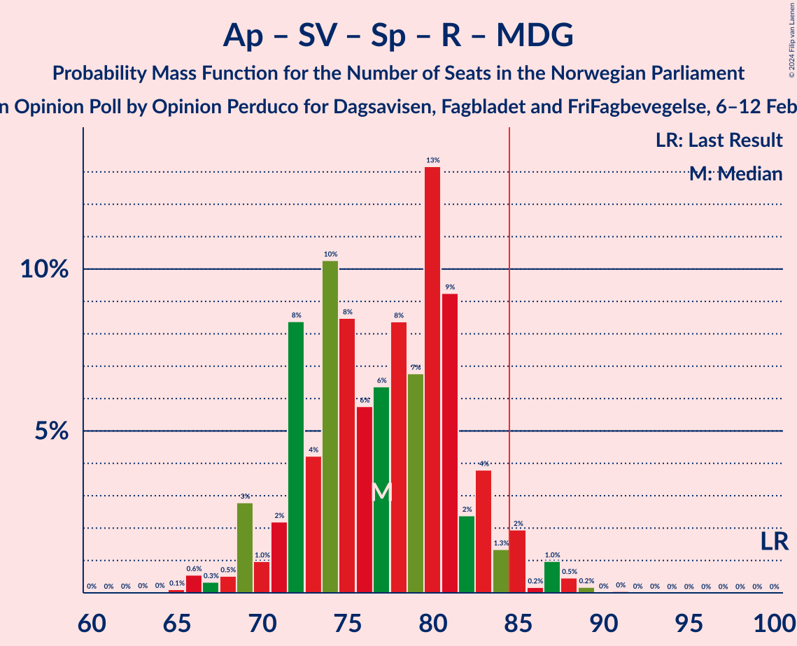

| Number of Seats | Probability | Accumulated | Special Marks |
|:---------------:|:-----------:|:-----------:|:-------------:|
| 63 | 0% | 100% |  |
| 64 | 0% | 99.9% |  |
| 65 | 0.1% | 99.9% |  |
| 66 | 0.6% | 99.8% |  |
| 67 | 0.3% | 99.2% |  |
| 68 | 0.5% | 98.9% |  |
| 69 | 3% | 98% |  |
| 70 | 1.0% | 96% |  |
| 71 | 2% | 95% |  |
| 72 | 8% | 92% |  |
| 73 | 4% | 84% |  |
| 74 | 10% | 80% | Median |
| 75 | 8% | 70% |  |
| 76 | 6% | 61% |  |
| 77 | 6% | 55% |  |
| 78 | 8% | 49% |  |
| 79 | 7% | 41% |  |
| 80 | 13% | 34% |  |
| 81 | 9% | 21% |  |
| 82 | 2% | 11% |  |
| 83 | 4% | 9% |  |
| 84 | 1.3% | 5% |  |
| 85 | 2% | 4% | Majority |
| 86 | 0.2% | 2% |  |
| 87 | 1.0% | 2% |  |
| 88 | 0.5% | 0.7% |  |
| 89 | 0.2% | 0.3% |  |
| 90 | 0% | 0.1% |  |
| 91 | 0% | 0.1% |  |
| 92 | 0% | 0% |  |
| 93 | 0% | 0% |  |
| 94 | 0% | 0% |  |
| 95 | 0% | 0% |  |
| 96 | 0% | 0% |  |
| 97 | 0% | 0% |  |
| 98 | 0% | 0% |  |
| 99 | 0% | 0% |  |
| 100 | 0% | 0% | Last Result |

### Høyre – Fremskrittspartiet

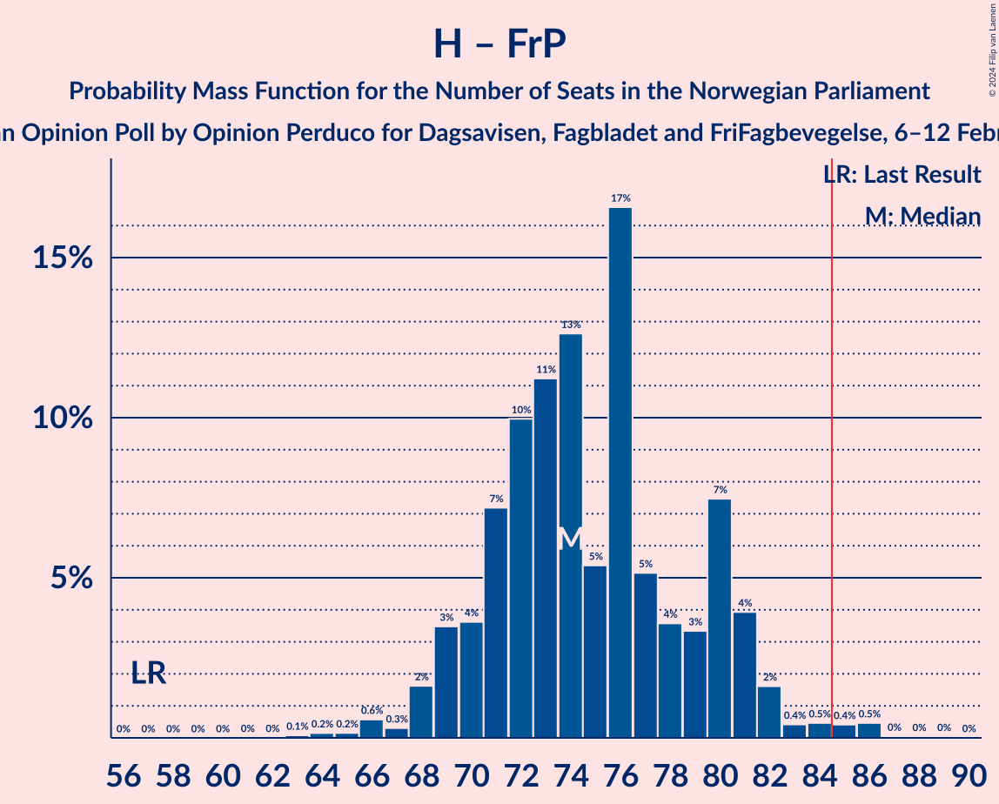

| Number of Seats | Probability | Accumulated | Special Marks |
|:---------------:|:-----------:|:-----------:|:-------------:|
| 57 | 0% | 100% | Last Result |
| 58 | 0% | 100% |  |
| 59 | 0% | 100% |  |
| 60 | 0% | 100% |  |
| 61 | 0% | 100% |  |
| 62 | 0% | 100% |  |
| 63 | 0.1% | 100% |  |
| 64 | 0.2% | 99.9% |  |
| 65 | 0.2% | 99.7% |  |
| 66 | 0.6% | 99.6% |  |
| 67 | 0.3% | 99.0% |  |
| 68 | 2% | 98.7% |  |
| 69 | 3% | 97% |  |
| 70 | 4% | 94% |  |
| 71 | 7% | 90% |  |
| 72 | 10% | 83% |  |
| 73 | 11% | 73% |  |
| 74 | 13% | 62% | Median |
| 75 | 5% | 49% |  |
| 76 | 17% | 44% |  |
| 77 | 5% | 27% |  |
| 78 | 4% | 22% |  |
| 79 | 3% | 18% |  |
| 80 | 7% | 15% |  |
| 81 | 4% | 7% |  |
| 82 | 2% | 4% |  |
| 83 | 0.4% | 2% |  |
| 84 | 0.5% | 1.5% |  |
| 85 | 0.4% | 1.0% | Majority |
| 86 | 0.5% | 0.6% |  |
| 87 | 0% | 0.1% |  |
| 88 | 0% | 0.1% |  |
| 89 | 0% | 0.1% |  |
| 90 | 0% | 0% |  |

### Arbeiderpartiet – Sosialistisk Venstreparti – Senterpartiet – Kristelig Folkeparti – Miljøpartiet De Grønne

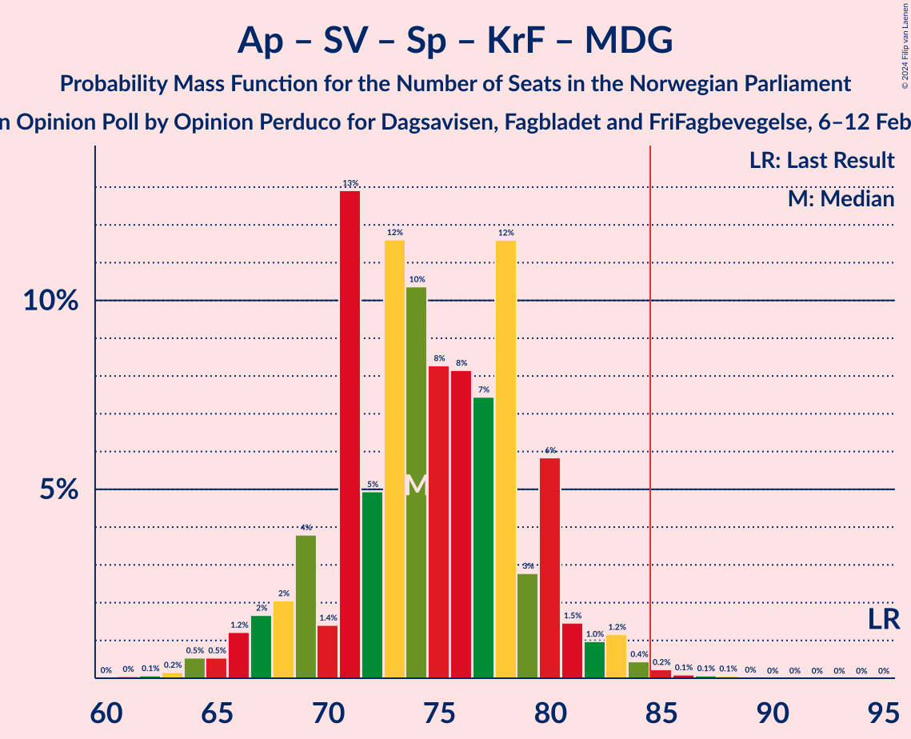

| Number of Seats | Probability | Accumulated | Special Marks |
|:---------------:|:-----------:|:-----------:|:-------------:|
| 61 | 0% | 100% |  |
| 62 | 0.1% | 99.9% |  |
| 63 | 0.2% | 99.9% |  |
| 64 | 0.5% | 99.7% |  |
| 65 | 0.5% | 99.2% |  |
| 66 | 1.2% | 98.6% |  |
| 67 | 2% | 97% |  |
| 68 | 2% | 96% |  |
| 69 | 4% | 94% |  |
| 70 | 1.4% | 90% |  |
| 71 | 13% | 88% |  |
| 72 | 5% | 76% | Median |
| 73 | 12% | 71% |  |
| 74 | 10% | 59% |  |
| 75 | 8% | 49% |  |
| 76 | 8% | 40% |  |
| 77 | 7% | 32% |  |
| 78 | 12% | 25% |  |
| 79 | 3% | 13% |  |
| 80 | 6% | 10% |  |
| 81 | 1.5% | 5% |  |
| 82 | 1.0% | 3% |  |
| 83 | 1.2% | 2% |  |
| 84 | 0.4% | 0.9% |  |
| 85 | 0.2% | 0.5% | Majority |
| 86 | 0.1% | 0.3% |  |
| 87 | 0.1% | 0.2% |  |
| 88 | 0.1% | 0.1% |  |
| 89 | 0% | 0% |  |
| 90 | 0% | 0% |  |
| 91 | 0% | 0% |  |
| 92 | 0% | 0% |  |
| 93 | 0% | 0% |  |
| 94 | 0% | 0% |  |
| 95 | 0% | 0% | Last Result |

### Arbeiderpartiet – Sosialistisk Venstreparti – Senterpartiet – Rødt

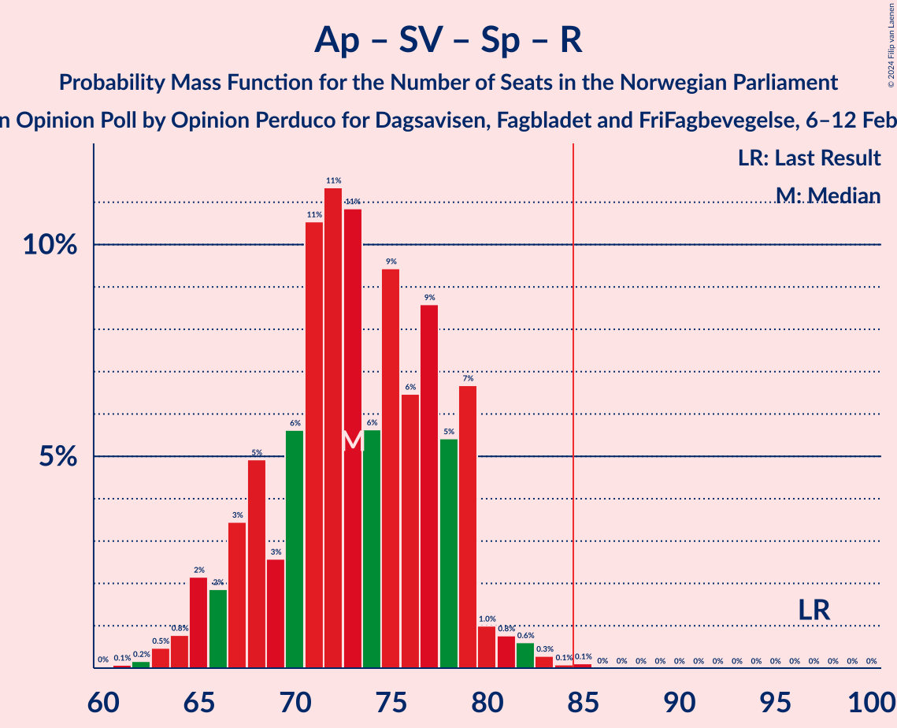

| Number of Seats | Probability | Accumulated | Special Marks |
|:---------------:|:-----------:|:-----------:|:-------------:|
| 60 | 0% | 100% |  |
| 61 | 0.1% | 99.9% |  |
| 62 | 0.2% | 99.8% |  |
| 63 | 0.5% | 99.7% |  |
| 64 | 0.8% | 99.2% |  |
| 65 | 2% | 98% |  |
| 66 | 2% | 96% |  |
| 67 | 3% | 94% |  |
| 68 | 5% | 91% |  |
| 69 | 3% | 86% |  |
| 70 | 6% | 83% |  |
| 71 | 11% | 78% |  |
| 72 | 11% | 67% | Median |
| 73 | 11% | 56% |  |
| 74 | 6% | 45% |  |
| 75 | 9% | 39% |  |
| 76 | 6% | 30% |  |
| 77 | 9% | 24% |  |
| 78 | 5% | 15% |  |
| 79 | 7% | 10% |  |
| 80 | 1.0% | 3% |  |
| 81 | 0.8% | 2% |  |
| 82 | 0.6% | 1.1% |  |
| 83 | 0.3% | 0.5% |  |
| 84 | 0.1% | 0.2% |  |
| 85 | 0.1% | 0.1% | Majority |
| 86 | 0% | 0% |  |
| 87 | 0% | 0% |  |
| 88 | 0% | 0% |  |
| 89 | 0% | 0% |  |
| 90 | 0% | 0% |  |
| 91 | 0% | 0% |  |
| 92 | 0% | 0% |  |
| 93 | 0% | 0% |  |
| 94 | 0% | 0% |  |
| 95 | 0% | 0% |  |
| 96 | 0% | 0% |  |
| 97 | 0% | 0% | Last Result |

### Arbeiderpartiet – Sosialistisk Venstreparti – Senterpartiet – Miljøpartiet De Grønne

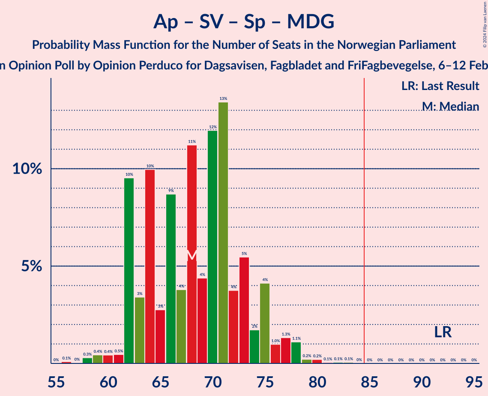

| Number of Seats | Probability | Accumulated | Special Marks |
|:---------------:|:-----------:|:-----------:|:-------------:|
| 56 | 0.1% | 100% |  |
| 57 | 0% | 99.9% |  |
| 58 | 0.3% | 99.9% |  |
| 59 | 0.4% | 99.6% |  |
| 60 | 0.4% | 99.1% |  |
| 61 | 0.5% | 98.7% |  |
| 62 | 10% | 98% |  |
| 63 | 3% | 89% |  |
| 64 | 10% | 85% |  |
| 65 | 3% | 75% | Median |
| 66 | 9% | 73% |  |
| 67 | 4% | 64% |  |
| 68 | 11% | 60% |  |
| 69 | 4% | 49% |  |
| 70 | 12% | 44% |  |
| 71 | 13% | 33% |  |
| 72 | 4% | 19% |  |
| 73 | 5% | 15% |  |
| 74 | 2% | 10% |  |
| 75 | 4% | 8% |  |
| 76 | 1.0% | 4% |  |
| 77 | 1.3% | 3% |  |
| 78 | 1.1% | 2% |  |
| 79 | 0.2% | 0.6% |  |
| 80 | 0.2% | 0.4% |  |
| 81 | 0.1% | 0.2% |  |
| 82 | 0.1% | 0.1% |  |
| 83 | 0.1% | 0.1% |  |
| 84 | 0% | 0% |  |
| 85 | 0% | 0% | Majority |
| 86 | 0% | 0% |  |
| 87 | 0% | 0% |  |
| 88 | 0% | 0% |  |
| 89 | 0% | 0% |  |
| 90 | 0% | 0% |  |
| 91 | 0% | 0% |  |
| 92 | 0% | 0% | Last Result |

### Høyre – Venstre – Kristelig Folkeparti

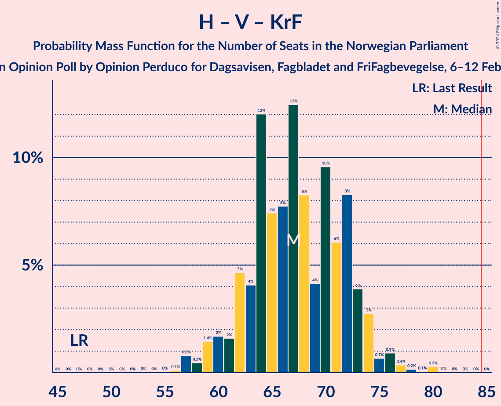

| Number of Seats | Probability | Accumulated | Special Marks |
|:---------------:|:-----------:|:-----------:|:-------------:|
| 47 | 0% | 100% | Last Result |
| 48 | 0% | 100% |  |
| 49 | 0% | 100% |  |
| 50 | 0% | 100% |  |
| 51 | 0% | 100% |  |
| 52 | 0% | 100% |  |
| 53 | 0% | 100% |  |
| 54 | 0% | 100% |  |
| 55 | 0% | 100% |  |
| 56 | 0.1% | 99.9% |  |
| 57 | 0.8% | 99.8% |  |
| 58 | 0.5% | 99.0% |  |
| 59 | 1.4% | 98.6% |  |
| 60 | 2% | 97% |  |
| 61 | 2% | 95% |  |
| 62 | 5% | 94% |  |
| 63 | 4% | 89% |  |
| 64 | 12% | 85% |  |
| 65 | 7% | 73% |  |
| 66 | 8% | 66% |  |
| 67 | 12% | 58% |  |
| 68 | 8% | 45% | Median |
| 69 | 4% | 37% |  |
| 70 | 10% | 33% |  |
| 71 | 6% | 23% |  |
| 72 | 8% | 17% |  |
| 73 | 4% | 9% |  |
| 74 | 3% | 5% |  |
| 75 | 0.7% | 2% |  |
| 76 | 0.9% | 2% |  |
| 77 | 0.4% | 0.9% |  |
| 78 | 0.2% | 0.5% |  |
| 79 | 0.1% | 0.4% |  |
| 80 | 0.3% | 0.3% |  |
| 81 | 0% | 0% |  |

### Arbeiderpartiet – Sosialistisk Venstreparti – Senterpartiet

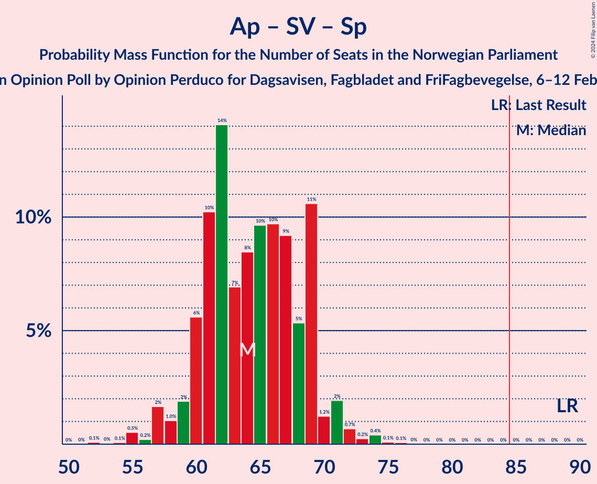

| Number of Seats | Probability | Accumulated | Special Marks |
|:---------------:|:-----------:|:-----------:|:-------------:|
| 52 | 0.1% | 100% |  |
| 53 | 0% | 99.9% |  |
| 54 | 0.1% | 99.9% |  |
| 55 | 0.5% | 99.8% |  |
| 56 | 0.2% | 99.3% |  |
| 57 | 2% | 99.1% |  |
| 58 | 1.0% | 97% |  |
| 59 | 2% | 96% |  |
| 60 | 6% | 94% |  |
| 61 | 10% | 89% |  |
| 62 | 14% | 79% |  |
| 63 | 7% | 65% | Median |
| 64 | 8% | 58% |  |
| 65 | 10% | 49% |  |
| 66 | 10% | 40% |  |
| 67 | 9% | 30% |  |
| 68 | 5% | 21% |  |
| 69 | 11% | 15% |  |
| 70 | 1.2% | 5% |  |
| 71 | 2% | 3% |  |
| 72 | 0.7% | 2% |  |
| 73 | 0.2% | 0.8% |  |
| 74 | 0.4% | 0.6% |  |
| 75 | 0.1% | 0.2% |  |
| 76 | 0.1% | 0.1% |  |
| 77 | 0% | 0% |  |
| 78 | 0% | 0% |  |
| 79 | 0% | 0% |  |
| 80 | 0% | 0% |  |
| 81 | 0% | 0% |  |
| 82 | 0% | 0% |  |
| 83 | 0% | 0% |  |
| 84 | 0% | 0% |  |
| 85 | 0% | 0% | Majority |
| 86 | 0% | 0% |  |
| 87 | 0% | 0% |  |
| 88 | 0% | 0% |  |
| 89 | 0% | 0% | Last Result |

### Arbeiderpartiet – Sosialistisk Venstreparti – Rødt – Miljøpartiet De Grønne

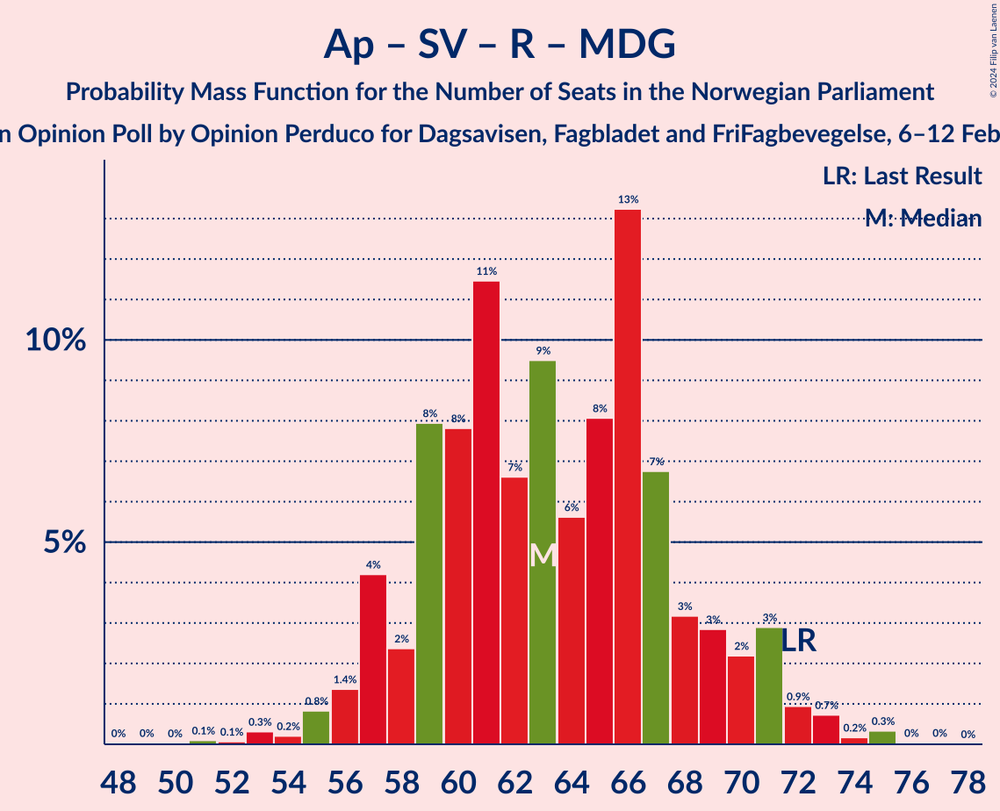

| Number of Seats | Probability | Accumulated | Special Marks |
|:---------------:|:-----------:|:-----------:|:-------------:|
| 49 | 0% | 100% |  |
| 50 | 0% | 99.9% |  |
| 51 | 0.1% | 99.9% |  |
| 52 | 0.1% | 99.8% |  |
| 53 | 0.3% | 99.7% |  |
| 54 | 0.2% | 99.4% |  |
| 55 | 0.8% | 99.2% |  |
| 56 | 1.4% | 98% |  |
| 57 | 4% | 97% |  |
| 58 | 2% | 93% |  |
| 59 | 8% | 90% |  |
| 60 | 8% | 82% |  |
| 61 | 11% | 75% | Median |
| 62 | 7% | 63% |  |
| 63 | 9% | 57% |  |
| 64 | 6% | 47% |  |
| 65 | 8% | 41% |  |
| 66 | 13% | 33% |  |
| 67 | 7% | 20% |  |
| 68 | 3% | 13% |  |
| 69 | 3% | 10% |  |
| 70 | 2% | 7% |  |
| 71 | 3% | 5% |  |
| 72 | 0.9% | 2% | Last Result |
| 73 | 0.7% | 1.3% |  |
| 74 | 0.2% | 0.6% |  |
| 75 | 0.3% | 0.4% |  |
| 76 | 0% | 0.1% |  |
| 77 | 0% | 0.1% |  |
| 78 | 0% | 0% |  |

### Arbeiderpartiet – Senterpartiet – Kristelig Folkeparti – Miljøpartiet De Grønne

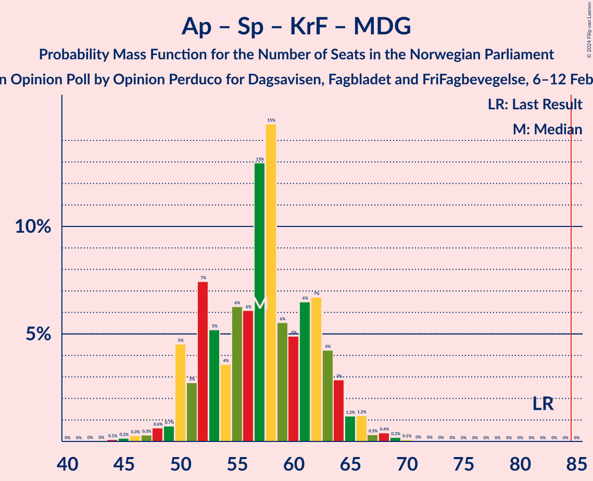

| Number of Seats | Probability | Accumulated | Special Marks |
|:---------------:|:-----------:|:-----------:|:-------------:|
| 44 | 0.1% | 100% |  |
| 45 | 0.2% | 99.9% |  |
| 46 | 0.3% | 99.7% |  |
| 47 | 0.3% | 99.5% |  |
| 48 | 0.6% | 99.1% |  |
| 49 | 0.7% | 98.5% |  |
| 50 | 5% | 98% |  |
| 51 | 3% | 93% |  |
| 52 | 7% | 91% |  |
| 53 | 5% | 83% |  |
| 54 | 4% | 78% |  |
| 55 | 6% | 74% | Median |
| 56 | 6% | 68% |  |
| 57 | 13% | 62% |  |
| 58 | 15% | 49% |  |
| 59 | 6% | 34% |  |
| 60 | 5% | 29% |  |
| 61 | 6% | 24% |  |
| 62 | 7% | 17% |  |
| 63 | 4% | 11% |  |
| 64 | 3% | 6% |  |
| 65 | 1.2% | 3% |  |
| 66 | 1.2% | 2% |  |
| 67 | 0.3% | 1.1% |  |
| 68 | 0.4% | 0.7% |  |
| 69 | 0.2% | 0.3% |  |
| 70 | 0.1% | 0.2% |  |
| 71 | 0% | 0.1% |  |
| 72 | 0% | 0% |  |
| 73 | 0% | 0% |  |
| 74 | 0% | 0% |  |
| 75 | 0% | 0% |  |
| 76 | 0% | 0% |  |
| 77 | 0% | 0% |  |
| 78 | 0% | 0% |  |
| 79 | 0% | 0% |  |
| 80 | 0% | 0% |  |
| 81 | 0% | 0% |  |
| 82 | 0% | 0% | Last Result |

### Arbeiderpartiet – Senterpartiet – Kristelig Folkeparti

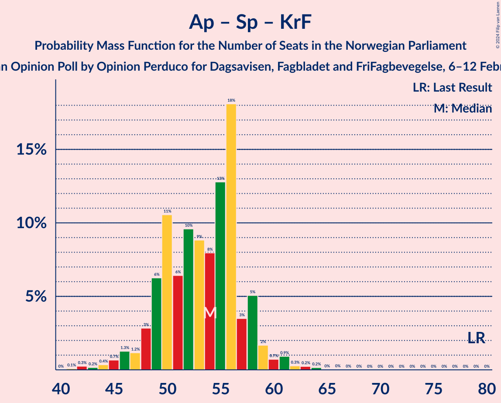

| Number of Seats | Probability | Accumulated | Special Marks |
|:---------------:|:-----------:|:-----------:|:-------------:|
| 41 | 0.1% | 100% |  |
| 42 | 0.3% | 99.9% |  |
| 43 | 0.2% | 99.6% |  |
| 44 | 0.4% | 99.5% |  |
| 45 | 0.7% | 99.1% |  |
| 46 | 1.3% | 98% |  |
| 47 | 1.2% | 97% |  |
| 48 | 3% | 96% |  |
| 49 | 6% | 93% |  |
| 50 | 11% | 87% |  |
| 51 | 6% | 76% |  |
| 52 | 10% | 70% |  |
| 53 | 9% | 60% | Median |
| 54 | 8% | 51% |  |
| 55 | 13% | 44% |  |
| 56 | 18% | 31% |  |
| 57 | 3% | 13% |  |
| 58 | 5% | 9% |  |
| 59 | 2% | 4% |  |
| 60 | 0.7% | 2% |  |
| 61 | 0.9% | 2% |  |
| 62 | 0.3% | 0.7% |  |
| 63 | 0.2% | 0.5% |  |
| 64 | 0.2% | 0.2% |  |
| 65 | 0% | 0.1% |  |
| 66 | 0% | 0% |  |
| 67 | 0% | 0% |  |
| 68 | 0% | 0% |  |
| 69 | 0% | 0% |  |
| 70 | 0% | 0% |  |
| 71 | 0% | 0% |  |
| 72 | 0% | 0% |  |
| 73 | 0% | 0% |  |
| 74 | 0% | 0% |  |
| 75 | 0% | 0% |  |
| 76 | 0% | 0% |  |
| 77 | 0% | 0% |  |
| 78 | 0% | 0% |  |
| 79 | 0% | 0% | Last Result |

### Arbeiderpartiet – Sosialistisk Venstreparti

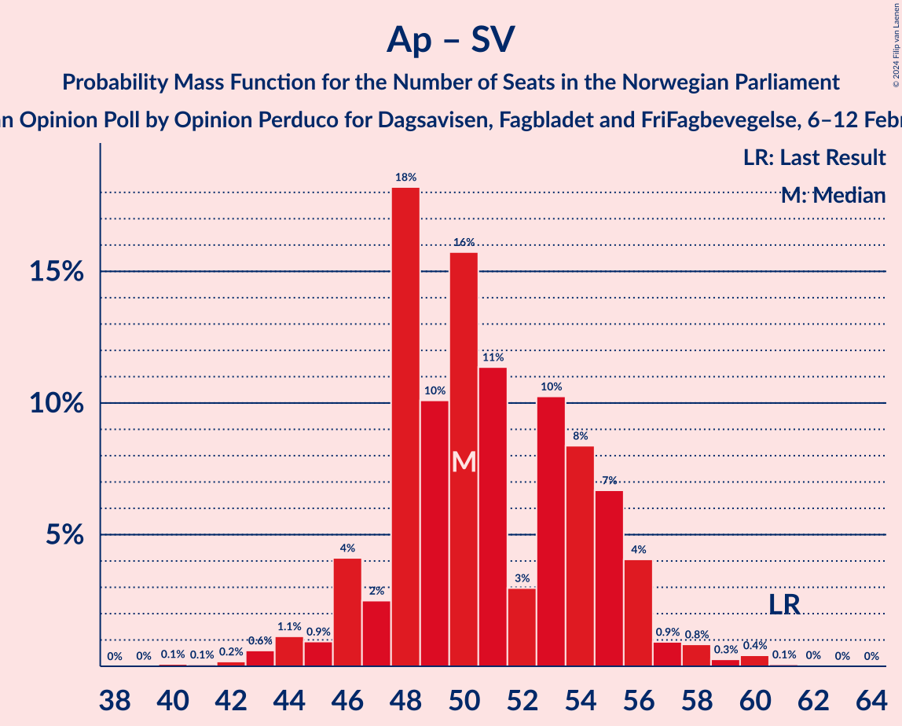

| Number of Seats | Probability | Accumulated | Special Marks |
|:---------------:|:-----------:|:-----------:|:-------------:|
| 40 | 0.1% | 100% |  |
| 41 | 0.1% | 99.9% |  |
| 42 | 0.2% | 99.8% |  |
| 43 | 0.6% | 99.6% |  |
| 44 | 1.1% | 99.0% |  |
| 45 | 0.9% | 98% |  |
| 46 | 4% | 97% |  |
| 47 | 2% | 93% |  |
| 48 | 18% | 90% |  |
| 49 | 10% | 72% |  |
| 50 | 16% | 62% | Median |
| 51 | 11% | 46% |  |
| 52 | 3% | 35% |  |
| 53 | 10% | 32% |  |
| 54 | 8% | 22% |  |
| 55 | 7% | 13% |  |
| 56 | 4% | 7% |  |
| 57 | 0.9% | 3% |  |
| 58 | 0.8% | 2% |  |
| 59 | 0.3% | 0.8% |  |
| 60 | 0.4% | 0.6% |  |
| 61 | 0.1% | 0.1% | Last Result |
| 62 | 0% | 0.1% |  |
| 63 | 0% | 0% |  |

### Arbeiderpartiet – Senterpartiet

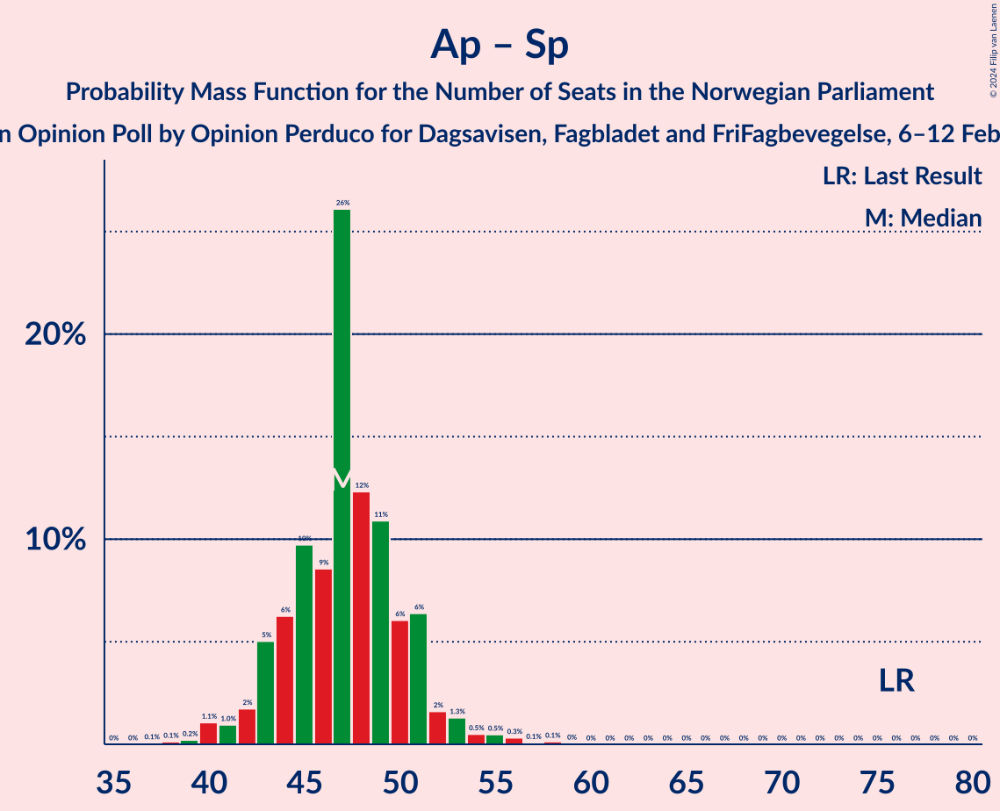

| Number of Seats | Probability | Accumulated | Special Marks |
|:---------------:|:-----------:|:-----------:|:-------------:|
| 37 | 0.1% | 100% |  |
| 38 | 0.1% | 99.9% |  |
| 39 | 0.2% | 99.8% |  |
| 40 | 1.1% | 99.6% |  |
| 41 | 1.0% | 98.5% |  |
| 42 | 2% | 98% |  |
| 43 | 5% | 96% |  |
| 44 | 6% | 91% |  |
| 45 | 10% | 85% |  |
| 46 | 9% | 75% | Median |
| 47 | 26% | 66% |  |
| 48 | 12% | 40% |  |
| 49 | 11% | 28% |  |
| 50 | 6% | 17% |  |
| 51 | 6% | 11% |  |
| 52 | 2% | 4% |  |
| 53 | 1.3% | 3% |  |
| 54 | 0.5% | 2% |  |
| 55 | 0.5% | 1.1% |  |
| 56 | 0.3% | 0.6% |  |
| 57 | 0.1% | 0.3% |  |
| 58 | 0.1% | 0.2% |  |
| 59 | 0% | 0% |  |
| 60 | 0% | 0% |  |
| 61 | 0% | 0% |  |
| 62 | 0% | 0% |  |
| 63 | 0% | 0% |  |
| 64 | 0% | 0% |  |
| 65 | 0% | 0% |  |
| 66 | 0% | 0% |  |
| 67 | 0% | 0% |  |
| 68 | 0% | 0% |  |
| 69 | 0% | 0% |  |
| 70 | 0% | 0% |  |
| 71 | 0% | 0% |  |
| 72 | 0% | 0% |  |
| 73 | 0% | 0% |  |
| 74 | 0% | 0% |  |
| 75 | 0% | 0% |  |
| 76 | 0% | 0% | Last Result |

### Senterpartiet – Venstre – Kristelig Folkeparti

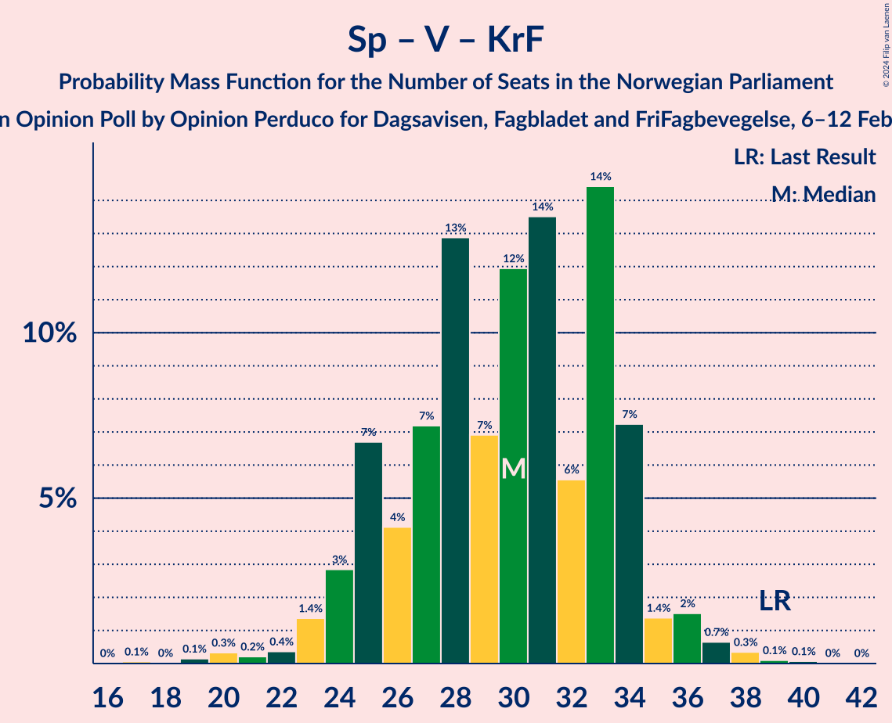

| Number of Seats | Probability | Accumulated | Special Marks |
|:---------------:|:-----------:|:-----------:|:-------------:|
| 17 | 0.1% | 100% |  |
| 18 | 0% | 99.9% |  |
| 19 | 0.1% | 99.9% |  |
| 20 | 0.3% | 99.8% |  |
| 21 | 0.2% | 99.4% |  |
| 22 | 0.4% | 99.2% |  |
| 23 | 1.4% | 98.8% |  |
| 24 | 3% | 97% |  |
| 25 | 7% | 95% |  |
| 26 | 4% | 88% |  |
| 27 | 7% | 84% |  |
| 28 | 13% | 77% |  |
| 29 | 7% | 64% |  |
| 30 | 12% | 57% | Median |
| 31 | 14% | 45% |  |
| 32 | 6% | 31% |  |
| 33 | 14% | 26% |  |
| 34 | 7% | 11% |  |
| 35 | 1.4% | 4% |  |
| 36 | 2% | 3% |  |
| 37 | 0.7% | 1.2% |  |
| 38 | 0.3% | 0.6% |  |
| 39 | 0.1% | 0.2% | Last Result |
| 40 | 0.1% | 0.1% |  |
| 41 | 0% | 0% |  |

## Technical Information

### Opinion Poll

+ **Polling firm:** Opinion Perduco
+ **Commissioner(s):** Dagsavisen, Fagbladet and FriFagbevegelse
+ **Fieldwork period:** 6–12 February 2024

### Calculations

+ **Sample size:** 690
+ **Simulations done:** 1,048,576
+ **Error estimate:** 3.61%

