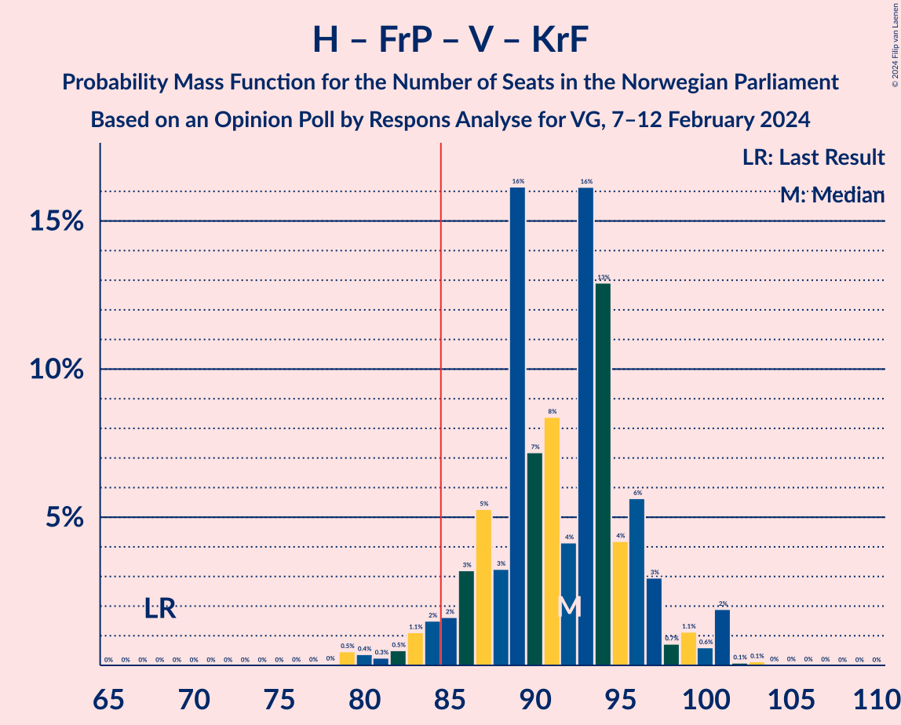

# Opinion Poll by Respons Analyse for VG, 7–12 February 2024

<a href="#voting-intentions">Voting Intentions</a> | <a href="#seats">Seats</a> | <a href="#coalitions">Coalitions</a> | <a href="#technical-information">Technical Information</a>

## Voting Intentions

### Confidence Intervals

| Party | Last Result | Poll Result | 80% Confidence Interval | 90% Confidence Interval | 95% Confidence Interval | 99% Confidence Interval |
|:-----:|:-----------:|:-----------:|:-----------------------:|:-----------------------:|:-----------------------:|:-----------------------:|
| Høyre | 20.4% | 27.4% | 25.6–29.2% |25.1–29.8% |24.7–30.2% |23.9–31.1% |
| Arbeiderpartiet | 26.2% | 19.1% | 17.6–20.8% |17.1–21.2% |16.8–21.6% |16.0–22.5% |
| Fremskrittspartiet | 11.6% | 14.7% | 13.3–16.2% |13.0–16.6% |12.6–17.0% |12.0–17.8% |
| Sosialistisk Venstreparti | 7.6% | 11.0% | 9.8–12.4% |9.5–12.7% |9.2–13.1% |8.7–13.8% |
| Venstre | 4.6% | 5.8% | 4.9–6.9% |4.7–7.2% |4.5–7.4% |4.1–8.0% |
| Senterpartiet | 13.5% | 5.1% | 4.3–6.1% |4.1–6.4% |3.9–6.6% |3.6–7.2% |
| Rødt | 4.7% | 4.8% | 4.0–5.8% |3.8–6.1% |3.6–6.3% |3.3–6.8% |
| Kristelig Folkeparti | 3.8% | 4.1% | 3.4–5.0% |3.2–5.3% |3.0–5.5% |2.7–6.0% |
| Miljøpartiet De Grønne | 3.9% | 3.7% | 3.0–4.6% |2.9–4.8% |2.7–5.1% |2.4–5.5% |
| Industri- og Næringspartiet | 0.3% | 2.9% | 2.3–3.7% |2.1–3.9% |2.0–4.1% |1.8–4.6% |

*Note:* The poll result column reflects the actual value used in the calculations. Published results may vary slightly, and in addition be rounded to fewer digits.

## Seats

### Confidence Intervals

| Party | Last Result | Median | 80% Confidence Interval | 90% Confidence Interval | 95% Confidence Interval | 99% Confidence Interval |
|:-----:|:-----------:|:------:|:-----------------------:|:-----------------------:|:-----------------------:|:-----------------------:|
| <a href="#høyre">Høyre</a> | 36 | 49 | 44–52 |44–53 |43–54 |41–55 |
| <a href="#arbeiderpartiet">Arbeiderpartiet</a> | 48 | 37 | 33–40 |32–42 |31–42 |31–43 |
| <a href="#fremskrittspartiet">Fremskrittspartiet</a> | 21 | 27 | 23–31 |22–32 |22–33 |20–34 |
| <a href="#sosialistisk-venstreparti">Sosialistisk Venstreparti</a> | 13 | 19 | 16–21 |15–22 |15–23 |14–24 |
| <a href="#venstre">Venstre</a> | 8 | 10 | 8–12 |8–13 |7–13 |6–14 |
| <a href="#senterpartiet">Senterpartiet</a> | 28 | 9 | 7–11 |6–12 |1–12 |1–13 |
| <a href="#rødt">Rødt</a> | 8 | 8 | 6–10 |1–10 |1–11 |1–12 |
| <a href="#kristelig-folkeparti">Kristelig Folkeparti</a> | 3 | 7 | 2–8 |2–9 |2–9 |2–10 |
| <a href="#miljøpartiet-de-grønne">Miljøpartiet De Grønne</a> | 3 | 2 | 1–7 |1–8 |1–8 |1–9 |
| <a href="#industri--og-næringspartiet">Industri- og Næringspartiet</a> | 0 | 2 | 0–3 |0–3 |0–7 |0–8 |

### Høyre

*For a full overview of the results for this party, see the [Høyre](party-høyre.html) page.*

| Number of Seats | Probability | Accumulated | Special Marks |
|:---------------:|:-----------:|:-----------:|:-------------:|
| 36 | 0% | 100% | Last Result |
| 37 | 0% | 100% |  |
| 38 | 0% | 100% |  |
| 39 | 0% | 100% |  |
| 40 | 0.4% | 100% |  |
| 41 | 0.6% | 99.6% |  |
| 42 | 0.7% | 99.0% |  |
| 43 | 2% | 98% |  |
| 44 | 10% | 96% |  |
| 45 | 3% | 85% |  |
| 46 | 6% | 83% |  |
| 47 | 5% | 77% |  |
| 48 | 9% | 71% |  |
| 49 | 29% | 63% | Median |
| 50 | 12% | 34% |  |
| 51 | 9% | 21% |  |
| 52 | 5% | 12% |  |
| 53 | 3% | 7% |  |
| 54 | 2% | 4% |  |
| 55 | 1.4% | 2% |  |
| 56 | 0.1% | 0.4% |  |
| 57 | 0.1% | 0.3% |  |
| 58 | 0.2% | 0.2% |  |
| 59 | 0% | 0% |  |

### Arbeiderpartiet

*For a full overview of the results for this party, see the [Arbeiderpartiet](party-arbeiderpartiet.html) page.*

| Number of Seats | Probability | Accumulated | Special Marks |
|:---------------:|:-----------:|:-----------:|:-------------:|
| 29 | 0.1% | 100% |  |
| 30 | 0.1% | 99.9% |  |
| 31 | 3% | 99.8% |  |
| 32 | 5% | 97% |  |
| 33 | 9% | 92% |  |
| 34 | 6% | 83% |  |
| 35 | 14% | 77% |  |
| 36 | 10% | 63% |  |
| 37 | 19% | 53% | Median |
| 38 | 15% | 34% |  |
| 39 | 8% | 20% |  |
| 40 | 5% | 12% |  |
| 41 | 1.0% | 7% |  |
| 42 | 5% | 6% |  |
| 43 | 0.6% | 1.0% |  |
| 44 | 0.3% | 0.4% |  |
| 45 | 0.1% | 0.1% |  |
| 46 | 0% | 0.1% |  |
| 47 | 0% | 0% |  |
| 48 | 0% | 0% | Last Result |

### Fremskrittspartiet

*For a full overview of the results for this party, see the [Fremskrittspartiet](party-fremskrittspartiet.html) page.*

| Number of Seats | Probability | Accumulated | Special Marks |
|:---------------:|:-----------:|:-----------:|:-------------:|
| 19 | 0.1% | 100% |  |
| 20 | 0.5% | 99.9% |  |
| 21 | 0.4% | 99.4% | Last Result |
| 22 | 4% | 99.0% |  |
| 23 | 5% | 95% |  |
| 24 | 11% | 90% |  |
| 25 | 10% | 79% |  |
| 26 | 14% | 69% |  |
| 27 | 6% | 55% | Median |
| 28 | 16% | 49% |  |
| 29 | 8% | 33% |  |
| 30 | 9% | 25% |  |
| 31 | 8% | 16% |  |
| 32 | 6% | 8% |  |
| 33 | 0.8% | 3% |  |
| 34 | 1.3% | 2% |  |
| 35 | 0.3% | 0.4% |  |
| 36 | 0.1% | 0.1% |  |
| 37 | 0% | 0% |  |

### Sosialistisk Venstreparti

*For a full overview of the results for this party, see the [Sosialistisk Venstreparti](party-sosialistiskvenstreparti.html) page.*

| Number of Seats | Probability | Accumulated | Special Marks |
|:---------------:|:-----------:|:-----------:|:-------------:|
| 13 | 0.2% | 100% | Last Result |
| 14 | 2% | 99.8% |  |
| 15 | 7% | 98% |  |
| 16 | 4% | 91% |  |
| 17 | 22% | 87% |  |
| 18 | 14% | 66% |  |
| 19 | 13% | 51% | Median |
| 20 | 22% | 39% |  |
| 21 | 9% | 17% |  |
| 22 | 5% | 8% |  |
| 23 | 2% | 3% |  |
| 24 | 0.8% | 1.2% |  |
| 25 | 0.3% | 0.4% |  |
| 26 | 0.1% | 0.2% |  |
| 27 | 0% | 0.1% |  |
| 28 | 0% | 0% |  |

### Venstre

*For a full overview of the results for this party, see the [Venstre](party-venstre.html) page.*

| Number of Seats | Probability | Accumulated | Special Marks |
|:---------------:|:-----------:|:-----------:|:-------------:|
| 3 | 0.3% | 100% |  |
| 4 | 0% | 99.6% |  |
| 5 | 0% | 99.6% |  |
| 6 | 0.2% | 99.6% |  |
| 7 | 4% | 99.4% |  |
| 8 | 11% | 96% | Last Result |
| 9 | 27% | 85% |  |
| 10 | 25% | 58% | Median |
| 11 | 14% | 33% |  |
| 12 | 14% | 19% |  |
| 13 | 4% | 5% |  |
| 14 | 1.0% | 1.1% |  |
| 15 | 0% | 0.1% |  |
| 16 | 0% | 0% |  |

### Senterpartiet

*For a full overview of the results for this party, see the [Senterpartiet](party-senterpartiet.html) page.*

| Number of Seats | Probability | Accumulated | Special Marks |
|:---------------:|:-----------:|:-----------:|:-------------:|
| 0 | 0.3% | 100% |  |
| 1 | 3% | 99.7% |  |
| 2 | 1.4% | 97% |  |
| 3 | 0% | 95% |  |
| 4 | 0% | 95% |  |
| 5 | 0% | 95% |  |
| 6 | 0.5% | 95% |  |
| 7 | 9% | 95% |  |
| 8 | 34% | 85% |  |
| 9 | 28% | 51% | Median |
| 10 | 13% | 24% |  |
| 11 | 5% | 11% |  |
| 12 | 3% | 6% |  |
| 13 | 2% | 2% |  |
| 14 | 0.1% | 0.2% |  |
| 15 | 0% | 0.1% |  |
| 16 | 0% | 0% |  |
| 17 | 0% | 0% |  |
| 18 | 0% | 0% |  |
| 19 | 0% | 0% |  |
| 20 | 0% | 0% |  |
| 21 | 0% | 0% |  |
| 22 | 0% | 0% |  |
| 23 | 0% | 0% |  |
| 24 | 0% | 0% |  |
| 25 | 0% | 0% |  |
| 26 | 0% | 0% |  |
| 27 | 0% | 0% |  |
| 28 | 0% | 0% | Last Result |

### Rødt

*For a full overview of the results for this party, see the [Rødt](party-rødt.html) page.*

| Number of Seats | Probability | Accumulated | Special Marks |
|:---------------:|:-----------:|:-----------:|:-------------:|
| 1 | 9% | 100% |  |
| 2 | 0% | 91% |  |
| 3 | 0% | 91% |  |
| 4 | 0% | 91% |  |
| 5 | 0% | 91% |  |
| 6 | 4% | 91% |  |
| 7 | 13% | 87% |  |
| 8 | 35% | 74% | Last Result, Median |
| 9 | 27% | 39% |  |
| 10 | 8% | 13% |  |
| 11 | 4% | 5% |  |
| 12 | 0.6% | 0.7% |  |
| 13 | 0.1% | 0.1% |  |
| 14 | 0% | 0% |  |

### Kristelig Folkeparti

*For a full overview of the results for this party, see the [Kristelig Folkeparti](party-kristeligfolkeparti.html) page.*

| Number of Seats | Probability | Accumulated | Special Marks |
|:---------------:|:-----------:|:-----------:|:-------------:|
| 1 | 0.1% | 100% |  |
| 2 | 18% | 99.9% |  |
| 3 | 16% | 82% | Last Result |
| 4 | 0% | 65% |  |
| 5 | 0% | 65% |  |
| 6 | 4% | 65% |  |
| 7 | 36% | 62% | Median |
| 8 | 18% | 26% |  |
| 9 | 6% | 8% |  |
| 10 | 2% | 2% |  |
| 11 | 0.1% | 0.1% |  |
| 12 | 0% | 0% |  |

### Miljøpartiet De Grønne

*For a full overview of the results for this party, see the [Miljøpartiet De Grønne](party-miljøpartietdegrønne.html) page.*

| Number of Seats | Probability | Accumulated | Special Marks |
|:---------------:|:-----------:|:-----------:|:-------------:|
| 1 | 12% | 100% |  |
| 2 | 52% | 88% | Median |
| 3 | 7% | 35% | Last Result |
| 4 | 0% | 28% |  |
| 5 | 0% | 28% |  |
| 6 | 3% | 28% |  |
| 7 | 17% | 25% |  |
| 8 | 7% | 8% |  |
| 9 | 1.3% | 2% |  |
| 10 | 0.2% | 0.3% |  |
| 11 | 0% | 0% |  |

### Industri- og Næringspartiet

*For a full overview of the results for this party, see the [Industri- og Næringspartiet](party-industri-ognæringspartiet.html) page.*

| Number of Seats | Probability | Accumulated | Special Marks |
|:---------------:|:-----------:|:-----------:|:-------------:|
| 0 | 26% | 100% | Last Result |
| 1 | 4% | 74% |  |
| 2 | 51% | 70% | Median |
| 3 | 15% | 19% |  |
| 4 | 0% | 4% |  |
| 5 | 0% | 4% |  |
| 6 | 0.8% | 4% |  |
| 7 | 3% | 3% |  |
| 8 | 0.5% | 0.5% |  |
| 9 | 0% | 0% |  |

## Coalitions

### Confidence Intervals

| Coalition | Last Result | Median | Majority? | 80% Confidence Interval | 90% Confidence Interval | 95% Confidence Interval | 99% Confidence Interval |
|:---------:|:-----------:|:------:|:---------:|:-----------------------:|:-----------------------:|:-----------------------:|:-----------------------:|
| Høyre – Fremskrittspartiet – Venstre – Senterpartiet – Kristelig Folkeparti | 96 | 101 | 100% | 95–105 | 94–107 | 92–108 | 88–109 |
| Høyre – Fremskrittspartiet – Venstre – Kristelig Folkeparti – Miljøpartiet De Grønne | 71 | 95 | 99.7% | 91–100 | 89–102 | 87–103 | 86–107 |
| Høyre – Fremskrittspartiet – Venstre – Kristelig Folkeparti | 68 | 92 | 96% | 87–96 | 85–97 | 83–100 | 79–101 |
| Høyre – Fremskrittspartiet – Venstre | 65 | 86 | 60% | 81–92 | 80–93 | 78–93 | 76–95 |
| Høyre – Fremskrittspartiet | 57 | 76 | 0.3% | 70–81 | 70–82 | 68–83 | 66–84 |
| Arbeiderpartiet – Sosialistisk Venstreparti – Senterpartiet – Rødt – Miljøpartiet De Grønne | 100 | 74 | 2% | 71–79 | 69–82 | 67–83 | 65–86 |
| Arbeiderpartiet – Sosialistisk Venstreparti – Senterpartiet – Kristelig Folkeparti – Miljøpartiet De Grønne | 95 | 73 | 0.1% | 68–78 | 65–79 | 64–81 | 64–83 |
| Arbeiderpartiet – Sosialistisk Venstreparti – Senterpartiet – Rødt | 97 | 71 | 0% | 66–76 | 65–77 | 63–79 | 59–81 |
| Arbeiderpartiet – Sosialistisk Venstreparti – Senterpartiet – Miljøpartiet De Grønne | 92 | 66 | 0% | 62–72 | 61–74 | 60–75 | 57–78 |
| Arbeiderpartiet – Sosialistisk Venstreparti – Rødt – Miljøpartiet De Grønne | 72 | 66 | 0% | 62–71 | 60–73 | 59–74 | 57–77 |
| Høyre – Venstre – Kristelig Folkeparti | 47 | 65 | 0% | 60–68 | 58–70 | 57–71 | 55–73 |
| Arbeiderpartiet – Sosialistisk Venstreparti – Senterpartiet | 89 | 63 | 0% | 59–69 | 57–69 | 56–71 | 52–73 |
| Arbeiderpartiet – Senterpartiet – Kristelig Folkeparti – Miljøpartiet De Grønne | 82 | 54 | 0% | 48–60 | 46–61 | 46–63 | 44–64 |
| Arbeiderpartiet – Sosialistisk Venstreparti | 61 | 55 | 0% | 51–59 | 50–60 | 49–61 | 48–64 |
| Arbeiderpartiet – Senterpartiet – Kristelig Folkeparti | 79 | 52 | 0% | 45–56 | 44–57 | 43–58 | 41–60 |
| Arbeiderpartiet – Senterpartiet | 76 | 45 | 0% | 41–49 | 40–51 | 39–51 | 35–52 |
| Venstre – Senterpartiet – Kristelig Folkeparti | 39 | 24 | 0% | 20–28 | 19–29 | 17–30 | 15–31 |

### Høyre – Fremskrittspartiet – Venstre – Senterpartiet – Kristelig Folkeparti

| Number of Seats | Probability | Accumulated | Special Marks |
|:---------------:|:-----------:|:-----------:|:-------------:|
| 87 | 0.1% | 100% |  |
| 88 | 0.4% | 99.9% |  |
| 89 | 0.1% | 99.4% |  |
| 90 | 0.6% | 99.3% |  |
| 91 | 0.4% | 98.7% |  |
| 92 | 1.2% | 98% |  |
| 93 | 2% | 97% |  |
| 94 | 4% | 95% |  |
| 95 | 4% | 92% |  |
| 96 | 4% | 88% | Last Result |
| 97 | 5% | 84% |  |
| 98 | 18% | 79% |  |
| 99 | 3% | 61% |  |
| 100 | 7% | 58% |  |
| 101 | 19% | 50% |  |
| 102 | 7% | 31% | Median |
| 103 | 9% | 24% |  |
| 104 | 5% | 15% |  |
| 105 | 3% | 10% |  |
| 106 | 0.7% | 7% |  |
| 107 | 2% | 6% |  |
| 108 | 2% | 4% |  |
| 109 | 2% | 2% |  |
| 110 | 0.2% | 0.4% |  |
| 111 | 0.1% | 0.2% |  |
| 112 | 0.1% | 0.1% |  |
| 113 | 0% | 0% |  |

### Høyre – Fremskrittspartiet – Venstre – Kristelig Folkeparti – Miljøpartiet De Grønne

| Number of Seats | Probability | Accumulated | Special Marks |
|:---------------:|:-----------:|:-----------:|:-------------:|
| 71 | 0% | 100% | Last Result |
| 72 | 0% | 100% |  |
| 73 | 0% | 100% |  |
| 74 | 0% | 100% |  |
| 75 | 0% | 100% |  |
| 76 | 0% | 100% |  |
| 77 | 0% | 100% |  |
| 78 | 0% | 100% |  |
| 79 | 0% | 100% |  |
| 80 | 0% | 100% |  |
| 81 | 0% | 100% |  |
| 82 | 0% | 100% |  |
| 83 | 0% | 99.9% |  |
| 84 | 0.2% | 99.9% |  |
| 85 | 0.1% | 99.7% | Majority |
| 86 | 2% | 99.6% |  |
| 87 | 0.8% | 98% |  |
| 88 | 1.3% | 97% |  |
| 89 | 2% | 96% |  |
| 90 | 2% | 94% |  |
| 91 | 16% | 91% |  |
| 92 | 4% | 76% |  |
| 93 | 6% | 72% |  |
| 94 | 10% | 66% |  |
| 95 | 15% | 56% | Median |
| 96 | 11% | 41% |  |
| 97 | 7% | 30% |  |
| 98 | 7% | 23% |  |
| 99 | 5% | 17% |  |
| 100 | 3% | 12% |  |
| 101 | 3% | 9% |  |
| 102 | 2% | 6% |  |
| 103 | 2% | 4% |  |
| 104 | 0.4% | 1.4% |  |
| 105 | 0.3% | 1.0% |  |
| 106 | 0.1% | 0.7% |  |
| 107 | 0.1% | 0.6% |  |
| 108 | 0.5% | 0.5% |  |
| 109 | 0% | 0% |  |

### Høyre – Fremskrittspartiet – Venstre – Kristelig Folkeparti

| Number of Seats | Probability | Accumulated | Special Marks |
|:---------------:|:-----------:|:-----------:|:-------------:|
| 68 | 0% | 100% | Last Result |
| 69 | 0% | 100% |  |
| 70 | 0% | 100% |  |
| 71 | 0% | 100% |  |
| 72 | 0% | 100% |  |
| 73 | 0% | 100% |  |
| 74 | 0% | 100% |  |
| 75 | 0% | 100% |  |
| 76 | 0% | 100% |  |
| 77 | 0% | 100% |  |
| 78 | 0% | 100% |  |
| 79 | 0.5% | 99.9% |  |
| 80 | 0.4% | 99.5% |  |
| 81 | 0.3% | 99.1% |  |
| 82 | 0.5% | 98.8% |  |
| 83 | 1.1% | 98% |  |
| 84 | 2% | 97% |  |
| 85 | 2% | 96% | Majority |
| 86 | 3% | 94% |  |
| 87 | 5% | 91% |  |
| 88 | 3% | 86% |  |
| 89 | 16% | 82% |  |
| 90 | 7% | 66% |  |
| 91 | 8% | 59% |  |
| 92 | 4% | 51% |  |
| 93 | 16% | 46% | Median |
| 94 | 13% | 30% |  |
| 95 | 4% | 17% |  |
| 96 | 6% | 13% |  |
| 97 | 3% | 8% |  |
| 98 | 0.7% | 5% |  |
| 99 | 1.1% | 4% |  |
| 100 | 0.6% | 3% |  |
| 101 | 2% | 2% |  |
| 102 | 0.1% | 0.3% |  |
| 103 | 0.1% | 0.2% |  |
| 104 | 0% | 0.1% |  |
| 105 | 0% | 0.1% |  |
| 106 | 0% | 0% |  |

### Høyre – Fremskrittspartiet – Venstre

| Number of Seats | Probability | Accumulated | Special Marks |
|:---------------:|:-----------:|:-----------:|:-------------:|
| 65 | 0% | 100% | Last Result |
| 66 | 0% | 100% |  |
| 67 | 0% | 100% |  |
| 68 | 0% | 100% |  |
| 69 | 0% | 100% |  |
| 70 | 0% | 100% |  |
| 71 | 0% | 100% |  |
| 72 | 0% | 100% |  |
| 73 | 0% | 100% |  |
| 74 | 0.3% | 100% |  |
| 75 | 0.1% | 99.7% |  |
| 76 | 1.2% | 99.5% |  |
| 77 | 0.8% | 98% |  |
| 78 | 0.8% | 98% |  |
| 79 | 1.2% | 97% |  |
| 80 | 3% | 96% |  |
| 81 | 5% | 93% |  |
| 82 | 14% | 88% |  |
| 83 | 6% | 74% |  |
| 84 | 8% | 67% |  |
| 85 | 8% | 60% | Majority |
| 86 | 14% | 52% | Median |
| 87 | 6% | 38% |  |
| 88 | 6% | 32% |  |
| 89 | 8% | 26% |  |
| 90 | 2% | 18% |  |
| 91 | 4% | 16% |  |
| 92 | 5% | 12% |  |
| 93 | 5% | 7% |  |
| 94 | 0.9% | 1.4% |  |
| 95 | 0.2% | 0.5% |  |
| 96 | 0.1% | 0.3% |  |
| 97 | 0.1% | 0.2% |  |
| 98 | 0% | 0.1% |  |
| 99 | 0% | 0% |  |

### Høyre – Fremskrittspartiet

| Number of Seats | Probability | Accumulated | Special Marks |
|:---------------:|:-----------:|:-----------:|:-------------:|
| 57 | 0% | 100% | Last Result |
| 58 | 0% | 100% |  |
| 59 | 0% | 100% |  |
| 60 | 0% | 100% |  |
| 61 | 0% | 100% |  |
| 62 | 0% | 100% |  |
| 63 | 0.2% | 100% |  |
| 64 | 0% | 99.8% |  |
| 65 | 0.2% | 99.8% |  |
| 66 | 0.2% | 99.6% |  |
| 67 | 0.7% | 99.4% |  |
| 68 | 2% | 98.6% |  |
| 69 | 1.4% | 97% |  |
| 70 | 9% | 95% |  |
| 71 | 5% | 86% |  |
| 72 | 5% | 81% |  |
| 73 | 9% | 76% |  |
| 74 | 4% | 68% |  |
| 75 | 7% | 63% |  |
| 76 | 9% | 57% | Median |
| 77 | 16% | 48% |  |
| 78 | 5% | 31% |  |
| 79 | 7% | 26% |  |
| 80 | 4% | 19% |  |
| 81 | 5% | 15% |  |
| 82 | 6% | 9% |  |
| 83 | 2% | 3% |  |
| 84 | 0.7% | 1.0% |  |
| 85 | 0.1% | 0.3% | Majority |
| 86 | 0.1% | 0.2% |  |
| 87 | 0% | 0.1% |  |
| 88 | 0% | 0.1% |  |
| 89 | 0% | 0% |  |

### Arbeiderpartiet – Sosialistisk Venstreparti – Senterpartiet – Rødt – Miljøpartiet De Grønne

| Number of Seats | Probability | Accumulated | Special Marks |
|:---------------:|:-----------:|:-----------:|:-------------:|
| 62 | 0.1% | 100% |  |
| 63 | 0.2% | 99.9% |  |
| 64 | 0% | 99.7% |  |
| 65 | 1.4% | 99.7% |  |
| 66 | 0.6% | 98% |  |
| 67 | 2% | 98% |  |
| 68 | 0.5% | 96% |  |
| 69 | 2% | 95% |  |
| 70 | 2% | 93% |  |
| 71 | 8% | 92% |  |
| 72 | 12% | 84% |  |
| 73 | 13% | 72% |  |
| 74 | 12% | 59% |  |
| 75 | 9% | 47% | Median |
| 76 | 6% | 38% |  |
| 77 | 11% | 33% |  |
| 78 | 4% | 22% |  |
| 79 | 9% | 18% |  |
| 80 | 1.4% | 9% |  |
| 81 | 2% | 8% |  |
| 82 | 2% | 6% |  |
| 83 | 1.1% | 3% |  |
| 84 | 0.6% | 2% |  |
| 85 | 0.6% | 2% | Majority |
| 86 | 0.9% | 1.0% |  |
| 87 | 0% | 0.1% |  |
| 88 | 0.1% | 0.1% |  |
| 89 | 0% | 0% |  |
| 90 | 0% | 0% |  |
| 91 | 0% | 0% |  |
| 92 | 0% | 0% |  |
| 93 | 0% | 0% |  |
| 94 | 0% | 0% |  |
| 95 | 0% | 0% |  |
| 96 | 0% | 0% |  |
| 97 | 0% | 0% |  |
| 98 | 0% | 0% |  |
| 99 | 0% | 0% |  |
| 100 | 0% | 0% | Last Result |

### Arbeiderpartiet – Sosialistisk Venstreparti – Senterpartiet – Kristelig Folkeparti – Miljøpartiet De Grønne

| Number of Seats | Probability | Accumulated | Special Marks |
|:---------------:|:-----------:|:-----------:|:-------------:|
| 61 | 0% | 100% |  |
| 62 | 0.1% | 99.9% |  |
| 63 | 0.3% | 99.8% |  |
| 64 | 2% | 99.5% |  |
| 65 | 3% | 97% |  |
| 66 | 2% | 95% |  |
| 67 | 2% | 92% |  |
| 68 | 9% | 90% |  |
| 69 | 4% | 81% |  |
| 70 | 3% | 78% |  |
| 71 | 15% | 75% |  |
| 72 | 6% | 59% |  |
| 73 | 6% | 53% |  |
| 74 | 12% | 47% | Median |
| 75 | 7% | 35% |  |
| 76 | 11% | 28% |  |
| 77 | 2% | 16% |  |
| 78 | 8% | 14% |  |
| 79 | 2% | 6% |  |
| 80 | 2% | 5% |  |
| 81 | 1.2% | 3% |  |
| 82 | 0.3% | 2% |  |
| 83 | 0.9% | 1.3% |  |
| 84 | 0.2% | 0.3% |  |
| 85 | 0% | 0.1% | Majority |
| 86 | 0% | 0.1% |  |
| 87 | 0% | 0% |  |
| 88 | 0% | 0% |  |
| 89 | 0% | 0% |  |
| 90 | 0% | 0% |  |
| 91 | 0% | 0% |  |
| 92 | 0% | 0% |  |
| 93 | 0% | 0% |  |
| 94 | 0% | 0% |  |
| 95 | 0% | 0% | Last Result |

### Arbeiderpartiet – Sosialistisk Venstreparti – Senterpartiet – Rødt

| Number of Seats | Probability | Accumulated | Special Marks |
|:---------------:|:-----------:|:-----------:|:-------------:|
| 58 | 0.5% | 100% |  |
| 59 | 0.1% | 99.5% |  |
| 60 | 0.2% | 99.4% |  |
| 61 | 0.3% | 99.3% |  |
| 62 | 0.4% | 99.0% |  |
| 63 | 1.3% | 98.5% |  |
| 64 | 2% | 97% |  |
| 65 | 4% | 95% |  |
| 66 | 3% | 91% |  |
| 67 | 3% | 88% |  |
| 68 | 7% | 85% |  |
| 69 | 5% | 78% |  |
| 70 | 9% | 73% |  |
| 71 | 19% | 64% |  |
| 72 | 11% | 45% |  |
| 73 | 4% | 34% | Median |
| 74 | 6% | 30% |  |
| 75 | 11% | 23% |  |
| 76 | 2% | 12% |  |
| 77 | 6% | 10% |  |
| 78 | 1.2% | 4% |  |
| 79 | 1.4% | 3% |  |
| 80 | 0.5% | 2% |  |
| 81 | 0.8% | 1.1% |  |
| 82 | 0.2% | 0.2% |  |
| 83 | 0.1% | 0.1% |  |
| 84 | 0% | 0% |  |
| 85 | 0% | 0% | Majority |
| 86 | 0% | 0% |  |
| 87 | 0% | 0% |  |
| 88 | 0% | 0% |  |
| 89 | 0% | 0% |  |
| 90 | 0% | 0% |  |
| 91 | 0% | 0% |  |
| 92 | 0% | 0% |  |
| 93 | 0% | 0% |  |
| 94 | 0% | 0% |  |
| 95 | 0% | 0% |  |
| 96 | 0% | 0% |  |
| 97 | 0% | 0% | Last Result |

### Arbeiderpartiet – Sosialistisk Venstreparti – Senterpartiet – Miljøpartiet De Grønne

| Number of Seats | Probability | Accumulated | Special Marks |
|:---------------:|:-----------:|:-----------:|:-------------:|
| 54 | 0.1% | 100% |  |
| 55 | 0.1% | 99.9% |  |
| 56 | 0% | 99.8% |  |
| 57 | 0.5% | 99.8% |  |
| 58 | 0.9% | 99.3% |  |
| 59 | 0.6% | 98% |  |
| 60 | 2% | 98% |  |
| 61 | 1.4% | 95% |  |
| 62 | 5% | 94% |  |
| 63 | 3% | 89% |  |
| 64 | 18% | 86% |  |
| 65 | 7% | 68% |  |
| 66 | 11% | 61% |  |
| 67 | 8% | 50% | Median |
| 68 | 6% | 42% |  |
| 69 | 11% | 37% |  |
| 70 | 5% | 26% |  |
| 71 | 9% | 22% |  |
| 72 | 5% | 13% |  |
| 73 | 2% | 8% |  |
| 74 | 3% | 7% |  |
| 75 | 1.2% | 4% |  |
| 76 | 1.1% | 2% |  |
| 77 | 0.7% | 1.4% |  |
| 78 | 0.5% | 0.7% |  |
| 79 | 0.1% | 0.2% |  |
| 80 | 0% | 0.1% |  |
| 81 | 0% | 0% |  |
| 82 | 0% | 0% |  |
| 83 | 0% | 0% |  |
| 84 | 0% | 0% |  |
| 85 | 0% | 0% | Majority |
| 86 | 0% | 0% |  |
| 87 | 0% | 0% |  |
| 88 | 0% | 0% |  |
| 89 | 0% | 0% |  |
| 90 | 0% | 0% |  |
| 91 | 0% | 0% |  |
| 92 | 0% | 0% | Last Result |

### Arbeiderpartiet – Sosialistisk Venstreparti – Rødt – Miljøpartiet De Grønne

| Number of Seats | Probability | Accumulated | Special Marks |
|:---------------:|:-----------:|:-----------:|:-------------:|
| 55 | 0.1% | 100% |  |
| 56 | 0.1% | 99.8% |  |
| 57 | 2% | 99.7% |  |
| 58 | 0.3% | 98% |  |
| 59 | 1.3% | 98% |  |
| 60 | 2% | 96% |  |
| 61 | 3% | 95% |  |
| 62 | 4% | 92% |  |
| 63 | 10% | 88% |  |
| 64 | 9% | 78% |  |
| 65 | 19% | 70% |  |
| 66 | 7% | 50% | Median |
| 67 | 6% | 43% |  |
| 68 | 13% | 37% |  |
| 69 | 4% | 24% |  |
| 70 | 8% | 20% |  |
| 71 | 2% | 11% |  |
| 72 | 3% | 10% | Last Result |
| 73 | 3% | 6% |  |
| 74 | 2% | 4% |  |
| 75 | 0.3% | 2% |  |
| 76 | 1.0% | 2% |  |
| 77 | 0.5% | 0.7% |  |
| 78 | 0.1% | 0.2% |  |
| 79 | 0.1% | 0.1% |  |
| 80 | 0% | 0% |  |

### Høyre – Venstre – Kristelig Folkeparti

| Number of Seats | Probability | Accumulated | Special Marks |
|:---------------:|:-----------:|:-----------:|:-------------:|
| 47 | 0% | 100% | Last Result |
| 48 | 0% | 100% |  |
| 49 | 0% | 100% |  |
| 50 | 0% | 100% |  |
| 51 | 0.1% | 100% |  |
| 52 | 0% | 99.9% |  |
| 53 | 0.1% | 99.9% |  |
| 54 | 0.2% | 99.8% |  |
| 55 | 0.3% | 99.6% |  |
| 56 | 1.0% | 99.3% |  |
| 57 | 2% | 98% |  |
| 58 | 2% | 97% |  |
| 59 | 4% | 95% |  |
| 60 | 4% | 91% |  |
| 61 | 3% | 86% |  |
| 62 | 8% | 83% |  |
| 63 | 15% | 75% |  |
| 64 | 9% | 60% |  |
| 65 | 17% | 50% |  |
| 66 | 10% | 33% | Median |
| 67 | 8% | 24% |  |
| 68 | 8% | 16% |  |
| 69 | 2% | 8% |  |
| 70 | 3% | 6% |  |
| 71 | 2% | 3% |  |
| 72 | 0.5% | 1.1% |  |
| 73 | 0.3% | 0.6% |  |
| 74 | 0.1% | 0.3% |  |
| 75 | 0.2% | 0.2% |  |
| 76 | 0% | 0.1% |  |
| 77 | 0% | 0% |  |

### Arbeiderpartiet – Sosialistisk Venstreparti – Senterpartiet

| Number of Seats | Probability | Accumulated | Special Marks |
|:---------------:|:-----------:|:-----------:|:-------------:|
| 51 | 0.4% | 100% |  |
| 52 | 0.2% | 99.6% |  |
| 53 | 0.1% | 99.4% |  |
| 54 | 0.1% | 99.3% |  |
| 55 | 0.7% | 99.2% |  |
| 56 | 1.2% | 98% |  |
| 57 | 3% | 97% |  |
| 58 | 3% | 94% |  |
| 59 | 4% | 91% |  |
| 60 | 7% | 87% |  |
| 61 | 4% | 80% |  |
| 62 | 16% | 76% |  |
| 63 | 12% | 60% |  |
| 64 | 12% | 48% |  |
| 65 | 5% | 36% | Median |
| 66 | 7% | 31% |  |
| 67 | 9% | 24% |  |
| 68 | 3% | 15% |  |
| 69 | 7% | 12% |  |
| 70 | 0.9% | 4% |  |
| 71 | 2% | 4% |  |
| 72 | 1.3% | 2% |  |
| 73 | 0.2% | 0.5% |  |
| 74 | 0.1% | 0.3% |  |
| 75 | 0.2% | 0.2% |  |
| 76 | 0% | 0% |  |
| 77 | 0% | 0% |  |
| 78 | 0% | 0% |  |
| 79 | 0% | 0% |  |
| 80 | 0% | 0% |  |
| 81 | 0% | 0% |  |
| 82 | 0% | 0% |  |
| 83 | 0% | 0% |  |
| 84 | 0% | 0% |  |
| 85 | 0% | 0% | Majority |
| 86 | 0% | 0% |  |
| 87 | 0% | 0% |  |
| 88 | 0% | 0% |  |
| 89 | 0% | 0% | Last Result |

### Arbeiderpartiet – Senterpartiet – Kristelig Folkeparti – Miljøpartiet De Grønne

| Number of Seats | Probability | Accumulated | Special Marks |
|:---------------:|:-----------:|:-----------:|:-------------:|
| 39 | 0% | 100% |  |
| 40 | 0% | 99.9% |  |
| 41 | 0% | 99.9% |  |
| 42 | 0.2% | 99.9% |  |
| 43 | 0% | 99.7% |  |
| 44 | 0.8% | 99.7% |  |
| 45 | 0.4% | 98.9% |  |
| 46 | 4% | 98.5% |  |
| 47 | 3% | 95% |  |
| 48 | 5% | 92% |  |
| 49 | 4% | 87% |  |
| 50 | 3% | 83% |  |
| 51 | 5% | 81% |  |
| 52 | 8% | 76% |  |
| 53 | 3% | 68% |  |
| 54 | 25% | 65% |  |
| 55 | 2% | 40% | Median |
| 56 | 10% | 38% |  |
| 57 | 5% | 27% |  |
| 58 | 5% | 22% |  |
| 59 | 5% | 18% |  |
| 60 | 5% | 12% |  |
| 61 | 3% | 7% |  |
| 62 | 0.8% | 4% |  |
| 63 | 2% | 3% |  |
| 64 | 0.3% | 0.7% |  |
| 65 | 0.2% | 0.4% |  |
| 66 | 0.1% | 0.2% |  |
| 67 | 0.1% | 0.2% |  |
| 68 | 0% | 0% |  |
| 69 | 0% | 0% |  |
| 70 | 0% | 0% |  |
| 71 | 0% | 0% |  |
| 72 | 0% | 0% |  |
| 73 | 0% | 0% |  |
| 74 | 0% | 0% |  |
| 75 | 0% | 0% |  |
| 76 | 0% | 0% |  |
| 77 | 0% | 0% |  |
| 78 | 0% | 0% |  |
| 79 | 0% | 0% |  |
| 80 | 0% | 0% |  |
| 81 | 0% | 0% |  |
| 82 | 0% | 0% | Last Result |

### Arbeiderpartiet – Sosialistisk Venstreparti

| Number of Seats | Probability | Accumulated | Special Marks |
|:---------------:|:-----------:|:-----------:|:-------------:|
| 46 | 0.1% | 100% |  |
| 47 | 0.3% | 99.9% |  |
| 48 | 1.4% | 99.6% |  |
| 49 | 2% | 98% |  |
| 50 | 5% | 97% |  |
| 51 | 6% | 92% |  |
| 52 | 6% | 86% |  |
| 53 | 7% | 80% |  |
| 54 | 19% | 73% |  |
| 55 | 13% | 54% |  |
| 56 | 8% | 41% | Median |
| 57 | 9% | 33% |  |
| 58 | 11% | 24% |  |
| 59 | 4% | 13% |  |
| 60 | 6% | 9% |  |
| 61 | 2% | 3% | Last Result |
| 62 | 0.6% | 2% |  |
| 63 | 0.3% | 0.9% |  |
| 64 | 0.4% | 0.7% |  |
| 65 | 0.1% | 0.2% |  |
| 66 | 0.1% | 0.2% |  |
| 67 | 0.1% | 0.1% |  |
| 68 | 0% | 0% |  |

### Arbeiderpartiet – Senterpartiet – Kristelig Folkeparti

| Number of Seats | Probability | Accumulated | Special Marks |
|:---------------:|:-----------:|:-----------:|:-------------:|
| 36 | 0% | 100% |  |
| 37 | 0% | 99.9% |  |
| 38 | 0.2% | 99.9% |  |
| 39 | 0% | 99.7% |  |
| 40 | 0.1% | 99.7% |  |
| 41 | 0.3% | 99.6% |  |
| 42 | 1.2% | 99.3% |  |
| 43 | 3% | 98% |  |
| 44 | 3% | 95% |  |
| 45 | 3% | 92% |  |
| 46 | 7% | 89% |  |
| 47 | 6% | 81% |  |
| 48 | 4% | 76% |  |
| 49 | 5% | 72% |  |
| 50 | 10% | 66% |  |
| 51 | 5% | 57% |  |
| 52 | 19% | 52% |  |
| 53 | 8% | 33% | Median |
| 54 | 11% | 25% |  |
| 55 | 3% | 14% |  |
| 56 | 3% | 10% |  |
| 57 | 2% | 7% |  |
| 58 | 4% | 5% |  |
| 59 | 0.4% | 1.0% |  |
| 60 | 0.5% | 0.6% |  |
| 61 | 0.1% | 0.1% |  |
| 62 | 0.1% | 0.1% |  |
| 63 | 0% | 0% |  |
| 64 | 0% | 0% |  |
| 65 | 0% | 0% |  |
| 66 | 0% | 0% |  |
| 67 | 0% | 0% |  |
| 68 | 0% | 0% |  |
| 69 | 0% | 0% |  |
| 70 | 0% | 0% |  |
| 71 | 0% | 0% |  |
| 72 | 0% | 0% |  |
| 73 | 0% | 0% |  |
| 74 | 0% | 0% |  |
| 75 | 0% | 0% |  |
| 76 | 0% | 0% |  |
| 77 | 0% | 0% |  |
| 78 | 0% | 0% |  |
| 79 | 0% | 0% | Last Result |

### Arbeiderpartiet – Senterpartiet

| Number of Seats | Probability | Accumulated | Special Marks |
|:---------------:|:-----------:|:-----------:|:-------------:|
| 33 | 0.1% | 100% |  |
| 34 | 0.1% | 99.9% |  |
| 35 | 0.6% | 99.7% |  |
| 36 | 0.5% | 99.2% |  |
| 37 | 0.3% | 98.7% |  |
| 38 | 0.7% | 98% |  |
| 39 | 2% | 98% |  |
| 40 | 5% | 95% |  |
| 41 | 6% | 91% |  |
| 42 | 6% | 84% |  |
| 43 | 6% | 79% |  |
| 44 | 11% | 73% |  |
| 45 | 21% | 61% |  |
| 46 | 6% | 40% | Median |
| 47 | 19% | 35% |  |
| 48 | 4% | 16% |  |
| 49 | 3% | 12% |  |
| 50 | 2% | 9% |  |
| 51 | 5% | 6% |  |
| 52 | 0.9% | 1.3% |  |
| 53 | 0.2% | 0.4% |  |
| 54 | 0.1% | 0.1% |  |
| 55 | 0% | 0.1% |  |
| 56 | 0% | 0% |  |
| 57 | 0% | 0% |  |
| 58 | 0% | 0% |  |
| 59 | 0% | 0% |  |
| 60 | 0% | 0% |  |
| 61 | 0% | 0% |  |
| 62 | 0% | 0% |  |
| 63 | 0% | 0% |  |
| 64 | 0% | 0% |  |
| 65 | 0% | 0% |  |
| 66 | 0% | 0% |  |
| 67 | 0% | 0% |  |
| 68 | 0% | 0% |  |
| 69 | 0% | 0% |  |
| 70 | 0% | 0% |  |
| 71 | 0% | 0% |  |
| 72 | 0% | 0% |  |
| 73 | 0% | 0% |  |
| 74 | 0% | 0% |  |
| 75 | 0% | 0% |  |
| 76 | 0% | 0% | Last Result |

### Venstre – Senterpartiet – Kristelig Folkeparti

| Number of Seats | Probability | Accumulated | Special Marks |
|:---------------:|:-----------:|:-----------:|:-------------:|
| 12 | 0% | 100% |  |
| 13 | 0.1% | 99.9% |  |
| 14 | 0.1% | 99.8% |  |
| 15 | 0.2% | 99.7% |  |
| 16 | 0.9% | 99.5% |  |
| 17 | 2% | 98.5% |  |
| 18 | 1.3% | 97% |  |
| 19 | 3% | 96% |  |
| 20 | 5% | 93% |  |
| 21 | 13% | 88% |  |
| 22 | 4% | 74% |  |
| 23 | 8% | 70% |  |
| 24 | 16% | 62% |  |
| 25 | 6% | 46% |  |
| 26 | 12% | 40% | Median |
| 27 | 9% | 28% |  |
| 28 | 13% | 19% |  |
| 29 | 2% | 6% |  |
| 30 | 2% | 4% |  |
| 31 | 2% | 2% |  |
| 32 | 0.2% | 0.3% |  |
| 33 | 0.1% | 0.2% |  |
| 34 | 0.1% | 0.1% |  |
| 35 | 0% | 0% |  |
| 36 | 0% | 0% |  |
| 37 | 0% | 0% |  |
| 38 | 0% | 0% |  |
| 39 | 0% | 0% | Last Result |

## Technical Information

### Opinion Poll

+ **Polling firm:** Respons Analyse
+ **Commissioner(s):** VG
+ **Fieldwork period:** 7–12 February 2024

### Calculations

+ **Sample size:** 1001
+ **Simulations done:** 1,048,576
+ **Error estimate:** 2.15%

