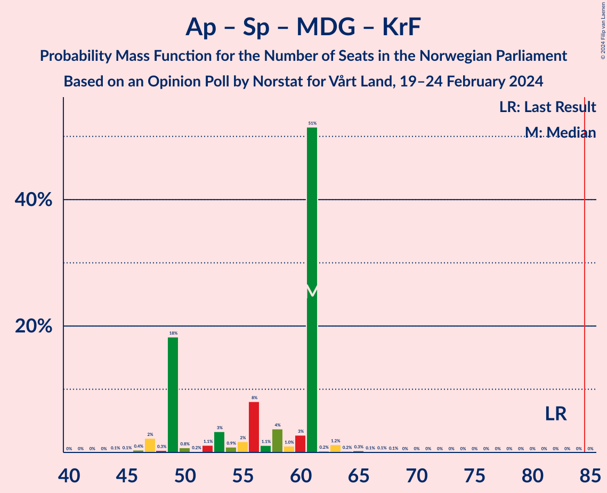
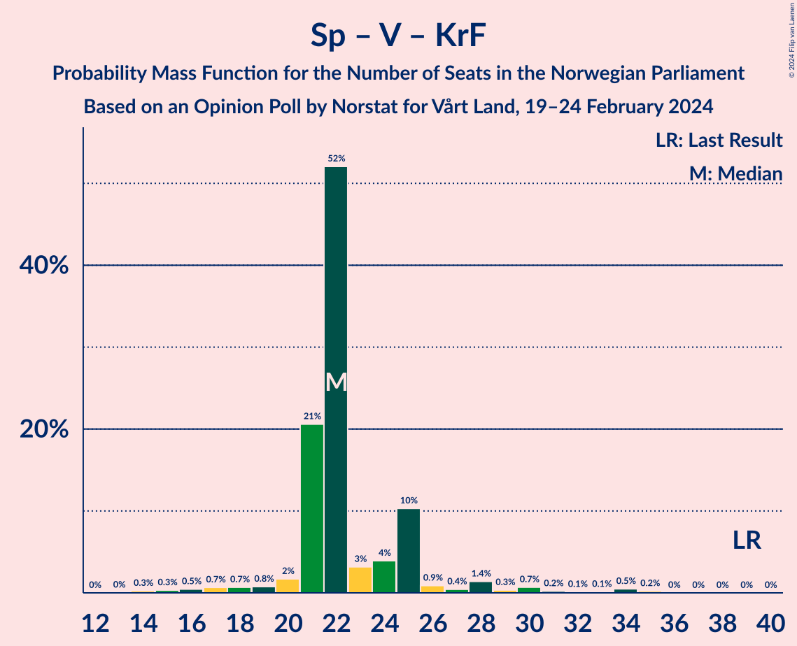

# Opinion Poll by Norstat for Vårt Land, 19–24 February 2024

<a href="#voting-intentions">Voting Intentions</a> | <a href="#seats">Seats</a> | <a href="#coalitions">Coalitions</a> | <a href="#technical-information">Technical Information</a>

## Voting Intentions

### Confidence Intervals

| Party | Last Result | Poll Result | 80% Confidence Interval | 90% Confidence Interval | 95% Confidence Interval | 99% Confidence Interval |
|:-----:|:-----------:|:-----------:|:-----------------------:|:-----------------------:|:-----------------------:|:-----------------------:|
| Høyre | 20.4% | 25.1% | 23.1–27.3% |22.6–27.9% |22.1–28.4% |21.2–29.4% |
| Arbeiderpartiet | 26.2% | 18.7% | 16.9–20.6% |16.4–21.2% |16.0–21.7% |15.2–22.6% |
| Fremskrittspartiet | 11.6% | 16.5% | 14.8–18.3% |14.3–18.9% |13.9–19.3% |13.2–20.3% |
| Sosialistisk Venstreparti | 7.6% | 10.6% | 9.2–12.2% |8.9–12.6% |8.5–13.0% |7.9–13.8% |
| Senterpartiet | 13.5% | 6.4% | 5.4–7.8% |5.1–8.1% |4.9–8.5% |4.4–9.1% |
| Rødt | 4.7% | 6.2% | 5.2–7.5% |4.9–7.8% |4.6–8.2% |4.2–8.8% |
| Venstre | 4.6% | 4.9% | 4.0–6.1% |3.8–6.5% |3.6–6.8% |3.2–7.4% |
| Miljøpartiet De Grønne | 3.9% | 4.0% | 3.2–5.1% |3.0–5.4% |2.8–5.7% |2.4–6.2% |
| Kristelig Folkeparti | 3.8% | 3.6% | 2.8–4.6% |2.6–4.9% |2.4–5.2% |2.1–5.7% |
| Industri- og Næringspartiet | 0.3% | 1.8% | 1.3–2.6% |1.2–2.8% |1.1–3.0% |0.9–3.5% |
| Norgesdemokratene | 1.1% | 1.2% | 0.9–2.0% |0.7–2.1% |0.7–2.3% |0.5–2.7% |
| Konservativt | 0.4% | 0.4% | 0.2–0.9% |0.2–1.1% |0.1–1.2% |0.1–1.5% |

*Note:* The poll result column reflects the actual value used in the calculations. Published results may vary slightly, and in addition be rounded to fewer digits.

## Seats

### Confidence Intervals

| Party | Last Result | Median | 80% Confidence Interval | 90% Confidence Interval | 95% Confidence Interval | 99% Confidence Interval |
|:-----:|:-----------:|:------:|:-----------------------:|:-----------------------:|:-----------------------:|:-----------------------:|
| <a href="#høyre">Høyre</a> | 36 | 46 | 41–46 |41–47 |40–50 |38–52 |
| <a href="#arbeiderpartiet">Arbeiderpartiet</a> | 48 | 39 | 32–39 |31–39 |31–39 |29–42 |
| <a href="#fremskrittspartiet">Fremskrittspartiet</a> | 21 | 27 | 27–35 |27–35 |27–36 |23–38 |
| <a href="#sosialistisk-venstreparti">Sosialistisk Venstreparti</a> | 13 | 16 | 16–21 |16–21 |16–22 |14–23 |
| <a href="#senterpartiet">Senterpartiet</a> | 28 | 12 | 9–13 |9–14 |9–14 |8–16 |
| <a href="#rødt">Rødt</a> | 8 | 10 | 10–12 |9–12 |9–13 |8–14 |
| <a href="#venstre">Venstre</a> | 8 | 8 | 7–10 |3–10 |3–11 |2–12 |
| <a href="#miljøpartiet-de-grønne">Miljøpartiet De Grønne</a> | 3 | 8 | 2–8 |2–9 |2–10 |1–10 |
| <a href="#kristelig-folkeparti">Kristelig Folkeparti</a> | 3 | 2 | 2–7 |2–9 |1–9 |0–9 |
| <a href="#industri--og-næringspartiet">Industri- og Næringspartiet</a> | 0 | 0 | 0 |0 |0–1 |0–2 |
| <a href="#norgesdemokratene">Norgesdemokratene</a> | 0 | 0 | 0 |0 |0 |0 |
| <a href="#konservativt">Konservativt</a> | 0 | 0 | 0 |0 |0 |0 |

### Høyre

*For a full overview of the results for this party, see the [Høyre](party-høyre.html) page.*

| Number of Seats | Probability | Accumulated | Special Marks |
|:---------------:|:-----------:|:-----------:|:-------------:|
| 35 | 0.1% | 100% |  |
| 36 | 0% | 99.9% | Last Result |
| 37 | 0.2% | 99.9% |  |
| 38 | 0.5% | 99.7% |  |
| 39 | 1.5% | 99.2% |  |
| 40 | 0.8% | 98% |  |
| 41 | 20% | 97% |  |
| 42 | 2% | 77% |  |
| 43 | 5% | 75% |  |
| 44 | 3% | 70% |  |
| 45 | 3% | 66% |  |
| 46 | 58% | 63% | Median |
| 47 | 1.4% | 6% |  |
| 48 | 0.7% | 4% |  |
| 49 | 0.5% | 4% |  |
| 50 | 2% | 3% |  |
| 51 | 0.2% | 1.2% |  |
| 52 | 0.9% | 1.0% |  |
| 53 | 0.1% | 0.2% |  |
| 54 | 0% | 0% |  |

### Arbeiderpartiet

*For a full overview of the results for this party, see the [Arbeiderpartiet](party-arbeiderpartiet.html) page.*

| Number of Seats | Probability | Accumulated | Special Marks |
|:---------------:|:-----------:|:-----------:|:-------------:|
| 28 | 0.1% | 100% |  |
| 29 | 1.3% | 99.9% |  |
| 30 | 0.1% | 98.6% |  |
| 31 | 8% | 98% |  |
| 32 | 2% | 90% |  |
| 33 | 2% | 88% |  |
| 34 | 5% | 86% |  |
| 35 | 2% | 81% |  |
| 36 | 19% | 78% |  |
| 37 | 1.3% | 59% |  |
| 38 | 1.2% | 58% |  |
| 39 | 55% | 57% | Median |
| 40 | 1.1% | 2% |  |
| 41 | 0.3% | 0.8% |  |
| 42 | 0.3% | 0.5% |  |
| 43 | 0.1% | 0.2% |  |
| 44 | 0.1% | 0.1% |  |
| 45 | 0% | 0% |  |
| 46 | 0% | 0% |  |
| 47 | 0% | 0% |  |
| 48 | 0% | 0% | Last Result |

### Fremskrittspartiet

*For a full overview of the results for this party, see the [Fremskrittspartiet](party-fremskrittspartiet.html) page.*

| Number of Seats | Probability | Accumulated | Special Marks |
|:---------------:|:-----------:|:-----------:|:-------------:|
| 21 | 0% | 100% | Last Result |
| 22 | 0% | 100% |  |
| 23 | 0.5% | 99.9% |  |
| 24 | 1.1% | 99.5% |  |
| 25 | 0.2% | 98% |  |
| 26 | 0.6% | 98% |  |
| 27 | 52% | 98% | Median |
| 28 | 4% | 46% |  |
| 29 | 1.0% | 42% |  |
| 30 | 4% | 41% |  |
| 31 | 6% | 36% |  |
| 32 | 0.4% | 30% |  |
| 33 | 1.4% | 30% |  |
| 34 | 8% | 28% |  |
| 35 | 17% | 21% |  |
| 36 | 1.2% | 4% |  |
| 37 | 2% | 2% |  |
| 38 | 0.6% | 0.7% |  |
| 39 | 0.1% | 0.2% |  |
| 40 | 0% | 0% |  |

### Sosialistisk Venstreparti

*For a full overview of the results for this party, see the [Sosialistisk Venstreparti](party-sosialistiskvenstreparti.html) page.*

| Number of Seats | Probability | Accumulated | Special Marks |
|:---------------:|:-----------:|:-----------:|:-------------:|
| 12 | 0.1% | 100% |  |
| 13 | 0.3% | 99.9% | Last Result |
| 14 | 0.4% | 99.5% |  |
| 15 | 1.2% | 99.2% |  |
| 16 | 53% | 98% | Median |
| 17 | 5% | 45% |  |
| 18 | 3% | 41% |  |
| 19 | 9% | 38% |  |
| 20 | 5% | 29% |  |
| 21 | 21% | 24% |  |
| 22 | 2% | 4% |  |
| 23 | 1.4% | 2% |  |
| 24 | 0.1% | 0.4% |  |
| 25 | 0.3% | 0.4% |  |
| 26 | 0% | 0.1% |  |
| 27 | 0.1% | 0.1% |  |
| 28 | 0% | 0% |  |

### Senterpartiet

*For a full overview of the results for this party, see the [Senterpartiet](party-senterpartiet.html) page.*

| Number of Seats | Probability | Accumulated | Special Marks |
|:---------------:|:-----------:|:-----------:|:-------------:|
| 7 | 0.2% | 100% |  |
| 8 | 2% | 99.8% |  |
| 9 | 22% | 98% |  |
| 10 | 2% | 76% |  |
| 11 | 2% | 75% |  |
| 12 | 53% | 72% | Median |
| 13 | 11% | 19% |  |
| 14 | 7% | 9% |  |
| 15 | 1.0% | 2% |  |
| 16 | 0.4% | 0.5% |  |
| 17 | 0.1% | 0.1% |  |
| 18 | 0% | 0% |  |
| 19 | 0% | 0% |  |
| 20 | 0% | 0% |  |
| 21 | 0% | 0% |  |
| 22 | 0% | 0% |  |
| 23 | 0% | 0% |  |
| 24 | 0% | 0% |  |
| 25 | 0% | 0% |  |
| 26 | 0% | 0% |  |
| 27 | 0% | 0% |  |
| 28 | 0% | 0% | Last Result |

### Rødt

*For a full overview of the results for this party, see the [Rødt](party-rødt.html) page.*

| Number of Seats | Probability | Accumulated | Special Marks |
|:---------------:|:-----------:|:-----------:|:-------------:|
| 1 | 0.2% | 100% |  |
| 2 | 0% | 99.8% |  |
| 3 | 0% | 99.8% |  |
| 4 | 0% | 99.8% |  |
| 5 | 0% | 99.8% |  |
| 6 | 0% | 99.8% |  |
| 7 | 0.2% | 99.8% |  |
| 8 | 2% | 99.6% | Last Result |
| 9 | 6% | 98% |  |
| 10 | 64% | 92% | Median |
| 11 | 4% | 29% |  |
| 12 | 22% | 25% |  |
| 13 | 2% | 3% |  |
| 14 | 0.3% | 0.7% |  |
| 15 | 0.3% | 0.4% |  |
| 16 | 0.1% | 0.1% |  |
| 17 | 0% | 0% |  |

### Venstre

*For a full overview of the results for this party, see the [Venstre](party-venstre.html) page.*

| Number of Seats | Probability | Accumulated | Special Marks |
|:---------------:|:-----------:|:-----------:|:-------------:|
| 2 | 2% | 100% |  |
| 3 | 8% | 98% |  |
| 4 | 0% | 91% |  |
| 5 | 0% | 91% |  |
| 6 | 0% | 91% |  |
| 7 | 0.8% | 91% |  |
| 8 | 58% | 90% | Last Result, Median |
| 9 | 5% | 32% |  |
| 10 | 23% | 27% |  |
| 11 | 2% | 4% |  |
| 12 | 0.9% | 1.4% |  |
| 13 | 0.5% | 0.5% |  |
| 14 | 0% | 0% |  |

### Miljøpartiet De Grønne

*For a full overview of the results for this party, see the [Miljøpartiet De Grønne](party-miljøpartietdegrønne.html) page.*

| Number of Seats | Probability | Accumulated | Special Marks |
|:---------------:|:-----------:|:-----------:|:-------------:|
| 1 | 2% | 100% |  |
| 2 | 24% | 98% |  |
| 3 | 11% | 74% | Last Result |
| 4 | 0% | 63% |  |
| 5 | 0% | 63% |  |
| 6 | 0% | 63% |  |
| 7 | 1.1% | 63% |  |
| 8 | 56% | 62% | Median |
| 9 | 3% | 6% |  |
| 10 | 3% | 3% |  |
| 11 | 0.1% | 0.1% |  |
| 12 | 0% | 0% |  |

### Kristelig Folkeparti

*For a full overview of the results for this party, see the [Kristelig Folkeparti](party-kristeligfolkeparti.html) page.*

| Number of Seats | Probability | Accumulated | Special Marks |
|:---------------:|:-----------:|:-----------:|:-------------:|
| 0 | 0.8% | 100% |  |
| 1 | 2% | 99.2% |  |
| 2 | 82% | 97% | Median |
| 3 | 4% | 15% | Last Result |
| 4 | 0% | 11% |  |
| 5 | 0% | 11% |  |
| 6 | 0.1% | 11% |  |
| 7 | 1.3% | 11% |  |
| 8 | 2% | 10% |  |
| 9 | 7% | 7% |  |
| 10 | 0.3% | 0.3% |  |
| 11 | 0% | 0% |  |

### Industri- og Næringspartiet

*For a full overview of the results for this party, see the [Industri- og Næringspartiet](party-industri-ognæringspartiet.html) page.*

| Number of Seats | Probability | Accumulated | Special Marks |
|:---------------:|:-----------:|:-----------:|:-------------:|
| 0 | 97% | 100% | Last Result, Median |
| 1 | 0.5% | 3% |  |
| 2 | 2% | 2% |  |
| 3 | 0.1% | 0.1% |  |
| 4 | 0% | 0% |  |

### Norgesdemokratene

*For a full overview of the results for this party, see the [Norgesdemokratene](party-norgesdemokratene.html) page.*

| Number of Seats | Probability | Accumulated | Special Marks |
|:---------------:|:-----------:|:-----------:|:-------------:|
| 0 | 100% | 100% | Last Result, Median |

### Konservativt

*For a full overview of the results for this party, see the [Konservativt](party-konservativt.html) page.*

| Number of Seats | Probability | Accumulated | Special Marks |
|:---------------:|:-----------:|:-----------:|:-------------:|
| 0 | 100% | 100% | Last Result, Median |

## Coalitions

### Confidence Intervals

| Coalition | Last Result | Median | Majority? | 80% Confidence Interval | 90% Confidence Interval | 95% Confidence Interval | 99% Confidence Interval |
|:---------:|:-----------:|:------:|:---------:|:-----------------------:|:-----------------------:|:-----------------------:|:-----------------------:|
| Høyre – Fremskrittspartiet – Senterpartiet – Venstre – Kristelig Folkeparti | 96 | 95 | 100% | 95–104 | 93–105 | 93–105 | 90–107 |
| Høyre – Fremskrittspartiet – Venstre – Miljøpartiet De Grønne – Kristelig Folkeparti | 71 | 91 | 99.0% | 89–95 | 88–95 | 87–97 | 83–100 |
| Høyre – Fremskrittspartiet – Venstre – Kristelig Folkeparti | 68 | 83 | 42% | 83–91 | 81–92 | 79–92 | 77–96 |
| Høyre – Fremskrittspartiet – Venstre | 65 | 81 | 25% | 81–86 | 78–88 | 77–90 | 75–93 |
| Arbeiderpartiet – Sosialistisk Venstreparti – Senterpartiet – Rødt – Miljøpartiet De Grønne | 100 | 85 | 57% | 77–85 | 76–87 | 76–89 | 72–91 |
| Arbeiderpartiet – Sosialistisk Venstreparti – Senterpartiet – Rødt | 97 | 77 | 0.7% | 73–78 | 73–80 | 70–82 | 68–85 |
| Høyre – Fremskrittspartiet | 57 | 73 | 0.3% | 73–80 | 70–80 | 69–81 | 66–82 |
| Arbeiderpartiet – Sosialistisk Venstreparti – Senterpartiet – Miljøpartiet De Grønne – Kristelig Folkeparti | 95 | 77 | 0.2% | 70–77 | 70–79 | 67–81 | 65–83 |
| Arbeiderpartiet – Sosialistisk Venstreparti – Senterpartiet – Miljøpartiet De Grønne | 92 | 75 | 0% | 66–75 | 66–76 | 65–79 | 62–79 |
| Arbeiderpartiet – Sosialistisk Venstreparti – Rødt – Miljøpartiet De Grønne | 72 | 73 | 0% | 64–73 | 63–75 | 63–75 | 61–78 |
| Arbeiderpartiet – Sosialistisk Venstreparti – Senterpartiet | 89 | 67 | 0% | 63–68 | 63–69 | 60–71 | 57–73 |
| Høyre – Venstre – Kristelig Folkeparti | 47 | 56 | 0% | 53–58 | 52–60 | 51–62 | 47–66 |
| Arbeiderpartiet – Senterpartiet – Miljøpartiet De Grønne – Kristelig Folkeparti | 82 | 61 | 0% | 49–61 | 49–61 | 47–61 | 46–65 |
| Arbeiderpartiet – Sosialistisk Venstreparti | 61 | 55 | 0% | 51–57 | 50–57 | 50–58 | 47–61 |
| Arbeiderpartiet – Senterpartiet – Kristelig Folkeparti | 79 | 53 | 0% | 47–53 | 46–54 | 45–55 | 44–58 |
| Arbeiderpartiet – Senterpartiet | 76 | 51 | 0% | 44–51 | 44–51 | 43–51 | 41–53 |
| Senterpartiet – Venstre – Kristelig Folkeparti | 39 | 22 | 0% | 21–25 | 21–25 | 19–28 | 15–34 |

### Høyre – Fremskrittspartiet – Senterpartiet – Venstre – Kristelig Folkeparti

| Number of Seats | Probability | Accumulated | Special Marks |
|:---------------:|:-----------:|:-----------:|:-------------:|
| 85 | 0% | 100% | Majority |
| 86 | 0% | 99.9% |  |
| 87 | 0% | 99.9% |  |
| 88 | 0.1% | 99.9% |  |
| 89 | 0.1% | 99.8% |  |
| 90 | 0.7% | 99.8% |  |
| 91 | 0.3% | 99.1% |  |
| 92 | 1.0% | 98.8% |  |
| 93 | 4% | 98% |  |
| 94 | 0.4% | 93% |  |
| 95 | 54% | 93% | Median |
| 96 | 1.3% | 39% | Last Result |
| 97 | 17% | 38% |  |
| 98 | 2% | 21% |  |
| 99 | 3% | 19% |  |
| 100 | 2% | 16% |  |
| 101 | 1.1% | 14% |  |
| 102 | 0.7% | 13% |  |
| 103 | 0.9% | 12% |  |
| 104 | 4% | 12% |  |
| 105 | 7% | 8% |  |
| 106 | 0.2% | 0.7% |  |
| 107 | 0.1% | 0.5% |  |
| 108 | 0.2% | 0.4% |  |
| 109 | 0.1% | 0.2% |  |
| 110 | 0% | 0.1% |  |
| 111 | 0.1% | 0.1% |  |
| 112 | 0% | 0% |  |

### Høyre – Fremskrittspartiet – Venstre – Miljøpartiet De Grønne – Kristelig Folkeparti

| Number of Seats | Probability | Accumulated | Special Marks |
|:---------------:|:-----------:|:-----------:|:-------------:|
| 71 | 0% | 100% | Last Result |
| 72 | 0% | 100% |  |
| 73 | 0% | 100% |  |
| 74 | 0% | 100% |  |
| 75 | 0% | 100% |  |
| 76 | 0% | 100% |  |
| 77 | 0% | 100% |  |
| 78 | 0% | 100% |  |
| 79 | 0% | 100% |  |
| 80 | 0% | 100% |  |
| 81 | 0.1% | 99.9% |  |
| 82 | 0% | 99.8% |  |
| 83 | 0.5% | 99.8% |  |
| 84 | 0.3% | 99.3% |  |
| 85 | 0.6% | 99.0% | Majority |
| 86 | 0.9% | 98% |  |
| 87 | 0.9% | 98% |  |
| 88 | 4% | 97% |  |
| 89 | 3% | 93% |  |
| 90 | 19% | 90% |  |
| 91 | 52% | 71% | Median |
| 92 | 2% | 20% |  |
| 93 | 2% | 18% |  |
| 94 | 5% | 15% |  |
| 95 | 7% | 11% |  |
| 96 | 0.7% | 3% |  |
| 97 | 0.7% | 3% |  |
| 98 | 0.5% | 2% |  |
| 99 | 0.5% | 2% |  |
| 100 | 0.8% | 1.1% |  |
| 101 | 0.2% | 0.4% |  |
| 102 | 0% | 0.2% |  |
| 103 | 0.1% | 0.2% |  |
| 104 | 0% | 0.1% |  |
| 105 | 0% | 0% |  |

### Høyre – Fremskrittspartiet – Venstre – Kristelig Folkeparti

| Number of Seats | Probability | Accumulated | Special Marks |
|:---------------:|:-----------:|:-----------:|:-------------:|
| 68 | 0% | 100% | Last Result |
| 69 | 0% | 100% |  |
| 70 | 0% | 100% |  |
| 71 | 0% | 100% |  |
| 72 | 0% | 100% |  |
| 73 | 0% | 100% |  |
| 74 | 0% | 100% |  |
| 75 | 0.1% | 100% |  |
| 76 | 0.1% | 99.9% |  |
| 77 | 0.8% | 99.8% |  |
| 78 | 0.3% | 99.0% |  |
| 79 | 3% | 98.7% |  |
| 80 | 0.4% | 96% |  |
| 81 | 2% | 96% |  |
| 82 | 1.1% | 94% |  |
| 83 | 51% | 93% | Median |
| 84 | 0.4% | 42% |  |
| 85 | 3% | 42% | Majority |
| 86 | 5% | 39% |  |
| 87 | 1.4% | 35% |  |
| 88 | 18% | 33% |  |
| 89 | 0.8% | 16% |  |
| 90 | 3% | 15% |  |
| 91 | 3% | 12% |  |
| 92 | 7% | 9% |  |
| 93 | 0.8% | 2% |  |
| 94 | 0.3% | 1.3% |  |
| 95 | 0.3% | 1.0% |  |
| 96 | 0.4% | 0.7% |  |
| 97 | 0.1% | 0.3% |  |
| 98 | 0.2% | 0.2% |  |
| 99 | 0% | 0% |  |

### Høyre – Fremskrittspartiet – Venstre

| Number of Seats | Probability | Accumulated | Special Marks |
|:---------------:|:-----------:|:-----------:|:-------------:|
| 65 | 0% | 100% | Last Result |
| 66 | 0% | 100% |  |
| 67 | 0% | 100% |  |
| 68 | 0% | 100% |  |
| 69 | 0% | 100% |  |
| 70 | 0% | 100% |  |
| 71 | 0% | 100% |  |
| 72 | 0.1% | 100% |  |
| 73 | 0.1% | 99.9% |  |
| 74 | 0.1% | 99.8% |  |
| 75 | 0.8% | 99.7% |  |
| 76 | 0.7% | 98.8% |  |
| 77 | 3% | 98% |  |
| 78 | 2% | 96% |  |
| 79 | 1.1% | 94% |  |
| 80 | 0.7% | 93% |  |
| 81 | 51% | 92% | Median |
| 82 | 1.5% | 41% |  |
| 83 | 10% | 40% |  |
| 84 | 5% | 30% |  |
| 85 | 0.9% | 25% | Majority |
| 86 | 18% | 24% |  |
| 87 | 0.5% | 7% |  |
| 88 | 2% | 6% |  |
| 89 | 1.5% | 4% |  |
| 90 | 1.3% | 3% |  |
| 91 | 0.3% | 1.3% |  |
| 92 | 0.4% | 1.0% |  |
| 93 | 0.3% | 0.6% |  |
| 94 | 0% | 0.3% |  |
| 95 | 0% | 0.2% |  |
| 96 | 0.2% | 0.2% |  |
| 97 | 0% | 0% |  |

### Arbeiderpartiet – Sosialistisk Venstreparti – Senterpartiet – Rødt – Miljøpartiet De Grønne

| Number of Seats | Probability | Accumulated | Special Marks |
|:---------------:|:-----------:|:-----------:|:-------------:|
| 68 | 0% | 100% |  |
| 69 | 0% | 99.9% |  |
| 70 | 0.2% | 99.9% |  |
| 71 | 0.2% | 99.7% |  |
| 72 | 0.5% | 99.5% |  |
| 73 | 0.2% | 99.1% |  |
| 74 | 0.2% | 98.8% |  |
| 75 | 0.8% | 98.6% |  |
| 76 | 7% | 98% |  |
| 77 | 3% | 91% |  |
| 78 | 2% | 87% |  |
| 79 | 1.1% | 85% |  |
| 80 | 18% | 84% |  |
| 81 | 1.1% | 66% |  |
| 82 | 5% | 65% |  |
| 83 | 3% | 61% |  |
| 84 | 1.0% | 58% |  |
| 85 | 51% | 57% | Median, Majority |
| 86 | 0.7% | 6% |  |
| 87 | 1.4% | 6% |  |
| 88 | 0.4% | 4% |  |
| 89 | 3% | 4% |  |
| 90 | 0.3% | 1.3% |  |
| 91 | 0.8% | 1.0% |  |
| 92 | 0.1% | 0.2% |  |
| 93 | 0.1% | 0.1% |  |
| 94 | 0% | 0% |  |
| 95 | 0% | 0% |  |
| 96 | 0% | 0% |  |
| 97 | 0% | 0% |  |
| 98 | 0% | 0% |  |
| 99 | 0% | 0% |  |
| 100 | 0% | 0% | Last Result |

### Arbeiderpartiet – Sosialistisk Venstreparti – Senterpartiet – Rødt

| Number of Seats | Probability | Accumulated | Special Marks |
|:---------------:|:-----------:|:-----------:|:-------------:|
| 64 | 0% | 100% |  |
| 65 | 0.1% | 99.9% |  |
| 66 | 0% | 99.8% |  |
| 67 | 0.2% | 99.8% |  |
| 68 | 0.8% | 99.5% |  |
| 69 | 0.4% | 98.7% |  |
| 70 | 0.9% | 98% |  |
| 71 | 0.3% | 97% |  |
| 72 | 0.6% | 97% |  |
| 73 | 7% | 96% |  |
| 74 | 5% | 89% |  |
| 75 | 3% | 84% |  |
| 76 | 2% | 82% |  |
| 77 | 51% | 80% | Median |
| 78 | 19% | 29% |  |
| 79 | 3% | 9% |  |
| 80 | 3% | 6% |  |
| 81 | 0.7% | 3% |  |
| 82 | 1.0% | 3% |  |
| 83 | 0.6% | 2% |  |
| 84 | 0.2% | 1.0% |  |
| 85 | 0.5% | 0.7% | Majority |
| 86 | 0% | 0.2% |  |
| 87 | 0.1% | 0.2% |  |
| 88 | 0% | 0.1% |  |
| 89 | 0% | 0% |  |
| 90 | 0% | 0% |  |
| 91 | 0% | 0% |  |
| 92 | 0% | 0% |  |
| 93 | 0% | 0% |  |
| 94 | 0% | 0% |  |
| 95 | 0% | 0% |  |
| 96 | 0% | 0% |  |
| 97 | 0% | 0% | Last Result |

### Høyre – Fremskrittspartiet

| Number of Seats | Probability | Accumulated | Special Marks |
|:---------------:|:-----------:|:-----------:|:-------------:|
| 57 | 0% | 100% | Last Result |
| 58 | 0% | 100% |  |
| 59 | 0% | 100% |  |
| 60 | 0% | 100% |  |
| 61 | 0% | 100% |  |
| 62 | 0% | 100% |  |
| 63 | 0% | 100% |  |
| 64 | 0% | 100% |  |
| 65 | 0.1% | 99.9% |  |
| 66 | 0.4% | 99.9% |  |
| 67 | 0.7% | 99.5% |  |
| 68 | 0.5% | 98.8% |  |
| 69 | 3% | 98% |  |
| 70 | 2% | 96% |  |
| 71 | 0.7% | 93% |  |
| 72 | 0.9% | 93% |  |
| 73 | 51% | 92% | Median |
| 74 | 7% | 41% |  |
| 75 | 1.5% | 34% |  |
| 76 | 18% | 32% |  |
| 77 | 0.6% | 15% |  |
| 78 | 0.5% | 14% |  |
| 79 | 2% | 14% |  |
| 80 | 9% | 12% |  |
| 81 | 1.1% | 3% |  |
| 82 | 2% | 2% |  |
| 83 | 0.1% | 0.5% |  |
| 84 | 0% | 0.4% |  |
| 85 | 0.1% | 0.3% | Majority |
| 86 | 0.1% | 0.3% |  |
| 87 | 0% | 0.1% |  |
| 88 | 0.1% | 0.1% |  |
| 89 | 0% | 0% |  |

### Arbeiderpartiet – Sosialistisk Venstreparti – Senterpartiet – Miljøpartiet De Grønne – Kristelig Folkeparti

| Number of Seats | Probability | Accumulated | Special Marks |
|:---------------:|:-----------:|:-----------:|:-------------:|
| 61 | 0% | 100% |  |
| 62 | 0% | 99.9% |  |
| 63 | 0.2% | 99.9% |  |
| 64 | 0.1% | 99.8% |  |
| 65 | 0.4% | 99.7% |  |
| 66 | 0.6% | 99.2% |  |
| 67 | 2% | 98.6% |  |
| 68 | 0.2% | 97% |  |
| 69 | 0.9% | 97% |  |
| 70 | 18% | 96% |  |
| 71 | 2% | 77% |  |
| 72 | 0.5% | 76% |  |
| 73 | 4% | 75% |  |
| 74 | 1.3% | 71% |  |
| 75 | 11% | 70% |  |
| 76 | 1.0% | 59% |  |
| 77 | 51% | 58% | Median |
| 78 | 0.4% | 7% |  |
| 79 | 2% | 6% |  |
| 80 | 0.2% | 4% |  |
| 81 | 3% | 4% |  |
| 82 | 0.6% | 1.3% |  |
| 83 | 0.4% | 0.7% |  |
| 84 | 0% | 0.2% |  |
| 85 | 0% | 0.2% | Majority |
| 86 | 0.1% | 0.2% |  |
| 87 | 0.1% | 0.1% |  |
| 88 | 0% | 0% |  |
| 89 | 0% | 0% |  |
| 90 | 0% | 0% |  |
| 91 | 0% | 0% |  |
| 92 | 0% | 0% |  |
| 93 | 0% | 0% |  |
| 94 | 0% | 0% |  |
| 95 | 0% | 0% | Last Result |

### Arbeiderpartiet – Sosialistisk Venstreparti – Senterpartiet – Miljøpartiet De Grønne

| Number of Seats | Probability | Accumulated | Special Marks |
|:---------------:|:-----------:|:-----------:|:-------------:|
| 59 | 0.1% | 100% |  |
| 60 | 0.1% | 99.9% |  |
| 61 | 0.3% | 99.8% |  |
| 62 | 0.4% | 99.5% |  |
| 63 | 0.4% | 99.1% |  |
| 64 | 0.9% | 98.7% |  |
| 65 | 1.0% | 98% |  |
| 66 | 8% | 97% |  |
| 67 | 1.3% | 89% |  |
| 68 | 19% | 87% |  |
| 69 | 2% | 68% |  |
| 70 | 0.5% | 67% |  |
| 71 | 4% | 66% |  |
| 72 | 0.8% | 62% |  |
| 73 | 4% | 62% |  |
| 74 | 0.7% | 57% |  |
| 75 | 51% | 57% | Median |
| 76 | 2% | 6% |  |
| 77 | 0.3% | 4% |  |
| 78 | 0.3% | 4% |  |
| 79 | 3% | 4% |  |
| 80 | 0.1% | 0.5% |  |
| 81 | 0.3% | 0.4% |  |
| 82 | 0% | 0.1% |  |
| 83 | 0% | 0.1% |  |
| 84 | 0.1% | 0.1% |  |
| 85 | 0% | 0% | Majority |
| 86 | 0% | 0% |  |
| 87 | 0% | 0% |  |
| 88 | 0% | 0% |  |
| 89 | 0% | 0% |  |
| 90 | 0% | 0% |  |
| 91 | 0% | 0% |  |
| 92 | 0% | 0% | Last Result |

### Arbeiderpartiet – Sosialistisk Venstreparti – Rødt – Miljøpartiet De Grønne

| Number of Seats | Probability | Accumulated | Special Marks |
|:---------------:|:-----------:|:-----------:|:-------------:|
| 57 | 0.1% | 100% |  |
| 58 | 0% | 99.9% |  |
| 59 | 0.1% | 99.9% |  |
| 60 | 0.2% | 99.8% |  |
| 61 | 0.2% | 99.6% |  |
| 62 | 0.2% | 99.3% |  |
| 63 | 7% | 99.1% |  |
| 64 | 4% | 92% |  |
| 65 | 0.8% | 88% |  |
| 66 | 0.8% | 87% |  |
| 67 | 1.3% | 87% |  |
| 68 | 1.5% | 85% |  |
| 69 | 3% | 84% |  |
| 70 | 2% | 80% |  |
| 71 | 17% | 79% |  |
| 72 | 1.3% | 62% | Last Result |
| 73 | 54% | 61% | Median |
| 74 | 0.6% | 6% |  |
| 75 | 4% | 6% |  |
| 76 | 0.8% | 2% |  |
| 77 | 0.4% | 1.3% |  |
| 78 | 0.7% | 0.9% |  |
| 79 | 0.1% | 0.2% |  |
| 80 | 0% | 0.1% |  |
| 81 | 0% | 0.1% |  |
| 82 | 0% | 0.1% |  |
| 83 | 0% | 0% |  |

### Arbeiderpartiet – Sosialistisk Venstreparti – Senterpartiet

| Number of Seats | Probability | Accumulated | Special Marks |
|:---------------:|:-----------:|:-----------:|:-------------:|
| 54 | 0% | 100% |  |
| 55 | 0% | 99.9% |  |
| 56 | 0.1% | 99.9% |  |
| 57 | 0.4% | 99.8% |  |
| 58 | 0.9% | 99.4% |  |
| 59 | 0.3% | 98.6% |  |
| 60 | 0.8% | 98% |  |
| 61 | 0.4% | 97% |  |
| 62 | 2% | 97% |  |
| 63 | 7% | 95% |  |
| 64 | 3% | 88% |  |
| 65 | 4% | 85% |  |
| 66 | 19% | 82% |  |
| 67 | 52% | 63% | Median |
| 68 | 3% | 10% |  |
| 69 | 3% | 7% |  |
| 70 | 1.2% | 4% |  |
| 71 | 1.3% | 3% |  |
| 72 | 0.7% | 1.3% |  |
| 73 | 0.2% | 0.6% |  |
| 74 | 0.3% | 0.5% |  |
| 75 | 0.1% | 0.2% |  |
| 76 | 0.1% | 0.1% |  |
| 77 | 0% | 0% |  |
| 78 | 0% | 0% |  |
| 79 | 0% | 0% |  |
| 80 | 0% | 0% |  |
| 81 | 0% | 0% |  |
| 82 | 0% | 0% |  |
| 83 | 0% | 0% |  |
| 84 | 0% | 0% |  |
| 85 | 0% | 0% | Majority |
| 86 | 0% | 0% |  |
| 87 | 0% | 0% |  |
| 88 | 0% | 0% |  |
| 89 | 0% | 0% | Last Result |

### Høyre – Venstre – Kristelig Folkeparti

| Number of Seats | Probability | Accumulated | Special Marks |
|:---------------:|:-----------:|:-----------:|:-------------:|
| 44 | 0.1% | 100% |  |
| 45 | 0.1% | 99.9% |  |
| 46 | 0.3% | 99.9% |  |
| 47 | 0.2% | 99.5% | Last Result |
| 48 | 0.5% | 99.3% |  |
| 49 | 0.5% | 98.8% |  |
| 50 | 0.6% | 98% |  |
| 51 | 3% | 98% |  |
| 52 | 0.5% | 95% |  |
| 53 | 19% | 95% |  |
| 54 | 2% | 75% |  |
| 55 | 7% | 74% |  |
| 56 | 52% | 67% | Median |
| 57 | 1.1% | 15% |  |
| 58 | 8% | 14% |  |
| 59 | 1.0% | 6% |  |
| 60 | 2% | 5% |  |
| 61 | 0.5% | 3% |  |
| 62 | 0.3% | 3% |  |
| 63 | 1.0% | 2% |  |
| 64 | 0.7% | 1.2% |  |
| 65 | 0% | 0.6% |  |
| 66 | 0.2% | 0.5% |  |
| 67 | 0.1% | 0.3% |  |
| 68 | 0.2% | 0.2% |  |
| 69 | 0% | 0% |  |

### Arbeiderpartiet – Senterpartiet – Miljøpartiet De Grønne – Kristelig Folkeparti

| Number of Seats | Probability | Accumulated | Special Marks |
|:---------------:|:-----------:|:-----------:|:-------------:|
| 44 | 0.1% | 100% |  |
| 45 | 0.1% | 99.9% |  |
| 46 | 0.4% | 99.7% |  |
| 47 | 2% | 99.3% |  |
| 48 | 0.3% | 97% |  |
| 49 | 18% | 97% |  |
| 50 | 0.8% | 78% |  |
| 51 | 0.2% | 78% |  |
| 52 | 1.1% | 78% |  |
| 53 | 3% | 76% |  |
| 54 | 0.9% | 73% |  |
| 55 | 2% | 72% |  |
| 56 | 8% | 70% |  |
| 57 | 1.1% | 62% |  |
| 58 | 4% | 61% |  |
| 59 | 1.0% | 58% |  |
| 60 | 3% | 57% |  |
| 61 | 51% | 54% | Median |
| 62 | 0.2% | 2% |  |
| 63 | 1.2% | 2% |  |
| 64 | 0.2% | 0.8% |  |
| 65 | 0.3% | 0.6% |  |
| 66 | 0.1% | 0.3% |  |
| 67 | 0.1% | 0.2% |  |
| 68 | 0.1% | 0.1% |  |
| 69 | 0% | 0% |  |
| 70 | 0% | 0% |  |
| 71 | 0% | 0% |  |
| 72 | 0% | 0% |  |
| 73 | 0% | 0% |  |
| 74 | 0% | 0% |  |
| 75 | 0% | 0% |  |
| 76 | 0% | 0% |  |
| 77 | 0% | 0% |  |
| 78 | 0% | 0% |  |
| 79 | 0% | 0% |  |
| 80 | 0% | 0% |  |
| 81 | 0% | 0% |  |
| 82 | 0% | 0% | Last Result |

### Arbeiderpartiet – Sosialistisk Venstreparti

| Number of Seats | Probability | Accumulated | Special Marks |
|:---------------:|:-----------:|:-----------:|:-------------:|
| 44 | 0% | 100% |  |
| 45 | 0.1% | 99.9% |  |
| 46 | 0.2% | 99.8% |  |
| 47 | 0.4% | 99.6% |  |
| 48 | 0.4% | 99.2% |  |
| 49 | 0.4% | 98.8% |  |
| 50 | 8% | 98% |  |
| 51 | 3% | 90% |  |
| 52 | 2% | 87% |  |
| 53 | 1.2% | 85% |  |
| 54 | 3% | 84% |  |
| 55 | 54% | 80% | Median |
| 56 | 5% | 26% |  |
| 57 | 18% | 22% |  |
| 58 | 2% | 4% |  |
| 59 | 0.4% | 2% |  |
| 60 | 0.5% | 2% |  |
| 61 | 0.9% | 1.1% | Last Result |
| 62 | 0.1% | 0.2% |  |
| 63 | 0.1% | 0.1% |  |
| 64 | 0% | 0.1% |  |
| 65 | 0% | 0% |  |

### Arbeiderpartiet – Senterpartiet – Kristelig Folkeparti

| Number of Seats | Probability | Accumulated | Special Marks |
|:---------------:|:-----------:|:-----------:|:-------------:|
| 40 | 0% | 100% |  |
| 41 | 0.1% | 99.9% |  |
| 42 | 0.1% | 99.9% |  |
| 43 | 0.2% | 99.8% |  |
| 44 | 0.8% | 99.5% |  |
| 45 | 3% | 98.7% |  |
| 46 | 1.0% | 96% |  |
| 47 | 19% | 95% |  |
| 48 | 0.9% | 76% |  |
| 49 | 0.9% | 75% |  |
| 50 | 9% | 75% |  |
| 51 | 1.3% | 66% |  |
| 52 | 2% | 65% |  |
| 53 | 57% | 63% | Median |
| 54 | 2% | 5% |  |
| 55 | 0.9% | 3% |  |
| 56 | 0.5% | 2% |  |
| 57 | 0.3% | 1.4% |  |
| 58 | 0.7% | 1.1% |  |
| 59 | 0.2% | 0.4% |  |
| 60 | 0% | 0.2% |  |
| 61 | 0.1% | 0.1% |  |
| 62 | 0% | 0% |  |
| 63 | 0% | 0% |  |
| 64 | 0% | 0% |  |
| 65 | 0% | 0% |  |
| 66 | 0% | 0% |  |
| 67 | 0% | 0% |  |
| 68 | 0% | 0% |  |
| 69 | 0% | 0% |  |
| 70 | 0% | 0% |  |
| 71 | 0% | 0% |  |
| 72 | 0% | 0% |  |
| 73 | 0% | 0% |  |
| 74 | 0% | 0% |  |
| 75 | 0% | 0% |  |
| 76 | 0% | 0% |  |
| 77 | 0% | 0% |  |
| 78 | 0% | 0% |  |
| 79 | 0% | 0% | Last Result |

### Arbeiderpartiet – Senterpartiet

| Number of Seats | Probability | Accumulated | Special Marks |
|:---------------:|:-----------:|:-----------:|:-------------:|
| 37 | 0% | 100% |  |
| 38 | 0% | 99.9% |  |
| 39 | 0.1% | 99.9% |  |
| 40 | 0.2% | 99.8% |  |
| 41 | 0.7% | 99.6% |  |
| 42 | 0.8% | 98.9% |  |
| 43 | 2% | 98% |  |
| 44 | 9% | 96% |  |
| 45 | 19% | 87% |  |
| 46 | 1.0% | 68% |  |
| 47 | 1.2% | 67% |  |
| 48 | 9% | 66% |  |
| 49 | 2% | 57% |  |
| 50 | 1.3% | 55% |  |
| 51 | 52% | 54% | Median |
| 52 | 1.0% | 2% |  |
| 53 | 0.3% | 0.7% |  |
| 54 | 0.1% | 0.3% |  |
| 55 | 0.1% | 0.3% |  |
| 56 | 0% | 0.1% |  |
| 57 | 0.1% | 0.1% |  |
| 58 | 0% | 0% |  |
| 59 | 0% | 0% |  |
| 60 | 0% | 0% |  |
| 61 | 0% | 0% |  |
| 62 | 0% | 0% |  |
| 63 | 0% | 0% |  |
| 64 | 0% | 0% |  |
| 65 | 0% | 0% |  |
| 66 | 0% | 0% |  |
| 67 | 0% | 0% |  |
| 68 | 0% | 0% |  |
| 69 | 0% | 0% |  |
| 70 | 0% | 0% |  |
| 71 | 0% | 0% |  |
| 72 | 0% | 0% |  |
| 73 | 0% | 0% |  |
| 74 | 0% | 0% |  |
| 75 | 0% | 0% |  |
| 76 | 0% | 0% | Last Result |

### Senterpartiet – Venstre – Kristelig Folkeparti

| Number of Seats | Probability | Accumulated | Special Marks |
|:---------------:|:-----------:|:-----------:|:-------------:|
| 13 | 0% | 100% |  |
| 14 | 0.3% | 99.9% |  |
| 15 | 0.3% | 99.7% |  |
| 16 | 0.5% | 99.3% |  |
| 17 | 0.7% | 98.9% |  |
| 18 | 0.7% | 98% |  |
| 19 | 0.8% | 98% |  |
| 20 | 2% | 97% |  |
| 21 | 21% | 95% |  |
| 22 | 52% | 74% | Median |
| 23 | 3% | 22% |  |
| 24 | 4% | 19% |  |
| 25 | 10% | 15% |  |
| 26 | 0.9% | 5% |  |
| 27 | 0.4% | 4% |  |
| 28 | 1.4% | 4% |  |
| 29 | 0.3% | 2% |  |
| 30 | 0.7% | 2% |  |
| 31 | 0.2% | 1.2% |  |
| 32 | 0.1% | 1.0% |  |
| 33 | 0.1% | 0.9% |  |
| 34 | 0.5% | 0.7% |  |
| 35 | 0.2% | 0.2% |  |
| 36 | 0% | 0% |  |
| 37 | 0% | 0% |  |
| 38 | 0% | 0% |  |
| 39 | 0% | 0% | Last Result |

## Technical Information

### Opinion Poll

+ **Polling firm:** Norstat
+ **Commissioner(s):** Vårt Land
+ **Fieldwork period:** 19–24 February 2024

### Calculations

+ **Sample size:** 729
+ **Simulations done:** 1,048,576
+ **Error estimate:** 2.61%

