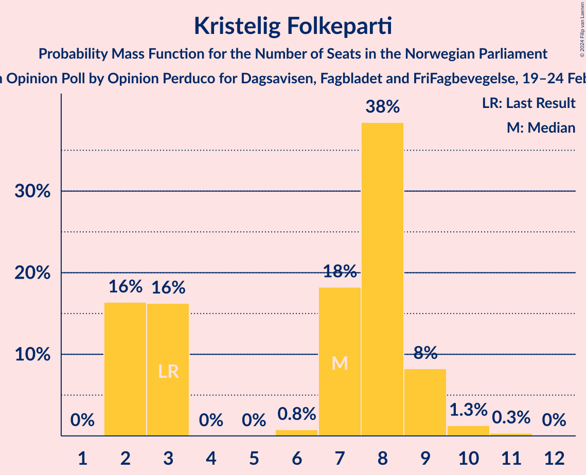
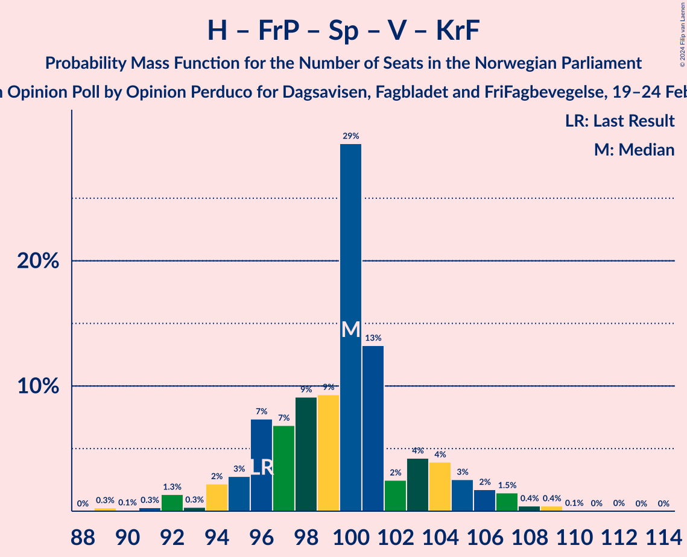

# Opinion Poll by Opinion Perduco for Dagsavisen, Fagbladet and FriFagbevegelse, 19–24 February 2024

<a href="#voting-intentions">Voting Intentions</a> | <a href="#seats">Seats</a> | <a href="#coalitions">Coalitions</a> | <a href="#technical-information">Technical Information</a>

## Voting Intentions

### Confidence Intervals

| Party | Last Result | Poll Result | 80% Confidence Interval | 90% Confidence Interval | 95% Confidence Interval | 99% Confidence Interval |
|:-----:|:-----------:|:-----------:|:-----------------------:|:-----------------------:|:-----------------------:|:-----------------------:|
| Høyre | 20.4% | 26.7% | 25.0–28.6% |24.4–29.1% |24.0–29.6% |23.2–30.5% |
| Arbeiderpartiet | 26.2% | 16.8% | 15.3–18.4% |14.9–18.8% |14.5–19.2% |13.9–20.0% |
| Fremskrittspartiet | 11.6% | 13.3% | 12.0–14.8% |11.6–15.2% |11.3–15.6% |10.7–16.3% |
| Sosialistisk Venstreparti | 7.6% | 10.1% | 8.9–11.4% |8.6–11.8% |8.3–12.1% |7.8–12.8% |
| Senterpartiet | 13.5% | 7.9% | 6.9–9.1% |6.6–9.5% |6.4–9.8% |5.9–10.4% |
| Rødt | 4.7% | 5.8% | 4.9–6.9% |4.7–7.2% |4.5–7.4% |4.1–8.0% |
| Venstre | 4.6% | 5.5% | 4.6–6.5% |4.4–6.8% |4.2–7.1% |3.9–7.6% |
| Miljøpartiet De Grønne | 3.9% | 4.5% | 3.7–5.4% |3.5–5.7% |3.3–6.0% |3.0–6.4% |
| Kristelig Folkeparti | 3.8% | 4.2% | 3.4–5.1% |3.2–5.4% |3.1–5.6% |2.8–6.1% |
| Industri- og Næringspartiet | 0.3% | 2.7% | 2.2–3.5% |2.0–3.8% |1.9–4.0% |1.6–4.4% |

*Note:* The poll result column reflects the actual value used in the calculations. Published results may vary slightly, and in addition be rounded to fewer digits.

## Seats

### Confidence Intervals

| Party | Last Result | Median | 80% Confidence Interval | 90% Confidence Interval | 95% Confidence Interval | 99% Confidence Interval |
|:-----:|:-----------:|:------:|:-----------------------:|:-----------------------:|:-----------------------:|:-----------------------:|
| <a href="#høyre">Høyre</a> | 36 | 46 | 44–50 |42–51 |42–52 |41–54 |
| <a href="#arbeiderpartiet">Arbeiderpartiet</a> | 48 | 33 | 30–35 |29–36 |29–37 |27–37 |
| <a href="#fremskrittspartiet">Fremskrittspartiet</a> | 21 | 23 | 21–26 |20–27 |19–28 |18–30 |
| <a href="#sosialistisk-venstreparti">Sosialistisk Venstreparti</a> | 13 | 17 | 15–20 |14–21 |14–21 |13–22 |
| <a href="#senterpartiet">Senterpartiet</a> | 28 | 14 | 12–16 |11–17 |10–17 |10–19 |
| <a href="#rødt">Rødt</a> | 8 | 10 | 9–12 |8–12 |7–13 |7–14 |
| <a href="#venstre">Venstre</a> | 8 | 10 | 8–11 |8–12 |8–12 |3–14 |
| <a href="#miljøpartiet-de-grønne">Miljøpartiet De Grønne</a> | 3 | 7 | 3–9 |2–10 |2–10 |2–11 |
| <a href="#kristelig-folkeparti">Kristelig Folkeparti</a> | 3 | 7 | 2–8 |2–9 |2–9 |2–10 |
| <a href="#industri--og-næringspartiet">Industri- og Næringspartiet</a> | 0 | 2 | 0–2 |0–3 |0–3 |0–7 |

### Høyre

*For a full overview of the results for this party, see the [Høyre](party-høyre.html) page.*

| Number of Seats | Probability | Accumulated | Special Marks |
|:---------------:|:-----------:|:-----------:|:-------------:|
| 36 | 0% | 100% | Last Result |
| 37 | 0% | 100% |  |
| 38 | 0% | 100% |  |
| 39 | 0.2% | 100% |  |
| 40 | 0.3% | 99.8% |  |
| 41 | 1.5% | 99.5% |  |
| 42 | 4% | 98% |  |
| 43 | 4% | 94% |  |
| 44 | 8% | 90% |  |
| 45 | 26% | 82% |  |
| 46 | 7% | 55% | Median |
| 47 | 11% | 48% |  |
| 48 | 12% | 37% |  |
| 49 | 12% | 26% |  |
| 50 | 8% | 13% |  |
| 51 | 2% | 6% |  |
| 52 | 2% | 3% |  |
| 53 | 0.8% | 2% |  |
| 54 | 0.4% | 0.7% |  |
| 55 | 0.2% | 0.3% |  |
| 56 | 0.1% | 0.1% |  |
| 57 | 0% | 0% |  |

### Arbeiderpartiet

*For a full overview of the results for this party, see the [Arbeiderpartiet](party-arbeiderpartiet.html) page.*

| Number of Seats | Probability | Accumulated | Special Marks |
|:---------------:|:-----------:|:-----------:|:-------------:|
| 25 | 0.1% | 100% |  |
| 26 | 0.1% | 99.9% |  |
| 27 | 0.5% | 99.9% |  |
| 28 | 1.0% | 99.3% |  |
| 29 | 5% | 98% |  |
| 30 | 6% | 94% |  |
| 31 | 10% | 88% |  |
| 32 | 18% | 78% |  |
| 33 | 17% | 60% | Median |
| 34 | 31% | 43% |  |
| 35 | 6% | 12% |  |
| 36 | 3% | 6% |  |
| 37 | 2% | 3% |  |
| 38 | 0.2% | 0.5% |  |
| 39 | 0.2% | 0.3% |  |
| 40 | 0% | 0.1% |  |
| 41 | 0% | 0% |  |
| 42 | 0% | 0% |  |
| 43 | 0% | 0% |  |
| 44 | 0% | 0% |  |
| 45 | 0% | 0% |  |
| 46 | 0% | 0% |  |
| 47 | 0% | 0% |  |
| 48 | 0% | 0% | Last Result |

### Fremskrittspartiet

*For a full overview of the results for this party, see the [Fremskrittspartiet](party-fremskrittspartiet.html) page.*

| Number of Seats | Probability | Accumulated | Special Marks |
|:---------------:|:-----------:|:-----------:|:-------------:|
| 17 | 0.1% | 100% |  |
| 18 | 1.4% | 99.9% |  |
| 19 | 1.0% | 98% |  |
| 20 | 5% | 97% |  |
| 21 | 13% | 93% | Last Result |
| 22 | 7% | 80% |  |
| 23 | 36% | 73% | Median |
| 24 | 14% | 37% |  |
| 25 | 10% | 23% |  |
| 26 | 7% | 13% |  |
| 27 | 2% | 6% |  |
| 28 | 2% | 3% |  |
| 29 | 1.0% | 2% |  |
| 30 | 0.3% | 0.8% |  |
| 31 | 0.3% | 0.5% |  |
| 32 | 0.1% | 0.1% |  |
| 33 | 0% | 0% |  |

### Sosialistisk Venstreparti

*For a full overview of the results for this party, see the [Sosialistisk Venstreparti](party-sosialistiskvenstreparti.html) page.*

| Number of Seats | Probability | Accumulated | Special Marks |
|:---------------:|:-----------:|:-----------:|:-------------:|
| 11 | 0.1% | 100% |  |
| 12 | 0.3% | 99.9% |  |
| 13 | 2% | 99.7% | Last Result |
| 14 | 4% | 98% |  |
| 15 | 11% | 94% |  |
| 16 | 31% | 83% |  |
| 17 | 12% | 52% | Median |
| 18 | 14% | 40% |  |
| 19 | 15% | 26% |  |
| 20 | 5% | 11% |  |
| 21 | 4% | 6% |  |
| 22 | 1.4% | 2% |  |
| 23 | 0.2% | 0.3% |  |
| 24 | 0.1% | 0.1% |  |
| 25 | 0% | 0% |  |

### Senterpartiet

*For a full overview of the results for this party, see the [Senterpartiet](party-senterpartiet.html) page.*

| Number of Seats | Probability | Accumulated | Special Marks |
|:---------------:|:-----------:|:-----------:|:-------------:|
| 9 | 0.2% | 100% |  |
| 10 | 2% | 99.8% |  |
| 11 | 4% | 97% |  |
| 12 | 4% | 93% |  |
| 13 | 15% | 90% |  |
| 14 | 48% | 74% | Median |
| 15 | 13% | 27% |  |
| 16 | 7% | 14% |  |
| 17 | 5% | 7% |  |
| 18 | 1.2% | 2% |  |
| 19 | 0.6% | 0.7% |  |
| 20 | 0.1% | 0.1% |  |
| 21 | 0% | 0% |  |
| 22 | 0% | 0% |  |
| 23 | 0% | 0% |  |
| 24 | 0% | 0% |  |
| 25 | 0% | 0% |  |
| 26 | 0% | 0% |  |
| 27 | 0% | 0% |  |
| 28 | 0% | 0% | Last Result |

### Rødt

*For a full overview of the results for this party, see the [Rødt](party-rødt.html) page.*

| Number of Seats | Probability | Accumulated | Special Marks |
|:---------------:|:-----------:|:-----------:|:-------------:|
| 1 | 0.4% | 100% |  |
| 2 | 0% | 99.6% |  |
| 3 | 0% | 99.6% |  |
| 4 | 0% | 99.6% |  |
| 5 | 0% | 99.6% |  |
| 6 | 0.1% | 99.6% |  |
| 7 | 3% | 99.5% |  |
| 8 | 6% | 97% | Last Result |
| 9 | 38% | 90% |  |
| 10 | 24% | 52% | Median |
| 11 | 14% | 28% |  |
| 12 | 11% | 14% |  |
| 13 | 3% | 3% |  |
| 14 | 0.6% | 0.7% |  |
| 15 | 0.1% | 0.1% |  |
| 16 | 0% | 0% |  |

### Venstre

*For a full overview of the results for this party, see the [Venstre](party-venstre.html) page.*

| Number of Seats | Probability | Accumulated | Special Marks |
|:---------------:|:-----------:|:-----------:|:-------------:|
| 2 | 0.2% | 100% |  |
| 3 | 0.7% | 99.8% |  |
| 4 | 0% | 99.0% |  |
| 5 | 0% | 99.0% |  |
| 6 | 0% | 99.0% |  |
| 7 | 1.2% | 99.0% |  |
| 8 | 18% | 98% | Last Result |
| 9 | 20% | 80% |  |
| 10 | 37% | 60% | Median |
| 11 | 16% | 23% |  |
| 12 | 6% | 7% |  |
| 13 | 0.7% | 1.4% |  |
| 14 | 0.7% | 0.7% |  |
| 15 | 0% | 0% |  |

### Miljøpartiet De Grønne

*For a full overview of the results for this party, see the [Miljøpartiet De Grønne](party-miljøpartietdegrønne.html) page.*

| Number of Seats | Probability | Accumulated | Special Marks |
|:---------------:|:-----------:|:-----------:|:-------------:|
| 1 | 0.5% | 100% |  |
| 2 | 7% | 99.5% |  |
| 3 | 6% | 92% | Last Result |
| 4 | 0% | 86% |  |
| 5 | 0% | 86% |  |
| 6 | 0.5% | 86% |  |
| 7 | 43% | 86% | Median |
| 8 | 23% | 43% |  |
| 9 | 13% | 20% |  |
| 10 | 6% | 7% |  |
| 11 | 0.6% | 1.0% |  |
| 12 | 0.4% | 0.4% |  |
| 13 | 0% | 0% |  |

### Kristelig Folkeparti

*For a full overview of the results for this party, see the [Kristelig Folkeparti](party-kristeligfolkeparti.html) page.*

| Number of Seats | Probability | Accumulated | Special Marks |
|:---------------:|:-----------:|:-----------:|:-------------:|
| 2 | 16% | 100% |  |
| 3 | 16% | 84% | Last Result |
| 4 | 0% | 67% |  |
| 5 | 0% | 67% |  |
| 6 | 0.8% | 67% |  |
| 7 | 18% | 67% | Median |
| 8 | 38% | 48% |  |
| 9 | 8% | 10% |  |
| 10 | 1.3% | 2% |  |
| 11 | 0.3% | 0.4% |  |
| 12 | 0% | 0% |  |

### Industri- og Næringspartiet

*For a full overview of the results for this party, see the [Industri- og Næringspartiet](party-industri-ognæringspartiet.html) page.*

| Number of Seats | Probability | Accumulated | Special Marks |
|:---------------:|:-----------:|:-----------:|:-------------:|
| 0 | 26% | 100% | Last Result |
| 1 | 15% | 74% |  |
| 2 | 52% | 59% | Median |
| 3 | 6% | 8% |  |
| 4 | 0% | 2% |  |
| 5 | 0% | 2% |  |
| 6 | 1.0% | 2% |  |
| 7 | 0.5% | 0.7% |  |
| 8 | 0.2% | 0.2% |  |
| 9 | 0% | 0% |  |

## Coalitions

### Confidence Intervals

| Coalition | Last Result | Median | Majority? | 80% Confidence Interval | 90% Confidence Interval | 95% Confidence Interval | 99% Confidence Interval |
|:---------:|:-----------:|:------:|:---------:|:-----------------------:|:-----------------------:|:-----------------------:|:-----------------------:|
| Høyre – Fremskrittspartiet – Senterpartiet – Venstre – Kristelig Folkeparti | 96 | 100 | 100% | 96–104 | 95–105 | 94–106 | 91–109 |
| Høyre – Fremskrittspartiet – Venstre – Miljøpartiet De Grønne – Kristelig Folkeparti | 71 | 93 | 99.2% | 89–96 | 88–97 | 86–98 | 84–100 |
| Høyre – Fremskrittspartiet – Venstre – Kristelig Folkeparti | 68 | 86 | 68% | 82–90 | 81–91 | 79–91 | 76–94 |
| Arbeiderpartiet – Sosialistisk Venstreparti – Senterpartiet – Rødt – Miljøpartiet De Grønne | 100 | 80 | 13% | 77–85 | 76–86 | 75–88 | 72–90 |
| Høyre – Fremskrittspartiet – Venstre | 65 | 79 | 8% | 76–84 | 75–86 | 73–87 | 71–89 |
| Arbeiderpartiet – Sosialistisk Venstreparti – Senterpartiet – Miljøpartiet De Grønne – Kristelig Folkeparti | 95 | 78 | 1.2% | 73–80 | 70–82 | 70–83 | 67–85 |
| Arbeiderpartiet – Sosialistisk Venstreparti – Senterpartiet – Rødt | 97 | 73 | 0% | 71–78 | 70–78 | 68–80 | 66–82 |
| Arbeiderpartiet – Sosialistisk Venstreparti – Senterpartiet – Miljøpartiet De Grønne | 92 | 71 | 0% | 67–75 | 66–76 | 65–77 | 63–79 |
| Høyre – Fremskrittspartiet | 57 | 69 | 0% | 67–74 | 65–75 | 64–77 | 63–78 |
| Arbeiderpartiet – Sosialistisk Venstreparti – Rødt – Miljøpartiet De Grønne | 72 | 66 | 0% | 63–71 | 61–71 | 61–73 | 59–75 |
| Arbeiderpartiet – Sosialistisk Venstreparti – Senterpartiet | 89 | 64 | 0% | 61–67 | 60–68 | 59–69 | 57–71 |
| Høyre – Venstre – Kristelig Folkeparti | 47 | 63 | 0% | 58–66 | 57–67 | 56–68 | 54–70 |
| Arbeiderpartiet – Senterpartiet – Miljøpartiet De Grønne – Kristelig Folkeparti | 82 | 61 | 0% | 55–64 | 53–65 | 52–66 | 49–67 |
| Arbeiderpartiet – Senterpartiet – Kristelig Folkeparti | 79 | 54 | 0% | 48–56 | 47–57 | 45–58 | 45–60 |
| Arbeiderpartiet – Sosialistisk Venstreparti | 61 | 50 | 0% | 47–52 | 47–54 | 46–55 | 44–57 |
| Arbeiderpartiet – Senterpartiet | 76 | 47 | 0% | 44–49 | 42–50 | 42–51 | 41–53 |
| Senterpartiet – Venstre – Kristelig Folkeparti | 39 | 31 | 0% | 25–33 | 25–34 | 24–35 | 23–37 |

### Høyre – Fremskrittspartiet – Senterpartiet – Venstre – Kristelig Folkeparti

| Number of Seats | Probability | Accumulated | Special Marks |
|:---------------:|:-----------:|:-----------:|:-------------:|
| 89 | 0.3% | 100% |  |
| 90 | 0.1% | 99.7% |  |
| 91 | 0.3% | 99.6% |  |
| 92 | 1.3% | 99.3% |  |
| 93 | 0.3% | 98% |  |
| 94 | 2% | 98% |  |
| 95 | 3% | 95% |  |
| 96 | 7% | 93% | Last Result |
| 97 | 7% | 85% |  |
| 98 | 9% | 78% |  |
| 99 | 9% | 69% |  |
| 100 | 29% | 60% | Median |
| 101 | 13% | 31% |  |
| 102 | 2% | 17% |  |
| 103 | 4% | 15% |  |
| 104 | 4% | 11% |  |
| 105 | 3% | 7% |  |
| 106 | 2% | 4% |  |
| 107 | 1.5% | 2% |  |
| 108 | 0.4% | 1.0% |  |
| 109 | 0.4% | 0.6% |  |
| 110 | 0.1% | 0.1% |  |
| 111 | 0% | 0.1% |  |
| 112 | 0% | 0.1% |  |
| 113 | 0% | 0% |  |

### Høyre – Fremskrittspartiet – Venstre – Miljøpartiet De Grønne – Kristelig Folkeparti

| Number of Seats | Probability | Accumulated | Special Marks |
|:---------------:|:-----------:|:-----------:|:-------------:|
| 71 | 0% | 100% | Last Result |
| 72 | 0% | 100% |  |
| 73 | 0% | 100% |  |
| 74 | 0% | 100% |  |
| 75 | 0% | 100% |  |
| 76 | 0% | 100% |  |
| 77 | 0% | 100% |  |
| 78 | 0% | 100% |  |
| 79 | 0% | 100% |  |
| 80 | 0% | 100% |  |
| 81 | 0% | 100% |  |
| 82 | 0.1% | 100% |  |
| 83 | 0.1% | 99.9% |  |
| 84 | 0.5% | 99.7% |  |
| 85 | 0.4% | 99.2% | Majority |
| 86 | 1.5% | 98.8% |  |
| 87 | 2% | 97% |  |
| 88 | 3% | 96% |  |
| 89 | 6% | 93% |  |
| 90 | 7% | 87% |  |
| 91 | 10% | 79% |  |
| 92 | 7% | 69% |  |
| 93 | 31% | 62% | Median |
| 94 | 9% | 31% |  |
| 95 | 6% | 22% |  |
| 96 | 7% | 16% |  |
| 97 | 6% | 9% |  |
| 98 | 1.0% | 3% |  |
| 99 | 1.2% | 2% |  |
| 100 | 0.6% | 1.1% |  |
| 101 | 0.2% | 0.5% |  |
| 102 | 0.2% | 0.3% |  |
| 103 | 0% | 0.1% |  |
| 104 | 0.1% | 0.1% |  |
| 105 | 0% | 0% |  |

### Høyre – Fremskrittspartiet – Venstre – Kristelig Folkeparti

| Number of Seats | Probability | Accumulated | Special Marks |
|:---------------:|:-----------:|:-----------:|:-------------:|
| 68 | 0% | 100% | Last Result |
| 69 | 0% | 100% |  |
| 70 | 0% | 100% |  |
| 71 | 0% | 100% |  |
| 72 | 0% | 100% |  |
| 73 | 0% | 100% |  |
| 74 | 0% | 100% |  |
| 75 | 0.1% | 100% |  |
| 76 | 0.5% | 99.9% |  |
| 77 | 0.2% | 99.4% |  |
| 78 | 2% | 99.2% |  |
| 79 | 0.7% | 98% |  |
| 80 | 1.3% | 97% |  |
| 81 | 5% | 96% |  |
| 82 | 7% | 90% |  |
| 83 | 6% | 83% |  |
| 84 | 10% | 77% |  |
| 85 | 6% | 68% | Majority |
| 86 | 31% | 62% | Median |
| 87 | 9% | 31% |  |
| 88 | 7% | 22% |  |
| 89 | 4% | 15% |  |
| 90 | 6% | 11% |  |
| 91 | 3% | 5% |  |
| 92 | 0.7% | 2% |  |
| 93 | 1.0% | 2% |  |
| 94 | 0.4% | 0.7% |  |
| 95 | 0.1% | 0.3% |  |
| 96 | 0.1% | 0.2% |  |
| 97 | 0.1% | 0.1% |  |
| 98 | 0% | 0% |  |

### Arbeiderpartiet – Sosialistisk Venstreparti – Senterpartiet – Rødt – Miljøpartiet De Grønne

| Number of Seats | Probability | Accumulated | Special Marks |
|:---------------:|:-----------:|:-----------:|:-------------:|
| 70 | 0.1% | 100% |  |
| 71 | 0.1% | 99.9% |  |
| 72 | 0.2% | 99.7% |  |
| 73 | 0.6% | 99.5% |  |
| 74 | 0.5% | 98.9% |  |
| 75 | 2% | 98% |  |
| 76 | 3% | 96% |  |
| 77 | 5% | 93% |  |
| 78 | 7% | 88% |  |
| 79 | 8% | 82% |  |
| 80 | 30% | 74% |  |
| 81 | 5% | 44% | Median |
| 82 | 13% | 39% |  |
| 83 | 4% | 26% |  |
| 84 | 9% | 22% |  |
| 85 | 6% | 13% | Majority |
| 86 | 2% | 6% |  |
| 87 | 2% | 4% |  |
| 88 | 2% | 3% |  |
| 89 | 0.5% | 1.0% |  |
| 90 | 0.3% | 0.5% |  |
| 91 | 0.1% | 0.2% |  |
| 92 | 0% | 0.1% |  |
| 93 | 0% | 0% |  |
| 94 | 0% | 0% |  |
| 95 | 0% | 0% |  |
| 96 | 0% | 0% |  |
| 97 | 0% | 0% |  |
| 98 | 0% | 0% |  |
| 99 | 0% | 0% |  |
| 100 | 0% | 0% | Last Result |

### Høyre – Fremskrittspartiet – Venstre

| Number of Seats | Probability | Accumulated | Special Marks |
|:---------------:|:-----------:|:-----------:|:-------------:|
| 65 | 0% | 100% | Last Result |
| 66 | 0% | 100% |  |
| 67 | 0% | 100% |  |
| 68 | 0% | 100% |  |
| 69 | 0% | 100% |  |
| 70 | 0.1% | 100% |  |
| 71 | 0.3% | 99.8% |  |
| 72 | 0.6% | 99.5% |  |
| 73 | 2% | 98.9% |  |
| 74 | 1.3% | 97% |  |
| 75 | 3% | 96% |  |
| 76 | 3% | 93% |  |
| 77 | 10% | 90% |  |
| 78 | 29% | 80% |  |
| 79 | 7% | 51% | Median |
| 80 | 17% | 44% |  |
| 81 | 6% | 27% |  |
| 82 | 5% | 22% |  |
| 83 | 5% | 16% |  |
| 84 | 3% | 11% |  |
| 85 | 2% | 8% | Majority |
| 86 | 1.3% | 6% |  |
| 87 | 3% | 5% |  |
| 88 | 0.7% | 1.3% |  |
| 89 | 0.3% | 0.7% |  |
| 90 | 0.3% | 0.4% |  |
| 91 | 0% | 0.1% |  |
| 92 | 0% | 0.1% |  |
| 93 | 0% | 0.1% |  |
| 94 | 0% | 0% |  |

### Arbeiderpartiet – Sosialistisk Venstreparti – Senterpartiet – Miljøpartiet De Grønne – Kristelig Folkeparti

| Number of Seats | Probability | Accumulated | Special Marks |
|:---------------:|:-----------:|:-----------:|:-------------:|
| 66 | 0.5% | 100% |  |
| 67 | 0.2% | 99.5% |  |
| 68 | 0.9% | 99.3% |  |
| 69 | 0.6% | 98% |  |
| 70 | 3% | 98% |  |
| 71 | 2% | 95% |  |
| 72 | 3% | 93% |  |
| 73 | 3% | 91% |  |
| 74 | 5% | 87% |  |
| 75 | 10% | 83% |  |
| 76 | 9% | 73% |  |
| 77 | 11% | 64% |  |
| 78 | 6% | 53% | Median |
| 79 | 30% | 47% |  |
| 80 | 7% | 16% |  |
| 81 | 3% | 9% |  |
| 82 | 2% | 5% |  |
| 83 | 1.0% | 3% |  |
| 84 | 1.0% | 2% |  |
| 85 | 0.9% | 1.2% | Majority |
| 86 | 0.1% | 0.2% |  |
| 87 | 0.1% | 0.1% |  |
| 88 | 0% | 0% |  |
| 89 | 0% | 0% |  |
| 90 | 0% | 0% |  |
| 91 | 0% | 0% |  |
| 92 | 0% | 0% |  |
| 93 | 0% | 0% |  |
| 94 | 0% | 0% |  |
| 95 | 0% | 0% | Last Result |

### Arbeiderpartiet – Sosialistisk Venstreparti – Senterpartiet – Rødt

| Number of Seats | Probability | Accumulated | Special Marks |
|:---------------:|:-----------:|:-----------:|:-------------:|
| 62 | 0% | 100% |  |
| 63 | 0% | 99.9% |  |
| 64 | 0% | 99.9% |  |
| 65 | 0.2% | 99.9% |  |
| 66 | 0.6% | 99.7% |  |
| 67 | 0.7% | 99.1% |  |
| 68 | 2% | 98% |  |
| 69 | 1.4% | 97% |  |
| 70 | 2% | 95% |  |
| 71 | 12% | 93% |  |
| 72 | 7% | 82% |  |
| 73 | 29% | 75% |  |
| 74 | 13% | 45% | Median |
| 75 | 9% | 32% |  |
| 76 | 5% | 23% |  |
| 77 | 7% | 18% |  |
| 78 | 7% | 12% |  |
| 79 | 1.3% | 5% |  |
| 80 | 2% | 3% |  |
| 81 | 0.5% | 2% |  |
| 82 | 0.9% | 1.2% |  |
| 83 | 0.1% | 0.3% |  |
| 84 | 0.2% | 0.2% |  |
| 85 | 0% | 0% | Majority |
| 86 | 0% | 0% |  |
| 87 | 0% | 0% |  |
| 88 | 0% | 0% |  |
| 89 | 0% | 0% |  |
| 90 | 0% | 0% |  |
| 91 | 0% | 0% |  |
| 92 | 0% | 0% |  |
| 93 | 0% | 0% |  |
| 94 | 0% | 0% |  |
| 95 | 0% | 0% |  |
| 96 | 0% | 0% |  |
| 97 | 0% | 0% | Last Result |

### Arbeiderpartiet – Sosialistisk Venstreparti – Senterpartiet – Miljøpartiet De Grønne

| Number of Seats | Probability | Accumulated | Special Marks |
|:---------------:|:-----------:|:-----------:|:-------------:|
| 59 | 0% | 100% |  |
| 60 | 0% | 99.9% |  |
| 61 | 0% | 99.9% |  |
| 62 | 0.2% | 99.9% |  |
| 63 | 0.7% | 99.7% |  |
| 64 | 1.2% | 99.0% |  |
| 65 | 2% | 98% |  |
| 66 | 3% | 96% |  |
| 67 | 5% | 93% |  |
| 68 | 6% | 88% |  |
| 69 | 8% | 82% |  |
| 70 | 7% | 74% |  |
| 71 | 27% | 66% | Median |
| 72 | 13% | 39% |  |
| 73 | 11% | 27% |  |
| 74 | 3% | 16% |  |
| 75 | 6% | 13% |  |
| 76 | 3% | 6% |  |
| 77 | 2% | 4% |  |
| 78 | 0.8% | 1.4% |  |
| 79 | 0.5% | 0.7% |  |
| 80 | 0.1% | 0.2% |  |
| 81 | 0% | 0.1% |  |
| 82 | 0% | 0% |  |
| 83 | 0% | 0% |  |
| 84 | 0% | 0% |  |
| 85 | 0% | 0% | Majority |
| 86 | 0% | 0% |  |
| 87 | 0% | 0% |  |
| 88 | 0% | 0% |  |
| 89 | 0% | 0% |  |
| 90 | 0% | 0% |  |
| 91 | 0% | 0% |  |
| 92 | 0% | 0% | Last Result |

### Høyre – Fremskrittspartiet

| Number of Seats | Probability | Accumulated | Special Marks |
|:---------------:|:-----------:|:-----------:|:-------------:|
| 57 | 0% | 100% | Last Result |
| 58 | 0% | 100% |  |
| 59 | 0% | 100% |  |
| 60 | 0% | 100% |  |
| 61 | 0.1% | 100% |  |
| 62 | 0.2% | 99.9% |  |
| 63 | 1.3% | 99.7% |  |
| 64 | 2% | 98% |  |
| 65 | 2% | 96% |  |
| 66 | 3% | 94% |  |
| 67 | 9% | 91% |  |
| 68 | 25% | 82% |  |
| 69 | 9% | 57% | Median |
| 70 | 10% | 48% |  |
| 71 | 10% | 38% |  |
| 72 | 11% | 28% |  |
| 73 | 6% | 17% |  |
| 74 | 3% | 12% |  |
| 75 | 5% | 9% |  |
| 76 | 1.4% | 4% |  |
| 77 | 1.4% | 3% |  |
| 78 | 0.8% | 1.2% |  |
| 79 | 0.2% | 0.5% |  |
| 80 | 0.1% | 0.3% |  |
| 81 | 0.1% | 0.2% |  |
| 82 | 0% | 0.1% |  |
| 83 | 0% | 0.1% |  |
| 84 | 0% | 0% |  |

### Arbeiderpartiet – Sosialistisk Venstreparti – Rødt – Miljøpartiet De Grønne

| Number of Seats | Probability | Accumulated | Special Marks |
|:---------------:|:-----------:|:-----------:|:-------------:|
| 56 | 0.1% | 100% |  |
| 57 | 0.1% | 99.9% |  |
| 58 | 0.2% | 99.7% |  |
| 59 | 0.4% | 99.5% |  |
| 60 | 2% | 99.2% |  |
| 61 | 3% | 98% |  |
| 62 | 3% | 95% |  |
| 63 | 3% | 92% |  |
| 64 | 5% | 89% |  |
| 65 | 7% | 84% |  |
| 66 | 31% | 76% |  |
| 67 | 10% | 46% | Median |
| 68 | 8% | 36% |  |
| 69 | 9% | 28% |  |
| 70 | 7% | 19% |  |
| 71 | 7% | 12% |  |
| 72 | 2% | 4% | Last Result |
| 73 | 0.5% | 3% |  |
| 74 | 1.5% | 2% |  |
| 75 | 0.3% | 0.7% |  |
| 76 | 0.1% | 0.4% |  |
| 77 | 0.3% | 0.3% |  |
| 78 | 0% | 0% |  |

### Arbeiderpartiet – Sosialistisk Venstreparti – Senterpartiet

| Number of Seats | Probability | Accumulated | Special Marks |
|:---------------:|:-----------:|:-----------:|:-------------:|
| 55 | 0.1% | 100% |  |
| 56 | 0.2% | 99.9% |  |
| 57 | 0.2% | 99.7% |  |
| 58 | 0.8% | 99.5% |  |
| 59 | 1.2% | 98.6% |  |
| 60 | 4% | 97% |  |
| 61 | 11% | 93% |  |
| 62 | 9% | 83% |  |
| 63 | 8% | 74% |  |
| 64 | 28% | 66% | Median |
| 65 | 17% | 38% |  |
| 66 | 8% | 21% |  |
| 67 | 6% | 13% |  |
| 68 | 3% | 7% |  |
| 69 | 2% | 4% |  |
| 70 | 1.2% | 2% |  |
| 71 | 0.8% | 1.0% |  |
| 72 | 0.1% | 0.3% |  |
| 73 | 0.1% | 0.2% |  |
| 74 | 0% | 0.1% |  |
| 75 | 0% | 0% |  |
| 76 | 0% | 0% |  |
| 77 | 0% | 0% |  |
| 78 | 0% | 0% |  |
| 79 | 0% | 0% |  |
| 80 | 0% | 0% |  |
| 81 | 0% | 0% |  |
| 82 | 0% | 0% |  |
| 83 | 0% | 0% |  |
| 84 | 0% | 0% |  |
| 85 | 0% | 0% | Majority |
| 86 | 0% | 0% |  |
| 87 | 0% | 0% |  |
| 88 | 0% | 0% |  |
| 89 | 0% | 0% | Last Result |

### Høyre – Venstre – Kristelig Folkeparti

| Number of Seats | Probability | Accumulated | Special Marks |
|:---------------:|:-----------:|:-----------:|:-------------:|
| 47 | 0% | 100% | Last Result |
| 48 | 0% | 100% |  |
| 49 | 0% | 100% |  |
| 50 | 0% | 100% |  |
| 51 | 0% | 100% |  |
| 52 | 0.1% | 99.9% |  |
| 53 | 0.3% | 99.9% |  |
| 54 | 0.3% | 99.5% |  |
| 55 | 1.2% | 99.2% |  |
| 56 | 1.3% | 98% |  |
| 57 | 4% | 97% |  |
| 58 | 8% | 93% |  |
| 59 | 6% | 85% |  |
| 60 | 6% | 79% |  |
| 61 | 4% | 73% |  |
| 62 | 6% | 69% |  |
| 63 | 31% | 63% | Median |
| 64 | 8% | 32% |  |
| 65 | 11% | 24% |  |
| 66 | 6% | 13% |  |
| 67 | 3% | 6% |  |
| 68 | 2% | 3% |  |
| 69 | 0.5% | 1.1% |  |
| 70 | 0.4% | 0.6% |  |
| 71 | 0.1% | 0.2% |  |
| 72 | 0% | 0.1% |  |
| 73 | 0% | 0.1% |  |
| 74 | 0% | 0% |  |

### Arbeiderpartiet – Senterpartiet – Miljøpartiet De Grønne – Kristelig Folkeparti

| Number of Seats | Probability | Accumulated | Special Marks |
|:---------------:|:-----------:|:-----------:|:-------------:|
| 47 | 0% | 100% |  |
| 48 | 0.4% | 99.9% |  |
| 49 | 0.1% | 99.5% |  |
| 50 | 0.3% | 99.4% |  |
| 51 | 1.4% | 99.2% |  |
| 52 | 3% | 98% |  |
| 53 | 1.2% | 95% |  |
| 54 | 2% | 94% |  |
| 55 | 3% | 92% |  |
| 56 | 5% | 88% |  |
| 57 | 7% | 84% |  |
| 58 | 11% | 77% |  |
| 59 | 6% | 66% |  |
| 60 | 7% | 59% |  |
| 61 | 10% | 52% | Median |
| 62 | 6% | 42% |  |
| 63 | 26% | 36% |  |
| 64 | 3% | 11% |  |
| 65 | 4% | 8% |  |
| 66 | 2% | 3% |  |
| 67 | 0.7% | 1.2% |  |
| 68 | 0.2% | 0.5% |  |
| 69 | 0.2% | 0.3% |  |
| 70 | 0.1% | 0.1% |  |
| 71 | 0% | 0% |  |
| 72 | 0% | 0% |  |
| 73 | 0% | 0% |  |
| 74 | 0% | 0% |  |
| 75 | 0% | 0% |  |
| 76 | 0% | 0% |  |
| 77 | 0% | 0% |  |
| 78 | 0% | 0% |  |
| 79 | 0% | 0% |  |
| 80 | 0% | 0% |  |
| 81 | 0% | 0% |  |
| 82 | 0% | 0% | Last Result |

### Arbeiderpartiet – Senterpartiet – Kristelig Folkeparti

| Number of Seats | Probability | Accumulated | Special Marks |
|:---------------:|:-----------:|:-----------:|:-------------:|
| 43 | 0.1% | 100% |  |
| 44 | 0.3% | 99.9% |  |
| 45 | 2% | 99.5% |  |
| 46 | 1.4% | 97% |  |
| 47 | 3% | 96% |  |
| 48 | 6% | 93% |  |
| 49 | 5% | 87% |  |
| 50 | 9% | 81% |  |
| 51 | 7% | 73% |  |
| 52 | 7% | 66% |  |
| 53 | 7% | 59% |  |
| 54 | 9% | 52% | Median |
| 55 | 7% | 43% |  |
| 56 | 26% | 36% |  |
| 57 | 5% | 9% |  |
| 58 | 2% | 5% |  |
| 59 | 1.4% | 2% |  |
| 60 | 0.4% | 0.8% |  |
| 61 | 0.2% | 0.3% |  |
| 62 | 0.1% | 0.1% |  |
| 63 | 0% | 0.1% |  |
| 64 | 0% | 0% |  |
| 65 | 0% | 0% |  |
| 66 | 0% | 0% |  |
| 67 | 0% | 0% |  |
| 68 | 0% | 0% |  |
| 69 | 0% | 0% |  |
| 70 | 0% | 0% |  |
| 71 | 0% | 0% |  |
| 72 | 0% | 0% |  |
| 73 | 0% | 0% |  |
| 74 | 0% | 0% |  |
| 75 | 0% | 0% |  |
| 76 | 0% | 0% |  |
| 77 | 0% | 0% |  |
| 78 | 0% | 0% |  |
| 79 | 0% | 0% | Last Result |

### Arbeiderpartiet – Sosialistisk Venstreparti

| Number of Seats | Probability | Accumulated | Special Marks |
|:---------------:|:-----------:|:-----------:|:-------------:|
| 41 | 0.1% | 100% |  |
| 42 | 0.1% | 99.9% |  |
| 43 | 0.2% | 99.8% |  |
| 44 | 0.8% | 99.5% |  |
| 45 | 1.0% | 98.7% |  |
| 46 | 2% | 98% |  |
| 47 | 8% | 96% |  |
| 48 | 12% | 88% |  |
| 49 | 11% | 76% |  |
| 50 | 33% | 65% | Median |
| 51 | 12% | 32% |  |
| 52 | 10% | 20% |  |
| 53 | 4% | 10% |  |
| 54 | 3% | 6% |  |
| 55 | 1.3% | 3% |  |
| 56 | 0.9% | 1.5% |  |
| 57 | 0.4% | 0.5% |  |
| 58 | 0.1% | 0.2% |  |
| 59 | 0% | 0.1% |  |
| 60 | 0% | 0% |  |
| 61 | 0% | 0% | Last Result |

### Arbeiderpartiet – Senterpartiet

| Number of Seats | Probability | Accumulated | Special Marks |
|:---------------:|:-----------:|:-----------:|:-------------:|
| 39 | 0.1% | 100% |  |
| 40 | 0.1% | 99.8% |  |
| 41 | 0.5% | 99.7% |  |
| 42 | 6% | 99.2% |  |
| 43 | 2% | 93% |  |
| 44 | 7% | 91% |  |
| 45 | 8% | 84% |  |
| 46 | 13% | 76% |  |
| 47 | 16% | 63% | Median |
| 48 | 32% | 47% |  |
| 49 | 7% | 16% |  |
| 50 | 5% | 9% |  |
| 51 | 1.4% | 4% |  |
| 52 | 2% | 2% |  |
| 53 | 0.4% | 0.6% |  |
| 54 | 0.1% | 0.2% |  |
| 55 | 0.1% | 0.1% |  |
| 56 | 0% | 0% |  |
| 57 | 0% | 0% |  |
| 58 | 0% | 0% |  |
| 59 | 0% | 0% |  |
| 60 | 0% | 0% |  |
| 61 | 0% | 0% |  |
| 62 | 0% | 0% |  |
| 63 | 0% | 0% |  |
| 64 | 0% | 0% |  |
| 65 | 0% | 0% |  |
| 66 | 0% | 0% |  |
| 67 | 0% | 0% |  |
| 68 | 0% | 0% |  |
| 69 | 0% | 0% |  |
| 70 | 0% | 0% |  |
| 71 | 0% | 0% |  |
| 72 | 0% | 0% |  |
| 73 | 0% | 0% |  |
| 74 | 0% | 0% |  |
| 75 | 0% | 0% |  |
| 76 | 0% | 0% | Last Result |

### Senterpartiet – Venstre – Kristelig Folkeparti

| Number of Seats | Probability | Accumulated | Special Marks |
|:---------------:|:-----------:|:-----------:|:-------------:|
| 19 | 0% | 100% |  |
| 20 | 0% | 99.9% |  |
| 21 | 0.1% | 99.9% |  |
| 22 | 0.3% | 99.8% |  |
| 23 | 0.8% | 99.5% |  |
| 24 | 3% | 98.7% |  |
| 25 | 8% | 96% |  |
| 26 | 6% | 88% |  |
| 27 | 6% | 83% |  |
| 28 | 10% | 76% |  |
| 29 | 9% | 66% |  |
| 30 | 7% | 57% |  |
| 31 | 6% | 51% | Median |
| 32 | 30% | 44% |  |
| 33 | 8% | 14% |  |
| 34 | 2% | 6% |  |
| 35 | 2% | 4% |  |
| 36 | 0.8% | 1.3% |  |
| 37 | 0.4% | 0.5% |  |
| 38 | 0.1% | 0.1% |  |
| 39 | 0% | 0% | Last Result |

## Technical Information

### Opinion Poll

+ **Polling firm:** Opinion Perduco
+ **Commissioner(s):** Dagsavisen, Fagbladet and FriFagbevegelse
+ **Fieldwork period:** 19–24 February 2024

### Calculations

+ **Sample size:** 985
+ **Simulations done:** 1,048,576
+ **Error estimate:** 1.46%

