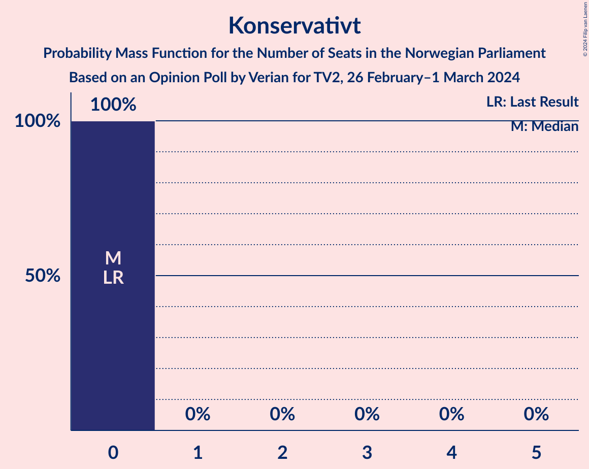

# Opinion Poll by Verian for TV2, 26 February–1 March 2024

<a href="#voting-intentions">Voting Intentions</a> | <a href="#seats">Seats</a> | <a href="#coalitions">Coalitions</a> | <a href="#technical-information">Technical Information</a>

## Voting Intentions

### Confidence Intervals

| Party | Last Result | Poll Result | 80% Confidence Interval | 90% Confidence Interval | 95% Confidence Interval | 99% Confidence Interval |
|:-----:|:-----------:|:-----------:|:-----------------------:|:-----------------------:|:-----------------------:|:-----------------------:|
| Høyre | 20.4% | 26.9% | 25.2–28.8% |24.7–29.3% |24.3–29.8% |23.4–30.7% |
| Arbeiderpartiet | 26.2% | 19.5% | 18.0–21.2% |17.5–21.7% |17.2–22.1% |16.5–22.9% |
| Fremskrittspartiet | 11.6% | 13.8% | 12.5–15.3% |12.1–15.7% |11.8–16.1% |11.2–16.8% |
| Sosialistisk Venstreparti | 7.6% | 9.1% | 8.0–10.4% |7.7–10.7% |7.5–11.1% |7.0–11.7% |
| Senterpartiet | 13.5% | 6.2% | 5.3–7.3% |5.1–7.6% |4.9–7.9% |4.5–8.4% |
| Venstre | 4.6% | 5.8% | 5.0–6.9% |4.7–7.2% |4.5–7.4% |4.1–8.0% |
| Rødt | 4.7% | 5.6% | 4.8–6.7% |4.5–7.0% |4.3–7.2% |4.0–7.8% |
| Miljøpartiet De Grønne | 3.9% | 3.3% | 2.7–4.2% |2.5–4.4% |2.4–4.6% |2.1–5.0% |
| Kristelig Folkeparti | 3.8% | 3.0% | 2.4–3.8% |2.2–4.1% |2.1–4.3% |1.9–4.7% |
| Industri- og Næringspartiet | 0.3% | 2.9% | 2.3–3.7% |2.2–3.9% |2.0–4.1% |1.8–4.6% |
| Pensjonistpartiet | 0.6% | 0.8% | 0.5–1.3% |0.5–1.4% |0.4–1.6% |0.3–1.9% |
| Norgesdemokratene | 1.1% | 0.6% | 0.4–1.1% |0.3–1.2% |0.3–1.3% |0.2–1.6% |
| Liberalistene | 0.2% | 0.4% | 0.2–0.8% |0.2–0.9% |0.2–1.0% |0.1–1.3% |
| Konservativt | 0.4% | 0.2% | 0.1–0.5% |0.1–0.6% |0.1–0.7% |0.0–0.9% |

*Note:* The poll result column reflects the actual value used in the calculations. Published results may vary slightly, and in addition be rounded to fewer digits.

## Seats

### Confidence Intervals

| Party | Last Result | Median | 80% Confidence Interval | 90% Confidence Interval | 95% Confidence Interval | 99% Confidence Interval |
|:-----:|:-----------:|:------:|:-----------------------:|:-----------------------:|:-----------------------:|:-----------------------:|
| <a href="#høyre">Høyre</a> | 36 | 50 | 48–52 |47–53 |46–53 |43–55 |
| <a href="#arbeiderpartiet">Arbeiderpartiet</a> | 48 | 37 | 36–39 |36–41 |35–42 |33–46 |
| <a href="#fremskrittspartiet">Fremskrittspartiet</a> | 21 | 24 | 23–26 |23–27 |21–29 |19–33 |
| <a href="#sosialistisk-venstreparti">Sosialistisk Venstreparti</a> | 13 | 17 | 16–19 |15–19 |13–19 |12–21 |
| <a href="#senterpartiet">Senterpartiet</a> | 28 | 11 | 10–14 |9–14 |8–14 |8–15 |
| <a href="#venstre">Venstre</a> | 8 | 12 | 11–12 |9–12 |8–12 |3–14 |
| <a href="#rødt">Rødt</a> | 8 | 10 | 7–10 |1–10 |1–11 |1–14 |
| <a href="#miljøpartiet-de-grønne">Miljøpartiet De Grønne</a> | 3 | 2 | 1–3 |1–7 |1–8 |1–8 |
| <a href="#kristelig-folkeparti">Kristelig Folkeparti</a> | 3 | 2 | 2–3 |2–3 |2–3 |0–8 |
| <a href="#industri--og-næringspartiet">Industri- og Næringspartiet</a> | 0 | 2 | 2–3 |0–3 |0–3 |0–7 |
| <a href="#pensjonistpartiet">Pensjonistpartiet</a> | 0 | 0 | 0 |0 |0 |0 |
| <a href="#norgesdemokratene">Norgesdemokratene</a> | 0 | 0 | 0 |0 |0 |0 |
| <a href="#liberalistene">Liberalistene</a> | 0 | 0 | 0 |0 |0 |0 |
| <a href="#konservativt">Konservativt</a> | 0 | 0 | 0 |0 |0 |0 |

### Høyre

*For a full overview of the results for this party, see the [Høyre](party-høyre.html) page.*

| Number of Seats | Probability | Accumulated | Special Marks |
|:---------------:|:-----------:|:-----------:|:-------------:|
| 36 | 0% | 100% | Last Result |
| 37 | 0% | 100% |  |
| 38 | 0% | 100% |  |
| 39 | 0% | 100% |  |
| 40 | 0% | 100% |  |
| 41 | 0.1% | 100% |  |
| 42 | 0.1% | 99.8% |  |
| 43 | 0.5% | 99.7% |  |
| 44 | 0.8% | 99.2% |  |
| 45 | 0.4% | 98% |  |
| 46 | 2% | 98% |  |
| 47 | 2% | 96% |  |
| 48 | 10% | 94% |  |
| 49 | 3% | 84% |  |
| 50 | 38% | 81% | Median |
| 51 | 1.1% | 42% |  |
| 52 | 31% | 41% |  |
| 53 | 8% | 10% |  |
| 54 | 1.4% | 2% |  |
| 55 | 0.2% | 0.6% |  |
| 56 | 0.2% | 0.3% |  |
| 57 | 0.1% | 0.1% |  |
| 58 | 0% | 0% |  |

### Arbeiderpartiet

*For a full overview of the results for this party, see the [Arbeiderpartiet](party-arbeiderpartiet.html) page.*

| Number of Seats | Probability | Accumulated | Special Marks |
|:---------------:|:-----------:|:-----------:|:-------------:|
| 32 | 0.3% | 100% |  |
| 33 | 1.0% | 99.6% |  |
| 34 | 1.1% | 98.6% |  |
| 35 | 1.0% | 98% |  |
| 36 | 41% | 97% |  |
| 37 | 38% | 55% | Median |
| 38 | 2% | 17% |  |
| 39 | 8% | 16% |  |
| 40 | 0.9% | 7% |  |
| 41 | 3% | 6% |  |
| 42 | 2% | 4% |  |
| 43 | 0.5% | 2% |  |
| 44 | 0.6% | 2% |  |
| 45 | 0% | 1.1% |  |
| 46 | 0.9% | 1.1% |  |
| 47 | 0.1% | 0.1% |  |
| 48 | 0% | 0% | Last Result |

### Fremskrittspartiet

*For a full overview of the results for this party, see the [Fremskrittspartiet](party-fremskrittspartiet.html) page.*

| Number of Seats | Probability | Accumulated | Special Marks |
|:---------------:|:-----------:|:-----------:|:-------------:|
| 18 | 0.1% | 100% |  |
| 19 | 1.0% | 99.9% |  |
| 20 | 0.2% | 98.8% |  |
| 21 | 2% | 98.6% | Last Result |
| 22 | 1.0% | 97% |  |
| 23 | 31% | 96% |  |
| 24 | 44% | 64% | Median |
| 25 | 0.7% | 20% |  |
| 26 | 11% | 19% |  |
| 27 | 4% | 9% |  |
| 28 | 2% | 4% |  |
| 29 | 0.8% | 3% |  |
| 30 | 0.5% | 2% |  |
| 31 | 0.6% | 1.3% |  |
| 32 | 0.1% | 0.6% |  |
| 33 | 0.5% | 0.6% |  |
| 34 | 0% | 0.1% |  |
| 35 | 0% | 0.1% |  |
| 36 | 0% | 0% |  |

### Sosialistisk Venstreparti

*For a full overview of the results for this party, see the [Sosialistisk Venstreparti](party-sosialistiskvenstreparti.html) page.*

| Number of Seats | Probability | Accumulated | Special Marks |
|:---------------:|:-----------:|:-----------:|:-------------:|
| 11 | 0.1% | 100% |  |
| 12 | 1.4% | 99.9% |  |
| 13 | 2% | 98.5% | Last Result |
| 14 | 1.4% | 97% |  |
| 15 | 4% | 96% |  |
| 16 | 4% | 92% |  |
| 17 | 40% | 88% | Median |
| 18 | 2% | 48% |  |
| 19 | 44% | 46% |  |
| 20 | 0.6% | 1.5% |  |
| 21 | 0.8% | 0.9% |  |
| 22 | 0% | 0.1% |  |
| 23 | 0% | 0% |  |

### Senterpartiet

*For a full overview of the results for this party, see the [Senterpartiet](party-senterpartiet.html) page.*

| Number of Seats | Probability | Accumulated | Special Marks |
|:---------------:|:-----------:|:-----------:|:-------------:|
| 7 | 0.3% | 100% |  |
| 8 | 3% | 99.7% |  |
| 9 | 3% | 96% |  |
| 10 | 31% | 93% |  |
| 11 | 39% | 62% | Median |
| 12 | 2% | 23% |  |
| 13 | 11% | 21% |  |
| 14 | 10% | 10% |  |
| 15 | 0.4% | 0.6% |  |
| 16 | 0.1% | 0.2% |  |
| 17 | 0% | 0% |  |
| 18 | 0% | 0% |  |
| 19 | 0% | 0% |  |
| 20 | 0% | 0% |  |
| 21 | 0% | 0% |  |
| 22 | 0% | 0% |  |
| 23 | 0% | 0% |  |
| 24 | 0% | 0% |  |
| 25 | 0% | 0% |  |
| 26 | 0% | 0% |  |
| 27 | 0% | 0% |  |
| 28 | 0% | 0% | Last Result |

### Venstre

*For a full overview of the results for this party, see the [Venstre](party-venstre.html) page.*

| Number of Seats | Probability | Accumulated | Special Marks |
|:---------------:|:-----------:|:-----------:|:-------------:|
| 3 | 0.7% | 100% |  |
| 4 | 0% | 99.3% |  |
| 5 | 0% | 99.3% |  |
| 6 | 0% | 99.3% |  |
| 7 | 0.2% | 99.3% |  |
| 8 | 3% | 99.2% | Last Result |
| 9 | 3% | 96% |  |
| 10 | 3% | 93% |  |
| 11 | 18% | 90% |  |
| 12 | 70% | 72% | Median |
| 13 | 2% | 2% |  |
| 14 | 0.7% | 0.9% |  |
| 15 | 0.1% | 0.2% |  |
| 16 | 0.1% | 0.1% |  |
| 17 | 0% | 0% |  |

### Rødt

*For a full overview of the results for this party, see the [Rødt](party-rødt.html) page.*

| Number of Seats | Probability | Accumulated | Special Marks |
|:---------------:|:-----------:|:-----------:|:-------------:|
| 1 | 7% | 100% |  |
| 2 | 0% | 93% |  |
| 3 | 0% | 93% |  |
| 4 | 0% | 93% |  |
| 5 | 0% | 93% |  |
| 6 | 0% | 93% |  |
| 7 | 4% | 93% |  |
| 8 | 2% | 89% | Last Result |
| 9 | 3% | 87% |  |
| 10 | 80% | 83% | Median |
| 11 | 2% | 4% |  |
| 12 | 0.9% | 2% |  |
| 13 | 0.2% | 1.2% |  |
| 14 | 1.0% | 1.0% |  |
| 15 | 0% | 0% |  |

### Miljøpartiet De Grønne

*For a full overview of the results for this party, see the [Miljøpartiet De Grønne](party-miljøpartietdegrønne.html) page.*

| Number of Seats | Probability | Accumulated | Special Marks |
|:---------------:|:-----------:|:-----------:|:-------------:|
| 1 | 40% | 100% |  |
| 2 | 35% | 60% | Median |
| 3 | 17% | 24% | Last Result |
| 4 | 0% | 7% |  |
| 5 | 0% | 7% |  |
| 6 | 0.1% | 7% |  |
| 7 | 3% | 7% |  |
| 8 | 4% | 4% |  |
| 9 | 0.2% | 0.3% |  |
| 10 | 0% | 0.1% |  |
| 11 | 0% | 0% |  |

### Kristelig Folkeparti

*For a full overview of the results for this party, see the [Kristelig Folkeparti](party-kristeligfolkeparti.html) page.*

| Number of Seats | Probability | Accumulated | Special Marks |
|:---------------:|:-----------:|:-----------:|:-------------:|
| 0 | 0.8% | 100% |  |
| 1 | 0.4% | 99.2% |  |
| 2 | 66% | 98.9% | Median |
| 3 | 31% | 33% | Last Result |
| 4 | 0% | 2% |  |
| 5 | 0% | 2% |  |
| 6 | 0% | 2% |  |
| 7 | 2% | 2% |  |
| 8 | 0.5% | 0.6% |  |
| 9 | 0.1% | 0.1% |  |
| 10 | 0% | 0% |  |

### Industri- og Næringspartiet

*For a full overview of the results for this party, see the [Industri- og Næringspartiet](party-industri-ognæringspartiet.html) page.*

| Number of Seats | Probability | Accumulated | Special Marks |
|:---------------:|:-----------:|:-----------:|:-------------:|
| 0 | 5% | 100% | Last Result |
| 1 | 0.6% | 95% |  |
| 2 | 62% | 94% | Median |
| 3 | 32% | 33% |  |
| 4 | 0% | 0.6% |  |
| 5 | 0% | 0.6% |  |
| 6 | 0.1% | 0.6% |  |
| 7 | 0.3% | 0.6% |  |
| 8 | 0.2% | 0.3% |  |
| 9 | 0.1% | 0.1% |  |
| 10 | 0% | 0% |  |

### Pensjonistpartiet

*For a full overview of the results for this party, see the [Pensjonistpartiet](party-pensjonistpartiet.html) page.*

| Number of Seats | Probability | Accumulated | Special Marks |
|:---------------:|:-----------:|:-----------:|:-------------:|
| 0 | 99.7% | 100% | Last Result, Median |
| 1 | 0.3% | 0.3% |  |
| 2 | 0% | 0% |  |

### Norgesdemokratene

*For a full overview of the results for this party, see the [Norgesdemokratene](party-norgesdemokratene.html) page.*

| Number of Seats | Probability | Accumulated | Special Marks |
|:---------------:|:-----------:|:-----------:|:-------------:|
| 0 | 100% | 100% | Last Result, Median |

### Liberalistene

*For a full overview of the results for this party, see the [Liberalistene](party-liberalistene.html) page.*

| Number of Seats | Probability | Accumulated | Special Marks |
|:---------------:|:-----------:|:-----------:|:-------------:|
| 0 | 100% | 100% | Last Result, Median |

### Konservativt

*For a full overview of the results for this party, see the [Konservativt](party-konservativt.html) page.*

| Number of Seats | Probability | Accumulated | Special Marks |
|:---------------:|:-----------:|:-----------:|:-------------:|
| 0 | 100% | 100% | Last Result, Median |

## Coalitions

### Confidence Intervals

| Coalition | Last Result | Median | Majority? | 80% Confidence Interval | 90% Confidence Interval | 95% Confidence Interval | 99% Confidence Interval |
|:---------:|:-----------:|:------:|:---------:|:-----------------------:|:-----------------------:|:-----------------------:|:-----------------------:|
| Høyre – Fremskrittspartiet – Senterpartiet – Venstre – Kristelig Folkeparti | 96 | 100 | 100% | 99–101 | 95–104 | 94–104 | 89–105 |
| Høyre – Fremskrittspartiet – Venstre – Miljøpartiet De Grønne – Kristelig Folkeparti | 71 | 90 | 99.3% | 89–93 | 87–94 | 85–99 | 84–101 |
| Høyre – Fremskrittspartiet – Venstre – Kristelig Folkeparti | 68 | 88 | 94% | 87–90 | 84–92 | 80–93 | 77–94 |
| Høyre – Fremskrittspartiet – Venstre | 65 | 86 | 92% | 85–88 | 81–90 | 78–91 | 75–92 |
| Arbeiderpartiet – Sosialistisk Venstreparti – Senterpartiet – Rødt – Miljøpartiet De Grønne | 100 | 78 | 3% | 75–79 | 75–82 | 74–86 | 71–89 |
| Arbeiderpartiet – Sosialistisk Venstreparti – Senterpartiet – Rødt | 97 | 76 | 0% | 73–77 | 71–79 | 68–80 | 67–82 |
| Høyre – Fremskrittspartiet | 57 | 74 | 0.1% | 74–77 | 71–78 | 69–79 | 65–82 |
| Arbeiderpartiet – Sosialistisk Venstreparti – Senterpartiet – Miljøpartiet De Grønne – Kristelig Folkeparti | 95 | 70 | 0% | 68–77 | 68–77 | 68–79 | 64–81 |
| Arbeiderpartiet – Sosialistisk Venstreparti – Senterpartiet – Miljøpartiet De Grønne | 92 | 68 | 0% | 65–73 | 65–75 | 65–77 | 62–79 |
| Arbeiderpartiet – Sosialistisk Venstreparti – Rødt – Miljøpartiet De Grønne | 72 | 66 | 0% | 64–67 | 62–71 | 62–72 | 60–77 |
| Arbeiderpartiet – Sosialistisk Venstreparti – Senterpartiet | 89 | 67 | 0% | 63–70 | 62–72 | 60–72 | 59–72 |
| Høyre – Venstre – Kristelig Folkeparti | 47 | 64 | 0% | 61–67 | 59–67 | 58–67 | 55–67 |
| Arbeiderpartiet – Senterpartiet – Miljøpartiet De Grønne – Kristelig Folkeparti | 82 | 51 | 0% | 51–58 | 51–59 | 51–64 | 48–68 |
| Arbeiderpartiet – Sosialistisk Venstreparti | 61 | 56 | 0% | 53–58 | 52–58 | 51–59 | 48–61 |
| Arbeiderpartiet – Senterpartiet – Kristelig Folkeparti | 79 | 50 | 0% | 49–55 | 49–55 | 47–57 | 46–60 |
| Arbeiderpartiet – Senterpartiet | 76 | 48 | 0% | 46–53 | 46–53 | 45–55 | 44–58 |
| Senterpartiet – Venstre – Kristelig Folkeparti | 39 | 25 | 0% | 24–27 | 22–27 | 20–28 | 18–30 |

### Høyre – Fremskrittspartiet – Senterpartiet – Venstre – Kristelig Folkeparti

| Number of Seats | Probability | Accumulated | Special Marks |
|:---------------:|:-----------:|:-----------:|:-------------:|
| 85 | 0.1% | 100% | Majority |
| 86 | 0% | 99.9% |  |
| 87 | 0% | 99.9% |  |
| 88 | 0% | 99.9% |  |
| 89 | 0.9% | 99.9% |  |
| 90 | 0.1% | 99.0% |  |
| 91 | 0.4% | 98.9% |  |
| 92 | 0.2% | 98% |  |
| 93 | 0.7% | 98% |  |
| 94 | 2% | 98% |  |
| 95 | 1.0% | 96% |  |
| 96 | 0.5% | 95% | Last Result |
| 97 | 1.3% | 94% |  |
| 98 | 0.8% | 93% |  |
| 99 | 38% | 92% | Median |
| 100 | 40% | 54% |  |
| 101 | 5% | 15% |  |
| 102 | 0.7% | 10% |  |
| 103 | 0.8% | 9% |  |
| 104 | 7% | 8% |  |
| 105 | 0.7% | 1.2% |  |
| 106 | 0.2% | 0.5% |  |
| 107 | 0.2% | 0.3% |  |
| 108 | 0.1% | 0.1% |  |
| 109 | 0% | 0.1% |  |
| 110 | 0% | 0.1% |  |
| 111 | 0% | 0% |  |

### Høyre – Fremskrittspartiet – Venstre – Miljøpartiet De Grønne – Kristelig Folkeparti

| Number of Seats | Probability | Accumulated | Special Marks |
|:---------------:|:-----------:|:-----------:|:-------------:|
| 71 | 0% | 100% | Last Result |
| 72 | 0% | 100% |  |
| 73 | 0% | 100% |  |
| 74 | 0% | 100% |  |
| 75 | 0% | 100% |  |
| 76 | 0% | 100% |  |
| 77 | 0% | 100% |  |
| 78 | 0% | 100% |  |
| 79 | 0% | 100% |  |
| 80 | 0% | 100% |  |
| 81 | 0% | 100% |  |
| 82 | 0.3% | 99.9% |  |
| 83 | 0.1% | 99.6% |  |
| 84 | 0.3% | 99.5% |  |
| 85 | 2% | 99.3% | Majority |
| 86 | 0.6% | 97% |  |
| 87 | 2% | 96% |  |
| 88 | 1.2% | 95% |  |
| 89 | 37% | 93% |  |
| 90 | 11% | 56% | Median |
| 91 | 1.2% | 46% |  |
| 92 | 30% | 44% |  |
| 93 | 7% | 15% |  |
| 94 | 3% | 7% |  |
| 95 | 0.5% | 5% |  |
| 96 | 0.2% | 4% |  |
| 97 | 0.4% | 4% |  |
| 98 | 0.1% | 3% |  |
| 99 | 1.4% | 3% |  |
| 100 | 0.3% | 2% |  |
| 101 | 2% | 2% |  |
| 102 | 0% | 0% |  |

### Høyre – Fremskrittspartiet – Venstre – Kristelig Folkeparti

| Number of Seats | Probability | Accumulated | Special Marks |
|:---------------:|:-----------:|:-----------:|:-------------:|
| 68 | 0% | 100% | Last Result |
| 69 | 0% | 100% |  |
| 70 | 0% | 100% |  |
| 71 | 0% | 100% |  |
| 72 | 0% | 100% |  |
| 73 | 0% | 100% |  |
| 74 | 0% | 100% |  |
| 75 | 0% | 100% |  |
| 76 | 0.1% | 100% |  |
| 77 | 0.9% | 99.9% |  |
| 78 | 0.1% | 99.0% |  |
| 79 | 0.3% | 98.9% |  |
| 80 | 1.4% | 98.7% |  |
| 81 | 0.2% | 97% |  |
| 82 | 0.8% | 97% |  |
| 83 | 0.5% | 96% |  |
| 84 | 2% | 96% |  |
| 85 | 0.6% | 94% | Majority |
| 86 | 1.1% | 94% |  |
| 87 | 10% | 92% |  |
| 88 | 38% | 83% | Median |
| 89 | 0.9% | 44% |  |
| 90 | 36% | 43% |  |
| 91 | 0.6% | 7% |  |
| 92 | 3% | 7% |  |
| 93 | 3% | 3% |  |
| 94 | 0.1% | 0.6% |  |
| 95 | 0.1% | 0.5% |  |
| 96 | 0.1% | 0.4% |  |
| 97 | 0.2% | 0.3% |  |
| 98 | 0.1% | 0.1% |  |
| 99 | 0% | 0% |  |

### Høyre – Fremskrittspartiet – Venstre

| Number of Seats | Probability | Accumulated | Special Marks |
|:---------------:|:-----------:|:-----------:|:-------------:|
| 65 | 0% | 100% | Last Result |
| 66 | 0% | 100% |  |
| 67 | 0% | 100% |  |
| 68 | 0% | 100% |  |
| 69 | 0% | 100% |  |
| 70 | 0% | 100% |  |
| 71 | 0% | 100% |  |
| 72 | 0% | 100% |  |
| 73 | 0% | 100% |  |
| 74 | 0.1% | 100% |  |
| 75 | 0.9% | 99.9% |  |
| 76 | 0% | 98.9% |  |
| 77 | 0.2% | 98.9% |  |
| 78 | 2% | 98.7% |  |
| 79 | 0.7% | 97% |  |
| 80 | 0.9% | 96% |  |
| 81 | 1.1% | 95% |  |
| 82 | 1.0% | 94% |  |
| 83 | 0.4% | 93% |  |
| 84 | 0.6% | 93% |  |
| 85 | 11% | 92% | Majority |
| 86 | 38% | 81% | Median |
| 87 | 30% | 43% |  |
| 88 | 7% | 13% |  |
| 89 | 0.5% | 6% |  |
| 90 | 2% | 5% |  |
| 91 | 2% | 3% |  |
| 92 | 0.1% | 0.6% |  |
| 93 | 0.1% | 0.4% |  |
| 94 | 0% | 0.3% |  |
| 95 | 0.2% | 0.3% |  |
| 96 | 0.1% | 0.1% |  |
| 97 | 0% | 0% |  |

### Arbeiderpartiet – Sosialistisk Venstreparti – Senterpartiet – Rødt – Miljøpartiet De Grønne

| Number of Seats | Probability | Accumulated | Special Marks |
|:---------------:|:-----------:|:-----------:|:-------------:|
| 68 | 0% | 100% |  |
| 69 | 0.1% | 99.9% |  |
| 70 | 0.2% | 99.8% |  |
| 71 | 0.2% | 99.7% |  |
| 72 | 0.8% | 99.5% |  |
| 73 | 0.4% | 98.7% |  |
| 74 | 2% | 98% |  |
| 75 | 32% | 96% |  |
| 76 | 8% | 65% |  |
| 77 | 0.9% | 56% | Median |
| 78 | 38% | 55% |  |
| 79 | 10% | 17% |  |
| 80 | 1.2% | 8% |  |
| 81 | 0.7% | 6% |  |
| 82 | 2% | 6% |  |
| 83 | 0.9% | 4% |  |
| 84 | 0.2% | 3% |  |
| 85 | 0.3% | 3% | Majority |
| 86 | 1.4% | 3% |  |
| 87 | 0.1% | 1.3% |  |
| 88 | 0% | 1.2% |  |
| 89 | 1.1% | 1.1% |  |
| 90 | 0.1% | 0.1% |  |
| 91 | 0% | 0% |  |
| 92 | 0% | 0% |  |
| 93 | 0% | 0% |  |
| 94 | 0% | 0% |  |
| 95 | 0% | 0% |  |
| 96 | 0% | 0% |  |
| 97 | 0% | 0% |  |
| 98 | 0% | 0% |  |
| 99 | 0% | 0% |  |
| 100 | 0% | 0% | Last Result |

### Arbeiderpartiet – Sosialistisk Venstreparti – Senterpartiet – Rødt

| Number of Seats | Probability | Accumulated | Special Marks |
|:---------------:|:-----------:|:-----------:|:-------------:|
| 64 | 0% | 100% |  |
| 65 | 0% | 99.9% |  |
| 66 | 0.2% | 99.9% |  |
| 67 | 2% | 99.7% |  |
| 68 | 0.4% | 98% |  |
| 69 | 1.3% | 97% |  |
| 70 | 0.6% | 96% |  |
| 71 | 0.8% | 95% |  |
| 72 | 2% | 95% |  |
| 73 | 36% | 93% |  |
| 74 | 0.9% | 57% |  |
| 75 | 0.9% | 56% | Median |
| 76 | 10% | 55% |  |
| 77 | 37% | 44% |  |
| 78 | 1.4% | 7% |  |
| 79 | 2% | 5% |  |
| 80 | 1.2% | 4% |  |
| 81 | 2% | 2% |  |
| 82 | 0.2% | 0.6% |  |
| 83 | 0.2% | 0.4% |  |
| 84 | 0.2% | 0.2% |  |
| 85 | 0% | 0% | Majority |
| 86 | 0% | 0% |  |
| 87 | 0% | 0% |  |
| 88 | 0% | 0% |  |
| 89 | 0% | 0% |  |
| 90 | 0% | 0% |  |
| 91 | 0% | 0% |  |
| 92 | 0% | 0% |  |
| 93 | 0% | 0% |  |
| 94 | 0% | 0% |  |
| 95 | 0% | 0% |  |
| 96 | 0% | 0% |  |
| 97 | 0% | 0% | Last Result |

### Høyre – Fremskrittspartiet

| Number of Seats | Probability | Accumulated | Special Marks |
|:---------------:|:-----------:|:-----------:|:-------------:|
| 57 | 0% | 100% | Last Result |
| 58 | 0% | 100% |  |
| 59 | 0% | 100% |  |
| 60 | 0% | 100% |  |
| 61 | 0% | 100% |  |
| 62 | 0% | 100% |  |
| 63 | 0% | 100% |  |
| 64 | 0.1% | 100% |  |
| 65 | 0.9% | 99.9% |  |
| 66 | 0.3% | 99.0% |  |
| 67 | 0.3% | 98.7% |  |
| 68 | 0.5% | 98% |  |
| 69 | 0.7% | 98% |  |
| 70 | 2% | 97% |  |
| 71 | 0.8% | 95% |  |
| 72 | 1.0% | 94% |  |
| 73 | 1.2% | 93% |  |
| 74 | 47% | 92% | Median |
| 75 | 30% | 46% |  |
| 76 | 0.8% | 16% |  |
| 77 | 9% | 15% |  |
| 78 | 1.3% | 6% |  |
| 79 | 3% | 5% |  |
| 80 | 0.7% | 2% |  |
| 81 | 1.1% | 2% |  |
| 82 | 0.2% | 0.5% |  |
| 83 | 0.2% | 0.4% |  |
| 84 | 0.1% | 0.2% |  |
| 85 | 0% | 0.1% | Majority |
| 86 | 0.1% | 0.1% |  |
| 87 | 0% | 0% |  |

### Arbeiderpartiet – Sosialistisk Venstreparti – Senterpartiet – Miljøpartiet De Grønne – Kristelig Folkeparti

| Number of Seats | Probability | Accumulated | Special Marks |
|:---------------:|:-----------:|:-----------:|:-------------:|
| 60 | 0.1% | 100% |  |
| 61 | 0% | 99.9% |  |
| 62 | 0% | 99.9% |  |
| 63 | 0% | 99.8% |  |
| 64 | 0.8% | 99.8% |  |
| 65 | 0.3% | 99.0% |  |
| 66 | 0.3% | 98.7% |  |
| 67 | 0.8% | 98% |  |
| 68 | 30% | 98% |  |
| 69 | 2% | 67% | Median |
| 70 | 39% | 65% |  |
| 71 | 11% | 25% |  |
| 72 | 0.6% | 15% |  |
| 73 | 0.7% | 14% |  |
| 74 | 0.6% | 13% |  |
| 75 | 0.9% | 13% |  |
| 76 | 1.3% | 12% |  |
| 77 | 7% | 11% |  |
| 78 | 0.5% | 4% |  |
| 79 | 2% | 3% |  |
| 80 | 0% | 1.3% |  |
| 81 | 1.1% | 1.3% |  |
| 82 | 0% | 0.2% |  |
| 83 | 0.1% | 0.2% |  |
| 84 | 0% | 0% |  |
| 85 | 0% | 0% | Majority |
| 86 | 0% | 0% |  |
| 87 | 0% | 0% |  |
| 88 | 0% | 0% |  |
| 89 | 0% | 0% |  |
| 90 | 0% | 0% |  |
| 91 | 0% | 0% |  |
| 92 | 0% | 0% |  |
| 93 | 0% | 0% |  |
| 94 | 0% | 0% |  |
| 95 | 0% | 0% | Last Result |

### Arbeiderpartiet – Sosialistisk Venstreparti – Senterpartiet – Miljøpartiet De Grønne

| Number of Seats | Probability | Accumulated | Special Marks |
|:---------------:|:-----------:|:-----------:|:-------------:|
| 58 | 0.1% | 100% |  |
| 59 | 0% | 99.9% |  |
| 60 | 0% | 99.9% |  |
| 61 | 0% | 99.8% |  |
| 62 | 0.8% | 99.8% |  |
| 63 | 0.3% | 99.0% |  |
| 64 | 0.3% | 98.6% |  |
| 65 | 30% | 98% |  |
| 66 | 1.4% | 68% |  |
| 67 | 2% | 67% | Median |
| 68 | 40% | 65% |  |
| 69 | 12% | 25% |  |
| 70 | 0.6% | 13% |  |
| 71 | 0.6% | 13% |  |
| 72 | 1.3% | 12% |  |
| 73 | 0.8% | 11% |  |
| 74 | 0.5% | 10% |  |
| 75 | 7% | 9% |  |
| 76 | 0.2% | 3% |  |
| 77 | 1.4% | 3% |  |
| 78 | 0% | 1.2% |  |
| 79 | 1.0% | 1.2% |  |
| 80 | 0% | 0.2% |  |
| 81 | 0.1% | 0.2% |  |
| 82 | 0% | 0% |  |
| 83 | 0% | 0% |  |
| 84 | 0% | 0% |  |
| 85 | 0% | 0% | Majority |
| 86 | 0% | 0% |  |
| 87 | 0% | 0% |  |
| 88 | 0% | 0% |  |
| 89 | 0% | 0% |  |
| 90 | 0% | 0% |  |
| 91 | 0% | 0% |  |
| 92 | 0% | 0% | Last Result |

### Arbeiderpartiet – Sosialistisk Venstreparti – Rødt – Miljøpartiet De Grønne

| Number of Seats | Probability | Accumulated | Special Marks |
|:---------------:|:-----------:|:-----------:|:-------------:|
| 56 | 0% | 100% |  |
| 57 | 0% | 99.9% |  |
| 58 | 0.1% | 99.9% |  |
| 59 | 0% | 99.8% |  |
| 60 | 0.3% | 99.8% |  |
| 61 | 0.1% | 99.5% |  |
| 62 | 8% | 99.4% |  |
| 63 | 0.7% | 92% |  |
| 64 | 1.4% | 91% |  |
| 65 | 32% | 90% |  |
| 66 | 10% | 58% | Median |
| 67 | 39% | 48% |  |
| 68 | 1.4% | 9% |  |
| 69 | 1.3% | 7% |  |
| 70 | 0.8% | 6% |  |
| 71 | 1.2% | 5% |  |
| 72 | 2% | 4% | Last Result |
| 73 | 0.2% | 2% |  |
| 74 | 0.3% | 2% |  |
| 75 | 0.1% | 1.4% |  |
| 76 | 0.1% | 1.3% |  |
| 77 | 1.1% | 1.2% |  |
| 78 | 0% | 0.1% |  |
| 79 | 0% | 0.1% |  |
| 80 | 0% | 0.1% |  |
| 81 | 0.1% | 0.1% |  |
| 82 | 0% | 0% |  |

### Arbeiderpartiet – Sosialistisk Venstreparti – Senterpartiet

| Number of Seats | Probability | Accumulated | Special Marks |
|:---------------:|:-----------:|:-----------:|:-------------:|
| 56 | 0.1% | 100% |  |
| 57 | 0.2% | 99.9% |  |
| 58 | 0.1% | 99.6% |  |
| 59 | 0.3% | 99.6% |  |
| 60 | 2% | 99.3% |  |
| 61 | 1.0% | 97% |  |
| 62 | 1.4% | 96% |  |
| 63 | 30% | 95% |  |
| 64 | 2% | 65% |  |
| 65 | 2% | 63% | Median |
| 66 | 10% | 61% |  |
| 67 | 38% | 51% |  |
| 68 | 0.8% | 13% |  |
| 69 | 0.7% | 12% |  |
| 70 | 3% | 11% |  |
| 71 | 1.2% | 8% |  |
| 72 | 7% | 7% |  |
| 73 | 0.2% | 0.5% |  |
| 74 | 0.1% | 0.3% |  |
| 75 | 0.2% | 0.2% |  |
| 76 | 0% | 0% |  |
| 77 | 0% | 0% |  |
| 78 | 0% | 0% |  |
| 79 | 0% | 0% |  |
| 80 | 0% | 0% |  |
| 81 | 0% | 0% |  |
| 82 | 0% | 0% |  |
| 83 | 0% | 0% |  |
| 84 | 0% | 0% |  |
| 85 | 0% | 0% | Majority |
| 86 | 0% | 0% |  |
| 87 | 0% | 0% |  |
| 88 | 0% | 0% |  |
| 89 | 0% | 0% | Last Result |

### Høyre – Venstre – Kristelig Folkeparti

| Number of Seats | Probability | Accumulated | Special Marks |
|:---------------:|:-----------:|:-----------:|:-------------:|
| 47 | 0% | 100% | Last Result |
| 48 | 0% | 100% |  |
| 49 | 0% | 100% |  |
| 50 | 0% | 100% |  |
| 51 | 0.1% | 100% |  |
| 52 | 0% | 99.9% |  |
| 53 | 0% | 99.9% |  |
| 54 | 0.3% | 99.8% |  |
| 55 | 0.1% | 99.6% |  |
| 56 | 0.2% | 99.4% |  |
| 57 | 0.8% | 99.2% |  |
| 58 | 2% | 98% |  |
| 59 | 2% | 96% |  |
| 60 | 1.2% | 94% |  |
| 61 | 10% | 93% |  |
| 62 | 1.0% | 83% |  |
| 63 | 0.4% | 82% |  |
| 64 | 39% | 82% | Median |
| 65 | 3% | 43% |  |
| 66 | 10% | 40% |  |
| 67 | 30% | 30% |  |
| 68 | 0.2% | 0.4% |  |
| 69 | 0% | 0.3% |  |
| 70 | 0.1% | 0.2% |  |
| 71 | 0.1% | 0.2% |  |
| 72 | 0% | 0.1% |  |
| 73 | 0% | 0% |  |

### Arbeiderpartiet – Senterpartiet – Miljøpartiet De Grønne – Kristelig Folkeparti

| Number of Seats | Probability | Accumulated | Special Marks |
|:---------------:|:-----------:|:-----------:|:-------------:|
| 46 | 0.1% | 100% |  |
| 47 | 0.1% | 99.9% |  |
| 48 | 0.5% | 99.8% |  |
| 49 | 0.2% | 99.2% |  |
| 50 | 0.5% | 99.0% |  |
| 51 | 67% | 98% |  |
| 52 | 2% | 31% | Median |
| 53 | 0.7% | 30% |  |
| 54 | 14% | 29% |  |
| 55 | 1.2% | 15% |  |
| 56 | 1.0% | 14% |  |
| 57 | 0.4% | 13% |  |
| 58 | 7% | 12% |  |
| 59 | 0.6% | 5% |  |
| 60 | 0.2% | 5% |  |
| 61 | 0.2% | 4% |  |
| 62 | 0.2% | 4% |  |
| 63 | 0.2% | 4% |  |
| 64 | 3% | 4% |  |
| 65 | 0.1% | 1.2% |  |
| 66 | 0.2% | 1.1% |  |
| 67 | 0% | 1.0% |  |
| 68 | 1.0% | 1.0% |  |
| 69 | 0% | 0% |  |
| 70 | 0% | 0% |  |
| 71 | 0% | 0% |  |
| 72 | 0% | 0% |  |
| 73 | 0% | 0% |  |
| 74 | 0% | 0% |  |
| 75 | 0% | 0% |  |
| 76 | 0% | 0% |  |
| 77 | 0% | 0% |  |
| 78 | 0% | 0% |  |
| 79 | 0% | 0% |  |
| 80 | 0% | 0% |  |
| 81 | 0% | 0% |  |
| 82 | 0% | 0% | Last Result |

### Arbeiderpartiet – Sosialistisk Venstreparti

| Number of Seats | Probability | Accumulated | Special Marks |
|:---------------:|:-----------:|:-----------:|:-------------:|
| 47 | 0.3% | 100% |  |
| 48 | 0.3% | 99.7% |  |
| 49 | 0.5% | 99.4% |  |
| 50 | 0.5% | 98.9% |  |
| 51 | 2% | 98% |  |
| 52 | 3% | 97% |  |
| 53 | 39% | 94% |  |
| 54 | 3% | 55% | Median |
| 55 | 1.3% | 52% |  |
| 56 | 40% | 51% |  |
| 57 | 0.7% | 11% |  |
| 58 | 7% | 10% |  |
| 59 | 2% | 3% |  |
| 60 | 0.5% | 1.0% |  |
| 61 | 0.3% | 0.6% | Last Result |
| 62 | 0.1% | 0.3% |  |
| 63 | 0% | 0.2% |  |
| 64 | 0.1% | 0.2% |  |
| 65 | 0% | 0% |  |

### Arbeiderpartiet – Senterpartiet – Kristelig Folkeparti

| Number of Seats | Probability | Accumulated | Special Marks |
|:---------------:|:-----------:|:-----------:|:-------------:|
| 44 | 0.1% | 100% |  |
| 45 | 0% | 99.8% |  |
| 46 | 2% | 99.8% |  |
| 47 | 1.3% | 98% |  |
| 48 | 0.5% | 97% |  |
| 49 | 31% | 96% |  |
| 50 | 38% | 65% | Median |
| 51 | 10% | 27% |  |
| 52 | 2% | 16% |  |
| 53 | 1.2% | 14% |  |
| 54 | 1.2% | 13% |  |
| 55 | 7% | 12% |  |
| 56 | 0.4% | 5% |  |
| 57 | 3% | 5% |  |
| 58 | 0.4% | 2% |  |
| 59 | 0.1% | 2% |  |
| 60 | 1.0% | 1.5% |  |
| 61 | 0% | 0.5% |  |
| 62 | 0.4% | 0.4% |  |
| 63 | 0% | 0% |  |
| 64 | 0% | 0% |  |
| 65 | 0% | 0% |  |
| 66 | 0% | 0% |  |
| 67 | 0% | 0% |  |
| 68 | 0% | 0% |  |
| 69 | 0% | 0% |  |
| 70 | 0% | 0% |  |
| 71 | 0% | 0% |  |
| 72 | 0% | 0% |  |
| 73 | 0% | 0% |  |
| 74 | 0% | 0% |  |
| 75 | 0% | 0% |  |
| 76 | 0% | 0% |  |
| 77 | 0% | 0% |  |
| 78 | 0% | 0% |  |
| 79 | 0% | 0% | Last Result |

### Arbeiderpartiet – Senterpartiet

| Number of Seats | Probability | Accumulated | Special Marks |
|:---------------:|:-----------:|:-----------:|:-------------:|
| 42 | 0.1% | 100% |  |
| 43 | 0.1% | 99.8% |  |
| 44 | 2% | 99.7% |  |
| 45 | 1.3% | 98% |  |
| 46 | 30% | 96% |  |
| 47 | 2% | 67% |  |
| 48 | 38% | 65% | Median |
| 49 | 11% | 26% |  |
| 50 | 3% | 16% |  |
| 51 | 0.8% | 12% |  |
| 52 | 1.3% | 12% |  |
| 53 | 7% | 10% |  |
| 54 | 0.3% | 3% |  |
| 55 | 2% | 3% |  |
| 56 | 0.2% | 1.3% |  |
| 57 | 0% | 1.0% |  |
| 58 | 1.0% | 1.0% |  |
| 59 | 0% | 0% |  |
| 60 | 0% | 0% |  |
| 61 | 0% | 0% |  |
| 62 | 0% | 0% |  |
| 63 | 0% | 0% |  |
| 64 | 0% | 0% |  |
| 65 | 0% | 0% |  |
| 66 | 0% | 0% |  |
| 67 | 0% | 0% |  |
| 68 | 0% | 0% |  |
| 69 | 0% | 0% |  |
| 70 | 0% | 0% |  |
| 71 | 0% | 0% |  |
| 72 | 0% | 0% |  |
| 73 | 0% | 0% |  |
| 74 | 0% | 0% |  |
| 75 | 0% | 0% |  |
| 76 | 0% | 0% | Last Result |

### Senterpartiet – Venstre – Kristelig Folkeparti

| Number of Seats | Probability | Accumulated | Special Marks |
|:---------------:|:-----------:|:-----------:|:-------------:|
| 17 | 0.1% | 100% |  |
| 18 | 0.4% | 99.8% |  |
| 19 | 0.6% | 99.4% |  |
| 20 | 1.4% | 98.8% |  |
| 21 | 0.4% | 97% |  |
| 22 | 4% | 97% |  |
| 23 | 3% | 93% |  |
| 24 | 3% | 90% |  |
| 25 | 66% | 87% | Median |
| 26 | 10% | 20% |  |
| 27 | 7% | 11% |  |
| 28 | 2% | 4% |  |
| 29 | 2% | 2% |  |
| 30 | 0.1% | 0.5% |  |
| 31 | 0.3% | 0.4% |  |
| 32 | 0% | 0.1% |  |
| 33 | 0% | 0.1% |  |
| 34 | 0% | 0.1% |  |
| 35 | 0% | 0% |  |
| 36 | 0% | 0% |  |
| 37 | 0% | 0% |  |
| 38 | 0% | 0% |  |
| 39 | 0% | 0% | Last Result |

## Technical Information

### Opinion Poll

+ **Polling firm:** Verian
+ **Commissioner(s):** TV2
+ **Fieldwork period:** 26 February–1 March 2024

### Calculations

+ **Sample size:** 999
+ **Simulations done:** 1,048,576
+ **Error estimate:** 1.48%

