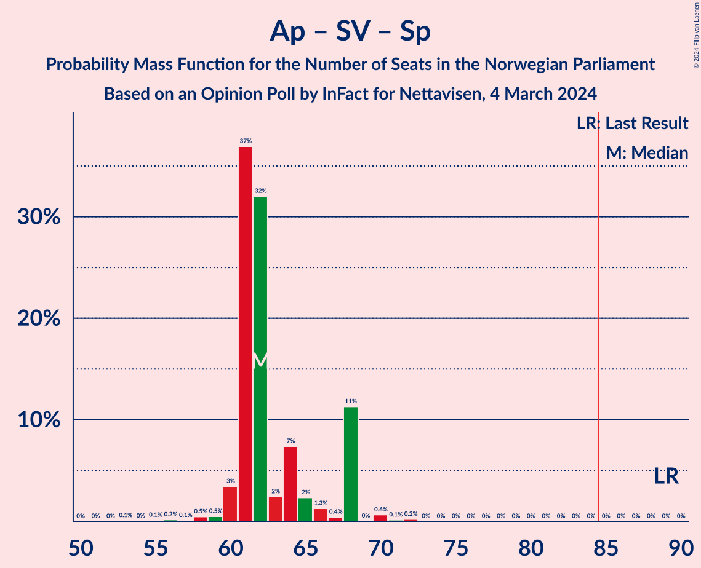
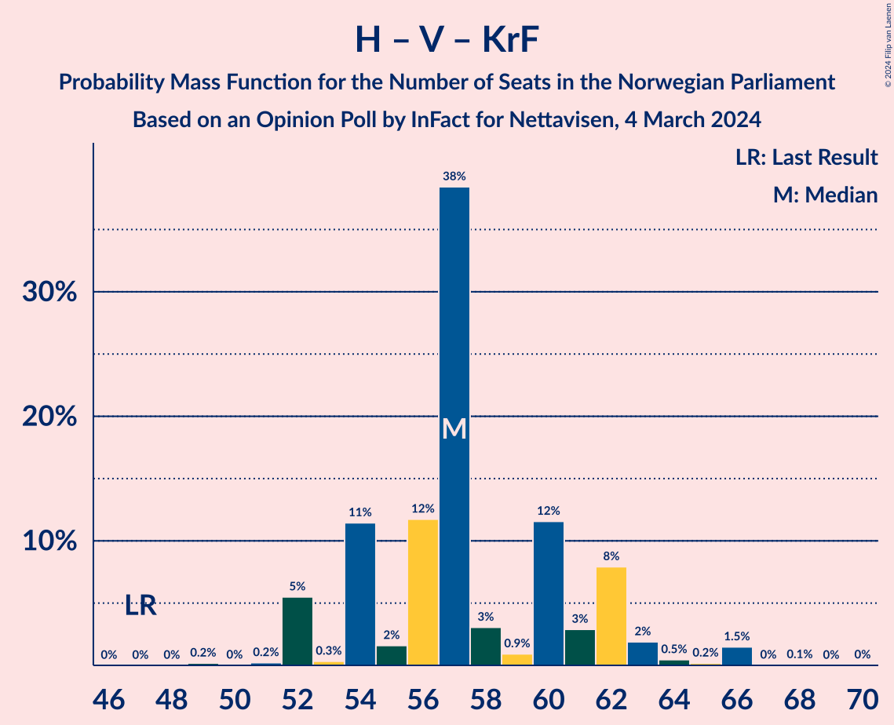

# Opinion Poll by InFact for Nettavisen, 4 March 2024

<a href="#voting-intentions">Voting Intentions</a> | <a href="#seats">Seats</a> | <a href="#coalitions">Coalitions</a> | <a href="#technical-information">Technical Information</a>

## Voting Intentions

### Confidence Intervals

| Party | Last Result | Poll Result | 80% Confidence Interval | 90% Confidence Interval | 95% Confidence Interval | 99% Confidence Interval |
|:-----:|:-----------:|:-----------:|:-----------------------:|:-----------------------:|:-----------------------:|:-----------------------:|
| Høyre | 20.4% | 26.0% | 24.4–27.8% |23.9–28.3% |23.5–28.7% |22.7–29.6% |
| Arbeiderpartiet | 26.2% | 17.8% | 16.4–19.4% |16.0–19.8% |15.7–20.2% |15.0–21.0% |
| Fremskrittspartiet | 11.6% | 15.7% | 14.4–17.2% |14.0–17.6% |13.7–18.0% |13.0–18.7% |
| Sosialistisk Venstreparti | 7.6% | 9.2% | 8.2–10.4% |7.9–10.8% |7.7–11.1% |7.2–11.7% |
| Senterpartiet | 13.5% | 7.2% | 6.3–8.3% |6.0–8.6% |5.8–8.9% |5.4–9.5% |
| Rødt | 4.7% | 6.7% | 5.8–7.7% |5.5–8.0% |5.3–8.3% |4.9–8.9% |
| Venstre | 4.6% | 5.7% | 4.8–6.7% |4.6–7.0% |4.4–7.2% |4.1–7.7% |
| Miljøpartiet De Grønne | 3.9% | 4.1% | 3.4–5.0% |3.2–5.2% |3.1–5.5% |2.8–5.9% |
| Kristelig Folkeparti | 3.8% | 3.5% | 2.9–4.3% |2.7–4.5% |2.5–4.7% |2.3–5.2% |
| Industri- og Næringspartiet | 0.3% | 2.5% | 2.0–3.2% |1.8–3.4% |1.7–3.6% |1.5–3.9% |
| Norgesdemokratene | 1.1% | 0.4% | 0.2–0.7% |0.2–0.8% |0.1–0.9% |0.1–1.2% |
| Pensjonistpartiet | 0.6% | 0.4% | 0.2–0.7% |0.2–0.8% |0.1–0.9% |0.1–1.2% |
| Konservativt | 0.4% | 0.1% | 0.0–0.4% |0.0–0.4% |0.0–0.5% |0.0–0.7% |

*Note:* The poll result column reflects the actual value used in the calculations. Published results may vary slightly, and in addition be rounded to fewer digits.

## Seats

### Confidence Intervals

| Party | Last Result | Median | 80% Confidence Interval | 90% Confidence Interval | 95% Confidence Interval | 99% Confidence Interval |
|:-----:|:-----------:|:------:|:-----------------------:|:-----------------------:|:-----------------------:|:-----------------------:|
| <a href="#høyre">Høyre</a> | 36 | 45 | 42–49 |41–50 |41–50 |40–51 |
| <a href="#arbeiderpartiet">Arbeiderpartiet</a> | 48 | 35 | 30–37 |30–37 |30–37 |30–38 |
| <a href="#fremskrittspartiet">Fremskrittspartiet</a> | 21 | 30 | 26–34 |25–36 |25–36 |23–36 |
| <a href="#sosialistisk-venstreparti">Sosialistisk Venstreparti</a> | 13 | 16 | 14–19 |14–19 |14–19 |13–20 |
| <a href="#senterpartiet">Senterpartiet</a> | 28 | 12 | 11–15 |11–15 |11–15 |10–16 |
| <a href="#rødt">Rødt</a> | 8 | 11 | 9–14 |9–14 |9–14 |9–15 |
| <a href="#venstre">Venstre</a> | 8 | 10 | 8–11 |8–11 |8–13 |3–14 |
| <a href="#miljøpartiet-de-grønne">Miljøpartiet De Grønne</a> | 3 | 7 | 2–8 |2–9 |2–10 |1–10 |
| <a href="#kristelig-folkeparti">Kristelig Folkeparti</a> | 3 | 2 | 1–3 |1–3 |1–7 |1–8 |
| <a href="#industri--og-næringspartiet">Industri- og Næringspartiet</a> | 0 | 0 | 0–2 |0–2 |0–2 |0–3 |
| <a href="#norgesdemokratene">Norgesdemokratene</a> | 0 | 0 | 0 |0 |0 |0 |
| <a href="#pensjonistpartiet">Pensjonistpartiet</a> | 0 | 0 | 0 |0 |0 |0 |
| <a href="#konservativt">Konservativt</a> | 0 | 0 | 0 |0 |0 |0 |

### Høyre

*For a full overview of the results for this party, see the [Høyre](party-høyre.html) page.*

| Number of Seats | Probability | Accumulated | Special Marks |
|:---------------:|:-----------:|:-----------:|:-------------:|
| 36 | 0% | 100% | Last Result |
| 37 | 0.2% | 100% |  |
| 38 | 0.1% | 99.8% |  |
| 39 | 0.1% | 99.7% |  |
| 40 | 0.3% | 99.6% |  |
| 41 | 7% | 99.3% |  |
| 42 | 11% | 92% |  |
| 43 | 0.7% | 81% |  |
| 44 | 5% | 80% |  |
| 45 | 42% | 75% | Median |
| 46 | 4% | 33% |  |
| 47 | 6% | 29% |  |
| 48 | 12% | 23% |  |
| 49 | 1.3% | 11% |  |
| 50 | 8% | 9% |  |
| 51 | 1.5% | 2% |  |
| 52 | 0.2% | 0.3% |  |
| 53 | 0% | 0.1% |  |
| 54 | 0% | 0% |  |

### Arbeiderpartiet

*For a full overview of the results for this party, see the [Arbeiderpartiet](party-arbeiderpartiet.html) page.*

| Number of Seats | Probability | Accumulated | Special Marks |
|:---------------:|:-----------:|:-----------:|:-------------:|
| 29 | 0.3% | 100% |  |
| 30 | 11% | 99.7% |  |
| 31 | 6% | 89% |  |
| 32 | 3% | 83% |  |
| 33 | 18% | 80% |  |
| 34 | 9% | 62% |  |
| 35 | 38% | 53% | Median |
| 36 | 2% | 15% |  |
| 37 | 12% | 13% |  |
| 38 | 0.8% | 1.1% |  |
| 39 | 0.1% | 0.3% |  |
| 40 | 0.2% | 0.2% |  |
| 41 | 0% | 0% |  |
| 42 | 0% | 0% |  |
| 43 | 0% | 0% |  |
| 44 | 0% | 0% |  |
| 45 | 0% | 0% |  |
| 46 | 0% | 0% |  |
| 47 | 0% | 0% |  |
| 48 | 0% | 0% | Last Result |

### Fremskrittspartiet

*For a full overview of the results for this party, see the [Fremskrittspartiet](party-fremskrittspartiet.html) page.*

| Number of Seats | Probability | Accumulated | Special Marks |
|:---------------:|:-----------:|:-----------:|:-------------:|
| 21 | 0.1% | 100% | Last Result |
| 22 | 0.3% | 99.9% |  |
| 23 | 0.8% | 99.6% |  |
| 24 | 0.4% | 98.8% |  |
| 25 | 6% | 98% |  |
| 26 | 3% | 93% |  |
| 27 | 2% | 89% |  |
| 28 | 2% | 88% |  |
| 29 | 18% | 86% |  |
| 30 | 19% | 67% | Median |
| 31 | 2% | 48% |  |
| 32 | 1.0% | 46% |  |
| 33 | 33% | 45% |  |
| 34 | 3% | 12% |  |
| 35 | 0.5% | 9% |  |
| 36 | 9% | 9% |  |
| 37 | 0% | 0% |  |

### Sosialistisk Venstreparti

*For a full overview of the results for this party, see the [Sosialistisk Venstreparti](party-sosialistiskvenstreparti.html) page.*

| Number of Seats | Probability | Accumulated | Special Marks |
|:---------------:|:-----------:|:-----------:|:-------------:|
| 11 | 0.1% | 100% |  |
| 12 | 0.1% | 99.9% |  |
| 13 | 0.9% | 99.8% | Last Result |
| 14 | 11% | 98.9% |  |
| 15 | 34% | 88% |  |
| 16 | 6% | 53% | Median |
| 17 | 34% | 48% |  |
| 18 | 2% | 14% |  |
| 19 | 11% | 12% |  |
| 20 | 0.6% | 1.1% |  |
| 21 | 0.1% | 0.5% |  |
| 22 | 0.1% | 0.4% |  |
| 23 | 0.2% | 0.2% |  |
| 24 | 0% | 0% |  |

### Senterpartiet

*For a full overview of the results for this party, see the [Senterpartiet](party-senterpartiet.html) page.*

| Number of Seats | Probability | Accumulated | Special Marks |
|:---------------:|:-----------:|:-----------:|:-------------:|
| 8 | 0.2% | 100% |  |
| 9 | 0.2% | 99.8% |  |
| 10 | 2% | 99.6% |  |
| 11 | 34% | 98% |  |
| 12 | 19% | 64% | Median |
| 13 | 19% | 45% |  |
| 14 | 16% | 26% |  |
| 15 | 9% | 10% |  |
| 16 | 1.1% | 1.4% |  |
| 17 | 0.1% | 0.3% |  |
| 18 | 0.2% | 0.2% |  |
| 19 | 0% | 0% |  |
| 20 | 0% | 0% |  |
| 21 | 0% | 0% |  |
| 22 | 0% | 0% |  |
| 23 | 0% | 0% |  |
| 24 | 0% | 0% |  |
| 25 | 0% | 0% |  |
| 26 | 0% | 0% |  |
| 27 | 0% | 0% |  |
| 28 | 0% | 0% | Last Result |

### Rødt

*For a full overview of the results for this party, see the [Rødt](party-rødt.html) page.*

| Number of Seats | Probability | Accumulated | Special Marks |
|:---------------:|:-----------:|:-----------:|:-------------:|
| 7 | 0.1% | 100% |  |
| 8 | 0.1% | 99.9% | Last Result |
| 9 | 12% | 99.8% |  |
| 10 | 35% | 88% |  |
| 11 | 12% | 52% | Median |
| 12 | 19% | 41% |  |
| 13 | 7% | 22% |  |
| 14 | 13% | 14% |  |
| 15 | 2% | 2% |  |
| 16 | 0.1% | 0.1% |  |
| 17 | 0% | 0% |  |

### Venstre

*For a full overview of the results for this party, see the [Venstre](party-venstre.html) page.*

| Number of Seats | Probability | Accumulated | Special Marks |
|:---------------:|:-----------:|:-----------:|:-------------:|
| 2 | 0.3% | 100% |  |
| 3 | 0.4% | 99.7% |  |
| 4 | 0% | 99.3% |  |
| 5 | 0% | 99.3% |  |
| 6 | 0% | 99.3% |  |
| 7 | 0.9% | 99.3% |  |
| 8 | 12% | 98% | Last Result |
| 9 | 36% | 87% |  |
| 10 | 36% | 50% | Median |
| 11 | 10% | 15% |  |
| 12 | 1.3% | 5% |  |
| 13 | 2% | 3% |  |
| 14 | 2% | 2% |  |
| 15 | 0% | 0.1% |  |
| 16 | 0% | 0% |  |

### Miljøpartiet De Grønne

*For a full overview of the results for this party, see the [Miljøpartiet De Grønne](party-miljøpartietdegrønne.html) page.*

| Number of Seats | Probability | Accumulated | Special Marks |
|:---------------:|:-----------:|:-----------:|:-------------:|
| 1 | 1.0% | 100% |  |
| 2 | 33% | 99.0% |  |
| 3 | 4% | 66% | Last Result |
| 4 | 0% | 62% |  |
| 5 | 0% | 62% |  |
| 6 | 0% | 62% |  |
| 7 | 34% | 62% | Median |
| 8 | 19% | 27% |  |
| 9 | 4% | 9% |  |
| 10 | 4% | 4% |  |
| 11 | 0% | 0% |  |

### Kristelig Folkeparti

*For a full overview of the results for this party, see the [Kristelig Folkeparti](party-kristeligfolkeparti.html) page.*

| Number of Seats | Probability | Accumulated | Special Marks |
|:---------------:|:-----------:|:-----------:|:-------------:|
| 0 | 0.2% | 100% |  |
| 1 | 15% | 99.8% |  |
| 2 | 39% | 84% | Median |
| 3 | 40% | 45% | Last Result |
| 4 | 0% | 5% |  |
| 5 | 0% | 5% |  |
| 6 | 0% | 5% |  |
| 7 | 3% | 5% |  |
| 8 | 1.5% | 2% |  |
| 9 | 0.1% | 0.2% |  |
| 10 | 0% | 0% |  |

### Industri- og Næringspartiet

*For a full overview of the results for this party, see the [Industri- og Næringspartiet](party-industri-ognæringspartiet.html) page.*

| Number of Seats | Probability | Accumulated | Special Marks |
|:---------------:|:-----------:|:-----------:|:-------------:|
| 0 | 79% | 100% | Last Result, Median |
| 1 | 4% | 21% |  |
| 2 | 15% | 18% |  |
| 3 | 2% | 2% |  |
| 4 | 0% | 0.1% |  |
| 5 | 0% | 0.1% |  |
| 6 | 0% | 0.1% |  |
| 7 | 0% | 0.1% |  |
| 8 | 0.1% | 0.1% |  |
| 9 | 0% | 0% |  |

### Norgesdemokratene

*For a full overview of the results for this party, see the [Norgesdemokratene](party-norgesdemokratene.html) page.*

| Number of Seats | Probability | Accumulated | Special Marks |
|:---------------:|:-----------:|:-----------:|:-------------:|
| 0 | 100% | 100% | Last Result, Median |

### Pensjonistpartiet

*For a full overview of the results for this party, see the [Pensjonistpartiet](party-pensjonistpartiet.html) page.*

| Number of Seats | Probability | Accumulated | Special Marks |
|:---------------:|:-----------:|:-----------:|:-------------:|
| 0 | 100% | 100% | Last Result, Median |

### Konservativt

*For a full overview of the results for this party, see the [Konservativt](party-konservativt.html) page.*

| Number of Seats | Probability | Accumulated | Special Marks |
|:---------------:|:-----------:|:-----------:|:-------------:|
| 0 | 100% | 100% | Last Result, Median |

## Coalitions

### Confidence Intervals

| Coalition | Last Result | Median | Majority? | 80% Confidence Interval | 90% Confidence Interval | 95% Confidence Interval | 99% Confidence Interval |
|:---------:|:-----------:|:------:|:---------:|:-----------------------:|:-----------------------:|:-----------------------:|:-----------------------:|
| Høyre – Fremskrittspartiet – Senterpartiet – Venstre – Kristelig Folkeparti | 96 | 101 | 100% | 97–104 | 96–105 | 94–105 | 93–108 |
| Høyre – Fremskrittspartiet – Venstre – Miljøpartiet De Grønne – Kristelig Folkeparti | 71 | 94 | 99.9% | 90–97 | 90–97 | 89–97 | 87–99 |
| Høyre – Fremskrittspartiet – Venstre – Kristelig Folkeparti | 68 | 90 | 77% | 83–92 | 82–92 | 82–93 | 80–95 |
| Høyre – Fremskrittspartiet – Venstre | 65 | 87 | 69% | 79–91 | 79–91 | 79–91 | 78–92 |
| Arbeiderpartiet – Sosialistisk Venstreparti – Senterpartiet – Rødt – Miljøpartiet De Grønne | 100 | 78 | 16% | 75–85 | 75–85 | 75–86 | 71–87 |
| Høyre – Fremskrittspartiet | 57 | 78 | 0% | 71–81 | 71–81 | 70–81 | 68–82 |
| Arbeiderpartiet – Sosialistisk Venstreparti – Senterpartiet – Miljøpartiet De Grønne – Kristelig Folkeparti | 95 | 71 | 0% | 65–78 | 65–78 | 65–78 | 63–79 |
| Arbeiderpartiet – Sosialistisk Venstreparti – Senterpartiet – Rødt | 97 | 74 | 0% | 71–77 | 71–77 | 71–77 | 69–82 |
| Arbeiderpartiet – Sosialistisk Venstreparti – Senterpartiet – Miljøpartiet De Grønne | 92 | 68 | 0% | 64–76 | 64–76 | 64–76 | 60–77 |
| Arbeiderpartiet – Sosialistisk Venstreparti – Rødt – Miljøpartiet De Grønne | 72 | 67 | 0% | 63–71 | 63–71 | 61–73 | 60–74 |
| Arbeiderpartiet – Sosialistisk Venstreparti – Senterpartiet | 89 | 62 | 0% | 61–68 | 61–68 | 60–68 | 58–70 |
| Arbeiderpartiet – Senterpartiet – Miljøpartiet De Grønne – Kristelig Folkeparti | 82 | 56 | 0% | 47–61 | 47–61 | 47–64 | 47–64 |
| Høyre – Venstre – Kristelig Folkeparti | 47 | 57 | 0% | 54–62 | 52–62 | 52–63 | 52–66 |
| Arbeiderpartiet – Sosialistisk Venstreparti | 61 | 50 | 0% | 48–54 | 48–54 | 47–54 | 44–55 |
| Arbeiderpartiet – Senterpartiet – Kristelig Folkeparti | 79 | 49 | 0% | 45–53 | 45–54 | 45–54 | 44–56 |
| Arbeiderpartiet – Senterpartiet | 76 | 46 | 0% | 43–51 | 43–51 | 43–51 | 42–53 |
| Senterpartiet – Venstre – Kristelig Folkeparti | 39 | 24 | 0% | 23–27 | 23–28 | 22–31 | 20–31 |

### Høyre – Fremskrittspartiet – Senterpartiet – Venstre – Kristelig Folkeparti

| Number of Seats | Probability | Accumulated | Special Marks |
|:---------------:|:-----------:|:-----------:|:-------------:|
| 92 | 0.3% | 100% |  |
| 93 | 1.4% | 99.6% |  |
| 94 | 2% | 98% |  |
| 95 | 0.5% | 96% |  |
| 96 | 1.1% | 96% | Last Result |
| 97 | 18% | 95% |  |
| 98 | 0.5% | 77% |  |
| 99 | 6% | 76% | Median |
| 100 | 0.8% | 70% |  |
| 101 | 34% | 70% |  |
| 102 | 1.5% | 36% |  |
| 103 | 19% | 34% |  |
| 104 | 10% | 16% |  |
| 105 | 4% | 6% |  |
| 106 | 0.4% | 2% |  |
| 107 | 0.2% | 2% |  |
| 108 | 1.3% | 2% |  |
| 109 | 0.2% | 0.2% |  |
| 110 | 0% | 0.1% |  |
| 111 | 0% | 0.1% |  |
| 112 | 0.1% | 0.1% |  |
| 113 | 0% | 0% |  |

### Høyre – Fremskrittspartiet – Venstre – Miljøpartiet De Grønne – Kristelig Folkeparti

| Number of Seats | Probability | Accumulated | Special Marks |
|:---------------:|:-----------:|:-----------:|:-------------:|
| 71 | 0% | 100% | Last Result |
| 72 | 0% | 100% |  |
| 73 | 0% | 100% |  |
| 74 | 0% | 100% |  |
| 75 | 0% | 100% |  |
| 76 | 0% | 100% |  |
| 77 | 0% | 100% |  |
| 78 | 0% | 100% |  |
| 79 | 0% | 100% |  |
| 80 | 0% | 100% |  |
| 81 | 0% | 100% |  |
| 82 | 0% | 100% |  |
| 83 | 0% | 100% |  |
| 84 | 0% | 100% |  |
| 85 | 0% | 99.9% | Majority |
| 86 | 0.3% | 99.9% |  |
| 87 | 0.6% | 99.6% |  |
| 88 | 0.8% | 99.0% |  |
| 89 | 1.3% | 98% |  |
| 90 | 9% | 97% |  |
| 91 | 14% | 88% |  |
| 92 | 13% | 74% |  |
| 93 | 10% | 61% |  |
| 94 | 9% | 51% | Median |
| 95 | 3% | 41% |  |
| 96 | 5% | 38% |  |
| 97 | 33% | 34% |  |
| 98 | 0.3% | 0.9% |  |
| 99 | 0.3% | 0.7% |  |
| 100 | 0% | 0.3% |  |
| 101 | 0% | 0.3% |  |
| 102 | 0.1% | 0.3% |  |
| 103 | 0.1% | 0.1% |  |
| 104 | 0% | 0.1% |  |
| 105 | 0% | 0.1% |  |
| 106 | 0% | 0% |  |

### Høyre – Fremskrittspartiet – Venstre – Kristelig Folkeparti

| Number of Seats | Probability | Accumulated | Special Marks |
|:---------------:|:-----------:|:-----------:|:-------------:|
| 68 | 0% | 100% | Last Result |
| 69 | 0% | 100% |  |
| 70 | 0% | 100% |  |
| 71 | 0% | 100% |  |
| 72 | 0% | 100% |  |
| 73 | 0% | 100% |  |
| 74 | 0% | 100% |  |
| 75 | 0% | 100% |  |
| 76 | 0% | 100% |  |
| 77 | 0% | 100% |  |
| 78 | 0.1% | 100% |  |
| 79 | 0.2% | 99.9% |  |
| 80 | 0.3% | 99.7% |  |
| 81 | 2% | 99.4% |  |
| 82 | 8% | 98% |  |
| 83 | 12% | 90% |  |
| 84 | 0.9% | 78% |  |
| 85 | 0.5% | 77% | Majority |
| 86 | 6% | 77% |  |
| 87 | 0.4% | 71% | Median |
| 88 | 4% | 70% |  |
| 89 | 2% | 67% |  |
| 90 | 43% | 65% |  |
| 91 | 10% | 22% |  |
| 92 | 9% | 12% |  |
| 93 | 1.3% | 3% |  |
| 94 | 1.0% | 2% |  |
| 95 | 0.5% | 0.7% |  |
| 96 | 0.1% | 0.2% |  |
| 97 | 0% | 0.1% |  |
| 98 | 0% | 0.1% |  |
| 99 | 0% | 0.1% |  |
| 100 | 0% | 0.1% |  |
| 101 | 0% | 0.1% |  |
| 102 | 0% | 0% |  |

### Høyre – Fremskrittspartiet – Venstre

| Number of Seats | Probability | Accumulated | Special Marks |
|:---------------:|:-----------:|:-----------:|:-------------:|
| 65 | 0% | 100% | Last Result |
| 66 | 0% | 100% |  |
| 67 | 0% | 100% |  |
| 68 | 0% | 100% |  |
| 69 | 0% | 100% |  |
| 70 | 0% | 100% |  |
| 71 | 0% | 100% |  |
| 72 | 0% | 100% |  |
| 73 | 0% | 100% |  |
| 74 | 0.1% | 100% |  |
| 75 | 0.1% | 99.9% |  |
| 76 | 0.1% | 99.8% |  |
| 77 | 0.2% | 99.7% |  |
| 78 | 0.3% | 99.5% |  |
| 79 | 10% | 99.2% |  |
| 80 | 3% | 89% |  |
| 81 | 12% | 87% |  |
| 82 | 0.8% | 74% |  |
| 83 | 0.7% | 74% |  |
| 84 | 3% | 73% |  |
| 85 | 0.9% | 69% | Median, Majority |
| 86 | 4% | 68% |  |
| 87 | 33% | 65% |  |
| 88 | 11% | 31% |  |
| 89 | 3% | 21% |  |
| 90 | 7% | 18% |  |
| 91 | 10% | 11% |  |
| 92 | 1.2% | 1.5% |  |
| 93 | 0.2% | 0.2% |  |
| 94 | 0% | 0.1% |  |
| 95 | 0.1% | 0.1% |  |
| 96 | 0% | 0% |  |

### Arbeiderpartiet – Sosialistisk Venstreparti – Senterpartiet – Rødt – Miljøpartiet De Grønne

| Number of Seats | Probability | Accumulated | Special Marks |
|:---------------:|:-----------:|:-----------:|:-------------:|
| 67 | 0% | 100% |  |
| 68 | 0% | 99.9% |  |
| 69 | 0% | 99.9% |  |
| 70 | 0% | 99.9% |  |
| 71 | 0.4% | 99.9% |  |
| 72 | 0.1% | 99.5% |  |
| 73 | 0.2% | 99.4% |  |
| 74 | 1.5% | 99.2% |  |
| 75 | 8% | 98% |  |
| 76 | 9% | 90% |  |
| 77 | 4% | 81% |  |
| 78 | 43% | 77% |  |
| 79 | 4% | 33% |  |
| 80 | 0.8% | 29% |  |
| 81 | 0.6% | 28% | Median |
| 82 | 5% | 28% |  |
| 83 | 0.2% | 23% |  |
| 84 | 6% | 23% |  |
| 85 | 13% | 16% | Majority |
| 86 | 2% | 3% |  |
| 87 | 0.9% | 1.2% |  |
| 88 | 0.1% | 0.2% |  |
| 89 | 0.2% | 0.2% |  |
| 90 | 0% | 0% |  |
| 91 | 0% | 0% |  |
| 92 | 0% | 0% |  |
| 93 | 0% | 0% |  |
| 94 | 0% | 0% |  |
| 95 | 0% | 0% |  |
| 96 | 0% | 0% |  |
| 97 | 0% | 0% |  |
| 98 | 0% | 0% |  |
| 99 | 0% | 0% |  |
| 100 | 0% | 0% | Last Result |

### Høyre – Fremskrittspartiet

| Number of Seats | Probability | Accumulated | Special Marks |
|:---------------:|:-----------:|:-----------:|:-------------:|
| 57 | 0% | 100% | Last Result |
| 58 | 0% | 100% |  |
| 59 | 0% | 100% |  |
| 60 | 0% | 100% |  |
| 61 | 0% | 100% |  |
| 62 | 0% | 100% |  |
| 63 | 0% | 100% |  |
| 64 | 0.1% | 100% |  |
| 65 | 0% | 99.9% |  |
| 66 | 0.1% | 99.9% |  |
| 67 | 0.2% | 99.7% |  |
| 68 | 0.3% | 99.6% |  |
| 69 | 2% | 99.3% |  |
| 70 | 2% | 98% |  |
| 71 | 20% | 95% |  |
| 72 | 2% | 76% |  |
| 73 | 2% | 74% |  |
| 74 | 3% | 72% |  |
| 75 | 2% | 68% | Median |
| 76 | 1.5% | 66% |  |
| 77 | 0.2% | 65% |  |
| 78 | 43% | 64% |  |
| 79 | 8% | 21% |  |
| 80 | 0.7% | 13% |  |
| 81 | 12% | 12% |  |
| 82 | 0% | 0.5% |  |
| 83 | 0.4% | 0.5% |  |
| 84 | 0% | 0.1% |  |
| 85 | 0% | 0% | Majority |

### Arbeiderpartiet – Sosialistisk Venstreparti – Senterpartiet – Miljøpartiet De Grønne – Kristelig Folkeparti

| Number of Seats | Probability | Accumulated | Special Marks |
|:---------------:|:-----------:|:-----------:|:-------------:|
| 61 | 0% | 100% |  |
| 62 | 0% | 99.9% |  |
| 63 | 0.4% | 99.9% |  |
| 64 | 0.1% | 99.5% |  |
| 65 | 16% | 99.3% |  |
| 66 | 15% | 84% |  |
| 67 | 0.8% | 68% |  |
| 68 | 0.8% | 68% |  |
| 69 | 3% | 67% |  |
| 70 | 0.3% | 63% |  |
| 71 | 35% | 63% |  |
| 72 | 2% | 28% | Median |
| 73 | 2% | 27% |  |
| 74 | 3% | 25% |  |
| 75 | 6% | 22% |  |
| 76 | 1.5% | 16% |  |
| 77 | 0.6% | 15% |  |
| 78 | 13% | 14% |  |
| 79 | 0.7% | 1.0% |  |
| 80 | 0.1% | 0.3% |  |
| 81 | 0.1% | 0.2% |  |
| 82 | 0% | 0% |  |
| 83 | 0% | 0% |  |
| 84 | 0% | 0% |  |
| 85 | 0% | 0% | Majority |
| 86 | 0% | 0% |  |
| 87 | 0% | 0% |  |
| 88 | 0% | 0% |  |
| 89 | 0% | 0% |  |
| 90 | 0% | 0% |  |
| 91 | 0% | 0% |  |
| 92 | 0% | 0% |  |
| 93 | 0% | 0% |  |
| 94 | 0% | 0% |  |
| 95 | 0% | 0% | Last Result |

### Arbeiderpartiet – Sosialistisk Venstreparti – Senterpartiet – Rødt

| Number of Seats | Probability | Accumulated | Special Marks |
|:---------------:|:-----------:|:-----------:|:-------------:|
| 63 | 0.1% | 100% |  |
| 64 | 0% | 99.9% |  |
| 65 | 0.1% | 99.9% |  |
| 66 | 0.1% | 99.8% |  |
| 67 | 0.1% | 99.7% |  |
| 68 | 0.1% | 99.7% |  |
| 69 | 0.9% | 99.6% |  |
| 70 | 0.3% | 98.6% |  |
| 71 | 33% | 98% |  |
| 72 | 4% | 66% |  |
| 73 | 10% | 61% |  |
| 74 | 11% | 51% | Median |
| 75 | 3% | 41% |  |
| 76 | 20% | 38% |  |
| 77 | 15% | 17% |  |
| 78 | 0.5% | 2% |  |
| 79 | 0.1% | 2% |  |
| 80 | 1.0% | 2% |  |
| 81 | 0.1% | 0.6% |  |
| 82 | 0.5% | 0.5% |  |
| 83 | 0% | 0% |  |
| 84 | 0% | 0% |  |
| 85 | 0% | 0% | Majority |
| 86 | 0% | 0% |  |
| 87 | 0% | 0% |  |
| 88 | 0% | 0% |  |
| 89 | 0% | 0% |  |
| 90 | 0% | 0% |  |
| 91 | 0% | 0% |  |
| 92 | 0% | 0% |  |
| 93 | 0% | 0% |  |
| 94 | 0% | 0% |  |
| 95 | 0% | 0% |  |
| 96 | 0% | 0% |  |
| 97 | 0% | 0% | Last Result |

### Arbeiderpartiet – Sosialistisk Venstreparti – Senterpartiet – Miljøpartiet De Grønne

| Number of Seats | Probability | Accumulated | Special Marks |
|:---------------:|:-----------:|:-----------:|:-------------:|
| 56 | 0.1% | 100% |  |
| 57 | 0% | 99.9% |  |
| 58 | 0% | 99.9% |  |
| 59 | 0% | 99.9% |  |
| 60 | 0.4% | 99.8% |  |
| 61 | 0.1% | 99.4% |  |
| 62 | 0.1% | 99.3% |  |
| 63 | 0.7% | 99.2% |  |
| 64 | 30% | 98.6% |  |
| 65 | 2% | 68% |  |
| 66 | 1.1% | 66% |  |
| 67 | 4% | 65% |  |
| 68 | 32% | 62% |  |
| 69 | 3% | 29% |  |
| 70 | 2% | 26% | Median |
| 71 | 3% | 24% |  |
| 72 | 7% | 21% |  |
| 73 | 1.0% | 14% |  |
| 74 | 0.6% | 13% |  |
| 75 | 0.3% | 12% |  |
| 76 | 11% | 12% |  |
| 77 | 0.7% | 0.8% |  |
| 78 | 0% | 0.1% |  |
| 79 | 0.1% | 0.1% |  |
| 80 | 0% | 0% |  |
| 81 | 0% | 0% |  |
| 82 | 0% | 0% |  |
| 83 | 0% | 0% |  |
| 84 | 0% | 0% |  |
| 85 | 0% | 0% | Majority |
| 86 | 0% | 0% |  |
| 87 | 0% | 0% |  |
| 88 | 0% | 0% |  |
| 89 | 0% | 0% |  |
| 90 | 0% | 0% |  |
| 91 | 0% | 0% |  |
| 92 | 0% | 0% | Last Result |

### Arbeiderpartiet – Sosialistisk Venstreparti – Rødt – Miljøpartiet De Grønne

| Number of Seats | Probability | Accumulated | Special Marks |
|:---------------:|:-----------:|:-----------:|:-------------:|
| 56 | 0.1% | 100% |  |
| 57 | 0% | 99.9% |  |
| 58 | 0% | 99.9% |  |
| 59 | 0.2% | 99.9% |  |
| 60 | 1.5% | 99.7% |  |
| 61 | 1.3% | 98% |  |
| 62 | 0.2% | 97% |  |
| 63 | 10% | 97% |  |
| 64 | 12% | 87% |  |
| 65 | 11% | 75% |  |
| 66 | 1.3% | 64% |  |
| 67 | 32% | 62% |  |
| 68 | 2% | 30% |  |
| 69 | 11% | 28% | Median |
| 70 | 0.8% | 17% |  |
| 71 | 12% | 17% |  |
| 72 | 1.0% | 5% | Last Result |
| 73 | 1.3% | 4% |  |
| 74 | 2% | 2% |  |
| 75 | 0.1% | 0.2% |  |
| 76 | 0.1% | 0.2% |  |
| 77 | 0% | 0% |  |

### Arbeiderpartiet – Sosialistisk Venstreparti – Senterpartiet

| Number of Seats | Probability | Accumulated | Special Marks |
|:---------------:|:-----------:|:-----------:|:-------------:|
| 53 | 0.1% | 100% |  |
| 54 | 0% | 99.9% |  |
| 55 | 0.1% | 99.9% |  |
| 56 | 0.2% | 99.8% |  |
| 57 | 0.1% | 99.6% |  |
| 58 | 0.5% | 99.5% |  |
| 59 | 0.5% | 99.1% |  |
| 60 | 3% | 98.6% |  |
| 61 | 37% | 95% |  |
| 62 | 32% | 58% |  |
| 63 | 2% | 26% | Median |
| 64 | 7% | 24% |  |
| 65 | 2% | 16% |  |
| 66 | 1.3% | 14% |  |
| 67 | 0.4% | 13% |  |
| 68 | 11% | 12% |  |
| 69 | 0% | 1.0% |  |
| 70 | 0.6% | 1.0% |  |
| 71 | 0.1% | 0.3% |  |
| 72 | 0.2% | 0.2% |  |
| 73 | 0% | 0% |  |
| 74 | 0% | 0% |  |
| 75 | 0% | 0% |  |
| 76 | 0% | 0% |  |
| 77 | 0% | 0% |  |
| 78 | 0% | 0% |  |
| 79 | 0% | 0% |  |
| 80 | 0% | 0% |  |
| 81 | 0% | 0% |  |
| 82 | 0% | 0% |  |
| 83 | 0% | 0% |  |
| 84 | 0% | 0% |  |
| 85 | 0% | 0% | Majority |
| 86 | 0% | 0% |  |
| 87 | 0% | 0% |  |
| 88 | 0% | 0% |  |
| 89 | 0% | 0% | Last Result |

### Arbeiderpartiet – Senterpartiet – Miljøpartiet De Grønne – Kristelig Folkeparti

| Number of Seats | Probability | Accumulated | Special Marks |
|:---------------:|:-----------:|:-----------:|:-------------:|
| 45 | 0% | 100% |  |
| 46 | 0.1% | 99.9% |  |
| 47 | 10% | 99.9% |  |
| 48 | 16% | 90% |  |
| 49 | 4% | 74% |  |
| 50 | 2% | 70% |  |
| 51 | 1.4% | 68% |  |
| 52 | 1.2% | 67% |  |
| 53 | 3% | 65% |  |
| 54 | 0.8% | 63% |  |
| 55 | 0.9% | 62% |  |
| 56 | 33% | 61% | Median |
| 57 | 4% | 28% |  |
| 58 | 3% | 25% |  |
| 59 | 0.4% | 22% |  |
| 60 | 0.2% | 21% |  |
| 61 | 17% | 21% |  |
| 62 | 1.4% | 4% |  |
| 63 | 0.1% | 3% |  |
| 64 | 2% | 3% |  |
| 65 | 0% | 0% |  |
| 66 | 0% | 0% |  |
| 67 | 0% | 0% |  |
| 68 | 0% | 0% |  |
| 69 | 0% | 0% |  |
| 70 | 0% | 0% |  |
| 71 | 0% | 0% |  |
| 72 | 0% | 0% |  |
| 73 | 0% | 0% |  |
| 74 | 0% | 0% |  |
| 75 | 0% | 0% |  |
| 76 | 0% | 0% |  |
| 77 | 0% | 0% |  |
| 78 | 0% | 0% |  |
| 79 | 0% | 0% |  |
| 80 | 0% | 0% |  |
| 81 | 0% | 0% |  |
| 82 | 0% | 0% | Last Result |

### Høyre – Venstre – Kristelig Folkeparti

| Number of Seats | Probability | Accumulated | Special Marks |
|:---------------:|:-----------:|:-----------:|:-------------:|
| 47 | 0% | 100% | Last Result |
| 48 | 0% | 100% |  |
| 49 | 0.2% | 100% |  |
| 50 | 0% | 99.8% |  |
| 51 | 0.2% | 99.8% |  |
| 52 | 5% | 99.6% |  |
| 53 | 0.3% | 94% |  |
| 54 | 11% | 94% |  |
| 55 | 2% | 82% |  |
| 56 | 12% | 81% |  |
| 57 | 38% | 69% | Median |
| 58 | 3% | 31% |  |
| 59 | 0.9% | 27% |  |
| 60 | 12% | 27% |  |
| 61 | 3% | 15% |  |
| 62 | 8% | 12% |  |
| 63 | 2% | 4% |  |
| 64 | 0.5% | 2% |  |
| 65 | 0.2% | 2% |  |
| 66 | 1.5% | 2% |  |
| 67 | 0% | 0.1% |  |
| 68 | 0.1% | 0.1% |  |
| 69 | 0% | 0% |  |

### Arbeiderpartiet – Sosialistisk Venstreparti

| Number of Seats | Probability | Accumulated | Special Marks |
|:---------------:|:-----------:|:-----------:|:-------------:|
| 41 | 0.1% | 100% |  |
| 42 | 0% | 99.9% |  |
| 43 | 0.1% | 99.9% |  |
| 44 | 0.5% | 99.9% |  |
| 45 | 0.5% | 99.4% |  |
| 46 | 0.3% | 98.9% |  |
| 47 | 3% | 98.6% |  |
| 48 | 9% | 96% |  |
| 49 | 17% | 87% |  |
| 50 | 52% | 70% |  |
| 51 | 2% | 18% | Median |
| 52 | 1.3% | 16% |  |
| 53 | 2% | 15% |  |
| 54 | 12% | 13% |  |
| 55 | 0.4% | 0.7% |  |
| 56 | 0.2% | 0.3% |  |
| 57 | 0% | 0.2% |  |
| 58 | 0.1% | 0.1% |  |
| 59 | 0% | 0% |  |
| 60 | 0% | 0% |  |
| 61 | 0% | 0% | Last Result |

### Arbeiderpartiet – Senterpartiet – Kristelig Folkeparti

| Number of Seats | Probability | Accumulated | Special Marks |
|:---------------:|:-----------:|:-----------:|:-------------:|
| 42 | 0.1% | 100% |  |
| 43 | 0.1% | 99.9% |  |
| 44 | 0.3% | 99.8% |  |
| 45 | 10% | 99.5% |  |
| 46 | 18% | 89% |  |
| 47 | 4% | 71% |  |
| 48 | 7% | 68% |  |
| 49 | 34% | 61% | Median |
| 50 | 2% | 27% |  |
| 51 | 2% | 25% |  |
| 52 | 0.6% | 23% |  |
| 53 | 17% | 22% |  |
| 54 | 4% | 5% |  |
| 55 | 1.0% | 2% |  |
| 56 | 0.1% | 0.5% |  |
| 57 | 0.4% | 0.5% |  |
| 58 | 0.1% | 0.1% |  |
| 59 | 0% | 0% |  |
| 60 | 0% | 0% |  |
| 61 | 0% | 0% |  |
| 62 | 0% | 0% |  |
| 63 | 0% | 0% |  |
| 64 | 0% | 0% |  |
| 65 | 0% | 0% |  |
| 66 | 0% | 0% |  |
| 67 | 0% | 0% |  |
| 68 | 0% | 0% |  |
| 69 | 0% | 0% |  |
| 70 | 0% | 0% |  |
| 71 | 0% | 0% |  |
| 72 | 0% | 0% |  |
| 73 | 0% | 0% |  |
| 74 | 0% | 0% |  |
| 75 | 0% | 0% |  |
| 76 | 0% | 0% |  |
| 77 | 0% | 0% |  |
| 78 | 0% | 0% |  |
| 79 | 0% | 0% | Last Result |

### Arbeiderpartiet – Senterpartiet

| Number of Seats | Probability | Accumulated | Special Marks |
|:---------------:|:-----------:|:-----------:|:-------------:|
| 39 | 0.1% | 100% |  |
| 40 | 0.1% | 99.9% |  |
| 41 | 0.1% | 99.8% |  |
| 42 | 0.9% | 99.7% |  |
| 43 | 11% | 98.8% |  |
| 44 | 2% | 88% |  |
| 45 | 20% | 86% |  |
| 46 | 39% | 66% |  |
| 47 | 5% | 27% | Median |
| 48 | 1.3% | 22% |  |
| 49 | 2% | 21% |  |
| 50 | 6% | 19% |  |
| 51 | 12% | 13% |  |
| 52 | 0.3% | 1.2% |  |
| 53 | 0.7% | 0.9% |  |
| 54 | 0% | 0.2% |  |
| 55 | 0.2% | 0.2% |  |
| 56 | 0% | 0% |  |
| 57 | 0% | 0% |  |
| 58 | 0% | 0% |  |
| 59 | 0% | 0% |  |
| 60 | 0% | 0% |  |
| 61 | 0% | 0% |  |
| 62 | 0% | 0% |  |
| 63 | 0% | 0% |  |
| 64 | 0% | 0% |  |
| 65 | 0% | 0% |  |
| 66 | 0% | 0% |  |
| 67 | 0% | 0% |  |
| 68 | 0% | 0% |  |
| 69 | 0% | 0% |  |
| 70 | 0% | 0% |  |
| 71 | 0% | 0% |  |
| 72 | 0% | 0% |  |
| 73 | 0% | 0% |  |
| 74 | 0% | 0% |  |
| 75 | 0% | 0% |  |
| 76 | 0% | 0% | Last Result |

### Senterpartiet – Venstre – Kristelig Folkeparti

| Number of Seats | Probability | Accumulated | Special Marks |
|:---------------:|:-----------:|:-----------:|:-------------:|
| 19 | 0.2% | 100% |  |
| 20 | 0.6% | 99.7% |  |
| 21 | 0.7% | 99.1% |  |
| 22 | 1.3% | 98% |  |
| 23 | 43% | 97% |  |
| 24 | 10% | 54% | Median |
| 25 | 16% | 45% |  |
| 26 | 17% | 28% |  |
| 27 | 3% | 11% |  |
| 28 | 3% | 8% |  |
| 29 | 1.2% | 5% |  |
| 30 | 0.8% | 3% |  |
| 31 | 2% | 3% |  |
| 32 | 0.1% | 0.3% |  |
| 33 | 0.1% | 0.2% |  |
| 34 | 0.1% | 0.1% |  |
| 35 | 0% | 0% |  |
| 36 | 0% | 0% |  |
| 37 | 0% | 0% |  |
| 38 | 0% | 0% |  |
| 39 | 0% | 0% | Last Result |

## Technical Information

### Opinion Poll

+ **Polling firm:** InFact
+ **Commissioner(s):** Nettavisen
+ **Fieldwork period:** 4 March 2024

### Calculations

+ **Sample size:** 1095
+ **Simulations done:** 1,048,576
+ **Error estimate:** 1.84%

