# Opinion Poll by Norfakta for Klassekampen and Nationen, 5–6 March 2024

<a href="#voting-intentions">Voting Intentions</a> | <a href="#seats">Seats</a> | <a href="#coalitions">Coalitions</a> | <a href="#technical-information">Technical Information</a>

## Voting Intentions

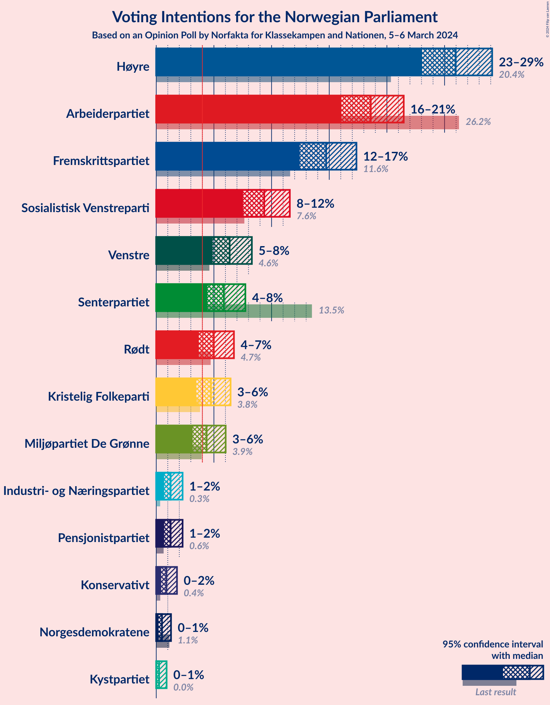

### Confidence Intervals

| Party | Last Result | Poll Result | 80% Confidence Interval | 90% Confidence Interval | 95% Confidence Interval | 99% Confidence Interval |
|:-----:|:-----------:|:-----------:|:-----------------------:|:-----------------------:|:-----------------------:|:-----------------------:|
| Høyre | 20.4% | 26.0% | 24.1–28.0% |23.5–28.6% |23.0–29.1% |22.1–30.1% |
| Arbeiderpartiet | 26.2% | 18.6% | 16.9–20.5% |16.5–21.0% |16.0–21.5% |15.3–22.4% |
| Fremskrittspartiet | 11.6% | 14.7% | 13.2–16.4% |12.8–16.9% |12.4–17.4% |11.8–18.2% |
| Sosialistisk Venstreparti | 7.6% | 9.4% | 8.2–10.8% |7.8–11.2% |7.5–11.6% |7.0–12.3% |
| Venstre | 4.6% | 6.4% | 5.4–7.6% |5.1–8.0% |4.9–8.3% |4.4–8.9% |
| Senterpartiet | 13.5% | 5.9% | 4.9–7.1% |4.7–7.4% |4.4–7.7% |4.0–8.3% |
| Rødt | 4.7% | 5.0% | 4.1–6.1% |3.9–6.4% |3.7–6.7% |3.3–7.3% |
| Kristelig Folkeparti | 3.8% | 4.7% | 3.9–5.9% |3.7–6.2% |3.5–6.4% |3.1–7.0% |
| Miljøpartiet De Grønne | 3.9% | 4.4% | 3.6–5.4% |3.3–5.7% |3.2–6.0% |2.8–6.6% |
| Pensjonistpartiet | 0.6% | 1.2% | 0.9–1.9% |0.8–2.1% |0.7–2.3% |0.5–2.7% |
| Industri- og Næringspartiet | 0.3% | 1.2% | 0.9–1.9% |0.8–2.1% |0.7–2.3% |0.5–2.7% |
| Konservativt | 0.4% | 0.9% | 0.6–1.5% |0.5–1.6% |0.4–1.8% |0.3–2.1% |
| Norgesdemokratene | 1.1% | 0.5% | 0.3–1.0% |0.2–1.1% |0.2–1.3% |0.1–1.6% |
| Kystpartiet | 0.0% | 0.2% | 0.1–0.7% |0.1–0.8% |0.1–0.9% |0.0–1.2% |

*Note:* The poll result column reflects the actual value used in the calculations. Published results may vary slightly, and in addition be rounded to fewer digits.

## Seats

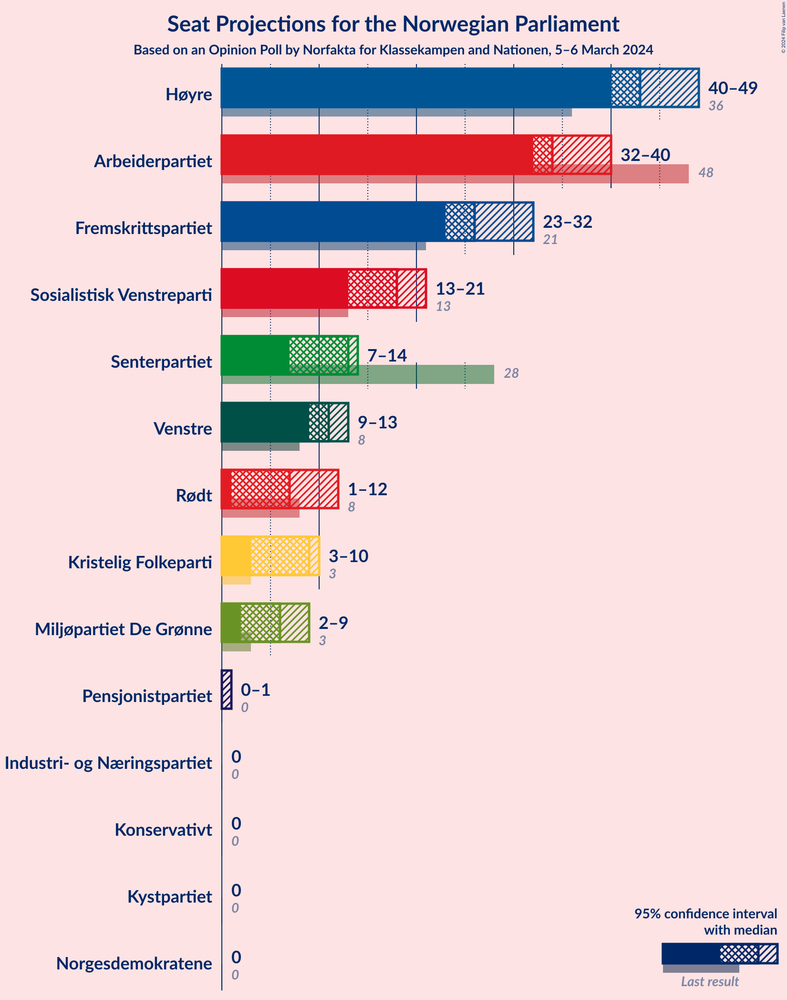

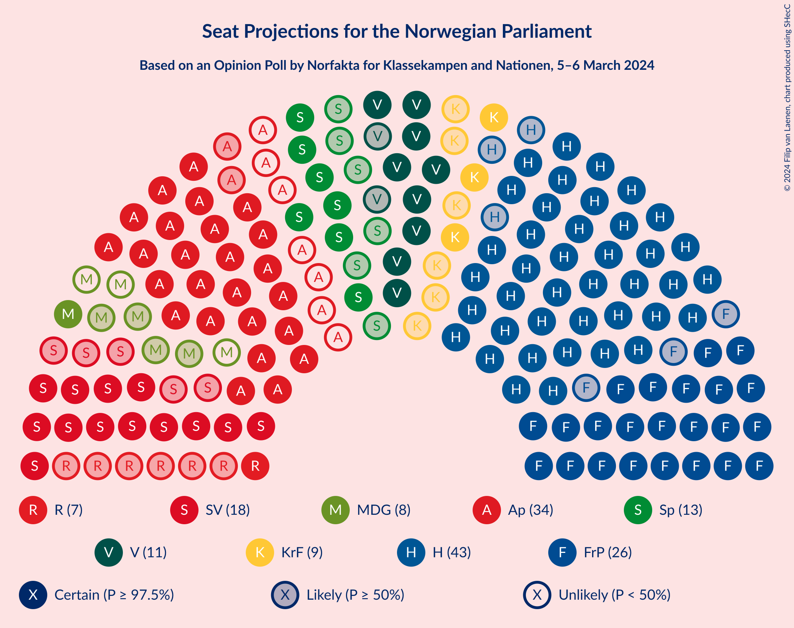

### Confidence Intervals

| Party | Last Result | Median | 80% Confidence Interval | 90% Confidence Interval | 95% Confidence Interval | 99% Confidence Interval |
|:-----:|:-----------:|:------:|:-----------------------:|:-----------------------:|:-----------------------:|:-----------------------:|
| <a href="#høyre">Høyre</a> | 36 | 43 | 43–48 |42–49 |40–49 |39–53 |
| <a href="#arbeiderpartiet">Arbeiderpartiet</a> | 48 | 34 | 33–39 |33–40 |32–40 |32–42 |
| <a href="#fremskrittspartiet">Fremskrittspartiet</a> | 21 | 26 | 24–28 |23–32 |23–32 |20–34 |
| <a href="#sosialistisk-venstreparti">Sosialistisk Venstreparti</a> | 13 | 18 | 14–21 |14–21 |13–21 |11–21 |
| <a href="#venstre">Venstre</a> | 8 | 11 | 10–13 |9–13 |9–13 |8–14 |
| <a href="#senterpartiet">Senterpartiet</a> | 28 | 13 | 9–14 |8–14 |7–14 |2–14 |
| <a href="#rødt">Rødt</a> | 8 | 7 | 1–10 |1–10 |1–12 |1–13 |
| <a href="#kristelig-folkeparti">Kristelig Folkeparti</a> | 3 | 9 | 8–10 |7–10 |3–10 |2–11 |
| <a href="#miljøpartiet-de-grønne">Miljøpartiet De Grønne</a> | 3 | 6 | 3–9 |3–9 |2–9 |1–10 |
| <a href="#pensjonistpartiet">Pensjonistpartiet</a> | 0 | 0 | 0 |0–1 |0–1 |0–1 |
| <a href="#industri--og-næringspartiet">Industri- og Næringspartiet</a> | 0 | 0 | 0 |0 |0 |0 |
| <a href="#konservativt">Konservativt</a> | 0 | 0 | 0 |0 |0 |0 |
| <a href="#norgesdemokratene">Norgesdemokratene</a> | 0 | 0 | 0 |0 |0 |0 |
| <a href="#kystpartiet">Kystpartiet</a> | 0 | 0 | 0 |0 |0 |0–1 |

### Høyre

*For a full overview of the results for this party, see the [Høyre](party-høyre.html) page.*

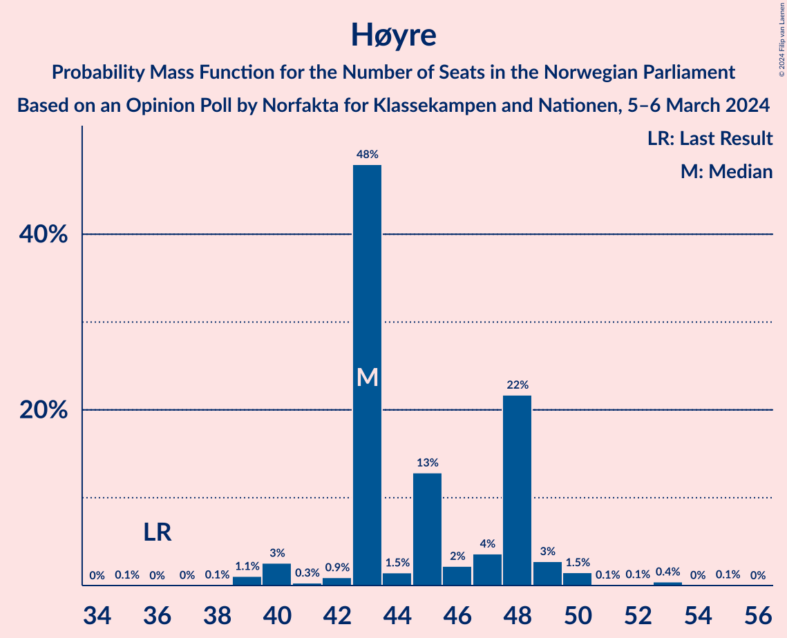

| Number of Seats | Probability | Accumulated | Special Marks |
|:---------------:|:-----------:|:-----------:|:-------------:|
| 35 | 0.1% | 100% |  |
| 36 | 0% | 99.9% | Last Result |
| 37 | 0% | 99.9% |  |
| 38 | 0.1% | 99.9% |  |
| 39 | 1.1% | 99.8% |  |
| 40 | 3% | 98.7% |  |
| 41 | 0.3% | 96% |  |
| 42 | 0.9% | 96% |  |
| 43 | 48% | 95% | Median |
| 44 | 1.5% | 47% |  |
| 45 | 13% | 45% |  |
| 46 | 2% | 33% |  |
| 47 | 4% | 30% |  |
| 48 | 22% | 27% |  |
| 49 | 3% | 5% |  |
| 50 | 1.5% | 2% |  |
| 51 | 0.1% | 0.8% |  |
| 52 | 0.1% | 0.8% |  |
| 53 | 0.4% | 0.6% |  |
| 54 | 0% | 0.2% |  |
| 55 | 0.1% | 0.1% |  |
| 56 | 0% | 0% |  |

### Arbeiderpartiet

*For a full overview of the results for this party, see the [Arbeiderpartiet](party-arbeiderpartiet.html) page.*

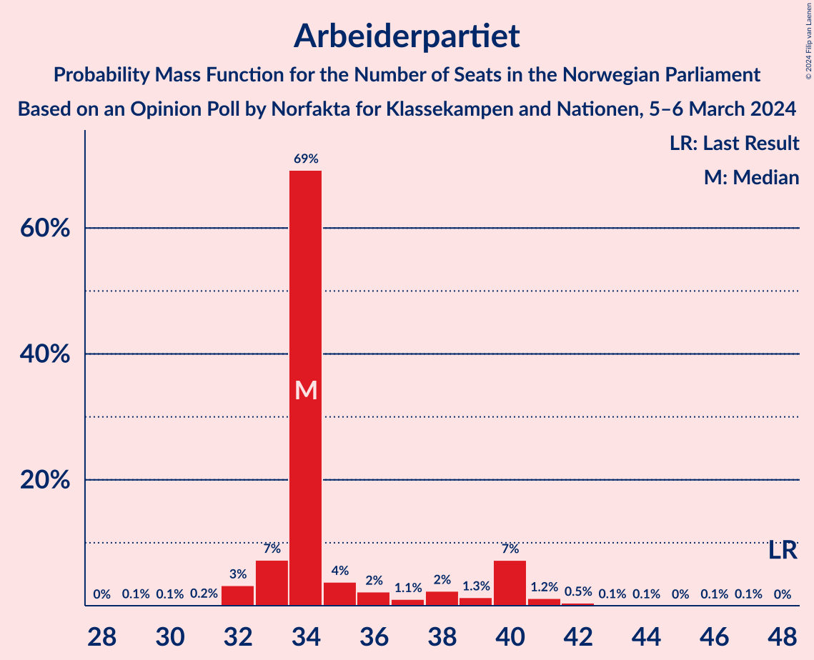

| Number of Seats | Probability | Accumulated | Special Marks |
|:---------------:|:-----------:|:-----------:|:-------------:|
| 29 | 0.1% | 100% |  |
| 30 | 0.1% | 99.9% |  |
| 31 | 0.2% | 99.8% |  |
| 32 | 3% | 99.7% |  |
| 33 | 7% | 96% |  |
| 34 | 69% | 89% | Median |
| 35 | 4% | 20% |  |
| 36 | 2% | 16% |  |
| 37 | 1.1% | 14% |  |
| 38 | 2% | 13% |  |
| 39 | 1.3% | 11% |  |
| 40 | 7% | 9% |  |
| 41 | 1.2% | 2% |  |
| 42 | 0.5% | 0.8% |  |
| 43 | 0.1% | 0.3% |  |
| 44 | 0.1% | 0.2% |  |
| 45 | 0% | 0.2% |  |
| 46 | 0.1% | 0.1% |  |
| 47 | 0.1% | 0.1% |  |
| 48 | 0% | 0% | Last Result |

### Fremskrittspartiet

*For a full overview of the results for this party, see the [Fremskrittspartiet](party-fremskrittspartiet.html) page.*

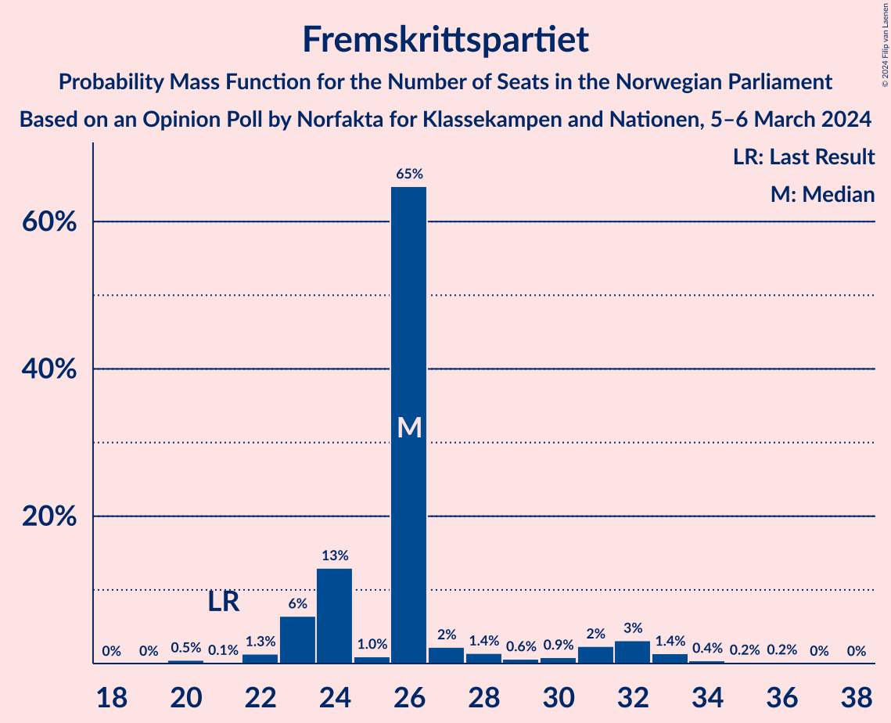

| Number of Seats | Probability | Accumulated | Special Marks |
|:---------------:|:-----------:|:-----------:|:-------------:|
| 20 | 0.5% | 100% |  |
| 21 | 0.1% | 99.5% | Last Result |
| 22 | 1.3% | 99.4% |  |
| 23 | 6% | 98% |  |
| 24 | 13% | 92% |  |
| 25 | 1.0% | 79% |  |
| 26 | 65% | 78% | Median |
| 27 | 2% | 13% |  |
| 28 | 1.4% | 11% |  |
| 29 | 0.6% | 9% |  |
| 30 | 0.9% | 9% |  |
| 31 | 2% | 8% |  |
| 32 | 3% | 5% |  |
| 33 | 1.4% | 2% |  |
| 34 | 0.4% | 0.8% |  |
| 35 | 0.2% | 0.4% |  |
| 36 | 0.2% | 0.2% |  |
| 37 | 0% | 0% |  |

### Sosialistisk Venstreparti

*For a full overview of the results for this party, see the [Sosialistisk Venstreparti](party-sosialistiskvenstreparti.html) page.*

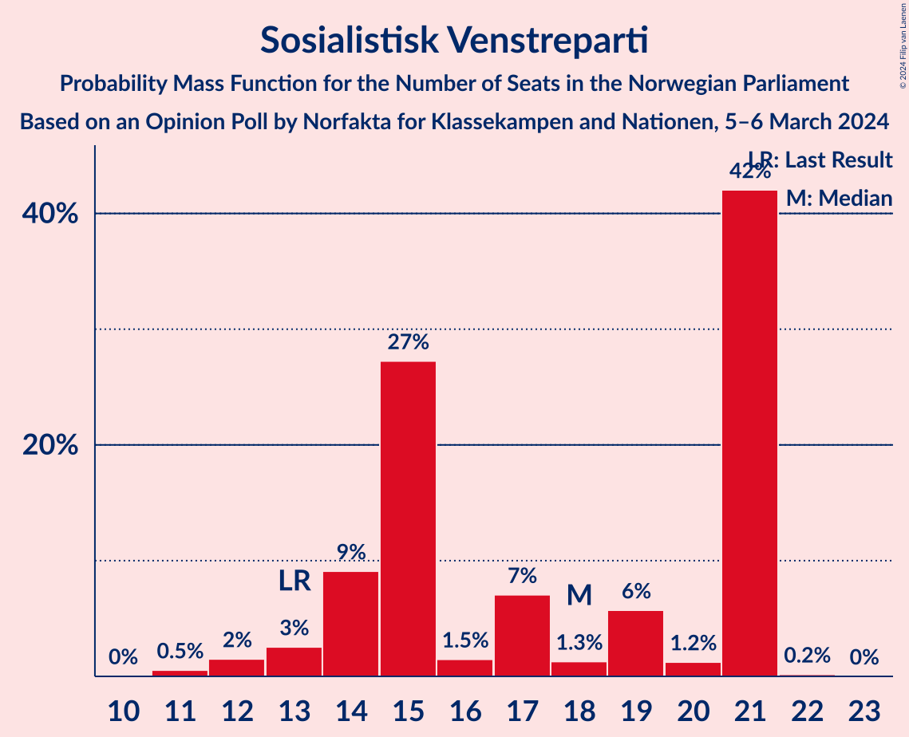

| Number of Seats | Probability | Accumulated | Special Marks |
|:---------------:|:-----------:|:-----------:|:-------------:|
| 11 | 0.5% | 100% |  |
| 12 | 2% | 99.4% |  |
| 13 | 3% | 98% | Last Result |
| 14 | 9% | 95% |  |
| 15 | 27% | 86% |  |
| 16 | 1.5% | 59% |  |
| 17 | 7% | 58% |  |
| 18 | 1.3% | 50% | Median |
| 19 | 6% | 49% |  |
| 20 | 1.2% | 43% |  |
| 21 | 42% | 42% |  |
| 22 | 0.2% | 0.2% |  |
| 23 | 0% | 0% |  |

### Venstre

*For a full overview of the results for this party, see the [Venstre](party-venstre.html) page.*

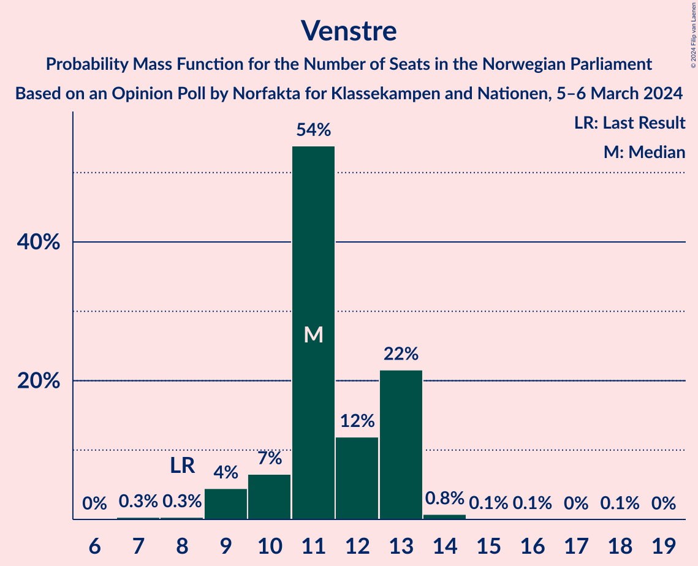

| Number of Seats | Probability | Accumulated | Special Marks |
|:---------------:|:-----------:|:-----------:|:-------------:|
| 7 | 0.3% | 100% |  |
| 8 | 0.3% | 99.7% | Last Result |
| 9 | 4% | 99.3% |  |
| 10 | 7% | 95% |  |
| 11 | 54% | 88% | Median |
| 12 | 12% | 34% |  |
| 13 | 22% | 23% |  |
| 14 | 0.8% | 1.0% |  |
| 15 | 0.1% | 0.2% |  |
| 16 | 0.1% | 0.1% |  |
| 17 | 0% | 0.1% |  |
| 18 | 0.1% | 0.1% |  |
| 19 | 0% | 0% |  |

### Senterpartiet

*For a full overview of the results for this party, see the [Senterpartiet](party-senterpartiet.html) page.*

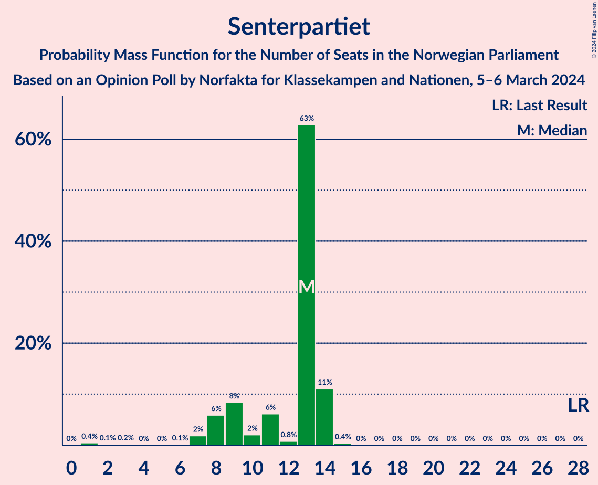

| Number of Seats | Probability | Accumulated | Special Marks |
|:---------------:|:-----------:|:-----------:|:-------------:|
| 1 | 0.4% | 100% |  |
| 2 | 0.1% | 99.5% |  |
| 3 | 0.2% | 99.4% |  |
| 4 | 0% | 99.3% |  |
| 5 | 0% | 99.3% |  |
| 6 | 0.1% | 99.3% |  |
| 7 | 2% | 99.1% |  |
| 8 | 6% | 97% |  |
| 9 | 8% | 91% |  |
| 10 | 2% | 83% |  |
| 11 | 6% | 81% |  |
| 12 | 0.8% | 75% |  |
| 13 | 63% | 74% | Median |
| 14 | 11% | 11% |  |
| 15 | 0.4% | 0.4% |  |
| 16 | 0% | 0% |  |
| 17 | 0% | 0% |  |
| 18 | 0% | 0% |  |
| 19 | 0% | 0% |  |
| 20 | 0% | 0% |  |
| 21 | 0% | 0% |  |
| 22 | 0% | 0% |  |
| 23 | 0% | 0% |  |
| 24 | 0% | 0% |  |
| 25 | 0% | 0% |  |
| 26 | 0% | 0% |  |
| 27 | 0% | 0% |  |
| 28 | 0% | 0% | Last Result |

### Rødt

*For a full overview of the results for this party, see the [Rødt](party-rødt.html) page.*

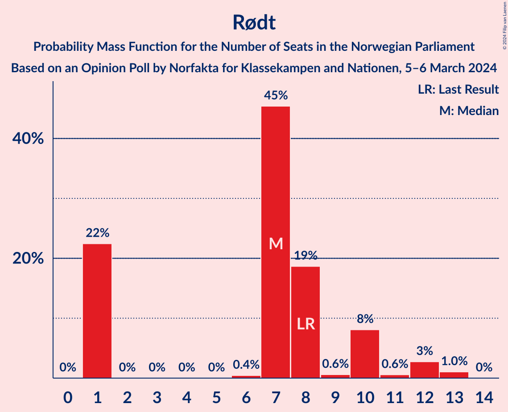

| Number of Seats | Probability | Accumulated | Special Marks |
|:---------------:|:-----------:|:-----------:|:-------------:|
| 1 | 22% | 100% |  |
| 2 | 0% | 78% |  |
| 3 | 0% | 78% |  |
| 4 | 0% | 78% |  |
| 5 | 0% | 78% |  |
| 6 | 0.4% | 78% |  |
| 7 | 45% | 77% | Median |
| 8 | 19% | 32% | Last Result |
| 9 | 0.6% | 13% |  |
| 10 | 8% | 12% |  |
| 11 | 0.6% | 4% |  |
| 12 | 3% | 4% |  |
| 13 | 1.0% | 1.1% |  |
| 14 | 0% | 0% |  |

### Kristelig Folkeparti

*For a full overview of the results for this party, see the [Kristelig Folkeparti](party-kristeligfolkeparti.html) page.*

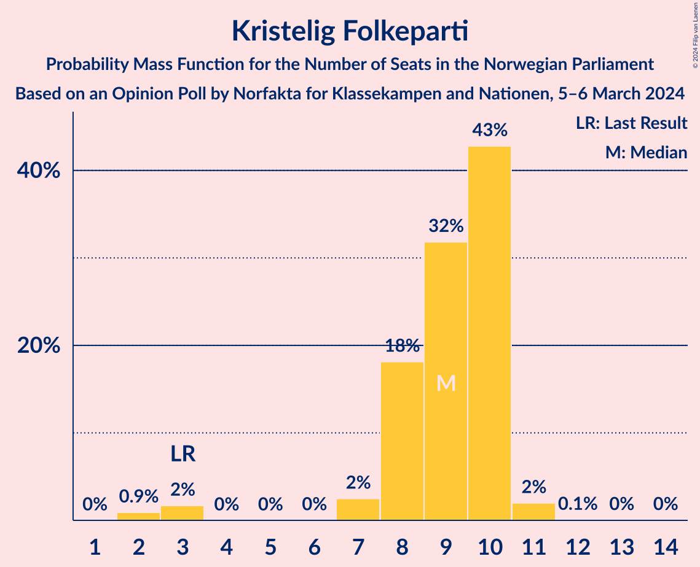

| Number of Seats | Probability | Accumulated | Special Marks |
|:---------------:|:-----------:|:-----------:|:-------------:|
| 2 | 0.9% | 100% |  |
| 3 | 2% | 99.1% | Last Result |
| 4 | 0% | 97% |  |
| 5 | 0% | 97% |  |
| 6 | 0% | 97% |  |
| 7 | 2% | 97% |  |
| 8 | 18% | 95% |  |
| 9 | 32% | 77% | Median |
| 10 | 43% | 45% |  |
| 11 | 2% | 2% |  |
| 12 | 0.1% | 0.2% |  |
| 13 | 0% | 0.1% |  |
| 14 | 0% | 0% |  |

### Miljøpartiet De Grønne

*For a full overview of the results for this party, see the [Miljøpartiet De Grønne](party-miljøpartietdegrønne.html) page.*

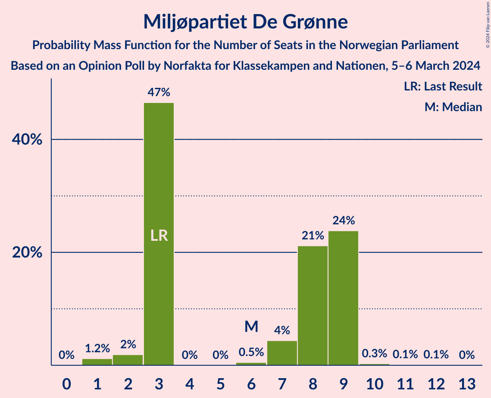

| Number of Seats | Probability | Accumulated | Special Marks |
|:---------------:|:-----------:|:-----------:|:-------------:|
| 1 | 1.2% | 100% |  |
| 2 | 2% | 98.8% |  |
| 3 | 47% | 97% | Last Result |
| 4 | 0% | 50% |  |
| 5 | 0% | 50% |  |
| 6 | 0.5% | 50% | Median |
| 7 | 4% | 50% |  |
| 8 | 21% | 46% |  |
| 9 | 24% | 24% |  |
| 10 | 0.3% | 0.5% |  |
| 11 | 0.1% | 0.2% |  |
| 12 | 0.1% | 0.1% |  |
| 13 | 0% | 0% |  |

### Pensjonistpartiet

*For a full overview of the results for this party, see the [Pensjonistpartiet](party-pensjonistpartiet.html) page.*

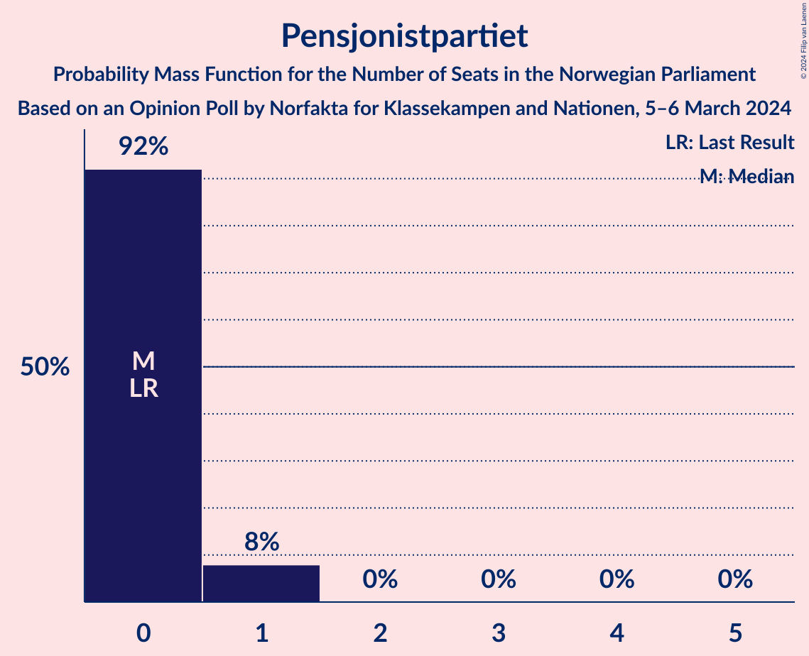

| Number of Seats | Probability | Accumulated | Special Marks |
|:---------------:|:-----------:|:-----------:|:-------------:|
| 0 | 92% | 100% | Last Result, Median |
| 1 | 8% | 8% |  |
| 2 | 0% | 0% |  |

### Industri- og Næringspartiet

*For a full overview of the results for this party, see the [Industri- og Næringspartiet](party-industri-ognæringspartiet.html) page.*

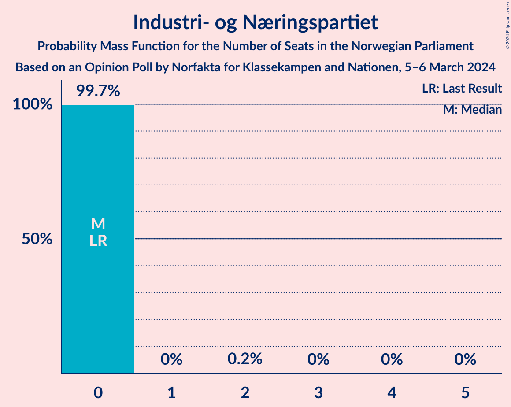

| Number of Seats | Probability | Accumulated | Special Marks |
|:---------------:|:-----------:|:-----------:|:-------------:|
| 0 | 99.7% | 100% | Last Result, Median |
| 1 | 0% | 0.3% |  |
| 2 | 0.2% | 0.2% |  |
| 3 | 0% | 0% |  |

### Konservativt

*For a full overview of the results for this party, see the [Konservativt](party-konservativt.html) page.*

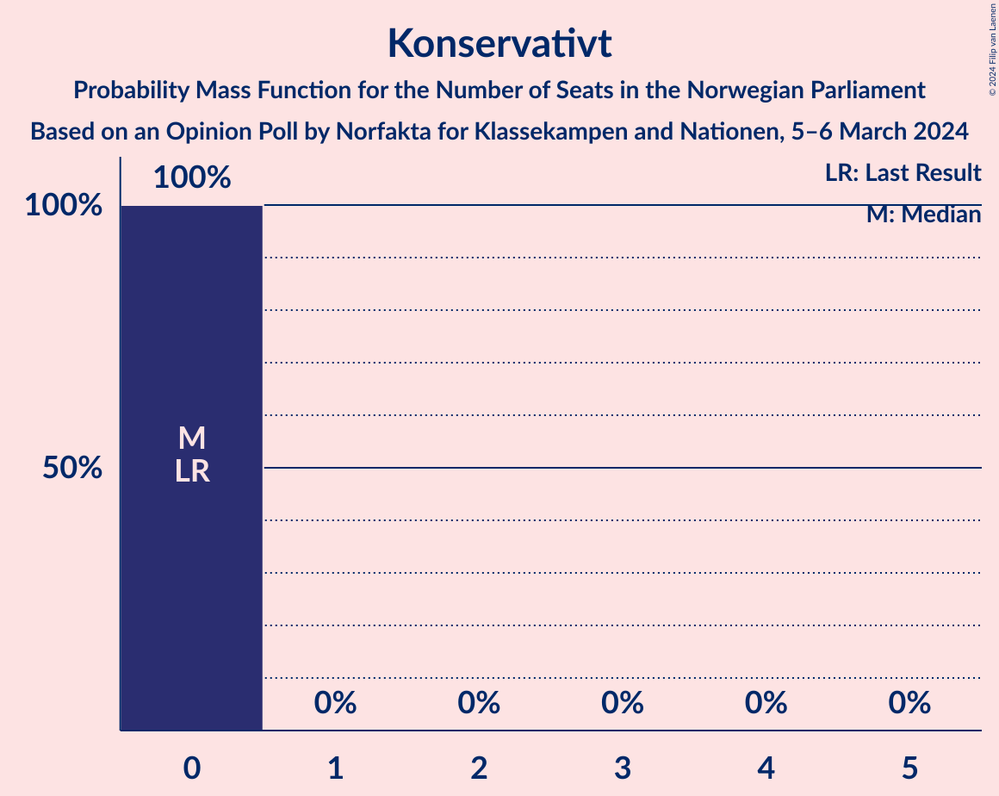

| Number of Seats | Probability | Accumulated | Special Marks |
|:---------------:|:-----------:|:-----------:|:-------------:|
| 0 | 100% | 100% | Last Result, Median |

### Norgesdemokratene

*For a full overview of the results for this party, see the [Norgesdemokratene](party-norgesdemokratene.html) page.*

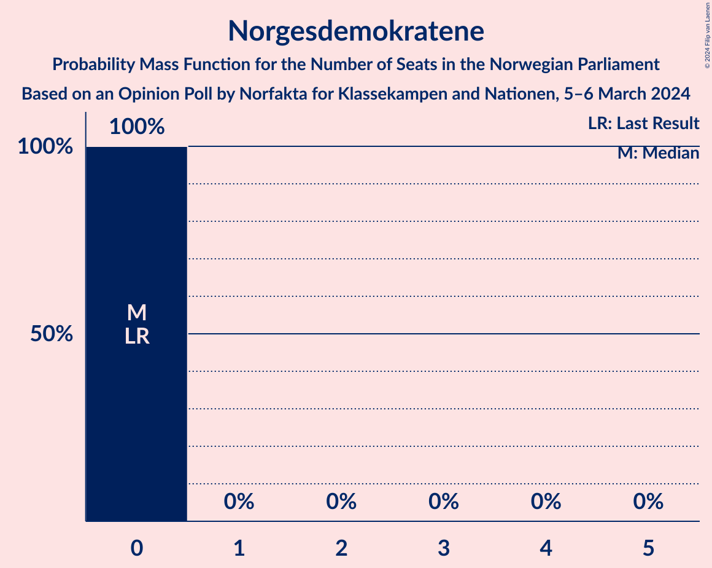

| Number of Seats | Probability | Accumulated | Special Marks |
|:---------------:|:-----------:|:-----------:|:-------------:|
| 0 | 100% | 100% | Last Result, Median |

### Kystpartiet

*For a full overview of the results for this party, see the [Kystpartiet](party-kystpartiet.html) page.*

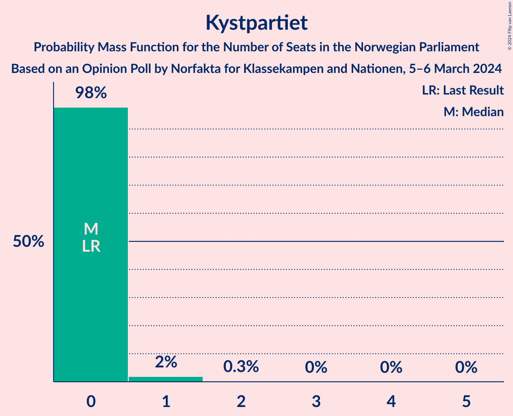

| Number of Seats | Probability | Accumulated | Special Marks |
|:---------------:|:-----------:|:-----------:|:-------------:|
| 0 | 98% | 100% | Last Result, Median |
| 1 | 2% | 2% |  |
| 2 | 0.3% | 0.3% |  |
| 3 | 0% | 0% |  |

## Coalitions

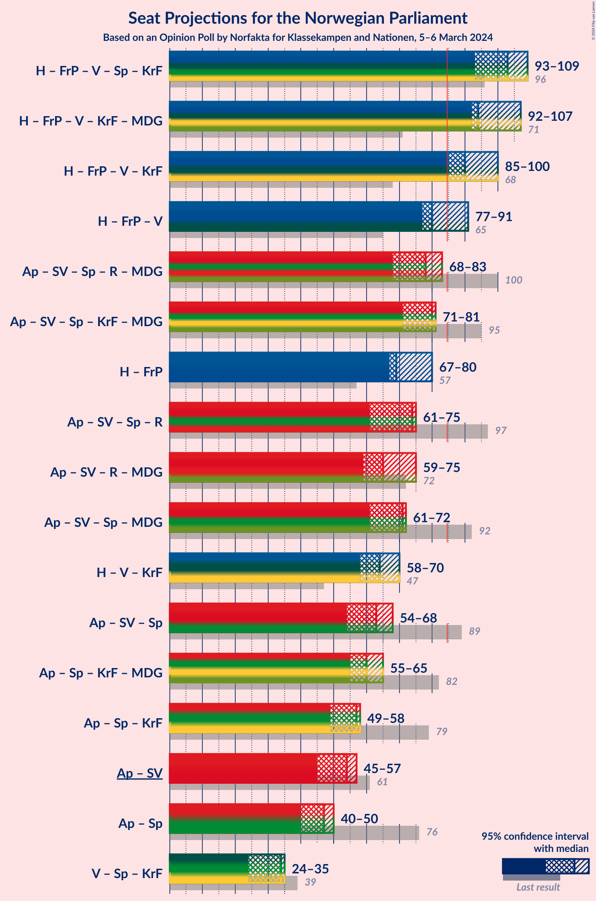

### Confidence Intervals

| Coalition | Last Result | Median | Majority? | 80% Confidence Interval | 90% Confidence Interval | 95% Confidence Interval | 99% Confidence Interval |
|:---------:|:-----------:|:------:|:---------:|:-----------------------:|:-----------------------:|:-----------------------:|:-----------------------:|
| Høyre – Fremskrittspartiet – Venstre – Senterpartiet – Kristelig Folkeparti | 96 | 103 | 100% | 98–109 | 98–109 | 93–109 | 93–111 |
| Høyre – Fremskrittspartiet – Venstre – Kristelig Folkeparti – Miljøpartiet De Grønne | 71 | 94 | 100% | 93–105 | 93–105 | 92–107 | 88–109 |
| Høyre – Fremskrittspartiet – Venstre – Kristelig Folkeparti | 68 | 90 | 98% | 87–96 | 87–97 | 85–100 | 83–102 |
| Høyre – Fremskrittspartiet – Venstre | 65 | 80 | 29% | 79–87 | 79–89 | 77–91 | 76–93 |
| Arbeiderpartiet – Sosialistisk Venstreparti – Senterpartiet – Rødt – Miljøpartiet De Grønne | 100 | 78 | 0.5% | 72–81 | 70–81 | 68–83 | 66–85 |
| Arbeiderpartiet – Sosialistisk Venstreparti – Senterpartiet – Kristelig Folkeparti – Miljøpartiet De Grønne | 95 | 80 | 0.5% | 76–81 | 71–81 | 71–81 | 66–84 |
| Høyre – Fremskrittspartiet | 57 | 69 | 0% | 68–74 | 67–78 | 67–80 | 65–83 |
| Arbeiderpartiet – Sosialistisk Venstreparti – Senterpartiet – Rødt | 97 | 74 | 0% | 63–75 | 62–75 | 61–75 | 59–80 |
| Arbeiderpartiet – Sosialistisk Venstreparti – Rødt – Miljøpartiet De Grønne | 72 | 65 | 0% | 59–70 | 59–70 | 59–75 | 57–75 |
| Arbeiderpartiet – Sosialistisk Venstreparti – Senterpartiet – Miljøpartiet De Grønne | 92 | 71 | 0% | 68–71 | 65–71 | 61–72 | 59–77 |
| Høyre – Venstre – Kristelig Folkeparti | 47 | 64 | 0% | 64–70 | 60–70 | 58–70 | 57–71 |
| Arbeiderpartiet – Sosialistisk Venstreparti – Senterpartiet | 89 | 63 | 0% | 62–68 | 58–68 | 54–68 | 53–68 |
| Arbeiderpartiet – Senterpartiet – Kristelig Folkeparti – Miljøpartiet De Grønne | 82 | 60 | 0% | 60–65 | 57–65 | 55–65 | 51–67 |
| Arbeiderpartiet – Senterpartiet – Kristelig Folkeparti | 79 | 57 | 0% | 53–57 | 51–58 | 49–58 | 45–61 |
| Arbeiderpartiet – Sosialistisk Venstreparti | 61 | 54 | 0% | 49–55 | 49–55 | 45–57 | 45–60 |
| Arbeiderpartiet – Senterpartiet | 76 | 47 | 0% | 44–49 | 43–49 | 40–50 | 37–53 |
| Venstre – Senterpartiet – Kristelig Folkeparti | 39 | 34 | 0% | 27–35 | 26–35 | 24–35 | 21–35 |

### Høyre – Fremskrittspartiet – Venstre – Senterpartiet – Kristelig Folkeparti

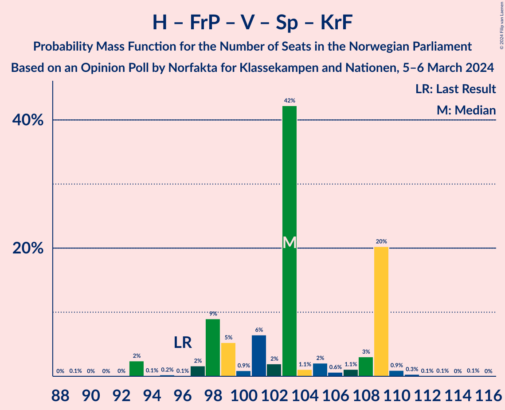

| Number of Seats | Probability | Accumulated | Special Marks |
|:---------------:|:-----------:|:-----------:|:-------------:|
| 89 | 0.1% | 100% |  |
| 90 | 0% | 99.9% |  |
| 91 | 0% | 99.9% |  |
| 92 | 0% | 99.9% |  |
| 93 | 2% | 99.9% |  |
| 94 | 0.1% | 97% |  |
| 95 | 0.2% | 97% |  |
| 96 | 0.1% | 97% | Last Result |
| 97 | 2% | 97% |  |
| 98 | 9% | 95% |  |
| 99 | 5% | 86% |  |
| 100 | 0.9% | 81% |  |
| 101 | 6% | 80% |  |
| 102 | 2% | 74% | Median |
| 103 | 42% | 72% |  |
| 104 | 1.1% | 30% |  |
| 105 | 2% | 29% |  |
| 106 | 0.6% | 27% |  |
| 107 | 1.1% | 26% |  |
| 108 | 3% | 25% |  |
| 109 | 20% | 22% |  |
| 110 | 0.9% | 1.5% |  |
| 111 | 0.3% | 0.6% |  |
| 112 | 0.1% | 0.2% |  |
| 113 | 0.1% | 0.2% |  |
| 114 | 0% | 0.1% |  |
| 115 | 0.1% | 0.1% |  |
| 116 | 0% | 0% |  |

### Høyre – Fremskrittspartiet – Venstre – Kristelig Folkeparti – Miljøpartiet De Grønne

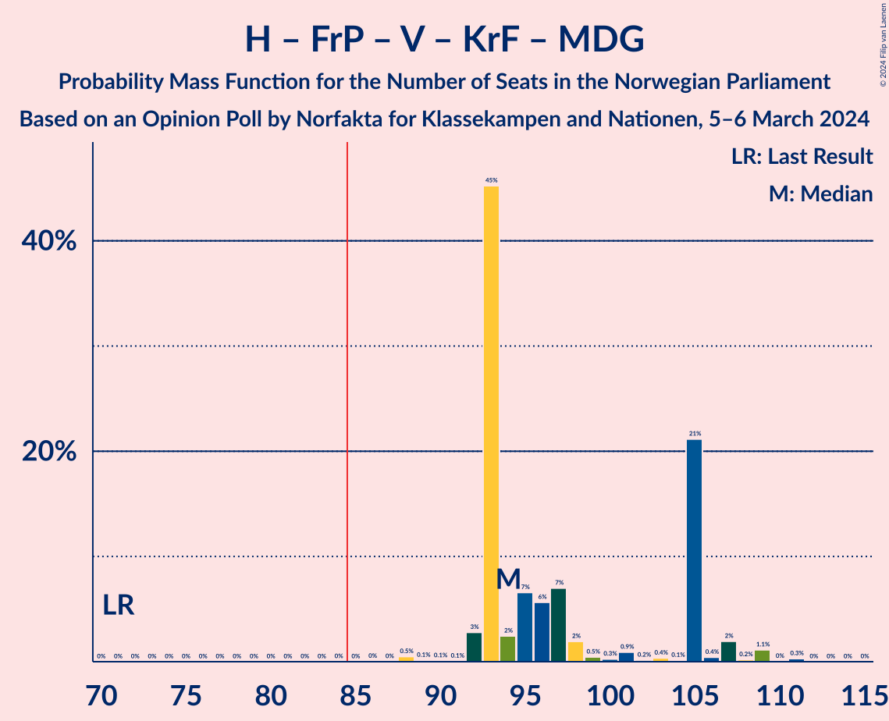

| Number of Seats | Probability | Accumulated | Special Marks |
|:---------------:|:-----------:|:-----------:|:-------------:|
| 71 | 0% | 100% | Last Result |
| 72 | 0% | 100% |  |
| 73 | 0% | 100% |  |
| 74 | 0% | 100% |  |
| 75 | 0% | 100% |  |
| 76 | 0% | 100% |  |
| 77 | 0% | 100% |  |
| 78 | 0% | 100% |  |
| 79 | 0% | 100% |  |
| 80 | 0% | 100% |  |
| 81 | 0% | 100% |  |
| 82 | 0% | 100% |  |
| 83 | 0% | 100% |  |
| 84 | 0% | 100% |  |
| 85 | 0% | 100% | Majority |
| 86 | 0% | 100% |  |
| 87 | 0% | 99.9% |  |
| 88 | 0.5% | 99.9% |  |
| 89 | 0.1% | 99.4% |  |
| 90 | 0.1% | 99.3% |  |
| 91 | 0.1% | 99.2% |  |
| 92 | 3% | 99.1% |  |
| 93 | 45% | 96% |  |
| 94 | 2% | 51% |  |
| 95 | 7% | 49% | Median |
| 96 | 6% | 42% |  |
| 97 | 7% | 36% |  |
| 98 | 2% | 29% |  |
| 99 | 0.5% | 27% |  |
| 100 | 0.3% | 27% |  |
| 101 | 0.9% | 27% |  |
| 102 | 0.2% | 26% |  |
| 103 | 0.4% | 26% |  |
| 104 | 0.1% | 25% |  |
| 105 | 21% | 25% |  |
| 106 | 0.4% | 4% |  |
| 107 | 2% | 4% |  |
| 108 | 0.2% | 2% |  |
| 109 | 1.1% | 1.5% |  |
| 110 | 0% | 0.3% |  |
| 111 | 0.3% | 0.3% |  |
| 112 | 0% | 0% |  |

### Høyre – Fremskrittspartiet – Venstre – Kristelig Folkeparti

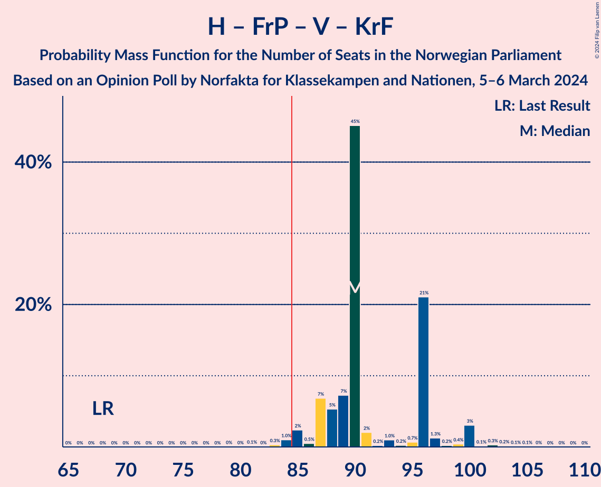

| Number of Seats | Probability | Accumulated | Special Marks |
|:---------------:|:-----------:|:-----------:|:-------------:|
| 68 | 0% | 100% | Last Result |
| 69 | 0% | 100% |  |
| 70 | 0% | 100% |  |
| 71 | 0% | 100% |  |
| 72 | 0% | 100% |  |
| 73 | 0% | 100% |  |
| 74 | 0% | 100% |  |
| 75 | 0% | 100% |  |
| 76 | 0% | 100% |  |
| 77 | 0% | 100% |  |
| 78 | 0% | 100% |  |
| 79 | 0% | 100% |  |
| 80 | 0% | 99.9% |  |
| 81 | 0.1% | 99.9% |  |
| 82 | 0% | 99.8% |  |
| 83 | 0.3% | 99.8% |  |
| 84 | 1.0% | 99.5% |  |
| 85 | 2% | 98% | Majority |
| 86 | 0.5% | 96% |  |
| 87 | 7% | 96% |  |
| 88 | 5% | 89% |  |
| 89 | 7% | 83% | Median |
| 90 | 45% | 76% |  |
| 91 | 2% | 31% |  |
| 92 | 0.2% | 29% |  |
| 93 | 1.0% | 29% |  |
| 94 | 0.2% | 28% |  |
| 95 | 0.7% | 27% |  |
| 96 | 21% | 27% |  |
| 97 | 1.3% | 6% |  |
| 98 | 0.2% | 4% |  |
| 99 | 0.4% | 4% |  |
| 100 | 3% | 4% |  |
| 101 | 0.1% | 0.7% |  |
| 102 | 0.3% | 0.6% |  |
| 103 | 0.2% | 0.3% |  |
| 104 | 0.1% | 0.2% |  |
| 105 | 0.1% | 0.1% |  |
| 106 | 0% | 0.1% |  |
| 107 | 0% | 0% |  |

### Høyre – Fremskrittspartiet – Venstre

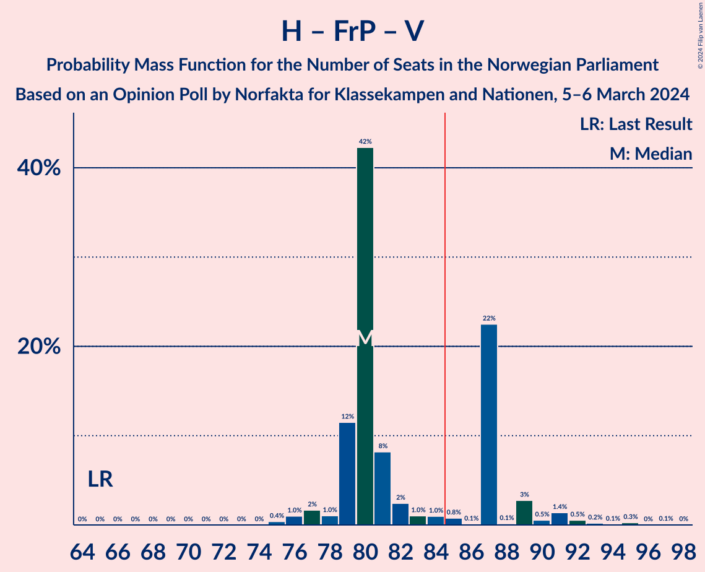

| Number of Seats | Probability | Accumulated | Special Marks |
|:---------------:|:-----------:|:-----------:|:-------------:|
| 65 | 0% | 100% | Last Result |
| 66 | 0% | 100% |  |
| 67 | 0% | 100% |  |
| 68 | 0% | 100% |  |
| 69 | 0% | 100% |  |
| 70 | 0% | 100% |  |
| 71 | 0% | 100% |  |
| 72 | 0% | 100% |  |
| 73 | 0% | 100% |  |
| 74 | 0% | 100% |  |
| 75 | 0.4% | 100% |  |
| 76 | 1.0% | 99.6% |  |
| 77 | 2% | 98.6% |  |
| 78 | 1.0% | 97% |  |
| 79 | 12% | 96% |  |
| 80 | 42% | 84% | Median |
| 81 | 8% | 42% |  |
| 82 | 2% | 34% |  |
| 83 | 1.0% | 31% |  |
| 84 | 1.0% | 30% |  |
| 85 | 0.8% | 29% | Majority |
| 86 | 0.1% | 29% |  |
| 87 | 22% | 29% |  |
| 88 | 0.1% | 6% |  |
| 89 | 3% | 6% |  |
| 90 | 0.5% | 3% |  |
| 91 | 1.4% | 3% |  |
| 92 | 0.5% | 1.2% |  |
| 93 | 0.2% | 0.7% |  |
| 94 | 0.1% | 0.5% |  |
| 95 | 0.3% | 0.4% |  |
| 96 | 0% | 0.1% |  |
| 97 | 0.1% | 0.1% |  |
| 98 | 0% | 0% |  |

### Arbeiderpartiet – Sosialistisk Venstreparti – Senterpartiet – Rødt – Miljøpartiet De Grønne

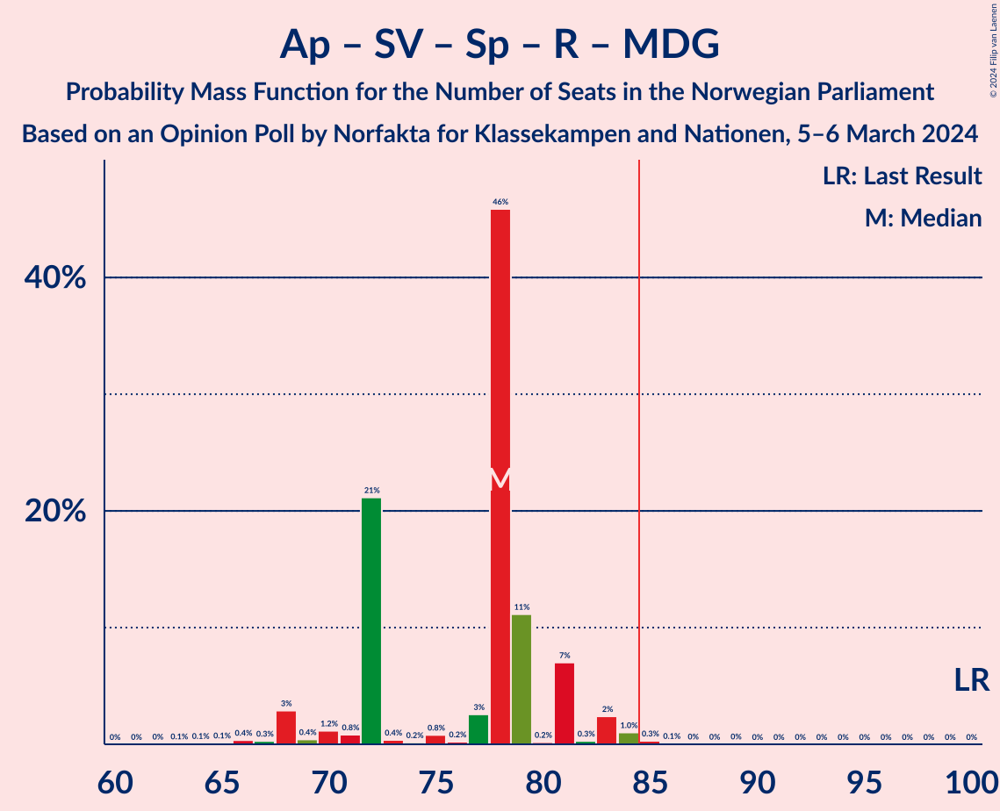

| Number of Seats | Probability | Accumulated | Special Marks |
|:---------------:|:-----------:|:-----------:|:-------------:|
| 62 | 0% | 100% |  |
| 63 | 0.1% | 99.9% |  |
| 64 | 0.1% | 99.9% |  |
| 65 | 0.1% | 99.8% |  |
| 66 | 0.4% | 99.7% |  |
| 67 | 0.3% | 99.3% |  |
| 68 | 3% | 99.0% |  |
| 69 | 0.4% | 96% |  |
| 70 | 1.2% | 96% |  |
| 71 | 0.8% | 95% |  |
| 72 | 21% | 94% |  |
| 73 | 0.4% | 73% |  |
| 74 | 0.2% | 72% |  |
| 75 | 0.8% | 72% |  |
| 76 | 0.2% | 71% |  |
| 77 | 3% | 71% |  |
| 78 | 46% | 68% | Median |
| 79 | 11% | 23% |  |
| 80 | 0.2% | 11% |  |
| 81 | 7% | 11% |  |
| 82 | 0.3% | 4% |  |
| 83 | 2% | 4% |  |
| 84 | 1.0% | 2% |  |
| 85 | 0.3% | 0.5% | Majority |
| 86 | 0.1% | 0.2% |  |
| 87 | 0% | 0.1% |  |
| 88 | 0% | 0.1% |  |
| 89 | 0% | 0.1% |  |
| 90 | 0% | 0% |  |
| 91 | 0% | 0% |  |
| 92 | 0% | 0% |  |
| 93 | 0% | 0% |  |
| 94 | 0% | 0% |  |
| 95 | 0% | 0% |  |
| 96 | 0% | 0% |  |
| 97 | 0% | 0% |  |
| 98 | 0% | 0% |  |
| 99 | 0% | 0% |  |
| 100 | 0% | 0% | Last Result |

### Arbeiderpartiet – Sosialistisk Venstreparti – Senterpartiet – Kristelig Folkeparti – Miljøpartiet De Grønne

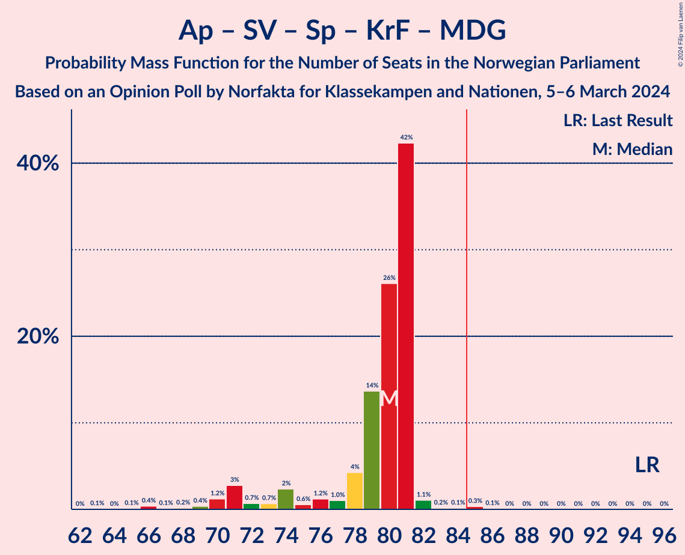

| Number of Seats | Probability | Accumulated | Special Marks |
|:---------------:|:-----------:|:-----------:|:-------------:|
| 63 | 0.1% | 100% |  |
| 64 | 0% | 99.9% |  |
| 65 | 0.1% | 99.9% |  |
| 66 | 0.4% | 99.8% |  |
| 67 | 0.1% | 99.4% |  |
| 68 | 0.2% | 99.3% |  |
| 69 | 0.4% | 99.2% |  |
| 70 | 1.2% | 98.8% |  |
| 71 | 3% | 98% |  |
| 72 | 0.7% | 95% |  |
| 73 | 0.7% | 94% |  |
| 74 | 2% | 93% |  |
| 75 | 0.6% | 91% |  |
| 76 | 1.2% | 90% |  |
| 77 | 1.0% | 89% |  |
| 78 | 4% | 88% |  |
| 79 | 14% | 84% |  |
| 80 | 26% | 70% | Median |
| 81 | 42% | 44% |  |
| 82 | 1.1% | 2% |  |
| 83 | 0.2% | 0.8% |  |
| 84 | 0.1% | 0.6% |  |
| 85 | 0.3% | 0.5% | Majority |
| 86 | 0.1% | 0.1% |  |
| 87 | 0% | 0% |  |
| 88 | 0% | 0% |  |
| 89 | 0% | 0% |  |
| 90 | 0% | 0% |  |
| 91 | 0% | 0% |  |
| 92 | 0% | 0% |  |
| 93 | 0% | 0% |  |
| 94 | 0% | 0% |  |
| 95 | 0% | 0% | Last Result |

### Høyre – Fremskrittspartiet

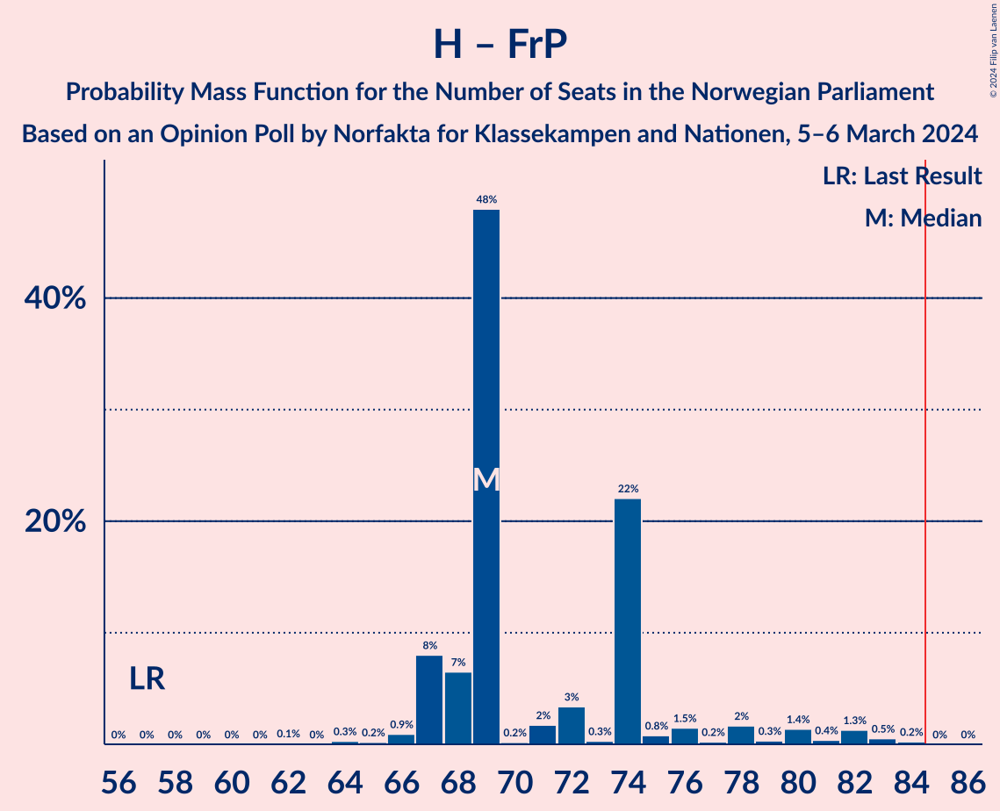

| Number of Seats | Probability | Accumulated | Special Marks |
|:---------------:|:-----------:|:-----------:|:-------------:|
| 57 | 0% | 100% | Last Result |
| 58 | 0% | 100% |  |
| 59 | 0% | 100% |  |
| 60 | 0% | 100% |  |
| 61 | 0% | 100% |  |
| 62 | 0.1% | 100% |  |
| 63 | 0% | 99.9% |  |
| 64 | 0.3% | 99.9% |  |
| 65 | 0.2% | 99.6% |  |
| 66 | 0.9% | 99.4% |  |
| 67 | 8% | 98% |  |
| 68 | 7% | 90% |  |
| 69 | 48% | 84% | Median |
| 70 | 0.2% | 36% |  |
| 71 | 2% | 36% |  |
| 72 | 3% | 34% |  |
| 73 | 0.3% | 31% |  |
| 74 | 22% | 30% |  |
| 75 | 0.8% | 8% |  |
| 76 | 1.5% | 8% |  |
| 77 | 0.2% | 6% |  |
| 78 | 2% | 6% |  |
| 79 | 0.3% | 4% |  |
| 80 | 1.4% | 4% |  |
| 81 | 0.4% | 2% |  |
| 82 | 1.3% | 2% |  |
| 83 | 0.5% | 0.8% |  |
| 84 | 0.2% | 0.3% |  |
| 85 | 0% | 0% | Majority |

### Arbeiderpartiet – Sosialistisk Venstreparti – Senterpartiet – Rødt

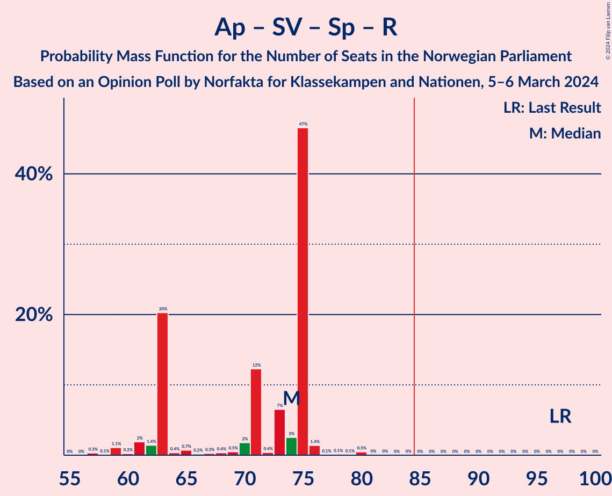

| Number of Seats | Probability | Accumulated | Special Marks |
|:---------------:|:-----------:|:-----------:|:-------------:|
| 57 | 0.3% | 100% |  |
| 58 | 0.1% | 99.7% |  |
| 59 | 1.1% | 99.6% |  |
| 60 | 0.2% | 98.5% |  |
| 61 | 2% | 98% |  |
| 62 | 1.4% | 96% |  |
| 63 | 20% | 95% |  |
| 64 | 0.4% | 75% |  |
| 65 | 0.7% | 74% |  |
| 66 | 0.2% | 74% |  |
| 67 | 0.3% | 73% |  |
| 68 | 0.4% | 73% |  |
| 69 | 0.5% | 73% |  |
| 70 | 2% | 72% |  |
| 71 | 12% | 71% |  |
| 72 | 0.4% | 58% | Median |
| 73 | 7% | 58% |  |
| 74 | 3% | 51% |  |
| 75 | 47% | 49% |  |
| 76 | 1.4% | 2% |  |
| 77 | 0.1% | 0.8% |  |
| 78 | 0.1% | 0.8% |  |
| 79 | 0.1% | 0.7% |  |
| 80 | 0.5% | 0.6% |  |
| 81 | 0% | 0.1% |  |
| 82 | 0% | 0.1% |  |
| 83 | 0% | 0% |  |
| 84 | 0% | 0% |  |
| 85 | 0% | 0% | Majority |
| 86 | 0% | 0% |  |
| 87 | 0% | 0% |  |
| 88 | 0% | 0% |  |
| 89 | 0% | 0% |  |
| 90 | 0% | 0% |  |
| 91 | 0% | 0% |  |
| 92 | 0% | 0% |  |
| 93 | 0% | 0% |  |
| 94 | 0% | 0% |  |
| 95 | 0% | 0% |  |
| 96 | 0% | 0% |  |
| 97 | 0% | 0% | Last Result |

### Arbeiderpartiet – Sosialistisk Venstreparti – Rødt – Miljøpartiet De Grønne

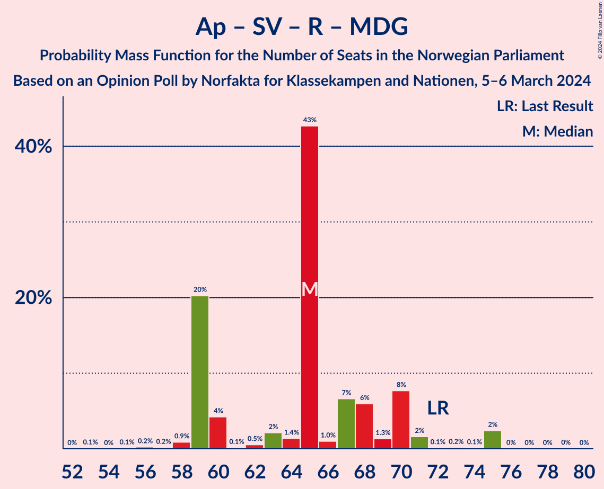

| Number of Seats | Probability | Accumulated | Special Marks |
|:---------------:|:-----------:|:-----------:|:-------------:|
| 53 | 0.1% | 100% |  |
| 54 | 0% | 99.9% |  |
| 55 | 0.1% | 99.9% |  |
| 56 | 0.2% | 99.8% |  |
| 57 | 0.2% | 99.5% |  |
| 58 | 0.9% | 99.4% |  |
| 59 | 20% | 98% |  |
| 60 | 4% | 78% |  |
| 61 | 0.1% | 74% |  |
| 62 | 0.5% | 74% |  |
| 63 | 2% | 73% |  |
| 64 | 1.4% | 71% |  |
| 65 | 43% | 70% | Median |
| 66 | 1.0% | 27% |  |
| 67 | 7% | 26% |  |
| 68 | 6% | 19% |  |
| 69 | 1.3% | 14% |  |
| 70 | 8% | 12% |  |
| 71 | 2% | 5% |  |
| 72 | 0.1% | 3% | Last Result |
| 73 | 0.2% | 3% |  |
| 74 | 0.1% | 3% |  |
| 75 | 2% | 3% |  |
| 76 | 0% | 0.1% |  |
| 77 | 0% | 0.1% |  |
| 78 | 0% | 0.1% |  |
| 79 | 0% | 0.1% |  |
| 80 | 0% | 0% |  |

### Arbeiderpartiet – Sosialistisk Venstreparti – Senterpartiet – Miljøpartiet De Grønne

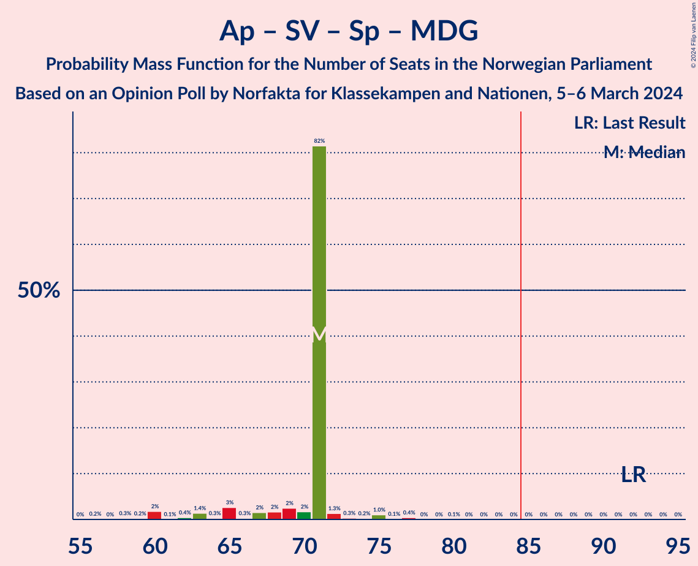

| Number of Seats | Probability | Accumulated | Special Marks |
|:---------------:|:-----------:|:-----------:|:-------------:|
| 56 | 0.2% | 100% |  |
| 57 | 0% | 99.8% |  |
| 58 | 0.3% | 99.8% |  |
| 59 | 0.2% | 99.5% |  |
| 60 | 2% | 99.3% |  |
| 61 | 0.1% | 98% |  |
| 62 | 0.4% | 97% |  |
| 63 | 1.4% | 97% |  |
| 64 | 0.3% | 96% |  |
| 65 | 3% | 95% |  |
| 66 | 0.3% | 93% |  |
| 67 | 2% | 92% |  |
| 68 | 2% | 91% |  |
| 69 | 2% | 89% |  |
| 70 | 2% | 87% |  |
| 71 | 82% | 85% | Median |
| 72 | 1.3% | 4% |  |
| 73 | 0.3% | 2% |  |
| 74 | 0.2% | 2% |  |
| 75 | 1.0% | 2% |  |
| 76 | 0.1% | 0.7% |  |
| 77 | 0.4% | 0.5% |  |
| 78 | 0% | 0.1% |  |
| 79 | 0% | 0.1% |  |
| 80 | 0.1% | 0.1% |  |
| 81 | 0% | 0% |  |
| 82 | 0% | 0% |  |
| 83 | 0% | 0% |  |
| 84 | 0% | 0% |  |
| 85 | 0% | 0% | Majority |
| 86 | 0% | 0% |  |
| 87 | 0% | 0% |  |
| 88 | 0% | 0% |  |
| 89 | 0% | 0% |  |
| 90 | 0% | 0% |  |
| 91 | 0% | 0% |  |
| 92 | 0% | 0% | Last Result |

### Høyre – Venstre – Kristelig Folkeparti

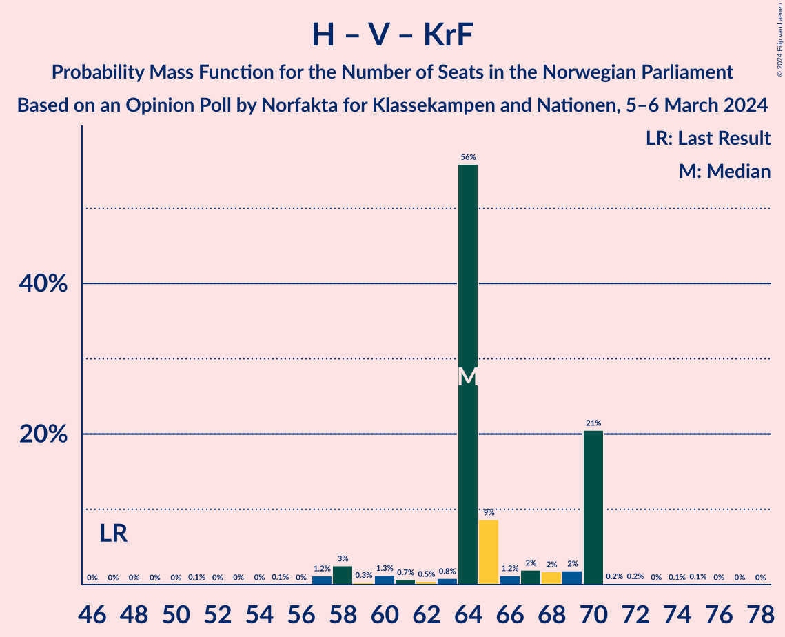

| Number of Seats | Probability | Accumulated | Special Marks |
|:---------------:|:-----------:|:-----------:|:-------------:|
| 47 | 0% | 100% | Last Result |
| 48 | 0% | 100% |  |
| 49 | 0% | 100% |  |
| 50 | 0% | 100% |  |
| 51 | 0.1% | 100% |  |
| 52 | 0% | 99.9% |  |
| 53 | 0% | 99.9% |  |
| 54 | 0% | 99.9% |  |
| 55 | 0.1% | 99.9% |  |
| 56 | 0% | 99.8% |  |
| 57 | 1.2% | 99.8% |  |
| 58 | 3% | 98.6% |  |
| 59 | 0.3% | 96% |  |
| 60 | 1.3% | 96% |  |
| 61 | 0.7% | 94% |  |
| 62 | 0.5% | 94% |  |
| 63 | 0.8% | 93% | Median |
| 64 | 56% | 92% |  |
| 65 | 9% | 37% |  |
| 66 | 1.2% | 28% |  |
| 67 | 2% | 27% |  |
| 68 | 2% | 25% |  |
| 69 | 2% | 23% |  |
| 70 | 21% | 21% |  |
| 71 | 0.2% | 0.6% |  |
| 72 | 0.2% | 0.5% |  |
| 73 | 0% | 0.3% |  |
| 74 | 0.1% | 0.2% |  |
| 75 | 0.1% | 0.2% |  |
| 76 | 0% | 0.1% |  |
| 77 | 0% | 0% |  |

### Arbeiderpartiet – Sosialistisk Venstreparti – Senterpartiet

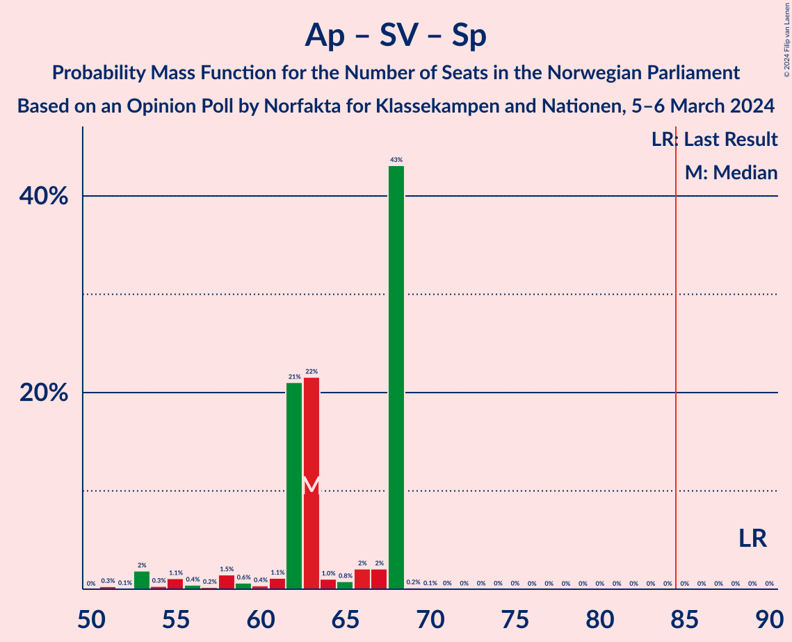

| Number of Seats | Probability | Accumulated | Special Marks |
|:---------------:|:-----------:|:-----------:|:-------------:|
| 51 | 0.3% | 100% |  |
| 52 | 0.1% | 99.7% |  |
| 53 | 2% | 99.6% |  |
| 54 | 0.3% | 98% |  |
| 55 | 1.1% | 97% |  |
| 56 | 0.4% | 96% |  |
| 57 | 0.2% | 96% |  |
| 58 | 1.5% | 96% |  |
| 59 | 0.6% | 94% |  |
| 60 | 0.4% | 94% |  |
| 61 | 1.1% | 93% |  |
| 62 | 21% | 92% |  |
| 63 | 22% | 71% |  |
| 64 | 1.0% | 49% |  |
| 65 | 0.8% | 48% | Median |
| 66 | 2% | 48% |  |
| 67 | 2% | 46% |  |
| 68 | 43% | 43% |  |
| 69 | 0.2% | 0.4% |  |
| 70 | 0.1% | 0.2% |  |
| 71 | 0% | 0.2% |  |
| 72 | 0% | 0.1% |  |
| 73 | 0% | 0.1% |  |
| 74 | 0% | 0.1% |  |
| 75 | 0% | 0% |  |
| 76 | 0% | 0% |  |
| 77 | 0% | 0% |  |
| 78 | 0% | 0% |  |
| 79 | 0% | 0% |  |
| 80 | 0% | 0% |  |
| 81 | 0% | 0% |  |
| 82 | 0% | 0% |  |
| 83 | 0% | 0% |  |
| 84 | 0% | 0% |  |
| 85 | 0% | 0% | Majority |
| 86 | 0% | 0% |  |
| 87 | 0% | 0% |  |
| 88 | 0% | 0% |  |
| 89 | 0% | 0% | Last Result |

### Arbeiderpartiet – Senterpartiet – Kristelig Folkeparti – Miljøpartiet De Grønne

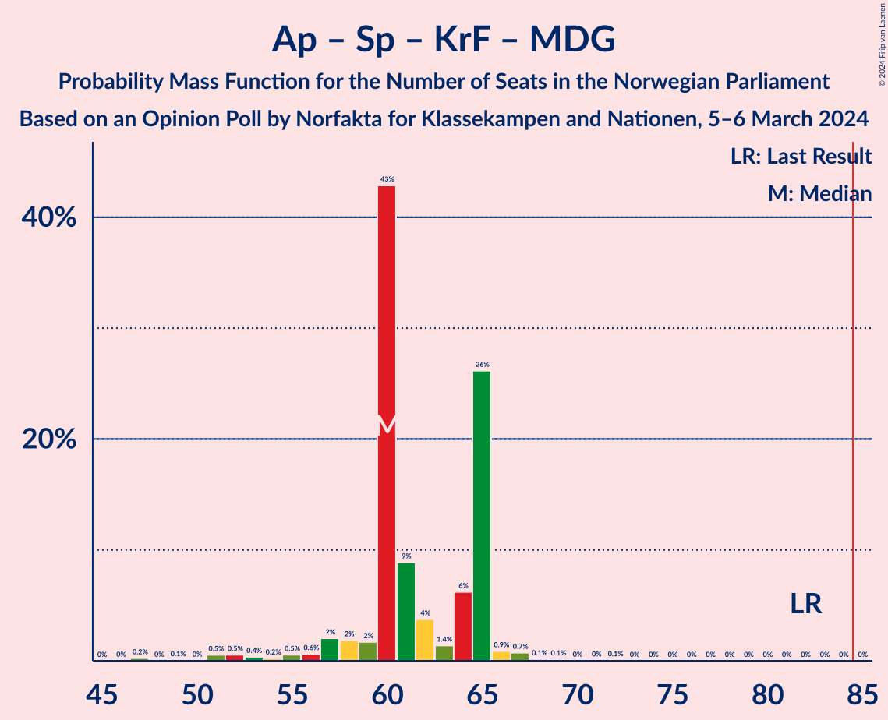

| Number of Seats | Probability | Accumulated | Special Marks |
|:---------------:|:-----------:|:-----------:|:-------------:|
| 47 | 0.2% | 100% |  |
| 48 | 0% | 99.7% |  |
| 49 | 0.1% | 99.7% |  |
| 50 | 0% | 99.7% |  |
| 51 | 0.5% | 99.7% |  |
| 52 | 0.5% | 99.1% |  |
| 53 | 0.4% | 98.6% |  |
| 54 | 0.2% | 98% |  |
| 55 | 0.5% | 98% |  |
| 56 | 0.6% | 97% |  |
| 57 | 2% | 97% |  |
| 58 | 2% | 95% |  |
| 59 | 2% | 93% |  |
| 60 | 43% | 91% |  |
| 61 | 9% | 48% |  |
| 62 | 4% | 40% | Median |
| 63 | 1.4% | 36% |  |
| 64 | 6% | 34% |  |
| 65 | 26% | 28% |  |
| 66 | 0.9% | 2% |  |
| 67 | 0.7% | 1.1% |  |
| 68 | 0.1% | 0.4% |  |
| 69 | 0.1% | 0.3% |  |
| 70 | 0% | 0.1% |  |
| 71 | 0% | 0.1% |  |
| 72 | 0.1% | 0.1% |  |
| 73 | 0% | 0% |  |
| 74 | 0% | 0% |  |
| 75 | 0% | 0% |  |
| 76 | 0% | 0% |  |
| 77 | 0% | 0% |  |
| 78 | 0% | 0% |  |
| 79 | 0% | 0% |  |
| 80 | 0% | 0% |  |
| 81 | 0% | 0% |  |
| 82 | 0% | 0% | Last Result |

### Arbeiderpartiet – Senterpartiet – Kristelig Folkeparti

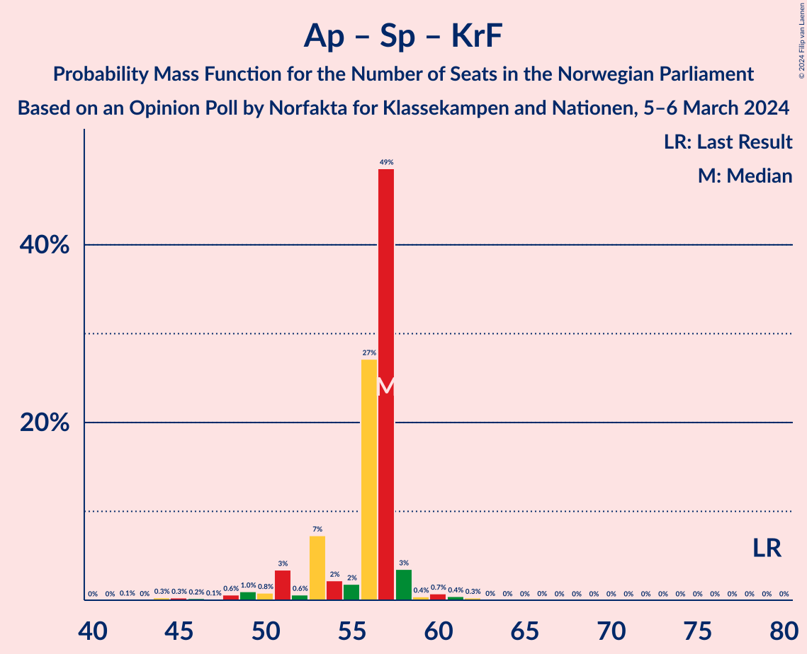

| Number of Seats | Probability | Accumulated | Special Marks |
|:---------------:|:-----------:|:-----------:|:-------------:|
| 42 | 0.1% | 100% |  |
| 43 | 0% | 99.9% |  |
| 44 | 0.3% | 99.9% |  |
| 45 | 0.3% | 99.6% |  |
| 46 | 0.2% | 99.3% |  |
| 47 | 0.1% | 99.1% |  |
| 48 | 0.6% | 99.0% |  |
| 49 | 1.0% | 98% |  |
| 50 | 0.8% | 97% |  |
| 51 | 3% | 97% |  |
| 52 | 0.6% | 93% |  |
| 53 | 7% | 93% |  |
| 54 | 2% | 85% |  |
| 55 | 2% | 83% |  |
| 56 | 27% | 81% | Median |
| 57 | 49% | 54% |  |
| 58 | 3% | 5% |  |
| 59 | 0.4% | 2% |  |
| 60 | 0.7% | 2% |  |
| 61 | 0.4% | 0.8% |  |
| 62 | 0.3% | 0.4% |  |
| 63 | 0% | 0.1% |  |
| 64 | 0% | 0.1% |  |
| 65 | 0% | 0% |  |
| 66 | 0% | 0% |  |
| 67 | 0% | 0% |  |
| 68 | 0% | 0% |  |
| 69 | 0% | 0% |  |
| 70 | 0% | 0% |  |
| 71 | 0% | 0% |  |
| 72 | 0% | 0% |  |
| 73 | 0% | 0% |  |
| 74 | 0% | 0% |  |
| 75 | 0% | 0% |  |
| 76 | 0% | 0% |  |
| 77 | 0% | 0% |  |
| 78 | 0% | 0% |  |
| 79 | 0% | 0% | Last Result |

### Arbeiderpartiet – Sosialistisk Venstreparti

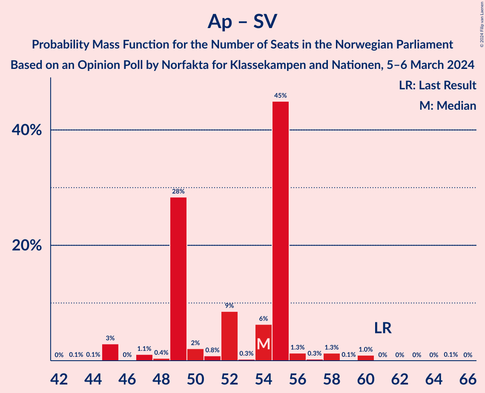

| Number of Seats | Probability | Accumulated | Special Marks |
|:---------------:|:-----------:|:-----------:|:-------------:|
| 43 | 0.1% | 100% |  |
| 44 | 0.1% | 99.9% |  |
| 45 | 3% | 99.9% |  |
| 46 | 0% | 97% |  |
| 47 | 1.1% | 97% |  |
| 48 | 0.4% | 96% |  |
| 49 | 28% | 95% |  |
| 50 | 2% | 67% |  |
| 51 | 0.8% | 65% |  |
| 52 | 9% | 64% | Median |
| 53 | 0.3% | 56% |  |
| 54 | 6% | 55% |  |
| 55 | 45% | 49% |  |
| 56 | 1.3% | 4% |  |
| 57 | 0.3% | 3% |  |
| 58 | 1.3% | 2% |  |
| 59 | 0.1% | 1.1% |  |
| 60 | 1.0% | 1.1% |  |
| 61 | 0% | 0.1% | Last Result |
| 62 | 0% | 0.1% |  |
| 63 | 0% | 0.1% |  |
| 64 | 0% | 0.1% |  |
| 65 | 0.1% | 0.1% |  |
| 66 | 0% | 0% |  |

### Arbeiderpartiet – Senterpartiet

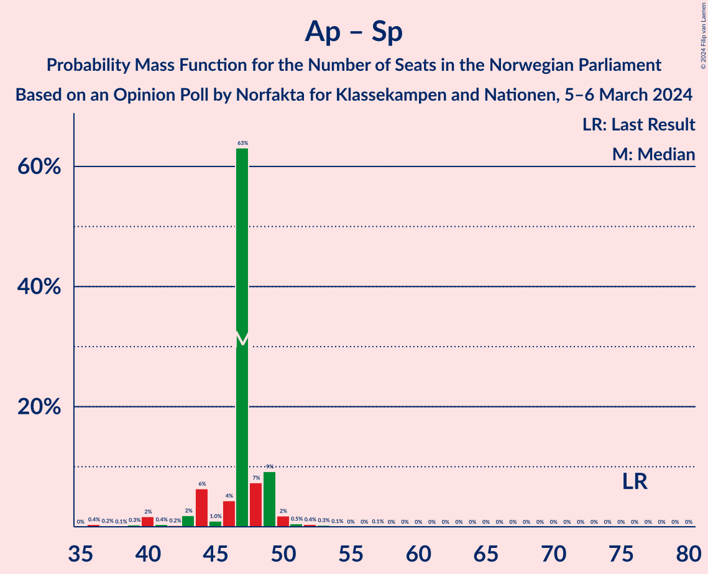

| Number of Seats | Probability | Accumulated | Special Marks |
|:---------------:|:-----------:|:-----------:|:-------------:|
| 36 | 0.4% | 100% |  |
| 37 | 0.2% | 99.5% |  |
| 38 | 0.1% | 99.4% |  |
| 39 | 0.3% | 99.3% |  |
| 40 | 2% | 99.0% |  |
| 41 | 0.4% | 97% |  |
| 42 | 0.2% | 97% |  |
| 43 | 2% | 97% |  |
| 44 | 6% | 95% |  |
| 45 | 1.0% | 88% |  |
| 46 | 4% | 87% |  |
| 47 | 63% | 83% | Median |
| 48 | 7% | 20% |  |
| 49 | 9% | 13% |  |
| 50 | 2% | 3% |  |
| 51 | 0.5% | 2% |  |
| 52 | 0.4% | 1.0% |  |
| 53 | 0.3% | 0.6% |  |
| 54 | 0.1% | 0.3% |  |
| 55 | 0% | 0.2% |  |
| 56 | 0% | 0.1% |  |
| 57 | 0.1% | 0.1% |  |
| 58 | 0% | 0% |  |
| 59 | 0% | 0% |  |
| 60 | 0% | 0% |  |
| 61 | 0% | 0% |  |
| 62 | 0% | 0% |  |
| 63 | 0% | 0% |  |
| 64 | 0% | 0% |  |
| 65 | 0% | 0% |  |
| 66 | 0% | 0% |  |
| 67 | 0% | 0% |  |
| 68 | 0% | 0% |  |
| 69 | 0% | 0% |  |
| 70 | 0% | 0% |  |
| 71 | 0% | 0% |  |
| 72 | 0% | 0% |  |
| 73 | 0% | 0% |  |
| 74 | 0% | 0% |  |
| 75 | 0% | 0% |  |
| 76 | 0% | 0% | Last Result |

### Venstre – Senterpartiet – Kristelig Folkeparti

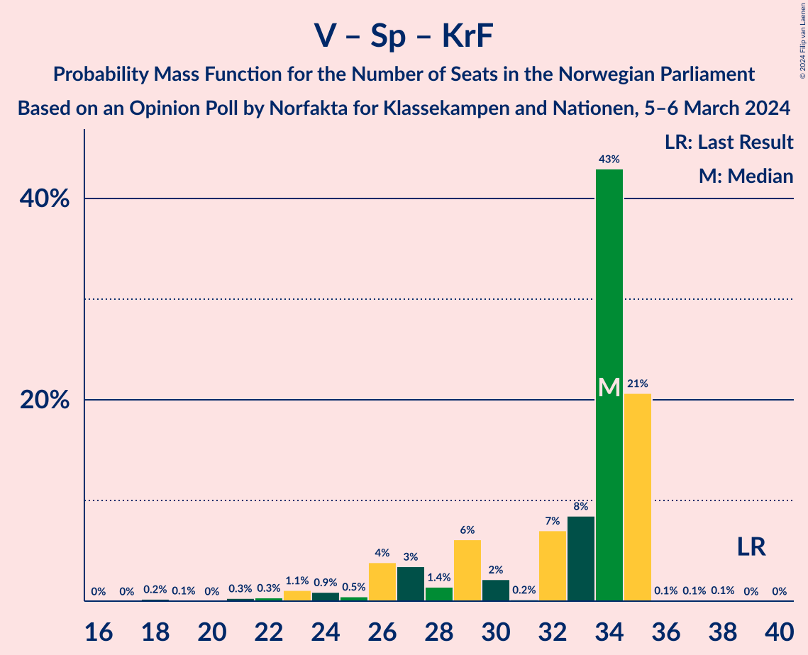

| Number of Seats | Probability | Accumulated | Special Marks |
|:---------------:|:-----------:|:-----------:|:-------------:|
| 18 | 0.2% | 100% |  |
| 19 | 0.1% | 99.8% |  |
| 20 | 0% | 99.7% |  |
| 21 | 0.3% | 99.7% |  |
| 22 | 0.3% | 99.4% |  |
| 23 | 1.1% | 99.0% |  |
| 24 | 0.9% | 98% |  |
| 25 | 0.5% | 97% |  |
| 26 | 4% | 97% |  |
| 27 | 3% | 93% |  |
| 28 | 1.4% | 89% |  |
| 29 | 6% | 88% |  |
| 30 | 2% | 82% |  |
| 31 | 0.2% | 80% |  |
| 32 | 7% | 79% |  |
| 33 | 8% | 72% | Median |
| 34 | 43% | 64% |  |
| 35 | 21% | 21% |  |
| 36 | 0.1% | 0.3% |  |
| 37 | 0.1% | 0.2% |  |
| 38 | 0.1% | 0.1% |  |
| 39 | 0% | 0% | Last Result |

## Technical Information

### Opinion Poll

+ **Polling firm:** Norfakta
+ **Commissioner(s):** Klassekampen and Nationen
+ **Fieldwork period:** 5–6 March 2024

### Calculations

+ **Sample size:** 801
+ **Simulations done:** 1,048,576
+ **Error estimate:** 3.54%

