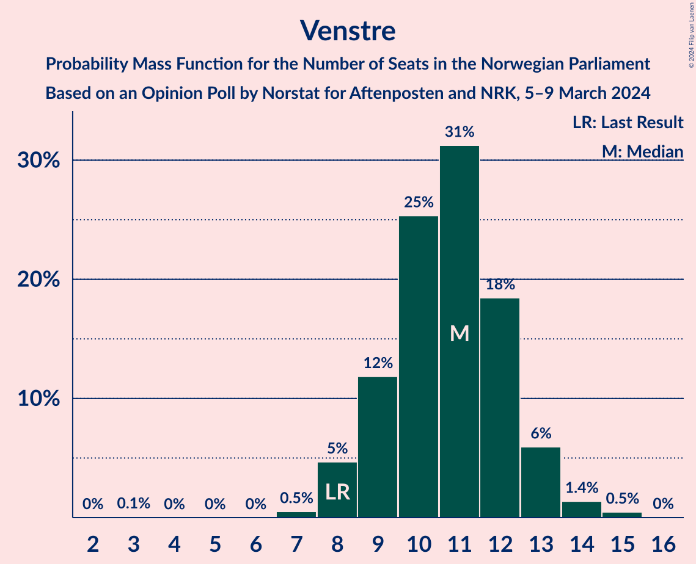
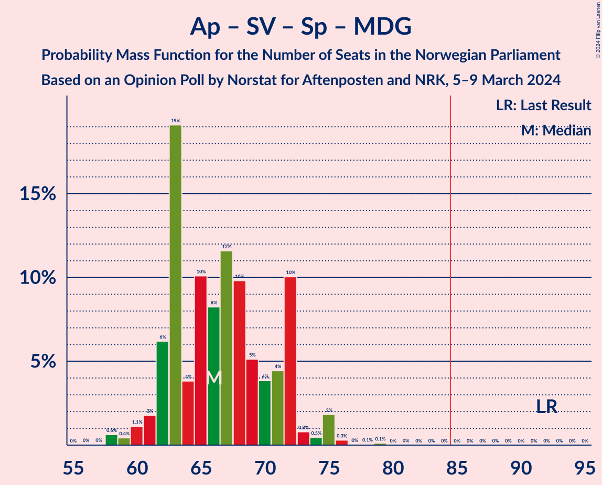

# Opinion Poll by Norstat for Aftenposten and NRK, 5–9 March 2024

<a href="#voting-intentions">Voting Intentions</a> | <a href="#seats">Seats</a> | <a href="#coalitions">Coalitions</a> | <a href="#technical-information">Technical Information</a>

## Voting Intentions

### Confidence Intervals

| Party | Last Result | Poll Result | 80% Confidence Interval | 90% Confidence Interval | 95% Confidence Interval | 99% Confidence Interval |
|:-----:|:-----------:|:-----------:|:-----------------------:|:-----------------------:|:-----------------------:|:-----------------------:|
| Høyre | 20.4% | 27.0% | 25.2–28.8% |24.7–29.4% |24.3–29.8% |23.5–30.7% |
| Arbeiderpartiet | 26.2% | 18.2% | 16.7–19.8% |16.2–20.3% |15.9–20.7% |15.2–21.5% |
| Fremskrittspartiet | 11.6% | 15.1% | 13.8–16.7% |13.4–17.1% |13.0–17.5% |12.4–18.3% |
| Sosialistisk Venstreparti | 7.6% | 10.1% | 9.0–11.5% |8.7–11.8% |8.4–12.2% |7.9–12.8% |
| Senterpartiet | 13.5% | 6.7% | 5.8–7.8% |5.5–8.2% |5.3–8.5% |4.9–9.0% |
| Rødt | 4.7% | 6.2% | 5.3–7.3% |5.1–7.6% |4.9–7.9% |4.5–8.5% |
| Venstre | 4.6% | 6.1% | 5.2–7.2% |5.0–7.5% |4.8–7.8% |4.4–8.3% |
| Kristelig Folkeparti | 3.8% | 4.0% | 3.3–4.9% |3.1–5.2% |3.0–5.4% |2.7–5.9% |
| Miljøpartiet De Grønne | 3.9% | 3.5% | 2.9–4.4% |2.7–4.6% |2.5–4.8% |2.3–5.3% |
| Industri- og Næringspartiet | 0.3% | 1.1% | 0.8–1.7% |0.7–1.8% |0.6–2.0% |0.5–2.3% |

*Note:* The poll result column reflects the actual value used in the calculations. Published results may vary slightly, and in addition be rounded to fewer digits.

## Seats

### Confidence Intervals

| Party | Last Result | Median | 80% Confidence Interval | 90% Confidence Interval | 95% Confidence Interval | 99% Confidence Interval |
|:-----:|:-----------:|:------:|:-----------------------:|:-----------------------:|:-----------------------:|:-----------------------:|
| <a href="#høyre">Høyre</a> | 36 | 48 | 44–50 |42–51 |42–52 |40–55 |
| <a href="#arbeiderpartiet">Arbeiderpartiet</a> | 48 | 33 | 31–37 |31–39 |30–39 |29–40 |
| <a href="#fremskrittspartiet">Fremskrittspartiet</a> | 21 | 27 | 24–31 |23–32 |23–34 |21–35 |
| <a href="#sosialistisk-venstreparti">Sosialistisk Venstreparti</a> | 13 | 18 | 15–20 |15–21 |14–21 |13–23 |
| <a href="#senterpartiet">Senterpartiet</a> | 28 | 11 | 10–14 |9–14 |9–15 |8–16 |
| <a href="#rødt">Rødt</a> | 8 | 11 | 9–13 |9–13 |8–14 |8–15 |
| <a href="#venstre">Venstre</a> | 8 | 11 | 9–12 |8–13 |8–13 |7–15 |
| <a href="#kristelig-folkeparti">Kristelig Folkeparti</a> | 3 | 3 | 2–8 |2–9 |2–9 |2–10 |
| <a href="#miljøpartiet-de-grønne">Miljøpartiet De Grønne</a> | 3 | 2 | 1–7 |1–8 |1–8 |1–9 |
| <a href="#industri--og-næringspartiet">Industri- og Næringspartiet</a> | 0 | 0 | 0 |0 |0 |0 |

### Høyre

*For a full overview of the results for this party, see the [Høyre](party-høyre.html) page.*

| Number of Seats | Probability | Accumulated | Special Marks |
|:---------------:|:-----------:|:-----------:|:-------------:|
| 36 | 0% | 100% | Last Result |
| 37 | 0% | 100% |  |
| 38 | 0% | 100% |  |
| 39 | 0.2% | 100% |  |
| 40 | 0.5% | 99.8% |  |
| 41 | 0.7% | 99.3% |  |
| 42 | 6% | 98.7% |  |
| 43 | 3% | 93% |  |
| 44 | 4% | 90% |  |
| 45 | 7% | 86% |  |
| 46 | 13% | 79% |  |
| 47 | 10% | 66% |  |
| 48 | 12% | 55% | Median |
| 49 | 23% | 43% |  |
| 50 | 11% | 20% |  |
| 51 | 4% | 9% |  |
| 52 | 3% | 5% |  |
| 53 | 0.7% | 2% |  |
| 54 | 0.2% | 1.1% |  |
| 55 | 0.7% | 0.9% |  |
| 56 | 0% | 0.2% |  |
| 57 | 0.1% | 0.1% |  |
| 58 | 0% | 0% |  |

### Arbeiderpartiet

*For a full overview of the results for this party, see the [Arbeiderpartiet](party-arbeiderpartiet.html) page.*

| Number of Seats | Probability | Accumulated | Special Marks |
|:---------------:|:-----------:|:-----------:|:-------------:|
| 28 | 0.3% | 100% |  |
| 29 | 1.5% | 99.7% |  |
| 30 | 1.2% | 98% |  |
| 31 | 7% | 97% |  |
| 32 | 21% | 90% |  |
| 33 | 20% | 68% | Median |
| 34 | 24% | 49% |  |
| 35 | 5% | 24% |  |
| 36 | 5% | 19% |  |
| 37 | 6% | 15% |  |
| 38 | 3% | 9% |  |
| 39 | 4% | 6% |  |
| 40 | 2% | 2% |  |
| 41 | 0.1% | 0.4% |  |
| 42 | 0.2% | 0.3% |  |
| 43 | 0% | 0% |  |
| 44 | 0% | 0% |  |
| 45 | 0% | 0% |  |
| 46 | 0% | 0% |  |
| 47 | 0% | 0% |  |
| 48 | 0% | 0% | Last Result |

### Fremskrittspartiet

*For a full overview of the results for this party, see the [Fremskrittspartiet](party-fremskrittspartiet.html) page.*

| Number of Seats | Probability | Accumulated | Special Marks |
|:---------------:|:-----------:|:-----------:|:-------------:|
| 20 | 0.1% | 100% |  |
| 21 | 0.5% | 99.9% | Last Result |
| 22 | 1.2% | 99.5% |  |
| 23 | 5% | 98% |  |
| 24 | 5% | 93% |  |
| 25 | 21% | 88% |  |
| 26 | 9% | 67% |  |
| 27 | 15% | 58% | Median |
| 28 | 7% | 43% |  |
| 29 | 9% | 36% |  |
| 30 | 4% | 27% |  |
| 31 | 18% | 23% |  |
| 32 | 1.3% | 5% |  |
| 33 | 1.1% | 4% |  |
| 34 | 2% | 3% |  |
| 35 | 0.3% | 0.6% |  |
| 36 | 0.3% | 0.3% |  |
| 37 | 0% | 0% |  |

### Sosialistisk Venstreparti

*For a full overview of the results for this party, see the [Sosialistisk Venstreparti](party-sosialistiskvenstreparti.html) page.*

| Number of Seats | Probability | Accumulated | Special Marks |
|:---------------:|:-----------:|:-----------:|:-------------:|
| 12 | 0.2% | 100% |  |
| 13 | 2% | 99.8% | Last Result |
| 14 | 2% | 98% |  |
| 15 | 10% | 95% |  |
| 16 | 9% | 85% |  |
| 17 | 13% | 76% |  |
| 18 | 32% | 63% | Median |
| 19 | 14% | 31% |  |
| 20 | 12% | 17% |  |
| 21 | 3% | 6% |  |
| 22 | 1.2% | 2% |  |
| 23 | 1.2% | 1.3% |  |
| 24 | 0.1% | 0.1% |  |
| 25 | 0% | 0% |  |

### Senterpartiet

*For a full overview of the results for this party, see the [Senterpartiet](party-senterpartiet.html) page.*

| Number of Seats | Probability | Accumulated | Special Marks |
|:---------------:|:-----------:|:-----------:|:-------------:|
| 7 | 0.4% | 100% |  |
| 8 | 2% | 99.6% |  |
| 9 | 8% | 98% |  |
| 10 | 8% | 90% |  |
| 11 | 33% | 82% | Median |
| 12 | 7% | 50% |  |
| 13 | 20% | 43% |  |
| 14 | 18% | 22% |  |
| 15 | 3% | 4% |  |
| 16 | 0.7% | 0.8% |  |
| 17 | 0.1% | 0.1% |  |
| 18 | 0% | 0% |  |
| 19 | 0% | 0% |  |
| 20 | 0% | 0% |  |
| 21 | 0% | 0% |  |
| 22 | 0% | 0% |  |
| 23 | 0% | 0% |  |
| 24 | 0% | 0% |  |
| 25 | 0% | 0% |  |
| 26 | 0% | 0% |  |
| 27 | 0% | 0% |  |
| 28 | 0% | 0% | Last Result |

### Rødt

*For a full overview of the results for this party, see the [Rødt](party-rødt.html) page.*

| Number of Seats | Probability | Accumulated | Special Marks |
|:---------------:|:-----------:|:-----------:|:-------------:|
| 7 | 0.3% | 100% |  |
| 8 | 3% | 99.6% | Last Result |
| 9 | 11% | 97% |  |
| 10 | 20% | 86% |  |
| 11 | 32% | 66% | Median |
| 12 | 23% | 34% |  |
| 13 | 8% | 11% |  |
| 14 | 2% | 3% |  |
| 15 | 0.5% | 0.7% |  |
| 16 | 0.1% | 0.1% |  |
| 17 | 0% | 0% |  |

### Venstre

*For a full overview of the results for this party, see the [Venstre](party-venstre.html) page.*

| Number of Seats | Probability | Accumulated | Special Marks |
|:---------------:|:-----------:|:-----------:|:-------------:|
| 3 | 0.1% | 100% |  |
| 4 | 0% | 99.9% |  |
| 5 | 0% | 99.9% |  |
| 6 | 0% | 99.9% |  |
| 7 | 0.5% | 99.9% |  |
| 8 | 5% | 99.4% | Last Result |
| 9 | 12% | 95% |  |
| 10 | 25% | 83% |  |
| 11 | 31% | 58% | Median |
| 12 | 18% | 26% |  |
| 13 | 6% | 8% |  |
| 14 | 1.4% | 2% |  |
| 15 | 0.5% | 0.5% |  |
| 16 | 0% | 0% |  |

### Kristelig Folkeparti

*For a full overview of the results for this party, see the [Kristelig Folkeparti](party-kristeligfolkeparti.html) page.*

| Number of Seats | Probability | Accumulated | Special Marks |
|:---------------:|:-----------:|:-----------:|:-------------:|
| 0 | 0.1% | 100% |  |
| 1 | 0.1% | 99.9% |  |
| 2 | 20% | 99.9% |  |
| 3 | 37% | 80% | Last Result, Median |
| 4 | 0% | 43% |  |
| 5 | 0% | 43% |  |
| 6 | 2% | 43% |  |
| 7 | 15% | 42% |  |
| 8 | 18% | 26% |  |
| 9 | 7% | 8% |  |
| 10 | 0.7% | 0.8% |  |
| 11 | 0.1% | 0.1% |  |
| 12 | 0% | 0% |  |

### Miljøpartiet De Grønne

*For a full overview of the results for this party, see the [Miljøpartiet De Grønne](party-miljøpartietdegrønne.html) page.*

| Number of Seats | Probability | Accumulated | Special Marks |
|:---------------:|:-----------:|:-----------:|:-------------:|
| 1 | 16% | 100% |  |
| 2 | 53% | 84% | Median |
| 3 | 9% | 31% | Last Result |
| 4 | 0% | 21% |  |
| 5 | 0% | 21% |  |
| 6 | 2% | 21% |  |
| 7 | 10% | 19% |  |
| 8 | 8% | 9% |  |
| 9 | 0.8% | 1.0% |  |
| 10 | 0.1% | 0.2% |  |
| 11 | 0% | 0% |  |

### Industri- og Næringspartiet

*For a full overview of the results for this party, see the [Industri- og Næringspartiet](party-industri-ognæringspartiet.html) page.*

| Number of Seats | Probability | Accumulated | Special Marks |
|:---------------:|:-----------:|:-----------:|:-------------:|
| 0 | 99.9% | 100% | Last Result, Median |
| 1 | 0.1% | 0.1% |  |
| 2 | 0% | 0% |  |

## Coalitions

### Confidence Intervals

| Coalition | Last Result | Median | Majority? | 80% Confidence Interval | 90% Confidence Interval | 95% Confidence Interval | 99% Confidence Interval |
|:---------:|:-----------:|:------:|:---------:|:-----------------------:|:-----------------------:|:-----------------------:|:-----------------------:|
| Høyre – Fremskrittspartiet – Senterpartiet – Venstre – Kristelig Folkeparti | 96 | 103 | 100% | 98–106 | 97–107 | 95–108 | 92–110 |
| Høyre – Fremskrittspartiet – Venstre – Kristelig Folkeparti – Miljøpartiet De Grønne | 71 | 93 | 99.8% | 89–97 | 88–99 | 87–101 | 86–102 |
| Høyre – Fremskrittspartiet – Venstre – Kristelig Folkeparti | 68 | 91 | 92% | 86–95 | 84–96 | 83–97 | 81–100 |
| Høyre – Fremskrittspartiet – Venstre | 65 | 85 | 58% | 81–91 | 79–91 | 79–93 | 77–94 |
| Arbeiderpartiet – Sosialistisk Venstreparti – Senterpartiet – Rødt – Miljøpartiet De Grønne | 100 | 77 | 3% | 73–82 | 72–84 | 71–85 | 68–87 |
| Høyre – Fremskrittspartiet | 57 | 74 | 0.1% | 71–80 | 69–81 | 68–82 | 66–83 |
| Arbeiderpartiet – Sosialistisk Venstreparti – Senterpartiet – Rødt | 97 | 75 | 0% | 71–79 | 69–80 | 67–81 | 66–82 |
| Arbeiderpartiet – Sosialistisk Venstreparti – Senterpartiet – Kristelig Folkeparti – Miljøpartiet De Grønne | 95 | 72 | 0% | 66–77 | 65–77 | 65–79 | 64–81 |
| Arbeiderpartiet – Sosialistisk Venstreparti – Senterpartiet – Miljøpartiet De Grønne | 92 | 66 | 0% | 62–72 | 62–72 | 61–74 | 58–76 |
| Arbeiderpartiet – Sosialistisk Venstreparti – Rødt – Miljøpartiet De Grønne | 72 | 65 | 0% | 62–70 | 61–71 | 60–73 | 58–76 |
| Arbeiderpartiet – Sosialistisk Venstreparti – Senterpartiet | 89 | 63 | 0% | 60–68 | 59–69 | 57–70 | 56–71 |
| Høyre – Venstre – Kristelig Folkeparti | 47 | 63 | 0% | 59–67 | 57–68 | 55–69 | 55–72 |
| Arbeiderpartiet – Senterpartiet – Kristelig Folkeparti – Miljøpartiet De Grønne | 82 | 54 | 0% | 48–59 | 48–60 | 47–62 | 45–64 |
| Arbeiderpartiet – Senterpartiet – Kristelig Folkeparti | 79 | 50 | 0% | 46–56 | 46–57 | 45–58 | 44–60 |
| Arbeiderpartiet – Sosialistisk Venstreparti | 61 | 51 | 0% | 48–55 | 48–57 | 47–57 | 44–59 |
| Arbeiderpartiet – Senterpartiet | 76 | 45 | 0% | 43–49 | 42–51 | 41–51 | 39–52 |
| Senterpartiet – Venstre – Kristelig Folkeparti | 39 | 27 | 0% | 24–32 | 23–33 | 21–34 | 20–35 |

### Høyre – Fremskrittspartiet – Senterpartiet – Venstre – Kristelig Folkeparti

| Number of Seats | Probability | Accumulated | Special Marks |
|:---------------:|:-----------:|:-----------:|:-------------:|
| 91 | 0.1% | 100% |  |
| 92 | 2% | 99.9% |  |
| 93 | 0.2% | 98% |  |
| 94 | 0.2% | 98% |  |
| 95 | 0.6% | 98% |  |
| 96 | 2% | 97% | Last Result |
| 97 | 5% | 96% |  |
| 98 | 6% | 91% |  |
| 99 | 5% | 85% |  |
| 100 | 7% | 80% | Median |
| 101 | 9% | 73% |  |
| 102 | 13% | 64% |  |
| 103 | 4% | 51% |  |
| 104 | 13% | 47% |  |
| 105 | 17% | 34% |  |
| 106 | 8% | 17% |  |
| 107 | 5% | 8% |  |
| 108 | 2% | 4% |  |
| 109 | 1.0% | 2% |  |
| 110 | 0.6% | 0.9% |  |
| 111 | 0.3% | 0.4% |  |
| 112 | 0% | 0.1% |  |
| 113 | 0% | 0% |  |

### Høyre – Fremskrittspartiet – Venstre – Kristelig Folkeparti – Miljøpartiet De Grønne

| Number of Seats | Probability | Accumulated | Special Marks |
|:---------------:|:-----------:|:-----------:|:-------------:|
| 71 | 0% | 100% | Last Result |
| 72 | 0% | 100% |  |
| 73 | 0% | 100% |  |
| 74 | 0% | 100% |  |
| 75 | 0% | 100% |  |
| 76 | 0% | 100% |  |
| 77 | 0% | 100% |  |
| 78 | 0% | 100% |  |
| 79 | 0% | 100% |  |
| 80 | 0% | 100% |  |
| 81 | 0% | 100% |  |
| 82 | 0% | 100% |  |
| 83 | 0% | 100% |  |
| 84 | 0.1% | 100% |  |
| 85 | 0.1% | 99.8% | Majority |
| 86 | 1.3% | 99.7% |  |
| 87 | 1.1% | 98% |  |
| 88 | 4% | 97% |  |
| 89 | 5% | 94% |  |
| 90 | 9% | 89% |  |
| 91 | 5% | 80% | Median |
| 92 | 12% | 75% |  |
| 93 | 13% | 63% |  |
| 94 | 6% | 49% |  |
| 95 | 11% | 43% |  |
| 96 | 17% | 32% |  |
| 97 | 6% | 15% |  |
| 98 | 4% | 10% |  |
| 99 | 1.4% | 6% |  |
| 100 | 2% | 5% |  |
| 101 | 2% | 3% |  |
| 102 | 0.6% | 0.9% |  |
| 103 | 0.3% | 0.4% |  |
| 104 | 0.1% | 0.1% |  |
| 105 | 0% | 0.1% |  |
| 106 | 0% | 0% |  |

### Høyre – Fremskrittspartiet – Venstre – Kristelig Folkeparti

| Number of Seats | Probability | Accumulated | Special Marks |
|:---------------:|:-----------:|:-----------:|:-------------:|
| 68 | 0% | 100% | Last Result |
| 69 | 0% | 100% |  |
| 70 | 0% | 100% |  |
| 71 | 0% | 100% |  |
| 72 | 0% | 100% |  |
| 73 | 0% | 100% |  |
| 74 | 0% | 100% |  |
| 75 | 0% | 100% |  |
| 76 | 0% | 100% |  |
| 77 | 0% | 100% |  |
| 78 | 0% | 100% |  |
| 79 | 0% | 100% |  |
| 80 | 0.1% | 99.9% |  |
| 81 | 2% | 99.8% |  |
| 82 | 0.4% | 98% |  |
| 83 | 0.8% | 98% |  |
| 84 | 4% | 97% |  |
| 85 | 1.3% | 92% | Majority |
| 86 | 7% | 91% |  |
| 87 | 3% | 84% |  |
| 88 | 11% | 81% |  |
| 89 | 7% | 70% | Median |
| 90 | 11% | 63% |  |
| 91 | 12% | 52% |  |
| 92 | 5% | 40% |  |
| 93 | 8% | 36% |  |
| 94 | 17% | 28% |  |
| 95 | 4% | 11% |  |
| 96 | 3% | 7% |  |
| 97 | 2% | 4% |  |
| 98 | 1.0% | 2% |  |
| 99 | 0.6% | 1.2% |  |
| 100 | 0.4% | 0.5% |  |
| 101 | 0% | 0.1% |  |
| 102 | 0% | 0% |  |

### Høyre – Fremskrittspartiet – Venstre

| Number of Seats | Probability | Accumulated | Special Marks |
|:---------------:|:-----------:|:-----------:|:-------------:|
| 65 | 0% | 100% | Last Result |
| 66 | 0% | 100% |  |
| 67 | 0% | 100% |  |
| 68 | 0% | 100% |  |
| 69 | 0% | 100% |  |
| 70 | 0% | 100% |  |
| 71 | 0% | 100% |  |
| 72 | 0% | 100% |  |
| 73 | 0% | 100% |  |
| 74 | 0% | 100% |  |
| 75 | 0.1% | 99.9% |  |
| 76 | 0.2% | 99.8% |  |
| 77 | 0.6% | 99.6% |  |
| 78 | 1.1% | 99.0% |  |
| 79 | 3% | 98% |  |
| 80 | 4% | 95% |  |
| 81 | 8% | 91% |  |
| 82 | 3% | 83% |  |
| 83 | 13% | 80% |  |
| 84 | 9% | 67% |  |
| 85 | 9% | 58% | Majority |
| 86 | 10% | 49% | Median |
| 87 | 9% | 39% |  |
| 88 | 3% | 30% |  |
| 89 | 4% | 27% |  |
| 90 | 2% | 22% |  |
| 91 | 16% | 20% |  |
| 92 | 0.6% | 5% |  |
| 93 | 3% | 4% |  |
| 94 | 0.3% | 0.7% |  |
| 95 | 0.3% | 0.5% |  |
| 96 | 0.1% | 0.1% |  |
| 97 | 0% | 0% |  |

### Arbeiderpartiet – Sosialistisk Venstreparti – Senterpartiet – Rødt – Miljøpartiet De Grønne

| Number of Seats | Probability | Accumulated | Special Marks |
|:---------------:|:-----------:|:-----------:|:-------------:|
| 67 | 0% | 100% |  |
| 68 | 0.4% | 99.9% |  |
| 69 | 0.6% | 99.5% |  |
| 70 | 1.0% | 98.8% |  |
| 71 | 2% | 98% |  |
| 72 | 3% | 96% |  |
| 73 | 4% | 93% |  |
| 74 | 17% | 89% |  |
| 75 | 8% | 72% | Median |
| 76 | 5% | 64% |  |
| 77 | 12% | 60% |  |
| 78 | 11% | 48% |  |
| 79 | 7% | 37% |  |
| 80 | 11% | 30% |  |
| 81 | 3% | 19% |  |
| 82 | 7% | 16% |  |
| 83 | 1.3% | 9% |  |
| 84 | 4% | 8% |  |
| 85 | 0.7% | 3% | Majority |
| 86 | 0.4% | 2% |  |
| 87 | 2% | 2% |  |
| 88 | 0.2% | 0.2% |  |
| 89 | 0% | 0.1% |  |
| 90 | 0% | 0% |  |
| 91 | 0% | 0% |  |
| 92 | 0% | 0% |  |
| 93 | 0% | 0% |  |
| 94 | 0% | 0% |  |
| 95 | 0% | 0% |  |
| 96 | 0% | 0% |  |
| 97 | 0% | 0% |  |
| 98 | 0% | 0% |  |
| 99 | 0% | 0% |  |
| 100 | 0% | 0% | Last Result |

### Høyre – Fremskrittspartiet

| Number of Seats | Probability | Accumulated | Special Marks |
|:---------------:|:-----------:|:-----------:|:-------------:|
| 57 | 0% | 100% | Last Result |
| 58 | 0% | 100% |  |
| 59 | 0% | 100% |  |
| 60 | 0% | 100% |  |
| 61 | 0% | 100% |  |
| 62 | 0% | 100% |  |
| 63 | 0% | 100% |  |
| 64 | 0.1% | 100% |  |
| 65 | 0.1% | 99.9% |  |
| 66 | 0.6% | 99.8% |  |
| 67 | 0.5% | 99.2% |  |
| 68 | 3% | 98.7% |  |
| 69 | 4% | 96% |  |
| 70 | 2% | 92% |  |
| 71 | 13% | 90% |  |
| 72 | 8% | 77% |  |
| 73 | 11% | 69% |  |
| 74 | 9% | 58% |  |
| 75 | 8% | 49% | Median |
| 76 | 3% | 41% |  |
| 77 | 12% | 39% |  |
| 78 | 3% | 27% |  |
| 79 | 1.4% | 24% |  |
| 80 | 17% | 23% |  |
| 81 | 1.3% | 6% |  |
| 82 | 2% | 4% |  |
| 83 | 2% | 2% |  |
| 84 | 0.3% | 0.4% |  |
| 85 | 0.1% | 0.1% | Majority |
| 86 | 0% | 0% |  |

### Arbeiderpartiet – Sosialistisk Venstreparti – Senterpartiet – Rødt

| Number of Seats | Probability | Accumulated | Special Marks |
|:---------------:|:-----------:|:-----------:|:-------------:|
| 63 | 0% | 100% |  |
| 64 | 0.1% | 99.9% |  |
| 65 | 0.3% | 99.9% |  |
| 66 | 0.6% | 99.6% |  |
| 67 | 2% | 99.1% |  |
| 68 | 2% | 97% |  |
| 69 | 1.4% | 95% |  |
| 70 | 4% | 94% |  |
| 71 | 6% | 90% |  |
| 72 | 17% | 85% |  |
| 73 | 11% | 68% | Median |
| 74 | 6% | 57% |  |
| 75 | 14% | 51% |  |
| 76 | 12% | 37% |  |
| 77 | 5% | 25% |  |
| 78 | 9% | 20% |  |
| 79 | 5% | 11% |  |
| 80 | 4% | 6% |  |
| 81 | 1.1% | 3% |  |
| 82 | 1.3% | 2% |  |
| 83 | 0.1% | 0.3% |  |
| 84 | 0.1% | 0.2% |  |
| 85 | 0% | 0% | Majority |
| 86 | 0% | 0% |  |
| 87 | 0% | 0% |  |
| 88 | 0% | 0% |  |
| 89 | 0% | 0% |  |
| 90 | 0% | 0% |  |
| 91 | 0% | 0% |  |
| 92 | 0% | 0% |  |
| 93 | 0% | 0% |  |
| 94 | 0% | 0% |  |
| 95 | 0% | 0% |  |
| 96 | 0% | 0% |  |
| 97 | 0% | 0% | Last Result |

### Arbeiderpartiet – Sosialistisk Venstreparti – Senterpartiet – Kristelig Folkeparti – Miljøpartiet De Grønne

| Number of Seats | Probability | Accumulated | Special Marks |
|:---------------:|:-----------:|:-----------:|:-------------:|
| 61 | 0% | 100% |  |
| 62 | 0.2% | 99.9% |  |
| 63 | 0.1% | 99.8% |  |
| 64 | 2% | 99.6% |  |
| 65 | 3% | 98% |  |
| 66 | 14% | 94% |  |
| 67 | 2% | 80% | Median |
| 68 | 3% | 79% |  |
| 69 | 5% | 76% |  |
| 70 | 12% | 71% |  |
| 71 | 8% | 59% |  |
| 72 | 6% | 51% |  |
| 73 | 13% | 44% |  |
| 74 | 9% | 31% |  |
| 75 | 8% | 22% |  |
| 76 | 3% | 14% |  |
| 77 | 6% | 11% |  |
| 78 | 2% | 5% |  |
| 79 | 1.4% | 3% |  |
| 80 | 0.6% | 1.1% |  |
| 81 | 0.4% | 0.6% |  |
| 82 | 0.1% | 0.2% |  |
| 83 | 0% | 0.1% |  |
| 84 | 0.1% | 0.1% |  |
| 85 | 0% | 0% | Majority |
| 86 | 0% | 0% |  |
| 87 | 0% | 0% |  |
| 88 | 0% | 0% |  |
| 89 | 0% | 0% |  |
| 90 | 0% | 0% |  |
| 91 | 0% | 0% |  |
| 92 | 0% | 0% |  |
| 93 | 0% | 0% |  |
| 94 | 0% | 0% |  |
| 95 | 0% | 0% | Last Result |

### Arbeiderpartiet – Sosialistisk Venstreparti – Senterpartiet – Miljøpartiet De Grønne

| Number of Seats | Probability | Accumulated | Special Marks |
|:---------------:|:-----------:|:-----------:|:-------------:|
| 57 | 0% | 100% |  |
| 58 | 0.6% | 99.9% |  |
| 59 | 0.4% | 99.3% |  |
| 60 | 1.1% | 98.9% |  |
| 61 | 2% | 98% |  |
| 62 | 6% | 96% |  |
| 63 | 19% | 90% |  |
| 64 | 4% | 71% | Median |
| 65 | 10% | 67% |  |
| 66 | 8% | 57% |  |
| 67 | 12% | 48% |  |
| 68 | 10% | 37% |  |
| 69 | 5% | 27% |  |
| 70 | 4% | 22% |  |
| 71 | 4% | 18% |  |
| 72 | 10% | 14% |  |
| 73 | 0.8% | 4% |  |
| 74 | 0.5% | 3% |  |
| 75 | 2% | 2% |  |
| 76 | 0.3% | 0.5% |  |
| 77 | 0% | 0.2% |  |
| 78 | 0.1% | 0.2% |  |
| 79 | 0.1% | 0.1% |  |
| 80 | 0% | 0% |  |
| 81 | 0% | 0% |  |
| 82 | 0% | 0% |  |
| 83 | 0% | 0% |  |
| 84 | 0% | 0% |  |
| 85 | 0% | 0% | Majority |
| 86 | 0% | 0% |  |
| 87 | 0% | 0% |  |
| 88 | 0% | 0% |  |
| 89 | 0% | 0% |  |
| 90 | 0% | 0% |  |
| 91 | 0% | 0% |  |
| 92 | 0% | 0% | Last Result |

### Arbeiderpartiet – Sosialistisk Venstreparti – Rødt – Miljøpartiet De Grønne

| Number of Seats | Probability | Accumulated | Special Marks |
|:---------------:|:-----------:|:-----------:|:-------------:|
| 56 | 0% | 100% |  |
| 57 | 0.3% | 99.9% |  |
| 58 | 0.6% | 99.7% |  |
| 59 | 1.0% | 99.1% |  |
| 60 | 2% | 98% |  |
| 61 | 5% | 96% |  |
| 62 | 8% | 92% |  |
| 63 | 17% | 83% |  |
| 64 | 13% | 66% | Median |
| 65 | 4% | 53% |  |
| 66 | 13% | 49% |  |
| 67 | 9% | 36% |  |
| 68 | 7% | 27% |  |
| 69 | 5% | 20% |  |
| 70 | 6% | 15% |  |
| 71 | 5% | 9% |  |
| 72 | 2% | 4% | Last Result |
| 73 | 0.6% | 3% |  |
| 74 | 0.2% | 2% |  |
| 75 | 0.2% | 2% |  |
| 76 | 2% | 2% |  |
| 77 | 0.1% | 0.1% |  |
| 78 | 0% | 0% |  |

### Arbeiderpartiet – Sosialistisk Venstreparti – Senterpartiet

| Number of Seats | Probability | Accumulated | Special Marks |
|:---------------:|:-----------:|:-----------:|:-------------:|
| 54 | 0.1% | 100% |  |
| 55 | 0.1% | 99.8% |  |
| 56 | 0.4% | 99.7% |  |
| 57 | 2% | 99.3% |  |
| 58 | 2% | 97% |  |
| 59 | 2% | 95% |  |
| 60 | 5% | 93% |  |
| 61 | 20% | 88% |  |
| 62 | 6% | 68% | Median |
| 63 | 13% | 61% |  |
| 64 | 13% | 48% |  |
| 65 | 15% | 36% |  |
| 66 | 7% | 21% |  |
| 67 | 3% | 14% |  |
| 68 | 3% | 11% |  |
| 69 | 5% | 8% |  |
| 70 | 2% | 3% |  |
| 71 | 0.3% | 0.6% |  |
| 72 | 0.2% | 0.3% |  |
| 73 | 0.1% | 0.1% |  |
| 74 | 0% | 0% |  |
| 75 | 0% | 0% |  |
| 76 | 0% | 0% |  |
| 77 | 0% | 0% |  |
| 78 | 0% | 0% |  |
| 79 | 0% | 0% |  |
| 80 | 0% | 0% |  |
| 81 | 0% | 0% |  |
| 82 | 0% | 0% |  |
| 83 | 0% | 0% |  |
| 84 | 0% | 0% |  |
| 85 | 0% | 0% | Majority |
| 86 | 0% | 0% |  |
| 87 | 0% | 0% |  |
| 88 | 0% | 0% |  |
| 89 | 0% | 0% | Last Result |

### Høyre – Venstre – Kristelig Folkeparti

| Number of Seats | Probability | Accumulated | Special Marks |
|:---------------:|:-----------:|:-----------:|:-------------:|
| 47 | 0% | 100% | Last Result |
| 48 | 0% | 100% |  |
| 49 | 0% | 100% |  |
| 50 | 0% | 100% |  |
| 51 | 0% | 100% |  |
| 52 | 0% | 100% |  |
| 53 | 0.1% | 100% |  |
| 54 | 0.2% | 99.9% |  |
| 55 | 3% | 99.7% |  |
| 56 | 1.0% | 97% |  |
| 57 | 1.0% | 96% |  |
| 58 | 4% | 95% |  |
| 59 | 5% | 91% |  |
| 60 | 4% | 86% |  |
| 61 | 7% | 81% |  |
| 62 | 9% | 74% | Median |
| 63 | 24% | 65% |  |
| 64 | 12% | 41% |  |
| 65 | 5% | 29% |  |
| 66 | 10% | 24% |  |
| 67 | 5% | 14% |  |
| 68 | 5% | 9% |  |
| 69 | 2% | 3% |  |
| 70 | 0.6% | 2% |  |
| 71 | 0.6% | 1.2% |  |
| 72 | 0.5% | 0.5% |  |
| 73 | 0% | 0% |  |

### Arbeiderpartiet – Senterpartiet – Kristelig Folkeparti – Miljøpartiet De Grønne

| Number of Seats | Probability | Accumulated | Special Marks |
|:---------------:|:-----------:|:-----------:|:-------------:|
| 42 | 0.1% | 100% |  |
| 43 | 0.1% | 99.9% |  |
| 44 | 0.1% | 99.9% |  |
| 45 | 0.4% | 99.8% |  |
| 46 | 0.5% | 99.4% |  |
| 47 | 2% | 98.9% |  |
| 48 | 16% | 97% |  |
| 49 | 2% | 81% | Median |
| 50 | 8% | 79% |  |
| 51 | 5% | 71% |  |
| 52 | 7% | 66% |  |
| 53 | 7% | 60% |  |
| 54 | 6% | 53% |  |
| 55 | 16% | 47% |  |
| 56 | 6% | 31% |  |
| 57 | 6% | 26% |  |
| 58 | 5% | 20% |  |
| 59 | 6% | 15% |  |
| 60 | 5% | 9% |  |
| 61 | 1.1% | 4% |  |
| 62 | 0.5% | 3% |  |
| 63 | 1.3% | 2% |  |
| 64 | 0.6% | 0.9% |  |
| 65 | 0.1% | 0.3% |  |
| 66 | 0% | 0.2% |  |
| 67 | 0.1% | 0.2% |  |
| 68 | 0% | 0% |  |
| 69 | 0% | 0% |  |
| 70 | 0% | 0% |  |
| 71 | 0% | 0% |  |
| 72 | 0% | 0% |  |
| 73 | 0% | 0% |  |
| 74 | 0% | 0% |  |
| 75 | 0% | 0% |  |
| 76 | 0% | 0% |  |
| 77 | 0% | 0% |  |
| 78 | 0% | 0% |  |
| 79 | 0% | 0% |  |
| 80 | 0% | 0% |  |
| 81 | 0% | 0% |  |
| 82 | 0% | 0% | Last Result |

### Arbeiderpartiet – Senterpartiet – Kristelig Folkeparti

| Number of Seats | Probability | Accumulated | Special Marks |
|:---------------:|:-----------:|:-----------:|:-------------:|
| 41 | 0.1% | 100% |  |
| 42 | 0.2% | 99.9% |  |
| 43 | 0.2% | 99.7% |  |
| 44 | 2% | 99.5% |  |
| 45 | 2% | 98% |  |
| 46 | 14% | 96% |  |
| 47 | 5% | 81% | Median |
| 48 | 10% | 76% |  |
| 49 | 4% | 66% |  |
| 50 | 14% | 62% |  |
| 51 | 8% | 48% |  |
| 52 | 7% | 41% |  |
| 53 | 15% | 34% |  |
| 54 | 4% | 19% |  |
| 55 | 4% | 15% |  |
| 56 | 6% | 11% |  |
| 57 | 2% | 5% |  |
| 58 | 2% | 3% |  |
| 59 | 0.7% | 1.3% |  |
| 60 | 0.3% | 0.5% |  |
| 61 | 0.2% | 0.2% |  |
| 62 | 0% | 0% |  |
| 63 | 0% | 0% |  |
| 64 | 0% | 0% |  |
| 65 | 0% | 0% |  |
| 66 | 0% | 0% |  |
| 67 | 0% | 0% |  |
| 68 | 0% | 0% |  |
| 69 | 0% | 0% |  |
| 70 | 0% | 0% |  |
| 71 | 0% | 0% |  |
| 72 | 0% | 0% |  |
| 73 | 0% | 0% |  |
| 74 | 0% | 0% |  |
| 75 | 0% | 0% |  |
| 76 | 0% | 0% |  |
| 77 | 0% | 0% |  |
| 78 | 0% | 0% |  |
| 79 | 0% | 0% | Last Result |

### Arbeiderpartiet – Sosialistisk Venstreparti

| Number of Seats | Probability | Accumulated | Special Marks |
|:---------------:|:-----------:|:-----------:|:-------------:|
| 43 | 0.1% | 100% |  |
| 44 | 0.7% | 99.9% |  |
| 45 | 0.6% | 99.2% |  |
| 46 | 0.6% | 98.6% |  |
| 47 | 2% | 98% |  |
| 48 | 7% | 96% |  |
| 49 | 6% | 89% |  |
| 50 | 21% | 83% |  |
| 51 | 15% | 62% | Median |
| 52 | 18% | 47% |  |
| 53 | 10% | 29% |  |
| 54 | 5% | 19% |  |
| 55 | 4% | 13% |  |
| 56 | 3% | 10% |  |
| 57 | 4% | 6% |  |
| 58 | 0.6% | 2% |  |
| 59 | 1.2% | 1.5% |  |
| 60 | 0.2% | 0.2% |  |
| 61 | 0% | 0.1% | Last Result |
| 62 | 0% | 0% |  |

### Arbeiderpartiet – Senterpartiet

| Number of Seats | Probability | Accumulated | Special Marks |
|:---------------:|:-----------:|:-----------:|:-------------:|
| 37 | 0.1% | 100% |  |
| 38 | 0% | 99.9% |  |
| 39 | 0.4% | 99.9% |  |
| 40 | 0.3% | 99.5% |  |
| 41 | 3% | 99.2% |  |
| 42 | 4% | 96% |  |
| 43 | 16% | 92% |  |
| 44 | 10% | 76% | Median |
| 45 | 20% | 66% |  |
| 46 | 8% | 46% |  |
| 47 | 16% | 38% |  |
| 48 | 5% | 23% |  |
| 49 | 8% | 17% |  |
| 50 | 5% | 10% |  |
| 51 | 4% | 5% |  |
| 52 | 0.5% | 0.9% |  |
| 53 | 0.3% | 0.4% |  |
| 54 | 0.1% | 0.1% |  |
| 55 | 0% | 0% |  |
| 56 | 0% | 0% |  |
| 57 | 0% | 0% |  |
| 58 | 0% | 0% |  |
| 59 | 0% | 0% |  |
| 60 | 0% | 0% |  |
| 61 | 0% | 0% |  |
| 62 | 0% | 0% |  |
| 63 | 0% | 0% |  |
| 64 | 0% | 0% |  |
| 65 | 0% | 0% |  |
| 66 | 0% | 0% |  |
| 67 | 0% | 0% |  |
| 68 | 0% | 0% |  |
| 69 | 0% | 0% |  |
| 70 | 0% | 0% |  |
| 71 | 0% | 0% |  |
| 72 | 0% | 0% |  |
| 73 | 0% | 0% |  |
| 74 | 0% | 0% |  |
| 75 | 0% | 0% |  |
| 76 | 0% | 0% | Last Result |

### Senterpartiet – Venstre – Kristelig Folkeparti

| Number of Seats | Probability | Accumulated | Special Marks |
|:---------------:|:-----------:|:-----------:|:-------------:|
| 19 | 0.1% | 100% |  |
| 20 | 2% | 99.9% |  |
| 21 | 0.8% | 98% |  |
| 22 | 2% | 97% |  |
| 23 | 4% | 96% |  |
| 24 | 11% | 92% |  |
| 25 | 18% | 80% | Median |
| 26 | 6% | 63% |  |
| 27 | 11% | 57% |  |
| 28 | 6% | 46% |  |
| 29 | 12% | 40% |  |
| 30 | 3% | 28% |  |
| 31 | 11% | 25% |  |
| 32 | 6% | 14% |  |
| 33 | 5% | 8% |  |
| 34 | 2% | 3% |  |
| 35 | 0.8% | 1.0% |  |
| 36 | 0.2% | 0.3% |  |
| 37 | 0% | 0% |  |
| 38 | 0% | 0% |  |
| 39 | 0% | 0% | Last Result |

## Technical Information

### Opinion Poll

+ **Polling firm:** Norstat
+ **Commissioner(s):** Aftenposten and NRK
+ **Fieldwork period:** 5–9 March 2024

### Calculations

+ **Sample size:** 997
+ **Simulations done:** 1,048,576
+ **Error estimate:** 2.04%

