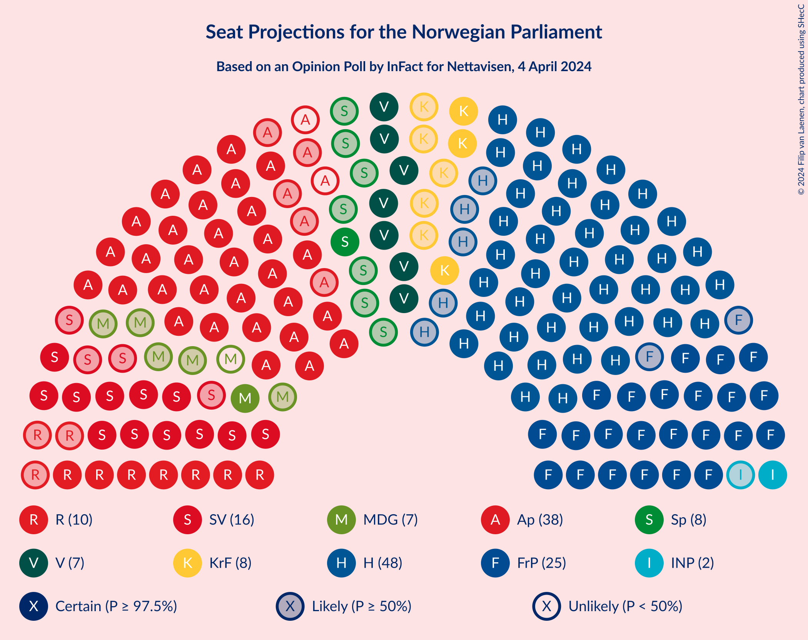
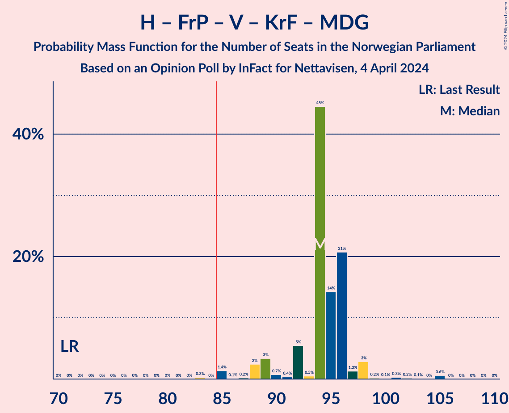
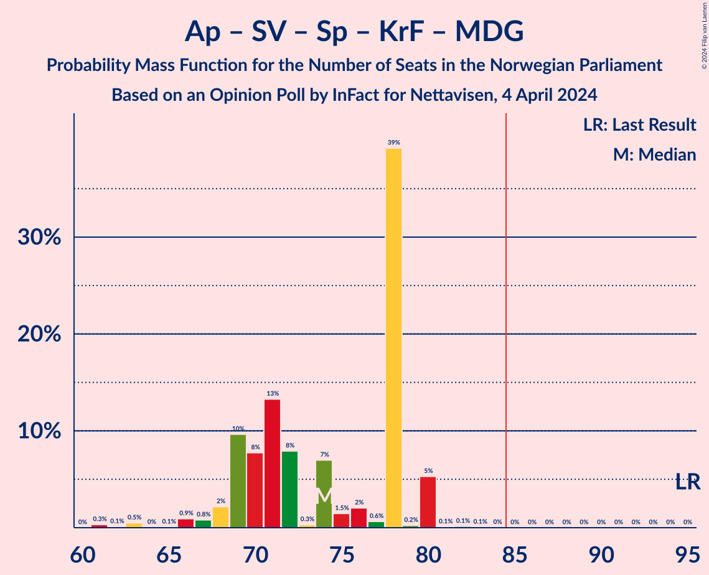

# Opinion Poll by InFact for Nettavisen, 4 April 2024

<a href="#voting-intentions">Voting Intentions</a> | <a href="#seats">Seats</a> | <a href="#coalitions">Coalitions</a> | <a href="#technical-information">Technical Information</a>

## Voting Intentions

### Confidence Intervals

| Party | Last Result | Poll Result | 80% Confidence Interval | 90% Confidence Interval | 95% Confidence Interval | 99% Confidence Interval |
|:-----:|:-----------:|:-----------:|:-----------------------:|:-----------------------:|:-----------------------:|:-----------------------:|
| Høyre | 20.4% | 25.4% | 23.8–27.1% |23.3–27.6% |22.9–28.0% |22.2–28.9% |
| Arbeiderpartiet | 26.2% | 18.4% | 17.0–20.0% |16.6–20.4% |16.2–20.8% |15.6–21.5% |
| Fremskrittspartiet | 11.6% | 15.3% | 14.0–16.8% |13.6–17.2% |13.3–17.5% |12.7–18.2% |
| Sosialistisk Venstreparti | 7.6% | 10.2% | 9.1–11.4% |8.8–11.8% |8.5–12.1% |8.0–12.7% |
| Venstre | 4.6% | 5.7% | 4.9–6.6% |4.6–6.9% |4.5–7.2% |4.1–7.7% |
| Rødt | 4.7% | 5.7% | 4.9–6.6% |4.6–6.9% |4.5–7.2% |4.1–7.7% |
| Senterpartiet | 13.5% | 5.4% | 4.6–6.4% |4.4–6.6% |4.2–6.9% |3.9–7.4% |
| Kristelig Folkeparti | 3.8% | 4.5% | 3.8–5.4% |3.6–5.7% |3.4–5.9% |3.1–6.4% |
| Miljøpartiet De Grønne | 3.9% | 3.4% | 2.8–4.2% |2.6–4.4% |2.5–4.6% |2.2–5.0% |
| Industri- og Næringspartiet | 0.3% | 3.4% | 2.8–4.2% |2.6–4.4% |2.5–4.6% |2.2–5.0% |
| Liberalistene | 0.2% | 0.4% | 0.3–0.8% |0.2–0.9% |0.2–1.0% |0.1–1.2% |
| Pensjonistpartiet | 0.6% | 0.4% | 0.3–0.8% |0.2–0.9% |0.2–1.0% |0.1–1.2% |
| Konservativt | 0.4% | 0.2% | 0.1–0.5% |0.1–0.6% |0.0–0.6% |0.0–0.8% |
| Norgesdemokratene | 1.1% | 0.1% | 0.0–0.4% |0.0–0.4% |0.0–0.5% |0.0–0.7% |

*Note:* The poll result column reflects the actual value used in the calculations. Published results may vary slightly, and in addition be rounded to fewer digits.

## Seats

### Confidence Intervals

| Party | Last Result | Median | 80% Confidence Interval | 90% Confidence Interval | 95% Confidence Interval | 99% Confidence Interval |
|:-----:|:-----------:|:------:|:-----------------------:|:-----------------------:|:-----------------------:|:-----------------------:|
| <a href="#høyre">Høyre</a> | 36 | 48 | 40–48 |40–48 |40–48 |40–50 |
| <a href="#arbeiderpartiet">Arbeiderpartiet</a> | 48 | 38 | 33–40 |33–42 |33–42 |31–42 |
| <a href="#fremskrittspartiet">Fremskrittspartiet</a> | 21 | 25 | 23–33 |23–33 |23–33 |23–36 |
| <a href="#sosialistisk-venstreparti">Sosialistisk Venstreparti</a> | 13 | 16 | 15–19 |12–20 |12–21 |12–21 |
| <a href="#venstre">Venstre</a> | 8 | 8 | 7–12 |7–12 |7–12 |7–12 |
| <a href="#rødt">Rødt</a> | 8 | 10 | 7–11 |7–11 |7–11 |7–12 |
| <a href="#senterpartiet">Senterpartiet</a> | 28 | 8 | 8–11 |1–11 |1–11 |1–14 |
| <a href="#kristelig-folkeparti">Kristelig Folkeparti</a> | 3 | 8 | 6–9 |3–9 |2–9 |2–10 |
| <a href="#miljøpartiet-de-grønne">Miljøpartiet De Grønne</a> | 3 | 7 | 2–7 |2–7 |1–7 |1–8 |
| <a href="#industri--og-næringspartiet">Industri- og Næringspartiet</a> | 0 | 2 | 2–7 |2–8 |1–8 |0–8 |
| <a href="#liberalistene">Liberalistene</a> | 0 | 0 | 0 |0 |0 |0 |
| <a href="#pensjonistpartiet">Pensjonistpartiet</a> | 0 | 0 | 0 |0 |0 |0 |
| <a href="#konservativt">Konservativt</a> | 0 | 0 | 0 |0 |0 |0 |
| <a href="#norgesdemokratene">Norgesdemokratene</a> | 0 | 0 | 0 |0 |0 |0 |

### Høyre

*For a full overview of the results for this party, see the [Høyre](party-høyre.html) page.*

| Number of Seats | Probability | Accumulated | Special Marks |
|:---------------:|:-----------:|:-----------:|:-------------:|
| 36 | 0% | 100% | Last Result |
| 37 | 0% | 100% |  |
| 38 | 0.1% | 100% |  |
| 39 | 0.1% | 99.9% |  |
| 40 | 13% | 99.8% |  |
| 41 | 0.6% | 87% |  |
| 42 | 4% | 86% |  |
| 43 | 0.9% | 82% |  |
| 44 | 0.7% | 81% |  |
| 45 | 4% | 81% |  |
| 46 | 15% | 77% |  |
| 47 | 11% | 62% |  |
| 48 | 49% | 51% | Median |
| 49 | 1.2% | 2% |  |
| 50 | 0.4% | 0.9% |  |
| 51 | 0.2% | 0.5% |  |
| 52 | 0.2% | 0.3% |  |
| 53 | 0% | 0% |  |

### Arbeiderpartiet

*For a full overview of the results for this party, see the [Arbeiderpartiet](party-arbeiderpartiet.html) page.*

| Number of Seats | Probability | Accumulated | Special Marks |
|:---------------:|:-----------:|:-----------:|:-------------:|
| 28 | 0.3% | 100% |  |
| 29 | 0% | 99.7% |  |
| 30 | 0.1% | 99.7% |  |
| 31 | 0.6% | 99.6% |  |
| 32 | 0.8% | 99.0% |  |
| 33 | 22% | 98% |  |
| 34 | 5% | 76% |  |
| 35 | 8% | 71% |  |
| 36 | 8% | 63% |  |
| 37 | 1.0% | 55% |  |
| 38 | 40% | 54% | Median |
| 39 | 0.6% | 14% |  |
| 40 | 5% | 13% |  |
| 41 | 0.1% | 8% |  |
| 42 | 8% | 8% |  |
| 43 | 0% | 0% |  |
| 44 | 0% | 0% |  |
| 45 | 0% | 0% |  |
| 46 | 0% | 0% |  |
| 47 | 0% | 0% |  |
| 48 | 0% | 0% | Last Result |

### Fremskrittspartiet

*For a full overview of the results for this party, see the [Fremskrittspartiet](party-fremskrittspartiet.html) page.*

| Number of Seats | Probability | Accumulated | Special Marks |
|:---------------:|:-----------:|:-----------:|:-------------:|
| 20 | 0.2% | 100% |  |
| 21 | 0% | 99.8% | Last Result |
| 22 | 0.2% | 99.8% |  |
| 23 | 43% | 99.6% |  |
| 24 | 4% | 56% |  |
| 25 | 3% | 52% | Median |
| 26 | 0.7% | 49% |  |
| 27 | 3% | 48% |  |
| 28 | 8% | 46% |  |
| 29 | 6% | 38% |  |
| 30 | 3% | 32% |  |
| 31 | 19% | 30% |  |
| 32 | 0.4% | 11% |  |
| 33 | 8% | 10% |  |
| 34 | 0.1% | 2% |  |
| 35 | 0.1% | 2% |  |
| 36 | 2% | 2% |  |
| 37 | 0.1% | 0.1% |  |
| 38 | 0% | 0% |  |

### Sosialistisk Venstreparti

*For a full overview of the results for this party, see the [Sosialistisk Venstreparti](party-sosialistiskvenstreparti.html) page.*

| Number of Seats | Probability | Accumulated | Special Marks |
|:---------------:|:-----------:|:-----------:|:-------------:|
| 12 | 5% | 100% |  |
| 13 | 3% | 95% | Last Result |
| 14 | 0.6% | 92% |  |
| 15 | 9% | 91% |  |
| 16 | 61% | 82% | Median |
| 17 | 4% | 21% |  |
| 18 | 5% | 18% |  |
| 19 | 6% | 13% |  |
| 20 | 3% | 7% |  |
| 21 | 4% | 4% |  |
| 22 | 0.2% | 0.2% |  |
| 23 | 0% | 0% |  |

### Venstre

*For a full overview of the results for this party, see the [Venstre](party-venstre.html) page.*

| Number of Seats | Probability | Accumulated | Special Marks |
|:---------------:|:-----------:|:-----------:|:-------------:|
| 3 | 0.1% | 100% |  |
| 4 | 0% | 99.9% |  |
| 5 | 0% | 99.9% |  |
| 6 | 0% | 99.9% |  |
| 7 | 46% | 99.9% |  |
| 8 | 27% | 54% | Last Result, Median |
| 9 | 2% | 27% |  |
| 10 | 9% | 26% |  |
| 11 | 5% | 16% |  |
| 12 | 11% | 12% |  |
| 13 | 0.2% | 0.3% |  |
| 14 | 0.1% | 0.1% |  |
| 15 | 0% | 0% |  |

### Rødt

*For a full overview of the results for this party, see the [Rødt](party-rødt.html) page.*

| Number of Seats | Probability | Accumulated | Special Marks |
|:---------------:|:-----------:|:-----------:|:-------------:|
| 1 | 0.1% | 100% |  |
| 2 | 0% | 99.9% |  |
| 3 | 0% | 99.9% |  |
| 4 | 0% | 99.9% |  |
| 5 | 0% | 99.9% |  |
| 6 | 0% | 99.9% |  |
| 7 | 13% | 99.9% |  |
| 8 | 6% | 87% | Last Result |
| 9 | 13% | 81% |  |
| 10 | 56% | 68% | Median |
| 11 | 12% | 13% |  |
| 12 | 0.3% | 0.7% |  |
| 13 | 0.3% | 0.4% |  |
| 14 | 0% | 0% |  |

### Senterpartiet

*For a full overview of the results for this party, see the [Senterpartiet](party-senterpartiet.html) page.*

| Number of Seats | Probability | Accumulated | Special Marks |
|:---------------:|:-----------:|:-----------:|:-------------:|
| 1 | 8% | 100% |  |
| 2 | 0.3% | 92% |  |
| 3 | 0% | 92% |  |
| 4 | 0% | 92% |  |
| 5 | 0% | 92% |  |
| 6 | 0.1% | 92% |  |
| 7 | 0.6% | 92% |  |
| 8 | 43% | 91% | Median |
| 9 | 14% | 48% |  |
| 10 | 13% | 34% |  |
| 11 | 20% | 22% |  |
| 12 | 0.5% | 1.4% |  |
| 13 | 0.3% | 0.8% |  |
| 14 | 0.4% | 0.5% |  |
| 15 | 0.1% | 0.1% |  |
| 16 | 0% | 0% |  |
| 17 | 0% | 0% |  |
| 18 | 0% | 0% |  |
| 19 | 0% | 0% |  |
| 20 | 0% | 0% |  |
| 21 | 0% | 0% |  |
| 22 | 0% | 0% |  |
| 23 | 0% | 0% |  |
| 24 | 0% | 0% |  |
| 25 | 0% | 0% |  |
| 26 | 0% | 0% |  |
| 27 | 0% | 0% |  |
| 28 | 0% | 0% | Last Result |

### Kristelig Folkeparti

*For a full overview of the results for this party, see the [Kristelig Folkeparti](party-kristeligfolkeparti.html) page.*

| Number of Seats | Probability | Accumulated | Special Marks |
|:---------------:|:-----------:|:-----------:|:-------------:|
| 2 | 5% | 100% |  |
| 3 | 0.8% | 95% | Last Result |
| 4 | 0% | 95% |  |
| 5 | 0% | 95% |  |
| 6 | 5% | 95% |  |
| 7 | 13% | 90% |  |
| 8 | 31% | 77% | Median |
| 9 | 45% | 45% |  |
| 10 | 0.8% | 0.9% |  |
| 11 | 0% | 0.1% |  |
| 12 | 0% | 0% |  |

### Miljøpartiet De Grønne

*For a full overview of the results for this party, see the [Miljøpartiet De Grønne](party-miljøpartietdegrønne.html) page.*

| Number of Seats | Probability | Accumulated | Special Marks |
|:---------------:|:-----------:|:-----------:|:-------------:|
| 1 | 4% | 100% |  |
| 2 | 15% | 96% |  |
| 3 | 25% | 81% | Last Result |
| 4 | 0% | 56% |  |
| 5 | 0% | 56% |  |
| 6 | 0.2% | 56% |  |
| 7 | 55% | 56% | Median |
| 8 | 0.9% | 1.0% |  |
| 9 | 0% | 0% |  |

### Industri- og Næringspartiet

*For a full overview of the results for this party, see the [Industri- og Næringspartiet](party-industri-ognæringspartiet.html) page.*

| Number of Seats | Probability | Accumulated | Special Marks |
|:---------------:|:-----------:|:-----------:|:-------------:|
| 0 | 0.7% | 100% | Last Result |
| 1 | 2% | 99.3% |  |
| 2 | 70% | 97% | Median |
| 3 | 9% | 28% |  |
| 4 | 0% | 19% |  |
| 5 | 0% | 19% |  |
| 6 | 7% | 19% |  |
| 7 | 4% | 12% |  |
| 8 | 7% | 8% |  |
| 9 | 0.3% | 0.3% |  |
| 10 | 0% | 0% |  |

### Liberalistene

*For a full overview of the results for this party, see the [Liberalistene](party-liberalistene.html) page.*

| Number of Seats | Probability | Accumulated | Special Marks |
|:---------------:|:-----------:|:-----------:|:-------------:|
| 0 | 100% | 100% | Last Result, Median |

### Pensjonistpartiet

*For a full overview of the results for this party, see the [Pensjonistpartiet](party-pensjonistpartiet.html) page.*

| Number of Seats | Probability | Accumulated | Special Marks |
|:---------------:|:-----------:|:-----------:|:-------------:|
| 0 | 100% | 100% | Last Result, Median |

### Konservativt

*For a full overview of the results for this party, see the [Konservativt](party-konservativt.html) page.*

| Number of Seats | Probability | Accumulated | Special Marks |
|:---------------:|:-----------:|:-----------:|:-------------:|
| 0 | 100% | 100% | Last Result, Median |

### Norgesdemokratene

*For a full overview of the results for this party, see the [Norgesdemokratene](party-norgesdemokratene.html) page.*

| Number of Seats | Probability | Accumulated | Special Marks |
|:---------------:|:-----------:|:-----------:|:-------------:|
| 0 | 100% | 100% | Last Result, Median |

## Coalitions

### Confidence Intervals

| Coalition | Last Result | Median | Majority? | 80% Confidence Interval | 90% Confidence Interval | 95% Confidence Interval | 99% Confidence Interval |
|:---------:|:-----------:|:------:|:---------:|:-----------------------:|:-----------------------:|:-----------------------:|:-----------------------:|
| Høyre – Fremskrittspartiet – Venstre – Senterpartiet – Kristelig Folkeparti | 96 | 95 | 100% | 94–104 | 94–104 | 94–104 | 89–107 |
| Høyre – Fremskrittspartiet – Venstre – Kristelig Folkeparti – Miljøpartiet De Grønne | 71 | 94 | 99.7% | 92–96 | 89–97 | 88–98 | 85–105 |
| Høyre – Fremskrittspartiet – Venstre – Kristelig Folkeparti | 68 | 87 | 97% | 87–93 | 86–93 | 84–96 | 81–98 |
| Høyre – Fremskrittspartiet – Venstre | 65 | 80 | 26% | 78–85 | 78–86 | 78–88 | 76–92 |
| Arbeiderpartiet – Sosialistisk Venstreparti – Senterpartiet – Kristelig Folkeparti – Miljøpartiet De Grønne | 95 | 74 | 0% | 69–78 | 69–80 | 67–80 | 63–80 |
| Arbeiderpartiet – Sosialistisk Venstreparti – Rødt – Senterpartiet – Miljøpartiet De Grønne | 100 | 78 | 0.2% | 70–79 | 69–79 | 68–79 | 68–83 |
| Høyre – Fremskrittspartiet | 57 | 71 | 0% | 71–77 | 69–77 | 68–78 | 66–82 |
| Arbeiderpartiet – Sosialistisk Venstreparti – Rødt – Senterpartiet | 97 | 72 | 0% | 67–72 | 67–76 | 66–76 | 61–80 |
| Arbeiderpartiet – Sosialistisk Venstreparti – Senterpartiet – Miljøpartiet De Grønne | 92 | 67 | 0% | 62–69 | 60–72 | 60–72 | 58–73 |
| Arbeiderpartiet – Sosialistisk Venstreparti – Rødt – Miljøpartiet De Grønne | 72 | 68 | 0% | 61–71 | 60–72 | 59–72 | 59–72 |
| Høyre – Venstre – Kristelig Folkeparti | 47 | 64 | 0% | 56–65 | 55–68 | 55–68 | 55–68 |
| Arbeiderpartiet – Sosialistisk Venstreparti – Senterpartiet | 89 | 62 | 0% | 58–65 | 58–65 | 58–65 | 52–70 |
| Arbeiderpartiet – Senterpartiet – Kristelig Folkeparti – Miljøpartiet De Grønne | 82 | 57 | 0% | 54–62 | 51–62 | 48–62 | 46–62 |
| Arbeiderpartiet – Sosialistisk Venstreparti | 61 | 54 | 0% | 49–56 | 48–58 | 48–58 | 45–59 |
| Arbeiderpartiet – Senterpartiet – Kristelig Folkeparti | 79 | 54 | 0% | 50–55 | 48–55 | 46–55 | 42–57 |
| Arbeiderpartiet – Senterpartiet | 76 | 46 | 0% | 43–46 | 43–49 | 41–49 | 35–53 |
| Venstre – Senterpartiet – Kristelig Folkeparti | 39 | 24 | 0% | 22–29 | 19–29 | 19–30 | 18–32 |

### Høyre – Fremskrittspartiet – Venstre – Senterpartiet – Kristelig Folkeparti

| Number of Seats | Probability | Accumulated | Special Marks |
|:---------------:|:-----------:|:-----------:|:-------------:|
| 86 | 0.1% | 100% |  |
| 87 | 0% | 99.9% |  |
| 88 | 0% | 99.9% |  |
| 89 | 0.5% | 99.9% |  |
| 90 | 0.1% | 99.4% |  |
| 91 | 0.1% | 99.4% |  |
| 92 | 0.4% | 99.3% |  |
| 93 | 1.3% | 98.9% |  |
| 94 | 9% | 98% |  |
| 95 | 39% | 88% |  |
| 96 | 0.8% | 49% | Last Result |
| 97 | 3% | 48% | Median |
| 98 | 13% | 45% |  |
| 99 | 6% | 32% |  |
| 100 | 2% | 25% |  |
| 101 | 3% | 24% |  |
| 102 | 4% | 21% |  |
| 103 | 0.8% | 17% |  |
| 104 | 13% | 16% |  |
| 105 | 0.2% | 2% |  |
| 106 | 0.8% | 2% |  |
| 107 | 1.1% | 2% |  |
| 108 | 0.1% | 0.4% |  |
| 109 | 0.4% | 0.4% |  |
| 110 | 0% | 0% |  |

### Høyre – Fremskrittspartiet – Venstre – Kristelig Folkeparti – Miljøpartiet De Grønne

| Number of Seats | Probability | Accumulated | Special Marks |
|:---------------:|:-----------:|:-----------:|:-------------:|
| 71 | 0% | 100% | Last Result |
| 72 | 0% | 100% |  |
| 73 | 0% | 100% |  |
| 74 | 0% | 100% |  |
| 75 | 0% | 100% |  |
| 76 | 0% | 100% |  |
| 77 | 0% | 100% |  |
| 78 | 0% | 100% |  |
| 79 | 0% | 100% |  |
| 80 | 0% | 100% |  |
| 81 | 0% | 100% |  |
| 82 | 0% | 100% |  |
| 83 | 0.3% | 100% |  |
| 84 | 0% | 99.7% |  |
| 85 | 1.4% | 99.7% | Majority |
| 86 | 0.1% | 98% |  |
| 87 | 0.2% | 98% |  |
| 88 | 2% | 98% |  |
| 89 | 3% | 96% |  |
| 90 | 0.7% | 92% |  |
| 91 | 0.4% | 92% |  |
| 92 | 5% | 91% |  |
| 93 | 0.5% | 86% |  |
| 94 | 45% | 85% |  |
| 95 | 14% | 41% |  |
| 96 | 21% | 26% | Median |
| 97 | 1.3% | 6% |  |
| 98 | 3% | 4% |  |
| 99 | 0.2% | 1.5% |  |
| 100 | 0.1% | 1.3% |  |
| 101 | 0.3% | 1.2% |  |
| 102 | 0.2% | 0.9% |  |
| 103 | 0.1% | 0.7% |  |
| 104 | 0% | 0.6% |  |
| 105 | 0.6% | 0.6% |  |
| 106 | 0% | 0% |  |

### Høyre – Fremskrittspartiet – Venstre – Kristelig Folkeparti

| Number of Seats | Probability | Accumulated | Special Marks |
|:---------------:|:-----------:|:-----------:|:-------------:|
| 68 | 0% | 100% | Last Result |
| 69 | 0% | 100% |  |
| 70 | 0% | 100% |  |
| 71 | 0% | 100% |  |
| 72 | 0% | 100% |  |
| 73 | 0% | 100% |  |
| 74 | 0% | 100% |  |
| 75 | 0% | 100% |  |
| 76 | 0% | 100% |  |
| 77 | 0% | 100% |  |
| 78 | 0.1% | 100% |  |
| 79 | 0% | 99.9% |  |
| 80 | 0.1% | 99.9% |  |
| 81 | 0.4% | 99.8% |  |
| 82 | 1.2% | 99.4% |  |
| 83 | 0.3% | 98% |  |
| 84 | 0.7% | 98% |  |
| 85 | 0.1% | 97% | Majority |
| 86 | 2% | 97% |  |
| 87 | 47% | 95% |  |
| 88 | 9% | 48% |  |
| 89 | 0.5% | 39% | Median |
| 90 | 5% | 38% |  |
| 91 | 2% | 33% |  |
| 92 | 4% | 31% |  |
| 93 | 23% | 27% |  |
| 94 | 0.3% | 4% |  |
| 95 | 1.2% | 4% |  |
| 96 | 1.3% | 3% |  |
| 97 | 0.6% | 1.4% |  |
| 98 | 0.6% | 0.8% |  |
| 99 | 0.1% | 0.1% |  |
| 100 | 0% | 0.1% |  |
| 101 | 0% | 0% |  |

### Høyre – Fremskrittspartiet – Venstre

| Number of Seats | Probability | Accumulated | Special Marks |
|:---------------:|:-----------:|:-----------:|:-------------:|
| 65 | 0% | 100% | Last Result |
| 66 | 0% | 100% |  |
| 67 | 0% | 100% |  |
| 68 | 0% | 100% |  |
| 69 | 0% | 100% |  |
| 70 | 0% | 100% |  |
| 71 | 0% | 100% |  |
| 72 | 0% | 100% |  |
| 73 | 0.1% | 99.9% |  |
| 74 | 0.1% | 99.9% |  |
| 75 | 0% | 99.8% |  |
| 76 | 0.3% | 99.8% |  |
| 77 | 0.7% | 99.5% |  |
| 78 | 40% | 98.8% |  |
| 79 | 5% | 59% |  |
| 80 | 5% | 54% |  |
| 81 | 8% | 49% | Median |
| 82 | 2% | 41% |  |
| 83 | 0.4% | 39% |  |
| 84 | 13% | 39% |  |
| 85 | 20% | 26% | Majority |
| 86 | 0.9% | 5% |  |
| 87 | 0.4% | 4% |  |
| 88 | 2% | 4% |  |
| 89 | 0.7% | 2% |  |
| 90 | 0.9% | 2% |  |
| 91 | 0.2% | 0.8% |  |
| 92 | 0.1% | 0.5% |  |
| 93 | 0.5% | 0.5% |  |
| 94 | 0% | 0% |  |

### Arbeiderpartiet – Sosialistisk Venstreparti – Senterpartiet – Kristelig Folkeparti – Miljøpartiet De Grønne

| Number of Seats | Probability | Accumulated | Special Marks |
|:---------------:|:-----------:|:-----------:|:-------------:|
| 61 | 0.3% | 100% |  |
| 62 | 0.1% | 99.7% |  |
| 63 | 0.5% | 99.6% |  |
| 64 | 0% | 99.1% |  |
| 65 | 0.1% | 99.0% |  |
| 66 | 0.9% | 99.0% |  |
| 67 | 0.8% | 98% |  |
| 68 | 2% | 97% |  |
| 69 | 10% | 95% |  |
| 70 | 8% | 85% |  |
| 71 | 13% | 78% |  |
| 72 | 8% | 64% |  |
| 73 | 0.3% | 56% |  |
| 74 | 7% | 56% |  |
| 75 | 1.5% | 49% |  |
| 76 | 2% | 48% |  |
| 77 | 0.6% | 46% | Median |
| 78 | 39% | 45% |  |
| 79 | 0.2% | 6% |  |
| 80 | 5% | 6% |  |
| 81 | 0.1% | 0.3% |  |
| 82 | 0.1% | 0.2% |  |
| 83 | 0.1% | 0.1% |  |
| 84 | 0% | 0% |  |
| 85 | 0% | 0% | Majority |
| 86 | 0% | 0% |  |
| 87 | 0% | 0% |  |
| 88 | 0% | 0% |  |
| 89 | 0% | 0% |  |
| 90 | 0% | 0% |  |
| 91 | 0% | 0% |  |
| 92 | 0% | 0% |  |
| 93 | 0% | 0% |  |
| 94 | 0% | 0% |  |
| 95 | 0% | 0% | Last Result |

### Arbeiderpartiet – Sosialistisk Venstreparti – Rødt – Senterpartiet – Miljøpartiet De Grønne

| Number of Seats | Probability | Accumulated | Special Marks |
|:---------------:|:-----------:|:-----------:|:-------------:|
| 65 | 0% | 100% |  |
| 66 | 0.1% | 99.9% |  |
| 67 | 0.1% | 99.8% |  |
| 68 | 4% | 99.8% |  |
| 69 | 1.4% | 96% |  |
| 70 | 6% | 95% |  |
| 71 | 1.2% | 89% |  |
| 72 | 0.7% | 88% |  |
| 73 | 23% | 87% |  |
| 74 | 9% | 64% |  |
| 75 | 0.2% | 54% |  |
| 76 | 2% | 54% |  |
| 77 | 0.9% | 52% |  |
| 78 | 5% | 51% |  |
| 79 | 44% | 46% | Median |
| 80 | 0.1% | 2% |  |
| 81 | 0.6% | 2% |  |
| 82 | 0.3% | 2% |  |
| 83 | 1.2% | 1.5% |  |
| 84 | 0.1% | 0.3% |  |
| 85 | 0.1% | 0.2% | Majority |
| 86 | 0.1% | 0.1% |  |
| 87 | 0% | 0% |  |
| 88 | 0% | 0% |  |
| 89 | 0% | 0% |  |
| 90 | 0% | 0% |  |
| 91 | 0% | 0% |  |
| 92 | 0% | 0% |  |
| 93 | 0% | 0% |  |
| 94 | 0% | 0% |  |
| 95 | 0% | 0% |  |
| 96 | 0% | 0% |  |
| 97 | 0% | 0% |  |
| 98 | 0% | 0% |  |
| 99 | 0% | 0% |  |
| 100 | 0% | 0% | Last Result |

### Høyre – Fremskrittspartiet

| Number of Seats | Probability | Accumulated | Special Marks |
|:---------------:|:-----------:|:-----------:|:-------------:|
| 57 | 0% | 100% | Last Result |
| 58 | 0% | 100% |  |
| 59 | 0% | 100% |  |
| 60 | 0% | 100% |  |
| 61 | 0% | 100% |  |
| 62 | 0% | 100% |  |
| 63 | 0.1% | 100% |  |
| 64 | 0% | 99.9% |  |
| 65 | 0.1% | 99.9% |  |
| 66 | 0.5% | 99.8% |  |
| 67 | 0.5% | 99.3% |  |
| 68 | 3% | 98.8% |  |
| 69 | 2% | 95% |  |
| 70 | 0.4% | 93% |  |
| 71 | 44% | 93% |  |
| 72 | 8% | 48% |  |
| 73 | 7% | 40% | Median |
| 74 | 0.5% | 32% |  |
| 75 | 9% | 32% |  |
| 76 | 0.8% | 23% |  |
| 77 | 18% | 22% |  |
| 78 | 1.4% | 4% |  |
| 79 | 0.2% | 2% |  |
| 80 | 0.7% | 2% |  |
| 81 | 0.9% | 2% |  |
| 82 | 0.6% | 0.6% |  |
| 83 | 0% | 0.1% |  |
| 84 | 0% | 0% |  |

### Arbeiderpartiet – Sosialistisk Venstreparti – Rødt – Senterpartiet

| Number of Seats | Probability | Accumulated | Special Marks |
|:---------------:|:-----------:|:-----------:|:-------------:|
| 61 | 0.6% | 100% |  |
| 62 | 0.1% | 99.4% |  |
| 63 | 0.1% | 99.2% |  |
| 64 | 0.2% | 99.1% |  |
| 65 | 0.4% | 98.9% |  |
| 66 | 3% | 98.5% |  |
| 67 | 8% | 95% |  |
| 68 | 6% | 87% |  |
| 69 | 3% | 82% |  |
| 70 | 24% | 79% |  |
| 71 | 1.5% | 55% |  |
| 72 | 46% | 53% | Median |
| 73 | 0.7% | 7% |  |
| 74 | 0.4% | 7% |  |
| 75 | 0.8% | 6% |  |
| 76 | 4% | 6% |  |
| 77 | 0.1% | 2% |  |
| 78 | 0.4% | 2% |  |
| 79 | 0.1% | 1.3% |  |
| 80 | 1.2% | 1.2% |  |
| 81 | 0% | 0.1% |  |
| 82 | 0% | 0% |  |
| 83 | 0% | 0% |  |
| 84 | 0% | 0% |  |
| 85 | 0% | 0% | Majority |
| 86 | 0% | 0% |  |
| 87 | 0% | 0% |  |
| 88 | 0% | 0% |  |
| 89 | 0% | 0% |  |
| 90 | 0% | 0% |  |
| 91 | 0% | 0% |  |
| 92 | 0% | 0% |  |
| 93 | 0% | 0% |  |
| 94 | 0% | 0% |  |
| 95 | 0% | 0% |  |
| 96 | 0% | 0% |  |
| 97 | 0% | 0% | Last Result |

### Arbeiderpartiet – Sosialistisk Venstreparti – Senterpartiet – Miljøpartiet De Grønne

| Number of Seats | Probability | Accumulated | Special Marks |
|:---------------:|:-----------:|:-----------:|:-------------:|
| 56 | 0% | 100% |  |
| 57 | 0% | 99.9% |  |
| 58 | 1.3% | 99.9% |  |
| 59 | 0.2% | 98.6% |  |
| 60 | 4% | 98% |  |
| 61 | 2% | 95% |  |
| 62 | 8% | 93% |  |
| 63 | 18% | 85% |  |
| 64 | 0.4% | 67% |  |
| 65 | 7% | 67% |  |
| 66 | 6% | 59% |  |
| 67 | 5% | 53% |  |
| 68 | 0.9% | 48% |  |
| 69 | 40% | 47% | Median |
| 70 | 0.1% | 7% |  |
| 71 | 0.4% | 7% |  |
| 72 | 5% | 7% |  |
| 73 | 2% | 2% |  |
| 74 | 0% | 0.2% |  |
| 75 | 0.1% | 0.2% |  |
| 76 | 0% | 0.1% |  |
| 77 | 0% | 0.1% |  |
| 78 | 0.1% | 0.1% |  |
| 79 | 0% | 0% |  |
| 80 | 0% | 0% |  |
| 81 | 0% | 0% |  |
| 82 | 0% | 0% |  |
| 83 | 0% | 0% |  |
| 84 | 0% | 0% |  |
| 85 | 0% | 0% | Majority |
| 86 | 0% | 0% |  |
| 87 | 0% | 0% |  |
| 88 | 0% | 0% |  |
| 89 | 0% | 0% |  |
| 90 | 0% | 0% |  |
| 91 | 0% | 0% |  |
| 92 | 0% | 0% | Last Result |

### Arbeiderpartiet – Sosialistisk Venstreparti – Rødt – Miljøpartiet De Grønne

| Number of Seats | Probability | Accumulated | Special Marks |
|:---------------:|:-----------:|:-----------:|:-------------:|
| 57 | 0.4% | 100% |  |
| 58 | 0.1% | 99.6% |  |
| 59 | 4% | 99.5% |  |
| 60 | 0.7% | 95% |  |
| 61 | 5% | 94% |  |
| 62 | 13% | 90% |  |
| 63 | 1.1% | 76% |  |
| 64 | 11% | 75% |  |
| 65 | 0.4% | 64% |  |
| 66 | 2% | 64% |  |
| 67 | 3% | 62% |  |
| 68 | 9% | 59% |  |
| 69 | 0.7% | 49% |  |
| 70 | 0.8% | 49% |  |
| 71 | 40% | 48% | Median |
| 72 | 8% | 8% | Last Result |
| 73 | 0.2% | 0.4% |  |
| 74 | 0% | 0.2% |  |
| 75 | 0.1% | 0.2% |  |
| 76 | 0.1% | 0.1% |  |
| 77 | 0% | 0% |  |

### Høyre – Venstre – Kristelig Folkeparti

| Number of Seats | Probability | Accumulated | Special Marks |
|:---------------:|:-----------:|:-----------:|:-------------:|
| 47 | 0% | 100% | Last Result |
| 48 | 0% | 100% |  |
| 49 | 0% | 100% |  |
| 50 | 0% | 100% |  |
| 51 | 0% | 100% |  |
| 52 | 0% | 100% |  |
| 53 | 0.3% | 100% |  |
| 54 | 0.1% | 99.7% |  |
| 55 | 7% | 99.5% |  |
| 56 | 7% | 92% |  |
| 57 | 0.9% | 85% |  |
| 58 | 0.8% | 84% |  |
| 59 | 2% | 84% |  |
| 60 | 2% | 82% |  |
| 61 | 5% | 80% |  |
| 62 | 14% | 74% |  |
| 63 | 0.3% | 60% |  |
| 64 | 45% | 60% | Median |
| 65 | 7% | 15% |  |
| 66 | 0.6% | 8% |  |
| 67 | 0.4% | 7% |  |
| 68 | 6% | 7% |  |
| 69 | 0.2% | 0.3% |  |
| 70 | 0% | 0% |  |

### Arbeiderpartiet – Sosialistisk Venstreparti – Senterpartiet

| Number of Seats | Probability | Accumulated | Special Marks |
|:---------------:|:-----------:|:-----------:|:-------------:|
| 51 | 0.4% | 100% |  |
| 52 | 0.2% | 99.6% |  |
| 53 | 0% | 99.4% |  |
| 54 | 0% | 99.3% |  |
| 55 | 0.2% | 99.3% |  |
| 56 | 1.0% | 99.1% |  |
| 57 | 0.4% | 98% |  |
| 58 | 11% | 98% |  |
| 59 | 8% | 87% |  |
| 60 | 17% | 80% |  |
| 61 | 5% | 63% |  |
| 62 | 40% | 57% | Median |
| 63 | 3% | 17% |  |
| 64 | 3% | 14% |  |
| 65 | 9% | 11% |  |
| 66 | 0.5% | 2% |  |
| 67 | 0.1% | 2% |  |
| 68 | 0.3% | 2% |  |
| 69 | 0% | 1.4% |  |
| 70 | 1.2% | 1.3% |  |
| 71 | 0.1% | 0.1% |  |
| 72 | 0% | 0% |  |
| 73 | 0% | 0% |  |
| 74 | 0% | 0% |  |
| 75 | 0% | 0% |  |
| 76 | 0% | 0% |  |
| 77 | 0% | 0% |  |
| 78 | 0% | 0% |  |
| 79 | 0% | 0% |  |
| 80 | 0% | 0% |  |
| 81 | 0% | 0% |  |
| 82 | 0% | 0% |  |
| 83 | 0% | 0% |  |
| 84 | 0% | 0% |  |
| 85 | 0% | 0% | Majority |
| 86 | 0% | 0% |  |
| 87 | 0% | 0% |  |
| 88 | 0% | 0% |  |
| 89 | 0% | 0% | Last Result |

### Arbeiderpartiet – Senterpartiet – Kristelig Folkeparti – Miljøpartiet De Grønne

| Number of Seats | Probability | Accumulated | Special Marks |
|:---------------:|:-----------:|:-----------:|:-------------:|
| 40 | 0.3% | 100% |  |
| 41 | 0% | 99.7% |  |
| 42 | 0% | 99.7% |  |
| 43 | 0.1% | 99.7% |  |
| 44 | 0% | 99.6% |  |
| 45 | 0% | 99.6% |  |
| 46 | 0.5% | 99.6% |  |
| 47 | 0% | 99.1% |  |
| 48 | 2% | 99.1% |  |
| 49 | 1.0% | 97% |  |
| 50 | 0.5% | 96% |  |
| 51 | 0.1% | 95% |  |
| 52 | 0.9% | 95% |  |
| 53 | 3% | 94% |  |
| 54 | 9% | 91% |  |
| 55 | 14% | 82% |  |
| 56 | 6% | 68% |  |
| 57 | 12% | 61% |  |
| 58 | 1.4% | 49% |  |
| 59 | 0.2% | 48% |  |
| 60 | 3% | 48% |  |
| 61 | 5% | 44% | Median |
| 62 | 39% | 39% |  |
| 63 | 0.2% | 0.3% |  |
| 64 | 0.1% | 0.2% |  |
| 65 | 0% | 0.1% |  |
| 66 | 0% | 0.1% |  |
| 67 | 0% | 0.1% |  |
| 68 | 0% | 0% |  |
| 69 | 0% | 0% |  |
| 70 | 0% | 0% |  |
| 71 | 0% | 0% |  |
| 72 | 0% | 0% |  |
| 73 | 0% | 0% |  |
| 74 | 0% | 0% |  |
| 75 | 0% | 0% |  |
| 76 | 0% | 0% |  |
| 77 | 0% | 0% |  |
| 78 | 0% | 0% |  |
| 79 | 0% | 0% |  |
| 80 | 0% | 0% |  |
| 81 | 0% | 0% |  |
| 82 | 0% | 0% | Last Result |

### Arbeiderpartiet – Sosialistisk Venstreparti

| Number of Seats | Probability | Accumulated | Special Marks |
|:---------------:|:-----------:|:-----------:|:-------------:|
| 44 | 0.2% | 100% |  |
| 45 | 0.4% | 99.8% |  |
| 46 | 0.3% | 99.4% |  |
| 47 | 0.1% | 99.1% |  |
| 48 | 8% | 99.0% |  |
| 49 | 17% | 91% |  |
| 50 | 2% | 74% |  |
| 51 | 2% | 72% |  |
| 52 | 6% | 70% |  |
| 53 | 0.9% | 64% |  |
| 54 | 47% | 63% | Median |
| 55 | 4% | 16% |  |
| 56 | 3% | 12% |  |
| 57 | 0.1% | 9% |  |
| 58 | 7% | 9% |  |
| 59 | 1.3% | 2% |  |
| 60 | 0.2% | 0.2% |  |
| 61 | 0% | 0% | Last Result |

### Arbeiderpartiet – Senterpartiet – Kristelig Folkeparti

| Number of Seats | Probability | Accumulated | Special Marks |
|:---------------:|:-----------:|:-----------:|:-------------:|
| 38 | 0.3% | 100% |  |
| 39 | 0% | 99.7% |  |
| 40 | 0% | 99.7% |  |
| 41 | 0.1% | 99.7% |  |
| 42 | 0.4% | 99.6% |  |
| 43 | 0% | 99.1% |  |
| 44 | 0% | 99.1% |  |
| 45 | 1.1% | 99.1% |  |
| 46 | 2% | 98% |  |
| 47 | 0.4% | 96% |  |
| 48 | 1.2% | 95% |  |
| 49 | 0.7% | 94% |  |
| 50 | 8% | 93% |  |
| 51 | 10% | 86% |  |
| 52 | 14% | 76% |  |
| 53 | 7% | 61% |  |
| 54 | 8% | 54% | Median |
| 55 | 45% | 46% |  |
| 56 | 0.3% | 1.2% |  |
| 57 | 0.5% | 0.8% |  |
| 58 | 0.1% | 0.4% |  |
| 59 | 0% | 0.2% |  |
| 60 | 0.1% | 0.2% |  |
| 61 | 0.1% | 0.1% |  |
| 62 | 0% | 0% |  |
| 63 | 0% | 0% |  |
| 64 | 0% | 0% |  |
| 65 | 0% | 0% |  |
| 66 | 0% | 0% |  |
| 67 | 0% | 0% |  |
| 68 | 0% | 0% |  |
| 69 | 0% | 0% |  |
| 70 | 0% | 0% |  |
| 71 | 0% | 0% |  |
| 72 | 0% | 0% |  |
| 73 | 0% | 0% |  |
| 74 | 0% | 0% |  |
| 75 | 0% | 0% |  |
| 76 | 0% | 0% |  |
| 77 | 0% | 0% |  |
| 78 | 0% | 0% |  |
| 79 | 0% | 0% | Last Result |

### Arbeiderpartiet – Senterpartiet

| Number of Seats | Probability | Accumulated | Special Marks |
|:---------------:|:-----------:|:-----------:|:-------------:|
| 34 | 0.4% | 100% |  |
| 35 | 0.3% | 99.6% |  |
| 36 | 0% | 99.2% |  |
| 37 | 0% | 99.2% |  |
| 38 | 0.5% | 99.2% |  |
| 39 | 0.3% | 98.7% |  |
| 40 | 0.5% | 98% |  |
| 41 | 0.9% | 98% |  |
| 42 | 0.6% | 97% |  |
| 43 | 15% | 96% |  |
| 44 | 20% | 81% |  |
| 45 | 9% | 61% |  |
| 46 | 44% | 52% | Median |
| 47 | 1.0% | 8% |  |
| 48 | 0.4% | 7% |  |
| 49 | 5% | 6% |  |
| 50 | 0.3% | 2% |  |
| 51 | 0.1% | 1.3% |  |
| 52 | 0.1% | 1.2% |  |
| 53 | 1.2% | 1.2% |  |
| 54 | 0% | 0% |  |
| 55 | 0% | 0% |  |
| 56 | 0% | 0% |  |
| 57 | 0% | 0% |  |
| 58 | 0% | 0% |  |
| 59 | 0% | 0% |  |
| 60 | 0% | 0% |  |
| 61 | 0% | 0% |  |
| 62 | 0% | 0% |  |
| 63 | 0% | 0% |  |
| 64 | 0% | 0% |  |
| 65 | 0% | 0% |  |
| 66 | 0% | 0% |  |
| 67 | 0% | 0% |  |
| 68 | 0% | 0% |  |
| 69 | 0% | 0% |  |
| 70 | 0% | 0% |  |
| 71 | 0% | 0% |  |
| 72 | 0% | 0% |  |
| 73 | 0% | 0% |  |
| 74 | 0% | 0% |  |
| 75 | 0% | 0% |  |
| 76 | 0% | 0% | Last Result |

### Venstre – Senterpartiet – Kristelig Folkeparti

| Number of Seats | Probability | Accumulated | Special Marks |
|:---------------:|:-----------:|:-----------:|:-------------:|
| 15 | 0.3% | 100% |  |
| 16 | 0% | 99.7% |  |
| 17 | 0% | 99.7% |  |
| 18 | 0.7% | 99.6% |  |
| 19 | 7% | 98.9% |  |
| 20 | 0.4% | 92% |  |
| 21 | 0.7% | 92% |  |
| 22 | 7% | 91% |  |
| 23 | 0.7% | 84% |  |
| 24 | 41% | 83% | Median |
| 25 | 9% | 42% |  |
| 26 | 1.2% | 33% |  |
| 27 | 18% | 32% |  |
| 28 | 1.1% | 13% |  |
| 29 | 8% | 12% |  |
| 30 | 3% | 4% |  |
| 31 | 0.2% | 0.7% |  |
| 32 | 0.1% | 0.5% |  |
| 33 | 0.1% | 0.4% |  |
| 34 | 0% | 0.3% |  |
| 35 | 0.3% | 0.3% |  |
| 36 | 0% | 0% |  |
| 37 | 0% | 0% |  |
| 38 | 0% | 0% |  |
| 39 | 0% | 0% | Last Result |

## Technical Information

### Opinion Poll

+ **Polling firm:** InFact
+ **Commissioner(s):** Nettavisen
+ **Fieldwork period:** 4 April 2024

### Calculations

+ **Sample size:** 1130
+ **Simulations done:** 1,048,576
+ **Error estimate:** 3.31%

