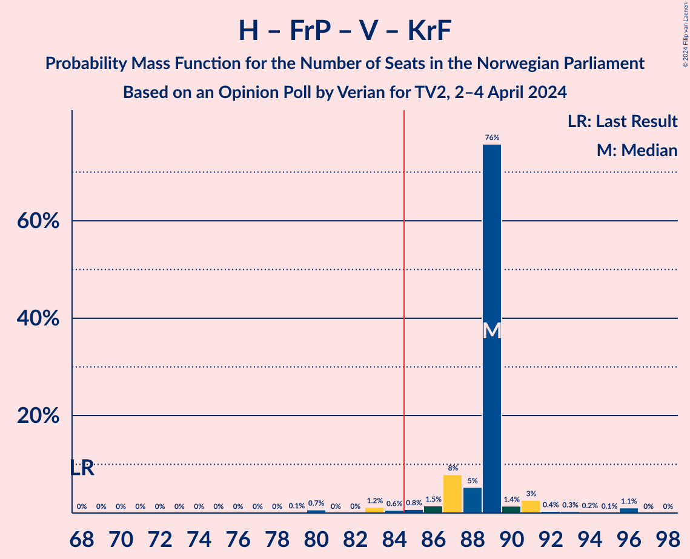
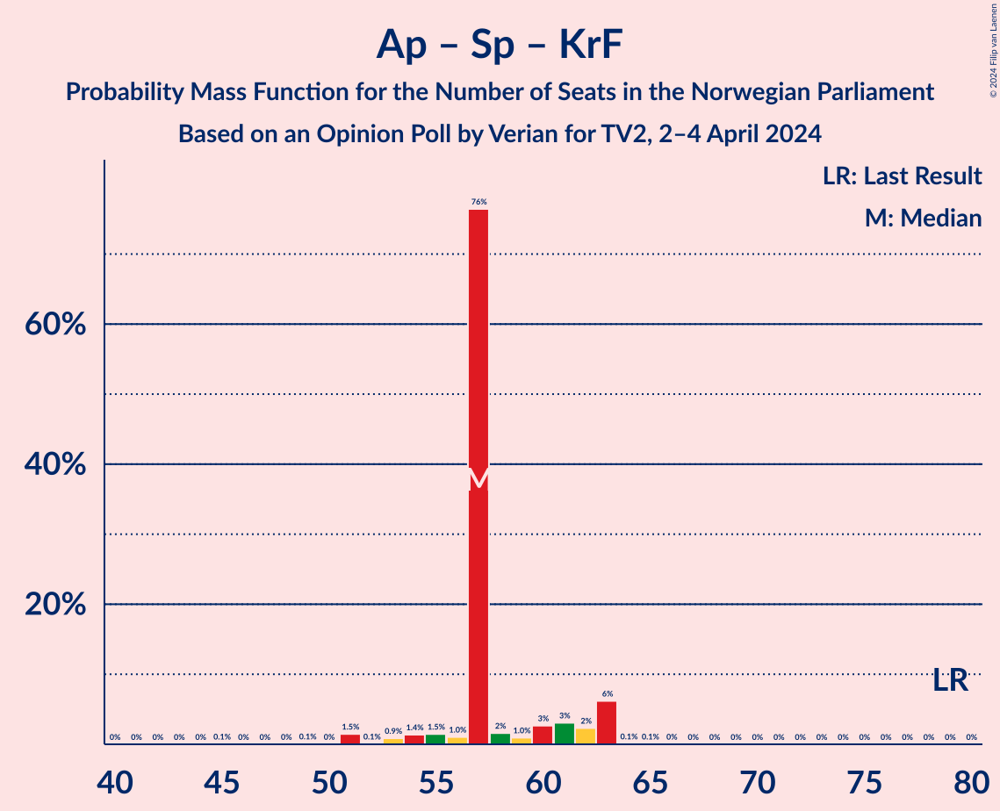

# Opinion Poll by Verian for TV2, 2–4 April 2024

<a href="#voting-intentions">Voting Intentions</a> | <a href="#seats">Seats</a> | <a href="#coalitions">Coalitions</a> | <a href="#technical-information">Technical Information</a>

## Voting Intentions

### Confidence Intervals

| Party | Last Result | Poll Result | 80% Confidence Interval | 90% Confidence Interval | 95% Confidence Interval | 99% Confidence Interval |
|:-----:|:-----------:|:-----------:|:-----------------------:|:-----------------------:|:-----------------------:|:-----------------------:|
| Høyre | 20.4% | 28.2% | 26.4–30.1% |26.0–30.7% |25.5–31.1% |24.7–32.0% |
| Arbeiderpartiet | 26.2% | 21.0% | 19.4–22.8% |19.0–23.2% |18.6–23.7% |17.9–24.5% |
| Fremskrittspartiet | 11.6% | 13.0% | 11.7–14.5% |11.4–14.9% |11.1–15.3% |10.5–16.0% |
| Sosialistisk Venstreparti | 7.6% | 10.6% | 9.4–12.0% |9.1–12.3% |8.8–12.7% |8.3–13.4% |
| Senterpartiet | 13.5% | 5.5% | 4.7–6.6% |4.5–6.8% |4.3–7.1% |3.9–7.6% |
| Venstre | 4.6% | 5.2% | 4.4–6.2% |4.2–6.5% |4.0–6.8% |3.6–7.3% |
| Rødt | 4.7% | 4.9% | 4.1–5.9% |3.9–6.2% |3.7–6.4% |3.4–6.9% |
| Kristelig Folkeparti | 3.8% | 4.4% | 3.7–5.4% |3.5–5.6% |3.3–5.9% |3.0–6.4% |
| Miljøpartiet De Grønne | 3.9% | 3.6% | 2.9–4.5% |2.8–4.7% |2.6–5.0% |2.3–5.4% |
| Industri- og Næringspartiet | 0.3% | 1.1% | 0.8–1.7% |0.7–1.8% |0.6–2.0% |0.5–2.3% |
| Liberalistene | 0.2% | 0.6% | 0.4–1.1% |0.3–1.2% |0.3–1.3% |0.2–1.6% |
| Norgesdemokratene | 1.1% | 0.4% | 0.2–0.8% |0.2–0.9% |0.2–1.0% |0.1–1.3% |
| Pensjonistpartiet | 0.6% | 0.2% | 0.1–0.5% |0.1–0.6% |0.1–0.7% |0.0–0.9% |

*Note:* The poll result column reflects the actual value used in the calculations. Published results may vary slightly, and in addition be rounded to fewer digits.

## Seats

### Confidence Intervals

| Party | Last Result | Median | 80% Confidence Interval | 90% Confidence Interval | 95% Confidence Interval | 99% Confidence Interval |
|:-----:|:-----------:|:------:|:-----------------------:|:-----------------------:|:-----------------------:|:-----------------------:|
| <a href="#høyre">Høyre</a> | 36 | 47 | 47–51 |47–52 |46–53 |45–54 |
| <a href="#arbeiderpartiet">Arbeiderpartiet</a> | 48 | 38 | 38–41 |38–47 |38–47 |36–47 |
| <a href="#fremskrittspartiet">Fremskrittspartiet</a> | 21 | 24 | 20–24 |19–24 |19–24 |18–29 |
| <a href="#sosialistisk-venstreparti">Sosialistisk Venstreparti</a> | 13 | 18 | 17–18 |17–21 |17–23 |15–23 |
| <a href="#senterpartiet">Senterpartiet</a> | 28 | 11 | 9–11 |9–11 |8–12 |7–13 |
| <a href="#venstre">Venstre</a> | 8 | 10 | 9–10 |8–10 |6–11 |2–12 |
| <a href="#rødt">Rødt</a> | 8 | 9 | 7–9 |6–10 |1–10 |1–12 |
| <a href="#kristelig-folkeparti">Kristelig Folkeparti</a> | 3 | 8 | 7–8 |7–9 |2–9 |2–11 |
| <a href="#miljøpartiet-de-grønne">Miljøpartiet De Grønne</a> | 3 | 3 | 1–3 |1–7 |1–7 |1–8 |
| <a href="#industri--og-næringspartiet">Industri- og Næringspartiet</a> | 0 | 0 | 0 |0 |0 |0 |
| <a href="#liberalistene">Liberalistene</a> | 0 | 0 | 0 |0 |0 |0 |
| <a href="#norgesdemokratene">Norgesdemokratene</a> | 0 | 0 | 0 |0 |0 |0 |
| <a href="#pensjonistpartiet">Pensjonistpartiet</a> | 0 | 0 | 0 |0 |0 |0 |

### Høyre

*For a full overview of the results for this party, see the [Høyre](party-høyre.html) page.*

| Number of Seats | Probability | Accumulated | Special Marks |
|:---------------:|:-----------:|:-----------:|:-------------:|
| 36 | 0% | 100% | Last Result |
| 37 | 0% | 100% |  |
| 38 | 0% | 100% |  |
| 39 | 0% | 100% |  |
| 40 | 0% | 100% |  |
| 41 | 0% | 100% |  |
| 42 | 0.3% | 100% |  |
| 43 | 0.1% | 99.7% |  |
| 44 | 0% | 99.7% |  |
| 45 | 0.3% | 99.6% |  |
| 46 | 3% | 99.3% |  |
| 47 | 76% | 96% | Median |
| 48 | 0.4% | 20% |  |
| 49 | 4% | 20% |  |
| 50 | 2% | 16% |  |
| 51 | 7% | 14% |  |
| 52 | 2% | 7% |  |
| 53 | 2% | 4% |  |
| 54 | 2% | 2% |  |
| 55 | 0.1% | 0.2% |  |
| 56 | 0.1% | 0.2% |  |
| 57 | 0% | 0.1% |  |
| 58 | 0% | 0.1% |  |
| 59 | 0% | 0% |  |

### Arbeiderpartiet

*For a full overview of the results for this party, see the [Arbeiderpartiet](party-arbeiderpartiet.html) page.*

| Number of Seats | Probability | Accumulated | Special Marks |
|:---------------:|:-----------:|:-----------:|:-------------:|
| 33 | 0.1% | 100% |  |
| 34 | 0.1% | 99.9% |  |
| 35 | 0.2% | 99.9% |  |
| 36 | 0.2% | 99.6% |  |
| 37 | 0.2% | 99.4% |  |
| 38 | 77% | 99.2% | Median |
| 39 | 4% | 22% |  |
| 40 | 2% | 18% |  |
| 41 | 7% | 17% |  |
| 42 | 0.5% | 10% |  |
| 43 | 1.4% | 10% |  |
| 44 | 0.4% | 8% |  |
| 45 | 0.6% | 8% |  |
| 46 | 0.2% | 7% |  |
| 47 | 7% | 7% |  |
| 48 | 0% | 0.1% | Last Result |
| 49 | 0% | 0% |  |

### Fremskrittspartiet

*For a full overview of the results for this party, see the [Fremskrittspartiet](party-fremskrittspartiet.html) page.*

| Number of Seats | Probability | Accumulated | Special Marks |
|:---------------:|:-----------:|:-----------:|:-------------:|
| 18 | 0.9% | 100% |  |
| 19 | 8% | 99.1% |  |
| 20 | 0.9% | 91% |  |
| 21 | 1.3% | 90% | Last Result |
| 22 | 2% | 89% |  |
| 23 | 6% | 87% |  |
| 24 | 80% | 81% | Median |
| 25 | 0.1% | 2% |  |
| 26 | 0.4% | 2% |  |
| 27 | 0.1% | 1.2% |  |
| 28 | 0.2% | 1.1% |  |
| 29 | 0.6% | 1.0% |  |
| 30 | 0.4% | 0.4% |  |
| 31 | 0% | 0% |  |

### Sosialistisk Venstreparti

*For a full overview of the results for this party, see the [Sosialistisk Venstreparti](party-sosialistiskvenstreparti.html) page.*

| Number of Seats | Probability | Accumulated | Special Marks |
|:---------------:|:-----------:|:-----------:|:-------------:|
| 12 | 0.1% | 100% |  |
| 13 | 0% | 99.9% | Last Result |
| 14 | 0.1% | 99.9% |  |
| 15 | 0.6% | 99.8% |  |
| 16 | 0.8% | 99.1% |  |
| 17 | 12% | 98% |  |
| 18 | 79% | 86% | Median |
| 19 | 1.3% | 7% |  |
| 20 | 0.8% | 6% |  |
| 21 | 1.4% | 5% |  |
| 22 | 0.5% | 4% |  |
| 23 | 3% | 3% |  |
| 24 | 0% | 0% |  |

### Senterpartiet

*For a full overview of the results for this party, see the [Senterpartiet](party-senterpartiet.html) page.*

| Number of Seats | Probability | Accumulated | Special Marks |
|:---------------:|:-----------:|:-----------:|:-------------:|
| 1 | 0.1% | 100% |  |
| 2 | 0% | 99.9% |  |
| 3 | 0% | 99.9% |  |
| 4 | 0% | 99.9% |  |
| 5 | 0% | 99.9% |  |
| 6 | 0% | 99.9% |  |
| 7 | 0.8% | 99.9% |  |
| 8 | 3% | 99.1% |  |
| 9 | 10% | 96% |  |
| 10 | 2% | 87% |  |
| 11 | 81% | 85% | Median |
| 12 | 1.0% | 3% |  |
| 13 | 2% | 2% |  |
| 14 | 0% | 0.1% |  |
| 15 | 0% | 0% |  |
| 16 | 0% | 0% |  |
| 17 | 0% | 0% |  |
| 18 | 0% | 0% |  |
| 19 | 0% | 0% |  |
| 20 | 0% | 0% |  |
| 21 | 0% | 0% |  |
| 22 | 0% | 0% |  |
| 23 | 0% | 0% |  |
| 24 | 0% | 0% |  |
| 25 | 0% | 0% |  |
| 26 | 0% | 0% |  |
| 27 | 0% | 0% |  |
| 28 | 0% | 0% | Last Result |

### Venstre

*For a full overview of the results for this party, see the [Venstre](party-venstre.html) page.*

| Number of Seats | Probability | Accumulated | Special Marks |
|:---------------:|:-----------:|:-----------:|:-------------:|
| 2 | 1.3% | 100% |  |
| 3 | 0.1% | 98.7% |  |
| 4 | 0% | 98.6% |  |
| 5 | 0% | 98.6% |  |
| 6 | 1.1% | 98.6% |  |
| 7 | 0.2% | 97% |  |
| 8 | 3% | 97% | Last Result |
| 9 | 6% | 94% |  |
| 10 | 84% | 88% | Median |
| 11 | 3% | 4% |  |
| 12 | 0.3% | 0.5% |  |
| 13 | 0% | 0.2% |  |
| 14 | 0.2% | 0.2% |  |
| 15 | 0% | 0% |  |

### Rødt

*For a full overview of the results for this party, see the [Rødt](party-rødt.html) page.*

| Number of Seats | Probability | Accumulated | Special Marks |
|:---------------:|:-----------:|:-----------:|:-------------:|
| 1 | 5% | 100% |  |
| 2 | 0% | 95% |  |
| 3 | 0% | 95% |  |
| 4 | 0% | 95% |  |
| 5 | 0% | 95% |  |
| 6 | 0.1% | 95% |  |
| 7 | 8% | 95% |  |
| 8 | 3% | 87% | Last Result |
| 9 | 77% | 84% | Median |
| 10 | 6% | 7% |  |
| 11 | 0.3% | 1.2% |  |
| 12 | 0.9% | 0.9% |  |
| 13 | 0% | 0% |  |

### Kristelig Folkeparti

*For a full overview of the results for this party, see the [Kristelig Folkeparti](party-kristeligfolkeparti.html) page.*

| Number of Seats | Probability | Accumulated | Special Marks |
|:---------------:|:-----------:|:-----------:|:-------------:|
| 2 | 3% | 100% |  |
| 3 | 2% | 97% | Last Result |
| 4 | 0% | 95% |  |
| 5 | 0% | 95% |  |
| 6 | 0% | 95% |  |
| 7 | 8% | 95% |  |
| 8 | 81% | 87% | Median |
| 9 | 5% | 7% |  |
| 10 | 0.5% | 2% |  |
| 11 | 1.2% | 1.2% |  |
| 12 | 0% | 0.1% |  |
| 13 | 0% | 0.1% |  |
| 14 | 0% | 0% |  |

### Miljøpartiet De Grønne

*For a full overview of the results for this party, see the [Miljøpartiet De Grønne](party-miljøpartietdegrønne.html) page.*

| Number of Seats | Probability | Accumulated | Special Marks |
|:---------------:|:-----------:|:-----------:|:-------------:|
| 1 | 13% | 100% |  |
| 2 | 5% | 87% |  |
| 3 | 76% | 82% | Last Result, Median |
| 4 | 0% | 6% |  |
| 5 | 0% | 6% |  |
| 6 | 0.2% | 6% |  |
| 7 | 3% | 5% |  |
| 8 | 2% | 2% |  |
| 9 | 0.1% | 0.2% |  |
| 10 | 0.1% | 0.1% |  |
| 11 | 0% | 0% |  |

### Industri- og Næringspartiet

*For a full overview of the results for this party, see the [Industri- og Næringspartiet](party-industri-ognæringspartiet.html) page.*

| Number of Seats | Probability | Accumulated | Special Marks |
|:---------------:|:-----------:|:-----------:|:-------------:|
| 0 | 99.9% | 100% | Last Result, Median |
| 1 | 0% | 0.1% |  |
| 2 | 0% | 0% |  |

### Liberalistene

*For a full overview of the results for this party, see the [Liberalistene](party-liberalistene.html) page.*

| Number of Seats | Probability | Accumulated | Special Marks |
|:---------------:|:-----------:|:-----------:|:-------------:|
| 0 | 100% | 100% | Last Result, Median |

### Norgesdemokratene

*For a full overview of the results for this party, see the [Norgesdemokratene](party-norgesdemokratene.html) page.*

| Number of Seats | Probability | Accumulated | Special Marks |
|:---------------:|:-----------:|:-----------:|:-------------:|
| 0 | 100% | 100% | Last Result, Median |

### Pensjonistpartiet

*For a full overview of the results for this party, see the [Pensjonistpartiet](party-pensjonistpartiet.html) page.*

| Number of Seats | Probability | Accumulated | Special Marks |
|:---------------:|:-----------:|:-----------:|:-------------:|
| 0 | 100% | 100% | Last Result, Median |

## Coalitions

### Confidence Intervals

| Coalition | Last Result | Median | Majority? | 80% Confidence Interval | 90% Confidence Interval | 95% Confidence Interval | 99% Confidence Interval |
|:---------:|:-----------:|:------:|:---------:|:-----------------------:|:-----------------------:|:-----------------------:|:-----------------------:|
| Høyre – Fremskrittspartiet – Senterpartiet – Venstre – Kristelig Folkeparti | 96 | 100 | 100% | 96–100 | 95–101 | 94–102 | 87–109 |
| Høyre – Fremskrittspartiet – Venstre – Kristelig Folkeparti – Miljøpartiet De Grønne | 71 | 92 | 99.8% | 89–92 | 88–93 | 88–96 | 87–98 |
| Høyre – Fremskrittspartiet – Venstre – Kristelig Folkeparti | 68 | 89 | 97% | 87–89 | 87–90 | 84–91 | 80–96 |
| Høyre – Fremskrittspartiet – Venstre | 65 | 81 | 4% | 80–81 | 79–83 | 77–85 | 76–88 |
| Arbeiderpartiet – Sosialistisk Venstreparti – Senterpartiet – Rødt – Miljøpartiet De Grønne | 100 | 79 | 2% | 79–81 | 78–81 | 77–84 | 72–88 |
| Arbeiderpartiet – Sosialistisk Venstreparti – Senterpartiet – Kristelig Folkeparti – Miljøpartiet De Grønne | 95 | 78 | 1.4% | 78–81 | 78–82 | 75–84 | 71–86 |
| Arbeiderpartiet – Sosialistisk Venstreparti – Senterpartiet – Rødt | 97 | 76 | 0.2% | 76–79 | 75–80 | 72–80 | 70–81 |
| Arbeiderpartiet – Sosialistisk Venstreparti – Senterpartiet – Miljøpartiet De Grønne | 92 | 70 | 0% | 70–74 | 70–76 | 70–76 | 67–80 |
| Høyre – Fremskrittspartiet | 57 | 71 | 0% | 70–72 | 70–75 | 69–76 | 67–80 |
| Arbeiderpartiet – Sosialistisk Venstreparti – Senterpartiet | 89 | 67 | 0% | 67–72 | 67–73 | 66–75 | 63–75 |
| Arbeiderpartiet – Sosialistisk Venstreparti – Rødt – Miljøpartiet De Grønne | 72 | 68 | 0% | 68–72 | 67–73 | 66–74 | 59–81 |
| Høyre – Venstre – Kristelig Folkeparti | 47 | 65 | 0% | 65–68 | 64–68 | 61–70 | 58–74 |
| Arbeiderpartiet – Sosialistisk Venstreparti | 61 | 56 | 0% | 56–63 | 56–64 | 56–64 | 54–65 |
| Arbeiderpartiet – Senterpartiet – Kristelig Folkeparti – Miljøpartiet De Grønne | 82 | 60 | 0% | 60–64 | 59–64 | 55–64 | 53–69 |
| Arbeiderpartiet – Senterpartiet – Kristelig Folkeparti | 79 | 57 | 0% | 57–61 | 55–63 | 53–63 | 51–63 |
| Arbeiderpartiet – Senterpartiet | 76 | 49 | 0% | 49–52 | 49–56 | 48–56 | 47–56 |
| Senterpartiet – Venstre – Kristelig Folkeparti | 39 | 29 | 0% | 26–29 | 22–29 | 21–30 | 15–33 |

### Høyre – Fremskrittspartiet – Senterpartiet – Venstre – Kristelig Folkeparti

| Number of Seats | Probability | Accumulated | Special Marks |
|:---------------:|:-----------:|:-----------:|:-------------:|
| 87 | 0.6% | 100% |  |
| 88 | 0% | 99.4% |  |
| 89 | 0.1% | 99.4% |  |
| 90 | 0.2% | 99.3% |  |
| 91 | 0% | 99.1% |  |
| 92 | 0.1% | 99.1% |  |
| 93 | 1.2% | 99.0% |  |
| 94 | 2% | 98% |  |
| 95 | 0.8% | 96% |  |
| 96 | 8% | 95% | Last Result |
| 97 | 2% | 87% |  |
| 98 | 0.9% | 86% |  |
| 99 | 3% | 85% |  |
| 100 | 75% | 82% | Median |
| 101 | 1.3% | 6% |  |
| 102 | 3% | 5% |  |
| 103 | 0.2% | 2% |  |
| 104 | 0.1% | 2% |  |
| 105 | 0.1% | 1.4% |  |
| 106 | 0.2% | 1.3% |  |
| 107 | 0.1% | 1.1% |  |
| 108 | 0% | 1.1% |  |
| 109 | 1.1% | 1.1% |  |
| 110 | 0% | 0% |  |

### Høyre – Fremskrittspartiet – Venstre – Kristelig Folkeparti – Miljøpartiet De Grønne

| Number of Seats | Probability | Accumulated | Special Marks |
|:---------------:|:-----------:|:-----------:|:-------------:|
| 71 | 0% | 100% | Last Result |
| 72 | 0% | 100% |  |
| 73 | 0% | 100% |  |
| 74 | 0% | 100% |  |
| 75 | 0% | 100% |  |
| 76 | 0% | 100% |  |
| 77 | 0% | 100% |  |
| 78 | 0% | 100% |  |
| 79 | 0% | 100% |  |
| 80 | 0% | 100% |  |
| 81 | 0.1% | 100% |  |
| 82 | 0% | 99.9% |  |
| 83 | 0% | 99.9% |  |
| 84 | 0% | 99.8% |  |
| 85 | 0% | 99.8% | Majority |
| 86 | 0.2% | 99.8% |  |
| 87 | 0.7% | 99.6% |  |
| 88 | 8% | 98.9% |  |
| 89 | 5% | 91% |  |
| 90 | 1.4% | 86% |  |
| 91 | 1.3% | 85% |  |
| 92 | 78% | 83% | Median |
| 93 | 0.5% | 5% |  |
| 94 | 0.7% | 5% |  |
| 95 | 0.4% | 4% |  |
| 96 | 1.4% | 4% |  |
| 97 | 1.0% | 2% |  |
| 98 | 1.1% | 1.3% |  |
| 99 | 0% | 0.2% |  |
| 100 | 0% | 0.2% |  |
| 101 | 0.1% | 0.1% |  |
| 102 | 0% | 0% |  |

### Høyre – Fremskrittspartiet – Venstre – Kristelig Folkeparti

| Number of Seats | Probability | Accumulated | Special Marks |
|:---------------:|:-----------:|:-----------:|:-------------:|
| 68 | 0% | 100% | Last Result |
| 69 | 0% | 100% |  |
| 70 | 0% | 100% |  |
| 71 | 0% | 100% |  |
| 72 | 0% | 100% |  |
| 73 | 0% | 100% |  |
| 74 | 0% | 100% |  |
| 75 | 0% | 100% |  |
| 76 | 0% | 100% |  |
| 77 | 0% | 100% |  |
| 78 | 0% | 100% |  |
| 79 | 0.1% | 100% |  |
| 80 | 0.7% | 99.9% |  |
| 81 | 0% | 99.2% |  |
| 82 | 0% | 99.2% |  |
| 83 | 1.2% | 99.1% |  |
| 84 | 0.6% | 98% |  |
| 85 | 0.8% | 97% | Majority |
| 86 | 1.5% | 97% |  |
| 87 | 8% | 95% |  |
| 88 | 5% | 87% |  |
| 89 | 76% | 82% | Median |
| 90 | 1.4% | 6% |  |
| 91 | 3% | 5% |  |
| 92 | 0.4% | 2% |  |
| 93 | 0.3% | 2% |  |
| 94 | 0.2% | 1.4% |  |
| 95 | 0.1% | 1.2% |  |
| 96 | 1.1% | 1.1% |  |
| 97 | 0% | 0% |  |

### Høyre – Fremskrittspartiet – Venstre

| Number of Seats | Probability | Accumulated | Special Marks |
|:---------------:|:-----------:|:-----------:|:-------------:|
| 65 | 0% | 100% | Last Result |
| 66 | 0% | 100% |  |
| 67 | 0% | 100% |  |
| 68 | 0% | 100% |  |
| 69 | 0% | 100% |  |
| 70 | 0% | 100% |  |
| 71 | 0% | 100% |  |
| 72 | 0.1% | 100% |  |
| 73 | 0% | 99.9% |  |
| 74 | 0% | 99.9% |  |
| 75 | 0% | 99.8% |  |
| 76 | 0.6% | 99.8% |  |
| 77 | 2% | 99.2% |  |
| 78 | 1.3% | 97% |  |
| 79 | 3% | 96% |  |
| 80 | 8% | 93% |  |
| 81 | 77% | 85% | Median |
| 82 | 0.9% | 8% |  |
| 83 | 3% | 7% |  |
| 84 | 0.4% | 4% |  |
| 85 | 2% | 4% | Majority |
| 86 | 0.9% | 2% |  |
| 87 | 0.1% | 0.8% |  |
| 88 | 0.6% | 0.7% |  |
| 89 | 0.1% | 0.2% |  |
| 90 | 0% | 0.1% |  |
| 91 | 0% | 0% |  |

### Arbeiderpartiet – Sosialistisk Venstreparti – Senterpartiet – Rødt – Miljøpartiet De Grønne

| Number of Seats | Probability | Accumulated | Special Marks |
|:---------------:|:-----------:|:-----------:|:-------------:|
| 72 | 1.1% | 100% |  |
| 73 | 0.1% | 98.9% |  |
| 74 | 0.2% | 98.8% |  |
| 75 | 0.3% | 98.6% |  |
| 76 | 0.3% | 98% |  |
| 77 | 3% | 98% |  |
| 78 | 1.4% | 95% |  |
| 79 | 76% | 94% | Median |
| 80 | 5% | 18% |  |
| 81 | 8% | 13% |  |
| 82 | 1.5% | 5% |  |
| 83 | 0.8% | 3% |  |
| 84 | 0.6% | 3% |  |
| 85 | 1.2% | 2% | Majority |
| 86 | 0% | 0.9% |  |
| 87 | 0% | 0.8% |  |
| 88 | 0.7% | 0.8% |  |
| 89 | 0.1% | 0.1% |  |
| 90 | 0% | 0% |  |
| 91 | 0% | 0% |  |
| 92 | 0% | 0% |  |
| 93 | 0% | 0% |  |
| 94 | 0% | 0% |  |
| 95 | 0% | 0% |  |
| 96 | 0% | 0% |  |
| 97 | 0% | 0% |  |
| 98 | 0% | 0% |  |
| 99 | 0% | 0% |  |
| 100 | 0% | 0% | Last Result |

### Arbeiderpartiet – Sosialistisk Venstreparti – Senterpartiet – Kristelig Folkeparti – Miljøpartiet De Grønne

| Number of Seats | Probability | Accumulated | Special Marks |
|:---------------:|:-----------:|:-----------:|:-------------:|
| 70 | 0% | 100% |  |
| 71 | 0.6% | 99.9% |  |
| 72 | 0.9% | 99.4% |  |
| 73 | 0.7% | 98% |  |
| 74 | 0.1% | 98% |  |
| 75 | 0.5% | 98% |  |
| 76 | 1.4% | 97% |  |
| 77 | 0.3% | 96% |  |
| 78 | 75% | 95% | Median |
| 79 | 3% | 20% |  |
| 80 | 2% | 17% |  |
| 81 | 7% | 15% |  |
| 82 | 3% | 8% |  |
| 83 | 0.4% | 5% |  |
| 84 | 3% | 4% |  |
| 85 | 0.9% | 1.4% | Majority |
| 86 | 0.1% | 0.5% |  |
| 87 | 0.3% | 0.4% |  |
| 88 | 0% | 0.1% |  |
| 89 | 0% | 0% |  |
| 90 | 0% | 0% |  |
| 91 | 0% | 0% |  |
| 92 | 0% | 0% |  |
| 93 | 0% | 0% |  |
| 94 | 0% | 0% |  |
| 95 | 0% | 0% | Last Result |

### Arbeiderpartiet – Sosialistisk Venstreparti – Senterpartiet – Rødt

| Number of Seats | Probability | Accumulated | Special Marks |
|:---------------:|:-----------:|:-----------:|:-------------:|
| 67 | 0.1% | 100% |  |
| 68 | 0% | 99.9% |  |
| 69 | 0% | 99.8% |  |
| 70 | 1.1% | 99.8% |  |
| 71 | 1.0% | 98.7% |  |
| 72 | 1.4% | 98% |  |
| 73 | 0.4% | 96% |  |
| 74 | 0.6% | 96% |  |
| 75 | 0.6% | 95% |  |
| 76 | 78% | 95% | Median |
| 77 | 1.3% | 17% |  |
| 78 | 1.4% | 15% |  |
| 79 | 5% | 14% |  |
| 80 | 8% | 9% |  |
| 81 | 0.8% | 1.1% |  |
| 82 | 0.1% | 0.3% |  |
| 83 | 0% | 0.2% |  |
| 84 | 0% | 0.2% |  |
| 85 | 0% | 0.2% | Majority |
| 86 | 0% | 0.1% |  |
| 87 | 0.1% | 0.1% |  |
| 88 | 0% | 0% |  |
| 89 | 0% | 0% |  |
| 90 | 0% | 0% |  |
| 91 | 0% | 0% |  |
| 92 | 0% | 0% |  |
| 93 | 0% | 0% |  |
| 94 | 0% | 0% |  |
| 95 | 0% | 0% |  |
| 96 | 0% | 0% |  |
| 97 | 0% | 0% | Last Result |

### Arbeiderpartiet – Sosialistisk Venstreparti – Senterpartiet – Miljøpartiet De Grønne

| Number of Seats | Probability | Accumulated | Special Marks |
|:---------------:|:-----------:|:-----------:|:-------------:|
| 64 | 0% | 100% |  |
| 65 | 0% | 99.9% |  |
| 66 | 0.3% | 99.9% |  |
| 67 | 0.1% | 99.6% |  |
| 68 | 0.3% | 99.5% |  |
| 69 | 0.8% | 99.2% |  |
| 70 | 79% | 98% | Median |
| 71 | 2% | 19% |  |
| 72 | 1.3% | 17% |  |
| 73 | 3% | 16% |  |
| 74 | 8% | 13% |  |
| 75 | 0.2% | 6% |  |
| 76 | 3% | 5% |  |
| 77 | 1.1% | 2% |  |
| 78 | 0.4% | 1.2% |  |
| 79 | 0.1% | 0.8% |  |
| 80 | 0.6% | 0.7% |  |
| 81 | 0% | 0.1% |  |
| 82 | 0% | 0% |  |
| 83 | 0% | 0% |  |
| 84 | 0% | 0% |  |
| 85 | 0% | 0% | Majority |
| 86 | 0% | 0% |  |
| 87 | 0% | 0% |  |
| 88 | 0% | 0% |  |
| 89 | 0% | 0% |  |
| 90 | 0% | 0% |  |
| 91 | 0% | 0% |  |
| 92 | 0% | 0% | Last Result |

### Høyre – Fremskrittspartiet

| Number of Seats | Probability | Accumulated | Special Marks |
|:---------------:|:-----------:|:-----------:|:-------------:|
| 57 | 0% | 100% | Last Result |
| 58 | 0% | 100% |  |
| 59 | 0% | 100% |  |
| 60 | 0% | 100% |  |
| 61 | 0% | 100% |  |
| 62 | 0% | 100% |  |
| 63 | 0% | 100% |  |
| 64 | 0% | 100% |  |
| 65 | 0.1% | 99.9% |  |
| 66 | 0% | 99.8% |  |
| 67 | 1.0% | 99.8% |  |
| 68 | 0.9% | 98.7% |  |
| 69 | 1.0% | 98% |  |
| 70 | 10% | 97% |  |
| 71 | 76% | 87% | Median |
| 72 | 4% | 11% |  |
| 73 | 0.3% | 7% |  |
| 74 | 0.1% | 7% |  |
| 75 | 2% | 7% |  |
| 76 | 3% | 4% |  |
| 77 | 0.1% | 2% |  |
| 78 | 1.0% | 2% |  |
| 79 | 0.1% | 0.7% |  |
| 80 | 0.6% | 0.7% |  |
| 81 | 0.1% | 0.1% |  |
| 82 | 0% | 0.1% |  |
| 83 | 0% | 0% |  |

### Arbeiderpartiet – Sosialistisk Venstreparti – Senterpartiet

| Number of Seats | Probability | Accumulated | Special Marks |
|:---------------:|:-----------:|:-----------:|:-------------:|
| 61 | 0.1% | 100% |  |
| 62 | 0.1% | 99.9% |  |
| 63 | 0.3% | 99.8% |  |
| 64 | 0.3% | 99.4% |  |
| 65 | 1.4% | 99.2% |  |
| 66 | 1.5% | 98% |  |
| 67 | 75% | 96% | Median |
| 68 | 1.1% | 21% |  |
| 69 | 7% | 20% |  |
| 70 | 2% | 13% |  |
| 71 | 0.7% | 11% |  |
| 72 | 1.4% | 11% |  |
| 73 | 6% | 9% |  |
| 74 | 0.1% | 3% |  |
| 75 | 3% | 3% |  |
| 76 | 0.1% | 0.2% |  |
| 77 | 0.1% | 0.2% |  |
| 78 | 0% | 0% |  |
| 79 | 0% | 0% |  |
| 80 | 0% | 0% |  |
| 81 | 0% | 0% |  |
| 82 | 0% | 0% |  |
| 83 | 0% | 0% |  |
| 84 | 0% | 0% |  |
| 85 | 0% | 0% | Majority |
| 86 | 0% | 0% |  |
| 87 | 0% | 0% |  |
| 88 | 0% | 0% |  |
| 89 | 0% | 0% | Last Result |

### Arbeiderpartiet – Sosialistisk Venstreparti – Rødt – Miljøpartiet De Grønne

| Number of Seats | Probability | Accumulated | Special Marks |
|:---------------:|:-----------:|:-----------:|:-------------:|
| 59 | 1.1% | 100% |  |
| 60 | 0% | 98.9% |  |
| 61 | 0.1% | 98.9% |  |
| 62 | 0.2% | 98.9% |  |
| 63 | 0.1% | 98.7% |  |
| 64 | 0.1% | 98.6% |  |
| 65 | 0.2% | 98% |  |
| 66 | 3% | 98% |  |
| 67 | 1.4% | 95% |  |
| 68 | 75% | 94% | Median |
| 69 | 3% | 18% |  |
| 70 | 0.9% | 15% |  |
| 71 | 2% | 14% |  |
| 72 | 8% | 13% | Last Result |
| 73 | 0.8% | 5% |  |
| 74 | 2% | 4% |  |
| 75 | 1.2% | 2% |  |
| 76 | 0.1% | 1.0% |  |
| 77 | 0% | 0.9% |  |
| 78 | 0.2% | 0.9% |  |
| 79 | 0.1% | 0.7% |  |
| 80 | 0% | 0.6% |  |
| 81 | 0.6% | 0.6% |  |
| 82 | 0% | 0% |  |

### Høyre – Venstre – Kristelig Folkeparti

| Number of Seats | Probability | Accumulated | Special Marks |
|:---------------:|:-----------:|:-----------:|:-------------:|
| 47 | 0% | 100% | Last Result |
| 48 | 0% | 100% |  |
| 49 | 0% | 100% |  |
| 50 | 0% | 100% |  |
| 51 | 0% | 100% |  |
| 52 | 0% | 100% |  |
| 53 | 0.3% | 100% |  |
| 54 | 0% | 99.7% |  |
| 55 | 0% | 99.7% |  |
| 56 | 0% | 99.7% |  |
| 57 | 0.2% | 99.7% |  |
| 58 | 0.1% | 99.5% |  |
| 59 | 1.4% | 99.5% |  |
| 60 | 0% | 98% |  |
| 61 | 0.7% | 98% |  |
| 62 | 0.2% | 97% |  |
| 63 | 0.8% | 97% |  |
| 64 | 5% | 96% |  |
| 65 | 78% | 92% | Median |
| 66 | 0.5% | 14% |  |
| 67 | 2% | 14% |  |
| 68 | 9% | 12% |  |
| 69 | 0.4% | 3% |  |
| 70 | 0.2% | 3% |  |
| 71 | 0.9% | 2% |  |
| 72 | 0.4% | 2% |  |
| 73 | 0.1% | 1.2% |  |
| 74 | 1.1% | 1.1% |  |
| 75 | 0% | 0% |  |

### Arbeiderpartiet – Sosialistisk Venstreparti

| Number of Seats | Probability | Accumulated | Special Marks |
|:---------------:|:-----------:|:-----------:|:-------------:|
| 51 | 0.2% | 100% |  |
| 52 | 0.1% | 99.8% |  |
| 53 | 0.1% | 99.7% |  |
| 54 | 0.2% | 99.6% |  |
| 55 | 0.5% | 99.4% |  |
| 56 | 80% | 98.9% | Median |
| 57 | 0.8% | 19% |  |
| 58 | 4% | 19% |  |
| 59 | 0.5% | 15% |  |
| 60 | 0.9% | 14% |  |
| 61 | 0.6% | 14% | Last Result |
| 62 | 2% | 13% |  |
| 63 | 1.3% | 11% |  |
| 64 | 9% | 10% |  |
| 65 | 0.6% | 0.8% |  |
| 66 | 0.2% | 0.2% |  |
| 67 | 0% | 0.1% |  |
| 68 | 0% | 0% |  |

### Arbeiderpartiet – Senterpartiet – Kristelig Folkeparti – Miljøpartiet De Grønne

| Number of Seats | Probability | Accumulated | Special Marks |
|:---------------:|:-----------:|:-----------:|:-------------:|
| 51 | 0% | 100% |  |
| 52 | 0.1% | 99.9% |  |
| 53 | 0.6% | 99.8% |  |
| 54 | 0.6% | 99.2% |  |
| 55 | 1.2% | 98.7% |  |
| 56 | 0.1% | 97% |  |
| 57 | 0.1% | 97% |  |
| 58 | 1.3% | 97% |  |
| 59 | 1.0% | 96% |  |
| 60 | 77% | 95% | Median |
| 61 | 3% | 18% |  |
| 62 | 3% | 16% |  |
| 63 | 1.3% | 12% |  |
| 64 | 9% | 11% |  |
| 65 | 0.9% | 2% |  |
| 66 | 0.9% | 2% |  |
| 67 | 0.2% | 0.8% |  |
| 68 | 0% | 0.6% |  |
| 69 | 0.5% | 0.6% |  |
| 70 | 0% | 0.1% |  |
| 71 | 0% | 0.1% |  |
| 72 | 0% | 0.1% |  |
| 73 | 0.1% | 0.1% |  |
| 74 | 0% | 0% |  |
| 75 | 0% | 0% |  |
| 76 | 0% | 0% |  |
| 77 | 0% | 0% |  |
| 78 | 0% | 0% |  |
| 79 | 0% | 0% |  |
| 80 | 0% | 0% |  |
| 81 | 0% | 0% |  |
| 82 | 0% | 0% | Last Result |

### Arbeiderpartiet – Senterpartiet – Kristelig Folkeparti

| Number of Seats | Probability | Accumulated | Special Marks |
|:---------------:|:-----------:|:-----------:|:-------------:|
| 45 | 0.1% | 100% |  |
| 46 | 0% | 99.9% |  |
| 47 | 0% | 99.9% |  |
| 48 | 0% | 99.9% |  |
| 49 | 0.1% | 99.9% |  |
| 50 | 0% | 99.8% |  |
| 51 | 1.5% | 99.8% |  |
| 52 | 0.1% | 98% |  |
| 53 | 0.9% | 98% |  |
| 54 | 1.4% | 97% |  |
| 55 | 1.5% | 96% |  |
| 56 | 1.0% | 95% |  |
| 57 | 76% | 93% | Median |
| 58 | 2% | 17% |  |
| 59 | 1.0% | 15% |  |
| 60 | 3% | 14% |  |
| 61 | 3% | 12% |  |
| 62 | 2% | 9% |  |
| 63 | 6% | 6% |  |
| 64 | 0.1% | 0.2% |  |
| 65 | 0.1% | 0.1% |  |
| 66 | 0% | 0% |  |
| 67 | 0% | 0% |  |
| 68 | 0% | 0% |  |
| 69 | 0% | 0% |  |
| 70 | 0% | 0% |  |
| 71 | 0% | 0% |  |
| 72 | 0% | 0% |  |
| 73 | 0% | 0% |  |
| 74 | 0% | 0% |  |
| 75 | 0% | 0% |  |
| 76 | 0% | 0% |  |
| 77 | 0% | 0% |  |
| 78 | 0% | 0% |  |
| 79 | 0% | 0% | Last Result |

### Arbeiderpartiet – Senterpartiet

| Number of Seats | Probability | Accumulated | Special Marks |
|:---------------:|:-----------:|:-----------:|:-------------:|
| 42 | 0.1% | 100% |  |
| 43 | 0% | 99.9% |  |
| 44 | 0.1% | 99.9% |  |
| 45 | 0.1% | 99.8% |  |
| 46 | 0.1% | 99.7% |  |
| 47 | 0.5% | 99.6% |  |
| 48 | 3% | 99.1% |  |
| 49 | 77% | 96% | Median |
| 50 | 0.6% | 19% |  |
| 51 | 3% | 18% |  |
| 52 | 6% | 15% |  |
| 53 | 1.2% | 9% |  |
| 54 | 1.1% | 8% |  |
| 55 | 0.2% | 7% |  |
| 56 | 6% | 6% |  |
| 57 | 0.1% | 0.1% |  |
| 58 | 0% | 0% |  |
| 59 | 0% | 0% |  |
| 60 | 0% | 0% |  |
| 61 | 0% | 0% |  |
| 62 | 0% | 0% |  |
| 63 | 0% | 0% |  |
| 64 | 0% | 0% |  |
| 65 | 0% | 0% |  |
| 66 | 0% | 0% |  |
| 67 | 0% | 0% |  |
| 68 | 0% | 0% |  |
| 69 | 0% | 0% |  |
| 70 | 0% | 0% |  |
| 71 | 0% | 0% |  |
| 72 | 0% | 0% |  |
| 73 | 0% | 0% |  |
| 74 | 0% | 0% |  |
| 75 | 0% | 0% |  |
| 76 | 0% | 0% | Last Result |

### Senterpartiet – Venstre – Kristelig Folkeparti

| Number of Seats | Probability | Accumulated | Special Marks |
|:---------------:|:-----------:|:-----------:|:-------------:|
| 15 | 0.8% | 100% |  |
| 16 | 0% | 99.1% |  |
| 17 | 0.6% | 99.1% |  |
| 18 | 0.1% | 98.5% |  |
| 19 | 0.1% | 98% |  |
| 20 | 0.5% | 98% |  |
| 21 | 1.4% | 98% |  |
| 22 | 2% | 96% |  |
| 23 | 0.4% | 95% |  |
| 24 | 0.3% | 94% |  |
| 25 | 2% | 94% |  |
| 26 | 8% | 92% |  |
| 27 | 0.8% | 84% |  |
| 28 | 0.7% | 84% |  |
| 29 | 78% | 83% | Median |
| 30 | 3% | 4% |  |
| 31 | 0% | 1.4% |  |
| 32 | 0.1% | 1.4% |  |
| 33 | 1.1% | 1.3% |  |
| 34 | 0% | 0.2% |  |
| 35 | 0.2% | 0.2% |  |
| 36 | 0% | 0% |  |
| 37 | 0% | 0% |  |
| 38 | 0% | 0% |  |
| 39 | 0% | 0% | Last Result |

## Technical Information

### Opinion Poll

+ **Polling firm:** Verian
+ **Commissioner(s):** TV2
+ **Fieldwork period:** 2–4 April 2024

### Calculations

+ **Sample size:** 999
+ **Simulations done:** 1,048,576
+ **Error estimate:** 2.85%

