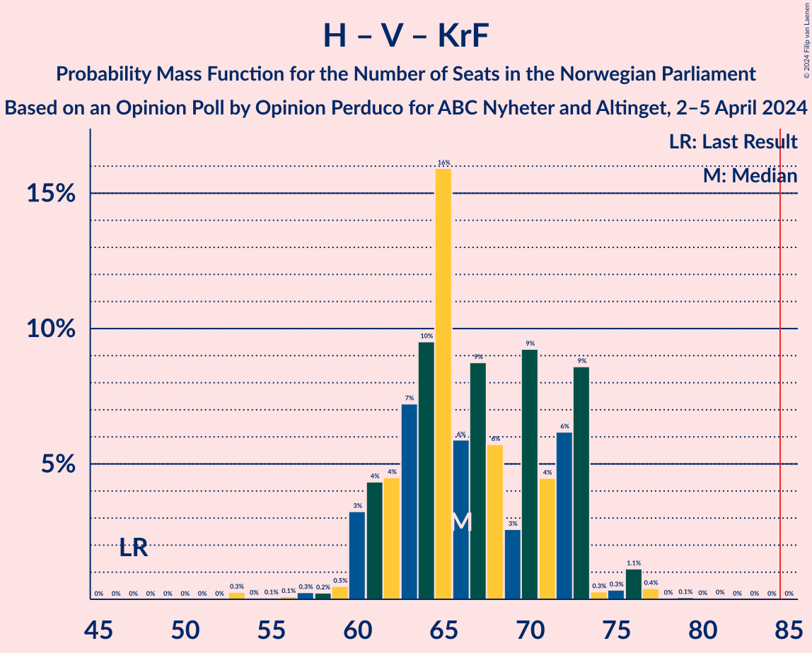
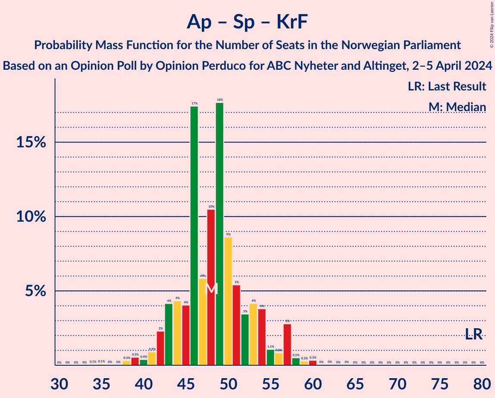

# Opinion Poll by Opinion Perduco for ABC Nyheter and Altinget, 2–5 April 2024

<a href="#voting-intentions">Voting Intentions</a> | <a href="#seats">Seats</a> | <a href="#coalitions">Coalitions</a> | <a href="#technical-information">Technical Information</a>

## Voting Intentions

### Confidence Intervals

| Party | Last Result | Poll Result | 80% Confidence Interval | 90% Confidence Interval | 95% Confidence Interval | 99% Confidence Interval |
|:-----:|:-----------:|:-----------:|:-----------------------:|:-----------------------:|:-----------------------:|:-----------------------:|
| Høyre | 20.4% | 30.5% | 28.4–32.8% |27.8–33.5% |27.2–34.0% |26.2–35.1% |
| Arbeiderpartiet | 26.2% | 19.0% | 17.2–21.0% |16.7–21.6% |16.3–22.0% |15.5–23.0% |
| Fremskrittspartiet | 11.6% | 15.3% | 13.7–17.2% |13.3–17.7% |12.9–18.2% |12.1–19.1% |
| Sosialistisk Venstreparti | 7.6% | 9.4% | 8.2–11.0% |7.8–11.4% |7.5–11.8% |6.9–12.6% |
| Senterpartiet | 13.5% | 5.3% | 4.4–6.6% |4.1–7.0% |3.9–7.3% |3.5–7.9% |
| Venstre | 4.6% | 5.2% | 4.3–6.4% |4.0–6.8% |3.8–7.1% |3.4–7.7% |
| Rødt | 4.7% | 4.2% | 3.4–5.3% |3.2–5.7% |3.0–6.0% |2.6–6.6% |
| Miljøpartiet De Grønne | 3.9% | 3.4% | 2.7–4.4% |2.4–4.7% |2.3–5.0% |2.0–5.5% |
| Kristelig Folkeparti | 3.8% | 3.2% | 2.5–4.3% |2.3–4.6% |2.2–4.8% |1.9–5.3% |
| Industri- og Næringspartiet | 0.3% | 2.7% | 2.0–3.6% |1.9–3.9% |1.7–4.1% |1.5–4.6% |

*Note:* The poll result column reflects the actual value used in the calculations. Published results may vary slightly, and in addition be rounded to fewer digits.

## Seats

### Confidence Intervals

| Party | Last Result | Median | 80% Confidence Interval | 90% Confidence Interval | 95% Confidence Interval | 99% Confidence Interval |
|:-----:|:-----------:|:------:|:-----------------------:|:-----------------------:|:-----------------------:|:-----------------------:|
| <a href="#høyre">Høyre</a> | 36 | 54 | 50–59 |49–59 |49–60 |48–63 |
| <a href="#arbeiderpartiet">Arbeiderpartiet</a> | 48 | 36 | 33–39 |32–41 |32–42 |30–45 |
| <a href="#fremskrittspartiet">Fremskrittspartiet</a> | 21 | 28 | 25–34 |24–34 |24–35 |22–37 |
| <a href="#sosialistisk-venstreparti">Sosialistisk Venstreparti</a> | 13 | 17 | 14–19 |14–20 |13–21 |11–23 |
| <a href="#senterpartiet">Senterpartiet</a> | 28 | 9 | 8–12 |7–13 |1–13 |0–14 |
| <a href="#venstre">Venstre</a> | 8 | 10 | 8–11 |7–13 |3–13 |2–14 |
| <a href="#rødt">Rødt</a> | 8 | 7 | 1–9 |1–10 |1–10 |1–11 |
| <a href="#miljøpartiet-de-grønne">Miljøpartiet De Grønne</a> | 3 | 2 | 1–8 |1–8 |1–9 |1–10 |
| <a href="#kristelig-folkeparti">Kristelig Folkeparti</a> | 3 | 2 | 1–7 |1–8 |0–8 |0–9 |
| <a href="#industri--og-næringspartiet">Industri- og Næringspartiet</a> | 0 | 2 | 0–3 |0–3 |0–7 |0–8 |

### Høyre

*For a full overview of the results for this party, see the [Høyre](party-høyre.html) page.*

| Number of Seats | Probability | Accumulated | Special Marks |
|:---------------:|:-----------:|:-----------:|:-------------:|
| 36 | 0% | 100% | Last Result |
| 37 | 0% | 100% |  |
| 38 | 0% | 100% |  |
| 39 | 0% | 100% |  |
| 40 | 0% | 100% |  |
| 41 | 0% | 100% |  |
| 42 | 0% | 100% |  |
| 43 | 0% | 100% |  |
| 44 | 0% | 100% |  |
| 45 | 0% | 99.9% |  |
| 46 | 0.1% | 99.9% |  |
| 47 | 0.2% | 99.8% |  |
| 48 | 1.2% | 99.6% |  |
| 49 | 5% | 98% |  |
| 50 | 9% | 93% |  |
| 51 | 10% | 85% |  |
| 52 | 7% | 75% |  |
| 53 | 14% | 67% |  |
| 54 | 9% | 54% | Median |
| 55 | 4% | 45% |  |
| 56 | 6% | 41% |  |
| 57 | 6% | 34% |  |
| 58 | 14% | 28% |  |
| 59 | 9% | 14% |  |
| 60 | 3% | 5% |  |
| 61 | 1.0% | 2% |  |
| 62 | 0.3% | 0.9% |  |
| 63 | 0.2% | 0.6% |  |
| 64 | 0.1% | 0.4% |  |
| 65 | 0.1% | 0.2% |  |
| 66 | 0.1% | 0.1% |  |
| 67 | 0% | 0.1% |  |
| 68 | 0% | 0% |  |

### Arbeiderpartiet

*For a full overview of the results for this party, see the [Arbeiderpartiet](party-arbeiderpartiet.html) page.*

| Number of Seats | Probability | Accumulated | Special Marks |
|:---------------:|:-----------:|:-----------:|:-------------:|
| 28 | 0.1% | 100% |  |
| 29 | 0.3% | 99.9% |  |
| 30 | 0.6% | 99.6% |  |
| 31 | 1.4% | 99.0% |  |
| 32 | 7% | 98% |  |
| 33 | 6% | 90% |  |
| 34 | 17% | 85% |  |
| 35 | 8% | 67% |  |
| 36 | 10% | 60% | Median |
| 37 | 22% | 50% |  |
| 38 | 10% | 27% |  |
| 39 | 9% | 17% |  |
| 40 | 2% | 8% |  |
| 41 | 3% | 6% |  |
| 42 | 1.5% | 3% |  |
| 43 | 0.5% | 1.5% |  |
| 44 | 0.4% | 1.0% |  |
| 45 | 0.3% | 0.6% |  |
| 46 | 0.1% | 0.2% |  |
| 47 | 0.1% | 0.2% |  |
| 48 | 0.1% | 0.1% | Last Result |
| 49 | 0% | 0% |  |

### Fremskrittspartiet

*For a full overview of the results for this party, see the [Fremskrittspartiet](party-fremskrittspartiet.html) page.*

| Number of Seats | Probability | Accumulated | Special Marks |
|:---------------:|:-----------:|:-----------:|:-------------:|
| 19 | 0.1% | 100% |  |
| 20 | 0.1% | 99.9% |  |
| 21 | 0.3% | 99.8% | Last Result |
| 22 | 0.9% | 99.6% |  |
| 23 | 0.8% | 98.7% |  |
| 24 | 4% | 98% |  |
| 25 | 10% | 94% |  |
| 26 | 15% | 84% |  |
| 27 | 16% | 69% |  |
| 28 | 17% | 52% | Median |
| 29 | 3% | 35% |  |
| 30 | 8% | 32% |  |
| 31 | 1.3% | 24% |  |
| 32 | 4% | 23% |  |
| 33 | 8% | 19% |  |
| 34 | 6% | 11% |  |
| 35 | 3% | 5% |  |
| 36 | 0.6% | 1.3% |  |
| 37 | 0.6% | 0.7% |  |
| 38 | 0% | 0.1% |  |
| 39 | 0% | 0% |  |

### Sosialistisk Venstreparti

*For a full overview of the results for this party, see the [Sosialistisk Venstreparti](party-sosialistiskvenstreparti.html) page.*

| Number of Seats | Probability | Accumulated | Special Marks |
|:---------------:|:-----------:|:-----------:|:-------------:|
| 10 | 0.1% | 100% |  |
| 11 | 0.5% | 99.9% |  |
| 12 | 2% | 99.4% |  |
| 13 | 2% | 98% | Last Result |
| 14 | 8% | 95% |  |
| 15 | 9% | 87% |  |
| 16 | 24% | 78% |  |
| 17 | 19% | 54% | Median |
| 18 | 16% | 34% |  |
| 19 | 10% | 18% |  |
| 20 | 5% | 8% |  |
| 21 | 2% | 3% |  |
| 22 | 0.5% | 1.1% |  |
| 23 | 0.2% | 0.5% |  |
| 24 | 0.2% | 0.3% |  |
| 25 | 0.1% | 0.2% |  |
| 26 | 0% | 0% |  |

### Senterpartiet

*For a full overview of the results for this party, see the [Senterpartiet](party-senterpartiet.html) page.*

| Number of Seats | Probability | Accumulated | Special Marks |
|:---------------:|:-----------:|:-----------:|:-------------:|
| 0 | 0.6% | 100% |  |
| 1 | 2% | 99.4% |  |
| 2 | 1.3% | 97% |  |
| 3 | 0% | 96% |  |
| 4 | 0% | 96% |  |
| 5 | 0% | 96% |  |
| 6 | 0.2% | 96% |  |
| 7 | 3% | 96% |  |
| 8 | 16% | 93% |  |
| 9 | 28% | 77% | Median |
| 10 | 26% | 49% |  |
| 11 | 9% | 23% |  |
| 12 | 9% | 14% |  |
| 13 | 4% | 5% |  |
| 14 | 0.9% | 1.2% |  |
| 15 | 0.1% | 0.2% |  |
| 16 | 0.1% | 0.1% |  |
| 17 | 0% | 0% |  |
| 18 | 0% | 0% |  |
| 19 | 0% | 0% |  |
| 20 | 0% | 0% |  |
| 21 | 0% | 0% |  |
| 22 | 0% | 0% |  |
| 23 | 0% | 0% |  |
| 24 | 0% | 0% |  |
| 25 | 0% | 0% |  |
| 26 | 0% | 0% |  |
| 27 | 0% | 0% |  |
| 28 | 0% | 0% | Last Result |

### Venstre

*For a full overview of the results for this party, see the [Venstre](party-venstre.html) page.*

| Number of Seats | Probability | Accumulated | Special Marks |
|:---------------:|:-----------:|:-----------:|:-------------:|
| 2 | 2% | 100% |  |
| 3 | 3% | 98% |  |
| 4 | 0% | 95% |  |
| 5 | 0% | 95% |  |
| 6 | 0.1% | 95% |  |
| 7 | 3% | 95% |  |
| 8 | 14% | 93% | Last Result |
| 9 | 21% | 78% |  |
| 10 | 29% | 57% | Median |
| 11 | 18% | 28% |  |
| 12 | 4% | 10% |  |
| 13 | 4% | 6% |  |
| 14 | 2% | 2% |  |
| 15 | 0.1% | 0.1% |  |
| 16 | 0% | 0% |  |

### Rødt

*For a full overview of the results for this party, see the [Rødt](party-rødt.html) page.*

| Number of Seats | Probability | Accumulated | Special Marks |
|:---------------:|:-----------:|:-----------:|:-------------:|
| 1 | 35% | 100% |  |
| 2 | 0% | 65% |  |
| 3 | 0% | 65% |  |
| 4 | 0% | 65% |  |
| 5 | 0% | 65% |  |
| 6 | 0.8% | 65% |  |
| 7 | 16% | 64% | Median |
| 8 | 28% | 48% | Last Result |
| 9 | 11% | 20% |  |
| 10 | 8% | 10% |  |
| 11 | 2% | 2% |  |
| 12 | 0.3% | 0.4% |  |
| 13 | 0.1% | 0.1% |  |
| 14 | 0% | 0% |  |

### Miljøpartiet De Grønne

*For a full overview of the results for this party, see the [Miljøpartiet De Grønne](party-miljøpartietdegrønne.html) page.*

| Number of Seats | Probability | Accumulated | Special Marks |
|:---------------:|:-----------:|:-----------:|:-------------:|
| 0 | 0.1% | 100% |  |
| 1 | 22% | 99.9% |  |
| 2 | 42% | 78% | Median |
| 3 | 14% | 36% | Last Result |
| 4 | 0% | 22% |  |
| 5 | 0% | 22% |  |
| 6 | 0.8% | 22% |  |
| 7 | 8% | 21% |  |
| 8 | 9% | 13% |  |
| 9 | 3% | 4% |  |
| 10 | 0.5% | 0.7% |  |
| 11 | 0.1% | 0.1% |  |
| 12 | 0% | 0% |  |

### Kristelig Folkeparti

*For a full overview of the results for this party, see the [Kristelig Folkeparti](party-kristeligfolkeparti.html) page.*

| Number of Seats | Probability | Accumulated | Special Marks |
|:---------------:|:-----------:|:-----------:|:-------------:|
| 0 | 4% | 100% |  |
| 1 | 6% | 96% |  |
| 2 | 50% | 89% | Median |
| 3 | 25% | 39% | Last Result |
| 4 | 0% | 14% |  |
| 5 | 0% | 14% |  |
| 6 | 1.4% | 14% |  |
| 7 | 7% | 13% |  |
| 8 | 5% | 5% |  |
| 9 | 0.7% | 0.9% |  |
| 10 | 0.1% | 0.1% |  |
| 11 | 0% | 0% |  |

### Industri- og Næringspartiet

*For a full overview of the results for this party, see the [Industri- og Næringspartiet](party-industri-ognæringspartiet.html) page.*

| Number of Seats | Probability | Accumulated | Special Marks |
|:---------------:|:-----------:|:-----------:|:-------------:|
| 0 | 33% | 100% | Last Result |
| 1 | 6% | 67% |  |
| 2 | 46% | 61% | Median |
| 3 | 11% | 15% |  |
| 4 | 0% | 4% |  |
| 5 | 0% | 4% |  |
| 6 | 0.7% | 4% |  |
| 7 | 2% | 3% |  |
| 8 | 1.1% | 1.1% |  |
| 9 | 0.1% | 0.1% |  |
| 10 | 0% | 0% |  |

## Coalitions

### Confidence Intervals

| Coalition | Last Result | Median | Majority? | 80% Confidence Interval | 90% Confidence Interval | 95% Confidence Interval | 99% Confidence Interval |
|:---------:|:-----------:|:------:|:---------:|:-----------------------:|:-----------------------:|:-----------------------:|:-----------------------:|
| Høyre – Fremskrittspartiet – Senterpartiet – Venstre – Kristelig Folkeparti | 96 | 105 | 100% | 99–110 | 97–112 | 95–113 | 93–117 |
| Høyre – Fremskrittspartiet – Venstre – Miljøpartiet De Grønne – Kristelig Folkeparti | 71 | 99 | 100% | 93–104 | 92–106 | 91–107 | 88–110 |
| Høyre – Fremskrittspartiet – Venstre – Kristelig Folkeparti | 68 | 95 | 99.5% | 90–100 | 89–102 | 87–104 | 84–106 |
| Høyre – Fremskrittspartiet – Venstre | 65 | 93 | 94% | 87–97 | 83–100 | 83–101 | 81–104 |
| Høyre – Fremskrittspartiet | 57 | 83 | 36% | 78–88 | 75–90 | 74–92 | 73–94 |
| Arbeiderpartiet – Sosialistisk Venstreparti – Senterpartiet – Rødt – Miljøpartiet De Grønne | 100 | 71 | 0.1% | 67–76 | 64–77 | 63–80 | 60–82 |
| Arbeiderpartiet – Sosialistisk Venstreparti – Senterpartiet – Miljøpartiet De Grønne – Kristelig Folkeparti | 95 | 68 | 0% | 63–74 | 61–75 | 60–77 | 58–80 |
| Arbeiderpartiet – Sosialistisk Venstreparti – Senterpartiet – Rødt | 97 | 67 | 0% | 63–74 | 61–75 | 60–75 | 56–78 |
| Arbeiderpartiet – Sosialistisk Venstreparti – Senterpartiet – Miljøpartiet De Grønne | 92 | 66 | 0% | 61–70 | 59–72 | 58–74 | 55–77 |
| Høyre – Venstre – Kristelig Folkeparti | 47 | 66 | 0% | 62–73 | 61–73 | 60–73 | 57–77 |
| Arbeiderpartiet – Sosialistisk Venstreparti – Rødt – Miljøpartiet De Grønne | 72 | 62 | 0% | 57–67 | 55–69 | 54–71 | 51–74 |
| Arbeiderpartiet – Sosialistisk Venstreparti – Senterpartiet | 89 | 62 | 0% | 58–67 | 56–68 | 55–69 | 52–72 |
| Arbeiderpartiet – Senterpartiet – Miljøpartiet De Grønne – Kristelig Folkeparti | 82 | 52 | 0% | 46–58 | 45–59 | 44–60 | 41–63 |
| Arbeiderpartiet – Sosialistisk Venstreparti | 61 | 53 | 0% | 49–57 | 48–58 | 47–59 | 45–62 |
| Arbeiderpartiet – Senterpartiet – Kristelig Folkeparti | 79 | 48 | 0% | 44–53 | 43–55 | 42–57 | 38–59 |
| Arbeiderpartiet – Senterpartiet | 76 | 46 | 0% | 41–49 | 40–51 | 39–51 | 36–54 |
| Senterpartiet – Venstre – Kristelig Folkeparti | 39 | 22 | 0% | 18–26 | 15–27 | 14–30 | 11–30 |

### Høyre – Fremskrittspartiet – Senterpartiet – Venstre – Kristelig Folkeparti

| Number of Seats | Probability | Accumulated | Special Marks |
|:---------------:|:-----------:|:-----------:|:-------------:|
| 90 | 0% | 100% |  |
| 91 | 0.1% | 99.9% |  |
| 92 | 0.1% | 99.9% |  |
| 93 | 0.3% | 99.7% |  |
| 94 | 0.5% | 99.4% |  |
| 95 | 3% | 99.0% |  |
| 96 | 0.9% | 96% | Last Result |
| 97 | 0.9% | 95% |  |
| 98 | 2% | 94% |  |
| 99 | 4% | 92% |  |
| 100 | 6% | 88% |  |
| 101 | 6% | 82% |  |
| 102 | 9% | 75% |  |
| 103 | 10% | 66% | Median |
| 104 | 7% | 57% |  |
| 105 | 5% | 50% |  |
| 106 | 7% | 45% |  |
| 107 | 3% | 38% |  |
| 108 | 17% | 34% |  |
| 109 | 6% | 18% |  |
| 110 | 3% | 11% |  |
| 111 | 3% | 9% |  |
| 112 | 2% | 5% |  |
| 113 | 1.4% | 3% |  |
| 114 | 0.4% | 2% |  |
| 115 | 0.4% | 2% |  |
| 116 | 0.2% | 1.2% |  |
| 117 | 0.8% | 0.9% |  |
| 118 | 0.1% | 0.1% |  |
| 119 | 0% | 0.1% |  |
| 120 | 0% | 0% |  |

### Høyre – Fremskrittspartiet – Venstre – Miljøpartiet De Grønne – Kristelig Folkeparti

| Number of Seats | Probability | Accumulated | Special Marks |
|:---------------:|:-----------:|:-----------:|:-------------:|
| 71 | 0% | 100% | Last Result |
| 72 | 0% | 100% |  |
| 73 | 0% | 100% |  |
| 74 | 0% | 100% |  |
| 75 | 0% | 100% |  |
| 76 | 0% | 100% |  |
| 77 | 0% | 100% |  |
| 78 | 0% | 100% |  |
| 79 | 0% | 100% |  |
| 80 | 0% | 100% |  |
| 81 | 0% | 100% |  |
| 82 | 0% | 100% |  |
| 83 | 0% | 100% |  |
| 84 | 0% | 100% |  |
| 85 | 0.1% | 100% | Majority |
| 86 | 0.3% | 99.9% |  |
| 87 | 0.2% | 99.7% |  |
| 88 | 0.1% | 99.5% |  |
| 89 | 0.3% | 99.4% |  |
| 90 | 0.4% | 99.1% |  |
| 91 | 1.3% | 98.7% |  |
| 92 | 6% | 97% |  |
| 93 | 7% | 91% |  |
| 94 | 5% | 85% |  |
| 95 | 3% | 80% |  |
| 96 | 11% | 76% | Median |
| 97 | 8% | 65% |  |
| 98 | 4% | 57% |  |
| 99 | 10% | 52% |  |
| 100 | 6% | 42% |  |
| 101 | 19% | 36% |  |
| 102 | 3% | 17% |  |
| 103 | 4% | 15% |  |
| 104 | 3% | 11% |  |
| 105 | 2% | 8% |  |
| 106 | 1.3% | 6% |  |
| 107 | 2% | 5% |  |
| 108 | 2% | 2% |  |
| 109 | 0.3% | 0.8% |  |
| 110 | 0.1% | 0.5% |  |
| 111 | 0.1% | 0.4% |  |
| 112 | 0.3% | 0.3% |  |
| 113 | 0% | 0.1% |  |
| 114 | 0% | 0% |  |

### Høyre – Fremskrittspartiet – Venstre – Kristelig Folkeparti

| Number of Seats | Probability | Accumulated | Special Marks |
|:---------------:|:-----------:|:-----------:|:-------------:|
| 68 | 0% | 100% | Last Result |
| 69 | 0% | 100% |  |
| 70 | 0% | 100% |  |
| 71 | 0% | 100% |  |
| 72 | 0% | 100% |  |
| 73 | 0% | 100% |  |
| 74 | 0% | 100% |  |
| 75 | 0% | 100% |  |
| 76 | 0% | 100% |  |
| 77 | 0% | 100% |  |
| 78 | 0% | 100% |  |
| 79 | 0% | 100% |  |
| 80 | 0% | 100% |  |
| 81 | 0% | 100% |  |
| 82 | 0.1% | 100% |  |
| 83 | 0.1% | 99.9% |  |
| 84 | 0.3% | 99.7% |  |
| 85 | 1.3% | 99.5% | Majority |
| 86 | 0.6% | 98% |  |
| 87 | 0.3% | 98% |  |
| 88 | 2% | 97% |  |
| 89 | 2% | 95% |  |
| 90 | 8% | 93% |  |
| 91 | 7% | 85% |  |
| 92 | 7% | 78% |  |
| 93 | 5% | 71% |  |
| 94 | 8% | 66% | Median |
| 95 | 10% | 58% |  |
| 96 | 6% | 48% |  |
| 97 | 7% | 42% |  |
| 98 | 12% | 35% |  |
| 99 | 11% | 23% |  |
| 100 | 2% | 12% |  |
| 101 | 4% | 9% |  |
| 102 | 1.0% | 6% |  |
| 103 | 1.2% | 5% |  |
| 104 | 2% | 4% |  |
| 105 | 0.9% | 2% |  |
| 106 | 0.6% | 1.0% |  |
| 107 | 0.2% | 0.4% |  |
| 108 | 0.1% | 0.2% |  |
| 109 | 0% | 0.1% |  |
| 110 | 0% | 0.1% |  |
| 111 | 0% | 0% |  |

### Høyre – Fremskrittspartiet – Venstre

| Number of Seats | Probability | Accumulated | Special Marks |
|:---------------:|:-----------:|:-----------:|:-------------:|
| 65 | 0% | 100% | Last Result |
| 66 | 0% | 100% |  |
| 67 | 0% | 100% |  |
| 68 | 0% | 100% |  |
| 69 | 0% | 100% |  |
| 70 | 0% | 100% |  |
| 71 | 0% | 100% |  |
| 72 | 0% | 100% |  |
| 73 | 0% | 100% |  |
| 74 | 0% | 100% |  |
| 75 | 0% | 100% |  |
| 76 | 0% | 100% |  |
| 77 | 0% | 100% |  |
| 78 | 0% | 99.9% |  |
| 79 | 0.1% | 99.9% |  |
| 80 | 0.2% | 99.8% |  |
| 81 | 0.4% | 99.6% |  |
| 82 | 1.2% | 99.3% |  |
| 83 | 4% | 98% |  |
| 84 | 0.8% | 95% |  |
| 85 | 0.8% | 94% | Majority |
| 86 | 2% | 93% |  |
| 87 | 4% | 91% |  |
| 88 | 6% | 86% |  |
| 89 | 3% | 81% |  |
| 90 | 10% | 77% |  |
| 91 | 8% | 67% |  |
| 92 | 7% | 58% | Median |
| 93 | 10% | 51% |  |
| 94 | 7% | 42% |  |
| 95 | 5% | 34% |  |
| 96 | 15% | 29% |  |
| 97 | 4% | 14% |  |
| 98 | 2% | 9% |  |
| 99 | 2% | 7% |  |
| 100 | 2% | 5% |  |
| 101 | 1.5% | 3% |  |
| 102 | 0.1% | 2% |  |
| 103 | 1.2% | 2% |  |
| 104 | 0.4% | 0.7% |  |
| 105 | 0.1% | 0.3% |  |
| 106 | 0.1% | 0.2% |  |
| 107 | 0% | 0.1% |  |
| 108 | 0% | 0% |  |

### Høyre – Fremskrittspartiet

| Number of Seats | Probability | Accumulated | Special Marks |
|:---------------:|:-----------:|:-----------:|:-------------:|
| 57 | 0% | 100% | Last Result |
| 58 | 0% | 100% |  |
| 59 | 0% | 100% |  |
| 60 | 0% | 100% |  |
| 61 | 0% | 100% |  |
| 62 | 0% | 100% |  |
| 63 | 0% | 100% |  |
| 64 | 0% | 100% |  |
| 65 | 0% | 100% |  |
| 66 | 0% | 100% |  |
| 67 | 0% | 100% |  |
| 68 | 0% | 100% |  |
| 69 | 0% | 100% |  |
| 70 | 0.1% | 100% |  |
| 71 | 0.1% | 99.9% |  |
| 72 | 0.2% | 99.8% |  |
| 73 | 1.2% | 99.6% |  |
| 74 | 3% | 98% |  |
| 75 | 0.7% | 95% |  |
| 76 | 2% | 94% |  |
| 77 | 2% | 93% |  |
| 78 | 6% | 91% |  |
| 79 | 7% | 85% |  |
| 80 | 6% | 78% |  |
| 81 | 9% | 72% |  |
| 82 | 3% | 62% | Median |
| 83 | 12% | 59% |  |
| 84 | 11% | 47% |  |
| 85 | 10% | 36% | Majority |
| 86 | 11% | 26% |  |
| 87 | 3% | 15% |  |
| 88 | 3% | 12% |  |
| 89 | 3% | 8% |  |
| 90 | 2% | 5% |  |
| 91 | 0.7% | 4% |  |
| 92 | 1.1% | 3% |  |
| 93 | 0.9% | 2% |  |
| 94 | 0.7% | 1.0% |  |
| 95 | 0.1% | 0.3% |  |
| 96 | 0.1% | 0.2% |  |
| 97 | 0.1% | 0.1% |  |
| 98 | 0% | 0.1% |  |
| 99 | 0% | 0% |  |

### Arbeiderpartiet – Sosialistisk Venstreparti – Senterpartiet – Rødt – Miljøpartiet De Grønne

| Number of Seats | Probability | Accumulated | Special Marks |
|:---------------:|:-----------:|:-----------:|:-------------:|
| 57 | 0% | 100% |  |
| 58 | 0.1% | 99.9% |  |
| 59 | 0.1% | 99.9% |  |
| 60 | 0.3% | 99.8% |  |
| 61 | 0.4% | 99.4% |  |
| 62 | 0.7% | 99.1% |  |
| 63 | 2% | 98% |  |
| 64 | 2% | 97% |  |
| 65 | 3% | 95% |  |
| 66 | 2% | 92% |  |
| 67 | 5% | 90% |  |
| 68 | 14% | 85% |  |
| 69 | 11% | 71% |  |
| 70 | 3% | 60% |  |
| 71 | 12% | 57% | Median |
| 72 | 8% | 45% |  |
| 73 | 8% | 37% |  |
| 74 | 5% | 29% |  |
| 75 | 7% | 23% |  |
| 76 | 7% | 16% |  |
| 77 | 4% | 9% |  |
| 78 | 1.5% | 5% |  |
| 79 | 0.7% | 3% |  |
| 80 | 0.5% | 3% |  |
| 81 | 1.1% | 2% |  |
| 82 | 0.5% | 0.9% |  |
| 83 | 0.2% | 0.4% |  |
| 84 | 0.1% | 0.2% |  |
| 85 | 0.1% | 0.1% | Majority |
| 86 | 0% | 0% |  |
| 87 | 0% | 0% |  |
| 88 | 0% | 0% |  |
| 89 | 0% | 0% |  |
| 90 | 0% | 0% |  |
| 91 | 0% | 0% |  |
| 92 | 0% | 0% |  |
| 93 | 0% | 0% |  |
| 94 | 0% | 0% |  |
| 95 | 0% | 0% |  |
| 96 | 0% | 0% |  |
| 97 | 0% | 0% |  |
| 98 | 0% | 0% |  |
| 99 | 0% | 0% |  |
| 100 | 0% | 0% | Last Result |

### Arbeiderpartiet – Sosialistisk Venstreparti – Senterpartiet – Miljøpartiet De Grønne – Kristelig Folkeparti

| Number of Seats | Probability | Accumulated | Special Marks |
|:---------------:|:-----------:|:-----------:|:-------------:|
| 53 | 0% | 100% |  |
| 54 | 0% | 99.9% |  |
| 55 | 0.1% | 99.9% |  |
| 56 | 0.2% | 99.8% |  |
| 57 | 0.1% | 99.6% |  |
| 58 | 0.2% | 99.5% |  |
| 59 | 0.6% | 99.3% |  |
| 60 | 2% | 98.7% |  |
| 61 | 2% | 97% |  |
| 62 | 2% | 95% |  |
| 63 | 3% | 93% |  |
| 64 | 10% | 89% |  |
| 65 | 6% | 80% |  |
| 66 | 8% | 74% | Median |
| 67 | 10% | 66% |  |
| 68 | 7% | 56% |  |
| 69 | 13% | 49% |  |
| 70 | 7% | 36% |  |
| 71 | 8% | 29% |  |
| 72 | 4% | 21% |  |
| 73 | 3% | 17% |  |
| 74 | 4% | 14% |  |
| 75 | 5% | 10% |  |
| 76 | 1.0% | 4% |  |
| 77 | 2% | 3% |  |
| 78 | 0.4% | 2% |  |
| 79 | 0.4% | 1.1% |  |
| 80 | 0.4% | 0.7% |  |
| 81 | 0.1% | 0.3% |  |
| 82 | 0.1% | 0.2% |  |
| 83 | 0.1% | 0.2% |  |
| 84 | 0% | 0% |  |
| 85 | 0% | 0% | Majority |
| 86 | 0% | 0% |  |
| 87 | 0% | 0% |  |
| 88 | 0% | 0% |  |
| 89 | 0% | 0% |  |
| 90 | 0% | 0% |  |
| 91 | 0% | 0% |  |
| 92 | 0% | 0% |  |
| 93 | 0% | 0% |  |
| 94 | 0% | 0% |  |
| 95 | 0% | 0% | Last Result |

### Arbeiderpartiet – Sosialistisk Venstreparti – Senterpartiet – Rødt

| Number of Seats | Probability | Accumulated | Special Marks |
|:---------------:|:-----------:|:-----------:|:-------------:|
| 54 | 0.1% | 100% |  |
| 55 | 0.1% | 99.9% |  |
| 56 | 0.4% | 99.9% |  |
| 57 | 0.1% | 99.5% |  |
| 58 | 1.4% | 99.4% |  |
| 59 | 0.4% | 98% |  |
| 60 | 0.9% | 98% |  |
| 61 | 3% | 97% |  |
| 62 | 1.4% | 94% |  |
| 63 | 4% | 92% |  |
| 64 | 5% | 89% |  |
| 65 | 13% | 84% |  |
| 66 | 10% | 71% |  |
| 67 | 14% | 62% |  |
| 68 | 3% | 48% |  |
| 69 | 9% | 45% | Median |
| 70 | 8% | 36% |  |
| 71 | 6% | 27% |  |
| 72 | 4% | 21% |  |
| 73 | 7% | 17% |  |
| 74 | 5% | 10% |  |
| 75 | 4% | 6% |  |
| 76 | 0.3% | 1.4% |  |
| 77 | 0.4% | 1.0% |  |
| 78 | 0.2% | 0.7% |  |
| 79 | 0.1% | 0.4% |  |
| 80 | 0.2% | 0.3% |  |
| 81 | 0.1% | 0.1% |  |
| 82 | 0.1% | 0.1% |  |
| 83 | 0% | 0% |  |
| 84 | 0% | 0% |  |
| 85 | 0% | 0% | Majority |
| 86 | 0% | 0% |  |
| 87 | 0% | 0% |  |
| 88 | 0% | 0% |  |
| 89 | 0% | 0% |  |
| 90 | 0% | 0% |  |
| 91 | 0% | 0% |  |
| 92 | 0% | 0% |  |
| 93 | 0% | 0% |  |
| 94 | 0% | 0% |  |
| 95 | 0% | 0% |  |
| 96 | 0% | 0% |  |
| 97 | 0% | 0% | Last Result |

### Arbeiderpartiet – Sosialistisk Venstreparti – Senterpartiet – Miljøpartiet De Grønne

| Number of Seats | Probability | Accumulated | Special Marks |
|:---------------:|:-----------:|:-----------:|:-------------:|
| 51 | 0.1% | 100% |  |
| 52 | 0% | 99.9% |  |
| 53 | 0.1% | 99.9% |  |
| 54 | 0.3% | 99.8% |  |
| 55 | 0.2% | 99.5% |  |
| 56 | 0.5% | 99.3% |  |
| 57 | 0.4% | 98.8% |  |
| 58 | 2% | 98% |  |
| 59 | 2% | 97% |  |
| 60 | 2% | 95% |  |
| 61 | 10% | 93% |  |
| 62 | 4% | 83% |  |
| 63 | 12% | 79% |  |
| 64 | 7% | 66% | Median |
| 65 | 9% | 59% |  |
| 66 | 7% | 51% |  |
| 67 | 15% | 44% |  |
| 68 | 10% | 29% |  |
| 69 | 7% | 19% |  |
| 70 | 3% | 12% |  |
| 71 | 2% | 9% |  |
| 72 | 3% | 7% |  |
| 73 | 0.9% | 4% |  |
| 74 | 0.9% | 3% |  |
| 75 | 1.1% | 2% |  |
| 76 | 0.2% | 0.8% |  |
| 77 | 0.5% | 0.7% |  |
| 78 | 0.1% | 0.1% |  |
| 79 | 0% | 0.1% |  |
| 80 | 0% | 0% |  |
| 81 | 0% | 0% |  |
| 82 | 0% | 0% |  |
| 83 | 0% | 0% |  |
| 84 | 0% | 0% |  |
| 85 | 0% | 0% | Majority |
| 86 | 0% | 0% |  |
| 87 | 0% | 0% |  |
| 88 | 0% | 0% |  |
| 89 | 0% | 0% |  |
| 90 | 0% | 0% |  |
| 91 | 0% | 0% |  |
| 92 | 0% | 0% | Last Result |

### Høyre – Venstre – Kristelig Folkeparti

| Number of Seats | Probability | Accumulated | Special Marks |
|:---------------:|:-----------:|:-----------:|:-------------:|
| 47 | 0% | 100% | Last Result |
| 48 | 0% | 100% |  |
| 49 | 0% | 100% |  |
| 50 | 0% | 100% |  |
| 51 | 0% | 100% |  |
| 52 | 0% | 100% |  |
| 53 | 0.3% | 100% |  |
| 54 | 0% | 99.7% |  |
| 55 | 0.1% | 99.7% |  |
| 56 | 0.1% | 99.6% |  |
| 57 | 0.3% | 99.5% |  |
| 58 | 0.2% | 99.3% |  |
| 59 | 0.5% | 99.0% |  |
| 60 | 3% | 98.6% |  |
| 61 | 4% | 95% |  |
| 62 | 4% | 91% |  |
| 63 | 7% | 86% |  |
| 64 | 10% | 79% |  |
| 65 | 16% | 70% |  |
| 66 | 6% | 54% | Median |
| 67 | 9% | 48% |  |
| 68 | 6% | 39% |  |
| 69 | 3% | 33% |  |
| 70 | 9% | 31% |  |
| 71 | 4% | 22% |  |
| 72 | 6% | 17% |  |
| 73 | 9% | 11% |  |
| 74 | 0.3% | 2% |  |
| 75 | 0.3% | 2% |  |
| 76 | 1.1% | 2% |  |
| 77 | 0.4% | 0.6% |  |
| 78 | 0% | 0.2% |  |
| 79 | 0.1% | 0.2% |  |
| 80 | 0% | 0.1% |  |
| 81 | 0% | 0.1% |  |
| 82 | 0% | 0% |  |

### Arbeiderpartiet – Sosialistisk Venstreparti – Rødt – Miljøpartiet De Grønne

| Number of Seats | Probability | Accumulated | Special Marks |
|:---------------:|:-----------:|:-----------:|:-------------:|
| 48 | 0% | 100% |  |
| 49 | 0.2% | 99.9% |  |
| 50 | 0.1% | 99.7% |  |
| 51 | 0.7% | 99.6% |  |
| 52 | 0.3% | 98.9% |  |
| 53 | 0.5% | 98.6% |  |
| 54 | 2% | 98% |  |
| 55 | 4% | 97% |  |
| 56 | 2% | 92% |  |
| 57 | 5% | 90% |  |
| 58 | 11% | 85% |  |
| 59 | 7% | 74% |  |
| 60 | 9% | 68% |  |
| 61 | 6% | 59% |  |
| 62 | 6% | 52% | Median |
| 63 | 11% | 46% |  |
| 64 | 6% | 35% |  |
| 65 | 11% | 29% |  |
| 66 | 8% | 19% |  |
| 67 | 3% | 11% |  |
| 68 | 2% | 8% |  |
| 69 | 2% | 6% |  |
| 70 | 0.6% | 5% |  |
| 71 | 3% | 4% |  |
| 72 | 0.4% | 1.2% | Last Result |
| 73 | 0.2% | 0.8% |  |
| 74 | 0.3% | 0.6% |  |
| 75 | 0.2% | 0.3% |  |
| 76 | 0% | 0.1% |  |
| 77 | 0% | 0% |  |

### Arbeiderpartiet – Sosialistisk Venstreparti – Senterpartiet

| Number of Seats | Probability | Accumulated | Special Marks |
|:---------------:|:-----------:|:-----------:|:-------------:|
| 49 | 0.1% | 100% |  |
| 50 | 0.1% | 99.9% |  |
| 51 | 0.2% | 99.8% |  |
| 52 | 0.3% | 99.7% |  |
| 53 | 0.4% | 99.3% |  |
| 54 | 1.0% | 98.9% |  |
| 55 | 0.9% | 98% |  |
| 56 | 2% | 97% |  |
| 57 | 3% | 95% |  |
| 58 | 3% | 91% |  |
| 59 | 13% | 88% |  |
| 60 | 5% | 75% |  |
| 61 | 9% | 70% |  |
| 62 | 12% | 61% | Median |
| 63 | 7% | 49% |  |
| 64 | 17% | 42% |  |
| 65 | 7% | 24% |  |
| 66 | 7% | 17% |  |
| 67 | 5% | 10% |  |
| 68 | 0.8% | 5% |  |
| 69 | 2% | 4% |  |
| 70 | 0.7% | 2% |  |
| 71 | 0.9% | 2% |  |
| 72 | 0.5% | 0.8% |  |
| 73 | 0.1% | 0.3% |  |
| 74 | 0.1% | 0.2% |  |
| 75 | 0% | 0.1% |  |
| 76 | 0% | 0.1% |  |
| 77 | 0% | 0% |  |
| 78 | 0% | 0% |  |
| 79 | 0% | 0% |  |
| 80 | 0% | 0% |  |
| 81 | 0% | 0% |  |
| 82 | 0% | 0% |  |
| 83 | 0% | 0% |  |
| 84 | 0% | 0% |  |
| 85 | 0% | 0% | Majority |
| 86 | 0% | 0% |  |
| 87 | 0% | 0% |  |
| 88 | 0% | 0% |  |
| 89 | 0% | 0% | Last Result |

### Arbeiderpartiet – Senterpartiet – Miljøpartiet De Grønne – Kristelig Folkeparti

| Number of Seats | Probability | Accumulated | Special Marks |
|:---------------:|:-----------:|:-----------:|:-------------:|
| 36 | 0.1% | 100% |  |
| 37 | 0% | 99.9% |  |
| 38 | 0% | 99.9% |  |
| 39 | 0.1% | 99.8% |  |
| 40 | 0.1% | 99.8% |  |
| 41 | 0.3% | 99.7% |  |
| 42 | 0.4% | 99.4% |  |
| 43 | 0.7% | 99.1% |  |
| 44 | 2% | 98% |  |
| 45 | 5% | 96% |  |
| 46 | 2% | 91% |  |
| 47 | 4% | 89% |  |
| 48 | 12% | 85% |  |
| 49 | 7% | 73% | Median |
| 50 | 7% | 66% |  |
| 51 | 7% | 59% |  |
| 52 | 18% | 52% |  |
| 53 | 4% | 34% |  |
| 54 | 8% | 31% |  |
| 55 | 3% | 22% |  |
| 56 | 4% | 19% |  |
| 57 | 4% | 15% |  |
| 58 | 3% | 11% |  |
| 59 | 4% | 8% |  |
| 60 | 3% | 5% |  |
| 61 | 0.6% | 2% |  |
| 62 | 0.5% | 1.2% |  |
| 63 | 0.3% | 0.7% |  |
| 64 | 0.1% | 0.4% |  |
| 65 | 0.2% | 0.4% |  |
| 66 | 0.1% | 0.1% |  |
| 67 | 0% | 0.1% |  |
| 68 | 0% | 0% |  |
| 69 | 0% | 0% |  |
| 70 | 0% | 0% |  |
| 71 | 0% | 0% |  |
| 72 | 0% | 0% |  |
| 73 | 0% | 0% |  |
| 74 | 0% | 0% |  |
| 75 | 0% | 0% |  |
| 76 | 0% | 0% |  |
| 77 | 0% | 0% |  |
| 78 | 0% | 0% |  |
| 79 | 0% | 0% |  |
| 80 | 0% | 0% |  |
| 81 | 0% | 0% |  |
| 82 | 0% | 0% | Last Result |

### Arbeiderpartiet – Sosialistisk Venstreparti

| Number of Seats | Probability | Accumulated | Special Marks |
|:---------------:|:-----------:|:-----------:|:-------------:|
| 43 | 0.3% | 100% |  |
| 44 | 0.1% | 99.7% |  |
| 45 | 0.3% | 99.6% |  |
| 46 | 0.9% | 99.2% |  |
| 47 | 2% | 98% |  |
| 48 | 3% | 96% |  |
| 49 | 4% | 93% |  |
| 50 | 16% | 89% |  |
| 51 | 8% | 73% |  |
| 52 | 7% | 65% |  |
| 53 | 11% | 58% | Median |
| 54 | 19% | 46% |  |
| 55 | 10% | 27% |  |
| 56 | 5% | 18% |  |
| 57 | 7% | 13% |  |
| 58 | 1.0% | 6% |  |
| 59 | 3% | 5% |  |
| 60 | 0.9% | 2% |  |
| 61 | 0.5% | 1.2% | Last Result |
| 62 | 0.3% | 0.7% |  |
| 63 | 0.2% | 0.4% |  |
| 64 | 0.1% | 0.2% |  |
| 65 | 0.1% | 0.1% |  |
| 66 | 0% | 0% |  |

### Arbeiderpartiet – Senterpartiet – Kristelig Folkeparti

| Number of Seats | Probability | Accumulated | Special Marks |
|:---------------:|:-----------:|:-----------:|:-------------:|
| 34 | 0.1% | 100% |  |
| 35 | 0.1% | 99.9% |  |
| 36 | 0% | 99.8% |  |
| 37 | 0% | 99.8% |  |
| 38 | 0.3% | 99.8% |  |
| 39 | 0.5% | 99.5% |  |
| 40 | 0.4% | 98.9% |  |
| 41 | 0.9% | 98.5% |  |
| 42 | 2% | 98% |  |
| 43 | 4% | 95% |  |
| 44 | 4% | 91% |  |
| 45 | 4% | 87% |  |
| 46 | 17% | 83% |  |
| 47 | 6% | 65% | Median |
| 48 | 10% | 60% |  |
| 49 | 18% | 49% |  |
| 50 | 9% | 31% |  |
| 51 | 5% | 23% |  |
| 52 | 3% | 17% |  |
| 53 | 4% | 14% |  |
| 54 | 4% | 10% |  |
| 55 | 1.1% | 6% |  |
| 56 | 0.8% | 5% |  |
| 57 | 3% | 4% |  |
| 58 | 0.5% | 1.3% |  |
| 59 | 0.3% | 0.8% |  |
| 60 | 0.3% | 0.5% |  |
| 61 | 0% | 0.1% |  |
| 62 | 0% | 0.1% |  |
| 63 | 0% | 0.1% |  |
| 64 | 0% | 0% |  |
| 65 | 0% | 0% |  |
| 66 | 0% | 0% |  |
| 67 | 0% | 0% |  |
| 68 | 0% | 0% |  |
| 69 | 0% | 0% |  |
| 70 | 0% | 0% |  |
| 71 | 0% | 0% |  |
| 72 | 0% | 0% |  |
| 73 | 0% | 0% |  |
| 74 | 0% | 0% |  |
| 75 | 0% | 0% |  |
| 76 | 0% | 0% |  |
| 77 | 0% | 0% |  |
| 78 | 0% | 0% |  |
| 79 | 0% | 0% | Last Result |

### Arbeiderpartiet – Senterpartiet

| Number of Seats | Probability | Accumulated | Special Marks |
|:---------------:|:-----------:|:-----------:|:-------------:|
| 33 | 0.1% | 100% |  |
| 34 | 0.1% | 99.9% |  |
| 35 | 0.1% | 99.8% |  |
| 36 | 0.3% | 99.7% |  |
| 37 | 0.5% | 99.4% |  |
| 38 | 0.6% | 98.9% |  |
| 39 | 0.9% | 98% |  |
| 40 | 3% | 97% |  |
| 41 | 6% | 95% |  |
| 42 | 5% | 89% |  |
| 43 | 11% | 84% |  |
| 44 | 10% | 73% |  |
| 45 | 8% | 63% | Median |
| 46 | 13% | 55% |  |
| 47 | 20% | 43% |  |
| 48 | 8% | 22% |  |
| 49 | 6% | 14% |  |
| 50 | 2% | 8% |  |
| 51 | 4% | 6% |  |
| 52 | 1.1% | 2% |  |
| 53 | 0.7% | 1.4% |  |
| 54 | 0.3% | 0.6% |  |
| 55 | 0.1% | 0.4% |  |
| 56 | 0.1% | 0.2% |  |
| 57 | 0.1% | 0.2% |  |
| 58 | 0% | 0.1% |  |
| 59 | 0% | 0% |  |
| 60 | 0% | 0% |  |
| 61 | 0% | 0% |  |
| 62 | 0% | 0% |  |
| 63 | 0% | 0% |  |
| 64 | 0% | 0% |  |
| 65 | 0% | 0% |  |
| 66 | 0% | 0% |  |
| 67 | 0% | 0% |  |
| 68 | 0% | 0% |  |
| 69 | 0% | 0% |  |
| 70 | 0% | 0% |  |
| 71 | 0% | 0% |  |
| 72 | 0% | 0% |  |
| 73 | 0% | 0% |  |
| 74 | 0% | 0% |  |
| 75 | 0% | 0% |  |
| 76 | 0% | 0% | Last Result |

### Senterpartiet – Venstre – Kristelig Folkeparti

| Number of Seats | Probability | Accumulated | Special Marks |
|:---------------:|:-----------:|:-----------:|:-------------:|
| 6 | 0.1% | 100% |  |
| 7 | 0% | 99.9% |  |
| 8 | 0% | 99.9% |  |
| 9 | 0% | 99.9% |  |
| 10 | 0.1% | 99.9% |  |
| 11 | 0.5% | 99.7% |  |
| 12 | 0.6% | 99.3% |  |
| 13 | 0.5% | 98.6% |  |
| 14 | 3% | 98% |  |
| 15 | 1.4% | 95% |  |
| 16 | 0.6% | 94% |  |
| 17 | 2% | 93% |  |
| 18 | 5% | 91% |  |
| 19 | 11% | 86% |  |
| 20 | 8% | 76% |  |
| 21 | 10% | 68% | Median |
| 22 | 14% | 58% |  |
| 23 | 17% | 44% |  |
| 24 | 7% | 27% |  |
| 25 | 8% | 19% |  |
| 26 | 4% | 11% |  |
| 27 | 3% | 7% |  |
| 28 | 1.0% | 4% |  |
| 29 | 0.5% | 3% |  |
| 30 | 2% | 3% |  |
| 31 | 0.2% | 0.4% |  |
| 32 | 0.1% | 0.2% |  |
| 33 | 0% | 0% |  |
| 34 | 0% | 0% |  |
| 35 | 0% | 0% |  |
| 36 | 0% | 0% |  |
| 37 | 0% | 0% |  |
| 38 | 0% | 0% |  |
| 39 | 0% | 0% | Last Result |

## Technical Information

### Opinion Poll

+ **Polling firm:** Opinion Perduco
+ **Commissioner(s):** ABC Nyheter and Altinget
+ **Fieldwork period:** 2–5 April 2024

### Calculations

+ **Sample size:** 711
+ **Simulations done:** 1,048,576
+ **Error estimate:** 2.61%

