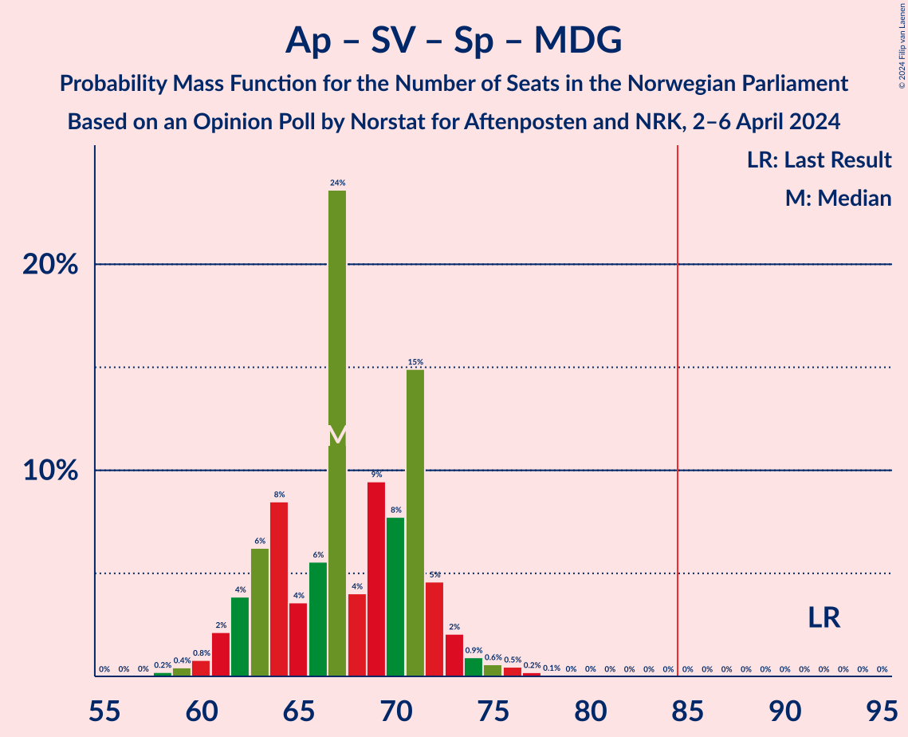

# Opinion Poll by Norstat for Aftenposten and NRK, 2–6 April 2024

<a href="#voting-intentions">Voting Intentions</a> | <a href="#seats">Seats</a> | <a href="#coalitions">Coalitions</a> | <a href="#technical-information">Technical Information</a>

## Voting Intentions

### Confidence Intervals

| Party | Last Result | Poll Result | 80% Confidence Interval | 90% Confidence Interval | 95% Confidence Interval | 99% Confidence Interval |
|:-----:|:-----------:|:-----------:|:-----------------------:|:-----------------------:|:-----------------------:|:-----------------------:|
| Høyre | 20.4% | 25.4% | 23.7–27.3% |23.2–27.8% |22.8–28.2% |22.0–29.1% |
| Fremskrittspartiet | 11.6% | 17.6% | 16.1–19.2% |15.7–19.7% |15.3–20.1% |14.6–20.9% |
| Arbeiderpartiet | 26.2% | 17.1% | 15.6–18.7% |15.2–19.1% |14.8–19.5% |14.2–20.3% |
| Sosialistisk Venstreparti | 7.6% | 10.4% | 9.2–11.7% |8.9–12.1% |8.6–12.5% |8.1–13.1% |
| Senterpartiet | 13.5% | 6.9% | 5.9–8.0% |5.7–8.3% |5.4–8.6% |5.0–9.2% |
| Rødt | 4.7% | 5.9% | 5.0–6.9% |4.8–7.2% |4.6–7.5% |4.2–8.0% |
| Venstre | 4.6% | 4.6% | 3.9–5.6% |3.7–5.9% |3.5–6.1% |3.2–6.6% |
| Kristelig Folkeparti | 3.8% | 4.1% | 3.4–5.1% |3.2–5.3% |3.1–5.6% |2.8–6.1% |
| Miljøpartiet De Grønne | 3.9% | 4.0% | 3.3–5.0% |3.1–5.2% |3.0–5.5% |2.7–5.9% |
| Industri- og Næringspartiet | 0.3% | 1.6% | 1.2–2.3% |1.1–2.5% |1.0–2.6% |0.8–3.0% |

*Note:* The poll result column reflects the actual value used in the calculations. Published results may vary slightly, and in addition be rounded to fewer digits.

## Seats

### Confidence Intervals

| Party | Last Result | Median | 80% Confidence Interval | 90% Confidence Interval | 95% Confidence Interval | 99% Confidence Interval |
|:-----:|:-----------:|:------:|:-----------------------:|:-----------------------:|:-----------------------:|:-----------------------:|
| <a href="#høyre">Høyre</a> | 36 | 43 | 42–48 |40–48 |39–49 |38–52 |
| <a href="#fremskrittspartiet">Fremskrittspartiet</a> | 21 | 34 | 30–36 |29–36 |27–37 |26–38 |
| <a href="#arbeiderpartiet">Arbeiderpartiet</a> | 48 | 32 | 31–34 |30–35 |29–35 |28–37 |
| <a href="#sosialistisk-venstreparti">Sosialistisk Venstreparti</a> | 13 | 17 | 15–20 |15–21 |15–21 |13–23 |
| <a href="#senterpartiet">Senterpartiet</a> | 28 | 11 | 10–14 |9–15 |9–16 |8–16 |
| <a href="#rødt">Rødt</a> | 8 | 9 | 8–12 |8–12 |8–13 |7–14 |
| <a href="#venstre">Venstre</a> | 8 | 8 | 7–9 |3–10 |2–10 |2–11 |
| <a href="#kristelig-folkeparti">Kristelig Folkeparti</a> | 3 | 7 | 2–8 |2–9 |2–9 |2–10 |
| <a href="#miljøpartiet-de-grønne">Miljøpartiet De Grønne</a> | 3 | 7 | 2–8 |2–9 |2–9 |1–10 |
| <a href="#industri--og-næringspartiet">Industri- og Næringspartiet</a> | 0 | 0 | 0 |0 |0 |0–2 |

### Høyre

*For a full overview of the results for this party, see the [Høyre](party-høyre.html) page.*

| Number of Seats | Probability | Accumulated | Special Marks |
|:---------------:|:-----------:|:-----------:|:-------------:|
| 36 | 0% | 100% | Last Result |
| 37 | 0.1% | 100% |  |
| 38 | 0.8% | 99.9% |  |
| 39 | 3% | 99.1% |  |
| 40 | 3% | 96% |  |
| 41 | 2% | 93% |  |
| 42 | 29% | 91% |  |
| 43 | 15% | 62% | Median |
| 44 | 4% | 47% |  |
| 45 | 7% | 43% |  |
| 46 | 14% | 36% |  |
| 47 | 6% | 22% |  |
| 48 | 11% | 16% |  |
| 49 | 3% | 5% |  |
| 50 | 0.7% | 2% |  |
| 51 | 0.3% | 1.1% |  |
| 52 | 0.6% | 0.8% |  |
| 53 | 0.1% | 0.1% |  |
| 54 | 0% | 0% |  |

### Fremskrittspartiet

*For a full overview of the results for this party, see the [Fremskrittspartiet](party-fremskrittspartiet.html) page.*

| Number of Seats | Probability | Accumulated | Special Marks |
|:---------------:|:-----------:|:-----------:|:-------------:|
| 21 | 0% | 100% | Last Result |
| 22 | 0% | 100% |  |
| 23 | 0% | 100% |  |
| 24 | 0% | 100% |  |
| 25 | 0.3% | 100% |  |
| 26 | 0.9% | 99.7% |  |
| 27 | 3% | 98.8% |  |
| 28 | 0.9% | 96% |  |
| 29 | 3% | 95% |  |
| 30 | 16% | 92% |  |
| 31 | 10% | 75% |  |
| 32 | 3% | 66% |  |
| 33 | 7% | 62% |  |
| 34 | 7% | 55% | Median |
| 35 | 14% | 49% |  |
| 36 | 33% | 35% |  |
| 37 | 2% | 3% |  |
| 38 | 0.4% | 0.5% |  |
| 39 | 0.1% | 0.1% |  |
| 40 | 0% | 0% |  |

### Arbeiderpartiet

*For a full overview of the results for this party, see the [Arbeiderpartiet](party-arbeiderpartiet.html) page.*

| Number of Seats | Probability | Accumulated | Special Marks |
|:---------------:|:-----------:|:-----------:|:-------------:|
| 26 | 0.1% | 100% |  |
| 27 | 0.4% | 99.9% |  |
| 28 | 1.0% | 99.5% |  |
| 29 | 2% | 98.5% |  |
| 30 | 6% | 96% |  |
| 31 | 8% | 91% |  |
| 32 | 55% | 83% | Median |
| 33 | 13% | 27% |  |
| 34 | 9% | 15% |  |
| 35 | 3% | 6% |  |
| 36 | 1.2% | 2% |  |
| 37 | 0.9% | 1.2% |  |
| 38 | 0.1% | 0.4% |  |
| 39 | 0.1% | 0.2% |  |
| 40 | 0.1% | 0.2% |  |
| 41 | 0% | 0% |  |
| 42 | 0% | 0% |  |
| 43 | 0% | 0% |  |
| 44 | 0% | 0% |  |
| 45 | 0% | 0% |  |
| 46 | 0% | 0% |  |
| 47 | 0% | 0% |  |
| 48 | 0% | 0% | Last Result |

### Sosialistisk Venstreparti

*For a full overview of the results for this party, see the [Sosialistisk Venstreparti](party-sosialistiskvenstreparti.html) page.*

| Number of Seats | Probability | Accumulated | Special Marks |
|:---------------:|:-----------:|:-----------:|:-------------:|
| 12 | 0.1% | 100% |  |
| 13 | 0.9% | 99.9% | Last Result |
| 14 | 1.0% | 99.0% |  |
| 15 | 9% | 98% |  |
| 16 | 15% | 89% |  |
| 17 | 33% | 74% | Median |
| 18 | 16% | 42% |  |
| 19 | 6% | 26% |  |
| 20 | 12% | 20% |  |
| 21 | 6% | 8% |  |
| 22 | 2% | 2% |  |
| 23 | 0.4% | 0.6% |  |
| 24 | 0.2% | 0.3% |  |
| 25 | 0% | 0% |  |

### Senterpartiet

*For a full overview of the results for this party, see the [Senterpartiet](party-senterpartiet.html) page.*

| Number of Seats | Probability | Accumulated | Special Marks |
|:---------------:|:-----------:|:-----------:|:-------------:|
| 7 | 0.1% | 100% |  |
| 8 | 1.1% | 99.9% |  |
| 9 | 4% | 98.8% |  |
| 10 | 34% | 95% |  |
| 11 | 16% | 61% | Median |
| 12 | 10% | 45% |  |
| 13 | 23% | 34% |  |
| 14 | 6% | 12% |  |
| 15 | 3% | 6% |  |
| 16 | 2% | 3% |  |
| 17 | 0.1% | 0.1% |  |
| 18 | 0% | 0% |  |
| 19 | 0% | 0% |  |
| 20 | 0% | 0% |  |
| 21 | 0% | 0% |  |
| 22 | 0% | 0% |  |
| 23 | 0% | 0% |  |
| 24 | 0% | 0% |  |
| 25 | 0% | 0% |  |
| 26 | 0% | 0% |  |
| 27 | 0% | 0% |  |
| 28 | 0% | 0% | Last Result |

### Rødt

*For a full overview of the results for this party, see the [Rødt](party-rødt.html) page.*

| Number of Seats | Probability | Accumulated | Special Marks |
|:---------------:|:-----------:|:-----------:|:-------------:|
| 1 | 0.2% | 100% |  |
| 2 | 0% | 99.8% |  |
| 3 | 0% | 99.8% |  |
| 4 | 0% | 99.8% |  |
| 5 | 0% | 99.8% |  |
| 6 | 0.1% | 99.8% |  |
| 7 | 2% | 99.7% |  |
| 8 | 13% | 98% | Last Result |
| 9 | 43% | 85% | Median |
| 10 | 12% | 42% |  |
| 11 | 20% | 30% |  |
| 12 | 6% | 10% |  |
| 13 | 3% | 4% |  |
| 14 | 0.8% | 1.0% |  |
| 15 | 0.2% | 0.2% |  |
| 16 | 0% | 0% |  |

### Venstre

*For a full overview of the results for this party, see the [Venstre](party-venstre.html) page.*

| Number of Seats | Probability | Accumulated | Special Marks |
|:---------------:|:-----------:|:-----------:|:-------------:|
| 2 | 4% | 100% |  |
| 3 | 4% | 96% |  |
| 4 | 0% | 93% |  |
| 5 | 0% | 93% |  |
| 6 | 2% | 93% |  |
| 7 | 33% | 91% |  |
| 8 | 27% | 58% | Last Result, Median |
| 9 | 23% | 31% |  |
| 10 | 7% | 9% |  |
| 11 | 1.2% | 1.5% |  |
| 12 | 0.3% | 0.3% |  |
| 13 | 0.1% | 0.1% |  |
| 14 | 0% | 0% |  |

### Kristelig Folkeparti

*For a full overview of the results for this party, see the [Kristelig Folkeparti](party-kristeligfolkeparti.html) page.*

| Number of Seats | Probability | Accumulated | Special Marks |
|:---------------:|:-----------:|:-----------:|:-------------:|
| 1 | 0.4% | 100% |  |
| 2 | 14% | 99.6% |  |
| 3 | 21% | 85% | Last Result |
| 4 | 0% | 64% |  |
| 5 | 0% | 64% |  |
| 6 | 0.3% | 64% |  |
| 7 | 45% | 64% | Median |
| 8 | 13% | 18% |  |
| 9 | 4% | 5% |  |
| 10 | 2% | 2% |  |
| 11 | 0.2% | 0.2% |  |
| 12 | 0% | 0% |  |

### Miljøpartiet De Grønne

*For a full overview of the results for this party, see the [Miljøpartiet De Grønne](party-miljøpartietdegrønne.html) page.*

| Number of Seats | Probability | Accumulated | Special Marks |
|:---------------:|:-----------:|:-----------:|:-------------:|
| 1 | 1.0% | 100% |  |
| 2 | 20% | 99.0% |  |
| 3 | 6% | 79% | Last Result |
| 4 | 0% | 73% |  |
| 5 | 0% | 73% |  |
| 6 | 2% | 73% |  |
| 7 | 29% | 71% | Median |
| 8 | 36% | 43% |  |
| 9 | 6% | 7% |  |
| 10 | 0.7% | 0.8% |  |
| 11 | 0.1% | 0.1% |  |
| 12 | 0% | 0% |  |

### Industri- og Næringspartiet

*For a full overview of the results for this party, see the [Industri- og Næringspartiet](party-industri-ognæringspartiet.html) page.*

| Number of Seats | Probability | Accumulated | Special Marks |
|:---------------:|:-----------:|:-----------:|:-------------:|
| 0 | 98.9% | 100% | Last Result, Median |
| 1 | 0.6% | 1.1% |  |
| 2 | 0.5% | 0.5% |  |
| 3 | 0% | 0% |  |

## Coalitions

### Confidence Intervals

| Coalition | Last Result | Median | Majority? | 80% Confidence Interval | 90% Confidence Interval | 95% Confidence Interval | 99% Confidence Interval |
|:---------:|:-----------:|:------:|:---------:|:-----------------------:|:-----------------------:|:-----------------------:|:-----------------------:|
| Høyre – Fremskrittspartiet – Senterpartiet – Venstre – Kristelig Folkeparti | 96 | 102 | 100% | 99–106 | 97–108 | 97–109 | 95–111 |
| Høyre – Fremskrittspartiet – Venstre – Kristelig Folkeparti – Miljøpartiet De Grønne | 71 | 97 | 99.8% | 92–102 | 90–103 | 89–103 | 87–106 |
| Høyre – Fremskrittspartiet – Venstre – Kristelig Folkeparti | 68 | 91 | 96% | 86–96 | 85–96 | 84–97 | 81–99 |
| Høyre – Fremskrittspartiet – Venstre | 65 | 85 | 62% | 82–90 | 80–92 | 78–93 | 74–94 |
| Arbeiderpartiet – Sosialistisk Venstreparti – Senterpartiet – Rødt – Miljøpartiet De Grønne | 100 | 77 | 2% | 72–82 | 72–83 | 71–84 | 69–87 |
| Høyre – Fremskrittspartiet | 57 | 78 | 1.0% | 73–82 | 73–83 | 71–84 | 68–85 |
| Arbeiderpartiet – Sosialistisk Venstreparti – Senterpartiet – Kristelig Folkeparti – Miljøpartiet De Grønne | 95 | 74 | 0.1% | 68–78 | 66–78 | 65–80 | 65–84 |
| Arbeiderpartiet – Sosialistisk Venstreparti – Senterpartiet – Rødt | 97 | 71 | 0% | 66–75 | 65–77 | 65–79 | 62–81 |
| Arbeiderpartiet – Sosialistisk Venstreparti – Senterpartiet – Miljøpartiet De Grønne | 92 | 67 | 0% | 63–71 | 62–72 | 61–73 | 59–76 |
| Arbeiderpartiet – Sosialistisk Venstreparti – Rødt – Miljøpartiet De Grønne | 72 | 66 | 0% | 62–69 | 60–70 | 59–71 | 57–73 |
| Arbeiderpartiet – Sosialistisk Venstreparti – Senterpartiet | 89 | 62 | 0% | 57–65 | 56–67 | 55–68 | 54–70 |
| Høyre – Venstre – Kristelig Folkeparti | 47 | 57 | 0% | 53–62 | 52–63 | 50–65 | 48–66 |
| Arbeiderpartiet – Senterpartiet – Kristelig Folkeparti – Miljøpartiet De Grønne | 82 | 56 | 0% | 50–60 | 49–60 | 47–62 | 46–64 |
| Arbeiderpartiet – Senterpartiet – Kristelig Folkeparti | 79 | 49 | 0% | 46–53 | 45–54 | 43–56 | 43–58 |
| Arbeiderpartiet – Sosialistisk Venstreparti | 61 | 50 | 0% | 47–53 | 46–54 | 45–55 | 43–57 |
| Arbeiderpartiet – Senterpartiet | 76 | 43 | 0% | 42–47 | 40–47 | 40–48 | 39–51 |
| Senterpartiet – Venstre – Kristelig Folkeparti | 39 | 24 | 0% | 22–29 | 21–30 | 19–31 | 17–33 |

### Høyre – Fremskrittspartiet – Senterpartiet – Venstre – Kristelig Folkeparti

| Number of Seats | Probability | Accumulated | Special Marks |
|:---------------:|:-----------:|:-----------:|:-------------:|
| 92 | 0% | 100% |  |
| 93 | 0.2% | 99.9% |  |
| 94 | 0.2% | 99.8% |  |
| 95 | 0.5% | 99.5% |  |
| 96 | 1.1% | 99.0% | Last Result |
| 97 | 3% | 98% |  |
| 98 | 2% | 95% |  |
| 99 | 10% | 93% |  |
| 100 | 12% | 83% |  |
| 101 | 7% | 70% |  |
| 102 | 27% | 64% |  |
| 103 | 8% | 37% | Median |
| 104 | 5% | 29% |  |
| 105 | 9% | 25% |  |
| 106 | 7% | 16% |  |
| 107 | 3% | 9% |  |
| 108 | 3% | 5% |  |
| 109 | 0.7% | 3% |  |
| 110 | 1.0% | 2% |  |
| 111 | 0.8% | 1.2% |  |
| 112 | 0.3% | 0.4% |  |
| 113 | 0.1% | 0.1% |  |
| 114 | 0% | 0% |  |

### Høyre – Fremskrittspartiet – Venstre – Kristelig Folkeparti – Miljøpartiet De Grønne

| Number of Seats | Probability | Accumulated | Special Marks |
|:---------------:|:-----------:|:-----------:|:-------------:|
| 71 | 0% | 100% | Last Result |
| 72 | 0% | 100% |  |
| 73 | 0% | 100% |  |
| 74 | 0% | 100% |  |
| 75 | 0% | 100% |  |
| 76 | 0% | 100% |  |
| 77 | 0% | 100% |  |
| 78 | 0% | 100% |  |
| 79 | 0% | 100% |  |
| 80 | 0% | 100% |  |
| 81 | 0% | 100% |  |
| 82 | 0% | 100% |  |
| 83 | 0% | 100% |  |
| 84 | 0.1% | 100% |  |
| 85 | 0.1% | 99.8% | Majority |
| 86 | 0.1% | 99.8% |  |
| 87 | 1.0% | 99.7% |  |
| 88 | 0.7% | 98.7% |  |
| 89 | 2% | 98% |  |
| 90 | 0.7% | 96% |  |
| 91 | 2% | 95% |  |
| 92 | 2% | 92% |  |
| 93 | 5% | 90% |  |
| 94 | 9% | 85% |  |
| 95 | 10% | 76% |  |
| 96 | 9% | 66% |  |
| 97 | 17% | 57% |  |
| 98 | 5% | 40% |  |
| 99 | 3% | 35% | Median |
| 100 | 19% | 32% |  |
| 101 | 1.3% | 13% |  |
| 102 | 5% | 12% |  |
| 103 | 5% | 6% |  |
| 104 | 0.1% | 2% |  |
| 105 | 0.8% | 1.5% |  |
| 106 | 0.6% | 0.7% |  |
| 107 | 0.1% | 0.1% |  |
| 108 | 0.1% | 0.1% |  |
| 109 | 0% | 0% |  |

### Høyre – Fremskrittspartiet – Venstre – Kristelig Folkeparti

| Number of Seats | Probability | Accumulated | Special Marks |
|:---------------:|:-----------:|:-----------:|:-------------:|
| 68 | 0% | 100% | Last Result |
| 69 | 0% | 100% |  |
| 70 | 0% | 100% |  |
| 71 | 0% | 100% |  |
| 72 | 0% | 100% |  |
| 73 | 0% | 100% |  |
| 74 | 0% | 100% |  |
| 75 | 0% | 100% |  |
| 76 | 0% | 100% |  |
| 77 | 0% | 100% |  |
| 78 | 0% | 100% |  |
| 79 | 0% | 100% |  |
| 80 | 0% | 99.9% |  |
| 81 | 0.6% | 99.9% |  |
| 82 | 0.3% | 99.2% |  |
| 83 | 1.5% | 99.0% |  |
| 84 | 1.3% | 98% |  |
| 85 | 2% | 96% | Majority |
| 86 | 8% | 94% |  |
| 87 | 7% | 87% |  |
| 88 | 7% | 80% |  |
| 89 | 13% | 73% |  |
| 90 | 5% | 59% |  |
| 91 | 5% | 54% |  |
| 92 | 21% | 49% | Median |
| 93 | 6% | 28% |  |
| 94 | 2% | 21% |  |
| 95 | 9% | 19% |  |
| 96 | 5% | 10% |  |
| 97 | 3% | 5% |  |
| 98 | 1.2% | 2% |  |
| 99 | 0.6% | 1.0% |  |
| 100 | 0.2% | 0.4% |  |
| 101 | 0.2% | 0.2% |  |
| 102 | 0% | 0% |  |

### Høyre – Fremskrittspartiet – Venstre

| Number of Seats | Probability | Accumulated | Special Marks |
|:---------------:|:-----------:|:-----------:|:-------------:|
| 65 | 0% | 100% | Last Result |
| 66 | 0% | 100% |  |
| 67 | 0% | 100% |  |
| 68 | 0% | 100% |  |
| 69 | 0% | 100% |  |
| 70 | 0% | 100% |  |
| 71 | 0% | 100% |  |
| 72 | 0% | 100% |  |
| 73 | 0.3% | 99.9% |  |
| 74 | 0.2% | 99.7% |  |
| 75 | 0.2% | 99.4% |  |
| 76 | 1.2% | 99.3% |  |
| 77 | 0.5% | 98% |  |
| 78 | 0.8% | 98% |  |
| 79 | 2% | 97% |  |
| 80 | 1.2% | 95% |  |
| 81 | 3% | 94% |  |
| 82 | 13% | 91% |  |
| 83 | 6% | 78% |  |
| 84 | 10% | 72% |  |
| 85 | 30% | 62% | Median, Majority |
| 86 | 4% | 31% |  |
| 87 | 4% | 27% |  |
| 88 | 9% | 24% |  |
| 89 | 3% | 14% |  |
| 90 | 4% | 12% |  |
| 91 | 2% | 8% |  |
| 92 | 2% | 5% |  |
| 93 | 3% | 4% |  |
| 94 | 0.4% | 0.6% |  |
| 95 | 0.2% | 0.2% |  |
| 96 | 0.1% | 0.1% |  |
| 97 | 0% | 0% |  |

### Arbeiderpartiet – Sosialistisk Venstreparti – Senterpartiet – Rødt – Miljøpartiet De Grønne

| Number of Seats | Probability | Accumulated | Special Marks |
|:---------------:|:-----------:|:-----------:|:-------------:|
| 67 | 0.2% | 100% |  |
| 68 | 0.2% | 99.8% |  |
| 69 | 0.6% | 99.6% |  |
| 70 | 1.3% | 99.0% |  |
| 71 | 3% | 98% |  |
| 72 | 5% | 95% |  |
| 73 | 9% | 90% |  |
| 74 | 2% | 80% |  |
| 75 | 6% | 78% |  |
| 76 | 21% | 72% | Median |
| 77 | 5% | 51% |  |
| 78 | 6% | 46% |  |
| 79 | 13% | 40% |  |
| 80 | 7% | 27% |  |
| 81 | 7% | 20% |  |
| 82 | 8% | 13% |  |
| 83 | 2% | 5% |  |
| 84 | 1.3% | 4% |  |
| 85 | 1.4% | 2% | Majority |
| 86 | 0.2% | 0.9% |  |
| 87 | 0.6% | 0.7% |  |
| 88 | 0% | 0.1% |  |
| 89 | 0% | 0.1% |  |
| 90 | 0% | 0% |  |
| 91 | 0% | 0% |  |
| 92 | 0% | 0% |  |
| 93 | 0% | 0% |  |
| 94 | 0% | 0% |  |
| 95 | 0% | 0% |  |
| 96 | 0% | 0% |  |
| 97 | 0% | 0% |  |
| 98 | 0% | 0% |  |
| 99 | 0% | 0% |  |
| 100 | 0% | 0% | Last Result |

### Høyre – Fremskrittspartiet

| Number of Seats | Probability | Accumulated | Special Marks |
|:---------------:|:-----------:|:-----------:|:-------------:|
| 57 | 0% | 100% | Last Result |
| 58 | 0% | 100% |  |
| 59 | 0% | 100% |  |
| 60 | 0% | 100% |  |
| 61 | 0% | 100% |  |
| 62 | 0% | 100% |  |
| 63 | 0% | 100% |  |
| 64 | 0% | 100% |  |
| 65 | 0% | 100% |  |
| 66 | 0.1% | 100% |  |
| 67 | 0.3% | 99.9% |  |
| 68 | 0.8% | 99.5% |  |
| 69 | 0.3% | 98.8% |  |
| 70 | 0.8% | 98% |  |
| 71 | 0.9% | 98% |  |
| 72 | 2% | 97% |  |
| 73 | 7% | 95% |  |
| 74 | 8% | 88% |  |
| 75 | 7% | 80% |  |
| 76 | 11% | 73% |  |
| 77 | 5% | 62% | Median |
| 78 | 30% | 57% |  |
| 79 | 3% | 26% |  |
| 80 | 4% | 23% |  |
| 81 | 8% | 20% |  |
| 82 | 4% | 12% |  |
| 83 | 3% | 8% |  |
| 84 | 4% | 5% |  |
| 85 | 0.7% | 1.0% | Majority |
| 86 | 0.1% | 0.3% |  |
| 87 | 0.1% | 0.2% |  |
| 88 | 0% | 0.1% |  |
| 89 | 0% | 0% |  |

### Arbeiderpartiet – Sosialistisk Venstreparti – Senterpartiet – Kristelig Folkeparti – Miljøpartiet De Grønne

| Number of Seats | Probability | Accumulated | Special Marks |
|:---------------:|:-----------:|:-----------:|:-------------:|
| 62 | 0% | 100% |  |
| 63 | 0.1% | 99.9% |  |
| 64 | 0.3% | 99.8% |  |
| 65 | 3% | 99.5% |  |
| 66 | 3% | 96% |  |
| 67 | 1.2% | 94% |  |
| 68 | 2% | 92% |  |
| 69 | 5% | 90% |  |
| 70 | 4% | 85% |  |
| 71 | 9% | 82% |  |
| 72 | 7% | 72% |  |
| 73 | 11% | 65% |  |
| 74 | 26% | 53% | Median |
| 75 | 6% | 28% |  |
| 76 | 4% | 22% |  |
| 77 | 6% | 18% |  |
| 78 | 8% | 12% |  |
| 79 | 0.9% | 4% |  |
| 80 | 1.3% | 3% |  |
| 81 | 0.5% | 2% |  |
| 82 | 0.4% | 1.2% |  |
| 83 | 0.2% | 0.8% |  |
| 84 | 0.5% | 0.6% |  |
| 85 | 0.1% | 0.1% | Majority |
| 86 | 0% | 0% |  |
| 87 | 0% | 0% |  |
| 88 | 0% | 0% |  |
| 89 | 0% | 0% |  |
| 90 | 0% | 0% |  |
| 91 | 0% | 0% |  |
| 92 | 0% | 0% |  |
| 93 | 0% | 0% |  |
| 94 | 0% | 0% |  |
| 95 | 0% | 0% | Last Result |

### Arbeiderpartiet – Sosialistisk Venstreparti – Senterpartiet – Rødt

| Number of Seats | Probability | Accumulated | Special Marks |
|:---------------:|:-----------:|:-----------:|:-------------:|
| 60 | 0.1% | 100% |  |
| 61 | 0.1% | 99.9% |  |
| 62 | 0.6% | 99.9% |  |
| 63 | 0.8% | 99.3% |  |
| 64 | 0.1% | 98% |  |
| 65 | 5% | 98% |  |
| 66 | 5% | 94% |  |
| 67 | 1.4% | 88% |  |
| 68 | 19% | 87% |  |
| 69 | 4% | 68% | Median |
| 70 | 4% | 64% |  |
| 71 | 17% | 60% |  |
| 72 | 9% | 43% |  |
| 73 | 10% | 34% |  |
| 74 | 9% | 24% |  |
| 75 | 5% | 15% |  |
| 76 | 2% | 10% |  |
| 77 | 2% | 7% |  |
| 78 | 0.6% | 5% |  |
| 79 | 2% | 4% |  |
| 80 | 0.7% | 2% |  |
| 81 | 0.9% | 1.2% |  |
| 82 | 0.1% | 0.3% |  |
| 83 | 0% | 0.2% |  |
| 84 | 0.1% | 0.1% |  |
| 85 | 0% | 0% | Majority |
| 86 | 0% | 0% |  |
| 87 | 0% | 0% |  |
| 88 | 0% | 0% |  |
| 89 | 0% | 0% |  |
| 90 | 0% | 0% |  |
| 91 | 0% | 0% |  |
| 92 | 0% | 0% |  |
| 93 | 0% | 0% |  |
| 94 | 0% | 0% |  |
| 95 | 0% | 0% |  |
| 96 | 0% | 0% |  |
| 97 | 0% | 0% | Last Result |

### Arbeiderpartiet – Sosialistisk Venstreparti – Senterpartiet – Miljøpartiet De Grønne

| Number of Seats | Probability | Accumulated | Special Marks |
|:---------------:|:-----------:|:-----------:|:-------------:|
| 58 | 0.2% | 100% |  |
| 59 | 0.4% | 99.8% |  |
| 60 | 0.8% | 99.3% |  |
| 61 | 2% | 98.5% |  |
| 62 | 4% | 96% |  |
| 63 | 6% | 93% |  |
| 64 | 8% | 86% |  |
| 65 | 4% | 78% |  |
| 66 | 6% | 74% |  |
| 67 | 24% | 69% | Median |
| 68 | 4% | 45% |  |
| 69 | 9% | 41% |  |
| 70 | 8% | 32% |  |
| 71 | 15% | 24% |  |
| 72 | 5% | 9% |  |
| 73 | 2% | 4% |  |
| 74 | 0.9% | 2% |  |
| 75 | 0.6% | 1.3% |  |
| 76 | 0.5% | 0.8% |  |
| 77 | 0.2% | 0.3% |  |
| 78 | 0.1% | 0.1% |  |
| 79 | 0% | 0% |  |
| 80 | 0% | 0% |  |
| 81 | 0% | 0% |  |
| 82 | 0% | 0% |  |
| 83 | 0% | 0% |  |
| 84 | 0% | 0% |  |
| 85 | 0% | 0% | Majority |
| 86 | 0% | 0% |  |
| 87 | 0% | 0% |  |
| 88 | 0% | 0% |  |
| 89 | 0% | 0% |  |
| 90 | 0% | 0% |  |
| 91 | 0% | 0% |  |
| 92 | 0% | 0% | Last Result |

### Arbeiderpartiet – Sosialistisk Venstreparti – Rødt – Miljøpartiet De Grønne

| Number of Seats | Probability | Accumulated | Special Marks |
|:---------------:|:-----------:|:-----------:|:-------------:|
| 55 | 0.1% | 100% |  |
| 56 | 0.3% | 99.9% |  |
| 57 | 0.8% | 99.6% |  |
| 58 | 1.0% | 98.8% |  |
| 59 | 0.7% | 98% |  |
| 60 | 3% | 97% |  |
| 61 | 3% | 94% |  |
| 62 | 7% | 91% |  |
| 63 | 9% | 84% |  |
| 64 | 4% | 75% |  |
| 65 | 8% | 71% | Median |
| 66 | 26% | 63% |  |
| 67 | 6% | 36% |  |
| 68 | 12% | 30% |  |
| 69 | 10% | 17% |  |
| 70 | 2% | 7% |  |
| 71 | 3% | 5% |  |
| 72 | 1.1% | 2% | Last Result |
| 73 | 0.5% | 0.9% |  |
| 74 | 0.2% | 0.4% |  |
| 75 | 0.1% | 0.2% |  |
| 76 | 0% | 0.1% |  |
| 77 | 0% | 0% |  |

### Arbeiderpartiet – Sosialistisk Venstreparti – Senterpartiet

| Number of Seats | Probability | Accumulated | Special Marks |
|:---------------:|:-----------:|:-----------:|:-------------:|
| 52 | 0.1% | 100% |  |
| 53 | 0.4% | 99.9% |  |
| 54 | 0.4% | 99.5% |  |
| 55 | 2% | 99.2% |  |
| 56 | 3% | 97% |  |
| 57 | 6% | 94% |  |
| 58 | 2% | 88% |  |
| 59 | 21% | 86% |  |
| 60 | 7% | 65% | Median |
| 61 | 6% | 59% |  |
| 62 | 10% | 53% |  |
| 63 | 24% | 43% |  |
| 64 | 6% | 18% |  |
| 65 | 3% | 12% |  |
| 66 | 3% | 9% |  |
| 67 | 3% | 6% |  |
| 68 | 2% | 3% |  |
| 69 | 0.8% | 1.4% |  |
| 70 | 0.3% | 0.6% |  |
| 71 | 0.1% | 0.3% |  |
| 72 | 0.1% | 0.2% |  |
| 73 | 0.1% | 0.1% |  |
| 74 | 0% | 0% |  |
| 75 | 0% | 0% |  |
| 76 | 0% | 0% |  |
| 77 | 0% | 0% |  |
| 78 | 0% | 0% |  |
| 79 | 0% | 0% |  |
| 80 | 0% | 0% |  |
| 81 | 0% | 0% |  |
| 82 | 0% | 0% |  |
| 83 | 0% | 0% |  |
| 84 | 0% | 0% |  |
| 85 | 0% | 0% | Majority |
| 86 | 0% | 0% |  |
| 87 | 0% | 0% |  |
| 88 | 0% | 0% |  |
| 89 | 0% | 0% | Last Result |

### Høyre – Venstre – Kristelig Folkeparti

| Number of Seats | Probability | Accumulated | Special Marks |
|:---------------:|:-----------:|:-----------:|:-------------:|
| 47 | 0.1% | 100% | Last Result |
| 48 | 0.5% | 99.9% |  |
| 49 | 0.2% | 99.4% |  |
| 50 | 2% | 99.2% |  |
| 51 | 0.5% | 97% |  |
| 52 | 6% | 97% |  |
| 53 | 3% | 90% |  |
| 54 | 3% | 87% |  |
| 55 | 3% | 84% |  |
| 56 | 26% | 81% |  |
| 57 | 6% | 54% |  |
| 58 | 12% | 48% | Median |
| 59 | 10% | 36% |  |
| 60 | 8% | 26% |  |
| 61 | 5% | 18% |  |
| 62 | 4% | 13% |  |
| 63 | 5% | 9% |  |
| 64 | 1.2% | 4% |  |
| 65 | 2% | 3% |  |
| 66 | 0.5% | 0.7% |  |
| 67 | 0.1% | 0.2% |  |
| 68 | 0% | 0% |  |

### Arbeiderpartiet – Senterpartiet – Kristelig Folkeparti – Miljøpartiet De Grønne

| Number of Seats | Probability | Accumulated | Special Marks |
|:---------------:|:-----------:|:-----------:|:-------------:|
| 44 | 0.1% | 100% |  |
| 45 | 0.2% | 99.9% |  |
| 46 | 0.7% | 99.7% |  |
| 47 | 2% | 99.0% |  |
| 48 | 1.4% | 97% |  |
| 49 | 3% | 96% |  |
| 50 | 3% | 92% |  |
| 51 | 4% | 90% |  |
| 52 | 6% | 86% |  |
| 53 | 5% | 80% |  |
| 54 | 4% | 75% |  |
| 55 | 4% | 71% |  |
| 56 | 21% | 67% |  |
| 57 | 26% | 46% | Median |
| 58 | 3% | 20% |  |
| 59 | 5% | 17% |  |
| 60 | 8% | 12% |  |
| 61 | 1.1% | 4% |  |
| 62 | 2% | 3% |  |
| 63 | 0.6% | 1.5% |  |
| 64 | 0.6% | 0.9% |  |
| 65 | 0.1% | 0.3% |  |
| 66 | 0.1% | 0.1% |  |
| 67 | 0.1% | 0.1% |  |
| 68 | 0% | 0% |  |
| 69 | 0% | 0% |  |
| 70 | 0% | 0% |  |
| 71 | 0% | 0% |  |
| 72 | 0% | 0% |  |
| 73 | 0% | 0% |  |
| 74 | 0% | 0% |  |
| 75 | 0% | 0% |  |
| 76 | 0% | 0% |  |
| 77 | 0% | 0% |  |
| 78 | 0% | 0% |  |
| 79 | 0% | 0% |  |
| 80 | 0% | 0% |  |
| 81 | 0% | 0% |  |
| 82 | 0% | 0% | Last Result |

### Arbeiderpartiet – Senterpartiet – Kristelig Folkeparti

| Number of Seats | Probability | Accumulated | Special Marks |
|:---------------:|:-----------:|:-----------:|:-------------:|
| 41 | 0% | 100% |  |
| 42 | 0.2% | 99.9% |  |
| 43 | 2% | 99.7% |  |
| 44 | 2% | 97% |  |
| 45 | 4% | 96% |  |
| 46 | 3% | 92% |  |
| 47 | 11% | 89% |  |
| 48 | 7% | 78% |  |
| 49 | 32% | 72% |  |
| 50 | 13% | 40% | Median |
| 51 | 4% | 26% |  |
| 52 | 11% | 22% |  |
| 53 | 4% | 11% |  |
| 54 | 3% | 7% |  |
| 55 | 1.0% | 4% |  |
| 56 | 1.1% | 3% |  |
| 57 | 1.3% | 2% |  |
| 58 | 0.3% | 0.6% |  |
| 59 | 0.2% | 0.3% |  |
| 60 | 0.1% | 0.1% |  |
| 61 | 0% | 0% |  |
| 62 | 0% | 0% |  |
| 63 | 0% | 0% |  |
| 64 | 0% | 0% |  |
| 65 | 0% | 0% |  |
| 66 | 0% | 0% |  |
| 67 | 0% | 0% |  |
| 68 | 0% | 0% |  |
| 69 | 0% | 0% |  |
| 70 | 0% | 0% |  |
| 71 | 0% | 0% |  |
| 72 | 0% | 0% |  |
| 73 | 0% | 0% |  |
| 74 | 0% | 0% |  |
| 75 | 0% | 0% |  |
| 76 | 0% | 0% |  |
| 77 | 0% | 0% |  |
| 78 | 0% | 0% |  |
| 79 | 0% | 0% | Last Result |

### Arbeiderpartiet – Sosialistisk Venstreparti

| Number of Seats | Probability | Accumulated | Special Marks |
|:---------------:|:-----------:|:-----------:|:-------------:|
| 42 | 0.1% | 100% |  |
| 43 | 0.4% | 99.9% |  |
| 44 | 0.7% | 99.5% |  |
| 45 | 2% | 98.8% |  |
| 46 | 4% | 97% |  |
| 47 | 9% | 93% |  |
| 48 | 7% | 84% |  |
| 49 | 26% | 77% | Median |
| 50 | 22% | 51% |  |
| 51 | 6% | 29% |  |
| 52 | 9% | 23% |  |
| 53 | 8% | 15% |  |
| 54 | 4% | 6% |  |
| 55 | 0.9% | 3% |  |
| 56 | 1.3% | 2% |  |
| 57 | 0.3% | 0.6% |  |
| 58 | 0.2% | 0.3% |  |
| 59 | 0.1% | 0.2% |  |
| 60 | 0% | 0.1% |  |
| 61 | 0% | 0% | Last Result |

### Arbeiderpartiet – Senterpartiet

| Number of Seats | Probability | Accumulated | Special Marks |
|:---------------:|:-----------:|:-----------:|:-------------:|
| 37 | 0.1% | 100% |  |
| 38 | 0.2% | 99.9% |  |
| 39 | 1.1% | 99.7% |  |
| 40 | 5% | 98.6% |  |
| 41 | 3% | 94% |  |
| 42 | 32% | 91% |  |
| 43 | 9% | 58% | Median |
| 44 | 10% | 50% |  |
| 45 | 15% | 40% |  |
| 46 | 14% | 25% |  |
| 47 | 8% | 11% |  |
| 48 | 2% | 4% |  |
| 49 | 0.9% | 2% |  |
| 50 | 0.3% | 0.9% |  |
| 51 | 0.5% | 0.7% |  |
| 52 | 0.1% | 0.1% |  |
| 53 | 0% | 0% |  |
| 54 | 0% | 0% |  |
| 55 | 0% | 0% |  |
| 56 | 0% | 0% |  |
| 57 | 0% | 0% |  |
| 58 | 0% | 0% |  |
| 59 | 0% | 0% |  |
| 60 | 0% | 0% |  |
| 61 | 0% | 0% |  |
| 62 | 0% | 0% |  |
| 63 | 0% | 0% |  |
| 64 | 0% | 0% |  |
| 65 | 0% | 0% |  |
| 66 | 0% | 0% |  |
| 67 | 0% | 0% |  |
| 68 | 0% | 0% |  |
| 69 | 0% | 0% |  |
| 70 | 0% | 0% |  |
| 71 | 0% | 0% |  |
| 72 | 0% | 0% |  |
| 73 | 0% | 0% |  |
| 74 | 0% | 0% |  |
| 75 | 0% | 0% |  |
| 76 | 0% | 0% | Last Result |

### Senterpartiet – Venstre – Kristelig Folkeparti

| Number of Seats | Probability | Accumulated | Special Marks |
|:---------------:|:-----------:|:-----------:|:-------------:|
| 15 | 0.2% | 100% |  |
| 16 | 0.3% | 99.8% |  |
| 17 | 1.0% | 99.5% |  |
| 18 | 0.6% | 98.5% |  |
| 19 | 0.6% | 98% |  |
| 20 | 0.7% | 97% |  |
| 21 | 3% | 97% |  |
| 22 | 12% | 94% |  |
| 23 | 11% | 82% |  |
| 24 | 31% | 71% |  |
| 25 | 5% | 39% |  |
| 26 | 4% | 35% | Median |
| 27 | 10% | 31% |  |
| 28 | 10% | 20% |  |
| 29 | 3% | 10% |  |
| 30 | 3% | 7% |  |
| 31 | 2% | 4% |  |
| 32 | 1.3% | 2% |  |
| 33 | 1.0% | 1.2% |  |
| 34 | 0.1% | 0.2% |  |
| 35 | 0.1% | 0.1% |  |
| 36 | 0% | 0% |  |
| 37 | 0% | 0% |  |
| 38 | 0% | 0% |  |
| 39 | 0% | 0% | Last Result |

## Technical Information

### Opinion Poll

+ **Polling firm:** Norstat
+ **Commissioner(s):** Aftenposten and NRK
+ **Fieldwork period:** 2–6 April 2024

### Calculations

+ **Sample size:** 991
+ **Simulations done:** 1,048,576
+ **Error estimate:** 1.80%

