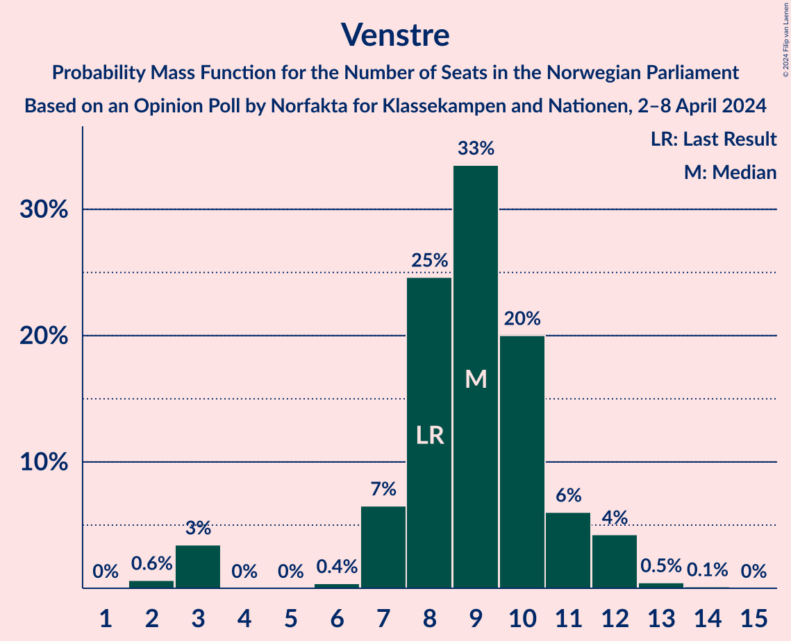
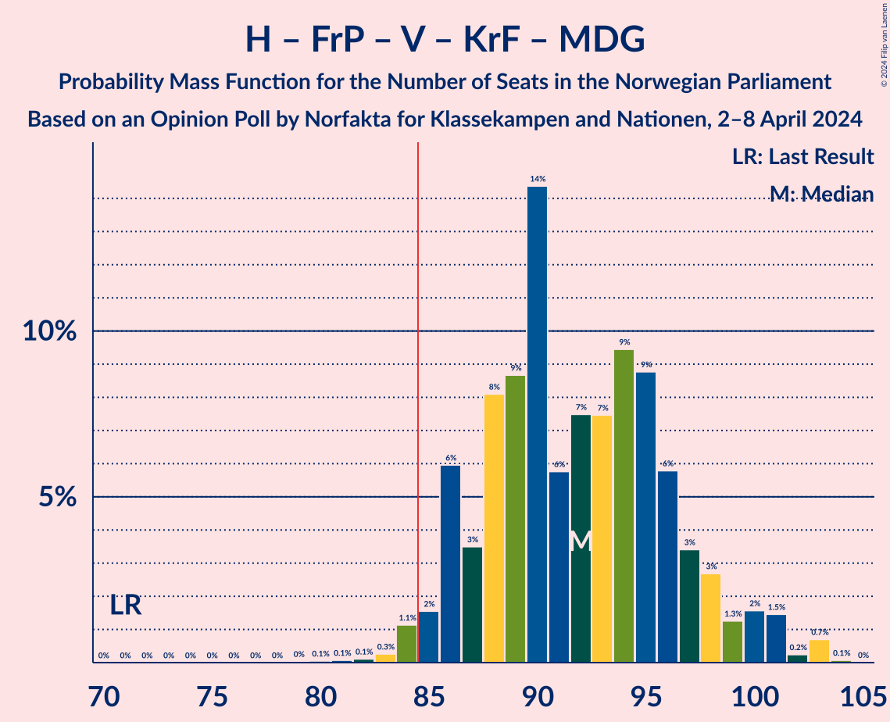

# Opinion Poll by Norfakta for Klassekampen and Nationen, 2–8 April 2024

<a href="#voting-intentions">Voting Intentions</a> | <a href="#seats">Seats</a> | <a href="#coalitions">Coalitions</a> | <a href="#technical-information">Technical Information</a>

## Voting Intentions

### Confidence Intervals

| Party | Last Result | Poll Result | 80% Confidence Interval | 90% Confidence Interval | 95% Confidence Interval | 99% Confidence Interval |
|:-----:|:-----------:|:-----------:|:-----------------------:|:-----------------------:|:-----------------------:|:-----------------------:|
| Høyre | 20.4% | 28.2% | 26.4–30.1% |26.0–30.7% |25.5–31.1% |24.7–32.0% |
| Arbeiderpartiet | 26.2% | 21.0% | 19.4–22.8% |19.0–23.2% |18.6–23.7% |17.9–24.5% |
| Fremskrittspartiet | 11.6% | 13.0% | 11.7–14.5% |11.4–14.9% |11.1–15.3% |10.5–16.0% |
| Sosialistisk Venstreparti | 7.6% | 10.6% | 9.4–12.0% |9.1–12.3% |8.8–12.7% |8.3–13.4% |
| Senterpartiet | 13.5% | 5.5% | 4.7–6.6% |4.5–6.8% |4.3–7.1% |3.9–7.6% |
| Venstre | 4.6% | 5.2% | 4.4–6.2% |4.2–6.5% |4.0–6.8% |3.6–7.3% |
| Rødt | 4.7% | 4.9% | 4.1–5.9% |3.9–6.2% |3.7–6.4% |3.4–6.9% |
| Kristelig Folkeparti | 3.8% | 4.4% | 3.7–5.4% |3.5–5.6% |3.3–5.9% |3.0–6.4% |
| Miljøpartiet De Grønne | 3.9% | 3.6% | 2.9–4.5% |2.8–4.7% |2.6–5.0% |2.3–5.4% |
| Industri- og Næringspartiet | 0.3% | 1.1% | 0.8–1.7% |0.7–1.8% |0.6–2.0% |0.5–2.3% |

*Note:* The poll result column reflects the actual value used in the calculations. Published results may vary slightly, and in addition be rounded to fewer digits.

## Seats

### Confidence Intervals

| Party | Last Result | Median | 80% Confidence Interval | 90% Confidence Interval | 95% Confidence Interval | 99% Confidence Interval |
|:-----:|:-----------:|:------:|:-----------------------:|:-----------------------:|:-----------------------:|:-----------------------:|
| <a href="#høyre">Høyre</a> | 36 | 49 | 46–53 |45–54 |44–56 |42–57 |
| <a href="#arbeiderpartiet">Arbeiderpartiet</a> | 48 | 42 | 37–45 |35–45 |35–47 |33–48 |
| <a href="#fremskrittspartiet">Fremskrittspartiet</a> | 21 | 23 | 20–26 |19–28 |18–28 |18–30 |
| <a href="#sosialistisk-venstreparti">Sosialistisk Venstreparti</a> | 13 | 18 | 16–20 |15–21 |15–22 |13–24 |
| <a href="#senterpartiet">Senterpartiet</a> | 28 | 9 | 8–11 |7–12 |7–13 |1–13 |
| <a href="#venstre">Venstre</a> | 8 | 9 | 7–11 |7–11 |3–12 |2–13 |
| <a href="#rødt">Rødt</a> | 8 | 8 | 1–10 |1–11 |1–12 |1–12 |
| <a href="#kristelig-folkeparti">Kristelig Folkeparti</a> | 3 | 7 | 3–9 |2–9 |2–10 |2–11 |
| <a href="#miljøpartiet-de-grønne">Miljøpartiet De Grønne</a> | 3 | 2 | 1–7 |1–8 |1–8 |1–9 |
| <a href="#industri--og-næringspartiet">Industri- og Næringspartiet</a> | 0 | 0 | 0 |0 |0 |0 |

### Høyre

*For a full overview of the results for this party, see the [Høyre](party-høyre.html) page.*

| Number of Seats | Probability | Accumulated | Special Marks |
|:---------------:|:-----------:|:-----------:|:-------------:|
| 36 | 0% | 100% | Last Result |
| 37 | 0% | 100% |  |
| 38 | 0% | 100% |  |
| 39 | 0% | 100% |  |
| 40 | 0% | 100% |  |
| 41 | 0.1% | 100% |  |
| 42 | 0.3% | 99.8% |  |
| 43 | 2% | 99.5% |  |
| 44 | 0.9% | 98% |  |
| 45 | 4% | 97% |  |
| 46 | 4% | 93% |  |
| 47 | 15% | 89% |  |
| 48 | 9% | 74% |  |
| 49 | 24% | 65% | Median |
| 50 | 9% | 41% |  |
| 51 | 11% | 32% |  |
| 52 | 10% | 22% |  |
| 53 | 6% | 12% |  |
| 54 | 2% | 6% |  |
| 55 | 1.1% | 4% |  |
| 56 | 1.1% | 3% |  |
| 57 | 1.2% | 2% |  |
| 58 | 0.2% | 0.5% |  |
| 59 | 0.2% | 0.3% |  |
| 60 | 0.1% | 0.1% |  |
| 61 | 0% | 0% |  |

### Arbeiderpartiet

*For a full overview of the results for this party, see the [Arbeiderpartiet](party-arbeiderpartiet.html) page.*

| Number of Seats | Probability | Accumulated | Special Marks |
|:---------------:|:-----------:|:-----------:|:-------------:|
| 32 | 0.2% | 100% |  |
| 33 | 0.6% | 99.8% |  |
| 34 | 1.4% | 99.2% |  |
| 35 | 4% | 98% |  |
| 36 | 2% | 94% |  |
| 37 | 8% | 92% |  |
| 38 | 12% | 84% |  |
| 39 | 9% | 72% |  |
| 40 | 6% | 63% |  |
| 41 | 6% | 57% |  |
| 42 | 15% | 51% | Median |
| 43 | 20% | 37% |  |
| 44 | 7% | 17% |  |
| 45 | 6% | 10% |  |
| 46 | 0.7% | 4% |  |
| 47 | 2% | 3% |  |
| 48 | 0.7% | 1.0% | Last Result |
| 49 | 0.2% | 0.3% |  |
| 50 | 0% | 0.1% |  |
| 51 | 0.1% | 0.1% |  |
| 52 | 0% | 0% |  |

### Fremskrittspartiet

*For a full overview of the results for this party, see the [Fremskrittspartiet](party-fremskrittspartiet.html) page.*

| Number of Seats | Probability | Accumulated | Special Marks |
|:---------------:|:-----------:|:-----------:|:-------------:|
| 17 | 0.4% | 100% |  |
| 18 | 4% | 99.6% |  |
| 19 | 3% | 96% |  |
| 20 | 9% | 93% |  |
| 21 | 18% | 85% | Last Result |
| 22 | 12% | 66% |  |
| 23 | 16% | 54% | Median |
| 24 | 10% | 39% |  |
| 25 | 12% | 29% |  |
| 26 | 7% | 17% |  |
| 27 | 5% | 10% |  |
| 28 | 3% | 5% |  |
| 29 | 0.7% | 2% |  |
| 30 | 1.3% | 2% |  |
| 31 | 0.4% | 0.5% |  |
| 32 | 0.1% | 0.1% |  |
| 33 | 0% | 0.1% |  |
| 34 | 0% | 0% |  |

### Sosialistisk Venstreparti

*For a full overview of the results for this party, see the [Sosialistisk Venstreparti](party-sosialistiskvenstreparti.html) page.*

| Number of Seats | Probability | Accumulated | Special Marks |
|:---------------:|:-----------:|:-----------:|:-------------:|
| 12 | 0.5% | 100% |  |
| 13 | 0.3% | 99.5% | Last Result |
| 14 | 1.3% | 99.2% |  |
| 15 | 7% | 98% |  |
| 16 | 16% | 91% |  |
| 17 | 14% | 74% |  |
| 18 | 16% | 61% | Median |
| 19 | 22% | 45% |  |
| 20 | 13% | 23% |  |
| 21 | 5% | 9% |  |
| 22 | 3% | 4% |  |
| 23 | 1.0% | 1.5% |  |
| 24 | 0.4% | 0.5% |  |
| 25 | 0% | 0.1% |  |
| 26 | 0% | 0.1% |  |
| 27 | 0% | 0% |  |

### Senterpartiet

*For a full overview of the results for this party, see the [Senterpartiet](party-senterpartiet.html) page.*

| Number of Seats | Probability | Accumulated | Special Marks |
|:---------------:|:-----------:|:-----------:|:-------------:|
| 0 | 0.3% | 100% |  |
| 1 | 1.0% | 99.7% |  |
| 2 | 0.1% | 98.7% |  |
| 3 | 0.2% | 98.6% |  |
| 4 | 0% | 98% |  |
| 5 | 0% | 98% |  |
| 6 | 0.2% | 98% |  |
| 7 | 8% | 98% |  |
| 8 | 14% | 91% |  |
| 9 | 32% | 77% | Median |
| 10 | 19% | 45% |  |
| 11 | 17% | 26% |  |
| 12 | 5% | 9% |  |
| 13 | 3% | 4% |  |
| 14 | 0.4% | 0.5% |  |
| 15 | 0% | 0.1% |  |
| 16 | 0% | 0% |  |
| 17 | 0% | 0% |  |
| 18 | 0% | 0% |  |
| 19 | 0% | 0% |  |
| 20 | 0% | 0% |  |
| 21 | 0% | 0% |  |
| 22 | 0% | 0% |  |
| 23 | 0% | 0% |  |
| 24 | 0% | 0% |  |
| 25 | 0% | 0% |  |
| 26 | 0% | 0% |  |
| 27 | 0% | 0% |  |
| 28 | 0% | 0% | Last Result |

### Venstre

*For a full overview of the results for this party, see the [Venstre](party-venstre.html) page.*

| Number of Seats | Probability | Accumulated | Special Marks |
|:---------------:|:-----------:|:-----------:|:-------------:|
| 2 | 0.6% | 100% |  |
| 3 | 3% | 99.4% |  |
| 4 | 0% | 96% |  |
| 5 | 0% | 96% |  |
| 6 | 0.4% | 96% |  |
| 7 | 7% | 96% |  |
| 8 | 25% | 89% | Last Result |
| 9 | 33% | 64% | Median |
| 10 | 20% | 31% |  |
| 11 | 6% | 11% |  |
| 12 | 4% | 5% |  |
| 13 | 0.5% | 0.6% |  |
| 14 | 0.1% | 0.1% |  |
| 15 | 0% | 0% |  |

### Rødt

*For a full overview of the results for this party, see the [Rødt](party-rødt.html) page.*

| Number of Seats | Probability | Accumulated | Special Marks |
|:---------------:|:-----------:|:-----------:|:-------------:|
| 1 | 11% | 100% |  |
| 2 | 0% | 89% |  |
| 3 | 0% | 89% |  |
| 4 | 0% | 89% |  |
| 5 | 0% | 89% |  |
| 6 | 0.5% | 89% |  |
| 7 | 20% | 89% |  |
| 8 | 20% | 69% | Last Result, Median |
| 9 | 27% | 49% |  |
| 10 | 12% | 22% |  |
| 11 | 6% | 10% |  |
| 12 | 3% | 3% |  |
| 13 | 0.1% | 0.2% |  |
| 14 | 0% | 0% |  |

### Kristelig Folkeparti

*For a full overview of the results for this party, see the [Kristelig Folkeparti](party-kristeligfolkeparti.html) page.*

| Number of Seats | Probability | Accumulated | Special Marks |
|:---------------:|:-----------:|:-----------:|:-------------:|
| 2 | 6% | 100% |  |
| 3 | 15% | 94% | Last Result |
| 4 | 0% | 80% |  |
| 5 | 0% | 80% |  |
| 6 | 0.9% | 80% |  |
| 7 | 32% | 79% | Median |
| 8 | 23% | 47% |  |
| 9 | 19% | 24% |  |
| 10 | 4% | 5% |  |
| 11 | 0.6% | 0.8% |  |
| 12 | 0.1% | 0.1% |  |
| 13 | 0% | 0% |  |

### Miljøpartiet De Grønne

*For a full overview of the results for this party, see the [Miljøpartiet De Grønne](party-miljøpartietdegrønne.html) page.*

| Number of Seats | Probability | Accumulated | Special Marks |
|:---------------:|:-----------:|:-----------:|:-------------:|
| 1 | 15% | 100% |  |
| 2 | 38% | 85% | Median |
| 3 | 12% | 48% | Last Result |
| 4 | 0% | 35% |  |
| 5 | 0% | 35% |  |
| 6 | 6% | 35% |  |
| 7 | 21% | 29% |  |
| 8 | 7% | 8% |  |
| 9 | 1.1% | 1.2% |  |
| 10 | 0.1% | 0.2% |  |
| 11 | 0% | 0% |  |

### Industri- og Næringspartiet

*For a full overview of the results for this party, see the [Industri- og Næringspartiet](party-industri-ognæringspartiet.html) page.*

| Number of Seats | Probability | Accumulated | Special Marks |
|:---------------:|:-----------:|:-----------:|:-------------:|
| 0 | 99.9% | 100% | Last Result, Median |
| 1 | 0.1% | 0.1% |  |
| 2 | 0% | 0% |  |

## Coalitions

### Confidence Intervals

| Coalition | Last Result | Median | Majority? | 80% Confidence Interval | 90% Confidence Interval | 95% Confidence Interval | 99% Confidence Interval |
|:---------:|:-----------:|:------:|:---------:|:-----------------------:|:-----------------------:|:-----------------------:|:-----------------------:|
| Høyre – Fremskrittspartiet – Senterpartiet – Venstre – Kristelig Folkeparti | 96 | 97 | 100% | 92–104 | 91–105 | 90–107 | 88–109 |
| Høyre – Fremskrittspartiet – Venstre – Kristelig Folkeparti – Miljøpartiet De Grønne | 71 | 92 | 98% | 87–97 | 86–99 | 85–101 | 83–103 |
| Høyre – Fremskrittspartiet – Venstre – Kristelig Folkeparti | 68 | 87 | 76% | 83–94 | 82–95 | 81–97 | 78–100 |
| Høyre – Fremskrittspartiet – Venstre | 65 | 81 | 20% | 76–86 | 75–88 | 74–89 | 71–92 |
| Arbeiderpartiet – Sosialistisk Venstreparti – Senterpartiet – Rødt – Miljøpartiet De Grønne | 100 | 81 | 18% | 74–85 | 73–86 | 71–87 | 68–90 |
| Arbeiderpartiet – Sosialistisk Venstreparti – Senterpartiet – Kristelig Folkeparti – Miljøpartiet De Grønne | 95 | 78 | 14% | 74–85 | 73–85 | 72–86 | 68–89 |
| Arbeiderpartiet – Sosialistisk Venstreparti – Senterpartiet – Rødt | 97 | 76 | 0.5% | 71–81 | 69–82 | 67–83 | 65–85 |
| Høyre – Fremskrittspartiet | 57 | 72 | 0.1% | 68–77 | 67–79 | 66–80 | 63–82 |
| Arbeiderpartiet – Sosialistisk Venstreparti – Senterpartiet – Miljøpartiet De Grønne | 92 | 72 | 0% | 66–78 | 66–78 | 65–79 | 63–82 |
| Arbeiderpartiet – Sosialistisk Venstreparti – Rødt – Miljøpartiet De Grønne | 72 | 71 | 0% | 64–76 | 63–77 | 61–78 | 59–80 |
| Arbeiderpartiet – Sosialistisk Venstreparti – Senterpartiet | 89 | 68 | 0% | 64–73 | 63–74 | 62–75 | 59–77 |
| Høyre – Venstre – Kristelig Folkeparti | 47 | 65 | 0% | 60–70 | 58–71 | 58–73 | 56–75 |
| Arbeiderpartiet – Senterpartiet – Kristelig Folkeparti – Miljøpartiet De Grønne | 82 | 60 | 0% | 55–66 | 54–67 | 53–68 | 50–70 |
| Arbeiderpartiet – Sosialistisk Venstreparti | 61 | 59 | 0% | 54–63 | 54–64 | 53–66 | 51–67 |
| Arbeiderpartiet – Senterpartiet – Kristelig Folkeparti | 79 | 57 | 0% | 52–63 | 52–63 | 50–63 | 48–65 |
| Arbeiderpartiet – Senterpartiet | 76 | 50 | 0% | 46–54 | 45–55 | 44–56 | 42–57 |
| Senterpartiet – Venstre – Kristelig Folkeparti | 39 | 25 | 0% | 20–29 | 19–30 | 19–31 | 17–34 |

### Høyre – Fremskrittspartiet – Senterpartiet – Venstre – Kristelig Folkeparti

| Number of Seats | Probability | Accumulated | Special Marks |
|:---------------:|:-----------:|:-----------:|:-------------:|
| 85 | 0.1% | 100% | Majority |
| 86 | 0.1% | 99.9% |  |
| 87 | 0.2% | 99.8% |  |
| 88 | 0.2% | 99.6% |  |
| 89 | 1.1% | 99.4% |  |
| 90 | 1.2% | 98% |  |
| 91 | 3% | 97% |  |
| 92 | 11% | 94% |  |
| 93 | 8% | 83% |  |
| 94 | 2% | 75% |  |
| 95 | 11% | 73% |  |
| 96 | 6% | 62% | Last Result |
| 97 | 7% | 56% | Median |
| 98 | 10% | 49% |  |
| 99 | 5% | 39% |  |
| 100 | 7% | 34% |  |
| 101 | 8% | 27% |  |
| 102 | 3% | 19% |  |
| 103 | 5% | 15% |  |
| 104 | 3% | 10% |  |
| 105 | 3% | 7% |  |
| 106 | 0.7% | 5% |  |
| 107 | 2% | 4% |  |
| 108 | 0.7% | 2% |  |
| 109 | 0.9% | 0.9% |  |
| 110 | 0% | 0.1% |  |
| 111 | 0% | 0% |  |

### Høyre – Fremskrittspartiet – Venstre – Kristelig Folkeparti – Miljøpartiet De Grønne

| Number of Seats | Probability | Accumulated | Special Marks |
|:---------------:|:-----------:|:-----------:|:-------------:|
| 71 | 0% | 100% | Last Result |
| 72 | 0% | 100% |  |
| 73 | 0% | 100% |  |
| 74 | 0% | 100% |  |
| 75 | 0% | 100% |  |
| 76 | 0% | 100% |  |
| 77 | 0% | 100% |  |
| 78 | 0% | 100% |  |
| 79 | 0% | 100% |  |
| 80 | 0.1% | 100% |  |
| 81 | 0.1% | 99.9% |  |
| 82 | 0.1% | 99.8% |  |
| 83 | 0.3% | 99.7% |  |
| 84 | 1.1% | 99.5% |  |
| 85 | 2% | 98% | Majority |
| 86 | 6% | 97% |  |
| 87 | 3% | 91% |  |
| 88 | 8% | 87% |  |
| 89 | 9% | 79% |  |
| 90 | 14% | 71% | Median |
| 91 | 6% | 56% |  |
| 92 | 7% | 50% |  |
| 93 | 7% | 43% |  |
| 94 | 9% | 35% |  |
| 95 | 9% | 26% |  |
| 96 | 6% | 17% |  |
| 97 | 3% | 11% |  |
| 98 | 3% | 8% |  |
| 99 | 1.3% | 5% |  |
| 100 | 2% | 4% |  |
| 101 | 1.5% | 3% |  |
| 102 | 0.2% | 1.0% |  |
| 103 | 0.7% | 0.8% |  |
| 104 | 0.1% | 0.1% |  |
| 105 | 0% | 0% |  |

### Høyre – Fremskrittspartiet – Venstre – Kristelig Folkeparti

| Number of Seats | Probability | Accumulated | Special Marks |
|:---------------:|:-----------:|:-----------:|:-------------:|
| 68 | 0% | 100% | Last Result |
| 69 | 0% | 100% |  |
| 70 | 0% | 100% |  |
| 71 | 0% | 100% |  |
| 72 | 0% | 100% |  |
| 73 | 0% | 100% |  |
| 74 | 0% | 100% |  |
| 75 | 0% | 100% |  |
| 76 | 0% | 100% |  |
| 77 | 0.2% | 99.9% |  |
| 78 | 0.7% | 99.8% |  |
| 79 | 0.3% | 99.1% |  |
| 80 | 0.8% | 98.8% |  |
| 81 | 2% | 98% |  |
| 82 | 2% | 96% |  |
| 83 | 13% | 94% |  |
| 84 | 6% | 81% |  |
| 85 | 7% | 76% | Majority |
| 86 | 8% | 69% |  |
| 87 | 11% | 61% |  |
| 88 | 7% | 50% | Median |
| 89 | 6% | 43% |  |
| 90 | 9% | 37% |  |
| 91 | 4% | 28% |  |
| 92 | 7% | 24% |  |
| 93 | 4% | 18% |  |
| 94 | 7% | 14% |  |
| 95 | 3% | 7% |  |
| 96 | 1.4% | 4% |  |
| 97 | 1.5% | 3% |  |
| 98 | 0.5% | 2% |  |
| 99 | 0.4% | 1.1% |  |
| 100 | 0.7% | 0.7% |  |
| 101 | 0% | 0% |  |

### Høyre – Fremskrittspartiet – Venstre

| Number of Seats | Probability | Accumulated | Special Marks |
|:---------------:|:-----------:|:-----------:|:-------------:|
| 65 | 0% | 100% | Last Result |
| 66 | 0% | 100% |  |
| 67 | 0% | 100% |  |
| 68 | 0% | 100% |  |
| 69 | 0% | 100% |  |
| 70 | 0.1% | 100% |  |
| 71 | 0.6% | 99.9% |  |
| 72 | 0.2% | 99.3% |  |
| 73 | 0.6% | 99.1% |  |
| 74 | 2% | 98.5% |  |
| 75 | 2% | 97% |  |
| 76 | 11% | 95% |  |
| 77 | 4% | 84% |  |
| 78 | 7% | 80% |  |
| 79 | 8% | 73% |  |
| 80 | 6% | 65% |  |
| 81 | 13% | 59% | Median |
| 82 | 8% | 46% |  |
| 83 | 10% | 38% |  |
| 84 | 8% | 28% |  |
| 85 | 6% | 20% | Majority |
| 86 | 5% | 13% |  |
| 87 | 3% | 9% |  |
| 88 | 3% | 6% |  |
| 89 | 1.0% | 3% |  |
| 90 | 0.6% | 2% |  |
| 91 | 1.1% | 2% |  |
| 92 | 0.4% | 0.7% |  |
| 93 | 0.2% | 0.2% |  |
| 94 | 0% | 0.1% |  |
| 95 | 0% | 0.1% |  |
| 96 | 0% | 0% |  |

### Arbeiderpartiet – Sosialistisk Venstreparti – Senterpartiet – Rødt – Miljøpartiet De Grønne

| Number of Seats | Probability | Accumulated | Special Marks |
|:---------------:|:-----------:|:-----------:|:-------------:|
| 68 | 0.6% | 100% |  |
| 69 | 0.4% | 99.3% |  |
| 70 | 0.5% | 98.9% |  |
| 71 | 1.5% | 98% |  |
| 72 | 1.5% | 97% |  |
| 73 | 3% | 95% |  |
| 74 | 7% | 93% |  |
| 75 | 4% | 86% |  |
| 76 | 7% | 82% |  |
| 77 | 3% | 76% |  |
| 78 | 10% | 73% |  |
| 79 | 6% | 62% | Median |
| 80 | 7% | 57% |  |
| 81 | 11% | 50% |  |
| 82 | 8% | 39% |  |
| 83 | 6% | 31% |  |
| 84 | 6% | 24% |  |
| 85 | 13% | 18% | Majority |
| 86 | 2% | 6% |  |
| 87 | 2% | 4% |  |
| 88 | 0.9% | 2% |  |
| 89 | 0.3% | 1.2% |  |
| 90 | 0.7% | 0.9% |  |
| 91 | 0.2% | 0.2% |  |
| 92 | 0% | 0.1% |  |
| 93 | 0% | 0% |  |
| 94 | 0% | 0% |  |
| 95 | 0% | 0% |  |
| 96 | 0% | 0% |  |
| 97 | 0% | 0% |  |
| 98 | 0% | 0% |  |
| 99 | 0% | 0% |  |
| 100 | 0% | 0% | Last Result |

### Arbeiderpartiet – Sosialistisk Venstreparti – Senterpartiet – Kristelig Folkeparti – Miljøpartiet De Grønne

| Number of Seats | Probability | Accumulated | Special Marks |
|:---------------:|:-----------:|:-----------:|:-------------:|
| 64 | 0.1% | 100% |  |
| 65 | 0% | 99.9% |  |
| 66 | 0% | 99.9% |  |
| 67 | 0.2% | 99.9% |  |
| 68 | 0.3% | 99.7% |  |
| 69 | 0.2% | 99.4% |  |
| 70 | 0.6% | 99.2% |  |
| 71 | 0.8% | 98.6% |  |
| 72 | 3% | 98% |  |
| 73 | 3% | 95% |  |
| 74 | 5% | 92% |  |
| 75 | 9% | 87% |  |
| 76 | 9% | 78% |  |
| 77 | 7% | 69% |  |
| 78 | 13% | 62% | Median |
| 79 | 6% | 49% |  |
| 80 | 7% | 43% |  |
| 81 | 7% | 35% |  |
| 82 | 7% | 29% |  |
| 83 | 3% | 21% |  |
| 84 | 4% | 18% |  |
| 85 | 10% | 14% | Majority |
| 86 | 2% | 4% |  |
| 87 | 1.1% | 2% |  |
| 88 | 0.4% | 1.2% |  |
| 89 | 0.6% | 0.7% |  |
| 90 | 0% | 0.1% |  |
| 91 | 0.1% | 0.1% |  |
| 92 | 0% | 0% |  |
| 93 | 0% | 0% |  |
| 94 | 0% | 0% |  |
| 95 | 0% | 0% | Last Result |

### Arbeiderpartiet – Sosialistisk Venstreparti – Senterpartiet – Rødt

| Number of Seats | Probability | Accumulated | Special Marks |
|:---------------:|:-----------:|:-----------:|:-------------:|
| 64 | 0.1% | 100% |  |
| 65 | 0.7% | 99.9% |  |
| 66 | 0.3% | 99.2% |  |
| 67 | 1.4% | 98.9% |  |
| 68 | 2% | 97% |  |
| 69 | 1.3% | 96% |  |
| 70 | 3% | 95% |  |
| 71 | 3% | 92% |  |
| 72 | 6% | 88% |  |
| 73 | 9% | 83% |  |
| 74 | 9% | 74% |  |
| 75 | 7% | 64% |  |
| 76 | 8% | 58% |  |
| 77 | 6% | 49% | Median |
| 78 | 14% | 44% |  |
| 79 | 8% | 29% |  |
| 80 | 8% | 21% |  |
| 81 | 4% | 13% |  |
| 82 | 6% | 9% |  |
| 83 | 2% | 3% |  |
| 84 | 1.1% | 2% |  |
| 85 | 0.3% | 0.5% | Majority |
| 86 | 0.1% | 0.3% |  |
| 87 | 0.1% | 0.2% |  |
| 88 | 0% | 0.1% |  |
| 89 | 0% | 0% |  |
| 90 | 0% | 0% |  |
| 91 | 0% | 0% |  |
| 92 | 0% | 0% |  |
| 93 | 0% | 0% |  |
| 94 | 0% | 0% |  |
| 95 | 0% | 0% |  |
| 96 | 0% | 0% |  |
| 97 | 0% | 0% | Last Result |

### Høyre – Fremskrittspartiet

| Number of Seats | Probability | Accumulated | Special Marks |
|:---------------:|:-----------:|:-----------:|:-------------:|
| 57 | 0% | 100% | Last Result |
| 58 | 0% | 100% |  |
| 59 | 0% | 100% |  |
| 60 | 0% | 100% |  |
| 61 | 0% | 100% |  |
| 62 | 0.1% | 100% |  |
| 63 | 0.5% | 99.9% |  |
| 64 | 1.1% | 99.4% |  |
| 65 | 0.7% | 98% |  |
| 66 | 2% | 98% |  |
| 67 | 3% | 96% |  |
| 68 | 12% | 93% |  |
| 69 | 9% | 81% |  |
| 70 | 4% | 72% |  |
| 71 | 8% | 69% |  |
| 72 | 11% | 60% | Median |
| 73 | 10% | 50% |  |
| 74 | 13% | 40% |  |
| 75 | 7% | 27% |  |
| 76 | 9% | 20% |  |
| 77 | 3% | 11% |  |
| 78 | 2% | 8% |  |
| 79 | 3% | 6% |  |
| 80 | 0.7% | 3% |  |
| 81 | 1.1% | 2% |  |
| 82 | 0.7% | 1.0% |  |
| 83 | 0.2% | 0.3% |  |
| 84 | 0% | 0.1% |  |
| 85 | 0% | 0.1% | Majority |
| 86 | 0% | 0% |  |

### Arbeiderpartiet – Sosialistisk Venstreparti – Senterpartiet – Miljøpartiet De Grønne

| Number of Seats | Probability | Accumulated | Special Marks |
|:---------------:|:-----------:|:-----------:|:-------------:|
| 59 | 0.1% | 100% |  |
| 60 | 0% | 99.9% |  |
| 61 | 0.2% | 99.9% |  |
| 62 | 0.2% | 99.7% |  |
| 63 | 0.7% | 99.5% |  |
| 64 | 0.7% | 98.8% |  |
| 65 | 3% | 98% |  |
| 66 | 5% | 95% |  |
| 67 | 8% | 90% |  |
| 68 | 5% | 82% |  |
| 69 | 7% | 77% |  |
| 70 | 5% | 70% |  |
| 71 | 7% | 65% | Median |
| 72 | 14% | 58% |  |
| 73 | 5% | 44% |  |
| 74 | 6% | 38% |  |
| 75 | 9% | 32% |  |
| 76 | 5% | 23% |  |
| 77 | 4% | 17% |  |
| 78 | 9% | 14% |  |
| 79 | 2% | 4% |  |
| 80 | 1.2% | 2% |  |
| 81 | 0.5% | 1.1% |  |
| 82 | 0.5% | 0.7% |  |
| 83 | 0.1% | 0.2% |  |
| 84 | 0% | 0.1% |  |
| 85 | 0% | 0% | Majority |
| 86 | 0% | 0% |  |
| 87 | 0% | 0% |  |
| 88 | 0% | 0% |  |
| 89 | 0% | 0% |  |
| 90 | 0% | 0% |  |
| 91 | 0% | 0% |  |
| 92 | 0% | 0% | Last Result |

### Arbeiderpartiet – Sosialistisk Venstreparti – Rødt – Miljøpartiet De Grønne

| Number of Seats | Probability | Accumulated | Special Marks |
|:---------------:|:-----------:|:-----------:|:-------------:|
| 58 | 0% | 100% |  |
| 59 | 0.9% | 99.9% |  |
| 60 | 0.7% | 99.1% |  |
| 61 | 2% | 98% |  |
| 62 | 0.7% | 96% |  |
| 63 | 3% | 95% |  |
| 64 | 3% | 93% |  |
| 65 | 5% | 90% |  |
| 66 | 3% | 85% |  |
| 67 | 8% | 81% |  |
| 68 | 6% | 73% |  |
| 69 | 6% | 67% |  |
| 70 | 10% | 61% | Median |
| 71 | 7% | 51% |  |
| 72 | 6% | 44% | Last Result |
| 73 | 11% | 38% |  |
| 74 | 2% | 27% |  |
| 75 | 8% | 25% |  |
| 76 | 11% | 17% |  |
| 77 | 3% | 6% |  |
| 78 | 1.2% | 3% |  |
| 79 | 1.1% | 2% |  |
| 80 | 0.2% | 0.6% |  |
| 81 | 0.2% | 0.4% |  |
| 82 | 0.1% | 0.2% |  |
| 83 | 0.1% | 0.1% |  |
| 84 | 0% | 0% |  |

### Arbeiderpartiet – Sosialistisk Venstreparti – Senterpartiet

| Number of Seats | Probability | Accumulated | Special Marks |
|:---------------:|:-----------:|:-----------:|:-------------:|
| 56 | 0.2% | 100% |  |
| 57 | 0% | 99.8% |  |
| 58 | 0.1% | 99.8% |  |
| 59 | 0.3% | 99.7% |  |
| 60 | 0.2% | 99.4% |  |
| 61 | 2% | 99.2% |  |
| 62 | 2% | 98% |  |
| 63 | 4% | 96% |  |
| 64 | 6% | 92% |  |
| 65 | 10% | 85% |  |
| 66 | 13% | 75% |  |
| 67 | 6% | 62% |  |
| 68 | 8% | 56% |  |
| 69 | 6% | 47% | Median |
| 70 | 11% | 42% |  |
| 71 | 12% | 31% |  |
| 72 | 6% | 20% |  |
| 73 | 7% | 14% |  |
| 74 | 2% | 6% |  |
| 75 | 3% | 5% |  |
| 76 | 1.3% | 2% |  |
| 77 | 0.2% | 0.6% |  |
| 78 | 0.2% | 0.3% |  |
| 79 | 0.1% | 0.1% |  |
| 80 | 0% | 0% |  |
| 81 | 0% | 0% |  |
| 82 | 0% | 0% |  |
| 83 | 0% | 0% |  |
| 84 | 0% | 0% |  |
| 85 | 0% | 0% | Majority |
| 86 | 0% | 0% |  |
| 87 | 0% | 0% |  |
| 88 | 0% | 0% |  |
| 89 | 0% | 0% | Last Result |

### Høyre – Venstre – Kristelig Folkeparti

| Number of Seats | Probability | Accumulated | Special Marks |
|:---------------:|:-----------:|:-----------:|:-------------:|
| 47 | 0% | 100% | Last Result |
| 48 | 0% | 100% |  |
| 49 | 0% | 100% |  |
| 50 | 0% | 100% |  |
| 51 | 0% | 100% |  |
| 52 | 0% | 100% |  |
| 53 | 0% | 100% |  |
| 54 | 0.1% | 100% |  |
| 55 | 0.2% | 99.9% |  |
| 56 | 0.3% | 99.8% |  |
| 57 | 0.5% | 99.4% |  |
| 58 | 4% | 99.0% |  |
| 59 | 2% | 95% |  |
| 60 | 4% | 92% |  |
| 61 | 3% | 89% |  |
| 62 | 17% | 86% |  |
| 63 | 6% | 69% |  |
| 64 | 6% | 63% |  |
| 65 | 11% | 57% | Median |
| 66 | 8% | 45% |  |
| 67 | 11% | 38% |  |
| 68 | 9% | 26% |  |
| 69 | 5% | 18% |  |
| 70 | 4% | 13% |  |
| 71 | 4% | 9% |  |
| 72 | 2% | 5% |  |
| 73 | 2% | 3% |  |
| 74 | 0.4% | 0.9% |  |
| 75 | 0.3% | 0.5% |  |
| 76 | 0.2% | 0.3% |  |
| 77 | 0% | 0% |  |

### Arbeiderpartiet – Senterpartiet – Kristelig Folkeparti – Miljøpartiet De Grønne

| Number of Seats | Probability | Accumulated | Special Marks |
|:---------------:|:-----------:|:-----------:|:-------------:|
| 48 | 0.1% | 100% |  |
| 49 | 0.2% | 99.8% |  |
| 50 | 0.3% | 99.6% |  |
| 51 | 0.5% | 99.3% |  |
| 52 | 0.9% | 98.8% |  |
| 53 | 2% | 98% |  |
| 54 | 1.4% | 96% |  |
| 55 | 5% | 95% |  |
| 56 | 6% | 90% |  |
| 57 | 4% | 84% |  |
| 58 | 13% | 79% |  |
| 59 | 8% | 67% |  |
| 60 | 10% | 59% | Median |
| 61 | 4% | 49% |  |
| 62 | 7% | 45% |  |
| 63 | 4% | 38% |  |
| 64 | 7% | 34% |  |
| 65 | 9% | 27% |  |
| 66 | 13% | 19% |  |
| 67 | 2% | 5% |  |
| 68 | 1.4% | 3% |  |
| 69 | 0.8% | 2% |  |
| 70 | 0.5% | 0.9% |  |
| 71 | 0.4% | 0.5% |  |
| 72 | 0.1% | 0.1% |  |
| 73 | 0% | 0% |  |
| 74 | 0% | 0% |  |
| 75 | 0% | 0% |  |
| 76 | 0% | 0% |  |
| 77 | 0% | 0% |  |
| 78 | 0% | 0% |  |
| 79 | 0% | 0% |  |
| 80 | 0% | 0% |  |
| 81 | 0% | 0% |  |
| 82 | 0% | 0% | Last Result |

### Arbeiderpartiet – Sosialistisk Venstreparti

| Number of Seats | Probability | Accumulated | Special Marks |
|:---------------:|:-----------:|:-----------:|:-------------:|
| 49 | 0.1% | 100% |  |
| 50 | 0.4% | 99.9% |  |
| 51 | 0.5% | 99.6% |  |
| 52 | 0.6% | 99.1% |  |
| 53 | 2% | 98% |  |
| 54 | 8% | 97% |  |
| 55 | 8% | 89% |  |
| 56 | 7% | 81% |  |
| 57 | 12% | 74% |  |
| 58 | 10% | 63% |  |
| 59 | 10% | 53% |  |
| 60 | 8% | 43% | Median |
| 61 | 8% | 35% | Last Result |
| 62 | 13% | 27% |  |
| 63 | 6% | 14% |  |
| 64 | 4% | 8% |  |
| 65 | 1.0% | 4% |  |
| 66 | 2% | 3% |  |
| 67 | 0.8% | 1.2% |  |
| 68 | 0.1% | 0.4% |  |
| 69 | 0.1% | 0.2% |  |
| 70 | 0% | 0.1% |  |
| 71 | 0% | 0% |  |

### Arbeiderpartiet – Senterpartiet – Kristelig Folkeparti

| Number of Seats | Probability | Accumulated | Special Marks |
|:---------------:|:-----------:|:-----------:|:-------------:|
| 44 | 0.1% | 100% |  |
| 45 | 0% | 99.9% |  |
| 46 | 0.2% | 99.9% |  |
| 47 | 0.2% | 99.7% |  |
| 48 | 0.5% | 99.5% |  |
| 49 | 0.6% | 99.0% |  |
| 50 | 1.3% | 98% |  |
| 51 | 2% | 97% |  |
| 52 | 6% | 95% |  |
| 53 | 5% | 89% |  |
| 54 | 8% | 84% |  |
| 55 | 11% | 75% |  |
| 56 | 12% | 65% |  |
| 57 | 9% | 53% |  |
| 58 | 5% | 44% | Median |
| 59 | 15% | 39% |  |
| 60 | 6% | 25% |  |
| 61 | 3% | 19% |  |
| 62 | 6% | 16% |  |
| 63 | 8% | 10% |  |
| 64 | 1.4% | 2% |  |
| 65 | 0.5% | 0.8% |  |
| 66 | 0.2% | 0.3% |  |
| 67 | 0.1% | 0.1% |  |
| 68 | 0% | 0% |  |
| 69 | 0% | 0% |  |
| 70 | 0% | 0% |  |
| 71 | 0% | 0% |  |
| 72 | 0% | 0% |  |
| 73 | 0% | 0% |  |
| 74 | 0% | 0% |  |
| 75 | 0% | 0% |  |
| 76 | 0% | 0% |  |
| 77 | 0% | 0% |  |
| 78 | 0% | 0% |  |
| 79 | 0% | 0% | Last Result |

### Arbeiderpartiet – Senterpartiet

| Number of Seats | Probability | Accumulated | Special Marks |
|:---------------:|:-----------:|:-----------:|:-------------:|
| 38 | 0.1% | 100% |  |
| 39 | 0% | 99.9% |  |
| 40 | 0.1% | 99.8% |  |
| 41 | 0.2% | 99.7% |  |
| 42 | 0.6% | 99.6% |  |
| 43 | 1.0% | 99.0% |  |
| 44 | 2% | 98% |  |
| 45 | 4% | 96% |  |
| 46 | 3% | 91% |  |
| 47 | 9% | 88% |  |
| 48 | 12% | 79% |  |
| 49 | 12% | 67% |  |
| 50 | 7% | 55% |  |
| 51 | 7% | 48% | Median |
| 52 | 13% | 41% |  |
| 53 | 10% | 28% |  |
| 54 | 9% | 19% |  |
| 55 | 5% | 9% |  |
| 56 | 3% | 5% |  |
| 57 | 0.8% | 1.1% |  |
| 58 | 0.1% | 0.3% |  |
| 59 | 0.2% | 0.2% |  |
| 60 | 0% | 0% |  |
| 61 | 0% | 0% |  |
| 62 | 0% | 0% |  |
| 63 | 0% | 0% |  |
| 64 | 0% | 0% |  |
| 65 | 0% | 0% |  |
| 66 | 0% | 0% |  |
| 67 | 0% | 0% |  |
| 68 | 0% | 0% |  |
| 69 | 0% | 0% |  |
| 70 | 0% | 0% |  |
| 71 | 0% | 0% |  |
| 72 | 0% | 0% |  |
| 73 | 0% | 0% |  |
| 74 | 0% | 0% |  |
| 75 | 0% | 0% |  |
| 76 | 0% | 0% | Last Result |

### Senterpartiet – Venstre – Kristelig Folkeparti

| Number of Seats | Probability | Accumulated | Special Marks |
|:---------------:|:-----------:|:-----------:|:-------------:|
| 13 | 0.1% | 100% |  |
| 14 | 0.1% | 99.9% |  |
| 15 | 0% | 99.8% |  |
| 16 | 0.2% | 99.8% |  |
| 17 | 0.3% | 99.6% |  |
| 18 | 1.1% | 99.3% |  |
| 19 | 4% | 98% |  |
| 20 | 4% | 94% |  |
| 21 | 5% | 90% |  |
| 22 | 4% | 85% |  |
| 23 | 8% | 80% |  |
| 24 | 16% | 72% |  |
| 25 | 8% | 56% | Median |
| 26 | 9% | 48% |  |
| 27 | 15% | 40% |  |
| 28 | 9% | 24% |  |
| 29 | 10% | 16% |  |
| 30 | 3% | 6% |  |
| 31 | 2% | 3% |  |
| 32 | 0.8% | 2% |  |
| 33 | 0.2% | 0.9% |  |
| 34 | 0.6% | 0.7% |  |
| 35 | 0% | 0% |  |
| 36 | 0% | 0% |  |
| 37 | 0% | 0% |  |
| 38 | 0% | 0% |  |
| 39 | 0% | 0% | Last Result |

## Technical Information

### Opinion Poll

+ **Polling firm:** Norfakta
+ **Commissioner(s):** Klassekampen and Nationen
+ **Fieldwork period:** 2–8 April 2024

### Calculations

+ **Sample size:** 999
+ **Simulations done:** 1,048,576
+ **Error estimate:** 2.42%

