# Opinion Poll by Respons Analyse for VG, 3–8 April 2024

<a href="#voting-intentions">Voting Intentions</a> | <a href="#seats">Seats</a> | <a href="#coalitions">Coalitions</a> | <a href="#technical-information">Technical Information</a>

## Voting Intentions

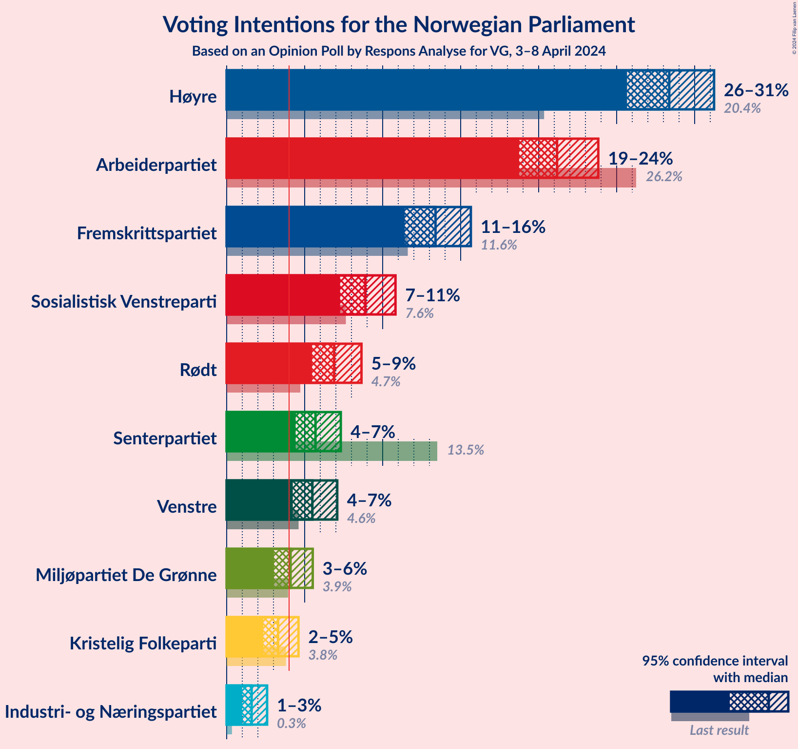

### Confidence Intervals

| Party | Last Result | Poll Result | 80% Confidence Interval | 90% Confidence Interval | 95% Confidence Interval | 99% Confidence Interval |
|:-----:|:-----------:|:-----------:|:-----------------------:|:-----------------------:|:-----------------------:|:-----------------------:|
| Høyre | 20.4% | 28.4% | 26.6–30.3% |26.1–30.8% |25.7–31.2% |24.8–32.2% |
| Arbeiderpartiet | 26.2% | 21.2% | 19.6–22.9% |19.1–23.4% |18.7–23.8% |18.0–24.7% |
| Fremskrittspartiet | 11.6% | 13.4% | 12.1–14.9% |11.7–15.3% |11.4–15.7% |10.8–16.4% |
| Sosialistisk Venstreparti | 7.6% | 8.9% | 7.8–10.2% |7.5–10.5% |7.3–10.8% |6.8–11.5% |
| Rødt | 4.7% | 6.9% | 6.0–8.0% |5.7–8.4% |5.5–8.6% |5.1–9.2% |
| Senterpartiet | 13.5% | 5.7% | 4.8–6.8% |4.6–7.1% |4.4–7.3% |4.0–7.8% |
| Venstre | 4.6% | 5.5% | 4.7–6.5% |4.4–6.8% |4.2–7.1% |3.9–7.6% |
| Miljøpartiet De Grønne | 3.9% | 4.1% | 3.4–5.0% |3.2–5.3% |3.0–5.5% |2.7–6.0% |
| Kristelig Folkeparti | 3.8% | 3.3% | 2.7–4.1% |2.5–4.4% |2.3–4.6% |2.1–5.0% |
| Industri- og Næringspartiet | 0.3% | 1.6% | 1.2–2.2% |1.1–2.4% |1.0–2.6% |0.8–2.9% |

*Note:* The poll result column reflects the actual value used in the calculations. Published results may vary slightly, and in addition be rounded to fewer digits.

## Seats

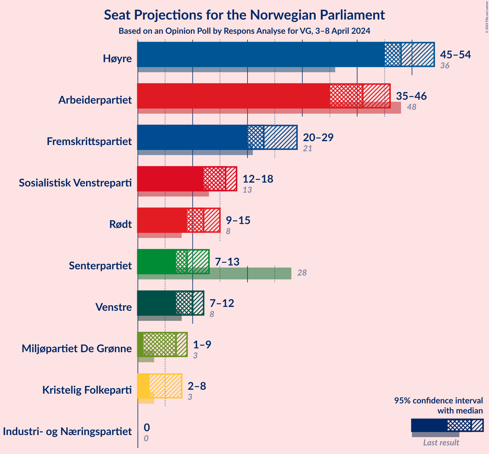

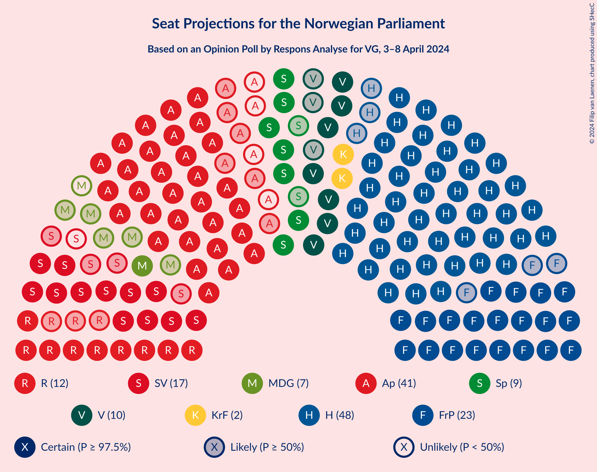

### Confidence Intervals

| Party | Last Result | Median | 80% Confidence Interval | 90% Confidence Interval | 95% Confidence Interval | 99% Confidence Interval |
|:-----:|:-----------:|:------:|:-----------------------:|:-----------------------:|:-----------------------:|:-----------------------:|
| <a href="#høyre">Høyre</a> | 36 | 48 | 45–52 |45–53 |45–54 |43–56 |
| <a href="#arbeiderpartiet">Arbeiderpartiet</a> | 48 | 41 | 37–45 |36–45 |35–46 |34–48 |
| <a href="#fremskrittspartiet">Fremskrittspartiet</a> | 21 | 23 | 20–28 |20–28 |20–29 |19–30 |
| <a href="#sosialistisk-venstreparti">Sosialistisk Venstreparti</a> | 13 | 16 | 14–17 |13–18 |12–18 |11–19 |
| <a href="#rødt">Rødt</a> | 8 | 12 | 10–14 |10–15 |9–15 |8–16 |
| <a href="#senterpartiet">Senterpartiet</a> | 28 | 9 | 8–11 |8–12 |7–13 |6–14 |
| <a href="#venstre">Venstre</a> | 8 | 10 | 8–11 |8–11 |7–12 |3–12 |
| <a href="#miljøpartiet-de-grønne">Miljøpartiet De Grønne</a> | 3 | 7 | 2–8 |2–8 |1–9 |1–10 |
| <a href="#kristelig-folkeparti">Kristelig Folkeparti</a> | 3 | 2 | 2–3 |2–7 |2–8 |0–8 |
| <a href="#industri--og-næringspartiet">Industri- og Næringspartiet</a> | 0 | 0 | 0 |0 |0 |0–2 |

### Høyre

*For a full overview of the results for this party, see the [Høyre](party-høyre.html) page.*

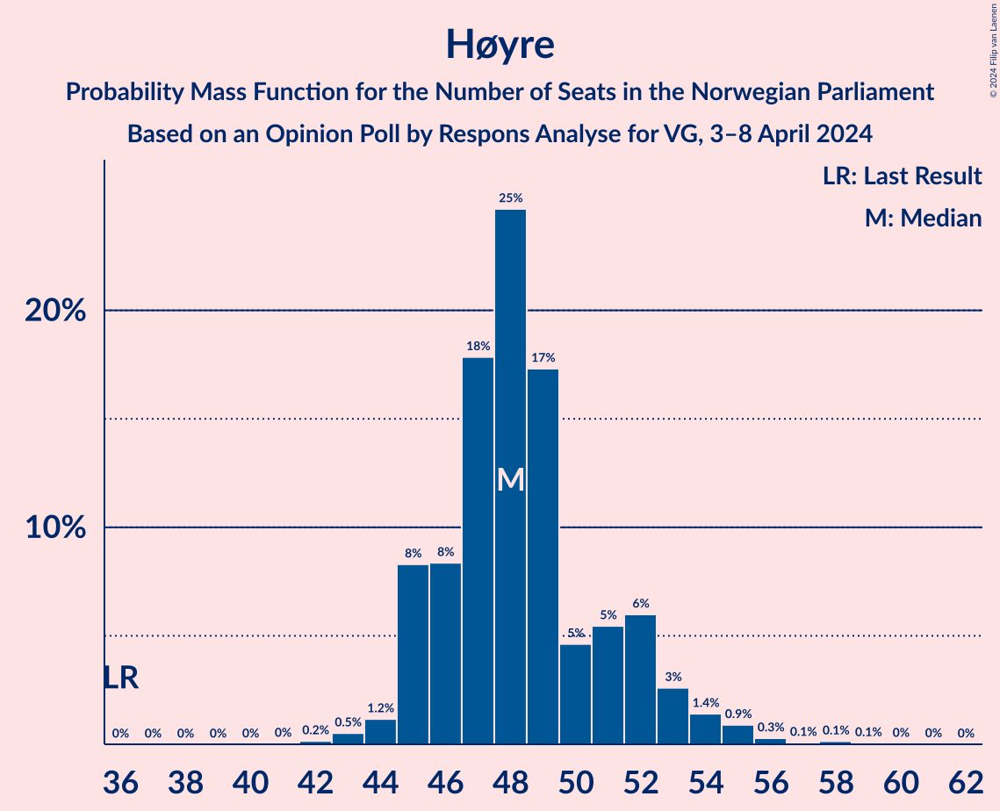

| Number of Seats | Probability | Accumulated | Special Marks |
|:---------------:|:-----------:|:-----------:|:-------------:|
| 36 | 0% | 100% | Last Result |
| 37 | 0% | 100% |  |
| 38 | 0% | 100% |  |
| 39 | 0% | 100% |  |
| 40 | 0% | 100% |  |
| 41 | 0% | 100% |  |
| 42 | 0.2% | 100% |  |
| 43 | 0.5% | 99.8% |  |
| 44 | 1.2% | 99.3% |  |
| 45 | 8% | 98% |  |
| 46 | 8% | 90% |  |
| 47 | 18% | 81% |  |
| 48 | 25% | 64% | Median |
| 49 | 17% | 39% |  |
| 50 | 5% | 22% |  |
| 51 | 5% | 17% |  |
| 52 | 6% | 12% |  |
| 53 | 3% | 6% |  |
| 54 | 1.4% | 3% |  |
| 55 | 0.9% | 2% |  |
| 56 | 0.3% | 0.6% |  |
| 57 | 0.1% | 0.3% |  |
| 58 | 0.1% | 0.3% |  |
| 59 | 0.1% | 0.1% |  |
| 60 | 0% | 0.1% |  |
| 61 | 0% | 0% |  |

### Arbeiderpartiet

*For a full overview of the results for this party, see the [Arbeiderpartiet](party-arbeiderpartiet.html) page.*

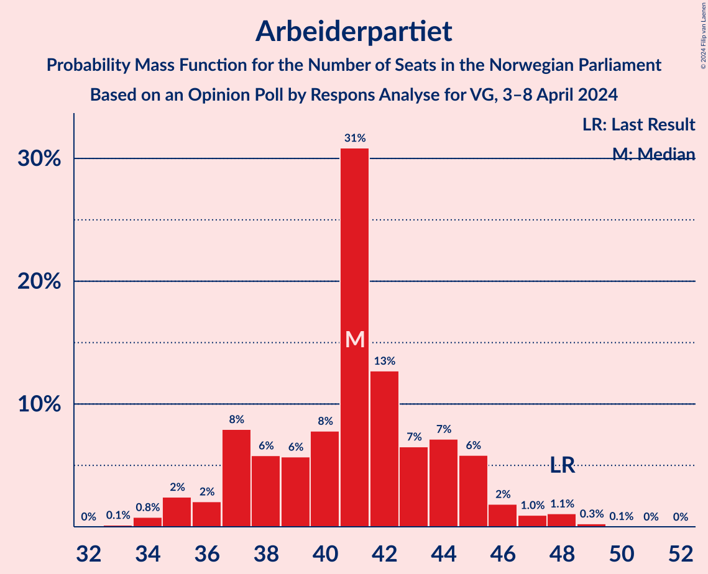

| Number of Seats | Probability | Accumulated | Special Marks |
|:---------------:|:-----------:|:-----------:|:-------------:|
| 33 | 0.1% | 100% |  |
| 34 | 0.8% | 99.8% |  |
| 35 | 2% | 99.0% |  |
| 36 | 2% | 97% |  |
| 37 | 8% | 95% |  |
| 38 | 6% | 87% |  |
| 39 | 6% | 81% |  |
| 40 | 8% | 75% |  |
| 41 | 31% | 67% | Median |
| 42 | 13% | 36% |  |
| 43 | 7% | 24% |  |
| 44 | 7% | 17% |  |
| 45 | 6% | 10% |  |
| 46 | 2% | 4% |  |
| 47 | 1.0% | 2% |  |
| 48 | 1.1% | 1.4% | Last Result |
| 49 | 0.3% | 0.3% |  |
| 50 | 0.1% | 0.1% |  |
| 51 | 0% | 0% |  |

### Fremskrittspartiet

*For a full overview of the results for this party, see the [Fremskrittspartiet](party-fremskrittspartiet.html) page.*

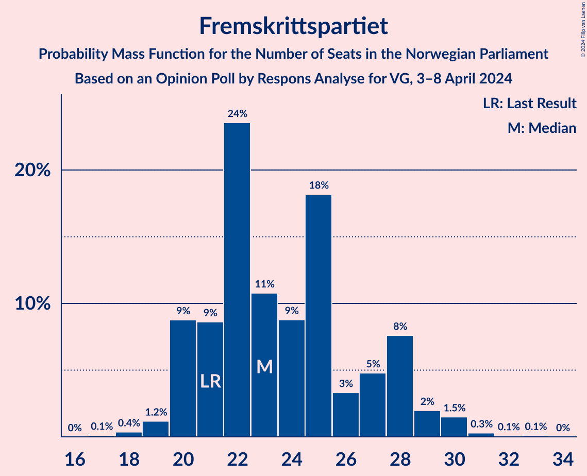

| Number of Seats | Probability | Accumulated | Special Marks |
|:---------------:|:-----------:|:-----------:|:-------------:|
| 17 | 0.1% | 100% |  |
| 18 | 0.4% | 99.9% |  |
| 19 | 1.2% | 99.5% |  |
| 20 | 9% | 98% |  |
| 21 | 9% | 90% | Last Result |
| 22 | 24% | 81% |  |
| 23 | 11% | 57% | Median |
| 24 | 9% | 47% |  |
| 25 | 18% | 38% |  |
| 26 | 3% | 20% |  |
| 27 | 5% | 16% |  |
| 28 | 8% | 12% |  |
| 29 | 2% | 4% |  |
| 30 | 1.5% | 2% |  |
| 31 | 0.3% | 0.5% |  |
| 32 | 0.1% | 0.2% |  |
| 33 | 0.1% | 0.1% |  |
| 34 | 0% | 0% |  |

### Sosialistisk Venstreparti

*For a full overview of the results for this party, see the [Sosialistisk Venstreparti](party-sosialistiskvenstreparti.html) page.*

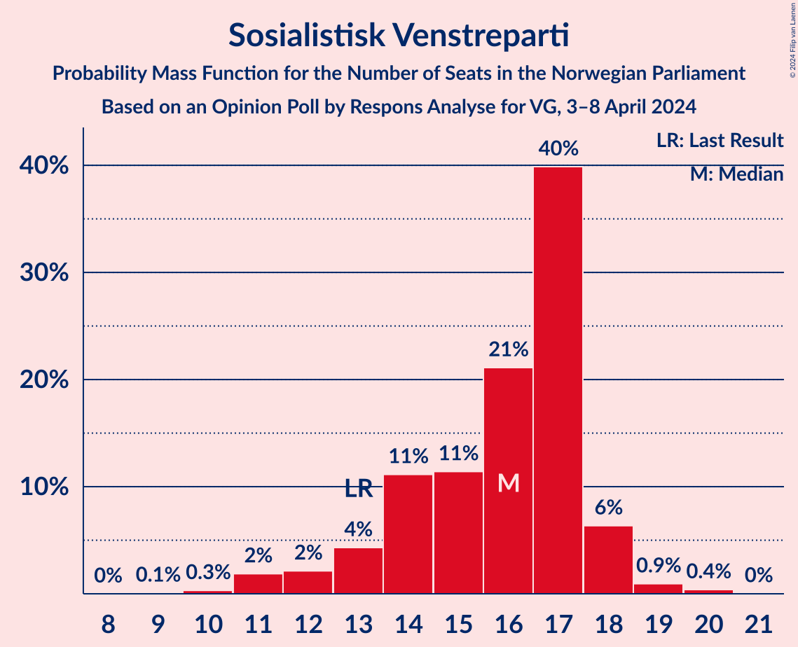

| Number of Seats | Probability | Accumulated | Special Marks |
|:---------------:|:-----------:|:-----------:|:-------------:|
| 9 | 0.1% | 100% |  |
| 10 | 0.3% | 99.9% |  |
| 11 | 2% | 99.6% |  |
| 12 | 2% | 98% |  |
| 13 | 4% | 96% | Last Result |
| 14 | 11% | 91% |  |
| 15 | 11% | 80% |  |
| 16 | 21% | 69% | Median |
| 17 | 40% | 48% |  |
| 18 | 6% | 8% |  |
| 19 | 0.9% | 1.4% |  |
| 20 | 0.4% | 0.4% |  |
| 21 | 0% | 0% |  |

### Rødt

*For a full overview of the results for this party, see the [Rødt](party-rødt.html) page.*

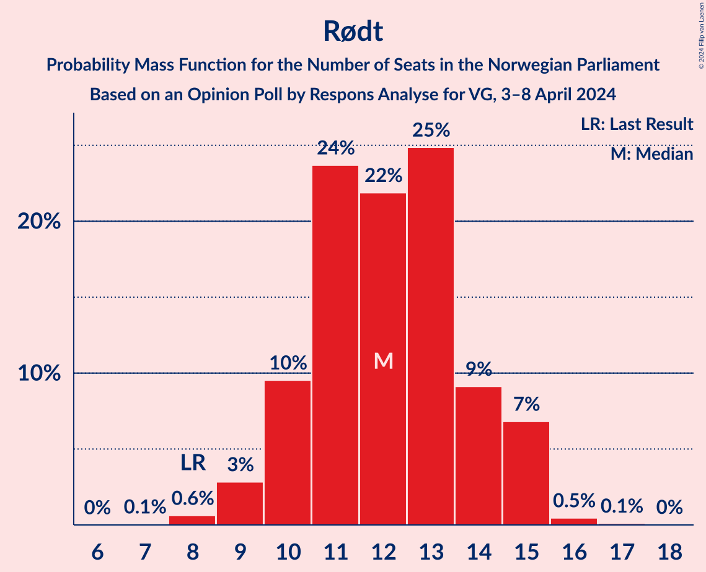

| Number of Seats | Probability | Accumulated | Special Marks |
|:---------------:|:-----------:|:-----------:|:-------------:|
| 7 | 0.1% | 100% |  |
| 8 | 0.6% | 99.9% | Last Result |
| 9 | 3% | 99.3% |  |
| 10 | 10% | 96% |  |
| 11 | 24% | 87% |  |
| 12 | 22% | 63% | Median |
| 13 | 25% | 41% |  |
| 14 | 9% | 17% |  |
| 15 | 7% | 7% |  |
| 16 | 0.5% | 0.6% |  |
| 17 | 0.1% | 0.1% |  |
| 18 | 0% | 0% |  |

### Senterpartiet

*For a full overview of the results for this party, see the [Senterpartiet](party-senterpartiet.html) page.*

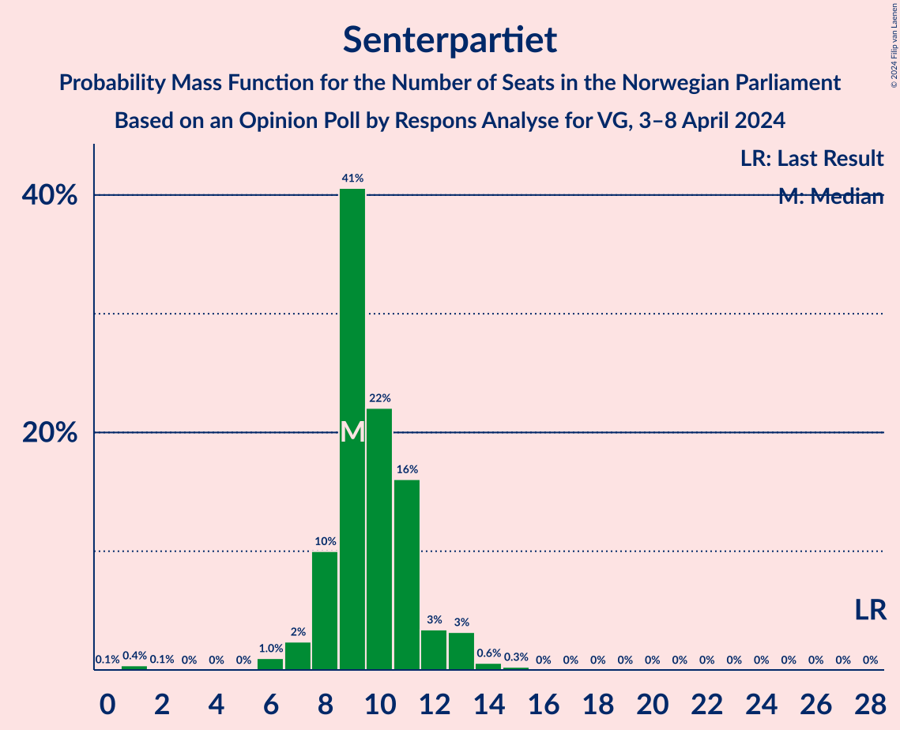

| Number of Seats | Probability | Accumulated | Special Marks |
|:---------------:|:-----------:|:-----------:|:-------------:|
| 0 | 0.1% | 100% |  |
| 1 | 0.4% | 99.9% |  |
| 2 | 0.1% | 99.6% |  |
| 3 | 0% | 99.5% |  |
| 4 | 0% | 99.5% |  |
| 5 | 0% | 99.5% |  |
| 6 | 1.0% | 99.5% |  |
| 7 | 2% | 98.5% |  |
| 8 | 10% | 96% |  |
| 9 | 41% | 86% | Median |
| 10 | 22% | 46% |  |
| 11 | 16% | 23% |  |
| 12 | 3% | 7% |  |
| 13 | 3% | 4% |  |
| 14 | 0.6% | 0.8% |  |
| 15 | 0.3% | 0.3% |  |
| 16 | 0% | 0% |  |
| 17 | 0% | 0% |  |
| 18 | 0% | 0% |  |
| 19 | 0% | 0% |  |
| 20 | 0% | 0% |  |
| 21 | 0% | 0% |  |
| 22 | 0% | 0% |  |
| 23 | 0% | 0% |  |
| 24 | 0% | 0% |  |
| 25 | 0% | 0% |  |
| 26 | 0% | 0% |  |
| 27 | 0% | 0% |  |
| 28 | 0% | 0% | Last Result |

### Venstre

*For a full overview of the results for this party, see the [Venstre](party-venstre.html) page.*

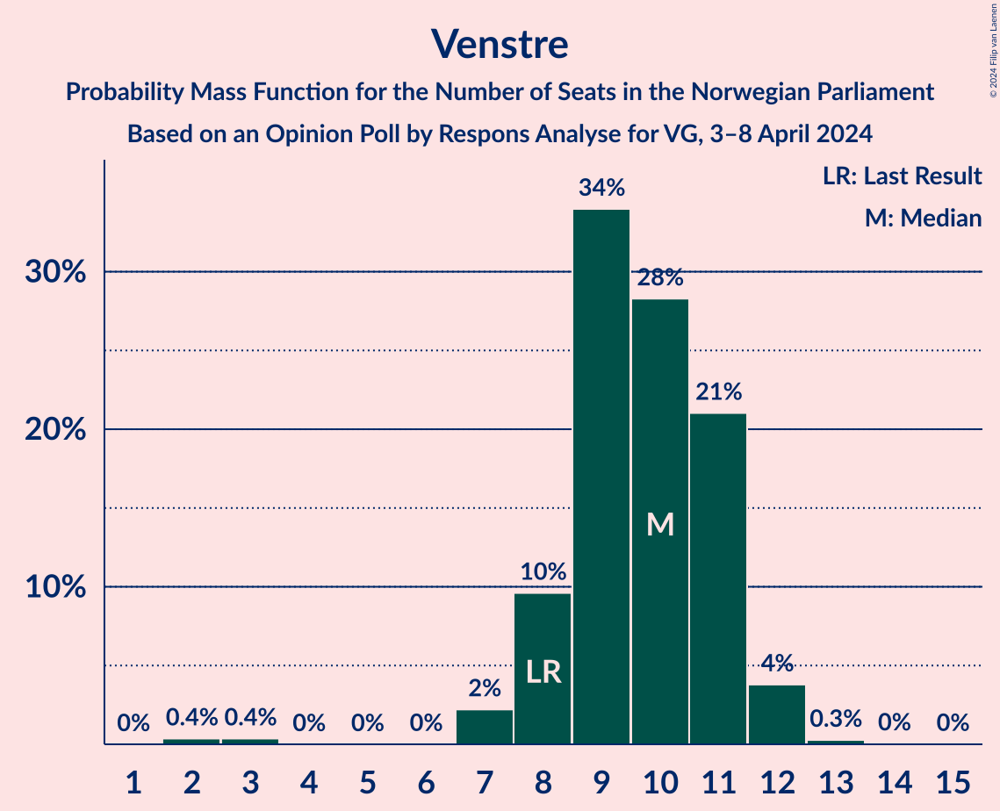

| Number of Seats | Probability | Accumulated | Special Marks |
|:---------------:|:-----------:|:-----------:|:-------------:|
| 2 | 0.4% | 100% |  |
| 3 | 0.4% | 99.6% |  |
| 4 | 0% | 99.3% |  |
| 5 | 0% | 99.3% |  |
| 6 | 0% | 99.3% |  |
| 7 | 2% | 99.3% |  |
| 8 | 10% | 97% | Last Result |
| 9 | 34% | 87% |  |
| 10 | 28% | 53% | Median |
| 11 | 21% | 25% |  |
| 12 | 4% | 4% |  |
| 13 | 0.3% | 0.3% |  |
| 14 | 0% | 0.1% |  |
| 15 | 0% | 0% |  |

### Miljøpartiet De Grønne

*For a full overview of the results for this party, see the [Miljøpartiet De Grønne](party-miljøpartietdegrønne.html) page.*

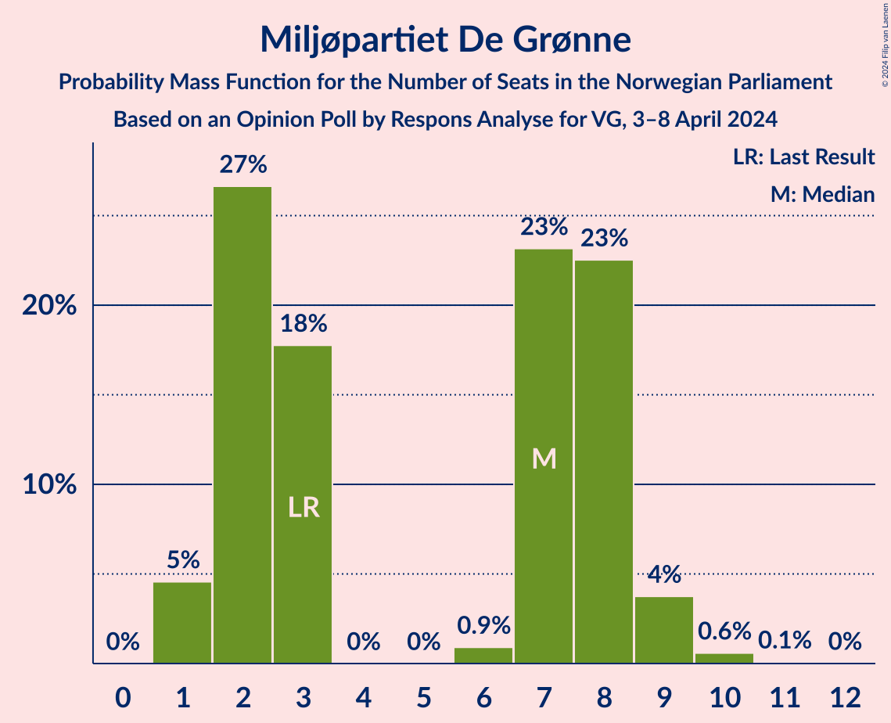

| Number of Seats | Probability | Accumulated | Special Marks |
|:---------------:|:-----------:|:-----------:|:-------------:|
| 1 | 5% | 100% |  |
| 2 | 27% | 95% |  |
| 3 | 18% | 69% | Last Result |
| 4 | 0% | 51% |  |
| 5 | 0% | 51% |  |
| 6 | 0.9% | 51% |  |
| 7 | 23% | 50% | Median |
| 8 | 23% | 27% |  |
| 9 | 4% | 4% |  |
| 10 | 0.6% | 0.7% |  |
| 11 | 0.1% | 0.1% |  |
| 12 | 0% | 0% |  |

### Kristelig Folkeparti

*For a full overview of the results for this party, see the [Kristelig Folkeparti](party-kristeligfolkeparti.html) page.*

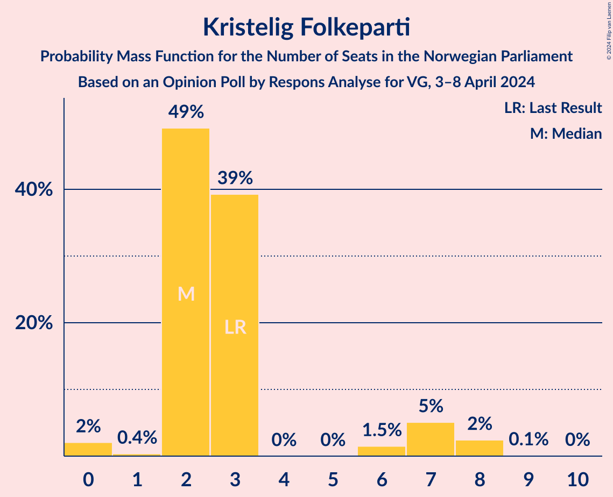

| Number of Seats | Probability | Accumulated | Special Marks |
|:---------------:|:-----------:|:-----------:|:-------------:|
| 0 | 2% | 100% |  |
| 1 | 0.4% | 98% |  |
| 2 | 49% | 98% | Median |
| 3 | 39% | 48% | Last Result |
| 4 | 0% | 9% |  |
| 5 | 0% | 9% |  |
| 6 | 1.5% | 9% |  |
| 7 | 5% | 8% |  |
| 8 | 2% | 3% |  |
| 9 | 0.1% | 0.1% |  |
| 10 | 0% | 0% |  |

### Industri- og Næringspartiet

*For a full overview of the results for this party, see the [Industri- og Næringspartiet](party-industri-ognæringspartiet.html) page.*

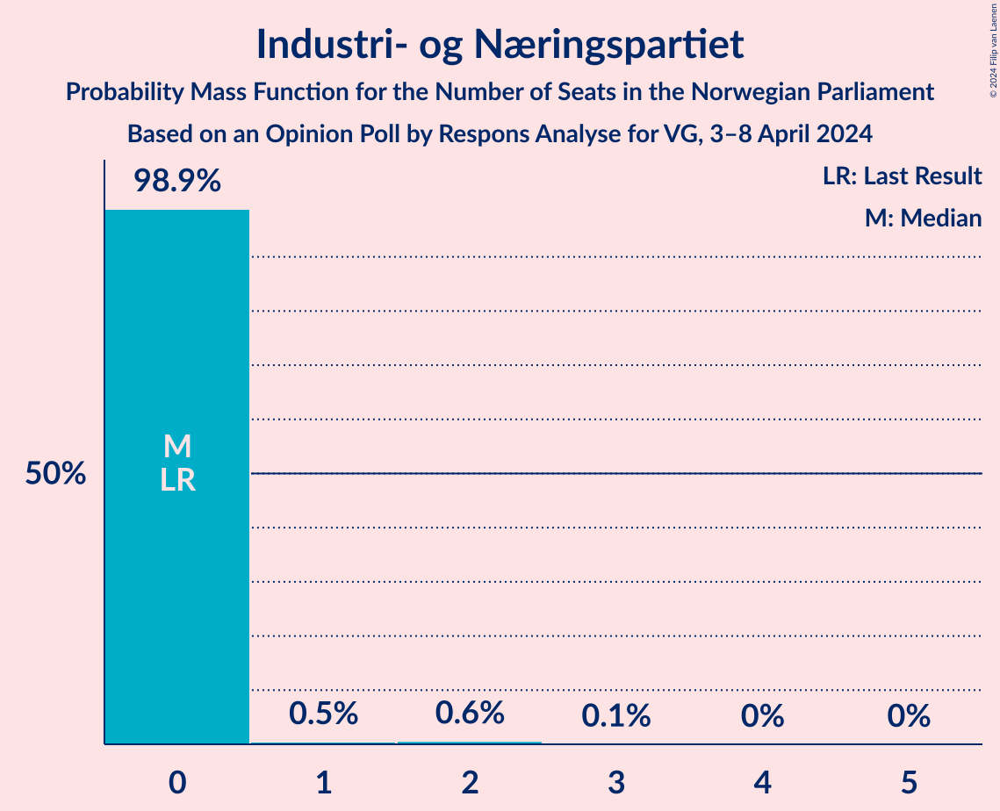

| Number of Seats | Probability | Accumulated | Special Marks |
|:---------------:|:-----------:|:-----------:|:-------------:|
| 0 | 98.9% | 100% | Last Result, Median |
| 1 | 0.5% | 1.1% |  |
| 2 | 0.6% | 0.7% |  |
| 3 | 0.1% | 0.1% |  |
| 4 | 0% | 0% |  |

## Coalitions

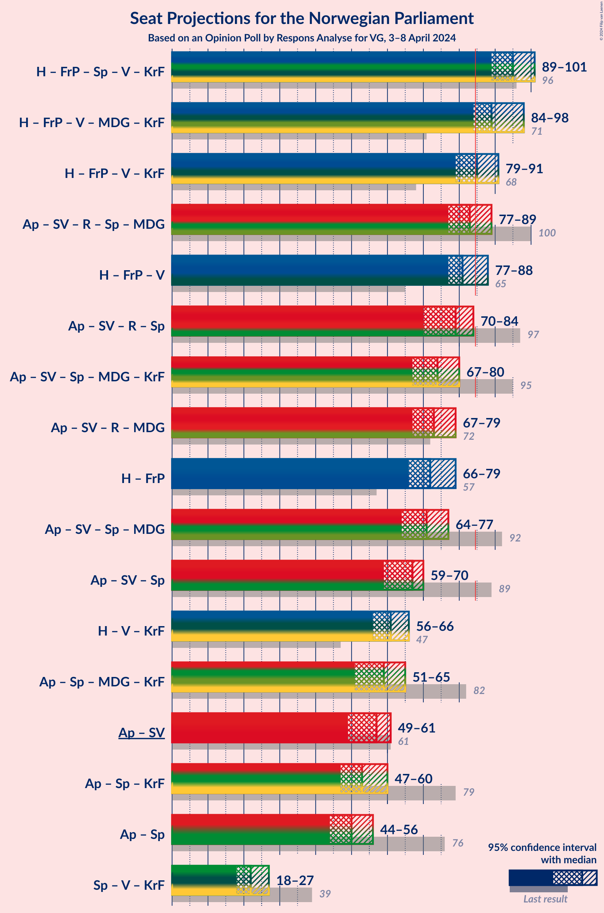

### Confidence Intervals

| Coalition | Last Result | Median | Majority? | 80% Confidence Interval | 90% Confidence Interval | 95% Confidence Interval | 99% Confidence Interval |
|:---------:|:-----------:|:------:|:---------:|:-----------------------:|:-----------------------:|:-----------------------:|:-----------------------:|
| Høyre – Fremskrittspartiet – Senterpartiet – Venstre – Kristelig Folkeparti | 96 | 95 | 99.9% | 90–98 | 89–100 | 89–101 | 87–104 |
| Høyre – Fremskrittspartiet – Venstre – Miljøpartiet De Grønne – Kristelig Folkeparti | 71 | 89 | 96% | 86–94 | 85–96 | 84–98 | 83–100 |
| Høyre – Fremskrittspartiet – Venstre – Kristelig Folkeparti | 68 | 85 | 50% | 81–89 | 79–90 | 79–91 | 77–95 |
| Arbeiderpartiet – Sosialistisk Venstreparti – Rødt – Senterpartiet – Miljøpartiet De Grønne | 100 | 83 | 44% | 79–87 | 78–89 | 77–89 | 73–90 |
| Høyre – Fremskrittspartiet – Venstre | 65 | 81 | 19% | 78–86 | 77–88 | 77–88 | 75–91 |
| Arbeiderpartiet – Sosialistisk Venstreparti – Rødt – Senterpartiet | 97 | 79 | 1.3% | 74–82 | 72–83 | 70–84 | 68–85 |
| Arbeiderpartiet – Sosialistisk Venstreparti – Senterpartiet – Miljøpartiet De Grønne – Kristelig Folkeparti | 95 | 74 | 0% | 69–78 | 68–79 | 67–80 | 65–82 |
| Arbeiderpartiet – Sosialistisk Venstreparti – Rødt – Miljøpartiet De Grønne | 72 | 73 | 0.1% | 70–78 | 68–79 | 67–79 | 64–81 |
| Høyre – Fremskrittspartiet | 57 | 72 | 0.1% | 68–76 | 68–78 | 66–79 | 65–81 |
| Arbeiderpartiet – Sosialistisk Venstreparti – Senterpartiet – Miljøpartiet De Grønne | 92 | 71 | 0% | 67–76 | 66–76 | 64–77 | 61–78 |
| Arbeiderpartiet – Sosialistisk Venstreparti – Senterpartiet | 89 | 67 | 0% | 63–69 | 61–70 | 59–70 | 57–72 |
| Høyre – Venstre – Kristelig Folkeparti | 47 | 61 | 0% | 57–65 | 56–66 | 56–66 | 55–70 |
| Arbeiderpartiet – Senterpartiet – Miljøpartiet De Grønne – Kristelig Folkeparti | 82 | 59 | 0% | 52–63 | 52–64 | 51–65 | 49–67 |
| Arbeiderpartiet – Sosialistisk Venstreparti | 61 | 57 | 0% | 54–60 | 52–61 | 49–61 | 48–63 |
| Arbeiderpartiet – Senterpartiet – Kristelig Folkeparti | 79 | 53 | 0% | 49–57 | 48–59 | 47–60 | 45–61 |
| Arbeiderpartiet – Senterpartiet | 76 | 50 | 0% | 47–54 | 46–55 | 44–56 | 43–57 |
| Senterpartiet – Venstre – Kristelig Folkeparti | 39 | 22 | 0% | 20–25 | 19–26 | 18–27 | 14–29 |

### Høyre – Fremskrittspartiet – Senterpartiet – Venstre – Kristelig Folkeparti

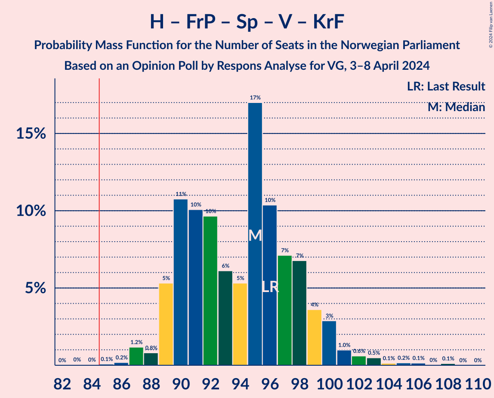

| Number of Seats | Probability | Accumulated | Special Marks |
|:---------------:|:-----------:|:-----------:|:-------------:|
| 83 | 0% | 100% |  |
| 84 | 0% | 99.9% |  |
| 85 | 0.1% | 99.9% | Majority |
| 86 | 0.2% | 99.8% |  |
| 87 | 1.2% | 99.6% |  |
| 88 | 0.8% | 98% |  |
| 89 | 5% | 98% |  |
| 90 | 11% | 92% |  |
| 91 | 10% | 82% |  |
| 92 | 10% | 72% | Median |
| 93 | 6% | 62% |  |
| 94 | 5% | 56% |  |
| 95 | 17% | 50% |  |
| 96 | 10% | 33% | Last Result |
| 97 | 7% | 23% |  |
| 98 | 7% | 16% |  |
| 99 | 4% | 9% |  |
| 100 | 3% | 6% |  |
| 101 | 1.0% | 3% |  |
| 102 | 0.6% | 2% |  |
| 103 | 0.5% | 1.1% |  |
| 104 | 0.1% | 0.6% |  |
| 105 | 0.2% | 0.4% |  |
| 106 | 0.1% | 0.3% |  |
| 107 | 0% | 0.1% |  |
| 108 | 0.1% | 0.1% |  |
| 109 | 0% | 0% |  |

### Høyre – Fremskrittspartiet – Venstre – Miljøpartiet De Grønne – Kristelig Folkeparti

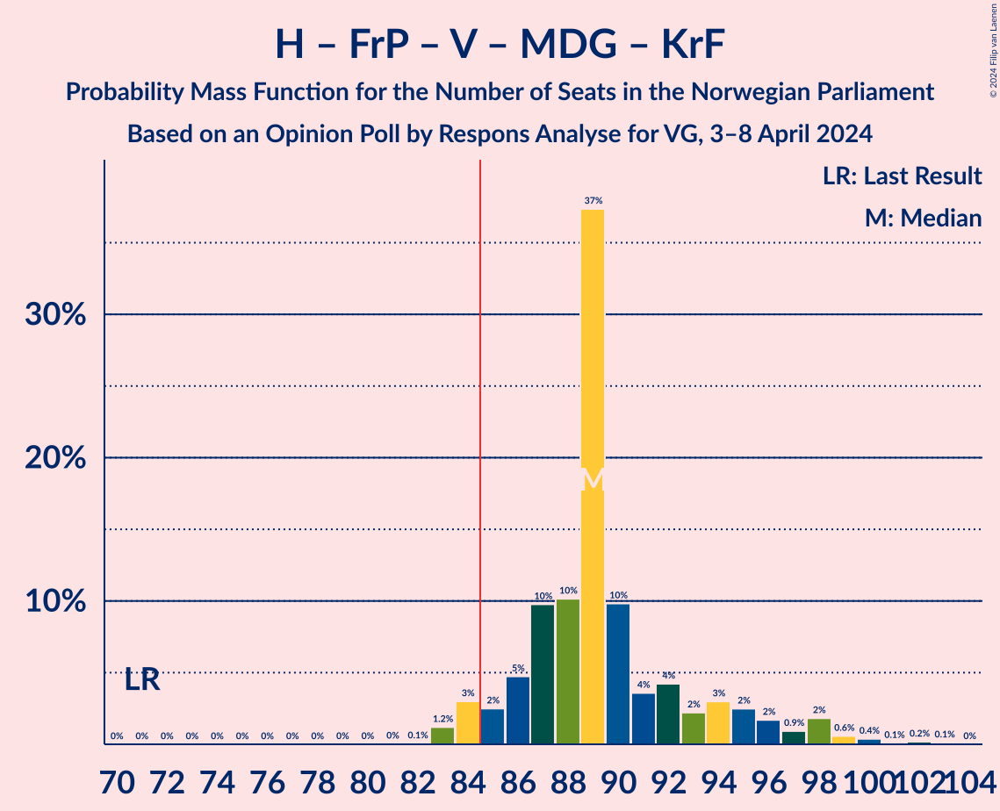

| Number of Seats | Probability | Accumulated | Special Marks |
|:---------------:|:-----------:|:-----------:|:-------------:|
| 71 | 0% | 100% | Last Result |
| 72 | 0% | 100% |  |
| 73 | 0% | 100% |  |
| 74 | 0% | 100% |  |
| 75 | 0% | 100% |  |
| 76 | 0% | 100% |  |
| 77 | 0% | 100% |  |
| 78 | 0% | 100% |  |
| 79 | 0% | 100% |  |
| 80 | 0% | 100% |  |
| 81 | 0% | 100% |  |
| 82 | 0.1% | 99.9% |  |
| 83 | 1.2% | 99.9% |  |
| 84 | 3% | 98.7% |  |
| 85 | 2% | 96% | Majority |
| 86 | 5% | 93% |  |
| 87 | 10% | 88% |  |
| 88 | 10% | 79% |  |
| 89 | 37% | 69% |  |
| 90 | 10% | 31% | Median |
| 91 | 4% | 21% |  |
| 92 | 4% | 18% |  |
| 93 | 2% | 14% |  |
| 94 | 3% | 11% |  |
| 95 | 2% | 8% |  |
| 96 | 2% | 6% |  |
| 97 | 0.9% | 4% |  |
| 98 | 2% | 3% |  |
| 99 | 0.6% | 1.4% |  |
| 100 | 0.4% | 0.8% |  |
| 101 | 0.1% | 0.4% |  |
| 102 | 0.2% | 0.3% |  |
| 103 | 0.1% | 0.1% |  |
| 104 | 0% | 0% |  |

### Høyre – Fremskrittspartiet – Venstre – Kristelig Folkeparti

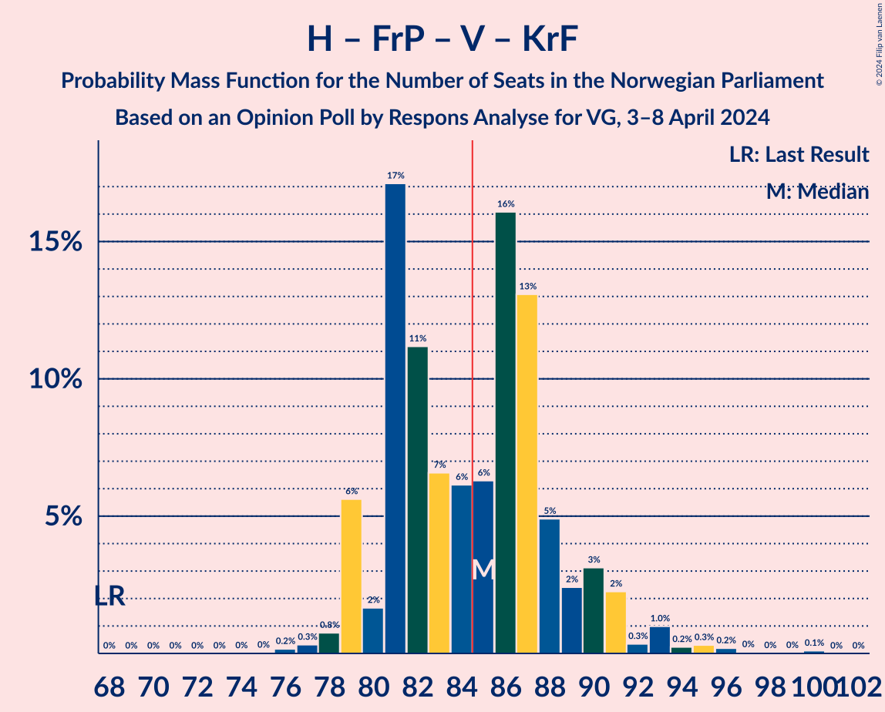

| Number of Seats | Probability | Accumulated | Special Marks |
|:---------------:|:-----------:|:-----------:|:-------------:|
| 68 | 0% | 100% | Last Result |
| 69 | 0% | 100% |  |
| 70 | 0% | 100% |  |
| 71 | 0% | 100% |  |
| 72 | 0% | 100% |  |
| 73 | 0% | 100% |  |
| 74 | 0% | 100% |  |
| 75 | 0% | 100% |  |
| 76 | 0.2% | 100% |  |
| 77 | 0.3% | 99.8% |  |
| 78 | 0.8% | 99.5% |  |
| 79 | 6% | 98.7% |  |
| 80 | 2% | 93% |  |
| 81 | 17% | 91% |  |
| 82 | 11% | 74% |  |
| 83 | 7% | 63% | Median |
| 84 | 6% | 57% |  |
| 85 | 6% | 50% | Majority |
| 86 | 16% | 44% |  |
| 87 | 13% | 28% |  |
| 88 | 5% | 15% |  |
| 89 | 2% | 10% |  |
| 90 | 3% | 8% |  |
| 91 | 2% | 5% |  |
| 92 | 0.3% | 2% |  |
| 93 | 1.0% | 2% |  |
| 94 | 0.2% | 0.9% |  |
| 95 | 0.3% | 0.7% |  |
| 96 | 0.2% | 0.4% |  |
| 97 | 0% | 0.2% |  |
| 98 | 0% | 0.1% |  |
| 99 | 0% | 0.1% |  |
| 100 | 0.1% | 0.1% |  |
| 101 | 0% | 0% |  |

### Arbeiderpartiet – Sosialistisk Venstreparti – Rødt – Senterpartiet – Miljøpartiet De Grønne

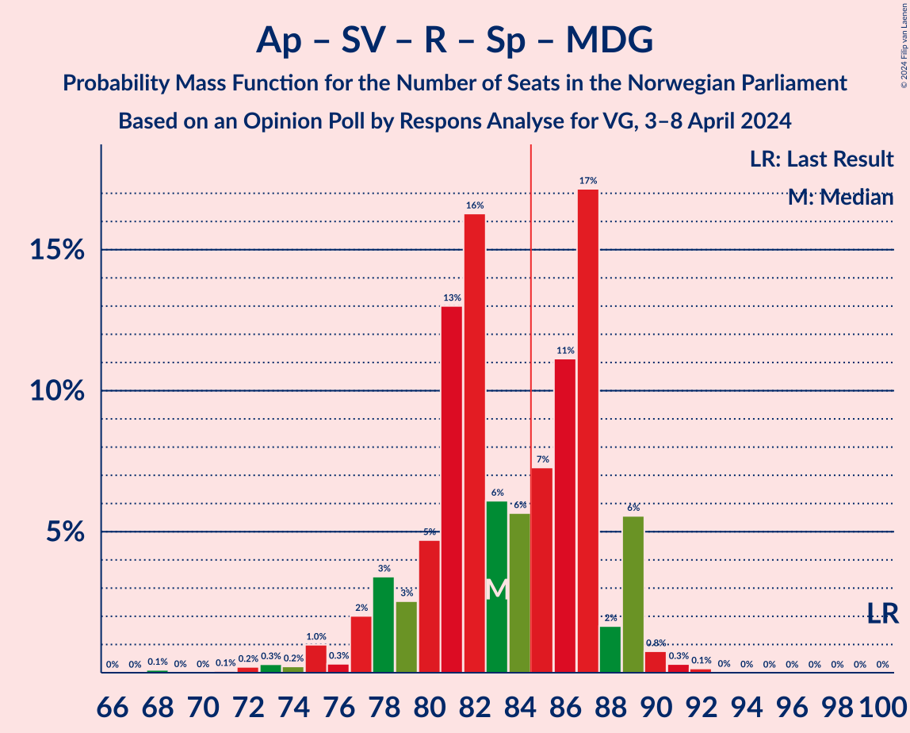

| Number of Seats | Probability | Accumulated | Special Marks |
|:---------------:|:-----------:|:-----------:|:-------------:|
| 68 | 0.1% | 100% |  |
| 69 | 0% | 99.9% |  |
| 70 | 0% | 99.9% |  |
| 71 | 0.1% | 99.9% |  |
| 72 | 0.2% | 99.8% |  |
| 73 | 0.3% | 99.6% |  |
| 74 | 0.2% | 99.3% |  |
| 75 | 1.0% | 99.1% |  |
| 76 | 0.3% | 98% |  |
| 77 | 2% | 98% |  |
| 78 | 3% | 96% |  |
| 79 | 3% | 92% |  |
| 80 | 5% | 90% |  |
| 81 | 13% | 85% |  |
| 82 | 16% | 72% |  |
| 83 | 6% | 56% |  |
| 84 | 6% | 50% |  |
| 85 | 7% | 44% | Median, Majority |
| 86 | 11% | 37% |  |
| 87 | 17% | 26% |  |
| 88 | 2% | 8% |  |
| 89 | 6% | 7% |  |
| 90 | 0.8% | 1.3% |  |
| 91 | 0.3% | 0.5% |  |
| 92 | 0.1% | 0.2% |  |
| 93 | 0% | 0% |  |
| 94 | 0% | 0% |  |
| 95 | 0% | 0% |  |
| 96 | 0% | 0% |  |
| 97 | 0% | 0% |  |
| 98 | 0% | 0% |  |
| 99 | 0% | 0% |  |
| 100 | 0% | 0% | Last Result |

### Høyre – Fremskrittspartiet – Venstre

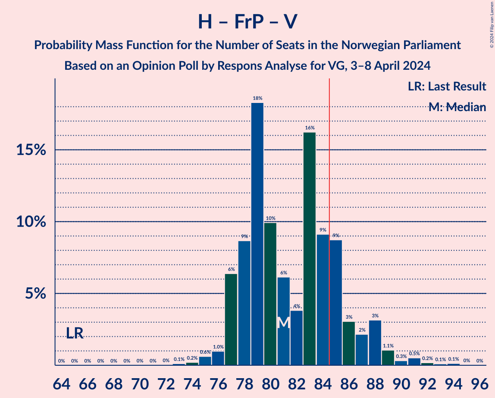

| Number of Seats | Probability | Accumulated | Special Marks |
|:---------------:|:-----------:|:-----------:|:-------------:|
| 65 | 0% | 100% | Last Result |
| 66 | 0% | 100% |  |
| 67 | 0% | 100% |  |
| 68 | 0% | 100% |  |
| 69 | 0% | 100% |  |
| 70 | 0% | 100% |  |
| 71 | 0% | 100% |  |
| 72 | 0% | 100% |  |
| 73 | 0.1% | 100% |  |
| 74 | 0.2% | 99.8% |  |
| 75 | 0.6% | 99.6% |  |
| 76 | 1.0% | 99.0% |  |
| 77 | 6% | 98% |  |
| 78 | 9% | 92% |  |
| 79 | 18% | 83% |  |
| 80 | 10% | 65% |  |
| 81 | 6% | 55% | Median |
| 82 | 4% | 49% |  |
| 83 | 16% | 45% |  |
| 84 | 9% | 29% |  |
| 85 | 9% | 19% | Majority |
| 86 | 3% | 11% |  |
| 87 | 2% | 8% |  |
| 88 | 3% | 5% |  |
| 89 | 1.1% | 2% |  |
| 90 | 0.3% | 1.3% |  |
| 91 | 0.5% | 1.0% |  |
| 92 | 0.2% | 0.4% |  |
| 93 | 0.1% | 0.3% |  |
| 94 | 0.1% | 0.2% |  |
| 95 | 0% | 0% |  |

### Arbeiderpartiet – Sosialistisk Venstreparti – Rødt – Senterpartiet

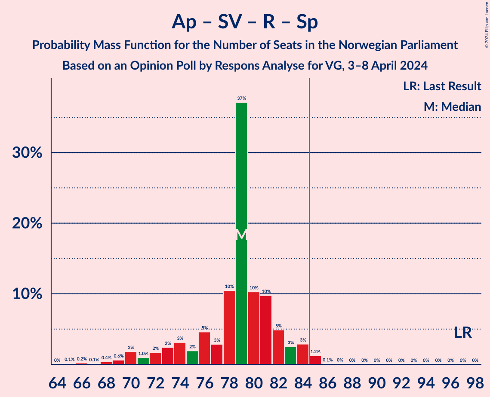

| Number of Seats | Probability | Accumulated | Special Marks |
|:---------------:|:-----------:|:-----------:|:-------------:|
| 65 | 0.1% | 100% |  |
| 66 | 0.2% | 99.9% |  |
| 67 | 0.1% | 99.7% |  |
| 68 | 0.4% | 99.6% |  |
| 69 | 0.6% | 99.2% |  |
| 70 | 2% | 98.6% |  |
| 71 | 1.0% | 97% |  |
| 72 | 2% | 96% |  |
| 73 | 2% | 94% |  |
| 74 | 3% | 92% |  |
| 75 | 2% | 89% |  |
| 76 | 5% | 87% |  |
| 77 | 3% | 82% |  |
| 78 | 10% | 79% | Median |
| 79 | 37% | 69% |  |
| 80 | 10% | 32% |  |
| 81 | 10% | 21% |  |
| 82 | 5% | 12% |  |
| 83 | 3% | 7% |  |
| 84 | 3% | 4% |  |
| 85 | 1.2% | 1.3% | Majority |
| 86 | 0.1% | 0.1% |  |
| 87 | 0% | 0.1% |  |
| 88 | 0% | 0% |  |
| 89 | 0% | 0% |  |
| 90 | 0% | 0% |  |
| 91 | 0% | 0% |  |
| 92 | 0% | 0% |  |
| 93 | 0% | 0% |  |
| 94 | 0% | 0% |  |
| 95 | 0% | 0% |  |
| 96 | 0% | 0% |  |
| 97 | 0% | 0% | Last Result |

### Arbeiderpartiet – Sosialistisk Venstreparti – Senterpartiet – Miljøpartiet De Grønne – Kristelig Folkeparti

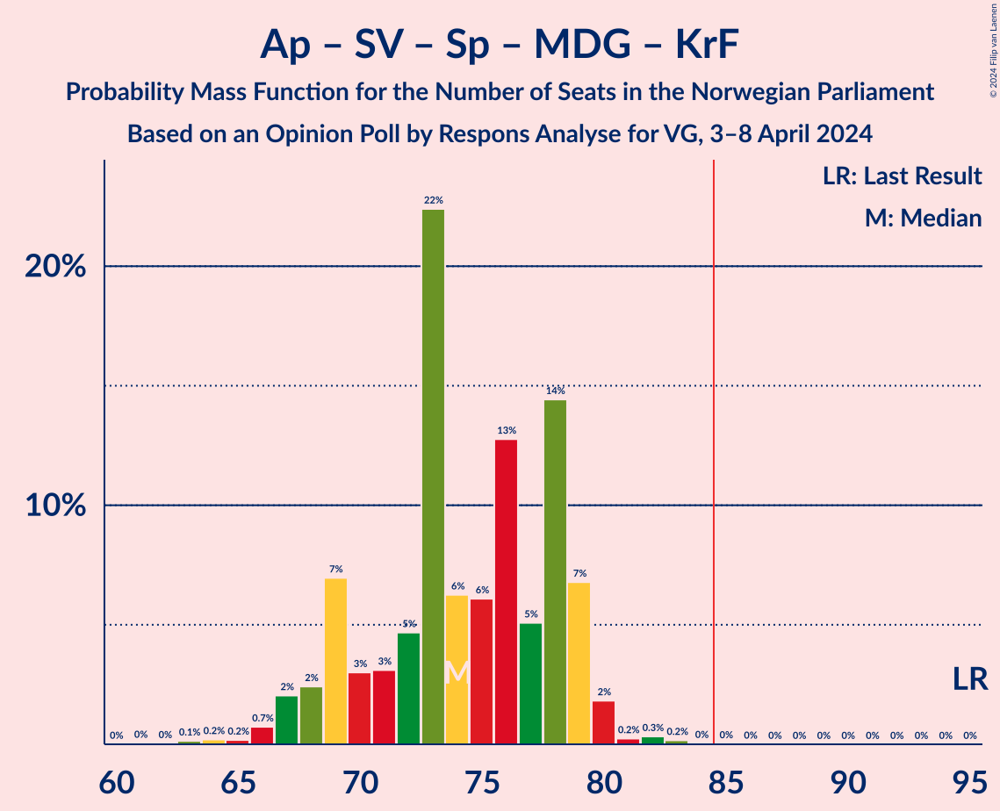

| Number of Seats | Probability | Accumulated | Special Marks |
|:---------------:|:-----------:|:-----------:|:-------------:|
| 61 | 0% | 100% |  |
| 62 | 0% | 99.9% |  |
| 63 | 0.1% | 99.9% |  |
| 64 | 0.2% | 99.8% |  |
| 65 | 0.2% | 99.6% |  |
| 66 | 0.7% | 99.4% |  |
| 67 | 2% | 98.7% |  |
| 68 | 2% | 97% |  |
| 69 | 7% | 94% |  |
| 70 | 3% | 87% |  |
| 71 | 3% | 84% |  |
| 72 | 5% | 81% |  |
| 73 | 22% | 76% |  |
| 74 | 6% | 54% |  |
| 75 | 6% | 48% | Median |
| 76 | 13% | 42% |  |
| 77 | 5% | 29% |  |
| 78 | 14% | 24% |  |
| 79 | 7% | 9% |  |
| 80 | 2% | 3% |  |
| 81 | 0.2% | 0.8% |  |
| 82 | 0.3% | 0.6% |  |
| 83 | 0.2% | 0.2% |  |
| 84 | 0% | 0.1% |  |
| 85 | 0% | 0% | Majority |
| 86 | 0% | 0% |  |
| 87 | 0% | 0% |  |
| 88 | 0% | 0% |  |
| 89 | 0% | 0% |  |
| 90 | 0% | 0% |  |
| 91 | 0% | 0% |  |
| 92 | 0% | 0% |  |
| 93 | 0% | 0% |  |
| 94 | 0% | 0% |  |
| 95 | 0% | 0% | Last Result |

### Arbeiderpartiet – Sosialistisk Venstreparti – Rødt – Miljøpartiet De Grønne

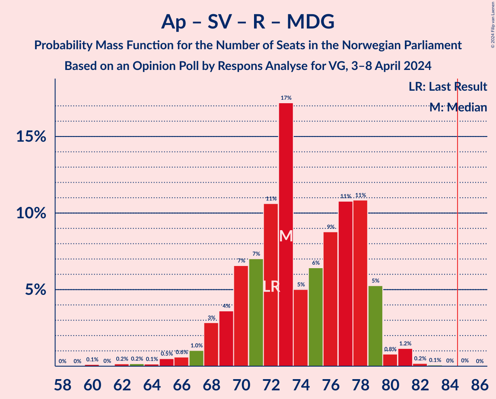

| Number of Seats | Probability | Accumulated | Special Marks |
|:---------------:|:-----------:|:-----------:|:-------------:|
| 60 | 0.1% | 100% |  |
| 61 | 0% | 99.9% |  |
| 62 | 0.2% | 99.9% |  |
| 63 | 0.2% | 99.7% |  |
| 64 | 0.1% | 99.5% |  |
| 65 | 0.5% | 99.4% |  |
| 66 | 0.6% | 98.9% |  |
| 67 | 1.0% | 98% |  |
| 68 | 3% | 97% |  |
| 69 | 4% | 94% |  |
| 70 | 7% | 91% |  |
| 71 | 7% | 84% |  |
| 72 | 11% | 77% | Last Result |
| 73 | 17% | 67% |  |
| 74 | 5% | 49% |  |
| 75 | 6% | 44% |  |
| 76 | 9% | 38% | Median |
| 77 | 11% | 29% |  |
| 78 | 11% | 18% |  |
| 79 | 5% | 8% |  |
| 80 | 0.8% | 2% |  |
| 81 | 1.2% | 2% |  |
| 82 | 0.2% | 0.4% |  |
| 83 | 0.1% | 0.2% |  |
| 84 | 0% | 0.1% |  |
| 85 | 0% | 0.1% | Majority |
| 86 | 0% | 0% |  |

### Høyre – Fremskrittspartiet

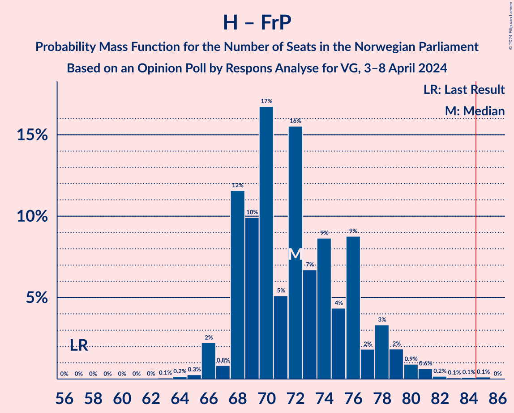

| Number of Seats | Probability | Accumulated | Special Marks |
|:---------------:|:-----------:|:-----------:|:-------------:|
| 57 | 0% | 100% | Last Result |
| 58 | 0% | 100% |  |
| 59 | 0% | 100% |  |
| 60 | 0% | 100% |  |
| 61 | 0% | 100% |  |
| 62 | 0% | 100% |  |
| 63 | 0.1% | 100% |  |
| 64 | 0.2% | 99.9% |  |
| 65 | 0.3% | 99.8% |  |
| 66 | 2% | 99.5% |  |
| 67 | 0.8% | 97% |  |
| 68 | 12% | 96% |  |
| 69 | 10% | 85% |  |
| 70 | 17% | 75% |  |
| 71 | 5% | 58% | Median |
| 72 | 16% | 53% |  |
| 73 | 7% | 38% |  |
| 74 | 9% | 31% |  |
| 75 | 4% | 22% |  |
| 76 | 9% | 18% |  |
| 77 | 2% | 9% |  |
| 78 | 3% | 7% |  |
| 79 | 2% | 4% |  |
| 80 | 0.9% | 2% |  |
| 81 | 0.6% | 1.1% |  |
| 82 | 0.2% | 0.5% |  |
| 83 | 0.1% | 0.3% |  |
| 84 | 0.1% | 0.2% |  |
| 85 | 0.1% | 0.1% | Majority |
| 86 | 0% | 0% |  |

### Arbeiderpartiet – Sosialistisk Venstreparti – Senterpartiet – Miljøpartiet De Grønne

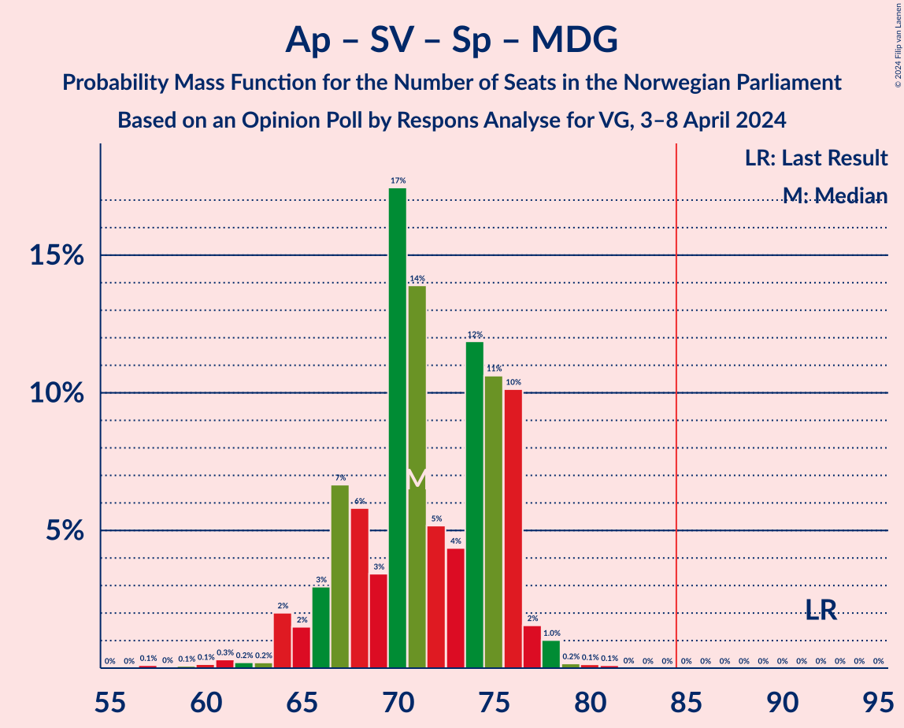

| Number of Seats | Probability | Accumulated | Special Marks |
|:---------------:|:-----------:|:-----------:|:-------------:|
| 57 | 0.1% | 100% |  |
| 58 | 0% | 99.9% |  |
| 59 | 0.1% | 99.9% |  |
| 60 | 0.1% | 99.8% |  |
| 61 | 0.3% | 99.6% |  |
| 62 | 0.2% | 99.3% |  |
| 63 | 0.2% | 99.1% |  |
| 64 | 2% | 98.9% |  |
| 65 | 2% | 97% |  |
| 66 | 3% | 95% |  |
| 67 | 7% | 92% |  |
| 68 | 6% | 86% |  |
| 69 | 3% | 80% |  |
| 70 | 17% | 77% |  |
| 71 | 14% | 59% |  |
| 72 | 5% | 45% |  |
| 73 | 4% | 40% | Median |
| 74 | 12% | 36% |  |
| 75 | 11% | 24% |  |
| 76 | 10% | 13% |  |
| 77 | 2% | 3% |  |
| 78 | 1.0% | 1.4% |  |
| 79 | 0.2% | 0.4% |  |
| 80 | 0.1% | 0.3% |  |
| 81 | 0.1% | 0.1% |  |
| 82 | 0% | 0% |  |
| 83 | 0% | 0% |  |
| 84 | 0% | 0% |  |
| 85 | 0% | 0% | Majority |
| 86 | 0% | 0% |  |
| 87 | 0% | 0% |  |
| 88 | 0% | 0% |  |
| 89 | 0% | 0% |  |
| 90 | 0% | 0% |  |
| 91 | 0% | 0% |  |
| 92 | 0% | 0% | Last Result |

### Arbeiderpartiet – Sosialistisk Venstreparti – Senterpartiet

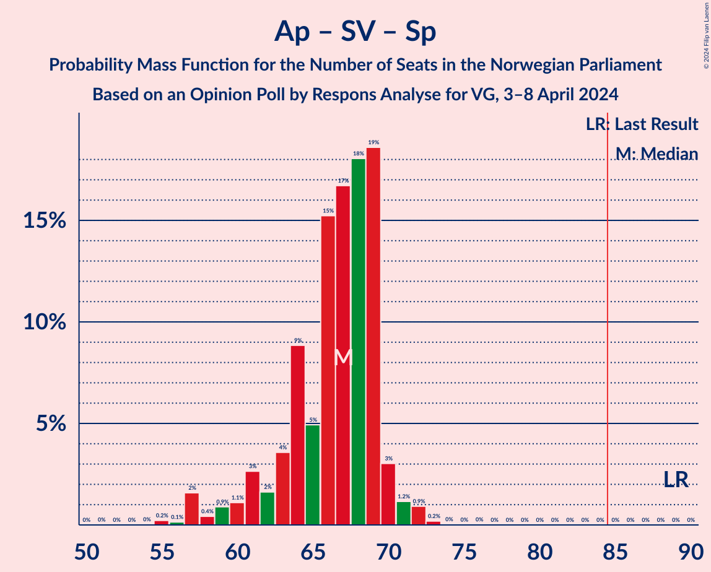

| Number of Seats | Probability | Accumulated | Special Marks |
|:---------------:|:-----------:|:-----------:|:-------------:|
| 55 | 0.2% | 100% |  |
| 56 | 0.1% | 99.7% |  |
| 57 | 2% | 99.6% |  |
| 58 | 0.4% | 98% |  |
| 59 | 0.9% | 98% |  |
| 60 | 1.1% | 97% |  |
| 61 | 3% | 96% |  |
| 62 | 2% | 93% |  |
| 63 | 4% | 91% |  |
| 64 | 9% | 88% |  |
| 65 | 5% | 79% |  |
| 66 | 15% | 74% | Median |
| 67 | 17% | 59% |  |
| 68 | 18% | 42% |  |
| 69 | 19% | 24% |  |
| 70 | 3% | 5% |  |
| 71 | 1.2% | 2% |  |
| 72 | 0.9% | 1.2% |  |
| 73 | 0.2% | 0.3% |  |
| 74 | 0% | 0.1% |  |
| 75 | 0% | 0% |  |
| 76 | 0% | 0% |  |
| 77 | 0% | 0% |  |
| 78 | 0% | 0% |  |
| 79 | 0% | 0% |  |
| 80 | 0% | 0% |  |
| 81 | 0% | 0% |  |
| 82 | 0% | 0% |  |
| 83 | 0% | 0% |  |
| 84 | 0% | 0% |  |
| 85 | 0% | 0% | Majority |
| 86 | 0% | 0% |  |
| 87 | 0% | 0% |  |
| 88 | 0% | 0% |  |
| 89 | 0% | 0% | Last Result |

### Høyre – Venstre – Kristelig Folkeparti

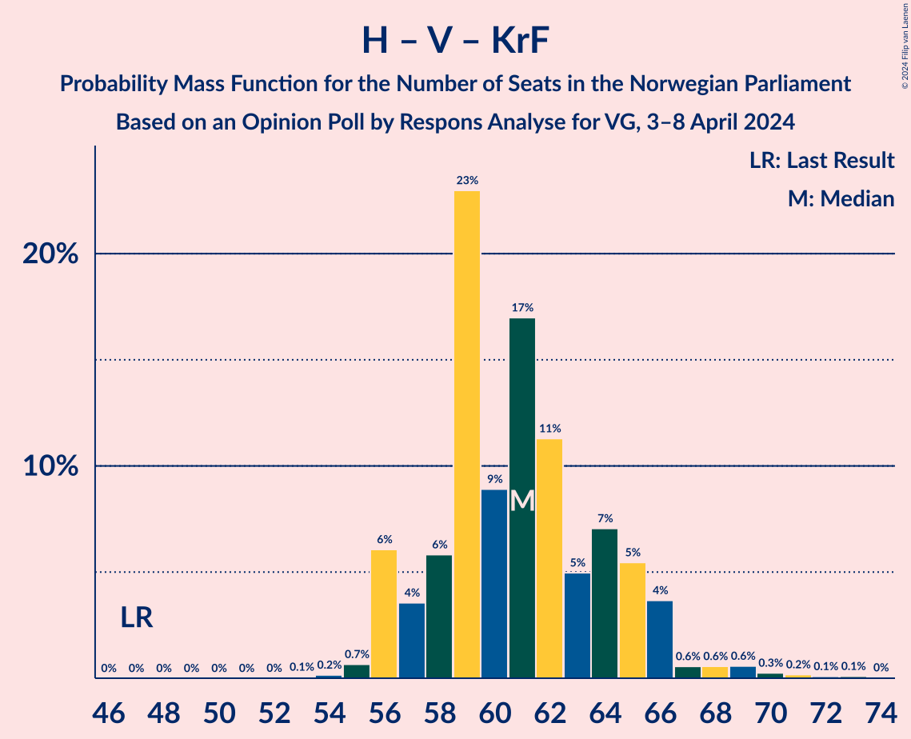

| Number of Seats | Probability | Accumulated | Special Marks |
|:---------------:|:-----------:|:-----------:|:-------------:|
| 47 | 0% | 100% | Last Result |
| 48 | 0% | 100% |  |
| 49 | 0% | 100% |  |
| 50 | 0% | 100% |  |
| 51 | 0% | 100% |  |
| 52 | 0% | 100% |  |
| 53 | 0.1% | 100% |  |
| 54 | 0.2% | 99.9% |  |
| 55 | 0.7% | 99.8% |  |
| 56 | 6% | 99.1% |  |
| 57 | 4% | 93% |  |
| 58 | 6% | 89% |  |
| 59 | 23% | 84% |  |
| 60 | 9% | 61% | Median |
| 61 | 17% | 52% |  |
| 62 | 11% | 35% |  |
| 63 | 5% | 23% |  |
| 64 | 7% | 19% |  |
| 65 | 5% | 11% |  |
| 66 | 4% | 6% |  |
| 67 | 0.6% | 2% |  |
| 68 | 0.6% | 2% |  |
| 69 | 0.6% | 1.2% |  |
| 70 | 0.3% | 0.6% |  |
| 71 | 0.2% | 0.4% |  |
| 72 | 0.1% | 0.2% |  |
| 73 | 0.1% | 0.1% |  |
| 74 | 0% | 0% |  |

### Arbeiderpartiet – Senterpartiet – Miljøpartiet De Grønne – Kristelig Folkeparti

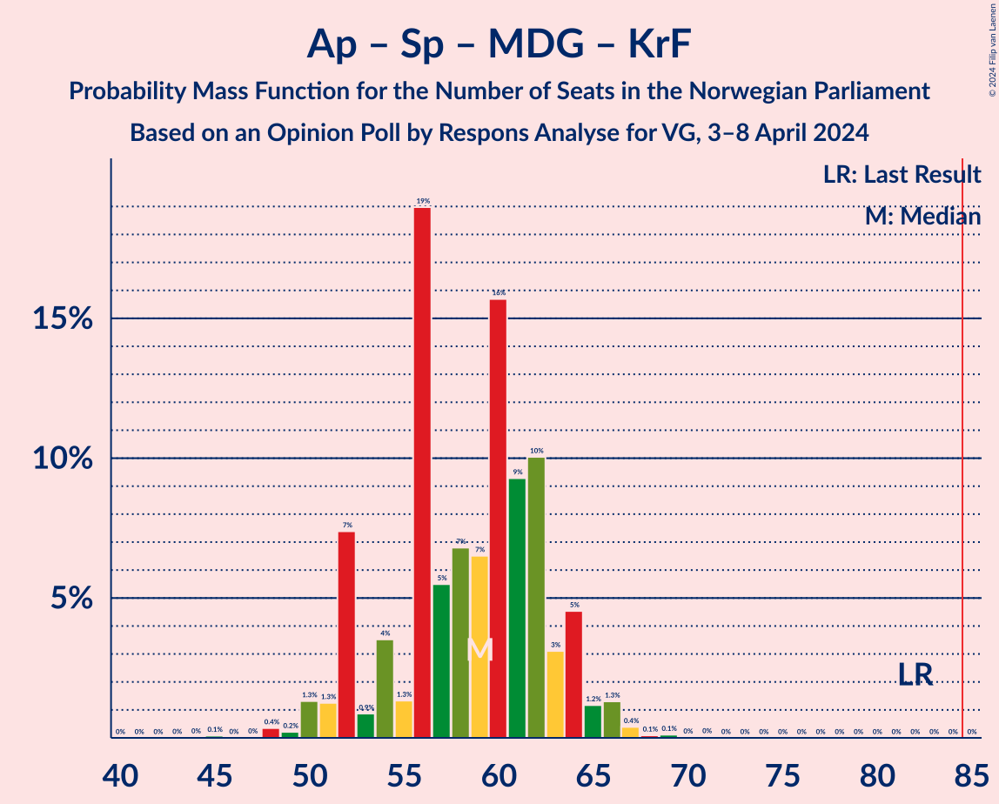

| Number of Seats | Probability | Accumulated | Special Marks |
|:---------------:|:-----------:|:-----------:|:-------------:|
| 45 | 0.1% | 100% |  |
| 46 | 0% | 99.9% |  |
| 47 | 0% | 99.9% |  |
| 48 | 0.4% | 99.9% |  |
| 49 | 0.2% | 99.5% |  |
| 50 | 1.3% | 99.3% |  |
| 51 | 1.3% | 98% |  |
| 52 | 7% | 97% |  |
| 53 | 0.9% | 89% |  |
| 54 | 4% | 88% |  |
| 55 | 1.3% | 85% |  |
| 56 | 19% | 84% |  |
| 57 | 5% | 65% |  |
| 58 | 7% | 59% |  |
| 59 | 7% | 52% | Median |
| 60 | 16% | 46% |  |
| 61 | 9% | 30% |  |
| 62 | 10% | 21% |  |
| 63 | 3% | 11% |  |
| 64 | 5% | 8% |  |
| 65 | 1.2% | 3% |  |
| 66 | 1.3% | 2% |  |
| 67 | 0.4% | 0.7% |  |
| 68 | 0.1% | 0.3% |  |
| 69 | 0.1% | 0.2% |  |
| 70 | 0% | 0.1% |  |
| 71 | 0% | 0% |  |
| 72 | 0% | 0% |  |
| 73 | 0% | 0% |  |
| 74 | 0% | 0% |  |
| 75 | 0% | 0% |  |
| 76 | 0% | 0% |  |
| 77 | 0% | 0% |  |
| 78 | 0% | 0% |  |
| 79 | 0% | 0% |  |
| 80 | 0% | 0% |  |
| 81 | 0% | 0% |  |
| 82 | 0% | 0% | Last Result |

### Arbeiderpartiet – Sosialistisk Venstreparti

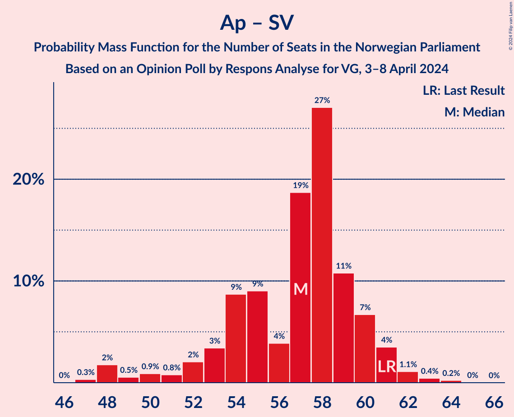

| Number of Seats | Probability | Accumulated | Special Marks |
|:---------------:|:-----------:|:-----------:|:-------------:|
| 46 | 0% | 100% |  |
| 47 | 0.3% | 99.9% |  |
| 48 | 2% | 99.6% |  |
| 49 | 0.5% | 98% |  |
| 50 | 0.9% | 97% |  |
| 51 | 0.8% | 96% |  |
| 52 | 2% | 96% |  |
| 53 | 3% | 94% |  |
| 54 | 9% | 90% |  |
| 55 | 9% | 81% |  |
| 56 | 4% | 72% |  |
| 57 | 19% | 69% | Median |
| 58 | 27% | 50% |  |
| 59 | 11% | 23% |  |
| 60 | 7% | 12% |  |
| 61 | 4% | 5% | Last Result |
| 62 | 1.1% | 2% |  |
| 63 | 0.4% | 0.7% |  |
| 64 | 0.2% | 0.3% |  |
| 65 | 0% | 0.1% |  |
| 66 | 0% | 0% |  |

### Arbeiderpartiet – Senterpartiet – Kristelig Folkeparti

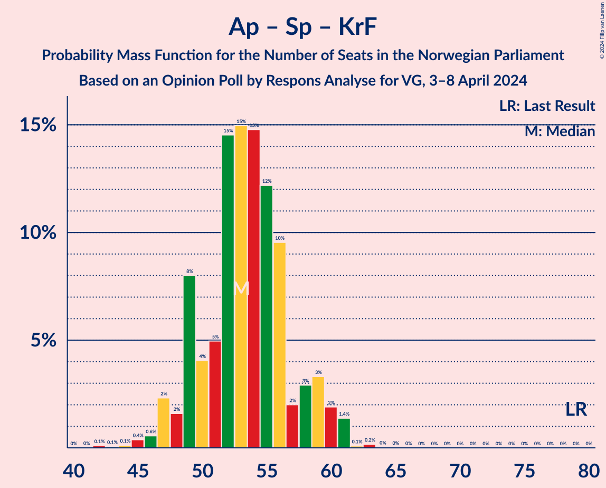

| Number of Seats | Probability | Accumulated | Special Marks |
|:---------------:|:-----------:|:-----------:|:-------------:|
| 42 | 0.1% | 100% |  |
| 43 | 0.1% | 99.9% |  |
| 44 | 0.1% | 99.8% |  |
| 45 | 0.4% | 99.7% |  |
| 46 | 0.6% | 99.3% |  |
| 47 | 2% | 98.8% |  |
| 48 | 2% | 96% |  |
| 49 | 8% | 95% |  |
| 50 | 4% | 87% |  |
| 51 | 5% | 83% |  |
| 52 | 15% | 78% | Median |
| 53 | 15% | 63% |  |
| 54 | 15% | 48% |  |
| 55 | 12% | 34% |  |
| 56 | 10% | 21% |  |
| 57 | 2% | 12% |  |
| 58 | 3% | 10% |  |
| 59 | 3% | 7% |  |
| 60 | 2% | 4% |  |
| 61 | 1.4% | 2% |  |
| 62 | 0.1% | 0.3% |  |
| 63 | 0.2% | 0.2% |  |
| 64 | 0% | 0.1% |  |
| 65 | 0% | 0% |  |
| 66 | 0% | 0% |  |
| 67 | 0% | 0% |  |
| 68 | 0% | 0% |  |
| 69 | 0% | 0% |  |
| 70 | 0% | 0% |  |
| 71 | 0% | 0% |  |
| 72 | 0% | 0% |  |
| 73 | 0% | 0% |  |
| 74 | 0% | 0% |  |
| 75 | 0% | 0% |  |
| 76 | 0% | 0% |  |
| 77 | 0% | 0% |  |
| 78 | 0% | 0% |  |
| 79 | 0% | 0% | Last Result |

### Arbeiderpartiet – Senterpartiet

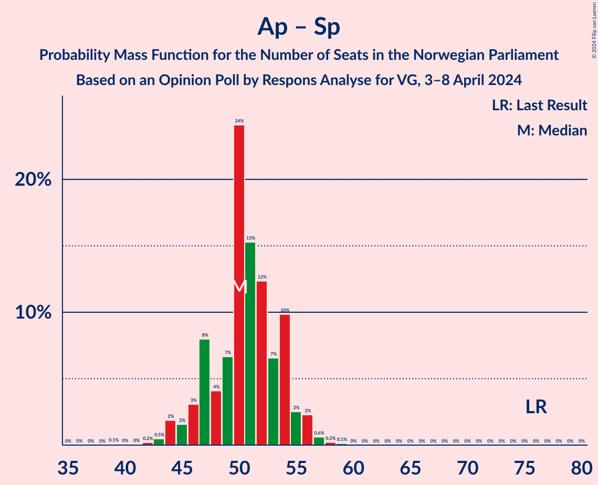

| Number of Seats | Probability | Accumulated | Special Marks |
|:---------------:|:-----------:|:-----------:|:-------------:|
| 39 | 0.1% | 100% |  |
| 40 | 0% | 99.9% |  |
| 41 | 0% | 99.9% |  |
| 42 | 0.2% | 99.8% |  |
| 43 | 0.5% | 99.6% |  |
| 44 | 2% | 99.1% |  |
| 45 | 2% | 97% |  |
| 46 | 3% | 96% |  |
| 47 | 8% | 93% |  |
| 48 | 4% | 85% |  |
| 49 | 7% | 81% |  |
| 50 | 24% | 74% | Median |
| 51 | 15% | 50% |  |
| 52 | 12% | 35% |  |
| 53 | 7% | 22% |  |
| 54 | 10% | 16% |  |
| 55 | 3% | 6% |  |
| 56 | 2% | 3% |  |
| 57 | 0.6% | 1.0% |  |
| 58 | 0.2% | 0.4% |  |
| 59 | 0.1% | 0.1% |  |
| 60 | 0% | 0% |  |
| 61 | 0% | 0% |  |
| 62 | 0% | 0% |  |
| 63 | 0% | 0% |  |
| 64 | 0% | 0% |  |
| 65 | 0% | 0% |  |
| 66 | 0% | 0% |  |
| 67 | 0% | 0% |  |
| 68 | 0% | 0% |  |
| 69 | 0% | 0% |  |
| 70 | 0% | 0% |  |
| 71 | 0% | 0% |  |
| 72 | 0% | 0% |  |
| 73 | 0% | 0% |  |
| 74 | 0% | 0% |  |
| 75 | 0% | 0% |  |
| 76 | 0% | 0% | Last Result |

### Senterpartiet – Venstre – Kristelig Folkeparti

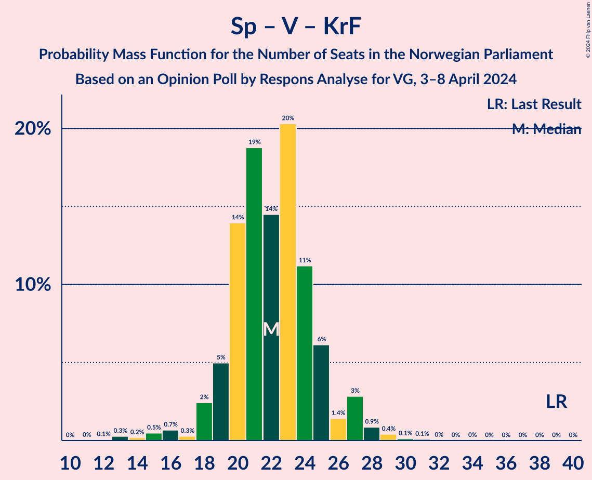

| Number of Seats | Probability | Accumulated | Special Marks |
|:---------------:|:-----------:|:-----------:|:-------------:|
| 12 | 0.1% | 100% |  |
| 13 | 0.3% | 99.9% |  |
| 14 | 0.2% | 99.6% |  |
| 15 | 0.5% | 99.5% |  |
| 16 | 0.7% | 99.0% |  |
| 17 | 0.3% | 98% |  |
| 18 | 2% | 98% |  |
| 19 | 5% | 96% |  |
| 20 | 14% | 91% |  |
| 21 | 19% | 77% | Median |
| 22 | 14% | 58% |  |
| 23 | 20% | 43% |  |
| 24 | 11% | 23% |  |
| 25 | 6% | 12% |  |
| 26 | 1.4% | 6% |  |
| 27 | 3% | 4% |  |
| 28 | 0.9% | 1.5% |  |
| 29 | 0.4% | 0.6% |  |
| 30 | 0.1% | 0.2% |  |
| 31 | 0.1% | 0.1% |  |
| 32 | 0% | 0% |  |
| 33 | 0% | 0% |  |
| 34 | 0% | 0% |  |
| 35 | 0% | 0% |  |
| 36 | 0% | 0% |  |
| 37 | 0% | 0% |  |
| 38 | 0% | 0% |  |
| 39 | 0% | 0% | Last Result |

## Technical Information

### Opinion Poll

+ **Polling firm:** Respons Analyse
+ **Commissioner(s):** VG
+ **Fieldwork period:** 3–8 April 2024

### Calculations

+ **Sample size:** 1001
+ **Simulations done:** 1,048,576
+ **Error estimate:** 1.04%

