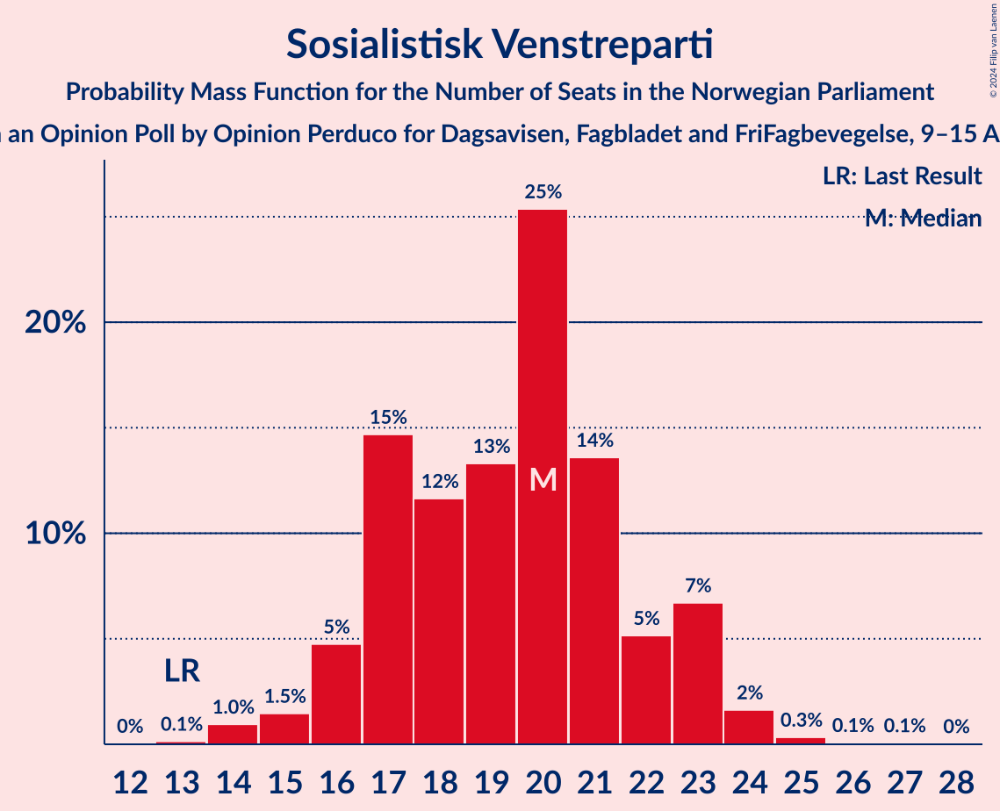
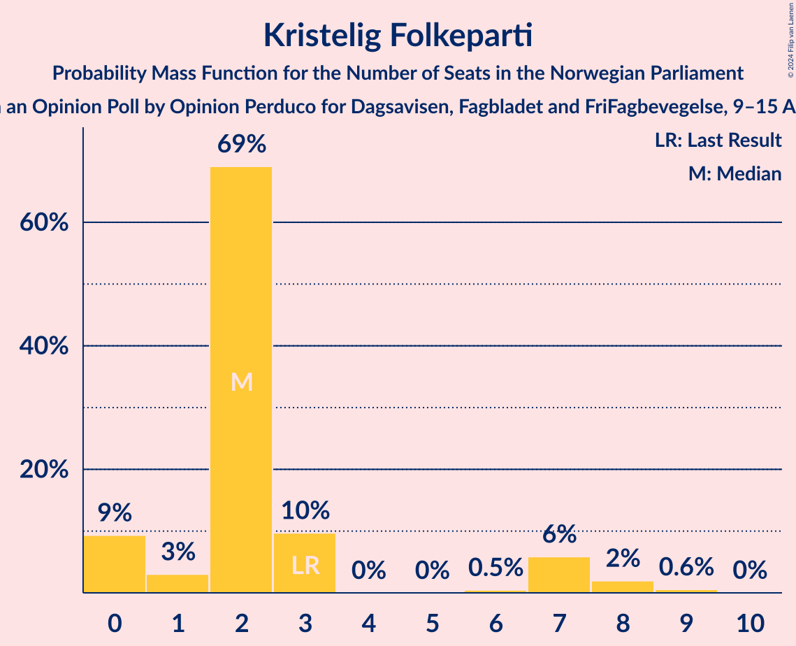
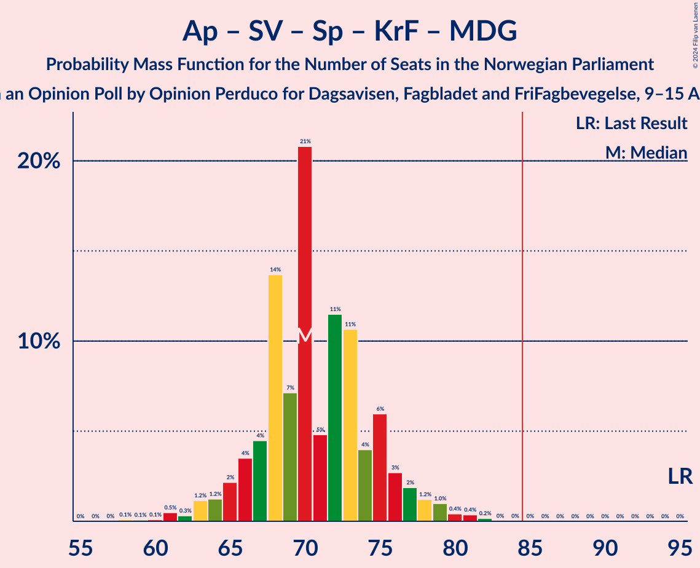

# Opinion Poll by Opinion Perduco for Dagsavisen, Fagbladet and FriFagbevegelse, 9–15 April 2024

<a href="#voting-intentions">Voting Intentions</a> | <a href="#seats">Seats</a> | <a href="#coalitions">Coalitions</a> | <a href="#technical-information">Technical Information</a>

## Voting Intentions

### Confidence Intervals

| Party | Last Result | Poll Result | 80% Confidence Interval | 90% Confidence Interval | 95% Confidence Interval | 99% Confidence Interval |
|:-----:|:-----------:|:-----------:|:-----------------------:|:-----------------------:|:-----------------------:|:-----------------------:|
| Høyre | 20.4% | 22.2% | 20.3–24.2% |19.8–24.8% |19.3–25.3% |18.4–26.3% |
| Arbeiderpartiet | 26.2% | 19.3% | 17.5–21.3% |17.1–21.9% |16.6–22.3% |15.8–23.3% |
| Fremskrittspartiet | 11.6% | 16.7% | 15.1–18.6% |14.6–19.1% |14.2–19.6% |13.4–20.5% |
| Sosialistisk Venstreparti | 7.6% | 10.9% | 9.5–12.5% |9.1–13.0% |8.8–13.4% |8.2–14.2% |
| Venstre | 4.6% | 7.3% | 6.2–8.7% |5.9–9.1% |5.7–9.5% |5.2–10.2% |
| Senterpartiet | 13.5% | 6.0% | 5.0–7.3% |4.7–7.6% |4.5–8.0% |4.1–8.6% |
| Rødt | 4.7% | 5.9% | 4.9–7.1% |4.6–7.5% |4.4–7.8% |3.9–8.4% |
| Kristelig Folkeparti | 3.8% | 3.0% | 2.3–4.0% |2.1–4.3% |2.0–4.5% |1.7–5.0% |
| Miljøpartiet De Grønne | 3.9% | 2.9% | 2.2–3.8% |2.0–4.1% |1.9–4.3% |1.6–4.8% |
| Industri- og Næringspartiet | 0.3% | 2.7% | 2.1–3.7% |1.9–3.9% |1.8–4.2% |1.5–4.7% |

*Note:* The poll result column reflects the actual value used in the calculations. Published results may vary slightly, and in addition be rounded to fewer digits.

## Seats

### Confidence Intervals

| Party | Last Result | Median | 80% Confidence Interval | 90% Confidence Interval | 95% Confidence Interval | 99% Confidence Interval |
|:-----:|:-----------:|:------:|:-----------------------:|:-----------------------:|:-----------------------:|:-----------------------:|
| <a href="#høyre">Høyre</a> | 36 | 40 | 37–42 |36–44 |35–45 |33–47 |
| <a href="#arbeiderpartiet">Arbeiderpartiet</a> | 48 | 36 | 33–40 |33–40 |32–41 |30–43 |
| <a href="#fremskrittspartiet">Fremskrittspartiet</a> | 21 | 32 | 28–36 |27–37 |25–37 |24–39 |
| <a href="#sosialistisk-venstreparti">Sosialistisk Venstreparti</a> | 13 | 20 | 17–22 |16–23 |15–23 |14–25 |
| <a href="#venstre">Venstre</a> | 8 | 14 | 11–15 |10–16 |10–17 |9–18 |
| <a href="#senterpartiet">Senterpartiet</a> | 28 | 11 | 9–13 |8–14 |8–14 |2–15 |
| <a href="#rødt">Rødt</a> | 8 | 11 | 9–12 |8–13 |8–13 |1–15 |
| <a href="#kristelig-folkeparti">Kristelig Folkeparti</a> | 3 | 2 | 1–3 |0–7 |0–8 |0–9 |
| <a href="#miljøpartiet-de-grønne">Miljøpartiet De Grønne</a> | 3 | 1 | 1–2 |1–3 |1–7 |0–8 |
| <a href="#industri--og-næringspartiet">Industri- og Næringspartiet</a> | 0 | 2 | 0–2 |0–3 |0–7 |0–8 |

### Høyre

*For a full overview of the results for this party, see the [Høyre](party-høyre.html) page.*

| Number of Seats | Probability | Accumulated | Special Marks |
|:---------------:|:-----------:|:-----------:|:-------------:|
| 31 | 0.1% | 100% |  |
| 32 | 0.3% | 99.9% |  |
| 33 | 0.4% | 99.6% |  |
| 34 | 1.4% | 99.1% |  |
| 35 | 2% | 98% |  |
| 36 | 4% | 96% | Last Result |
| 37 | 7% | 92% |  |
| 38 | 7% | 85% |  |
| 39 | 23% | 78% |  |
| 40 | 13% | 55% | Median |
| 41 | 18% | 42% |  |
| 42 | 14% | 24% |  |
| 43 | 4% | 10% |  |
| 44 | 3% | 6% |  |
| 45 | 2% | 3% |  |
| 46 | 0.3% | 1.0% |  |
| 47 | 0.4% | 0.7% |  |
| 48 | 0.1% | 0.3% |  |
| 49 | 0.1% | 0.1% |  |
| 50 | 0.1% | 0.1% |  |
| 51 | 0% | 0% |  |

### Arbeiderpartiet

*For a full overview of the results for this party, see the [Arbeiderpartiet](party-arbeiderpartiet.html) page.*

| Number of Seats | Probability | Accumulated | Special Marks |
|:---------------:|:-----------:|:-----------:|:-------------:|
| 29 | 0.1% | 100% |  |
| 30 | 0.4% | 99.9% |  |
| 31 | 0.7% | 99.5% |  |
| 32 | 3% | 98.7% |  |
| 33 | 6% | 95% |  |
| 34 | 25% | 89% |  |
| 35 | 5% | 64% |  |
| 36 | 12% | 59% | Median |
| 37 | 12% | 47% |  |
| 38 | 17% | 35% |  |
| 39 | 7% | 18% |  |
| 40 | 7% | 11% |  |
| 41 | 2% | 3% |  |
| 42 | 0.8% | 1.5% |  |
| 43 | 0.3% | 0.7% |  |
| 44 | 0.1% | 0.4% |  |
| 45 | 0.2% | 0.3% |  |
| 46 | 0.1% | 0.2% |  |
| 47 | 0% | 0% |  |
| 48 | 0% | 0% | Last Result |

### Fremskrittspartiet

*For a full overview of the results for this party, see the [Fremskrittspartiet](party-fremskrittspartiet.html) page.*

| Number of Seats | Probability | Accumulated | Special Marks |
|:---------------:|:-----------:|:-----------:|:-------------:|
| 21 | 0% | 100% | Last Result |
| 22 | 0% | 100% |  |
| 23 | 0.3% | 100% |  |
| 24 | 1.1% | 99.7% |  |
| 25 | 2% | 98.6% |  |
| 26 | 2% | 97% |  |
| 27 | 4% | 95% |  |
| 28 | 5% | 92% |  |
| 29 | 8% | 86% |  |
| 30 | 12% | 78% |  |
| 31 | 8% | 67% |  |
| 32 | 23% | 59% | Median |
| 33 | 9% | 36% |  |
| 34 | 4% | 27% |  |
| 35 | 12% | 23% |  |
| 36 | 6% | 11% |  |
| 37 | 3% | 5% |  |
| 38 | 1.1% | 2% |  |
| 39 | 0.2% | 0.7% |  |
| 40 | 0.2% | 0.4% |  |
| 41 | 0.2% | 0.2% |  |
| 42 | 0% | 0% |  |

### Sosialistisk Venstreparti

*For a full overview of the results for this party, see the [Sosialistisk Venstreparti](party-sosialistiskvenstreparti.html) page.*

| Number of Seats | Probability | Accumulated | Special Marks |
|:---------------:|:-----------:|:-----------:|:-------------:|
| 12 | 0% | 100% |  |
| 13 | 0.1% | 99.9% | Last Result |
| 14 | 1.0% | 99.8% |  |
| 15 | 1.5% | 98.9% |  |
| 16 | 5% | 97% |  |
| 17 | 15% | 93% |  |
| 18 | 12% | 78% |  |
| 19 | 13% | 66% |  |
| 20 | 25% | 53% | Median |
| 21 | 14% | 28% |  |
| 22 | 5% | 14% |  |
| 23 | 7% | 9% |  |
| 24 | 2% | 2% |  |
| 25 | 0.3% | 0.5% |  |
| 26 | 0.1% | 0.2% |  |
| 27 | 0.1% | 0.1% |  |
| 28 | 0% | 0% |  |

### Venstre

*For a full overview of the results for this party, see the [Venstre](party-venstre.html) page.*

| Number of Seats | Probability | Accumulated | Special Marks |
|:---------------:|:-----------:|:-----------:|:-------------:|
| 8 | 0.2% | 100% | Last Result |
| 9 | 1.3% | 99.8% |  |
| 10 | 8% | 98.5% |  |
| 11 | 15% | 91% |  |
| 12 | 9% | 76% |  |
| 13 | 17% | 67% |  |
| 14 | 37% | 50% | Median |
| 15 | 5% | 13% |  |
| 16 | 4% | 8% |  |
| 17 | 3% | 4% |  |
| 18 | 0.8% | 1.0% |  |
| 19 | 0.2% | 0.2% |  |
| 20 | 0% | 0.1% |  |
| 21 | 0% | 0% |  |

### Senterpartiet

*For a full overview of the results for this party, see the [Senterpartiet](party-senterpartiet.html) page.*

| Number of Seats | Probability | Accumulated | Special Marks |
|:---------------:|:-----------:|:-----------:|:-------------:|
| 1 | 0.4% | 100% |  |
| 2 | 0.2% | 99.5% |  |
| 3 | 0% | 99.3% |  |
| 4 | 0% | 99.3% |  |
| 5 | 0% | 99.3% |  |
| 6 | 0.1% | 99.3% |  |
| 7 | 1.2% | 99.2% |  |
| 8 | 6% | 98% |  |
| 9 | 18% | 92% |  |
| 10 | 16% | 73% |  |
| 11 | 11% | 57% | Median |
| 12 | 15% | 46% |  |
| 13 | 25% | 31% |  |
| 14 | 4% | 6% |  |
| 15 | 2% | 2% |  |
| 16 | 0.3% | 0.4% |  |
| 17 | 0.1% | 0.1% |  |
| 18 | 0% | 0% |  |
| 19 | 0% | 0% |  |
| 20 | 0% | 0% |  |
| 21 | 0% | 0% |  |
| 22 | 0% | 0% |  |
| 23 | 0% | 0% |  |
| 24 | 0% | 0% |  |
| 25 | 0% | 0% |  |
| 26 | 0% | 0% |  |
| 27 | 0% | 0% |  |
| 28 | 0% | 0% | Last Result |

### Rødt

*For a full overview of the results for this party, see the [Rødt](party-rødt.html) page.*

| Number of Seats | Probability | Accumulated | Special Marks |
|:---------------:|:-----------:|:-----------:|:-------------:|
| 1 | 0.6% | 100% |  |
| 2 | 0% | 99.4% |  |
| 3 | 0% | 99.4% |  |
| 4 | 0% | 99.4% |  |
| 5 | 0% | 99.4% |  |
| 6 | 0.1% | 99.4% |  |
| 7 | 1.2% | 99.3% |  |
| 8 | 8% | 98% | Last Result |
| 9 | 13% | 90% |  |
| 10 | 25% | 77% |  |
| 11 | 31% | 52% | Median |
| 12 | 12% | 21% |  |
| 13 | 7% | 9% |  |
| 14 | 1.3% | 2% |  |
| 15 | 0.6% | 0.8% |  |
| 16 | 0.2% | 0.2% |  |
| 17 | 0% | 0% |  |

### Kristelig Folkeparti

*For a full overview of the results for this party, see the [Kristelig Folkeparti](party-kristeligfolkeparti.html) page.*

| Number of Seats | Probability | Accumulated | Special Marks |
|:---------------:|:-----------:|:-----------:|:-------------:|
| 0 | 9% | 100% |  |
| 1 | 3% | 91% |  |
| 2 | 69% | 88% | Median |
| 3 | 10% | 19% | Last Result |
| 4 | 0% | 9% |  |
| 5 | 0% | 9% |  |
| 6 | 0.5% | 9% |  |
| 7 | 6% | 8% |  |
| 8 | 2% | 3% |  |
| 9 | 0.6% | 0.6% |  |
| 10 | 0% | 0% |  |

### Miljøpartiet De Grønne

*For a full overview of the results for this party, see the [Miljøpartiet De Grønne](party-miljøpartietdegrønne.html) page.*

| Number of Seats | Probability | Accumulated | Special Marks |
|:---------------:|:-----------:|:-----------:|:-------------:|
| 0 | 0.6% | 100% |  |
| 1 | 61% | 99.4% | Median |
| 2 | 30% | 38% |  |
| 3 | 4% | 8% | Last Result |
| 4 | 0% | 4% |  |
| 5 | 0% | 4% |  |
| 6 | 0.2% | 4% |  |
| 7 | 2% | 4% |  |
| 8 | 2% | 2% |  |
| 9 | 0.2% | 0.2% |  |
| 10 | 0% | 0% |  |

### Industri- og Næringspartiet

*For a full overview of the results for this party, see the [Industri- og Næringspartiet](party-industri-ognæringspartiet.html) page.*

| Number of Seats | Probability | Accumulated | Special Marks |
|:---------------:|:-----------:|:-----------:|:-------------:|
| 0 | 31% | 100% | Last Result |
| 1 | 7% | 69% |  |
| 2 | 52% | 62% | Median |
| 3 | 7% | 9% |  |
| 4 | 0% | 3% |  |
| 5 | 0% | 3% |  |
| 6 | 0.1% | 3% |  |
| 7 | 2% | 3% |  |
| 8 | 0.9% | 1.0% |  |
| 9 | 0.1% | 0.1% |  |
| 10 | 0% | 0% |  |

## Coalitions

### Confidence Intervals

| Coalition | Last Result | Median | Majority? | 80% Confidence Interval | 90% Confidence Interval | 95% Confidence Interval | 99% Confidence Interval |
|:---------:|:-----------:|:------:|:---------:|:-----------------------:|:-----------------------:|:-----------------------:|:-----------------------:|
| Høyre – Fremskrittspartiet – Venstre – Senterpartiet – Kristelig Folkeparti | 96 | 99 | 100% | 93–101 | 91–104 | 90–105 | 89–108 |
| Høyre – Fremskrittspartiet – Venstre – Kristelig Folkeparti – Miljøpartiet De Grønne | 71 | 88 | 90% | 85–94 | 82–94 | 81–96 | 80–99 |
| Høyre – Fremskrittspartiet – Venstre – Kristelig Folkeparti | 68 | 87 | 78% | 83–92 | 80–93 | 79–94 | 78–98 |
| Høyre – Fremskrittspartiet – Venstre | 65 | 85 | 58% | 80–90 | 78–90 | 77–92 | 76–95 |
| Arbeiderpartiet – Sosialistisk Venstreparti – Senterpartiet – Rødt – Miljøpartiet De Grønne | 100 | 79 | 5% | 75–83 | 73–85 | 72–85 | 68–88 |
| Arbeiderpartiet – Sosialistisk Venstreparti – Senterpartiet – Rødt | 97 | 78 | 1.3% | 73–81 | 71–82 | 69–84 | 67–86 |
| Arbeiderpartiet – Sosialistisk Venstreparti – Senterpartiet – Kristelig Folkeparti – Miljøpartiet De Grønne | 95 | 70 | 0% | 67–75 | 65–77 | 64–78 | 61–81 |
| Høyre – Fremskrittspartiet | 57 | 71 | 0% | 67–76 | 66–77 | 64–78 | 62–82 |
| Arbeiderpartiet – Sosialistisk Venstreparti – Rødt – Miljøpartiet De Grønne | 72 | 67 | 0% | 64–72 | 63–73 | 61–75 | 58–77 |
| Arbeiderpartiet – Sosialistisk Venstreparti – Senterpartiet – Miljøpartiet De Grønne | 92 | 68 | 0% | 65–72 | 63–74 | 61–75 | 58–79 |
| Arbeiderpartiet – Sosialistisk Venstreparti – Senterpartiet | 89 | 67 | 0% | 63–70 | 61–72 | 59–72 | 57–75 |
| Høyre – Venstre – Kristelig Folkeparti | 47 | 55 | 0% | 51–59 | 50–60 | 49–62 | 47–65 |
| Arbeiderpartiet – Sosialistisk Venstreparti | 61 | 55 | 0% | 53–59 | 51–60 | 50–61 | 47–65 |
| Arbeiderpartiet – Senterpartiet – Kristelig Folkeparti – Miljøpartiet De Grønne | 82 | 51 | 0% | 47–56 | 46–58 | 46–59 | 43–61 |
| Arbeiderpartiet – Senterpartiet – Kristelig Folkeparti | 79 | 49 | 0% | 45–53 | 44–55 | 44–56 | 41–58 |
| Arbeiderpartiet – Senterpartiet | 76 | 47 | 0% | 43–50 | 43–51 | 42–52 | 39–54 |
| Venstre – Senterpartiet – Kristelig Folkeparti | 39 | 26 | 0% | 23–31 | 21–31 | 21–32 | 19–34 |

### Høyre – Fremskrittspartiet – Venstre – Senterpartiet – Kristelig Folkeparti

| Number of Seats | Probability | Accumulated | Special Marks |
|:---------------:|:-----------:|:-----------:|:-------------:|
| 85 | 0% | 100% | Majority |
| 86 | 0.1% | 99.9% |  |
| 87 | 0.1% | 99.8% |  |
| 88 | 0.2% | 99.7% |  |
| 89 | 0.6% | 99.6% |  |
| 90 | 2% | 98.9% |  |
| 91 | 2% | 96% |  |
| 92 | 3% | 95% |  |
| 93 | 6% | 92% |  |
| 94 | 2% | 86% |  |
| 95 | 5% | 84% |  |
| 96 | 7% | 78% | Last Result |
| 97 | 12% | 71% |  |
| 98 | 5% | 59% |  |
| 99 | 9% | 54% | Median |
| 100 | 20% | 44% |  |
| 101 | 15% | 24% |  |
| 102 | 2% | 9% |  |
| 103 | 2% | 7% |  |
| 104 | 2% | 5% |  |
| 105 | 2% | 3% |  |
| 106 | 0.3% | 1.2% |  |
| 107 | 0.3% | 0.9% |  |
| 108 | 0.5% | 0.7% |  |
| 109 | 0% | 0.1% |  |
| 110 | 0.1% | 0.1% |  |
| 111 | 0% | 0% |  |

### Høyre – Fremskrittspartiet – Venstre – Kristelig Folkeparti – Miljøpartiet De Grønne

| Number of Seats | Probability | Accumulated | Special Marks |
|:---------------:|:-----------:|:-----------:|:-------------:|
| 71 | 0% | 100% | Last Result |
| 72 | 0% | 100% |  |
| 73 | 0% | 100% |  |
| 74 | 0% | 100% |  |
| 75 | 0% | 100% |  |
| 76 | 0% | 100% |  |
| 77 | 0% | 100% |  |
| 78 | 0.2% | 99.9% |  |
| 79 | 0.1% | 99.7% |  |
| 80 | 1.3% | 99.6% |  |
| 81 | 3% | 98% |  |
| 82 | 0.7% | 96% |  |
| 83 | 2% | 95% |  |
| 84 | 3% | 93% |  |
| 85 | 8% | 90% | Majority |
| 86 | 10% | 82% |  |
| 87 | 6% | 73% |  |
| 88 | 22% | 66% |  |
| 89 | 7% | 44% | Median |
| 90 | 9% | 38% |  |
| 91 | 4% | 29% |  |
| 92 | 5% | 25% |  |
| 93 | 5% | 20% |  |
| 94 | 10% | 15% |  |
| 95 | 2% | 5% |  |
| 96 | 1.0% | 3% |  |
| 97 | 1.0% | 2% |  |
| 98 | 0.2% | 1.0% |  |
| 99 | 0.6% | 0.8% |  |
| 100 | 0.1% | 0.2% |  |
| 101 | 0.1% | 0.1% |  |
| 102 | 0% | 0% |  |

### Høyre – Fremskrittspartiet – Venstre – Kristelig Folkeparti

| Number of Seats | Probability | Accumulated | Special Marks |
|:---------------:|:-----------:|:-----------:|:-------------:|
| 68 | 0% | 100% | Last Result |
| 69 | 0% | 100% |  |
| 70 | 0% | 100% |  |
| 71 | 0% | 100% |  |
| 72 | 0% | 100% |  |
| 73 | 0% | 100% |  |
| 74 | 0% | 100% |  |
| 75 | 0% | 100% |  |
| 76 | 0.1% | 99.9% |  |
| 77 | 0.2% | 99.8% |  |
| 78 | 0.8% | 99.6% |  |
| 79 | 1.4% | 98.8% |  |
| 80 | 3% | 97% |  |
| 81 | 1.3% | 94% |  |
| 82 | 2% | 93% |  |
| 83 | 8% | 91% |  |
| 84 | 5% | 83% |  |
| 85 | 11% | 78% | Majority |
| 86 | 5% | 67% |  |
| 87 | 24% | 62% |  |
| 88 | 9% | 38% | Median |
| 89 | 5% | 29% |  |
| 90 | 3% | 24% |  |
| 91 | 5% | 21% |  |
| 92 | 10% | 16% |  |
| 93 | 2% | 6% |  |
| 94 | 2% | 4% |  |
| 95 | 0.3% | 2% |  |
| 96 | 0.7% | 1.4% |  |
| 97 | 0.1% | 0.7% |  |
| 98 | 0.5% | 0.6% |  |
| 99 | 0% | 0.1% |  |
| 100 | 0% | 0% |  |

### Høyre – Fremskrittspartiet – Venstre

| Number of Seats | Probability | Accumulated | Special Marks |
|:---------------:|:-----------:|:-----------:|:-------------:|
| 65 | 0% | 100% | Last Result |
| 66 | 0% | 100% |  |
| 67 | 0% | 100% |  |
| 68 | 0% | 100% |  |
| 69 | 0% | 100% |  |
| 70 | 0% | 100% |  |
| 71 | 0% | 100% |  |
| 72 | 0% | 100% |  |
| 73 | 0.1% | 100% |  |
| 74 | 0.1% | 99.9% |  |
| 75 | 0.3% | 99.8% |  |
| 76 | 1.2% | 99.5% |  |
| 77 | 3% | 98% |  |
| 78 | 2% | 96% |  |
| 79 | 2% | 93% |  |
| 80 | 2% | 91% |  |
| 81 | 8% | 89% |  |
| 82 | 6% | 81% |  |
| 83 | 11% | 75% |  |
| 84 | 6% | 64% |  |
| 85 | 22% | 58% | Majority |
| 86 | 8% | 35% | Median |
| 87 | 5% | 27% |  |
| 88 | 4% | 22% |  |
| 89 | 3% | 18% |  |
| 90 | 10% | 15% |  |
| 91 | 2% | 5% |  |
| 92 | 2% | 3% |  |
| 93 | 0.3% | 1.2% |  |
| 94 | 0.3% | 0.9% |  |
| 95 | 0.1% | 0.6% |  |
| 96 | 0.3% | 0.5% |  |
| 97 | 0.1% | 0.1% |  |
| 98 | 0% | 0% |  |

### Arbeiderpartiet – Sosialistisk Venstreparti – Senterpartiet – Rødt – Miljøpartiet De Grønne

| Number of Seats | Probability | Accumulated | Special Marks |
|:---------------:|:-----------:|:-----------:|:-------------:|
| 64 | 0.1% | 100% |  |
| 65 | 0% | 99.9% |  |
| 66 | 0.1% | 99.9% |  |
| 67 | 0.1% | 99.8% |  |
| 68 | 0.5% | 99.7% |  |
| 69 | 0.2% | 99.2% |  |
| 70 | 0.8% | 99.1% |  |
| 71 | 0.6% | 98% |  |
| 72 | 2% | 98% |  |
| 73 | 3% | 96% |  |
| 74 | 2% | 93% |  |
| 75 | 4% | 91% |  |
| 76 | 13% | 87% |  |
| 77 | 5% | 74% |  |
| 78 | 5% | 69% |  |
| 79 | 29% | 64% | Median |
| 80 | 5% | 35% |  |
| 81 | 14% | 31% |  |
| 82 | 5% | 17% |  |
| 83 | 5% | 12% |  |
| 84 | 1.3% | 6% |  |
| 85 | 3% | 5% | Majority |
| 86 | 0.8% | 2% |  |
| 87 | 0.6% | 1.5% |  |
| 88 | 0.4% | 0.9% |  |
| 89 | 0.1% | 0.5% |  |
| 90 | 0.3% | 0.3% |  |
| 91 | 0% | 0.1% |  |
| 92 | 0% | 0% |  |
| 93 | 0% | 0% |  |
| 94 | 0% | 0% |  |
| 95 | 0% | 0% |  |
| 96 | 0% | 0% |  |
| 97 | 0% | 0% |  |
| 98 | 0% | 0% |  |
| 99 | 0% | 0% |  |
| 100 | 0% | 0% | Last Result |

### Arbeiderpartiet – Sosialistisk Venstreparti – Senterpartiet – Rødt

| Number of Seats | Probability | Accumulated | Special Marks |
|:---------------:|:-----------:|:-----------:|:-------------:|
| 63 | 0.1% | 100% |  |
| 64 | 0.1% | 99.9% |  |
| 65 | 0.1% | 99.8% |  |
| 66 | 0.1% | 99.7% |  |
| 67 | 0.6% | 99.6% |  |
| 68 | 0.5% | 99.0% |  |
| 69 | 1.3% | 98.5% |  |
| 70 | 2% | 97% |  |
| 71 | 1.3% | 95% |  |
| 72 | 3% | 94% |  |
| 73 | 3% | 91% |  |
| 74 | 13% | 88% |  |
| 75 | 3% | 75% |  |
| 76 | 9% | 71% |  |
| 77 | 4% | 62% |  |
| 78 | 28% | 58% | Median |
| 79 | 3% | 30% |  |
| 80 | 14% | 27% |  |
| 81 | 7% | 13% |  |
| 82 | 1.4% | 6% |  |
| 83 | 2% | 4% |  |
| 84 | 1.4% | 3% |  |
| 85 | 0.6% | 1.3% | Majority |
| 86 | 0.4% | 0.7% |  |
| 87 | 0.1% | 0.3% |  |
| 88 | 0.1% | 0.2% |  |
| 89 | 0.1% | 0.1% |  |
| 90 | 0% | 0% |  |
| 91 | 0% | 0% |  |
| 92 | 0% | 0% |  |
| 93 | 0% | 0% |  |
| 94 | 0% | 0% |  |
| 95 | 0% | 0% |  |
| 96 | 0% | 0% |  |
| 97 | 0% | 0% | Last Result |

### Arbeiderpartiet – Sosialistisk Venstreparti – Senterpartiet – Kristelig Folkeparti – Miljøpartiet De Grønne

| Number of Seats | Probability | Accumulated | Special Marks |
|:---------------:|:-----------:|:-----------:|:-------------:|
| 58 | 0.1% | 100% |  |
| 59 | 0.1% | 99.9% |  |
| 60 | 0.1% | 99.8% |  |
| 61 | 0.5% | 99.7% |  |
| 62 | 0.3% | 99.2% |  |
| 63 | 1.2% | 98.9% |  |
| 64 | 1.2% | 98% |  |
| 65 | 2% | 97% |  |
| 66 | 4% | 94% |  |
| 67 | 4% | 91% |  |
| 68 | 14% | 86% |  |
| 69 | 7% | 73% |  |
| 70 | 21% | 66% | Median |
| 71 | 5% | 45% |  |
| 72 | 11% | 40% |  |
| 73 | 11% | 28% |  |
| 74 | 4% | 18% |  |
| 75 | 6% | 14% |  |
| 76 | 3% | 8% |  |
| 77 | 2% | 5% |  |
| 78 | 1.2% | 3% |  |
| 79 | 1.0% | 2% |  |
| 80 | 0.4% | 1.0% |  |
| 81 | 0.4% | 0.6% |  |
| 82 | 0.2% | 0.2% |  |
| 83 | 0% | 0.1% |  |
| 84 | 0% | 0% |  |
| 85 | 0% | 0% | Majority |
| 86 | 0% | 0% |  |
| 87 | 0% | 0% |  |
| 88 | 0% | 0% |  |
| 89 | 0% | 0% |  |
| 90 | 0% | 0% |  |
| 91 | 0% | 0% |  |
| 92 | 0% | 0% |  |
| 93 | 0% | 0% |  |
| 94 | 0% | 0% |  |
| 95 | 0% | 0% | Last Result |

### Høyre – Fremskrittspartiet

| Number of Seats | Probability | Accumulated | Special Marks |
|:---------------:|:-----------:|:-----------:|:-------------:|
| 57 | 0% | 100% | Last Result |
| 58 | 0% | 100% |  |
| 59 | 0% | 100% |  |
| 60 | 0% | 100% |  |
| 61 | 0.1% | 99.9% |  |
| 62 | 0.4% | 99.9% |  |
| 63 | 1.1% | 99.4% |  |
| 64 | 1.2% | 98% |  |
| 65 | 1.1% | 97% |  |
| 66 | 3% | 96% |  |
| 67 | 6% | 93% |  |
| 68 | 8% | 87% |  |
| 69 | 5% | 79% |  |
| 70 | 5% | 75% |  |
| 71 | 21% | 70% |  |
| 72 | 13% | 49% | Median |
| 73 | 8% | 36% |  |
| 74 | 6% | 28% |  |
| 75 | 3% | 22% |  |
| 76 | 12% | 19% |  |
| 77 | 2% | 7% |  |
| 78 | 3% | 5% |  |
| 79 | 0.5% | 2% |  |
| 80 | 0.4% | 1.0% |  |
| 81 | 0.1% | 0.6% |  |
| 82 | 0.3% | 0.5% |  |
| 83 | 0.2% | 0.3% |  |
| 84 | 0% | 0% |  |

### Arbeiderpartiet – Sosialistisk Venstreparti – Rødt – Miljøpartiet De Grønne

| Number of Seats | Probability | Accumulated | Special Marks |
|:---------------:|:-----------:|:-----------:|:-------------:|
| 56 | 0.1% | 100% |  |
| 57 | 0.1% | 99.9% |  |
| 58 | 0.5% | 99.8% |  |
| 59 | 0.6% | 99.3% |  |
| 60 | 0.4% | 98.7% |  |
| 61 | 0.9% | 98% |  |
| 62 | 2% | 97% |  |
| 63 | 4% | 95% |  |
| 64 | 2% | 91% |  |
| 65 | 5% | 89% |  |
| 66 | 22% | 84% |  |
| 67 | 16% | 62% |  |
| 68 | 5% | 46% | Median |
| 69 | 16% | 41% |  |
| 70 | 9% | 26% |  |
| 71 | 4% | 16% |  |
| 72 | 3% | 12% | Last Result |
| 73 | 5% | 9% |  |
| 74 | 2% | 4% |  |
| 75 | 1.1% | 3% |  |
| 76 | 0.6% | 1.4% |  |
| 77 | 0.4% | 0.8% |  |
| 78 | 0.1% | 0.4% |  |
| 79 | 0.3% | 0.3% |  |
| 80 | 0.1% | 0.1% |  |
| 81 | 0% | 0% |  |

### Arbeiderpartiet – Sosialistisk Venstreparti – Senterpartiet – Miljøpartiet De Grønne

| Number of Seats | Probability | Accumulated | Special Marks |
|:---------------:|:-----------:|:-----------:|:-------------:|
| 56 | 0.1% | 100% |  |
| 57 | 0.1% | 99.9% |  |
| 58 | 0.4% | 99.8% |  |
| 59 | 0.2% | 99.4% |  |
| 60 | 0.5% | 99.2% |  |
| 61 | 1.4% | 98.6% |  |
| 62 | 1.2% | 97% |  |
| 63 | 2% | 96% |  |
| 64 | 2% | 94% |  |
| 65 | 5% | 92% |  |
| 66 | 15% | 87% |  |
| 67 | 10% | 72% |  |
| 68 | 21% | 62% | Median |
| 69 | 8% | 41% |  |
| 70 | 9% | 33% |  |
| 71 | 10% | 24% |  |
| 72 | 4% | 14% |  |
| 73 | 4% | 9% |  |
| 74 | 2% | 5% |  |
| 75 | 1.4% | 3% |  |
| 76 | 0.3% | 1.5% |  |
| 77 | 0.3% | 1.2% |  |
| 78 | 0.3% | 0.9% |  |
| 79 | 0.4% | 0.5% |  |
| 80 | 0.1% | 0.1% |  |
| 81 | 0% | 0.1% |  |
| 82 | 0% | 0% |  |
| 83 | 0% | 0% |  |
| 84 | 0% | 0% |  |
| 85 | 0% | 0% | Majority |
| 86 | 0% | 0% |  |
| 87 | 0% | 0% |  |
| 88 | 0% | 0% |  |
| 89 | 0% | 0% |  |
| 90 | 0% | 0% |  |
| 91 | 0% | 0% |  |
| 92 | 0% | 0% | Last Result |

### Arbeiderpartiet – Sosialistisk Venstreparti – Senterpartiet

| Number of Seats | Probability | Accumulated | Special Marks |
|:---------------:|:-----------:|:-----------:|:-------------:|
| 55 | 0.1% | 100% |  |
| 56 | 0.1% | 99.9% |  |
| 57 | 0.5% | 99.7% |  |
| 58 | 0.3% | 99.2% |  |
| 59 | 2% | 98.9% |  |
| 60 | 1.5% | 97% |  |
| 61 | 1.3% | 96% |  |
| 62 | 2% | 95% |  |
| 63 | 3% | 93% |  |
| 64 | 16% | 89% |  |
| 65 | 8% | 74% |  |
| 66 | 9% | 66% |  |
| 67 | 22% | 57% | Median |
| 68 | 9% | 36% |  |
| 69 | 7% | 26% |  |
| 70 | 11% | 19% |  |
| 71 | 2% | 8% |  |
| 72 | 4% | 7% |  |
| 73 | 1.4% | 2% |  |
| 74 | 0.4% | 1.1% |  |
| 75 | 0.2% | 0.7% |  |
| 76 | 0.1% | 0.5% |  |
| 77 | 0.2% | 0.4% |  |
| 78 | 0.1% | 0.2% |  |
| 79 | 0% | 0.1% |  |
| 80 | 0% | 0% |  |
| 81 | 0% | 0% |  |
| 82 | 0% | 0% |  |
| 83 | 0% | 0% |  |
| 84 | 0% | 0% |  |
| 85 | 0% | 0% | Majority |
| 86 | 0% | 0% |  |
| 87 | 0% | 0% |  |
| 88 | 0% | 0% |  |
| 89 | 0% | 0% | Last Result |

### Høyre – Venstre – Kristelig Folkeparti

| Number of Seats | Probability | Accumulated | Special Marks |
|:---------------:|:-----------:|:-----------:|:-------------:|
| 45 | 0.1% | 100% |  |
| 46 | 0.3% | 99.8% |  |
| 47 | 0.4% | 99.5% | Last Result |
| 48 | 0.8% | 99.1% |  |
| 49 | 1.0% | 98% |  |
| 50 | 2% | 97% |  |
| 51 | 6% | 95% |  |
| 52 | 8% | 89% |  |
| 53 | 4% | 82% |  |
| 54 | 5% | 78% |  |
| 55 | 32% | 72% |  |
| 56 | 6% | 40% | Median |
| 57 | 15% | 34% |  |
| 58 | 8% | 19% |  |
| 59 | 4% | 11% |  |
| 60 | 3% | 7% |  |
| 61 | 1.1% | 4% |  |
| 62 | 2% | 3% |  |
| 63 | 0.2% | 0.9% |  |
| 64 | 0.2% | 0.7% |  |
| 65 | 0.4% | 0.6% |  |
| 66 | 0.1% | 0.2% |  |
| 67 | 0% | 0.1% |  |
| 68 | 0% | 0% |  |

### Arbeiderpartiet – Sosialistisk Venstreparti

| Number of Seats | Probability | Accumulated | Special Marks |
|:---------------:|:-----------:|:-----------:|:-------------:|
| 46 | 0.1% | 100% |  |
| 47 | 0.5% | 99.9% |  |
| 48 | 0.2% | 99.4% |  |
| 49 | 2% | 99.2% |  |
| 50 | 2% | 98% |  |
| 51 | 1.2% | 95% |  |
| 52 | 4% | 94% |  |
| 53 | 8% | 90% |  |
| 54 | 21% | 82% |  |
| 55 | 14% | 60% |  |
| 56 | 5% | 46% | Median |
| 57 | 11% | 41% |  |
| 58 | 15% | 30% |  |
| 59 | 7% | 14% |  |
| 60 | 4% | 7% |  |
| 61 | 1.2% | 3% | Last Result |
| 62 | 0.8% | 2% |  |
| 63 | 0.3% | 1.1% |  |
| 64 | 0.2% | 0.8% |  |
| 65 | 0.3% | 0.5% |  |
| 66 | 0.1% | 0.2% |  |
| 67 | 0.1% | 0.1% |  |
| 68 | 0% | 0% |  |

### Arbeiderpartiet – Senterpartiet – Kristelig Folkeparti – Miljøpartiet De Grønne

| Number of Seats | Probability | Accumulated | Special Marks |
|:---------------:|:-----------:|:-----------:|:-------------:|
| 40 | 0.1% | 100% |  |
| 41 | 0.1% | 99.9% |  |
| 42 | 0.3% | 99.8% |  |
| 43 | 0.4% | 99.5% |  |
| 44 | 0.4% | 99.1% |  |
| 45 | 1.2% | 98.7% |  |
| 46 | 7% | 98% |  |
| 47 | 2% | 91% |  |
| 48 | 5% | 89% |  |
| 49 | 6% | 84% |  |
| 50 | 20% | 78% | Median |
| 51 | 16% | 58% |  |
| 52 | 14% | 42% |  |
| 53 | 9% | 28% |  |
| 54 | 7% | 20% |  |
| 55 | 3% | 13% |  |
| 56 | 3% | 10% |  |
| 57 | 2% | 8% |  |
| 58 | 2% | 5% |  |
| 59 | 1.4% | 3% |  |
| 60 | 0.2% | 1.4% |  |
| 61 | 0.7% | 1.2% |  |
| 62 | 0.1% | 0.4% |  |
| 63 | 0.3% | 0.3% |  |
| 64 | 0% | 0.1% |  |
| 65 | 0% | 0% |  |
| 66 | 0% | 0% |  |
| 67 | 0% | 0% |  |
| 68 | 0% | 0% |  |
| 69 | 0% | 0% |  |
| 70 | 0% | 0% |  |
| 71 | 0% | 0% |  |
| 72 | 0% | 0% |  |
| 73 | 0% | 0% |  |
| 74 | 0% | 0% |  |
| 75 | 0% | 0% |  |
| 76 | 0% | 0% |  |
| 77 | 0% | 0% |  |
| 78 | 0% | 0% |  |
| 79 | 0% | 0% |  |
| 80 | 0% | 0% |  |
| 81 | 0% | 0% |  |
| 82 | 0% | 0% | Last Result |

### Arbeiderpartiet – Senterpartiet – Kristelig Folkeparti

| Number of Seats | Probability | Accumulated | Special Marks |
|:---------------:|:-----------:|:-----------:|:-------------:|
| 39 | 0.1% | 100% |  |
| 40 | 0.1% | 99.8% |  |
| 41 | 0.3% | 99.7% |  |
| 42 | 0.4% | 99.3% |  |
| 43 | 0.6% | 98.9% |  |
| 44 | 4% | 98% |  |
| 45 | 6% | 94% |  |
| 46 | 3% | 88% |  |
| 47 | 3% | 86% |  |
| 48 | 8% | 82% |  |
| 49 | 31% | 74% | Median |
| 50 | 6% | 44% |  |
| 51 | 17% | 37% |  |
| 52 | 5% | 20% |  |
| 53 | 6% | 15% |  |
| 54 | 3% | 9% |  |
| 55 | 2% | 6% |  |
| 56 | 3% | 5% |  |
| 57 | 1.2% | 2% |  |
| 58 | 0.6% | 0.9% |  |
| 59 | 0.1% | 0.3% |  |
| 60 | 0.1% | 0.2% |  |
| 61 | 0% | 0.1% |  |
| 62 | 0% | 0% |  |
| 63 | 0% | 0% |  |
| 64 | 0% | 0% |  |
| 65 | 0% | 0% |  |
| 66 | 0% | 0% |  |
| 67 | 0% | 0% |  |
| 68 | 0% | 0% |  |
| 69 | 0% | 0% |  |
| 70 | 0% | 0% |  |
| 71 | 0% | 0% |  |
| 72 | 0% | 0% |  |
| 73 | 0% | 0% |  |
| 74 | 0% | 0% |  |
| 75 | 0% | 0% |  |
| 76 | 0% | 0% |  |
| 77 | 0% | 0% |  |
| 78 | 0% | 0% |  |
| 79 | 0% | 0% | Last Result |

### Arbeiderpartiet – Senterpartiet

| Number of Seats | Probability | Accumulated | Special Marks |
|:---------------:|:-----------:|:-----------:|:-------------:|
| 37 | 0% | 100% |  |
| 38 | 0.2% | 99.9% |  |
| 39 | 0.3% | 99.7% |  |
| 40 | 0.5% | 99.4% |  |
| 41 | 0.8% | 98.9% |  |
| 42 | 3% | 98% |  |
| 43 | 5% | 95% |  |
| 44 | 5% | 90% |  |
| 45 | 6% | 85% |  |
| 46 | 8% | 79% |  |
| 47 | 31% | 71% | Median |
| 48 | 7% | 40% |  |
| 49 | 16% | 34% |  |
| 50 | 8% | 17% |  |
| 51 | 5% | 9% |  |
| 52 | 2% | 4% |  |
| 53 | 1.5% | 2% |  |
| 54 | 0.6% | 1.0% |  |
| 55 | 0.2% | 0.4% |  |
| 56 | 0.1% | 0.2% |  |
| 57 | 0.1% | 0.1% |  |
| 58 | 0% | 0% |  |
| 59 | 0% | 0% |  |
| 60 | 0% | 0% |  |
| 61 | 0% | 0% |  |
| 62 | 0% | 0% |  |
| 63 | 0% | 0% |  |
| 64 | 0% | 0% |  |
| 65 | 0% | 0% |  |
| 66 | 0% | 0% |  |
| 67 | 0% | 0% |  |
| 68 | 0% | 0% |  |
| 69 | 0% | 0% |  |
| 70 | 0% | 0% |  |
| 71 | 0% | 0% |  |
| 72 | 0% | 0% |  |
| 73 | 0% | 0% |  |
| 74 | 0% | 0% |  |
| 75 | 0% | 0% |  |
| 76 | 0% | 0% | Last Result |

### Venstre – Senterpartiet – Kristelig Folkeparti

| Number of Seats | Probability | Accumulated | Special Marks |
|:---------------:|:-----------:|:-----------:|:-------------:|
| 14 | 0% | 100% |  |
| 15 | 0.1% | 99.9% |  |
| 16 | 0.1% | 99.9% |  |
| 17 | 0% | 99.8% |  |
| 18 | 0.3% | 99.8% |  |
| 19 | 0.5% | 99.5% |  |
| 20 | 1.1% | 99.0% |  |
| 21 | 3% | 98% |  |
| 22 | 4% | 95% |  |
| 23 | 2% | 91% |  |
| 24 | 13% | 89% |  |
| 25 | 24% | 75% |  |
| 26 | 7% | 51% |  |
| 27 | 6% | 44% | Median |
| 28 | 3% | 38% |  |
| 29 | 21% | 35% |  |
| 30 | 3% | 13% |  |
| 31 | 5% | 10% |  |
| 32 | 3% | 5% |  |
| 33 | 0.8% | 2% |  |
| 34 | 0.6% | 0.9% |  |
| 35 | 0.2% | 0.3% |  |
| 36 | 0.1% | 0.1% |  |
| 37 | 0% | 0.1% |  |
| 38 | 0% | 0% |  |
| 39 | 0% | 0% | Last Result |

## Technical Information

### Opinion Poll

+ **Polling firm:** Opinion Perduco
+ **Commissioner(s):** Dagsavisen, Fagbladet and FriFagbevegelse
+ **Fieldwork period:** 9–15 April 2024

### Calculations

+ **Sample size:** 735
+ **Simulations done:** 1,048,576
+ **Error estimate:** 1.89%

