# Opinion Poll by Opinion Perduco for ABC Nyheter and Altinget, 23–29 April 2024

<a href="#voting-intentions">Voting Intentions</a> | <a href="#seats">Seats</a> | <a href="#coalitions">Coalitions</a> | <a href="#technical-information">Technical Information</a>

## Voting Intentions

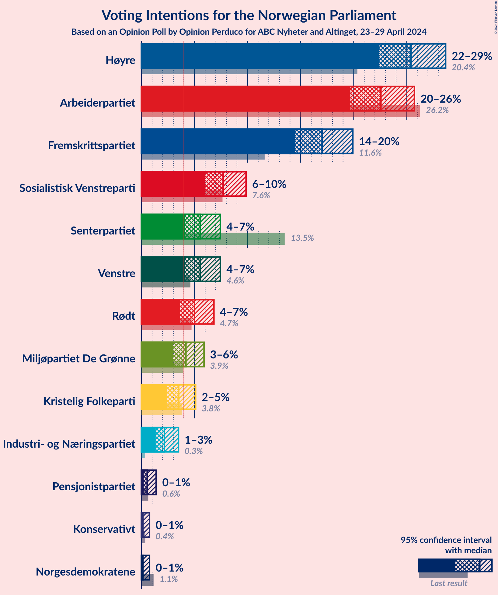

### Confidence Intervals

| Party | Last Result | Poll Result | 80% Confidence Interval | 90% Confidence Interval | 95% Confidence Interval | 99% Confidence Interval |
|:-----:|:-----------:|:-----------:|:-----------------------:|:-----------------------:|:-----------------------:|:-----------------------:|
| Høyre | 20.4% | 25.4% | 23.4–27.5% |22.9–28.2% |22.4–28.7% |21.5–29.7% |
| Arbeiderpartiet | 26.2% | 22.6% | 20.7–24.6% |20.1–25.2% |19.7–25.7% |18.8–26.7% |
| Fremskrittspartiet | 11.6% | 17.0% | 15.4–18.9% |14.9–19.4% |14.5–19.9% |13.7–20.9% |
| Sosialistisk Venstreparti | 7.6% | 7.7% | 6.6–9.1% |6.2–9.5% |6.0–9.9% |5.5–10.6% |
| Venstre | 4.6% | 5.5% | 4.6–6.8% |4.3–7.1% |4.1–7.4% |3.7–8.1% |
| Senterpartiet | 13.5% | 5.5% | 4.6–6.8% |4.3–7.1% |4.1–7.4% |3.7–8.1% |
| Rødt | 4.7% | 5.0% | 4.1–6.2% |3.9–6.5% |3.6–6.8% |3.3–7.4% |
| Miljøpartiet De Grønne | 3.9% | 4.2% | 3.4–5.3% |3.2–5.6% |3.0–5.9% |2.6–6.5% |
| Kristelig Folkeparti | 3.8% | 3.5% | 2.8–4.5% |2.6–4.8% |2.4–5.1% |2.1–5.6% |
| Industri- og Næringspartiet | 0.3% | 2.2% | 1.6–3.0% |1.5–3.3% |1.3–3.5% |1.1–3.9% |
| Pensjonistpartiet | 0.6% | 0.5% | 0.3–1.1% |0.3–1.2% |0.2–1.4% |0.1–1.7% |
| Norgesdemokratene | 1.1% | 0.1% | 0.1–0.5% |0.0–0.6% |0.0–0.8% |0.0–1.0% |
| Konservativt | 0.4% | 0.1% | 0.1–0.5% |0.0–0.6% |0.0–0.8% |0.0–1.0% |

*Note:* The poll result column reflects the actual value used in the calculations. Published results may vary slightly, and in addition be rounded to fewer digits.

## Seats

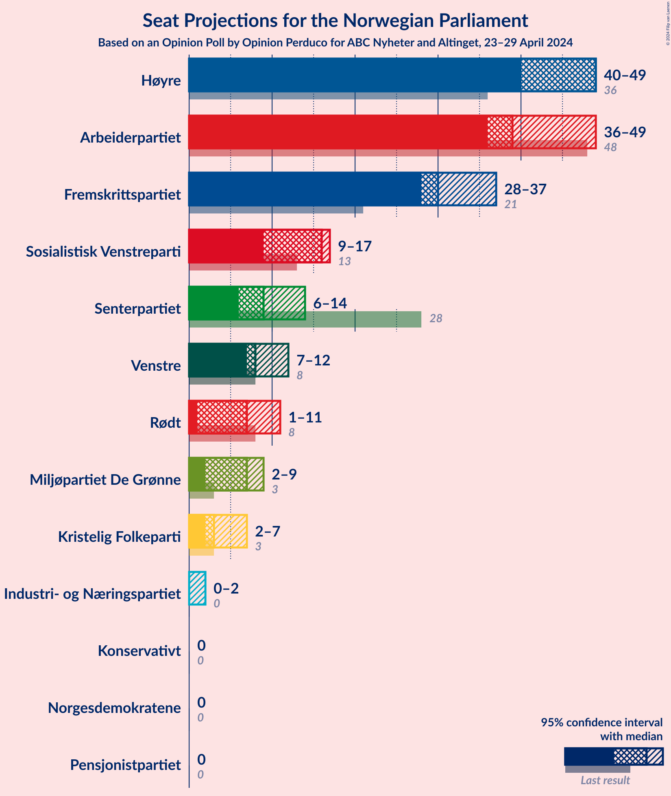

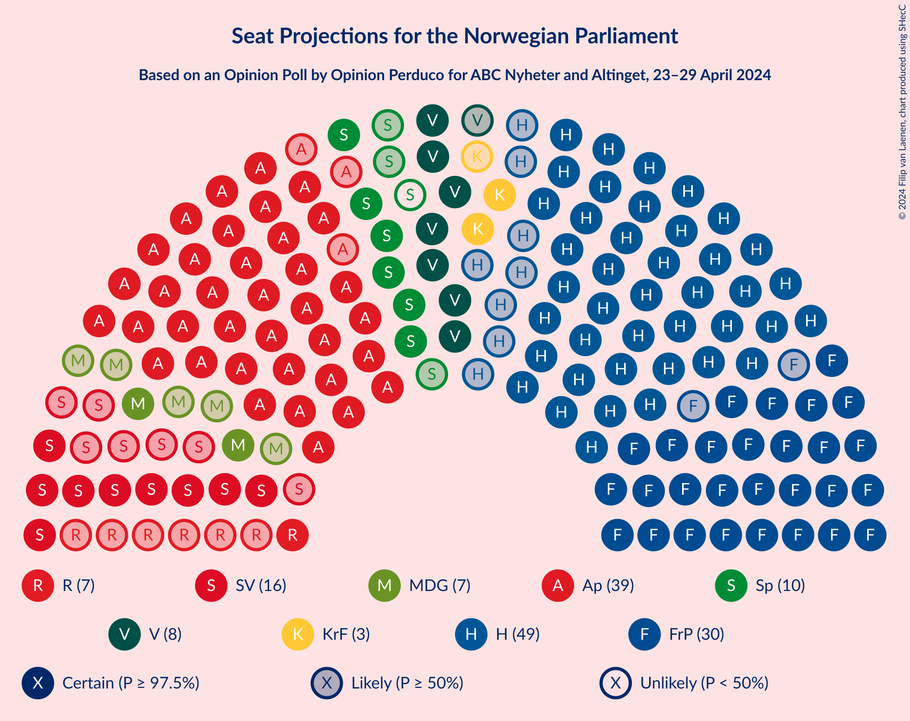

### Confidence Intervals

| Party | Last Result | Median | 80% Confidence Interval | 90% Confidence Interval | 95% Confidence Interval | 99% Confidence Interval |
|:-----:|:-----------:|:------:|:-----------------------:|:-----------------------:|:-----------------------:|:-----------------------:|
| <a href="#høyre">Høyre</a> | 36 | 49 | 43–49 |42–49 |40–49 |39–52 |
| <a href="#arbeiderpartiet">Arbeiderpartiet</a> | 48 | 39 | 39–44 |39–47 |36–49 |34–50 |
| <a href="#fremskrittspartiet">Fremskrittspartiet</a> | 21 | 30 | 30–34 |28–37 |28–37 |26–38 |
| <a href="#sosialistisk-venstreparti">Sosialistisk Venstreparti</a> | 13 | 16 | 10–16 |10–16 |9–17 |8–18 |
| <a href="#venstre">Venstre</a> | 8 | 8 | 7–11 |7–12 |7–12 |2–12 |
| <a href="#senterpartiet">Senterpartiet</a> | 28 | 9 | 8–10 |7–13 |6–14 |1–14 |
| <a href="#rødt">Rødt</a> | 8 | 7 | 7–9 |7–10 |1–11 |1–12 |
| <a href="#miljøpartiet-de-grønne">Miljøpartiet De Grønne</a> | 3 | 7 | 2–7 |2–8 |2–9 |1–9 |
| <a href="#kristelig-folkeparti">Kristelig Folkeparti</a> | 3 | 3 | 2–3 |2–3 |2–7 |0–8 |
| <a href="#industri--og-næringspartiet">Industri- og Næringspartiet</a> | 0 | 0 | 0–2 |0–2 |0–2 |0–6 |
| <a href="#pensjonistpartiet">Pensjonistpartiet</a> | 0 | 0 | 0 |0 |0 |0 |
| <a href="#norgesdemokratene">Norgesdemokratene</a> | 0 | 0 | 0 |0 |0 |0 |
| <a href="#konservativt">Konservativt</a> | 0 | 0 | 0 |0 |0 |0 |

### Høyre

*For a full overview of the results for this party, see the [Høyre](party-høyre.html) page.*

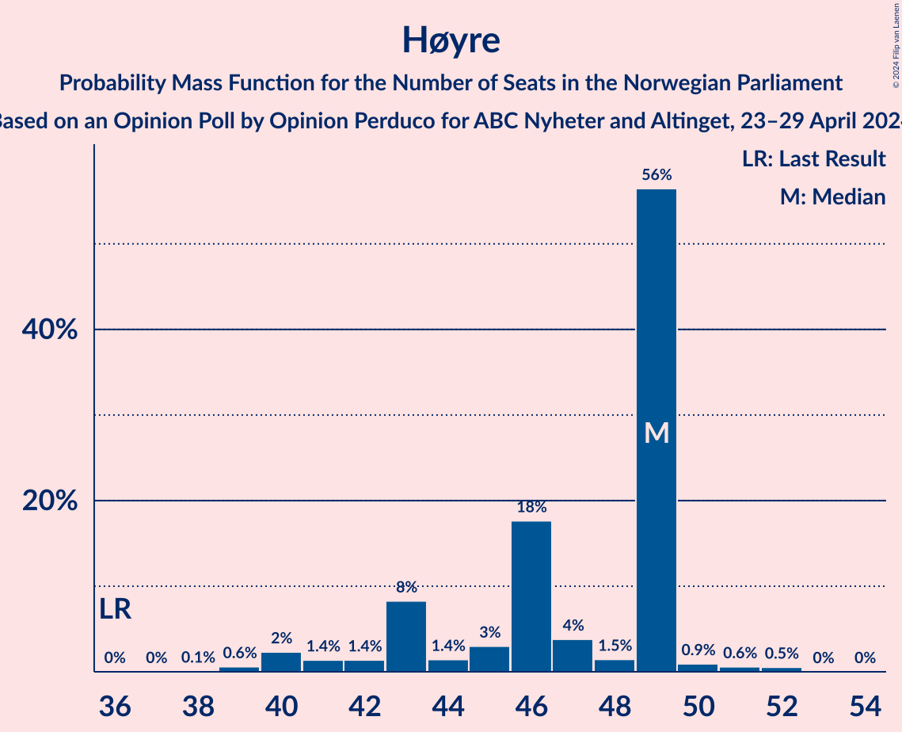

| Number of Seats | Probability | Accumulated | Special Marks |
|:---------------:|:-----------:|:-----------:|:-------------:|
| 36 | 0% | 100% | Last Result |
| 37 | 0% | 99.9% |  |
| 38 | 0.1% | 99.9% |  |
| 39 | 0.6% | 99.8% |  |
| 40 | 2% | 99.2% |  |
| 41 | 1.4% | 97% |  |
| 42 | 1.4% | 96% |  |
| 43 | 8% | 94% |  |
| 44 | 1.4% | 86% |  |
| 45 | 3% | 84% |  |
| 46 | 18% | 81% |  |
| 47 | 4% | 64% |  |
| 48 | 1.5% | 60% |  |
| 49 | 56% | 59% | Median |
| 50 | 0.9% | 2% |  |
| 51 | 0.6% | 1.2% |  |
| 52 | 0.5% | 0.6% |  |
| 53 | 0% | 0% |  |

### Arbeiderpartiet

*For a full overview of the results for this party, see the [Arbeiderpartiet](party-arbeiderpartiet.html) page.*

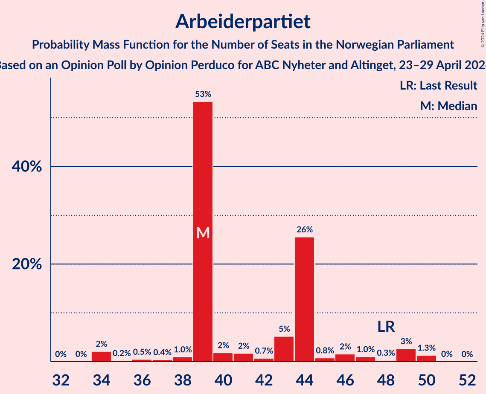

| Number of Seats | Probability | Accumulated | Special Marks |
|:---------------:|:-----------:|:-----------:|:-------------:|
| 34 | 2% | 100% |  |
| 35 | 0.2% | 98% |  |
| 36 | 0.5% | 98% |  |
| 37 | 0.4% | 97% |  |
| 38 | 1.0% | 97% |  |
| 39 | 53% | 96% | Median |
| 40 | 2% | 43% |  |
| 41 | 2% | 41% |  |
| 42 | 0.7% | 39% |  |
| 43 | 5% | 38% |  |
| 44 | 26% | 33% |  |
| 45 | 0.8% | 8% |  |
| 46 | 2% | 7% |  |
| 47 | 1.0% | 5% |  |
| 48 | 0.3% | 4% | Last Result |
| 49 | 3% | 4% |  |
| 50 | 1.3% | 1.3% |  |
| 51 | 0% | 0.1% |  |
| 52 | 0% | 0% |  |

### Fremskrittspartiet

*For a full overview of the results for this party, see the [Fremskrittspartiet](party-fremskrittspartiet.html) page.*

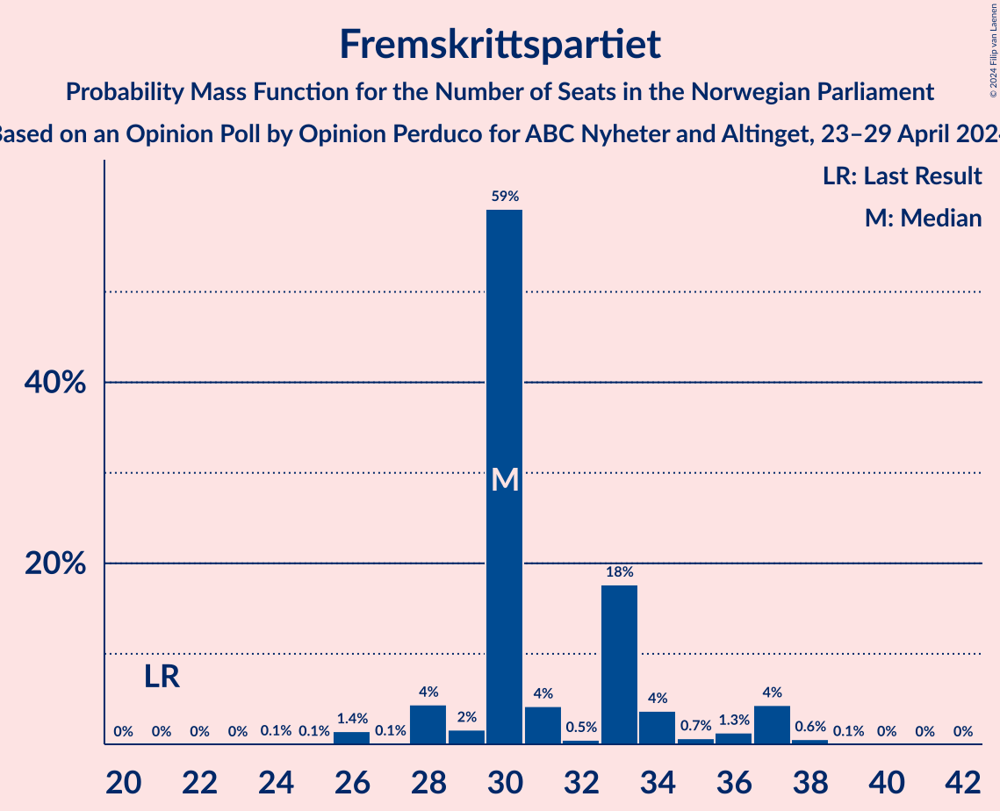

| Number of Seats | Probability | Accumulated | Special Marks |
|:---------------:|:-----------:|:-----------:|:-------------:|
| 21 | 0% | 100% | Last Result |
| 22 | 0% | 100% |  |
| 23 | 0% | 100% |  |
| 24 | 0.1% | 99.9% |  |
| 25 | 0.1% | 99.8% |  |
| 26 | 1.4% | 99.8% |  |
| 27 | 0.1% | 98% |  |
| 28 | 4% | 98% |  |
| 29 | 2% | 94% |  |
| 30 | 59% | 92% | Median |
| 31 | 4% | 33% |  |
| 32 | 0.5% | 29% |  |
| 33 | 18% | 28% |  |
| 34 | 4% | 11% |  |
| 35 | 0.7% | 7% |  |
| 36 | 1.3% | 6% |  |
| 37 | 4% | 5% |  |
| 38 | 0.6% | 0.7% |  |
| 39 | 0.1% | 0.1% |  |
| 40 | 0% | 0.1% |  |
| 41 | 0% | 0% |  |

### Sosialistisk Venstreparti

*For a full overview of the results for this party, see the [Sosialistisk Venstreparti](party-sosialistiskvenstreparti.html) page.*

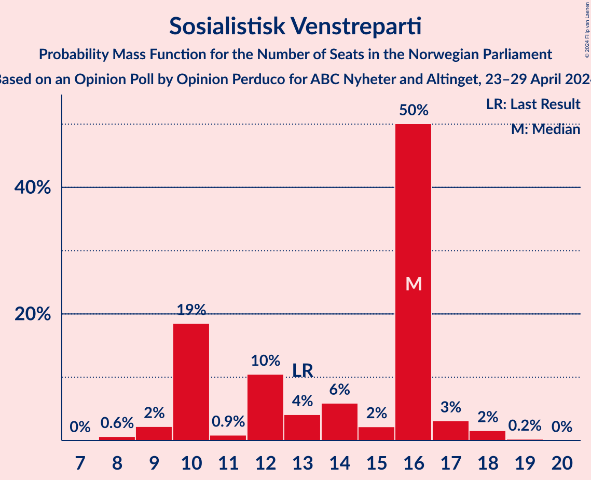

| Number of Seats | Probability | Accumulated | Special Marks |
|:---------------:|:-----------:|:-----------:|:-------------:|
| 8 | 0.6% | 100% |  |
| 9 | 2% | 99.4% |  |
| 10 | 19% | 97% |  |
| 11 | 0.9% | 79% |  |
| 12 | 10% | 78% |  |
| 13 | 4% | 67% | Last Result |
| 14 | 6% | 63% |  |
| 15 | 2% | 57% |  |
| 16 | 50% | 55% | Median |
| 17 | 3% | 5% |  |
| 18 | 2% | 2% |  |
| 19 | 0.2% | 0.3% |  |
| 20 | 0% | 0% |  |

### Venstre

*For a full overview of the results for this party, see the [Venstre](party-venstre.html) page.*

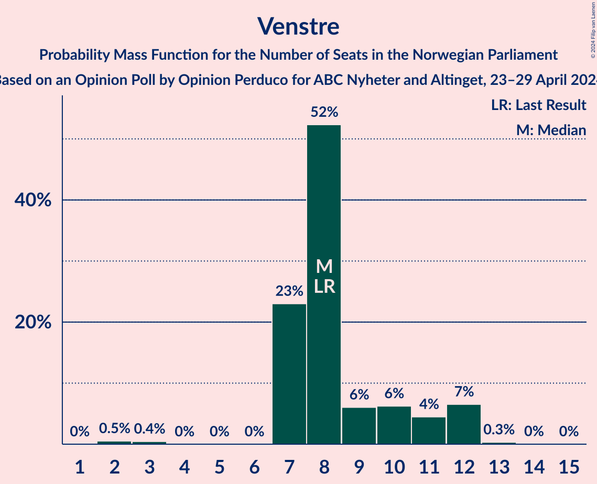

| Number of Seats | Probability | Accumulated | Special Marks |
|:---------------:|:-----------:|:-----------:|:-------------:|
| 2 | 0.5% | 100% |  |
| 3 | 0.4% | 99.5% |  |
| 4 | 0% | 99.0% |  |
| 5 | 0% | 99.0% |  |
| 6 | 0% | 99.0% |  |
| 7 | 23% | 99.0% |  |
| 8 | 52% | 76% | Last Result, Median |
| 9 | 6% | 24% |  |
| 10 | 6% | 18% |  |
| 11 | 4% | 11% |  |
| 12 | 7% | 7% |  |
| 13 | 0.3% | 0.4% |  |
| 14 | 0% | 0.1% |  |
| 15 | 0% | 0% |  |

### Senterpartiet

*For a full overview of the results for this party, see the [Senterpartiet](party-senterpartiet.html) page.*

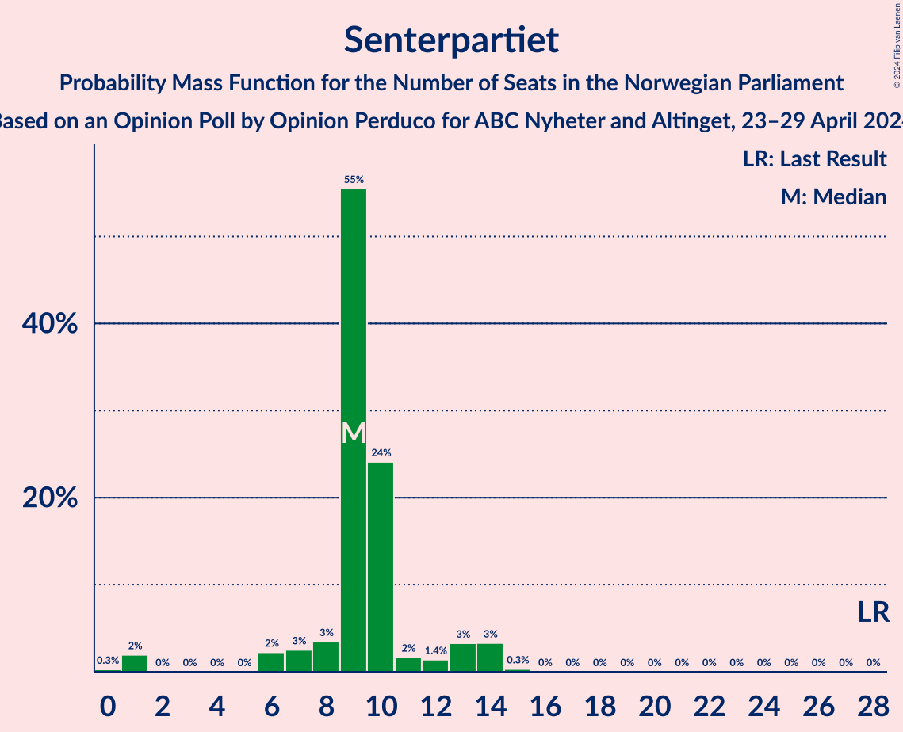

| Number of Seats | Probability | Accumulated | Special Marks |
|:---------------:|:-----------:|:-----------:|:-------------:|
| 0 | 0.3% | 100% |  |
| 1 | 2% | 99.7% |  |
| 2 | 0% | 98% |  |
| 3 | 0% | 98% |  |
| 4 | 0% | 98% |  |
| 5 | 0% | 98% |  |
| 6 | 2% | 98% |  |
| 7 | 3% | 96% |  |
| 8 | 3% | 93% |  |
| 9 | 55% | 90% | Median |
| 10 | 24% | 34% |  |
| 11 | 2% | 10% |  |
| 12 | 1.4% | 8% |  |
| 13 | 3% | 7% |  |
| 14 | 3% | 4% |  |
| 15 | 0.3% | 0.3% |  |
| 16 | 0% | 0% |  |
| 17 | 0% | 0% |  |
| 18 | 0% | 0% |  |
| 19 | 0% | 0% |  |
| 20 | 0% | 0% |  |
| 21 | 0% | 0% |  |
| 22 | 0% | 0% |  |
| 23 | 0% | 0% |  |
| 24 | 0% | 0% |  |
| 25 | 0% | 0% |  |
| 26 | 0% | 0% |  |
| 27 | 0% | 0% |  |
| 28 | 0% | 0% | Last Result |

### Rødt

*For a full overview of the results for this party, see the [Rødt](party-rødt.html) page.*

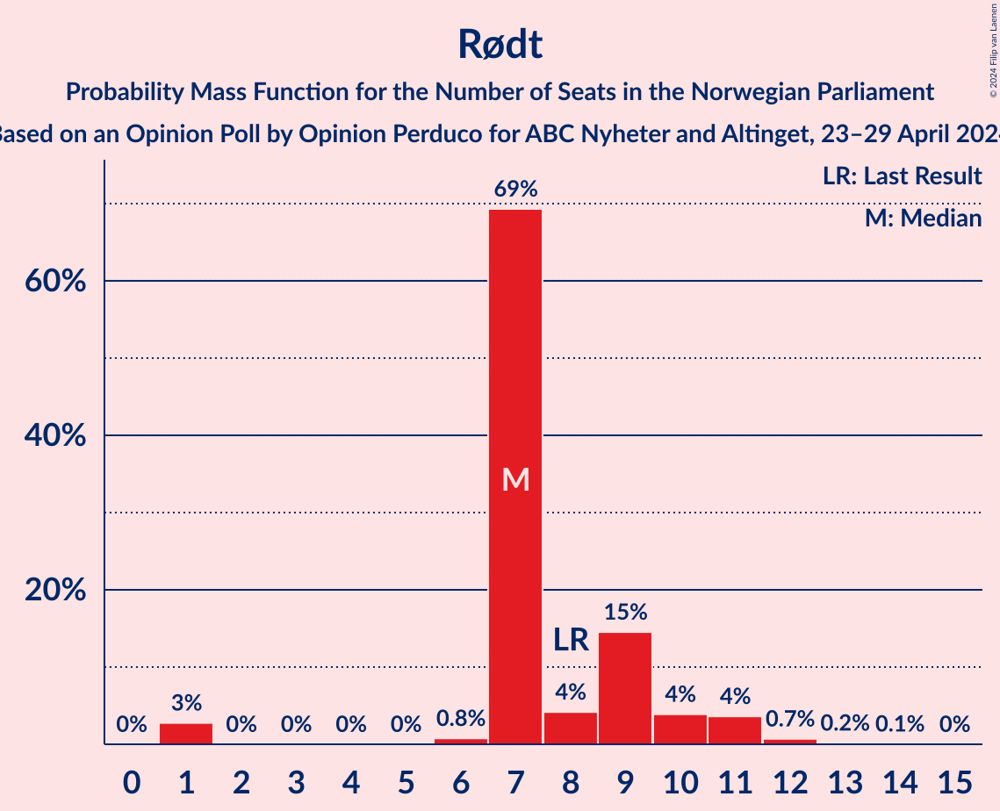

| Number of Seats | Probability | Accumulated | Special Marks |
|:---------------:|:-----------:|:-----------:|:-------------:|
| 1 | 3% | 100% |  |
| 2 | 0% | 97% |  |
| 3 | 0% | 97% |  |
| 4 | 0% | 97% |  |
| 5 | 0% | 97% |  |
| 6 | 0.8% | 97% |  |
| 7 | 69% | 96% | Median |
| 8 | 4% | 27% | Last Result |
| 9 | 15% | 23% |  |
| 10 | 4% | 8% |  |
| 11 | 4% | 5% |  |
| 12 | 0.7% | 0.9% |  |
| 13 | 0.2% | 0.2% |  |
| 14 | 0.1% | 0.1% |  |
| 15 | 0% | 0% |  |

### Miljøpartiet De Grønne

*For a full overview of the results for this party, see the [Miljøpartiet De Grønne](party-miljøpartietdegrønne.html) page.*

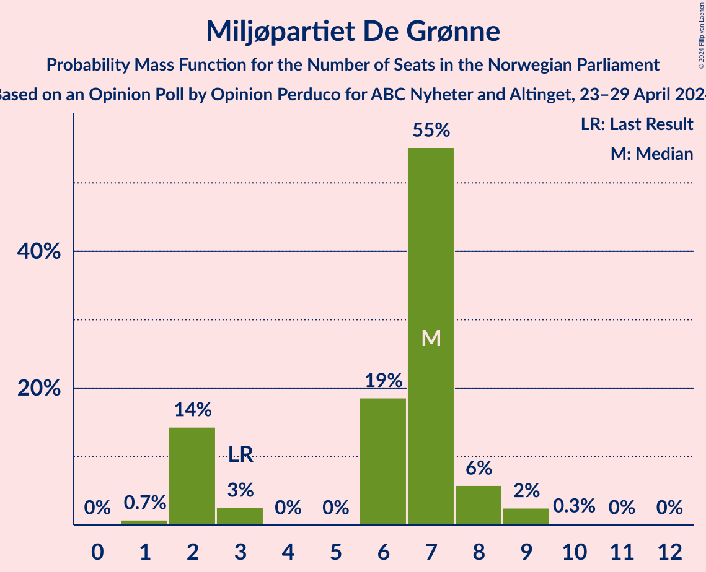

| Number of Seats | Probability | Accumulated | Special Marks |
|:---------------:|:-----------:|:-----------:|:-------------:|
| 1 | 0.7% | 100% |  |
| 2 | 14% | 99.3% |  |
| 3 | 3% | 85% | Last Result |
| 4 | 0% | 82% |  |
| 5 | 0% | 82% |  |
| 6 | 19% | 82% |  |
| 7 | 55% | 64% | Median |
| 8 | 6% | 9% |  |
| 9 | 2% | 3% |  |
| 10 | 0.3% | 0.3% |  |
| 11 | 0% | 0.1% |  |
| 12 | 0% | 0% |  |

### Kristelig Folkeparti

*For a full overview of the results for this party, see the [Kristelig Folkeparti](party-kristeligfolkeparti.html) page.*

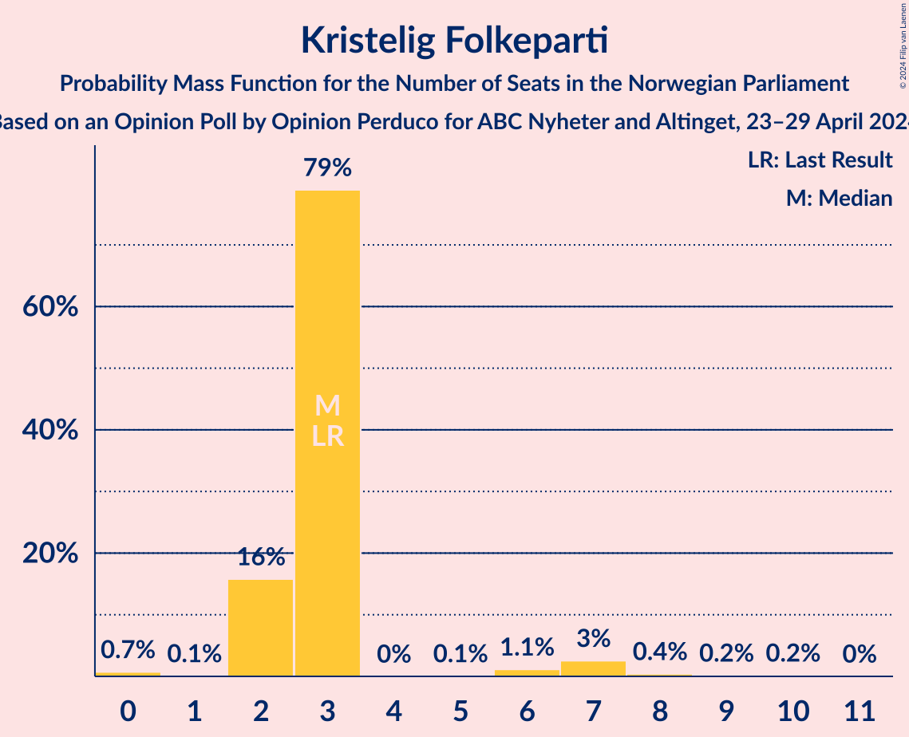

| Number of Seats | Probability | Accumulated | Special Marks |
|:---------------:|:-----------:|:-----------:|:-------------:|
| 0 | 0.7% | 100% |  |
| 1 | 0.1% | 99.3% |  |
| 2 | 16% | 99.2% |  |
| 3 | 79% | 83% | Last Result, Median |
| 4 | 0% | 4% |  |
| 5 | 0.1% | 4% |  |
| 6 | 1.1% | 4% |  |
| 7 | 3% | 3% |  |
| 8 | 0.4% | 0.7% |  |
| 9 | 0.2% | 0.3% |  |
| 10 | 0.2% | 0.2% |  |
| 11 | 0% | 0% |  |

### Industri- og Næringspartiet

*For a full overview of the results for this party, see the [Industri- og Næringspartiet](party-industri-ognæringspartiet.html) page.*

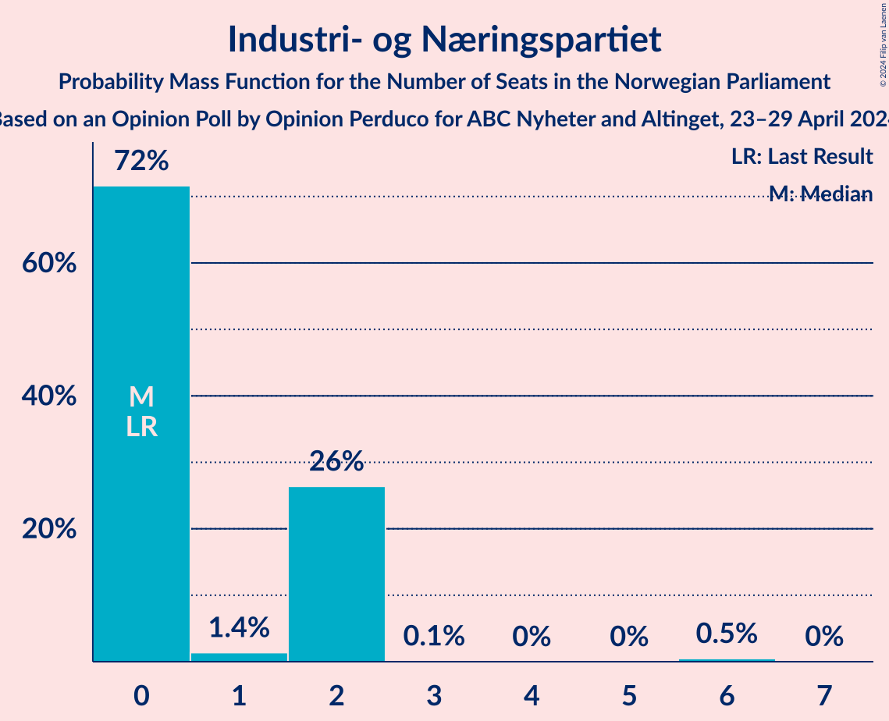

| Number of Seats | Probability | Accumulated | Special Marks |
|:---------------:|:-----------:|:-----------:|:-------------:|
| 0 | 72% | 100% | Last Result, Median |
| 1 | 1.4% | 28% |  |
| 2 | 26% | 27% |  |
| 3 | 0.1% | 0.6% |  |
| 4 | 0% | 0.5% |  |
| 5 | 0% | 0.5% |  |
| 6 | 0.5% | 0.5% |  |
| 7 | 0% | 0% |  |

### Pensjonistpartiet

*For a full overview of the results for this party, see the [Pensjonistpartiet](party-pensjonistpartiet.html) page.*

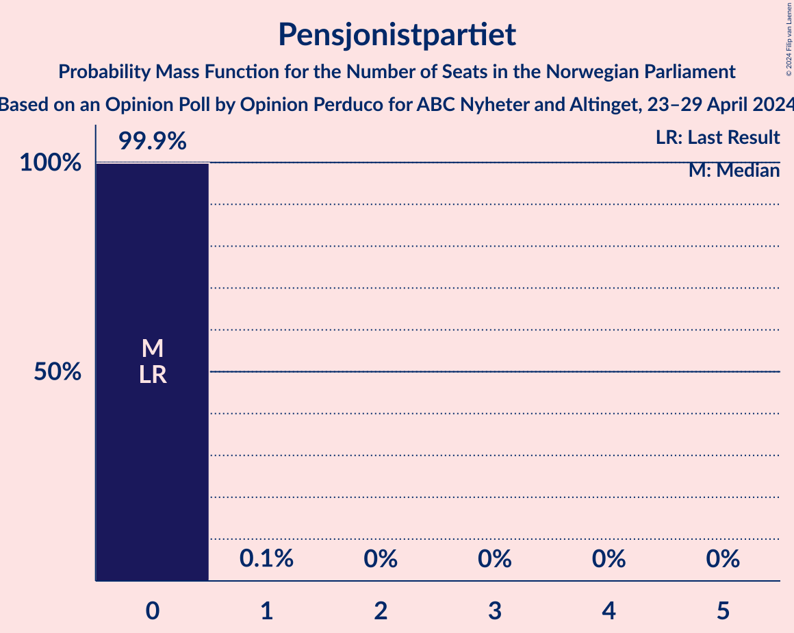

| Number of Seats | Probability | Accumulated | Special Marks |
|:---------------:|:-----------:|:-----------:|:-------------:|
| 0 | 99.9% | 100% | Last Result, Median |
| 1 | 0.1% | 0.1% |  |
| 2 | 0% | 0% |  |

### Norgesdemokratene

*For a full overview of the results for this party, see the [Norgesdemokratene](party-norgesdemokratene.html) page.*

| Number of Seats | Probability | Accumulated | Special Marks |
|:---------------:|:-----------:|:-----------:|:-------------:|
| 0 | 100% | 100% | Last Result, Median |

### Konservativt

*For a full overview of the results for this party, see the [Konservativt](party-konservativt.html) page.*

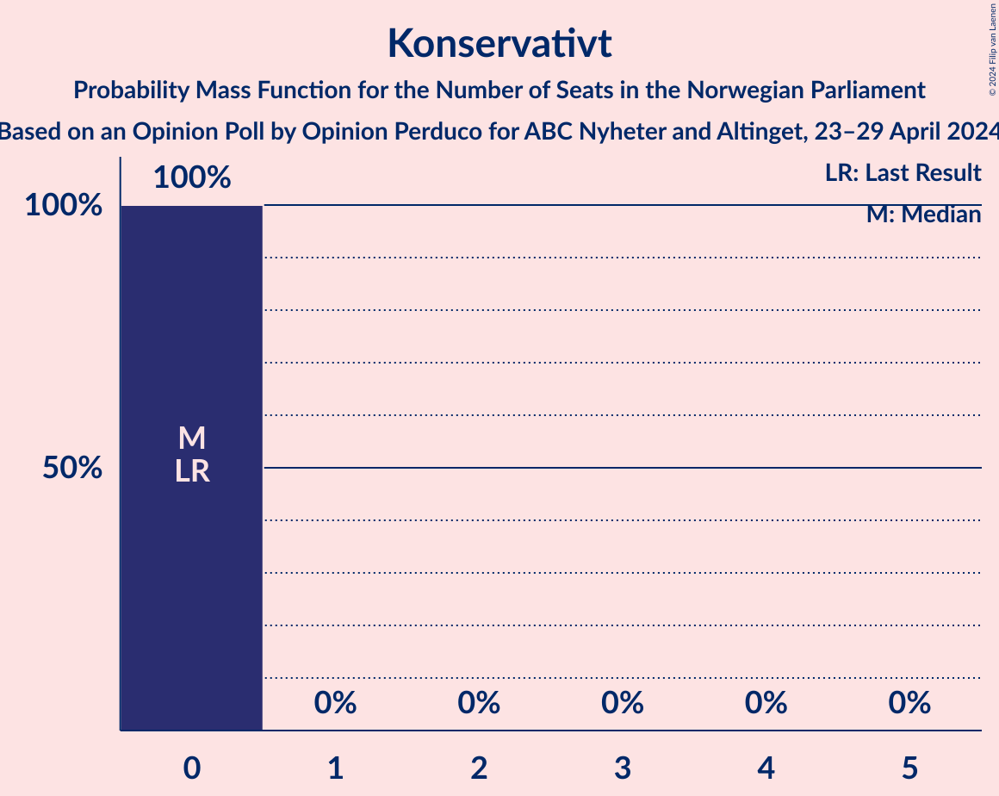

| Number of Seats | Probability | Accumulated | Special Marks |
|:---------------:|:-----------:|:-----------:|:-------------:|
| 0 | 100% | 100% | Last Result, Median |

## Coalitions

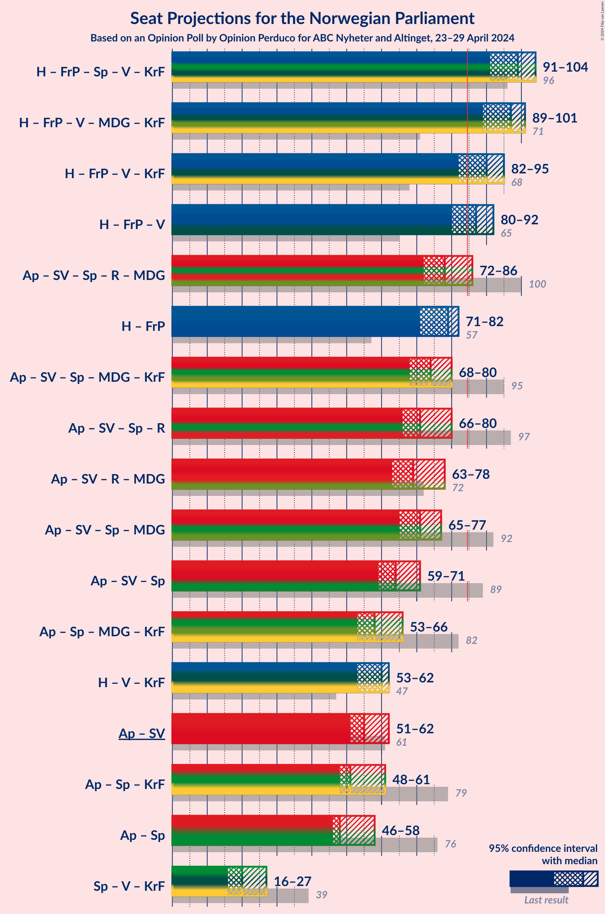

### Confidence Intervals

| Coalition | Last Result | Median | Majority? | 80% Confidence Interval | 90% Confidence Interval | 95% Confidence Interval | 99% Confidence Interval |
|:---------:|:-----------:|:------:|:---------:|:-----------------------:|:-----------------------:|:-----------------------:|:-----------------------:|
| Høyre – Fremskrittspartiet – Senterpartiet – Venstre – Kristelig Folkeparti | 96 | 99 | 100% | 97–101 | 94–103 | 91–104 | 90–106 |
| Høyre – Fremskrittspartiet – Venstre – Miljøpartiet De Grønne – Kristelig Folkeparti | 71 | 97 | 99.9% | 91–97 | 91–98 | 89–101 | 87–104 |
| Høyre – Fremskrittspartiet – Venstre – Kristelig Folkeparti | 68 | 90 | 97% | 87–91 | 85–94 | 82–95 | 80–99 |
| Høyre – Fremskrittspartiet – Venstre | 65 | 87 | 88% | 83–88 | 83–92 | 80–92 | 78–94 |
| Arbeiderpartiet – Sosialistisk Venstreparti – Senterpartiet – Rødt – Miljøpartiet De Grønne | 100 | 78 | 3% | 77–81 | 74–83 | 72–86 | 67–87 |
| Høyre – Fremskrittspartiet | 57 | 79 | 0.2% | 74–79 | 71–80 | 71–82 | 69–84 |
| Arbeiderpartiet – Sosialistisk Venstreparti – Senterpartiet – Miljøpartiet De Grønne – Kristelig Folkeparti | 95 | 74 | 0.1% | 71–76 | 68–77 | 68–80 | 61–82 |
| Arbeiderpartiet – Sosialistisk Venstreparti – Senterpartiet – Rødt | 97 | 71 | 0.1% | 71–75 | 69–78 | 66–80 | 63–80 |
| Arbeiderpartiet – Sosialistisk Venstreparti – Rødt – Miljøpartiet De Grønne | 72 | 69 | 0% | 66–71 | 64–75 | 63–78 | 59–79 |
| Arbeiderpartiet – Sosialistisk Venstreparti – Senterpartiet – Miljøpartiet De Grønne | 92 | 71 | 0% | 68–73 | 66–74 | 65–77 | 59–78 |
| Arbeiderpartiet – Sosialistisk Venstreparti – Senterpartiet | 89 | 64 | 0% | 64–66 | 62–70 | 59–71 | 57–71 |
| Arbeiderpartiet – Senterpartiet – Miljøpartiet De Grønne – Kristelig Folkeparti | 82 | 58 | 0% | 58–63 | 55–64 | 53–66 | 48–68 |
| Høyre – Venstre – Kristelig Folkeparti | 47 | 60 | 0% | 56–60 | 55–60 | 53–62 | 50–65 |
| Arbeiderpartiet – Sosialistisk Venstreparti | 61 | 55 | 0% | 54–57 | 53–61 | 51–62 | 48–63 |
| Arbeiderpartiet – Senterpartiet – Kristelig Folkeparti | 79 | 51 | 0% | 51–57 | 51–60 | 48–61 | 44–63 |
| Arbeiderpartiet – Senterpartiet | 76 | 48 | 0% | 48–54 | 48–55 | 46–58 | 42–58 |
| Senterpartiet – Venstre – Kristelig Folkeparti | 39 | 20 | 0% | 20–24 | 19–27 | 16–27 | 12–28 |

### Høyre – Fremskrittspartiet – Senterpartiet – Venstre – Kristelig Folkeparti

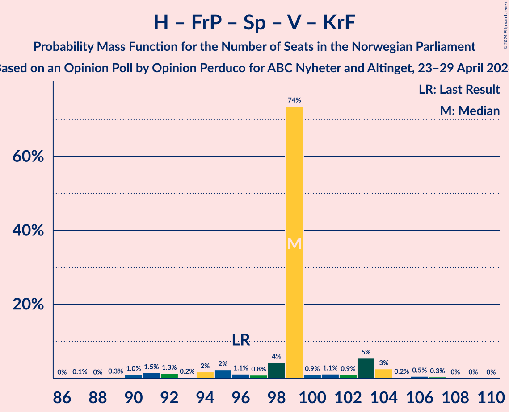

| Number of Seats | Probability | Accumulated | Special Marks |
|:---------------:|:-----------:|:-----------:|:-------------:|
| 87 | 0.1% | 100% |  |
| 88 | 0% | 99.9% |  |
| 89 | 0.3% | 99.9% |  |
| 90 | 1.0% | 99.6% |  |
| 91 | 1.5% | 98.7% |  |
| 92 | 1.3% | 97% |  |
| 93 | 0.2% | 96% |  |
| 94 | 2% | 96% |  |
| 95 | 2% | 94% |  |
| 96 | 1.1% | 92% | Last Result |
| 97 | 0.8% | 91% |  |
| 98 | 4% | 90% |  |
| 99 | 74% | 86% | Median |
| 100 | 0.9% | 12% |  |
| 101 | 1.1% | 11% |  |
| 102 | 0.9% | 10% |  |
| 103 | 5% | 9% |  |
| 104 | 3% | 4% |  |
| 105 | 0.2% | 1.2% |  |
| 106 | 0.5% | 1.0% |  |
| 107 | 0.3% | 0.5% |  |
| 108 | 0% | 0.1% |  |
| 109 | 0% | 0.1% |  |
| 110 | 0% | 0% |  |

### Høyre – Fremskrittspartiet – Venstre – Miljøpartiet De Grønne – Kristelig Folkeparti

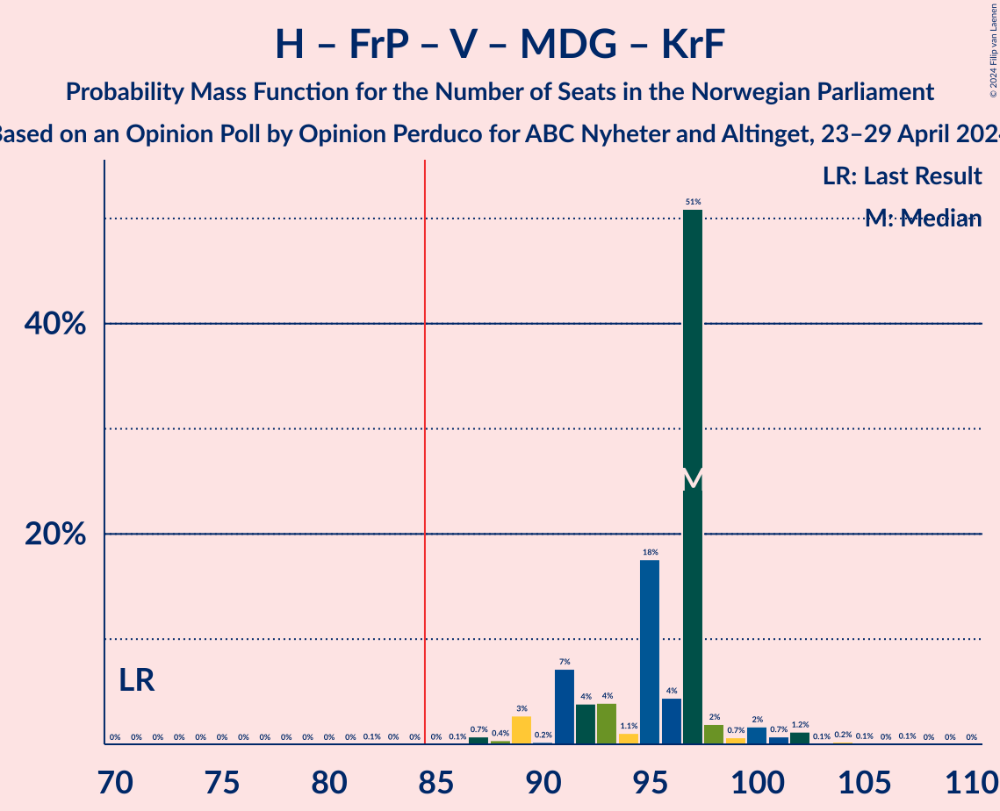

| Number of Seats | Probability | Accumulated | Special Marks |
|:---------------:|:-----------:|:-----------:|:-------------:|
| 71 | 0% | 100% | Last Result |
| 72 | 0% | 100% |  |
| 73 | 0% | 100% |  |
| 74 | 0% | 100% |  |
| 75 | 0% | 100% |  |
| 76 | 0% | 100% |  |
| 77 | 0% | 100% |  |
| 78 | 0% | 100% |  |
| 79 | 0% | 100% |  |
| 80 | 0% | 100% |  |
| 81 | 0% | 100% |  |
| 82 | 0.1% | 100% |  |
| 83 | 0% | 99.9% |  |
| 84 | 0% | 99.9% |  |
| 85 | 0% | 99.9% | Majority |
| 86 | 0.1% | 99.9% |  |
| 87 | 0.7% | 99.8% |  |
| 88 | 0.4% | 99.1% |  |
| 89 | 3% | 98.7% |  |
| 90 | 0.2% | 96% |  |
| 91 | 7% | 96% |  |
| 92 | 4% | 89% |  |
| 93 | 4% | 85% |  |
| 94 | 1.1% | 81% |  |
| 95 | 18% | 80% |  |
| 96 | 4% | 62% |  |
| 97 | 51% | 58% | Median |
| 98 | 2% | 7% |  |
| 99 | 0.7% | 5% |  |
| 100 | 2% | 4% |  |
| 101 | 0.7% | 3% |  |
| 102 | 1.2% | 2% |  |
| 103 | 0.1% | 0.6% |  |
| 104 | 0.2% | 0.5% |  |
| 105 | 0.1% | 0.3% |  |
| 106 | 0% | 0.1% |  |
| 107 | 0.1% | 0.1% |  |
| 108 | 0% | 0% |  |

### Høyre – Fremskrittspartiet – Venstre – Kristelig Folkeparti

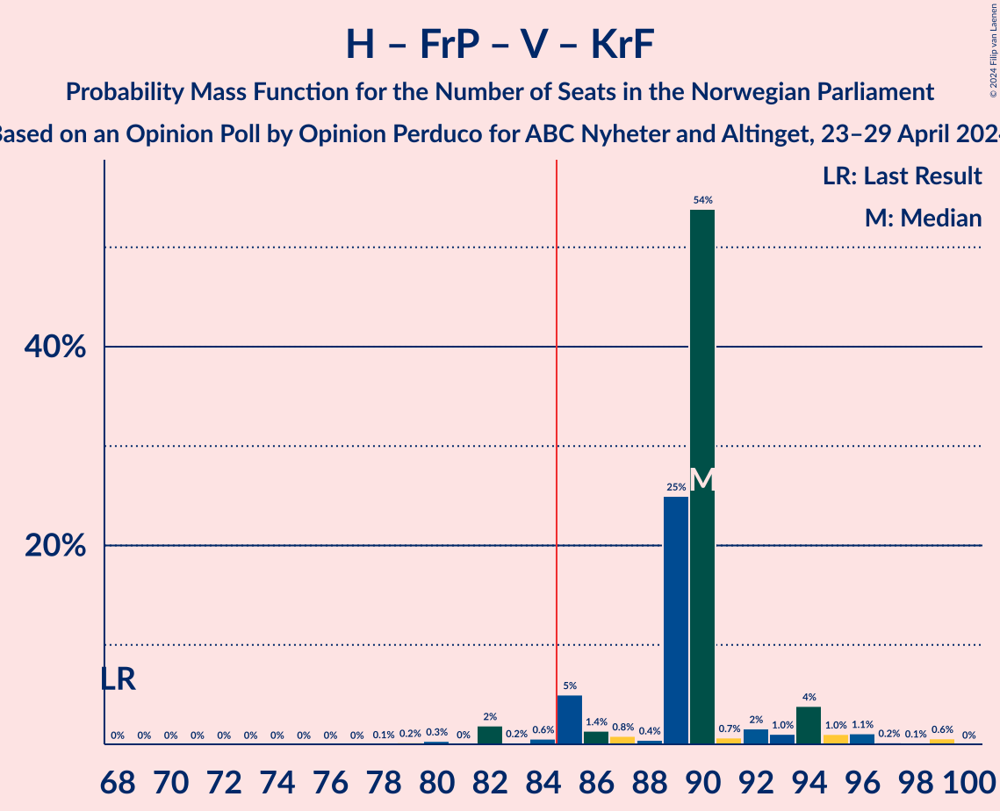

| Number of Seats | Probability | Accumulated | Special Marks |
|:---------------:|:-----------:|:-----------:|:-------------:|
| 68 | 0% | 100% | Last Result |
| 69 | 0% | 100% |  |
| 70 | 0% | 100% |  |
| 71 | 0% | 100% |  |
| 72 | 0% | 100% |  |
| 73 | 0% | 100% |  |
| 74 | 0% | 100% |  |
| 75 | 0% | 100% |  |
| 76 | 0% | 100% |  |
| 77 | 0% | 100% |  |
| 78 | 0.1% | 100% |  |
| 79 | 0.2% | 99.9% |  |
| 80 | 0.3% | 99.7% |  |
| 81 | 0% | 99.4% |  |
| 82 | 2% | 99.4% |  |
| 83 | 0.2% | 97% |  |
| 84 | 0.6% | 97% |  |
| 85 | 5% | 97% | Majority |
| 86 | 1.4% | 92% |  |
| 87 | 0.8% | 90% |  |
| 88 | 0.4% | 90% |  |
| 89 | 25% | 89% |  |
| 90 | 54% | 64% | Median |
| 91 | 0.7% | 10% |  |
| 92 | 2% | 10% |  |
| 93 | 1.0% | 8% |  |
| 94 | 4% | 7% |  |
| 95 | 1.0% | 3% |  |
| 96 | 1.1% | 2% |  |
| 97 | 0.2% | 1.0% |  |
| 98 | 0.1% | 0.8% |  |
| 99 | 0.6% | 0.6% |  |
| 100 | 0% | 0% |  |

### Høyre – Fremskrittspartiet – Venstre

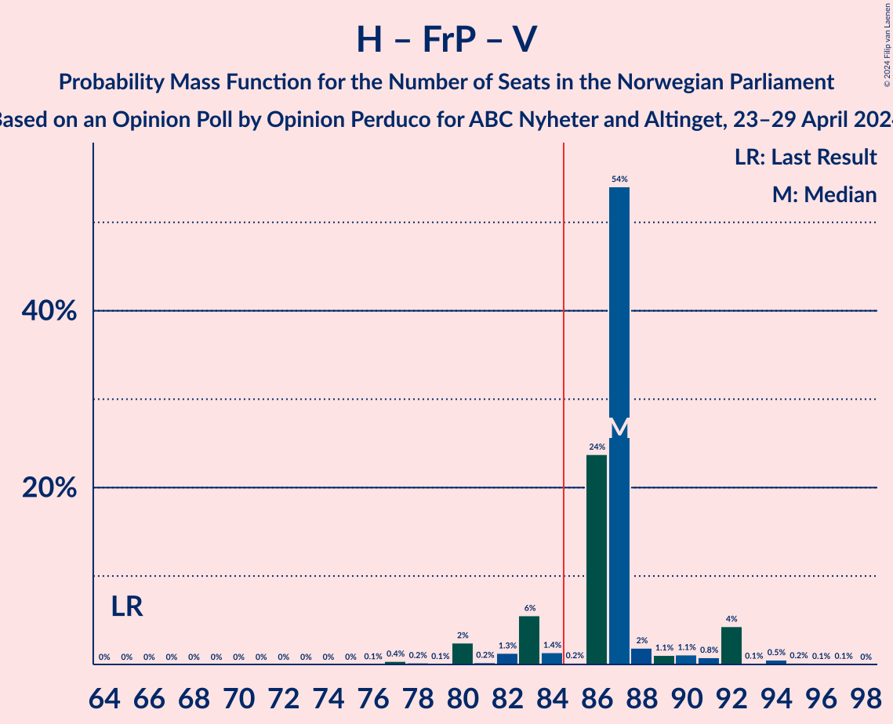

| Number of Seats | Probability | Accumulated | Special Marks |
|:---------------:|:-----------:|:-----------:|:-------------:|
| 65 | 0% | 100% | Last Result |
| 66 | 0% | 100% |  |
| 67 | 0% | 100% |  |
| 68 | 0% | 100% |  |
| 69 | 0% | 100% |  |
| 70 | 0% | 100% |  |
| 71 | 0% | 100% |  |
| 72 | 0% | 100% |  |
| 73 | 0% | 100% |  |
| 74 | 0% | 100% |  |
| 75 | 0% | 100% |  |
| 76 | 0.1% | 100% |  |
| 77 | 0.4% | 99.9% |  |
| 78 | 0.2% | 99.5% |  |
| 79 | 0.1% | 99.3% |  |
| 80 | 2% | 99.2% |  |
| 81 | 0.2% | 97% |  |
| 82 | 1.3% | 96% |  |
| 83 | 6% | 95% |  |
| 84 | 1.4% | 90% |  |
| 85 | 0.2% | 88% | Majority |
| 86 | 24% | 88% |  |
| 87 | 54% | 64% | Median |
| 88 | 2% | 10% |  |
| 89 | 1.1% | 8% |  |
| 90 | 1.1% | 7% |  |
| 91 | 0.8% | 6% |  |
| 92 | 4% | 5% |  |
| 93 | 0.1% | 1.1% |  |
| 94 | 0.5% | 1.0% |  |
| 95 | 0.2% | 0.4% |  |
| 96 | 0.1% | 0.3% |  |
| 97 | 0.1% | 0.2% |  |
| 98 | 0% | 0% |  |

### Arbeiderpartiet – Sosialistisk Venstreparti – Senterpartiet – Rødt – Miljøpartiet De Grønne

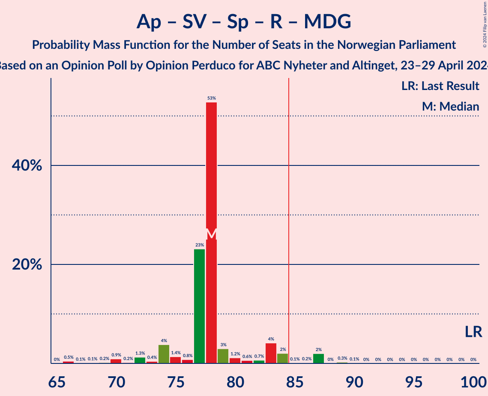

| Number of Seats | Probability | Accumulated | Special Marks |
|:---------------:|:-----------:|:-----------:|:-------------:|
| 66 | 0.5% | 100% |  |
| 67 | 0.1% | 99.5% |  |
| 68 | 0.1% | 99.4% |  |
| 69 | 0.2% | 99.3% |  |
| 70 | 0.9% | 99.1% |  |
| 71 | 0.2% | 98% |  |
| 72 | 1.3% | 98% |  |
| 73 | 0.4% | 97% |  |
| 74 | 4% | 96% |  |
| 75 | 1.4% | 92% |  |
| 76 | 0.8% | 91% |  |
| 77 | 23% | 90% |  |
| 78 | 53% | 67% | Median |
| 79 | 3% | 14% |  |
| 80 | 1.2% | 11% |  |
| 81 | 0.6% | 10% |  |
| 82 | 0.7% | 10% |  |
| 83 | 4% | 9% |  |
| 84 | 2% | 5% |  |
| 85 | 0.1% | 3% | Majority |
| 86 | 0.2% | 3% |  |
| 87 | 2% | 2% |  |
| 88 | 0% | 0.4% |  |
| 89 | 0.3% | 0.4% |  |
| 90 | 0.1% | 0.1% |  |
| 91 | 0% | 0% |  |
| 92 | 0% | 0% |  |
| 93 | 0% | 0% |  |
| 94 | 0% | 0% |  |
| 95 | 0% | 0% |  |
| 96 | 0% | 0% |  |
| 97 | 0% | 0% |  |
| 98 | 0% | 0% |  |
| 99 | 0% | 0% |  |
| 100 | 0% | 0% | Last Result |

### Høyre – Fremskrittspartiet

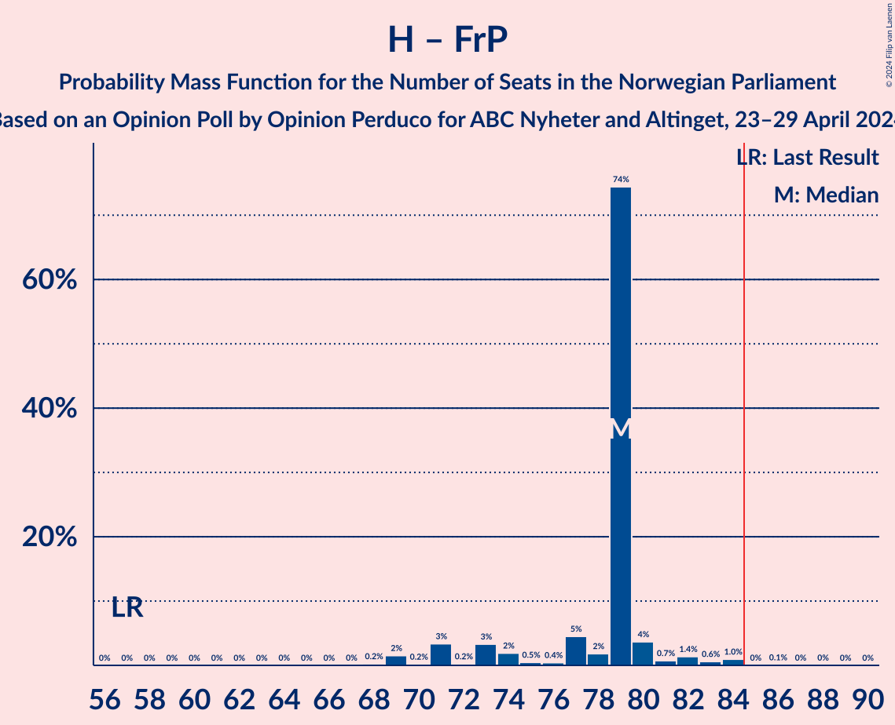

| Number of Seats | Probability | Accumulated | Special Marks |
|:---------------:|:-----------:|:-----------:|:-------------:|
| 57 | 0% | 100% | Last Result |
| 58 | 0% | 100% |  |
| 59 | 0% | 100% |  |
| 60 | 0% | 100% |  |
| 61 | 0% | 100% |  |
| 62 | 0% | 100% |  |
| 63 | 0% | 100% |  |
| 64 | 0% | 100% |  |
| 65 | 0% | 100% |  |
| 66 | 0% | 100% |  |
| 67 | 0% | 100% |  |
| 68 | 0.2% | 100% |  |
| 69 | 2% | 99.7% |  |
| 70 | 0.2% | 98% |  |
| 71 | 3% | 98% |  |
| 72 | 0.2% | 95% |  |
| 73 | 3% | 94% |  |
| 74 | 2% | 91% |  |
| 75 | 0.5% | 89% |  |
| 76 | 0.4% | 89% |  |
| 77 | 5% | 88% |  |
| 78 | 2% | 84% |  |
| 79 | 74% | 82% | Median |
| 80 | 4% | 8% |  |
| 81 | 0.7% | 4% |  |
| 82 | 1.4% | 3% |  |
| 83 | 0.6% | 2% |  |
| 84 | 1.0% | 1.1% |  |
| 85 | 0% | 0.2% | Majority |
| 86 | 0.1% | 0.2% |  |
| 87 | 0% | 0.1% |  |
| 88 | 0% | 0.1% |  |
| 89 | 0% | 0% |  |

### Arbeiderpartiet – Sosialistisk Venstreparti – Senterpartiet – Miljøpartiet De Grønne – Kristelig Folkeparti

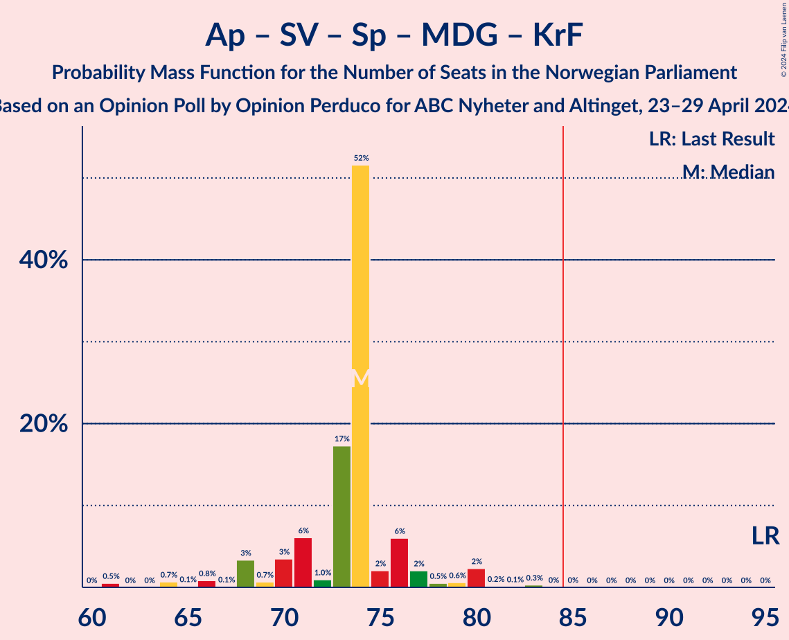

| Number of Seats | Probability | Accumulated | Special Marks |
|:---------------:|:-----------:|:-----------:|:-------------:|
| 61 | 0.5% | 100% |  |
| 62 | 0% | 99.5% |  |
| 63 | 0% | 99.5% |  |
| 64 | 0.7% | 99.5% |  |
| 65 | 0.1% | 98.8% |  |
| 66 | 0.8% | 98.7% |  |
| 67 | 0.1% | 98% |  |
| 68 | 3% | 98% |  |
| 69 | 0.7% | 94% |  |
| 70 | 3% | 94% |  |
| 71 | 6% | 90% |  |
| 72 | 1.0% | 84% |  |
| 73 | 17% | 83% |  |
| 74 | 52% | 66% | Median |
| 75 | 2% | 14% |  |
| 76 | 6% | 12% |  |
| 77 | 2% | 6% |  |
| 78 | 0.5% | 4% |  |
| 79 | 0.6% | 4% |  |
| 80 | 2% | 3% |  |
| 81 | 0.2% | 0.7% |  |
| 82 | 0.1% | 0.5% |  |
| 83 | 0.3% | 0.4% |  |
| 84 | 0% | 0.1% |  |
| 85 | 0% | 0.1% | Majority |
| 86 | 0% | 0% |  |
| 87 | 0% | 0% |  |
| 88 | 0% | 0% |  |
| 89 | 0% | 0% |  |
| 90 | 0% | 0% |  |
| 91 | 0% | 0% |  |
| 92 | 0% | 0% |  |
| 93 | 0% | 0% |  |
| 94 | 0% | 0% |  |
| 95 | 0% | 0% | Last Result |

### Arbeiderpartiet – Sosialistisk Venstreparti – Senterpartiet – Rødt

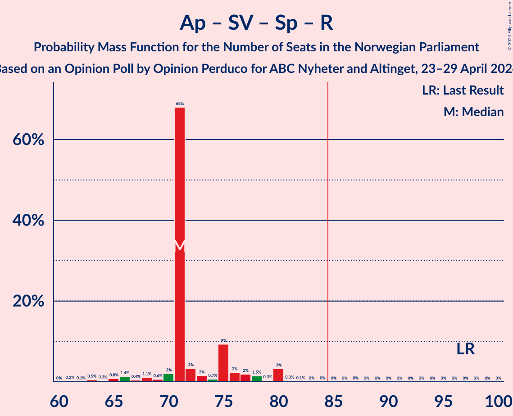

| Number of Seats | Probability | Accumulated | Special Marks |
|:---------------:|:-----------:|:-----------:|:-------------:|
| 61 | 0.2% | 100% |  |
| 62 | 0.1% | 99.8% |  |
| 63 | 0.5% | 99.7% |  |
| 64 | 0.3% | 99.2% |  |
| 65 | 0.8% | 98.9% |  |
| 66 | 1.4% | 98% |  |
| 67 | 0.4% | 97% |  |
| 68 | 1.1% | 96% |  |
| 69 | 0.6% | 95% |  |
| 70 | 2% | 95% |  |
| 71 | 68% | 93% | Median |
| 72 | 3% | 25% |  |
| 73 | 2% | 21% |  |
| 74 | 0.7% | 20% |  |
| 75 | 9% | 19% |  |
| 76 | 2% | 10% |  |
| 77 | 2% | 7% |  |
| 78 | 1.5% | 6% |  |
| 79 | 0.3% | 4% |  |
| 80 | 3% | 4% |  |
| 81 | 0.3% | 0.5% |  |
| 82 | 0.1% | 0.2% |  |
| 83 | 0% | 0.1% |  |
| 84 | 0% | 0.1% |  |
| 85 | 0% | 0.1% | Majority |
| 86 | 0% | 0.1% |  |
| 87 | 0% | 0% |  |
| 88 | 0% | 0% |  |
| 89 | 0% | 0% |  |
| 90 | 0% | 0% |  |
| 91 | 0% | 0% |  |
| 92 | 0% | 0% |  |
| 93 | 0% | 0% |  |
| 94 | 0% | 0% |  |
| 95 | 0% | 0% |  |
| 96 | 0% | 0% |  |
| 97 | 0% | 0% | Last Result |

### Arbeiderpartiet – Sosialistisk Venstreparti – Rødt – Miljøpartiet De Grønne

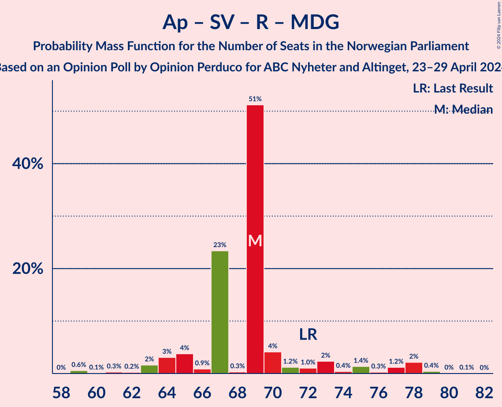

| Number of Seats | Probability | Accumulated | Special Marks |
|:---------------:|:-----------:|:-----------:|:-------------:|
| 58 | 0% | 100% |  |
| 59 | 0.6% | 99.9% |  |
| 60 | 0.1% | 99.4% |  |
| 61 | 0.3% | 99.3% |  |
| 62 | 0.2% | 99.0% |  |
| 63 | 2% | 98.8% |  |
| 64 | 3% | 97% |  |
| 65 | 4% | 94% |  |
| 66 | 0.9% | 90% |  |
| 67 | 23% | 89% |  |
| 68 | 0.3% | 66% |  |
| 69 | 51% | 66% | Median |
| 70 | 4% | 15% |  |
| 71 | 1.2% | 10% |  |
| 72 | 1.0% | 9% | Last Result |
| 73 | 2% | 8% |  |
| 74 | 0.4% | 6% |  |
| 75 | 1.4% | 5% |  |
| 76 | 0.3% | 4% |  |
| 77 | 1.2% | 4% |  |
| 78 | 2% | 3% |  |
| 79 | 0.4% | 0.5% |  |
| 80 | 0% | 0.1% |  |
| 81 | 0.1% | 0.1% |  |
| 82 | 0% | 0% |  |

### Arbeiderpartiet – Sosialistisk Venstreparti – Senterpartiet – Miljøpartiet De Grønne

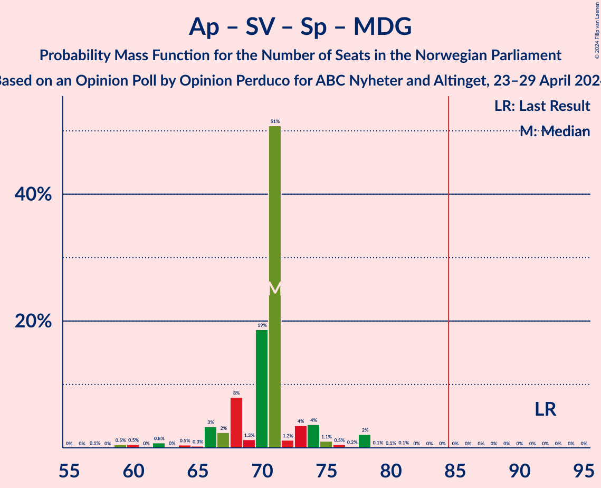

| Number of Seats | Probability | Accumulated | Special Marks |
|:---------------:|:-----------:|:-----------:|:-------------:|
| 57 | 0.1% | 100% |  |
| 58 | 0% | 99.9% |  |
| 59 | 0.5% | 99.9% |  |
| 60 | 0.5% | 99.4% |  |
| 61 | 0% | 98.9% |  |
| 62 | 0.8% | 98.8% |  |
| 63 | 0% | 98% |  |
| 64 | 0.5% | 98% |  |
| 65 | 0.3% | 98% |  |
| 66 | 3% | 97% |  |
| 67 | 2% | 94% |  |
| 68 | 8% | 91% |  |
| 69 | 1.3% | 83% |  |
| 70 | 19% | 82% |  |
| 71 | 51% | 64% | Median |
| 72 | 1.2% | 13% |  |
| 73 | 4% | 11% |  |
| 74 | 4% | 8% |  |
| 75 | 1.1% | 4% |  |
| 76 | 0.5% | 3% |  |
| 77 | 0.2% | 3% |  |
| 78 | 2% | 2% |  |
| 79 | 0.1% | 0.4% |  |
| 80 | 0.1% | 0.2% |  |
| 81 | 0.1% | 0.2% |  |
| 82 | 0% | 0% |  |
| 83 | 0% | 0% |  |
| 84 | 0% | 0% |  |
| 85 | 0% | 0% | Majority |
| 86 | 0% | 0% |  |
| 87 | 0% | 0% |  |
| 88 | 0% | 0% |  |
| 89 | 0% | 0% |  |
| 90 | 0% | 0% |  |
| 91 | 0% | 0% |  |
| 92 | 0% | 0% | Last Result |

### Arbeiderpartiet – Sosialistisk Venstreparti – Senterpartiet

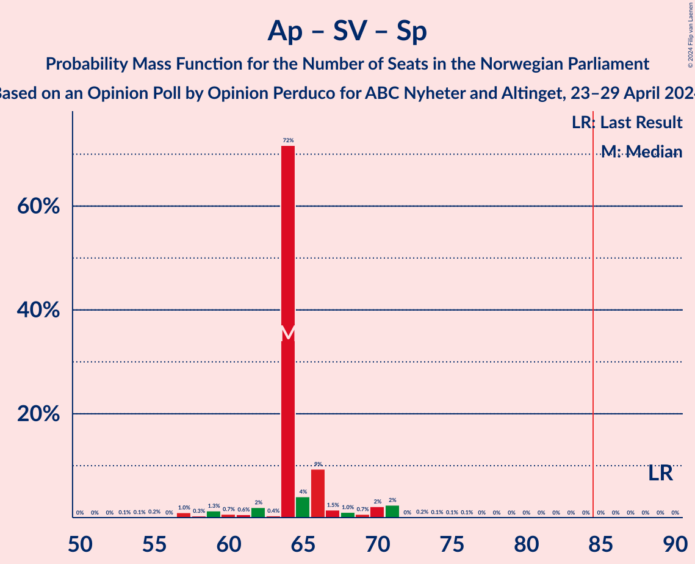

| Number of Seats | Probability | Accumulated | Special Marks |
|:---------------:|:-----------:|:-----------:|:-------------:|
| 53 | 0.1% | 100% |  |
| 54 | 0.1% | 99.9% |  |
| 55 | 0.2% | 99.8% |  |
| 56 | 0% | 99.6% |  |
| 57 | 1.0% | 99.6% |  |
| 58 | 0.3% | 98.6% |  |
| 59 | 1.3% | 98% |  |
| 60 | 0.7% | 97% |  |
| 61 | 0.6% | 96% |  |
| 62 | 2% | 96% |  |
| 63 | 0.4% | 94% |  |
| 64 | 72% | 93% | Median |
| 65 | 4% | 22% |  |
| 66 | 9% | 18% |  |
| 67 | 1.5% | 8% |  |
| 68 | 1.0% | 7% |  |
| 69 | 0.7% | 6% |  |
| 70 | 2% | 5% |  |
| 71 | 2% | 3% |  |
| 72 | 0% | 0.4% |  |
| 73 | 0.2% | 0.4% |  |
| 74 | 0.1% | 0.2% |  |
| 75 | 0.1% | 0.1% |  |
| 76 | 0.1% | 0.1% |  |
| 77 | 0% | 0% |  |
| 78 | 0% | 0% |  |
| 79 | 0% | 0% |  |
| 80 | 0% | 0% |  |
| 81 | 0% | 0% |  |
| 82 | 0% | 0% |  |
| 83 | 0% | 0% |  |
| 84 | 0% | 0% |  |
| 85 | 0% | 0% | Majority |
| 86 | 0% | 0% |  |
| 87 | 0% | 0% |  |
| 88 | 0% | 0% |  |
| 89 | 0% | 0% | Last Result |

### Arbeiderpartiet – Senterpartiet – Miljøpartiet De Grønne – Kristelig Folkeparti

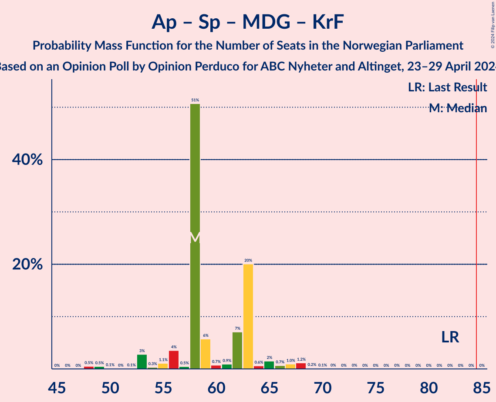

| Number of Seats | Probability | Accumulated | Special Marks |
|:---------------:|:-----------:|:-----------:|:-------------:|
| 48 | 0.5% | 100% |  |
| 49 | 0.5% | 99.5% |  |
| 50 | 0.1% | 99.0% |  |
| 51 | 0% | 98.9% |  |
| 52 | 0.1% | 98.8% |  |
| 53 | 3% | 98.7% |  |
| 54 | 0.3% | 96% |  |
| 55 | 1.1% | 96% |  |
| 56 | 4% | 95% |  |
| 57 | 0.5% | 91% |  |
| 58 | 51% | 91% | Median |
| 59 | 6% | 40% |  |
| 60 | 0.7% | 34% |  |
| 61 | 0.9% | 33% |  |
| 62 | 7% | 32% |  |
| 63 | 20% | 25% |  |
| 64 | 0.6% | 5% |  |
| 65 | 2% | 5% |  |
| 66 | 0.7% | 3% |  |
| 67 | 1.0% | 2% |  |
| 68 | 1.2% | 2% |  |
| 69 | 0.2% | 0.3% |  |
| 70 | 0.1% | 0.2% |  |
| 71 | 0% | 0.1% |  |
| 72 | 0% | 0.1% |  |
| 73 | 0% | 0.1% |  |
| 74 | 0% | 0% |  |
| 75 | 0% | 0% |  |
| 76 | 0% | 0% |  |
| 77 | 0% | 0% |  |
| 78 | 0% | 0% |  |
| 79 | 0% | 0% |  |
| 80 | 0% | 0% |  |
| 81 | 0% | 0% |  |
| 82 | 0% | 0% | Last Result |

### Høyre – Venstre – Kristelig Folkeparti

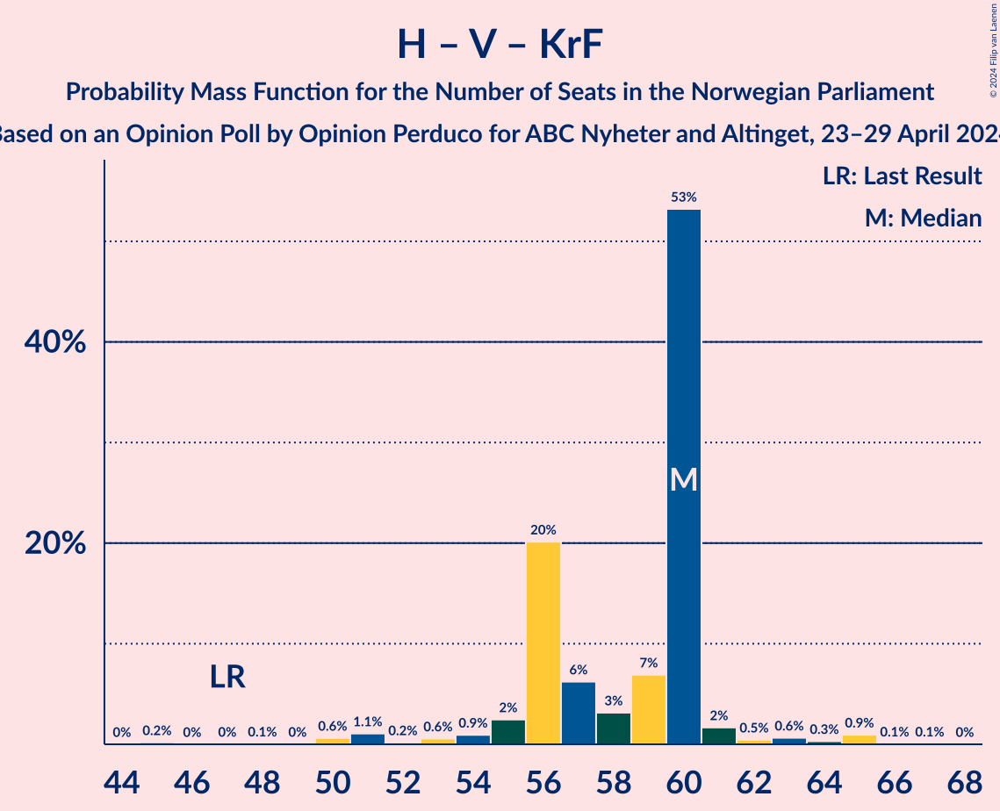

| Number of Seats | Probability | Accumulated | Special Marks |
|:---------------:|:-----------:|:-----------:|:-------------:|
| 45 | 0.2% | 100% |  |
| 46 | 0% | 99.8% |  |
| 47 | 0% | 99.8% | Last Result |
| 48 | 0.1% | 99.8% |  |
| 49 | 0% | 99.7% |  |
| 50 | 0.6% | 99.7% |  |
| 51 | 1.1% | 99.0% |  |
| 52 | 0.2% | 98% |  |
| 53 | 0.6% | 98% |  |
| 54 | 0.9% | 97% |  |
| 55 | 2% | 96% |  |
| 56 | 20% | 94% |  |
| 57 | 6% | 74% |  |
| 58 | 3% | 67% |  |
| 59 | 7% | 64% |  |
| 60 | 53% | 57% | Median |
| 61 | 2% | 4% |  |
| 62 | 0.5% | 3% |  |
| 63 | 0.6% | 2% |  |
| 64 | 0.3% | 1.4% |  |
| 65 | 0.9% | 1.1% |  |
| 66 | 0.1% | 0.1% |  |
| 67 | 0.1% | 0.1% |  |
| 68 | 0% | 0% |  |

### Arbeiderpartiet – Sosialistisk Venstreparti

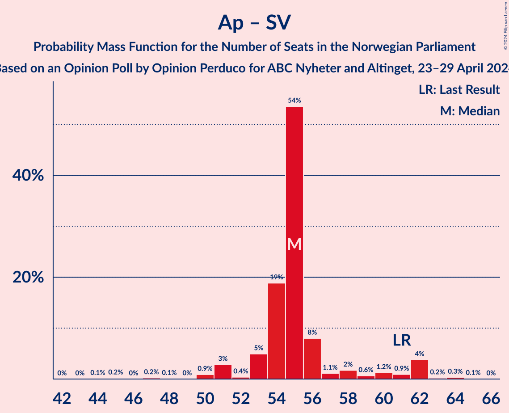

| Number of Seats | Probability | Accumulated | Special Marks |
|:---------------:|:-----------:|:-----------:|:-------------:|
| 44 | 0.1% | 100% |  |
| 45 | 0.2% | 99.9% |  |
| 46 | 0% | 99.7% |  |
| 47 | 0.2% | 99.7% |  |
| 48 | 0.1% | 99.5% |  |
| 49 | 0% | 99.4% |  |
| 50 | 0.9% | 99.4% |  |
| 51 | 3% | 98.5% |  |
| 52 | 0.4% | 96% |  |
| 53 | 5% | 95% |  |
| 54 | 19% | 90% |  |
| 55 | 54% | 72% | Median |
| 56 | 8% | 18% |  |
| 57 | 1.1% | 10% |  |
| 58 | 2% | 9% |  |
| 59 | 0.6% | 7% |  |
| 60 | 1.2% | 7% |  |
| 61 | 0.9% | 5% | Last Result |
| 62 | 4% | 4% |  |
| 63 | 0.2% | 0.6% |  |
| 64 | 0.3% | 0.4% |  |
| 65 | 0.1% | 0.1% |  |
| 66 | 0% | 0% |  |

### Arbeiderpartiet – Senterpartiet – Kristelig Folkeparti

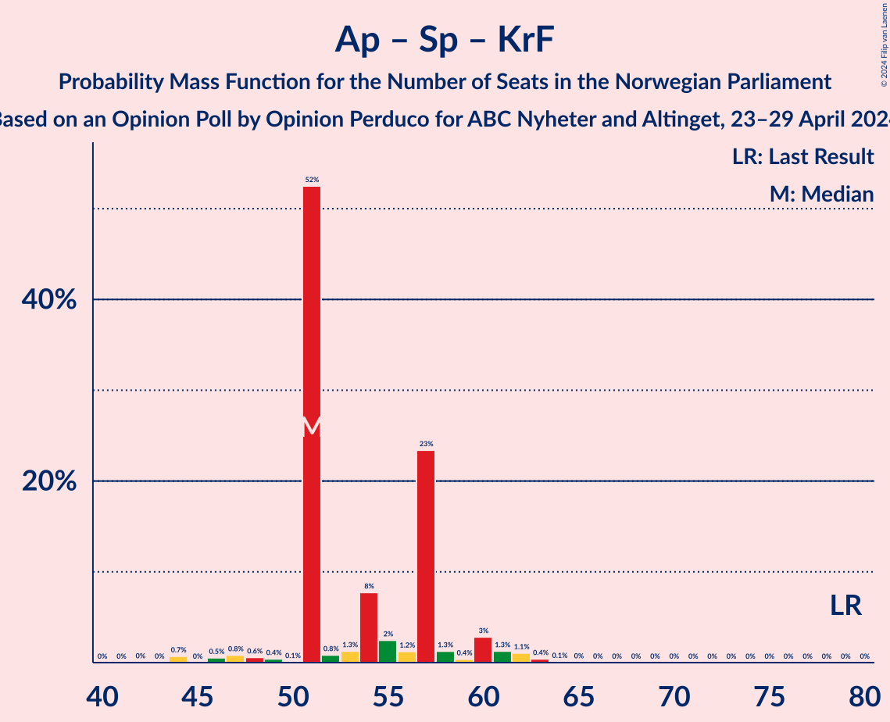

| Number of Seats | Probability | Accumulated | Special Marks |
|:---------------:|:-----------:|:-----------:|:-------------:|
| 43 | 0% | 100% |  |
| 44 | 0.7% | 99.9% |  |
| 45 | 0% | 99.2% |  |
| 46 | 0.5% | 99.2% |  |
| 47 | 0.8% | 98.7% |  |
| 48 | 0.6% | 98% |  |
| 49 | 0.4% | 97% |  |
| 50 | 0.1% | 97% |  |
| 51 | 52% | 97% | Median |
| 52 | 0.8% | 44% |  |
| 53 | 1.3% | 43% |  |
| 54 | 8% | 42% |  |
| 55 | 2% | 34% |  |
| 56 | 1.2% | 32% |  |
| 57 | 23% | 31% |  |
| 58 | 1.3% | 7% |  |
| 59 | 0.4% | 6% |  |
| 60 | 3% | 6% |  |
| 61 | 1.3% | 3% |  |
| 62 | 1.1% | 2% |  |
| 63 | 0.4% | 0.6% |  |
| 64 | 0.1% | 0.2% |  |
| 65 | 0% | 0.1% |  |
| 66 | 0% | 0.1% |  |
| 67 | 0% | 0% |  |
| 68 | 0% | 0% |  |
| 69 | 0% | 0% |  |
| 70 | 0% | 0% |  |
| 71 | 0% | 0% |  |
| 72 | 0% | 0% |  |
| 73 | 0% | 0% |  |
| 74 | 0% | 0% |  |
| 75 | 0% | 0% |  |
| 76 | 0% | 0% |  |
| 77 | 0% | 0% |  |
| 78 | 0% | 0% |  |
| 79 | 0% | 0% | Last Result |

### Arbeiderpartiet – Senterpartiet

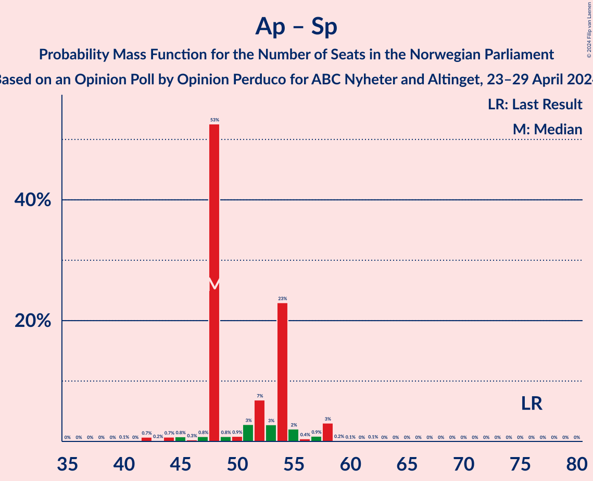

| Number of Seats | Probability | Accumulated | Special Marks |
|:---------------:|:-----------:|:-----------:|:-------------:|
| 40 | 0.1% | 100% |  |
| 41 | 0% | 99.9% |  |
| 42 | 0.7% | 99.9% |  |
| 43 | 0.2% | 99.2% |  |
| 44 | 0.7% | 99.1% |  |
| 45 | 0.8% | 98% |  |
| 46 | 0.3% | 98% |  |
| 47 | 0.8% | 97% |  |
| 48 | 53% | 96% | Median |
| 49 | 0.8% | 44% |  |
| 50 | 0.9% | 43% |  |
| 51 | 3% | 42% |  |
| 52 | 7% | 39% |  |
| 53 | 3% | 33% |  |
| 54 | 23% | 30% |  |
| 55 | 2% | 7% |  |
| 56 | 0.4% | 5% |  |
| 57 | 0.9% | 4% |  |
| 58 | 3% | 3% |  |
| 59 | 0.2% | 0.3% |  |
| 60 | 0.1% | 0.2% |  |
| 61 | 0% | 0.1% |  |
| 62 | 0.1% | 0.1% |  |
| 63 | 0% | 0% |  |
| 64 | 0% | 0% |  |
| 65 | 0% | 0% |  |
| 66 | 0% | 0% |  |
| 67 | 0% | 0% |  |
| 68 | 0% | 0% |  |
| 69 | 0% | 0% |  |
| 70 | 0% | 0% |  |
| 71 | 0% | 0% |  |
| 72 | 0% | 0% |  |
| 73 | 0% | 0% |  |
| 74 | 0% | 0% |  |
| 75 | 0% | 0% |  |
| 76 | 0% | 0% | Last Result |

### Senterpartiet – Venstre – Kristelig Folkeparti

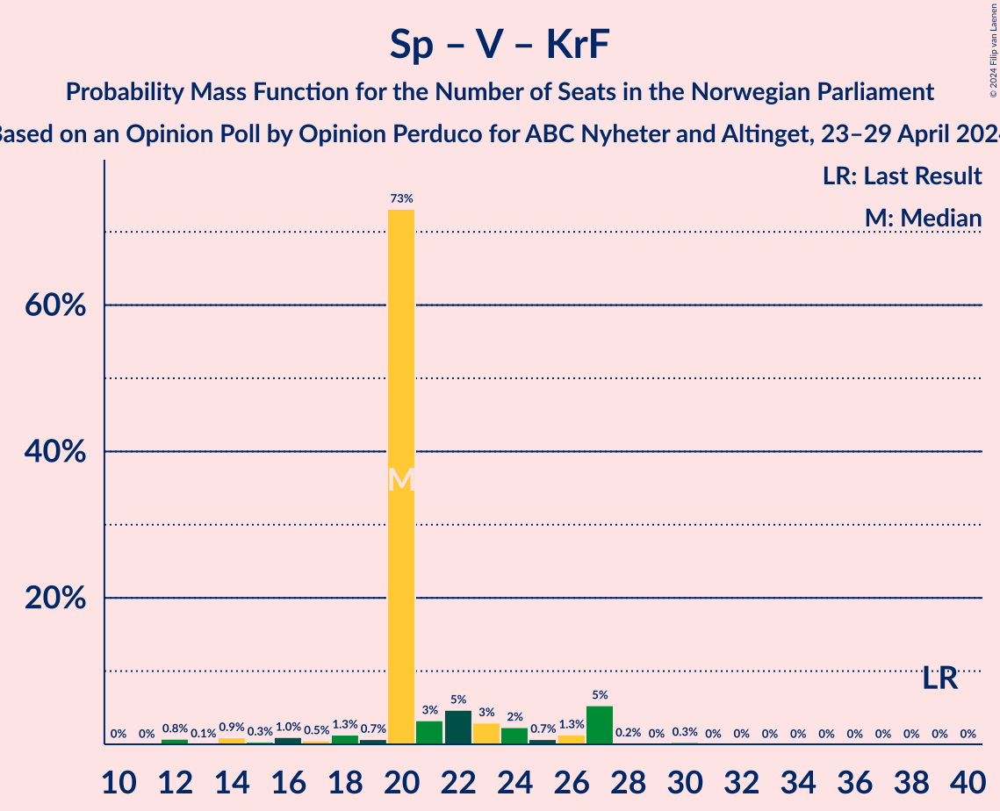

| Number of Seats | Probability | Accumulated | Special Marks |
|:---------------:|:-----------:|:-----------:|:-------------:|
| 10 | 0% | 100% |  |
| 11 | 0% | 99.9% |  |
| 12 | 0.8% | 99.9% |  |
| 13 | 0.1% | 99.2% |  |
| 14 | 0.9% | 99.1% |  |
| 15 | 0.3% | 98% |  |
| 16 | 1.0% | 98% |  |
| 17 | 0.5% | 97% |  |
| 18 | 1.3% | 96% |  |
| 19 | 0.7% | 95% |  |
| 20 | 73% | 94% | Median |
| 21 | 3% | 21% |  |
| 22 | 5% | 18% |  |
| 23 | 3% | 13% |  |
| 24 | 2% | 10% |  |
| 25 | 0.7% | 8% |  |
| 26 | 1.3% | 7% |  |
| 27 | 5% | 6% |  |
| 28 | 0.2% | 0.6% |  |
| 29 | 0% | 0.4% |  |
| 30 | 0.3% | 0.3% |  |
| 31 | 0% | 0.1% |  |
| 32 | 0% | 0.1% |  |
| 33 | 0% | 0% |  |
| 34 | 0% | 0% |  |
| 35 | 0% | 0% |  |
| 36 | 0% | 0% |  |
| 37 | 0% | 0% |  |
| 38 | 0% | 0% |  |
| 39 | 0% | 0% | Last Result |

## Technical Information

### Opinion Poll

+ **Polling firm:** Opinion Perduco
+ **Commissioner(s):** ABC Nyheter and Altinget
+ **Fieldwork period:** 23–29 April 2024

### Calculations

+ **Sample size:** 740
+ **Simulations done:** 1,048,576
+ **Error estimate:** 2.70%

