# Opinion Poll by InFact for Nettavisen, 2 May 2024

<a href="#voting-intentions">Voting Intentions</a> | <a href="#seats">Seats</a> | <a href="#coalitions">Coalitions</a> | <a href="#technical-information">Technical Information</a>

## Voting Intentions

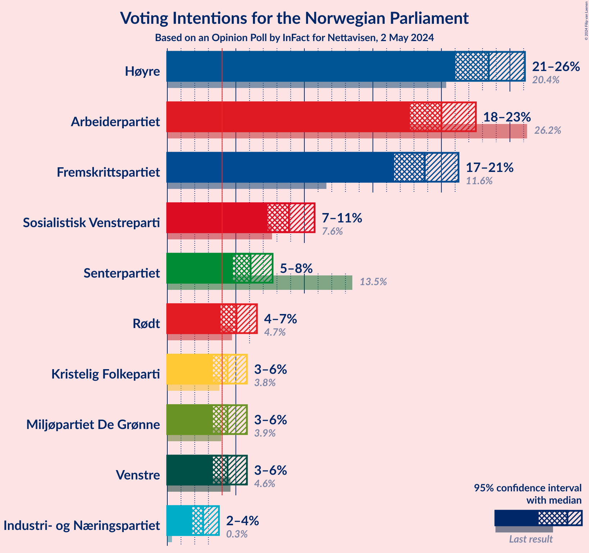

### Confidence Intervals

| Party | Last Result | Poll Result | 80% Confidence Interval | 90% Confidence Interval | 95% Confidence Interval | 99% Confidence Interval |
|:-----:|:-----------:|:-----------:|:-----------------------:|:-----------------------:|:-----------------------:|:-----------------------:|
| Høyre | 20.4% | 23.5% | 21.9–25.2% |21.4–25.7% |21.0–26.1% |20.3–26.9% |
| Arbeiderpartiet | 26.2% | 20.0% | 18.5–21.6% |18.1–22.1% |17.7–22.5% |17.0–23.3% |
| Fremskrittspartiet | 11.6% | 18.8% | 17.3–20.4% |16.9–20.9% |16.6–21.2% |15.9–22.0% |
| Sosialistisk Venstreparti | 7.6% | 8.9% | 7.8–10.1% |7.6–10.4% |7.3–10.7% |6.8–11.4% |
| Senterpartiet | 13.5% | 6.1% | 5.2–7.1% |5.0–7.4% |4.8–7.7% |4.4–8.2% |
| Rødt | 4.7% | 5.0% | 4.3–6.0% |4.1–6.3% |3.9–6.5% |3.6–7.0% |
| Kristelig Folkeparti | 3.8% | 4.4% | 3.7–5.3% |3.5–5.6% |3.3–5.8% |3.0–6.3% |
| Venstre | 4.6% | 4.4% | 3.7–5.3% |3.5–5.6% |3.3–5.8% |3.0–6.3% |
| Miljøpartiet De Grønne | 3.9% | 4.4% | 3.7–5.3% |3.5–5.6% |3.3–5.8% |3.0–6.3% |
| Industri- og Næringspartiet | 0.3% | 2.6% | 2.1–3.4% |1.9–3.6% |1.8–3.8% |1.6–4.1% |

*Note:* The poll result column reflects the actual value used in the calculations. Published results may vary slightly, and in addition be rounded to fewer digits.

## Seats

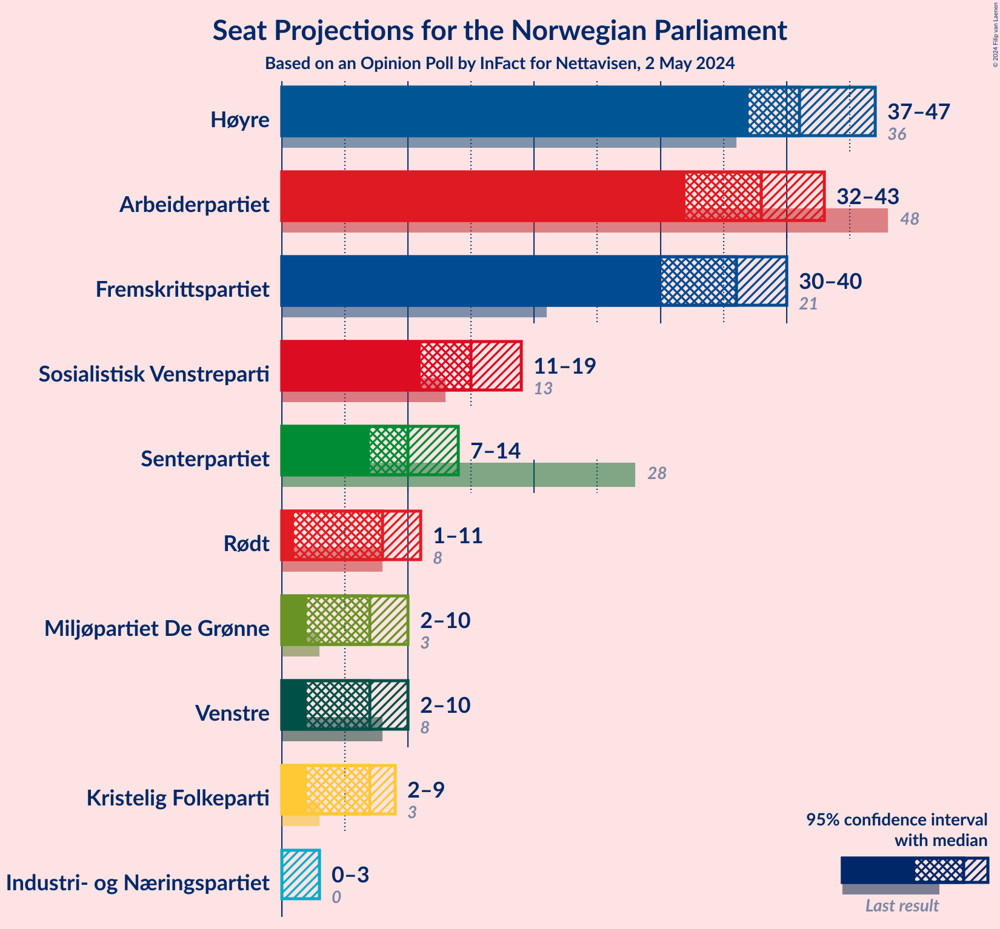

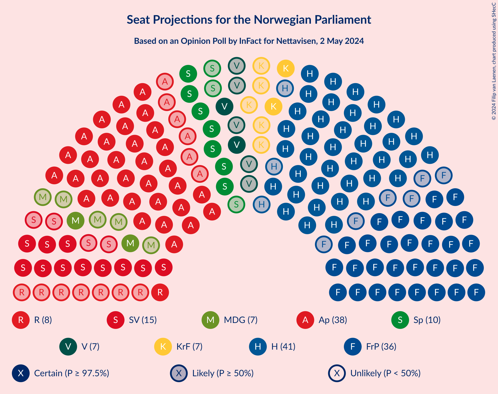

### Confidence Intervals

| Party | Last Result | Median | 80% Confidence Interval | 90% Confidence Interval | 95% Confidence Interval | 99% Confidence Interval |
|:-----:|:-----------:|:------:|:-----------------------:|:-----------------------:|:-----------------------:|:-----------------------:|
| <a href="#høyre">Høyre</a> | 36 | 41 | 39–45 |37–46 |37–47 |34–49 |
| <a href="#arbeiderpartiet">Arbeiderpartiet</a> | 48 | 38 | 34–41 |33–41 |32–43 |32–45 |
| <a href="#fremskrittspartiet">Fremskrittspartiet</a> | 21 | 36 | 33–38 |32–39 |30–40 |29–41 |
| <a href="#sosialistisk-venstreparti">Sosialistisk Venstreparti</a> | 13 | 15 | 12–17 |11–18 |11–19 |10–20 |
| <a href="#senterpartiet">Senterpartiet</a> | 28 | 10 | 8–13 |8–13 |7–14 |7–15 |
| <a href="#rødt">Rødt</a> | 8 | 8 | 7–10 |1–11 |1–11 |1–12 |
| <a href="#kristelig-folkeparti">Kristelig Folkeparti</a> | 3 | 7 | 3–9 |2–9 |2–9 |2–10 |
| <a href="#venstre">Venstre</a> | 8 | 7 | 2–9 |2–9 |2–10 |2–10 |
| <a href="#miljøpartiet-de-grønne">Miljøpartiet De Grønne</a> | 3 | 7 | 2–9 |2–9 |2–10 |2–11 |
| <a href="#industri--og-næringspartiet">Industri- og Næringspartiet</a> | 0 | 0 | 0–2 |0–3 |0–3 |0–6 |

### Høyre

*For a full overview of the results for this party, see the [Høyre](party-høyre.html) page.*

| Number of Seats | Probability | Accumulated | Special Marks |
|:---------------:|:-----------:|:-----------:|:-------------:|
| 33 | 0.1% | 100% |  |
| 34 | 0.5% | 99.9% |  |
| 35 | 0.5% | 99.4% |  |
| 36 | 1.3% | 99.0% | Last Result |
| 37 | 4% | 98% |  |
| 38 | 4% | 94% |  |
| 39 | 15% | 90% |  |
| 40 | 17% | 76% |  |
| 41 | 14% | 59% | Median |
| 42 | 16% | 45% |  |
| 43 | 10% | 29% |  |
| 44 | 6% | 19% |  |
| 45 | 7% | 12% |  |
| 46 | 1.2% | 6% |  |
| 47 | 3% | 4% |  |
| 48 | 0.8% | 1.4% |  |
| 49 | 0.5% | 0.6% |  |
| 50 | 0.1% | 0.2% |  |
| 51 | 0.1% | 0.1% |  |
| 52 | 0% | 0% |  |

### Arbeiderpartiet

*For a full overview of the results for this party, see the [Arbeiderpartiet](party-arbeiderpartiet.html) page.*

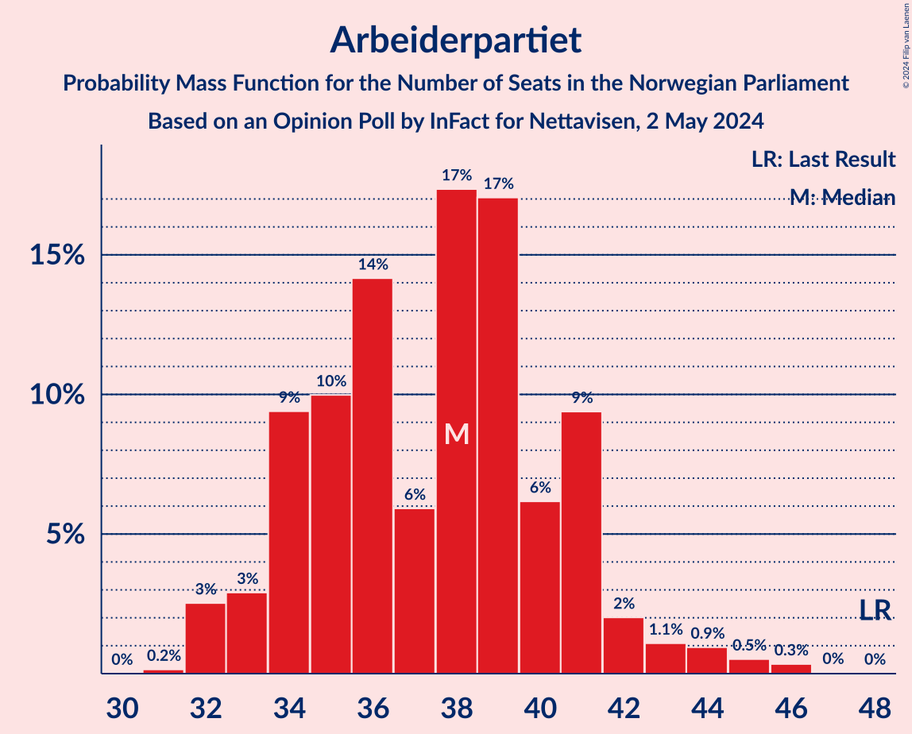

| Number of Seats | Probability | Accumulated | Special Marks |
|:---------------:|:-----------:|:-----------:|:-------------:|
| 31 | 0.2% | 100% |  |
| 32 | 3% | 99.8% |  |
| 33 | 3% | 97% |  |
| 34 | 9% | 94% |  |
| 35 | 10% | 85% |  |
| 36 | 14% | 75% |  |
| 37 | 6% | 61% |  |
| 38 | 17% | 55% | Median |
| 39 | 17% | 38% |  |
| 40 | 6% | 21% |  |
| 41 | 9% | 14% |  |
| 42 | 2% | 5% |  |
| 43 | 1.1% | 3% |  |
| 44 | 0.9% | 2% |  |
| 45 | 0.5% | 0.9% |  |
| 46 | 0.3% | 0.4% |  |
| 47 | 0% | 0.1% |  |
| 48 | 0% | 0% | Last Result |

### Fremskrittspartiet

*For a full overview of the results for this party, see the [Fremskrittspartiet](party-fremskrittspartiet.html) page.*

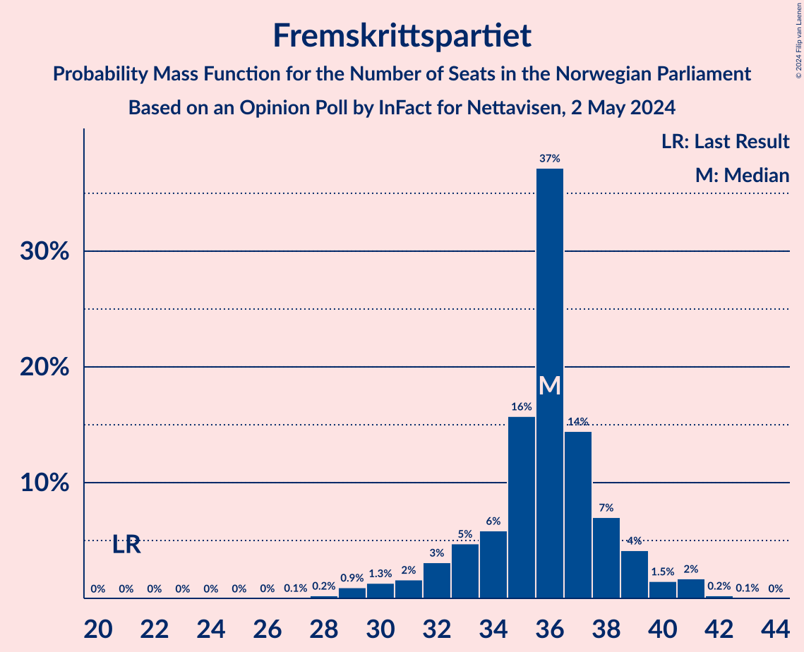

| Number of Seats | Probability | Accumulated | Special Marks |
|:---------------:|:-----------:|:-----------:|:-------------:|
| 21 | 0% | 100% | Last Result |
| 22 | 0% | 100% |  |
| 23 | 0% | 100% |  |
| 24 | 0% | 100% |  |
| 25 | 0% | 100% |  |
| 26 | 0% | 100% |  |
| 27 | 0.1% | 100% |  |
| 28 | 0.2% | 99.9% |  |
| 29 | 0.9% | 99.7% |  |
| 30 | 1.3% | 98.7% |  |
| 31 | 2% | 97% |  |
| 32 | 3% | 96% |  |
| 33 | 5% | 93% |  |
| 34 | 6% | 88% |  |
| 35 | 16% | 82% |  |
| 36 | 37% | 66% | Median |
| 37 | 14% | 29% |  |
| 38 | 7% | 15% |  |
| 39 | 4% | 8% |  |
| 40 | 1.5% | 4% |  |
| 41 | 2% | 2% |  |
| 42 | 0.2% | 0.3% |  |
| 43 | 0.1% | 0.1% |  |
| 44 | 0% | 0% |  |

### Sosialistisk Venstreparti

*For a full overview of the results for this party, see the [Sosialistisk Venstreparti](party-sosialistiskvenstreparti.html) page.*

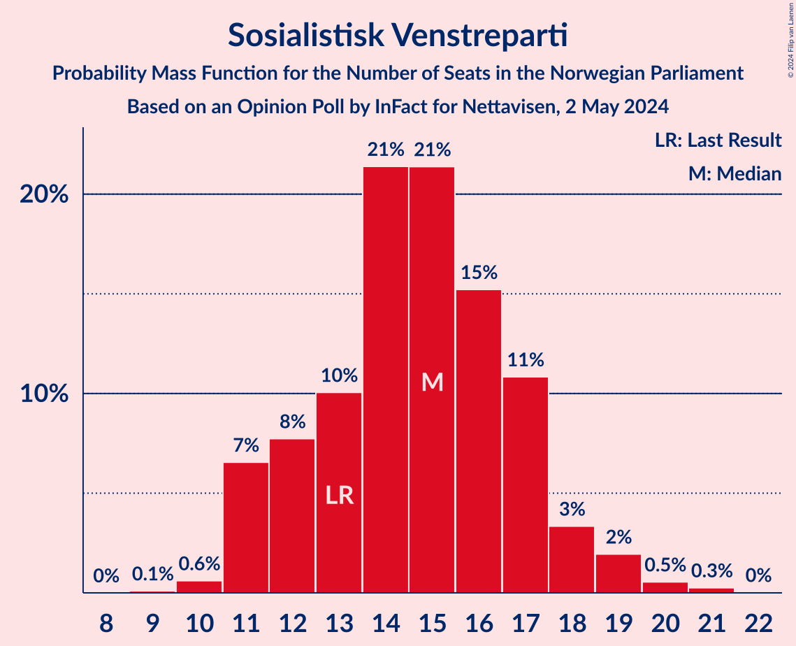

| Number of Seats | Probability | Accumulated | Special Marks |
|:---------------:|:-----------:|:-----------:|:-------------:|
| 9 | 0.1% | 100% |  |
| 10 | 0.6% | 99.9% |  |
| 11 | 7% | 99.3% |  |
| 12 | 8% | 93% |  |
| 13 | 10% | 85% | Last Result |
| 14 | 21% | 75% |  |
| 15 | 21% | 54% | Median |
| 16 | 15% | 32% |  |
| 17 | 11% | 17% |  |
| 18 | 3% | 6% |  |
| 19 | 2% | 3% |  |
| 20 | 0.5% | 0.8% |  |
| 21 | 0.3% | 0.3% |  |
| 22 | 0% | 0% |  |

### Senterpartiet

*For a full overview of the results for this party, see the [Senterpartiet](party-senterpartiet.html) page.*

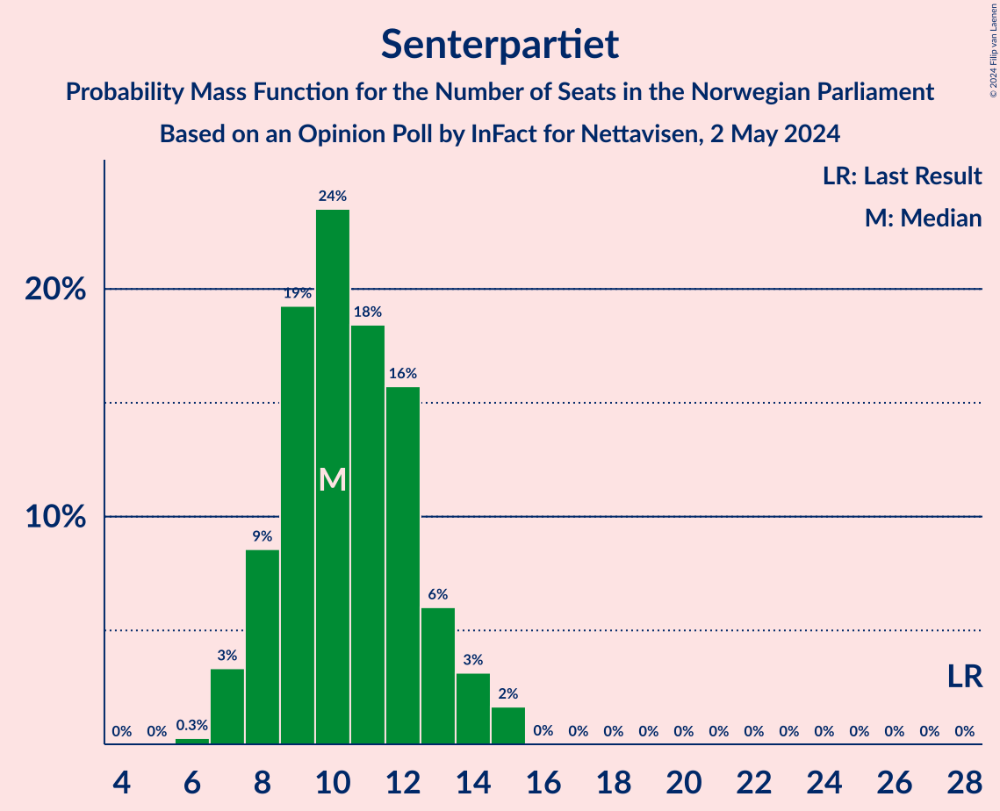

| Number of Seats | Probability | Accumulated | Special Marks |
|:---------------:|:-----------:|:-----------:|:-------------:|
| 6 | 0.3% | 100% |  |
| 7 | 3% | 99.7% |  |
| 8 | 9% | 96% |  |
| 9 | 19% | 88% |  |
| 10 | 24% | 69% | Median |
| 11 | 18% | 45% |  |
| 12 | 16% | 27% |  |
| 13 | 6% | 11% |  |
| 14 | 3% | 5% |  |
| 15 | 2% | 2% |  |
| 16 | 0% | 0% |  |
| 17 | 0% | 0% |  |
| 18 | 0% | 0% |  |
| 19 | 0% | 0% |  |
| 20 | 0% | 0% |  |
| 21 | 0% | 0% |  |
| 22 | 0% | 0% |  |
| 23 | 0% | 0% |  |
| 24 | 0% | 0% |  |
| 25 | 0% | 0% |  |
| 26 | 0% | 0% |  |
| 27 | 0% | 0% |  |
| 28 | 0% | 0% | Last Result |

### Rødt

*For a full overview of the results for this party, see the [Rødt](party-rødt.html) page.*

| Number of Seats | Probability | Accumulated | Special Marks |
|:---------------:|:-----------:|:-----------:|:-------------:|
| 1 | 8% | 100% |  |
| 2 | 0% | 92% |  |
| 3 | 0% | 92% |  |
| 4 | 0% | 92% |  |
| 5 | 0% | 92% |  |
| 6 | 1.2% | 92% |  |
| 7 | 15% | 91% |  |
| 8 | 28% | 77% | Last Result, Median |
| 9 | 33% | 48% |  |
| 10 | 10% | 15% |  |
| 11 | 4% | 5% |  |
| 12 | 1.0% | 1.2% |  |
| 13 | 0.1% | 0.1% |  |
| 14 | 0.1% | 0.1% |  |
| 15 | 0% | 0% |  |

### Kristelig Folkeparti

*For a full overview of the results for this party, see the [Kristelig Folkeparti](party-kristeligfolkeparti.html) page.*

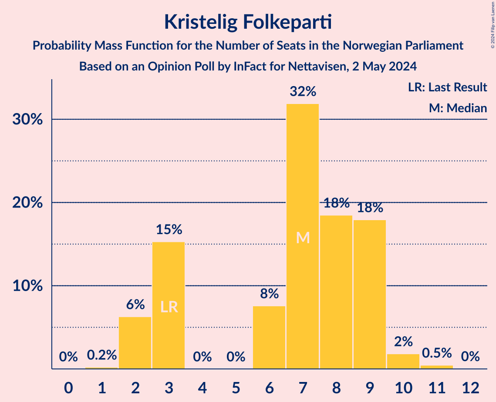

| Number of Seats | Probability | Accumulated | Special Marks |
|:---------------:|:-----------:|:-----------:|:-------------:|
| 1 | 0.2% | 100% |  |
| 2 | 6% | 99.8% |  |
| 3 | 15% | 93% | Last Result |
| 4 | 0% | 78% |  |
| 5 | 0% | 78% |  |
| 6 | 8% | 78% |  |
| 7 | 32% | 71% | Median |
| 8 | 18% | 39% |  |
| 9 | 18% | 20% |  |
| 10 | 2% | 2% |  |
| 11 | 0.5% | 0.5% |  |
| 12 | 0% | 0% |  |

### Venstre

*For a full overview of the results for this party, see the [Venstre](party-venstre.html) page.*

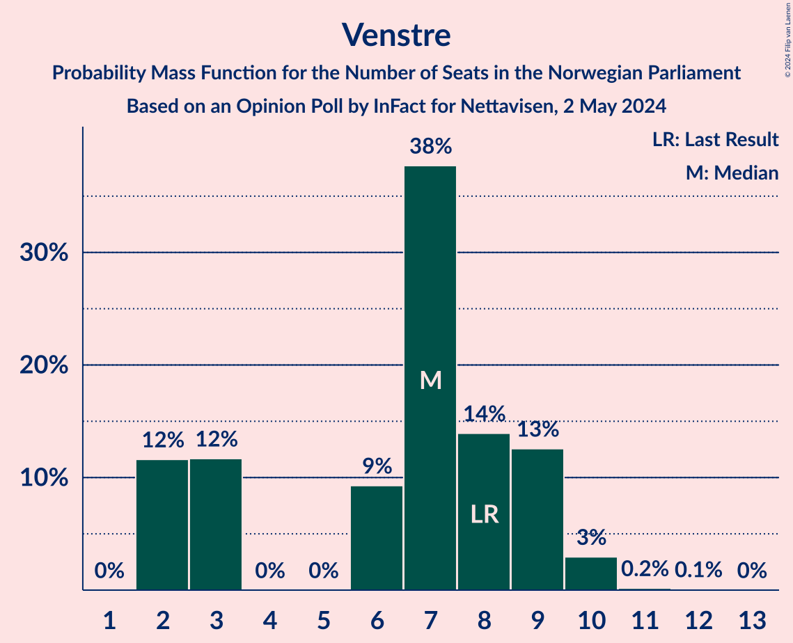

| Number of Seats | Probability | Accumulated | Special Marks |
|:---------------:|:-----------:|:-----------:|:-------------:|
| 2 | 12% | 100% |  |
| 3 | 12% | 88% |  |
| 4 | 0% | 77% |  |
| 5 | 0% | 77% |  |
| 6 | 9% | 77% |  |
| 7 | 38% | 67% | Median |
| 8 | 14% | 30% | Last Result |
| 9 | 13% | 16% |  |
| 10 | 3% | 3% |  |
| 11 | 0.2% | 0.3% |  |
| 12 | 0.1% | 0.1% |  |
| 13 | 0% | 0% |  |

### Miljøpartiet De Grønne

*For a full overview of the results for this party, see the [Miljøpartiet De Grønne](party-miljøpartietdegrønne.html) page.*

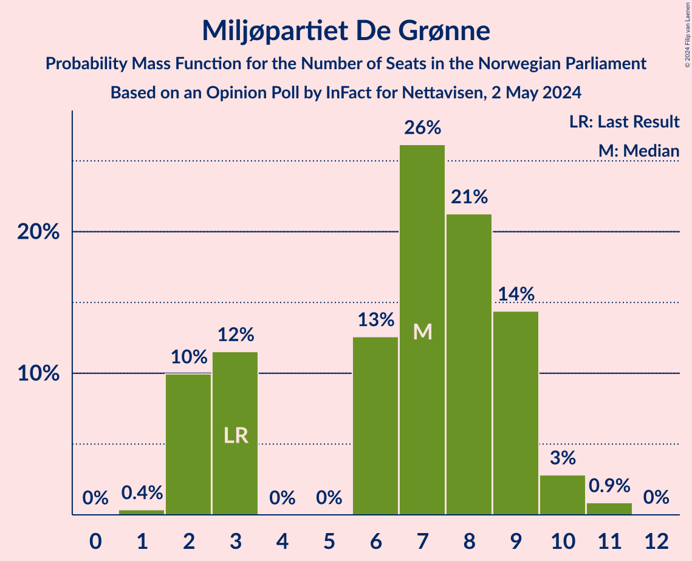

| Number of Seats | Probability | Accumulated | Special Marks |
|:---------------:|:-----------:|:-----------:|:-------------:|
| 1 | 0.4% | 100% |  |
| 2 | 10% | 99.6% |  |
| 3 | 12% | 90% | Last Result |
| 4 | 0% | 78% |  |
| 5 | 0% | 78% |  |
| 6 | 13% | 78% |  |
| 7 | 26% | 66% | Median |
| 8 | 21% | 39% |  |
| 9 | 14% | 18% |  |
| 10 | 3% | 4% |  |
| 11 | 0.9% | 0.9% |  |
| 12 | 0% | 0% |  |

### Industri- og Næringspartiet

*For a full overview of the results for this party, see the [Industri- og Næringspartiet](party-industri-ognæringspartiet.html) page.*

| Number of Seats | Probability | Accumulated | Special Marks |
|:---------------:|:-----------:|:-----------:|:-------------:|
| 0 | 60% | 100% | Last Result, Median |
| 1 | 2% | 40% |  |
| 2 | 30% | 38% |  |
| 3 | 7% | 8% |  |
| 4 | 0% | 0.5% |  |
| 5 | 0% | 0.5% |  |
| 6 | 0.3% | 0.5% |  |
| 7 | 0.1% | 0.2% |  |
| 8 | 0% | 0% |  |

## Coalitions

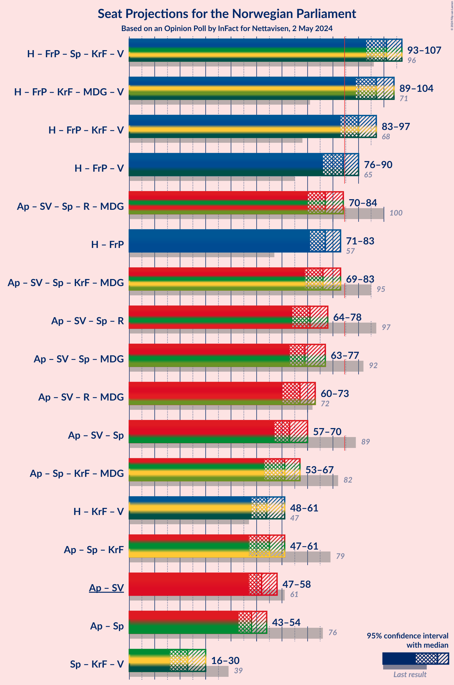

### Confidence Intervals

| Coalition | Last Result | Median | Majority? | 80% Confidence Interval | 90% Confidence Interval | 95% Confidence Interval | 99% Confidence Interval |
|:---------:|:-----------:|:------:|:---------:|:-----------------------:|:-----------------------:|:-----------------------:|:-----------------------:|
| Høyre – Fremskrittspartiet – Senterpartiet – Kristelig Folkeparti – Venstre | 96 | 101 | 100% | 96–105 | 95–106 | 93–107 | 91–110 |
| Høyre – Fremskrittspartiet – Kristelig Folkeparti – Miljøpartiet De Grønne – Venstre | 71 | 97 | 99.3% | 91–102 | 90–103 | 89–104 | 84–106 |
| Høyre – Fremskrittspartiet – Kristelig Folkeparti – Venstre | 68 | 90 | 94% | 85–94 | 84–97 | 83–97 | 80–99 |
| Høyre – Fremskrittspartiet – Venstre | 65 | 84 | 42% | 79–87 | 78–90 | 76–90 | 74–92 |
| Arbeiderpartiet – Sosialistisk Venstreparti – Senterpartiet – Rødt – Miljøpartiet De Grønne | 100 | 77 | 2% | 73–81 | 71–83 | 70–84 | 68–87 |
| Høyre – Fremskrittspartiet | 57 | 77 | 0.6% | 74–81 | 72–82 | 71–83 | 69–85 |
| Arbeiderpartiet – Sosialistisk Venstreparti – Senterpartiet – Kristelig Folkeparti – Miljøpartiet De Grønne | 95 | 76 | 0.7% | 71–81 | 70–82 | 69–83 | 66–85 |
| Arbeiderpartiet – Sosialistisk Venstreparti – Senterpartiet – Rødt | 97 | 71 | 0% | 66–76 | 64–77 | 64–78 | 61–82 |
| Arbeiderpartiet – Sosialistisk Venstreparti – Senterpartiet – Miljøpartiet De Grønne | 92 | 69 | 0% | 65–74 | 64–75 | 63–77 | 61–79 |
| Arbeiderpartiet – Sosialistisk Venstreparti – Rødt – Miljøpartiet De Grønne | 72 | 67 | 0% | 62–71 | 61–72 | 60–73 | 58–76 |
| Arbeiderpartiet – Sosialistisk Venstreparti – Senterpartiet | 89 | 63 | 0% | 58–67 | 57–68 | 57–70 | 55–72 |
| Arbeiderpartiet – Senterpartiet – Kristelig Folkeparti – Miljøpartiet De Grønne | 82 | 61 | 0% | 56–67 | 54–67 | 53–67 | 51–70 |
| Høyre – Kristelig Folkeparti – Venstre | 47 | 54 | 0% | 50–59 | 49–60 | 48–61 | 45–64 |
| Arbeiderpartiet – Senterpartiet – Kristelig Folkeparti | 79 | 55 | 0% | 50–59 | 48–60 | 47–61 | 46–62 |
| Arbeiderpartiet – Sosialistisk Venstreparti | 61 | 52 | 0% | 48–56 | 48–57 | 47–58 | 45–61 |
| Arbeiderpartiet – Senterpartiet | 76 | 48 | 0% | 44–52 | 43–53 | 43–54 | 41–56 |
| Senterpartiet – Kristelig Folkeparti – Venstre | 39 | 23 | 0% | 19–28 | 17–30 | 16–30 | 15–32 |

### Høyre – Fremskrittspartiet – Senterpartiet – Kristelig Folkeparti – Venstre

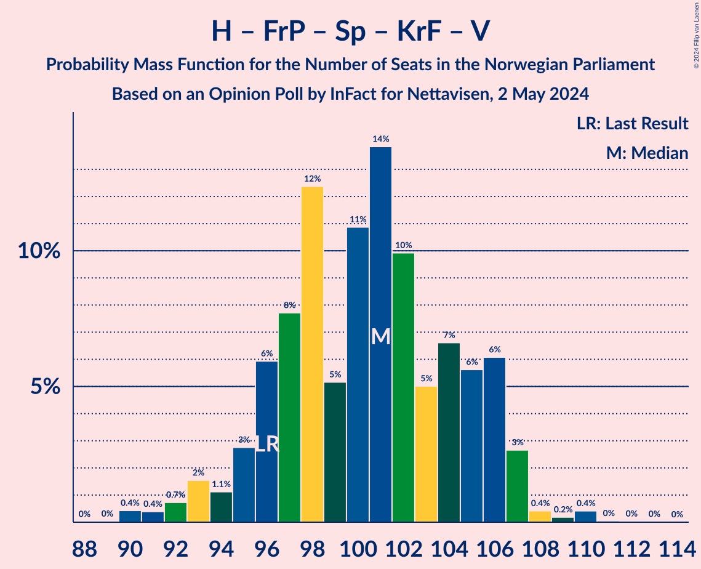

| Number of Seats | Probability | Accumulated | Special Marks |
|:---------------:|:-----------:|:-----------:|:-------------:|
| 89 | 0% | 100% |  |
| 90 | 0.4% | 99.9% |  |
| 91 | 0.4% | 99.5% |  |
| 92 | 0.7% | 99.1% |  |
| 93 | 2% | 98% |  |
| 94 | 1.1% | 97% |  |
| 95 | 3% | 96% |  |
| 96 | 6% | 93% | Last Result |
| 97 | 8% | 87% |  |
| 98 | 12% | 79% |  |
| 99 | 5% | 67% |  |
| 100 | 11% | 62% |  |
| 101 | 14% | 51% | Median |
| 102 | 10% | 37% |  |
| 103 | 5% | 27% |  |
| 104 | 7% | 22% |  |
| 105 | 6% | 16% |  |
| 106 | 6% | 10% |  |
| 107 | 3% | 4% |  |
| 108 | 0.4% | 1.1% |  |
| 109 | 0.2% | 0.7% |  |
| 110 | 0.4% | 0.5% |  |
| 111 | 0% | 0.1% |  |
| 112 | 0% | 0.1% |  |
| 113 | 0% | 0% |  |

### Høyre – Fremskrittspartiet – Kristelig Folkeparti – Miljøpartiet De Grønne – Venstre

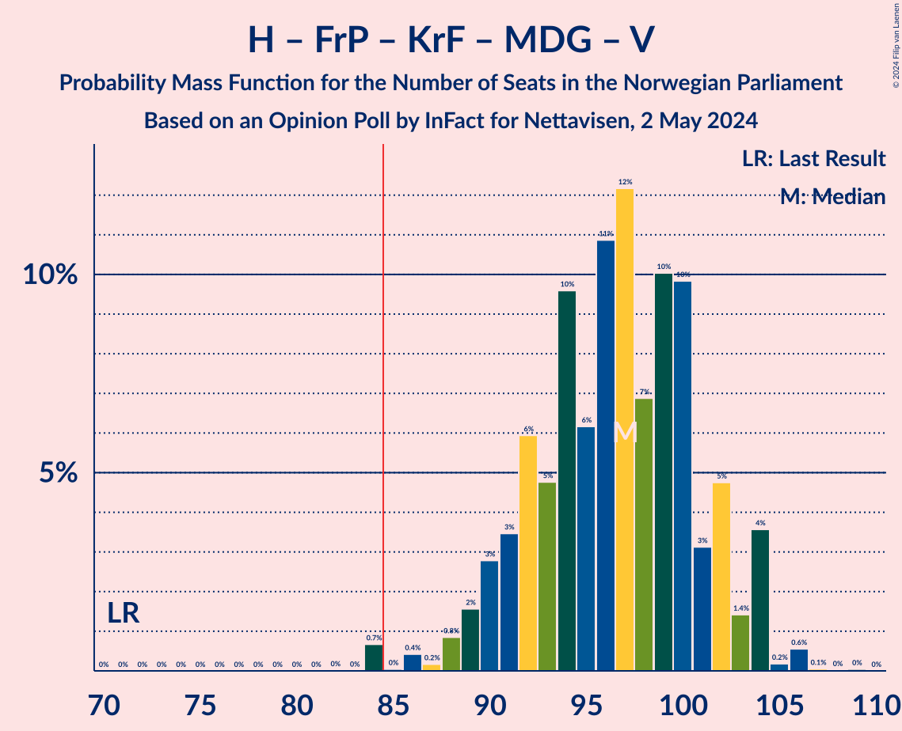

| Number of Seats | Probability | Accumulated | Special Marks |
|:---------------:|:-----------:|:-----------:|:-------------:|
| 71 | 0% | 100% | Last Result |
| 72 | 0% | 100% |  |
| 73 | 0% | 100% |  |
| 74 | 0% | 100% |  |
| 75 | 0% | 100% |  |
| 76 | 0% | 100% |  |
| 77 | 0% | 100% |  |
| 78 | 0% | 100% |  |
| 79 | 0% | 100% |  |
| 80 | 0% | 100% |  |
| 81 | 0% | 100% |  |
| 82 | 0% | 100% |  |
| 83 | 0% | 100% |  |
| 84 | 0.7% | 100% |  |
| 85 | 0% | 99.3% | Majority |
| 86 | 0.4% | 99.3% |  |
| 87 | 0.2% | 98.8% |  |
| 88 | 0.8% | 98.7% |  |
| 89 | 2% | 98% |  |
| 90 | 3% | 96% |  |
| 91 | 3% | 93% |  |
| 92 | 6% | 90% |  |
| 93 | 5% | 84% |  |
| 94 | 10% | 79% |  |
| 95 | 6% | 70% |  |
| 96 | 11% | 64% |  |
| 97 | 12% | 53% |  |
| 98 | 7% | 40% | Median |
| 99 | 10% | 34% |  |
| 100 | 10% | 24% |  |
| 101 | 3% | 14% |  |
| 102 | 5% | 11% |  |
| 103 | 1.4% | 6% |  |
| 104 | 4% | 4% |  |
| 105 | 0.2% | 0.9% |  |
| 106 | 0.6% | 0.7% |  |
| 107 | 0.1% | 0.1% |  |
| 108 | 0% | 0.1% |  |
| 109 | 0% | 0% |  |

### Høyre – Fremskrittspartiet – Kristelig Folkeparti – Venstre

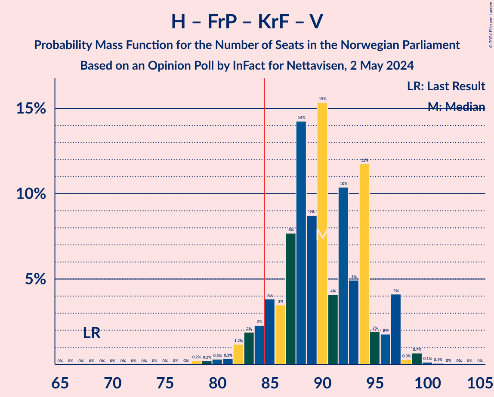

| Number of Seats | Probability | Accumulated | Special Marks |
|:---------------:|:-----------:|:-----------:|:-------------:|
| 68 | 0% | 100% | Last Result |
| 69 | 0% | 100% |  |
| 70 | 0% | 100% |  |
| 71 | 0% | 100% |  |
| 72 | 0% | 100% |  |
| 73 | 0% | 100% |  |
| 74 | 0% | 100% |  |
| 75 | 0% | 100% |  |
| 76 | 0% | 100% |  |
| 77 | 0% | 100% |  |
| 78 | 0.2% | 100% |  |
| 79 | 0.2% | 99.7% |  |
| 80 | 0.3% | 99.5% |  |
| 81 | 0.3% | 99.2% |  |
| 82 | 1.2% | 98.9% |  |
| 83 | 2% | 98% |  |
| 84 | 2% | 96% |  |
| 85 | 4% | 94% | Majority |
| 86 | 3% | 90% |  |
| 87 | 8% | 86% |  |
| 88 | 14% | 79% |  |
| 89 | 9% | 64% |  |
| 90 | 15% | 56% |  |
| 91 | 4% | 40% | Median |
| 92 | 10% | 36% |  |
| 93 | 5% | 26% |  |
| 94 | 12% | 21% |  |
| 95 | 2% | 9% |  |
| 96 | 2% | 7% |  |
| 97 | 4% | 5% |  |
| 98 | 0.3% | 1.2% |  |
| 99 | 0.7% | 0.9% |  |
| 100 | 0.1% | 0.2% |  |
| 101 | 0.1% | 0.1% |  |
| 102 | 0% | 0% |  |

### Høyre – Fremskrittspartiet – Venstre

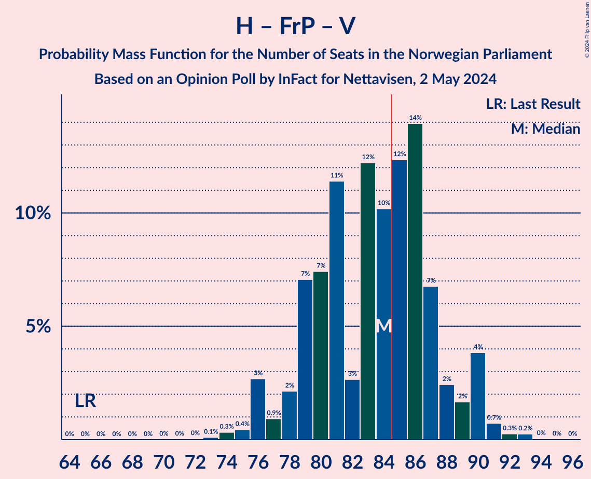

| Number of Seats | Probability | Accumulated | Special Marks |
|:---------------:|:-----------:|:-----------:|:-------------:|
| 65 | 0% | 100% | Last Result |
| 66 | 0% | 100% |  |
| 67 | 0% | 100% |  |
| 68 | 0% | 100% |  |
| 69 | 0% | 100% |  |
| 70 | 0% | 100% |  |
| 71 | 0% | 100% |  |
| 72 | 0% | 100% |  |
| 73 | 0.1% | 99.9% |  |
| 74 | 0.3% | 99.8% |  |
| 75 | 0.4% | 99.5% |  |
| 76 | 3% | 99.0% |  |
| 77 | 0.9% | 96% |  |
| 78 | 2% | 95% |  |
| 79 | 7% | 93% |  |
| 80 | 7% | 86% |  |
| 81 | 11% | 79% |  |
| 82 | 3% | 67% |  |
| 83 | 12% | 65% |  |
| 84 | 10% | 53% | Median |
| 85 | 12% | 42% | Majority |
| 86 | 14% | 30% |  |
| 87 | 7% | 16% |  |
| 88 | 2% | 9% |  |
| 89 | 2% | 7% |  |
| 90 | 4% | 5% |  |
| 91 | 0.7% | 1.3% |  |
| 92 | 0.3% | 0.6% |  |
| 93 | 0.2% | 0.3% |  |
| 94 | 0% | 0.1% |  |
| 95 | 0% | 0% |  |

### Arbeiderpartiet – Sosialistisk Venstreparti – Senterpartiet – Rødt – Miljøpartiet De Grønne

| Number of Seats | Probability | Accumulated | Special Marks |
|:---------------:|:-----------:|:-----------:|:-------------:|
| 66 | 0% | 100% |  |
| 67 | 0.1% | 99.9% |  |
| 68 | 1.4% | 99.8% |  |
| 69 | 0.7% | 98% |  |
| 70 | 0.6% | 98% |  |
| 71 | 3% | 97% |  |
| 72 | 3% | 94% |  |
| 73 | 7% | 91% |  |
| 74 | 13% | 84% |  |
| 75 | 5% | 71% |  |
| 76 | 12% | 66% |  |
| 77 | 5% | 54% |  |
| 78 | 12% | 49% | Median |
| 79 | 9% | 37% |  |
| 80 | 13% | 28% |  |
| 81 | 5% | 15% |  |
| 82 | 2% | 10% |  |
| 83 | 4% | 8% |  |
| 84 | 2% | 4% |  |
| 85 | 1.0% | 2% | Majority |
| 86 | 0.5% | 1.2% |  |
| 87 | 0.3% | 0.7% |  |
| 88 | 0.3% | 0.4% |  |
| 89 | 0.1% | 0.1% |  |
| 90 | 0% | 0% |  |
| 91 | 0% | 0% |  |
| 92 | 0% | 0% |  |
| 93 | 0% | 0% |  |
| 94 | 0% | 0% |  |
| 95 | 0% | 0% |  |
| 96 | 0% | 0% |  |
| 97 | 0% | 0% |  |
| 98 | 0% | 0% |  |
| 99 | 0% | 0% |  |
| 100 | 0% | 0% | Last Result |

### Høyre – Fremskrittspartiet

| Number of Seats | Probability | Accumulated | Special Marks |
|:---------------:|:-----------:|:-----------:|:-------------:|
| 57 | 0% | 100% | Last Result |
| 58 | 0% | 100% |  |
| 59 | 0% | 100% |  |
| 60 | 0% | 100% |  |
| 61 | 0% | 100% |  |
| 62 | 0% | 100% |  |
| 63 | 0% | 100% |  |
| 64 | 0% | 100% |  |
| 65 | 0% | 100% |  |
| 66 | 0% | 100% |  |
| 67 | 0.1% | 100% |  |
| 68 | 0.2% | 99.9% |  |
| 69 | 0.5% | 99.7% |  |
| 70 | 1.0% | 99.2% |  |
| 71 | 2% | 98% |  |
| 72 | 2% | 96% |  |
| 73 | 4% | 94% |  |
| 74 | 7% | 90% |  |
| 75 | 11% | 83% |  |
| 76 | 16% | 72% |  |
| 77 | 10% | 55% | Median |
| 78 | 16% | 46% |  |
| 79 | 9% | 29% |  |
| 80 | 7% | 20% |  |
| 81 | 5% | 13% |  |
| 82 | 4% | 8% |  |
| 83 | 3% | 4% |  |
| 84 | 0.6% | 1.2% |  |
| 85 | 0.4% | 0.6% | Majority |
| 86 | 0.1% | 0.2% |  |
| 87 | 0.1% | 0.1% |  |
| 88 | 0% | 0% |  |

### Arbeiderpartiet – Sosialistisk Venstreparti – Senterpartiet – Kristelig Folkeparti – Miljøpartiet De Grønne

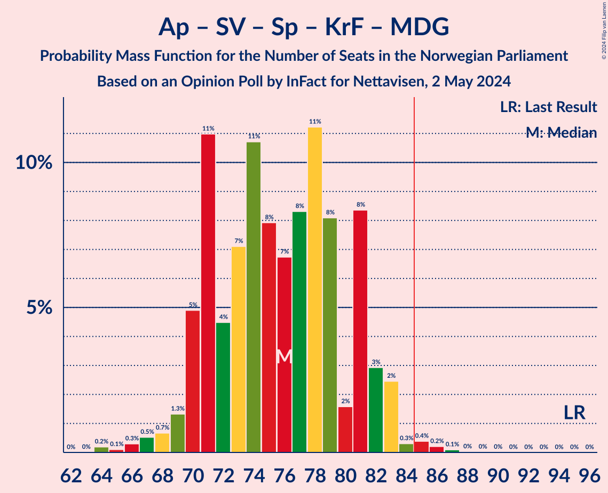

| Number of Seats | Probability | Accumulated | Special Marks |
|:---------------:|:-----------:|:-----------:|:-------------:|
| 64 | 0.2% | 100% |  |
| 65 | 0.1% | 99.8% |  |
| 66 | 0.3% | 99.7% |  |
| 67 | 0.5% | 99.4% |  |
| 68 | 0.7% | 98.9% |  |
| 69 | 1.3% | 98% |  |
| 70 | 5% | 97% |  |
| 71 | 11% | 92% |  |
| 72 | 4% | 81% |  |
| 73 | 7% | 76% |  |
| 74 | 11% | 69% |  |
| 75 | 8% | 59% |  |
| 76 | 7% | 51% |  |
| 77 | 8% | 44% | Median |
| 78 | 11% | 36% |  |
| 79 | 8% | 24% |  |
| 80 | 2% | 16% |  |
| 81 | 8% | 15% |  |
| 82 | 3% | 6% |  |
| 83 | 2% | 4% |  |
| 84 | 0.3% | 1.1% |  |
| 85 | 0.4% | 0.7% | Majority |
| 86 | 0.2% | 0.4% |  |
| 87 | 0.1% | 0.2% |  |
| 88 | 0% | 0.1% |  |
| 89 | 0% | 0% |  |
| 90 | 0% | 0% |  |
| 91 | 0% | 0% |  |
| 92 | 0% | 0% |  |
| 93 | 0% | 0% |  |
| 94 | 0% | 0% |  |
| 95 | 0% | 0% | Last Result |

### Arbeiderpartiet – Sosialistisk Venstreparti – Senterpartiet – Rødt

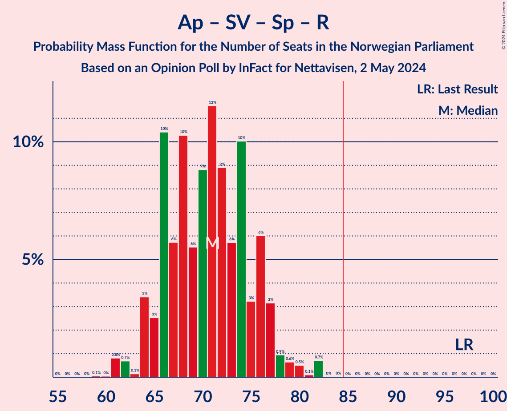

| Number of Seats | Probability | Accumulated | Special Marks |
|:---------------:|:-----------:|:-----------:|:-------------:|
| 59 | 0.1% | 100% |  |
| 60 | 0% | 99.9% |  |
| 61 | 0.8% | 99.9% |  |
| 62 | 0.7% | 99.1% |  |
| 63 | 0.1% | 98% |  |
| 64 | 3% | 98% |  |
| 65 | 3% | 95% |  |
| 66 | 10% | 92% |  |
| 67 | 6% | 82% |  |
| 68 | 10% | 76% |  |
| 69 | 6% | 66% |  |
| 70 | 9% | 60% |  |
| 71 | 12% | 52% | Median |
| 72 | 9% | 40% |  |
| 73 | 6% | 31% |  |
| 74 | 10% | 25% |  |
| 75 | 3% | 15% |  |
| 76 | 6% | 12% |  |
| 77 | 3% | 6% |  |
| 78 | 0.9% | 3% |  |
| 79 | 0.6% | 2% |  |
| 80 | 0.5% | 1.4% |  |
| 81 | 0.1% | 0.9% |  |
| 82 | 0.7% | 0.8% |  |
| 83 | 0% | 0% |  |
| 84 | 0% | 0% |  |
| 85 | 0% | 0% | Majority |
| 86 | 0% | 0% |  |
| 87 | 0% | 0% |  |
| 88 | 0% | 0% |  |
| 89 | 0% | 0% |  |
| 90 | 0% | 0% |  |
| 91 | 0% | 0% |  |
| 92 | 0% | 0% |  |
| 93 | 0% | 0% |  |
| 94 | 0% | 0% |  |
| 95 | 0% | 0% |  |
| 96 | 0% | 0% |  |
| 97 | 0% | 0% | Last Result |

### Arbeiderpartiet – Sosialistisk Venstreparti – Senterpartiet – Miljøpartiet De Grønne

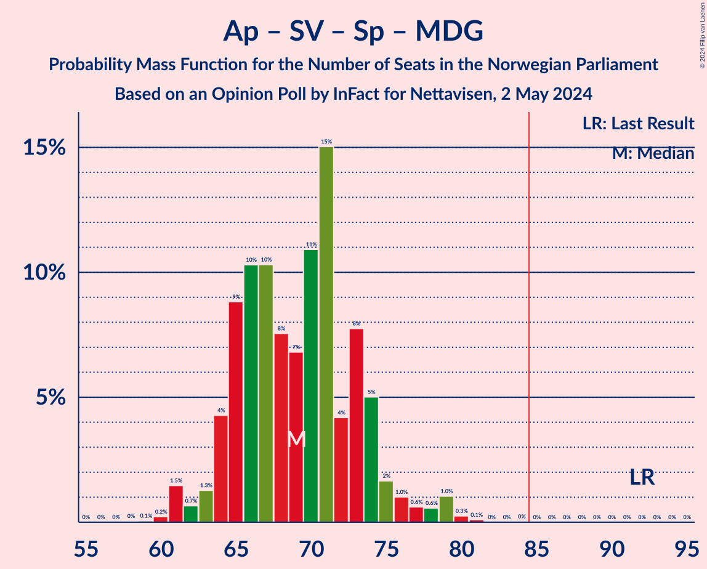

| Number of Seats | Probability | Accumulated | Special Marks |
|:---------------:|:-----------:|:-----------:|:-------------:|
| 58 | 0% | 100% |  |
| 59 | 0.1% | 99.9% |  |
| 60 | 0.2% | 99.9% |  |
| 61 | 1.5% | 99.7% |  |
| 62 | 0.7% | 98% |  |
| 63 | 1.3% | 98% |  |
| 64 | 4% | 96% |  |
| 65 | 9% | 92% |  |
| 66 | 10% | 83% |  |
| 67 | 10% | 73% |  |
| 68 | 8% | 63% |  |
| 69 | 7% | 55% |  |
| 70 | 11% | 48% | Median |
| 71 | 15% | 37% |  |
| 72 | 4% | 22% |  |
| 73 | 8% | 18% |  |
| 74 | 5% | 10% |  |
| 75 | 2% | 5% |  |
| 76 | 1.0% | 4% |  |
| 77 | 0.6% | 3% |  |
| 78 | 0.6% | 2% |  |
| 79 | 1.0% | 1.4% |  |
| 80 | 0.3% | 0.4% |  |
| 81 | 0.1% | 0.1% |  |
| 82 | 0% | 0% |  |
| 83 | 0% | 0% |  |
| 84 | 0% | 0% |  |
| 85 | 0% | 0% | Majority |
| 86 | 0% | 0% |  |
| 87 | 0% | 0% |  |
| 88 | 0% | 0% |  |
| 89 | 0% | 0% |  |
| 90 | 0% | 0% |  |
| 91 | 0% | 0% |  |
| 92 | 0% | 0% | Last Result |

### Arbeiderpartiet – Sosialistisk Venstreparti – Rødt – Miljøpartiet De Grønne

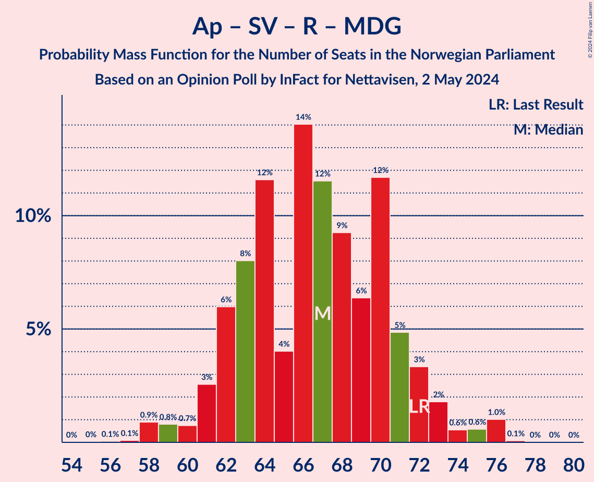

| Number of Seats | Probability | Accumulated | Special Marks |
|:---------------:|:-----------:|:-----------:|:-------------:|
| 55 | 0% | 100% |  |
| 56 | 0.1% | 99.9% |  |
| 57 | 0.1% | 99.9% |  |
| 58 | 0.9% | 99.8% |  |
| 59 | 0.8% | 98.9% |  |
| 60 | 0.7% | 98% |  |
| 61 | 3% | 97% |  |
| 62 | 6% | 95% |  |
| 63 | 8% | 89% |  |
| 64 | 12% | 81% |  |
| 65 | 4% | 69% |  |
| 66 | 14% | 65% |  |
| 67 | 12% | 51% |  |
| 68 | 9% | 40% | Median |
| 69 | 6% | 30% |  |
| 70 | 12% | 24% |  |
| 71 | 5% | 12% |  |
| 72 | 3% | 7% | Last Result |
| 73 | 2% | 4% |  |
| 74 | 0.6% | 2% |  |
| 75 | 0.6% | 2% |  |
| 76 | 1.0% | 1.1% |  |
| 77 | 0.1% | 0.1% |  |
| 78 | 0% | 0.1% |  |
| 79 | 0% | 0% |  |

### Arbeiderpartiet – Sosialistisk Venstreparti – Senterpartiet

| Number of Seats | Probability | Accumulated | Special Marks |
|:---------------:|:-----------:|:-----------:|:-------------:|
| 53 | 0.2% | 100% |  |
| 54 | 0.2% | 99.8% |  |
| 55 | 0.3% | 99.6% |  |
| 56 | 1.1% | 99.3% |  |
| 57 | 4% | 98% |  |
| 58 | 9% | 94% |  |
| 59 | 10% | 85% |  |
| 60 | 9% | 76% |  |
| 61 | 5% | 66% |  |
| 62 | 7% | 61% |  |
| 63 | 15% | 54% | Median |
| 64 | 3% | 39% |  |
| 65 | 18% | 36% |  |
| 66 | 6% | 19% |  |
| 67 | 5% | 12% |  |
| 68 | 3% | 7% |  |
| 69 | 1.5% | 4% |  |
| 70 | 1.4% | 3% |  |
| 71 | 0.5% | 1.5% |  |
| 72 | 0.8% | 1.0% |  |
| 73 | 0.1% | 0.2% |  |
| 74 | 0% | 0.1% |  |
| 75 | 0% | 0.1% |  |
| 76 | 0% | 0% |  |
| 77 | 0% | 0% |  |
| 78 | 0% | 0% |  |
| 79 | 0% | 0% |  |
| 80 | 0% | 0% |  |
| 81 | 0% | 0% |  |
| 82 | 0% | 0% |  |
| 83 | 0% | 0% |  |
| 84 | 0% | 0% |  |
| 85 | 0% | 0% | Majority |
| 86 | 0% | 0% |  |
| 87 | 0% | 0% |  |
| 88 | 0% | 0% |  |
| 89 | 0% | 0% | Last Result |

### Arbeiderpartiet – Senterpartiet – Kristelig Folkeparti – Miljøpartiet De Grønne

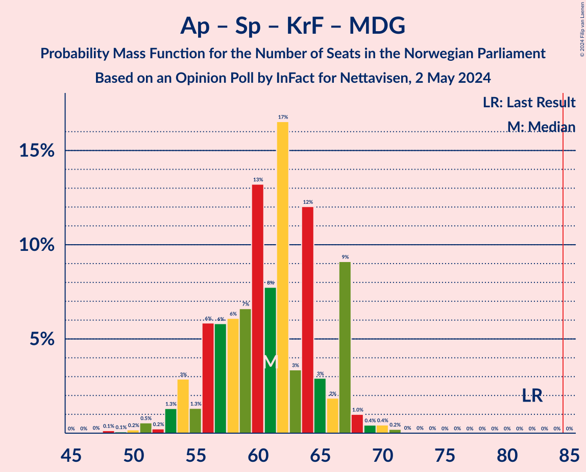

| Number of Seats | Probability | Accumulated | Special Marks |
|:---------------:|:-----------:|:-----------:|:-------------:|
| 48 | 0.1% | 100% |  |
| 49 | 0.1% | 99.8% |  |
| 50 | 0.2% | 99.8% |  |
| 51 | 0.5% | 99.6% |  |
| 52 | 0.2% | 99.0% |  |
| 53 | 1.3% | 98.8% |  |
| 54 | 3% | 97% |  |
| 55 | 1.3% | 95% |  |
| 56 | 6% | 93% |  |
| 57 | 6% | 87% |  |
| 58 | 6% | 82% |  |
| 59 | 7% | 76% |  |
| 60 | 13% | 69% |  |
| 61 | 8% | 56% |  |
| 62 | 17% | 48% | Median |
| 63 | 3% | 31% |  |
| 64 | 12% | 28% |  |
| 65 | 3% | 16% |  |
| 66 | 2% | 13% |  |
| 67 | 9% | 11% |  |
| 68 | 1.0% | 2% |  |
| 69 | 0.4% | 1.2% |  |
| 70 | 0.4% | 0.7% |  |
| 71 | 0.2% | 0.3% |  |
| 72 | 0% | 0.1% |  |
| 73 | 0% | 0.1% |  |
| 74 | 0% | 0% |  |
| 75 | 0% | 0% |  |
| 76 | 0% | 0% |  |
| 77 | 0% | 0% |  |
| 78 | 0% | 0% |  |
| 79 | 0% | 0% |  |
| 80 | 0% | 0% |  |
| 81 | 0% | 0% |  |
| 82 | 0% | 0% | Last Result |

### Høyre – Kristelig Folkeparti – Venstre

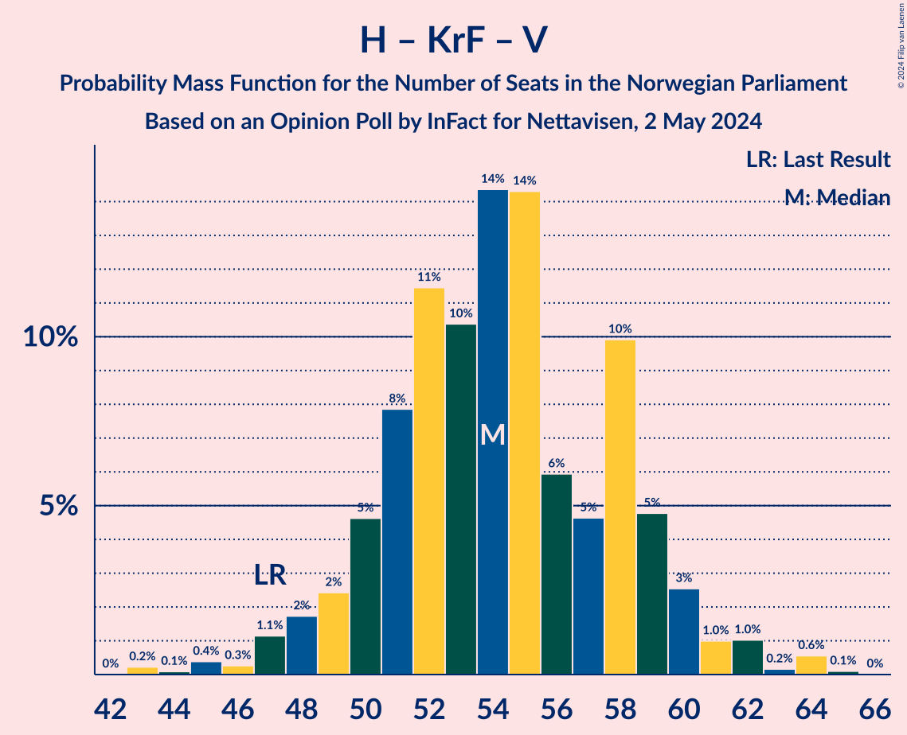

| Number of Seats | Probability | Accumulated | Special Marks |
|:---------------:|:-----------:|:-----------:|:-------------:|
| 43 | 0.2% | 100% |  |
| 44 | 0.1% | 99.8% |  |
| 45 | 0.4% | 99.7% |  |
| 46 | 0.3% | 99.3% |  |
| 47 | 1.1% | 99.0% | Last Result |
| 48 | 2% | 98% |  |
| 49 | 2% | 96% |  |
| 50 | 5% | 94% |  |
| 51 | 8% | 89% |  |
| 52 | 11% | 81% |  |
| 53 | 10% | 70% |  |
| 54 | 14% | 59% |  |
| 55 | 14% | 45% | Median |
| 56 | 6% | 31% |  |
| 57 | 5% | 25% |  |
| 58 | 10% | 20% |  |
| 59 | 5% | 10% |  |
| 60 | 3% | 5% |  |
| 61 | 1.0% | 3% |  |
| 62 | 1.0% | 2% |  |
| 63 | 0.2% | 0.8% |  |
| 64 | 0.6% | 0.7% |  |
| 65 | 0.1% | 0.1% |  |
| 66 | 0% | 0% |  |

### Arbeiderpartiet – Senterpartiet – Kristelig Folkeparti

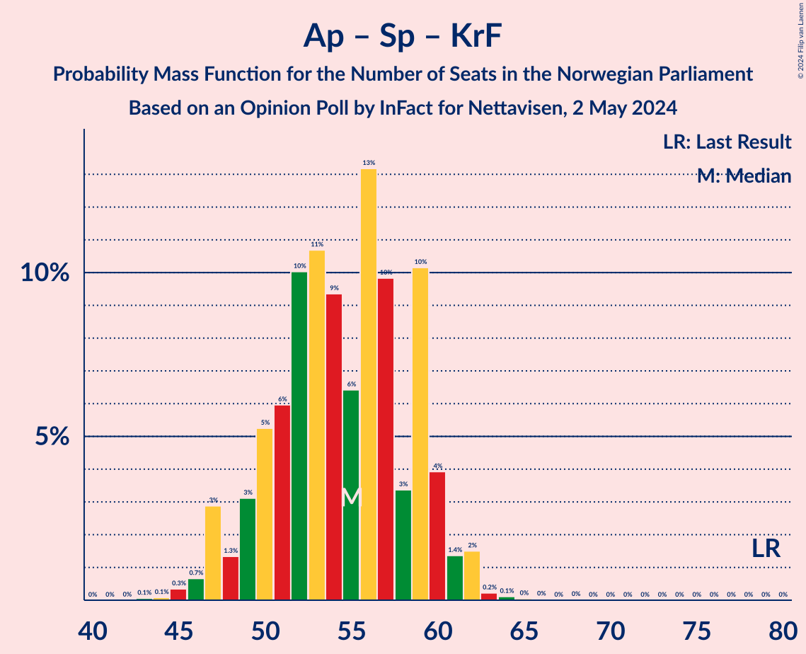

| Number of Seats | Probability | Accumulated | Special Marks |
|:---------------:|:-----------:|:-----------:|:-------------:|
| 43 | 0.1% | 100% |  |
| 44 | 0.1% | 99.9% |  |
| 45 | 0.3% | 99.8% |  |
| 46 | 0.7% | 99.5% |  |
| 47 | 3% | 98.8% |  |
| 48 | 1.3% | 96% |  |
| 49 | 3% | 95% |  |
| 50 | 5% | 91% |  |
| 51 | 6% | 86% |  |
| 52 | 10% | 80% |  |
| 53 | 11% | 70% |  |
| 54 | 9% | 60% |  |
| 55 | 6% | 50% | Median |
| 56 | 13% | 44% |  |
| 57 | 10% | 31% |  |
| 58 | 3% | 21% |  |
| 59 | 10% | 17% |  |
| 60 | 4% | 7% |  |
| 61 | 1.4% | 3% |  |
| 62 | 2% | 2% |  |
| 63 | 0.2% | 0.4% |  |
| 64 | 0.1% | 0.2% |  |
| 65 | 0% | 0.1% |  |
| 66 | 0% | 0.1% |  |
| 67 | 0% | 0% |  |
| 68 | 0% | 0% |  |
| 69 | 0% | 0% |  |
| 70 | 0% | 0% |  |
| 71 | 0% | 0% |  |
| 72 | 0% | 0% |  |
| 73 | 0% | 0% |  |
| 74 | 0% | 0% |  |
| 75 | 0% | 0% |  |
| 76 | 0% | 0% |  |
| 77 | 0% | 0% |  |
| 78 | 0% | 0% |  |
| 79 | 0% | 0% | Last Result |

### Arbeiderpartiet – Sosialistisk Venstreparti

| Number of Seats | Probability | Accumulated | Special Marks |
|:---------------:|:-----------:|:-----------:|:-------------:|
| 43 | 0.1% | 100% |  |
| 44 | 0.1% | 99.9% |  |
| 45 | 0.4% | 99.9% |  |
| 46 | 0.7% | 99.4% |  |
| 47 | 2% | 98.7% |  |
| 48 | 7% | 96% |  |
| 49 | 15% | 89% |  |
| 50 | 9% | 74% |  |
| 51 | 14% | 66% |  |
| 52 | 6% | 51% |  |
| 53 | 8% | 45% | Median |
| 54 | 6% | 36% |  |
| 55 | 17% | 31% |  |
| 56 | 8% | 14% |  |
| 57 | 3% | 6% |  |
| 58 | 1.5% | 4% |  |
| 59 | 0.9% | 2% |  |
| 60 | 0.6% | 1.5% |  |
| 61 | 0.8% | 0.9% | Last Result |
| 62 | 0% | 0.1% |  |
| 63 | 0% | 0.1% |  |
| 64 | 0% | 0% |  |

### Arbeiderpartiet – Senterpartiet

| Number of Seats | Probability | Accumulated | Special Marks |
|:---------------:|:-----------:|:-----------:|:-------------:|
| 40 | 0.1% | 100% |  |
| 41 | 0.4% | 99.9% |  |
| 42 | 0.7% | 99.5% |  |
| 43 | 5% | 98.8% |  |
| 44 | 6% | 94% |  |
| 45 | 11% | 88% |  |
| 46 | 7% | 76% |  |
| 47 | 14% | 70% |  |
| 48 | 15% | 55% | Median |
| 49 | 13% | 40% |  |
| 50 | 4% | 27% |  |
| 51 | 12% | 24% |  |
| 52 | 6% | 11% |  |
| 53 | 3% | 5% |  |
| 54 | 1.4% | 3% |  |
| 55 | 0.5% | 1.1% |  |
| 56 | 0.4% | 0.5% |  |
| 57 | 0.1% | 0.2% |  |
| 58 | 0.1% | 0.1% |  |
| 59 | 0% | 0% |  |
| 60 | 0% | 0% |  |
| 61 | 0% | 0% |  |
| 62 | 0% | 0% |  |
| 63 | 0% | 0% |  |
| 64 | 0% | 0% |  |
| 65 | 0% | 0% |  |
| 66 | 0% | 0% |  |
| 67 | 0% | 0% |  |
| 68 | 0% | 0% |  |
| 69 | 0% | 0% |  |
| 70 | 0% | 0% |  |
| 71 | 0% | 0% |  |
| 72 | 0% | 0% |  |
| 73 | 0% | 0% |  |
| 74 | 0% | 0% |  |
| 75 | 0% | 0% |  |
| 76 | 0% | 0% | Last Result |

### Senterpartiet – Kristelig Folkeparti – Venstre

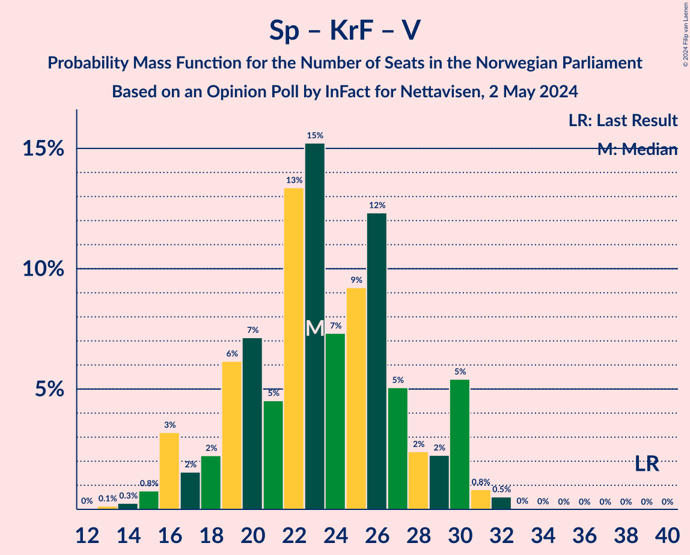

| Number of Seats | Probability | Accumulated | Special Marks |
|:---------------:|:-----------:|:-----------:|:-------------:|
| 13 | 0.1% | 100% |  |
| 14 | 0.3% | 99.8% |  |
| 15 | 0.8% | 99.6% |  |
| 16 | 3% | 98.8% |  |
| 17 | 2% | 96% |  |
| 18 | 2% | 94% |  |
| 19 | 6% | 92% |  |
| 20 | 7% | 86% |  |
| 21 | 5% | 79% |  |
| 22 | 13% | 74% |  |
| 23 | 15% | 61% |  |
| 24 | 7% | 45% | Median |
| 25 | 9% | 38% |  |
| 26 | 12% | 29% |  |
| 27 | 5% | 17% |  |
| 28 | 2% | 11% |  |
| 29 | 2% | 9% |  |
| 30 | 5% | 7% |  |
| 31 | 0.8% | 1.4% |  |
| 32 | 0.5% | 0.6% |  |
| 33 | 0% | 0.1% |  |
| 34 | 0% | 0% |  |
| 35 | 0% | 0% |  |
| 36 | 0% | 0% |  |
| 37 | 0% | 0% |  |
| 38 | 0% | 0% |  |
| 39 | 0% | 0% | Last Result |

## Technical Information

### Opinion Poll

+ **Polling firm:** InFact
+ **Commissioner(s):** Nettavisen
+ **Fieldwork period:** 2 May 2024

### Calculations

+ **Sample size:** 1070
+ **Simulations done:** 1,048,576
+ **Error estimate:** 1.42%

