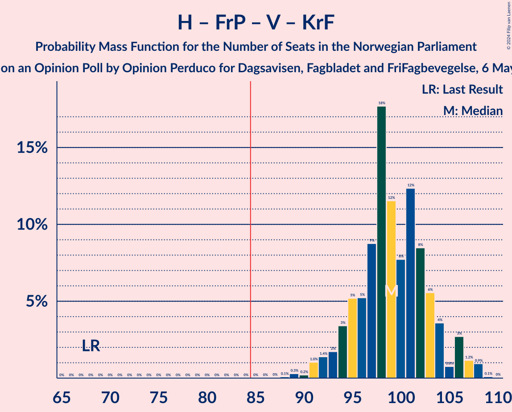
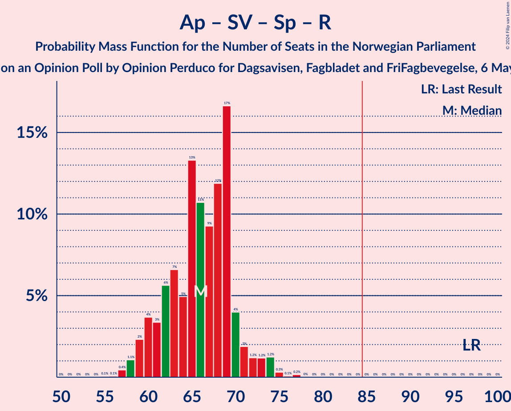

# Opinion Poll by Opinion Perduco for Dagsavisen, Fagbladet and FriFagbevegelse, 6 May 2024

<a href="#voting-intentions">Voting Intentions</a> | <a href="#seats">Seats</a> | <a href="#coalitions">Coalitions</a> | <a href="#technical-information">Technical Information</a>

## Voting Intentions

### Confidence Intervals

| Party | Last Result | Poll Result | 80% Confidence Interval | 90% Confidence Interval | 95% Confidence Interval | 99% Confidence Interval |
|:-----:|:-----------:|:-----------:|:-----------------------:|:-----------------------:|:-----------------------:|:-----------------------:|
| Høyre | 20.4% | 28.0% | 26.2–29.9% |25.7–30.4% |25.3–30.9% |24.5–31.8% |
| Fremskrittspartiet | 11.6% | 17.8% | 16.3–19.4% |15.9–19.9% |15.5–20.3% |14.9–21.1% |
| Arbeiderpartiet | 26.2% | 17.3% | 15.8–18.9% |15.4–19.4% |15.1–19.8% |14.4–20.6% |
| Sosialistisk Venstreparti | 7.6% | 9.7% | 8.6–11.0% |8.3–11.4% |8.0–11.7% |7.5–12.3% |
| Senterpartiet | 13.5% | 5.9% | 5.0–7.0% |4.8–7.3% |4.6–7.5% |4.2–8.1% |
| Venstre | 4.6% | 5.8% | 5.0–6.9% |4.7–7.2% |4.5–7.4% |4.1–8.0% |
| Rødt | 4.7% | 4.6% | 3.9–5.6% |3.6–5.9% |3.5–6.1% |3.1–6.6% |
| Kristelig Folkeparti | 3.8% | 4.4% | 3.7–5.3% |3.5–5.6% |3.3–5.9% |3.0–6.4% |
| Miljøpartiet De Grønne | 3.9% | 3.5% | 2.9–4.4% |2.7–4.6% |2.5–4.8% |2.2–5.3% |
| Industri- og Næringspartiet | 0.3% | 1.5% | 1.1–2.1% |1.0–2.3% |0.9–2.5% |0.7–2.8% |

*Note:* The poll result column reflects the actual value used in the calculations. Published results may vary slightly, and in addition be rounded to fewer digits.

## Seats

### Confidence Intervals

| Party | Last Result | Median | 80% Confidence Interval | 90% Confidence Interval | 95% Confidence Interval | 99% Confidence Interval |
|:-----:|:-----------:|:------:|:-----------------------:|:-----------------------:|:-----------------------:|:-----------------------:|
| <a href="#høyre">Høyre</a> | 36 | 49 | 47–52 |45–54 |43–54 |42–56 |
| <a href="#fremskrittspartiet">Fremskrittspartiet</a> | 21 | 34 | 32–37 |30–37 |28–37 |26–38 |
| <a href="#arbeiderpartiet">Arbeiderpartiet</a> | 48 | 32 | 30–36 |30–36 |29–38 |28–39 |
| <a href="#sosialistisk-venstreparti">Sosialistisk Venstreparti</a> | 13 | 16 | 14–19 |14–19 |13–20 |12–21 |
| <a href="#senterpartiet">Senterpartiet</a> | 28 | 10 | 8–12 |8–13 |7–13 |7–14 |
| <a href="#venstre">Venstre</a> | 8 | 9 | 8–12 |8–12 |7–13 |7–14 |
| <a href="#rødt">Rødt</a> | 8 | 8 | 1–9 |1–10 |1–10 |1–12 |
| <a href="#kristelig-folkeparti">Kristelig Folkeparti</a> | 3 | 7 | 3–9 |2–9 |2–10 |2–11 |
| <a href="#miljøpartiet-de-grønne">Miljøpartiet De Grønne</a> | 3 | 2 | 1–7 |1–8 |1–8 |1–8 |
| <a href="#industri--og-næringspartiet">Industri- og Næringspartiet</a> | 0 | 0 | 0 |0 |0 |0–2 |

### Høyre

*For a full overview of the results for this party, see the [Høyre](party-høyre.html) page.*

| Number of Seats | Probability | Accumulated | Special Marks |
|:---------------:|:-----------:|:-----------:|:-------------:|
| 36 | 0% | 100% | Last Result |
| 37 | 0% | 100% |  |
| 38 | 0% | 100% |  |
| 39 | 0% | 100% |  |
| 40 | 0.1% | 100% |  |
| 41 | 0.3% | 99.9% |  |
| 42 | 2% | 99.6% |  |
| 43 | 0.6% | 98% |  |
| 44 | 2% | 97% |  |
| 45 | 2% | 96% |  |
| 46 | 3% | 94% |  |
| 47 | 6% | 91% |  |
| 48 | 21% | 85% |  |
| 49 | 33% | 64% | Median |
| 50 | 6% | 31% |  |
| 51 | 11% | 25% |  |
| 52 | 7% | 14% |  |
| 53 | 2% | 8% |  |
| 54 | 3% | 5% |  |
| 55 | 0.6% | 2% |  |
| 56 | 1.3% | 1.5% |  |
| 57 | 0.1% | 0.2% |  |
| 58 | 0.1% | 0.1% |  |
| 59 | 0% | 0% |  |

### Fremskrittspartiet

*For a full overview of the results for this party, see the [Fremskrittspartiet](party-fremskrittspartiet.html) page.*

| Number of Seats | Probability | Accumulated | Special Marks |
|:---------------:|:-----------:|:-----------:|:-------------:|
| 21 | 0% | 100% | Last Result |
| 22 | 0% | 100% |  |
| 23 | 0% | 100% |  |
| 24 | 0.1% | 100% |  |
| 25 | 0.3% | 99.9% |  |
| 26 | 0.2% | 99.6% |  |
| 27 | 1.2% | 99.3% |  |
| 28 | 2% | 98% |  |
| 29 | 1.2% | 97% |  |
| 30 | 2% | 95% |  |
| 31 | 2% | 94% |  |
| 32 | 19% | 92% |  |
| 33 | 20% | 72% |  |
| 34 | 9% | 53% | Median |
| 35 | 16% | 44% |  |
| 36 | 18% | 28% |  |
| 37 | 9% | 10% |  |
| 38 | 0.5% | 1.0% |  |
| 39 | 0.3% | 0.5% |  |
| 40 | 0% | 0.2% |  |
| 41 | 0.1% | 0.1% |  |
| 42 | 0% | 0% |  |

### Arbeiderpartiet

*For a full overview of the results for this party, see the [Arbeiderpartiet](party-arbeiderpartiet.html) page.*

| Number of Seats | Probability | Accumulated | Special Marks |
|:---------------:|:-----------:|:-----------:|:-------------:|
| 26 | 0% | 100% |  |
| 27 | 0.1% | 99.9% |  |
| 28 | 0.7% | 99.9% |  |
| 29 | 3% | 99.2% |  |
| 30 | 7% | 96% |  |
| 31 | 17% | 89% |  |
| 32 | 36% | 72% | Median |
| 33 | 11% | 36% |  |
| 34 | 6% | 25% |  |
| 35 | 4% | 19% |  |
| 36 | 11% | 16% |  |
| 37 | 2% | 5% |  |
| 38 | 2% | 3% |  |
| 39 | 1.0% | 1.2% |  |
| 40 | 0.1% | 0.2% |  |
| 41 | 0% | 0% |  |
| 42 | 0% | 0% |  |
| 43 | 0% | 0% |  |
| 44 | 0% | 0% |  |
| 45 | 0% | 0% |  |
| 46 | 0% | 0% |  |
| 47 | 0% | 0% |  |
| 48 | 0% | 0% | Last Result |

### Sosialistisk Venstreparti

*For a full overview of the results for this party, see the [Sosialistisk Venstreparti](party-sosialistiskvenstreparti.html) page.*

| Number of Seats | Probability | Accumulated | Special Marks |
|:---------------:|:-----------:|:-----------:|:-------------:|
| 11 | 0.2% | 100% |  |
| 12 | 0.9% | 99.8% |  |
| 13 | 4% | 98.9% | Last Result |
| 14 | 12% | 95% |  |
| 15 | 10% | 83% |  |
| 16 | 27% | 72% | Median |
| 17 | 18% | 45% |  |
| 18 | 17% | 28% |  |
| 19 | 6% | 10% |  |
| 20 | 2% | 4% |  |
| 21 | 1.3% | 2% |  |
| 22 | 0.4% | 0.4% |  |
| 23 | 0% | 0.1% |  |
| 24 | 0% | 0% |  |

### Senterpartiet

*For a full overview of the results for this party, see the [Senterpartiet](party-senterpartiet.html) page.*

| Number of Seats | Probability | Accumulated | Special Marks |
|:---------------:|:-----------:|:-----------:|:-------------:|
| 1 | 0.1% | 100% |  |
| 2 | 0% | 99.9% |  |
| 3 | 0% | 99.8% |  |
| 4 | 0% | 99.8% |  |
| 5 | 0% | 99.8% |  |
| 6 | 0.1% | 99.8% |  |
| 7 | 3% | 99.7% |  |
| 8 | 13% | 96% |  |
| 9 | 21% | 83% |  |
| 10 | 37% | 62% | Median |
| 11 | 12% | 25% |  |
| 12 | 5% | 13% |  |
| 13 | 6% | 8% |  |
| 14 | 2% | 2% |  |
| 15 | 0.4% | 0.4% |  |
| 16 | 0% | 0% |  |
| 17 | 0% | 0% |  |
| 18 | 0% | 0% |  |
| 19 | 0% | 0% |  |
| 20 | 0% | 0% |  |
| 21 | 0% | 0% |  |
| 22 | 0% | 0% |  |
| 23 | 0% | 0% |  |
| 24 | 0% | 0% |  |
| 25 | 0% | 0% |  |
| 26 | 0% | 0% |  |
| 27 | 0% | 0% |  |
| 28 | 0% | 0% | Last Result |

### Venstre

*For a full overview of the results for this party, see the [Venstre](party-venstre.html) page.*

| Number of Seats | Probability | Accumulated | Special Marks |
|:---------------:|:-----------:|:-----------:|:-------------:|
| 2 | 0.1% | 100% |  |
| 3 | 0.1% | 99.9% |  |
| 4 | 0% | 99.7% |  |
| 5 | 0% | 99.7% |  |
| 6 | 0.1% | 99.7% |  |
| 7 | 3% | 99.7% |  |
| 8 | 16% | 97% | Last Result |
| 9 | 34% | 81% | Median |
| 10 | 20% | 47% |  |
| 11 | 16% | 27% |  |
| 12 | 6% | 11% |  |
| 13 | 4% | 4% |  |
| 14 | 0.3% | 0.5% |  |
| 15 | 0.2% | 0.2% |  |
| 16 | 0% | 0% |  |

### Rødt

*For a full overview of the results for this party, see the [Rødt](party-rødt.html) page.*

| Number of Seats | Probability | Accumulated | Special Marks |
|:---------------:|:-----------:|:-----------:|:-------------:|
| 1 | 13% | 100% |  |
| 2 | 0% | 87% |  |
| 3 | 0% | 87% |  |
| 4 | 0% | 87% |  |
| 5 | 0% | 87% |  |
| 6 | 2% | 87% |  |
| 7 | 27% | 86% |  |
| 8 | 36% | 59% | Last Result, Median |
| 9 | 14% | 23% |  |
| 10 | 7% | 9% |  |
| 11 | 1.1% | 2% |  |
| 12 | 0.6% | 0.6% |  |
| 13 | 0% | 0% |  |

### Kristelig Folkeparti

*For a full overview of the results for this party, see the [Kristelig Folkeparti](party-kristeligfolkeparti.html) page.*

| Number of Seats | Probability | Accumulated | Special Marks |
|:---------------:|:-----------:|:-----------:|:-------------:|
| 1 | 0.1% | 100% |  |
| 2 | 6% | 99.9% |  |
| 3 | 21% | 94% | Last Result |
| 4 | 0% | 73% |  |
| 5 | 0% | 73% |  |
| 6 | 3% | 73% |  |
| 7 | 23% | 70% | Median |
| 8 | 28% | 48% |  |
| 9 | 15% | 19% |  |
| 10 | 4% | 5% |  |
| 11 | 0.5% | 0.6% |  |
| 12 | 0% | 0% |  |

### Miljøpartiet De Grønne

*For a full overview of the results for this party, see the [Miljøpartiet De Grønne](party-miljøpartietdegrønne.html) page.*

| Number of Seats | Probability | Accumulated | Special Marks |
|:---------------:|:-----------:|:-----------:|:-------------:|
| 1 | 25% | 100% |  |
| 2 | 51% | 75% | Median |
| 3 | 5% | 24% | Last Result |
| 4 | 0% | 19% |  |
| 5 | 0% | 19% |  |
| 6 | 4% | 19% |  |
| 7 | 10% | 15% |  |
| 8 | 5% | 5% |  |
| 9 | 0.4% | 0.4% |  |
| 10 | 0% | 0.1% |  |
| 11 | 0% | 0% |  |

### Industri- og Næringspartiet

*For a full overview of the results for this party, see the [Industri- og Næringspartiet](party-industri-ognæringspartiet.html) page.*

| Number of Seats | Probability | Accumulated | Special Marks |
|:---------------:|:-----------:|:-----------:|:-------------:|
| 0 | 98.9% | 100% | Last Result, Median |
| 1 | 0.4% | 1.1% |  |
| 2 | 0.6% | 0.6% |  |
| 3 | 0% | 0% |  |

## Coalitions

### Confidence Intervals

| Coalition | Last Result | Median | Majority? | 80% Confidence Interval | 90% Confidence Interval | 95% Confidence Interval | 99% Confidence Interval |
|:---------:|:-----------:|:------:|:---------:|:-----------------------:|:-----------------------:|:-----------------------:|:-----------------------:|
| Høyre – Fremskrittspartiet – Senterpartiet – Venstre – Kristelig Folkeparti | 96 | 108 | 100% | 105–113 | 104–116 | 103–117 | 100–119 |
| Høyre – Fremskrittspartiet – Venstre – Kristelig Folkeparti – Miljøpartiet De Grønne | 71 | 102 | 100% | 98–107 | 97–108 | 95–109 | 93–111 |
| Høyre – Fremskrittspartiet – Venstre – Kristelig Folkeparti | 68 | 99 | 100% | 95–103 | 94–105 | 92–106 | 90–108 |
| Høyre – Fremskrittspartiet – Venstre | 65 | 93 | 99.1% | 89–97 | 87–98 | 86–99 | 84–101 |
| Høyre – Fremskrittspartiet | 57 | 83 | 34% | 80–86 | 78–88 | 77–88 | 74–90 |
| Arbeiderpartiet – Sosialistisk Venstreparti – Senterpartiet – Rødt – Miljøpartiet De Grønne | 100 | 69 | 0% | 65–73 | 63–74 | 62–76 | 60–78 |
| Arbeiderpartiet – Sosialistisk Venstreparti – Senterpartiet – Kristelig Folkeparti – Miljøpartiet De Grønne | 95 | 68 | 0% | 64–72 | 63–74 | 62–75 | 61–78 |
| Høyre – Venstre – Kristelig Folkeparti | 47 | 65 | 0% | 61–69 | 61–72 | 60–73 | 57–74 |
| Arbeiderpartiet – Sosialistisk Venstreparti – Senterpartiet – Rødt | 97 | 66 | 0% | 61–70 | 60–71 | 59–73 | 57–75 |
| Arbeiderpartiet – Sosialistisk Venstreparti – Senterpartiet – Miljøpartiet De Grønne | 92 | 62 | 0% | 58–65 | 56–67 | 56–68 | 55–71 |
| Arbeiderpartiet – Sosialistisk Venstreparti – Senterpartiet | 89 | 59 | 0% | 55–62 | 54–64 | 53–65 | 52–67 |
| Arbeiderpartiet – Sosialistisk Venstreparti – Rødt – Miljøpartiet De Grønne | 72 | 60 | 0% | 55–63 | 52–64 | 51–65 | 49–68 |
| Arbeiderpartiet – Senterpartiet – Kristelig Folkeparti – Miljøpartiet De Grønne | 82 | 52 | 0% | 47–56 | 46–58 | 46–59 | 44–61 |
| Arbeiderpartiet – Senterpartiet – Kristelig Folkeparti | 79 | 49 | 0% | 45–54 | 44–54 | 43–55 | 42–57 |
| Arbeiderpartiet – Sosialistisk Venstreparti | 61 | 49 | 0% | 45–52 | 45–53 | 44–54 | 43–56 |
| Arbeiderpartiet – Senterpartiet | 76 | 42 | 0% | 40–46 | 39–47 | 38–48 | 37–49 |
| Senterpartiet – Venstre – Kristelig Folkeparti | 39 | 27 | 0% | 22–30 | 22–31 | 21–32 | 20–34 |

### Høyre – Fremskrittspartiet – Senterpartiet – Venstre – Kristelig Folkeparti

| Number of Seats | Probability | Accumulated | Special Marks |
|:---------------:|:-----------:|:-----------:|:-------------:|
| 96 | 0% | 100% | Last Result |
| 97 | 0% | 100% |  |
| 98 | 0.1% | 100% |  |
| 99 | 0.2% | 99.9% |  |
| 100 | 0.3% | 99.7% |  |
| 101 | 0.5% | 99.4% |  |
| 102 | 0.5% | 99.0% |  |
| 103 | 2% | 98.5% |  |
| 104 | 6% | 97% |  |
| 105 | 4% | 91% |  |
| 106 | 5% | 87% |  |
| 107 | 7% | 82% |  |
| 108 | 27% | 75% |  |
| 109 | 8% | 48% | Median |
| 110 | 12% | 40% |  |
| 111 | 8% | 28% |  |
| 112 | 7% | 20% |  |
| 113 | 4% | 13% |  |
| 114 | 2% | 9% |  |
| 115 | 2% | 7% |  |
| 116 | 2% | 5% |  |
| 117 | 0.8% | 3% |  |
| 118 | 0.4% | 2% |  |
| 119 | 2% | 2% |  |
| 120 | 0% | 0.1% |  |
| 121 | 0% | 0% |  |

### Høyre – Fremskrittspartiet – Venstre – Kristelig Folkeparti – Miljøpartiet De Grønne

| Number of Seats | Probability | Accumulated | Special Marks |
|:---------------:|:-----------:|:-----------:|:-------------:|
| 71 | 0% | 100% | Last Result |
| 72 | 0% | 100% |  |
| 73 | 0% | 100% |  |
| 74 | 0% | 100% |  |
| 75 | 0% | 100% |  |
| 76 | 0% | 100% |  |
| 77 | 0% | 100% |  |
| 78 | 0% | 100% |  |
| 79 | 0% | 100% |  |
| 80 | 0% | 100% |  |
| 81 | 0% | 100% |  |
| 82 | 0% | 100% |  |
| 83 | 0% | 100% |  |
| 84 | 0% | 100% |  |
| 85 | 0% | 100% | Majority |
| 86 | 0% | 100% |  |
| 87 | 0% | 100% |  |
| 88 | 0% | 100% |  |
| 89 | 0% | 100% |  |
| 90 | 0% | 100% |  |
| 91 | 0.2% | 100% |  |
| 92 | 0.1% | 99.8% |  |
| 93 | 0.3% | 99.7% |  |
| 94 | 1.2% | 99.4% |  |
| 95 | 1.2% | 98% |  |
| 96 | 1.2% | 97% |  |
| 97 | 2% | 96% |  |
| 98 | 4% | 94% |  |
| 99 | 17% | 90% |  |
| 100 | 12% | 73% |  |
| 101 | 9% | 61% | Median |
| 102 | 11% | 52% |  |
| 103 | 13% | 41% |  |
| 104 | 5% | 28% |  |
| 105 | 7% | 23% |  |
| 106 | 6% | 17% |  |
| 107 | 3% | 11% |  |
| 108 | 4% | 8% |  |
| 109 | 2% | 4% |  |
| 110 | 1.0% | 2% |  |
| 111 | 0.4% | 0.6% |  |
| 112 | 0.1% | 0.1% |  |
| 113 | 0.1% | 0.1% |  |
| 114 | 0% | 0% |  |

### Høyre – Fremskrittspartiet – Venstre – Kristelig Folkeparti

| Number of Seats | Probability | Accumulated | Special Marks |
|:---------------:|:-----------:|:-----------:|:-------------:|
| 68 | 0% | 100% | Last Result |
| 69 | 0% | 100% |  |
| 70 | 0% | 100% |  |
| 71 | 0% | 100% |  |
| 72 | 0% | 100% |  |
| 73 | 0% | 100% |  |
| 74 | 0% | 100% |  |
| 75 | 0% | 100% |  |
| 76 | 0% | 100% |  |
| 77 | 0% | 100% |  |
| 78 | 0% | 100% |  |
| 79 | 0% | 100% |  |
| 80 | 0% | 100% |  |
| 81 | 0% | 100% |  |
| 82 | 0% | 100% |  |
| 83 | 0% | 100% |  |
| 84 | 0% | 100% |  |
| 85 | 0% | 100% | Majority |
| 86 | 0% | 100% |  |
| 87 | 0% | 100% |  |
| 88 | 0.1% | 99.9% |  |
| 89 | 0.3% | 99.9% |  |
| 90 | 0.2% | 99.6% |  |
| 91 | 1.0% | 99.4% |  |
| 92 | 1.4% | 98% |  |
| 93 | 2% | 97% |  |
| 94 | 3% | 95% |  |
| 95 | 5% | 92% |  |
| 96 | 5% | 87% |  |
| 97 | 9% | 81% |  |
| 98 | 18% | 73% |  |
| 99 | 12% | 55% | Median |
| 100 | 8% | 43% |  |
| 101 | 12% | 36% |  |
| 102 | 8% | 23% |  |
| 103 | 6% | 15% |  |
| 104 | 4% | 9% |  |
| 105 | 0.8% | 6% |  |
| 106 | 3% | 5% |  |
| 107 | 1.2% | 2% |  |
| 108 | 0.9% | 1.1% |  |
| 109 | 0.1% | 0.1% |  |
| 110 | 0% | 0% |  |

### Høyre – Fremskrittspartiet – Venstre

| Number of Seats | Probability | Accumulated | Special Marks |
|:---------------:|:-----------:|:-----------:|:-------------:|
| 65 | 0% | 100% | Last Result |
| 66 | 0% | 100% |  |
| 67 | 0% | 100% |  |
| 68 | 0% | 100% |  |
| 69 | 0% | 100% |  |
| 70 | 0% | 100% |  |
| 71 | 0% | 100% |  |
| 72 | 0% | 100% |  |
| 73 | 0% | 100% |  |
| 74 | 0% | 100% |  |
| 75 | 0% | 100% |  |
| 76 | 0% | 100% |  |
| 77 | 0% | 100% |  |
| 78 | 0% | 100% |  |
| 79 | 0% | 100% |  |
| 80 | 0% | 100% |  |
| 81 | 0.1% | 100% |  |
| 82 | 0.2% | 99.9% |  |
| 83 | 0.2% | 99.8% |  |
| 84 | 0.5% | 99.6% |  |
| 85 | 0.8% | 99.1% | Majority |
| 86 | 1.1% | 98% |  |
| 87 | 3% | 97% |  |
| 88 | 3% | 95% |  |
| 89 | 10% | 92% |  |
| 90 | 12% | 81% |  |
| 91 | 5% | 69% |  |
| 92 | 12% | 64% | Median |
| 93 | 6% | 52% |  |
| 94 | 18% | 46% |  |
| 95 | 11% | 28% |  |
| 96 | 7% | 17% |  |
| 97 | 2% | 10% |  |
| 98 | 4% | 8% |  |
| 99 | 1.3% | 3% |  |
| 100 | 0.5% | 2% |  |
| 101 | 0.9% | 1.3% |  |
| 102 | 0.1% | 0.3% |  |
| 103 | 0% | 0.2% |  |
| 104 | 0% | 0.2% |  |
| 105 | 0.1% | 0.1% |  |
| 106 | 0% | 0% |  |

### Høyre – Fremskrittspartiet

| Number of Seats | Probability | Accumulated | Special Marks |
|:---------------:|:-----------:|:-----------:|:-------------:|
| 57 | 0% | 100% | Last Result |
| 58 | 0% | 100% |  |
| 59 | 0% | 100% |  |
| 60 | 0% | 100% |  |
| 61 | 0% | 100% |  |
| 62 | 0% | 100% |  |
| 63 | 0% | 100% |  |
| 64 | 0% | 100% |  |
| 65 | 0% | 100% |  |
| 66 | 0% | 100% |  |
| 67 | 0% | 100% |  |
| 68 | 0% | 100% |  |
| 69 | 0% | 100% |  |
| 70 | 0% | 100% |  |
| 71 | 0% | 100% |  |
| 72 | 0.1% | 99.9% |  |
| 73 | 0.2% | 99.8% |  |
| 74 | 0.2% | 99.6% |  |
| 75 | 1.0% | 99.4% |  |
| 76 | 0.9% | 98% |  |
| 77 | 2% | 98% |  |
| 78 | 3% | 96% |  |
| 79 | 3% | 93% |  |
| 80 | 4% | 90% |  |
| 81 | 25% | 86% |  |
| 82 | 6% | 61% |  |
| 83 | 6% | 54% | Median |
| 84 | 14% | 48% |  |
| 85 | 15% | 34% | Majority |
| 86 | 10% | 19% |  |
| 87 | 4% | 9% |  |
| 88 | 3% | 5% |  |
| 89 | 0.9% | 2% |  |
| 90 | 1.1% | 2% |  |
| 91 | 0.1% | 0.4% |  |
| 92 | 0.2% | 0.3% |  |
| 93 | 0.1% | 0.1% |  |
| 94 | 0% | 0% |  |

### Arbeiderpartiet – Sosialistisk Venstreparti – Senterpartiet – Rødt – Miljøpartiet De Grønne

| Number of Seats | Probability | Accumulated | Special Marks |
|:---------------:|:-----------:|:-----------:|:-------------:|
| 59 | 0.1% | 100% |  |
| 60 | 1.0% | 99.9% |  |
| 61 | 1.2% | 98.9% |  |
| 62 | 3% | 98% |  |
| 63 | 0.8% | 95% |  |
| 64 | 4% | 94% |  |
| 65 | 6% | 91% |  |
| 66 | 8% | 85% |  |
| 67 | 12% | 77% |  |
| 68 | 8% | 64% | Median |
| 69 | 12% | 56% |  |
| 70 | 18% | 45% |  |
| 71 | 9% | 27% |  |
| 72 | 5% | 18% |  |
| 73 | 5% | 13% |  |
| 74 | 3% | 8% |  |
| 75 | 2% | 5% |  |
| 76 | 1.4% | 3% |  |
| 77 | 1.0% | 2% |  |
| 78 | 0.2% | 0.6% |  |
| 79 | 0.3% | 0.4% |  |
| 80 | 0.1% | 0.1% |  |
| 81 | 0% | 0.1% |  |
| 82 | 0% | 0% |  |
| 83 | 0% | 0% |  |
| 84 | 0% | 0% |  |
| 85 | 0% | 0% | Majority |
| 86 | 0% | 0% |  |
| 87 | 0% | 0% |  |
| 88 | 0% | 0% |  |
| 89 | 0% | 0% |  |
| 90 | 0% | 0% |  |
| 91 | 0% | 0% |  |
| 92 | 0% | 0% |  |
| 93 | 0% | 0% |  |
| 94 | 0% | 0% |  |
| 95 | 0% | 0% |  |
| 96 | 0% | 0% |  |
| 97 | 0% | 0% |  |
| 98 | 0% | 0% |  |
| 99 | 0% | 0% |  |
| 100 | 0% | 0% | Last Result |

### Arbeiderpartiet – Sosialistisk Venstreparti – Senterpartiet – Kristelig Folkeparti – Miljøpartiet De Grønne

| Number of Seats | Probability | Accumulated | Special Marks |
|:---------------:|:-----------:|:-----------:|:-------------:|
| 58 | 0.1% | 100% |  |
| 59 | 0.1% | 99.9% |  |
| 60 | 0.3% | 99.8% |  |
| 61 | 0.2% | 99.5% |  |
| 62 | 3% | 99.3% |  |
| 63 | 2% | 96% |  |
| 64 | 9% | 94% |  |
| 65 | 7% | 85% |  |
| 66 | 11% | 78% |  |
| 67 | 11% | 66% | Median |
| 68 | 12% | 56% |  |
| 69 | 10% | 44% |  |
| 70 | 4% | 35% |  |
| 71 | 18% | 31% |  |
| 72 | 3% | 13% |  |
| 73 | 3% | 10% |  |
| 74 | 2% | 7% |  |
| 75 | 3% | 5% |  |
| 76 | 1.0% | 2% |  |
| 77 | 0.3% | 0.9% |  |
| 78 | 0.3% | 0.5% |  |
| 79 | 0.1% | 0.3% |  |
| 80 | 0.1% | 0.1% |  |
| 81 | 0% | 0% |  |
| 82 | 0% | 0% |  |
| 83 | 0% | 0% |  |
| 84 | 0% | 0% |  |
| 85 | 0% | 0% | Majority |
| 86 | 0% | 0% |  |
| 87 | 0% | 0% |  |
| 88 | 0% | 0% |  |
| 89 | 0% | 0% |  |
| 90 | 0% | 0% |  |
| 91 | 0% | 0% |  |
| 92 | 0% | 0% |  |
| 93 | 0% | 0% |  |
| 94 | 0% | 0% |  |
| 95 | 0% | 0% | Last Result |

### Høyre – Venstre – Kristelig Folkeparti

| Number of Seats | Probability | Accumulated | Special Marks |
|:---------------:|:-----------:|:-----------:|:-------------:|
| 47 | 0% | 100% | Last Result |
| 48 | 0% | 100% |  |
| 49 | 0% | 100% |  |
| 50 | 0% | 100% |  |
| 51 | 0% | 100% |  |
| 52 | 0% | 100% |  |
| 53 | 0% | 100% |  |
| 54 | 0% | 100% |  |
| 55 | 0.1% | 99.9% |  |
| 56 | 0.1% | 99.8% |  |
| 57 | 0.5% | 99.7% |  |
| 58 | 0.5% | 99.3% |  |
| 59 | 1.1% | 98.8% |  |
| 60 | 2% | 98% |  |
| 61 | 6% | 96% |  |
| 62 | 2% | 90% |  |
| 63 | 8% | 87% |  |
| 64 | 10% | 79% |  |
| 65 | 26% | 69% | Median |
| 66 | 18% | 43% |  |
| 67 | 11% | 26% |  |
| 68 | 4% | 15% |  |
| 69 | 3% | 11% |  |
| 70 | 2% | 8% |  |
| 71 | 0.5% | 6% |  |
| 72 | 3% | 5% |  |
| 73 | 2% | 3% |  |
| 74 | 0.2% | 0.5% |  |
| 75 | 0.3% | 0.4% |  |
| 76 | 0% | 0% |  |

### Arbeiderpartiet – Sosialistisk Venstreparti – Senterpartiet – Rødt

| Number of Seats | Probability | Accumulated | Special Marks |
|:---------------:|:-----------:|:-----------:|:-------------:|
| 55 | 0.1% | 100% |  |
| 56 | 0.1% | 99.9% |  |
| 57 | 0.4% | 99.9% |  |
| 58 | 1.1% | 99.4% |  |
| 59 | 2% | 98% |  |
| 60 | 4% | 96% |  |
| 61 | 3% | 92% |  |
| 62 | 6% | 89% |  |
| 63 | 7% | 83% |  |
| 64 | 5% | 77% |  |
| 65 | 13% | 72% |  |
| 66 | 11% | 59% | Median |
| 67 | 9% | 48% |  |
| 68 | 12% | 39% |  |
| 69 | 17% | 27% |  |
| 70 | 4% | 10% |  |
| 71 | 2% | 6% |  |
| 72 | 1.2% | 4% |  |
| 73 | 1.2% | 3% |  |
| 74 | 1.2% | 2% |  |
| 75 | 0.3% | 0.6% |  |
| 76 | 0.1% | 0.3% |  |
| 77 | 0.2% | 0.2% |  |
| 78 | 0% | 0% |  |
| 79 | 0% | 0% |  |
| 80 | 0% | 0% |  |
| 81 | 0% | 0% |  |
| 82 | 0% | 0% |  |
| 83 | 0% | 0% |  |
| 84 | 0% | 0% |  |
| 85 | 0% | 0% | Majority |
| 86 | 0% | 0% |  |
| 87 | 0% | 0% |  |
| 88 | 0% | 0% |  |
| 89 | 0% | 0% |  |
| 90 | 0% | 0% |  |
| 91 | 0% | 0% |  |
| 92 | 0% | 0% |  |
| 93 | 0% | 0% |  |
| 94 | 0% | 0% |  |
| 95 | 0% | 0% |  |
| 96 | 0% | 0% |  |
| 97 | 0% | 0% | Last Result |

### Arbeiderpartiet – Sosialistisk Venstreparti – Senterpartiet – Miljøpartiet De Grønne

| Number of Seats | Probability | Accumulated | Special Marks |
|:---------------:|:-----------:|:-----------:|:-------------:|
| 52 | 0.1% | 100% |  |
| 53 | 0% | 99.9% |  |
| 54 | 0.3% | 99.9% |  |
| 55 | 0.3% | 99.6% |  |
| 56 | 4% | 99.3% |  |
| 57 | 2% | 95% |  |
| 58 | 7% | 93% |  |
| 59 | 11% | 86% |  |
| 60 | 13% | 74% | Median |
| 61 | 9% | 62% |  |
| 62 | 14% | 53% |  |
| 63 | 17% | 39% |  |
| 64 | 3% | 22% |  |
| 65 | 10% | 19% |  |
| 66 | 3% | 9% |  |
| 67 | 3% | 7% |  |
| 68 | 2% | 4% |  |
| 69 | 0.9% | 2% |  |
| 70 | 0.8% | 1.4% |  |
| 71 | 0.3% | 0.6% |  |
| 72 | 0.2% | 0.3% |  |
| 73 | 0.1% | 0.1% |  |
| 74 | 0% | 0% |  |
| 75 | 0% | 0% |  |
| 76 | 0% | 0% |  |
| 77 | 0% | 0% |  |
| 78 | 0% | 0% |  |
| 79 | 0% | 0% |  |
| 80 | 0% | 0% |  |
| 81 | 0% | 0% |  |
| 82 | 0% | 0% |  |
| 83 | 0% | 0% |  |
| 84 | 0% | 0% |  |
| 85 | 0% | 0% | Majority |
| 86 | 0% | 0% |  |
| 87 | 0% | 0% |  |
| 88 | 0% | 0% |  |
| 89 | 0% | 0% |  |
| 90 | 0% | 0% |  |
| 91 | 0% | 0% |  |
| 92 | 0% | 0% | Last Result |

### Arbeiderpartiet – Sosialistisk Venstreparti – Senterpartiet

| Number of Seats | Probability | Accumulated | Special Marks |
|:---------------:|:-----------:|:-----------:|:-------------:|
| 50 | 0.1% | 100% |  |
| 51 | 0.2% | 99.9% |  |
| 52 | 1.1% | 99.7% |  |
| 53 | 1.2% | 98.5% |  |
| 54 | 6% | 97% |  |
| 55 | 5% | 91% |  |
| 56 | 6% | 87% |  |
| 57 | 13% | 81% |  |
| 58 | 17% | 68% | Median |
| 59 | 7% | 51% |  |
| 60 | 16% | 45% |  |
| 61 | 8% | 28% |  |
| 62 | 12% | 20% |  |
| 63 | 2% | 8% |  |
| 64 | 2% | 6% |  |
| 65 | 1.3% | 4% |  |
| 66 | 2% | 2% |  |
| 67 | 0.5% | 0.8% |  |
| 68 | 0.1% | 0.3% |  |
| 69 | 0.1% | 0.2% |  |
| 70 | 0% | 0.1% |  |
| 71 | 0.1% | 0.1% |  |
| 72 | 0% | 0% |  |
| 73 | 0% | 0% |  |
| 74 | 0% | 0% |  |
| 75 | 0% | 0% |  |
| 76 | 0% | 0% |  |
| 77 | 0% | 0% |  |
| 78 | 0% | 0% |  |
| 79 | 0% | 0% |  |
| 80 | 0% | 0% |  |
| 81 | 0% | 0% |  |
| 82 | 0% | 0% |  |
| 83 | 0% | 0% |  |
| 84 | 0% | 0% |  |
| 85 | 0% | 0% | Majority |
| 86 | 0% | 0% |  |
| 87 | 0% | 0% |  |
| 88 | 0% | 0% |  |
| 89 | 0% | 0% | Last Result |

### Arbeiderpartiet – Sosialistisk Venstreparti – Rødt – Miljøpartiet De Grønne

| Number of Seats | Probability | Accumulated | Special Marks |
|:---------------:|:-----------:|:-----------:|:-------------:|
| 48 | 0% | 100% |  |
| 49 | 2% | 99.9% |  |
| 50 | 0.4% | 98% |  |
| 51 | 0.8% | 98% |  |
| 52 | 2% | 97% |  |
| 53 | 2% | 95% |  |
| 54 | 2% | 93% |  |
| 55 | 4% | 91% |  |
| 56 | 7% | 86% |  |
| 57 | 8% | 80% |  |
| 58 | 12% | 72% | Median |
| 59 | 8% | 60% |  |
| 60 | 27% | 52% |  |
| 61 | 7% | 25% |  |
| 62 | 5% | 18% |  |
| 63 | 4% | 13% |  |
| 64 | 6% | 9% |  |
| 65 | 2% | 3% |  |
| 66 | 0.5% | 1.4% |  |
| 67 | 0.4% | 1.0% |  |
| 68 | 0.3% | 0.6% |  |
| 69 | 0.2% | 0.3% |  |
| 70 | 0.1% | 0.1% |  |
| 71 | 0% | 0% |  |
| 72 | 0% | 0% | Last Result |

### Arbeiderpartiet – Senterpartiet – Kristelig Folkeparti – Miljøpartiet De Grønne

| Number of Seats | Probability | Accumulated | Special Marks |
|:---------------:|:-----------:|:-----------:|:-------------:|
| 42 | 0% | 100% |  |
| 43 | 0.2% | 99.9% |  |
| 44 | 0.8% | 99.8% |  |
| 45 | 1.4% | 99.0% |  |
| 46 | 5% | 98% |  |
| 47 | 6% | 92% |  |
| 48 | 3% | 86% |  |
| 49 | 9% | 84% |  |
| 50 | 11% | 74% |  |
| 51 | 10% | 64% | Median |
| 52 | 7% | 54% |  |
| 53 | 16% | 47% |  |
| 54 | 8% | 31% |  |
| 55 | 11% | 23% |  |
| 56 | 4% | 12% |  |
| 57 | 3% | 8% |  |
| 58 | 2% | 5% |  |
| 59 | 1.3% | 3% |  |
| 60 | 0.8% | 2% |  |
| 61 | 0.4% | 0.9% |  |
| 62 | 0.3% | 0.5% |  |
| 63 | 0.1% | 0.2% |  |
| 64 | 0.1% | 0.2% |  |
| 65 | 0% | 0% |  |
| 66 | 0% | 0% |  |
| 67 | 0% | 0% |  |
| 68 | 0% | 0% |  |
| 69 | 0% | 0% |  |
| 70 | 0% | 0% |  |
| 71 | 0% | 0% |  |
| 72 | 0% | 0% |  |
| 73 | 0% | 0% |  |
| 74 | 0% | 0% |  |
| 75 | 0% | 0% |  |
| 76 | 0% | 0% |  |
| 77 | 0% | 0% |  |
| 78 | 0% | 0% |  |
| 79 | 0% | 0% |  |
| 80 | 0% | 0% |  |
| 81 | 0% | 0% |  |
| 82 | 0% | 0% | Last Result |

### Arbeiderpartiet – Senterpartiet – Kristelig Folkeparti

| Number of Seats | Probability | Accumulated | Special Marks |
|:---------------:|:-----------:|:-----------:|:-------------:|
| 39 | 0% | 100% |  |
| 40 | 0.1% | 99.9% |  |
| 41 | 0.2% | 99.8% |  |
| 42 | 0.9% | 99.6% |  |
| 43 | 1.3% | 98.7% |  |
| 44 | 5% | 97% |  |
| 45 | 10% | 92% |  |
| 46 | 4% | 82% |  |
| 47 | 14% | 78% |  |
| 48 | 10% | 64% |  |
| 49 | 10% | 53% | Median |
| 50 | 6% | 43% |  |
| 51 | 15% | 37% |  |
| 52 | 5% | 22% |  |
| 53 | 2% | 17% |  |
| 54 | 11% | 15% |  |
| 55 | 1.4% | 4% |  |
| 56 | 2% | 2% |  |
| 57 | 0.3% | 0.5% |  |
| 58 | 0.1% | 0.2% |  |
| 59 | 0.1% | 0.1% |  |
| 60 | 0.1% | 0.1% |  |
| 61 | 0% | 0% |  |
| 62 | 0% | 0% |  |
| 63 | 0% | 0% |  |
| 64 | 0% | 0% |  |
| 65 | 0% | 0% |  |
| 66 | 0% | 0% |  |
| 67 | 0% | 0% |  |
| 68 | 0% | 0% |  |
| 69 | 0% | 0% |  |
| 70 | 0% | 0% |  |
| 71 | 0% | 0% |  |
| 72 | 0% | 0% |  |
| 73 | 0% | 0% |  |
| 74 | 0% | 0% |  |
| 75 | 0% | 0% |  |
| 76 | 0% | 0% |  |
| 77 | 0% | 0% |  |
| 78 | 0% | 0% |  |
| 79 | 0% | 0% | Last Result |

### Arbeiderpartiet – Sosialistisk Venstreparti

| Number of Seats | Probability | Accumulated | Special Marks |
|:---------------:|:-----------:|:-----------:|:-------------:|
| 41 | 0.1% | 100% |  |
| 42 | 0.3% | 99.9% |  |
| 43 | 0.7% | 99.6% |  |
| 44 | 3% | 98.9% |  |
| 45 | 8% | 96% |  |
| 46 | 5% | 89% |  |
| 47 | 11% | 83% |  |
| 48 | 17% | 73% | Median |
| 49 | 12% | 56% |  |
| 50 | 17% | 44% |  |
| 51 | 7% | 27% |  |
| 52 | 13% | 19% |  |
| 53 | 2% | 6% |  |
| 54 | 2% | 4% |  |
| 55 | 1.0% | 2% |  |
| 56 | 0.9% | 1.4% |  |
| 57 | 0.3% | 0.4% |  |
| 58 | 0.1% | 0.2% |  |
| 59 | 0% | 0.1% |  |
| 60 | 0% | 0.1% |  |
| 61 | 0% | 0% | Last Result |

### Arbeiderpartiet – Senterpartiet

| Number of Seats | Probability | Accumulated | Special Marks |
|:---------------:|:-----------:|:-----------:|:-------------:|
| 33 | 0% | 100% |  |
| 34 | 0% | 99.9% |  |
| 35 | 0% | 99.9% |  |
| 36 | 0.1% | 99.9% |  |
| 37 | 0.5% | 99.8% |  |
| 38 | 2% | 99.3% |  |
| 39 | 5% | 97% |  |
| 40 | 14% | 93% |  |
| 41 | 14% | 79% |  |
| 42 | 26% | 65% | Median |
| 43 | 7% | 39% |  |
| 44 | 11% | 32% |  |
| 45 | 5% | 21% |  |
| 46 | 11% | 16% |  |
| 47 | 2% | 5% |  |
| 48 | 1.4% | 3% |  |
| 49 | 1.3% | 2% |  |
| 50 | 0.3% | 0.4% |  |
| 51 | 0% | 0.1% |  |
| 52 | 0% | 0.1% |  |
| 53 | 0% | 0% |  |
| 54 | 0% | 0% |  |
| 55 | 0% | 0% |  |
| 56 | 0% | 0% |  |
| 57 | 0% | 0% |  |
| 58 | 0% | 0% |  |
| 59 | 0% | 0% |  |
| 60 | 0% | 0% |  |
| 61 | 0% | 0% |  |
| 62 | 0% | 0% |  |
| 63 | 0% | 0% |  |
| 64 | 0% | 0% |  |
| 65 | 0% | 0% |  |
| 66 | 0% | 0% |  |
| 67 | 0% | 0% |  |
| 68 | 0% | 0% |  |
| 69 | 0% | 0% |  |
| 70 | 0% | 0% |  |
| 71 | 0% | 0% |  |
| 72 | 0% | 0% |  |
| 73 | 0% | 0% |  |
| 74 | 0% | 0% |  |
| 75 | 0% | 0% |  |
| 76 | 0% | 0% | Last Result |

### Senterpartiet – Venstre – Kristelig Folkeparti

| Number of Seats | Probability | Accumulated | Special Marks |
|:---------------:|:-----------:|:-----------:|:-------------:|
| 16 | 0% | 100% |  |
| 17 | 0% | 99.9% |  |
| 18 | 0.1% | 99.9% |  |
| 19 | 0.1% | 99.8% |  |
| 20 | 2% | 99.7% |  |
| 21 | 2% | 98% |  |
| 22 | 9% | 96% |  |
| 23 | 5% | 86% |  |
| 24 | 8% | 82% |  |
| 25 | 13% | 74% |  |
| 26 | 9% | 60% | Median |
| 27 | 27% | 51% |  |
| 28 | 10% | 24% |  |
| 29 | 4% | 15% |  |
| 30 | 3% | 10% |  |
| 31 | 3% | 7% |  |
| 32 | 2% | 4% |  |
| 33 | 0.8% | 2% |  |
| 34 | 1.1% | 1.3% |  |
| 35 | 0.1% | 0.2% |  |
| 36 | 0.1% | 0.1% |  |
| 37 | 0% | 0% |  |
| 38 | 0% | 0% |  |
| 39 | 0% | 0% | Last Result |

## Technical Information

### Opinion Poll

+ **Polling firm:** Opinion Perduco
+ **Commissioner(s):** Dagsavisen, Fagbladet and FriFagbevegelse
+ **Fieldwork period:** 6 May 2024

### Calculations

+ **Sample size:** 1000
+ **Simulations done:** 1,048,576
+ **Error estimate:** 2.10%

