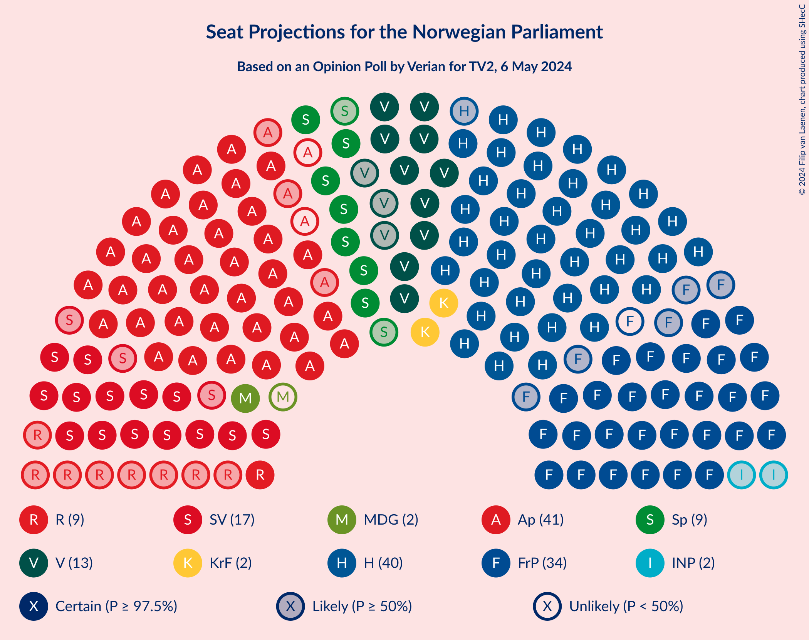
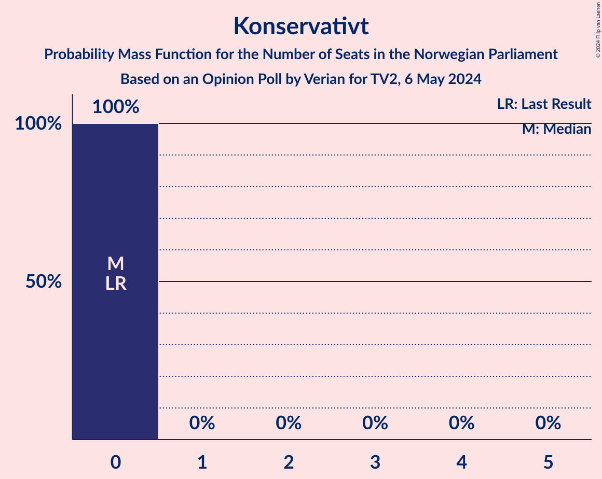

# Opinion Poll by Verian for TV2, 6 May 2024

<a href="#voting-intentions">Voting Intentions</a> | <a href="#seats">Seats</a> | <a href="#coalitions">Coalitions</a> | <a href="#technical-information">Technical Information</a>

## Voting Intentions

### Confidence Intervals

| Party | Last Result | Poll Result | 80% Confidence Interval | 90% Confidence Interval | 95% Confidence Interval | 99% Confidence Interval |
|:-----:|:-----------:|:-----------:|:-----------------------:|:-----------------------:|:-----------------------:|:-----------------------:|
| Høyre | 20.4% | 24.9% | 23.2–26.7% |22.8–27.2% |22.4–27.6% |21.6–28.5% |
| Arbeiderpartiet | 26.2% | 21.3% | 19.7–23.0% |19.3–23.4% |18.9–23.9% |18.2–24.7% |
| Fremskrittspartiet | 11.6% | 16.5% | 15.1–18.0% |14.7–18.5% |14.4–18.9% |13.7–19.6% |
| Sosialistisk Venstreparti | 7.6% | 10.2% | 9.1–11.5% |8.8–11.9% |8.5–12.2% |8.0–12.8% |
| Venstre | 4.6% | 6.8% | 5.9–7.9% |5.6–8.2% |5.4–8.5% |5.0–9.0% |
| Senterpartiet | 13.5% | 5.1% | 4.4–6.1% |4.1–6.4% |4.0–6.7% |3.6–7.2% |
| Rødt | 4.7% | 5.0% | 4.2–5.9% |4.0–6.2% |3.8–6.4% |3.5–7.0% |
| Kristelig Folkeparti | 3.8% | 3.8% | 3.2–4.7% |3.0–4.9% |2.8–5.2% |2.5–5.6% |
| Miljøpartiet De Grønne | 3.9% | 3.1% | 2.5–3.9% |2.3–4.1% |2.2–4.3% |1.9–4.7% |
| Industri- og Næringspartiet | 0.3% | 2.3% | 1.8–3.0% |1.6–3.2% |1.5–3.4% |1.3–3.8% |
| Norgesdemokratene | 1.1% | 0.3% | 0.2–0.6% |0.1–0.7% |0.1–0.8% |0.1–1.1% |
| Konservativt | 0.4% | 0.3% | 0.2–0.6% |0.1–0.7% |0.1–0.8% |0.1–1.1% |

*Note:* The poll result column reflects the actual value used in the calculations. Published results may vary slightly, and in addition be rounded to fewer digits.

## Seats

### Confidence Intervals

| Party | Last Result | Median | 80% Confidence Interval | 90% Confidence Interval | 95% Confidence Interval | 99% Confidence Interval |
|:-----:|:-----------:|:------:|:-----------------------:|:-----------------------:|:-----------------------:|:-----------------------:|
| <a href="#høyre">Høyre</a> | 36 | 40 | 40–45 |40–48 |39–49 |38–52 |
| <a href="#arbeiderpartiet">Arbeiderpartiet</a> | 48 | 40 | 38–41 |38–41 |37–43 |33–46 |
| <a href="#fremskrittspartiet">Fremskrittspartiet</a> | 21 | 33 | 30–34 |28–36 |28–36 |24–36 |
| <a href="#sosialistisk-venstreparti">Sosialistisk Venstreparti</a> | 13 | 17 | 16–19 |16–20 |14–22 |14–23 |
| <a href="#venstre">Venstre</a> | 8 | 13 | 10–13 |10–13 |10–14 |9–16 |
| <a href="#senterpartiet">Senterpartiet</a> | 28 | 9 | 8–10 |8–11 |7–12 |1–13 |
| <a href="#rødt">Rødt</a> | 8 | 9 | 7–11 |7–11 |1–11 |1–11 |
| <a href="#kristelig-folkeparti">Kristelig Folkeparti</a> | 3 | 2 | 2–7 |2–7 |2–8 |2–9 |
| <a href="#miljøpartiet-de-grønne">Miljøpartiet De Grønne</a> | 3 | 2 | 1–3 |1–7 |1–8 |1–9 |
| <a href="#industri--og-næringspartiet">Industri- og Næringspartiet</a> | 0 | 2 | 0–2 |0–2 |0–2 |0–3 |
| <a href="#norgesdemokratene">Norgesdemokratene</a> | 0 | 0 | 0 |0 |0 |0 |
| <a href="#konservativt">Konservativt</a> | 0 | 0 | 0 |0 |0 |0 |

### Høyre

*For a full overview of the results for this party, see the [Høyre](party-høyre.html) page.*

| Number of Seats | Probability | Accumulated | Special Marks |
|:---------------:|:-----------:|:-----------:|:-------------:|
| 36 | 0% | 100% | Last Result |
| 37 | 0.1% | 100% |  |
| 38 | 2% | 99.9% |  |
| 39 | 2% | 98% |  |
| 40 | 48% | 96% | Median |
| 41 | 17% | 48% |  |
| 42 | 11% | 32% |  |
| 43 | 6% | 21% |  |
| 44 | 2% | 15% |  |
| 45 | 4% | 12% |  |
| 46 | 2% | 8% |  |
| 47 | 0.7% | 6% |  |
| 48 | 2% | 5% |  |
| 49 | 1.4% | 3% |  |
| 50 | 0.3% | 2% |  |
| 51 | 0.2% | 2% |  |
| 52 | 1.5% | 2% |  |
| 53 | 0% | 0.1% |  |
| 54 | 0.1% | 0.1% |  |
| 55 | 0% | 0% |  |

### Arbeiderpartiet

*For a full overview of the results for this party, see the [Arbeiderpartiet](party-arbeiderpartiet.html) page.*

| Number of Seats | Probability | Accumulated | Special Marks |
|:---------------:|:-----------:|:-----------:|:-------------:|
| 32 | 0.1% | 100% |  |
| 33 | 0.5% | 99.9% |  |
| 34 | 0.6% | 99.4% |  |
| 35 | 0.4% | 98.8% |  |
| 36 | 0.7% | 98% |  |
| 37 | 2% | 98% |  |
| 38 | 27% | 96% |  |
| 39 | 3% | 68% |  |
| 40 | 20% | 65% | Median |
| 41 | 41% | 45% |  |
| 42 | 0.6% | 4% |  |
| 43 | 1.5% | 3% |  |
| 44 | 0.5% | 2% |  |
| 45 | 0.7% | 1.4% |  |
| 46 | 0.4% | 0.7% |  |
| 47 | 0.1% | 0.3% |  |
| 48 | 0.2% | 0.2% | Last Result |
| 49 | 0% | 0.1% |  |
| 50 | 0% | 0% |  |

### Fremskrittspartiet

*For a full overview of the results for this party, see the [Fremskrittspartiet](party-fremskrittspartiet.html) page.*

| Number of Seats | Probability | Accumulated | Special Marks |
|:---------------:|:-----------:|:-----------:|:-------------:|
| 21 | 0% | 100% | Last Result |
| 22 | 0.1% | 100% |  |
| 23 | 0.2% | 99.9% |  |
| 24 | 0.2% | 99.7% |  |
| 25 | 0.4% | 99.4% |  |
| 26 | 0.2% | 99.1% |  |
| 27 | 1.1% | 98.9% |  |
| 28 | 3% | 98% |  |
| 29 | 3% | 95% |  |
| 30 | 7% | 92% |  |
| 31 | 11% | 85% |  |
| 32 | 3% | 74% |  |
| 33 | 37% | 72% | Median |
| 34 | 25% | 35% |  |
| 35 | 2% | 10% |  |
| 36 | 7% | 8% |  |
| 37 | 0.3% | 0.3% |  |
| 38 | 0% | 0% |  |

### Sosialistisk Venstreparti

*For a full overview of the results for this party, see the [Sosialistisk Venstreparti](party-sosialistiskvenstreparti.html) page.*

| Number of Seats | Probability | Accumulated | Special Marks |
|:---------------:|:-----------:|:-----------:|:-------------:|
| 12 | 0% | 100% |  |
| 13 | 0.3% | 99.9% | Last Result |
| 14 | 2% | 99.7% |  |
| 15 | 1.1% | 97% |  |
| 16 | 28% | 96% |  |
| 17 | 43% | 69% | Median |
| 18 | 15% | 25% |  |
| 19 | 3% | 10% |  |
| 20 | 3% | 7% |  |
| 21 | 1.1% | 4% |  |
| 22 | 2% | 3% |  |
| 23 | 0.7% | 0.8% |  |
| 24 | 0% | 0.1% |  |
| 25 | 0% | 0% |  |

### Venstre

*For a full overview of the results for this party, see the [Venstre](party-venstre.html) page.*

| Number of Seats | Probability | Accumulated | Special Marks |
|:---------------:|:-----------:|:-----------:|:-------------:|
| 8 | 0.2% | 100% | Last Result |
| 9 | 1.0% | 99.8% |  |
| 10 | 27% | 98.8% |  |
| 11 | 4% | 72% |  |
| 12 | 17% | 68% |  |
| 13 | 48% | 51% | Median |
| 14 | 2% | 3% |  |
| 15 | 0.2% | 1.0% |  |
| 16 | 0.7% | 0.8% |  |
| 17 | 0.1% | 0.1% |  |
| 18 | 0% | 0% |  |

### Senterpartiet

*For a full overview of the results for this party, see the [Senterpartiet](party-senterpartiet.html) page.*

| Number of Seats | Probability | Accumulated | Special Marks |
|:---------------:|:-----------:|:-----------:|:-------------:|
| 0 | 0.4% | 100% |  |
| 1 | 0.5% | 99.6% |  |
| 2 | 0.1% | 99.2% |  |
| 3 | 0% | 99.1% |  |
| 4 | 0% | 99.1% |  |
| 5 | 0% | 99.1% |  |
| 6 | 0.1% | 99.1% |  |
| 7 | 3% | 99.0% |  |
| 8 | 22% | 96% |  |
| 9 | 61% | 74% | Median |
| 10 | 7% | 13% |  |
| 11 | 3% | 6% |  |
| 12 | 2% | 3% |  |
| 13 | 0.8% | 1.1% |  |
| 14 | 0.4% | 0.4% |  |
| 15 | 0% | 0% |  |
| 16 | 0% | 0% |  |
| 17 | 0% | 0% |  |
| 18 | 0% | 0% |  |
| 19 | 0% | 0% |  |
| 20 | 0% | 0% |  |
| 21 | 0% | 0% |  |
| 22 | 0% | 0% |  |
| 23 | 0% | 0% |  |
| 24 | 0% | 0% |  |
| 25 | 0% | 0% |  |
| 26 | 0% | 0% |  |
| 27 | 0% | 0% |  |
| 28 | 0% | 0% | Last Result |

### Rødt

*For a full overview of the results for this party, see the [Rødt](party-rødt.html) page.*

| Number of Seats | Probability | Accumulated | Special Marks |
|:---------------:|:-----------:|:-----------:|:-------------:|
| 1 | 4% | 100% |  |
| 2 | 0% | 96% |  |
| 3 | 0% | 96% |  |
| 4 | 0% | 96% |  |
| 5 | 0% | 96% |  |
| 6 | 0% | 96% |  |
| 7 | 7% | 96% |  |
| 8 | 9% | 89% | Last Result |
| 9 | 60% | 80% | Median |
| 10 | 9% | 21% |  |
| 11 | 12% | 12% |  |
| 12 | 0.1% | 0.5% |  |
| 13 | 0.3% | 0.4% |  |
| 14 | 0% | 0% |  |

### Kristelig Folkeparti

*For a full overview of the results for this party, see the [Kristelig Folkeparti](party-kristeligfolkeparti.html) page.*

| Number of Seats | Probability | Accumulated | Special Marks |
|:---------------:|:-----------:|:-----------:|:-------------:|
| 0 | 0.1% | 100% |  |
| 1 | 0.1% | 99.9% |  |
| 2 | 63% | 99.8% | Median |
| 3 | 5% | 37% | Last Result |
| 4 | 0% | 32% |  |
| 5 | 0% | 32% |  |
| 6 | 0% | 32% |  |
| 7 | 27% | 32% |  |
| 8 | 3% | 4% |  |
| 9 | 0.5% | 0.8% |  |
| 10 | 0.3% | 0.3% |  |
| 11 | 0% | 0% |  |

### Miljøpartiet De Grønne

*For a full overview of the results for this party, see the [Miljøpartiet De Grønne](party-miljøpartietdegrønne.html) page.*

| Number of Seats | Probability | Accumulated | Special Marks |
|:---------------:|:-----------:|:-----------:|:-------------:|
| 0 | 0.3% | 100% |  |
| 1 | 27% | 99.7% |  |
| 2 | 55% | 73% | Median |
| 3 | 10% | 18% | Last Result |
| 4 | 0% | 7% |  |
| 5 | 0% | 7% |  |
| 6 | 0.1% | 7% |  |
| 7 | 3% | 7% |  |
| 8 | 3% | 4% |  |
| 9 | 1.0% | 1.0% |  |
| 10 | 0% | 0% |  |

### Industri- og Næringspartiet

*For a full overview of the results for this party, see the [Industri- og Næringspartiet](party-industri-ognæringspartiet.html) page.*

| Number of Seats | Probability | Accumulated | Special Marks |
|:---------------:|:-----------:|:-----------:|:-------------:|
| 0 | 26% | 100% | Last Result |
| 1 | 8% | 74% |  |
| 2 | 65% | 66% | Median |
| 3 | 1.2% | 1.3% |  |
| 4 | 0% | 0.1% |  |
| 5 | 0% | 0.1% |  |
| 6 | 0% | 0.1% |  |
| 7 | 0.1% | 0.1% |  |
| 8 | 0% | 0% |  |

### Norgesdemokratene

*For a full overview of the results for this party, see the [Norgesdemokratene](party-norgesdemokratene.html) page.*

| Number of Seats | Probability | Accumulated | Special Marks |
|:---------------:|:-----------:|:-----------:|:-------------:|
| 0 | 100% | 100% | Last Result, Median |

### Konservativt

*For a full overview of the results for this party, see the [Konservativt](party-konservativt.html) page.*

| Number of Seats | Probability | Accumulated | Special Marks |
|:---------------:|:-----------:|:-----------:|:-------------:|
| 0 | 100% | 100% | Last Result, Median |

## Coalitions

### Confidence Intervals

| Coalition | Last Result | Median | Majority? | 80% Confidence Interval | 90% Confidence Interval | 95% Confidence Interval | 99% Confidence Interval |
|:---------:|:-----------:|:------:|:---------:|:-----------------------:|:-----------------------:|:-----------------------:|:-----------------------:|
| Høyre – Fremskrittspartiet – Venstre – Senterpartiet – Kristelig Folkeparti | 96 | 97 | 100% | 96–101 | 94–104 | 93–107 | 93–110 |
| Høyre – Fremskrittspartiet – Venstre – Kristelig Folkeparti – Miljøpartiet De Grønne | 71 | 92 | 99.6% | 90–95 | 90–97 | 87–98 | 85–101 |
| Høyre – Fremskrittspartiet – Venstre – Kristelig Folkeparti | 68 | 88 | 97% | 88–93 | 85–95 | 84–96 | 84–99 |
| Høyre – Fremskrittspartiet – Venstre | 65 | 86 | 88% | 83–89 | 82–90 | 82–92 | 80–94 |
| Arbeiderpartiet – Sosialistisk Venstreparti – Senterpartiet – Rødt – Miljøpartiet De Grønne | 100 | 78 | 0.3% | 74–79 | 72–83 | 72–83 | 69–84 |
| Arbeiderpartiet – Sosialistisk Venstreparti – Senterpartiet – Rødt | 97 | 75 | 0.2% | 72–76 | 71–77 | 69–81 | 67–83 |
| Høyre – Fremskrittspartiet | 57 | 74 | 0.1% | 71–76 | 71–78 | 70–79 | 68–82 |
| Arbeiderpartiet – Sosialistisk Venstreparti – Senterpartiet – Kristelig Folkeparti – Miljøpartiet De Grønne | 95 | 71 | 0.1% | 68–76 | 68–78 | 68–79 | 65–80 |
| Arbeiderpartiet – Sosialistisk Venstreparti – Rødt – Miljøpartiet De Grønne | 72 | 69 | 0% | 65–71 | 64–73 | 61–75 | 58–75 |
| Arbeiderpartiet – Sosialistisk Venstreparti – Senterpartiet – Miljøpartiet De Grønne | 92 | 69 | 0% | 65–72 | 65–74 | 64–74 | 60–76 |
| Arbeiderpartiet – Sosialistisk Venstreparti – Senterpartiet | 89 | 67 | 0% | 63–68 | 63–70 | 62–71 | 58–74 |
| Høyre – Venstre – Kristelig Folkeparti | 47 | 55 | 0% | 54–62 | 54–65 | 54–66 | 53–70 |
| Arbeiderpartiet – Sosialistisk Venstreparti | 61 | 58 | 0% | 54–59 | 54–60 | 54–62 | 50–64 |
| Arbeiderpartiet – Senterpartiet – Kristelig Folkeparti – Miljøpartiet De Grønne | 82 | 54 | 0% | 50–58 | 50–60 | 50–62 | 46–63 |
| Arbeiderpartiet – Senterpartiet – Kristelig Folkeparti | 79 | 52 | 0% | 49–55 | 49–57 | 49–58 | 44–62 |
| Arbeiderpartiet – Senterpartiet | 76 | 49 | 0% | 47–50 | 47–51 | 46–53 | 41–55 |
| Venstre – Senterpartiet – Kristelig Folkeparti | 39 | 24 | 0% | 21–27 | 20–29 | 20–30 | 17–33 |

### Høyre – Fremskrittspartiet – Venstre – Senterpartiet – Kristelig Folkeparti

| Number of Seats | Probability | Accumulated | Special Marks |
|:---------------:|:-----------:|:-----------:|:-------------:|
| 91 | 0.1% | 100% |  |
| 92 | 0.2% | 99.9% |  |
| 93 | 4% | 99.7% |  |
| 94 | 2% | 96% |  |
| 95 | 0.7% | 94% |  |
| 96 | 10% | 94% | Last Result |
| 97 | 37% | 83% | Median |
| 98 | 1.3% | 46% |  |
| 99 | 5% | 45% |  |
| 100 | 9% | 40% |  |
| 101 | 22% | 31% |  |
| 102 | 2% | 9% |  |
| 103 | 2% | 8% |  |
| 104 | 2% | 6% |  |
| 105 | 0.6% | 4% |  |
| 106 | 0.3% | 3% |  |
| 107 | 2% | 3% |  |
| 108 | 0.3% | 2% |  |
| 109 | 0.1% | 1.3% |  |
| 110 | 1.2% | 1.2% |  |
| 111 | 0% | 0% |  |

### Høyre – Fremskrittspartiet – Venstre – Kristelig Folkeparti – Miljøpartiet De Grønne

| Number of Seats | Probability | Accumulated | Special Marks |
|:---------------:|:-----------:|:-----------:|:-------------:|
| 71 | 0% | 100% | Last Result |
| 72 | 0% | 100% |  |
| 73 | 0% | 100% |  |
| 74 | 0% | 100% |  |
| 75 | 0% | 100% |  |
| 76 | 0% | 100% |  |
| 77 | 0% | 100% |  |
| 78 | 0% | 100% |  |
| 79 | 0% | 100% |  |
| 80 | 0% | 100% |  |
| 81 | 0% | 100% |  |
| 82 | 0% | 100% |  |
| 83 | 0.3% | 100% |  |
| 84 | 0.2% | 99.7% |  |
| 85 | 0.3% | 99.6% | Majority |
| 86 | 1.1% | 99.2% |  |
| 87 | 1.2% | 98% |  |
| 88 | 0.3% | 97% |  |
| 89 | 0.2% | 97% |  |
| 90 | 35% | 96% | Median |
| 91 | 12% | 62% |  |
| 92 | 12% | 50% |  |
| 93 | 7% | 39% |  |
| 94 | 20% | 32% |  |
| 95 | 3% | 12% |  |
| 96 | 4% | 9% |  |
| 97 | 3% | 5% |  |
| 98 | 0.5% | 3% |  |
| 99 | 1.4% | 2% |  |
| 100 | 0.1% | 0.8% |  |
| 101 | 0.3% | 0.7% |  |
| 102 | 0.1% | 0.3% |  |
| 103 | 0.1% | 0.3% |  |
| 104 | 0% | 0.1% |  |
| 105 | 0% | 0.1% |  |
| 106 | 0.1% | 0.1% |  |
| 107 | 0% | 0% |  |

### Høyre – Fremskrittspartiet – Venstre – Kristelig Folkeparti

| Number of Seats | Probability | Accumulated | Special Marks |
|:---------------:|:-----------:|:-----------:|:-------------:|
| 68 | 0% | 100% | Last Result |
| 69 | 0% | 100% |  |
| 70 | 0% | 100% |  |
| 71 | 0% | 100% |  |
| 72 | 0% | 100% |  |
| 73 | 0% | 100% |  |
| 74 | 0% | 100% |  |
| 75 | 0% | 100% |  |
| 76 | 0% | 100% |  |
| 77 | 0% | 100% |  |
| 78 | 0% | 100% |  |
| 79 | 0% | 100% |  |
| 80 | 0% | 100% |  |
| 81 | 0% | 100% |  |
| 82 | 0.4% | 100% |  |
| 83 | 0.1% | 99.6% |  |
| 84 | 3% | 99.5% |  |
| 85 | 4% | 97% | Majority |
| 86 | 0.5% | 93% |  |
| 87 | 0.5% | 93% |  |
| 88 | 43% | 92% | Median |
| 89 | 3% | 49% |  |
| 90 | 4% | 46% |  |
| 91 | 11% | 42% |  |
| 92 | 18% | 31% |  |
| 93 | 5% | 12% |  |
| 94 | 2% | 8% |  |
| 95 | 0.4% | 5% |  |
| 96 | 3% | 5% |  |
| 97 | 0.4% | 2% |  |
| 98 | 1.2% | 2% |  |
| 99 | 0.4% | 0.6% |  |
| 100 | 0% | 0.3% |  |
| 101 | 0.1% | 0.2% |  |
| 102 | 0% | 0.1% |  |
| 103 | 0% | 0.1% |  |
| 104 | 0% | 0.1% |  |
| 105 | 0.1% | 0.1% |  |
| 106 | 0% | 0% |  |

### Høyre – Fremskrittspartiet – Venstre

| Number of Seats | Probability | Accumulated | Special Marks |
|:---------------:|:-----------:|:-----------:|:-------------:|
| 65 | 0% | 100% | Last Result |
| 66 | 0% | 100% |  |
| 67 | 0% | 100% |  |
| 68 | 0% | 100% |  |
| 69 | 0% | 100% |  |
| 70 | 0% | 100% |  |
| 71 | 0% | 100% |  |
| 72 | 0% | 100% |  |
| 73 | 0% | 100% |  |
| 74 | 0% | 100% |  |
| 75 | 0% | 100% |  |
| 76 | 0% | 100% |  |
| 77 | 0.1% | 99.9% |  |
| 78 | 0% | 99.8% |  |
| 79 | 0.2% | 99.8% |  |
| 80 | 0.4% | 99.5% |  |
| 81 | 1.2% | 99.1% |  |
| 82 | 4% | 98% |  |
| 83 | 4% | 94% |  |
| 84 | 2% | 89% |  |
| 85 | 18% | 88% | Majority |
| 86 | 49% | 70% | Median |
| 87 | 2% | 21% |  |
| 88 | 3% | 19% |  |
| 89 | 10% | 16% |  |
| 90 | 2% | 6% |  |
| 91 | 0.7% | 4% |  |
| 92 | 1.0% | 3% |  |
| 93 | 0.2% | 2% |  |
| 94 | 2% | 2% |  |
| 95 | 0.1% | 0.2% |  |
| 96 | 0% | 0.2% |  |
| 97 | 0.1% | 0.2% |  |
| 98 | 0% | 0.1% |  |
| 99 | 0% | 0.1% |  |
| 100 | 0% | 0.1% |  |
| 101 | 0% | 0.1% |  |
| 102 | 0.1% | 0.1% |  |
| 103 | 0% | 0% |  |

### Arbeiderpartiet – Sosialistisk Venstreparti – Senterpartiet – Rødt – Miljøpartiet De Grønne

| Number of Seats | Probability | Accumulated | Special Marks |
|:---------------:|:-----------:|:-----------:|:-------------:|
| 62 | 0.1% | 100% |  |
| 63 | 0% | 99.9% |  |
| 64 | 0% | 99.9% |  |
| 65 | 0% | 99.9% |  |
| 66 | 0% | 99.9% |  |
| 67 | 0.1% | 99.9% |  |
| 68 | 0.1% | 99.7% |  |
| 69 | 0.3% | 99.7% |  |
| 70 | 1.2% | 99.3% |  |
| 71 | 0.5% | 98% |  |
| 72 | 4% | 98% |  |
| 73 | 0.4% | 94% |  |
| 74 | 20% | 94% |  |
| 75 | 5% | 73% |  |
| 76 | 8% | 68% |  |
| 77 | 3% | 60% | Median |
| 78 | 46% | 57% |  |
| 79 | 3% | 11% |  |
| 80 | 0.6% | 8% |  |
| 81 | 0.5% | 8% |  |
| 82 | 0.7% | 7% |  |
| 83 | 4% | 6% |  |
| 84 | 2% | 2% |  |
| 85 | 0.1% | 0.3% | Majority |
| 86 | 0% | 0.2% |  |
| 87 | 0.1% | 0.2% |  |
| 88 | 0% | 0% |  |
| 89 | 0% | 0% |  |
| 90 | 0% | 0% |  |
| 91 | 0% | 0% |  |
| 92 | 0% | 0% |  |
| 93 | 0% | 0% |  |
| 94 | 0% | 0% |  |
| 95 | 0% | 0% |  |
| 96 | 0% | 0% |  |
| 97 | 0% | 0% |  |
| 98 | 0% | 0% |  |
| 99 | 0% | 0% |  |
| 100 | 0% | 0% | Last Result |

### Arbeiderpartiet – Sosialistisk Venstreparti – Senterpartiet – Rødt

| Number of Seats | Probability | Accumulated | Special Marks |
|:---------------:|:-----------:|:-----------:|:-------------:|
| 61 | 0.1% | 100% |  |
| 62 | 0% | 99.9% |  |
| 63 | 0% | 99.9% |  |
| 64 | 0% | 99.9% |  |
| 65 | 0.1% | 99.9% |  |
| 66 | 0.1% | 99.7% |  |
| 67 | 0.4% | 99.6% |  |
| 68 | 0.3% | 99.2% |  |
| 69 | 1.5% | 99.0% |  |
| 70 | 1.2% | 97% |  |
| 71 | 3% | 96% |  |
| 72 | 19% | 93% |  |
| 73 | 5% | 74% |  |
| 74 | 5% | 69% |  |
| 75 | 21% | 65% | Median |
| 76 | 37% | 44% |  |
| 77 | 2% | 7% |  |
| 78 | 0.8% | 4% |  |
| 79 | 0.4% | 3% |  |
| 80 | 0.3% | 3% |  |
| 81 | 2% | 3% |  |
| 82 | 0.4% | 1.0% |  |
| 83 | 0.4% | 0.6% |  |
| 84 | 0.1% | 0.2% |  |
| 85 | 0.1% | 0.2% | Majority |
| 86 | 0% | 0% |  |
| 87 | 0% | 0% |  |
| 88 | 0% | 0% |  |
| 89 | 0% | 0% |  |
| 90 | 0% | 0% |  |
| 91 | 0% | 0% |  |
| 92 | 0% | 0% |  |
| 93 | 0% | 0% |  |
| 94 | 0% | 0% |  |
| 95 | 0% | 0% |  |
| 96 | 0% | 0% |  |
| 97 | 0% | 0% | Last Result |

### Høyre – Fremskrittspartiet

| Number of Seats | Probability | Accumulated | Special Marks |
|:---------------:|:-----------:|:-----------:|:-------------:|
| 57 | 0% | 100% | Last Result |
| 58 | 0% | 100% |  |
| 59 | 0% | 100% |  |
| 60 | 0% | 100% |  |
| 61 | 0% | 100% |  |
| 62 | 0% | 100% |  |
| 63 | 0% | 100% |  |
| 64 | 0% | 100% |  |
| 65 | 0.1% | 100% |  |
| 66 | 0.1% | 99.9% |  |
| 67 | 0.2% | 99.8% |  |
| 68 | 0.4% | 99.6% |  |
| 69 | 0.5% | 99.2% |  |
| 70 | 4% | 98.7% |  |
| 71 | 6% | 95% |  |
| 72 | 2% | 89% |  |
| 73 | 36% | 87% | Median |
| 74 | 5% | 51% |  |
| 75 | 17% | 45% |  |
| 76 | 21% | 28% |  |
| 77 | 2% | 7% |  |
| 78 | 1.3% | 5% |  |
| 79 | 1.4% | 4% |  |
| 80 | 0.4% | 2% |  |
| 81 | 0.2% | 2% |  |
| 82 | 1.5% | 2% |  |
| 83 | 0.2% | 0.3% |  |
| 84 | 0% | 0.1% |  |
| 85 | 0% | 0.1% | Majority |
| 86 | 0% | 0.1% |  |
| 87 | 0% | 0.1% |  |
| 88 | 0% | 0.1% |  |
| 89 | 0.1% | 0.1% |  |
| 90 | 0% | 0% |  |

### Arbeiderpartiet – Sosialistisk Venstreparti – Senterpartiet – Kristelig Folkeparti – Miljøpartiet De Grønne

| Number of Seats | Probability | Accumulated | Special Marks |
|:---------------:|:-----------:|:-----------:|:-------------:|
| 62 | 0% | 100% |  |
| 63 | 0.1% | 99.9% |  |
| 64 | 0.4% | 99.9% |  |
| 65 | 0.1% | 99.5% |  |
| 66 | 0.7% | 99.4% |  |
| 67 | 0.9% | 98.8% |  |
| 68 | 9% | 98% |  |
| 69 | 9% | 89% |  |
| 70 | 1.4% | 80% | Median |
| 71 | 36% | 79% |  |
| 72 | 20% | 42% |  |
| 73 | 4% | 23% |  |
| 74 | 3% | 19% |  |
| 75 | 4% | 16% |  |
| 76 | 5% | 12% |  |
| 77 | 1.4% | 7% |  |
| 78 | 2% | 6% |  |
| 79 | 3% | 4% |  |
| 80 | 0.3% | 0.6% |  |
| 81 | 0.1% | 0.4% |  |
| 82 | 0.1% | 0.3% |  |
| 83 | 0.1% | 0.2% |  |
| 84 | 0% | 0.1% |  |
| 85 | 0.1% | 0.1% | Majority |
| 86 | 0% | 0% |  |
| 87 | 0% | 0% |  |
| 88 | 0% | 0% |  |
| 89 | 0% | 0% |  |
| 90 | 0% | 0% |  |
| 91 | 0% | 0% |  |
| 92 | 0% | 0% |  |
| 93 | 0% | 0% |  |
| 94 | 0% | 0% |  |
| 95 | 0% | 0% | Last Result |

### Arbeiderpartiet – Sosialistisk Venstreparti – Rødt – Miljøpartiet De Grønne

| Number of Seats | Probability | Accumulated | Special Marks |
|:---------------:|:-----------:|:-----------:|:-------------:|
| 57 | 0% | 100% |  |
| 58 | 1.2% | 99.9% |  |
| 59 | 0.1% | 98.7% |  |
| 60 | 0.3% | 98.6% |  |
| 61 | 2% | 98% |  |
| 62 | 0.4% | 96% |  |
| 63 | 0.4% | 96% |  |
| 64 | 3% | 96% |  |
| 65 | 19% | 93% |  |
| 66 | 0.8% | 73% |  |
| 67 | 13% | 72% |  |
| 68 | 1.1% | 60% | Median |
| 69 | 38% | 59% |  |
| 70 | 10% | 21% |  |
| 71 | 3% | 11% |  |
| 72 | 1.4% | 8% | Last Result |
| 73 | 2% | 6% |  |
| 74 | 1.1% | 5% |  |
| 75 | 3% | 4% |  |
| 76 | 0.3% | 0.3% |  |
| 77 | 0% | 0.1% |  |
| 78 | 0% | 0% |  |

### Arbeiderpartiet – Sosialistisk Venstreparti – Senterpartiet – Miljøpartiet De Grønne

| Number of Seats | Probability | Accumulated | Special Marks |
|:---------------:|:-----------:|:-----------:|:-------------:|
| 57 | 0% | 100% |  |
| 58 | 0.1% | 99.9% |  |
| 59 | 0.3% | 99.9% |  |
| 60 | 0.1% | 99.6% |  |
| 61 | 0.3% | 99.5% |  |
| 62 | 0.1% | 99.2% |  |
| 63 | 1.2% | 99.1% |  |
| 64 | 1.3% | 98% |  |
| 65 | 17% | 97% |  |
| 66 | 12% | 79% |  |
| 67 | 10% | 67% |  |
| 68 | 5% | 57% | Median |
| 69 | 37% | 52% |  |
| 70 | 3% | 15% |  |
| 71 | 2% | 13% |  |
| 72 | 4% | 11% |  |
| 73 | 0.7% | 7% |  |
| 74 | 4% | 6% |  |
| 75 | 0.2% | 2% |  |
| 76 | 2% | 2% |  |
| 77 | 0.2% | 0.3% |  |
| 78 | 0% | 0.1% |  |
| 79 | 0% | 0.1% |  |
| 80 | 0% | 0% |  |
| 81 | 0% | 0% |  |
| 82 | 0% | 0% |  |
| 83 | 0% | 0% |  |
| 84 | 0% | 0% |  |
| 85 | 0% | 0% | Majority |
| 86 | 0% | 0% |  |
| 87 | 0% | 0% |  |
| 88 | 0% | 0% |  |
| 89 | 0% | 0% |  |
| 90 | 0% | 0% |  |
| 91 | 0% | 0% |  |
| 92 | 0% | 0% | Last Result |

### Arbeiderpartiet – Sosialistisk Venstreparti – Senterpartiet

| Number of Seats | Probability | Accumulated | Special Marks |
|:---------------:|:-----------:|:-----------:|:-------------:|
| 56 | 0% | 100% |  |
| 57 | 0.4% | 99.9% |  |
| 58 | 0.2% | 99.6% |  |
| 59 | 0.2% | 99.4% |  |
| 60 | 0.1% | 99.2% |  |
| 61 | 0.5% | 99.0% |  |
| 62 | 2% | 98.6% |  |
| 63 | 17% | 96% |  |
| 64 | 11% | 80% |  |
| 65 | 14% | 69% |  |
| 66 | 5% | 55% | Median |
| 67 | 40% | 51% |  |
| 68 | 2% | 11% |  |
| 69 | 3% | 8% |  |
| 70 | 3% | 6% |  |
| 71 | 0.5% | 3% |  |
| 72 | 1.0% | 2% |  |
| 73 | 0.7% | 1.4% |  |
| 74 | 0.4% | 0.7% |  |
| 75 | 0.2% | 0.3% |  |
| 76 | 0.1% | 0.1% |  |
| 77 | 0% | 0% |  |
| 78 | 0% | 0% |  |
| 79 | 0% | 0% |  |
| 80 | 0% | 0% |  |
| 81 | 0% | 0% |  |
| 82 | 0% | 0% |  |
| 83 | 0% | 0% |  |
| 84 | 0% | 0% |  |
| 85 | 0% | 0% | Majority |
| 86 | 0% | 0% |  |
| 87 | 0% | 0% |  |
| 88 | 0% | 0% |  |
| 89 | 0% | 0% | Last Result |

### Høyre – Venstre – Kristelig Folkeparti

| Number of Seats | Probability | Accumulated | Special Marks |
|:---------------:|:-----------:|:-----------:|:-------------:|
| 47 | 0% | 100% | Last Result |
| 48 | 0% | 100% |  |
| 49 | 0% | 100% |  |
| 50 | 0% | 100% |  |
| 51 | 0% | 100% |  |
| 52 | 0.1% | 100% |  |
| 53 | 0.6% | 99.8% |  |
| 54 | 13% | 99.2% |  |
| 55 | 43% | 86% | Median |
| 56 | 1.2% | 44% |  |
| 57 | 4% | 43% |  |
| 58 | 17% | 39% |  |
| 59 | 5% | 22% |  |
| 60 | 3% | 17% |  |
| 61 | 2% | 15% |  |
| 62 | 3% | 13% |  |
| 63 | 1.1% | 10% |  |
| 64 | 0.6% | 9% |  |
| 65 | 4% | 8% |  |
| 66 | 2% | 4% |  |
| 67 | 0.4% | 2% |  |
| 68 | 0.2% | 1.5% |  |
| 69 | 0.1% | 1.3% |  |
| 70 | 1.2% | 1.2% |  |
| 71 | 0% | 0% |  |

### Arbeiderpartiet – Sosialistisk Venstreparti

| Number of Seats | Probability | Accumulated | Special Marks |
|:---------------:|:-----------:|:-----------:|:-------------:|
| 48 | 0.3% | 100% |  |
| 49 | 0.1% | 99.7% |  |
| 50 | 0.1% | 99.6% |  |
| 51 | 0.6% | 99.5% |  |
| 52 | 0.5% | 98.9% |  |
| 53 | 0.7% | 98% |  |
| 54 | 17% | 98% |  |
| 55 | 4% | 80% |  |
| 56 | 18% | 76% |  |
| 57 | 7% | 59% | Median |
| 58 | 39% | 51% |  |
| 59 | 5% | 13% |  |
| 60 | 3% | 7% |  |
| 61 | 0.7% | 4% | Last Result |
| 62 | 2% | 3% |  |
| 63 | 1.1% | 2% |  |
| 64 | 0.2% | 0.7% |  |
| 65 | 0.2% | 0.5% |  |
| 66 | 0.3% | 0.3% |  |
| 67 | 0% | 0% |  |

### Arbeiderpartiet – Senterpartiet – Kristelig Folkeparti – Miljøpartiet De Grønne

| Number of Seats | Probability | Accumulated | Special Marks |
|:---------------:|:-----------:|:-----------:|:-------------:|
| 42 | 0.2% | 100% |  |
| 43 | 0% | 99.8% |  |
| 44 | 0% | 99.8% |  |
| 45 | 0.1% | 99.7% |  |
| 46 | 0.2% | 99.6% |  |
| 47 | 0.1% | 99.4% |  |
| 48 | 0.2% | 99.3% |  |
| 49 | 0.1% | 99.1% |  |
| 50 | 9% | 98.9% |  |
| 51 | 3% | 89% |  |
| 52 | 0.9% | 87% |  |
| 53 | 10% | 86% | Median |
| 54 | 37% | 76% |  |
| 55 | 4% | 39% |  |
| 56 | 18% | 35% |  |
| 57 | 4% | 17% |  |
| 58 | 5% | 13% |  |
| 59 | 2% | 8% |  |
| 60 | 2% | 6% |  |
| 61 | 1.2% | 4% |  |
| 62 | 3% | 3% |  |
| 63 | 0.3% | 0.8% |  |
| 64 | 0.2% | 0.5% |  |
| 65 | 0.1% | 0.2% |  |
| 66 | 0% | 0.1% |  |
| 67 | 0.1% | 0.1% |  |
| 68 | 0% | 0% |  |
| 69 | 0% | 0% |  |
| 70 | 0% | 0% |  |
| 71 | 0% | 0% |  |
| 72 | 0% | 0% |  |
| 73 | 0% | 0% |  |
| 74 | 0% | 0% |  |
| 75 | 0% | 0% |  |
| 76 | 0% | 0% |  |
| 77 | 0% | 0% |  |
| 78 | 0% | 0% |  |
| 79 | 0% | 0% |  |
| 80 | 0% | 0% |  |
| 81 | 0% | 0% |  |
| 82 | 0% | 0% | Last Result |

### Arbeiderpartiet – Senterpartiet – Kristelig Folkeparti

| Number of Seats | Probability | Accumulated | Special Marks |
|:---------------:|:-----------:|:-----------:|:-------------:|
| 40 | 0.2% | 100% |  |
| 41 | 0% | 99.8% |  |
| 42 | 0% | 99.8% |  |
| 43 | 0% | 99.8% |  |
| 44 | 0.3% | 99.7% |  |
| 45 | 0.1% | 99.5% |  |
| 46 | 0.2% | 99.3% |  |
| 47 | 0.2% | 99.2% |  |
| 48 | 0.9% | 98.9% |  |
| 49 | 9% | 98% |  |
| 50 | 15% | 89% |  |
| 51 | 0.9% | 74% | Median |
| 52 | 36% | 73% |  |
| 53 | 5% | 37% |  |
| 54 | 18% | 32% |  |
| 55 | 4% | 14% |  |
| 56 | 4% | 10% |  |
| 57 | 2% | 6% |  |
| 58 | 1.5% | 4% |  |
| 59 | 2% | 2% |  |
| 60 | 0.1% | 0.8% |  |
| 61 | 0.1% | 0.7% |  |
| 62 | 0.3% | 0.6% |  |
| 63 | 0.1% | 0.2% |  |
| 64 | 0.1% | 0.1% |  |
| 65 | 0% | 0% |  |
| 66 | 0% | 0% |  |
| 67 | 0% | 0% |  |
| 68 | 0% | 0% |  |
| 69 | 0% | 0% |  |
| 70 | 0% | 0% |  |
| 71 | 0% | 0% |  |
| 72 | 0% | 0% |  |
| 73 | 0% | 0% |  |
| 74 | 0% | 0% |  |
| 75 | 0% | 0% |  |
| 76 | 0% | 0% |  |
| 77 | 0% | 0% |  |
| 78 | 0% | 0% |  |
| 79 | 0% | 0% | Last Result |

### Arbeiderpartiet – Senterpartiet

| Number of Seats | Probability | Accumulated | Special Marks |
|:---------------:|:-----------:|:-----------:|:-------------:|
| 35 | 0% | 100% |  |
| 36 | 0% | 99.9% |  |
| 37 | 0.2% | 99.9% |  |
| 38 | 0% | 99.8% |  |
| 39 | 0% | 99.8% |  |
| 40 | 0.1% | 99.7% |  |
| 41 | 0.3% | 99.7% |  |
| 42 | 0.4% | 99.4% |  |
| 43 | 0.3% | 99.0% |  |
| 44 | 0.2% | 98.7% |  |
| 45 | 0.8% | 98.5% |  |
| 46 | 3% | 98% |  |
| 47 | 27% | 95% |  |
| 48 | 18% | 68% |  |
| 49 | 4% | 50% | Median |
| 50 | 40% | 46% |  |
| 51 | 4% | 7% |  |
| 52 | 0.5% | 3% |  |
| 53 | 0.9% | 3% |  |
| 54 | 0.5% | 2% |  |
| 55 | 0.8% | 1.1% |  |
| 56 | 0.2% | 0.3% |  |
| 57 | 0% | 0.1% |  |
| 58 | 0% | 0.1% |  |
| 59 | 0% | 0.1% |  |
| 60 | 0% | 0% |  |
| 61 | 0% | 0% |  |
| 62 | 0% | 0% |  |
| 63 | 0% | 0% |  |
| 64 | 0% | 0% |  |
| 65 | 0% | 0% |  |
| 66 | 0% | 0% |  |
| 67 | 0% | 0% |  |
| 68 | 0% | 0% |  |
| 69 | 0% | 0% |  |
| 70 | 0% | 0% |  |
| 71 | 0% | 0% |  |
| 72 | 0% | 0% |  |
| 73 | 0% | 0% |  |
| 74 | 0% | 0% |  |
| 75 | 0% | 0% |  |
| 76 | 0% | 0% | Last Result |

### Venstre – Senterpartiet – Kristelig Folkeparti

| Number of Seats | Probability | Accumulated | Special Marks |
|:---------------:|:-----------:|:-----------:|:-------------:|
| 12 | 0.1% | 100% |  |
| 13 | 0% | 99.9% |  |
| 14 | 0% | 99.9% |  |
| 15 | 0.1% | 99.9% |  |
| 16 | 0.2% | 99.7% |  |
| 17 | 0% | 99.5% |  |
| 18 | 0.2% | 99.5% |  |
| 19 | 0.1% | 99.2% |  |
| 20 | 9% | 99.1% |  |
| 21 | 0.9% | 90% |  |
| 22 | 4% | 90% |  |
| 23 | 5% | 86% |  |
| 24 | 44% | 81% | Median |
| 25 | 5% | 37% |  |
| 26 | 17% | 32% |  |
| 27 | 6% | 15% |  |
| 28 | 0.9% | 8% |  |
| 29 | 4% | 8% |  |
| 30 | 2% | 4% |  |
| 31 | 0.2% | 2% |  |
| 32 | 0.2% | 2% |  |
| 33 | 1.2% | 1.4% |  |
| 34 | 0.1% | 0.2% |  |
| 35 | 0.1% | 0.1% |  |
| 36 | 0% | 0% |  |
| 37 | 0% | 0% |  |
| 38 | 0% | 0% |  |
| 39 | 0% | 0% | Last Result |

## Technical Information

### Opinion Poll

+ **Polling firm:** Verian
+ **Commissioner(s):** TV2
+ **Fieldwork period:** 6 May 2024

### Calculations

+ **Sample size:** 1049
+ **Simulations done:** 1,048,576
+ **Error estimate:** 2.45%

