# Opinion Poll by Respons Analyse for VG, 2–7 May 2024

<a href="#voting-intentions">Voting Intentions</a> | <a href="#seats">Seats</a> | <a href="#coalitions">Coalitions</a> | <a href="#technical-information">Technical Information</a>

## Voting Intentions

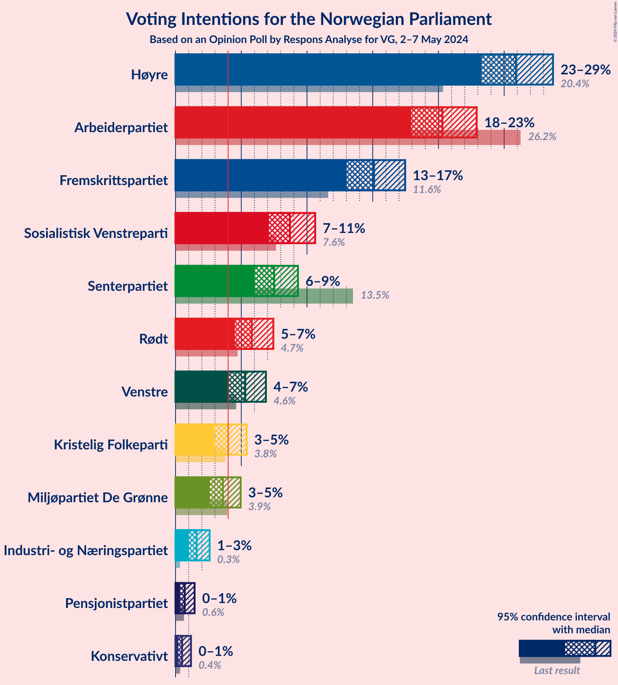

### Confidence Intervals

| Party | Last Result | Poll Result | 80% Confidence Interval | 90% Confidence Interval | 95% Confidence Interval | 99% Confidence Interval |
|:-----:|:-----------:|:-----------:|:-----------------------:|:-----------------------:|:-----------------------:|:-----------------------:|
| Høyre | 20.4% | 25.9% | 24.2–27.7% |23.7–28.3% |23.3–28.7% |22.5–29.6% |
| Arbeiderpartiet | 26.2% | 20.3% | 18.7–22.0% |18.3–22.5% |17.9–22.9% |17.2–23.7% |
| Fremskrittspartiet | 11.6% | 15.1% | 13.7–16.6% |13.3–17.1% |13.0–17.5% |12.4–18.2% |
| Sosialistisk Venstreparti | 7.6% | 8.7% | 7.7–10.0% |7.3–10.3% |7.1–10.6% |6.6–11.2% |
| Senterpartiet | 13.5% | 7.5% | 6.5–8.7% |6.2–9.0% |6.0–9.3% |5.6–9.9% |
| Rødt | 4.7% | 5.8% | 5.0–6.9% |4.7–7.2% |4.5–7.4% |4.1–8.0% |
| Venstre | 4.6% | 5.3% | 4.5–6.3% |4.3–6.6% |4.1–6.9% |3.7–7.4% |
| Kristelig Folkeparti | 3.8% | 4.0% | 3.3–4.9% |3.1–5.2% |2.9–5.4% |2.7–5.9% |
| Miljøpartiet De Grønne | 3.9% | 3.6% | 2.9–4.5% |2.8–4.7% |2.6–5.0% |2.3–5.4% |
| Industri- og Næringspartiet | 0.3% | 1.6% | 1.2–2.2% |1.1–2.4% |1.0–2.6% |0.8–2.9% |
| Pensjonistpartiet | 0.6% | 0.7% | 0.5–1.2% |0.4–1.3% |0.3–1.4% |0.2–1.7% |
| Konservativt | 0.4% | 0.5% | 0.3–0.9% |0.3–1.1% |0.2–1.2% |0.2–1.4% |

*Note:* The poll result column reflects the actual value used in the calculations. Published results may vary slightly, and in addition be rounded to fewer digits.

## Seats

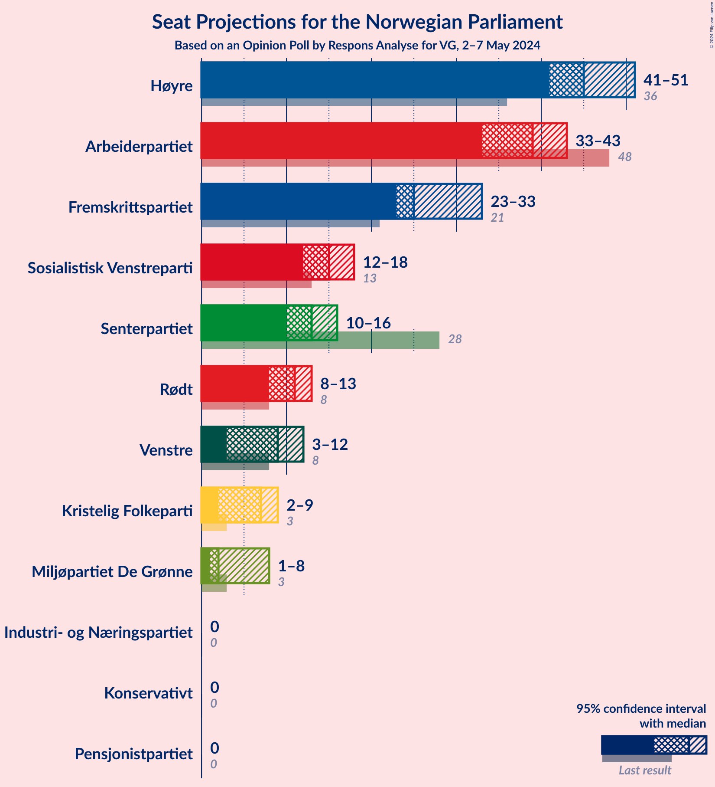

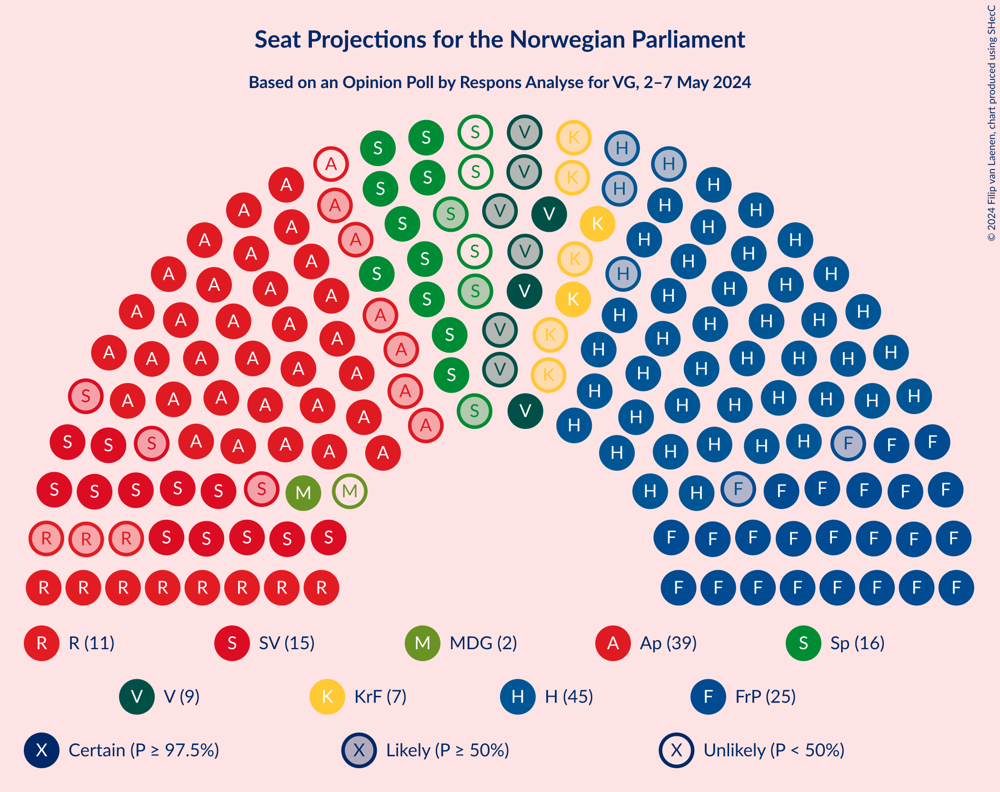

### Confidence Intervals

| Party | Last Result | Median | 80% Confidence Interval | 90% Confidence Interval | 95% Confidence Interval | 99% Confidence Interval |
|:-----:|:-----------:|:------:|:-----------------------:|:-----------------------:|:-----------------------:|:-----------------------:|
| <a href="#høyre">Høyre</a> | 36 | 45 | 43–49 |41–51 |41–51 |39–53 |
| <a href="#arbeiderpartiet">Arbeiderpartiet</a> | 48 | 39 | 35–43 |33–43 |33–43 |32–45 |
| <a href="#fremskrittspartiet">Fremskrittspartiet</a> | 21 | 25 | 24–31 |23–33 |23–33 |21–35 |
| <a href="#sosialistisk-venstreparti">Sosialistisk Venstreparti</a> | 13 | 15 | 14–18 |13–18 |12–18 |11–20 |
| <a href="#senterpartiet">Senterpartiet</a> | 28 | 13 | 11–15 |10–16 |10–16 |9–17 |
| <a href="#rødt">Rødt</a> | 8 | 11 | 9–12 |8–12 |8–13 |1–14 |
| <a href="#venstre">Venstre</a> | 8 | 9 | 8–11 |7–11 |3–12 |3–12 |
| <a href="#kristelig-folkeparti">Kristelig Folkeparti</a> | 3 | 7 | 2–8 |2–8 |2–9 |2–10 |
| <a href="#miljøpartiet-de-grønne">Miljøpartiet De Grønne</a> | 3 | 2 | 1–7 |1–8 |1–8 |1–9 |
| <a href="#industri--og-næringspartiet">Industri- og Næringspartiet</a> | 0 | 0 | 0 |0 |0 |0–2 |
| <a href="#pensjonistpartiet">Pensjonistpartiet</a> | 0 | 0 | 0 |0 |0 |0 |
| <a href="#konservativt">Konservativt</a> | 0 | 0 | 0 |0 |0 |0 |

### Høyre

*For a full overview of the results for this party, see the [Høyre](party-høyre.html) page.*

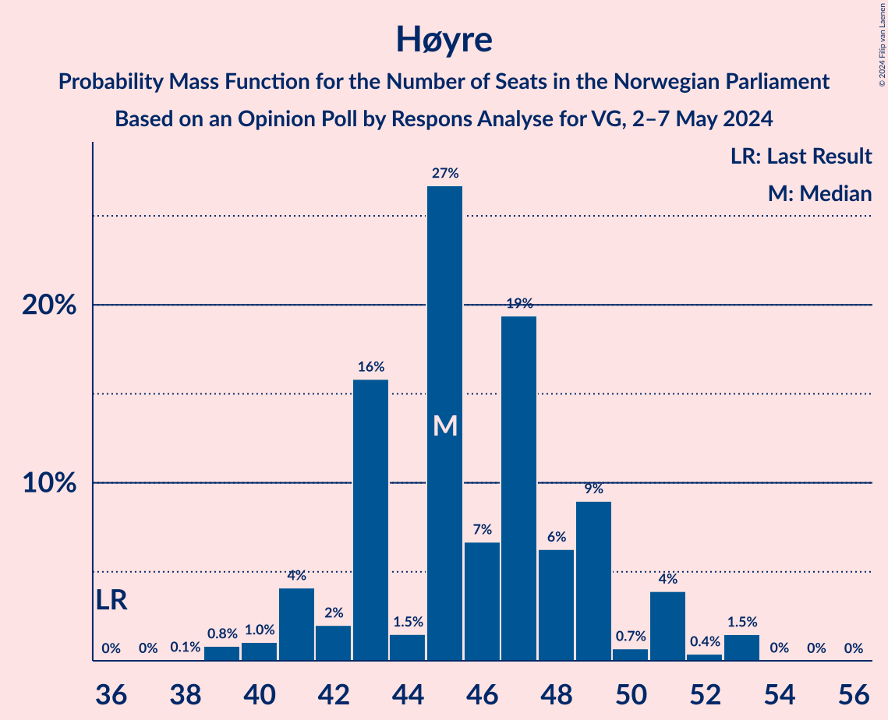

| Number of Seats | Probability | Accumulated | Special Marks |
|:---------------:|:-----------:|:-----------:|:-------------:|
| 36 | 0% | 100% | Last Result |
| 37 | 0% | 100% |  |
| 38 | 0.1% | 100% |  |
| 39 | 0.8% | 99.9% |  |
| 40 | 1.0% | 99.1% |  |
| 41 | 4% | 98% |  |
| 42 | 2% | 94% |  |
| 43 | 16% | 92% |  |
| 44 | 1.5% | 76% |  |
| 45 | 27% | 75% | Median |
| 46 | 7% | 48% |  |
| 47 | 19% | 41% |  |
| 48 | 6% | 22% |  |
| 49 | 9% | 16% |  |
| 50 | 0.7% | 7% |  |
| 51 | 4% | 6% |  |
| 52 | 0.4% | 2% |  |
| 53 | 1.5% | 2% |  |
| 54 | 0% | 0.1% |  |
| 55 | 0% | 0% |  |

### Arbeiderpartiet

*For a full overview of the results for this party, see the [Arbeiderpartiet](party-arbeiderpartiet.html) page.*

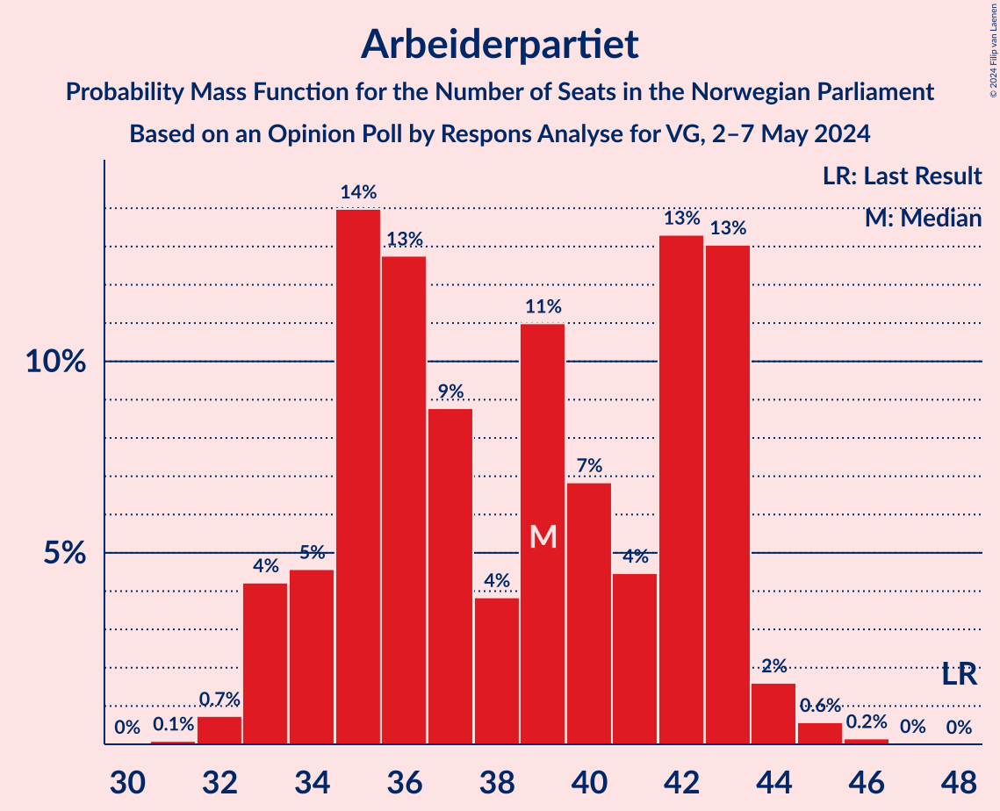

| Number of Seats | Probability | Accumulated | Special Marks |
|:---------------:|:-----------:|:-----------:|:-------------:|
| 31 | 0.1% | 100% |  |
| 32 | 0.7% | 99.9% |  |
| 33 | 4% | 99.2% |  |
| 34 | 5% | 95% |  |
| 35 | 14% | 90% |  |
| 36 | 13% | 76% |  |
| 37 | 9% | 64% |  |
| 38 | 4% | 55% |  |
| 39 | 11% | 51% | Median |
| 40 | 7% | 40% |  |
| 41 | 4% | 33% |  |
| 42 | 13% | 29% |  |
| 43 | 13% | 15% |  |
| 44 | 2% | 2% |  |
| 45 | 0.6% | 0.8% |  |
| 46 | 0.2% | 0.2% |  |
| 47 | 0% | 0% |  |
| 48 | 0% | 0% | Last Result |

### Fremskrittspartiet

*For a full overview of the results for this party, see the [Fremskrittspartiet](party-fremskrittspartiet.html) page.*

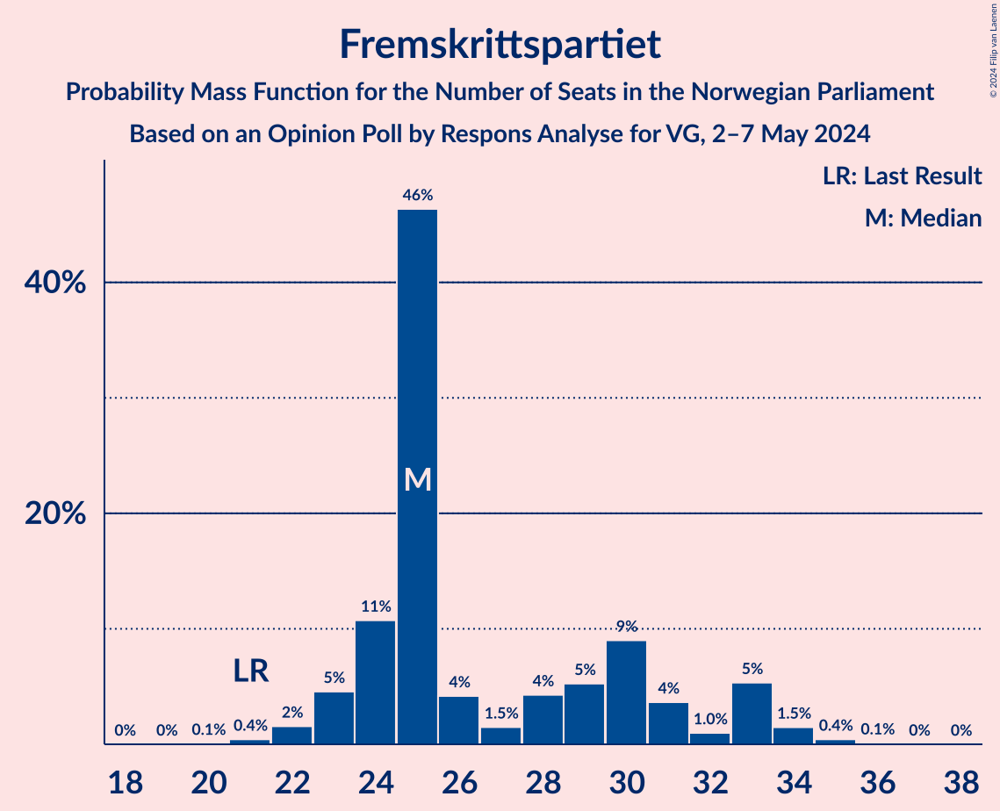

| Number of Seats | Probability | Accumulated | Special Marks |
|:---------------:|:-----------:|:-----------:|:-------------:|
| 20 | 0.1% | 100% |  |
| 21 | 0.4% | 99.9% | Last Result |
| 22 | 2% | 99.5% |  |
| 23 | 5% | 98% |  |
| 24 | 11% | 93% |  |
| 25 | 46% | 83% | Median |
| 26 | 4% | 36% |  |
| 27 | 1.5% | 32% |  |
| 28 | 4% | 31% |  |
| 29 | 5% | 26% |  |
| 30 | 9% | 21% |  |
| 31 | 4% | 12% |  |
| 32 | 1.0% | 8% |  |
| 33 | 5% | 7% |  |
| 34 | 1.5% | 2% |  |
| 35 | 0.4% | 0.6% |  |
| 36 | 0.1% | 0.1% |  |
| 37 | 0% | 0% |  |

### Sosialistisk Venstreparti

*For a full overview of the results for this party, see the [Sosialistisk Venstreparti](party-sosialistiskvenstreparti.html) page.*

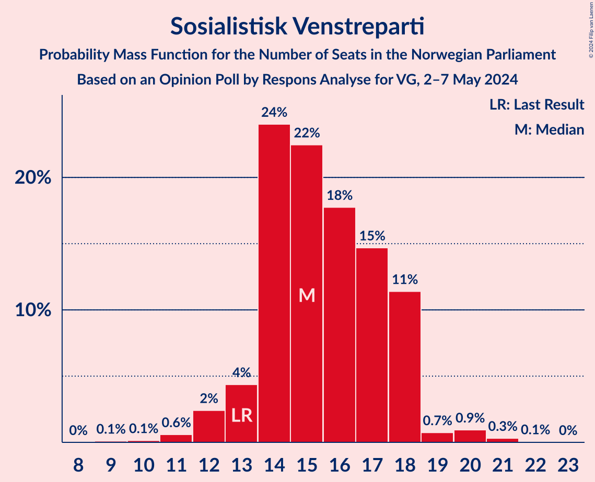

| Number of Seats | Probability | Accumulated | Special Marks |
|:---------------:|:-----------:|:-----------:|:-------------:|
| 9 | 0.1% | 100% |  |
| 10 | 0.1% | 99.9% |  |
| 11 | 0.6% | 99.8% |  |
| 12 | 2% | 99.2% |  |
| 13 | 4% | 97% | Last Result |
| 14 | 24% | 92% |  |
| 15 | 22% | 68% | Median |
| 16 | 18% | 46% |  |
| 17 | 15% | 28% |  |
| 18 | 11% | 13% |  |
| 19 | 0.7% | 2% |  |
| 20 | 0.9% | 1.3% |  |
| 21 | 0.3% | 0.4% |  |
| 22 | 0.1% | 0.1% |  |
| 23 | 0% | 0% |  |

### Senterpartiet

*For a full overview of the results for this party, see the [Senterpartiet](party-senterpartiet.html) page.*

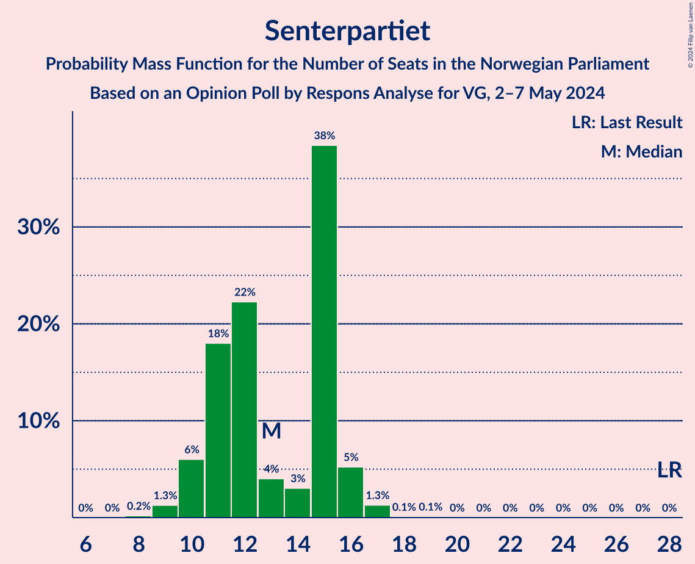

| Number of Seats | Probability | Accumulated | Special Marks |
|:---------------:|:-----------:|:-----------:|:-------------:|
| 8 | 0.2% | 100% |  |
| 9 | 1.3% | 99.8% |  |
| 10 | 6% | 98.5% |  |
| 11 | 18% | 93% |  |
| 12 | 22% | 74% |  |
| 13 | 4% | 52% | Median |
| 14 | 3% | 48% |  |
| 15 | 38% | 45% |  |
| 16 | 5% | 7% |  |
| 17 | 1.3% | 1.5% |  |
| 18 | 0.1% | 0.2% |  |
| 19 | 0.1% | 0.1% |  |
| 20 | 0% | 0% |  |
| 21 | 0% | 0% |  |
| 22 | 0% | 0% |  |
| 23 | 0% | 0% |  |
| 24 | 0% | 0% |  |
| 25 | 0% | 0% |  |
| 26 | 0% | 0% |  |
| 27 | 0% | 0% |  |
| 28 | 0% | 0% | Last Result |

### Rødt

*For a full overview of the results for this party, see the [Rødt](party-rødt.html) page.*

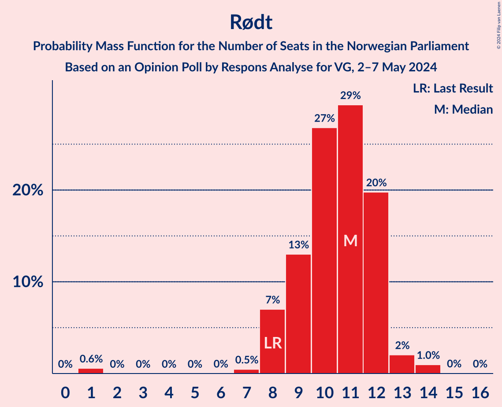

| Number of Seats | Probability | Accumulated | Special Marks |
|:---------------:|:-----------:|:-----------:|:-------------:|
| 1 | 0.6% | 100% |  |
| 2 | 0% | 99.4% |  |
| 3 | 0% | 99.4% |  |
| 4 | 0% | 99.4% |  |
| 5 | 0% | 99.4% |  |
| 6 | 0% | 99.4% |  |
| 7 | 0.5% | 99.4% |  |
| 8 | 7% | 98.9% | Last Result |
| 9 | 13% | 92% |  |
| 10 | 27% | 79% |  |
| 11 | 29% | 52% | Median |
| 12 | 20% | 23% |  |
| 13 | 2% | 3% |  |
| 14 | 1.0% | 1.0% |  |
| 15 | 0% | 0.1% |  |
| 16 | 0% | 0% |  |

### Venstre

*For a full overview of the results for this party, see the [Venstre](party-venstre.html) page.*

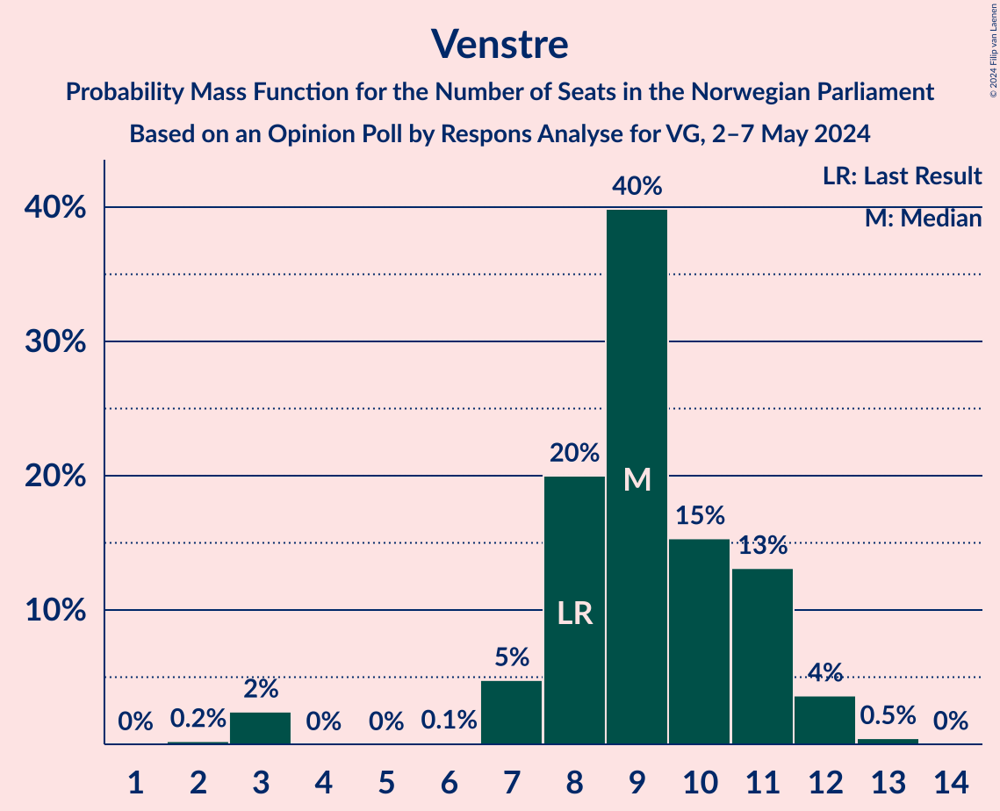

| Number of Seats | Probability | Accumulated | Special Marks |
|:---------------:|:-----------:|:-----------:|:-------------:|
| 2 | 0.2% | 100% |  |
| 3 | 2% | 99.8% |  |
| 4 | 0% | 97% |  |
| 5 | 0% | 97% |  |
| 6 | 0.1% | 97% |  |
| 7 | 5% | 97% |  |
| 8 | 20% | 92% | Last Result |
| 9 | 40% | 72% | Median |
| 10 | 15% | 33% |  |
| 11 | 13% | 17% |  |
| 12 | 4% | 4% |  |
| 13 | 0.5% | 0.5% |  |
| 14 | 0% | 0% |  |

### Kristelig Folkeparti

*For a full overview of the results for this party, see the [Kristelig Folkeparti](party-kristeligfolkeparti.html) page.*

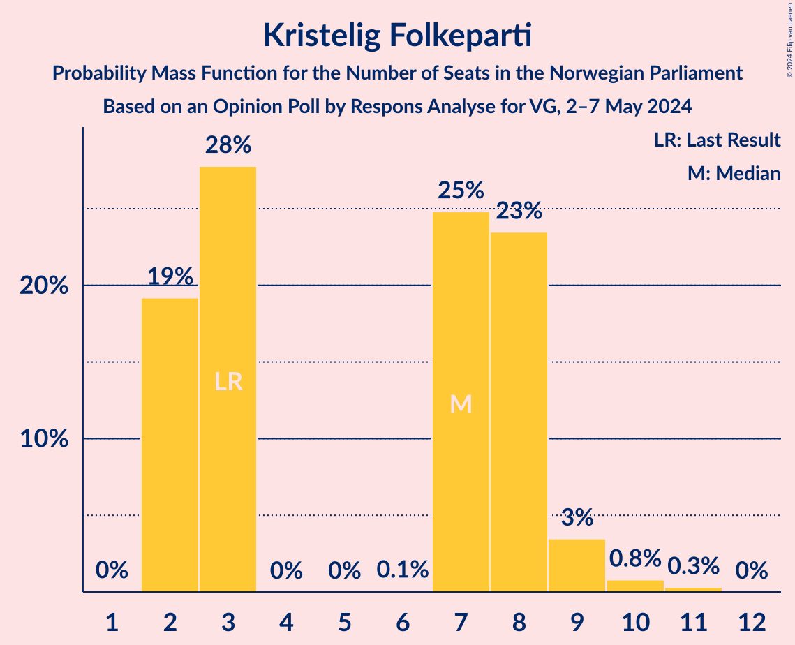

| Number of Seats | Probability | Accumulated | Special Marks |
|:---------------:|:-----------:|:-----------:|:-------------:|
| 1 | 0% | 100% |  |
| 2 | 19% | 99.9% |  |
| 3 | 28% | 81% | Last Result |
| 4 | 0% | 53% |  |
| 5 | 0% | 53% |  |
| 6 | 0.1% | 53% |  |
| 7 | 25% | 53% | Median |
| 8 | 23% | 28% |  |
| 9 | 3% | 5% |  |
| 10 | 0.8% | 1.1% |  |
| 11 | 0.3% | 0.3% |  |
| 12 | 0% | 0% |  |

### Miljøpartiet De Grønne

*For a full overview of the results for this party, see the [Miljøpartiet De Grønne](party-miljøpartietdegrønne.html) page.*

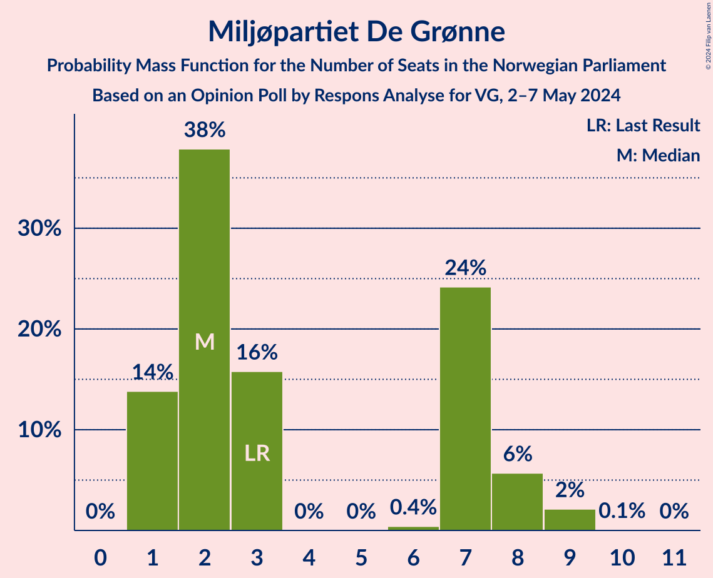

| Number of Seats | Probability | Accumulated | Special Marks |
|:---------------:|:-----------:|:-----------:|:-------------:|
| 1 | 14% | 100% |  |
| 2 | 38% | 86% | Median |
| 3 | 16% | 48% | Last Result |
| 4 | 0% | 33% |  |
| 5 | 0% | 33% |  |
| 6 | 0.4% | 33% |  |
| 7 | 24% | 32% |  |
| 8 | 6% | 8% |  |
| 9 | 2% | 2% |  |
| 10 | 0.1% | 0.1% |  |
| 11 | 0% | 0% |  |

### Industri- og Næringspartiet

*For a full overview of the results for this party, see the [Industri- og Næringspartiet](party-industri-ognæringspartiet.html) page.*

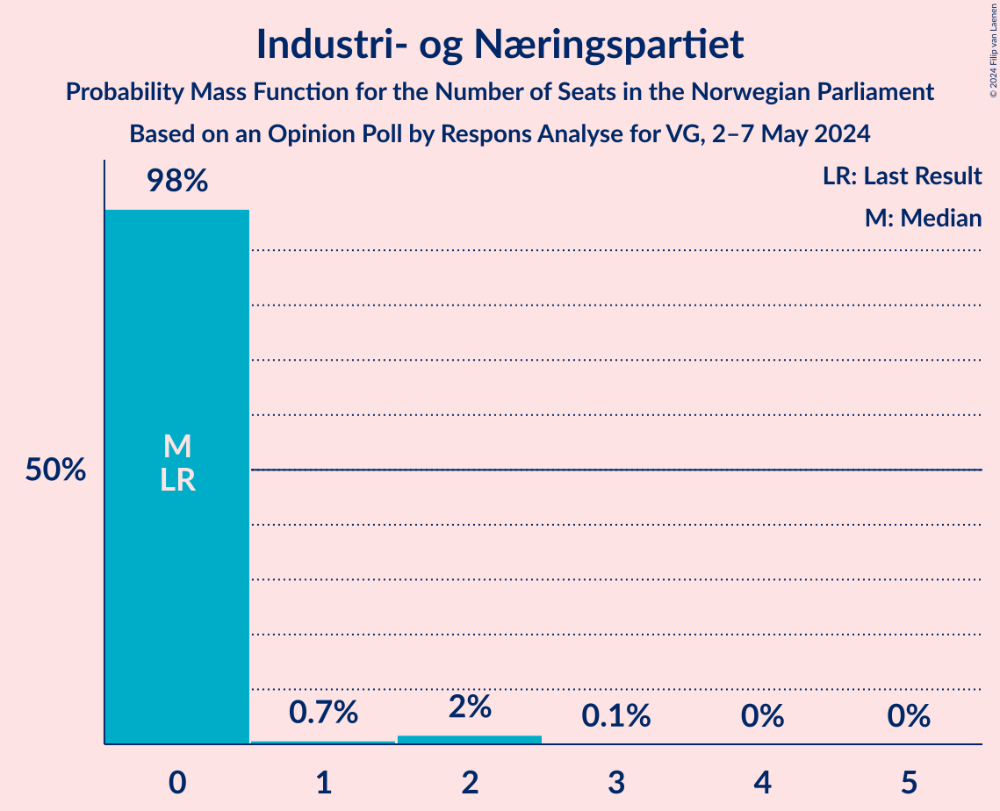

| Number of Seats | Probability | Accumulated | Special Marks |
|:---------------:|:-----------:|:-----------:|:-------------:|
| 0 | 98% | 100% | Last Result, Median |
| 1 | 0.7% | 2% |  |
| 2 | 2% | 2% |  |
| 3 | 0.1% | 0.1% |  |
| 4 | 0% | 0% |  |

### Pensjonistpartiet

*For a full overview of the results for this party, see the [Pensjonistpartiet](party-pensjonistpartiet.html) page.*

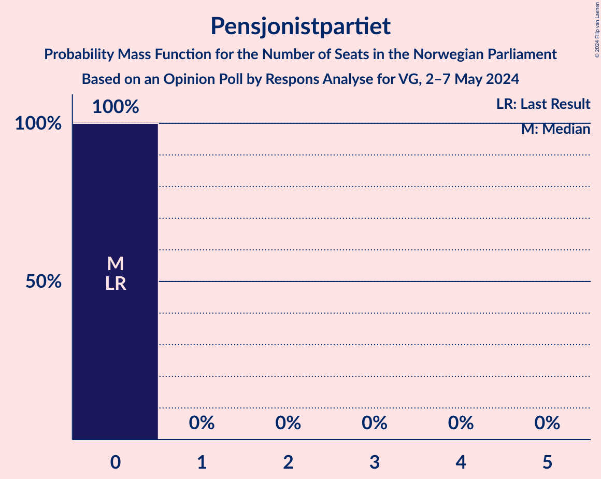

| Number of Seats | Probability | Accumulated | Special Marks |
|:---------------:|:-----------:|:-----------:|:-------------:|
| 0 | 100% | 100% | Last Result, Median |

### Konservativt

*For a full overview of the results for this party, see the [Konservativt](party-konservativt.html) page.*

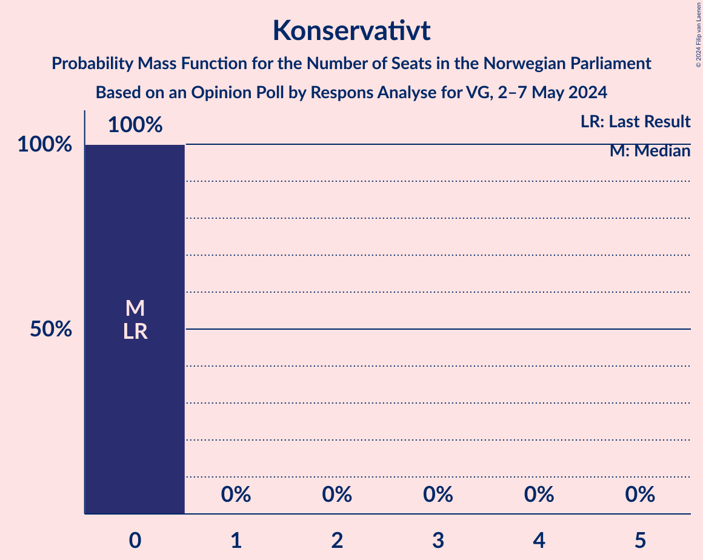

| Number of Seats | Probability | Accumulated | Special Marks |
|:---------------:|:-----------:|:-----------:|:-------------:|
| 0 | 100% | 100% | Last Result, Median |

## Coalitions

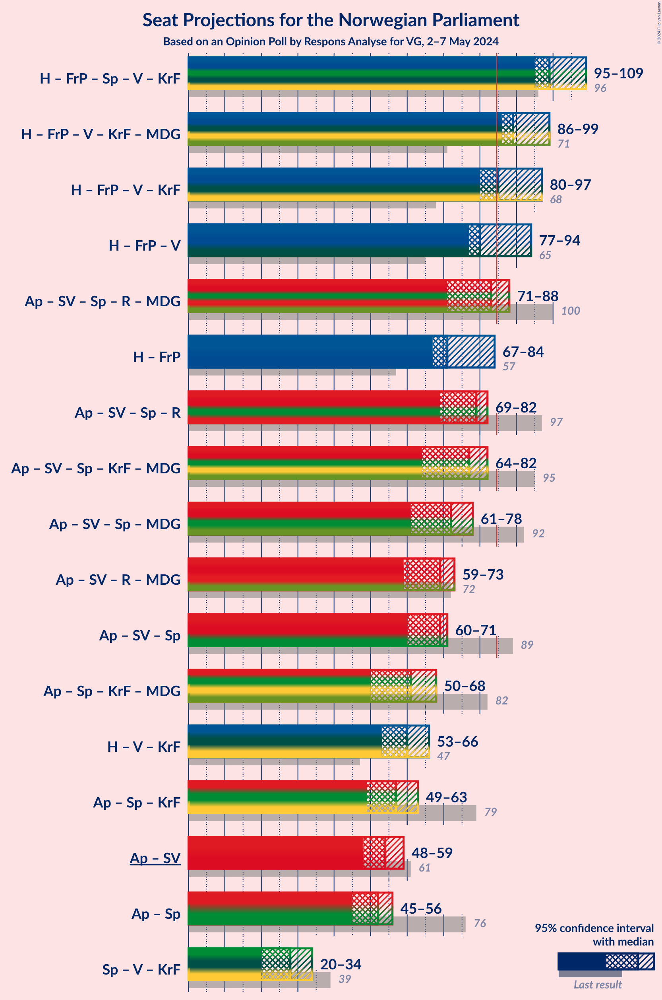

### Confidence Intervals

| Coalition | Last Result | Median | Majority? | 80% Confidence Interval | 90% Confidence Interval | 95% Confidence Interval | 99% Confidence Interval |
|:---------:|:-----------:|:------:|:---------:|:-----------------------:|:-----------------------:|:-----------------------:|:-----------------------:|
| Høyre – Fremskrittspartiet – Senterpartiet – Venstre – Kristelig Folkeparti | 96 | 99 | 100% | 96–105 | 95–109 | 95–109 | 91–111 |
| Høyre – Fremskrittspartiet – Venstre – Kristelig Folkeparti – Miljøpartiet De Grønne | 71 | 89 | 99.1% | 87–96 | 86–98 | 86–99 | 84–102 |
| Høyre – Fremskrittspartiet – Venstre – Kristelig Folkeparti | 68 | 85 | 70% | 82–93 | 80–95 | 80–97 | 79–99 |
| Høyre – Fremskrittspartiet – Venstre | 65 | 80 | 21% | 78–88 | 78–91 | 77–94 | 74–94 |
| Arbeiderpartiet – Sosialistisk Venstreparti – Senterpartiet – Rødt – Miljøpartiet De Grønne | 100 | 83 | 14% | 75–86 | 73–88 | 71–88 | 69–89 |
| Høyre – Fremskrittspartiet | 57 | 71 | 0% | 67–79 | 67–82 | 67–84 | 66–84 |
| Arbeiderpartiet – Sosialistisk Venstreparti – Senterpartiet – Rødt | 97 | 79 | 0.6% | 72–81 | 70–81 | 69–82 | 66–85 |
| Arbeiderpartiet – Sosialistisk Venstreparti – Senterpartiet – Kristelig Folkeparti – Miljøpartiet De Grønne | 95 | 77 | 0.2% | 71–80 | 68–81 | 64–82 | 64–84 |
| Arbeiderpartiet – Sosialistisk Venstreparti – Senterpartiet – Miljøpartiet De Grønne | 92 | 72 | 0% | 65–75 | 64–78 | 61–78 | 60–79 |
| Arbeiderpartiet – Sosialistisk Venstreparti – Rødt – Miljøpartiet De Grønne | 72 | 69 | 0% | 63–72 | 59–73 | 59–73 | 57–77 |
| Arbeiderpartiet – Sosialistisk Venstreparti – Senterpartiet | 89 | 69 | 0% | 63–71 | 60–71 | 60–71 | 57–74 |
| Arbeiderpartiet – Senterpartiet – Kristelig Folkeparti – Miljøpartiet De Grønne | 82 | 61 | 0% | 56–65 | 52–66 | 50–68 | 50–69 |
| Høyre – Venstre – Kristelig Folkeparti | 47 | 60 | 0% | 55–64 | 55–64 | 53–66 | 52–68 |
| Arbeiderpartiet – Senterpartiet – Kristelig Folkeparti | 79 | 57 | 0% | 52–63 | 50–63 | 49–63 | 46–65 |
| Arbeiderpartiet – Sosialistisk Venstreparti | 61 | 54 | 0% | 50–59 | 48–59 | 48–59 | 45–60 |
| Arbeiderpartiet – Senterpartiet | 76 | 52 | 0% | 48–55 | 46–55 | 45–56 | 42–59 |
| Senterpartiet – Venstre – Kristelig Folkeparti | 39 | 28 | 0% | 23–30 | 22–32 | 20–34 | 16–34 |

### Høyre – Fremskrittspartiet – Senterpartiet – Venstre – Kristelig Folkeparti

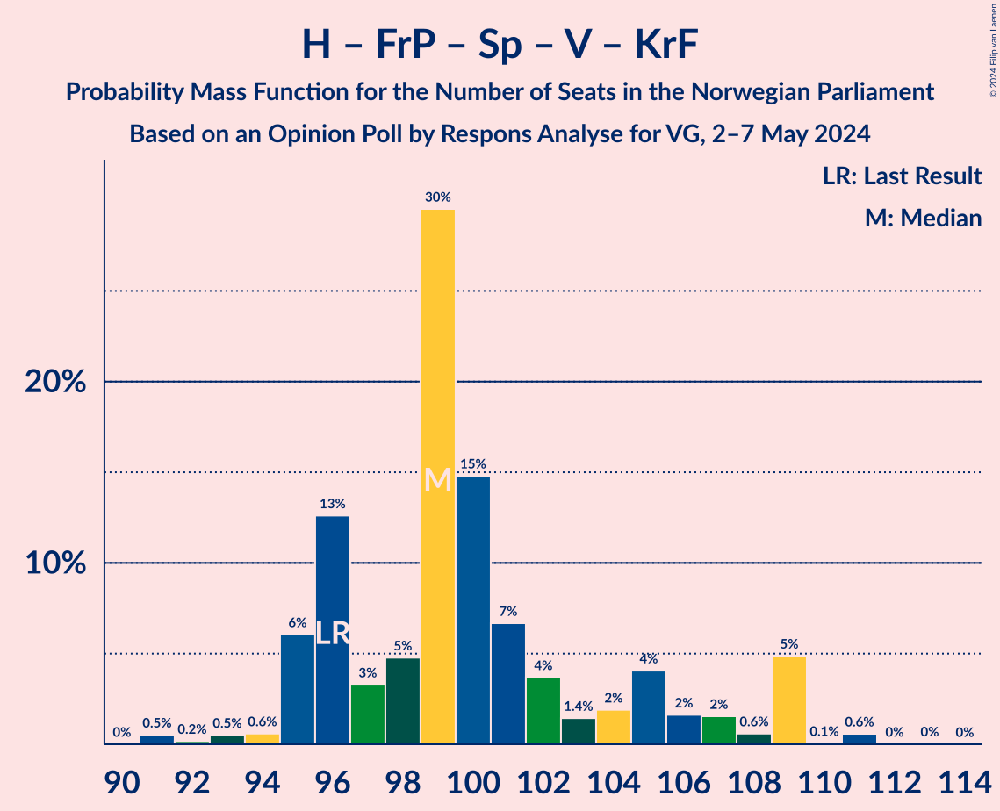

| Number of Seats | Probability | Accumulated | Special Marks |
|:---------------:|:-----------:|:-----------:|:-------------:|
| 91 | 0.5% | 100% |  |
| 92 | 0.2% | 99.5% |  |
| 93 | 0.5% | 99.3% |  |
| 94 | 0.6% | 98.8% |  |
| 95 | 6% | 98% |  |
| 96 | 13% | 92% | Last Result |
| 97 | 3% | 80% |  |
| 98 | 5% | 76% |  |
| 99 | 30% | 71% | Median |
| 100 | 15% | 42% |  |
| 101 | 7% | 27% |  |
| 102 | 4% | 20% |  |
| 103 | 1.4% | 17% |  |
| 104 | 2% | 15% |  |
| 105 | 4% | 13% |  |
| 106 | 2% | 9% |  |
| 107 | 2% | 8% |  |
| 108 | 0.6% | 6% |  |
| 109 | 5% | 6% |  |
| 110 | 0.1% | 0.7% |  |
| 111 | 0.6% | 0.6% |  |
| 112 | 0% | 0.1% |  |
| 113 | 0% | 0% |  |

### Høyre – Fremskrittspartiet – Venstre – Kristelig Folkeparti – Miljøpartiet De Grønne

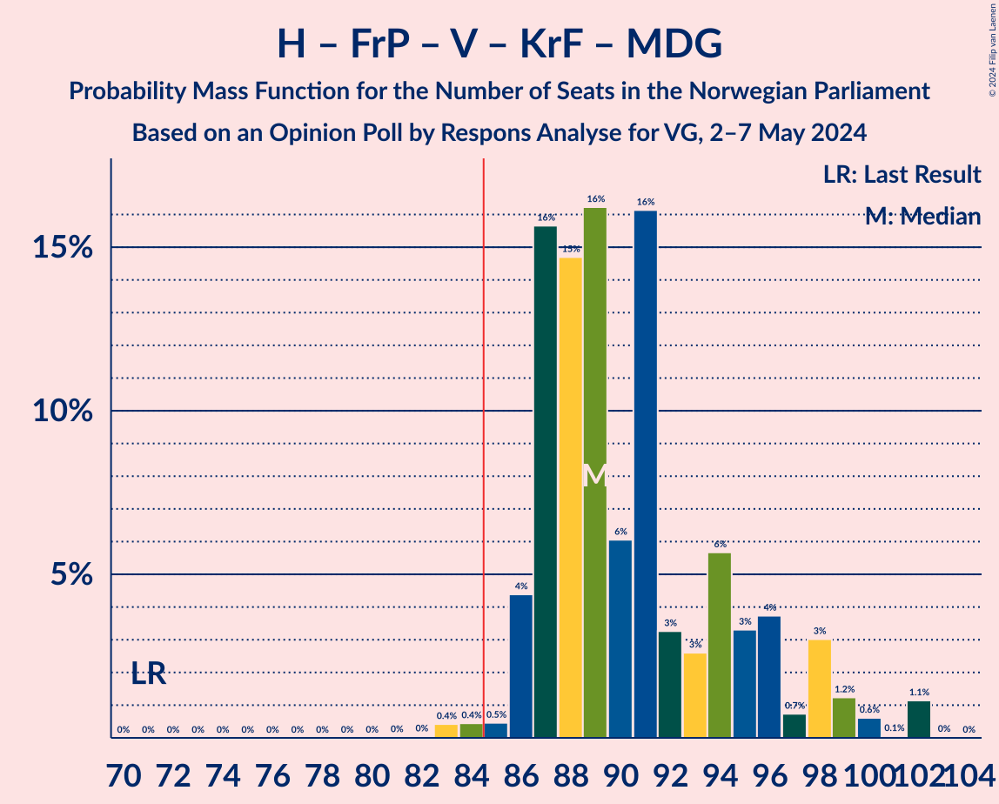

| Number of Seats | Probability | Accumulated | Special Marks |
|:---------------:|:-----------:|:-----------:|:-------------:|
| 71 | 0% | 100% | Last Result |
| 72 | 0% | 100% |  |
| 73 | 0% | 100% |  |
| 74 | 0% | 100% |  |
| 75 | 0% | 100% |  |
| 76 | 0% | 100% |  |
| 77 | 0% | 100% |  |
| 78 | 0% | 100% |  |
| 79 | 0% | 100% |  |
| 80 | 0% | 100% |  |
| 81 | 0% | 100% |  |
| 82 | 0% | 100% |  |
| 83 | 0.4% | 99.9% |  |
| 84 | 0.4% | 99.5% |  |
| 85 | 0.5% | 99.1% | Majority |
| 86 | 4% | 98.6% |  |
| 87 | 16% | 94% |  |
| 88 | 15% | 79% | Median |
| 89 | 16% | 64% |  |
| 90 | 6% | 48% |  |
| 91 | 16% | 42% |  |
| 92 | 3% | 25% |  |
| 93 | 3% | 22% |  |
| 94 | 6% | 20% |  |
| 95 | 3% | 14% |  |
| 96 | 4% | 11% |  |
| 97 | 0.7% | 7% |  |
| 98 | 3% | 6% |  |
| 99 | 1.2% | 3% |  |
| 100 | 0.6% | 2% |  |
| 101 | 0.1% | 1.2% |  |
| 102 | 1.1% | 1.2% |  |
| 103 | 0% | 0% |  |

### Høyre – Fremskrittspartiet – Venstre – Kristelig Folkeparti

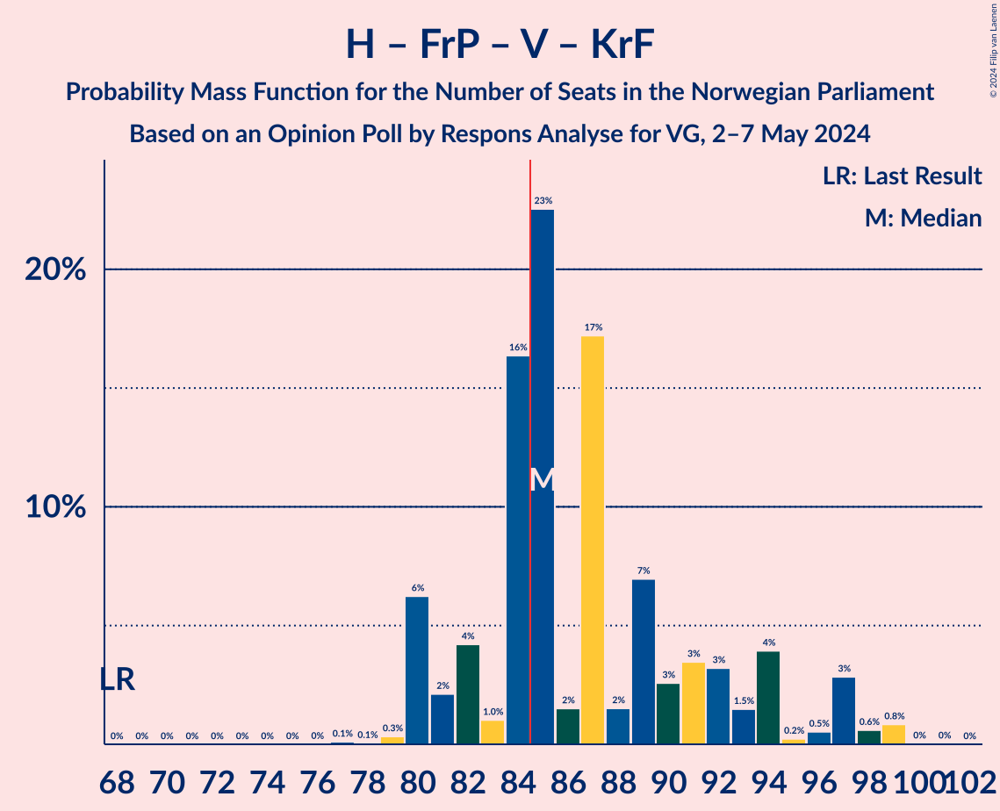

| Number of Seats | Probability | Accumulated | Special Marks |
|:---------------:|:-----------:|:-----------:|:-------------:|
| 68 | 0% | 100% | Last Result |
| 69 | 0% | 100% |  |
| 70 | 0% | 100% |  |
| 71 | 0% | 100% |  |
| 72 | 0% | 100% |  |
| 73 | 0% | 100% |  |
| 74 | 0% | 100% |  |
| 75 | 0% | 100% |  |
| 76 | 0% | 100% |  |
| 77 | 0.1% | 100% |  |
| 78 | 0.1% | 99.9% |  |
| 79 | 0.3% | 99.8% |  |
| 80 | 6% | 99.5% |  |
| 81 | 2% | 93% |  |
| 82 | 4% | 91% |  |
| 83 | 1.0% | 87% |  |
| 84 | 16% | 86% |  |
| 85 | 23% | 70% | Majority |
| 86 | 2% | 47% | Median |
| 87 | 17% | 45% |  |
| 88 | 2% | 28% |  |
| 89 | 7% | 27% |  |
| 90 | 3% | 20% |  |
| 91 | 3% | 17% |  |
| 92 | 3% | 14% |  |
| 93 | 1.5% | 11% |  |
| 94 | 4% | 9% |  |
| 95 | 0.2% | 5% |  |
| 96 | 0.5% | 5% |  |
| 97 | 3% | 4% |  |
| 98 | 0.6% | 2% |  |
| 99 | 0.8% | 0.9% |  |
| 100 | 0% | 0.1% |  |
| 101 | 0% | 0% |  |

### Høyre – Fremskrittspartiet – Venstre

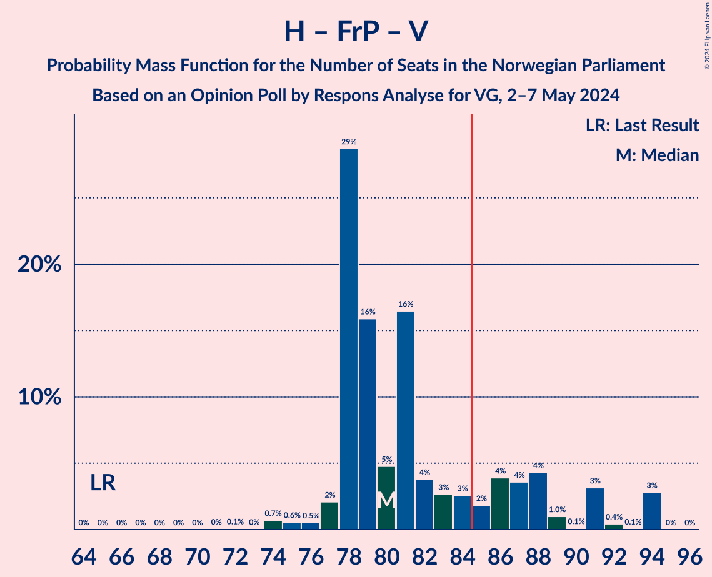

| Number of Seats | Probability | Accumulated | Special Marks |
|:---------------:|:-----------:|:-----------:|:-------------:|
| 65 | 0% | 100% | Last Result |
| 66 | 0% | 100% |  |
| 67 | 0% | 100% |  |
| 68 | 0% | 100% |  |
| 69 | 0% | 100% |  |
| 70 | 0% | 100% |  |
| 71 | 0% | 100% |  |
| 72 | 0.1% | 99.9% |  |
| 73 | 0% | 99.9% |  |
| 74 | 0.7% | 99.8% |  |
| 75 | 0.6% | 99.1% |  |
| 76 | 0.5% | 98.6% |  |
| 77 | 2% | 98% |  |
| 78 | 29% | 96% |  |
| 79 | 16% | 67% | Median |
| 80 | 5% | 51% |  |
| 81 | 16% | 47% |  |
| 82 | 4% | 30% |  |
| 83 | 3% | 26% |  |
| 84 | 3% | 24% |  |
| 85 | 2% | 21% | Majority |
| 86 | 4% | 19% |  |
| 87 | 4% | 15% |  |
| 88 | 4% | 12% |  |
| 89 | 1.0% | 8% |  |
| 90 | 0.1% | 7% |  |
| 91 | 3% | 6% |  |
| 92 | 0.4% | 3% |  |
| 93 | 0.1% | 3% |  |
| 94 | 3% | 3% |  |
| 95 | 0% | 0% |  |

### Arbeiderpartiet – Sosialistisk Venstreparti – Senterpartiet – Rødt – Miljøpartiet De Grønne

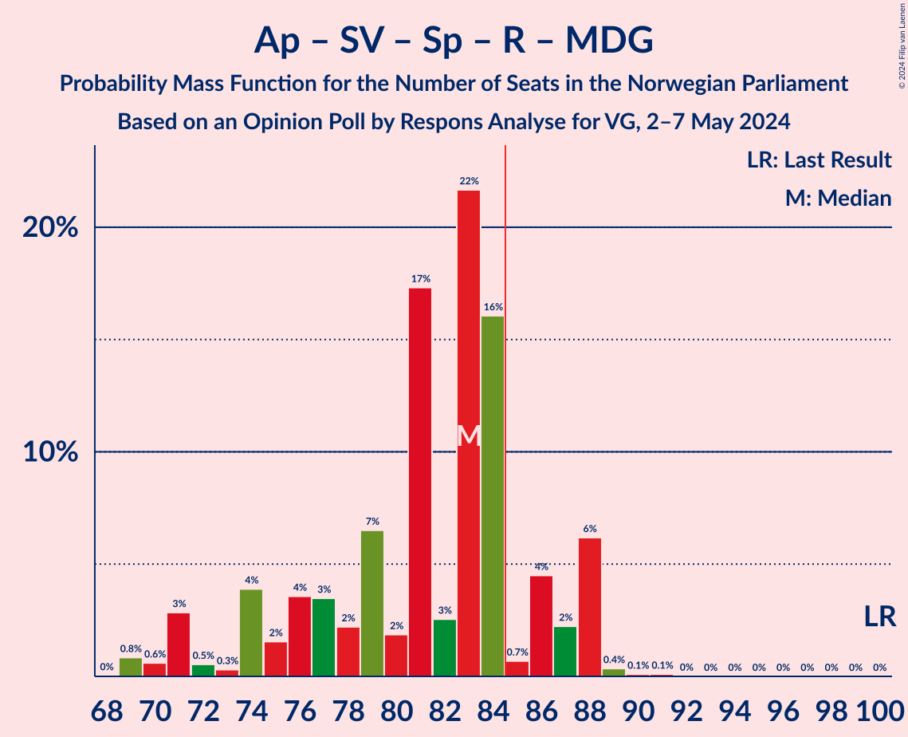

| Number of Seats | Probability | Accumulated | Special Marks |
|:---------------:|:-----------:|:-----------:|:-------------:|
| 68 | 0% | 100% |  |
| 69 | 0.8% | 99.9% |  |
| 70 | 0.6% | 99.1% |  |
| 71 | 3% | 98% |  |
| 72 | 0.5% | 96% |  |
| 73 | 0.3% | 95% |  |
| 74 | 4% | 95% |  |
| 75 | 2% | 91% |  |
| 76 | 4% | 89% |  |
| 77 | 3% | 86% |  |
| 78 | 2% | 82% |  |
| 79 | 7% | 80% |  |
| 80 | 2% | 74% | Median |
| 81 | 17% | 72% |  |
| 82 | 3% | 54% |  |
| 83 | 22% | 52% |  |
| 84 | 16% | 30% |  |
| 85 | 0.7% | 14% | Majority |
| 86 | 4% | 13% |  |
| 87 | 2% | 9% |  |
| 88 | 6% | 7% |  |
| 89 | 0.4% | 0.6% |  |
| 90 | 0.1% | 0.2% |  |
| 91 | 0.1% | 0.1% |  |
| 92 | 0% | 0% |  |
| 93 | 0% | 0% |  |
| 94 | 0% | 0% |  |
| 95 | 0% | 0% |  |
| 96 | 0% | 0% |  |
| 97 | 0% | 0% |  |
| 98 | 0% | 0% |  |
| 99 | 0% | 0% |  |
| 100 | 0% | 0% | Last Result |

### Høyre – Fremskrittspartiet

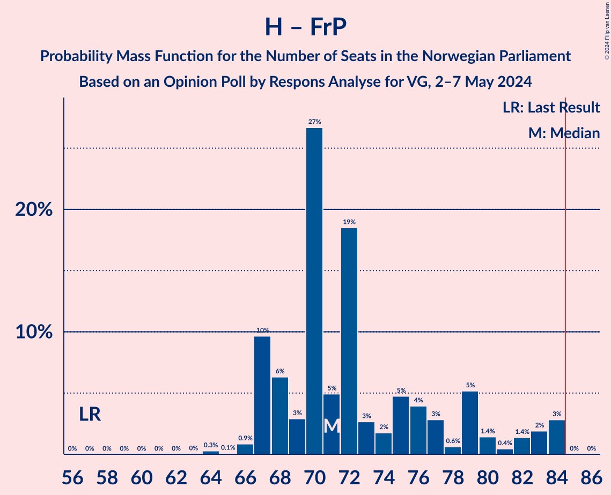

| Number of Seats | Probability | Accumulated | Special Marks |
|:---------------:|:-----------:|:-----------:|:-------------:|
| 57 | 0% | 100% | Last Result |
| 58 | 0% | 100% |  |
| 59 | 0% | 100% |  |
| 60 | 0% | 100% |  |
| 61 | 0% | 100% |  |
| 62 | 0% | 100% |  |
| 63 | 0% | 100% |  |
| 64 | 0.3% | 100% |  |
| 65 | 0.1% | 99.7% |  |
| 66 | 0.9% | 99.6% |  |
| 67 | 10% | 98.7% |  |
| 68 | 6% | 89% |  |
| 69 | 3% | 83% |  |
| 70 | 27% | 80% | Median |
| 71 | 5% | 53% |  |
| 72 | 19% | 48% |  |
| 73 | 3% | 30% |  |
| 74 | 2% | 27% |  |
| 75 | 5% | 25% |  |
| 76 | 4% | 21% |  |
| 77 | 3% | 17% |  |
| 78 | 0.6% | 14% |  |
| 79 | 5% | 13% |  |
| 80 | 1.4% | 8% |  |
| 81 | 0.4% | 7% |  |
| 82 | 1.4% | 6% |  |
| 83 | 2% | 5% |  |
| 84 | 3% | 3% |  |
| 85 | 0% | 0% | Majority |

### Arbeiderpartiet – Sosialistisk Venstreparti – Senterpartiet – Rødt

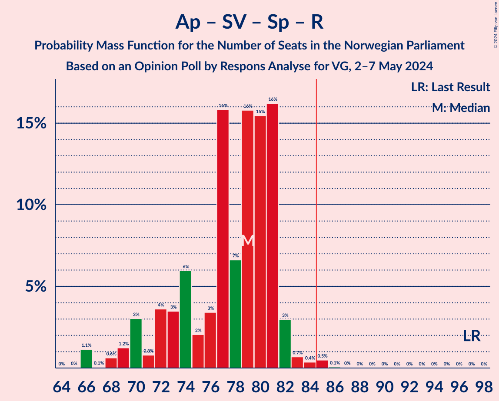

| Number of Seats | Probability | Accumulated | Special Marks |
|:---------------:|:-----------:|:-----------:|:-------------:|
| 66 | 1.1% | 100% |  |
| 67 | 0.1% | 98.8% |  |
| 68 | 0.6% | 98.8% |  |
| 69 | 1.2% | 98% |  |
| 70 | 3% | 97% |  |
| 71 | 0.8% | 94% |  |
| 72 | 4% | 93% |  |
| 73 | 3% | 89% |  |
| 74 | 6% | 86% |  |
| 75 | 2% | 80% |  |
| 76 | 3% | 78% |  |
| 77 | 16% | 75% |  |
| 78 | 7% | 59% | Median |
| 79 | 16% | 52% |  |
| 80 | 15% | 36% |  |
| 81 | 16% | 21% |  |
| 82 | 3% | 5% |  |
| 83 | 0.7% | 2% |  |
| 84 | 0.4% | 1.0% |  |
| 85 | 0.5% | 0.6% | Majority |
| 86 | 0.1% | 0.1% |  |
| 87 | 0% | 0.1% |  |
| 88 | 0% | 0% |  |
| 89 | 0% | 0% |  |
| 90 | 0% | 0% |  |
| 91 | 0% | 0% |  |
| 92 | 0% | 0% |  |
| 93 | 0% | 0% |  |
| 94 | 0% | 0% |  |
| 95 | 0% | 0% |  |
| 96 | 0% | 0% |  |
| 97 | 0% | 0% | Last Result |

### Arbeiderpartiet – Sosialistisk Venstreparti – Senterpartiet – Kristelig Folkeparti – Miljøpartiet De Grønne

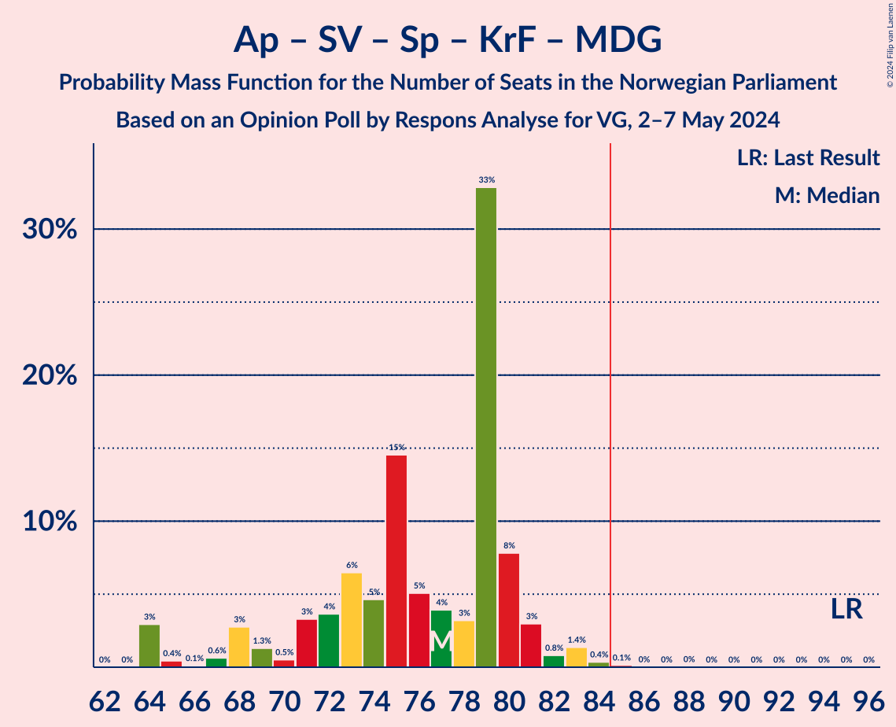

| Number of Seats | Probability | Accumulated | Special Marks |
|:---------------:|:-----------:|:-----------:|:-------------:|
| 64 | 3% | 100% |  |
| 65 | 0.4% | 97% |  |
| 66 | 0.1% | 97% |  |
| 67 | 0.6% | 96% |  |
| 68 | 3% | 96% |  |
| 69 | 1.3% | 93% |  |
| 70 | 0.5% | 92% |  |
| 71 | 3% | 91% |  |
| 72 | 4% | 88% |  |
| 73 | 6% | 84% |  |
| 74 | 5% | 78% |  |
| 75 | 15% | 73% |  |
| 76 | 5% | 59% | Median |
| 77 | 4% | 54% |  |
| 78 | 3% | 50% |  |
| 79 | 33% | 46% |  |
| 80 | 8% | 14% |  |
| 81 | 3% | 6% |  |
| 82 | 0.8% | 3% |  |
| 83 | 1.4% | 2% |  |
| 84 | 0.4% | 0.6% |  |
| 85 | 0.1% | 0.2% | Majority |
| 86 | 0% | 0.1% |  |
| 87 | 0% | 0.1% |  |
| 88 | 0% | 0% |  |
| 89 | 0% | 0% |  |
| 90 | 0% | 0% |  |
| 91 | 0% | 0% |  |
| 92 | 0% | 0% |  |
| 93 | 0% | 0% |  |
| 94 | 0% | 0% |  |
| 95 | 0% | 0% | Last Result |

### Arbeiderpartiet – Sosialistisk Venstreparti – Senterpartiet – Miljøpartiet De Grønne

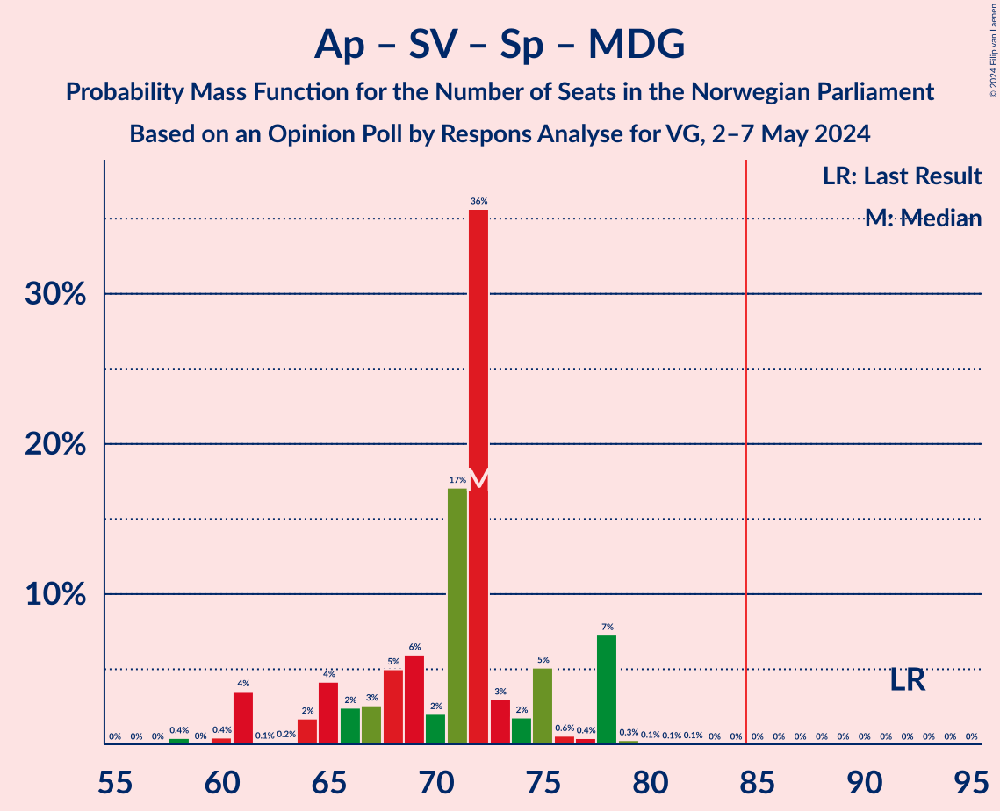

| Number of Seats | Probability | Accumulated | Special Marks |
|:---------------:|:-----------:|:-----------:|:-------------:|
| 58 | 0.4% | 100% |  |
| 59 | 0% | 99.6% |  |
| 60 | 0.4% | 99.5% |  |
| 61 | 4% | 99.1% |  |
| 62 | 0.1% | 96% |  |
| 63 | 0.2% | 95% |  |
| 64 | 2% | 95% |  |
| 65 | 4% | 94% |  |
| 66 | 2% | 89% |  |
| 67 | 3% | 87% |  |
| 68 | 5% | 84% |  |
| 69 | 6% | 79% | Median |
| 70 | 2% | 73% |  |
| 71 | 17% | 71% |  |
| 72 | 36% | 54% |  |
| 73 | 3% | 19% |  |
| 74 | 2% | 16% |  |
| 75 | 5% | 14% |  |
| 76 | 0.6% | 9% |  |
| 77 | 0.4% | 8% |  |
| 78 | 7% | 8% |  |
| 79 | 0.3% | 0.6% |  |
| 80 | 0.1% | 0.3% |  |
| 81 | 0.1% | 0.2% |  |
| 82 | 0.1% | 0.1% |  |
| 83 | 0% | 0% |  |
| 84 | 0% | 0% |  |
| 85 | 0% | 0% | Majority |
| 86 | 0% | 0% |  |
| 87 | 0% | 0% |  |
| 88 | 0% | 0% |  |
| 89 | 0% | 0% |  |
| 90 | 0% | 0% |  |
| 91 | 0% | 0% |  |
| 92 | 0% | 0% | Last Result |

### Arbeiderpartiet – Sosialistisk Venstreparti – Rødt – Miljøpartiet De Grønne

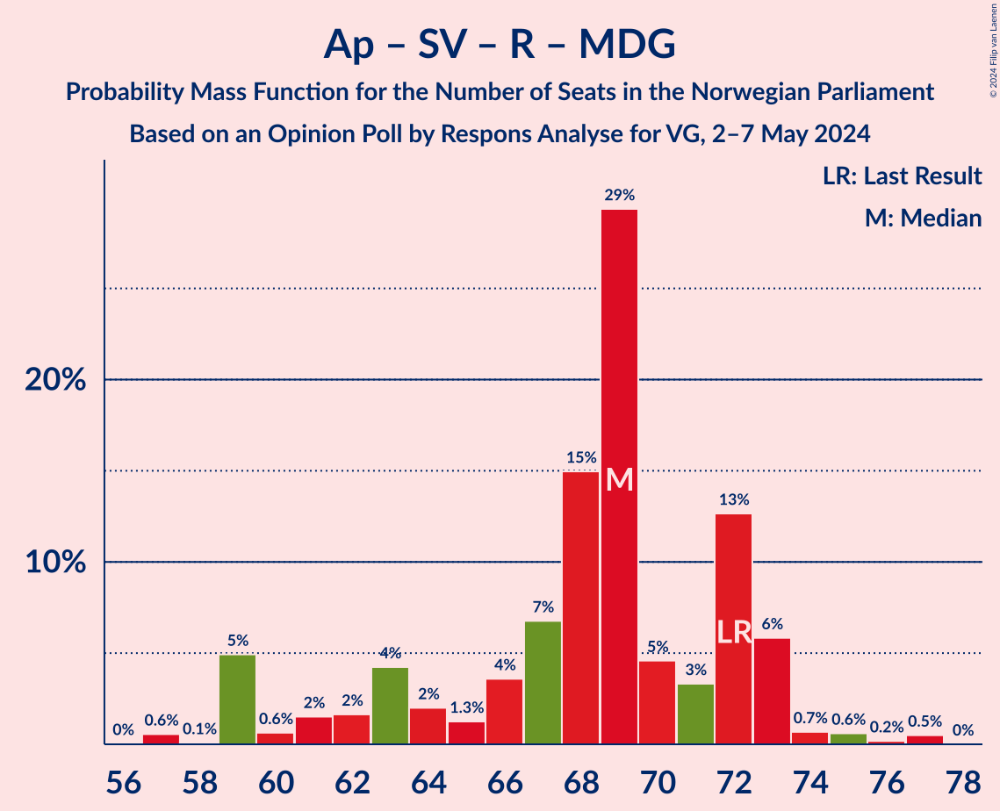

| Number of Seats | Probability | Accumulated | Special Marks |
|:---------------:|:-----------:|:-----------:|:-------------:|
| 56 | 0% | 100% |  |
| 57 | 0.6% | 99.9% |  |
| 58 | 0.1% | 99.4% |  |
| 59 | 5% | 99.3% |  |
| 60 | 0.6% | 94% |  |
| 61 | 2% | 94% |  |
| 62 | 2% | 92% |  |
| 63 | 4% | 91% |  |
| 64 | 2% | 86% |  |
| 65 | 1.3% | 84% |  |
| 66 | 4% | 83% |  |
| 67 | 7% | 79% | Median |
| 68 | 15% | 73% |  |
| 69 | 29% | 58% |  |
| 70 | 5% | 28% |  |
| 71 | 3% | 24% |  |
| 72 | 13% | 20% | Last Result |
| 73 | 6% | 8% |  |
| 74 | 0.7% | 2% |  |
| 75 | 0.6% | 1.3% |  |
| 76 | 0.2% | 0.7% |  |
| 77 | 0.5% | 0.5% |  |
| 78 | 0% | 0% |  |

### Arbeiderpartiet – Sosialistisk Venstreparti – Senterpartiet

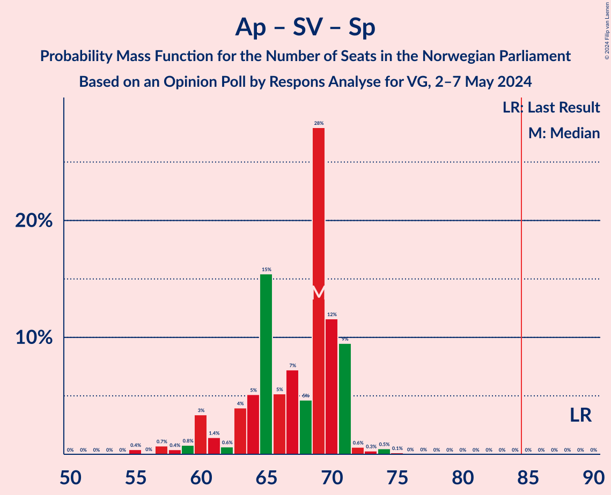

| Number of Seats | Probability | Accumulated | Special Marks |
|:---------------:|:-----------:|:-----------:|:-------------:|
| 55 | 0.4% | 100% |  |
| 56 | 0% | 99.6% |  |
| 57 | 0.7% | 99.5% |  |
| 58 | 0.4% | 98.8% |  |
| 59 | 0.8% | 98% |  |
| 60 | 3% | 98% |  |
| 61 | 1.4% | 94% |  |
| 62 | 0.6% | 93% |  |
| 63 | 4% | 92% |  |
| 64 | 5% | 88% |  |
| 65 | 15% | 83% |  |
| 66 | 5% | 68% |  |
| 67 | 7% | 62% | Median |
| 68 | 5% | 55% |  |
| 69 | 28% | 51% |  |
| 70 | 12% | 23% |  |
| 71 | 9% | 11% |  |
| 72 | 0.6% | 2% |  |
| 73 | 0.3% | 1.0% |  |
| 74 | 0.5% | 0.7% |  |
| 75 | 0.1% | 0.2% |  |
| 76 | 0% | 0.1% |  |
| 77 | 0% | 0% |  |
| 78 | 0% | 0% |  |
| 79 | 0% | 0% |  |
| 80 | 0% | 0% |  |
| 81 | 0% | 0% |  |
| 82 | 0% | 0% |  |
| 83 | 0% | 0% |  |
| 84 | 0% | 0% |  |
| 85 | 0% | 0% | Majority |
| 86 | 0% | 0% |  |
| 87 | 0% | 0% |  |
| 88 | 0% | 0% |  |
| 89 | 0% | 0% | Last Result |

### Arbeiderpartiet – Senterpartiet – Kristelig Folkeparti – Miljøpartiet De Grønne

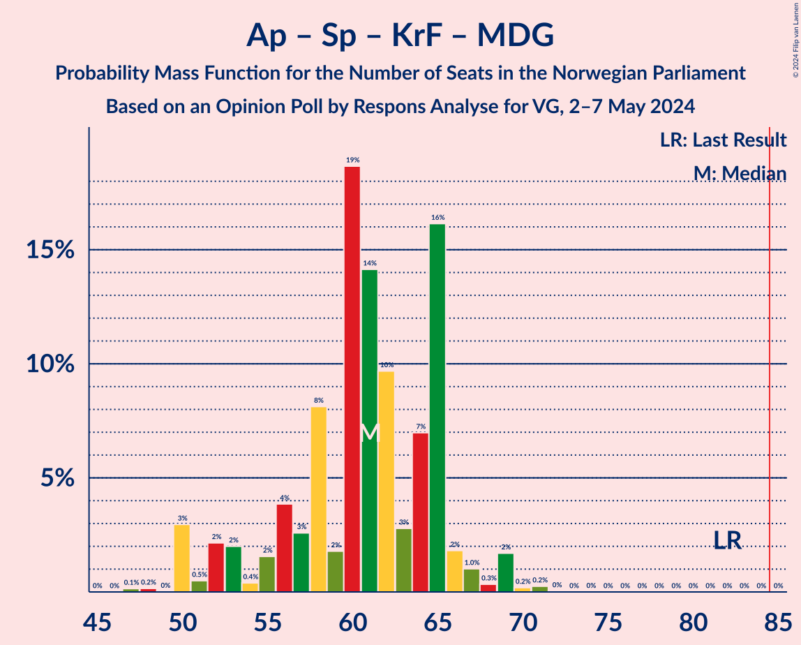

| Number of Seats | Probability | Accumulated | Special Marks |
|:---------------:|:-----------:|:-----------:|:-------------:|
| 47 | 0.1% | 100% |  |
| 48 | 0.2% | 99.9% |  |
| 49 | 0% | 99.7% |  |
| 50 | 3% | 99.7% |  |
| 51 | 0.5% | 97% |  |
| 52 | 2% | 96% |  |
| 53 | 2% | 94% |  |
| 54 | 0.4% | 92% |  |
| 55 | 2% | 92% |  |
| 56 | 4% | 90% |  |
| 57 | 3% | 86% |  |
| 58 | 8% | 84% |  |
| 59 | 2% | 76% |  |
| 60 | 19% | 74% |  |
| 61 | 14% | 55% | Median |
| 62 | 10% | 41% |  |
| 63 | 3% | 31% |  |
| 64 | 7% | 28% |  |
| 65 | 16% | 22% |  |
| 66 | 2% | 5% |  |
| 67 | 1.0% | 4% |  |
| 68 | 0.3% | 3% |  |
| 69 | 2% | 2% |  |
| 70 | 0.2% | 0.5% |  |
| 71 | 0.2% | 0.3% |  |
| 72 | 0% | 0.1% |  |
| 73 | 0% | 0% |  |
| 74 | 0% | 0% |  |
| 75 | 0% | 0% |  |
| 76 | 0% | 0% |  |
| 77 | 0% | 0% |  |
| 78 | 0% | 0% |  |
| 79 | 0% | 0% |  |
| 80 | 0% | 0% |  |
| 81 | 0% | 0% |  |
| 82 | 0% | 0% | Last Result |

### Høyre – Venstre – Kristelig Folkeparti

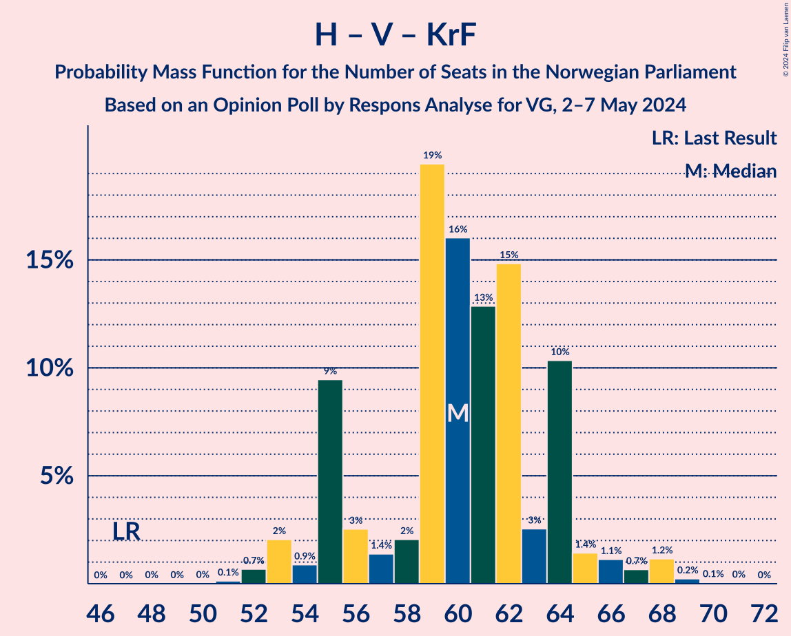

| Number of Seats | Probability | Accumulated | Special Marks |
|:---------------:|:-----------:|:-----------:|:-------------:|
| 47 | 0% | 100% | Last Result |
| 48 | 0% | 100% |  |
| 49 | 0% | 100% |  |
| 50 | 0% | 100% |  |
| 51 | 0.1% | 99.9% |  |
| 52 | 0.7% | 99.8% |  |
| 53 | 2% | 99.1% |  |
| 54 | 0.9% | 97% |  |
| 55 | 9% | 96% |  |
| 56 | 3% | 87% |  |
| 57 | 1.4% | 84% |  |
| 58 | 2% | 83% |  |
| 59 | 19% | 81% |  |
| 60 | 16% | 61% |  |
| 61 | 13% | 45% | Median |
| 62 | 15% | 32% |  |
| 63 | 3% | 18% |  |
| 64 | 10% | 15% |  |
| 65 | 1.4% | 5% |  |
| 66 | 1.1% | 3% |  |
| 67 | 0.7% | 2% |  |
| 68 | 1.2% | 1.5% |  |
| 69 | 0.2% | 0.3% |  |
| 70 | 0.1% | 0.1% |  |
| 71 | 0% | 0% |  |

### Arbeiderpartiet – Senterpartiet – Kristelig Folkeparti

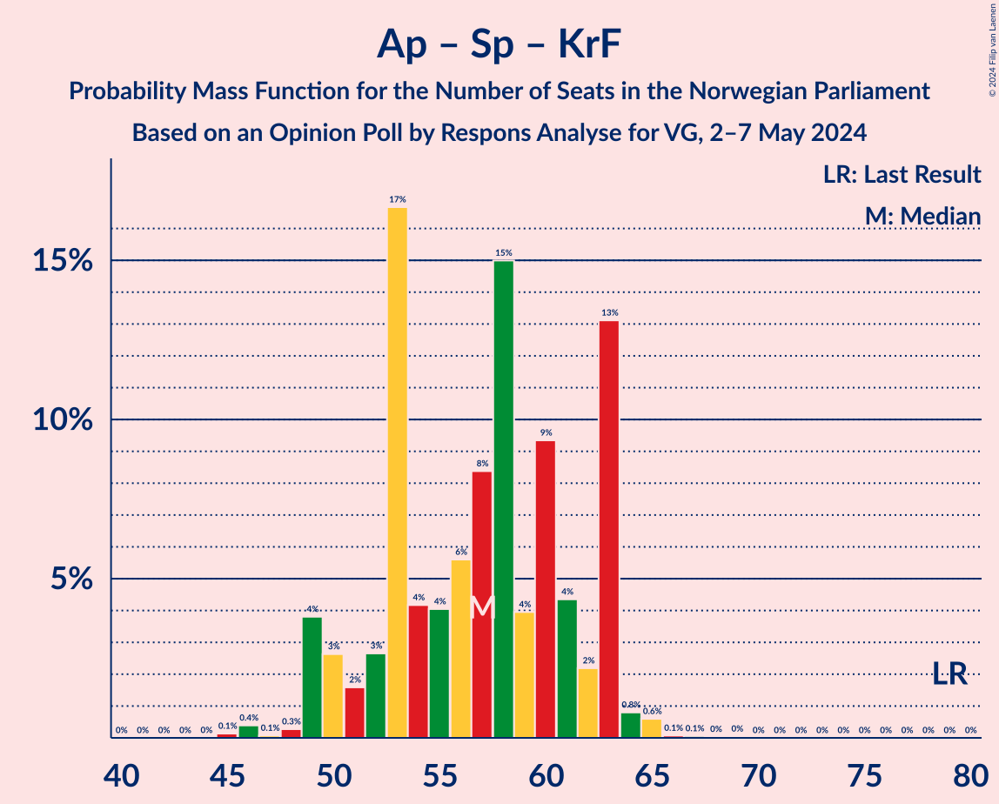

| Number of Seats | Probability | Accumulated | Special Marks |
|:---------------:|:-----------:|:-----------:|:-------------:|
| 45 | 0.1% | 100% |  |
| 46 | 0.4% | 99.9% |  |
| 47 | 0.1% | 99.5% |  |
| 48 | 0.3% | 99.4% |  |
| 49 | 4% | 99.1% |  |
| 50 | 3% | 95% |  |
| 51 | 2% | 93% |  |
| 52 | 3% | 91% |  |
| 53 | 17% | 88% |  |
| 54 | 4% | 72% |  |
| 55 | 4% | 68% |  |
| 56 | 6% | 64% |  |
| 57 | 8% | 58% |  |
| 58 | 15% | 50% |  |
| 59 | 4% | 35% | Median |
| 60 | 9% | 31% |  |
| 61 | 4% | 21% |  |
| 62 | 2% | 17% |  |
| 63 | 13% | 15% |  |
| 64 | 0.8% | 2% |  |
| 65 | 0.6% | 0.8% |  |
| 66 | 0.1% | 0.2% |  |
| 67 | 0.1% | 0.1% |  |
| 68 | 0% | 0.1% |  |
| 69 | 0% | 0.1% |  |
| 70 | 0% | 0% |  |
| 71 | 0% | 0% |  |
| 72 | 0% | 0% |  |
| 73 | 0% | 0% |  |
| 74 | 0% | 0% |  |
| 75 | 0% | 0% |  |
| 76 | 0% | 0% |  |
| 77 | 0% | 0% |  |
| 78 | 0% | 0% |  |
| 79 | 0% | 0% | Last Result |

### Arbeiderpartiet – Sosialistisk Venstreparti

| Number of Seats | Probability | Accumulated | Special Marks |
|:---------------:|:-----------:|:-----------:|:-------------:|
| 45 | 1.1% | 100% |  |
| 46 | 0.2% | 98.9% |  |
| 47 | 0.4% | 98.7% |  |
| 48 | 5% | 98% |  |
| 49 | 1.2% | 93% |  |
| 50 | 15% | 92% |  |
| 51 | 5% | 77% |  |
| 52 | 5% | 72% |  |
| 53 | 5% | 67% |  |
| 54 | 16% | 62% | Median |
| 55 | 8% | 46% |  |
| 56 | 10% | 38% |  |
| 57 | 14% | 29% |  |
| 58 | 3% | 14% |  |
| 59 | 11% | 12% |  |
| 60 | 0.6% | 0.9% |  |
| 61 | 0.1% | 0.2% | Last Result |
| 62 | 0.1% | 0.1% |  |
| 63 | 0% | 0.1% |  |
| 64 | 0% | 0% |  |

### Arbeiderpartiet – Senterpartiet

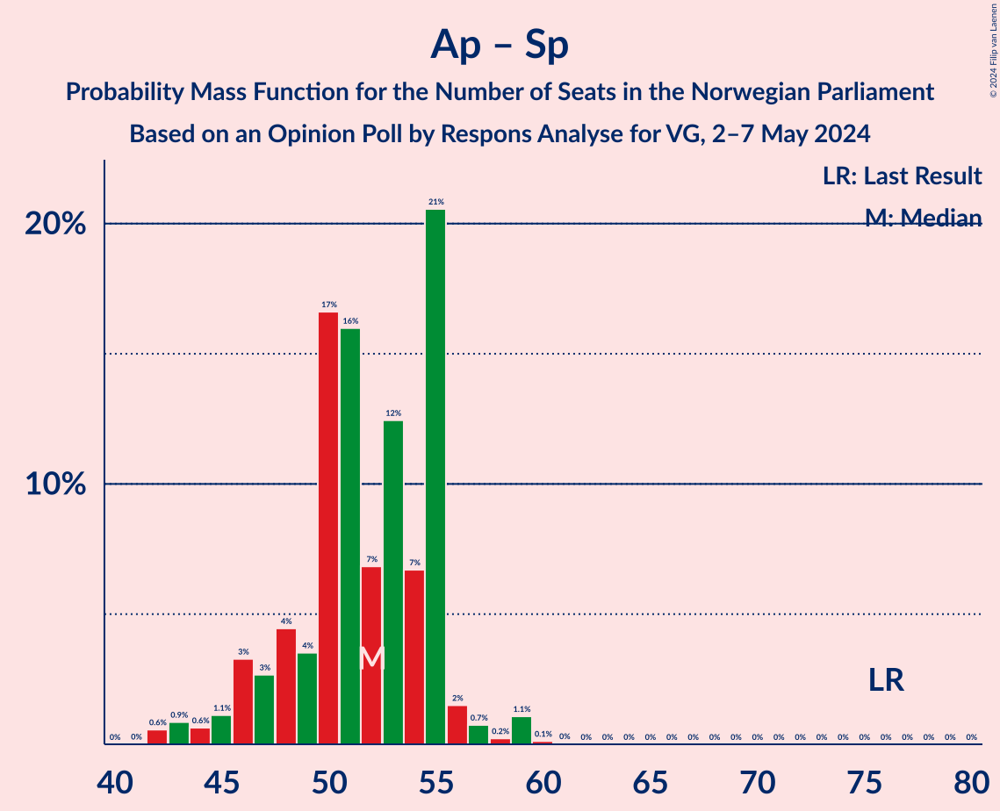

| Number of Seats | Probability | Accumulated | Special Marks |
|:---------------:|:-----------:|:-----------:|:-------------:|
| 42 | 0.6% | 100% |  |
| 43 | 0.9% | 99.4% |  |
| 44 | 0.6% | 98.6% |  |
| 45 | 1.1% | 98% |  |
| 46 | 3% | 97% |  |
| 47 | 3% | 94% |  |
| 48 | 4% | 91% |  |
| 49 | 4% | 86% |  |
| 50 | 17% | 83% |  |
| 51 | 16% | 66% |  |
| 52 | 7% | 50% | Median |
| 53 | 12% | 43% |  |
| 54 | 7% | 31% |  |
| 55 | 21% | 24% |  |
| 56 | 2% | 4% |  |
| 57 | 0.7% | 2% |  |
| 58 | 0.2% | 1.5% |  |
| 59 | 1.1% | 1.2% |  |
| 60 | 0.1% | 0.2% |  |
| 61 | 0% | 0% |  |
| 62 | 0% | 0% |  |
| 63 | 0% | 0% |  |
| 64 | 0% | 0% |  |
| 65 | 0% | 0% |  |
| 66 | 0% | 0% |  |
| 67 | 0% | 0% |  |
| 68 | 0% | 0% |  |
| 69 | 0% | 0% |  |
| 70 | 0% | 0% |  |
| 71 | 0% | 0% |  |
| 72 | 0% | 0% |  |
| 73 | 0% | 0% |  |
| 74 | 0% | 0% |  |
| 75 | 0% | 0% |  |
| 76 | 0% | 0% | Last Result |

### Senterpartiet – Venstre – Kristelig Folkeparti

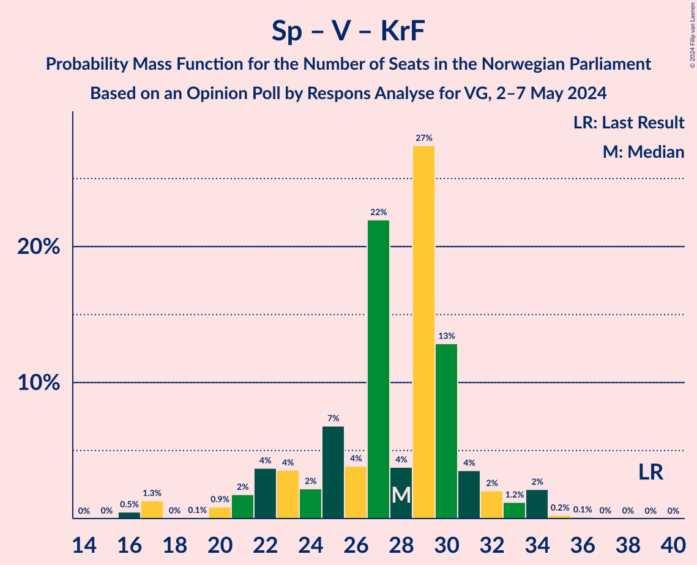

| Number of Seats | Probability | Accumulated | Special Marks |
|:---------------:|:-----------:|:-----------:|:-------------:|
| 16 | 0.5% | 100% |  |
| 17 | 1.3% | 99.5% |  |
| 18 | 0% | 98% |  |
| 19 | 0.1% | 98% |  |
| 20 | 0.9% | 98% |  |
| 21 | 2% | 97% |  |
| 22 | 4% | 95% |  |
| 23 | 4% | 92% |  |
| 24 | 2% | 88% |  |
| 25 | 7% | 86% |  |
| 26 | 4% | 79% |  |
| 27 | 22% | 75% |  |
| 28 | 4% | 53% |  |
| 29 | 27% | 50% | Median |
| 30 | 13% | 22% |  |
| 31 | 4% | 9% |  |
| 32 | 2% | 6% |  |
| 33 | 1.2% | 4% |  |
| 34 | 2% | 3% |  |
| 35 | 0.2% | 0.4% |  |
| 36 | 0.1% | 0.2% |  |
| 37 | 0% | 0% |  |
| 38 | 0% | 0% |  |
| 39 | 0% | 0% | Last Result |

## Technical Information

### Opinion Poll

+ **Polling firm:** Respons Analyse
+ **Commissioner(s):** VG
+ **Fieldwork period:** 2–7 May 2024

### Calculations

+ **Sample size:** 1000
+ **Simulations done:** 1,048,576
+ **Error estimate:** 3.95%

