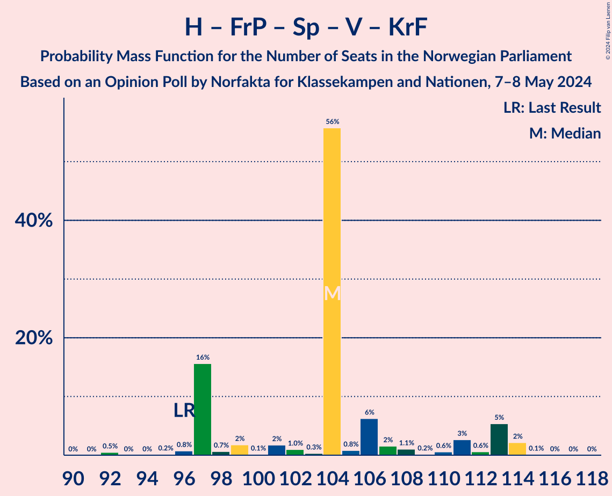

# Opinion Poll by Norfakta for Klassekampen and Nationen, 7–8 May 2024

<a href="#voting-intentions">Voting Intentions</a> | <a href="#seats">Seats</a> | <a href="#coalitions">Coalitions</a> | <a href="#technical-information">Technical Information</a>

## Voting Intentions

### Confidence Intervals

| Party | Last Result | Poll Result | 80% Confidence Interval | 90% Confidence Interval | 95% Confidence Interval | 99% Confidence Interval |
|:-----:|:-----------:|:-----------:|:-----------------------:|:-----------------------:|:-----------------------:|:-----------------------:|
| Høyre | 20.4% | 26.5% | 24.6–28.6% |24.0–29.2% |23.5–29.7% |22.6–30.7% |
| Arbeiderpartiet | 26.2% | 17.8% | 16.1–19.7% |15.7–20.2% |15.3–20.7% |14.5–21.6% |
| Fremskrittspartiet | 11.6% | 15.4% | 13.8–17.1% |13.4–17.6% |13.0–18.1% |12.3–18.9% |
| Sosialistisk Venstreparti | 7.6% | 10.5% | 9.2–12.0% |8.8–12.5% |8.5–12.8% |8.0–13.6% |
| Venstre | 4.6% | 6.7% | 5.6–7.9% |5.3–8.3% |5.1–8.6% |4.7–9.3% |
| Senterpartiet | 13.5% | 6.7% | 5.6–7.9% |5.3–8.3% |5.1–8.6% |4.7–9.3% |
| Rødt | 4.7% | 4.9% | 4.0–6.0% |3.8–6.3% |3.6–6.6% |3.2–7.2% |
| Kristelig Folkeparti | 3.8% | 3.5% | 2.7–4.5% |2.5–4.7% |2.4–5.0% |2.1–5.5% |
| Miljøpartiet De Grønne | 3.9% | 3.3% | 2.6–4.3% |2.4–4.6% |2.3–4.8% |2.0–5.3% |
| Industri- og Næringspartiet | 0.3% | 1.4% | 1.0–2.1% |0.9–2.3% |0.8–2.5% |0.6–2.9% |
| Norgesdemokratene | 1.1% | 0.8% | 0.5–1.4% |0.4–1.5% |0.4–1.7% |0.3–2.0% |
| Liberalistene | 0.2% | 0.6% | 0.4–1.2% |0.3–1.3% |0.3–1.5% |0.2–1.8% |
| Konservativt | 0.4% | 0.6% | 0.4–1.2% |0.3–1.3% |0.3–1.5% |0.2–1.8% |
| Pensjonistpartiet | 0.6% | 0.4% | 0.2–0.9% |0.2–1.0% |0.1–1.1% |0.1–1.4% |
| Folkets parti | 0.1% | 0.1% | 0.1–0.5% |0.0–0.6% |0.0–0.7% |0.0–1.0% |

*Note:* The poll result column reflects the actual value used in the calculations. Published results may vary slightly, and in addition be rounded to fewer digits.

## Seats

### Confidence Intervals

| Party | Last Result | Median | 80% Confidence Interval | 90% Confidence Interval | 95% Confidence Interval | 99% Confidence Interval |
|:-----:|:-----------:|:------:|:-----------------------:|:-----------------------:|:-----------------------:|:-----------------------:|
| <a href="#høyre">Høyre</a> | 36 | 44 | 44–49 |43–54 |43–57 |38–57 |
| <a href="#arbeiderpartiet">Arbeiderpartiet</a> | 48 | 32 | 32–39 |31–39 |29–40 |29–43 |
| <a href="#fremskrittspartiet">Fremskrittspartiet</a> | 21 | 26 | 22–32 |22–34 |22–35 |21–36 |
| <a href="#sosialistisk-venstreparti">Sosialistisk Venstreparti</a> | 13 | 19 | 16–21 |16–22 |15–23 |12–26 |
| <a href="#venstre">Venstre</a> | 8 | 13 | 11–13 |10–15 |10–16 |8–16 |
| <a href="#senterpartiet">Senterpartiet</a> | 28 | 13 | 9–14 |9–15 |9–16 |8–20 |
| <a href="#rødt">Rødt</a> | 8 | 10 | 1–10 |1–10 |1–11 |1–14 |
| <a href="#kristelig-folkeparti">Kristelig Folkeparti</a> | 3 | 8 | 2–8 |0–8 |0–8 |0–10 |
| <a href="#miljøpartiet-de-grønne">Miljøpartiet De Grønne</a> | 3 | 3 | 2–7 |1–7 |1–9 |1–10 |
| <a href="#industri--og-næringspartiet">Industri- og Næringspartiet</a> | 0 | 0 | 0 |0 |0 |0–2 |
| <a href="#norgesdemokratene">Norgesdemokratene</a> | 0 | 0 | 0 |0 |0 |0 |
| <a href="#liberalistene">Liberalistene</a> | 0 | 0 | 0 |0 |0 |0 |
| <a href="#konservativt">Konservativt</a> | 0 | 0 | 0 |0 |0 |0 |
| <a href="#pensjonistpartiet">Pensjonistpartiet</a> | 0 | 0 | 0 |0 |0 |0 |
| <a href="#folkets-parti">Folkets parti</a> | 0 | 0 | 0 |0 |0 |0 |

### Høyre

*For a full overview of the results for this party, see the [Høyre](party-høyre.html) page.*

| Number of Seats | Probability | Accumulated | Special Marks |
|:---------------:|:-----------:|:-----------:|:-------------:|
| 36 | 0% | 100% | Last Result |
| 37 | 0% | 100% |  |
| 38 | 0.9% | 100% |  |
| 39 | 0% | 99.1% |  |
| 40 | 0.1% | 99.1% |  |
| 41 | 0.3% | 98.9% |  |
| 42 | 0.2% | 98.6% |  |
| 43 | 3% | 98% |  |
| 44 | 56% | 95% | Median |
| 45 | 1.0% | 39% |  |
| 46 | 3% | 38% |  |
| 47 | 20% | 35% |  |
| 48 | 3% | 15% |  |
| 49 | 4% | 12% |  |
| 50 | 1.3% | 8% |  |
| 51 | 0.4% | 7% |  |
| 52 | 0.7% | 7% |  |
| 53 | 0.5% | 6% |  |
| 54 | 0.4% | 5% |  |
| 55 | 0.1% | 5% |  |
| 56 | 0.4% | 5% |  |
| 57 | 4% | 5% |  |
| 58 | 0% | 0.1% |  |
| 59 | 0% | 0.1% |  |
| 60 | 0% | 0.1% |  |
| 61 | 0.1% | 0.1% |  |
| 62 | 0% | 0% |  |

### Arbeiderpartiet

*For a full overview of the results for this party, see the [Arbeiderpartiet](party-arbeiderpartiet.html) page.*

| Number of Seats | Probability | Accumulated | Special Marks |
|:---------------:|:-----------:|:-----------:|:-------------:|
| 26 | 0.1% | 100% |  |
| 27 | 0% | 99.9% |  |
| 28 | 0.2% | 99.9% |  |
| 29 | 3% | 99.7% |  |
| 30 | 0.8% | 97% |  |
| 31 | 4% | 96% |  |
| 32 | 54% | 93% | Median |
| 33 | 6% | 38% |  |
| 34 | 5% | 32% |  |
| 35 | 1.4% | 27% |  |
| 36 | 3% | 25% |  |
| 37 | 4% | 23% |  |
| 38 | 0.6% | 19% |  |
| 39 | 15% | 18% |  |
| 40 | 2% | 3% |  |
| 41 | 0.1% | 1.0% |  |
| 42 | 0% | 1.0% |  |
| 43 | 0.9% | 0.9% |  |
| 44 | 0% | 0% |  |
| 45 | 0% | 0% |  |
| 46 | 0% | 0% |  |
| 47 | 0% | 0% |  |
| 48 | 0% | 0% | Last Result |

### Fremskrittspartiet

*For a full overview of the results for this party, see the [Fremskrittspartiet](party-fremskrittspartiet.html) page.*

| Number of Seats | Probability | Accumulated | Special Marks |
|:---------------:|:-----------:|:-----------:|:-------------:|
| 20 | 0% | 100% |  |
| 21 | 1.5% | 99.9% | Last Result |
| 22 | 15% | 98% |  |
| 23 | 0.2% | 83% |  |
| 24 | 0.7% | 83% |  |
| 25 | 2% | 82% |  |
| 26 | 55% | 80% | Median |
| 27 | 2% | 25% |  |
| 28 | 1.1% | 23% |  |
| 29 | 2% | 22% |  |
| 30 | 3% | 21% |  |
| 31 | 5% | 18% |  |
| 32 | 5% | 13% |  |
| 33 | 1.2% | 8% |  |
| 34 | 1.5% | 6% |  |
| 35 | 4% | 5% |  |
| 36 | 0.8% | 0.9% |  |
| 37 | 0% | 0.1% |  |
| 38 | 0% | 0% |  |

### Sosialistisk Venstreparti

*For a full overview of the results for this party, see the [Sosialistisk Venstreparti](party-sosialistiskvenstreparti.html) page.*

| Number of Seats | Probability | Accumulated | Special Marks |
|:---------------:|:-----------:|:-----------:|:-------------:|
| 12 | 0.5% | 100% |  |
| 13 | 0.1% | 99.5% | Last Result |
| 14 | 0.8% | 99.4% |  |
| 15 | 1.2% | 98.6% |  |
| 16 | 16% | 97% |  |
| 17 | 6% | 81% |  |
| 18 | 5% | 75% |  |
| 19 | 56% | 69% | Median |
| 20 | 3% | 13% |  |
| 21 | 2% | 10% |  |
| 22 | 6% | 9% |  |
| 23 | 1.3% | 3% |  |
| 24 | 0.3% | 1.3% |  |
| 25 | 0.2% | 1.0% |  |
| 26 | 0.8% | 0.8% |  |
| 27 | 0% | 0% |  |

### Venstre

*For a full overview of the results for this party, see the [Venstre](party-venstre.html) page.*

| Number of Seats | Probability | Accumulated | Special Marks |
|:---------------:|:-----------:|:-----------:|:-------------:|
| 3 | 0.1% | 100% |  |
| 4 | 0% | 99.9% |  |
| 5 | 0% | 99.9% |  |
| 6 | 0% | 99.9% |  |
| 7 | 0% | 99.9% |  |
| 8 | 1.0% | 99.9% | Last Result |
| 9 | 0.9% | 98.9% |  |
| 10 | 6% | 98% |  |
| 11 | 8% | 92% |  |
| 12 | 18% | 84% |  |
| 13 | 59% | 66% | Median |
| 14 | 0.9% | 7% |  |
| 15 | 4% | 6% |  |
| 16 | 3% | 3% |  |
| 17 | 0.1% | 0.2% |  |
| 18 | 0% | 0% |  |

### Senterpartiet

*For a full overview of the results for this party, see the [Senterpartiet](party-senterpartiet.html) page.*

| Number of Seats | Probability | Accumulated | Special Marks |
|:---------------:|:-----------:|:-----------:|:-------------:|
| 7 | 0.3% | 100% |  |
| 8 | 1.1% | 99.6% |  |
| 9 | 16% | 98.5% |  |
| 10 | 9% | 83% |  |
| 11 | 3% | 74% |  |
| 12 | 0.4% | 71% |  |
| 13 | 56% | 71% | Median |
| 14 | 9% | 15% |  |
| 15 | 2% | 6% |  |
| 16 | 3% | 4% |  |
| 17 | 0.2% | 1.0% |  |
| 18 | 0% | 0.8% |  |
| 19 | 0.1% | 0.8% |  |
| 20 | 0.7% | 0.7% |  |
| 21 | 0% | 0% |  |
| 22 | 0% | 0% |  |
| 23 | 0% | 0% |  |
| 24 | 0% | 0% |  |
| 25 | 0% | 0% |  |
| 26 | 0% | 0% |  |
| 27 | 0% | 0% |  |
| 28 | 0% | 0% | Last Result |

### Rødt

*For a full overview of the results for this party, see the [Rødt](party-rødt.html) page.*

| Number of Seats | Probability | Accumulated | Special Marks |
|:---------------:|:-----------:|:-----------:|:-------------:|
| 1 | 16% | 100% |  |
| 2 | 0% | 84% |  |
| 3 | 0% | 84% |  |
| 4 | 0% | 84% |  |
| 5 | 0% | 84% |  |
| 6 | 0% | 84% |  |
| 7 | 4% | 84% |  |
| 8 | 3% | 80% | Last Result |
| 9 | 20% | 77% |  |
| 10 | 54% | 57% | Median |
| 11 | 1.4% | 3% |  |
| 12 | 0.9% | 2% |  |
| 13 | 0.1% | 1.0% |  |
| 14 | 0.9% | 0.9% |  |
| 15 | 0% | 0% |  |

### Kristelig Folkeparti

*For a full overview of the results for this party, see the [Kristelig Folkeparti](party-kristeligfolkeparti.html) page.*

| Number of Seats | Probability | Accumulated | Special Marks |
|:---------------:|:-----------:|:-----------:|:-------------:|
| 0 | 5% | 100% |  |
| 1 | 0.6% | 95% |  |
| 2 | 9% | 94% |  |
| 3 | 6% | 85% | Last Result |
| 4 | 0% | 79% |  |
| 5 | 0% | 79% |  |
| 6 | 0% | 79% |  |
| 7 | 20% | 79% |  |
| 8 | 57% | 59% | Median |
| 9 | 0.6% | 2% |  |
| 10 | 1.0% | 1.1% |  |
| 11 | 0% | 0.1% |  |
| 12 | 0% | 0% |  |

### Miljøpartiet De Grønne

*For a full overview of the results for this party, see the [Miljøpartiet De Grønne](party-miljøpartietdegrønne.html) page.*

| Number of Seats | Probability | Accumulated | Special Marks |
|:---------------:|:-----------:|:-----------:|:-------------:|
| 0 | 0.3% | 100% |  |
| 1 | 5% | 99.7% |  |
| 2 | 16% | 94% |  |
| 3 | 57% | 78% | Last Result, Median |
| 4 | 0% | 21% |  |
| 5 | 0% | 21% |  |
| 6 | 0.1% | 21% |  |
| 7 | 17% | 21% |  |
| 8 | 0.8% | 4% |  |
| 9 | 2% | 3% |  |
| 10 | 0.6% | 0.6% |  |
| 11 | 0% | 0% |  |

### Industri- og Næringspartiet

*For a full overview of the results for this party, see the [Industri- og Næringspartiet](party-industri-ognæringspartiet.html) page.*

| Number of Seats | Probability | Accumulated | Special Marks |
|:---------------:|:-----------:|:-----------:|:-------------:|
| 0 | 98% | 100% | Last Result, Median |
| 1 | 1.4% | 2% |  |
| 2 | 0.3% | 0.6% |  |
| 3 | 0.3% | 0.3% |  |
| 4 | 0% | 0% |  |

### Norgesdemokratene

*For a full overview of the results for this party, see the [Norgesdemokratene](party-norgesdemokratene.html) page.*

| Number of Seats | Probability | Accumulated | Special Marks |
|:---------------:|:-----------:|:-----------:|:-------------:|
| 0 | 100% | 100% | Last Result, Median |

### Liberalistene

*For a full overview of the results for this party, see the [Liberalistene](party-liberalistene.html) page.*

| Number of Seats | Probability | Accumulated | Special Marks |
|:---------------:|:-----------:|:-----------:|:-------------:|
| 0 | 100% | 100% | Last Result, Median |

### Konservativt

*For a full overview of the results for this party, see the [Konservativt](party-konservativt.html) page.*

| Number of Seats | Probability | Accumulated | Special Marks |
|:---------------:|:-----------:|:-----------:|:-------------:|
| 0 | 100% | 100% | Last Result, Median |

### Pensjonistpartiet

*For a full overview of the results for this party, see the [Pensjonistpartiet](party-pensjonistpartiet.html) page.*

| Number of Seats | Probability | Accumulated | Special Marks |
|:---------------:|:-----------:|:-----------:|:-------------:|
| 0 | 100% | 100% | Last Result, Median |

### Folkets parti

*For a full overview of the results for this party, see the [Folkets parti](party-folketsparti.html) page.*

| Number of Seats | Probability | Accumulated | Special Marks |
|:---------------:|:-----------:|:-----------:|:-------------:|
| 0 | 100% | 100% | Last Result, Median |

## Coalitions

### Confidence Intervals

| Coalition | Last Result | Median | Majority? | 80% Confidence Interval | 90% Confidence Interval | 95% Confidence Interval | 99% Confidence Interval |
|:---------:|:-----------:|:------:|:---------:|:-----------------------:|:-----------------------:|:-----------------------:|:-----------------------:|
| Høyre – Fremskrittspartiet – Senterpartiet – Venstre – Kristelig Folkeparti | 96 | 104 | 100% | 97–111 | 97–113 | 97–113 | 92–114 |
| Høyre – Fremskrittspartiet – Venstre – Kristelig Folkeparti – Miljøpartiet De Grønne | 71 | 94 | 99.9% | 94–99 | 93–102 | 90–102 | 86–105 |
| Høyre – Fremskrittspartiet – Venstre – Kristelig Folkeparti | 68 | 91 | 98.8% | 88–96 | 88–99 | 88–100 | 79–104 |
| Høyre – Fremskrittspartiet – Venstre | 65 | 83 | 29% | 81–92 | 81–97 | 81–99 | 76–99 |
| Høyre – Fremskrittspartiet | 57 | 70 | 5% | 69–81 | 69–85 | 69–88 | 64–88 |
| Arbeiderpartiet – Sosialistisk Venstreparti – Senterpartiet – Rødt – Miljøpartiet De Grønne | 100 | 77 | 0.7% | 71–80 | 69–80 | 68–80 | 64–89 |
| Arbeiderpartiet – Sosialistisk Venstreparti – Senterpartiet – Kristelig Folkeparti – Miljøpartiet De Grønne | 95 | 75 | 0% | 69–78 | 68–79 | 67–80 | 62–82 |
| Arbeiderpartiet – Sosialistisk Venstreparti – Senterpartiet – Rødt | 97 | 74 | 0% | 69–74 | 66–75 | 66–78 | 63–82 |
| Arbeiderpartiet – Sosialistisk Venstreparti – Senterpartiet – Miljøpartiet De Grønne | 92 | 67 | 0% | 67–71 | 65–72 | 62–75 | 59–79 |
| Arbeiderpartiet – Sosialistisk Venstreparti – Rødt – Miljøpartiet De Grønne | 72 | 64 | 0% | 57–71 | 55–71 | 54–71 | 54–76 |
| Arbeiderpartiet – Sosialistisk Venstreparti – Senterpartiet | 89 | 64 | 0% | 64–68 | 61–69 | 60–70 | 56–73 |
| Høyre – Venstre – Kristelig Folkeparti | 47 | 65 | 0% | 62–68 | 58–69 | 56–70 | 54–72 |
| Arbeiderpartiet – Senterpartiet – Kristelig Folkeparti – Miljøpartiet De Grønne | 82 | 56 | 0% | 51–62 | 48–62 | 48–62 | 42–65 |
| Arbeiderpartiet – Sosialistisk Venstreparti | 61 | 51 | 0% | 51–55 | 51–58 | 49–59 | 45–59 |
| Arbeiderpartiet – Senterpartiet – Kristelig Folkeparti | 79 | 53 | 0% | 48–55 | 46–55 | 44–55 | 40–61 |
| Arbeiderpartiet – Senterpartiet | 76 | 45 | 0% | 45–48 | 42–51 | 41–52 | 39–53 |
| Senterpartiet – Venstre – Kristelig Folkeparti | 39 | 34 | 0% | 25–34 | 25–34 | 23–35 | 23–36 |

### Høyre – Fremskrittspartiet – Senterpartiet – Venstre – Kristelig Folkeparti

| Number of Seats | Probability | Accumulated | Special Marks |
|:---------------:|:-----------:|:-----------:|:-------------:|
| 92 | 0.5% | 100% |  |
| 93 | 0% | 99.5% |  |
| 94 | 0% | 99.5% |  |
| 95 | 0.2% | 99.5% |  |
| 96 | 0.8% | 99.3% | Last Result |
| 97 | 16% | 98.5% |  |
| 98 | 0.7% | 83% |  |
| 99 | 2% | 82% |  |
| 100 | 0.1% | 80% |  |
| 101 | 2% | 80% |  |
| 102 | 1.0% | 79% |  |
| 103 | 0.3% | 78% |  |
| 104 | 56% | 77% | Median |
| 105 | 0.8% | 21% |  |
| 106 | 6% | 21% |  |
| 107 | 2% | 14% |  |
| 108 | 1.1% | 13% |  |
| 109 | 0.2% | 12% |  |
| 110 | 0.6% | 12% |  |
| 111 | 3% | 11% |  |
| 112 | 0.6% | 8% |  |
| 113 | 5% | 8% |  |
| 114 | 2% | 2% |  |
| 115 | 0.1% | 0.2% |  |
| 116 | 0% | 0.1% |  |
| 117 | 0% | 0% |  |

### Høyre – Fremskrittspartiet – Venstre – Kristelig Folkeparti – Miljøpartiet De Grønne

| Number of Seats | Probability | Accumulated | Special Marks |
|:---------------:|:-----------:|:-----------:|:-------------:|
| 71 | 0% | 100% | Last Result |
| 72 | 0% | 100% |  |
| 73 | 0% | 100% |  |
| 74 | 0% | 100% |  |
| 75 | 0% | 100% |  |
| 76 | 0% | 100% |  |
| 77 | 0% | 100% |  |
| 78 | 0% | 100% |  |
| 79 | 0% | 100% |  |
| 80 | 0% | 100% |  |
| 81 | 0% | 100% |  |
| 82 | 0% | 100% |  |
| 83 | 0% | 100% |  |
| 84 | 0.1% | 100% |  |
| 85 | 0% | 99.9% | Majority |
| 86 | 0.5% | 99.9% |  |
| 87 | 0.6% | 99.4% |  |
| 88 | 0.1% | 98.9% |  |
| 89 | 0.2% | 98.8% |  |
| 90 | 2% | 98.6% |  |
| 91 | 0.9% | 97% |  |
| 92 | 0.9% | 96% |  |
| 93 | 3% | 95% |  |
| 94 | 52% | 92% | Median |
| 95 | 21% | 40% |  |
| 96 | 0.2% | 20% |  |
| 97 | 4% | 20% |  |
| 98 | 5% | 16% |  |
| 99 | 2% | 11% |  |
| 100 | 0.7% | 9% |  |
| 101 | 0.1% | 9% |  |
| 102 | 6% | 9% |  |
| 103 | 0.6% | 2% |  |
| 104 | 0.2% | 1.5% |  |
| 105 | 0.8% | 1.3% |  |
| 106 | 0.2% | 0.5% |  |
| 107 | 0.1% | 0.2% |  |
| 108 | 0% | 0.2% |  |
| 109 | 0% | 0.1% |  |
| 110 | 0% | 0.1% |  |
| 111 | 0% | 0.1% |  |
| 112 | 0.1% | 0.1% |  |
| 113 | 0% | 0% |  |

### Høyre – Fremskrittspartiet – Venstre – Kristelig Folkeparti

| Number of Seats | Probability | Accumulated | Special Marks |
|:---------------:|:-----------:|:-----------:|:-------------:|
| 68 | 0% | 100% | Last Result |
| 69 | 0% | 100% |  |
| 70 | 0% | 100% |  |
| 71 | 0% | 100% |  |
| 72 | 0% | 100% |  |
| 73 | 0% | 100% |  |
| 74 | 0% | 100% |  |
| 75 | 0% | 100% |  |
| 76 | 0% | 100% |  |
| 77 | 0% | 100% |  |
| 78 | 0% | 100% |  |
| 79 | 0.5% | 100% |  |
| 80 | 0% | 99.5% |  |
| 81 | 0% | 99.5% |  |
| 82 | 0% | 99.5% |  |
| 83 | 0.1% | 99.4% |  |
| 84 | 0.5% | 99.3% |  |
| 85 | 0.4% | 98.8% | Majority |
| 86 | 0.1% | 98% |  |
| 87 | 0.4% | 98% |  |
| 88 | 19% | 98% |  |
| 89 | 2% | 79% |  |
| 90 | 0.2% | 78% |  |
| 91 | 55% | 77% | Median |
| 92 | 1.1% | 23% |  |
| 93 | 4% | 21% |  |
| 94 | 0.5% | 18% |  |
| 95 | 3% | 17% |  |
| 96 | 5% | 14% |  |
| 97 | 0.5% | 9% |  |
| 98 | 0.7% | 9% |  |
| 99 | 5% | 8% |  |
| 100 | 2% | 3% |  |
| 101 | 0.5% | 2% |  |
| 102 | 0.4% | 1.1% |  |
| 103 | 0.2% | 0.7% |  |
| 104 | 0.5% | 0.5% |  |
| 105 | 0% | 0.1% |  |
| 106 | 0% | 0.1% |  |
| 107 | 0.1% | 0.1% |  |
| 108 | 0% | 0% |  |

### Høyre – Fremskrittspartiet – Venstre

| Number of Seats | Probability | Accumulated | Special Marks |
|:---------------:|:-----------:|:-----------:|:-------------:|
| 65 | 0% | 100% | Last Result |
| 66 | 0% | 100% |  |
| 67 | 0% | 100% |  |
| 68 | 0% | 100% |  |
| 69 | 0% | 100% |  |
| 70 | 0% | 100% |  |
| 71 | 0% | 100% |  |
| 72 | 0% | 100% |  |
| 73 | 0% | 100% |  |
| 74 | 0% | 100% |  |
| 75 | 0% | 100% |  |
| 76 | 0.5% | 100% |  |
| 77 | 0% | 99.5% |  |
| 78 | 0% | 99.4% |  |
| 79 | 0.1% | 99.4% |  |
| 80 | 0.1% | 99.4% |  |
| 81 | 16% | 99.3% |  |
| 82 | 0.3% | 83% |  |
| 83 | 52% | 83% | Median |
| 84 | 2% | 31% |  |
| 85 | 2% | 29% | Majority |
| 86 | 2% | 27% |  |
| 87 | 1.5% | 25% |  |
| 88 | 3% | 23% |  |
| 89 | 3% | 20% |  |
| 90 | 2% | 17% |  |
| 91 | 3% | 14% |  |
| 92 | 4% | 12% |  |
| 93 | 0.9% | 8% |  |
| 94 | 1.0% | 7% |  |
| 95 | 0.1% | 6% |  |
| 96 | 0.3% | 6% |  |
| 97 | 0.9% | 6% |  |
| 98 | 0% | 5% |  |
| 99 | 5% | 5% |  |
| 100 | 0% | 0.1% |  |
| 101 | 0% | 0.1% |  |
| 102 | 0% | 0% |  |

### Høyre – Fremskrittspartiet

| Number of Seats | Probability | Accumulated | Special Marks |
|:---------------:|:-----------:|:-----------:|:-------------:|
| 57 | 0% | 100% | Last Result |
| 58 | 0% | 100% |  |
| 59 | 0% | 100% |  |
| 60 | 0% | 100% |  |
| 61 | 0% | 100% |  |
| 62 | 0% | 100% |  |
| 63 | 0% | 100% |  |
| 64 | 0.5% | 100% |  |
| 65 | 0.1% | 99.5% |  |
| 66 | 0.8% | 99.4% |  |
| 67 | 0.2% | 98.7% |  |
| 68 | 0% | 98% |  |
| 69 | 15% | 98% |  |
| 70 | 53% | 83% | Median |
| 71 | 0.5% | 30% |  |
| 72 | 2% | 30% |  |
| 73 | 2% | 28% |  |
| 74 | 0.3% | 26% |  |
| 75 | 3% | 25% |  |
| 76 | 6% | 22% |  |
| 77 | 2% | 16% |  |
| 78 | 2% | 14% |  |
| 79 | 0.4% | 13% |  |
| 80 | 1.1% | 12% |  |
| 81 | 2% | 11% |  |
| 82 | 2% | 9% |  |
| 83 | 0.2% | 6% |  |
| 84 | 1.1% | 6% |  |
| 85 | 0.2% | 5% | Majority |
| 86 | 0.1% | 5% |  |
| 87 | 0.3% | 5% |  |
| 88 | 4% | 4% |  |
| 89 | 0% | 0% |  |

### Arbeiderpartiet – Sosialistisk Venstreparti – Senterpartiet – Rødt – Miljøpartiet De Grønne

| Number of Seats | Probability | Accumulated | Special Marks |
|:---------------:|:-----------:|:-----------:|:-------------:|
| 61 | 0.1% | 100% |  |
| 62 | 0% | 99.9% |  |
| 63 | 0% | 99.9% |  |
| 64 | 0.5% | 99.9% |  |
| 65 | 0.2% | 99.5% |  |
| 66 | 0.6% | 99.3% |  |
| 67 | 0.5% | 98.7% |  |
| 68 | 2% | 98% |  |
| 69 | 5% | 96% |  |
| 70 | 0.7% | 92% |  |
| 71 | 2% | 91% |  |
| 72 | 4% | 89% |  |
| 73 | 3% | 86% |  |
| 74 | 0.8% | 82% |  |
| 75 | 3% | 82% |  |
| 76 | 2% | 79% |  |
| 77 | 55% | 77% | Median |
| 78 | 0.2% | 23% |  |
| 79 | 2% | 22% |  |
| 80 | 19% | 21% |  |
| 81 | 0.3% | 2% |  |
| 82 | 0.1% | 2% |  |
| 83 | 0.4% | 2% |  |
| 84 | 0.5% | 1.2% |  |
| 85 | 0.1% | 0.7% | Majority |
| 86 | 0% | 0.6% |  |
| 87 | 0% | 0.5% |  |
| 88 | 0% | 0.5% |  |
| 89 | 0.5% | 0.5% |  |
| 90 | 0% | 0% |  |
| 91 | 0% | 0% |  |
| 92 | 0% | 0% |  |
| 93 | 0% | 0% |  |
| 94 | 0% | 0% |  |
| 95 | 0% | 0% |  |
| 96 | 0% | 0% |  |
| 97 | 0% | 0% |  |
| 98 | 0% | 0% |  |
| 99 | 0% | 0% |  |
| 100 | 0% | 0% | Last Result |

### Arbeiderpartiet – Sosialistisk Venstreparti – Senterpartiet – Kristelig Folkeparti – Miljøpartiet De Grønne

| Number of Seats | Probability | Accumulated | Special Marks |
|:---------------:|:-----------:|:-----------:|:-------------:|
| 62 | 0.6% | 100% |  |
| 63 | 0.2% | 99.3% |  |
| 64 | 0.3% | 99.1% |  |
| 65 | 0.4% | 98.8% |  |
| 66 | 0.7% | 98% |  |
| 67 | 0.5% | 98% |  |
| 68 | 5% | 97% |  |
| 69 | 3% | 92% |  |
| 70 | 3% | 89% |  |
| 71 | 2% | 86% |  |
| 72 | 0.3% | 84% |  |
| 73 | 1.2% | 84% |  |
| 74 | 2% | 83% |  |
| 75 | 58% | 81% | Median |
| 76 | 0.4% | 23% |  |
| 77 | 0.4% | 23% |  |
| 78 | 16% | 23% |  |
| 79 | 3% | 7% |  |
| 80 | 2% | 3% |  |
| 81 | 0.5% | 1.1% |  |
| 82 | 0.6% | 0.7% |  |
| 83 | 0% | 0.1% |  |
| 84 | 0% | 0% |  |
| 85 | 0% | 0% | Majority |
| 86 | 0% | 0% |  |
| 87 | 0% | 0% |  |
| 88 | 0% | 0% |  |
| 89 | 0% | 0% |  |
| 90 | 0% | 0% |  |
| 91 | 0% | 0% |  |
| 92 | 0% | 0% |  |
| 93 | 0% | 0% |  |
| 94 | 0% | 0% |  |
| 95 | 0% | 0% | Last Result |

### Arbeiderpartiet – Sosialistisk Venstreparti – Senterpartiet – Rødt

| Number of Seats | Probability | Accumulated | Special Marks |
|:---------------:|:-----------:|:-----------:|:-------------:|
| 56 | 0.1% | 100% |  |
| 57 | 0% | 99.9% |  |
| 58 | 0% | 99.9% |  |
| 59 | 0% | 99.9% |  |
| 60 | 0% | 99.9% |  |
| 61 | 0.1% | 99.8% |  |
| 62 | 0.2% | 99.8% |  |
| 63 | 0.8% | 99.5% |  |
| 64 | 0.2% | 98.7% |  |
| 65 | 0.9% | 98.5% |  |
| 66 | 6% | 98% |  |
| 67 | 0.1% | 91% |  |
| 68 | 0.4% | 91% |  |
| 69 | 2% | 91% |  |
| 70 | 6% | 89% |  |
| 71 | 3% | 83% |  |
| 72 | 0.5% | 80% |  |
| 73 | 20% | 80% |  |
| 74 | 53% | 60% | Median |
| 75 | 3% | 7% |  |
| 76 | 1.0% | 5% |  |
| 77 | 0.9% | 4% |  |
| 78 | 2% | 3% |  |
| 79 | 0.2% | 1.4% |  |
| 80 | 0.1% | 1.2% |  |
| 81 | 0.6% | 1.1% |  |
| 82 | 0.4% | 0.6% |  |
| 83 | 0% | 0.1% |  |
| 84 | 0.1% | 0.1% |  |
| 85 | 0% | 0% | Majority |
| 86 | 0% | 0% |  |
| 87 | 0% | 0% |  |
| 88 | 0% | 0% |  |
| 89 | 0% | 0% |  |
| 90 | 0% | 0% |  |
| 91 | 0% | 0% |  |
| 92 | 0% | 0% |  |
| 93 | 0% | 0% |  |
| 94 | 0% | 0% |  |
| 95 | 0% | 0% |  |
| 96 | 0% | 0% |  |
| 97 | 0% | 0% | Last Result |

### Arbeiderpartiet – Sosialistisk Venstreparti – Senterpartiet – Miljøpartiet De Grønne

| Number of Seats | Probability | Accumulated | Special Marks |
|:---------------:|:-----------:|:-----------:|:-------------:|
| 57 | 0.3% | 100% |  |
| 58 | 0% | 99.6% |  |
| 59 | 0.5% | 99.6% |  |
| 60 | 0.4% | 99.2% |  |
| 61 | 0.7% | 98.7% |  |
| 62 | 2% | 98% |  |
| 63 | 0.9% | 97% |  |
| 64 | 0.3% | 96% |  |
| 65 | 1.0% | 95% |  |
| 66 | 2% | 94% |  |
| 67 | 54% | 93% | Median |
| 68 | 9% | 39% |  |
| 69 | 2% | 30% |  |
| 70 | 0.9% | 28% |  |
| 71 | 19% | 27% |  |
| 72 | 4% | 8% |  |
| 73 | 1.1% | 5% |  |
| 74 | 0.1% | 3% |  |
| 75 | 1.1% | 3% |  |
| 76 | 0.1% | 2% |  |
| 77 | 0.2% | 2% |  |
| 78 | 1.4% | 2% |  |
| 79 | 0.5% | 0.6% |  |
| 80 | 0% | 0.1% |  |
| 81 | 0% | 0% |  |
| 82 | 0% | 0% |  |
| 83 | 0% | 0% |  |
| 84 | 0% | 0% |  |
| 85 | 0% | 0% | Majority |
| 86 | 0% | 0% |  |
| 87 | 0% | 0% |  |
| 88 | 0% | 0% |  |
| 89 | 0% | 0% |  |
| 90 | 0% | 0% |  |
| 91 | 0% | 0% |  |
| 92 | 0% | 0% | Last Result |

### Arbeiderpartiet – Sosialistisk Venstreparti – Rødt – Miljøpartiet De Grønne

| Number of Seats | Probability | Accumulated | Special Marks |
|:---------------:|:-----------:|:-----------:|:-------------:|
| 52 | 0% | 100% |  |
| 53 | 0.4% | 99.9% |  |
| 54 | 2% | 99.5% |  |
| 55 | 5% | 97% |  |
| 56 | 1.1% | 93% |  |
| 57 | 3% | 92% |  |
| 58 | 0.6% | 89% |  |
| 59 | 0.2% | 88% |  |
| 60 | 1.0% | 88% |  |
| 61 | 3% | 87% |  |
| 62 | 5% | 84% |  |
| 63 | 0.9% | 79% |  |
| 64 | 56% | 78% | Median |
| 65 | 0.3% | 23% |  |
| 66 | 1.0% | 22% |  |
| 67 | 2% | 21% |  |
| 68 | 0.2% | 20% |  |
| 69 | 2% | 19% |  |
| 70 | 0.6% | 18% |  |
| 71 | 16% | 17% |  |
| 72 | 0.8% | 1.5% | Last Result |
| 73 | 0.2% | 0.7% |  |
| 74 | 0% | 0.5% |  |
| 75 | 0% | 0.5% |  |
| 76 | 0.5% | 0.5% |  |
| 77 | 0% | 0% |  |

### Arbeiderpartiet – Sosialistisk Venstreparti – Senterpartiet

| Number of Seats | Probability | Accumulated | Special Marks |
|:---------------:|:-----------:|:-----------:|:-------------:|
| 53 | 0.1% | 100% |  |
| 54 | 0% | 99.9% |  |
| 55 | 0.1% | 99.9% |  |
| 56 | 0.3% | 99.8% |  |
| 57 | 0.4% | 99.5% |  |
| 58 | 0.5% | 99.1% |  |
| 59 | 0.7% | 98.6% |  |
| 60 | 0.8% | 98% |  |
| 61 | 2% | 97% |  |
| 62 | 1.2% | 95% |  |
| 63 | 1.0% | 94% |  |
| 64 | 69% | 93% | Median |
| 65 | 7% | 24% |  |
| 66 | 5% | 18% |  |
| 67 | 2% | 13% |  |
| 68 | 1.3% | 11% |  |
| 69 | 5% | 10% |  |
| 70 | 3% | 5% |  |
| 71 | 0.9% | 2% |  |
| 72 | 0.1% | 1.3% |  |
| 73 | 0.9% | 1.1% |  |
| 74 | 0.2% | 0.2% |  |
| 75 | 0% | 0% |  |
| 76 | 0% | 0% |  |
| 77 | 0% | 0% |  |
| 78 | 0% | 0% |  |
| 79 | 0% | 0% |  |
| 80 | 0% | 0% |  |
| 81 | 0% | 0% |  |
| 82 | 0% | 0% |  |
| 83 | 0% | 0% |  |
| 84 | 0% | 0% |  |
| 85 | 0% | 0% | Majority |
| 86 | 0% | 0% |  |
| 87 | 0% | 0% |  |
| 88 | 0% | 0% |  |
| 89 | 0% | 0% | Last Result |

### Høyre – Venstre – Kristelig Folkeparti

| Number of Seats | Probability | Accumulated | Special Marks |
|:---------------:|:-----------:|:-----------:|:-------------:|
| 47 | 0% | 100% | Last Result |
| 48 | 0% | 100% |  |
| 49 | 0% | 100% |  |
| 50 | 0% | 100% |  |
| 51 | 0% | 100% |  |
| 52 | 0% | 100% |  |
| 53 | 0% | 100% |  |
| 54 | 0.6% | 100% |  |
| 55 | 1.0% | 99.4% |  |
| 56 | 1.4% | 98% |  |
| 57 | 0.1% | 97% |  |
| 58 | 3% | 97% |  |
| 59 | 0.2% | 94% |  |
| 60 | 0.5% | 94% |  |
| 61 | 2% | 93% |  |
| 62 | 1.3% | 91% |  |
| 63 | 3% | 90% |  |
| 64 | 5% | 86% |  |
| 65 | 54% | 81% | Median |
| 66 | 16% | 27% |  |
| 67 | 1.2% | 12% |  |
| 68 | 5% | 10% |  |
| 69 | 0.4% | 5% |  |
| 70 | 3% | 5% |  |
| 71 | 0.6% | 1.3% |  |
| 72 | 0.3% | 0.7% |  |
| 73 | 0.1% | 0.4% |  |
| 74 | 0.1% | 0.3% |  |
| 75 | 0.1% | 0.2% |  |
| 76 | 0% | 0.1% |  |
| 77 | 0% | 0% |  |

### Arbeiderpartiet – Senterpartiet – Kristelig Folkeparti – Miljøpartiet De Grønne

| Number of Seats | Probability | Accumulated | Special Marks |
|:---------------:|:-----------:|:-----------:|:-------------:|
| 41 | 0.5% | 100% |  |
| 42 | 0% | 99.5% |  |
| 43 | 0.1% | 99.5% |  |
| 44 | 0.2% | 99.4% |  |
| 45 | 0.8% | 99.1% |  |
| 46 | 0.3% | 98% |  |
| 47 | 0.2% | 98% |  |
| 48 | 3% | 98% |  |
| 49 | 0.8% | 95% |  |
| 50 | 2% | 94% |  |
| 51 | 7% | 92% |  |
| 52 | 1.3% | 85% |  |
| 53 | 0.6% | 84% |  |
| 54 | 0.3% | 83% |  |
| 55 | 2% | 83% |  |
| 56 | 54% | 81% | Median |
| 57 | 7% | 27% |  |
| 58 | 0.4% | 20% |  |
| 59 | 1.0% | 20% |  |
| 60 | 0.2% | 19% |  |
| 61 | 2% | 18% |  |
| 62 | 15% | 17% |  |
| 63 | 0% | 1.3% |  |
| 64 | 0% | 1.2% |  |
| 65 | 1.2% | 1.2% |  |
| 66 | 0% | 0% |  |
| 67 | 0% | 0% |  |
| 68 | 0% | 0% |  |
| 69 | 0% | 0% |  |
| 70 | 0% | 0% |  |
| 71 | 0% | 0% |  |
| 72 | 0% | 0% |  |
| 73 | 0% | 0% |  |
| 74 | 0% | 0% |  |
| 75 | 0% | 0% |  |
| 76 | 0% | 0% |  |
| 77 | 0% | 0% |  |
| 78 | 0% | 0% |  |
| 79 | 0% | 0% |  |
| 80 | 0% | 0% |  |
| 81 | 0% | 0% |  |
| 82 | 0% | 0% | Last Result |

### Arbeiderpartiet – Sosialistisk Venstreparti

| Number of Seats | Probability | Accumulated | Special Marks |
|:---------------:|:-----------:|:-----------:|:-------------:|
| 45 | 0.5% | 100% |  |
| 46 | 0.3% | 99.5% |  |
| 47 | 0.6% | 99.2% |  |
| 48 | 0.7% | 98.6% |  |
| 49 | 1.3% | 98% |  |
| 50 | 1.1% | 97% |  |
| 51 | 63% | 95% | Median |
| 52 | 1.3% | 32% |  |
| 53 | 1.2% | 31% |  |
| 54 | 4% | 30% |  |
| 55 | 19% | 26% |  |
| 56 | 0.5% | 8% |  |
| 57 | 0.7% | 7% |  |
| 58 | 2% | 6% |  |
| 59 | 4% | 5% |  |
| 60 | 0.1% | 0.3% |  |
| 61 | 0% | 0.2% | Last Result |
| 62 | 0.1% | 0.2% |  |
| 63 | 0.1% | 0.1% |  |
| 64 | 0% | 0% |  |

### Arbeiderpartiet – Senterpartiet – Kristelig Folkeparti

| Number of Seats | Probability | Accumulated | Special Marks |
|:---------------:|:-----------:|:-----------:|:-------------:|
| 40 | 0.5% | 100% |  |
| 41 | 0.6% | 99.5% |  |
| 42 | 0.3% | 98.9% |  |
| 43 | 0.3% | 98.6% |  |
| 44 | 1.2% | 98% |  |
| 45 | 0.2% | 97% |  |
| 46 | 3% | 97% |  |
| 47 | 0.3% | 94% |  |
| 48 | 5% | 93% |  |
| 49 | 4% | 88% |  |
| 50 | 1.4% | 84% |  |
| 51 | 0.9% | 83% |  |
| 52 | 3% | 82% |  |
| 53 | 53% | 79% | Median |
| 54 | 1.3% | 26% |  |
| 55 | 22% | 24% |  |
| 56 | 0.4% | 2% |  |
| 57 | 0% | 2% |  |
| 58 | 0.9% | 2% |  |
| 59 | 0.1% | 1.0% |  |
| 60 | 0.3% | 0.8% |  |
| 61 | 0.1% | 0.5% |  |
| 62 | 0.4% | 0.4% |  |
| 63 | 0% | 0% |  |
| 64 | 0% | 0% |  |
| 65 | 0% | 0% |  |
| 66 | 0% | 0% |  |
| 67 | 0% | 0% |  |
| 68 | 0% | 0% |  |
| 69 | 0% | 0% |  |
| 70 | 0% | 0% |  |
| 71 | 0% | 0% |  |
| 72 | 0% | 0% |  |
| 73 | 0% | 0% |  |
| 74 | 0% | 0% |  |
| 75 | 0% | 0% |  |
| 76 | 0% | 0% |  |
| 77 | 0% | 0% |  |
| 78 | 0% | 0% |  |
| 79 | 0% | 0% | Last Result |

### Arbeiderpartiet – Senterpartiet

| Number of Seats | Probability | Accumulated | Special Marks |
|:---------------:|:-----------:|:-----------:|:-------------:|
| 38 | 0% | 100% |  |
| 39 | 1.1% | 99.9% |  |
| 40 | 0.5% | 98.8% |  |
| 41 | 1.1% | 98% |  |
| 42 | 2% | 97% |  |
| 43 | 1.0% | 95% |  |
| 44 | 4% | 94% |  |
| 45 | 54% | 90% | Median |
| 46 | 2% | 36% |  |
| 47 | 4% | 34% |  |
| 48 | 22% | 31% |  |
| 49 | 0.8% | 8% |  |
| 50 | 2% | 7% |  |
| 51 | 2% | 5% |  |
| 52 | 3% | 4% |  |
| 53 | 0.4% | 0.6% |  |
| 54 | 0.1% | 0.3% |  |
| 55 | 0.1% | 0.1% |  |
| 56 | 0% | 0% |  |
| 57 | 0% | 0% |  |
| 58 | 0% | 0% |  |
| 59 | 0% | 0% |  |
| 60 | 0% | 0% |  |
| 61 | 0% | 0% |  |
| 62 | 0% | 0% |  |
| 63 | 0% | 0% |  |
| 64 | 0% | 0% |  |
| 65 | 0% | 0% |  |
| 66 | 0% | 0% |  |
| 67 | 0% | 0% |  |
| 68 | 0% | 0% |  |
| 69 | 0% | 0% |  |
| 70 | 0% | 0% |  |
| 71 | 0% | 0% |  |
| 72 | 0% | 0% |  |
| 73 | 0% | 0% |  |
| 74 | 0% | 0% |  |
| 75 | 0% | 0% |  |
| 76 | 0% | 0% | Last Result |

### Senterpartiet – Venstre – Kristelig Folkeparti

| Number of Seats | Probability | Accumulated | Special Marks |
|:---------------:|:-----------:|:-----------:|:-------------:|
| 19 | 0.1% | 100% |  |
| 20 | 0% | 99.9% |  |
| 21 | 0.2% | 99.9% |  |
| 22 | 0.2% | 99.7% |  |
| 23 | 3% | 99.6% |  |
| 24 | 1.3% | 97% |  |
| 25 | 6% | 95% |  |
| 26 | 0.5% | 89% |  |
| 27 | 3% | 88% |  |
| 28 | 18% | 85% |  |
| 29 | 0.8% | 68% |  |
| 30 | 3% | 67% |  |
| 31 | 4% | 64% |  |
| 32 | 2% | 60% |  |
| 33 | 2% | 58% |  |
| 34 | 52% | 56% | Median |
| 35 | 3% | 4% |  |
| 36 | 0.6% | 0.7% |  |
| 37 | 0% | 0.1% |  |
| 38 | 0% | 0% |  |
| 39 | 0% | 0% | Last Result |

## Technical Information

### Opinion Poll

+ **Polling firm:** Norfakta
+ **Commissioner(s):** Klassekampen and Nationen
+ **Fieldwork period:** 7–8 May 2024

### Calculations

+ **Sample size:** 781
+ **Simulations done:** 1,048,576
+ **Error estimate:** 2.85%

