# Opinion Poll by Norstat for Aftenposten and NRK, 14–21 May 2024

<a href="#voting-intentions">Voting Intentions</a> | <a href="#seats">Seats</a> | <a href="#coalitions">Coalitions</a> | <a href="#technical-information">Technical Information</a>

## Voting Intentions

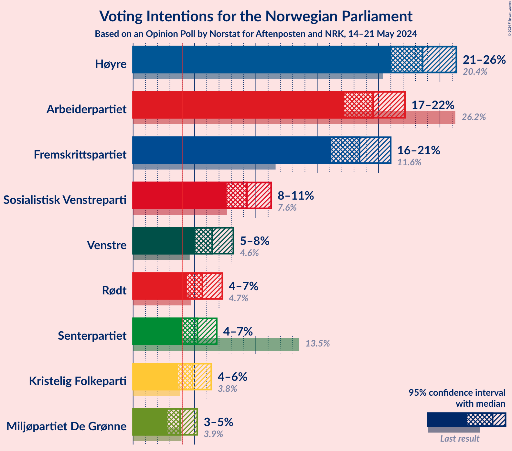

### Confidence Intervals

| Party | Last Result | Poll Result | 80% Confidence Interval | 90% Confidence Interval | 95% Confidence Interval | 99% Confidence Interval |
|:-----:|:-----------:|:-----------:|:-----------------------:|:-----------------------:|:-----------------------:|:-----------------------:|
| Høyre | 20.4% | 23.6% | 21.9–25.4% |21.4–25.9% |21.0–26.3% |20.3–27.2% |
| Arbeiderpartiet | 26.2% | 19.6% | 18.0–21.2% |17.6–21.7% |17.2–22.1% |16.5–23.0% |
| Fremskrittspartiet | 11.6% | 18.4% | 16.9–20.1% |16.5–20.6% |16.2–21.0% |15.5–21.8% |
| Sosialistisk Venstreparti | 7.6% | 9.3% | 8.2–10.6% |7.9–10.9% |7.6–11.2% |7.1–11.9% |
| Venstre | 4.6% | 6.5% | 5.5–7.6% |5.3–7.9% |5.1–8.2% |4.7–8.7% |
| Rødt | 4.7% | 5.6% | 4.8–6.7% |4.6–7.0% |4.4–7.3% |4.0–7.8% |
| Senterpartiet | 13.5% | 5.2% | 4.4–6.3% |4.2–6.6% |4.0–6.8% |3.7–7.3% |
| Kristelig Folkeparti | 3.8% | 4.8% | 4.1–5.8% |3.8–6.1% |3.7–6.4% |3.3–6.9% |
| Miljøpartiet De Grønne | 3.9% | 3.8% | 3.2–4.7% |3.0–5.0% |2.8–5.2% |2.5–5.7% |

*Note:* The poll result column reflects the actual value used in the calculations. Published results may vary slightly, and in addition be rounded to fewer digits.

## Seats

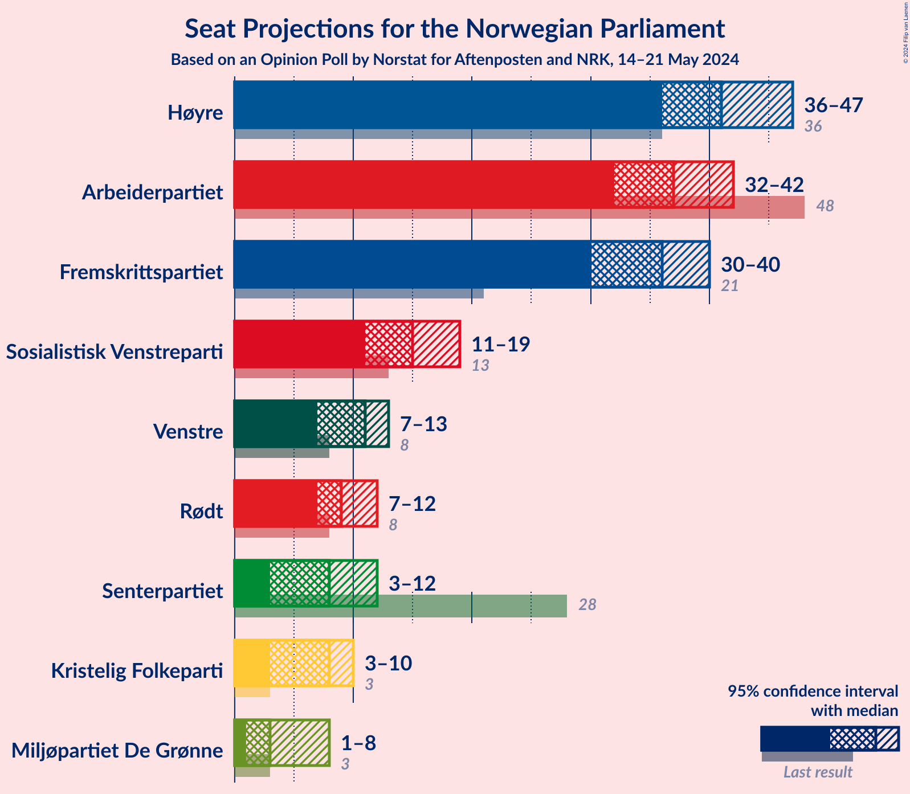

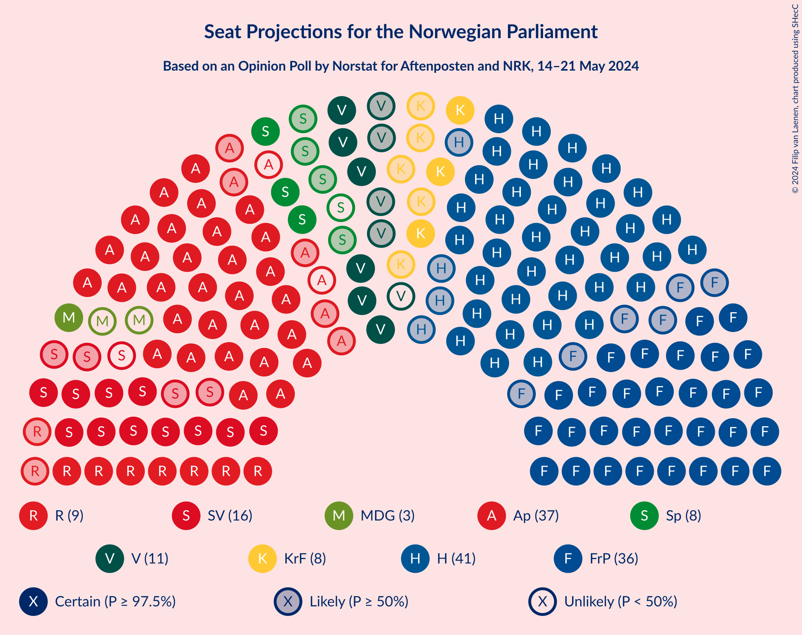

### Confidence Intervals

| Party | Last Result | Median | 80% Confidence Interval | 90% Confidence Interval | 95% Confidence Interval | 99% Confidence Interval |
|:-----:|:-----------:|:------:|:-----------------------:|:-----------------------:|:-----------------------:|:-----------------------:|
| <a href="#høyre">Høyre</a> | 36 | 41 | 39–44 |37–47 |36–47 |34–49 |
| <a href="#arbeiderpartiet">Arbeiderpartiet</a> | 48 | 37 | 33–40 |33–41 |32–42 |31–44 |
| <a href="#fremskrittspartiet">Fremskrittspartiet</a> | 21 | 36 | 32–38 |31–39 |30–40 |28–41 |
| <a href="#sosialistisk-venstreparti">Sosialistisk Venstreparti</a> | 13 | 15 | 12–17 |12–18 |11–19 |10–20 |
| <a href="#venstre">Venstre</a> | 8 | 11 | 8–12 |8–13 |7–13 |7–14 |
| <a href="#rødt">Rødt</a> | 8 | 9 | 7–11 |7–12 |7–12 |6–13 |
| <a href="#senterpartiet">Senterpartiet</a> | 28 | 8 | 7–10 |6–11 |3–12 |1–13 |
| <a href="#kristelig-folkeparti">Kristelig Folkeparti</a> | 3 | 8 | 6–9 |3–10 |3–10 |2–11 |
| <a href="#miljøpartiet-de-grønne">Miljøpartiet De Grønne</a> | 3 | 3 | 2–7 |1–8 |1–8 |1–9 |

### Høyre

*For a full overview of the results for this party, see the [Høyre](party-høyre.html) page.*

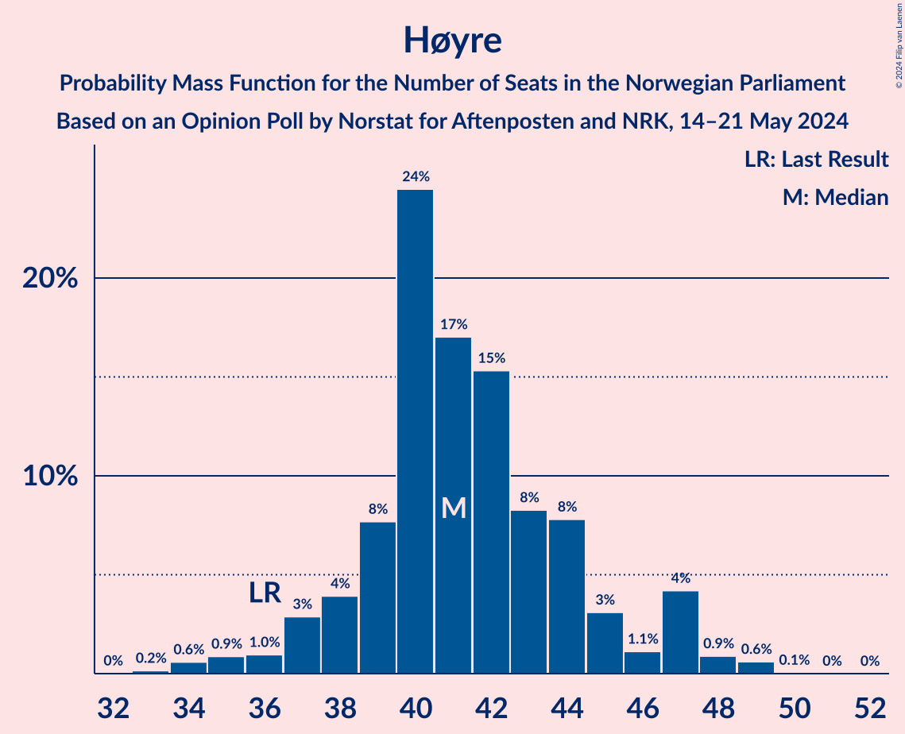

| Number of Seats | Probability | Accumulated | Special Marks |
|:---------------:|:-----------:|:-----------:|:-------------:|
| 33 | 0.2% | 100% |  |
| 34 | 0.6% | 99.8% |  |
| 35 | 0.9% | 99.2% |  |
| 36 | 1.0% | 98% | Last Result |
| 37 | 3% | 97% |  |
| 38 | 4% | 95% |  |
| 39 | 8% | 91% |  |
| 40 | 24% | 83% |  |
| 41 | 17% | 58% | Median |
| 42 | 15% | 41% |  |
| 43 | 8% | 26% |  |
| 44 | 8% | 18% |  |
| 45 | 3% | 10% |  |
| 46 | 1.1% | 7% |  |
| 47 | 4% | 6% |  |
| 48 | 0.9% | 2% |  |
| 49 | 0.6% | 0.7% |  |
| 50 | 0.1% | 0.1% |  |
| 51 | 0% | 0% |  |

### Arbeiderpartiet

*For a full overview of the results for this party, see the [Arbeiderpartiet](party-arbeiderpartiet.html) page.*

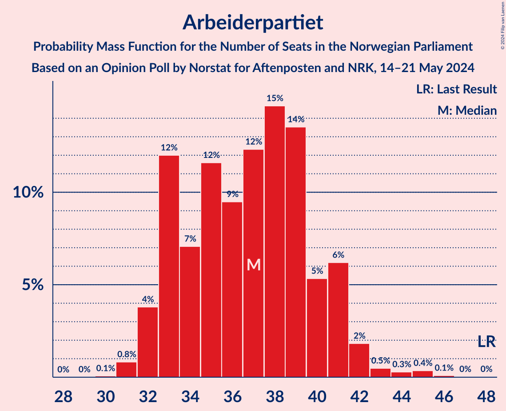

| Number of Seats | Probability | Accumulated | Special Marks |
|:---------------:|:-----------:|:-----------:|:-------------:|
| 30 | 0.1% | 100% |  |
| 31 | 0.8% | 99.9% |  |
| 32 | 4% | 99.1% |  |
| 33 | 12% | 95% |  |
| 34 | 7% | 83% |  |
| 35 | 12% | 76% |  |
| 36 | 9% | 65% |  |
| 37 | 12% | 55% | Median |
| 38 | 15% | 43% |  |
| 39 | 14% | 28% |  |
| 40 | 5% | 15% |  |
| 41 | 6% | 9% |  |
| 42 | 2% | 3% |  |
| 43 | 0.5% | 1.3% |  |
| 44 | 0.3% | 0.8% |  |
| 45 | 0.4% | 0.5% |  |
| 46 | 0.1% | 0.1% |  |
| 47 | 0% | 0.1% |  |
| 48 | 0% | 0% | Last Result |

### Fremskrittspartiet

*For a full overview of the results for this party, see the [Fremskrittspartiet](party-fremskrittspartiet.html) page.*

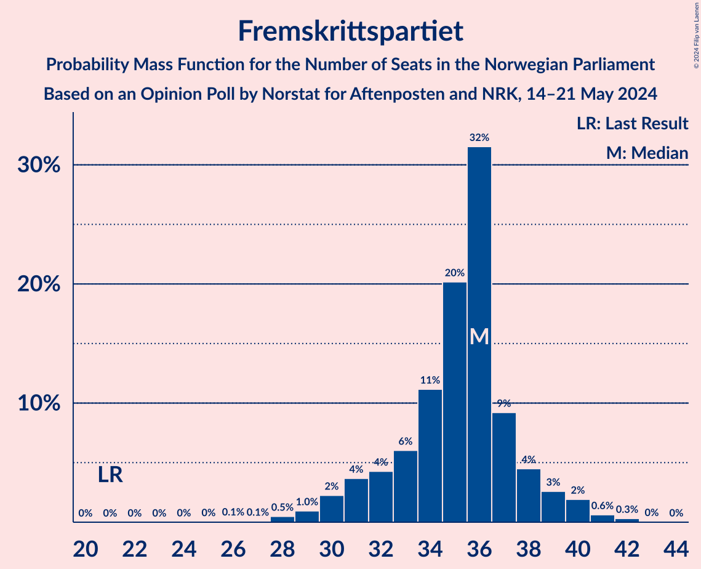

| Number of Seats | Probability | Accumulated | Special Marks |
|:---------------:|:-----------:|:-----------:|:-------------:|
| 21 | 0% | 100% | Last Result |
| 22 | 0% | 100% |  |
| 23 | 0% | 100% |  |
| 24 | 0% | 100% |  |
| 25 | 0% | 100% |  |
| 26 | 0.1% | 99.9% |  |
| 27 | 0.1% | 99.9% |  |
| 28 | 0.5% | 99.8% |  |
| 29 | 1.0% | 99.3% |  |
| 30 | 2% | 98% |  |
| 31 | 4% | 96% |  |
| 32 | 4% | 92% |  |
| 33 | 6% | 88% |  |
| 34 | 11% | 82% |  |
| 35 | 20% | 71% |  |
| 36 | 32% | 51% | Median |
| 37 | 9% | 19% |  |
| 38 | 4% | 10% |  |
| 39 | 3% | 6% |  |
| 40 | 2% | 3% |  |
| 41 | 0.6% | 1.0% |  |
| 42 | 0.3% | 0.4% |  |
| 43 | 0% | 0.1% |  |
| 44 | 0% | 0% |  |

### Sosialistisk Venstreparti

*For a full overview of the results for this party, see the [Sosialistisk Venstreparti](party-sosialistiskvenstreparti.html) page.*

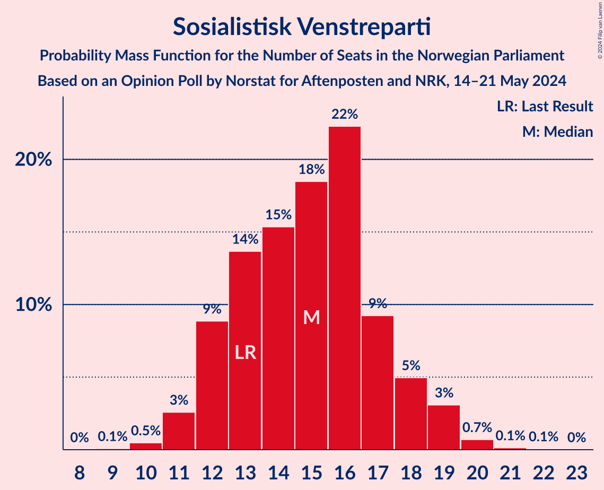

| Number of Seats | Probability | Accumulated | Special Marks |
|:---------------:|:-----------:|:-----------:|:-------------:|
| 9 | 0.1% | 100% |  |
| 10 | 0.5% | 99.9% |  |
| 11 | 3% | 99.4% |  |
| 12 | 9% | 97% |  |
| 13 | 14% | 88% | Last Result |
| 14 | 15% | 74% |  |
| 15 | 18% | 59% | Median |
| 16 | 22% | 40% |  |
| 17 | 9% | 18% |  |
| 18 | 5% | 9% |  |
| 19 | 3% | 4% |  |
| 20 | 0.7% | 0.9% |  |
| 21 | 0.1% | 0.2% |  |
| 22 | 0.1% | 0.1% |  |
| 23 | 0% | 0% |  |

### Venstre

*For a full overview of the results for this party, see the [Venstre](party-venstre.html) page.*

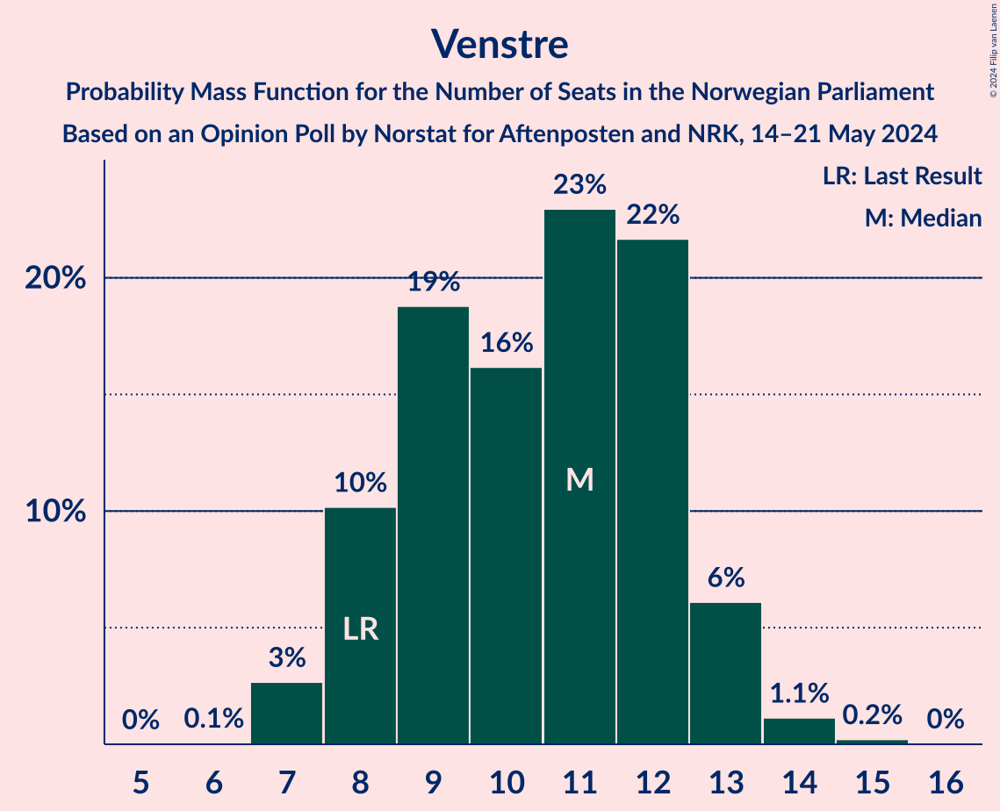

| Number of Seats | Probability | Accumulated | Special Marks |
|:---------------:|:-----------:|:-----------:|:-------------:|
| 6 | 0.1% | 100% |  |
| 7 | 3% | 99.9% |  |
| 8 | 10% | 97% | Last Result |
| 9 | 19% | 87% |  |
| 10 | 16% | 68% |  |
| 11 | 23% | 52% | Median |
| 12 | 22% | 29% |  |
| 13 | 6% | 7% |  |
| 14 | 1.1% | 1.4% |  |
| 15 | 0.2% | 0.3% |  |
| 16 | 0% | 0% |  |

### Rødt

*For a full overview of the results for this party, see the [Rødt](party-rødt.html) page.*

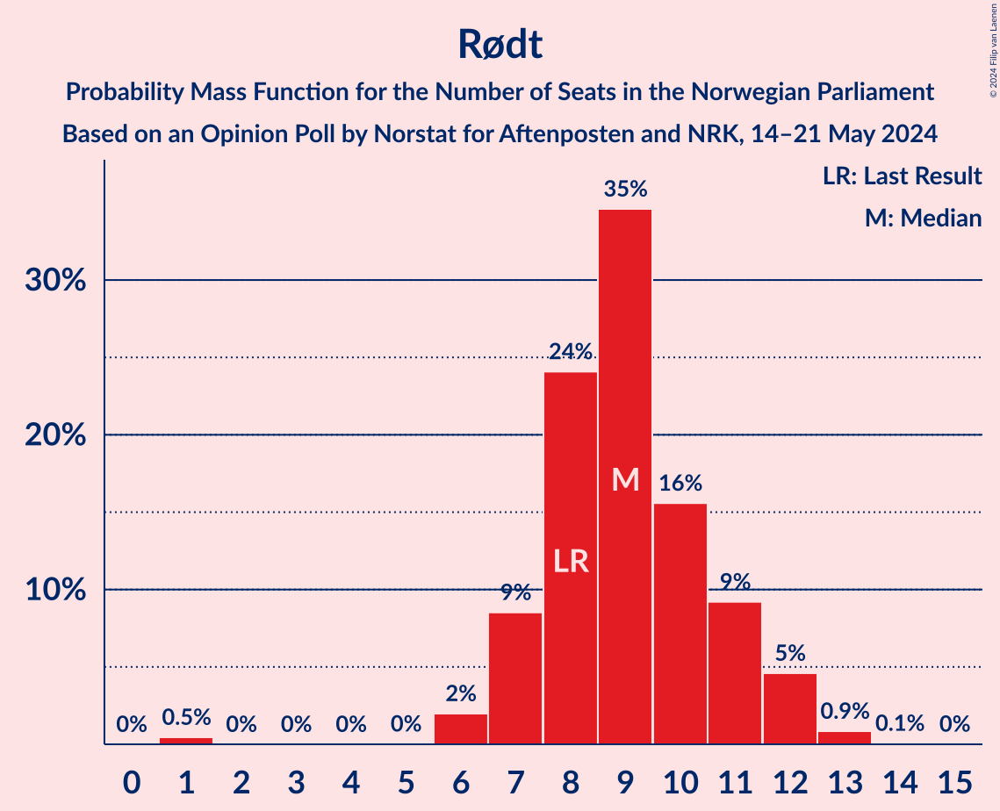

| Number of Seats | Probability | Accumulated | Special Marks |
|:---------------:|:-----------:|:-----------:|:-------------:|
| 1 | 0.5% | 100% |  |
| 2 | 0% | 99.5% |  |
| 3 | 0% | 99.5% |  |
| 4 | 0% | 99.5% |  |
| 5 | 0% | 99.5% |  |
| 6 | 2% | 99.5% |  |
| 7 | 9% | 98% |  |
| 8 | 24% | 89% | Last Result |
| 9 | 35% | 65% | Median |
| 10 | 16% | 30% |  |
| 11 | 9% | 15% |  |
| 12 | 5% | 6% |  |
| 13 | 0.9% | 0.9% |  |
| 14 | 0.1% | 0.1% |  |
| 15 | 0% | 0% |  |

### Senterpartiet

*For a full overview of the results for this party, see the [Senterpartiet](party-senterpartiet.html) page.*

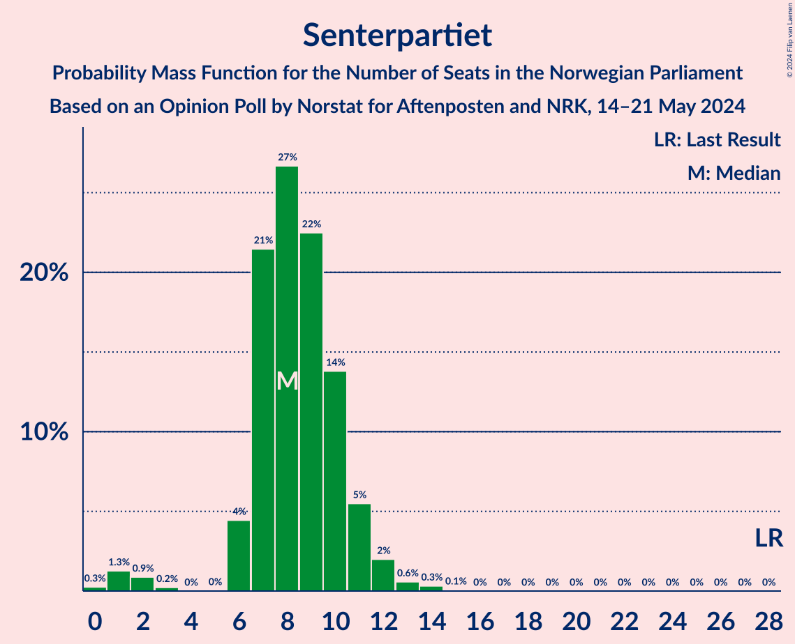

| Number of Seats | Probability | Accumulated | Special Marks |
|:---------------:|:-----------:|:-----------:|:-------------:|
| 0 | 0.3% | 100% |  |
| 1 | 1.3% | 99.7% |  |
| 2 | 0.9% | 98% |  |
| 3 | 0.2% | 98% |  |
| 4 | 0% | 97% |  |
| 5 | 0% | 97% |  |
| 6 | 4% | 97% |  |
| 7 | 21% | 93% |  |
| 8 | 27% | 71% | Median |
| 9 | 22% | 45% |  |
| 10 | 14% | 22% |  |
| 11 | 5% | 8% |  |
| 12 | 2% | 3% |  |
| 13 | 0.6% | 1.0% |  |
| 14 | 0.3% | 0.4% |  |
| 15 | 0.1% | 0.1% |  |
| 16 | 0% | 0% |  |
| 17 | 0% | 0% |  |
| 18 | 0% | 0% |  |
| 19 | 0% | 0% |  |
| 20 | 0% | 0% |  |
| 21 | 0% | 0% |  |
| 22 | 0% | 0% |  |
| 23 | 0% | 0% |  |
| 24 | 0% | 0% |  |
| 25 | 0% | 0% |  |
| 26 | 0% | 0% |  |
| 27 | 0% | 0% |  |
| 28 | 0% | 0% | Last Result |

### Kristelig Folkeparti

*For a full overview of the results for this party, see the [Kristelig Folkeparti](party-kristeligfolkeparti.html) page.*

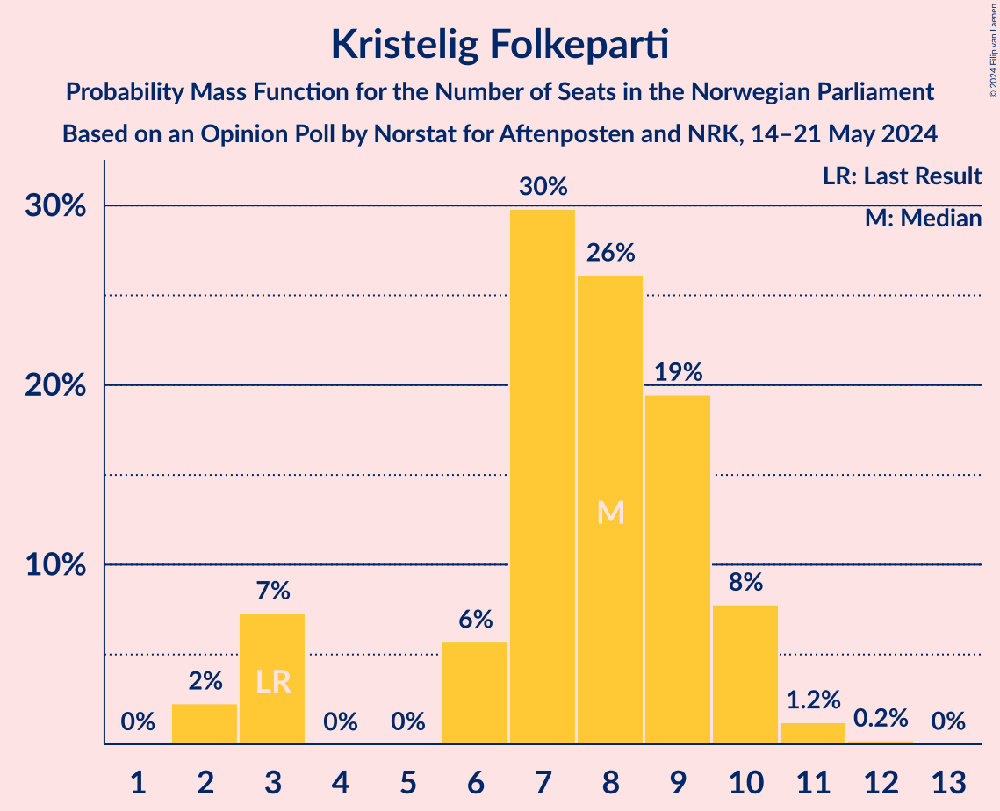

| Number of Seats | Probability | Accumulated | Special Marks |
|:---------------:|:-----------:|:-----------:|:-------------:|
| 2 | 2% | 100% |  |
| 3 | 7% | 98% | Last Result |
| 4 | 0% | 90% |  |
| 5 | 0% | 90% |  |
| 6 | 6% | 90% |  |
| 7 | 30% | 85% |  |
| 8 | 26% | 55% | Median |
| 9 | 19% | 29% |  |
| 10 | 8% | 9% |  |
| 11 | 1.2% | 1.5% |  |
| 12 | 0.2% | 0.3% |  |
| 13 | 0% | 0% |  |

### Miljøpartiet De Grønne

*For a full overview of the results for this party, see the [Miljøpartiet De Grønne](party-miljøpartietdegrønne.html) page.*

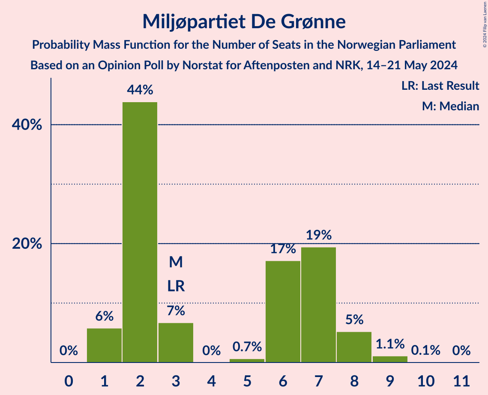

| Number of Seats | Probability | Accumulated | Special Marks |
|:---------------:|:-----------:|:-----------:|:-------------:|
| 1 | 6% | 100% |  |
| 2 | 44% | 94% |  |
| 3 | 7% | 50% | Last Result, Median |
| 4 | 0% | 44% |  |
| 5 | 0.7% | 44% |  |
| 6 | 17% | 43% |  |
| 7 | 19% | 26% |  |
| 8 | 5% | 6% |  |
| 9 | 1.1% | 1.2% |  |
| 10 | 0.1% | 0.1% |  |
| 11 | 0% | 0% |  |

## Coalitions

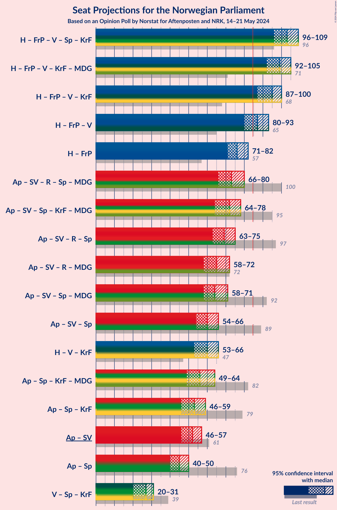

### Confidence Intervals

| Coalition | Last Result | Median | Majority? | 80% Confidence Interval | 90% Confidence Interval | 95% Confidence Interval | 99% Confidence Interval |
|:---------:|:-----------:|:------:|:---------:|:-----------------------:|:-----------------------:|:-----------------------:|:-----------------------:|
| Høyre – Fremskrittspartiet – Venstre – Senterpartiet – Kristelig Folkeparti | 96 | 103 | 100% | 97–107 | 96–108 | 96–109 | 94–111 |
| Høyre – Fremskrittspartiet – Venstre – Kristelig Folkeparti – Miljøpartiet De Grønne | 71 | 99 | 100% | 94–103 | 93–104 | 92–105 | 90–107 |
| Høyre – Fremskrittspartiet – Venstre – Kristelig Folkeparti | 68 | 95 | 99.8% | 89–98 | 88–99 | 87–100 | 86–103 |
| Høyre – Fremskrittspartiet – Venstre | 65 | 87 | 78% | 83–91 | 82–92 | 80–93 | 78–95 |
| Høyre – Fremskrittspartiet | 57 | 76 | 0.5% | 73–80 | 71–81 | 71–82 | 68–84 |
| Arbeiderpartiet – Sosialistisk Venstreparti – Rødt – Senterpartiet – Miljøpartiet De Grønne | 100 | 73 | 0.1% | 69–78 | 68–79 | 66–80 | 64–82 |
| Arbeiderpartiet – Sosialistisk Venstreparti – Senterpartiet – Kristelig Folkeparti – Miljøpartiet De Grønne | 95 | 72 | 0% | 67–76 | 66–77 | 64–78 | 62–81 |
| Arbeiderpartiet – Sosialistisk Venstreparti – Rødt – Senterpartiet | 97 | 69 | 0% | 65–73 | 64–75 | 63–75 | 60–78 |
| Arbeiderpartiet – Sosialistisk Venstreparti – Rødt – Miljøpartiet De Grønne | 72 | 65 | 0% | 61–70 | 59–71 | 58–72 | 56–73 |
| Arbeiderpartiet – Sosialistisk Venstreparti – Senterpartiet – Miljøpartiet De Grønne | 92 | 64 | 0% | 60–69 | 59–70 | 58–71 | 55–73 |
| Arbeiderpartiet – Sosialistisk Venstreparti – Senterpartiet | 89 | 60 | 0% | 56–64 | 55–65 | 54–66 | 52–68 |
| Høyre – Venstre – Kristelig Folkeparti | 47 | 60 | 0% | 55–63 | 54–64 | 53–66 | 51–68 |
| Arbeiderpartiet – Senterpartiet – Kristelig Folkeparti – Miljøpartiet De Grønne | 82 | 56 | 0% | 52–61 | 51–62 | 49–64 | 46–65 |
| Arbeiderpartiet – Senterpartiet – Kristelig Folkeparti | 79 | 53 | 0% | 48–57 | 47–58 | 46–59 | 44–60 |
| Arbeiderpartiet – Sosialistisk Venstreparti | 61 | 52 | 0% | 48–55 | 47–56 | 46–57 | 45–59 |
| Arbeiderpartiet – Senterpartiet | 76 | 45 | 0% | 41–49 | 41–50 | 40–50 | 37–53 |
| Venstre – Senterpartiet – Kristelig Folkeparti | 39 | 27 | 0% | 22–30 | 21–31 | 20–31 | 19–33 |

### Høyre – Fremskrittspartiet – Venstre – Senterpartiet – Kristelig Folkeparti

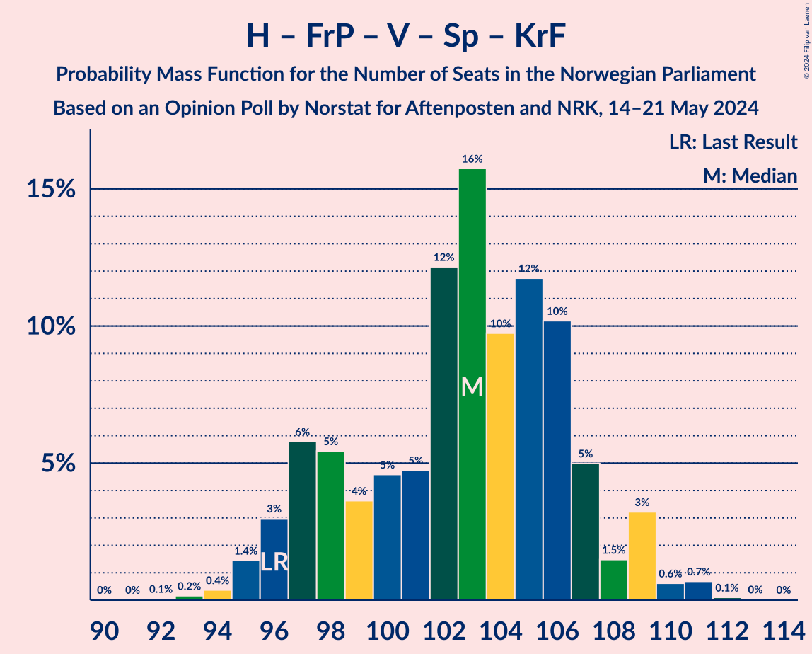

| Number of Seats | Probability | Accumulated | Special Marks |
|:---------------:|:-----------:|:-----------:|:-------------:|
| 91 | 0% | 100% |  |
| 92 | 0.1% | 99.9% |  |
| 93 | 0.2% | 99.9% |  |
| 94 | 0.4% | 99.7% |  |
| 95 | 1.4% | 99.4% |  |
| 96 | 3% | 98% | Last Result |
| 97 | 6% | 95% |  |
| 98 | 5% | 89% |  |
| 99 | 4% | 84% |  |
| 100 | 5% | 80% |  |
| 101 | 5% | 75% |  |
| 102 | 12% | 71% |  |
| 103 | 16% | 59% |  |
| 104 | 10% | 43% | Median |
| 105 | 12% | 33% |  |
| 106 | 10% | 21% |  |
| 107 | 5% | 11% |  |
| 108 | 1.5% | 6% |  |
| 109 | 3% | 5% |  |
| 110 | 0.6% | 1.5% |  |
| 111 | 0.7% | 0.9% |  |
| 112 | 0.1% | 0.2% |  |
| 113 | 0% | 0.1% |  |
| 114 | 0% | 0% |  |

### Høyre – Fremskrittspartiet – Venstre – Kristelig Folkeparti – Miljøpartiet De Grønne

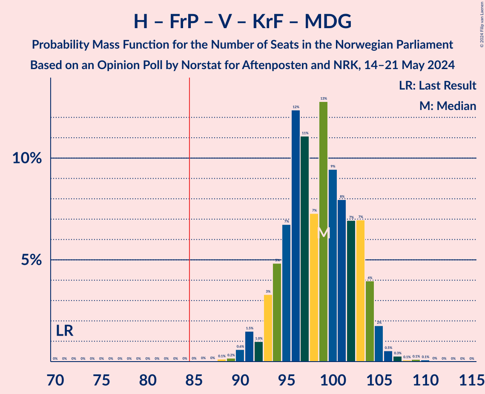

| Number of Seats | Probability | Accumulated | Special Marks |
|:---------------:|:-----------:|:-----------:|:-------------:|
| 71 | 0% | 100% | Last Result |
| 72 | 0% | 100% |  |
| 73 | 0% | 100% |  |
| 74 | 0% | 100% |  |
| 75 | 0% | 100% |  |
| 76 | 0% | 100% |  |
| 77 | 0% | 100% |  |
| 78 | 0% | 100% |  |
| 79 | 0% | 100% |  |
| 80 | 0% | 100% |  |
| 81 | 0% | 100% |  |
| 82 | 0% | 100% |  |
| 83 | 0% | 100% |  |
| 84 | 0% | 100% |  |
| 85 | 0% | 100% | Majority |
| 86 | 0% | 100% |  |
| 87 | 0% | 100% |  |
| 88 | 0.1% | 99.9% |  |
| 89 | 0.2% | 99.8% |  |
| 90 | 0.6% | 99.6% |  |
| 91 | 1.5% | 99.0% |  |
| 92 | 1.0% | 98% |  |
| 93 | 3% | 97% |  |
| 94 | 5% | 93% |  |
| 95 | 7% | 88% |  |
| 96 | 12% | 82% |  |
| 97 | 11% | 69% |  |
| 98 | 7% | 58% |  |
| 99 | 13% | 51% | Median |
| 100 | 9% | 38% |  |
| 101 | 8% | 29% |  |
| 102 | 7% | 21% |  |
| 103 | 7% | 14% |  |
| 104 | 4% | 7% |  |
| 105 | 2% | 3% |  |
| 106 | 0.5% | 1.1% |  |
| 107 | 0.3% | 0.6% |  |
| 108 | 0.1% | 0.3% |  |
| 109 | 0.1% | 0.2% |  |
| 110 | 0.1% | 0.1% |  |
| 111 | 0% | 0% |  |

### Høyre – Fremskrittspartiet – Venstre – Kristelig Folkeparti

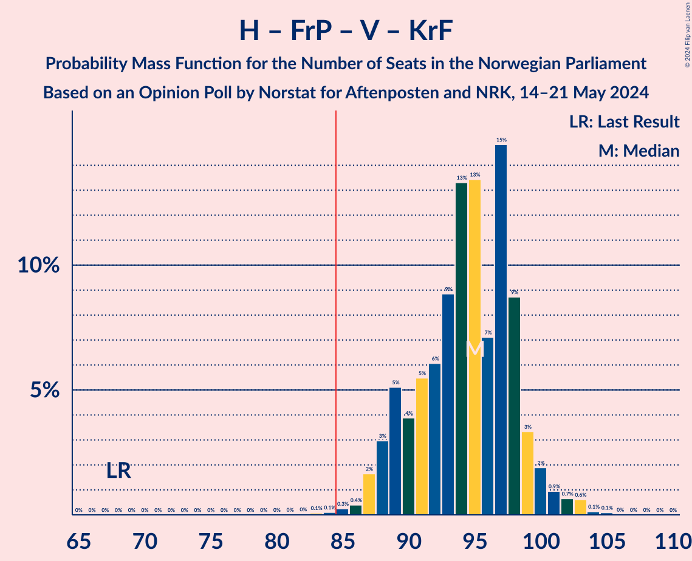

| Number of Seats | Probability | Accumulated | Special Marks |
|:---------------:|:-----------:|:-----------:|:-------------:|
| 68 | 0% | 100% | Last Result |
| 69 | 0% | 100% |  |
| 70 | 0% | 100% |  |
| 71 | 0% | 100% |  |
| 72 | 0% | 100% |  |
| 73 | 0% | 100% |  |
| 74 | 0% | 100% |  |
| 75 | 0% | 100% |  |
| 76 | 0% | 100% |  |
| 77 | 0% | 100% |  |
| 78 | 0% | 100% |  |
| 79 | 0% | 100% |  |
| 80 | 0% | 100% |  |
| 81 | 0% | 100% |  |
| 82 | 0% | 100% |  |
| 83 | 0.1% | 100% |  |
| 84 | 0.1% | 99.9% |  |
| 85 | 0.3% | 99.8% | Majority |
| 86 | 0.4% | 99.5% |  |
| 87 | 2% | 99.1% |  |
| 88 | 3% | 97% |  |
| 89 | 5% | 95% |  |
| 90 | 4% | 89% |  |
| 91 | 5% | 86% |  |
| 92 | 6% | 80% |  |
| 93 | 9% | 74% |  |
| 94 | 13% | 65% |  |
| 95 | 13% | 52% |  |
| 96 | 7% | 38% | Median |
| 97 | 15% | 31% |  |
| 98 | 9% | 16% |  |
| 99 | 3% | 8% |  |
| 100 | 2% | 4% |  |
| 101 | 0.9% | 2% |  |
| 102 | 0.7% | 2% |  |
| 103 | 0.6% | 0.9% |  |
| 104 | 0.1% | 0.3% |  |
| 105 | 0.1% | 0.1% |  |
| 106 | 0% | 0% |  |

### Høyre – Fremskrittspartiet – Venstre

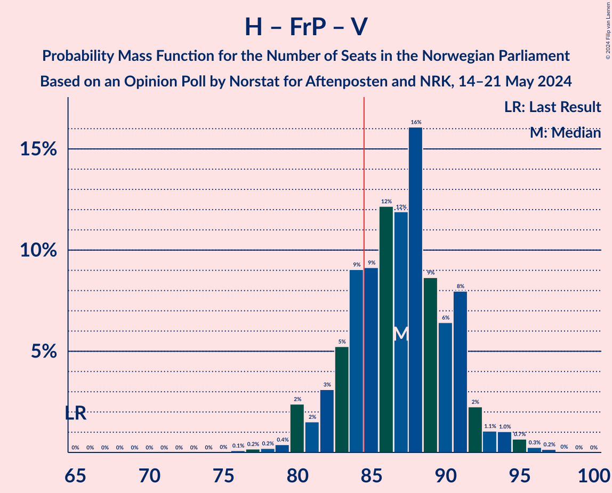

| Number of Seats | Probability | Accumulated | Special Marks |
|:---------------:|:-----------:|:-----------:|:-------------:|
| 65 | 0% | 100% | Last Result |
| 66 | 0% | 100% |  |
| 67 | 0% | 100% |  |
| 68 | 0% | 100% |  |
| 69 | 0% | 100% |  |
| 70 | 0% | 100% |  |
| 71 | 0% | 100% |  |
| 72 | 0% | 100% |  |
| 73 | 0% | 100% |  |
| 74 | 0% | 100% |  |
| 75 | 0% | 100% |  |
| 76 | 0.1% | 100% |  |
| 77 | 0.2% | 99.9% |  |
| 78 | 0.2% | 99.7% |  |
| 79 | 0.4% | 99.5% |  |
| 80 | 2% | 99.1% |  |
| 81 | 2% | 97% |  |
| 82 | 3% | 95% |  |
| 83 | 5% | 92% |  |
| 84 | 9% | 87% |  |
| 85 | 9% | 78% | Majority |
| 86 | 12% | 69% |  |
| 87 | 12% | 57% |  |
| 88 | 16% | 45% | Median |
| 89 | 9% | 29% |  |
| 90 | 6% | 20% |  |
| 91 | 8% | 13% |  |
| 92 | 2% | 5% |  |
| 93 | 1.1% | 3% |  |
| 94 | 1.0% | 2% |  |
| 95 | 0.7% | 1.1% |  |
| 96 | 0.3% | 0.5% |  |
| 97 | 0.2% | 0.2% |  |
| 98 | 0% | 0.1% |  |
| 99 | 0% | 0% |  |

### Høyre – Fremskrittspartiet

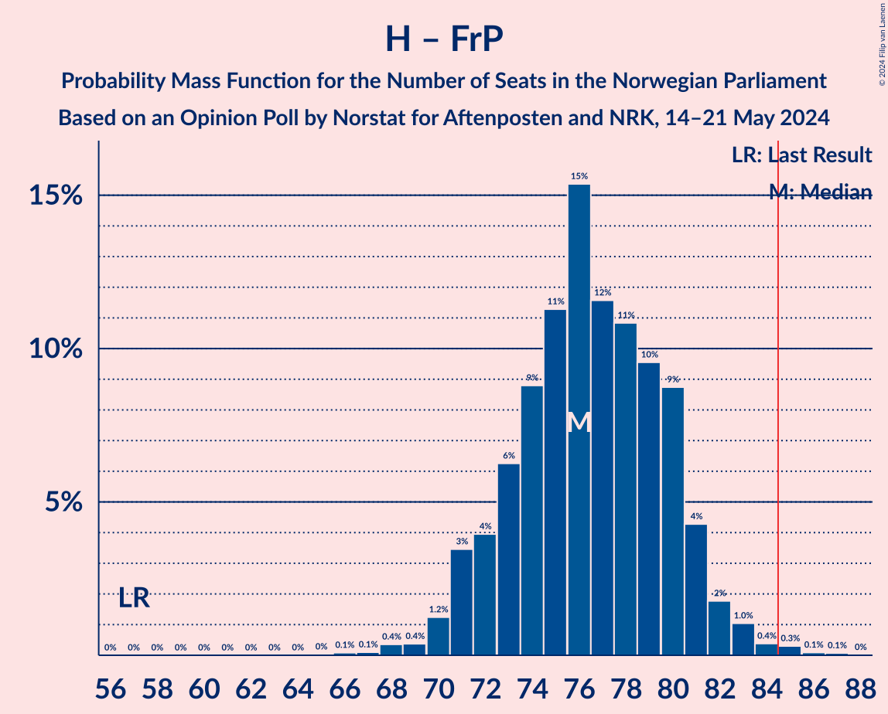

| Number of Seats | Probability | Accumulated | Special Marks |
|:---------------:|:-----------:|:-----------:|:-------------:|
| 57 | 0% | 100% | Last Result |
| 58 | 0% | 100% |  |
| 59 | 0% | 100% |  |
| 60 | 0% | 100% |  |
| 61 | 0% | 100% |  |
| 62 | 0% | 100% |  |
| 63 | 0% | 100% |  |
| 64 | 0% | 100% |  |
| 65 | 0% | 100% |  |
| 66 | 0.1% | 100% |  |
| 67 | 0.1% | 99.9% |  |
| 68 | 0.4% | 99.8% |  |
| 69 | 0.4% | 99.4% |  |
| 70 | 1.2% | 99.0% |  |
| 71 | 3% | 98% |  |
| 72 | 4% | 94% |  |
| 73 | 6% | 90% |  |
| 74 | 9% | 84% |  |
| 75 | 11% | 75% |  |
| 76 | 15% | 64% |  |
| 77 | 12% | 49% | Median |
| 78 | 11% | 37% |  |
| 79 | 10% | 26% |  |
| 80 | 9% | 17% |  |
| 81 | 4% | 8% |  |
| 82 | 2% | 4% |  |
| 83 | 1.0% | 2% |  |
| 84 | 0.4% | 0.9% |  |
| 85 | 0.3% | 0.5% | Majority |
| 86 | 0.1% | 0.2% |  |
| 87 | 0.1% | 0.1% |  |
| 88 | 0% | 0% |  |

### Arbeiderpartiet – Sosialistisk Venstreparti – Rødt – Senterpartiet – Miljøpartiet De Grønne

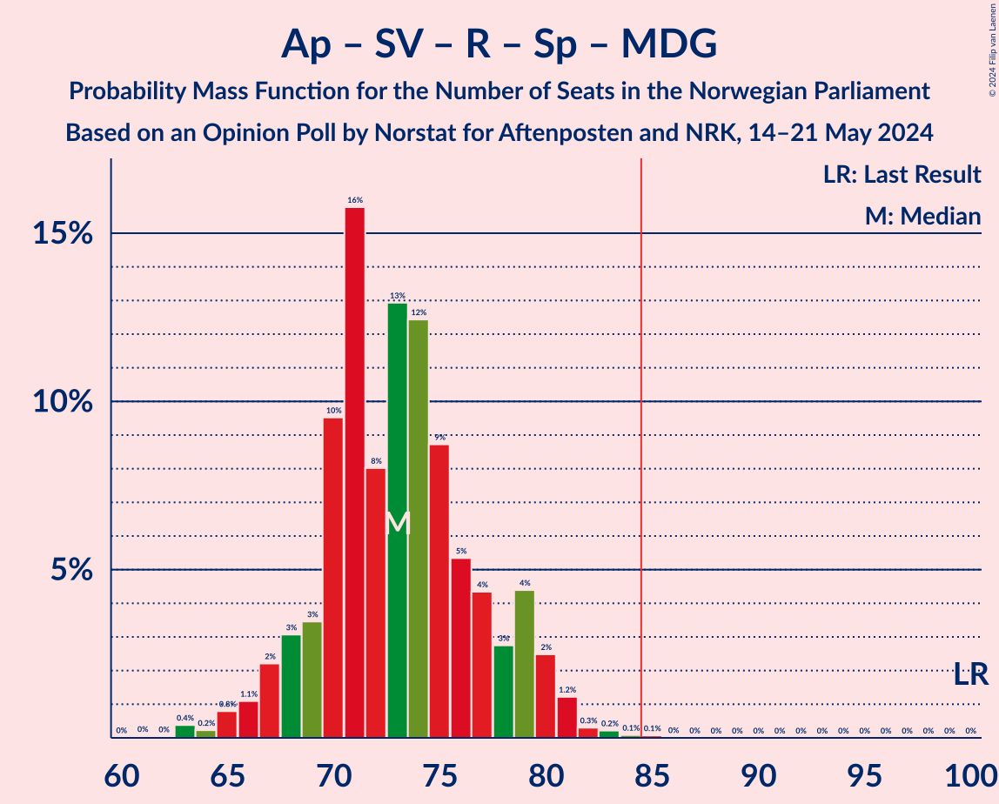

| Number of Seats | Probability | Accumulated | Special Marks |
|:---------------:|:-----------:|:-----------:|:-------------:|
| 61 | 0% | 100% |  |
| 62 | 0% | 99.9% |  |
| 63 | 0.4% | 99.9% |  |
| 64 | 0.2% | 99.5% |  |
| 65 | 0.8% | 99.3% |  |
| 66 | 1.1% | 98% |  |
| 67 | 2% | 97% |  |
| 68 | 3% | 95% |  |
| 69 | 3% | 92% |  |
| 70 | 10% | 89% |  |
| 71 | 16% | 79% |  |
| 72 | 8% | 63% | Median |
| 73 | 13% | 55% |  |
| 74 | 12% | 42% |  |
| 75 | 9% | 30% |  |
| 76 | 5% | 21% |  |
| 77 | 4% | 16% |  |
| 78 | 3% | 12% |  |
| 79 | 4% | 9% |  |
| 80 | 2% | 4% |  |
| 81 | 1.2% | 2% |  |
| 82 | 0.3% | 0.7% |  |
| 83 | 0.2% | 0.4% |  |
| 84 | 0.1% | 0.2% |  |
| 85 | 0.1% | 0.1% | Majority |
| 86 | 0% | 0% |  |
| 87 | 0% | 0% |  |
| 88 | 0% | 0% |  |
| 89 | 0% | 0% |  |
| 90 | 0% | 0% |  |
| 91 | 0% | 0% |  |
| 92 | 0% | 0% |  |
| 93 | 0% | 0% |  |
| 94 | 0% | 0% |  |
| 95 | 0% | 0% |  |
| 96 | 0% | 0% |  |
| 97 | 0% | 0% |  |
| 98 | 0% | 0% |  |
| 99 | 0% | 0% |  |
| 100 | 0% | 0% | Last Result |

### Arbeiderpartiet – Sosialistisk Venstreparti – Senterpartiet – Kristelig Folkeparti – Miljøpartiet De Grønne

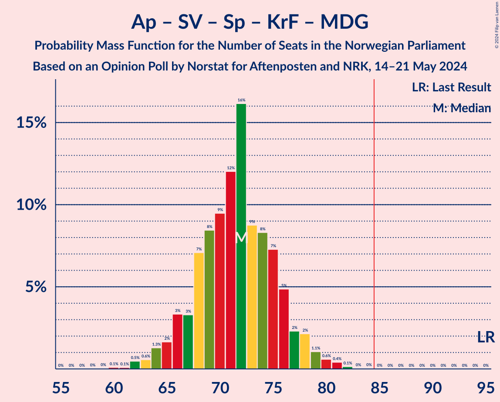

| Number of Seats | Probability | Accumulated | Special Marks |
|:---------------:|:-----------:|:-----------:|:-------------:|
| 59 | 0% | 100% |  |
| 60 | 0.1% | 99.9% |  |
| 61 | 0.1% | 99.8% |  |
| 62 | 0.5% | 99.7% |  |
| 63 | 0.6% | 99.3% |  |
| 64 | 1.3% | 98.7% |  |
| 65 | 2% | 97% |  |
| 66 | 3% | 96% |  |
| 67 | 3% | 92% |  |
| 68 | 7% | 89% |  |
| 69 | 8% | 82% |  |
| 70 | 9% | 74% |  |
| 71 | 12% | 64% | Median |
| 72 | 16% | 52% |  |
| 73 | 9% | 36% |  |
| 74 | 8% | 27% |  |
| 75 | 7% | 19% |  |
| 76 | 5% | 12% |  |
| 77 | 2% | 7% |  |
| 78 | 2% | 4% |  |
| 79 | 1.1% | 2% |  |
| 80 | 0.6% | 1.2% |  |
| 81 | 0.4% | 0.6% |  |
| 82 | 0.1% | 0.2% |  |
| 83 | 0% | 0.1% |  |
| 84 | 0% | 0% |  |
| 85 | 0% | 0% | Majority |
| 86 | 0% | 0% |  |
| 87 | 0% | 0% |  |
| 88 | 0% | 0% |  |
| 89 | 0% | 0% |  |
| 90 | 0% | 0% |  |
| 91 | 0% | 0% |  |
| 92 | 0% | 0% |  |
| 93 | 0% | 0% |  |
| 94 | 0% | 0% |  |
| 95 | 0% | 0% | Last Result |

### Arbeiderpartiet – Sosialistisk Venstreparti – Rødt – Senterpartiet

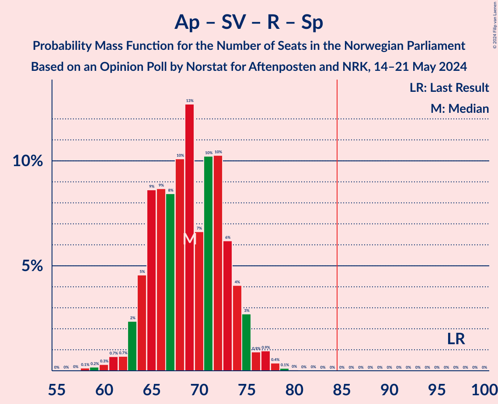

| Number of Seats | Probability | Accumulated | Special Marks |
|:---------------:|:-----------:|:-----------:|:-------------:|
| 58 | 0.1% | 100% |  |
| 59 | 0.2% | 99.8% |  |
| 60 | 0.3% | 99.6% |  |
| 61 | 0.7% | 99.3% |  |
| 62 | 0.7% | 98.7% |  |
| 63 | 2% | 98% |  |
| 64 | 5% | 96% |  |
| 65 | 9% | 91% |  |
| 66 | 9% | 82% |  |
| 67 | 8% | 74% |  |
| 68 | 10% | 65% |  |
| 69 | 13% | 55% | Median |
| 70 | 7% | 43% |  |
| 71 | 10% | 36% |  |
| 72 | 10% | 26% |  |
| 73 | 6% | 15% |  |
| 74 | 4% | 9% |  |
| 75 | 3% | 5% |  |
| 76 | 0.9% | 2% |  |
| 77 | 0.9% | 2% |  |
| 78 | 0.4% | 0.6% |  |
| 79 | 0.1% | 0.2% |  |
| 80 | 0% | 0.1% |  |
| 81 | 0% | 0.1% |  |
| 82 | 0% | 0% |  |
| 83 | 0% | 0% |  |
| 84 | 0% | 0% |  |
| 85 | 0% | 0% | Majority |
| 86 | 0% | 0% |  |
| 87 | 0% | 0% |  |
| 88 | 0% | 0% |  |
| 89 | 0% | 0% |  |
| 90 | 0% | 0% |  |
| 91 | 0% | 0% |  |
| 92 | 0% | 0% |  |
| 93 | 0% | 0% |  |
| 94 | 0% | 0% |  |
| 95 | 0% | 0% |  |
| 96 | 0% | 0% |  |
| 97 | 0% | 0% | Last Result |

### Arbeiderpartiet – Sosialistisk Venstreparti – Rødt – Miljøpartiet De Grønne

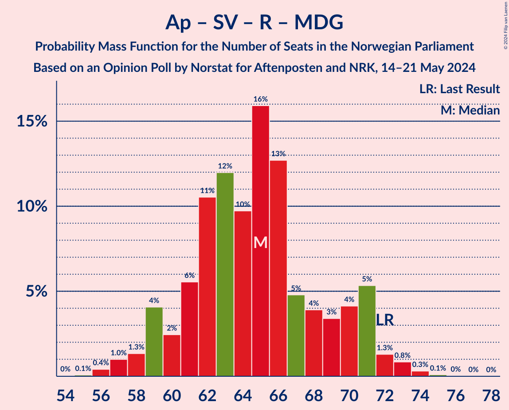

| Number of Seats | Probability | Accumulated | Special Marks |
|:---------------:|:-----------:|:-----------:|:-------------:|
| 54 | 0% | 100% |  |
| 55 | 0.1% | 99.9% |  |
| 56 | 0.4% | 99.8% |  |
| 57 | 1.0% | 99.4% |  |
| 58 | 1.3% | 98% |  |
| 59 | 4% | 97% |  |
| 60 | 2% | 93% |  |
| 61 | 6% | 91% |  |
| 62 | 11% | 85% |  |
| 63 | 12% | 74% |  |
| 64 | 10% | 63% | Median |
| 65 | 16% | 53% |  |
| 66 | 13% | 37% |  |
| 67 | 5% | 24% |  |
| 68 | 4% | 19% |  |
| 69 | 3% | 15% |  |
| 70 | 4% | 12% |  |
| 71 | 5% | 8% |  |
| 72 | 1.3% | 3% | Last Result |
| 73 | 0.8% | 1.3% |  |
| 74 | 0.3% | 0.5% |  |
| 75 | 0.1% | 0.2% |  |
| 76 | 0% | 0.1% |  |
| 77 | 0% | 0% |  |

### Arbeiderpartiet – Sosialistisk Venstreparti – Senterpartiet – Miljøpartiet De Grønne

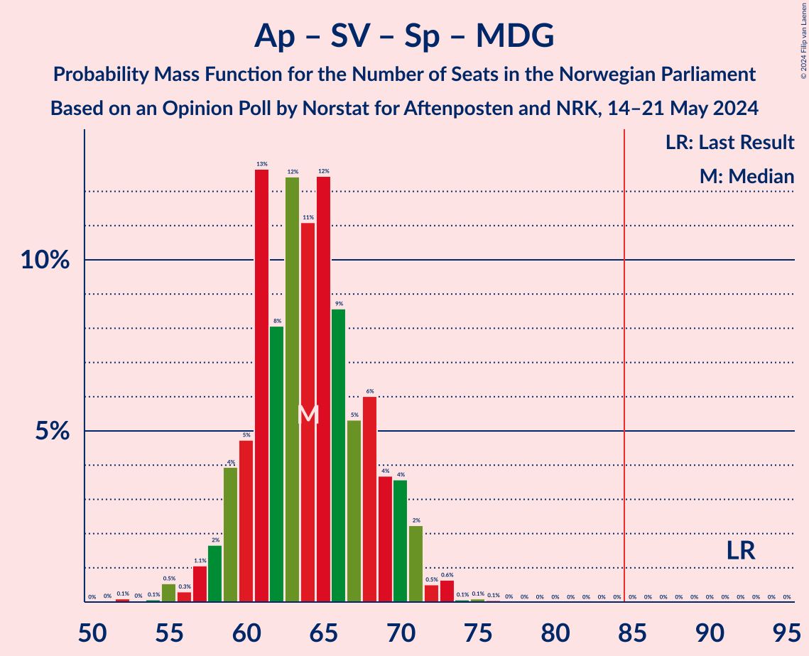

| Number of Seats | Probability | Accumulated | Special Marks |
|:---------------:|:-----------:|:-----------:|:-------------:|
| 52 | 0.1% | 100% |  |
| 53 | 0% | 99.9% |  |
| 54 | 0.1% | 99.8% |  |
| 55 | 0.5% | 99.8% |  |
| 56 | 0.3% | 99.2% |  |
| 57 | 1.1% | 98.9% |  |
| 58 | 2% | 98% |  |
| 59 | 4% | 96% |  |
| 60 | 5% | 92% |  |
| 61 | 13% | 88% |  |
| 62 | 8% | 75% |  |
| 63 | 12% | 67% | Median |
| 64 | 11% | 54% |  |
| 65 | 12% | 43% |  |
| 66 | 9% | 31% |  |
| 67 | 5% | 22% |  |
| 68 | 6% | 17% |  |
| 69 | 4% | 11% |  |
| 70 | 4% | 7% |  |
| 71 | 2% | 4% |  |
| 72 | 0.5% | 1.4% |  |
| 73 | 0.6% | 0.9% |  |
| 74 | 0.1% | 0.2% |  |
| 75 | 0.1% | 0.2% |  |
| 76 | 0.1% | 0.1% |  |
| 77 | 0% | 0% |  |
| 78 | 0% | 0% |  |
| 79 | 0% | 0% |  |
| 80 | 0% | 0% |  |
| 81 | 0% | 0% |  |
| 82 | 0% | 0% |  |
| 83 | 0% | 0% |  |
| 84 | 0% | 0% |  |
| 85 | 0% | 0% | Majority |
| 86 | 0% | 0% |  |
| 87 | 0% | 0% |  |
| 88 | 0% | 0% |  |
| 89 | 0% | 0% |  |
| 90 | 0% | 0% |  |
| 91 | 0% | 0% |  |
| 92 | 0% | 0% | Last Result |

### Arbeiderpartiet – Sosialistisk Venstreparti – Senterpartiet

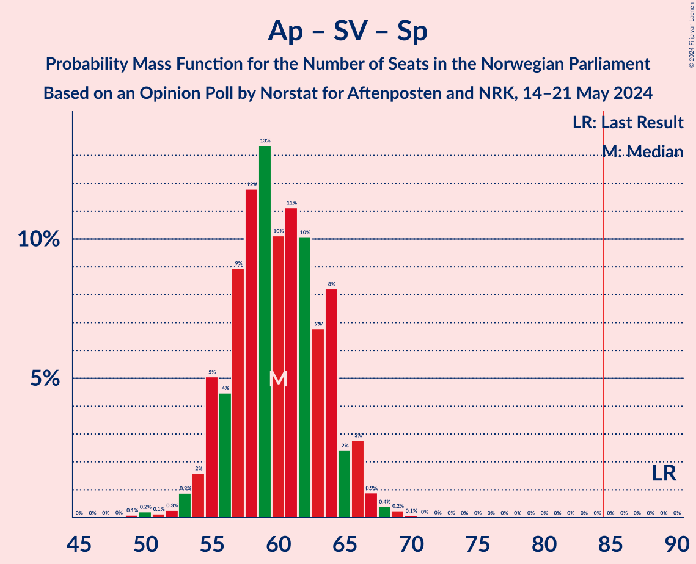

| Number of Seats | Probability | Accumulated | Special Marks |
|:---------------:|:-----------:|:-----------:|:-------------:|
| 49 | 0.1% | 100% |  |
| 50 | 0.2% | 99.9% |  |
| 51 | 0.1% | 99.7% |  |
| 52 | 0.3% | 99.5% |  |
| 53 | 0.9% | 99.3% |  |
| 54 | 2% | 98% |  |
| 55 | 5% | 97% |  |
| 56 | 4% | 92% |  |
| 57 | 9% | 87% |  |
| 58 | 12% | 78% |  |
| 59 | 13% | 67% |  |
| 60 | 10% | 53% | Median |
| 61 | 11% | 43% |  |
| 62 | 10% | 32% |  |
| 63 | 7% | 22% |  |
| 64 | 8% | 15% |  |
| 65 | 2% | 7% |  |
| 66 | 3% | 4% |  |
| 67 | 0.9% | 2% |  |
| 68 | 0.4% | 0.8% |  |
| 69 | 0.2% | 0.4% |  |
| 70 | 0.1% | 0.1% |  |
| 71 | 0% | 0% |  |
| 72 | 0% | 0% |  |
| 73 | 0% | 0% |  |
| 74 | 0% | 0% |  |
| 75 | 0% | 0% |  |
| 76 | 0% | 0% |  |
| 77 | 0% | 0% |  |
| 78 | 0% | 0% |  |
| 79 | 0% | 0% |  |
| 80 | 0% | 0% |  |
| 81 | 0% | 0% |  |
| 82 | 0% | 0% |  |
| 83 | 0% | 0% |  |
| 84 | 0% | 0% |  |
| 85 | 0% | 0% | Majority |
| 86 | 0% | 0% |  |
| 87 | 0% | 0% |  |
| 88 | 0% | 0% |  |
| 89 | 0% | 0% | Last Result |

### Høyre – Venstre – Kristelig Folkeparti

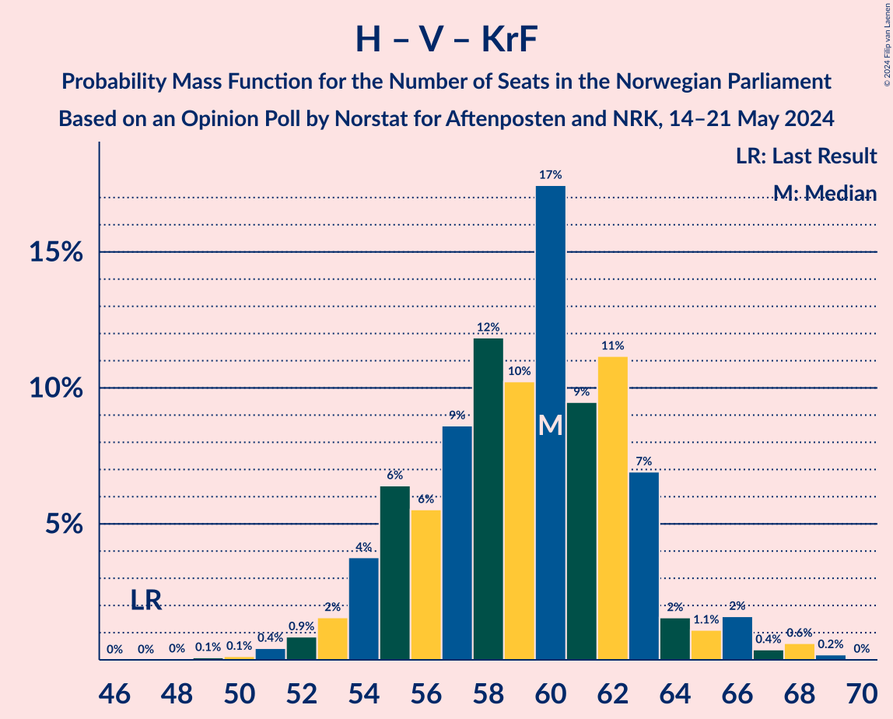

| Number of Seats | Probability | Accumulated | Special Marks |
|:---------------:|:-----------:|:-----------:|:-------------:|
| 47 | 0% | 100% | Last Result |
| 48 | 0% | 100% |  |
| 49 | 0.1% | 100% |  |
| 50 | 0.1% | 99.9% |  |
| 51 | 0.4% | 99.7% |  |
| 52 | 0.9% | 99.3% |  |
| 53 | 2% | 98% |  |
| 54 | 4% | 97% |  |
| 55 | 6% | 93% |  |
| 56 | 6% | 87% |  |
| 57 | 9% | 81% |  |
| 58 | 12% | 73% |  |
| 59 | 10% | 61% |  |
| 60 | 17% | 50% | Median |
| 61 | 9% | 33% |  |
| 62 | 11% | 24% |  |
| 63 | 7% | 12% |  |
| 64 | 2% | 5% |  |
| 65 | 1.1% | 4% |  |
| 66 | 2% | 3% |  |
| 67 | 0.4% | 1.2% |  |
| 68 | 0.6% | 0.8% |  |
| 69 | 0.2% | 0.2% |  |
| 70 | 0% | 0% |  |

### Arbeiderpartiet – Senterpartiet – Kristelig Folkeparti – Miljøpartiet De Grønne

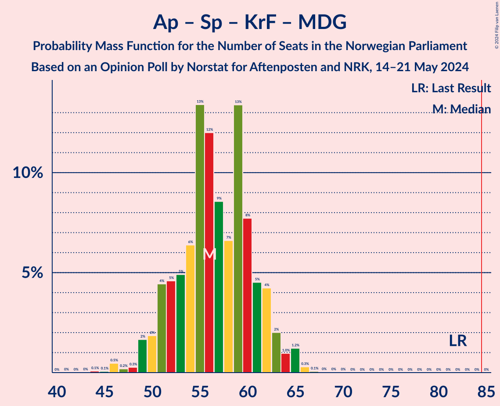

| Number of Seats | Probability | Accumulated | Special Marks |
|:---------------:|:-----------:|:-----------:|:-------------:|
| 43 | 0% | 100% |  |
| 44 | 0.1% | 99.9% |  |
| 45 | 0.1% | 99.9% |  |
| 46 | 0.5% | 99.8% |  |
| 47 | 0.2% | 99.3% |  |
| 48 | 0.3% | 99.1% |  |
| 49 | 2% | 98.9% |  |
| 50 | 2% | 97% |  |
| 51 | 4% | 95% |  |
| 52 | 5% | 91% |  |
| 53 | 5% | 86% |  |
| 54 | 6% | 81% |  |
| 55 | 13% | 75% |  |
| 56 | 12% | 62% | Median |
| 57 | 9% | 50% |  |
| 58 | 7% | 41% |  |
| 59 | 13% | 34% |  |
| 60 | 8% | 21% |  |
| 61 | 5% | 13% |  |
| 62 | 4% | 9% |  |
| 63 | 2% | 5% |  |
| 64 | 1.0% | 3% |  |
| 65 | 1.2% | 2% |  |
| 66 | 0.3% | 0.4% |  |
| 67 | 0.1% | 0.1% |  |
| 68 | 0% | 0.1% |  |
| 69 | 0% | 0% |  |
| 70 | 0% | 0% |  |
| 71 | 0% | 0% |  |
| 72 | 0% | 0% |  |
| 73 | 0% | 0% |  |
| 74 | 0% | 0% |  |
| 75 | 0% | 0% |  |
| 76 | 0% | 0% |  |
| 77 | 0% | 0% |  |
| 78 | 0% | 0% |  |
| 79 | 0% | 0% |  |
| 80 | 0% | 0% |  |
| 81 | 0% | 0% |  |
| 82 | 0% | 0% | Last Result |

### Arbeiderpartiet – Senterpartiet – Kristelig Folkeparti

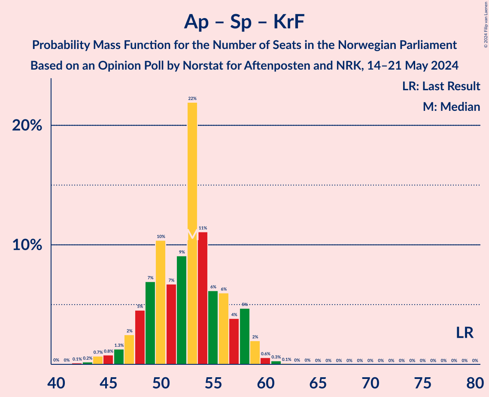

| Number of Seats | Probability | Accumulated | Special Marks |
|:---------------:|:-----------:|:-----------:|:-------------:|
| 40 | 0% | 100% |  |
| 41 | 0% | 99.9% |  |
| 42 | 0.1% | 99.9% |  |
| 43 | 0.2% | 99.8% |  |
| 44 | 0.7% | 99.6% |  |
| 45 | 0.8% | 98.9% |  |
| 46 | 1.3% | 98% |  |
| 47 | 2% | 97% |  |
| 48 | 5% | 94% |  |
| 49 | 7% | 90% |  |
| 50 | 10% | 83% |  |
| 51 | 7% | 72% |  |
| 52 | 9% | 66% |  |
| 53 | 22% | 57% | Median |
| 54 | 11% | 35% |  |
| 55 | 6% | 24% |  |
| 56 | 6% | 18% |  |
| 57 | 4% | 12% |  |
| 58 | 5% | 8% |  |
| 59 | 2% | 3% |  |
| 60 | 0.6% | 1.0% |  |
| 61 | 0.3% | 0.5% |  |
| 62 | 0.1% | 0.2% |  |
| 63 | 0% | 0.1% |  |
| 64 | 0% | 0% |  |
| 65 | 0% | 0% |  |
| 66 | 0% | 0% |  |
| 67 | 0% | 0% |  |
| 68 | 0% | 0% |  |
| 69 | 0% | 0% |  |
| 70 | 0% | 0% |  |
| 71 | 0% | 0% |  |
| 72 | 0% | 0% |  |
| 73 | 0% | 0% |  |
| 74 | 0% | 0% |  |
| 75 | 0% | 0% |  |
| 76 | 0% | 0% |  |
| 77 | 0% | 0% |  |
| 78 | 0% | 0% |  |
| 79 | 0% | 0% | Last Result |

### Arbeiderpartiet – Sosialistisk Venstreparti

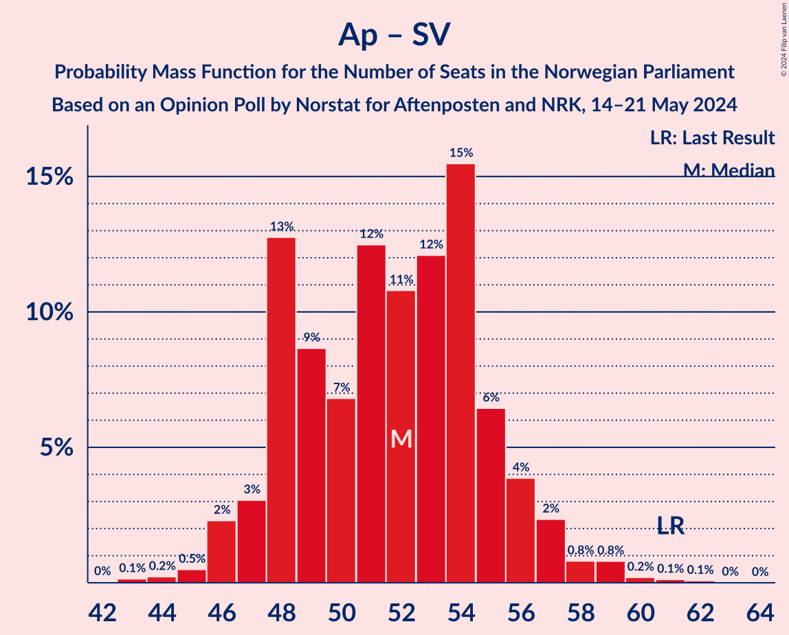

| Number of Seats | Probability | Accumulated | Special Marks |
|:---------------:|:-----------:|:-----------:|:-------------:|
| 43 | 0.1% | 100% |  |
| 44 | 0.2% | 99.8% |  |
| 45 | 0.5% | 99.6% |  |
| 46 | 2% | 99.1% |  |
| 47 | 3% | 97% |  |
| 48 | 13% | 94% |  |
| 49 | 9% | 81% |  |
| 50 | 7% | 72% |  |
| 51 | 12% | 66% |  |
| 52 | 11% | 53% | Median |
| 53 | 12% | 42% |  |
| 54 | 15% | 30% |  |
| 55 | 6% | 15% |  |
| 56 | 4% | 8% |  |
| 57 | 2% | 4% |  |
| 58 | 0.8% | 2% |  |
| 59 | 0.8% | 1.2% |  |
| 60 | 0.2% | 0.4% |  |
| 61 | 0.1% | 0.2% | Last Result |
| 62 | 0.1% | 0.1% |  |
| 63 | 0% | 0% |  |

### Arbeiderpartiet – Senterpartiet

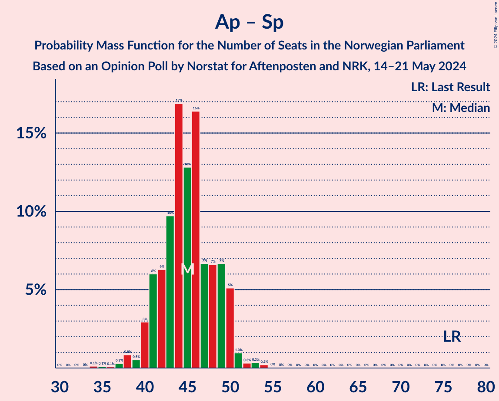

| Number of Seats | Probability | Accumulated | Special Marks |
|:---------------:|:-----------:|:-----------:|:-------------:|
| 34 | 0.1% | 100% |  |
| 35 | 0.1% | 99.9% |  |
| 36 | 0.1% | 99.8% |  |
| 37 | 0.3% | 99.7% |  |
| 38 | 0.8% | 99.4% |  |
| 39 | 0.5% | 98.5% |  |
| 40 | 3% | 98% |  |
| 41 | 6% | 95% |  |
| 42 | 6% | 89% |  |
| 43 | 10% | 83% |  |
| 44 | 17% | 73% |  |
| 45 | 13% | 56% | Median |
| 46 | 16% | 43% |  |
| 47 | 7% | 27% |  |
| 48 | 7% | 20% |  |
| 49 | 7% | 14% |  |
| 50 | 5% | 7% |  |
| 51 | 1.0% | 2% |  |
| 52 | 0.3% | 0.9% |  |
| 53 | 0.3% | 0.6% |  |
| 54 | 0.2% | 0.3% |  |
| 55 | 0% | 0.1% |  |
| 56 | 0% | 0% |  |
| 57 | 0% | 0% |  |
| 58 | 0% | 0% |  |
| 59 | 0% | 0% |  |
| 60 | 0% | 0% |  |
| 61 | 0% | 0% |  |
| 62 | 0% | 0% |  |
| 63 | 0% | 0% |  |
| 64 | 0% | 0% |  |
| 65 | 0% | 0% |  |
| 66 | 0% | 0% |  |
| 67 | 0% | 0% |  |
| 68 | 0% | 0% |  |
| 69 | 0% | 0% |  |
| 70 | 0% | 0% |  |
| 71 | 0% | 0% |  |
| 72 | 0% | 0% |  |
| 73 | 0% | 0% |  |
| 74 | 0% | 0% |  |
| 75 | 0% | 0% |  |
| 76 | 0% | 0% | Last Result |

### Venstre – Senterpartiet – Kristelig Folkeparti

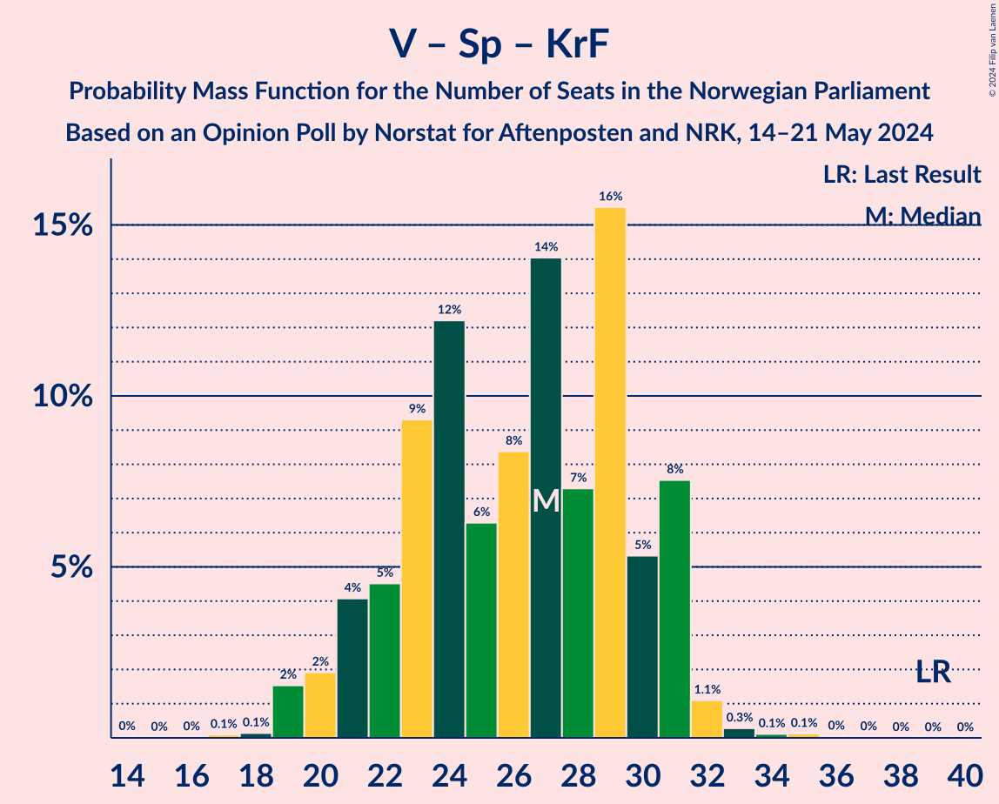

| Number of Seats | Probability | Accumulated | Special Marks |
|:---------------:|:-----------:|:-----------:|:-------------:|
| 15 | 0% | 100% |  |
| 16 | 0% | 99.9% |  |
| 17 | 0.1% | 99.9% |  |
| 18 | 0.1% | 99.8% |  |
| 19 | 2% | 99.7% |  |
| 20 | 2% | 98% |  |
| 21 | 4% | 96% |  |
| 22 | 5% | 92% |  |
| 23 | 9% | 88% |  |
| 24 | 12% | 78% |  |
| 25 | 6% | 66% |  |
| 26 | 8% | 60% |  |
| 27 | 14% | 51% | Median |
| 28 | 7% | 37% |  |
| 29 | 16% | 30% |  |
| 30 | 5% | 15% |  |
| 31 | 8% | 9% |  |
| 32 | 1.1% | 2% |  |
| 33 | 0.3% | 0.6% |  |
| 34 | 0.1% | 0.3% |  |
| 35 | 0.1% | 0.2% |  |
| 36 | 0% | 0.1% |  |
| 37 | 0% | 0% |  |
| 38 | 0% | 0% |  |
| 39 | 0% | 0% | Last Result |

## Technical Information

### Opinion Poll

+ **Polling firm:** Norstat
+ **Commissioner(s):** Aftenposten and NRK
+ **Fieldwork period:** 14–21 May 2024

### Calculations

+ **Sample size:** 992
+ **Simulations done:** 1,048,576
+ **Error estimate:** 1.78%

