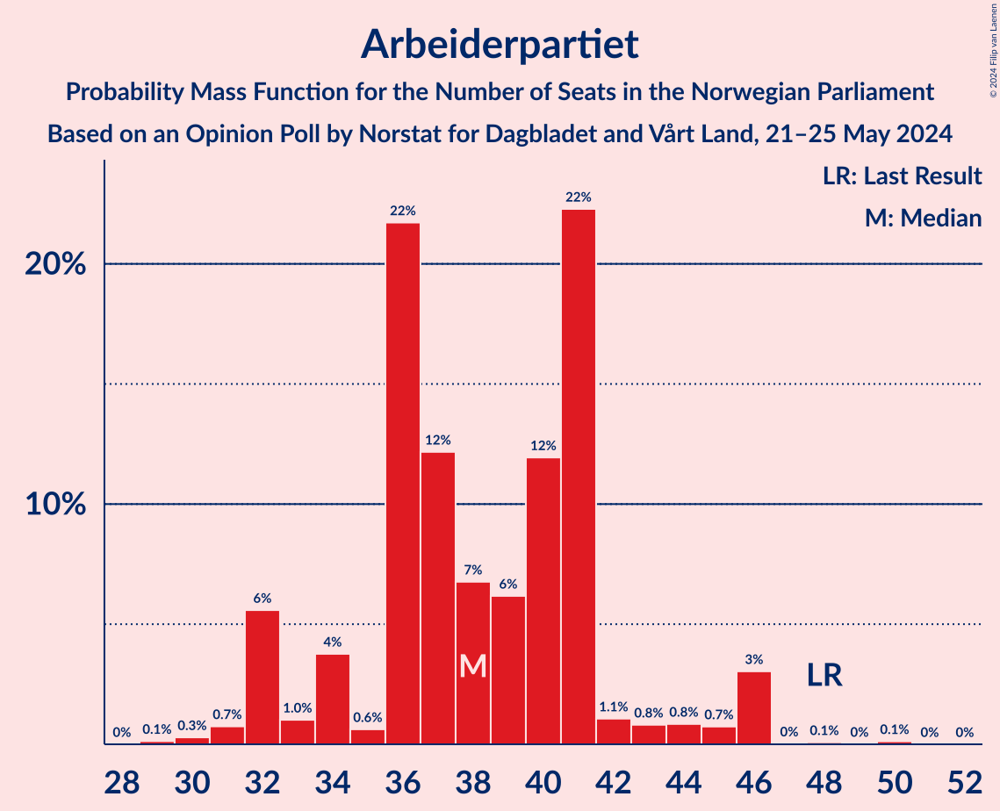
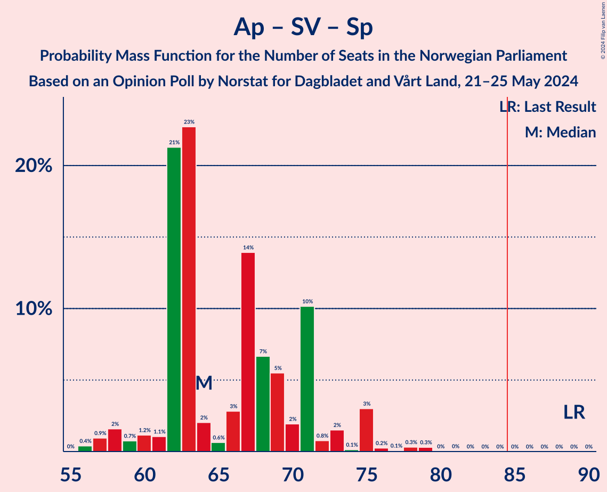

# Opinion Poll by Norstat for Dagbladet and Vårt Land, 21–25 May 2024

<a href="#voting-intentions">Voting Intentions</a> | <a href="#seats">Seats</a> | <a href="#coalitions">Coalitions</a> | <a href="#technical-information">Technical Information</a>

## Voting Intentions

### Confidence Intervals

| Party | Last Result | Poll Result | 80% Confidence Interval | 90% Confidence Interval | 95% Confidence Interval | 99% Confidence Interval |
|:-----:|:-----------:|:-----------:|:-----------------------:|:-----------------------:|:-----------------------:|:-----------------------:|
| Høyre | 20.4% | 23.4% | 21.3–25.8% |20.7–26.4% |20.2–27.0% |19.2–28.2% |
| Arbeiderpartiet | 26.2% | 20.2% | 18.2–22.5% |17.7–23.1% |17.2–23.7% |16.3–24.8% |
| Fremskrittspartiet | 11.6% | 17.2% | 15.3–19.3% |14.8–19.9% |14.4–20.5% |13.5–21.5% |
| Sosialistisk Venstreparti | 7.6% | 9.6% | 8.2–11.3% |7.8–11.8% |7.5–12.3% |6.9–13.1% |
| Senterpartiet | 13.5% | 6.6% | 5.4–8.1% |5.1–8.5% |4.8–8.9% |4.3–9.6% |
| Venstre | 4.6% | 6.4% | 5.3–7.9% |5.0–8.3% |4.7–8.7% |4.2–9.4% |
| Kristelig Folkeparti | 3.8% | 4.2% | 3.3–5.5% |3.1–5.8% |2.9–6.2% |2.5–6.8% |
| Rødt | 4.7% | 3.9% | 3.0–5.1% |2.8–5.4% |2.6–5.8% |2.2–6.4% |
| Miljøpartiet De Grønne | 3.9% | 3.4% | 2.6–4.5% |2.4–4.9% |2.2–5.2% |1.9–5.8% |
| Norgesdemokratene | 1.1% | 1.2% | 0.8–2.0% |0.7–2.2% |0.6–2.4% |0.4–2.9% |
| Industri- og Næringspartiet | 0.3% | 1.0% | 0.7–1.8% |0.5–2.0% |0.5–2.2% |0.3–2.6% |
| Pensjonistpartiet | 0.6% | 0.7% | 0.4–1.3% |0.3–1.5% |0.3–1.7% |0.2–2.1% |
| Konservativt | 0.4% | 0.3% | 0.2–0.9% |0.1–1.1% |0.1–1.2% |0.0–1.6% |

*Note:* The poll result column reflects the actual value used in the calculations. Published results may vary slightly, and in addition be rounded to fewer digits.

## Seats

### Confidence Intervals

| Party | Last Result | Median | 80% Confidence Interval | 90% Confidence Interval | 95% Confidence Interval | 99% Confidence Interval |
|:-----:|:-----------:|:------:|:-----------------------:|:-----------------------:|:-----------------------:|:-----------------------:|
| <a href="#høyre">Høyre</a> | 36 | 43 | 39–49 |38–51 |36–51 |34–53 |
| <a href="#arbeiderpartiet">Arbeiderpartiet</a> | 48 | 38 | 34–41 |32–43 |32–46 |31–46 |
| <a href="#fremskrittspartiet">Fremskrittspartiet</a> | 21 | 33 | 28–40 |26–40 |26–40 |24–43 |
| <a href="#sosialistisk-venstreparti">Sosialistisk Venstreparti</a> | 13 | 16 | 13–20 |13–21 |13–22 |12–24 |
| <a href="#senterpartiet">Senterpartiet</a> | 28 | 11 | 8–14 |8–16 |8–16 |7–17 |
| <a href="#venstre">Venstre</a> | 8 | 12 | 8–14 |8–15 |8–16 |3–17 |
| <a href="#kristelig-folkeparti">Kristelig Folkeparti</a> | 3 | 7 | 2–10 |2–10 |2–10 |2–12 |
| <a href="#rødt">Rødt</a> | 8 | 1 | 1–9 |1–10 |1–10 |1–11 |
| <a href="#miljøpartiet-de-grønne">Miljøpartiet De Grønne</a> | 3 | 3 | 1–7 |1–8 |1–9 |1–10 |
| <a href="#norgesdemokratene">Norgesdemokratene</a> | 0 | 0 | 0 |0 |0 |0 |
| <a href="#industri--og-næringspartiet">Industri- og Næringspartiet</a> | 0 | 0 | 0 |0 |0 |0–1 |
| <a href="#pensjonistpartiet">Pensjonistpartiet</a> | 0 | 0 | 0 |0 |0 |0 |
| <a href="#konservativt">Konservativt</a> | 0 | 0 | 0 |0 |0 |0 |

### Høyre

*For a full overview of the results for this party, see the [Høyre](party-høyre.html) page.*

| Number of Seats | Probability | Accumulated | Special Marks |
|:---------------:|:-----------:|:-----------:|:-------------:|
| 31 | 0.1% | 100% |  |
| 32 | 0.2% | 99.9% |  |
| 33 | 0.1% | 99.7% |  |
| 34 | 0.2% | 99.6% |  |
| 35 | 0.1% | 99.4% |  |
| 36 | 2% | 99.3% | Last Result |
| 37 | 2% | 97% |  |
| 38 | 2% | 96% |  |
| 39 | 13% | 94% |  |
| 40 | 5% | 81% |  |
| 41 | 3% | 76% |  |
| 42 | 5% | 73% |  |
| 43 | 24% | 68% | Median |
| 44 | 4% | 44% |  |
| 45 | 3% | 40% |  |
| 46 | 17% | 37% |  |
| 47 | 8% | 20% |  |
| 48 | 1.3% | 12% |  |
| 49 | 4% | 11% |  |
| 50 | 0.6% | 6% |  |
| 51 | 5% | 6% |  |
| 52 | 0.1% | 1.0% |  |
| 53 | 0.8% | 0.9% |  |
| 54 | 0% | 0.1% |  |
| 55 | 0.1% | 0.1% |  |
| 56 | 0% | 0% |  |

### Arbeiderpartiet

*For a full overview of the results for this party, see the [Arbeiderpartiet](party-arbeiderpartiet.html) page.*

| Number of Seats | Probability | Accumulated | Special Marks |
|:---------------:|:-----------:|:-----------:|:-------------:|
| 29 | 0.1% | 100% |  |
| 30 | 0.3% | 99.9% |  |
| 31 | 0.7% | 99.6% |  |
| 32 | 6% | 98.8% |  |
| 33 | 1.0% | 93% |  |
| 34 | 4% | 92% |  |
| 35 | 0.6% | 88% |  |
| 36 | 22% | 88% |  |
| 37 | 12% | 66% |  |
| 38 | 7% | 54% | Median |
| 39 | 6% | 47% |  |
| 40 | 12% | 41% |  |
| 41 | 22% | 29% |  |
| 42 | 1.1% | 7% |  |
| 43 | 0.8% | 6% |  |
| 44 | 0.8% | 5% |  |
| 45 | 0.7% | 4% |  |
| 46 | 3% | 3% |  |
| 47 | 0% | 0.2% |  |
| 48 | 0.1% | 0.2% | Last Result |
| 49 | 0% | 0.1% |  |
| 50 | 0.1% | 0.1% |  |
| 51 | 0% | 0% |  |

### Fremskrittspartiet

*For a full overview of the results for this party, see the [Fremskrittspartiet](party-fremskrittspartiet.html) page.*

| Number of Seats | Probability | Accumulated | Special Marks |
|:---------------:|:-----------:|:-----------:|:-------------:|
| 21 | 0% | 100% | Last Result |
| 22 | 0.1% | 100% |  |
| 23 | 0.2% | 99.9% |  |
| 24 | 0.3% | 99.7% |  |
| 25 | 0.1% | 99.3% |  |
| 26 | 6% | 99.2% |  |
| 27 | 1.1% | 93% |  |
| 28 | 6% | 92% |  |
| 29 | 7% | 86% |  |
| 30 | 2% | 79% |  |
| 31 | 3% | 78% |  |
| 32 | 20% | 74% |  |
| 33 | 4% | 54% | Median |
| 34 | 5% | 50% |  |
| 35 | 5% | 45% |  |
| 36 | 7% | 40% |  |
| 37 | 2% | 33% |  |
| 38 | 7% | 31% |  |
| 39 | 2% | 24% |  |
| 40 | 20% | 22% |  |
| 41 | 0.2% | 1.4% |  |
| 42 | 0% | 1.2% |  |
| 43 | 1.0% | 1.2% |  |
| 44 | 0.2% | 0.2% |  |
| 45 | 0% | 0% |  |

### Sosialistisk Venstreparti

*For a full overview of the results for this party, see the [Sosialistisk Venstreparti](party-sosialistiskvenstreparti.html) page.*

| Number of Seats | Probability | Accumulated | Special Marks |
|:---------------:|:-----------:|:-----------:|:-------------:|
| 11 | 0.3% | 100% |  |
| 12 | 1.0% | 99.7% |  |
| 13 | 21% | 98.7% | Last Result |
| 14 | 3% | 77% |  |
| 15 | 6% | 74% |  |
| 16 | 27% | 68% | Median |
| 17 | 14% | 41% |  |
| 18 | 6% | 27% |  |
| 19 | 8% | 21% |  |
| 20 | 4% | 13% |  |
| 21 | 6% | 10% |  |
| 22 | 3% | 4% |  |
| 23 | 0.1% | 0.9% |  |
| 24 | 0.7% | 0.7% |  |
| 25 | 0% | 0% |  |

### Senterpartiet

*For a full overview of the results for this party, see the [Senterpartiet](party-senterpartiet.html) page.*

| Number of Seats | Probability | Accumulated | Special Marks |
|:---------------:|:-----------:|:-----------:|:-------------:|
| 0 | 0.1% | 100% |  |
| 1 | 0.1% | 99.9% |  |
| 2 | 0.1% | 99.8% |  |
| 3 | 0% | 99.7% |  |
| 4 | 0% | 99.7% |  |
| 5 | 0% | 99.7% |  |
| 6 | 0% | 99.7% |  |
| 7 | 0.8% | 99.7% |  |
| 8 | 21% | 98.9% |  |
| 9 | 6% | 78% |  |
| 10 | 8% | 72% |  |
| 11 | 26% | 64% | Median |
| 12 | 15% | 38% |  |
| 13 | 11% | 23% |  |
| 14 | 6% | 13% |  |
| 15 | 1.0% | 6% |  |
| 16 | 5% | 5% |  |
| 17 | 0.4% | 0.5% |  |
| 18 | 0.1% | 0.1% |  |
| 19 | 0% | 0% |  |
| 20 | 0% | 0% |  |
| 21 | 0% | 0% |  |
| 22 | 0% | 0% |  |
| 23 | 0% | 0% |  |
| 24 | 0% | 0% |  |
| 25 | 0% | 0% |  |
| 26 | 0% | 0% |  |
| 27 | 0% | 0% |  |
| 28 | 0% | 0% | Last Result |

### Venstre

*For a full overview of the results for this party, see the [Venstre](party-venstre.html) page.*

| Number of Seats | Probability | Accumulated | Special Marks |
|:---------------:|:-----------:|:-----------:|:-------------:|
| 3 | 0.8% | 100% |  |
| 4 | 0% | 99.2% |  |
| 5 | 0% | 99.2% |  |
| 6 | 0% | 99.2% |  |
| 7 | 1.4% | 99.2% |  |
| 8 | 8% | 98% | Last Result |
| 9 | 6% | 90% |  |
| 10 | 9% | 84% |  |
| 11 | 10% | 75% |  |
| 12 | 24% | 65% | Median |
| 13 | 29% | 40% |  |
| 14 | 7% | 12% |  |
| 15 | 3% | 5% |  |
| 16 | 1.1% | 3% |  |
| 17 | 1.4% | 1.5% |  |
| 18 | 0.1% | 0.1% |  |
| 19 | 0% | 0% |  |

### Kristelig Folkeparti

*For a full overview of the results for this party, see the [Kristelig Folkeparti](party-kristeligfolkeparti.html) page.*

| Number of Seats | Probability | Accumulated | Special Marks |
|:---------------:|:-----------:|:-----------:|:-------------:|
| 0 | 0.3% | 100% |  |
| 1 | 0.2% | 99.7% |  |
| 2 | 20% | 99.5% |  |
| 3 | 11% | 80% | Last Result |
| 4 | 0% | 69% |  |
| 5 | 0% | 69% |  |
| 6 | 0% | 69% |  |
| 7 | 31% | 69% | Median |
| 8 | 10% | 38% |  |
| 9 | 5% | 28% |  |
| 10 | 22% | 23% |  |
| 11 | 0.7% | 1.4% |  |
| 12 | 0.5% | 0.7% |  |
| 13 | 0% | 0.2% |  |
| 14 | 0.1% | 0.1% |  |
| 15 | 0% | 0% |  |

### Rødt

*For a full overview of the results for this party, see the [Rødt](party-rødt.html) page.*

| Number of Seats | Probability | Accumulated | Special Marks |
|:---------------:|:-----------:|:-----------:|:-------------:|
| 0 | 0.2% | 100% |  |
| 1 | 69% | 99.8% | Median |
| 2 | 0% | 31% |  |
| 3 | 0% | 31% |  |
| 4 | 0% | 31% |  |
| 5 | 0% | 31% |  |
| 6 | 0.2% | 31% |  |
| 7 | 9% | 31% |  |
| 8 | 7% | 22% | Last Result |
| 9 | 9% | 15% |  |
| 10 | 5% | 6% |  |
| 11 | 0.3% | 0.6% |  |
| 12 | 0.3% | 0.4% |  |
| 13 | 0.1% | 0.1% |  |
| 14 | 0% | 0% |  |

### Miljøpartiet De Grønne

*For a full overview of the results for this party, see the [Miljøpartiet De Grønne](party-miljøpartietdegrønne.html) page.*

| Number of Seats | Probability | Accumulated | Special Marks |
|:---------------:|:-----------:|:-----------:|:-------------:|
| 0 | 0.2% | 100% |  |
| 1 | 13% | 99.8% |  |
| 2 | 24% | 87% |  |
| 3 | 44% | 63% | Last Result, Median |
| 4 | 0% | 19% |  |
| 5 | 0% | 19% |  |
| 6 | 1.4% | 19% |  |
| 7 | 9% | 17% |  |
| 8 | 4% | 9% |  |
| 9 | 3% | 5% |  |
| 10 | 2% | 2% |  |
| 11 | 0.1% | 0.2% |  |
| 12 | 0.1% | 0.1% |  |
| 13 | 0% | 0% |  |

### Norgesdemokratene

*For a full overview of the results for this party, see the [Norgesdemokratene](party-norgesdemokratene.html) page.*

| Number of Seats | Probability | Accumulated | Special Marks |
|:---------------:|:-----------:|:-----------:|:-------------:|
| 0 | 100% | 100% | Last Result, Median |

### Industri- og Næringspartiet

*For a full overview of the results for this party, see the [Industri- og Næringspartiet](party-industri-ognæringspartiet.html) page.*

| Number of Seats | Probability | Accumulated | Special Marks |
|:---------------:|:-----------:|:-----------:|:-------------:|
| 0 | 99.4% | 100% | Last Result, Median |
| 1 | 0.2% | 0.6% |  |
| 2 | 0.4% | 0.4% |  |
| 3 | 0% | 0% |  |

### Pensjonistpartiet

*For a full overview of the results for this party, see the [Pensjonistpartiet](party-pensjonistpartiet.html) page.*

| Number of Seats | Probability | Accumulated | Special Marks |
|:---------------:|:-----------:|:-----------:|:-------------:|
| 0 | 99.9% | 100% | Last Result, Median |
| 1 | 0.1% | 0.1% |  |
| 2 | 0% | 0% |  |

### Konservativt

*For a full overview of the results for this party, see the [Konservativt](party-konservativt.html) page.*

| Number of Seats | Probability | Accumulated | Special Marks |
|:---------------:|:-----------:|:-----------:|:-------------:|
| 0 | 100% | 100% | Last Result, Median |

## Coalitions

### Confidence Intervals

| Coalition | Last Result | Median | Majority? | 80% Confidence Interval | 90% Confidence Interval | 95% Confidence Interval | 99% Confidence Interval |
|:---------:|:-----------:|:------:|:---------:|:-----------------------:|:-----------------------:|:-----------------------:|:-----------------------:|
| Høyre – Fremskrittspartiet – Senterpartiet – Venstre – Kristelig Folkeparti | 96 | 109 | 100% | 97–112 | 93–113 | 93–117 | 92–119 |
| Høyre – Fremskrittspartiet – Venstre – Kristelig Folkeparti – Miljøpartiet De Grønne | 71 | 100 | 99.4% | 90–105 | 90–105 | 88–106 | 83–109 |
| Høyre – Fremskrittspartiet – Venstre – Kristelig Folkeparti | 68 | 97 | 92% | 85–102 | 83–102 | 83–103 | 81–108 |
| Høyre – Fremskrittspartiet – Venstre | 65 | 91 | 77% | 79–95 | 76–95 | 76–99 | 75–100 |
| Høyre – Fremskrittspartiet | 57 | 78 | 7% | 68–83 | 67–85 | 67–85 | 63–87 |
| Arbeiderpartiet – Sosialistisk Venstreparti – Senterpartiet – Kristelig Folkeparti – Miljøpartiet De Grønne | 95 | 76 | 7% | 72–83 | 67–85 | 66–85 | 66–89 |
| Arbeiderpartiet – Sosialistisk Venstreparti – Senterpartiet – Rødt – Miljøpartiet De Grønne | 100 | 71 | 7% | 66–83 | 66–85 | 65–85 | 60–88 |
| Arbeiderpartiet – Sosialistisk Venstreparti – Senterpartiet – Rødt | 97 | 68 | 0.5% | 63–78 | 63–78 | 62–80 | 59–84 |
| Arbeiderpartiet – Sosialistisk Venstreparti – Senterpartiet – Miljøpartiet De Grønne | 92 | 68 | 0% | 65–77 | 64–78 | 62–78 | 59–81 |
| Arbeiderpartiet – Sosialistisk Venstreparti – Senterpartiet | 89 | 64 | 0% | 62–71 | 61–73 | 58–75 | 57–78 |
| Arbeiderpartiet – Sosialistisk Venstreparti – Rødt – Miljøpartiet De Grønne | 72 | 59 | 0% | 56–71 | 55–75 | 51–75 | 49–76 |
| Høyre – Venstre – Kristelig Folkeparti | 47 | 62 | 0% | 54–69 | 53–69 | 52–72 | 48–72 |
| Arbeiderpartiet – Senterpartiet – Kristelig Folkeparti – Miljøpartiet De Grønne | 82 | 59 | 0% | 54–64 | 52–66 | 50–68 | 50–73 |
| Arbeiderpartiet – Senterpartiet – Kristelig Folkeparti | 79 | 56 | 0% | 51–60 | 49–62 | 48–62 | 45–66 |
| Arbeiderpartiet – Sosialistisk Venstreparti | 61 | 54 | 0% | 51–61 | 49–62 | 47–62 | 45–66 |
| Arbeiderpartiet – Senterpartiet | 76 | 49 | 0% | 46–52 | 44–55 | 43–58 | 41–59 |
| Senterpartiet – Venstre – Kristelig Folkeparti | 39 | 28 | 0% | 24–34 | 24–35 | 23–37 | 21–40 |

### Høyre – Fremskrittspartiet – Senterpartiet – Venstre – Kristelig Folkeparti

| Number of Seats | Probability | Accumulated | Special Marks |
|:---------------:|:-----------:|:-----------:|:-------------:|
| 91 | 0% | 100% |  |
| 92 | 0.8% | 99.9% |  |
| 93 | 5% | 99.2% |  |
| 94 | 0.6% | 94% |  |
| 95 | 2% | 94% |  |
| 96 | 0.3% | 91% | Last Result |
| 97 | 2% | 91% |  |
| 98 | 4% | 90% |  |
| 99 | 0.9% | 85% |  |
| 100 | 1.0% | 84% |  |
| 101 | 0.7% | 83% |  |
| 102 | 6% | 82% |  |
| 103 | 1.0% | 77% |  |
| 104 | 7% | 76% |  |
| 105 | 3% | 69% |  |
| 106 | 4% | 66% | Median |
| 107 | 1.2% | 61% |  |
| 108 | 3% | 60% |  |
| 109 | 12% | 57% |  |
| 110 | 21% | 45% |  |
| 111 | 2% | 24% |  |
| 112 | 16% | 22% |  |
| 113 | 1.2% | 6% |  |
| 114 | 2% | 5% |  |
| 115 | 0% | 3% |  |
| 116 | 0.1% | 3% |  |
| 117 | 1.2% | 3% |  |
| 118 | 0.2% | 2% |  |
| 119 | 2% | 2% |  |
| 120 | 0% | 0% |  |

### Høyre – Fremskrittspartiet – Venstre – Kristelig Folkeparti – Miljøpartiet De Grønne

| Number of Seats | Probability | Accumulated | Special Marks |
|:---------------:|:-----------:|:-----------:|:-------------:|
| 71 | 0% | 100% | Last Result |
| 72 | 0% | 100% |  |
| 73 | 0% | 100% |  |
| 74 | 0% | 100% |  |
| 75 | 0% | 100% |  |
| 76 | 0% | 100% |  |
| 77 | 0% | 100% |  |
| 78 | 0% | 100% |  |
| 79 | 0% | 100% |  |
| 80 | 0% | 100% |  |
| 81 | 0.1% | 100% |  |
| 82 | 0.4% | 99.9% |  |
| 83 | 0.1% | 99.6% |  |
| 84 | 0% | 99.4% |  |
| 85 | 0% | 99.4% | Majority |
| 86 | 0.8% | 99.4% |  |
| 87 | 1.0% | 98.6% |  |
| 88 | 0.7% | 98% |  |
| 89 | 2% | 97% |  |
| 90 | 9% | 95% |  |
| 91 | 4% | 86% |  |
| 92 | 2% | 82% |  |
| 93 | 3% | 80% |  |
| 94 | 2% | 77% |  |
| 95 | 2% | 75% |  |
| 96 | 4% | 73% |  |
| 97 | 4% | 69% |  |
| 98 | 3% | 65% | Median |
| 99 | 6% | 62% |  |
| 100 | 11% | 56% |  |
| 101 | 2% | 45% |  |
| 102 | 0.6% | 43% |  |
| 103 | 2% | 43% |  |
| 104 | 17% | 40% |  |
| 105 | 20% | 23% |  |
| 106 | 0.4% | 3% |  |
| 107 | 0.2% | 2% |  |
| 108 | 0.4% | 2% |  |
| 109 | 1.5% | 2% |  |
| 110 | 0.1% | 0.3% |  |
| 111 | 0.2% | 0.2% |  |
| 112 | 0% | 0% |  |

### Høyre – Fremskrittspartiet – Venstre – Kristelig Folkeparti

| Number of Seats | Probability | Accumulated | Special Marks |
|:---------------:|:-----------:|:-----------:|:-------------:|
| 68 | 0% | 100% | Last Result |
| 69 | 0% | 100% |  |
| 70 | 0% | 100% |  |
| 71 | 0% | 100% |  |
| 72 | 0% | 100% |  |
| 73 | 0% | 100% |  |
| 74 | 0% | 100% |  |
| 75 | 0% | 100% |  |
| 76 | 0% | 100% |  |
| 77 | 0% | 100% |  |
| 78 | 0% | 100% |  |
| 79 | 0.1% | 100% |  |
| 80 | 0.3% | 99.9% |  |
| 81 | 2% | 99.6% |  |
| 82 | 0% | 98% |  |
| 83 | 5% | 98% |  |
| 84 | 1.0% | 93% |  |
| 85 | 3% | 92% | Majority |
| 86 | 0.9% | 89% |  |
| 87 | 2% | 88% |  |
| 88 | 4% | 86% |  |
| 89 | 2% | 81% |  |
| 90 | 3% | 79% |  |
| 91 | 6% | 76% |  |
| 92 | 2% | 70% |  |
| 93 | 1.0% | 68% |  |
| 94 | 5% | 67% |  |
| 95 | 0.5% | 63% | Median |
| 96 | 6% | 62% |  |
| 97 | 7% | 56% |  |
| 98 | 7% | 49% |  |
| 99 | 0.5% | 43% |  |
| 100 | 1.3% | 42% |  |
| 101 | 17% | 41% |  |
| 102 | 21% | 24% |  |
| 103 | 1.2% | 3% |  |
| 104 | 0.1% | 2% |  |
| 105 | 0% | 2% |  |
| 106 | 0.2% | 2% |  |
| 107 | 0% | 2% |  |
| 108 | 1.5% | 2% |  |
| 109 | 0.2% | 0.2% |  |
| 110 | 0% | 0% |  |

### Høyre – Fremskrittspartiet – Venstre

| Number of Seats | Probability | Accumulated | Special Marks |
|:---------------:|:-----------:|:-----------:|:-------------:|
| 65 | 0% | 100% | Last Result |
| 66 | 0% | 100% |  |
| 67 | 0% | 100% |  |
| 68 | 0% | 100% |  |
| 69 | 0% | 100% |  |
| 70 | 0% | 100% |  |
| 71 | 0% | 100% |  |
| 72 | 0.1% | 100% |  |
| 73 | 0.2% | 99.8% |  |
| 74 | 0% | 99.6% |  |
| 75 | 2% | 99.6% |  |
| 76 | 5% | 98% |  |
| 77 | 1.2% | 93% |  |
| 78 | 1.2% | 92% |  |
| 79 | 1.5% | 91% |  |
| 80 | 0.7% | 89% |  |
| 81 | 0.5% | 88% |  |
| 82 | 5% | 88% |  |
| 83 | 1.1% | 83% |  |
| 84 | 5% | 82% |  |
| 85 | 0.9% | 77% | Majority |
| 86 | 5% | 76% |  |
| 87 | 1.4% | 70% |  |
| 88 | 2% | 69% | Median |
| 89 | 5% | 67% |  |
| 90 | 5% | 62% |  |
| 91 | 21% | 58% |  |
| 92 | 0.7% | 37% |  |
| 93 | 1.0% | 36% |  |
| 94 | 6% | 35% |  |
| 95 | 25% | 29% |  |
| 96 | 0.5% | 4% |  |
| 97 | 0.1% | 3% |  |
| 98 | 0.2% | 3% |  |
| 99 | 2% | 3% |  |
| 100 | 1.2% | 1.2% |  |
| 101 | 0% | 0.1% |  |
| 102 | 0% | 0% |  |

### Høyre – Fremskrittspartiet

| Number of Seats | Probability | Accumulated | Special Marks |
|:---------------:|:-----------:|:-----------:|:-------------:|
| 57 | 0% | 100% | Last Result |
| 58 | 0% | 100% |  |
| 59 | 0% | 100% |  |
| 60 | 0% | 100% |  |
| 61 | 0% | 100% |  |
| 62 | 0.1% | 100% |  |
| 63 | 0.6% | 99.8% |  |
| 64 | 0.2% | 99.2% |  |
| 65 | 0.1% | 99.0% |  |
| 66 | 0.6% | 98.9% |  |
| 67 | 4% | 98% |  |
| 68 | 5% | 95% |  |
| 69 | 0.8% | 89% |  |
| 70 | 1.1% | 89% |  |
| 71 | 3% | 87% |  |
| 72 | 2% | 84% |  |
| 73 | 1.4% | 83% |  |
| 74 | 2% | 81% |  |
| 75 | 12% | 79% |  |
| 76 | 3% | 68% | Median |
| 77 | 7% | 65% |  |
| 78 | 19% | 58% |  |
| 79 | 2% | 39% |  |
| 80 | 3% | 37% |  |
| 81 | 3% | 34% |  |
| 82 | 0.3% | 31% |  |
| 83 | 21% | 30% |  |
| 84 | 2% | 9% |  |
| 85 | 6% | 7% | Majority |
| 86 | 0.1% | 1.4% |  |
| 87 | 1.2% | 1.3% |  |
| 88 | 0% | 0.1% |  |
| 89 | 0% | 0.1% |  |
| 90 | 0.1% | 0.1% |  |
| 91 | 0% | 0% |  |

### Arbeiderpartiet – Sosialistisk Venstreparti – Senterpartiet – Kristelig Folkeparti – Miljøpartiet De Grønne

| Number of Seats | Probability | Accumulated | Special Marks |
|:---------------:|:-----------:|:-----------:|:-------------:|
| 62 | 0.1% | 100% |  |
| 63 | 0% | 99.9% |  |
| 64 | 0% | 99.9% |  |
| 65 | 0.3% | 99.9% |  |
| 66 | 2% | 99.6% |  |
| 67 | 3% | 97% |  |
| 68 | 2% | 94% |  |
| 69 | 1.0% | 92% |  |
| 70 | 0.2% | 91% |  |
| 71 | 0.9% | 91% |  |
| 72 | 26% | 90% |  |
| 73 | 6% | 64% |  |
| 74 | 2% | 58% |  |
| 75 | 1.0% | 56% | Median |
| 76 | 26% | 55% |  |
| 77 | 5% | 29% |  |
| 78 | 2% | 24% |  |
| 79 | 5% | 22% |  |
| 80 | 2% | 16% |  |
| 81 | 1.2% | 15% |  |
| 82 | 0.8% | 13% |  |
| 83 | 4% | 13% |  |
| 84 | 2% | 8% |  |
| 85 | 5% | 7% | Majority |
| 86 | 0.3% | 1.3% |  |
| 87 | 0.2% | 1.0% |  |
| 88 | 0% | 0.9% |  |
| 89 | 0.5% | 0.8% |  |
| 90 | 0.3% | 0.4% |  |
| 91 | 0% | 0.1% |  |
| 92 | 0.1% | 0.1% |  |
| 93 | 0% | 0% |  |
| 94 | 0% | 0% |  |
| 95 | 0% | 0% | Last Result |

### Arbeiderpartiet – Sosialistisk Venstreparti – Senterpartiet – Rødt – Miljøpartiet De Grønne

| Number of Seats | Probability | Accumulated | Special Marks |
|:---------------:|:-----------:|:-----------:|:-------------:|
| 59 | 0.2% | 100% |  |
| 60 | 1.5% | 99.8% |  |
| 61 | 0% | 98% |  |
| 62 | 0.2% | 98% |  |
| 63 | 0% | 98% |  |
| 64 | 0.1% | 98% |  |
| 65 | 1.2% | 98% |  |
| 66 | 21% | 97% |  |
| 67 | 17% | 76% |  |
| 68 | 1.3% | 59% |  |
| 69 | 0.5% | 58% | Median |
| 70 | 7% | 57% |  |
| 71 | 7% | 51% |  |
| 72 | 7% | 44% |  |
| 73 | 0.5% | 38% |  |
| 74 | 5% | 37% |  |
| 75 | 1.0% | 32% |  |
| 76 | 2% | 31% |  |
| 77 | 3% | 30% |  |
| 78 | 6% | 26% |  |
| 79 | 2% | 20% |  |
| 80 | 4% | 18% |  |
| 81 | 2% | 14% |  |
| 82 | 1.1% | 12% |  |
| 83 | 3% | 11% |  |
| 84 | 0.9% | 8% |  |
| 85 | 5% | 7% | Majority |
| 86 | 0% | 2% |  |
| 87 | 2% | 2% |  |
| 88 | 0.2% | 0.6% |  |
| 89 | 0.3% | 0.4% |  |
| 90 | 0% | 0.1% |  |
| 91 | 0% | 0% |  |
| 92 | 0% | 0% |  |
| 93 | 0% | 0% |  |
| 94 | 0% | 0% |  |
| 95 | 0% | 0% |  |
| 96 | 0% | 0% |  |
| 97 | 0% | 0% |  |
| 98 | 0% | 0% |  |
| 99 | 0% | 0% |  |
| 100 | 0% | 0% | Last Result |

### Arbeiderpartiet – Sosialistisk Venstreparti – Senterpartiet – Rødt

| Number of Seats | Probability | Accumulated | Special Marks |
|:---------------:|:-----------:|:-----------:|:-------------:|
| 57 | 0.2% | 100% |  |
| 58 | 0.1% | 99.8% |  |
| 59 | 1.5% | 99.7% |  |
| 60 | 0.4% | 98% |  |
| 61 | 0.2% | 98% |  |
| 62 | 0.4% | 98% |  |
| 63 | 20% | 97% |  |
| 64 | 17% | 77% |  |
| 65 | 2% | 60% |  |
| 66 | 0.5% | 57% | Median |
| 67 | 2% | 57% |  |
| 68 | 11% | 55% |  |
| 69 | 6% | 44% |  |
| 70 | 4% | 38% |  |
| 71 | 4% | 34% |  |
| 72 | 4% | 31% |  |
| 73 | 2% | 27% |  |
| 74 | 2% | 24% |  |
| 75 | 0.3% | 23% |  |
| 76 | 5% | 22% |  |
| 77 | 4% | 18% |  |
| 78 | 9% | 13% |  |
| 79 | 1.4% | 5% |  |
| 80 | 1.2% | 3% |  |
| 81 | 0.9% | 2% |  |
| 82 | 0.8% | 1.3% |  |
| 83 | 0% | 0.6% |  |
| 84 | 0% | 0.5% |  |
| 85 | 0% | 0.5% | Majority |
| 86 | 0.1% | 0.5% |  |
| 87 | 0.3% | 0.4% |  |
| 88 | 0% | 0% |  |
| 89 | 0% | 0% |  |
| 90 | 0% | 0% |  |
| 91 | 0% | 0% |  |
| 92 | 0% | 0% |  |
| 93 | 0% | 0% |  |
| 94 | 0% | 0% |  |
| 95 | 0% | 0% |  |
| 96 | 0% | 0% |  |
| 97 | 0% | 0% | Last Result |

### Arbeiderpartiet – Sosialistisk Venstreparti – Senterpartiet – Miljøpartiet De Grønne

| Number of Seats | Probability | Accumulated | Special Marks |
|:---------------:|:-----------:|:-----------:|:-------------:|
| 58 | 0.3% | 100% |  |
| 59 | 2% | 99.7% |  |
| 60 | 0.1% | 98% |  |
| 61 | 0.4% | 98% |  |
| 62 | 0.6% | 98% |  |
| 63 | 1.0% | 97% |  |
| 64 | 3% | 96% |  |
| 65 | 22% | 93% |  |
| 66 | 18% | 70% |  |
| 67 | 2% | 52% |  |
| 68 | 3% | 51% | Median |
| 69 | 8% | 47% |  |
| 70 | 7% | 39% |  |
| 71 | 6% | 32% |  |
| 72 | 1.4% | 26% |  |
| 73 | 5% | 25% |  |
| 74 | 2% | 19% |  |
| 75 | 1.4% | 17% |  |
| 76 | 4% | 16% |  |
| 77 | 3% | 11% |  |
| 78 | 7% | 8% |  |
| 79 | 0.2% | 1.4% |  |
| 80 | 0.5% | 1.2% |  |
| 81 | 0.4% | 0.6% |  |
| 82 | 0.1% | 0.2% |  |
| 83 | 0.1% | 0.2% |  |
| 84 | 0.1% | 0.1% |  |
| 85 | 0% | 0% | Majority |
| 86 | 0% | 0% |  |
| 87 | 0% | 0% |  |
| 88 | 0% | 0% |  |
| 89 | 0% | 0% |  |
| 90 | 0% | 0% |  |
| 91 | 0% | 0% |  |
| 92 | 0% | 0% | Last Result |

### Arbeiderpartiet – Sosialistisk Venstreparti – Senterpartiet

| Number of Seats | Probability | Accumulated | Special Marks |
|:---------------:|:-----------:|:-----------:|:-------------:|
| 55 | 0% | 100% |  |
| 56 | 0.4% | 99.9% |  |
| 57 | 0.9% | 99.6% |  |
| 58 | 2% | 98.6% |  |
| 59 | 0.7% | 97% |  |
| 60 | 1.2% | 96% |  |
| 61 | 1.1% | 95% |  |
| 62 | 21% | 94% |  |
| 63 | 23% | 73% |  |
| 64 | 2% | 50% |  |
| 65 | 0.6% | 48% | Median |
| 66 | 3% | 47% |  |
| 67 | 14% | 45% |  |
| 68 | 7% | 31% |  |
| 69 | 5% | 24% |  |
| 70 | 2% | 18% |  |
| 71 | 10% | 17% |  |
| 72 | 0.8% | 6% |  |
| 73 | 2% | 6% |  |
| 74 | 0.1% | 4% |  |
| 75 | 3% | 4% |  |
| 76 | 0.2% | 1.0% |  |
| 77 | 0.1% | 0.7% |  |
| 78 | 0.3% | 0.7% |  |
| 79 | 0.3% | 0.4% |  |
| 80 | 0% | 0.1% |  |
| 81 | 0% | 0% |  |
| 82 | 0% | 0% |  |
| 83 | 0% | 0% |  |
| 84 | 0% | 0% |  |
| 85 | 0% | 0% | Majority |
| 86 | 0% | 0% |  |
| 87 | 0% | 0% |  |
| 88 | 0% | 0% |  |
| 89 | 0% | 0% | Last Result |

### Arbeiderpartiet – Sosialistisk Venstreparti – Rødt – Miljøpartiet De Grønne

| Number of Seats | Probability | Accumulated | Special Marks |
|:---------------:|:-----------:|:-----------:|:-------------:|
| 49 | 2% | 100% |  |
| 50 | 0.2% | 98% |  |
| 51 | 1.2% | 98% |  |
| 52 | 0.1% | 97% |  |
| 53 | 0% | 97% |  |
| 54 | 2% | 97% |  |
| 55 | 1.2% | 95% |  |
| 56 | 16% | 94% |  |
| 57 | 2% | 78% |  |
| 58 | 21% | 76% | Median |
| 59 | 12% | 55% |  |
| 60 | 3% | 43% |  |
| 61 | 1.2% | 40% |  |
| 62 | 4% | 39% |  |
| 63 | 3% | 35% |  |
| 64 | 4% | 31% |  |
| 65 | 3% | 27% |  |
| 66 | 6% | 23% |  |
| 67 | 1.0% | 17% |  |
| 68 | 1.1% | 16% |  |
| 69 | 0.3% | 15% |  |
| 70 | 5% | 15% |  |
| 71 | 1.5% | 10% |  |
| 72 | 0.2% | 9% | Last Result |
| 73 | 2% | 9% |  |
| 74 | 0.7% | 6% |  |
| 75 | 5% | 6% |  |
| 76 | 0.5% | 0.9% |  |
| 77 | 0.3% | 0.3% |  |
| 78 | 0% | 0% |  |

### Høyre – Venstre – Kristelig Folkeparti

| Number of Seats | Probability | Accumulated | Special Marks |
|:---------------:|:-----------:|:-----------:|:-------------:|
| 47 | 0% | 100% | Last Result |
| 48 | 0.8% | 99.9% |  |
| 49 | 0.2% | 99.1% |  |
| 50 | 1.0% | 98.9% |  |
| 51 | 0.1% | 98% |  |
| 52 | 0.5% | 98% |  |
| 53 | 3% | 97% |  |
| 54 | 5% | 94% |  |
| 55 | 9% | 89% |  |
| 56 | 1.3% | 80% |  |
| 57 | 3% | 78% |  |
| 58 | 1.3% | 75% |  |
| 59 | 11% | 74% |  |
| 60 | 4% | 63% |  |
| 61 | 0.9% | 59% |  |
| 62 | 21% | 58% | Median |
| 63 | 4% | 37% |  |
| 64 | 4% | 34% |  |
| 65 | 3% | 30% |  |
| 66 | 2% | 27% |  |
| 67 | 1.1% | 25% |  |
| 68 | 1.1% | 24% |  |
| 69 | 18% | 23% |  |
| 70 | 0.3% | 5% |  |
| 71 | 0.2% | 4% |  |
| 72 | 4% | 4% |  |
| 73 | 0.1% | 0.2% |  |
| 74 | 0.1% | 0.1% |  |
| 75 | 0% | 0% |  |

### Arbeiderpartiet – Senterpartiet – Kristelig Folkeparti – Miljøpartiet De Grønne

| Number of Seats | Probability | Accumulated | Special Marks |
|:---------------:|:-----------:|:-----------:|:-------------:|
| 46 | 0.1% | 100% |  |
| 47 | 0% | 99.9% |  |
| 48 | 0.3% | 99.9% |  |
| 49 | 0.1% | 99.6% |  |
| 50 | 3% | 99.5% |  |
| 51 | 0.2% | 96% |  |
| 52 | 2% | 96% |  |
| 53 | 4% | 94% |  |
| 54 | 3% | 91% |  |
| 55 | 2% | 88% |  |
| 56 | 12% | 86% |  |
| 57 | 3% | 74% |  |
| 58 | 6% | 71% |  |
| 59 | 22% | 65% | Median |
| 60 | 17% | 42% |  |
| 61 | 4% | 25% |  |
| 62 | 3% | 21% |  |
| 63 | 3% | 18% |  |
| 64 | 9% | 16% |  |
| 65 | 0.5% | 6% |  |
| 66 | 3% | 6% |  |
| 67 | 0.3% | 3% |  |
| 68 | 1.2% | 3% |  |
| 69 | 0.2% | 1.4% |  |
| 70 | 0.1% | 1.2% |  |
| 71 | 0.5% | 1.1% |  |
| 72 | 0.1% | 0.6% |  |
| 73 | 0.4% | 0.5% |  |
| 74 | 0.1% | 0.1% |  |
| 75 | 0% | 0.1% |  |
| 76 | 0% | 0% |  |
| 77 | 0% | 0% |  |
| 78 | 0% | 0% |  |
| 79 | 0% | 0% |  |
| 80 | 0% | 0% |  |
| 81 | 0% | 0% |  |
| 82 | 0% | 0% | Last Result |

### Arbeiderpartiet – Senterpartiet – Kristelig Folkeparti

| Number of Seats | Probability | Accumulated | Special Marks |
|:---------------:|:-----------:|:-----------:|:-------------:|
| 43 | 0.1% | 100% |  |
| 44 | 0.3% | 99.9% |  |
| 45 | 0.3% | 99.6% |  |
| 46 | 0.2% | 99.3% |  |
| 47 | 1.1% | 99.1% |  |
| 48 | 0.7% | 98% |  |
| 49 | 4% | 97% |  |
| 50 | 2% | 93% |  |
| 51 | 2% | 92% |  |
| 52 | 6% | 90% |  |
| 53 | 8% | 83% |  |
| 54 | 5% | 76% |  |
| 55 | 4% | 70% |  |
| 56 | 26% | 66% | Median |
| 57 | 23% | 40% |  |
| 58 | 4% | 17% |  |
| 59 | 2% | 13% |  |
| 60 | 2% | 11% |  |
| 61 | 4% | 9% |  |
| 62 | 3% | 5% |  |
| 63 | 0.4% | 2% |  |
| 64 | 0.7% | 2% |  |
| 65 | 0.2% | 0.9% |  |
| 66 | 0.5% | 0.7% |  |
| 67 | 0% | 0.2% |  |
| 68 | 0% | 0.2% |  |
| 69 | 0.1% | 0.2% |  |
| 70 | 0% | 0% |  |
| 71 | 0% | 0% |  |
| 72 | 0% | 0% |  |
| 73 | 0% | 0% |  |
| 74 | 0% | 0% |  |
| 75 | 0% | 0% |  |
| 76 | 0% | 0% |  |
| 77 | 0% | 0% |  |
| 78 | 0% | 0% |  |
| 79 | 0% | 0% | Last Result |

### Arbeiderpartiet – Sosialistisk Venstreparti

| Number of Seats | Probability | Accumulated | Special Marks |
|:---------------:|:-----------:|:-----------:|:-------------:|
| 45 | 1.0% | 100% |  |
| 46 | 0.1% | 98.9% |  |
| 47 | 2% | 98.8% |  |
| 48 | 1.2% | 97% |  |
| 49 | 2% | 95% |  |
| 50 | 0.5% | 94% |  |
| 51 | 5% | 93% |  |
| 52 | 17% | 89% |  |
| 53 | 5% | 72% |  |
| 54 | 29% | 67% | Median |
| 55 | 10% | 38% |  |
| 56 | 6% | 29% |  |
| 57 | 6% | 23% |  |
| 58 | 2% | 16% |  |
| 59 | 3% | 15% |  |
| 60 | 0.8% | 12% |  |
| 61 | 6% | 11% | Last Result |
| 62 | 3% | 5% |  |
| 63 | 0.3% | 2% |  |
| 64 | 0.8% | 2% |  |
| 65 | 0.2% | 0.7% |  |
| 66 | 0.1% | 0.5% |  |
| 67 | 0.3% | 0.4% |  |
| 68 | 0% | 0.1% |  |
| 69 | 0.1% | 0.1% |  |
| 70 | 0% | 0% |  |

### Arbeiderpartiet – Senterpartiet

| Number of Seats | Probability | Accumulated | Special Marks |
|:---------------:|:-----------:|:-----------:|:-------------:|
| 40 | 0.2% | 100% |  |
| 41 | 0.3% | 99.7% |  |
| 42 | 0.9% | 99.5% |  |
| 43 | 2% | 98.6% |  |
| 44 | 2% | 96% |  |
| 45 | 3% | 95% |  |
| 46 | 4% | 92% |  |
| 47 | 21% | 88% |  |
| 48 | 5% | 67% |  |
| 49 | 24% | 62% | Median |
| 50 | 8% | 37% |  |
| 51 | 10% | 29% |  |
| 52 | 10% | 19% |  |
| 53 | 0.9% | 9% |  |
| 54 | 3% | 8% |  |
| 55 | 1.0% | 6% |  |
| 56 | 0.3% | 5% |  |
| 57 | 2% | 4% |  |
| 58 | 0.3% | 3% |  |
| 59 | 2% | 2% |  |
| 60 | 0.2% | 0.2% |  |
| 61 | 0% | 0.1% |  |
| 62 | 0% | 0% |  |
| 63 | 0% | 0% |  |
| 64 | 0% | 0% |  |
| 65 | 0% | 0% |  |
| 66 | 0% | 0% |  |
| 67 | 0% | 0% |  |
| 68 | 0% | 0% |  |
| 69 | 0% | 0% |  |
| 70 | 0% | 0% |  |
| 71 | 0% | 0% |  |
| 72 | 0% | 0% |  |
| 73 | 0% | 0% |  |
| 74 | 0% | 0% |  |
| 75 | 0% | 0% |  |
| 76 | 0% | 0% | Last Result |

### Senterpartiet – Venstre – Kristelig Folkeparti

| Number of Seats | Probability | Accumulated | Special Marks |
|:---------------:|:-----------:|:-----------:|:-------------:|
| 18 | 0.1% | 100% |  |
| 19 | 0.1% | 99.9% |  |
| 20 | 0.2% | 99.8% |  |
| 21 | 0.7% | 99.6% |  |
| 22 | 1.2% | 98.9% |  |
| 23 | 2% | 98% |  |
| 24 | 9% | 96% |  |
| 25 | 7% | 87% |  |
| 26 | 3% | 80% |  |
| 27 | 24% | 77% |  |
| 28 | 6% | 53% |  |
| 29 | 8% | 47% |  |
| 30 | 3% | 39% | Median |
| 31 | 5% | 37% |  |
| 32 | 5% | 32% |  |
| 33 | 2% | 27% |  |
| 34 | 18% | 25% |  |
| 35 | 4% | 7% |  |
| 36 | 0.7% | 3% |  |
| 37 | 0.9% | 3% |  |
| 38 | 0.7% | 2% |  |
| 39 | 0.1% | 0.9% | Last Result |
| 40 | 0.7% | 0.8% |  |
| 41 | 0% | 0.1% |  |
| 42 | 0% | 0.1% |  |
| 43 | 0% | 0% |  |

## Technical Information

### Opinion Poll

+ **Polling firm:** Norstat
+ **Commissioner(s):** Dagbladet and Vårt Land
+ **Fieldwork period:** 21–25 May 2024

### Calculations

+ **Sample size:** 593
+ **Simulations done:** 1,048,576
+ **Error estimate:** 5.55%

